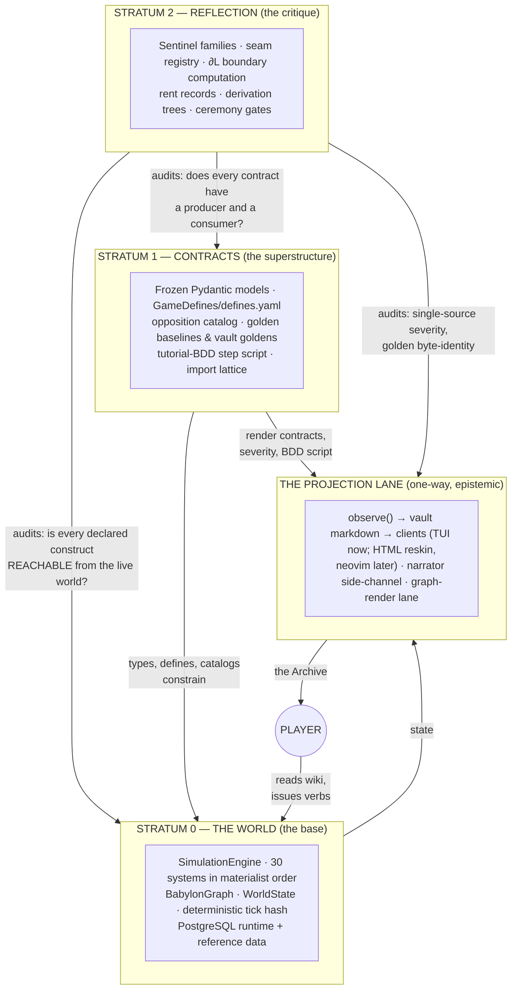
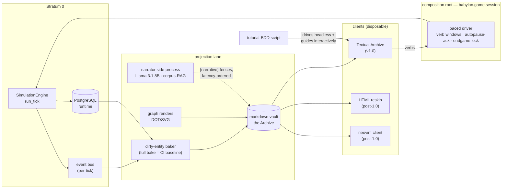

# NORTH STAR — How The System Works

*The technical-ideological orientation document for Babylon. BD-ratified framing,
2026-07-21. This is **explanation** — the mental model that threads everything
together. The law lives in `CONSTITUTION.md`; the machine-readable map lives in
`ai/architecture.yaml`; the execution plan lives in
`ai/_inbox/PROGRAM_v1_0_0_playable_archive.md`. This document tells you **why the
shape is the shape**, so every other document makes sense.*

---

## 0. The ruling that governs this document

**Babylon is a game first.** It is powered by a simulation engine that is rigorous —
deterministic, hash-sealed, constitutionally governed — but the rigor exists to make
the game *trustworthy*, not to make the project a research program. The BD ruling of
2026-07-21 is binding: **we are rigorous enough.** The formalism surface is closed
for v1.0: the dialectic 𝔇, the C/G/P constructor families, the level lattices, the
adjunctions in production, the derived severity rule, the boundary operator ∂L.
New formalism requires a constitutional amendment; the rigor budget is henceforth
spent **wiring existing mathematics to the player**, not minting more mathematics.

The destination is equally binding: *a terminal-based, first-class, keyboard-driven
simulation video game, installed by one shell script, in the hands of the masses.*
Every architectural argument in this document terminates at that sentence.

## 1. The system in one paragraph

Babylon is a **deterministic materialist world** (Graph + Math = History) that the
player can only touch through **text**: the engine ticks, projections bake the world
into a markdown wiki (the Archive), the player reads the wiki, forms a theory,
issues verbs, and the engine — never the AI, never the client — adjudicates the
consequences, which revise the wiki. Around that loop stand three disciplines:
**contracts** that pin what the world means, **sentinels** that prove every declared
part is actually wired to the living whole, and **ceremonies** that make every
intentional change of meaning a declared, audited event. The AI narrates; it never
decides. The client renders; it never computes. The engine computes; it never
explains itself — the wiki does.

## 2. The ontology — four strata and one lane

The conversation that produced this document began with an intuition: the sentinel
system "doesn't fit anywhere." The resolution is that Babylon has grown a genuine
stratification, and each stratum has its own citizenship rules:

- **Stratum 0 — the world.** Material reality. Deterministic, per-tick, sealed by
  hash. Nothing above it may reach down and mutate it: not the AI (Amendment V/Y),
  not the client (import-linter), not the projections (Amendment S).
- **Stratum 1 — contracts.** Statements *about* the world that outlive any
  implementation of it: the frozen models, the moddable defines, the opposition
  catalog, the golden baselines, and — since the tutorial-BDD ruling — the tutorial
  step script itself, which is the behavioral contract for the entire game loop
  (the "rewrite test": any future client is correct iff the tutorial suite passes
  against it).
- **Stratum 2 — reflection.** The layer the sentinel intuition was detecting.
  Statements about the *relationship between declaration and reality*: does a
  production caller exist; does a queried node type have a producer; does a formal
  construct trace to a material relation (the Aleksandrov Test). This stratum is
  the codebase applying the game's own boundary mathematics to its own body — a
  registered-but-never-called subsystem is superstructure without base, and the
  build system hunts it the way the game models it. It is neither test nor engine
  because tests fake their own callers; only whole-program reachability proves that
  something is *materially alive*.
- **The projection lane** is not a stratum — it is a one-way functor out of the
  world. Fog is epistemic, never material; the tick hash is blind to everything in
  this lane; the narrator's prose is non-reproducible *by design* and fenced out of
  every verify story.

Why this shape and not a flat codebase: because the failure mode this project
actually suffers — fully-built-but-disconnected subsystems, produced at AI speed
faster than any eye can audit — is invisible to Stratum 0 tests and Stratum 1
types. The stratification is not architecture astronautics; it is the minimum
structure under which "the game is fully wired" is a *provable sentence*.

## 3. The algebra — closed for v1.0

One generator: the dialectic 𝔇 = (A, Ā, w, T, σ), bound oppositions measured fresh
each tick. Three constructor families: **C** (composition), **G** (coarse-graining
across the level lattices), **P** (projection — one-way, no morphism back). Every
construct carries its derivation chain back to registered oppositions; that chain
is its constitutional rent record. The severity of an event is *derived* — kind ×
terminal proximity — never hand-tiered; the seam space is *finite* — ∂L over the
construct graph — never vibes.

The trade-off we accepted, explicitly: this machinery is expensive to carry, and
part of it is rent paid for building in a permissive language. We pay it because it
is what lets a solo BD command an agent swarm without the swarm silently shipping
dead institutions. And we cap it: **the algebra serves the game.** When a formal
question arises during v1.0 work, the answer is "does the player feel it?" — if
not, it goes to the research-seed inbox, not the codebase.

## 4. The grammar — everything the player touches is text

The terminal is not a rendering compromise; it is the load-bearing design decision:

- **Verbs are the sentence forms.** The nine Article V verbs are the player's
  entire expressive grammar; every one of them must appear in the tutorial-BDD
  suite or it is a dead option (a ∂L seam) and the gate is red.
- **Events are the tenses.** ALARM / CROSSING / FLOW / ACT / PATTERN — the five
  event kinds are how the world conjugates change, and severity is intonation,
  derived, single-sourced, joined (never summed).
- **The wiki is the text corpus.** Vault markdown is simultaneously the game
  surface, the assertion medium (byte-diffable goldens), and — post-Gate-3 — the
  input to one opinionated single-definition grammar (BFM: GFM base + a restricted
  MyST-style construct set, Rust engine, Python bindings, HTML "reskin" as a second
  renderer over the same AST). One grammar, many renderers; assert the source,
  display the render.
- **Images are outsourced, floors are text.** Complex visuals render graph-natively
  (rustworkx/XGI → SVG/PNG via the kitty raster lane), but every raster has a glyph
  floor beneath it and the behavioral contract binds the floor — which is also,
  it turned out, the Windows insurance policy (Amendment AA).
- **The playthrough transcript is the proof.** A headless run prints every screen
  of the tutorial as deterministic text; transcript drift *is* behavior drift.

## 5. The runtime, whole

Everything on this diagram either exists today or is a unit in a running lane. That
is deliberate: the North Star contains no box that lacks a committed plan.

## 6. Engineering holism under real constraints

"Holistic" is not a diagram; diagrams rot. Holistic is a **property the build can
check**: every part reachable from the player loop, every contract producing and
consumed, every intentional change declared. The three governors:

1. **Technical debt is ledgered, not forbidden.** DEBT.md, the seam registry's
   liveness classes, the assumptions ledger, `{absence}` fences — debt is legal
   when it is *visible and loud*. The only illegal debt is silent debt; that is the
   entire sentinel doctrine (every discovered error class ships a mutation-validated
   gate), and it is why the estate grows by infection, like an immune system, rather
   than by speculation.
2. **Personal familiarity is a design input, not a bias to apologize for.** Solo BD,
   neovim-native, Python/Rust hands, one 12-core box. Hence: Python stays the
   engine language; Rust (not OCaml, not Haskell) is the sanctioned compiled lane;
   the neovim client is the sanctioned second client; heavy gates run single-flight;
   ceremony defers to merge-time. A stack the BD cannot personally maintain at
   2 a.m. is a stack the project does not adopt.
3. **Shipping is the forcing function.** The v1.0.0 Definition of Done is the only
   finish line, Gate 3 (a full TUI campaign session) is the only gate that matters
   between here and there, and anything that does not move a train toward it —
   however intellectually alive — files as a research seed and waits.

The enforcement loops that make holism mechanical rather than aspirational:
contracts pin meaning → sentinels prove wiring → ceremonies audit change → the
tutorial-BDD suite proves the *player-facing* whole behaves as advertised. Four
loops, one closed system. When all four are green, "it all connects" is not a
feeling; it is a build status.

## 7. The road

**Now (in flight):** six parallel lanes off the T1.0 contract commit — Capital
Vol I and Vol II (the economy becomes real), T1.1 (seam algebra + derived
severity), T1.2 (keel services), T4 (the campaign runtime — the critical path),
T7 (installer, alpha merged). Then T3 (gap projections), T5 (narrator wiring),
T6 (tutorial-as-BDD), **Gate 3**, cutover, T7-beta (embedded Postgres), T8
(release + KSBC aesthetic pass), **v1.0.0**.

**Post-1.0 horizon (committed direction, not scheduled work):** Windows via WSL2
then native (Amendment AA — shielded from v1.0), the BFM Rust markdown engine with
the HTML reskin, the neovim client behind the same BDD contract, the AI phase
(fine-tuning; the tick-compression / narrative-vector-space seed).

**Round 2 — The Mirror (BD-flagged 2026-07-21, deferred until current workflows
land):** turn Stratum 2's implicit self-model into an explicit one — the construct
graph as first-class, queryable data; the codebase's own ontology modeled with the
same tooling that models the game world. Not code-as-poetry: code-as-territory,
mapped once the current trains are merged and the map has something stable to be
*of*. This is on the radar precisely so it stays **off** the v1.0 critical path.

## 8. Invariants that do not move

1. Determinism: same seed, same defines, same bytes — and everything epistemic
   stays out of the hash.
2. The engine adjudicates; AI narrates; clients render. No exceptions without
   amendment.
3. Text is the assertion medium; every raster has a text floor; the game is fully
   playable glyph-only over ssh.
4. Every formal construct traces to a material relation, in the world and in the
   code.
5. Debt is legal only when loud.
6. No MVP scoping of ratified designs; scope moves by ruling, not erosion.
7. The player's machine owns everything: their world, their save, their narrator,
   their wiki.
8. **The game ships.**
