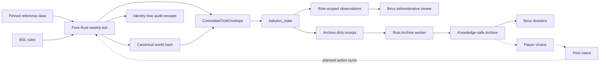

# North Star

This page explains the live game direction. It does not make law.
[`CONSTITUTION.md`](CONSTITUTION.md) v4.1.0 governs Babylon. ADR221 records how
the prior constitution moved into v4 without a rewrite of history.
[`ai/mantras.yaml`](ai/mantras.yaml) carries the same orientation as structured
data for repository tools.

## Player promise

Babylon is an entertainment-first emergent political-economy game. Babylon is
not a forecast and not a scientific reproduction. Theory constrains the causal
model but does not predetermine results.

<!-- Vale: the Director's political game vocabulary and intended player freedom. -->
<!-- vale ste.UnapprovedWords = NO -->
The intended player leads a small political organization,
responsible for its members and collective power.
The MIM line supplies the analytical framework. The player can pursue an
electoral, reformist, or revolutionary project. Political direction emerges
from practice: campaigns, alliances, membership, and institutional commitments.
These commitments also shape later choices and pressures.

Reformism versus revolution is a central strategic tension. Adventurism and
sectarianism are distinct tendencies that can also develop through practice.
Decisions and material conditions explain these trajectories. Political labels
do not predetermine success or failure.
<!-- vale ste.UnapprovedWords = YES -->
The intended first screen centers political forces: organizations,
institutions, allies, and opponents. Economic panels explain their material
relationships.
The world must explain labor dependence, material needs, institutions, and
collective relationships. Each visualization must answer a player question:
where can I organize, and what sustains collective action?
Who bears its costs, and what changes as a result?
Statistical totals and citations belong in context views and the Archive.

The player plans in months while the engine resolves individual weeks. The
main control runs to a monthly boundary. The player can pause and resume the
remaining period. Important developments also pause play for a closer look.
A briefing explains what changed, why it matters to the organization,
and links to records that the player can examine. The player makes the
strategic judgment.

Hearts of Iron IV and Victoria 3 are references for strategic scale and pace.
Dwarf Fortress is a reference for systems that interact and produce histories.
The game must make consequences clear at the level of organizations.

The geographic world is the persistent home. A compact resource bar describes
the organization as a whole. Selection reveals local availability, activities,
and relationships. The log records developments, group communications, and
completed activity, with links back to affected subjects.

Portraits represent groups and organizations. Detailed individual simulation
is not the focus.
Support and opposition belong to distinct groups. Pressure directed at the
organization stays separate from regional unrest and the repressive climate.

The future language interface proposes a few concrete first steps for a broad
intention. The player chooses an approach and confirms a reviewed action.
Pinned plans preserve intentions. They do not silently execute them. G5 owns
those actions. The engine determines their legality, costs, and consequences.

G4's observer surface must make those relationships legible before G5 adds
actions for the organizer. Physical dependence does not prove organization,
solidarity, or readiness for collective action. The game must model those
relations before it can display them as facts.

Determinism proves computational identity, not scientific truth. Historical
cases test causal signatures and counterfactual behavior. They do not dictate a
historical path.

The Bevy client observes the durable Michigan campaign. It has no player action.
G4 observer acceptance remains incomplete.

<!-- vale ste.UnapprovedWords = NO -->
Gate 2 now gives the Rust engine executable phase order, whole-tick atomicity,
combined current-world hashing, role-sensitive causal authority, and atomic
in-memory audit receipts. The next four executable gates are:

<!-- Vale: each protected item is a governed gate name. -->
<!-- vale Vale.Terms = NO -->
<!-- vale ste.UnapprovedWords = NO -->
<!-- vale ste.NounClusters = NO -->
1. **PostgreSQL/H3/Archive decision-loop slice**
1. **Productive & distributive circuit**
1. **Player agency**
1. **COVID emergence benchmark**
<!-- vale Vale.Terms = YES -->
<!-- vale ste.UnapprovedWords = YES -->
<!-- vale ste.NounClusters = YES -->

## The system without political economy

At its highest level, Babylon is a deterministic causal sandbox with weekly
steps, limited knowledge, and delayed choice.

<!-- vale ste.UnapprovedWords = NO -->
Today one weekly tick takes a typed world and governed rules. It produces a new
world, events, identity-free causal audit receipts, a Rust `TickReport`, and a
canonical hash. The receipts state which role and evidence class produced each
actual event and write. They are not durable action receipts. Persisted replay
and campaign restart belong to Rust. The frozen Python engine remains a
behavioral reference.
<!-- vale ste.UnapprovedWords = YES -->

The planned action cycle adds prior intent and durable action receipts. The
current knowledge boundary restricts Archive reads to granted facts. G5 adds
player choices that become intent for a future tick.

Political economy supplies the entities, relations, and causal rules. The
general system has seven parts:

- a typed world model
- a language for causal rules
- an ordered tick judge
- an in-memory Rust tick report
- authoritative persisted replay in Rust
- a projection limited by knowledge
- a delayed decision cycle

The engine judges. The client shows. AI can parse, retrieve, and narrate, but AI
does not judge mechanics.

## Live path and planned cycle

The solid arrows show the live Rust persistence and Bevy path. Dashed arrows
show the planned player-action slice.

<!-- Vale: the Mermaid block contains literal crate and schema identifiers. -->
<!-- vale off -->

```mermaid
flowchart LR
    REF["Pinned reference data"] --> TICK["Pure Rust weekly tick"]
    BSL["BSL rules"] --> TICK
    INTENT["Prior intent"] -. "planned action cycle" .-> TICK
    TICK --> HASH["Canonical world hash"]
    TICK --> AUDIT["Identity-free audit receipts"]
    TICK --> ENV["CommittedTickEnvelope"]
    HASH --> ENV
    ENV --> STATE["babylon_state"]
    STATE --> READ["Role-scoped observations"]
    READ --> VIEW["Bevy administrative viewer"]
    STATE --> OUTBOX["Archive dirty receipt"]
    OUTBOX --> WORKER["Rust Archive worker"]
    WORKER --> ARCHIVE["Knowledge-safe Archive"]
    ARCHIVE --> DOSSIER["Bevy dossiers"]
    ARCHIVE -.-> CHOICE["Player choice"]
    CHOICE -.-> INTENT
```
<!-- vale on -->

The live Rust path uses `babylon-kernel`, `babylon-graph`, `babylon-bsl`,
`babylon-tick`, `babylon-persistence`, and `babylon-client`.
`babylon-runtime` owns campaign writes. Bevy requests week advances and reads
the committed map, material views, history, and dossiers.

The Python engine is a frozen behavioral reference. Its tests, traces, and
goldens specify behavior for port and replacement decisions. Python also
prepares data and runs selected periphery.

<!-- Vale: this paragraph preserves literal persistence and schema identifiers. -->
<!-- vale ste.UnapprovedWords = NO -->
<!-- vale ste.NounClusters = NO -->
Python keeps its separate mutable SQLite reference store, data and optimization
tools, and dedicated document stores. Rust owns authoritative replay, checkpoint
restart, and Archive dirty receipts. The Rust Archive worker and restricted
reader supply cited county and place dossiers to Bevy. The card shows Archive
verification lag and refuses historical pages. BSL-Bevy player actions remain
unavailable.
<!-- vale ste.NounClusters = YES -->
<!-- vale ste.UnapprovedWords = YES -->

## Causal world

The world contains typed entities, relations, and compact registers. Geography
does not change. Political claims use overlays. Each tick can change the social
world but not the spatial substrate.

<!-- Vale: this paragraph preserves governed engine operation names. -->
<!-- vale ste.Gerunds = NO -->
<!-- vale ste.UnapprovedWords = NO -->
<!-- vale ste.NounClusters = NO -->
<!-- vale write-good.TooWordy = NO -->
Live BSL expresses governed causal rules. Each rule declares a causal role and
an evidence class. Built-in rules must also match an independent governed
attribution manifest. This second ledger prevents production content from
changing its label to gain mechanic authority. Unknown mod and fixture IDs
remain self-declared.

Mechanics derive endogenous state. Recognizers, external events, and intents
are exact-allowlist and default-deny. The current allowance table contains only
the ControlRatio recognition events and latches. Executable shocks and intents
remain absent. A production sentinel requires each restricted built-in rule's
footprint to equal its unique allowance rows, so CI rejects dead permissions.

Planned shocks will add only governed exogenous pressure,
burden, or capacity effects. In the planned action slice, BSL will let actions
run, charge costs, choose targets, and encode political results through
governed next-week intents.

In planned circuit slices, Rust allocation, routing, settlement, and clearing
mechanics will enforce conservation.
Ordinary BSL rules derive and write world data through governed causal
operations. External-event rules must not write downstream results directly,
such as unemployment, death, shortages, shipments, defaults, or winners.
<!-- vale write-good.TooWordy = YES -->
<!-- vale ste.NounClusters = YES -->
<!-- vale ste.UnapprovedWords = YES -->
<!-- vale ste.Gerunds = YES -->

The formal surface stays closed. The dialectic, constructor families, level
lattices, adjunctions, and boundary operator supply the licensed algebra. BSL
expresses that algebra and does not create a new mathematical primitive.

No game rule can impose a sigmoid or other fixed response curve. The world
population and the licensed operations must produce curve shapes.

## Political-economy circuit

The intended game closes one causal circuit across production, circulation,
realization, finance, class, government, ecology, and player action. A slice must
connect a producer to a game consumer before the slice is complete.

Ports follow slices. Babylon does not wait for all frozen Python systems before
play begins. A port can keep, adapt, replace, or retire frozen behavior through
a declared decision.

Research data waits until a named game rule needs a field. Data volume alone
does not complete a slice.

## Emergence proof

A large event supplies pressure and timing, not downstream results. The
benchmark uses a 2019 control world and encodes a public-health burden in BSL
after the productive circuit and player agency are live. The engine must derive
the economic, geographic, class, and political effects.

The COVID benchmark compares a control, a historical shock envelope, a
strong-capacity counterfactual, and a weak-capacity counterfactual across 104
weekly ticks. The test asks for causal
divergence, heterogeneity, hysteresis, and response to the counterfactual.

Historical agreement is useful information. It does not turn Babylon into a
forecast. A different policy or capacity must be free to produce a different
path.

## Player knowledge

Each game map, chart, relation diagram, topology, or other display must answer a decision
question. Rich reference material belongs in a drill-down or the Archive.

An administrative display can help development. It cannot pass a game
milestone. The first accepted Archive slice will connect a geographic dossier,
signals, a player decision, a future tick effect, and an updated dossier.

The Archive must apply fog before AI retrieval. A query must name the campaign.
The query must also use the knowledge of the player. The narrative must not
change a fact about material conditions.

## Holism as a test

Babylon treats a system as live only when it has a producer, a consumer, and an
observable effect. Contracts give behavior. Sentinels prove wiring. Ceremonies
record intentional changes to meaning.

This discipline matters because agents can make a complete but disconnected
subsystem quickly. Unit tests can prove local behavior while the game does not
use it. Reachability and mutation tests find this defect.

## The road after the four gates

The productive and distributive circuit follows the decision-loop slice. Player
agency follows the circuit. The COVID benchmark then checks the shock through
the completed circuit and the player's own counterfactual choices.

The 2008 benchmark then tests credit contraction, production, jobs, class,
territory, and politics. Only after those circuits pass their tests does Babylon
scale to the representative v1 world.

## Stable rules

1. One tick is one week.
2. Equal inputs must produce equal bytes and hashes.
3. Determinism proves identity, not truth.
4. The engine judges, AI narrates, and clients show.
5. Each formal element must have a material relation.
6. Each substantive value must be `Observed`, `Derived`, `Calibrated`, or `Designed`.
7. Plans must identify planned parts.
8. The game must ship as an engaging game.
9. Restricted causal roles can use only listed and governed effects.
