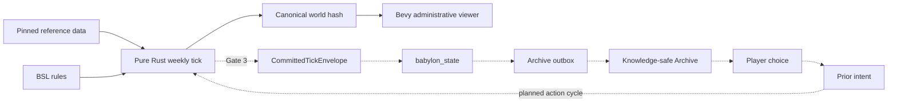

# North Star

This page explains the live game direction. It does not make law.
[`CONSTITUTION.md`](CONSTITUTION.md) v4.0.0 governs Babylon. ADR221 records how
the prior constitution moved into v4 without a rewrite of history.
[`ai/mantras.yaml`](ai/mantras.yaml) carries the same orientation as structured
data for repository tools.

## Player promise

Babylon is an entertainment-first emergent political-economy game. Babylon is
not a forecast and not a scientific reproduction. Theory constrains the causal
model but does not predetermine results.

Determinism proves computational identity, not scientific truth. Historical
cases test causal signatures and counterfactual behavior. They do not dictate a
historical path.

The Bevy client is an administrative viewer with no player action. It can run
and show the null world, but the player cannot change that world.

The first three executable gates are:

<!-- Vale: each protected item is a governed gate name. -->
<!-- vale ste.UnapprovedWords = NO -->
1. **Executable causality and whole-tick atomicity**
<!-- vale ste.UnapprovedWords = YES -->
<!-- vale Vale.Terms = NO -->
<!-- vale ste.UnapprovedWords = NO -->
1. **PostgreSQL/H3/Archive decision-loop slice**
<!-- vale Vale.Terms = YES -->
<!-- vale ste.UnapprovedWords = YES -->
<!-- vale ste.NounClusters = NO -->
1. **COVID E0 emergence proof**
<!-- vale ste.NounClusters = YES -->

## The system without political economy

At its highest level, Babylon is a deterministic causal sandbox with weekly
steps, limited knowledge, and delayed choice.

Today one weekly tick takes a typed world and governed rules. It produces a new
world, events, a Rust `TickReport`, and a canonical hash. That report is not a
durable action receipt. Persisted replay remains in the frozen Python path.

The planned action cycle adds prior intent and durable action receipts. A
knowledge layer will show only what the player has learned. The player will then
make a choice that becomes intent for a future tick.

Political economy supplies the entities, relations, and causal rules. The
general system has seven parts:

- a typed world model
- a language for causal rules
- an ordered tick judge
- an in-memory Rust tick report
- persisted replay in the frozen Python reference
- a projection limited by knowledge
- a delayed decision cycle

The engine judges. The client shows. AI can parse, retrieve, and narrate, but AI
does not judge mechanics.

## Live path and planned cycle

The solid arrows show the live Rust and Bevy path. Dashed arrows show the Gate 3
plan and the planned player-action slice.

<!-- Vale: the Mermaid block contains literal crate and schema identifiers. -->
<!-- vale off -->

```mermaid
flowchart LR
    REF["Pinned reference data"] --> TICK["Pure Rust weekly tick"]
    BSL["BSL rules"] --> TICK
    INTENT["Prior intent"] -. "planned action cycle" .-> TICK
    TICK --> HASH["Canonical world hash"]
    HASH --> VIEW["Bevy administrative viewer"]
    TICK -. "Gate 3" .-> ENV["CommittedTickEnvelope"]
    ENV -.-> STATE["babylon_state"]
    STATE -.-> OUTBOX["Archive outbox"]
    OUTBOX -.-> ARCHIVE["Knowledge-safe Archive"]
    ARCHIVE -.-> CHOICE["Player choice"]
    CHOICE -.-> INTENT
```
<!-- vale on -->

The live Rust path uses `babylon-kernel`, `babylon-graph`, `babylon-bsl`,
`babylon-tick`, and `babylon-client`. The Bevy client draws the county atlas,
moves ticks forward, and shows lenses, events, causal beats, and hash data.

The Python engine is a frozen behavioral reference. Its tests, traces, and
goldens specify behavior for port and replacement decisions. Python also
prepares data and runs selected periphery.

<!-- Vale: this paragraph preserves literal persistence and schema identifiers. -->
<!-- vale ste.UnapprovedWords = NO -->
<!-- vale ste.NounClusters = NO -->
The Python periphery has mutable SQLite replay, atomic Postgres tick
persistence, `tick_commit`, partial `babylon_meta` navigation state, and an
action pipeline. The full v4 Rust three-schema boundary, commit envelope,
outbox, fog-safe Archive cycle, and BSL-Bevy player actions have not landed.
<!-- vale ste.NounClusters = YES -->
<!-- vale ste.UnapprovedWords = YES -->

## Causal world

The world contains typed entities, relations, and compact registers. Geography
does not change. Political claims use overlays. Each tick can change the social
world but not the spatial substrate.

Live BSL expresses governed causal rules. It has no executable shock vocabulary
or shock content. Planned shocks will add exogenous pressure. In the
planned action slice, BSL will let actions run, charge costs, choose targets,
and encode political results.
<!-- Vale: this paragraph preserves governed engine operation names. -->
<!-- vale ste.Gerunds = NO -->
<!-- vale ste.UnapprovedWords = NO -->
<!-- vale write-good.TooWordy = NO -->
In planned circuit slices, Rust allocation, routing, settlement, and clearing
mechanics will enforce conservation.
Ordinary BSL rules derive and write world data through governed causal operations. Shock
rules must not write downstream results directly, such as unemployment, death,
shortages, shipments, defaults, or winners.
<!-- vale write-good.TooWordy = YES -->
<!-- vale ste.UnapprovedWords = YES -->
<!-- vale ste.Gerunds = YES -->

The formal surface stays closed. The dialectic, constructor families, level
lattices, adjunctions, and boundary operator supply the licensed algebra. BSL
expresses that algebra and does not create a new mathematical primitive.

No game rule can impose a sigmoid or other fixed response curve. The world
population and the licensed operations must produce curve shapes.

## Political-economy circuit

The intended game closes one causal circuit across production, circulation,
realization, finance, class, government, ecology, and player action. A slice must
connect a producer to a game consumer before the slice is complete.

Ports follow slices. Babylon does not wait for all frozen Python systems before
play begins. A port can keep, adapt, replace, or retire frozen behavior through
a declared decision.

Research data waits until a named game rule needs a field. Data volume alone
does not complete a slice.

## Emergence proof

A large event supplies pressure and timing, not downstream results. The first
benchmark will use a 2019 control world and encode a public-health burden in
BSL. The engine must derive the economic, geographic, class, and political
effects.

COVID E0 compares a control, a historical shock envelope, a strong-capacity
counterfactual, and a weak-capacity counterfactual across 104 weekly ticks. The
test asks for causal divergence, heterogeneity, hysteresis, and response to the
counterfactual.

Historical agreement is useful information. It does not turn Babylon into a
forecast. A different policy or capacity must be free to produce a different
path.

## Player knowledge

Each game map, chart, relation diagram, topology, or other display must answer a decision
question. Rich reference material belongs in a drill-down or the Archive.

An administrative display can help development. It cannot pass a game
milestone. The first accepted Archive slice will connect a geographic dossier,
signals, a player decision, a future tick effect, and an updated dossier.

The Archive must apply fog before AI retrieval. A query must name the campaign.
The query must also use the knowledge of the player. The narrative must not
change a fact about material conditions.

## Holism as a test

Babylon treats a system as live only when it has a producer, a consumer, and an
observable effect. Contracts give behavior. Sentinels prove wiring. Ceremonies
record intentional changes to meaning.

This discipline matters because agents can make a complete but disconnected
subsystem quickly. Unit tests can prove local behavior while the game does not
use it. Reachability and mutation tests find this defect.

## The road after the first three gates

Player agency follows COVID E0. Then productive circulation, freight, class
effects, and organization money complete the first circuit. The full-circuit
COVID benchmark checks the same shock again.

The 2008 benchmark then tests credit contraction, production, jobs, class,
territory, and politics. Only after those circuits pass their tests does Babylon
scale to the representative v1 world.

## Stable rules

1. One tick is one week.
2. Equal inputs must produce equal bytes and hashes.
3. Determinism proves identity, not truth.
4. The engine judges, AI narrates, and clients show.
5. Each formal element must have a material relation.
6. Each substantive value must be `Observed`, `Derived`, `Calibrated`, or `Designed`.
7. Plans must identify planned parts.
8. The game must ship as an engaging game.
