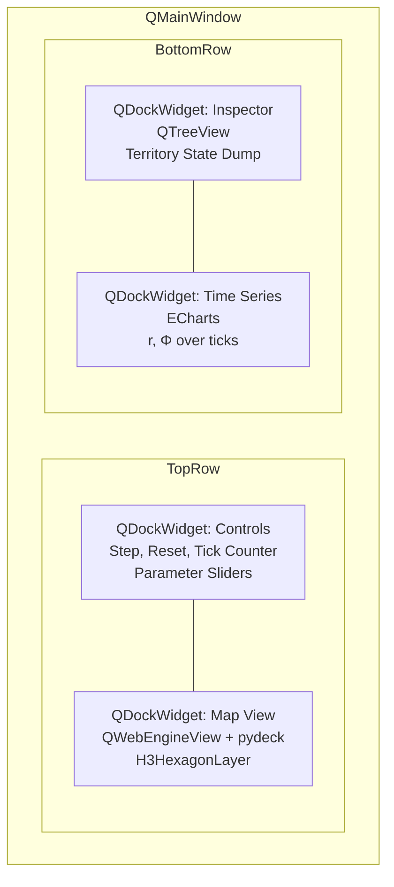

# Babylon GUI Guiding Star

## The Readiness Test

Before touching any GUI code, this snippet must work:

```python
state = simulation.get_state()
territory = state.territories["wayne_county"]
print(territory.profit_rate)  # some float
print(territory.hex_claims)   # set of H3 indices
simulation.step()
state = simulation.get_state()
territory = state.territories["wayne_county"]
print(territory.profit_rate)  # different float
```

If it doesn't work, the missing piece is your pre-work.

---

## Minimum Viable Foundation

These five things must exist and function:

### 1. A graph that exists and is populated
NetworkX graph with hexes as the invariant spatial nodes, territories as claims over hex clusters, and edges representing relationships (adjacency, extraction, solidarity). The hex grid is substrate; political control is a layer on top.

### 2. One computed quantity per node
Could be profit rate, could be simpler. Something that changes when you step. Without this, there's nothing to color the hexagons with.

### 3. A tick function that mutates state deterministically
`step()` is called, state changes. Calling `step()` from the same state produces the same result. Doesn't need to be economically meaningful yet.

### 4. State is queryable without knowing internals
`get_territory(id).profit_rate` works. Doesn't matter if it's a dict, dataclass, or Pydantic model underneath.

### 5. H3 mapping exists for test geography
Wayne/Oakland counties have H3 indices at res4. One-time lookup table, not ongoing computation.

### 6. Territory ≠ Hex
H3 hexes are the invariant geographic substrate — the dirt. Territories are a *layer* that claims clusters of hexes. Same hex can be "Wayne County" in tick 0 and "People's Republic of Detroit" in tick 500. The model needs:
- `Hex`: immutable, keyed by H3 index
- `Territory`: a polity's claim on a set of hexes at a given tick
- Mapping: `territory_hex_claims(tick, territory_id, h3_index)`

This enables political fragmentation, armed struggle redrawing borders, and state collapse as first-class simulation outcomes.

---

## What Does NOT Need to Be in Place

- Full tensor engine
- All eight UseValue types
- Crisis detection logic
- Bifurcation model
- QCEW integration beyond test data
- Department I/II/III classification
- Imperial rent computation
- Historical validation

These can be built *with* the GUI as your visualization harness.

---

## The Protocols

These are the load-bearing architectural decision. GUI depends only on these interfaces. Simulation internals can churn freely.

```python
from typing import Protocol
from dataclasses import dataclass

@dataclass
class HexState:
    """Immutable snapshot of a hex cell. The dirt doesn't change."""
    h3_index: str
    # Physical properties only — no political ownership here

@dataclass
class TerritoryState:
    """A polity's claim on a set of hexes at a given tick."""
    territory_id: str
    controlling_polity: str  # Can change via armed struggle, annexation, etc.
    hex_claims: set[str]     # H3 indices this territory currently claims
    tick: int
    # Quantities computed over the claimed hexes
    profit_rate: float
    # Add: organic_composition, exploitation_rate, imperial_rent, etc.

@dataclass
class EdgeState:
    """Immutable snapshot of an edge at a given tick."""
    source_id: str
    target_id: str
    edge_type: str  # ADJACENCY, EXTRACTION, SOLIDARITY, ANTAGONISTIC
    weight: float

@dataclass
class SimulationSnapshot:
    """Complete state at a tick. Immutable."""
    tick: int
    hexes: dict[str, HexState]          # Invariant substrate
    territories: dict[str, TerritoryState]  # Political layer (can fragment)
    edges: list[EdgeState]

class SimulationState(Protocol):
    """Read interface to simulation."""

    def get_current_tick(self) -> int: ...

    def get_snapshot(self) -> SimulationSnapshot: ...

    def get_territory_state(self, territory_id: str) -> TerritoryState: ...

    def get_hexes_for_territory(self, territory_id: str) -> set[str]: ...

    def get_territory_for_hex(self, h3_index: str) -> str | None: ...

    def get_time_series(
        self,
        metric: str,
        territory_id: str,
        start_tick: int = 0,
        end_tick: int | None = None
    ) -> list[tuple[int, float]]: ...

    def get_events(
        self,
        start_tick: int = 0,
        end_tick: int | None = None,
        event_type: str | None = None
    ) -> list[dict]: ...

class SimulationControl(Protocol):
    """Write interface to simulation."""

    def step(self, n: int = 1) -> None: ...

    def reset(self) -> None: ...

    def set_parameter(self, name: str, value: float) -> None: ...

    def get_parameter(self, name: str) -> float: ...

    def save_checkpoint(self) -> str: ...

    def restore_checkpoint(self, checkpoint_id: str) -> None: ...

    def inject_event(self, territory_id: str, event_type: str, payload: dict) -> None: ...
```

---

## God Mode MVP Panels

Build in this order. Each is independently useful.

### Phase 1: Minimum Viable God Mode
1. **Map view** (pydeck H3 in QWebEngineView) — hexagons colored by metric, colored by controlling territory, click to select
2. **State inspector** (QTreeView) — dump selected territory's full state (hex claims, quantities, controlling polity)
3. **Time controls** — step button, tick counter, reset button

This alone transforms your development experience.

### Phase 2: Temporal Awareness
4. **Time series panel** (ECharts) — r and Φ over ticks, vertical line at current tick
5. **Event log** (QTableView) — filterable list of simulation events

### Phase 3: Deep Inspection
6. **Query console** — raw SQLite SQL access with results table
7. **Graph view** (vis.js or d3-force) — four-node topology, synchronized selection with map

### Phase 4: Power Tools
8. **Watch panel** — user-defined expressions evaluated each tick
9. **Breakpoint system** — pause on condition (e.g., `r < 0.02`)
10. **Counterfactual branching** — save checkpoint, run, restore, compare

---

## GUI Architecture



All panels are QDockWidgets — tearable, rearrangeable, hideable.

---

## Key Files to Create

```
babylon/
├── protocols/
│   ├── __init__.py
│   ├── simulation_state.py    # SimulationState protocol
│   └── simulation_control.py  # SimulationControl protocol
├── gui/
│   ├── __init__.py
│   ├── main_window.py         # QMainWindow setup
│   ├── panels/
│   │   ├── __init__.py
│   │   ├── map_panel.py       # pydeck H3 view
│   │   ├── inspector_panel.py # QTreeView state dump
│   │   ├── time_controls.py   # Step, reset, tick display
│   │   ├── time_series.py     # ECharts panel
│   │   ├── event_log.py       # QTableView
│   │   ├── query_console.py   # SQLite SQL interface
│   │   └── graph_panel.py     # Network topology view
│   └── bridge.py              # Qt signals connecting panels to simulation
```

---

## Dependencies to Add

```toml
[tool.poetry.dependencies]
PyQt6 = "^6.6"
PyQt6-WebEngine = "^6.6"
pydeck = "^0.8"
h3 = "^3.7"
```

---

## Database Architecture

**SQLite only. No DuckDB for simulation.**

```mermaid
flowchart TB
    subgraph RefDB["SQLite Reference DB (read-only)"]
        direction LR
        dim_county[dim_county]
        fact_qcew[fact_qcew]
        dim_naics[dim_naics]
    end

    subgraph NetworkX["NetworkX (in memory)"]
        graph[Working graph during simulation<br/>Mutated each tick, never rehydrated mid-run]
    end

    subgraph SimDB["SQLite Simulation DB (per-run)"]
        direction LR
        node_history[node_history]
        edge_history[edge_history]
        event_log[event_log]
    end

    RefDB -->|hydrate at start| NetworkX
    NetworkX -->|write state each tick| SimDB
```

**Why not DuckDB?**
- SQLite handles tick-by-tick ledger writes (OLTP) better than DuckDB's OLAP focus
- Foreign key constraints work properly in SQLite
- One less dependency, simpler architecture
- Simulation scale (~1000 ticks × thousands of rows) doesn't need columnar performance

---

## The Interface Boundary Principle

The GUI depends ONLY on protocols. Simulation internals can churn freely.

```mermaid
flowchart LR
    GUI[GUI] --> Protocols
    Protocols[Protocols<br/>SimulationState<br/>SimulationControl] <-- Simulation[Simulation<br/>Internals]
```

When you change how profit rate is computed, the GUI doesn't know or care. It just calls `get_territory_state(id).profit_rate`.

---

## Checklist Before Starting GUI

- [ ] `simulation.get_state()` returns something
- [ ] State has `.territories` dict keyed by territory ID
- [ ] State has `.hexes` dict (the invariant geographic substrate)
- [ ] Each territory has at least one numeric quantity
- [ ] Territories have `hex_claims` linking them to the substrate
- [ ] `simulation.step()` exists and changes state
- [ ] H3 indices exist for Wayne/Oakland counties (the dirt)
- [ ] `SimulationState` protocol defined
- [ ] `SimulationControl` protocol defined
- [ ] Simulation implements both protocols (even minimally)

Once all boxes are checked, build the map + inspector + step button. Everything else follows.
