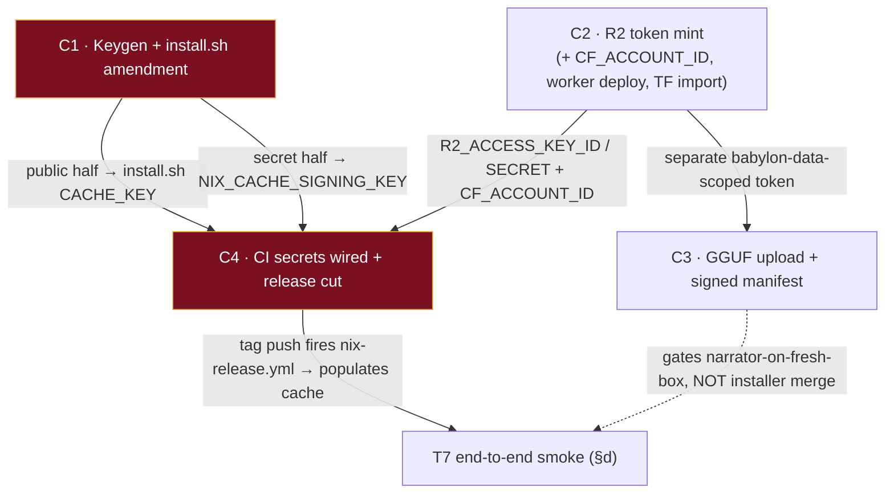

# BD Ceremony Runbook Appendix — Babylon v1.0.0 T7 Nix-Bootstrap Installer

Four owner-owned, local-only ceremonies that the cloud coding session cannot perform. Execute by hand, in the order the DAG below permits.

> **Repo-slug conflict — resolve before running any `gh`/`nix build` command.** C1 confirms `origin = percy-raskova/babylon`. `install.sh`'s `FLAKE_REF` and every `bogdanscarwash/babylon` string in C4 are read off the (likely stale, pre-rename) flake ref, *not* an authoritative source. **All `--repo` / `github:` targets below use `percy-raskova/babylon`; if `gh repo view percy-raskova/babylon` fails, the rename never happened — fall back to `bogdanscarwash/babylon` and treat the `FLAKE_REF` fix as a separate out-of-scope PR.** Do not proceed with a guessed slug.

---

## 1. Ordering & Dependency DAG



**Hard merge-blockers for the T7 installer PR (must be green to merge):**
- **C1 keygen** is the one true hard blocker. `install.sh`'s own guard (lines 24-27) dies on the placeholder `CACHE_KEY`, so T7 cannot pass its own smoke test until a real public key is baked in. The Nix-bootstrap *logic* in T7 is reviewable/mergeable the moment the placeholder guard clears.
- **C4 CI secrets + one release tag** are needed for the *full end-to-end proof* (§d) that the cache actually serves, but the T7 code itself does not block on a release having fired.

**Can trail the installer merge:**
- **C3 GGUF upload** gates *narrator-on-a-fresh-box* only. The installer merges and the game installs without it; the narrator simply reports models unavailable until the manifest flips `available = true`.
- **C2 worker deploy + D3 Terraform import** must precede a working cache fetch, but the R2 *token* (not the whole ceremony) is the critical-path artifact feeding C4 and C3.

**Critical path:** `C1 keygen` ∥ `C2 R2-token` → `C4 secrets + release` → cache populated → T7 smoke passes. C3 and the C2 worker/TF-import legs run in parallel and land before v1.0.0 ship, not before installer merge.

---

## 2. The Four Runbooks

### Runbook C1 — Keygen + install.sh Amendment

**Prerequisites:** local `nix` (2.24+); `gh` authed with repo secrets-write on `percy-raskova/babylon`; a pinned nix-installer version tag chosen from `github.com/DeterminateSystems/nix-installer/releases`.

**Mint the keypair:**
```bash
nix --extra-experimental-features nix-command \
    key generate-secret --key-name babylon-cache-1 > /tmp/babylon-cache-1.secret
nix --extra-experimental-features nix-command \
    key convert-secret-to-public < /tmp/babylon-cache-1.secret > /tmp/babylon-cache-1.pub
cat /tmp/babylon-cache-1.pub
```
*Verify:* `wc -l /tmp/babylon-cache-1.secret /tmp/babylon-cache-1.pub` → each exactly `1`.

**Secret half → GitHub Actions secret** (consumed by `nix-release.yml` line 78 as the `secret-key` file):
```bash
gh secret set NIX_CACHE_SIGNING_KEY --repo percy-raskova/babylon < /tmp/babylon-cache-1.secret
```
*Verify:* `gh secret list --repo percy-raskova/babylon` shows `NIX_CACHE_SIGNING_KEY` with a fresh timestamp (value never displays — expected).

**Public half → `install.sh` line 13.**
- Path: `install.sh` (repo root), line 13.
- Before: `CACHE_KEY="babylon-cache-1:REPLACE_WITH_PUBLIC_KEY"`
- After: `CACHE_KEY="babylon-cache-1:<real base64 from /tmp/babylon-cache-1.pub>"`

Put the same `<PUBKEY>` literally in install docs for manual `nix.conf` setup:
```
extra-substituters = https://cache.babylon.percypedia.biz
extra-trusted-public-keys = babylon-cache-1:<PUBKEY>
```

**Amend the install-Nix branch** (reverses lines 30-33's "never install it" die):
- Before: the `if ! command -v nix …; then die "Nix is not installed…"` block.
- After: the block that pipes the Determinate installer and sources the daemon profile (full text in C1 brief). Use the hardened pinned form:
```sh
curl --proto '=https' --tlsv1.2 -sSf -L \
    https://install.determinate.systems/nix/tag/v<X.Y.Z> \
    | sh -s -- install --no-confirm
# then source /nix/var/nix/profiles/default/etc/profile.d/nix-daemon.sh
```

*Verify:*
```bash
sh -n install.sh                              # syntax
grep -n 'REPLACE_WITH_PUBLIC_KEY' install.sh  # must return nothing
nix key convert-secret-to-public < /tmp/babylon-cache-1.secret  # byte-compare vs CACHE_KEY value
docker run --rm -it -v "$PWD/install.sh:/install.sh" debian:bookworm sh /install.sh
```

**OWNER-VALUES-NEEDED:** the actual secret/pubkey pair (run keygen yourself — do **not** reuse example strings); the pinned nix-installer version tag `v<X.Y.Z>`; `gh` auth with secrets-write.

---

### Runbook C2 — R2 Token + Cache-Worker + Terraform Import

**Prerequisites:** Cloudflare dashboard access (Super Administrator for account-owned tokens); `percypedia.biz` is an active Cloudflare zone; `wrangler`; babylon-infra checkout for the worker/TF.

**(a) Mint the R2 API token** (dashboard → **R2 → Overview → Account Details → Manage** next to API Tokens):
1. **Create Account API token** (survives user removal — preferred for CI).
2. Permissions: **Object Read & Write**.
3. Scope to the **babylon-cache bucket only** (not all buckets — matches nix-release.yml's "ONLY, not account-wide" comment).
4. Copy **Access Key ID** + **Secret Access Key** immediately (secret shown once).
5. S3 endpoint: `https://<ACCOUNT_ID>.r2.cloudflarestorage.com`.

Note: object-scoped tokens work only against the S3 API, not `api.cloudflare.com` REST — fine, `nix copy` uses S3.

Secret landing (game repo Actions secrets): `R2_ACCESS_KEY_ID`, `R2_SECRET_ACCESS_KEY`.

**(b) Find `CF_ACCOUNT_ID`:** dashboard Overview right sidebar, or `wrangler whoami`. Same value backs `CF_ACCOUNT_ID` (game repo) and `CLOUDFLARE_ACCOUNT_ID` (worker deploy).

**(c) Deploy cache-worker** — needs a **separate** Workers-scoped token (**Edit Cloudflare Workers** template), stored as `CLOUDFLARE_API_TOKEN` in **babylon-infra**. `wrangler.jsonc`:
```jsonc
{
  "name": "babylon-cache-worker",
  "main": "src/index.ts",
  "compatibility_date": "2026-07-21",
  "r2_buckets": [{ "binding": "BABYLON_CACHE", "bucket_name": "babylon-cache" }],
  "routes": [{ "pattern": "cache.babylon.percypedia.biz", "custom_domain": true }]
}
```
`custom_domain: true` provisions DNS + cert automatically. Deploy: `npx wrangler deploy`.

**D4 wrangler-action pin** (in babylon-infra's `deploy-workers.yml` — not readable this session): bump `cloudflare/wrangler-action@v3`→`@v4`, **or** pin `wranglerVersion: '3.91.0'` on `@v3` (its bundled default is 3.15.0). **Verify the current action major against `github.com/cloudflare/wrangler-action/releases` before wiring** — could not be fetched by the researcher.

**(d) D3 Terraform import** — babylon-infra must *adopt* the hand-provisioned live state before any `terraform apply`:
```bash
terraform import cloudflare_r2_bucket.babylon_cache <ACCOUNT_ID>/babylon-cache
# repeat for babylon-data, and cloudflare_workers_kv_namespace for babylon-beta-keys (by namespace ID)
```
**Verify exact resource names + import-ID format against the *pinned* `cloudflare/cloudflare` provider docs** — the provider reshaped resources across v4→v5; do not run against unverified schema.

*Verify:*
```bash
curl -I https://cache.babylon.percypedia.biz/<known-narinfo-path>   # cf-ray header, 200 or 404, not DNS fail
wrangler whoami                                                     # confirm deploy token is Workers-scoped
```
Confirm route is **Active** and `*.r2.dev` public access on babylon-cache stays **disabled** (worker is the only lane).

**OWNER-VALUES-NEEDED:** `CF_ACCOUNT_ID`; R2 Access Key ID/Secret; Workers-deploy API token; confirmation `percypedia.biz` is an active zone.

---

### Runbook C3 — GGUF Upload + Signed Manifest + Licensing

**Prerequisites:** a **new** R2 token scoped **Object Read & Write to babylon-data only** (distinct from CI's babylon-cache token); a public serving domain for babylon-data; HF account; `rclone`, `pipx`.

**PRE-STEP (owner-only gap):** babylon-data has no public serving domain. R2 dashboard → babylon-data → Settings → **Custom Domains** → attach `data.babylon.percypedia.biz`. Integrity is via sha256 in the manifest, so a public bucket is fine.

**(a) Acquire GGUFs:**
```bash
pipx install "huggingface_hub[cli]"
hf download bartowski/Meta-Llama-3.1-8B-Instruct-GGUF \
  Meta-Llama-3.1-8B-Instruct-Q4_K_M.gguf --local-dir ~/babylon-weights/
hf download ggml-org/embeddinggemma-300M-GGUF \
  embeddinggemma-300M-Q8_0.gguf --local-dir ~/babylon-weights/
```
(If the Gemma GGUF gated-check fails, accept terms on `google/embeddinggemma-300m` first, same HF account.)

**(b) Upload to babylon-data** (`wrangler r2 object put` caps at 315 MB — use rclone):
```bash
rclone config create babylon-data-r2 s3 provider=Cloudflare \
  access_key_id=<DATA_BUCKET_KEY_ID> secret_access_key=<DATA_BUCKET_SECRET> \
  endpoint=https://<CF_ACCOUNT_ID>.r2.cloudflarestorage.com region=auto
rclone copy ~/babylon-weights/Meta-Llama-3.1-8B-Instruct-Q4_K_M.gguf \
  babylon-data-r2:babylon-data/models/babylon-chat.gguf --progress
rclone copy ~/babylon-weights/embeddinggemma-300M-Q8_0.gguf \
  babylon-data-r2:babylon-data/models/babylon-embed.gguf --progress
```

**(c) Hash + manifest edit:**
```bash
sha256sum ~/babylon-weights/*.gguf && wc -c ~/babylon-weights/*.gguf
```
- Path: `src/babylon/intelligence/data/model_manifest.toml`
- Before: each `[[model]]` has `available = false`.
- After: flip to `available = true` and add `url` / `sha256` / `bytes` (embed also `dims = 768`), e.g.:
```toml
[[model]]
name = "babylon-chat"
kind = "chat"
available = true
url = "https://data.babylon.percypedia.biz/models/babylon-chat.gguf"
sha256 = "<sha256sum>"
bytes = <wc -c>
```
`ModelEntry._check_completeness` hard-fails if `available=true` with any field missing — no silent partial state.

**Signing is NOT a gap.** The manifest ships inside the Nix closure; the closure's narinfo signature (the C1 cache-signing keypair that `install.sh`'s `CACHE_KEY` verifies) **is** the manifest's signature. No detached-signature step. Blob integrity rests on the sha256 pin — `provision.py::_download_one` hard-fails after 3 retries on mismatch.

*Verify:*
```bash
curl -I https://data.babylon.percypedia.biz/models/babylon-chat.gguf   # 200
XDG_DATA_HOME=/tmp/babylon-provision-test uv run python -m babylon.cli doctor --provision
# expect two status="downloaded" matching pinned hashes; re-run → status="skipped"
```

**OWNER-VALUES-NEEDED:** babylon-data custom domain; the babylon-data-scoped R2 token; HF account + Gemma terms acceptance.

---

### Runbook C4 — CI Secret Wiring + Release-Path Verification

**Prerequisites:** C1 secret file on disk; C2 R2 values + account id; `gh` authed.

**(a) Set the 4 game-repo secrets** (never paste secrets on the CLI — feed from files):
```bash
gh auth status
gh secret set NIX_CACHE_SIGNING_KEY < /tmp/babylon-cache-1.secret --repo percy-raskova/babylon
gh secret set R2_ACCESS_KEY_ID --body "<access-key-id>" --repo percy-raskova/babylon
gh secret set R2_SECRET_ACCESS_KEY < /path/to/r2-secret.txt --repo percy-raskova/babylon
gh secret set CF_ACCOUNT_ID --body "<cloudflare-account-id>" --repo percy-raskova/babylon
```
*Verify:* `gh secret list --repo percy-raskova/babylon` shows exactly those four.

Note: `deploy-workers.yml` lives in **babylon-infra** and needs its **own** secrets there (`CF_ACCOUNT_ID` reusable; plus a Workers-scoped `CLOUDFLARE_API_TOKEN`). The four above are for the `nix copy` S3 push only.

**(b) Dry-run `nix copy` against real R2 before tagging** (the one step that needs owner secrets locally — never commit them):
```bash
export AWS_ACCESS_KEY_ID="<r2-access-key-id>"
export AWS_SECRET_ACCESS_KEY="<r2-secret-access-key>"
printf '%s' "$(cat /tmp/babylon-cache-1.secret)" > /tmp/cache-key
STORE_URI="s3://babylon-cache?scheme=https&endpoint=<cf-account-id>.r2.cloudflarestorage.com&region=auto&secret-key=/tmp/cache-key&compression=zstd"
nix copy --to "$STORE_URI" .#babylon
nix path-info --store "$STORE_URI" .#babylon   # resolves = auth + narinfo write OK
rm -f /tmp/cache-key
```
(Swap `babylon-cache` for a scratch bucket if you don't want to touch production before trusting the token.)

**(c) Release ceremony** (`docs/versioning.md`):
```bash
mise run release:bump              # guards + check_release_pins.sh + cz dry-run
mise run release:bump -- --yes     # local bump commit + vX.Y.Z tag
git push origin dev
git push origin vX.Y.Z             # this push fires release.yml + nix-release.yml
```

**(d) End-to-end smoke** (clean box, Nix present, project never built):
```bash
sh install.sh
nix build github:percy-raskova/babylon#babylon \
  --extra-substituters https://cache.babylon.percypedia.biz \
  --extra-trusted-public-keys "babylon-cache-1:<REAL_PUBLIC_KEY>" \
  -L 2>&1 | grep -Ei 'copying|building'
```
Pass: log shows only `copying path … from 'https://cache.babylon.percypedia.biz'`, never `building '…babylon…'`.

**OWNER-VALUES-NEEDED:** R2 access-key-id/secret; CF account id; C1 secret file.

---

## 3. Licensing Obligations (ship-everything payload)

> Per the BD ship-everything ruling, both weight files travel inside the release. Bundle a `THIRD_PARTY_LICENSES/` directory in the release **and** link it from an in-game credits screen.

| Obligation | Llama 3.1 (chat) | Gemma (embed) |
|---|---|---|
| **License text file** | `THIRD_PARTY_LICENSES/LLAMA-3.1-COMMUNITY-LICENSE.txt` (from developer.meta.com/ai/llama3_1/license) | `THIRD_PARTY_LICENSES/GEMMA-TERMS-OF-USE.txt` (from ai.google.dev/gemma/terms) |
| **Notice file (verbatim)** | *"Llama 3.1 is licensed under the Llama 3.1 Community License, Copyright © Meta Platforms, Inc. All Rights Reserved."* | *"Gemma is provided under and subject to the Gemma Terms of Use found at ai.google.dev/gemma/terms."* |
| **Prominent attribution** | Display **"Built with Llama"** on the credits/about screen and README | (none required, but list Gemma in credits) |
| **Use-policy pass-through** | Reference the Acceptable Use Policy (llama.com/llama3_1/use-policy) in ToS/credits | Pass through the Prohibited Use Policy to end users |
| **Modification notice** | N/A — unmodified weights, no fine-tune | Quantization may count as a "Model Derivative" — carry a notice of modification |
| **Derivative naming** | N/A (not distributing a derivative model) | — |

700M-MAU sublicense clauses do not apply at indie-game scale.

---

## 4. Risk / Gap Flags

**Owner-design gaps (agent could not decide):**
- **G1 — nix-installer version pin (C1).** No published sha256/GPG checksum for the rolling endpoint. Only pinning mechanism is `.../nix/tag/v<X.Y.Z>`. **Owner must pick and pin a version** from the releases page — do not ship an unpinned live pipe.
- **G2 — wrangler-action major (C2/D4).** Could not fetch `cloudflare/wrangler-action` release notes. Confirm current major on `github.com/cloudflare/wrangler-action/releases` before wiring the action line.
- **G3 — Terraform provider schema (C2/D3).** Cloudflare provider reshaped resources v4→v5. **Verify resource names + import-ID format against the pinned provider version's registry docs** before `terraform import`.
- **G4 — babylon-data public domain (C3).** Not wired; owner must attach `data.babylon.percypedia.biz` via dashboard. Manifest fetch is unauthenticated `urllib`, and r2.dev is ruled out.

**Manifest signing:** *not* an open gap — the Nix closure's narinfo signature (C1 keypair) covers the manifest transitively; blob integrity is the in-manifest sha256. No detached-signature mechanism to design.

**Security posture:**
- **Piping installers.** `install.sh` pipes a remote script to `sh` (self-elevating via sudo) — a real trust boundary. Use `--proto '=https' --tlsv1.2` (transport pin) **and** the version-tagged URL (G1). Offer cautious players the download-then-inspect-then-run path (`curl -o /tmp/nix-installer.sh; less; sh /tmp/nix-installer.sh install --no-confirm`).
- **Token scoping.** Three distinct Cloudflare tokens, never interchangeable: (1) R2 S3 Object R/W → **babylon-cache only** (CI); (2) R2 S3 Object R/W → **babylon-data only** (C3 upload); (3) Workers-scoped `CLOUDFLARE_API_TOKEN` (worker deploy, babylon-infra). Object-scoped tokens cannot deploy Workers; Workers tokens cannot push NARs.
- **Secret hygiene.** GitHub secrets are write-only — verify by name/timestamp via `gh secret list`, never expect a value. Feed secret material from files (`< file`), never `--body` on the CLI for the signing key or R2 secret. Delete `/tmp/cache-key` after the C4 dry-run. `NIX_CACHE_SIGNING_KEY` and the R2 keys are unrelated to any Workers deploy — keep them out of babylon-infra.
- **Serving lane.** Keep `*.r2.dev` disabled on babylon-cache; the worker at `cache.babylon.percypedia.biz` is the only serving path.

**D3 Terraform-import obligation (babylon-infra).** Buckets `babylon-cache`/`babylon-data` and KV `babylon-beta-keys` were hand-provisioned. Terraform **must `import` them before any `apply`** — an apply against declared-but-unimported resources will attempt duplicate creation and either fail or diverge from live state. This is a standing obligation on babylon-infra, blocking further IaC provisioning of R2/KV.

**FLAKE_REF mismatch (standing).** `install.sh` still names `bogdanscarwash/babylon` while `origin` is `percy-raskova/babylon`. Out of scope for these ceremonies but a required separate fix before the T7 PR's `github:` smoke target is correct.
