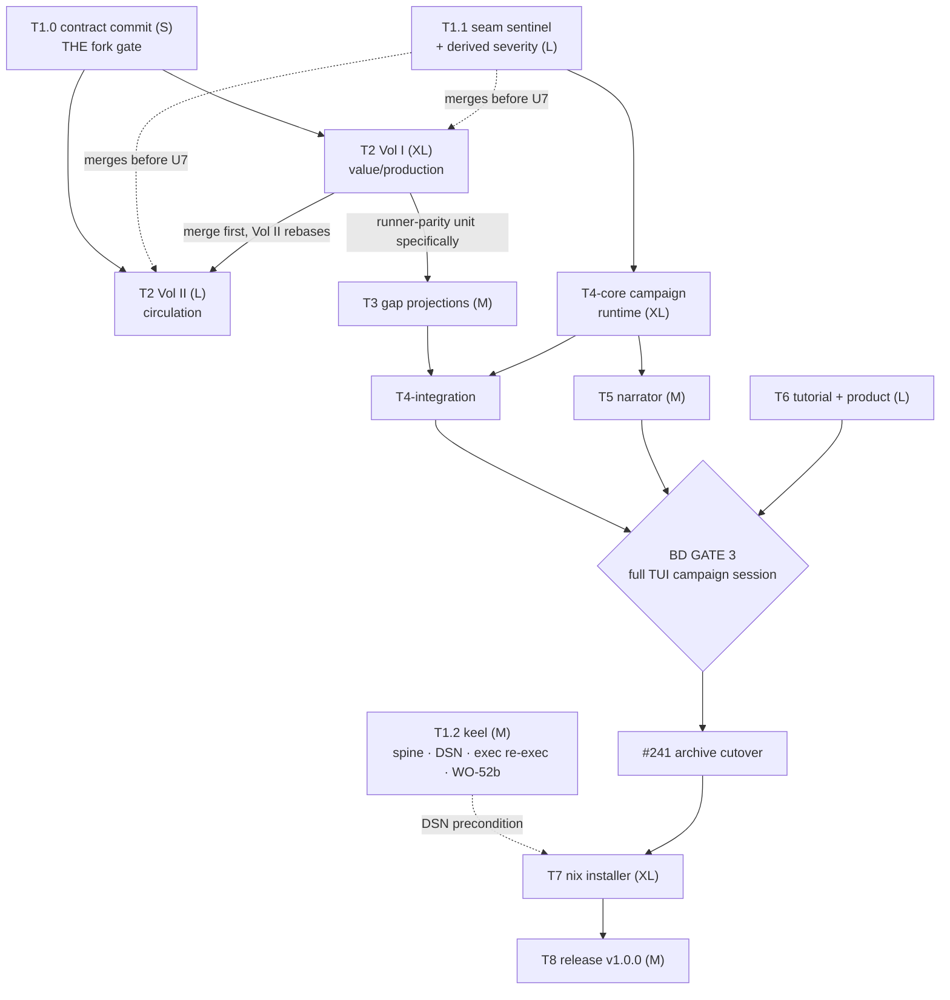

# Babylon v1.0.0 — The Playable Archive (master plan, FINAL)

> STATUS: RATIFIED — refined and BD-approved 2026-07-21 (remote plan session). All recon
> integrated, all BD rulings recorded, draft contradictions resolved, load-bearing claims
> re-verified against `origin/dev @ ca8f6090`
> (post-#243). Execution is **local-dev-box-bound** (drive data, Ollama, worktrees, mise
> single-flight); any remote execution must first rebase its working branch onto
> `origin/dev ca8f6090`.

## Context — why

The engine is deterministic and real; the game around it is not. Program 24 delivered the
TUI Archive shell (lobby, briefing, dossiers, verb plates, chronicle, map room, golden
vault) but **zero live campaign loop** — verified: no `run_tick`/`SimulationEngine`
reference anywhere in `src/babylon/tui/`, and `babylon play` (`cli/play.py`) still boots
the old two-node demo. The engine's chronic disease — fully-built-but-disconnected
subsystems (gated dormancy, stub-fed liveness, dead formula registrations, dead coupling
slots) — is documented by Vol I/II recon, the seam registry's DECLARED_CONDITIONAL rows,
and the test-port ledger's LOUD gaps.

BD directive (2026-07-21, max-effort): fix the engine **in service of the video game**.
Ship v1.0.0 with three end states — (1) **installable**: one shell script on any
Ubuntu/Debian box, local-first (game-managed Postgres, on-disk markdown vault, local
narrator); (2) **looks good**: KSBC dystopian-cyberpunk / underground-bolshevik palette
(DESIGN_BIBLE §9b, crimson/gold on near-black); (3) **playable**: the wiki-as-game
(read Archive → theorize → issue verbs → engine adjudicates → events revise the Archive),
tutorial MUST, save management, harmless to host. Two structural directives ride along:
weave the codebase through the Lawverian algebra (make the seam space finite and
machine-checkable), and run Vol I ∥ Vol II per the §10 parallel-workflow protocol.

## Verification stamp (this session, read-only vs origin/dev ca8f6090)

Confirmed TRUE: tui projection-purity contract (`pyproject.toml:638-645` forbids
tui→engine/persistence/django) · `cli/play.py` boots demo w/ "TUI client replaces this
body" docstring · `LobbyScreen` orphaned (`tui/campaign_menu.py:322`) ·
`ArchiveTickBaker.on_tick_committed` (`projection/vault/tick_baker.py:107,131`) ·
`NarratorCache.narrate`/`NarratorSideProcess.schedule`
(`projection/vault/narrator_cache.py:259,374`) zero production callers ·
`record_progress` (`persistence/babylon_meta.py:179`) unwired · seam registry exactly
**123 SeamEntry rows** (`sentinels/seam/registry.py`) · **11 BoundOppositions** in
`domain/dialectics/instances/catalog.py:466-608` (`build_default_registry`) ·
ADR090–ADR102 all present · `src/babylon/game/` absent (composition root is genuinely new).

Corrections folded in:
- **EventType = 84 members** (AST-counted; the draft's "82 at HEAD" was wrong — 84 wins).
- **Tick = 30 systems** (`_SYSTEM_CLASSES`, simulation_engine.py:324-355; now
  registry-derived with auto-partition, not a hand list).
- **CLAUDE.md is stale** (says 26 systems, 79 EventTypes, 23 formulas, 39 defines
  categories) → docs-hygiene fix rides T1.2.
- **ADR102 / Amendment Z** (PR #242): devshells now vendored into the babylon flake,
  infra submodule unmounted — T7's nix work builds on a self-contained in-repo flake.
- Line drifts vs draft recon are recorded above; treat file+symbol as canonical, not line.

## Decision record (BD rulings, binding)

| # | Decision | Ruling |
|---|---|---|
| 1 | Installer | **Nix bootstrap**: install.sh INSTALLS Nix for the user (ADR094 amendment reversing the :31-33 refusal; e.g. Determinate installer) → subscribes signed channel → closure carries game + PG/PostGIS/pgvector + reference-data fixed-output derivation + corpus + weights. BD-owed ceremonies: ed25519 keygen→CACHE_KEY, R2 cache+worker deploy, nix-release signing secret. apt fallback documented only. |
| 2 | Postgres | Game-managed cluster from the flake closure: initdb → `~/.local/share/babylon/pg`, unix socket, child process, superuser-in-own-cluster (PostGIS `CREATE EXTENSION` fine there). All-new code. |
| 3 | Default scenario | **Nationwide (3,191 counties)** ships as default ⇒ T4 gains the **incremental dirty-entity baker** as a REQUIRED unit; full-bake ArchiveTickBaker demoted to correctness baseline + Wayne CI golden path. Wayne stays in lobby. |
| 4 | Narrator | **Bundled weights first** (ADR096 D3 as ratified): BD uploads signed Llama 3.1 8B GGUFs to R2 pre-release. Chain: bundled → Ollama `llama3.1:8b` → CF `llama-3.1-8b-instruct-fast`/`-fp8` → mute. |
| 5 | Corpus redistribution | **Ship everything** (curated canon texts embedded in installer; NOT the raw 26GB mirrors — those stay BYO). Copyright exposure surfaced and accepted, recorded as owner ruling. REQUIRED: PROVENANCE/LICENSES file + "Built with Llama" attribution. |
| 6 | Embeddings | embeddinggemma-300m / 768-dim BOTH lanes (amend ADR096 D5 away from bge). No migration; corpus embeds once at ingest. |
| 7 | Vol II §2b | County-keyed territories + ScaleAdjunction (allocate⊣aggregate) binds hex data; no hex stamping. Settled pre-lane; U1 verifies, doesn't relitigate. |
| 8 | Canon additions | ALL: Cope, Marini, J. Smith, MIM Theory #1 (after re-OCR), MIWS csdraft, **Federici & Mies (canon extends to social-reproduction line)**. Nitzan-Bichler = Divergence-Channel steelman only. content.jsonl = canon poison, quarantined. Hoxha OUT. |
| 9 | LOUD gaps + borderline | BUILD all: economy dossier (Wc−Vc theorem + chip aggregates), field-state/Weather Layer, balkanization projection, event→territory anchoring, per-hex habitability. |
| 10 | WO-52b | Port ~11 spec-061 tests to projection/engine contracts + retarget 2 probes; observatory stays as local diagnostics until Grafana metropole. |
| 11 | Severity | Derived catalog column from Event Calculus (delegated ruling, made — see below). |
| 12 | Content-hash chain | **OUT of v1.0** (ruled this session): determinism warrant = qa:regression byte-identical + vault goldens + new wall-clock-leak sentinel. Chained per-tick content hash = named post-1.0 unit; verify story must not claim it exists. |
| 13 | Vol I ∥ Vol II | IN scope, §10 protocol, Vol I merges first on ties. |
| — | Standing | No-MVP; TDD; determinism ceremonies; sonnet implements / opus reviews / NEVER Fable; heavy gates single-flight (12c/31GB, earlyoom, BLAS=1); commit per unit; PRs self-merge on green. |

## Architecture spine (operative prescriptions)

### A. The algebra → the seam-algebra sentinel (T1.1)
One generator 𝔇 (bound oppositions → per-tick `GapReading`, freshness law) closed under
**C** composition (⊗/⊕, typed coupling graph), **G** coarse-graining (hex≺county≺state≺
nation; partitions are derived quotients), **P** projection (one-way functor, no morphism
back into state — enforced by the import lattice). Every construct exhibits a C/G/P
derivation tree back to registered oppositions (= its Aleksandrov chain = III.10 rent
record). Sentinel formalization (Lawvere 1991 co-Heyting boundaries): ambient graph G =
declared constructs + read/call/import/publish edges; live subgraph L = reachable from
production entry points (30-system tick, verb resolvers, observe()); **seam = ∂L**,
finite and machine-enumerable; disconnected subsystem = nonempty core severed from L.
The new family UNIFIES the existing inert/unconsumed/coupling/liveness/vocabulary/
dangling families under one boundary computation on a declared
construct→expected-consumer registry, plus three new checks:
1. **Gate-satisfaction** — enumerate construct-entry guards (`context.get(K)`,
   `services.X is None`, optional kwargs); red if no production supplier exists (closes
   vol2_step gate, LODES kwargs, transition_engine, reserve-army seeds).
2. **Stub-vs-calculator** — AST-classify live consumers fed literal/neutral constants
   while a registered calculator exists (closes `ReproductionBalance(condition_met=True)`).
3. **Severity single-source equality** (web == Archive == generated table).
Plus: config-less-logging check (spine), wall-clock-leak check (call sites feeding
P-tier/hashed artifacts — known leaks: observers/metrics.py, jsonl_recorder.py, run
manifest). Day-one catch list = open F-* dispositions (F-EC-1 dead noise formula, F-EC-2
dither, F-1/F-2 silent skips, F-3 warn-not-raise). CI: static ∂L in dev fast lane;
trace-based residuals nightly.

### B. Derived severity (T1.1, consumed by T4 autopause)
Today: web `_EVENT_SEVERITY` (engine_bridge.py) and Archive `EVENT_SEVERITY`
(chronicle_salience.py) are byte-identical hand-copied twins — 47/84 EventTypes
classified, no equality sentinel. Ruling: severity = **derived catalog column** from
(event kind × terminal proximity), not a hand list:
- ALARM (invariant residual) ⇒ CRITICAL always (III.11).
- CROSSING ⇒ CRITICAL iff terminal-adjacent (feasibility-atlas void-adjacency,
  regime→crisis entry, endgame-axis locks); reversible intra-level ⇒ informational.
- FLOW/ACT ⇒ warning/informational by salience floor, never critical.
- PATTERN inherits its base crossing's tier.
- Severity is INTENSIVE: bulletin tier = max-fold join, never sum.
- **Autopause keys on derived CRITICAL only.** Crimson = render tier for rupture.
Implementation: ONE generated table consumed by both surfaces + equality/single-source
sentinel (generalize `seam/checks.py` pattern); keep loud `unclassified→warning` floor.
Full R-EC-1 catalog codegen = staged post-1.0, not day-one.

### C. Economy dossier prescription (T3, from the TLJ/metabolic corpus)
(1) Fundamental-Theorem verdict read off `opposition_states["wage"].balance` — that IS
(Wc,Vc); NEVER a parallel Φ. (2) Φ tri-decomposition (φ_UE+φ_repro+φ_dom; φ_III_report
excluded). (3) Surplus split s=p+i+r+t. (4) ALL aggregates extensive ratio-of-sums, never
mean-of-ratios. (5) Matter-book flags: overshoot O=C/B, monotone ceiling M̄, honest
UNPOSITIONED absence for the energy vertex β_J (genuinely absent tree-wide); never render
money⇄matter as invertible. `metabolic` (J–T) can shadow-bind now; `somatic` waits on the
energy split. Amendment-S tripwire: β-simplex + severity are G∘P read-only projections —
feedback into physics = MAJOR amendment.

### D. Campaign runtime = ONE new composition root (T4)
TUI is projection-pure by contract; stores attach via structural Protocols (the WO-37
trick). The live loop is a NEW module OUTSIDE `babylon.tui` — `src/babylon/game/session.py`
— gluing real objects into existing seams:
- `cli/play.py` → boot composition root instead of demo.
- `tui/campaign_menu.py` LobbyScreen (orphaned) dismisses with campaign UUID → session boot.
- `tui/app.py` — add Screen modes (lobby→briefing→campaign) + advance-tick binding
  (ArchiveApp is single-page today).
- `projection/vault/tick_baker.py` ArchiveTickBaker already satisfies the engine's
  TickCommitObserver seam (headless runner drives it at runner.py:1616-1621) — construct
  one, hand it to the engine hook.
- `kernel/event_bus.py` clear_history()/get_history() around run_tick = per-tick event
  collection (as the WO-50 pilot does); promote
  `tests/integration/archive/test_pilot_first_action.py::_chronicle_events_from_bus`
  into src/ with real summary generation.
- Session lifecycle complete in PostgresRuntime (create_session, submit_turn,
  get_pending_turns, persist_tick_atomic + crash-resume via get_last_committed_tick).
- **The pacing loop is a BUILD**: `AsyncSimulationRunner` (engine/runner.py:42) has zero
  callers AND wraps the wrong facade — T4 builds a new Textual-worker paced driver
  (per-tick verb windows, autopause-ack, autosave), does not reuse it.
- **Incremental dirty-entity baker** (required, ruling 3): dirty-entity-driven +
  lazy bake-on-visit, batched vault commits, per-kind budgets (generalize spec-089 delta
  tracking beyond hex). Full-bake = correctness baseline + Wayne CI golden.

### E. Narrator lane ≈ 80% wiring (T5)
NarratorCache.narrate() + NarratorSideProcess.schedule() shipped, zero callers; TUI
already renders `{narrative}` fences (tui/directives.py). Integration = one schedule()
per committed tick from the composition root. Provider chain shipped (providers.py) per
ruling 4. The ONE genuine build: `v_*_trend` DeclaredViews over tick_summary
(projection/registry.py REGISTRY is the sanctioned extension point;
EndgameDetector.axis_progress() gives 5 continuous axes) — the "wind is blowing" digest.
Constraints (binding): narrator stays an in-process thread (vault `_COMMIT_LOCK` only
serializes threads); vault git DAG is latency-ordered ⇒ **narrator-ON non-reproducible
by design**; verify story excludes `narrative/**`; parity statement = "OFF
byte-reproducible, ON not, by design." Jinja asymmetry law: sandboxed Jinja for
deterministic pages ONLY; LLM prose via plain string building, never a template engine.
RAG retrieval: port the disabled web path's working logic (`director.py` SEMANTIC_MAP +
`RagPipeline.query(top_k=3)` + build_context_block) onto the vault prompt-builder,
filtered `metadata.role @> ["narrator"]` — do not re-derive.

### F. Observability Spine
Game-semantic events NEVER route through `logging` (LogRecord wall-clock/thread fields
are non-deterministic; R-EC-1 one-catalog rule). Diagnostics adopts logging fully:
central dictConfig + LoggingDefines, per-subsystem levels over the `babylon.*` tree,
structured JSONL handler in player data dir, TextualHandler debug console (T4/T6),
doctor + bug-report bundle (T6), installer log paths (T7). ONE severity vocabulary
projected one-way onto logging levels; log lines never become events.

### G. Determinism at the shipped entry point
No runtime BLAS pin and no PYTHONHASHSEED anywhere in the shipped path (tests only) —
and PYTHONHASHSEED cannot be set post-start: the `babylon` launcher must **os.execv
re-exec** with PYTHONHASHSEED + `*_NUM_THREADS=1` set (T1.2 code, T7 packaging).
Canonical campaign horizon = **5200 ticks** (100y × 52w) ⇒ save/resume is a RELEASE
BLOCKER, autosave cadence 52 (CHECKPOINT_EVERY_TICKS analog).

## Train structure

Critical path: `T1.0 → T2·VolI → T3 → T4-integration → GATE 3 → #241 → T7 → T8`.

- **T1.0 — Contract commit (S, THE fork gate)**: single PR (`chore/vol1-vol2-contract`) —
  reserved slots in `domain/dialectics/instances/catalog.py` for BOTH volumes (Vol I:
  value_usevalue, labor_laborpower, absolute_relative_surplus + fresh couplings; Vol II's
  2 existing dead slots), method-partition markers in `engine/tick/system/__init__.py`,
  shared binding-interface block, ADR numbers, shared-unit assignments (runner-parity →
  Vol I; dormancy sentinel → T1.1 keel — deliberate §10.2 deviation, flagged to BD).
  Contract surface at HEAD: 11 oppositions, 13 GraphInputs fields, 2 dead coupling slots.
- **T1.1 — Seam-algebra sentinel + derived severity (L)**: per spine A+B. New family
  under `sentinels/`, umbrella dispatcher key in `tools/sentinel_check.py`, wall-clock
  check included. Ceremony: conditional tiny/zero vault bake (physics untouched).
- **T1.2 — Keel services (M)**: Observability Spine core (dictConfig/LoggingDefines/
  JSONL) · **DSN unification** (BABYLON_PG_DSN:5433 / Django POSTGRES_*:5432 / doctor's
  BABYLON_DATABASE_URL → one scheme; precondition for T7 + Vol II rebase) · launcher
  os.execv re-exec (spine G) · assumptions-ledger surface · WO-52b test ports ·
  CLAUDE.md stale-count fixes (30 systems, 84 EventTypes, formula count, 45 defines).
- **T2 — Vol I (XL) ∥ Vol II (L)**: two worktrees, §10 protocol, U1–U9 + ceremony each.
  Vol I owns runner-parity for both service families (engine_bridge.py's "DELIBERATE
  TWIN" builder); Vol I merges first on ties; Vol II rebases + reruns battery. Ceremonies:
  Vol I real value-drift expected; Vol II likely all-zero-with-reason. Riskiest: Vol I U3
  accumulation loop; Vol II U4 step-lighting + county reconciliation (design SETTLED by
  ruling 7). LODES OD-matrix artifact = real parquet-pipeline work (CI-no-drive rule; no
  catalog entry exists today).
- **T3 — Gap projections (M)**: gates on **Vol I's runner-parity unit specifically** (the
  dossier reads the headless path, which today wires less economics than web). Economy
  dossier per spine C + field-state + balkanization + event→territory anchoring + per-hex
  habitability — all as DeclaredViews + fences. Vault ceremony.
- **T4 — Campaign runtime (XL, riskiest)**: T4-core forks after T1.1 (concurrent with
  T2): per spine D + save wires (`record_progress` call site, autosave @52) + autopause-
  ack on derived CRITICAL + endgame lock + incremental baker. T4-integration (after
  T3+Vol I): dossier/theorem/field pages into the campaign shell. Vault ceremony.
- **T5 — Narrator (M)**: after T4-core, per spine E + corpus embed at build/install time
  (ruling 5) + narrator on/off parity gate.
- **T6 — Tutorial + product surface (L)**: guided opening-arc overlay keyed to real
  campaign state + authored tutorial vault pages (concept_cards.py idiom, citation-
  traceable, baked through the same Jinja pipeline) + doctor (+ sextant-glyph font probe)
  + help + save browser + TextualHandler console.
- **★ BD GATE 3** (T4+T5+T6 merged) → **#241 cutover** (deletes src/frontend +
  web/accounts + fog shim ONLY; web/game + web/observatory survive) → before T8 goldens.
- **T7 — Installer (XL, nix bootstrap per ruling 1)**: install.sh installs Nix →
  subscribes signed channel → closure (self-contained since ADR102) carries game +
  postgresql/postgis/pgvector + reference-data fixed-output derivation (4.49GB DB,
  sha-pinned via R2) + curated corpus + GGUF weights (T7 spec decides closure-vs-R2-
  manifest artifact split). Game-managed cluster code (initdb/pg_ctl/unix socket) =
  all-new, riskiest unit. First-run DDL applier named explicitly (idempotent raw DDL +
  stamp table). Ollama fresh-box chain consent-gated (`ollama pull llama3.1:8b` ~4.7GB).
  Uninstall cleanup. Runbooks for each BD-owed ceremony (keygen→CACHE_KEY, R2 cache +
  worker deploy, GGUF upload, signing secret).
- **T8 — Release (M)**: KSBC aesthetic pass (re-bakes ALL Textual snapshots — snapshots
  are render SVGs, regenerate freely, NOT a ceremony) + full DoD battery + version
  ceremony per docs/versioning.md.

**Ceremony ledger (6)**: Vol I (real drift) · Vol II (likely all-zero) · T1.1 severity
(conditional) · T3 vault · T4 vault · T8 release. Vault manifests = content goldens.

**Governance batch riding T1.0/T1.1** (ADRs in `ai/decisions/`, individual files +
index.yaml): ADR094 amendment (installer installs Nix) · ADR096 D5 amendment
(embeddinggemma/768) · determinism-boundary ADR (econophysics cites distribution SHAPES,
never a stochastic runtime sampler) · canon-extension note (ruling 8) · §10.2
dormancy-sentinel deviation record · content-hash-chain deferral record (ruling 12).
Paper governance guards: metabolic "Part VI" renumbering collides with Episteme — do NOT
auto-apply; metabolic's "Amendment W" letter collides with ratified W → next amendment
takes AA+; all three math papers are DRAFT proposals, tree wins.

## Corpus + step zero (local-box-only)

- **Step zero — `~/Documents/ocr/`**: create tree + MANIFEST.yaml (fields: id, author,
  work, slugs, source_path, source_sha256, method, quality, canon_status, outputs[],
  extracted_at); layout `<author-slug>/<work-slug>/{source.json, full.txt, ch-NN-*.txt,
  pages/}`. Rescue `cope_full.txt` from ephemeral snapshots → `zak-cope/divided-world-
  divided-class/`; extract born-digital set (FPLmimp, Amin, mt10) + usable babylon_books
  text-PDFs; queue degraded-OCR set for `pipx run ocrmypdf`; record no-text scans as
  `quality: no_text` rows. Quarantine `content.jsonl` (canon poison). Corpus manifest
  globs point INTO this tree — extract once, ever.
- **Corpus manifest**: `src/babylon/data/corpus/manifest.yaml` + frozen-Pydantic
  `CorpusManifest` loader (mirror model_manifest.py); rows = path_glob/author/work/
  role-enum(narrator, atlas_*, concept_card, glossary, doctrine)/format/canon_status
  (allow|deny|flag_bd)/provenance; deny rows honored inside allowed globs. Replaces
  hardcoded `MVP_CORPUS` in `tools/ingest_corpus.py`. Ingestion REUSES the existing
  pipeline unchanged: import_corpus_files → RagPipeline.aingest_files →
  PgVectorStore.add_chunks; role rides chunk `metadata jsonb` for `@>` retrieval.
- **V1 set**: 9 works ≈ 413k words ≈ 2,900 chunks @ 768-dim — sub-minute ingest, ~9MB
  vectors — plus ruling-8 additions. Chunk ids sha256-derived; repro unit =
  manifest_sha256 + pinned model tag; **corpus never enters the tick hash**.
- **BD acquisition queue**: Sakai *Settlers* (absent everywhere), Hickel books, Sankara,
  Emmanuel ruling, Comintern *Armed Insurrection*, mt1.pdf re-acquire (worst scan),
  EPA GHGRP 2010–2023 snapshot (active rescission — urgent).

## v1.0.0 Definition of Done (T8 verifies)

`mise run check` green post-cutover · sentinels green incl. seam-algebra family + F-*
dispositions · qa:regression reconciled vs the 6 declared ceremonies · vault regression
green · fresh-VM nix-bootstrap install harmless to host, doctor green · tutorial
completes · full nationwide campaign session (live chronicle, autopause on derived
CRITICAL, dossier w/ computed theorem) · save/load + autosave + crash-resume round-trip ·
narrator on/off parity (OFF byte-reproducible; ON grounded by shipped corpus,
non-reproducible by design) · KSBC aesthetic everywhere · version ceremony v1.0.0.

**OUT of v1.0**: metropole/telemetry (CLI = honest no-op) · content-hash chain (ruling
12) · voice/fine-tuning · WSL · full R-EC-1 codegen · Vol I follow-ups (subsumption/
concentration) · international trade (standing deferral; the 4 trade CSVs are inferred
scaffolding — re-derive from Hickel 2021/Ricci 2019, register long-format one DORMANT,
never ship inferred numbers into Φ).

## Stated assumptions (veto in review if wrong)

Tutorial = opening-arc overlay + authored vault pages (prior ruling) · #241 merges
immediately after Gate 3, before T8 goldens · dormancy sentinel hoisted to keel (flagged
§10.2 deviation) · program codename = BD's pick at kickoff (placeholder: **"The Whole
Sky"**) · books-map mechanic groundings (automorphic-equivalence classes, network-
vulnerability repression targeting, RAND COIN doctrine axis, Weinstein/Wood bifurcation,
econophysics calibration) land as ADR citations when their trains land, not as v1.0 units.

## Execution kickoff order (on approval, local dev box)

0. **Step zero** (ocr tree + rescues + quarantine) — mechanical, immediate.
1. **T1.0 contract commit** (branch `chore/vol1-vol2-contract`, single PR, self-merge).
2. **Fork concurrent lanes**: T1.1, T1.2, T2 Vol I + Vol II worktrees (§10), T4-core
   worktree (after T1.1 merges).
3. **Governance batch** rides T1.0/T1.1 (ADR amendments + deviation records + BD-ceremony
   runbooks).
4. Each train = its own Workflow invocation; one worktree per lane; mutating agents
   serialized per worktree; sonnet implements / opus reviews (never Fable); scoped
   `test:q` in lanes; ALL heavy gates (test:unit, qa:regression, baseline/vault
   generation, fresh-VM install test) single-flight controller-scheduled; adversarial
   opus review at every unit boundary + whole-branch contract review on the second Vol
   merge.

## Verification

Per-train batteries + standing gates (`mise run check` · `check:sentinels` incl. new
seam-algebra family · `qa:regression` byte-identical or declared ceremony ·
`qa:vault-regression`) at every merge; the T8 DoD battery (above) end-to-end on a fresh
VM before tagging v1.0.0.
