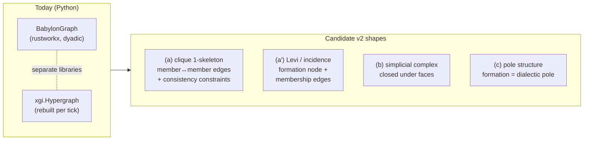

# Amendment D — Hyperedge Reconciliation: Phase-0 Analysis

**Program:** 27 (Refoundation), Phase 0, ruling **R7**
**Spec:** `docs/superpowers/specs/2026-07-28-program-27-refoundation-design.md` §4 item 5, §10, §13.1
**Plan task:** `docs/superpowers/plans/2026-07-29-program-27-phase-0-contracts-and-evidence.md` Task 15
**Status:** ANALYSIS ONLY — **DIRECTOR GATE**. Nothing here is ratified and nothing here
authorizes code. Per Constitution IX.3.4 (Transition State Protocol) II.7 stays blocked
until the Director rules; per R7 the `babylon-graph` crate may not commit a data shape
before that ruling.
**Authority to decide:** Persephone Raskova (Director, IX.5 / Amendment AD). Amendment D
touches the theoretical line (what a community *is* in the model), so IX.3.3's
escalate-to-amendment rung applies and the engineering default is explicitly forbidden
(adversarial finding M7).

---

## 1. The question, verbatim

Three principles carry the `[TRANSITION STATE — Pending Amendment D]` marker:

- **II.7 Edges vs Hyperedges** (`CONSTITUTION.md:404`) — *"Dyadic flows between two entities
  → morphism graph (II.9). N-ary membership → XGI hyperedge. Two layers MUST remain
  separate. Hyperedge overlap = solidarity potential; morphism edge = actuality. Edges per
  tick; hyperedges α-smooth. [TRANSITION STATE — Pending Amendment D: The v2 morphism graph
  is strictly dyadic. Reconciliation required: either (a) hyperedges as higher-order
  structures with 1-skeleton in the morphism graph plus explicit consistency constraints,
  (b) simplicial representation, or (c) hyperedges migrate to pole structure. Anti-Pattern
  VIII.9 MUST be preserved.]"*
- **II.3 Graph as Discretized Manifold** (`:396`) — the rustworkx+XGI dual-graph commitment
  must be reconciled with strict dyadism *"without collapsing hyperedges into pairwise
  edges (Anti-Pattern VIII.9)."*
- **I.18 Material-Ideological Distinction** (`:380`) — *"v1 implementation expressed this on
  hyperedges. v2 reimplementation must preserve the distinction without violating the
  dyadic morphism constraint or Anti-Pattern VIII.9."*

The two anti-patterns that bound every option:

- **VIII.9 Community as Pairwise Edge** (`:527`) — *"Community = XGI hyperedge, not
  combinatorial pairwise edges."*
- **VIII.10 Oppressor Hyperedge for Institutional Exclusion** (`:528`) — Category-2
  communities (DISABLED, QUEER, UNDOCUMENTED, INCARCERATED) have **no** paired oppressor
  hyperedge.

Registry entry (`:549`): *"Amendment D — Hyperedge Reconciliation (pending): rustworkx+XGI
dual-graph commitment and strictly-dyadic morphism constraint … Requirement: spec preserving
Anti-Pattern VIII.9."*

---

## 2. What the engine ACTUALLY does today

Everything in this section is `rg`-reproducible against `dev` at the time of writing.
Commands are in Appendix A.

### 2.1 There are **three** inconsistent treatments of n-ary membership in production

| # | Formation | Representation today | Is it a graph node? | Citation |
|---|---|---|---|---|
| 1 | **Community** | transient `xgi.Hypergraph`, rebuilt from scratch every tick | never (constitutionally prohibited) | `engine/systems/community.py:57-110`, `:346` |
| 2 | **Industry** (`ECONOMIC_SECTOR` hyperedge) | a first-class graph **node** (`NodeType.INDUSTRY`) whose members are `frozenset` attribute payloads | **yes** | `models/entities/industry.py:6-26`, `models/world_state.py:767-769`, `:996` |
| 3 | **Dialectic pole** | `PoleBinding.community_id` — a pole that *is* a community, by hyperedge id, mutually exclusive with `opposition_key` | n/a (off-graph registry) | `domain/dialectics/core/opposition.py:164-198` |

Treatment 2 is worth reading twice. `IndustryHyperedge` is docstringed *"Pydantic
representation of an ECONOMIC_SECTOR hyperedge in XGI"* (`industry.py:7`) — the same
`HyperedgeCategory` enum as communities (`models/enums/community.py:58-78`) — and yet it is
stamped as an ordinary `NodeType.INDUSTRY` graph node carrying
`member_business_ids: frozenset[str]`, `member_worker_block_ids`, `county_fips`. So the
engine **already ships a hyperedge-as-node with membership-as-attribute**, hydrated from the
reference DB (`engine/hydration/reference.py:694-805`), while simultaneously prohibiting the
same move for communities. That inconsistency is unratified, undocumented as a decision, and
is itself part of what Amendment D has to dispose of.

### 2.2 The community lane is live code over dead data

- `CommunitySystem` is registered at MATERIAL_BASE position 6.0 (`community.py:318-319`,
  `simulation_engine.py:296,335`) — it runs every tick.
- Its first two guards short-circuit: `services.community_hypergraph` is **never wired by
  any production caller** (`engine/services.py:250` default `None`; the only non-None
  construction in the tree is a unit test, `tests/unit/engine/systems/test_community_system.py:300`),
  and no scenario builder populates `SocialClass.community_memberships`
  (`models/entities/social_class.py:438`).
- The seam registry records this formally: payload `community_memberships`, liveness class
  **`STRUCTURALLY_IMPOSSIBLE`**, *"no-ops every tick: no scenario builder assigns
  SocialClass.community_memberships anywhere in production"* (`sentinels/seam/registry.py:2170-2192`).
- The whole `domain/bifurcation/` package (1,655 LOC across 8 modules) takes `H: xgi.Hypergraph`
  and has **zero production callers** — `bifurcation_tendency(` and `BifurcationMonitor(`
  appear only under `tests/`.

**Consequence for the ruling:** whichever option is chosen, *no baseline moves and no
scenario output changes*, because nothing downstream of the hypergraph is reachable today.
Amendment D is being decided at the cheapest moment it will ever be decided at. It is also
the last cheap moment: ADR171 (National Question, 2026-07-28) names a production writer for
`SocialClass.community_memberships` as the designated seeder — *"the data program unblocks
the community hypergraph, which is the only honest engine transport for the opposition"* —
and its Phase 2 is explicitly blocked on that seam. Ratifying D fixes the shape that program
will write into.

### 2.3 The XGI dependency surface (exact)

`xgi>=0.10.0,<0.11.0` is a **default runtime dependency** (`pyproject.toml:64`). Imports:

- **7 files under `src/`**: `engine/systems/community.py`, `engine/graph_wrappers.py`,
  `engine/bifurcation_monitor.py`, `domain/bifurcation/{analysis,axis,bridges,consciousness}.py`
- **6 files under `tests/`**
- Total XGI-touching Python: **~3,392 LOC** (community system 675, graph wrappers 157,
  bifurcation 1,655 + monitor 137, projections 388).

The API surface actually consumed is tiny — this is the porting cost, and it is small:

| XGI call | Uses in `src/` |
|---|---|
| `xgi.Hypergraph()` | 18 (mostly type annotations) |
| `H.nodes.memberships(n)` | 4 |
| `H.edges.members(e)` | 4 |
| `H.add_node` / `H.add_edge` | 1 / 1 |
| `xgi.incidence_matrix(H, sparse=False, index=True)` | 1 |
| `H.num_edges` | 1 |

Note the one linear-algebra call: `community_overlap_matrix` computes `O = I @ Iᵀ`
(`community.py:182-207`) — the co-membership count matrix. **The incidence matrix `I` is
already the object the engine computes with.** Every option below is, at bottom, an argument
about where `I` is allowed to live.

### 2.4 The presentation estate already renders hyperedges — in three shapes

- Python projections: `projection/topology/{paoh,incidence,levi}.py` plus
  `projection/community.py` (1,504 LOC in `projection/topology/` total).
- The **Rust client already ships the renderers**: `rust/crates/babylon-tui/src/views/topology.rs`
  has a PAOH hyperedge-column renderer, an `incidence` "node × hyperedge membership grid"
  (`:125-132`), and a Levi ego-tree kind (`:115`), with golden tests
  (`tests/topology_2d.rs`).
- `projection/topology/levi.py:1-39` states the design canon plainly: *"S9 — Levi/bipartite
  ego-trees — matching hypergraph-rs's internal bipartite representation — the visualization
  walks the storage structure"*, and records its own Amendment-D posture: *"this module only
  reads and orders bipartite membership; it defines no mutation affordance."*

So the client contract (II.8) already assumes an **incidence/bipartite** view of communities.
Any ratified option that cannot produce a node × hyperedge incidence projection costs a
rewrite of shipped, golden-gated client code.

### 2.5 What the Rust side already has

`hypergraph-rs` (sibling repo, BSD-3-Clause) is **already a rev-pinned cargo git-dependency
of the client** — `rust/crates/babylon-tui/Cargo.toml:50`, rev `0c95db06`, currently behind
the optional `raster` feature for `cells3d`/`raster-png`. Its core is not a new dependency;
it is a feature flag away.

What that core *is* (`hypergraph-rs/plans/phase-0-1-workspace-core.md`, header):

> *"The hypergraph IS a `rustworkx_core::petgraph::stable_graph::StableDiGraph` with two node
> kinds (`Agent` and `Hyperedge`) connected by `MembershipEdge` edges. This bipartite
> representation makes it a genuine rustworkx-core plugin. `IndexMap` bimaps provide O(1)
> id-based lookup while preserving insertion order (III.7 determinism parity)."*

Implemented (`crates/hypergraph-rs/src/core/`): `hypergraph.rs` 1,183 LOC,
`dihypergraph.rs` 649 (directed memberships with `DiRole::{Tail,Head}`),
`simplicialcomplex.rs` 407 (closure under faces + a lazily-cached face lattice),
`views.rs` 356, `kinds.rs` 46:

```rust
pub enum NodeKind<N, E> { Agent(N), Hyperedge(E) }
pub struct MembershipEdge<M> { pub member_data: M }
```

Two facts follow that the 2026-04 option list could not have known:

1. **The bipartite (Levi) substrate and the `StableDiGraph` working default for
   `babylon-graph` are the same object.** A hyperedge layer is not a second graph library in
   Rust; it is two node kinds and one edge kind in the graph we were going to build anyway.
2. **The simplicial option is already implemented**, so option (b) can be judged on its
   merits rather than its cost — and its merits are where it fails (§4.3).

Determinism note: XGI stores members in plain hash-ordered `set`s (order varies with
`PYTHONHASHSEED`); hypergraph-rs is insertion-ordered throughout. Moving to it is a III.7
**improvement**, and the conformance tests compare memberships as sets precisely because the
Python side cannot promise order.

### 2.6 What the dialectical algebra needs from the hyperedge layer: almost nothing

`ai/THE_FORMALISM.md:230` — *"the graph's edges are strictly dyadic; n-ary formations live in
the XGI hyperedge layer and reach the algebra only through `PoleBinding.community_id` (§I.4).
Amendment D's reconciliation stays pending; nothing in this formalism forces it (the algebra
references hyperedges only through the binding indirection, read-only)."* And `:1007` —
*"Amendment D — untouched by this algebra … whatever reconciliation D ratifies slots in
behind that boundary. hypergraph-rs adoption likewise changes bindings' implementation, not
the algebra."*

This is load-bearing: **II.9 (Morphism as Dyadic Relation, P0) is not in play.** No option
below proposes an n-ary morphism. The morphism graph stays strictly dyadic in all four.
What is in play is only where the *membership* relation lives and whether the dyadic layer
can see it.

Also verified: the VIII.10 problem is **already solved in the dialectics layer**, not by the
hyperedge layer. `OppositionSpec.flavor = "apparatus"` means *"institutional exclusion with
no oppressor community"*, with a validator that forbids a community binding on the apparatus
pole (`opposition.py:232-251`). No live opposition binds a `community_id` today and no
`flavor="apparatus"` instance is registered — both are declared vocabulary awaiting the same
seam ADR171 is blocked on.

### 2.7 The armed guard that any ruling must re-aim

`NoCommunityFanOut` / INV-010 (`engine/invariants.py:434-505`) walks every
`EdgeType.MEMBERSHIP` edge and fails if its source node's `_node_type == "community"`.
Its docstring cites II.7 + VIII.9 directly. Two honesty notes:

- It is **only instantiated by a test**
  (`tests/property/invariants/test_community_membership_lint.py`) — the vocabulary registry
  records this as an open finding (`sentinels/vocabulary/registry.py:674-694`): *"wire
  `NoCommunityFanOut` into a real invariant runner, or delete it the same way."*
- Its predicate is *source-node-type* based, so it forbids **any** community→member edge —
  including a derived incidence edge. Options (a) and (a′) both require re-aiming it
  (§4.1, §4.2). That re-aiming is a sentinel-estate change and therefore lands in the
  Program-27 §6.3 sentinel disposition table either way.

---

## 3. A correction to the option list before we evaluate it

The three options were drafted in v1.6.0 (2026-02-25), before the Levi/bipartite substrate
existed in the estate. Read literally, **option (a) says "1-skeleton"**, and the 1-skeleton
of a hypergraph is its **clique expansion**: for a hyperedge with members
{m₁…mₙ}, the pairwise edges {mᵢ, mⱼ}. That is textually the thing VIII.9 bans
("combinatorial pairwise edges"), rescued only by the "explicit consistency constraints"
clause.

The **Levi graph is a different object**: it adds a node for the *formation* and one
incidence edge per membership. It mints **no member↔member edge at all**, so the n-ary
object survives as one object. This is what `hypergraph-rs` implements, what
`projection/topology/levi.py` renders, and what `xgi.incidence_matrix` already gives the
engine.

Because these are materially different and only one of them is in the constitutional list,
this analysis evaluates **four** options and asks the Director to rule on the corrected set:



---

## 4. The options

Each option is judged on: substrate shape in Rust · VIII.9 · VIII.10 · I.18 · determinism ·
BSL/fuel · migration cost · what it forecloses.

### 4.1 Option (a) — clique 1-skeleton in the morphism graph + explicit consistency constraints

**Rust substrate.** `babylon-graph`'s `StableDiGraph` carries a derived `EdgeKind::CoMember`
edge for every co-membership pair, plus a side table of formations. The hyperedge object
still exists (otherwise there is nothing to derive from), so this option is strictly *more*
structure than (a′), not less.

**VIII.9.** This is the anti-pattern's literal text. It survives only under a rule that the
1-skeleton is (i) derived, never authored, (ii) never adjudicated on — every system that
cares about solidarity potential must read the formation, not the expansion. That rule is
not mechanically checkable by node type (the current INV-010 shape); it needs a
provenance-carrying edge and a sentinel that proves no system's *decision* reads a derived
edge. That is a new sentinel family with a new error class, in a program whose §6.3
disposition table is already the largest sentinel work item.

**VIII.10.** Neutral — expansion says nothing about oppressor pairing.

**I.18.** Poor. The ideological dimension (today `TernaryConsciousness` on the hyperedge,
`community.py:104-107`) has no home on a member↔member edge; putting it there is
simultaneously VIII.1 (Solidarity as Scalar) and VIII.9. It would have to stay on the
side-table formation object — at which point the 1-skeleton is carrying only the material
half and the two halves live in two structures with a consistency obligation between them.
I.18's "gap" becomes a cross-structure join instead of a computable quantity.

**Determinism.** Expansion order must be canonicalized (sorted member ids), and every
membership mutation must re-derive O(n²) edges inside the tick — a large, order-sensitive
write set on the hash path.

**BSL / fuel (spec §5 Totality).** Fatal. The static bound is computed against declared
per-EdgeType `max_cardinality` ceilings. Incidence is **linear** in Σ|members|; clique
expansion is **quadratic**. Concretely, for one formation spanning one class position in
every county (n = 3,153, the committed `us_county_territories.json` cardinality):
incidence = 3,153 edges; clique = **4,969,128** edges. At agent granularity (n = 100,000)
the clique is ~5.0 × 10⁹. Any honest declared ceiling for a co-member edge type is therefore
either absurd or rejects the rule at content load.

**Migration cost.** Highest of the four: new edge kind, new derivation pass, new provenance
sentinel family, re-aimed INV-010, plus the formation side table you needed anyway.

**Forecloses.** Nothing formally, but it commits the tick path to a quadratic write set that
Article IV/Amendment R's nationwide mandate makes permanent.

### 4.2 Option (a′) — Levi / incidence bipartite inside one typed substrate *(not in the current list)*

**Rust substrate.** One `StableDiGraph` (the working default) whose node payload is a kind
enum — entities on one side, **formations** on the other — and whose edge payload
distinguishes `Morphism(EdgeType)` from `Incidence(MembershipData)`. The "morphism graph"
becomes a **filtered view** that cannot contain incidence edges; the "hyperedge layer"
becomes the filtered view that cannot contain morphisms. This is exactly
`hypergraph-rs`'s `NodeKind::{Agent, Hyperedge}` + `MembershipEdge<M>` (§2.5), which the
repo already depends on at a pinned rev.

**The constitutional gain, stated precisely.** II.7's "Two layers MUST remain separate" was
implemented in Python as *two libraries*, because two libraries was the only enforcement
Python offered. In Rust the separation becomes a **type-level property**: a dyadic system
literally cannot be handed an incidence edge, because the view's item type is
`(&Entity, &Entity, &EdgeType)`. II.7's MUST stops being a lint and starts being a thing
that does not compile — the strongest form of Amendment AD's "the gates license the
autonomy."

**VIII.9.** Preserved *by construction*: no member↔member edge is ever minted. The
combinatorial object VIII.9 bans (`C(n,2)` pairwise edges) has no representation. What the
anti-pattern is materially protecting — that a community's solidarity potential is a property
of the *formation*, not a sum over pairs — is exactly what the incidence representation
keeps: `O = I · Iᵀ` (already the engine's own computation, `community.py:197-206`) is
derived on read for the systems that want overlap, and is never stored as edges.

**VIII.10.** Preserved: `HyperedgeCategory` stays an attribute of the formation node
(`community.py:104`, `postgres_schema.py:844`), the apparatus-flavor rule stays in the
dialectics layer (`opposition.py:232-251`), and no pairing is implied by the substrate.

**I.18.** Best of the four, and this is the decisive argument. The two dimensions get **two
distinct typed homes with a computable gap between them**:

- *material basis* → the incidence edge payload (`MembershipEdge<M>`: role, strength,
  visibility — today's `CommunityMembership` fields) plus the member node's
  `MaterialConditionsBuffer` (agitation, exploitation visibility, reification —
  `models/components/material_conditions.py:8-11`, whose own docstring says *"Consciousness
  is NOT stored here — it lives on community hyperedges"*);
- *ideological dimension* → the formation node payload (`TernaryConsciousness` r/l/f +
  `ideological_contestation`, `community.py:104-107`).

I.18's "GAP between material position and ideological consciousness … the terrain of
political struggle" then becomes a quantity you can *compute per formation per tick* from
two typed fields — which is what III.10 (Earn-Its-Keep) demands of any construct: a law, a
prediction, or a running computation. Under every other option that gap is either homeless
(a), inflated across 2ⁿ faces (b), or routed through an observes-only channel (c).

**Determinism.** Inherits `StableDiGraph` + `IndexMap` insertion ordering (III.7 parity, and
an improvement on XGI's hash-ordered member sets). Incidence edges are a normal edge kind on
the hash path; no derivation pass.

**BSL / fuel.** Best: |incidence| = Σ|members(c)|, linear, so `max_cardinality` ceilings are
declarable honestly and folds over `members(c)` have a static bound equal to the declared
ceiling. Levi ego-tree walks are statically depth-bounded at 2 by bipartiteness — a property
`projection/topology/levi.py:82-95` already invokes against Power-of-10 rule 2.

**Migration cost.** Lowest. `hypergraph-rs` core is already a pinned dependency; the API
surface to reproduce is the six calls of §2.3; the client renderers (PAOH, incidence grid,
Levi) already consume this exact shape; the Postgres `community_snapshot` table
(`postgres_schema.py:836-879`) is already formation-keyed with material and ideological
columns side by side. Costs: (i) re-aim INV-010 from "no community-sourced MEMBERSHIP edge"
to "no member↔member edge derived from a roster, and no morphism view containing an
incidence edge" — a sentinel-disposition row, not new machinery; (ii) rule on the
`IndustryHyperedge` inconsistency (§2.1), since under (a′) industries and communities finally
have one shape.

**Forecloses.** Nothing. A simplicial view can still be *derived* on demand from an incidence
substrate (`hypergraph-rs` composes `SimplicialComplex` over `Hypergraph`), and pole binding
(§4.4) remains available as the algebra's read path — indeed `PoleBinding.community_id`
keeps working unchanged.

**Honest cost.** It is a **wider** reading of II.7 than the letter: today's "two layers" are
two *libraries*; under (a′) they are two *views of one graph*. If the Director reads II.7's
"MUST remain separate" as requiring separate storage, (a′) needs that sentence amended — and
the amendment text in §8 does exactly that, explicitly, rather than quietly.

### 4.3 Option (b) — simplicial representation

**Rust substrate.** `SimplicialComplex` composed over the bipartite hypergraph
(`hypergraph-rs/src/core/simplicialcomplex.rs`, 407 LOC, already implemented): adding an
n-member simplex also adds **every subface of size ≥ 2**.

**VIII.9.** Preserved in the narrow sense (the top simplex is one object) but the closure
mints every pair as a 1-face — the clique expansion arrives anyway, as a *consequence of the
axiom* rather than a design choice. Option (b) is (a) with extra steps and no derivation
control.

**VIII.10.** Neutral.

**I.18.** Poor and, worse, ambiguous: if faces are formations, does a 3-member subface of
the SETTLER community carry its own `TernaryConsciousness`? Either answer is bad — "yes"
fabricates 2ⁿ ideological states with no material referent; "no" means the complex is
carrying structure the theory does not use.

**Aleksandrov (III.8).** This is the material objection and it is decisive. Closure under
faces asserts *every subset of a community is itself a formation*. Babylon's communities are
constituted by a **shared material position** (a legal status, an oppression axis, a
lifecycle phase — `HyperedgeCategory`, `models/enums/community.py:58-78`), not by
sub-selection. Name the material process that makes an arbitrary 4-member subset of the
UNDOCUMENTED community a distinct formation: there is none. Constructs that cannot name
their material process are banned regardless of elegance (III.8), and III.10 bans them
regardless of implementation availability.

**Determinism.** Achievable (the implementation uses sorted `BTreeSet` enumeration) but the
enumeration is exponential.

**BSL / fuel.** Fatal, by an order of magnitude worse than (a): faces of size ≥2 number
2ⁿ − n − 1. n = 20 → 1,048,555; n = 30 → 1,073,741,793. No declared cardinality ceiling
survives contact with a real community.

**Migration cost.** Code cost is low (it exists); theory cost is a re-founding of what a
community is; runtime cost is unbounded.

**Forecloses.** Effectively everything: an exponential substrate cannot later be narrowed
without re-founding again.

**Verdict offered to the Director:** reject as the *membership* substrate; retain simplicial
as an available **derived** construct for small, deliberately-closed structures (e.g. a
coalition face lattice) if and when one earns III.10 keep on its own.

### 4.4 Option (c) — hyperedges migrate to pole structure

**Rust substrate.** No hyperedge layer at all. Formations become poles in the opposition
registry: `PoleBinding.community_id` already exists (`opposition.py:186-190`), and
`PoleReading(opposition_key, entity_id, side, sigma)` (`:138-160`) is already a
*per-entity incidence record with a signed weight*. Membership = the set of pole readings for
that opposition.

**VIII.9.** Preserved trivially — nothing pairwise is minted. This is the option's real
strength, and it is the one the constitution's own type system was already leaning toward:
the `PoleBinding` docstring says so outright — *"This is the VIII.9 n-ary protection in type
form — reducing an internal nation (a community) to a bare dyadic pole string is
forbidden."*

**VIII.10.** Preserved, and better than I expected before checking: the shipped
`flavor="apparatus"` design (`opposition.py:232-251`) already models institutional exclusion
as community-vs-apparatus with a validator forbidding a community on the apparatus pole. No
counterpole is fabricated. *(This corrects an intuition worth recording: the obvious
objection — "the dialectic needs two poles, VIII.10 says there is only one" — does not hold;
the estate solved it.)*

**I.18.** Mixed, and the mixture is the problem. A pole carries a **scalar** material σ, plus
(Amendment T, ratified v2.16.0, `CONSTITUTION.md:581`) an authored `sigma_authored` whose
**divergence is observes-only** and *"may not mask, route, gate, or otherwise change any tick
output"* until a declared promotion ceremony. Two consequences:

1. Today's ideological state is a **ternary distribution** (revolutionary /
   assimilationist-liberal / assimilationist-fascist, plus contestation —
   `formulas/consciousness_routing.py`, `community.py:104-107`). Collapsing it to a scalar
   pole weight is a **theory change**, reserved to the Director under IX.5, not an
   engineering call. Keeping the ternary means the pole payload becomes a vector, which is a
   pole-structure change (I.19 is P0).
2. If the material/ideological gap is expressed as Amendment T's divergence, then **I.18 —
   "the terrain of political struggle" — becomes non-adjudicating by construction** until a
   promotion ceremony. Amendment D would be resolving I.18's transition state by moving it
   into an observes-only channel. That is a defensible ruling, but it must be made
   deliberately.

**The overlap problem.** II.7's *"Hyperedge overlap = solidarity potential"* requires
co-membership: agents in ≥2 shared formations. Pole readings can express it (an entity has
readings on several oppositions) but computing overlap then means assembling an entity ×
opposition incidence matrix from the registry — i.e. **re-deriving `I` outside the graph**.
Option (c) does not eliminate incidence; it relocates it to a structure with no edge
semantics, no persistence table (`community_snapshot` is formation-keyed today), and no
existing renderer (PAOH/incidence/Levi all consume rosters).

**Determinism.** Fine — the registry is insertion-ordered.

**BSL / fuel.** Fine — linear in readings.

**Migration cost.** Cheapest in *substrate* code (no graph work), most expensive in
*theory*: a Director ruling on ternary→pole payload, a re-home for `CommunityState`'s seven
material fields (heat, cohesion, infrastructure, visibility, legal_status, category, cost
modifiers), a rewrite of the community projection + PAOH/incidence/Levi renderers, and a
new overlap derivation. It also strands the `community_snapshot` DDL and ADR171's seeder
design, which assumes a roster.

**Forecloses.** The most, in one specific way: with no formation object in the topology,
*there is nothing for `PoleBinding.community_id` to bind to* — the binding indirection
THE_FORMALISM relies on (`:230`, `:1007`) becomes a self-reference. Option (c) is best
understood as **(a′) with the formation reified as a pole instead of a node**, plus a theory
cost — not as a cheaper alternative.

---

## 5. Comparison

| | (a) 1-skeleton | **(a′) Levi/incidence** | (b) simplicial | (c) pole structure |
|---|---|---|---|---|
| VIII.9 preserved | only by policy | **by construction** | axiomatically violated in effect | by construction |
| VIII.10 preserved | yes | yes | yes | yes (apparatus flavor) |
| I.18 home | homeless / split | **two typed homes + computable gap** | ambiguous across faces | scalar (or vector) pole; gap = T divergence → observes-only |
| II.9 dyadic morphism | unaffected | unaffected | unaffected | unaffected |
| Edge cardinality | O(Σn²) | **O(Σn)** | O(Σ2ⁿ) | O(Σn) readings |
| n=3,153 formation | 4,969,128 | **3,153** | ≈10⁹⁴⁹ (2³¹⁵³ has 950 digits) | 3,153 |
| BSL static bound (spec §5) | rejects at load | **declarable** | rejects at load | declarable |
| Determinism | order-sensitive re-derivation | **insertion-ordered, no derivation** | deterministic but exponential | insertion-ordered |
| Rust code already exists | no | **yes (pinned dep)** | yes (unusable) | partially (registry) |
| Client renderers reusable | no | **yes (PAOH/incidence/Levi)** | no | no |
| Sentinel work | new provenance family | re-aim INV-010 | new + unbounded | retire INV-010, new pole guards |
| Theory ruling needed | no | rule on `IndustryHyperedge` shape | re-found "community" | ternary→pole (ideological line) |

---

## 6. Recommendation (argued, not assumed)

**Recommend (a′): one typed substrate, formations as a distinguished node kind, membership as
incidence, clique expansion prohibited outright, simplicial available only as a derived,
III.10-justified construct.** The argument, in the order the evidence supports it:

1. **It is the only option that makes II.7's MUST mechanical.** "Two layers MUST remain
   separate" is currently enforced by using two libraries and one test-only invariant
   (§2.7). Under (a′) it is enforced by the type of the morphism view. Amendment AD licenses
   agent autonomy on gates; this converts a lint into a gate that cannot be forgotten.
2. **It is the only option where I.18 earns III.10 keep.** Material fields on the incidence
   edge + member node, ideological fields on the formation node, the gap computable per tick
   (§4.2). The transition-state marker on I.18 exists precisely because v1 put both halves on
   the hyperedge; (a′) splits them along the same seam the theory does.
3. **It survives BSL's static totality bound.** Linear incidence is the only cardinality any
   honest `max_cardinality` declaration can carry at Article IV nationwide scale (§4.1, §4.3).
   The spec's Power-of-10 Rule-2 claim (§5 Totality) is true under (a′) and false under (a)
   and (b).
4. **It is the cheapest migration by a wide margin** and the only one that does not throw away
   shipped, golden-gated client code (§2.4, §2.5).
5. **It preserves every escape hatch.** `PoleBinding.community_id` keeps working; simplicial
   views can be derived; the dyadic morphism graph is untouched.

**On the `babylon-graph` working default (R7's "working assumption: dyadic `StableDiGraph`
via the rustworkx-core re-export").** The default survives ratification of (a′) *unchanged in
kind*: it is still one `StableDiGraph`, still reached through the rustworkx-core re-export,
still petgraph-via-re-export-only (the hypergraph-rs lesson). What ratification adds is the
**payload enums**: `NodeKind::{Entity(...), Formation(...)}` and
`EdgeKind::{Morphism(EdgeType), Incidence(MembershipData)}`, plus the two filtered views. It
is therefore *not* true that the working default already implies the answer — a strictly
dyadic `StableDiGraph` with no formation kind would silently decide Amendment D by
engineering default, which is exactly what M7/R7 forbid. Under (b) the crate would instead
compose a `SimplicialComplex`; under (c) it would carry no formation kind at all and the
registry would grow the incidence surface. The three rulings produce three different crates.

**Two riders the recommendation carries** (both Director calls, listed in §9):

- **The `IndustryHyperedge` inconsistency (§2.1)** should be dispositioned in the same
  ruling: under (a′) an `ECONOMIC_SECTOR` hyperedge is a `Formation` node with incidence
  edges, exactly like a community, and the frozenset-attribute shape retires at the port. If
  the Director prefers industries to remain ordinary nodes, that exception should be written
  into the amendment rather than left as an undocumented divergence.
- **INV-010's re-aim and wiring** (§2.7) is a sentinel-disposition row in Program 27 §6.3,
  and the vocabulary registry's open finding ("wire it into a real invariant runner, or
  delete it") should be closed by the port rather than carried.

---

## 7. Proposed amendment text (ratifiable verbatim)

> **Amendment D — Hyperedge Reconciliation** (proposed): N-ary formations remain
> **first-class objects**, never combinatorial pairwise edges: a formation is a distinguished
> **node kind** in the single graph substrate and membership is an **incidence edge** carrying
> the per-membership material payload (the Levi/bipartite representation), so that a
> formation of *n* members costs *n* edges and mints no member↔member edge — Anti-Pattern
> VIII.9 is preserved by construction rather than by policy, and Anti-Pattern VIII.10 is
> untouched (pairing remains a declared attribute of the formation, and institutional
> exclusion remains the dialectics layer's apparatus flavor). II.7's "two layers MUST remain
> separate" is henceforth satisfied by **type-level separation within one substrate** — the
> morphism view is strictly dyadic and cannot contain an incidence edge, and the incidence
> view cannot contain a morphism — superseding the pre-v2 requirement of two separate graph
> libraries; II.9 is unchanged and no n-ary morphism is created. I.18 is discharged by
> **splitting its two dimensions across the two typed homes** — material basis on the member
> node and the incidence payload, ideological dimension on the formation node — with their
> gap a per-tick computable quantity (III.10 keep: a running computation, not vocabulary).
> **Clique/1-skeleton expansion of a formation is prohibited**, and simplicial closure is not
> the membership substrate: a simplicial view may exist only as a derived construct that
> earns its own III.10 justification. The dialectical algebra continues to reach formations
> only through `PoleBinding.community_id`, read-only and unchanged. II.7, II.3, and I.18
> leave `[TRANSITION STATE]`.

*(Versioning note: this removes a transition state and rewrites II.7's enforcement clause,
so it is at least **MINOR** under IX.1; if the Director treats "two layers MUST remain
separate" as a redefined constraint, it is **MAJOR**. Program 27's v3.0.0 amendment is a
MAJOR carrier already, so registering D inside that cycle is available and cheap.)*

---

## 8. DIRECTOR RULING REQUIRED

**D-1 — The option.** Ratify **(a′) Levi/incidence bipartite in one typed substrate**
(recommended, §6), or (a) clique 1-skeleton with consistency constraints, or (b) simplicial,
or (c) pole structure. Note that (a′) is a *correction* to the constitutional option list
(§3), so ruling for it also ratifies the corrected set.

**D-2 — II.7's separation clause.** Does "two layers MUST remain separate" permit
**type-level separation inside one substrate** (recommended: yes — it is strictly stronger
than two libraries), or does it require separate storage? A "requires separate storage"
ruling keeps two graph objects in the Rust kernel and should be stated so `babylon-graph` is
built that way.

**D-3 — I.18's discharge.** Accept the two-typed-homes split with a computable gap
(recommended), or route the material/ideological distinction through Amendment T's
observes-only divergence channel (the consequence of (c); §4.4), or leave I.18 in transition
state pending a separate ruling.

**D-4 — `IndustryHyperedge` (§2.1, ideological-line adjacent).** Do `ECONOMIC_SECTOR`
hyperedges become `Formation` nodes with incidence edges like communities (recommended:
one shape), or is the current hyperedge-as-ordinary-node-with-frozensets ratified as an
exception?

**D-5 — Ternary consciousness.** Confirm that the community's ideological state stays the
**ternary distribution** (r / l / f + contestation) on the formation object. Only a (c)
ruling puts this in question; it is called out because it is a theoretical-line item
reserved to the Director under IX.5.

**D-6 — Simplicial disposition.** Confirm simplicial closure is **not** the membership
substrate and is available only as a derived construct with its own III.10 justification
(recommended), notwithstanding that `hypergraph-rs` already implements it.

**D-7 — Versioning + carrier.** Register Amendment D inside Program 27's v3.0.0 MAJOR
amendment cycle (recommended, cheap), or as its own numbered amendment.

**What the ruling unblocks / what stays blocked without it:**

- Unblocks: `babylon-graph`'s data shape (Program 27 Phase 1, spec §10) — the crate cannot
  land without it (R7).
- Unblocks: the II.7/II.3/I.18 transition-state markers, and with them IX.3.4's blanket
  prohibition on implementing hyperedge logic — which is why every hyperedge consumer in the
  tree is dormant (§2.2).
- Unblocks (downstream, not in this program): ADR171's Phase 2, whose designated seeder
  writes into the very shape this ruling fixes.
- Stays blocked without it: nothing else in Phase 0. This analysis and the freeze tag do not
  depend on the ruling; only Phase 1's graph crate does.

---

## Appendix A — Reproducing the evidence

```bash
# §2.1 three treatments
rg -n "class IndustryHyperedge" -A 26 src/babylon/models/entities/industry.py
rg -n "_node_type=NodeType.INDUSTRY" src/babylon/models/world_state.py
rg -n "class PoleBinding" -A 35 src/babylon/domain/dialectics/core/opposition.py

# §2.2 dead lane
rg -n "community_hypergraph" src/ tests/
rg -n "STRUCTURALLY_IMPOSSIBLE" -B 8 -A 12 src/babylon/sentinels/seam/registry.py
rg -n "bifurcation_tendency\(|BifurcationMonitor\(" src/ web/ tests/

# §2.3 XGI surface
rg -l "^import xgi" src/ ; rg -l "import xgi" tests/
rg -no "xgi\.[A-Za-z_]+|H\.nodes\.[a-z_]+|H\.edges\.[a-z_]+" src/ | sed 's/.*://' | sort | uniq -c

# §2.4 renderers
rg -ni "hyperedge|levi|incidence" rust/crates/babylon-tui/src/views/topology.rs
wc -l src/babylon/projection/topology/*.py

# §2.5 Rust substrate (sibling repo, read-only)
sed -n '1,10p' /home/user/projects/game/hypergraph-rs/plans/phase-0-1-workspace-core.md
cat /home/user/projects/game/hypergraph-rs/crates/hypergraph-rs/src/core/kinds.rs
rg -n "hypergraph-rs" rust/crates/babylon-tui/Cargo.toml

# §2.7 the armed guard
rg -n "class NoCommunityFanOut" -A 20 src/babylon/engine/invariants.py
```

Cardinality figures: incidence = Σ|members|; clique = Σ n(n−1)/2 (n=3,153 → 4,969,128;
n=100,000 → 4,999,950,000); simplicial faces of size ≥2 = 2ⁿ − n − 1 (n=20 → 1,048,555;
n=30 → 1,073,741,793). n=3,153 is the cardinality of the committed county artifact
`src/babylon/data/game/us_county_territories.json` (`counties`: 3,153 entries).
