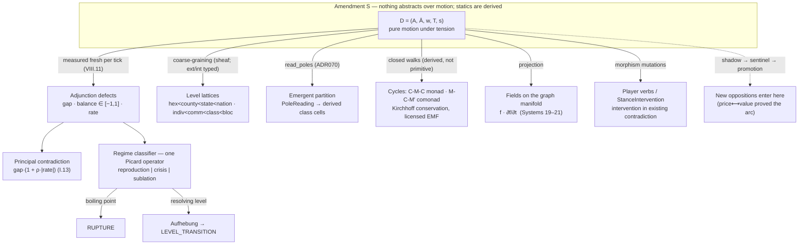

# Topological Dialectic Theory — Review & v2 Restatement

**Status**: Theory synthesis, chat-derived — not a constitutional artifact
**Date**: 2026-07-17
**Supersedes**: the Jan–Feb 2026 formulation (chats: *Topological invariants in Marxist dialectics*, *Topological tensor physics*, *Discrete state changes over sliding scales*, *hypergraphs*, *Shadow value matrix / TVT*)
**Grounded against**: CONSTITUTION.md v2.10.0 (Amendments A, K, L, N, P, Q, R, S), ADR051, ADR070, ADR072 (proposed), ADR073, ADR077, ADR078; chats through 2026-07-17 (*Lawvere's dialectic category*, *Player verbs as morphism mutations*, *Generalizing Marx's cycles*, *Kondratiev cycles*)

---

## 1. What the original theory said (January–February 2026)

Reconstructed from the founding chats. TDT began as a question — *what are the invariants and fixed points of a generalized dialectic?* — and produced ten claims. Its sibling, Topological Value Theory (TVT, Feb 1), instantiated the framework for value theory specifically (TSSI + reproductive labor + core–periphery); this document tracks the general framework.

**C1 — The phase space.** Dialectics acts on the product space Ledger × Topology × Archive: a finite manifold approximation, a discrete graph space, and a path-dependent embedding space. The tick step function is the dialectical map.

**C2 — Qualitative leaps are homological.** Track β₀ (solidarity fragmentation), β₁ (cycles/redundancy), and χ = V − E through simulation. Quantity→quality transitions appear as discontinuous jumps in Betti numbers; rupture should correlate with jumps in χ. The invariants are *detectors*, watching the system from outside.

**C3 — Fixed points are suspect; attractors are tendencies.** A fixed point of sublation is politically Fukuyaman. Communism-as-attractor sidesteps end-of-history while preserving tendency. Contradictions are negative-index fixed points (repellers). Lefschetz numbers, not Brouwer, for detection — no convexity assumptions on social configuration spaces.

**C4 — Consciousness is Morse-theoretic.** Consciousness drifts on a potential landscape: `df/dt = −∇V(f) + coupling·Σⱼ wᵢⱼ(fⱼ − fᵢ) + noise`. The George Jackson bifurcation is a saddle point; critical-point indices classify the decision thresholds.

**C5 — Percolation gates collective action.** When the SOLIDARITY subgraph crosses the percolation threshold and a giant component spans class fractions, collective action becomes possible. Ising-flavored: local interactions, global order parameter.

**C6 — Lattice field theory, not general relativity.** The graph is the discretized manifold — topological data (connectivity), not geometric data (no metric, no line element). Tensors are field values at nodes; flows are gauge-field-like values on edges. The GR framing (contradiction-as-Riemann-curvature, ideology-as-Faraday-tensor) was rejected in the founding week: no transformation group, no invariance, no ds². This rejection was the theory's first negative result.

**C7 — The dialectical calculus.** The complete local characterization of a contradiction at node *i*, tick *t*: magnitude `f(i,t)`, temporal character `∂f/∂t`, acceleration `∂²f/∂t²`, spatial character `Δf(i)` (graph Laplacian), and topological character `κ(i)` (mean Ollivier-Ricci curvature of incident edges). The synthesis: **the Laplacian is the second derivative of the field; Ricci curvature is the second derivative of the space itself.** Negative curvature traps contradiction (no alternate route for the gradient to equalize through); positive curvature dissipates it (solidaristic redundancy). Hard boundary drawn: graph Laplacian and Ollivier-Ricci are the natural objects at this resolution — no Riemann tensors, no connections, no parallel transport.

**C8 — The continuity equation.** Contradiction is conserved: it does not appear or disappear, it *flows*. If contradiction decreases at A and increases at B, the gradient along the connecting edge accounts for the transfer. Proposed as the framework's flagship falsifiable prediction (against Detroit data).

**C9 — Circuits are spirals with holonomy.** M-C-M′, C-M-C, D-P-D′, P…P share the non-closing structure X → Y → X′ with X′ ≠ X. Fiber-bundle framing: the circuit is the base loop, value magnitude the fiber, and going around produces holonomy proportional to surplus extraction — flat connection = simple reproduction, curvature = expanded reproduction.

**C10 — Potential vs actuality is a two-layer topology.** N-ary membership (hypergraphs, XGI) is *potential*; pairwise flow edges are *actuality*. Hyperedge overlap creates solidarity potential; the SOLIDARITY edge realizes it. Hyperedges α-smooth; pairwise edges move per tick.

---

## 2. The audit

Every claim, its disposition, and where its descendant lives. Dispositions: **SURVIVED** (landed essentially as stated), **TRANSFORMED** (the insight landed under different machinery), **DIED** (rejected, with reasons), **UNWIRED** (still theory, no production referent).

| # | Original claim | Disposition | Current form | Anchor |
|---|---|---|---|---|
| C1 | Ledger × Topology × Archive phase space; step = dialectical map | TRANSFORMED | The Trinity demoted to a durability layer; `World` is the single runtime structure and `tick(world, actions)` is literally the pure map. Deeper: the *space is no longer prior* — see §3.1. | II.6, II.10, Amendment S |
| C2 | Betti/χ jumps detect qualitative leaps | TRANSFORMED + UNWIRED | β₀ survived as Π₀ of the connectivity cylinder — the **atomization opposition's gap**, measured inside the motion rather than observed from outside. χ-tracking and β₁ never shipped; TopologyMonitor has zero production call sites. The leap signal is now `EventType.LEVEL_TRANSITION` from the regime classifier. | ADR051 Phase B/E2, deferred: topology_monitor_unwired |
| C3 | Attractors/repellers; Lefschetz detection | TRANSFORMED | One Picard operator `W_{n+1} = T(W_n)` with a three-outcome regime classifier: **reproduction** (\|rate\| ≤ ε), **crisis** (rising unresolved gap), **sublation** (rising gap + a resolving level above). RUPTURE is the crisis regime's boiling point, not a separate mechanism. Lefschetz never landed. Equilibrium stability is constitutionally banned (I.8), so the fixed-point regime is always transient — the politics of C3, enforced as law. | ADR051 E2, I.8 |
| C4 | Morse potential; Jackson bifurcation as saddle | **DIED — with a theorem** | The (r,l,f) simplex work proved the potential formulation *cannot exist*: the Jackson asymmetry (f→r forbidden or ε-gated; r→f carries capacity transfer) breaks detailed balance, and by Kolmogorov's criterion no potential/free-energy function exists for the dynamics. The asymmetry lives irreducibly in the **directed flow field**. MaxEnt F = E − T·S formulations rejected on the same grounds. | ADR051 deferred: rlf_simplex_to_071 |
| C5 | Percolation gates collective action | SURVIVED | The connectivity cylinder over the SOLIDARITY subgraph is a first-class adjunction instance (atomization). Retrofitted with Lawvere's cohesion: Π₀ ⊣ Δ ⊣ Γ ⊣ ∇ — pieces, atomized/discrete, points, universal-class/codiscrete — all computable on the graph. | ADR051 Phase B; *Lawvere* chat 2026-07-15 |
| C6 | Graph as discretized manifold; GR cosplay banned | SURVIVED as constitution | II.3 (library-independent manifold commitment, now rustworkx), III.3 (Physics Cosplay Prohibition), II.12 (authoring → sparse matrix → operator algebra; the algebra is the source of truth). | II.3, III.3, II.12, Amendment L |
| C7 | The dialectical calculus (f, ∂f, ∂²f, Δf, κ) | PARTIAL | `f` and its derivatives shipped: Systems 19–21 write `contradiction_fields`/`field_derivatives` in production (2,595 rows on the canonical run vs zero, ever, before). The Laplacian is constitutionally *named* (III.8's own example: diffusion of solidarity pressure). **κ is unwired**: no shipped ADR puts Ollivier-Ricci in the tick path. See §5 for the file-name correction. | ADR051 E0; III.8 |
| C8 | Continuity equation: contradiction conserves | TRANSFORMED — and strengthened | Matured into the **Conservation law over generalized Cycles**: per-edge ΔV = creation + net transfer; creation is nonzero *only* on living-labor and biophysical-throughput morphisms; global transfers sum to zero. Kirchhoff's law with constitutionally licensed EMF sources. Unifies c+v+s balance, honest-Φ antisymmetry, Marx's two aggregate equalities, and ΔB in one parametric sentinel law — earned under the ≥2-real-incidents rule via three named production failures. | *Generalizing Marx's cycles* 2026-07-17; III.10 |
| C9 | Circuits as spirals; fiber-bundle holonomy | TRANSFORMED | The bundle framing lost to the categorical one: M/C is the adjunction already in ADR051's value-form instance; **C-M-C is its monad, M-C-M′ its comonad**; surplus is the adjunction defect. `Cycle` is a *derived* closed walk in a category of value-forms — deliberately not a new primitive (Amendment S discipline; no amendment fired). D-P-D′ and the ΔB circuit are further instances of the same parametric law. | *Generalizing Marx's cycles* 2026-07-17 |
| C10 | Hypergraph potential vs pairwise actuality | SURVIVED, in transition | Ratified as II.7 with Anti-Patterns VIII.9/VIII.10. The v2 dyadic morphism constraint (II.9) put it in `[TRANSITION STATE]` pending Amendment D's reconciliation. The potential/actuality asymmetry itself is untouched. | II.7, II.9, VIII.9, Amendment D (pending) |

---

## 3. The three moves that changed the theory's shape

The audit table records dispositions; three of them are structural inversions worth stating outright, because they change what "Topological Dialectic Theory" *means*.

### 3.1 Topology was demoted from stage to instrument

The January theory had an implicit ordering: the space exists, dialectics act on it, invariants watch the action. Amendment A (v2.0.0) inverted the bottom — `Dialectic[A, B]` became the irreducible unit and the four-node partition became derived. Amendment S (v2.10.0) closed the top: the dialectic is the **apex abstraction** — pure motion and change and the mechanics of its unfolding — and *nothing may abstract over it*. Every higher-order formalism in the system — tensors, fields, partitions, level lattices, phase classifiers, endgame configurations — is a coarse-graining, composition, or projection of dialectical motion. Statics are derived; motion is primitive; a representation that stores a state without the mechanism of its change is presumptively wrong.

Under this ordering the graph is not the phase space the dialectic lives in. The graph is a **measurement surface**: `GraphInputs` snapshots feed the registry; pole readings, fields, and defects are *read off* it each tick. The manifold commitment (II.3) survives — connectivity still determines flow — but as one projection of dialectical motion among several, not as the ontological floor. January's title had the emphasis backwards: it is not topology, with dialectics on it; it is dialectics, with topology as one of their instruments.

### 3.2 Invariants became defects

The January program was observational: compute β₀/β₁/χ, watch for jumps, call the jumps leaps. What shipped is operational: contradiction is a **measured adjunction defect** — `gap` (Laclau's failure of an identity to close), `balance ∈ [−1, 1]`, `rate` — recomputed fresh every tick, never accumulated (VIII.11: the pre-Amendment-K accumulator pinned at exactly 1.0 by ~t100 and carried no information; the fresh gap moves 0.09–0.667 across the canonical run). The principal contradiction is ranked, per Mao's I.13, as `gap · (1 + rate_weight·|rate|)`. The leap is not an observer noticing a Betti jump; it is the regime classifier — the *same* Picard operator — finding a resolving level and emitting `LEVEL_TRANSITION`.

This is the difference between a seismograph and a fault line. January proposed instrumentation; Amendment K made the contradiction itself the moving part, with the measurement inside the motion. The observational program isn't dead — it's the unwired remainder (TopologyMonitor, χ, β₁) — but the theory's center of gravity moved from *detecting* qualitative change to *constituting* it.

### 3.3 Scale entered the theory

January had no account of aggregation; the theory lived at one resolution. The current theory's scale machinery is arguably its most original shipped mathematics:

**Level lattices with Aufhebung.** Spatial (hex < county < state < nation) and social (individual < community < class < bloc) lattices, with an Aufhebung operator: an opposition unresolvable at level L may resolve at L+1 — cancel, preserve, lift, as an executable operation. **Resolution is variance decomposition**: a field is resolved at level L iff the within-(L+1)-region variance of its L-aggregates is zero.

**The extensive/intensive variance theorem** (from the Lawvere retrofit). Extensive quantities (labor-hours, population, value stocks) are covariant — they push forward by summation, and conservation is naturality of the pushforward. Intensive quantities (r, s/v, OCC, gaps, Φ-rates) are contravariant ratios — they restrict but never sum. "Never store derived quantities" (II.2) stops being a house rule and becomes a type theorem: summing an intensive across a partition is a *variance error*, not just bad practice. The level closure uses `aggregate_intensive` (share-weighted mean) precisely because a contradiction gap is a ratio; H3 aggregation is named as a sheaf — gluing = conservation, functoriality across resolutions.

This is where the January theory's missing coarse-graining question — the one Amendment B still owes a proof for — acquired its machinery.

---

## 4. TDT v2 — the current statement

The updated theory, as it actually stands in ratified text and shipped code, 2026-07-17.

**4.1 The primitive and the apex.** `D = (A, Ā, w, T, s)`: typed poles, principal-aspect weight `w ∈ [−1, 1]`, motion operator `T` (pure `step`), sublation predicate `s` (the glyph σ was freed in v2.8.0 for the I.2a spectrum coordinate). Three universal invariants enforced every tick: weight bounds, type stability, `step` closure. The dialectic is simultaneously the irreducible bottom and the un-abstractable top (Amendment S). Anything proposed as a peer or superior of the dialectic requires a MAJOR amendment; anything expressible as dialectic structure, composition, or measurement does not.

**4.2 Contradiction as measured defect.** An opposition is a Galois connection / adjunction whose failure to close is measured, not asserted: gap, balance, rate — fresh per tick. Six bound oppositions as of today: capital_labor, wage, tenancy (county level), atomization (class level), imperial (bloc level), and **price⟷value** (ADR077/078, the newest — see 4.8). Principal contradiction ranking implements I.13. Known flagged tension: the regime classifier keys off CAPITAL_LABOR's per-county field rather than the abstract Maoist principal, because a large *static* gap (atomization = 1.0 in a disconnected county) can hold the principal slot while capital_labor is the one developing.

**4.3 The fixed-point theory.** One Picard operator; three regimes; RUPTURE as the crisis regime's boiling point (principal gap over threshold AND rising — Mao's condition and level). Reproduction (|rate| ≤ ε, defines-owned `tension.regime_rate_epsilon`) is the fixed-point regime and is constitutionally forbidden from being a resting place (I.8 bans equilibrium stability). "Communism as attractor" from C3 has no shipped referent; its nearest descendant is the sublation branch plus chained Aufhebung — and the endgame layer is explicitly in flux (moving from the 5-outcome adjudicated detector toward emergent/fixed-horizon patterns), so this remains the theory's open teleology question, deliberately unanswered by mechanism.

**4.4 Space.** The graph is the discretized manifold (II.3, rustworkx-bound but library-independent); the operator algebra on sparse matrices is the mathematical source of truth (II.12); fields and their first derivatives live in production (Systems 19–21). The curvature term κ of the dialectical calculus remains theory — proposed, argued for (negative κ traps contradiction; positive κ dissipates it), never wired. The two-layer potential/actuality topology (hyperedge membership vs pairwise flow) is ratified but in transition state pending Amendment D.

**4.5 Conservation.** The continuity equation grew into the general law: over any Cycle (a derived closed walk in the category of value-forms), yield = enclosed creation + net transfers; creation occurs only on living-labor and biophysical-throughput morphisms; transfers globally sum to zero. Kirchhoff with licensed EMF. Cross-frame checks (money vs labor-value vs biomass) stay **advisory** until ADR051's deferred frame-transformation machinery lands — otherwise the sentinel meant to catch the Φ trap reconstructs it.

**4.6 The subject.** Player verbs are **morphisms on dialectics, never subclasses of them** — ratified in ADR051 Phase C2 ("player verbs as morphism mutations") and proven in production by spec-071's `StanceIntervention` channel (Fascist_Pull pushes a signed intervention onto the live registry; it instantiates nothing). Theoretically load-bearing: contradictions are the deterministic output of material conditions; practice is intervention in existing contradiction — sharpen w, shift s-conditions, lay the SOLIDARITY edges that reroute the Jackson bifurcation — never creation ex nihilo. An `Educate` that *is-a* Dialectic would be idealism with a class analysis.

**4.7 The material–ideological gap.** I.18's gap between structural position and consciousness is acquiring executable form as the **Divergence Channel** (ADR072, proposed): a pole reading pairing a materially-measured σ with an authored/subjective `sigma_authored`, their divergence — `|sigma_authored − σ| / 2` — surfaced as the first-class signal that catches "safe on paper, collapsed in the base." Status honesty: design-only; the generic `shadow` mechanism it specified *was* built (by ADR077, as the reusable slice); the chauvinism⟷internationalism binding is unbuilt; Amendment T (observes-only charter) awaits BD ratification. Since C4's potential landscape is dead by the Kolmogorov result, this divergence structure — not a Morse surface — is now the theory's account of consciousness: a directed flow field with a broken detailed balance, audited against material ground truth.

**4.8 How new phenomena enter: the shadow-first epistemology.** The theory now includes its own extension protocol, and it was exercised end-to-end *today*. Markets entered Babylon not as an order book, not as agents, not as a bespoke system, but by the owner's directive: "Don't build a bespoke market system — **register an opposition**." Price⟷value mapped term-for-term onto the primitive: A = price (phenomenal form), Ā = value (substance), MELT the unit of the adjunction, tension = the scissors, resolution = the correction. ADR077 landed it shadow (excluded from principal ranking, frames, rupture, regime; byte-identical baselines); ADR078 executed the promotion ceremony — canonical binding, deterministic feedback into the material base (claim-holder wealth evaporation on the bourgeois brackets, reserve-army influx, a conservation-preserving Σ=0 wealth-axis velocity impulse), regenerated baselines, authorizing ADR. The arc — observe → sentinel → promotion — is the epistemology Amendment S implies: new phenomena earn their way in as dialectics or coarse-grainings thereof, first watched, then wired. ADR070 ran the same pattern for class partition (PoleSample/PoleReading/read_poles; partitions *within* the dialectic, never over it; UNPOSITIONED nodes get no reading — absence over fabrication).

**4.9 Long waves as spectra.** Kondratiev periodicity is an **output** — a spectral property of the registry's slow modes — and an initial condition (the 2020s hydrated as K-winter), never an input. Mandel's asymmetry is a binding ruling: the downswing is endogenous (its generators get built); the upswing is not automatic and may occur only through adjudicated event-layer outcomes (fascist bifurcation +1, war devaluation, re-division of the periphery). Any endogenous "spring" is forbidden. This closes a door the January theory left open: cyclicity is something the dialectical field *exhibits*, never something imposed on it.

**4.10 The meta-law.** Earn-Its-Keep (III.10, ratified from the governing rule of the refactor): a categorical construct ships only with a LAW, a PREDICTION, or a running COMPUTATION — never as vocabulary. Together with the Aleksandrov Test (III.8: every formal construct traces to a material relation) and the Physics Cosplay Prohibition (III.3), this is the theory's immune system. TDT v2 is smaller than the sum of everything ever proposed in the chats *because* of these three principles, and that is its strength.

---

## 5. Negative results

The theory's rejections are as load-bearing as its assertions; several are the most scientifically respectable things in it.

**The no-potential theorem.** Consciousness dynamics on the (r, l, f) simplex admit no potential or free-energy formulation: the Jackson asymmetry breaks detailed balance (Kolmogorov's criterion), so the January Morse picture is not merely unimplemented — it is impossible for this system. The asymmetry is irreducibly a property of the directed flow field. Entropy `H(r,l,f)/log 3` survives as diagnostic only (permutation-symmetric, cannot carry the asymmetry).

**The GR ban** (founding week, ratified as III.3). Curvature-as-contradiction and ideology-as-field-tensor borrowed notation without transformation laws. Nothing with a Christoffel symbol has ever passed review.

**The accumulator ban** (VIII.11, Amendment K). Contradiction intensity as an add-only ratchet saturates and carries no information — the empirical corpse is the pre-K tension field pinned at exactly 1.0 by t100. Intensity is a fresh measured gap, per tick, forever.

**Symbol-rewriting is not dialectics** (the *babylon algebra* review). A unary rewrite rule on labeled symbols — x + x → x + successor(x) — with no inverses, no distributivity, no model theory, is an author picking the next symbol and calling it necessity. Rejected as a genre.

**No dyadic collapse of n-ary formations** (VIII.9), **no oppressor-hyperedge for institutional exclusion** (VIII.10), **no direct (c,v,s)→(r,l,f) maps** (ADR051 deferred), **no Riemann machinery past Ollivier-Ricci** (Feb 24 boundary ruling).

**A correction to the record.** The Feb 24 chat cited `babylon_ricci_final.csv` as "your Ollivier-Ricci curvature calculations." Checked today: that file is **Andrea Ricci** — unequal-exchange value-transfer tables (Ricci Table 6.2/6.6, GVC flows, core/periphery, paired with the Hickel drain data). Economist, not geometer. The Ollivier-Ricci computations, if they exist as artifacts, live elsewhere; as far as the ADR record shows, curvature has never been computed in the tick path. The dialectical calculus's κ term is therefore *fully* unwired, not partially.

---

## 6. Open frontiers

Ordered roughly by theoretical weight.

**Amendment B — the partition invariance proof.** Still pending since v2.0.0: prove the {Core, Periphery} × {Bourgeoisie, Proletariat} partition is recoverable under morphism-preserving coarse-graining without loss of predictive power. The scale machinery (§3.3) now exists to state this precisely — extensive/intensive typing, sheaf gluing, variance-decomposition resolution — which makes it tractable in a way it wasn't in January. This is the deepest open mathematics in the theory, and ADR070's shadow partition sentinel is quietly generating its empirical side (seeded-vs-derived agreement rates).

**Amendment D — hyperedge reconciliation.** C10's two-layer topology vs the strictly-dyadic morphism constraint (II.9). Three candidate resolutions on record (1-skeleton + consistency constraints; simplicial; migrate to pole structure). I.18 is also blocked on this.

**Amendment T + the Doctrine binding.** The divergence channel's constitutional charter awaits BD ratification; the only genuine authored⟷material instance needs `DoctrineTree.calculate_tags()` wired to a real binding. When it lands, I.18 becomes measurable for the first time.

**Observation relativity.** `observe()` is frame-dependent (a commodity through the Transformation frame shows price-of-production; through the Imperial frame, unequal-exchange distortion) — deferred because a single frame computes nothing. The frame-transformation machinery is also what would promote cross-frame conservation from advisory to gating.

**The transformation problem.** Φ is still measured as the bounded (w−v)/(w+v) asymmetry proxy, not the full value→price-of-production transformation. TVT's TSSI commitments are the stated route.

**The unwired observational layer.** TopologyMonitor (zero production call sites), χ and β₁ tracking, and κ. Under III.10 these ship only when someone names the law, prediction, or computation — the honest possibilities: κ as a *prediction* about where corrections localize (negative-curvature bridges should trap the scissors gap); β₁ as a *law* about repression resilience (Sparrow cutset targeting should reduce β₁ before it reduces β₀).

**The endgame.** The 5-outcome adjudicated detector is ruled to move toward emergent/fixed-horizon patterns; whatever lands must be expressible as a projection of dialectical motion (Amendment S) — the last place C3's attractor question will be answered, if it is answered at all.

**Verify-against-repo** (no chat-side resolution possible): whether the graph Laplacian is wired anywhere in the tick path or only constitutionally named; the disposition of the old `edge_curvature` table under ADR075's 99-table triage; the current engine system count (ADR073 seats Doctrine at 28th, ADR077 seats MarketScissors @17.8 as 30th — the project prompt's "28 systems" has aged, as predicted).

---

## 7. The one-paragraph version

The Topological Dialectic Theory began (January 2026) as a search for the invariants and fixed points of a generalized dialectic acting on a graph phase space, with homological jumps as the signature of qualitative change. Six months of collision with the engine inverted it. The dialectic `D = (A, Ā, w, T, s)` is now both the irreducible primitive and the apex abstraction — pure motion under tension, over which nothing abstracts (Amendment S). Contradictions are not detected by invariants watching from outside; they are measured adjunction defects — gap, balance, rate, fresh per tick — ranked into a principal, classified into regimes by one Picard operator whose boiling point is rupture and whose upward escape is Aufhebung across level lattices. Space is a measurement surface, conservation is Kirchhoff with licensed EMF, the subject intervenes through morphism mutations, consciousness is a detailed-balance-breaking flow field with a divergence audit against material ground truth, long waves are spectra of the registry's slow modes, and new phenomena — markets, most recently, in a single day — enter the world only by registering as oppositions, shadow-first, promoted by ceremony. What survives of the original topology is what earned its keep: the manifold commitment, the percolation-as-atomization instance, the field calculus's first two derivatives, and the discipline — Aleksandrov, Earn-Its-Keep, no cosplay — that killed everything else.
