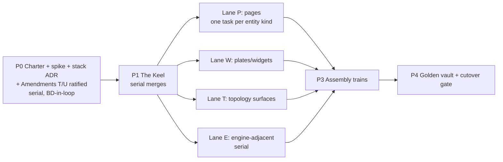

# Babylon — North Star & Roadmap v2 (the Archive pivot)

**As of:** `dev@72def41c` (2026-07-19 18:29 ET, PR #213). Supersedes the July Design Backlog Roadmap (pinned `dev@744f865`, already 202 non-merge commits stale). Companions: `claude/2026-07-19-archive-interface-design.md` (binding rulings R1–R8), `claude/2026-07-19-archive-stack-research.md` (starting pins). Constitutional citations verified against `CONSTITUTION.md` v2.10.0 (A–S). Verified by clone inspection, not memory.

**Changelog:** rev 2 (same day) adds §5 Git Doctrine (agent-first git workflow) and §6 Required Constitutional Amendments; renumbers the decision/engine queues to §7/§8; adds invariant 6; corrects the Epic 14 Natural Earth note (already cataloged since v1.8.2 — only NLCD needs the amendment).

---

## 0. North star (undated; everything else churns, this shouldn't)

Babylon is a deterministic engine read through **The Archive** — a wiki the player inhabits in a terminal. Every entity the organization knows is a page; every relation is a link; play is reading the files, forming a theory, and issuing verbs the engine adjudicates. Between engine and eyes there is exactly one kind of thing: a **declared projection**. Clients are disposable; projections are the product.

Invariants:

1. **The engine never learns the client exists.** Zero engine-value drift from interface work; `qa:regression` byte-identical except at declared ceremonies.
2. **Fog, veil, and absence are properties of projections, not widgets.** No political value serializes outside organizing reach; below-veil sessions never receive value-axis payloads; a missing record renders as a loud absence block. Loud Failure extends to pixels (III.11).
3. **No LLM in the input path.** Narrator prose is attributed, cached by `(entity, tick, model_pin)`, and optional; the game is fully playable and fully informative with it off (R4/S5).
4. **Rendering is deterministic and golden-gated.** III.7 extends to renders: ordered projections, sandboxed sim-time-only templates, snapshot baselines, a golden vault in CI.
5. **Work ships as plans of agent-sized tasks, tagged parallel-safe or serial, integrated on trains, ruled by batched BD decisions.** The estimation unit is one agent context window. Ceremonies are counted, never smuggled.
6. **History is provenance.** Every commit binds its work to its plan, train, pin, and baseline claim through structured trailers; ceremonies are tags; project state is *derived from the record*, never hand-maintained beside it. The repository is the shared memory of a system whose workers have none.

Every prompt cites this section. Nothing in it names a library, a file, or a date.

---

## 1. Ground truth — what moved since `744f865` (48 hours: PRs #207–#213, ADR079–ADR087)

**Landed, mapped to the July roadmap:**

* **Playability Spine (old 1.1) — essentially DONE.** spec-116 + ADR079/081: declarative system ordering (30 systems now, not 28); the endgame moved to **recognized-never-adjudicated** (5 patterns, fixed century horizon, continuous `axis_progress ∈ [0,1]`, patterns can dissolve). Pacing instruments exist (`mise run sim:pacing`, `sim:status`). **Null-play political coupling** (PR #211, ADR082/083): consciousness couples to the *sustained* wage-value defect; the seeded-but-static political layer animates (factions → ruling faction → colonial stance → state-violence → legitimacy → crisis sovereignty). **ADR080 repaired RED_OGV** via domestic-sovereign fallback. ADR084–087: dead-model retirement, org-solidarity mass-link retirement, business seeding, mass-work solidarity producer.
* **Systems dedup (old 5.1) — DONE** (PR #207).
* **Sentinel estate exploded:** ~17 subpackages under `src/babylon/sentinels/` (fog, seam, conservation, vocabulary, partition, roundtrip, masked_arithmetic, aggregation, coverage, dangling, inert, synthetic, unconsumed) + an owner-ruled exemption convention with teeth. Seam registry +16 rows; fundamental-theorem golden tests.
* **Track 1 fog — substantially built, in the soon-to-be-wrong place.** `web/game/fog/{reach,ledger,filter}.py`, fog-containment gates (Task 10), player-org canonicalization, visibility as a pure function of `(graph, intel_ledger)`. The concept survives verbatim; the *location* (Django bridge) is the pivot's first refactor (§3 keel).
* **Track 2 — partial.** React Circuit route (T2-0/1: superseded); seam rows + FT goldens (T2-2/3: survive).
* **Event registry:** ~90 EventType members including real `POGROM`/`LOCKOUT`/`VIGILANTISM` — the old "frozen at 47 / ADR068 §d" tension is dead.
* **Trains the July roadmap didn't know:** **Capital Vol III money-scissors** (spec-024; PR #209 merged U1+U2; **U3–U8 open and active**). **hypergraph-rs** (PR #210, design+plan only). Parquet reference pipeline (ADR076). MarketScissors live (ADR077/078).
* **Not started / unchanged:** Command Ledger, Shop, Cycle construct, Clone Sentinel (no package; `reports/` now 0 tracked — punch-list destination needs re-ruling), Observer husk (endgame_detector.py + causal.py still in `engine/observers/`), Spectral Sentinel, CCL amendment (**⚠ drafted pre-ADR082 — re-derive**), K-wave, Pydantic modernization (pin `>=2.10.3`), Epic 12 review (unrun; re-scoped), `flake.nix` absent (see §6.4 — Article X currently *bans* Nix), NLCD absent, MELT audit, setup.cfg fold.
* **Sunk-cost meter:** since the pin, 43 commits / +7.5k lines in `src/frontend`, 67 / +5.6k in `web/`. The payload/contract share survives; the React share writes off — ~2 days of view work today, growing with every further React sprint.
* Program 12 (Cockpit): Phase A merged except A7; the pivot brief absorbs A7, supersedes B/C/D.

---

## 2. Disposition of the July backlog

| July item | Disposition |
|---|---|
| 1.1 Playability Spine | **DONE** in essentials; arc tuning continues instrument-driven, client-independent |
| 1.2 Track 1 Organizer's Map | **TRANSPOSES.** Hoist `web/game/fog/` to the projection layer in the keel (test-port ledger discipline); map re-derives as map-room page + red links; the three contracts (no-leak property, monotonic aging, byte-identical views) carry verbatim |
| 1.3 Track 2 Circuit | **TRANSPOSES.** Seam rows + FT goldens keep; Circuit becomes an Archive dossier page + plates |
| 1.4 Track 3 Line | **TRANSPOSES**, except Unit 6 doctrine→bifurcation feedback — still the one open engine work item (distinct from ADR082's exploitation→consciousness coupling) |
| 1.5 Veil of Money | **TRANSPOSES.** Tier gating enforced at the projection layer; locked instruments render as veiled-with-study-path absence variants |
| 1.6 The Voice | **TRANSPOSES** = S5 attributed narrator blocks + Chronicle pages; CausalChainObserver frames stay canonical; entailment contract + template fallback carry |
| 1.7 Route migration | **SUPERSEDED** by `babylon://` addressing — `(kind, id, tick?)` survives as vault paths and hrefs |
| 2 Command Ledger | **HELD, unchanged.** Engine train after the keel (or after Vol III); R-1 still gates Phase B |
| 3 Shop | **HELD.** Engine phases unchanged; UI lands free as Archive pages |
| 4 Cycle construct | **HELD, unchanged** |
| 5.1 Systems dedup | **DONE** (PR #207) |
| 5.2 Clone Sentinel | **HELD ⚠ re-pin** (prompt pinned to `744f865`; punch-list destination re-ruling) |
| 6 Observer husk | **HELD, re-scoped.** `[CRISIS_DETECTED]` consumer pre-ruling now answers **"projection"** |
| 7 Spectral Sentinel | **HELD** |
| 8 CCL | **HELD ⚠ re-derive** against ADR082/083 before ratification |
| 9 K-wave | **HELD** |
| 10 Interrogable Field | **MERGED INTO THE ARCHIVE.** W-A closure is the Archive's definition; W-B's mass question cross-links to Epic 2's M_k; quarantines carry |
| 11 Pydantic modernization | **PROMOTED into the keel** (TypeAdapter hydration, discriminated unions, PydanticAI narrator validation) |
| 12 PG/Django review | **RE-SCOPED.** Keep the Postgres lanes; `engine_bridge.py` (9,562 lines) is hoist source, not review target; Django lanes shrink to "what stays load-bearing" |
| 13 Infra | **UNCHANGED in content, ⚠ constitutionally blocked in letter:** Article X.1 currently reads "No Docker, no Nix" — see §6.4. Nightly `pg_dump` remains the one non-negotiable |
| 14 Spatial/NLCD | **HELD.** Correction to the July note: Natural Earth is *already* in the III.4 catalog (added v1.8.2) — only **NLCD** needs the data-source amendment |
| 15 Post-1.0 modularization | **REWRITTEN.** Cockpit extraction → deletion at cutover; Tauri → terminal packaging; desktop-vs-web ruling transforms; Rust endgame unchanged |
| Small tasks | MELT audit, setup.cfg fold, filter-repo decision — **SURVIVE**. reports/ audit — **DONE/moot** |

---

## 3. Program: The Archive (charter pending — number: next free; CLAUDE.md already assigns 23 to MarketScissors)



**P0 — Charter & evidence (serial, ~2 sessions).** Program charter + ADR skeletons (codename ruling; R/S separation preserved). **Ratify Amendments T and U (§6) — constitution ahead of code, the Amendment L precedent.** Run the sanctioned spike against the stack doc's 8-item falsifiable checklist; screenshots + stack ADR. Exit: BD ratifies charter, stack ADR, amendments, and the brief's §10 rulings in one batch.

**P1 — The Keel (serial; everything downstream imports this):**

1. **The Hoist** — a transport-neutral projection package (the brief's `observe()` contract made real; also the spec that discharges the constitution's standing II.11 follow-up TODO — see §6.6). Move `web/game/fog/*` and the serializer read-model logic out of Django with test-port ledger discipline; Django keeps thin shims.
2. **Projection registry + contract pattern** — declared SQL views + frozen view-models + explicit ORDER BY + FTS columns; Pydantic modernization lands here.
3. **Vault materializer skeleton** — bake-at-tick-commit off spec-089 dirty lists; frontmatter stat blocks; staleness stamps; absence blocks; dulwich commits at sim-time.
4. **TUI shell** — Textual boot, §9b theme tokens, `MarkdownFence` directive dispatch + wikilink rule, `babylon://` router, snapshot harness.
5. **Fixture recorder** — record projection outputs from golden runs so every downstream view task runs against fixtures: no DB, no engine.

Exit: one entity kind (county) end-to-end — tick → projection → baked page → rendered → snapshot golden.

**P2 — Fan-out (the parallel payoff):**

* **Lane P — pages [P]:** one task per entity kind (county, organization, social_class, key_figure, hex, industry, sovereign, institution, event, doctrine node, concept card). Zero file overlap by construction.
* **Lane W — plates [P]:** peek plate, verb plate (S6, incl. `preview_action` consequence preview), Chronicle stream, command-palette Provider, watchlist, statblock/absence/narrative widgets.
* **Lane T — topology [P]:** PAOH, Levi ego-tree, incidence/adjacency matrices, map room (cell-art tier first; TGP raster behind a capability flag). **Read-only orderings only — Amendment D must stay untriggered (§6.7).**
* **Lane E — engine-adjacent [S]:** verb submission into the action queue; intel ledger / INVESTIGATE semantics; veil tier gating; narrator cache store; epistemic search.
* **Content lane [P]:** concept cards, briefing dossier, the five epilogue pages.

**P3 — Assembly (serialize):** navigation shell (jumplist, breadcrumbs, fuzzy switcher), salience/dedup/autopause on the Chronicle, lobby/briefing as vault-session management, unaided-first-action Pilot e2e.

**P4 — Ceremony + cutover.** Golden-vault seeding across the 5 qa:regression scenarios (**declared ceremony**). Cutover gate, ratified now so deletion is mechanical later:

1. Test-port ledger closed — every Playwright behavioral assertion mapped to a projection contract test, a Pilot test, or the golden vault.
2. Unaided-first-action e2e green in the TUI.
3. The BD completes a full campaign session in the TUI.
4. Golden-vault byte-gate green in CI.

Then `src/frontend/` is deleted in one commit; `web/` demotes to whatever is verifiably load-bearing.

**Interleaving rule:** finish Vol III U3–U8 (or park at a clean U-boundary) before opening the keel. After the keel: at most **one engine train + one Archive train**, cross-train surfaces behind one narrow named helper + a loud behavioral contract (the Vol III collision-boundary pattern, now doctrine).

---

## 4. Workflow doctrine (the Epic/Feature/Sprint answer)

Don't import Scrum — formalize what the tree already proves works. PR #211 *is* the model: a train branch accumulating parallel worktree-agent merges over ~2 days, landing as one reviewed PR with its ADRs.

**Vocabulary:**

* **Program** = epic. Charter in `project/programs/`; exit criteria are observable capabilities, never implementations.
* **Design record** = brief + owner rulings (R binding / S escalate-if-wrong). For view work, the contract + goldens *are* the spec.
* **Plan** = `docs/superpowers/plans/DATE-*.md`: global-constraints preamble + numbered agent-sized tasks, each naming files, tests, and a **[P]/[S] safety tag**.
* **Task** = one agent, one context window, one commit-or-few. **The estimation unit.** If it doesn't fit, split it in the plan, not in flight.
* **Train** = the sprint: integration branch + worktree-agent merges + one PR to dev. Boxed by convergence, not calendar. **WIP limit: 2 trains.**
* **Ruling batch** = grooming: decisions accumulate in plan/design docs, answered by the BD at train boundaries only (except STOP-class escalations).
* **North star** = §0. The only doc every prompt cites.

**Parallel-safety rules (tag every task in every plan):**

1. **[P] requires:** disjoint files by construction; no `engine/`, `defines/`, or baseline writes; scoped `mise run test:q` only.
2. **[S] whenever:** engine semantics, RNG draw order, defines regen, baseline moves, or shared registry/`__init__`/`index.yaml` files are touched.
3. **Convert [S]→[P] by pre-allocation** (§5.6): the plan assigns registry rows, enum values, ADR numbers, and export lines per task up front.
4. **Heavy runs single-flight, always** (12 cores / 31 GB; xdist ≈1 GB/worker): parallel agents are read-only or write in worktrees with scoped tests; only the train tip runs the full gate (§5.7 lock).
5. **Fixture-first:** view tasks consume recorded projection fixtures — no Postgres, no engine, no contention.
6. **Track state in commits and ADRs, not checkboxes** (§5.3 derives progress from trailers; the null-play plan's 0/76 boxes with the work merged is the cautionary case).

**Work-order header (standard prompt preamble):**

```
Task N of <plan>. Train: <branch>. Pinned: dev@<sha>.
Safety: [P]|[S]. Lane: pages|plates|topology|engine|content.
Consumes: <projection contract / fixture id>. Touches ONLY: <files>.
Done: <named test> green via `mise run test:q -- <path>`;
      `qa:regression` byte-identical — no blessings sanctioned by this task.
Out of scope: <list>. Do not be helpful about <the adjacent tempting thing>.
```

**Ceremony budget v2 (the honest ledger):** spent since the July doc — pacing/null-play recalibration (PR #211). Newly declared — golden-vault seeding (fold veil thresholds in if timing allows). Carried, held — Unit 6 doctrine feedback (1), Command Ledger (3), shop Phase 2, K-wave Phase 2. Rule stands: shadow-everything default, single-flight merges, every baseline move names its ceremony — now machine-enforced per §5.4.

---

## 5. Git doctrine (agent-first)

**Principle.** In an agent-first shop, git stops being a memoir written by one mind and becomes the **coordination substrate for many short-lived minds plus one human reviewer**. Judge every convention by two questions: *can a fresh context window reconstruct the situation from the repo alone?* and *can two agents work without talking to each other?* Corollary: the reviewer's attention is the scarce resource; every mechanism below either removes a coordination conversation or compresses review.

### 5.1 Guardrails live in the repo, not in `~/.claude`

Hook scripts are versioned under `tools/hooks/`, wired through the repo's `.claude/settings.json`, and reviewed like code — because **every hook message is a prompt an agent will obey literally**. Evidence: the 2026-07-19 stop-hook misfire, where a home-directory hook (checks that a remote *exists*, not what branch, role, or kind of checkout it's in) instructed a session to commit-and-push thousands of checkout artifacts from a scratch clone. In-repo hooks also govern non-Claude agents (the tree already carries `copilot-setup-steps.yml`); `~/.claude` governs only some sessions on some machines.

Routing table (the stop/pre-commit hooks dispatch on branch pattern):

| Checkout state | Hook behavior |
|---|---|
| `dev` / `main` | Refuse with instructions: create a `task/` or `train/` branch; never commit here |
| `task/**` | If dirty at stop: instruct `mise run commit -- "…"` then `mise run wt:done`; verify trailers present |
| `train/**` | If dirty: instruct integrator flow (`train:merge`, full gate, `train:pr`) |
| `spike/**` | Commit freely, never push to dev; remind that spikes are never shipped |
| No remote / unrecognized layout | **Silent.** A scratch clone is not a workspace |

### 5.2 Branch grammar (machine-parseable state)

Existing conventional prefixes (`feature/|fix/|docs/|refactor/|test/`) remain for single-branch human-paced work. Fan-out programs use the grammar:

| Namespace | Created by | Lifetime | CI | Push rights |
|---|---|---|---|---|
| `train/<program>-<slug>` | integrator, at plan approval | dies at PR merge to dev | fast lane on push | integrator only |
| `task/<train-slug>/<NN>-<slug>` | `wt:new`, from the plan | dies at train merge | none (scoped local tests only) | the task's agent |
| `spike/<slug>` | anyone | dies at ADR ratification | none | never merged |
| `ceremony/<name>-<date>` | **tags, not branches** — see §5.4 | permanent | — | integrator only |

"What's in flight" is `git branch --list 'train/*' 'task/*'` — not a status doc. Pre-push hook + server-side protection: agents push only `task/**`/`train/**`/`spike/**`; PRs to `dev` only; `dev`→`main` is BD-only (unchanged).

### 5.3 Trailers: the coordination database

Every agent commit carries structured trailers, injected by `mise run commit` from worktree-local env (set by `wt:new`, so agents can't forget or typo them):

```
Task: 2026-07-18-track1-organizers-map#10
Train: train/archive-keel
Lane: pages          Safety: P
Pinned: dev@72def41c
Baselines: untouched
Session: <run id>
Co-Authored-By: …
```

What derives from this (instead of being hand-maintained): **PR bodies** (`train:pr` generates the task table, baseline claims, and rulings consumed from `git log --format='%(trailers)'`); **plan progress** (a script maps `Task:` trailers back to plan task numbers — checkboxes become generated or die); **the ceremony ledger** (§5.4); **`ai/state.yaml`** (integrator-generated or at minimum integrator-verified). One-liner audits become possible: `git log --grep 'Baselines: blessed' --format='%h %s'` answers "who moved baselines and under what authority" — the exact question the byte-identity doctrine needs answerable at 3 a.m.

### 5.4 Ceremony mechanization (the highest-leverage item)

"No blessings sanctioned by this task" graduates from prompt prose to physics:

* Any commit touching `tests/**/baselines/**` (or the golden vault path) **must** carry `Baselines: blessed(<ceremony-name>)` — enforced by pre-commit locally and a CI check on `train/**` and PRs. Absent trailer → rejected commit, with a hook message that states the doctrine: *"if unintended, STOP and report; if a ceremony, re-commit via `mise run baseline:bless -- <ceremony>`."*
* `baseline:bless` wraps the regeneration, injects the trailer, and applies the `ceremony/<name>-<date>` tag.
* The ceremony budget (§4) is then literally `git tag -l 'ceremony/*'` — counted, dated, attributable, and impossible to smuggle.

This mechanizes III.7's own words ("regenerate the baselines **and say so**") and III.12's artifact discipline. Whether it also gets constitutional standing is §6.5's question.

### 5.5 Workspace primitives (`wt:*` — instantiation as one command)

Agent-first means the repo is instantiated many times a day; spin-up must be a primitive, not a ritual:

* **`mise run wt:new -- task/<train>/<NN>-<slug>`** — worktree add on a grammar-conformant branch; `doctor`/data-mount heal (the `data/` symlink); venv + `PYTHONPATH` discipline (the documented sentinel_check worktree gotcha, solved structurally); write the trailer env file; print the §4 work-order header pre-filled with the pinned SHA.
* **`mise run wt:done`** — verify trailers + scoped tests green, push the task branch, register it ready-for-integration, remove the worktree.
* **`mise run train:status`** — task branches vs plan tasks: merged / ready / in-flight / unclaimed, derived from git alone.
* **`mise run repo:orient`** — the fresh-agent bootstrap: prints HEAD, active trains, last 5 ADRs, open ruling batch, pointer to the north star. A context window's first command.
* **Near-zero checkout preconditions:** `GIT_LFS_SKIP_SMUDGE=1` is the default for read-only contexts (the 2026-07-19 scratch clone died at the LFS smudge filter); LFS content fetches on demand. Cheap read-only clones are what make audit/review/verification agents affordable.

### 5.6 Reserved identities, generated conflict sites

The only thing that truly serializes parallel agents is shared files. Two moves:

* **Reservation commits:** before fan-out, the integrator commits stubs on the train — ADR numbers, registry rows, enum values, `__init__` export lines — pre-assigned per task by the plan. Agents fill reservations; they never append to shared files.
* **Codegen over hand-merge:** a file that conflicts twice becomes generated (the `defines.yaml`-from-schema precedent generalizes: registries, indexes, export tables). Conflicts in generated files are resolved by regenerating, which is deterministic.

Rules of thumb: a file two tasks must both edit is a **plan bug**; a file that conflicts twice becomes **codegen**.

### 5.7 The integrator role + the single-flight lock

A standing agent role, not BD labor: consume ready `task/**` branches in plan order, merge into the train, run the **full gate at the train tip only** — wrapped in an actual lockfile inside the mise task so two sessions can never stack `qa:regression`/xdist runs (the 2026-07-12 box-freeze history says this must be mechanical, not remembered) — then `train:pr` with the generated body. The BD's job contracts to review-and-merge of one PR per train.

### 5.8 CI mapped to the grammar

| Ref | CI |
|---|---|
| `task/**` | nothing — scoped local tests are the contract |
| `train/**` push | fast fail-loud lane (`ci.yml`) |
| PR → `dev` | fast lane + `qa:regression` |
| `main` | full heavy pipeline (`main.yml`) |
| nightly | deep legs (`nightly.yml`) |

This keeps 200-commit fan-out bursts from burning Actions minutes while every merge boundary stays gated.

### 5.9 Anti-exotica + adoption order

No git notes, no custom ref namespaces beyond tags — branch names, trailers, and tags survive GitHub round-trips and every tool; notes don't. Adoption order (each independently valuable): **(1)** trailer schema + generated PR bodies + in-repo hook estate; **(2)** `wt:new`/`wt:done`; **(3)** blessing mechanization; **(4)** reservations/codegen as the next fan-out plan demands them; **(5)** integrator formalization + lock. Items 1–3 are roughly a day each and none touches the engine.

---

## 6. Required constitutional amendments (explicit declaration)

Verified against `CONSTITUTION.md` v2.10.0 (Amendments A–S; next letters T, U, V — provisional, BD assigns). Versioning per IX.1; the Amendment L/R precedent applies: **binding changes with the principle intact are MINOR**, ratified ahead of code. Items marked *required* block the phase named; items marked *recommended* are my judgment, flagged as such.

### 6.1 Amendment T — Client Rebinding & Narrator-Only AI (MINOR; **required, ratify at P0**)

Two principles need real amendment, not just wording:

* **II.8 (Client as Presentation Layer).** Current text binds the principle to a *browser* viewing *server-computed* state with "**JSON is the interchange format at every system boundary**." The Archive breaks the letter twice: the in-process client (S2) consumes `observe()` projections as direct function calls, and the vault delivers pages as materialized markdown files. The brief called this a wording PATCH; **having read the article, it is more** — the transport binding changes. Proposed shape: *a client is a viewport into engine-computed state through the declared `observe()` projection contract; projection shapes are JSON-serializable; delivery is transport-independent (in-process call, HTTP, or file materialization); materializations are regenerable artifacts, never authoritative; the client never runs simulation logic; frameworks are disposable.* Principle intact, binding generalized → MINOR under the L precedent.
* **II.5 (AI Observes, Never Controls) + III.6 + Amendment I.** Current II.5 *describes an AI input path* ("the AI parses player prose into structured vectors"), and Amendment I ratified that parser scope. Ruling R4 abolishes it: no LLM in the input path, ever; free text is flavor only. Amend II.5 to narrator-only (output path); mark Amendment I superseded-in-part (the Amendment M pattern); generalize III.6 from "parsed vectors" to *all persisted AI artifacts* — narrative blocks cached by `(entity, tick, model_pin)` satisfy the same pinning law. This *strengthens* "never controls" → MINOR.

### 6.2 Amendment U — Deterministic Materialization (MINOR; **required, ratify at P0**)

New principle (III.13): every materialized view of engine state — page projections, the vault, snapshot renders, exports — is deterministic. Projections end in explicit `ORDER BY`; templates run in a sandbox with wall-clock, randomness, and filesystem access forbidden (sim-time only); identical `(state, intel ledger, defines, templates)` yield byte-identical artifacts. The **golden vault** joins III.12's enumerated artifact list as a behavioral contract of the presentation pipeline, with its own blessing discipline. (This is the brief's "III.7 extended to renders," given a number and teeth.)

### 6.3 Explicitly **not** amendments (declared so nobody relitigates them)

* **II.2 (never store derived):** the vault stores derived values — legally. It is a III.12-class *artifact* (like baselines and goldens), regenerable and never read back into computation. Engine state is untouched.
* **II.6/II.10 (no DB I/O during tick):** the materializer runs at tick *commit*, on the persistence side of the boundary. Compliant by construction.
* **VII (Visual Design):** already de-particularized (v2.8.0) — §9b ksbc tokens are a design-system artifact; VII.1/VII.9 are *better* satisfied by the terminal. No amendment.
* **I.8 (Tragedy of Inevitability) / endgame:** the shipped recognizer (ADR079) aligns with "player shapes character, not outcome." No amendment.
* **V (verbs):** the verb plate renders the registry faithfully, Investigate sub-verbs included. No vocabulary change.

### 6.4 Article X.1 scope PATCH (**required before Epic 13's flake**, and honestly overdue regardless)

X.1 reads "**No Docker, no Nix, no containerization**" — written for the VPS estate, but as lettered it bans the Nix devshell Epic 13 wants *and* the `docker-compose` test-Postgres the repo already runs on port 5433. A PATCH scoping Article X to the production deployment estate (dev-environment tooling explicitly out of scope) reconciles the constitution with existing practice — the Amendment P factual-drift-fix pattern. Separately, post-cutover, Article X needs a content review (X.5 names Django on Hetzner; the Archive changes what deploys at all — likely answer: the AAR static-site export + backups), but that review is *held*, not blocking.

### 6.5 Amendment V — Provenance & Ceremony (MINOR; **recommended, BD's call on the home**)

Constitutionalize §5.4: a change to any III.12 artifact is valid only in a commit that machine-checkably declares its ceremony (trailer + tag); provenance trailers binding work to plan/train/pin are part of the durable record. Argument for constitutional standing: III.7 already *says* "regenerate the baselines and say so" — this makes "say so" enforceable, and it protects P0-tier principles (III.7/III.12) with a P0-tier mechanism. Argument against: it's workflow, and CLAUDE.md + CI teeth may be enough. Either home works; pick one and record it.

### 6.6 Constitutionally mandated spec (no amendment needed)

The constitution's own follow-up TODO list demands: *"New spec required for II.11 — subsystem boundary interface contracts (views, RPC, events) and table ownership registry."* The keel's **projection registry (P1.2) is that spec** — the Archive is the most promiscuous cross-subsystem reader the project will ever have, and II.11 already requires exactly the declared-views discipline the keel builds. Write it once, discharge the TODO, cite it in the charter.

### 6.7 Held / must-stay-untriggered

* **Amendment D (hyperedge reconciliation):** stays pending. The Archive renders hyperedge *presentations* from read-only orderings and must not build mutation affordances or anything that forces II.7's `[TRANSITION STATE]` — a standing constraint on Lane T, restated from the brief. If hypergraph-rs adoption or PAOH semantics ever require reconciliation, D ratifies first.
* **CCL amendment:** held; re-derive against ADR082/083 before any ratification (engine matter, not pivot).
* **NLCD data-source amendment** (III.4/III.4.1 procedure: YAML catalog + amendment registry): held, gates Epic 14. Natural Earth needs nothing — already cataloged.
* **Amendment B:** untouched by all of this.

**Ratification packaging:** T + U in one cycle at P0 (the R+S precedent for same-cycle MINORs), X.1 PATCH riding along; V whenever the BD rules on its home; NLCD with Epic 14.

---

## 7. Decision queue v2 (blocking, owner)

1. Program codename + number (floated: The Archive / Iskra / Samizdat).
2. **Ratify Amendments T + U (+ X.1 PATCH)** at P0 — constitution ahead of code.
3. **Ratify the cutover gate** (§3 P4) now, so frontend deletion is mechanical.
4. Amendment V home: constitution or CLAUDE.md+CI (§6.5).
5. Git doctrine adoption order approval (§5.9) — items 1–3 are engine-untouched quick wins.
6. The brief's §10 rulings: vault slugs; epistemic search semantics; watchlist/jumplist persistence; narrator doctrine-conditioning in v1?; `/explain` + Observatory absorption; map-room tier assignments.
7. Vol III: finish U3–U8 before the keel, or park at a clean U-boundary? (Recommended: finish.)
8. CCL re-derivation against ADR082/083 before ratification.
9. Clone Sentinel re-pin + punch-list destination.
10. Carried: R-1 hegemonic mass (gates Epic 2 Phase B); shop hiring/placement; `[CRISIS_DETECTED]` consumer (answer is now "projection"); NLCD amendment; R-2…R-6 as phases arrive.
11. Retired: ADR068 §d (registry moved past it); desktop/Steam-vs-web (re-pose as packaging after cutover).

## 8. Held engine queue (order, after Vol III and the keel)

Command Ledger Phase A → Cycle construct + conservation sentinel → Clone Sentinel (re-pinned) → Observer husk trifurcation → CCL (re-derived) → Spectral Sentinel → K-wave → Shop → NLCD/Epic 14. Pydantic items ride the keel. Infra items are [P] side tasks — the nightly `pg_dump` should not wait for anything, and the flake waits only on the X.1 PATCH.
