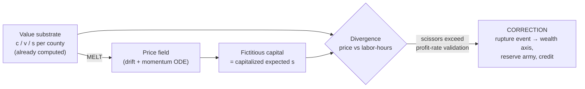

This is one of my favorite questions you've asked, because the Marxist answer and the cheap-engineering answer are the *same answer*: don't simulate a market — simulate the **divergence between price and value**. The market is the phenomenal form; the value substrate is what's real; the gap between them is the contradiction. You already have both rails built.

**The mechanic (backend-only, no order books, no agents):**

The engine already computes the value substrate per hex/county — `c`, `v`, `s` are literally columns in `dynamic_hex_state`, and MELT is the exchange rate between labor-hours and dollars. So the "market" reduces to a small set of derived scalar fields per sector/county:

- **Price level** — starts at value (via MELT), then drifts by its own momentum dynamics (the same ODE pattern as `class_dynamics`: cheap, deterministic, seeded from defines).
- **Fictitious capital index** — the stock market is just *capitalized claims on future surplus value*: expected `s` divided by the prevailing profit-rate expectation. It can inflate independently of actual `s` — that independence IS the bubble.
- **The divergence metrics** — price-to-labor-hour drift (MELT deviation), fictitious-to-real ratio (market cap vs actual surplus produced), sectoral price/value scissors.

The law of value is then the *contradiction driver*: prices can wander, but validation must eventually come from actually-produced surplus value. When the fictitious/real divergence exceeds what the falling rate of profit can service → the correction fires as a rupture event in the material base — wealth evaporates (feeding the wealth-share axis we just landed), credit tightens, unemployment jumps into the reserve-army machinery. Crisis isn't an RNG event; it's the deterministic snap-back of an opened scissors. That's Marx's crisis theory as a mechanism, and it's maybe a few hundred lines plus defines.

**The visual storytelling — this is where the Marxist twist sings:**

Play the dramatic irony. The *surface* of the UI is a diegetic ticker — DOW-style index, CNBC-cadence headlines from the narrator stack ("Markets rally on strong earnings") in your crimson/gold chrome. But the player has the X-ray lens (you already built the metric-lens pattern in Program 17 — falling-rate-of-profit is lit): flip the lens and the same chart decomposes into the two-line scissors — **dollars up top, labor-hours underneath** — visibly diverging. The player watches the bourgeois press celebrate while the instruments show the gap widening. When it snaps, the correction isn't a surprise; it's a vindication of having read the material base. That's the game teaching the law of value through UI alone.

Concretely: convergence/divergence ribbon charts (value produced vs market cap), a MELT-drift gauge ("$1 = X minutes of socially necessary labor" ticking), per-sector price/value heat on the map, and the same event narrated twice — the portfolio view vs the class view.

**Sequencing note:** this slots perfectly as a shadow-first program in the exact pattern we just proved with `WealthDistributionSystem` — observe-only system writing its own axis, qa:regression untouched, feedback owner-gated later. It's also the natural concrete home for your deferred **Money/Labor/Energy simplex** direction — price-to-labor-hours is literally the M↔L edge of that ternary. Data grounding exists too: FRED series for the empirical anchors, and the empirical-invariants pattern can pin the divergence laws (long-run MELT stability, crisis-era spike signatures) as behavioral contracts the same way we pinned the Pareto wealth law. No new primitives needed — everything derives from c/v/s and MELT, so I don't think it even needs an amendment, just an ADR and a program number when you're ready.
