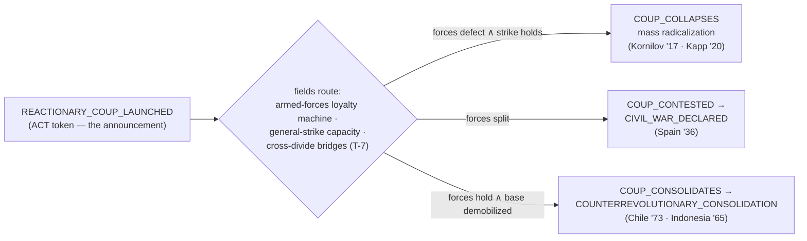

# The Historical Atlas — Generic Events Mined from Revolutionary History

**A companion to the Event Calculus: candidate event types abstracted from the Russian, Chinese, and US (1960s–70s) revolutionary experiences and their neighbors, each mapped to the calculus's five kinds, sited on Babylon's existing sorts, and cross-referenced against the `dev@41fa888` census.**

| | |
|---|---|
| **Status** | v0.1 — DRAFT content-design source doc for BD review. Proposes catalog *candidates*, not physics; every row obeys E-1 (events announce, never act). |
| **Companion to** | `2026-07-20-event-calculus-design.md` v0.2 (the taxonomy, laws, and census this doc cites); the Formalism v0.4; the electoral/reformism brief (whose Hope field, capital veto, and liquidationism verdict several rows lean on). |
| **Method** | Historical synthesis from standard historiography of the named revolutions (all pre-1990 events; dates given at year grain except where load-bearing). No web sources required; instances are canonical. Where a detail matters mechanically, it is stated so it can be checked. |
| **The genericity test** | A candidate earns a row iff: (i) **≥ 2 independent instantiations** in different social formations; (ii) it is statable as a **boundary fact over Babylon's sorts** — atoms over existing node/edge types, machine arcs, flow rows, verb resolutions; (iii) **no proper-noun residue** — the name names the relation, not the instance. The instance list is the *evidence* of genericity, and simultaneously the row's Aleksandrov chain: history is the empirical archive of the phase space. |
| **Framing** | Revolutions are the theory's golden-baseline corpus — observed trajectories through the same cells the engine models. This atlas mines them for crossings the engine must be able to *express*, then checks which it already can. It is the gap report run against history instead of against the sweep harness. |

> The calculus said: the physics writes the dictionary. This document is the historical spell-check — every word history actually used, tested against the dictionary the engine can compile.

---

## Part 0 — How to read a row, and what history is NOT allowed to add

Each candidate row gives: **NAME** (registry-style, naming the material relation) · **kind** (CROSSING / PATTERN / FLOW / ACT / ALARM per calculus §II.7) · **generating fact** (the atoms, arcs, or rows that would produce it) · **owner** (existing system/mechanism at the pin, or *owed* — physics debt) · **instances** (the genericity evidence) · **census status** (LIVE — already in the 84; DEAD-NAME-VINDICATED — in the enum, unproduced, and history says build it; NEW — atom exists, name doesn't; OWED — needs a mechanic first).

What history may **not** contribute, per the calculus's laws: no event with mechanical consequences of its own (the consequence is a System; the event is its readout); no scripted sequences ("after X, Y happens" is a coupling in Mot or it is nothing); no great-man events without material substrate (an assassination matters through the `key_figure` node's removal and the fields it moves, or it does not occur); no probability on any row (rarity is measured; hazard magnitudes live in Θ). And one discipline the histories themselves teach: **the same crossing must be allowed to route to opposite outcomes** — the atlas repeatedly finds one event type with divergent endings decided by field state, never by the event. That is T-7's shape recurring everywhere, and it is the strongest empirical argument for the calculus's separation of announcement from routing.

---

## Part I — What Each History Contributes as Pattern

**Russia (1905; February and October 1917; Civil War; NEP).** The dual-power sequence (soviets beside the Provisional Government), the decisive role of **armed-forces decomposition** (the Volynsky Regiment's mutiny turning February; Kronstadt's sailors in October and again, against, in 1921), war-defeat as legitimacy solvent (1905 follows Tsushima; 1917 follows three years of trenches), the bread-queue origin of February (International Women's Day, textile workers, Petrograd), the **failed reactionary coup that radicalizes** (Kornilov, August 1917 — the masses armed to stop him did not disarm), the premature rising survived (July Days), land seizure as peasant war outrunning decree, and the retreat regime (NEP) as a *ruling* that consolidation has its own phase. Russia is the atlas's richest source of **crossing sequences**.

**China (1911–1949; and the GPCR as aftershock archive).** The **united-front-and-betrayal cycle** (First KMT–CCP front → Shanghai massacre, April 1927), strategic retreat as survival (encirclement campaigns → Long March), **liberated base areas** as territorial dual power (Jiangxi, Yan'an — parallel taxation, land reform, courts), line struggle institutionalized (Yan'an rectification, 1942; later the congress/purge machinery Babylon's doctrine tree already models), **speak-bitterness / struggle sessions** as consciousness technology (fanshen — the Educate verb with the ledger as text), warlord balkanization (the sovereign-fragmentation family Babylon's spec-070 already builds), and the KMT's **monetary self-immolation** (the 1948 gold yuan — hyperinflation as the state burning its own legitimacy through the currency; the scissors system's historical twin). China contributes **protracted-war patterns and the economics of legitimacy**.

**United States, 1960s–70s — the home terrain.** This is not just a pattern source; it is the game's own map, and the census shows the engine already speaks it: the spark→riot mechanism in `struggle.py` *is* Watts 1965 / Newark and Detroit 1967 (each ignited by a police incident over charged agitation); the `state_apparatus` defines (`infiltrate_detection_base_chance`, `prosecute_key_figure_removal_chance`, `liquidate_singleton_collapse_chance`) *are* COINTELPRO's verb set; `P(S|A)` vs `P(S|R)` is survival-pending-revolution — the Panthers' survival programs are the Aid verb; the George Jackson bifurcation is named from this archive, and Attica (September 1971, three weeks after Jackson's killing) is its carceral instance; the original Rainbow Coalition (Hampton's Panthers + Young Patriots + Young Lords, 1969) is a **cross-divide SOLIDARITY bridge** — T-7's revolutionary routing condition, built in Chicago; the hard-hat riot (May 1970) is the same bifurcation routing the other way. What the US archive uniquely adds: the **counterintelligence state as player-facing antagonist** (surveillance→infiltration→decapitation ladders; the Media, PA burglary of March 1971 as the movement's counter-Investigate that blew the program open), the **prison as a node type with its own struggle** (Jackson, Attica; `carceral` namespace exists), **rank-and-file revolt inside the labor aristocracy** (DRUM at Dodge Main 1968, the League of Revolutionary Black Workers, Lordstown 1972), and occupation as a verb (Alcatraz 1969–71, Wounded Knee 1973, campus seizures).

**The neighbors (evidence pool for genericity).** **Germany 1918–23** — the completed bifurcation case study: Kiel naval mutiny → councils everywhere → Ebert–Groener pact (elite–military class-collaboration) → Freikorps (para-state vigilantism; the `VIGILANTISM` event's ancestors) → Luxemburg/Liebknecht decapitation → **Kapp Putsch defeated by general strike** (1920 — the working class defeating a coup by folded arms: one event, field-routed) → 1923 hyperinflation and the failed October → the fascist road opens. **Paris 1871** — the first dual power, the Montmartre cannons (troops refuse fire, fraternize), and the *semaine sanglante* — the massacre-after-defeat that every later movement remembers (the counterrevolutionary consolidation pattern). **Spain 1936–37** — the putsch that *doesn't* cleanly fail or succeed → CIVIL_WAR_DECLARED (Babylon has it); CNT dual power; the May Days as left-on-left suppression. **Chile 1970–73** — the bourgeois-legality trap the electoral brief already models: capital strike (the October 1972 bosses'/truckers' strike), judicial and congressional veto, then the army resolves what the ballot could not. **Indonesia 1965** — the annihilation ending: the fascist consolidation as mass extermination of the organized left; the game's grimmest reachable cell, and it must be expressible or the FASCIST_CONSOLIDATION ending is a euphemism. **Iran 1978–79** — revolution *without* a vanguard party: mourning-cycle mobilization (the 40-day rhythm after each massacre), mosque-network as solidarity infrastructure, oil strikes as the economic killshot, army dissolution in the streets. **Vietnam/Cuba** — Tet 1968 as the **epistemic event** (military setback, political victory: believed-probability moves against material outcome — the Hope field's historical proof); Cuba's rural foco and Radio Rebelde (liberated communications infrastructure). **South Africa 1922** — the Rand Revolt: "workers of the world, unite and fight for a white South Africa" — the settler-socialist trap in one banner; `RED_SETTLER_TRAP_DETECTED` already in the registry has its instance.

---

## Part II — The Candidate Families

### II.1 Sparks and state violence (forcing hazards and their crossings)

| candidate | kind | generating fact | owner | instances | census |
|---|---|---|---|---|---|
| `EXCESSIVE_FORCE` | forcing hazard | ξ < repression × spark scale; backfire agitation payload | Struggle @16 | Watts '65, Newark/Detroit '67, Soweto '76, Bloody Sunday 1905 | **LIVE** |
| `MASSACRE` | CROSSING (state ACT escalation above casualty atom) | state repression resolution with casualties > θ; distinct from EXCESSIVE_FORCE by scale atom | state AI Repress ladder (exists); casualty field owed | Bloody Sunday 1905; Amritsar 1919; Sharpeville 1960; Kent/Jackson State 1970; Black Friday, Tehran 1978 | NEW |
| `TRIBUNE_ASSASSINATED` | CROSSING (existential: key_figure removed by state/para-state act) | `key_figure` node death via LIQUIDATE resolution or fascist ACT | `prosecute/liquidate` machinery exists; key_figure sort exists | Hampton Dec 1969; Luxemburg/Liebknecht 1919; Malcolm X 1965; MLK 1968; Trotsky 1940 | NEW (the readout of an existing mechanic) |
| `MARTYR_MADE` | PATTERN (entry: recent TRIBUNE/MASSACRE token ∧ agitation rising in witnessing communities) | consciousness coupling to the killing — the mourning mechanism | Consciousness @17 (coupling exists; mourning cycle owed) | Iran's 40-day cycles 1978; Jackson→Attica 1971; Hu Yaobang 1989; Emmett Till 1955 | OWED (cheap: one PATTERN row once agitation coupling reads the token class) |
| `POGROM` / `VIGILANTISM` / `LOCKOUT` | ACT | fascist verb resolutions | `ooda/action_effects.py:32` | Kristallnacht 1938; Tulsa 1921; Freikorps 1919–20; Red Summer 1919; homestead lockouts | **LIVE** |
| `STRIKEBREAKING_DEPUTIZATION` | ACT (state verb: deputize para-state force against a strike) | state AI co-opts fascist org capacity against a live strike | owed (state↔fascist-org coupling) | Pinkertons/citizens' committees (US 1892–1937); Freikorps vs councils; SA as strikebreakers | OWED |

### II.2 Subsistence and reproduction (survival-calculus crossings)

| candidate | kind | generating fact | owner | instances | census |
|---|---|---|---|---|---|
| `BREAD_RIOT` | CROSSING | subsistence-price atom: cost-of-basket / wage crosses θ (P(S∣A) collapse via *price*, wage unchanged) | Market/metabolism fields exist; basket-price atom owed | Petrograd Feb 1917 (women's-day bread queues); Flour War 1775; Egypt 1977; Caracazo 1989 | NEW |
| `RENT_STRIKE` | PATTERN (coordinated TENANCY-edge default: withheld-payment share > θ on a landlord's edge set) | TENANCY edges exist; collective-default overlay owed | Glasgow 1915; NYC/Harlem 1963–64; St. Louis 1969 | OWED (small: an edge-state flag + share atom) |
| `SURVIVAL_PROGRAM_LAUNCHED` | ACT | Aid/PROVIDE_SERVICE standing order at community scale | mass-work verbs exist (ADR085/087) | Panther free breakfast 1969; Young Lords garbage offensive/TB testing 1969–70; mutual-aid societies everywhere | **LIVE** (as ACT; a named token dignifies it) |
| `EVICTION_DEFENSE` | ACT (org verb resolved against a state/landlord enforcement act) | contested enforcement — needs the enforcement act to exist | Unemployed Councils 1930s; anti-eviction riots Glasgow/NYC | OWED |
| `POPULATION_ATTRITION` / `ENTITY_DEATH` | CROSSING | wealth < consumption; coverage deficit | Vitality @1 | famine and grinding attrition in every case | **LIVE** |

### II.3 Dual power and territory (the sovereignty family — spec-070's home turf)

| candidate | kind | generating fact | owner | instances | census |
|---|---|---|---|---|---|
| `COUNCIL_FORMED` | CROSSING (existential: org of council type founded with jurisdiction claim overlay) | org founding exists; council org-type + claim overlay partially exist (claims overlays are constitutional) | Petrograd Soviet Feb 1917; German räte Nov 1918; Iranian komitehs 1979; Seattle General Strike committee 1919 | NEW |
| `DUAL_POWER_ACTIVE` | PATTERN | parallel-authority cell (already defined) | Sovereignty @17.5 | Russia Feb–Oct 1917; Catalonia 1936; Free Derry 1969–72 | **LIVE** |
| `PARALLEL_TAXATION` | FLOW | non-sovereign org collects a TRIBUTE-like flow row in claimed territory | BoundaryFlowRegister exists; org-tribute sort owed | Yan'an base-area finance; IRA/no-go-zone levies; soviet requisitions | OWED (one flow sort) |
| `LIBERATED_ZONE_DECLARED` | CROSSING (claim overlay by non-sovereign org over hex set where enforcement atom fails) | claims machinery exists; per-hex enforcement atom owed | Jiangxi 1931; Yan'an 1935–47; liberated zones Vietnam; Wounded Knee 1973 (73 days) | NEW |
| `SOVEREIGN_WRIT_LOST` | CROSSING (state's local control-ratio inversion at territory scale) | ControlRatio @12 (national exists; territorial fiber owed) | warlord China; Russia mid-1917 provinces; no-go areas | DEAD-NAME-ADJACENT (`CONTROL_RATIO_CRISIS` is the national version — add the sited fiber) |
| `SECESSION_DECLARED` / `CIVIL_WAR_DECLARED` / `SOVEREIGN_COLLAPSE` / `TERRITORY_TRANSITION` | CROSSING family | balkanization machinery | CollapseTransition @20.5, FactionInfluence @14.5 | 1911 China; 1918 borderlands; Spain 1936 | **LIVE** |

### II.4 Armed-forces decomposition (the outcome-decider — the atlas's headline physics debt)

Every terminal outcome in the corpus pivots on this axis: February wins when the garrison mutinies; Iran wins when conscripts dissolve; Chile and Indonesia lose when the army holds; the Commune lives exactly as long as the National Guard and dies by the Versaillais; Kiel starts Germany's revolution and the Reichswehr-plus-Freikorps ends it. **Babylon currently has repression as a field but no loyalty dynamics for the repressive apparatus itself** — the single largest expressiveness gap history finds. Proposal: an armed-forces loyalty machine (enum arcs, I.7-style) per repressive-apparatus institution, with material inputs already mostly in the graph: conscript class composition (which classes fill the ranks), pay/provisioning arrears (wage flows to the apparatus), casualty exposure (war-defeat crisis), and **fraternization pressure** (SOLIDARITY edges between soldier communities and struggling communities — T-7's bridge logic reused verbatim).

| candidate | kind | generating fact | owner | instances | census |
|---|---|---|---|---|---|
| `RANKS_WAVER` | arc (LOYAL→WAVERING) | loyalty machine (owed) crossing pay/casualty/composition atoms | **OWED — flagship** | Petrograd garrison Jan–Feb 1917; German navy Oct 1918; ARVN desertion curves | OWED |
| `FRATERNIZATION` | arc (WAVERING→FRATERNIZING) driven by cross-edge exposure | SOLIDARITY edges soldier↔community | Montmartre, March 1871 (troops refuse fire, join crowd); Petrograd Feb 1917; Tehran Feb 1979 | OWED |
| `MUTINY` | arc (→MUTINOUS: unit refuses orders) | loyalty machine + order-refusal atom | Kiel Nov 1918; Volynsky Feb 1917; Kronstadt 1905/1917 (and 1921 against — the machine must run both directions); GI fragging/refusals Vietnam era | OWED |
| `FORCES_DEFECT` | arc (→DEFECTED: unit changes sides with materiel) | loyalty machine + org capture of capacity | Feb 1917 en masse; Iran homafars 1979; Wuchang 1911 | OWED |
| `PRAETORIAN_INTACT` | PATTERN (loyalty machine held LOYAL through crisis regime) | same machine, other branch | Chile 1973; Indonesia 1965; France 1968 (the state held) | OWED |

One machine, five tokens, and the corpus's every ending becomes expressible. This is the atlas's strongest single recommendation.

### II.5 The strike family (labor's verbs and capital's counter-verbs)

| candidate | kind | generating fact | owner | instances | census |
|---|---|---|---|---|---|
| `GENERAL_STRIKE_DECLARED` | PATTERN (strike-participation share across WAGES edges > θ within a territory) | strike acts exist via Mobilize; the share atom is cheap | 1905 October strike; Seattle 1919; Britain 1926; **Kapp defeat 1920**; May 1968; oil strikes Iran 1978 | NEW |
| `WILDCAT_WAVE` | PATTERN (strikes bypassing union-org sanction: rank-and-file acts ∧ org NOT authorizing) | needs union-org vs base distinction — partially exists (org vs community edges) | DRUM 1968; Lordstown 1972; Italy's Hot Autumn 1969; Britain 1972 | NEW |
| `CAPITAL_STRIKE` | FLOW (investment-withdrawal row: equalization outflow + hiring freeze above θ) | equalization/`Δc` machinery exists; the electoral brief's capital veto names it | Chile Oct 1972 (gremio/truckers); capital flight Mitterrand 1981; 1970s NYC | NEW (flow row over existing machinery) |
| `LOCKOUT` | ACT | fascist/employer verb | live | Homestead 1892; general lockouts Weimar | **LIVE** |
| `UNION_BUREAUCRACY_BREAK` | CROSSING (org's mass-link decays while base agitation rises — the electoral brief's sect/liquidation geometry, union-flavored) | edge-portfolio atoms exist | UAW vs DRUM; TUC calling off 1926; CGT vs May '68 base | NEW |

### II.6 United front, betrayal, and class collaboration

| candidate | kind | generating fact | owner | instances | census |
|---|---|---|---|---|---|
| `UNITED_FRONT_FORMED` | PATTERN (cross-org SOLIDARITY/NEGOTIATE edge configuration spanning class lines toward a shared antagonist) | NEGOTIATE verb + edge modes exist | First KMT–CCP 1924; popular fronts 1935–38; **Rainbow Coalition 1969** | NEW |
| `UNITED_FRONT_BETRAYED` | CROSSING (front partner severs SOLIDARITY edges ∧ simultaneously resolves repressive ACT against ex-partner) | edge severance + repression both exist; the conjunction token is the event | **Shanghai April 1927**; SPD/Freikorps vs councils 1919; May Days Barcelona 1937 | NEW |
| `CLASS_COLLABORATION_PACT` | CROSSING (org↔sovereign CO_OPTIVE edge formed at leadership tier while base edges persist) | co-optive machinery exists (edge modes, Co-opt verb) | Ebert–Groener Nov 1918; no-strike pledges WWII; social contracts | NEW |
| `CO_OPTIVE_BREAKDOWN` | CROSSING | co-optation failure with bifurcation | EdgeTransition @21 | delivery-gap ruptures throughout the corpus | **LIVE** |

### II.7 Party, line, and organizational fate

| candidate | kind | generating fact | owner | instances | census |
|---|---|---|---|---|---|
| `DOCTRINE_TRAP_SPRUNG` / `_ESCAPED` / `PURGE_FAILED` | hazard-crossing family | congress calendar + trap gates | Doctrine @14.7 | Yan'an 1942; Lushan 1959 (the floor's own citation); Gang of Four 1976 | **LIVE** |
| `ORG_SPLIT` | CROSSING (existential: org fission into two orgs partitioning membership edges along a doctrine-tag cut) | org founding exists; fission mechanic owed | RSDLP 1903 (Bolshevik/Menshevik); SDS 1969; Sino-Soviet split as sovereign-scale instance | OWED |
| `RECTIFICATION_CAMPAIGN` | ACT (internal Educate at org scope: doctrine-tag convergence program) | Educate(Doctrine) exists (ADR073) | Yan'an 1942; Bolshevization campaigns | NEW (token over existing verb) |
| `ADVENTURIST_ISOLATION` | PATTERN (org acts beyond base: action tempo ≫ mass-link support; the sect death spiral's violent variant) | edge-portfolio atoms exist (electoral brief) | July Days 1917 (survived); Weather Underground 1969–70; foco failures (Bolivia 1967) | NEW |
| `LIQUIDATION_ABSORBED` | PATTERN | the electoral brief's absorbing state | defined there | Second International's national integrations; countless NGOs | planned |
| `ORGANIZATIONAL_FRACTURE` / `RED_BROWN_COUP` | CROSSING | LA defection machinery | Reactionary @17.4 | live | **LIVE** |

### II.8 State crisis, legality, and elite fracture

| candidate | kind | generating fact | owner | instances | census |
|---|---|---|---|---|---|
| `REACTIONARY_COUP_LAUNCHED` | ACT (state-faction or military org moves against the sovereign's legal order) | needs faction-vs-sovereign act — FactionInfluence machinery adjacent | Kornilov Aug 1917; Kapp 1920; Spain July 1936; Chile Sept 1973; Algiers generals 1961 | NEW |
| *(its field-routed outcomes)* `COUP_COLLAPSES` → mass radicalization; `COUP_CONTESTED` → CIVIL_WAR_DECLARED; `COUP_CONSOLIDATES` → fascist/praetorian regime | CROSSINGs | routed by armed-forces loyalty + general-strike capacity + bridge topology — **never by the coup event itself** | T-7 logic + §II.4 machine | Kornilov/Kapp collapsed (strike + fraternization); Spain contested; Chile/Indonesia consolidated | the atlas's cleanest E-1 exhibit |
| `EMERGENCY_POWERS_INVOKED` | ACT → legal-framework overlay | LEGISLATE/legal-framework machinery — **in the enum, unbuilt** | Article 48 Weimar; martial law 1905; Palmer raids 1919–20; McCarran Act 1950 | **DEAD-NAME-VINDICATED** (`LEGAL_FRAMEWORK_ENACTED/REVOKED`) |
| `MOVEMENT_CRIMINALIZED` | CROSSING (org's legal-standing arc: legal→proscribed) | LegalStanding enum exists; arc unwired | Smith Act trials 1949; KPD ban 1956; apartheid bannings; Palmer | NEW (arc of an existing enum) |
| `ELITE_DEFECTION` | CROSSING (ruling-faction node breaks: faction balance discontinuity + public-position flip atom) | FactionBalance exists (`FACTION_SHIFT` is a **dead wire**) | February's Duma elites; Iran's bazaar & clerical elite realignment; Saturday Night Massacre / Watergate resignations as slow-motion instance | DEAD-WIRE-VINDICATED |
| `SUCCESSION_CRISIS` | PATTERN (sovereign/institution head removed ∧ no legitimated successor cell) | institution machinery exists; succession atom owed | Lin Biao 1971; post-Stalin 1953; Franco's engineered succession as the *avoided* instance | OWED (small) |
| `CONSTITUENT_DISSOLVED` | ACT (sovereign overrides electoral-mandate output) | electoral machinery (electoral brief) | January 1918; Brumaire; countless coups-by-decree | planned there |

### II.9 The epistemic family (fog, exposure, and belief — EpistemicHorizon's catalog)

| candidate | kind | generating fact | owner | instances | census |
|---|---|---|---|---|---|
| `SURVEILLANCE_EXPOSED` | CROSSING (state intel program enters public knowledge: veil atom flips for the *population*, not the player) | fog machinery exists; population-side veil owed with EpistemicHorizon @22 | **Media, PA burglary March 1971 → COINTELPRO named**; Church Committee 1975–76; Okhrana archives 1917 | NEW — and it is the movement's Investigate verb succeeding at national scale |
| `TRIAL_AS_TRIBUNE` | ACT (political trial converted to consciousness platform: Educate resolution hosted by the state's own proceeding) | needs trial site/act — carceral + legal machinery adjacent | Chicago 8 1969–70; Dimitrov 1933; Panther 21 acquittal 1971; Castro's "history will absolve me" 1953 | OWED (small, high-flavor) |
| `EPISTEMIC_REVERSAL` | CROSSING (believed P(S∣A)/legitimacy moves *against* the material outcome sign: Hope-field divergence atom) | Hope field (electoral brief) + EpistemicHorizon | **Tet 1968** (military setback, political victory); Pentagon Papers 1971; Chernobyl 1986 | NEW once H exists |
| `LIBERATED_SIGNAL` | CROSSING (existential: movement-controlled ISA/communications node founded) | ISA machinery (electoral brief); infrastructure exists | Radio Rebelde 1958; samizdat; underground press 1960s; cassette sermons, Iran 1978 | NEW |
| `CENSORSHIP_REGIME_SHIFT` | arc (state ISA posture machine) | state AI + ISA | wartime censorship regimes; glasnost as the reverse arc | OWED |

### II.10 Land, occupation, and the carceral node

| candidate | kind | generating fact | owner | instances | census |
|---|---|---|---|---|---|
| `LAND_SEIZED` | FLOW + CROSSING (TENANCY/property edge severed from below; land flow row) | tenancy edges exist; seizure act owed | Russia summer–autumn 1917 (the peasant war that outran every decree); Zapata 1911–17; land invasions Chile/Peru | OWED |
| `LAND_REFORM_DECREED` | ACT (sovereign/dual-power org rewrites tenancy overlay wholesale) | overlay machinery | October's Decree on Land (ratifying the fait accompli); China 1947–52 | OWED (same mechanic, from above) |
| `SPEAK_BITTERNESS` | ACT (mass Educate flavor: public accounting of exploitation ledger at community scale) | Educate + the Ledger itself (the text is the exploitation record — Babylon-native) | fanshen struggle sessions 1946–52; testimony traditions everywhere | NEW (token over existing verb — the game's most *Babylon* event: reading the Ledger aloud) |
| `WORKPLACE_OCCUPIED` | CROSSING (presence overlay: org holds a production site; production flow interdicted from within) | Move/PRESENCE exists; site-hold atom owed | Flint sit-down 1936–37; Italy 1920; May '68 factories; Attica as carceral variant | OWED |
| `PRISON_UPRISING` | CROSSING (carceral control-ratio inversion at facility scale + uprising gate) | ControlRatio + carceral namespace exist; facility siting owed | **Attica Sept 1971**; Ohio 1993; prison strikes 2016–18 (post-corpus but confirming) | NEW — and it is the George Jackson theorem's home terrain; the game is *named* for this family |
| `AMNESTY_RELEASE` | ACT (state legitimacy move: mass release flow) | state verb + carceral | Feb 1917's opened prisons; Spain 1936; post-Stalin 1953–56 | OWED (small) |

### II.11 Money and metabolism (the scissors' historical catalog)

| candidate | kind | generating fact | owner | instances | census |
|---|---|---|---|---|---|
| `MARKET_CORRECTION` | CROSSING | scissors snap | MarketScissors @17.8 | 1929; 1873; 2008 | **LIVE** |
| `HYPERINFLATION_SPIRAL` | arc (monetary-legitimacy machine: the price-book decoupling from the value book past serviceability) | scissors x_p machinery is *literally this ratio* — an arc atom on sustained x_p divergence | Weimar 1923; **gold yuan 1948** (the KMT printing away its mandate); Confederate dollar | NEW (arc over existing oscillator) |
| `BANK_RUN` / `CREDIT_CRISIS` | arc | CreditCyclePhase arcs | live machine | 1907; 1931 Kreditanstalt | **LIVE** (as `CRISIS_PHASE_TRANSITION`) |
| `HARVEST_FAILURE` | forcing hazard (exogenous R-shock in ΔB = R − E·η, seeded stream) | Metabolism @13 | 1891 famine → 1905's generation; 1946–47 China; dust bowl | NEW (forcing-layer event, L-ACC shape (b)) |
| `SIEGE_ECONOMY` | PATTERN (external flow severance: Φ/import rows cut above θ) | imperial circuit flows exist | blockade of Russia 1918–20; Cuba post-1960; sanctions regimes | NEW |
| `ECOLOGICAL_OVERSHOOT` | CROSSING | O > 1 | Metabolism | live | **LIVE** |

### II.12 The imperial hinge (Φ events — the Fundamental Theorem's own family)

| candidate | kind | generating fact | owner | instances | census |
|---|---|---|---|---|---|
| `PERIPHERAL_REVOLT` / `SUPERWAGE_CRISIS` / `CLASS_DECOMPOSITION` | CROSSING family | terminal-crisis machinery | live @9/@11 | decolonization's fiscal squeeze on every metropole | **LIVE** |
| `IMPERIAL_DEFEAT_ABROAD` | CROSSING (external sovereign's client/war outcome flips; Φ channel severed; legitimacy shock) | external nodes + client-state edges exist; war-outcome forcing owed | Tsushima 1905 → 1905; WWI → 1917; **Vietnam → the US 1970s** (the game's own premise); Malvinas → junta 1983 | NEW — arguably the game's opening move |
| `CONSCRIPTION_CRISIS` | CROSSING (war labor-draw atom: draft resistance share > θ) | needs draft flow | draft riots 1863; Vietnam draft resistance/fragging; WWI mutinies 1917 France | OWED |
| `SETTLER_TRAP` | PATTERN | already built | FactionInfluence | **Rand Revolt 1922** ("…fight for a white South Africa"); hard-hat riot 1970 as street instance | **LIVE** (`RED_SETTLER_TRAP_DETECTED`) |

---

## Part III — Distinguished Cells (PATTERN rows history insists on)

These are conjunctions over atoms that recur so reliably they deserve names — the situation banner's vocabulary:

1. **`REVOLUTIONARY_SITUATION`** — Lenin's three signs, stated as a cell: ruling-faction fracture atoms (the "upper classes cannot rule in the old way": ELITE_DEFECTION recent ∨ succession crisis ∨ legitimation CRISIS), subsistence-margin collapse for the base ("lower classes cannot live in the old way": P(S|A) margin below θ for mass classes), and mobilization tempo above baseline (act-frequency atom). Crucially Lenin's own caveat is native to the calculus: the situation cell does *not* imply the rupture crossing — that needs the organizational field (P(S|R)) — which is exactly why it must be a PATTERN (announced situation) and never a trigger.
2. **`DUAL_POWER`** — live; keep.
3. **`COUNTERREVOLUTIONARY_CONSOLIDATION`** — post-defeat massacre-and-proscription wave: movement-org density falling under sustained repressive ACT tempo after a failed rupture (semaine sanglante 1871; Indonesia 1965–66; Chile 1973–76; white terror Hungary 1919). The game must recognize defeat's shape as legibly as victory's — the FASCIST_CONSOLIDATION ending's on-ramp.
4. **`MOURNING_CYCLE`** — periodic re-mobilization keyed to memorial calendar atoms after MARTYR_MADE (Iran's 40-day rhythm; Till's open casket; Hampton's funeral). Calendar atoms + agitation coupling.
5. **`PROTRACTED_EQUILIBRIUM`** — war-of-position dwell: dual power or liberated zones persisting across many ticks without crossing (Yan'an 1937–45; Free Derry 1969–72) — the dwell-time pattern that makes patience a strategy the surface can *see*.
6. **`SECT_SPIRAL` / `LIQUIDATION_ABSORBED`** — the electoral brief's pair; the atlas adds their violent sibling `ADVENTURIST_ISOLATION` (§II.7).
7. **`WHITE_LABOR_REPUBLIC`** — the settler-socialist consolidation cell behind RED_SETTLER_TRAP: labor-aristocracy organization rising while cross-divide bridges = 0 (Rand 1922; craft-union exclusion regimes) — T-7's fascist branch as a *standing configuration* rather than a moment.
---

## Part IV — What History Teaches the Accident Layer

The corpus vindicates R-EC-2 with almost embarrassing consistency. Sparks are real and they are *hazards*: police incidents (Watts, Newark, Detroit, Stonewall), an arrested fruit vendor, an assassinated archduke, a leaked memo. But the historiographic consensus the engine already encodes is that **sparks ignite only charged cells** — the same police stop that detonated Watts happened a thousand times without a riot; February began in bread queues indistinguishable from the previous winter's. The dice picked the *date*; the fields had long since picked the *possibility*. (Wendell Phillips's line — "revolutions are not made; they come" — is the ripeness law L-ACC-2 in nineteenth-century dress.)

Three refinements from the record:

- **The tape writes calendars, and calendars write the tape's opportunities.** Mourning cycles, harvest rhythms, anniversary dates (Bloody Sunday's anniversary in 1917; May Days) are *calendar atoms* that periodically raise hazard exposure — deterministic clocks modulating stochastic timing. The engine's congress-interval atom already has this shape; MOURNING_CYCLE generalizes it.
- **The Lushan floor is historically honest.** Lin Biao's flight, the Gang of Four's arrest, the exact hour Kornilov's railway workers uncoupled his trains — outcomes turning on information no state variable carried. The `purge_success_floor`'s citation is not a flourish; it is the correct epistemology for *palace* events specifically, where the model's material state genuinely underdetermines the outcome. Keep floors confined to that class (L-ACC-4): mass events get no floors, because mass outcomes are what the material state *does* determine.
- **The same crossing, opposite endings — routed by fields, never by the event.** The atlas's recurring exhibit (§II.8): Kornilov and Kapp collapse (general-strike capacity + fraternization); Spain's putsch meets a workers' counter-mobilization and becomes civil war; Chile's meets a demobilized base and consolidates. One `REACTIONARY_COUP_LAUNCHED` token; three continuations, all field-determined. Any design that lets narrative content choose the continuation has smuggled physics into the surface — the corpus itself forbids it.

---

## Part V — The Physics Debt (owed mechanics, ranked by how much history they unlock)

1. **The armed-forces loyalty machine** (§II.4) — one enum machine, five tokens, and every terminal outcome in the corpus becomes expressible. Inputs already in the graph (class composition, wage flows, solidarity edges, casualty forcing). Without it, FASCIST_CONSOLIDATION and REVOLUTIONARY_VICTORY both terminate in a fog exactly where history is most specific. **Recommend chartering as its own train.**
2. **Sited fibers for existing national machines** — territorial control-ratio (SOVEREIGN_WRIT_LOST), facility-scale carceral ratio (PRISON_UPRISING). The formulas exist; the siting is the work. Unlocks the whole §II.3/§II.10 middle game.
3. **Collective edge-action overlays** — coordinated default/severance on TENANCY (rent strike, land seizure) and presence-holds on production sites (occupation). Tenancy and presence machinery exist; the collective-state flag and share atoms are small.
4. **Org fission** (`ORG_SPLIT`) — the doctrine tree knows *lines*; it cannot yet break an org along one. SDS 1969 and RSDLP 1903 are the acceptance tests.
5. **Population-side veil events** (`SURVEILLANCE_EXPOSED`, `EPISTEMIC_REVERSAL`) — EpistemicHorizon currently observes; giving the *population* a believed-state whose divergence is an atom unlocks the Tet/Media-burglary family, and the electoral brief's Hope field is already the planned carrier.
6. **Trial, amnesty, succession** — three small acts/atoms with outsized narrative yield per token.
Each debt, once paid, *automatically* extends the catalog through the calculus pipeline — the atlas never asks for an event to be hand-added; it asks for the physics whose readout the event is.

---

## Part VI — Recommended First Wave (fifteen rows, chosen for atom-readiness × genericity × US-campaign texture)

| # | token | why first |
|---|---|---|
| 1 | `GENERAL_STRIKE_DECLARED` | share atom over existing WAGES/strike acts; the corpus's single most consequential mass event |
| 2 | `REACTIONARY_COUP_LAUNCHED` (+ field-routed continuations) | the E-1 showcase; FactionInfluence adjacency; endgame texture |
| 3 | `BREAD_RIOT` | price-basket atom over existing market/metabolism fields; February's own opening |
| 4 | `TRIBUNE_ASSASSINATED` | pure readout of the existing liquidate machinery + key_figure sort — arguably a dead *wire* today |
| 5 | `MARTYR_MADE` + `MOURNING_CYCLE` | one PATTERN + calendar atoms; converts #4 from loss into dynamics (Jackson→Attica is the in-house proof) |
| 6 | `UNITED_FRONT_FORMED` / `UNITED_FRONT_BETRAYED` | edge-configuration conjunctions over existing modes; Shanghai 1927 and Chicago 1969 in one pair |
| 7 | `ELITE_DEFECTION` | wires the confirmed dead wire `FACTION_SHIFT` and dignifies it |
| 8 | `EMERGENCY_POWERS_INVOKED` | vindicates the dead names `LEGAL_FRAMEWORK_ENACTED/REVOKED`; COINTELPRO/Palmer texture the state AI already deserves |
| 9 | `SURVEILLANCE_EXPOSED` | the Media-burglary event; the player's Investigate verb at history scale |
| 10 | `HYPERINFLATION_SPIRAL` | one arc atom over the live scissors; gold-yuan/Weimar texture for the endgame economy |
| 11 | `CAPITAL_STRIKE` | flow row over existing equalization machinery; the electoral brief needs it anyway |
| 12 | `PRISON_UPRISING` | the theorem's namesake terrain; carceral machinery exists, wants siting |
| 13 | `SPEAK_BITTERNESS` | an Educate flavor whose text is the Ledger itself — the most Babylon event in the atlas |
| 14 | `WILDCAT_WAVE` | DRUM/Lordstown; the labor-aristocracy interior front T-6 implies |
| 15 | `RANKS_WAVER` … `FORCES_DEFECT` | the flagship machine — listed last only because it charters as its own train (Part V #1) |

---

## Part VII — Honesty and Boundaries

Instances are drawn from standard historiography and chosen for uncontroversial factual shape; dates are year-grain except where the mechanism turns on sequence (Jackson August 1971 → Attica September 1971; Media burglary March 1971 → COINTELPRO's naming). Where an instance is contested *in interpretation* (July Days as blunder vs. safety valve; Kronstadt 1921), the row uses only the uncontested mechanical fact (a premature rising survived; a mutiny against the consolidating power). The atlas deliberately includes defeat and atrocity — Indonesia, the semaine sanglante, the settler trap — because a simulation of the fall of hegemony that cannot express counterrevolution is a sermon, not a model; these rows exist so the engine can *recognize* those cells, never to decorate them. All candidate names are provisional pending the BD's naming pass (naming is curation); all mechanics implied by OWED rows go through normal Modulus C/G/P design, and nothing in this document creates an event by fiat — **every row here is a request that the physics be able to say something history said, with the event as its receipt.**

*— end of v0.1 —*
