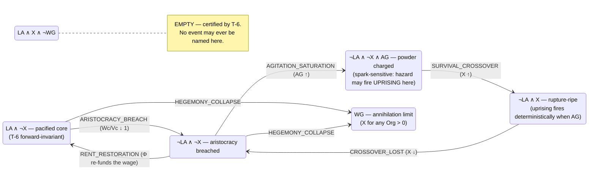
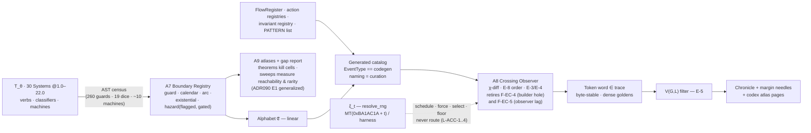

# The Event Calculus — The Correct Number of Events Is a Theorem

**The game surface's discrete vocabulary (events, triggers, announcements) as a derived artifact of the engine's boundary structure — with the accident layer formalized, the completeness question made machine-checkable, and the first census already run against the tree.**

| | |
|---|---|
| **Status** | v0.2 — DRAFT design brief for BD review. Confers no authority; proposes no amendment. v0.1 (2026-07-20) was written without repo access; **v0.2 is grounded in a fresh clone of `dev@41fa888`** (2026-07-20, PR #230) — every VERIFY from v0.1 is resolved, and Part VI is now a real census, not an estimate. |
| **Companion to** | `CONSTITUTION.md` v2.12.0 (Amendments A–X); *The Babylon Formalism* v0.4 (governing where cited; its pin `f59d585` is 10 PRs stale against this one); `2026-07-19-north-star-roadmap-v2.md`; `2026-07-20-electoral-question-reformism-design.md` (first PATTERN exemplar). |
| **Ground truth** | Pinned to `dev@41fa888`. Every cited file, count, and line was read from that tree by an AST/grep census pass (the census script is itself the A7 extractor prototype — Part IV). Counts marked *first-pass* used heuristics whose two known failure modes are documented in §VII.2. |
| **BD rulings recorded** | **R-EC-1 (2026-07-20):** unify the entire discrete surface — the EventType registry, regime transitions, enum machines, endgame progress, alarms — under one derived catalog. **R-EC-2 (2026-07-20):** dice schedule, never route — ξ_t may time a ripe crossing and break engine-symmetric ties; the branch of any bifurcation is ξ-independent. |
| **Register** | Follows the formalism: constructs tagged COMP / LAW / PRED or cut; C/G/P family declared at introduction; rent ledger and cut list in Part VII. |

> Necessity asserts itself through accident — Engels's summary of how the economic movement prevails amid "an endless host" of contingencies (letters to Bloch 1890, Borgius 1894, paraphrased). This document is that sentence as type discipline: the engine owns necessity, the tape owns accident, and the surface may never confuse them. The tree already agrees in one place with startling precision — `doctrine.purge_success_floor`'s own description cites Lushan 1959: *"the decisive information was never in the observable state"* (§II.8).

---

## Part 0 — The Question, and the Shape of the Answer

### 0.1 The BD's question

> "The correct number of events and probabilistic/stochastic triggers on the game surface is whatever combinatorial configuration captures all of the possibilities — as long as they don't clearly define physics."

Two demands are packed in there, and they are exactly the two constitutional sins available to a surface vocabulary:

1. **Capture all the possibilities** — a vocabulary that misses a qualitative transition lets history happen silently. That is VIII.12 (silent no-op) relocated to the surface: the world turned and nobody was told.
2. **Don't define physics** — an event that *causes* anything, or announces a distinction the engine never draws, fabricates. That is III.11 (Loud Failure) in mirror image: the surface claiming authority over the math.
The registry's own history proves the problem is real, live, and unsolved. `EventType` has grown **14 → 34 (ADR068, Program 17) → 47 (frozen by ADR068 §d) → 84 today** (`models/enums/events.py`), each step under content pressure, none under a principle that says what membership *means* or when growth is done. And the census this brief ran against `41fa888` (Part VI) found the predicted pathologies in both directions **already in the tree**: roughly a fifth of the registry is names the physics never produces, a handful are *dead wires* — mechanisms that qualitatively transition every tick with no event ever fired — and one member is published but silently dropped from the typed stream by the converter's "graceful degradation." Meanwhile ADR090's own headline finding is this brief's thesis stated as a bug report: *the byte-identical gate ran green over a dead feature, the six scenarios exercise only 12 of the 30 Systems, and the org layer is exercised nowhere.* Silent history is not a hypothetical.

### 0.2 The answer in one paragraph

The engine already contains the complete inventory of everything that can *qualitatively* happen. Discrete change enters Babylon at exactly five places, each already principled or one registry short of principled: **guard crossings** (the grammar's `φ` comparisons — the only branch points the motion language possesses; 260 comparison sites across the 30 Systems at the pin), **enum machine arcs** (CreditCyclePhase, EdgeMode, ExploitationMode, LifecyclePhase, ThreadPhase, the regime classifier — I.7's "qualities are classifier outputs"), **flow rows** (the BoundaryFlowRegister's "no flow without a row"), **verb resolutions** (player and state action registries, the fascist verbs included), and **alarms** (ConservationAuditor residuals). An event vocabulary is *correct* precisely when it is in bijection with these generating registries — sound (no token without a generator fact) and complete (no generator fact without a token). Since the registries are declared data, **the correct number of events is a computed integer, recomputed whenever the physics changes, and `EventType` becomes a build artifact of `T_θ`**. Content work becomes curation of generated rows — naming, narration, salience — never invention of new ones. The combinatorial configuration the BD is asking for exists, is finite, is *linear* rather than exponential in the places it must be enumerated, and is exponential only where it may remain implicit (§II.2).

Mantra corollary: *Graph + Math = History* — and therefore the **alphabet** of history is computed, not curated. The physics writes the dictionary. The dice write the calendar. The player writes the sentence.

---

## Part I — What the Tree Already Provides (hooks, all read from `41fa888`)

The calculus invents almost nothing. It names, registers, and audits structure that exists:

| existing structure | where (pinned) | role in this calculus |
|---|---|---|
| Guard grammar `φ ::= ρ ⋛ ρ \| ρ ⋛ θ.ns.k \| …` — all discrete branching factors through guards | Formalism §III.3; 260 comparison sites in `engine/systems/` + TickDynamics | the atom source |
| "Qualities are classifier outputs at fold crossings" (I.7, I.12) | regime classifier `domain/dialectics/core/regime.py`; ~65 StrEnum vocabularies in `models/enums/`, of which ~10 are true state *machines* | crossings are constitutional |
| **The two-channel event pipeline**: Systems publish plain-`str` `Event`s on `kernel/event_bus.py`; end of tick the engine drains history → string log + `EVENT_BUILDERS` conversion → `WorldState.events` (per-tick, never cumulative); observers emit typed events post-freeze into `persistent_context["_observer_events"]`, injected **next tick** | `simulation_engine.py` ~560–605; `engine/event_builders.py` (64 builders / 84 members) | the emission substrate A8 re-founds — including its two holes (F-EC-4, F-EC-5) |
| `EventBus` interceptor chain (ALLOW / BLOCK / MODIFY, priority-ordered) — **currently dormant: no production registrar** | `kernel/event_bus.py`, `kernel/interceptor.py` | a fabrication/suppression vector if ever armed un-audited (F-EC-3) |
| Endgame observer: 5 patterns, recognized-never-adjudicated, `axis_progress` as a live "how close" signal, patterns dissolvable | `engine/observers/endgame_detector.py` | the PATTERN kind's precedent: **recognition never acts**; `axis_progress` is already a margin composite (§II.9) |
| `resolve_rng`: injected harness stream or `random.Random(0xBA1AC1A + tick)` — the tape; **19 rng call sites in all of `src/babylon`** | `kernel/system_base.py:35`; census §VI.3 | the accident substrate, small enough to audit exhaustively |
| Tuning Charter posture in the defines themselves: `survival.spark_probability_scale`, `state_apparatus.*_chance` family, `organizations.evasion_base_probability` (= base × (1−heat), material-monotone), `doctrine` purge floor | `config/defines/` (39 sub-models, 21 modules) | hazard magnitudes already live in Θ, never in events |
| **Salience floors already in Θ**: rent/subsidy below threshold "skips event emission to prevent bus saturation" | `economy_basic.py:258,263` | E-2/E-5's salience-in-Θ claim is existing practice |
| ADR090: qa:regression "modernized from a silent-blind byte-identical gate into a **declared-and-proved** one" — static ScenarioCoverage/CoverageGap declarations + a dynamic truth probe; 17 CoverageGap rows honestly declared as debt | `sentinels/gate_coverage/`, `tools/regression_scenarios.py` | **the exact enforcement shape A7–A9 reuse**, and the gap report's seed |
| Sentinel estate (~20 subpackages) + `_ast.py` machinery + exemption convention | `src/babylon/sentinels/` | the census tooling and the family idiom |
| Fog `V(G, L)` contracts; `epistemic_horizon` + `veil` defines namespaces | `web/game/fog/` (keel-bound), EpistemicHorizon @22 | the feed's epistemics, carried verbatim |
| Emergent-verdict pattern (derived absorbing states) | electoral brief §3.1 | first PATTERN rows |

The one genuinely new declared datum is the **Boundary Registry** (A7) — standing to events exactly as the A1 footprint manifest stands to effects. Precedent for grade: the formalism ruled ε-signatures PATCH-grade ("one new declared datum and new laws about existing structure," §VII.3); this calculus claims the same, and the same escalation note carries: *mandating* catalog codegen for registration would be the later MINOR.

---

## Part II — The Mathematics

Scope note: §II.1–II.6 develop the **CROSSING** kind, where the BD's combinatorial question lives. §II.7 unifies the other four kinds by exhibiting the registry each is already in bijection with. §II.8 is the accident calculus, now written against the real dice census. §II.9–II.10 are corollaries.

### II.1 Atoms: the sited Boolean measurements P COMP: A7, prototyped

An **atom** is a named, sited, Boolean-valued projection of state — the smallest thing whose truth can change. Five species, closed:

```
a  ::=  guard atom          ρ(x) ⋛ ρ(y)  or  ρ(x) ⋛ θ.ns.k     (e.g. p_rev > p_acq; riot_risk > reactionary.spontaneous_riot_threshold)
     |  calendar atom       f(t) ⋛ θ.ns.k                        (e.g. tick % doctrine.congress_interval_ticks == 0)
     |  arc atom            machine M at site x takes arc r→r′    (e.g. CreditCyclePhase OVEREXTENSION→STAGNATION)
     |  existential atom    a site of sort ν/e exists             (org founded, edge created, ENTITY_DEATH's precondition)
     |  hazard atom         p(Σ) > ξ_t[k]                         (e.g. ξ < repression × survival.spark_probability_scale — flagged, §II.8)
```

Each atom row declares: `id`, species, **owner generator** (with its `position` ClassVar, inherited for E-8 ordering), **site sort**, the FieldRefs it reads (A1 vocabulary), the θ thresholds it references (with A6 tier), and the `dice` flag. Atoms are extracted, not authored: the census pass behind this brief already walks every system module's `ast.Compare` nodes (260 hits in `engine/systems/` alone); hardening that walk into `sentinels/boundary/` with the `_ast.py` idiom *is* the A7 bootstrap. Two disciplines inherited at birth: L-θ (every threshold is a Θ-projection — the census also flags literals, and found at least one live violation, F-EC-2) and Amendment N glyphs (the character map is **χ**; `σ` stays the spectrum coordinate, `s` stays sublation).

### II.2 The character map χ, cells, and the per-axis atlases P, then G

For a state Σ, the **qualitative character** χ(Σ) is the evaluation of every instantiated atom — a finite typed Boolean structure, not a fixed-length vector, because sites are born and die. A **cell** is a fiber of χ: a region where no atom changes truth; within a cell the tick is qualitatively silent, and all qualitative history is cell-to-cell.

The design object is never the **global atlas** (the product over all sites — exponential, unenumerable, no consumer; cut, §VII.5). It is the family of **per-axis atlases**: for each atom family or machine, the handful of cells and arcs of that axis — small (2–6 cells), enumerable, renderable as one generated Mermaid diagram each (the checker draws it, so it cannot lie), doubling as Archive codex pages. Conjunctions across axes — `DUAL_POWER_ACTIVE` (already in the registry, published by Sovereignty @17.5), the electoral brief's `liquidationism` — are **distinguished cells**: named sub-objects of the implicit global atlas, declared on demand as PATTERN rows. The exponential space exists; only the named points in it cost anything.

### II.3 Crossings and the alphabet 𝔈 P

A **crossing** is a tick-adjacent change of χ at one sited atom, `(a, x, dir)`, plus enum arcs and site birth/death. The **alphabet** 𝔈 is the set of crossing *types*, quotienting sites to sorts:

```
|𝔈|  =  2·|guard + calendar atoms| + |hazard atoms| + Σ_machines |declared arcs| + 2·|site sorts| (+ pattern entries/exits)
```

(Hazards contribute one direction — the firing; their reset is bookkeeping, not history.) **The load-bearing combinatorial fact: the alphabet is linear in the atom census.** The 2^k explosion lives in cells, which stay implicit except when named. This is the precise answer to "whatever combinatorial configuration captures all the possibilities": possibilities are captured **per axis** (complete small atlases) and **per boundary** (the linear alphabet); the global configuration space is spanned, not enumerated — the way a basis spans a space.

**Multi-crossing ticks and the Leibniz factorization LAW: E-8.** Time is discrete; one tick can cross several boundaries. The co-Heyting boundary operator of the project's own library (Lawvere 1991, *Intrinsic Co-Heyting Boundaries and the Leibniz Rule*) supplies the interpretation, rent paid by citation: `∂(A∧B) = (∂A∧B) ∨ (A∧∂B)` — a compound boundary factors into simple boundaries in *some* order, and the engine already owns the canonical one: **tokens emit in owner-`position` order** (the declared total order of T-4: Vitality @1.0 … EpistemicHorizon @22.0), site-ties by insertion order (Amendment L surfaces). The bus already approximates this for free — history order is publish order is execution order; A8 makes it a law rather than a habit. T-5 then extends to the token stream: same inputs, byte-identical event word. Events join the trace, not just the prose.

### II.4 Feasibility: theorems are emptiness certificates G LAW

Not every sign pattern is a place the world can stand. The **feasible atlas** discards cells certified empty by three rule sources, all present in the tree:

1. **Theorems.** T-6 *is* the statement that a cell is empty: `{Wc/Vc > 1} ∧ {P(S|A) bounded off 0} ∧ {rupture}` has no inhabitants — the Fundamental Theorem, read operationally, *deletes that cell from the atlas*. T-7 empties `{crisis} ∧ {no cross-divide bridges} ∧ {revolutionary routing}`. Every future theorem of this shape gets a job: pruning.
2. **Envelope implications.** A6/Tuning-Charter tier envelopes fix threshold *orderings* across Θ\*; patterns violating a fixed ordering are empty at every admissible setting. (The defines already carry envelope validators — the `counter_tendency_weights` sum-to-1 precedent.)
3. **Structural laws.** `g(⊗) ≤ min(g₁,g₂)` empties `{composite sharp} ∧ {component dull}`; L-DM, monotone couplings, and the sort lattices contribute the rest.
Closure is Horn-style propagation at |𝔄| ~ 10² scale — trivial compute. Output: per-axis atlases with infeasible cells *marked with their certificate*. A feasible cell the BD believes impossible is a missing theorem — the atlas becomes a theorem-prospecting instrument.

**Worked miniature (the survival axis, atoms verbatim from `struggle.py` and the survival calculus).** Atoms: `LA = Wc/Vc > 1`, `X = p_rev > p_acq` (the code's own crossover comparison, line 321), `AG = agitation > resistance_threshold`, `WG = P(S|A) → 0`. T-6 empties `LA ∧ X` away from `WG`; the Warsaw corollary makes `WG ⟹ X` for any `Org > 0`.



Six feasible cells, seven named crossings, one certified void — and the diagram now also *locates the dice*: the spark hazard is licensed exactly in `Charged` (§II.8), which no hand-curated list would have made precise.

### II.5 Reachability, and the gap report G∘P COMP: A9

Feasible ≠ reachable, and the tree has already proven why this leg matters: **ADR090's dynamic-truth probe found the six byte-identical scenarios exercise 12 of 30 Systems, with the org layer exercised nowhere — the gate was green over dead features (the U9 inertness episode).** A9 is ADR090's E1 generalized from "which Systems run" to "which boundaries cross": empirical reachability from the probe scenarios + Hypothesis orbit sweeps over Θ_feel envelopes, giving every crossing type a three-way status —

| status | meaning | disposition |
|---|---|---|
| **realized** | observed in probe set or sweeps | live catalog; rarity statistic attached (§II.8) |
| **feasible, unrealized** | consistent, never observed | **untested history** — a missing scenario, a dead mechanic, or a missing theorem; the report is a standing design queue (the 17 declared CoverageGap rows are its seed) |
| **infeasible** | certified empty | excluded *by proof*; naming an event here is a type error |

The gap report runs as a nightly leg, non-blocking; its ceremony-to-ceremony diff is the changelog of what the physics newly can and can no longer do.

### II.6 The Correct-Number Theorem LAW: E-3, E-4, E-7

**Statement.** Fix `T_θ` and its registries. Call a vocabulary *sound* if every emitted token witnesses a generator fact (a crossing, flow row, act, alarm, or pattern transition), and *complete* if every generator fact emits exactly one token. Then a sound and complete vocabulary is unique up to naming, equal to 𝔈 plus the four registry-indexed kinds, and its cardinality is derived:

```
|Events| = |𝔈(A7)| + |flow sorts(BoundaryFlowRegister)| + |verb rows(action registries)| + |invariant rows(A4)| + |patterns(curated)|
```

*Proof shape.* Soundness bounds above (more fabricates — distinctions the physics never draws); completeness bounds below (less silences). Naming is the only freedom left. ∎

**Consequences.** (1) `EventType` becomes **codegen output** of the five registries — generated, never hand-maintained (§5.6 doctrine), with a CI equality gate `generated == registered` in the fast lane. (2) "How many events?" stops being a debate: the census answers, and the 14→34→47→84 history gets its epitaph — the freeze at 47 and the thaw to 84 were both wrong in both directions at once, which Part VI now demonstrates member by member rather than predicts. (3) Growth is principled: a new mechanic (Modulus C/G/P) adds atoms/arcs/rows; the catalog recompiles; **the diff is the changelog of possibility**, reviewable at the PR that caused it.

### II.7 The five kinds, unified (R-EC-1) G

| kind | generator fact | registry | completeness law | status at `41fa888` |
|---|---|---|---|---|
| **CROSSING** | χ changes at a sited atom | Boundary Registry (A7) | E-3/E-4 (new) | the new work; ~34 members of the current enum are crossings of identifiable atoms |
| **PATTERN** | distinguished cell entered/exited | curated conjunction list over A7 atoms | pattern entry coincides with its last-unsatisfied conjunct's crossing — a decoration on a base token | `DUAL_POWER_ACTIVE`, `RED_SETTLER_TRAP_DETECTED` already live; electoral brief adds more |
| **FLOW** | a register/ledger row above its salience floor | BoundaryFlowRegister sorts + the Θ salience floors | "no flow without a row" — ratified | `SURPLUS_EXTRACTION`, `IMPERIAL_SUBSIDY`, `VALUE_TRANSFER`, `INHERITANCE_TRANSFER`, … live |
| **ACT** | a verb resolved | player + state action registries (`_FASCIST_VERBS` included) | missing resolver fails loud | `ORGANIZATIONAL_ACTION`, `STATE_REPRESSION`/`SURVEILLANCE`, **`POGROM`/`LOCKOUT`/`VIGILANTISM` (live ACT events — v0.1 misread them as unbuilt; the fascist verbs resolve in `ooda/action_effects.py:32`)** |
| **ALARM** | an invariant residual | conservation/invariant registries | auditor already alarm-severity | `ConservationAlarmEvent`; the CALIBRATION_* warning family |

Mid-tick transients (a guard flipped by system 3, unflipped by system 17) are sub-observable at the χ cadence and deliberately so — χ is a function of state at the trace boundary, the hash's own cadence. Branch-taken facts inside the tick surface, when they matter, as their system's FLOW/ACT tokens.

### II.8 The Accident Calculus (R-EC-2, written against the real dice census) LAW family

The tape is `resolve_rng` — an injected harness stream or `random.Random(0xBA1AC1A + tick)` — and the census found **19 call sites in the entire tree**, small enough to classify exhaustively (§VI.3). They factor into exactly four licensed shapes plus two findings:

**(a) Scheduling hazards** — ξ times a crossing whose material gate holds. The exemplar is the congress purge (`doctrine.py:257`): the roll is drawn *only when* `held_sprung_traps ∧ TL ≥ trap_escape_tl` — ripeness in code — inside the calendar atom `tick % congress_interval_ticks == 0`.

**(b) Forcing hazards** — ξ times an exogenous impulse that *writes a continuous field*, with material-monotone probability. The exemplar is the spark (`struggle.py:296`): `p = repression × survival.spark_probability_scale`; on fire, EXCESSIVE_FORCE publishes and backfire agitation accrues (`consciousness.repression_backfire`). The dice here are world-forcing — the George Floyd dynamic — and the license has three conditions: p is a Probability field monotone in material inputs (more repression, more sparks); the payload is a continuous Θ-bounded field increment, never a discrete branch selection; and any crossing it hastens still requires its own material gate (`UPRISING` needs `agitation > resistance_threshold` regardless — the spark can ignite only a charged powder keg, and `SPONTANEOUS_RIOT` at `struggle.py:451` turns out to be *fully deterministic*, a pure volatility-threshold crossing despite its name).

**(c) Symmetric selection** — ξ breaks ties among engine-equivalent alternatives. The exemplar is textbook: `formulas/balkanization.py:212` `return rng.choice(tied)` — an explicit tied set, faction resolution. (Deterministic id-order tie-breaks would be *worse*: node ids are QCEW/Census data, so id-order smuggles alphabetical-county privilege into history. The meaningless tape is the honest accident.)

**(d) Contingency floors** — the shape v0.1 missed, and the BD has already ruled it into the tree: `doctrine.purge_success_floor` clamps purge probability to `[floor, 1−floor]` so that *a nonzero contingent term stays live at any material delta* — the define's own description cites Lushan 1959 and the Gang of Four: **"the decisive information was never in the observable state."** This is a declared representation of model-exterior information as irreducible dice — licensed as a Θ_theory-enveloped floor (0 < floor < ½), and it *strengthens* rather than weakens R-EC-2: the floor is a confession that the model's state omits something history had, made loud and tunable instead of smuggled.

The state-AI detection family (`audit_*_detection_chance`, `infiltrate_detection_base_chance`, capture/removal/collapse chances in `repress_effects.py`, evasion = `base × (1−heat)`) are shape-(a)/(b) hazards with material-monotone probabilities already in Θ — compliant as built.

**The laws:**

- **L-ACC-1 (routing ξ-independence) LAW.** No non-hazard atom reads ξ; the T-7 routing functional's sign is computable from `(Σ, θ)` alone. *Static:* dice-flag ∩ routing-atom reads = ∅ in A7. *Dynamic:* re-run probe scenarios under a shifted harness-injected tape; branch directions and per-axis crossing type-sequences invariant — only hazard timestamps and symmetric selections may differ. Status at the pin: **holds**, with two flagged items — the score dither (F-EC-2) and one dead formula (F-EC-1).
- **L-ACC-2 (ripeness) LAW.** Every hazard's p is a Probability field, material-monotone, with a declared material gate; forcing payloads are continuous and Θ-bounded. Status: holds at all live sites; the gates should move from code shape to declared A7 rows.
- **L-ACC-3 (no naked dice in the catalog) LAW.** Catalog rows carry no probabilities — a `probability:` key in an event definition is a schema error (L-θ's sibling). All hazard magnitudes are Θ coefficients on fields; the tree already conforms (every found chance/floor lives in `config/defines/`).
- **L-ACC-4 (floors are declared) LAW.** Contingency floors are Θ_theory-tier with envelope `(0, ½)`, each carrying its historical rationale in the define description — the Lushan clause as a *required field*, not a flourish.
**Rarity is measured, not assigned PRED.** Each catalog row carries a computed rarity statistic — the fraction of Θ_feel-swept orbits realizing the type, plus hazard dwell-time distributions. Designers tune rarity by moving material envelopes; the number on the row moves because it was never an input.

**Census findings requiring disposition:**

- **F-EC-1.** `domain/bifurcation/consciousness.py::anisotropic_observation_error` (Gaussian noise on *observed* consciousness) has **no production caller** — a dead stochastic construct. Disposition options: retire (liveness sentinel would have caught it), or wire deliberately as a declared fifth stratum — *observation noise*, ξ perturbing what an observer believes, never what is — which would be the state-AI fog analogue and is L-ACC-compatible if confined to `Proj`. BD to rule.
- **F-EC-2.** `ooda/state_ai/decision.py:504`: `combined = faction_score + esc_score + rng.uniform(0.0, 0.01)` — a **soft dither, not a tie-break**: any two candidate state actions within 0.01 can swap, so ξ can route *which verb the state takes* between non-equivalent options; and `0.01` is a literal (L-θ violation). Disposition options: (i) true argmax with tape tie-break on exact ties only (strict R-EC-2), or (ii) bless as bounded-dither selection with the radius promoted to a Θ define and an argument that sub-radius candidates are decision-equivalent. I recommend (i); (ii) is defensible only if the radius is provably below every score's decision-significance.
- **F-EC-3.** The EventBus interceptor chain (BLOCK/MODIFY) is dormant. It should either stay structurally empty (a sentinel asserting no registrars) or, if the adversarial-mechanics use arrives, every BLOCK must itself emit an audit token — a suppressed event is history too (the suppression is the event).
### II.9 Margins: the continuous shadow of the alphabet P

Every non-arc atom has a **margin** `μ_a(Σ) = lhs − rhs` — signed grid distance to its boundary. Margins are what the surface shows between events: the instrument panel's needles are the load-bearing atoms' margins (distance-to-crossover `p_rev − p_acq`, agitation headroom to `resistance_threshold`, distance-to-snap, gap-to-`jackson_threshold`), and the endgame's `axis_progress` is *already* a margin composite in production — the pattern generalizes what `endgame_detector.py` proved works. The feed announces crossings; the needles show approach; the narrator gets tension vocabulary that cannot fabricate ("the strike wave stands three points from the Jackson threshold" is a readout). Hazards display their *field* (the pressure), never a die-face; margin sparklines per axis are the Chronicle's leading indicators.

### II.10 Corollary: orbits are words, and endings are grammar G∘P

With the alphabet fixed, an orbit's qualitative content is a **word over 𝔈** — byte-stable by E-8, the trace's legible twin. Consequences: the Archive keys memory by token (pgvector rows tagged by catalog id; narrator cache gains `catalog_id`); QA gains a diff language (two runs differ qualitatively iff their words differ — first-divergence attribution, which ADR090 E4 already built for cells of the dense trace, extends to sentences of history); and **endgames become languages** — the five patterns are already observers with continuous progress; over 𝔈 they become automata, so the ruled evolution away from adjudicated outcomes lands as *data* (a new ending = a new automaton row), not code. This brief establishes the substrate; the endgame train charters separately.

---

## Part III — The Design Laws (E-family)

| law | statement | enforcement |
|---|---|---|
| **E-1 Surface non-interference** | Every catalog entry is P or G∘P over the trajectory. **Events announce; they never act.** Anything with mechanical consequence is a System/verb in Mot whose *readout* is the event; player-facing "event choices" are verb menus filtered by the current cell. | untypeable as C (Amendment S); observer layer has no write arrow |
| **E-2 No numbers in events** | Rows carry identity, provenance, sites, narration binding, salience class — zero numeric fields. Magnitudes live in fields and Θ (the tree already conforms: spark scales, detection chances, salience floors are all defines). | schema validator |
| **E-3 Soundness** | No token without its generator fact; the narrator decorates tokens, never mints them. | A8 runtime cross-check; III.11 |
| **E-4 Completeness** | Every generator fact emits exactly one token; a mismatch is itself an ALARM. The converter's current "graceful degradation" (builderless → silently dropped from the typed stream) is the standing violation this law retires (F-EC-4). | A8 diff vs. published topics; auditor pattern |
| **E-5 Fog factors the feed** | Player feed = `V(G,L)`-filtered token stream; no-leak, monotonic aging, byte-identical views carry verbatim. The Archive holds the full word; the Chronicle shows the visible sub-word; rumor is stale-margin narration, honestly labeled. | fog contracts, extended to tokens |
| **E-6 Accident laws** | L-ACC-1..4. | static A7 check + tape-shift property test + schema + floor registry |
| **E-7 Generated catalog** | `EventType` is codegen output of the five registries; CI enforces `generated == registered`; naming/narration/salience are curation of rows. | codegen + equality gate (the gate-coverage sentinel's static/dynamic split, reused) |
| **E-8 Deterministic emission** | Per tick: owner-`position` order (Vitality @1.0 … EpistemicHorizon @22.0), then insertion order; observer tokens land in-tick, retiring the current one-tick `_observer_events` lag (F-EC-5) or, if the lag is kept, stamping tokens with their *witness tick* so the word is lag-invariant. Tokens enter the dense goldens on the probe scenarios. | qa:regression surface extension; baseline ceremony |

---

## Part IV — The Machinery (A7–A9; numbers provisional, BD assigns)

Design stance: the sentinel family pattern, verbatim — and specifically **ADR090's two-check shape**: a static declared-completeness sensor in the fast lane, a dynamic truth probe in the qa lane.

**A7 — The Boundary Registry** (`sentinels/boundary/`). One row per atom (§II.1), covering system guards, classifier thresholds, enum arcs, verb-resolver guards, calendar clocks, hazards (dice flag + material gate + payload bound), and birth/death sorts. Bootstrap: the census script behind this brief, hardened onto `sentinels/_ast.py`, pre-fills from the 260 comparison sites + the 19 rng sites + the ~10 machine enums; one BD hand-audit sitting; drift-checked thereafter (undeclared branch comparison in a system module = error; declared-but-unobserved = warning; dynamic guards → exemption rows). Layer 0.5; imports nothing above `models`.

**A8 — The Crossing Observer** (`engine/observers/`, beside `endgame_detector` and `causal` — the Observer-husk trifurcation gains its third leg). End-of-tick P-observer: evaluate sited atoms, diff against the previous-χ register (one-step memory, the `ṙ` license), emit tokens in E-8 order, run E-3/E-4 cross-checks against the bus history, publish. Cost is bounded twice: only sites inside the tick's declared write sets can have flipped (sparse diff, sound by T-1), and per-axis evaluation vectorizes over the §III.8 matrix representation. Two standing defects it retires at birth: **F-EC-4** (the 64/84 builder hole — 20 members are unconvertible; anything published without a builder silently vanishes from `WorldState.events` while surviving in the string log) and **F-EC-5** (observer events arrive one tick late via `_observer_events`).

**A9 — The Atlas & Gap Report** (tools + nightly). Feasibility closure over declared rule rows (theorem certificates, envelope orderings), reachability from probe goldens + Θ_feel Hypothesis sweeps, per-axis Mermaid emission, three-way status, rarity statistics, gap report. Seeded day one by ADR090's 17 declared CoverageGap rows and its headline (12/30 systems exercised; org layer nowhere) — the crossing-level restatement of that finding *is* the first gap report.

**Catalog codegen.** Five registries → generated `EventType` (kind-tagged, provenance-linked) + narration binding table (unnarrated rows render as structured fallback — existing discipline) + salience class per row (Θ_feel-tiered, generalizing the rent/subsidy emission floors already in `economy_basic`), feeding the Chronicle's planned salience/dedup/autopause.



---

## Part V — The Game Plan

Per §4 workflow doctrine: this brief is the design record; charter to `project/programs/` (number: next free per the ledger). Sequencing honors the interleaving rule; the full spec is the minimum plan — trains are a landing order, not a scope cut. **T0 is now partially discharged by this document** — the census below is its first artifact; what remains of T0 is hardening the extractor into the sentinel package and the BD's hand-audit sitting.

| train | content | safety | gates & ceremonies |
|---|---|---|---|
| **T0 — Census** (½ done) | harden the census script into `sentinels/boundary/` + registry stub pre-allocation + BD hand-audit + rulings on F-EC-1/2/3 dispositions and the §VI.2 orphan table | [P] | fast-lane drift check; no baseline motion |
| **T1 — Observer** (the engine train of its window) | previous-χ register · A8 + E-8 ordering (incl. the F-EC-5 lag ruling) · E-3/E-4 runtime checks · builder-hole closure (F-EC-4: 20 members get builders or retire with their names) · L-ACC static check + tape-shift property test · margin projections into the seam registry | [S] | tokens join the 6-scenario dense goldens — declared baseline ceremony, `Baselines: blessed(...)` |
| **T2 — Unification** | catalog codegen from the five registries · `EventType` regenerated with provenance · the §VI.2 dispositions executed (dead names retired, dead wires wired, superseded members tombstoned) · CI equality gate | [S] at the registry, [P] by pre-allocation elsewhere | `generated == registered` green; orphan ledger empty or ticketed |
| **T3 — Atlas** | feasibility rule rows · Θ_feel sweep harness · per-axis Mermaid emission · gap report + rarity stats | [P] | nightly leg live; first gap review at the next ceremony |
| **Archive lanes** (ride the keel, Lanes P/W) | Chronicle feed on fog-filtered tokens · salience classes · margin-needle plates · codex atlas pages · narrator binding by catalog id | per keel plan | keel gates |
| **Later, optional** | endgame patterns as automata over 𝔈 | — | charters with the endgame evolution |

CI placement (Program 15): A7 drift + E-7 equality + L-ACC static = fast dev lane; A8 E-3/E-4 = alarm-severity everywhere; A9 sweeps + tape-shift = nightly. Constitutional path: **no amendment** — Modulus C/G/P at the ε-manifest's PATCH grade; the optional later MINOR is mandating catalog codegen for registration. Amendment S compliance is structural: atoms, χ, crossings, margins are P; cells, atlases, catalog, patterns are G; nothing is C, and E-1 keeps it that way.

---

## Part VI — The Census (first pass, `dev@41fa888`)

### VI.1 The numbers

| quantity | value | source |
|---|---|---|
| `EventType` members | **84** | `models/enums/events.py` (registry arc: 14 → 34 → 47-frozen → 84) |
| Members with typed builders | **64 / 84** | `engine/event_builders.py`; the other 20 silently drop from `WorldState.events` if ever published (F-EC-4) |
| Registered Systems | **30** (29 in `engine/systems/` @1.0–22.0 + TickDynamics @4.0 in `domain/economics/tick/system/`) | `position` ClassVars |
| Guard comparison sites in Systems | **260** (raw AST count, pre-curation; excludes domain classifiers, formulas, ooda) | census script |
| rng call sites, entire tree | **19** — all classified in §VI.3 | census script |
| StrEnum vocabularies | ~65, of which ~10 are state *machines* (arcs = events): CreditCyclePhase (6 arcs, STAGNATION terminal), EdgeMode, ExploitationMode, LifecyclePhase, ThreadPhase, LegitimationClassification, CrisisPhase, ConsciousnessTendency, regime (3 outcomes), GameOutcome | `models/enums/`, `domain/` |
| Defines | 39 sub-models / 21 modules; hazard magnitudes all Θ-resident (spark scale, detection chances, purge floor, evasion base); salience floors already Θ-resident (`economy_basic` rent/subsidy emission thresholds) | `config/defines/` |
| Scenario coverage | 6 byte-identical scenarios exercising **12 / 30 Systems**; org layer: **0**; 17 CoverageGap rows declared | ADR090 |

Projected alphabet after curation: the 260 raw comparisons deduplicate (per-node loops share atoms; engineering guards like NaN checks and loop bounds are not atoms) toward an estimated **~120–170 crossing types**, plus ~25 machine arcs, plus the FLOW/ACT/ALARM rows already enumerable from their registries — a catalog in the low-to-mid hundreds, roughly double the current 84, with the excess being exactly the silences §VI.2 documents. The census supersedes this estimate at T0 close.

### VI.2 The EventType disposition table (the orphan/silence ledger, first pass)

Method note: publisher detection used two grep idioms and *missed two legitimate ones* on the first pass (`.value`-based publishes in `ooda/action_effects.py`; bus publishes in `doctrine.py`) — both were caught by the per-member verification sweep, which is why T0's hand-audit sitting exists. Classes:

**Live and well-kinded (≈55 members)** — publishers + builders + identifiable generator facts. Examples with their kinds: `EXCESSIVE_FORCE` (forcing hazard, Struggle @16), `UPRISING` (crossing, gate `agitation > threshold`), `SPONTANEOUS_RIOT` (pure crossing — deterministic volatility threshold, no dice, despite the name), `MARKET_CORRECTION` (crossing, snap), `LEVEL_TRANSITION` (arc, Aufhebung), `EDGE_MODE_TRANSITION` / `ASPECT_REVERSAL` / `CO_OPTIVE_BREAKDOWN` / `LATENT_CONTRADICTION_RELEASE` (arcs, EdgeTransition @21), `LIFECYCLE_TRANSITION` / `LEGITIMATION_CRISIS` / `LEGITIMATION_RECOVERY` (arcs, Lifecycle @7), `CREDIT` phases via `CRISIS_PHASE_TRANSITION` (arc), `SURPLUS_EXTRACTION` / `IMPERIAL_SUBSIDY` / `VALUE_TRANSFER` / `INHERITANCE_TRANSFER` / `DISPOSSESSION_EVENT` (flows), `ORGANIZATIONAL_ACTION` / `STATE_REPRESSION` / `STATE_SURVEILLANCE` / **`POGROM` / `LOCKOUT` / `VIGILANTISM`** (acts — the fascist verbs are live in `ooda/action_effects.py:32`, resolved for reactionary orgs), `DOCTRINE_TRAP_SPRUNG` / `_ESCAPED` / `_PURGE_FAILED` (hazard-crossing family, congress calendar), `DUAL_POWER_ACTIVE` / `RED_SETTLER_TRAP_DETECTED` (patterns), `CALIBRATION_*` (alarms), the balkanization family (`SOVEREIGN_COLLAPSE`, `SECESSION_DECLARED`, `CIVIL_WAR_DECLARED`, `TERRITORY_TRANSITION`, `FACTION_VICTORY` — crossings/arcs of CollapseTransition @20.5 and FactionInfluence @14.5).

**Dead names (no producer, no mechanism found; ≈13)** — `SOLIDARITY_AWAKENING`, `POPULATION_DEATH`, `DUAL_CIRCUIT_INTERFERENCE`, `CONSCIOUSNESS_SHIFT`, `INITIATIVE_CONTESTED`, `INFRASTRUCTURE_CHANGE`, `BIFURCATION_TENDENCY_CHANGE`, `STATE_ACTION_EXECUTED`, `FASCIST_CONVERGENCE`, `LEGAL_FRAMEWORK_ENACTED`, `LEGAL_FRAMEWORK_REVOKED`, `INSTITUTION_REPRODUCTION`, and (pending institution-model verification) `INSTITUTION_BONAPARTIST_MODE`. Disposition per name: build the owed mechanic, or retire.

**Dead wires (mechanism runs, transition occurs materially, no event ever fires; ≥4 confirmed)** — `EXPLOITATION_MODE_SHIFT` (the working-day classifier reclassifies; nothing announces), `THREAD_ESCALATION` (AttentionThread phases advance in `state_ai`; silence), `FACTION_SHIFT` (FactionBalance moves; silence), `CONSCIOUSNESS_SHIFT` (doubles as dead name — CI deltas exceed thresholds unannounced). These are the census's smoking guns: **silent history, live in production**, exactly the class E-4 exists to make impossible.

**Channel-orphans (published but builderless → dropped from the typed stream; ≥1)** — `CALIBRATION_DISAGREEMENT` (published by `melt/unified_classifier.py`, no builder). The other 19 builderless members are currently unpublished, so the hole is latent rather than bleeding — until someone publishes one.

**Superseded (spec-116 made them unreachable or redundant; 4)** — `ENDGAME_REACHED` (the horizon never "ends" via bus event now), `RED_OGV_ENDGAME`, `FRAGMENTED_COLLAPSE_ENDGAME` (folded into GameOutcome + pattern recognition), `PATTERN_SHIFT` (real, but observer-channel native — it needs no bus builder; it needs the E-8 lag ruling).

### VI.3 The dice census (all 19 sites)

| site | shape | verdict |
|---|---|---|
| `struggle.py:297` spark roll, `p = repression × survival.spark_probability_scale` | forcing hazard (b) | licensed; gate + payload already material |
| `reactionary.py:264` defection roll, `p = f(chauvinism, discipline)`, only when `crisis_now`, edges iterated in sorted order | scheduling hazard (a) | licensed; textbook ripeness |
| `doctrine.py:260` congress purge roll, drawn only when trap sprung ∧ TL affordable; floor per DT-5 | scheduling hazard (a) + contingency floor (d) | licensed; L-ACC-4's exemplar |
| `faction_influence.py:68` → `formulas/balkanization.py:212` `rng.choice(tied)` | symmetric selection (c) | licensed; textbook |
| `ooda/state_ai/administer_effects.py:139`, `repress_effects.py:108/206/279` detection/capture/removal chances (Θ: `state_apparatus.*_chance`) | scheduling hazards (a) | licensed |
| `ooda/state_ai/decision.py:504` `+ rng.uniform(0.0, 0.01)` score dither, literal radius | **soft routing — F-EC-2** | needs ruling: exact-tie tape break (recommended) or Θ-declared radius with equivalence argument |
| `domain/bifurcation/consciousness.py:207,214` observation noise | **dead formula — F-EC-1** | no production caller; retire or wire as declared observation-noise stratum |
| `domain/bifurcation/resilience.py:230` shuffle | selection (c), analysis-side | verify caller is diagnostic, not tick T0 |
| `engine/topology_monitor.py:242` node sampling | diagnostic harness | out of tick; exempt row |
| `engine/optimization/monte_carlo.py:290` | optimization harness | out of tick; exempt row |
| `kernel/system_base.py:35` | the tape itself | — |

The headline: **L-ACC-1 substantially holds at the pin.** Babylon's dice already schedule, force, select, and floor — they route nowhere except the 0.01 dither, and that is one line with two clean dispositions. R-EC-2 is nearly free to enforce.

---

## Part VII — Rent, Honesty, Open Questions, Rulings

### VII.1 Rent ledger (new constructs)

| construct | family | rent owed | discharge |
|---|---|---|---|
| Atom registry 𝔄 + species grammar | P (declared data) | census extractor (prototyped in this brief) + drift sentinel | A7 / T0 |
| χ register (one-step memory, `ṙ` license) | P | observer computation | A8 / T1 |
| Alphabet 𝔈 + E-8 Leibniz ordering | P | byte-stable token word in the 6-scenario dense goldens | T1 ceremony |
| Correct-Number equality (E-7) | G | codegen + CI equality gate (gate-coverage sentinel shape) | T2 |
| E-3/E-4 soundness/completeness | LAW | A8 runtime cross-check; retires F-EC-4 | A8 |
| Feasibility certificates | G | rule rows + closure + atlas marks | A9 |
| Gap report + rarity stats | G∘P + PRED | nightly artifact; ceremony diff review (seeded by ADR090's 17 rows) | A9 |
| L-ACC-1..4 | LAW | static A7 check + tape-shift property test + schema + floor registry | T1 |
| Margins μ_a | P | seam projections; needle plates; narrator inputs (generalizes `axis_progress`) | T1 + lanes |
| Per-axis atlas pages | G∘P | generated Mermaid, Archive codex | A9 + Lane P |
| PATTERN rows as token decorations | G | conjunction check at base-crossing emission | T2 |
| Co-Heyting boundary & cusp readings | interpretation | none — paid by citation (project library; cylinder-reading precedent) | — |

### VII.2 Honesty notes

The census is *first-pass*: the publisher heuristic provably missed two publish idioms before per-member verification caught them, so every row of §VI.2 gets re-verified in T0's hand-audit against the full-reference sweep (the method that produced the corrected table). The 260-comparison count is raw — deduplication across per-node loops and the exclusion of engineering guards (NaN filters, loop bounds, saturation clamps — the `consciousness.py` "noise filter" class) will shrink it; classifier thresholds in `domain/` and formula-layer guards will grow it back. `INSTITUTION_*` members reference `models/entities/institution.py` — whether those are emissions or docstrings needs one T0 look. The tick-boundary granularity choice (§II.7) stands as stated. Historical "events" in the narrative sense are runs of tokens plus PATTERN dwells; aggregation is the Chronicle's salience layer, kept out of the engine. Token volume at nationwide scale is bounded by the sparse-diff argument but gets measured in T1; fallback is county-rollup coarse tokens, licensed by the level lattice. The formalism this brief cites is itself v0.4 DRAFT against an older pin — where the two disagree with the tree, **the tree wins and both documents have a bug**; nothing found at `41fa888` contradicted the constructs this brief actually uses (the 30-system order, the tape, the guard grammar's factual claim, the channel architecture).

### VII.3 Open questions for the BD

1. **F-EC-1 / F-EC-2 / F-EC-3 dispositions** (§II.8): dead noise formula; the 0.01 dither; the dormant interceptor chain.
2. **F-EC-5**: retire the observer one-tick lag, or keep it and stamp witness ticks?
3. **Granularity ruling per atom family** (A1's mirror): per-site tokens vs per-sort tokens with site multisets at county scale — Chronicle prefers the latter.
4. **Orphan default**: for §VI.2's dead names, is the default disposition "build the owed mechanic" or "retire the name"? (~13 rulings; a default halves the sitting.)
5. **Dead wires first?** The four confirmed dead wires are cheap, high-value E-4 wins (each is one publish call + one builder) and could land as a warm-up task ahead of T1 proper.
6. **Program number and codename** — next free; "Event Calculus" is the working name.
### VII.4 Rulings record

- **R-EC-1** — one generated catalog for the entire discrete surface (declined: parallel layer; audit-only).
- **R-EC-2** — dice schedule, never route; L-ACC family as enforcement (declined: abolish hazards — and the census shows the tree's hazards are already well-shaped; declined: Θ_feel-enveloped routing — it would demote T-7 from theorem to tendency).
### VII.5 Cut candidates (recorded so the discipline binds)

1. **Global cell enumeration** — exponential, no consumer; per-axis atlases + PATTERNs span it. Cut.
2. **Catastrophe-type column per crossing** — the cusp reading of T-7 stands as paid interpretation; a per-row classifier owes rent nobody pays yet. Cut until a consumer (hysteresis-aware narration) exists.
3. **Sheaf semantics for the fog-filtered feed** — interior-operator laws exhaust the testable content; same cut and reopening condition as formalism IX.3.3.
4. **Event-sourced state reconstruction** (rebuilding Σ from the token word) — seductive, but the word is a *projection* of the trace, not a substitute for it; the hash chain already owns replay. Cut permanently (it would invert P into C).
---

## Closing

The question was: what is the correct number of events? The answer, now with the tree's own testimony: **it is not a number anyone chooses, and every way of choosing it has already failed once.** Frozen-at-47 produced silences; thawed-to-84 produced thirteen dead names, four dead wires, one silent drop, and a byte-identical gate that was green over dead features until ADR090 taught it to declare its coverage. The engine's guards, machines, registers, verbs, and invariants generate the complete space of qualitative possibility; theorems certify which cells are void; the tape — nineteen call sites, already schedule-force-select-floor shaped, one dither away from clean — is confined by law to timing and symmetry; and the surface vocabulary is correct exactly when it is the generated bijection. The event list stops being content and becomes *evidence*: each row provable, each absence certified, each addition traceable to the mechanic that made it possible.

The physics writes the dictionary. The dice write the calendar. The player writes the sentence. History is the word actually written — and the dictionary now compiles from the same tree it describes.

*— end of v0.2 —*
