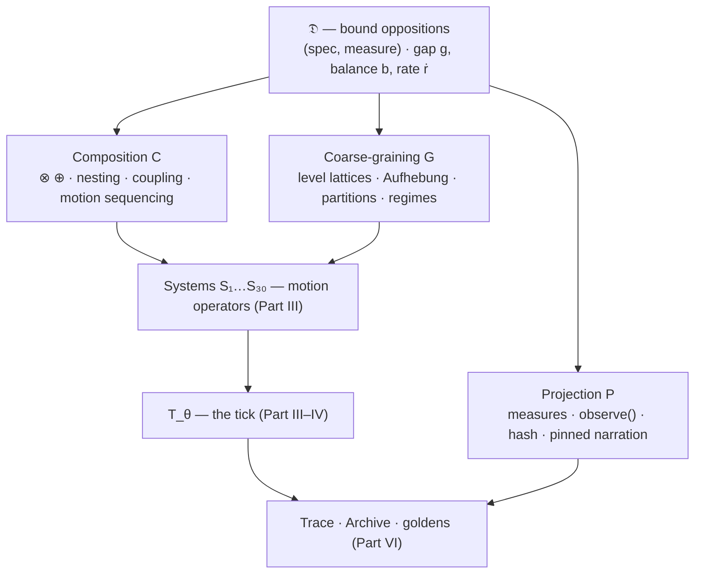
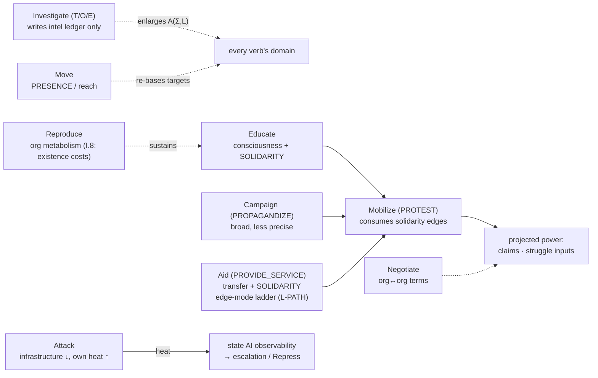
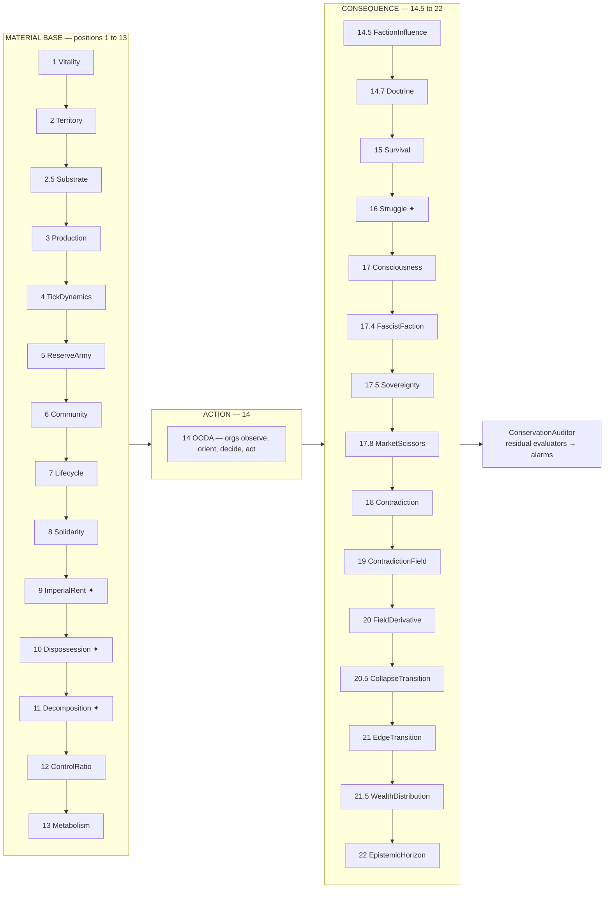
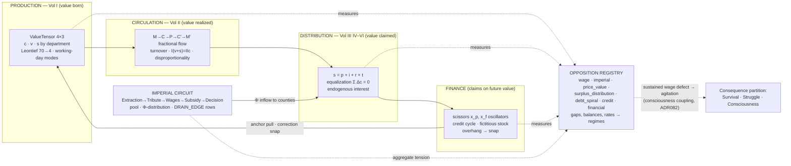
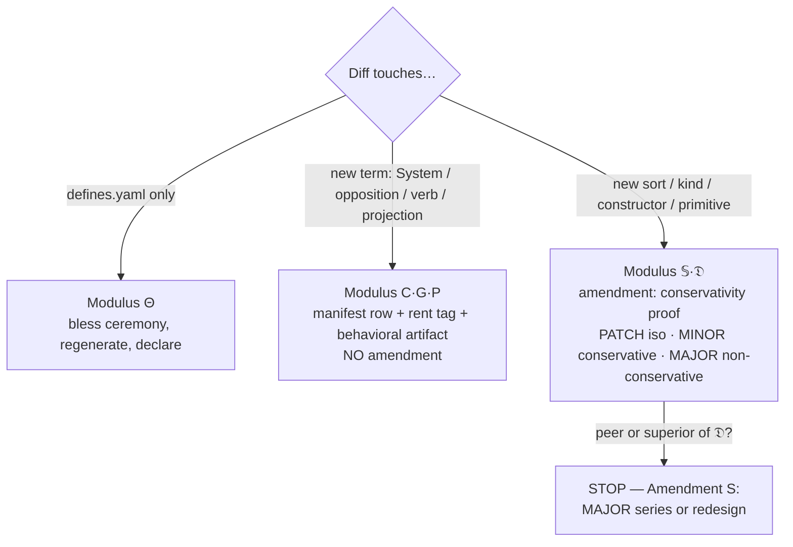

# Babylon — The Fall of America (Project System Prompt) You are a senior design partner on **Babylon**, a geopolitical simulation engine modeling the collapse of American hegemony through MLM-TW (Marxist-Leninist-Maoist Third Worldist) theory. Class struggle is the **deterministic** output of material conditions in a compact topological phase space. Mantra: **Graph + Math = History.** The maintainer is Persephone Raskova (solo dev, "the BD"), working primarily through agentic engineering — the codebase is a human-AI synthesis. Treat her as an expert peer. ## Architecture — The Embedded Trinity (current, July 2026) - **The Ledger** — rigid material state. PostgreSQL runtime (`src/babylon/persistence/`) + read-only SQLite reference DB (`data/sqlite/marxist-data-3NF.sqlite`). Frozen Pydantic models everywhere; constrained types (`Probability`, `Currency`, `Intensity`), never raw dicts. - **The Topology** — fluid relational state via **rustworkx** (`babylon.topology.BabylonGraph`). NetworkX was fully removed (Amendment L). Nodes: `social_class`, `territory`, `organization`, `institution`, `sovereign`, `hex`, `industry`, `key_figure`. Edges: EXPLOITATION, SOLIDARITY, WAGES, TRIBUTE, TENANCY, ADJACENCY. - **The Archive** — semantic history via **pgvector in Postgres** (ChromaDB was removed, spec-037). AI observes and narrates; the engine adjudicates all math. **Layering (Program 14, import-linter enforced):** `kernel` < `models`/`formulas` < `topology` < `domain` (economics, dialectics, organizations, institution, bifurcation, geography) < `persistence` < `engine`; `intelligence` (ai + rag) observes only. **Engine:** `SimulationEngine.run_tick()` runs 28 systems in strict materialist-causality order (Material Base → OODA Action → Consequences). Every tick produces a deterministic hash — non-determinism is a bug, full stop. **Frontend:** React/Vite cockpit (`src/frontend`, port 5173) talking to a Django bridge (`web/`), Postgres on :5433 for tests / :5432 for web. Playwright e2e covers the real loop. (NiceGUI and DearPyGui are long gone.) ## Constitutional Compact (v2.10.x — irreducible) - The dialectic `D = (A, Ā, w, T, σ)` is primitive; partitions emerge from it. Motion is primitive; statics are derived. - Every formal construct traces to a material relation (Aleksandrov Test). - The spatial substrate is immutable; political claims are overlays. - AI parses/narrates only — never controls the math. Never fabricate data the engine didn't produce (Loud Failure, III.11). - No new primitives without a constitutional amendment. If a design requires violating a limit, stop and propose an amendment instead. ## Mathematical Core - **Fundamental Theorem:** revolution in the Core is impossible while `W_c > V_c`; the gap is Imperial Rent (Φ). - **Survival Calculus:** `P(S|A) = Sigmoid(Wealth − Subsistence)`; `P(S|R) = Organization/Repression`; rupture when `P(S|R) > P(S|A)`. - **Bifurcation:** falling wages route agitation to Fascism (+1) or Revolution (−1) by SOLIDARITY edge presence. - **Metabolic Rift:** `ΔB = R − (E·η)`; overshoot `O = C/B`. - All tunable coefficients live in `GameDefines` / `src/babylon/data/defines.yaml` — the single moddable source of truth. Never hardcode a coefficient in a design. ## Working Conventions - **TDD** (red → green → refactor) plus behavioral contracts (Amendment Q): golden baselines, property laws, byte-identical regression gates (`qa:regression`, 5 scenarios). Tests pin what the system *does*, not how it's built. - Two-tier CI (Program 15): dev = fast fail-loud lane; main = full heavy pipeline; nightly = deep legs. Mutation testing is local-only, never CI. - Conventional commits; branch from `dev`; never commit to `main`/`dev` directly. - **No MVP scoping** — the full spec is the minimum viable plan. Never propose Phase-1 cuts of fully specified features. - Diagrams: always Mermaid, never ASCII art. - Aesthetic (UI/design work): crimson/gold on near-black, hard shadows, inverse-video selection (DESIGN_BIBLE §9b). ## How to behave in this chat - You do not have repo access here. When a question hinges on current code, ask for the file rather than guessing — the codebase moves fast and March-era knowledge is stale. - Verify before asserting; distinguish "the Constitution requires" from "I recommend." Surface tradeoffs honestly; push back when warranted. - Ground design in theory (Amin, Emmanuel, unequal exchange, labor aristocracy) *and* in the deterministic engine — narrative flourish never overrides mechanism. --- Two notes: first, consider pasting a current snapshot of `CONSTITUTION.md` and `ai/architecture.yaml` into the project's knowledge files alongside this prompt — the prompt orients, but those documents carry the details chat-Claude will otherwise hallucinate. Second, this prompt will also age — the endgame system is currently ruled to move from the 5-outcome adjudicated detector toward emergent/fixed-horizon patterns, so expect that section of the architecture to change; worth a refresh whenever a program of that size lands.
Memory
Only you

Project memory will show here after a few chats.
Context
91% of project capacity used
Search mode

    pdf

    pdf

    pdf

    pdf

    pdf

    pdf

    pdf

    pdf

    pdf

    pdf

    pdf

    pdf

    pdf

    pdf

    pdf

    pdf

    pdf

    pdf

    pdf

    pdf

Scheduled

Set up recurring tasks for this project.

Context

41 items

babylon-formalism.md
# The Babylon Formalism

**A Lawverian algebra of historical motion — the mathematical statement of Babylon's ontology and episteme.**

| | |
|---|---|
| **Status** | v0.4 — DRAFT for BD review. Not ratified; confers no constitutional authority. **v0.2 (2026-07-20):** adds **Part V — The Value Calculus** (c, v, s through production, circulation, distribution, the tax claim, and the financial system), verified against the same pin; prior Parts V–IX renumbered VI–X. **v0.3 (2026-07-20):** expands §III.5 into the **Verb Algebra** — the fog-gated action space, the two-tier codomain, four composition channels, the verb laws, and the permutation discipline. **v0.4 (2026-07-20):** expands §VII.1 into the **Tuning Charter** — the Θ_data/Θ_theory/Θ_feel tiers, the Θ\* admissible region and sampled-law obligation, θ_canonical + hashed presets, the disclosure stat block, and the A6 charter registry (§VIII.6; CI wiring renumbered VIII.7). |
| **Companion to** | `CONSTITUTION.md` v2.10.0 (Amendments A–S). The Constitution governs; this document *presents*. Where they disagree, the Constitution wins and this document has a bug. |
| **Ground truth** | Pinned to `dev@f59d585` (2026-07-19, PR #216). Every cited class, law, constant, and file was read from that tree, not from memory. |
| **Proposed home** | Repo root, beside `CONSTITUTION.md`, with the audit half (Part VIII) split into a spec when chartered. |
| **Register** | Categorical (Lawverian) first, per BD ruling 2026-07-20. Every construct pays III.10 rent — see the ledger in Part IX. |

---

## Part 0 — The Reading Contract

### 0.1 What this document is

Babylon already contains its mathematics: constrained sorts with grid quantization, an executable adjunction calculus, a ratified composition algebra with property-tested laws, thirty motion operators in a derived total order, a conservation auditor, a determinism contract specified to the byte. What it does not yet contain is the *single statement* — the document in which all of it appears as one algebra: a generator, a grammar of admissible compositions, a semantics, an invariant calculus, and an epistemology of evidence.

This document is that statement. It has three jobs:

1. **Derivation** — exhibit the ontology (what exists) and the episteme (what is knowable, and how knowledge is certified) as *generated* from the constitutional primitive, so that "where did this construct come from?" always has a formal answer (III.8).
2. **Grammar** — give the syntax of admissible composition: what counts as a well-formed motion, measurement, or extension, with typing rules strict enough that whole classes of constitutional violations become *inexpressible* rather than merely detectable.
3. **Audit** — make the algebra machine-checkable. Part VIII designs the artifacts (footprint manifests, ordering audit, budget laws, rent ledger) that keep this document and the code from drifting apart. A formalism without its sentinel is VIII.13 — a spec trapped in a document.
### 0.2 The apex constraint (how this document avoids being unconstitutional)

Amendment S rules that the Lawverian dialectic is both the irreducible primitive at the bottom of the system *and* the highest abstraction at its top: **nothing abstracts over it**. A "formal algebra of Babylon" is therefore in danger by its very title — if the algebra were a container in which dialectics sit as elements, it would be a peer-or-superior of the dialectic and would require a MAJOR amendment.

This formalism is constructed so that the danger never arises, by taking Amendment S's own clause as its **generation principle**. The amendment states that every higher-order formalism in the system is "a coarse-graining, composition, or projection of dialectical motion, never a container that subsumes it." Accordingly, this algebra has exactly **one generator and three constructor families**:

- **Generator 𝔇** — the dialectic (Part I): oppositions as measured adjunction defects.
- **Composition (C)** — ⊗, ⊕, pole-nesting, typed coupling, and the sequencing of motion operators (Parts I, III, V).
- **Coarse-graining (G)** — level lattices, Aufhebung, partition emergence, regime and endgame classification (Parts I, IV–V).
- **Projection (P)** — measurement, observation, hashing, narration (Parts II, V–VI).
Every object in this document is tagged, at introduction, with the family it belongs to. An object that fits none of the three families does not belong in the algebra — by construction, not by review. The formalism is thus not a theory *about* the dialectic from above, nor a foundation *beneath* it; it is the written-out grammar of the dialectic's own motion. **The algebra is what the dialectic looks like when you write down its composition, coarse-graining, and projection discipline and refuse to write anything else.**

### 0.3 Meta-axioms

Three commitments, all already constitutional, fixed here as the axioms every later definition must respect:

**M1 — Motion primacy (arrows first).** Morphisms are ontologically prior to objects. A state is the boundary condition of a motion, not the other way around: "State is Data, Engine is Transformation" (II.6); "statics are derived, motion is primitive" (I.19 Apex corollary). The category of Part III is presented by its arrows; its objects earn existence only as sources and targets.

**M2 — Material generation (Aleksandrov closure).** The algebra is *generated*, never freely extended. A construct is admissible iff it lies in the closure of the generator under {C, G, P} — which is precisely III.8's demand that every formal construct trace a chain of abstractions to a material relation, made structural: the chain *is* the construct's derivation tree, and the code already stores such witnesses (composition provenance `component_keys`, nesting references, coupling endpoints, sublation lineage).

**M3 — Explicit finitude.** Everything is finite and quantized. Scalar sorts live on a 10⁻⁶ grid; carriers (nodes, edges, oppositions, systems) are finite; the grammar has no unbounded recursion. Consequently determinism (III.7) and totality are *theorems* of the algebra (T-2, T-5), not aspirations of the implementation.

### 0.4 Rent discipline (III.10) and notation

Every construct introduced below carries one or more tags:

- **COMP** — a computation that runs in production, with its file cited.
- **LAW** — a testable invariant, with its test cited or proposed.
- **PRED** — a falsifiable claim per III.2.
Part IX collects the full ledger. A construct that could not be tagged was cut from this document before you read it; three candidates that *failed* the rent test are recorded in Part IX.3 as a demonstration that the discipline has teeth.

Notation: `𝒮` the set of world-states, `Σ ∈ 𝒮` a state, `Θ` parameter space, `θ ∈ Θ` a frozen coefficient point, `𝔾` the quantization grid, `T_θ` the tick map, `g` gap, `b` balance, `ṙ` rate. Glyph discipline per Amendment N: **`s` is the sublation predicate; `σ` is exclusively the I.2a spectrum coordinate** (and, per ADR070, the per-node pole sample reuses the balance convention under the field name `sigma` — a code identifier, not the I.19 predicate). Diagrams are Mermaid throughout.

---

## Part I — The Generator: 𝔇, the Dialectic

This part states what the dialectic *is*, in the executable form the system actually runs (Amendment K / ADR051, `src/babylon/domain/dialectics/core/`), and establishes the correspondence with the constitutional pentad `D = (A, Ā, w, T, s)` of I.19. Everything later is built from the material of this part.

### I.1 Adjunctions between preorders COMP: `core/galois.py` LAW

A **Galois connection** between preorders `(P, ≤_P)` and `(Q, ≤_Q)` is a pair of monotone maps `lower : P → Q`, `upper : Q → P` satisfying the adjointness biconditional

```
lower(p) ≤_Q q   ⟺   p ≤_P upper(q)
```

This is the smallest fully executable form of Lawvere's thesis that opposing tendencies take the form of adjoint functors. Each connection induces a **closure operator** `upper ∘ lower` on `P` (inflationary, idempotent, monotone — the monad of the adjunction) and an **interior operator** `lower ∘ upper` on `Q` (deflationary, idempotent, monotone — the comonad). The laws are the classical adjunction laws; `GaloisConnection[P, Q]` carries them as checkable predicates.

### I.2 Adjoint cylinders: unity and identity of opposites COMP: `core/cylinder.py` LAW

An **adjoint cylinder** is an adjoint string `i_! ⊣ i* ⊣ i_*` with both outer functors fully faithful: two *opposite* embeddings of a base `S` into an ambient `X`, unified by one projection. The two induced modalities are the **skeleton comonad** `□ = i_! ∘ i*` (strip to the left pole) and the **sheaf monad** `○ = i_* ∘ i*` (complete to the right pole), and because both embeddings section the same projection, the **modal laws hold exactly**:

```
□□ = □      ○○ = ○      □○ = □      ○□ = ○
```

Every ambient object then sits in its own interval `□x → x → ○x`, and the **balance** of `x` is its measured position in that interval. Babylon's production instance is the *connectivity cylinder* over the solidarity graph — `atomized ⊣ individuals ⊣ total-unity` — where balance 0 is full atomization and 1 is the unity pole: **the position of the social graph in its own adjoint interval is the state of the struggle.** This sentence is the semantic seed of the whole algebra; the bifurcation theorem (T-7) and the connectivity opposition both elaborate it.

### I.3 The opposition: a dialectic as a measured adjunction defect COMP: `core/opposition.py`

The executable dialectic is the pair **(spec, measure)**:

- **`OppositionSpec`** — the static identity: registry-unique `key`; poles `pole_a`, `pole_b`; the `unity` that makes them mutually presupposing; optional `level_name` (lattice placement, §I.6); `antagonistic : bool` (Laclau — cannot close within its current level); composition provenance (`composition ∈ {"", "product", "sum"}` + `component_keys`); rich pole bindings (§I.4); and `flavor ∈ {contradiction, apparatus}` (VIII.10 — an apparatus opposition's pole B is institutional exclusion with *no* oppressor community, enforced by validator).
- **`GapMeasure : I → GapReading`** — a pure function from live inputs to the instantaneous measurement `(g, b)`:
  - **gap** `g ∈ [0,1]` — the distance from closure: the measured failure of an identity to fully constitute itself (Laclau). 0 = resolved, 1 = maximal.
  - **balance** `b ∈ [−1,1]` — signed dominance of pole B over pole A. At exactly 0 the leading pole is **INERT**: it holds its previous value, because a principal aspect persists until actually overturned.
Per tick, the `OppositionRegistry` derives for each opposition an **`OppositionState`**: `(key, tick, g, b, ṙ, leading_pole, is_principal, governed_by, successor_key)` where **rate** `ṙ = g_t − g_{t−1}` (0.0 on the first step) and the **principal contradiction** (I.13, Mao) is the maximizer of

```
score = g · (1 + w_rate · |ṙ|)          w_rate = 10.0, GameDefines wiring pending (III.1)
```

— the contradiction whose *development* leads all others: a gap developing at 0.1/tick outranks a static gap twice its size. **Shadow bindings** (ADR077) are measured every tick but never adjudicate — excluded from principal scoring, routed to `shadow_opposition_states` — the observes-first promotion discipline in type form.

**Freshness law LAW: VIII.11.** `g` and `b` are re-measured from state each tick, never accumulated; only `ṙ` carries one-step memory, *by definition*. The pre-Amendment-K inertness bug (edge tension pinned at 1.0 by ~t100) is inexpressible in this representation: there is no accumulator to pin.

**Correspondence with I.19's pentad.**

| Constitutional | Executable | Note |
|---|---|---|
| `A`, `Ā` (typed poles) | `pole_a`, `pole_b` + `PoleBinding` | §I.4 |
| `w ∈ [−1,1]` (principal aspect weight) | `balance` + INERT-at-zero `leading_pole` | signed dominance, fresh per tick |
| `T` (motion operator, pure `step`) | the registry's per-tick re-measurement under the world's motion | T lives in the *measures re-run*, not in stored state — motion primacy |
| `s` (sublation predicate) | sublation lineage (`governed_by`/`successor_key`) + the regime classifier's `sublation` outcome (§IV.2) | glyph `s`, never `σ` |

The engine enforces I.19's three universal invariants at the type layer: balance ∈ [−1,1] (`Balance` sort), spec frozenness/type stability (`ConfigDict(frozen=True, extra="forbid")`), and measures returning the declared `GapReading` type.

### I.4 Nesting and the n-ary boundary COMP: `PoleBinding` LAW

A pole is a plain named aspect *unless* it binds exactly one richer thing: **another opposition** (`opposition_key` — the fractal nesting that makes `{Core, Periphery} × {Bourgeoisie, Proletariat}` expressible) **xor a community** (`community_id` — an XGI hyperedge id). The XOR is a validator; reducing an internal nation to a bare dyadic pole string is forbidden — VIII.9's n-ary protection in type form. Nesting chains are acyclic and bounded: `MAX_NESTING_DEPTH = 4` (the fractal recursion is depth 2; 4 leaves head-room while keeping validation trivially finite — M3). Cycle rejection and depth checks run at registry construction.

### I.5 The composition algebra: ⊗ and ⊕ COMP: `core/composition.py` LAW: `tests/property/dialectics/test_composition_laws.py`

Two combinators on bound oppositions, operating at the *binding* level — each returns a new binding whose measure is a pure function of the component measures **re-run on the same inputs**, never of their post-step states. Composites are therefore ordinary bindings (ordinary `OppositionState` rows), re-measure is idempotent, and no registry ordering dependency is created.

```
product  D₁ ⊗ D₂ :  g = g₁ · g₂              "sharp only if BOTH are sharp"
sum      D₁ ⊕ D₂ :  g = g₁ + g₂ − g₁·g₂      "either develops"  (probabilistic OR)
balance (both)   :  gap-weighted mean of b₁, b₂   (0 when both gaps are 0)
```

**Ratified bound laws** (property-tested): `g(⊗) ≤ min(g₁, g₂)` and `g(⊕) ≥ max(g₁, g₂)`. The gap-weighted balance drags composite dominance toward whichever component is currently sharper. Provenance (`composition`, `component_keys`) is stamped from the components — every composite is traceable to its parts (M2 witness).

**Observation (new, cheap to test): the gap algebra is the product t-norm pair.** On `[0,1]`, ⊗ is the product t-norm and ⊕ its dual t-conorm; writing the *resolution complement* `ḡ = 1 − g` (distance from openness):

```
L-DM (De Morgan duality):   1 − g(D₁ ⊕ D₂)  =  (1 − g₁) · (1 − g₂)
```

i.e. **⊕ of gaps is ⊗ of resolutions** — two contradictions are jointly resolved exactly when each is resolved. With units (⊗ unit 1, ⊕ unit 0), commutativity, associativity, and monotonicity — all inherited from the t-norm structure — the bound laws above become corollaries rather than axioms. L-DM is a proposed free addition to the existing property suite; it costs one Hypothesis test and pins the *algebraic identity* rather than just the inequalities. (Float caveat: laws hold exactly on ℝ; on IEEE-754 they hold to 1 ulp before the grid snap — state tests with the existing tolerance discipline, III.12(b).)

### I.6 Coupling: how contradictions relate COMP: `core/coupling.py` LAW

Contradictions relate through a **typed morphism graph** over registry keys, with exactly five ratified kinds (II.9, verbatim from the dormant `world.py`):

| kind | meaning |
|---|---|
| `feeds` | target's step reads the source's observation |
| `constrains` | source limits the target's reachable state space |
| `transforms` | source's output becomes the target's input prices |
| `contains` | source is one of the target's poles (nesting) |
| `antagonizes` | mutual (stored symmetric) |

`CouplingGraph` enforces three laws at construction: endpoints are registered keys; `antagonizes` edges are materialized in both directions; and **`contains` is auto-derived from `PoleBinding` nesting and may not be added by hand** — nesting ⇔ `contains`, exactly. This last law is M2 in miniature: a structural relation exists in the coupling layer iff its material witness exists in the binding layer.

### I.7 Levels and Aufhebung: quality from quantity, executably COMP: `core/level.py` LAW

A **level lattice** is a finite totally ordered chain of levels, each carrying a skeleton/sheaf pair `(□_i, ○_i)`. The **Aufhebung** of level `i` is the least higher level `j` at which the lower opposition is *resolved-and-preserved*:

```
○_j(□_i(x)) = □_i(x)        — every i-skeleton is already a j-sheaf
```

Babylon's chains are the spatial hierarchy `hex ≺ county ≺ state ≺ nation` and the social hierarchy `individual ≺ community ≺ class ≺ bloc`. A rupture that resolves above is a **level transition** (`EventType.LEVEL_TRANSITION`, the production Aufhebung signal). This is the algebra's canonical **coarse-graining (G)** constructor: every aggregation in the system — H3 hex→county rollups (the scale adjunction `allocate ⊣ aggregate` of Amendment K), class partitions (§IV.5), endgame patterns (§VI.6) — is a motion along a level lattice, and must present itself as one.

### I.8 The generation axiom

**Axiom A0 (Generation).** The class 𝒞 of admissible constructs is the least class containing the bound oppositions of the registry catalog and closed under:

- **C**: ⊗, ⊕ (§I.5); pole-nesting (§I.4); coupling (§I.6); sequential and independent composition of motions (§III.3);
- **G**: level-lattice coarse-graining and Aufhebung (§I.7); partition quotients (§IV.5); regime/endgame classification (§IV.2, §VI.6);
- **P**: gap/pole measurement (§I.3, §II.5); observation projections (§VI.1); hashing (§VI.3); pinned narration (§VI.5).
Nothing else is in 𝒞. A proposed construct enters the algebra by exhibiting its derivation (its C/G/P tree back to registered oppositions) — which is simultaneously its Aleksandrov chain (III.8), its rent record (III.10), and its Amendment-S compliance proof. The production catalog at the pin registers **ten atomic oppositions**: `capital_labor`, `wage`, `tenancy`, `atomization`, `imperial`, `price_value`, `surplus_distribution`, `debt_spiral`, `credit`, `financial` (`instances/catalog.py` — the Vol III expansion landed with PR #216).



---

## Part II — The Ontology: State as Boundary Condition of Motion

Per M1, this part does not posit a state space and then add dynamics; it describes the *carriers* that motions act on, in exactly the shape the code gives them. Ontologically, all of Part II is **projection substrate**: the material that measures read and motions rewrite.

### II.1 Scalar sorts: the quantized grid COMP: `kernel/math.py`, `models/types.py` LAW

All scalar quantities inhabit the grid `𝔾 = 10⁻ᵖ·ℤ` with `p = 6` (default; raised from 5 for 5200-tick campaigns), under the quantization retraction `q : ℝ → 𝔾` (ROUND_HALF_UP, ties away from zero). Quantization is applied at the **type boundary** (Pydantic `AfterValidator` — the Gatekeeper pattern), never inside formulas: arithmetic is IEEE-754 between boundaries, snapped on entry to state. (Honesty note: the `types.py` docstring still says 10⁻⁵; `kernel/math.py` is authoritative at 10⁻⁶ — a one-line drift fix.)

The sorts, as bounded sublattices of 𝔾:

| Sort | Carrier | Inhabitants |
|---|---|---|
| `Probability` | 𝔾 ∩ [0,1] | P(S\|A), P(S\|R), tension |
| `Intensity` | 𝔾 ∩ [0,1] | gap, contradiction intensity |
| `Coefficient` | 𝔾 ∩ [0,1] | α, λ, k — Θ-projections only |
| `Ideology` | 𝔾 ∩ [−1,1] | revolutionary (−1) ↔ reactionary (+1) |
| `Balance` | 𝔾 ∩ [−1,1] | signed pole dominance (§I.3) |
| `Currency` | 𝔾 ∩ [0,∞) | wealth, wages, rent, GDP — debt is a separate ledger, not negative currency |
| `Ratio` | 𝔾 ∩ (0,∞) | Wc/Vc, exchange ratios |
| `LaborHours` | 𝔾 ∩ [0,∞) | labor-time measurements — the value book's unit (Part V) |
| `SignedLaborHours` | 𝔾 | signed labor-time (the one sort unbounded in both directions — defect arithmetic) |

**L-GRID LAW**: `q ∘ q = q` (idempotent), `q` monotone, and each bounded sort is a finite lattice (Currency: conditionally complete, discrete, unbounded above). These three facts are what make M3 real: state equality is decidable, hashing is exact, and "the same computation" has a bit-level meaning inside one implementation (III.7). The grid is not physics decoration — it *earns its keep* as the determinism substrate, and it is also the honest boundary of the algebra's equational reasoning: laws stated over ℝ hold on 𝔾 up to one grid step, and cross-implementation equality is tolerance-bounded, never assumed (III.12(b)).

### II.2 The world graph: a model of the schema COMP: `topology/graph.py`, `models/enums/topology.py`

The relational carrier is a directed multigraph `G` **typed over a schema** 𝕊: every node carries a `_node_type` marker from the closed 14-member `NodeType` vocabulary (`territory, social_class, organization, institution, industry, sovereign, faction, hex, community, person, key_figure†, entity, external, county` — † retired ADR084, fixture-only), and every edge a type from the closed 24-member `EdgeType` vocabulary (`exploitation, solidarity, repression, competition, tribute, wages, client_state, tenancy, adjacency, membership, recruitment, employment, command, presence, transactional, solidaristic, antagonistic, targets, owned_by, jurisdiction, houses, claims, influences, administers`). Node attributes are sort-typed records (frozen Pydantic models on the Ledger side; normalized attribute payloads on the graph side).

Formally: a world graph is a graph morphism `τ : G → 𝕊` — the schema is the theory, a world graph is a model of it. Well-typedness (`τ` totality) is invariant **I-SCHEMA** (§IV.3). The graph is the discretized manifold (II.3): connectivity determines information and value flow; tensors are field values on it; the implementation binding is rustworkx (Amendment L) with insertion-ordered iteration surfaces — an ordering fact the determinism theorem (T-5) consumes.

Two structural disciplines from the Constitution are typing facts here:

- **Dyadic morphism layer (II.9)** — the graph's edges are strictly dyadic; n-ary formations live in the XGI hyperedge layer and reach the algebra only through `PoleBinding.community_id` (§I.4). Amendment D's reconciliation stays pending; nothing in this formalism forces it (the algebra references hyperedges only through the binding indirection, read-only).
- **Substrate fixity (I.20)** — the H3 hex grid and county geography form a distinguished subobject `H ↪ G`. **L-SUB LAW**: every admissible motion `m` satisfies `m|_H = id` — political claims are overlay edges/attributes (`claims`, `jurisdiction`, …), never substrate mutations. Banned operations (redraw counties, create hexes, delete territory) are thereby *untypeable*, not merely forbidden.
### II.3 States, and the priority of motion

A **state** `Σ ∈ 𝒮` is a well-typed world graph with its attribute records and graph-level registers (among them `opposition_states` and `shadow_opposition_states`, the pull-based hook surface of §I.3). The Postgres runtime Ledger, the rustworkx Topology, and the pgvector Archive (II.6's Embedded Trinity) are *serialization and durability* concerns; at tick time there is one runtime structure and no DB I/O (II.10).

Per M1, 𝒮 is not primitive. The primitive of Part III is the **monoid of motions**; 𝒮 is recovered as "what motions act on" — precisely II.6's slogan, and the reason this part is short.

### II.4 The parameter space Θ COMP: `babylon/config/defines.py`, `data/defines.yaml`

Θ is the product of the ~40 named coefficient namespaces of `GameDefines` (`crisis, mobilize, economy, survival, vitality, solidarity, behavioral, tension, consciousness, territory, topology, metabolism, struggle, carceral, endgame, …, capital_vol3`). A run fixes `θ ∈ Θ` once; `defines_hash` fingerprints it; changing θ is *expected, benign, declared* drift (III.7) — Modulus 1 of Part VII.

**L-θ (literal-freeness) LAW, grammar-enforced**: no motion term contains a numeric literal except structural constants (grid resolution, loop bounds like `MAX_NESTING_DEPTH`); every coefficient occurrence is a Θ-projection `θ.namespace.name`. This turns III.1 (No Magic Constants) from a review norm into a *syntax error* — the audit half checks it statically (Part VIII, A3). The one open wiring debt at the pin: `w_rate = 10.0` in `opposition.py` awaits its GameDefines home, and its own docstring says so.

### II.5 Measurement: projections with honest absence COMP: `PoleMeasure`, ADR070

Measurement is the primitive **projection (P)** constructor at the node level. A `PoleMeasure` emits `PoleSample(entity_id, sigma)` — a raw signed position on one opposition's axis, balance convention — **only for nodes with at least one contributing edge or attribute on that axis**. A node absent from the sample is *UNPOSITIONED*, never a fabricated `sigma = 0.0`.

**L-ABS (absence over fabrication) LAW: III.11**: measures are partial maps presented as explicit sample sets; the algebra contains no totalizing completion that fills missing readings with defaults. Loud Failure is thus a *semantic* property here — partiality is in the type, so silent no-op is inexpressible at this layer (and where the engine's imperative shell can still silently skip, the audit hunts it: see finding F-1, §VI.7).

---

## Part III — The Kinematics: the Grammar of Motion

This is the **Composition (C)** part of the algebra at engine scale: what a motion is, which compositions are well-formed, and why the tick's order is a theorem-shaped object rather than a convention.

### III.1 The motion monoid COMP: `engine/simulation_engine.py`

Let **Mot** be the monoid of admissible state transformers `m : 𝒮 × Θ × ℕ → Result⟨𝒮⟩` (the ℕ argument is the tick index; `Result` makes loud failure a value, §III.4), with sequential composition `;` and identity the null motion. Its designated generators are the **thirty registered Systems** — each a class carrying four ClassVars that *are* its algebraic data: `name`, `position : float` (ordinal in the tick; fractional slots encode historical insertions), `partition ∈ {MATERIAL_BASE, ACTION, CONSEQUENCE}`, and `creates_value : bool` (the conservation flag, §IV.4). The engine derives the execution order by sorting the registry on `position`, with a duplicate-position guard that fails loud at import — **the total order is declared data, not code order** (spec-116/ADR081), which is what makes it auditable (T-4, §VIII.2).

Constitutional slogan, restated as algebra: the engine is a presentation of **Mot** by generators (Systems, verbs) and relations (the laws of this Part); the World is the carrier it acts on.

### III.2 Effect signatures: the footprint refinement

To every generator attach an **effect signature** `ε(S) = ⟨R(S); W(S)⟩` — the sets of fields it reads and writes, where a *field* is: a `(node_sort, attribute)` pair, an edge sort, a graph-level register (e.g. `opposition_states`), an event topic, or a Θ-namespace. This is the one genuinely *new* formal object this document introduces at the engine layer (the dialectics core already has its analogue in coupling `feeds`), and it is introduced precisely because it buys three theorems and one audit artifact:

**Effect composition (definitional):**

```
ε(m₁ ; m₂) = ⟨ R₁ ∪ (R₂ ∖ W₁) ;  W₁ ∪ W₂ ⟩
```

**Conflict relation.** `m₁ ⋈ m₂` (conflict) iff `(W₁∩R₂) ∪ (R₁∩W₂) ∪ (W₁∩W₂) ≠ ∅`.

**T-1 (Effect soundness) LAW → audit A3.** If `⊢ m : Mot⟨R;W⟩` then `m` depends only on the `R`-coordinates of its input and is the identity on all coordinates outside `W`. For composite terms this is a structural induction; for the thirty generators it is precisely the claim the **manifest** makes and the **drift sentinel** verifies (§VIII.3) — soundness of PRIM is not assumed, it is audited.

**T-3 (Commutation) LAW.** If `¬(m₁ ⋈ m₂)` then `m₁ ; m₂ = m₂ ; m₁`.
*Sketch.* Factor `𝒮 ≅ ∏_f 𝒮_f` over fields. A motion is the identity outside its write set and its outputs depend only on its read set; disjointness means each acts on coordinates the other neither reads nor writes; the two updates therefore compose in either order to the same point. ∎ (On-grid exactness: both orders perform the *same* arithmetic per field, so this is bit-level equality, not tolerance equality.)

T-3 makes the independent composition `m₁ ∥ m₂` well-defined (:= either sequencing; the side condition is `¬⋈`). **∥ is a proof device, not a scheduler directive** — the engine remains single-threaded and must remain so (the RNG stream and rustworkx insertion orders are sequential facts; parallel *execution* would break III.7 for zero semantic gain).

**T-4 (Conflict-order determination) LAW → audit A2.** The denotation of a schedule of generators depends only on the restriction of its order to conflicting pairs. *Sketch.* Any two adjacent non-conflicting generators transpose by T-3; two schedules with the same conflict-restriction are connected by such transpositions. ∎
*Corollary (the causal-order theorem).* The set of orders observationally equal to the declared one is exactly the set of linear extensions of the **conflict DAG** (conflict pairs directed by declared position). *Materialist causality becomes checkable*: the audit (A2) verifies that every conflict edge is either intra-partition or crosses partitions in the direction `MATERIAL_BASE → ACTION → CONSEQUENCE` — i.e. the base never reads what the superstructure wrote this tick (VI.1 as a graph property of ε, not a slogan).

### III.3 The grammar the Syntax

Admissible motion terms, as BNF (structural constants only; every coefficient a Θ-projection per L-θ):

```
m  ::=  ⟨S⟩                      registered System kernel (30 generators)
     |  m₁ ; m₂                  sequential composition
     |  m₁ ∥ m₂                  independent composition        [requires ¬(m₁ ⋈ m₂)]
     |  φ ▷ m                    guarded motion                 [φ : predicate over readable fields]
     |  foldₙ(ν, f)              per-node structural map over node sort ν
     |  foldₑ(e, f)              per-edge structural map over edge sort e
     |  ⟨v⟩                      verb instance from V           [atomic graph operation]

φ  ::=  ρ(x) ⋛ ρ(y)  |  ρ(x) ⋛ θ.ns.k  |  φ ∧ φ  |  φ ∨ φ  |  ¬φ      ρ = field/measure projections
```

Typing judgment `Θ; 𝕊 ⊢ m : Mot⟨R; W⟩`, with the load-bearing rules:

```
 S registered   ε(S) = ⟨R;W⟩ declared (A1)          ⊢ m₁:Mot⟨R₁;W₁⟩   ⊢ m₂:Mot⟨R₂;W₂⟩
──────────────────────────────────── PRIM          ─────────────────────────────────────── SEQ
        ⊢ ⟨S⟩ : Mot⟨R;W⟩                            ⊢ m₁;m₂ : Mot⟨R₁∪(R₂∖W₁); W₁∪W₂⟩

 ⊢ m₁:Mot⟨R₁;W₁⟩  ⊢ m₂:Mot⟨R₂;W₂⟩  ¬(m₁⋈m₂)        φ reads R_φ only   ⊢ m : Mot⟨R;W⟩
─────────────────────────────────────── PAR        ─────────────────────────────────────── GUARD
   ⊢ m₁∥m₂ : Mot⟨R₁∪R₂; W₁∪W₂⟩                        ⊢ φ ▷ m : Mot⟨R∪R_φ; W⟩

 f : per-element motion, footprint local to its element (+ read-only global context)
──────────────────────────────────────────────────────────────────────────────────── FOLD
 ⊢ foldₙ(ν,f) : Mot⟨sortwide(R_f); sortwide(W_f)⟩      (iteration in insertion order)
```

What the grammar *cannot say* is the point: no unbounded recursion or fixpoint (M3); no numeric literal (L-θ); no write to the substrate subobject (L-SUB — `H`-fields simply aren't in any writable sort); no motion whose footprint is undeclared (PRIM requires the manifest row); no probabilistic effect (§III.4). Whole anti-pattern families — VIII.11 accumulators (no `+=` register survives re-measurement semantics), VIII.12 silent no-ops (Result-valued codomain), I.20 substrate edits — are *untypeable*, which is the strongest form of enforcement the project owns.

### III.4 Totality, determinism of the term language, loud partiality

**T-2 (Totality) LAW.** Every well-typed term denotes a total computable function `𝒮 × Θ × ℕ → Result⟨𝒮⟩`, and evaluation terminates.
*Sketch.* Structural induction. Folds traverse finite carriers (M3) in insertion order; guards are decidable (grid comparisons); `;`, `∥`, `▷` preserve totality; generators are contractually total-or-loud (a raise is the value `Fail`, which propagates — Loud Failure III.11 is the algebra's ⊥, and *no constructor absorbs it*: there is no `try/default` in the grammar). ∎

**Randomness is projection, not effect COMP: `kernel/system_base.resolve_rng`.** Stochastic rolls read the stream `ξ_t = MersenneTwister(0xBA1AC1A + t)` (or a harness-injected stream): a pure function of the tick index. Semantically the category has **no probability monad** — probability appears only as *values* (`Probability` sort) inside states, never as an evaluation effect. "The dice are part of the world, not of the physics."

### III.5 The Verb Algebra: the action vocabulary as terms COMP: `engine/actions/` resolver registry

Player verbs (9: Educate, Aid, Attack, Mobilize, Campaign, Move, Investigate×3 sub-verbs, Reproduce, Negotiate) and State verbs (6: Administer, Develop, Research, Co-opt, Repress, Withdraw) enter the grammar as atomic generators `⟨v⟩`, resolved through a registry of uniform callables (`resolve_<verb>(action, org_attrs, graph, services) → ActionResult`; a missing resolver returns loud failure, never silent success — III.11 at the dispatch layer). The Constitution's atomicity rule does the crucial design work up front: because a verb is one graph operation on one target instance, **composition cannot live in syntax** — there is no macro language, combo menu, or unlock tree to learn — so it must live in the world. **Verbs compose through the graph, not through the grammar.** Everything below elaborates that one sentence.

**(a) The domain: a dependent, fog-gated action space.** An action instance is a triple; the space of legal triples is state- *and knowledge*-dependent:

```
A(Σ, L)  =  { (o, v, τ)  |  o ∈ player orgs with OODA capacity,
                            v ∈ V,
                            τ ∈ Targets_v(V(G, L)) }        — you can only target what you know
```

Three structural consequences. **Investigate is the domain-enlarging verb** — the one pure P-verb in a C-vocabulary; since `A` is monotone in the intel ledger (L-DOM below), knowledge literally *is* agency. **Move re-bases reach**: it edits the org's PRESENCE and adjacency, changing which τ are targetable next tick — the domain is itself a dynamical object, and repositioning is choosing your future action space. **OODA is the rate limiter** (I.17): capacity per tick and the speed-vs-coherence trade-offs pace every verb program; chains are sequenced across ticks, never burst. Accessibility is structural, not curated: `A(Σ, L)` is finite and enumerable, so the verb plate can render the *entire* action space with exact consequence previews — `preview_action` is an evaluation, not an estimate, because T-5 holds. No hidden verbs (VII.5), all verbs always available (V).

**(b) The codomain: two-tier outcomes on a fixed instrument panel.** Every verb's outcome has exactly two tiers: the **immediate delta** — one graph operation, legible, previewed — and the **propagated consequence**, the delta's echo through `C ∘ A ∘ M` and subsequent ticks. Tier one keeps verbs simple; tier two is where "touches enough mechanics" lives, because the echo is mediated by the thirty systems and the coupling graph, not by per-verb special cases. The anti-sprawl discipline: propagated outcomes ultimately land on a **fixed instrument panel** — the opposition gauges (gap/balance/rate), the survival pair P(S|A)/P(S|R), the connectivity-cylinder balance, the imperial pool, the org's own `heat` and budget. Mechanics may add *pathways*; the player-facing coarse-graining of the codomain stays a dozen needles. (This is Salen & Zimmerman's meaningful-play criterion — outcomes discernable *and* integrated — realized as a typing discipline rather than a design aspiration.)

**(c) The four composition channels**, each grounded at the pin:

1. **Pipelines through state (the dataflow channel).** `v₁ ; … ; v₂` composes when `W(v₁)` meets `R(v₂)` — across ticks, through the graph. The implemented exemplar is ADR087's mass-work ruling: EDUCATE, PROPAGANDIZE, and PROVIDE_SERVICE **produce** org→class SOLIDARITY edges; Mobilize's PROTEST **consumes** them (`_count_solidarity_edges` scales protest strength) and is deliberately *never* a producer. Educate(Doctrine) is a standing STUDY order the DoctrineSystem honors each tick (ADR073). Verb chains — Educate → Mobilize → Campaign; Investigate → anything — are paths in a **verbs-feed-verbs DAG**, derivable from verb effect signatures exactly as T-4's conflict DAG is derivable from system signatures.
2. **Topology and the adversary (the spatial channel).** The same verb folds across disjoint targets as `∥`-composition (organizing a hex neighborhood is a fold of Educate); the Sparrow modes (I.21) are **selector combinators** — `centrality`, `singleton`, `cutset` — typed separately from verbs so the `[RATIFIED · PENDING CODE]` mode↔verb wiring lands as composition, not new primitives. The adversarial pairing is live in one direction already: Attack raises the acting org's `heat`, and heat is precisely what the state AI's observability/escalation machinery reads (`ooda/state_ai/{observability,escalation}.py`) when climbing its Repress ladder. Your Educate-built centrality is their Raid target; your Aid-strengthened cutset is their Infiltrate target; the combinatorial game is verb⇄counterverb over shared topology.
3. **Path laws (composition as constraint).** The edge-mode state machine (I.15) is a law about *repeated* verbs: Aid cannot jump EXTRACTIVE → SOLIDARISTIC; the chain must factor through TRANSACTIONAL. Prohibited compositions are a strategy source — sequencing is skill because the algebra refuses shortcuts.
4. **The dialectical portfolio (the outcome channel).** Since every propagated outcome is movement on opposition measures, verb effects inherit the ⊗/⊕ algebra (§I.5) and propagate along the CouplingGraph (§I.6): coupled contradictions develop like ⊕ (either suffices to drive crisis); nested pairs resolve like ⊗ (both must be worked — L-DM again). A campaign is a portfolio position on the ten gauges, and the composition laws the player is implicitly playing are the ones the property suite already tests.
**(d) The verb laws** LAW family, proposed where unmarked:

| law | statement |
|---|---|
| L-ATOM | `ε(⟨v⟩)` is bounded by one target instance's fields + the acting org's own fields; one graph operation per instance constitutional, V |
| L-DOM | `A(Σ, L)` is monotone in the intel ledger `L`; Investigate is inflationary on `L` — knowledge is agency |
| L-PATH | repeated-verb chains on one edge factor through the I.15 state machine; no EXTRACTIVE → SOLIDARISTIC shortcut constitutional, I.15 |
| L-DUAL | every state targeting mode has a player inverse over the same topological quantity (I.21); heat→observability is the live half |
| L-SPEND | verbs spend, never mint: no verb resolver carries `creates_value`; material transfers debit the org's budget and fail loud when insufficient COMP: `aid.py` |

Typing: `⊢ v : Sel_σ → Mot⟨R_v; W_v⟩` — a verb takes a selector-typed target and returns a motion, with its footprint declared in the same A1 manifest as the systems.

**(e) The permutation discipline (growth without bloat).** Hold the line at nine generators, forever; grow expressiveness as **products** — verb × target-sort × parameter — never as new verbs. The codebase established the pattern twice and named it both times: Investigate(Territory/Org/Edge), and Educate(Doctrine), whose docstring reads "a target type of the existing Educate verb, exactly as" the Investigate precedent. So the extension rule is: a new mechanic lands as a new target sort or a new consequence pathway (Modulus C/G/P, §VII.2 — no amendment); **a tenth verb is a constitutional event and should feel like one** (V is amendment-governed vocabulary). The state side proves the pattern scales: six verbs, rich sub-verb fibers, one asymmetry (Develop operates on the layer the player cannot touch — class position as type restriction). Anti-patterns, stated once: macro-verbs or scripted combos (breaks atomicity, OODA pacing, and the audit); bespoke outcome fields per verb (breaks the instrument panel); unlock gates (breaks all-always-available, the constitutional accessibility floor).



*The diagram above is the proposed generated artifact: the verbs-feed-verbs DAG, emitted from verb manifest rows by the same machinery as A2's system DAG. It is simultaneously the drift-checkable audit object and the Archive's strategy-codex page — the proof of correctness doubles as the tutorial (VII.3 data-ink).*

### III.6 The tick: the canonical composite COMP: `run_tick`

The tick is the distinguished term

```
T_θ  =  ⟨EpistemicHorizon⟩ ∘ … ∘ ⟨Vitality⟩      (30 generators, position-sorted)
     =  C ∘ A ∘ M                                (partition factorization)
```

with `M` the Material Base block (positions 1–13, fourteen systems), `A` the OODA/Action block (position 14, one system), `C` the Consequence block (14.5–22, fifteen systems) — extracted from the pinned tree:

| pos | System | pt | cv | pos | System | pt | cv |
|---|---|---|---|---|---|---|---|
| 1.0 | Vitality | M | | 15.0 | Survival Calculus | C | |
| 2.0 | Territory | M | | 16.0 | Struggle | C | ✦ |
| 2.5 | Substrate | M | | 17.0 | Consciousness Drift | C | |
| 3.0 | Production | M | | 17.4 | Fascist Faction | C | |
| 4.0 | TickDynamics | M | | 17.5 | Sovereignty | C | |
| 5.0 | ReserveArmy | M | | 17.8 | Market Scissors | C | |
| 6.0 | Community | M | | 18.0 | Contradiction Tension | C | |
| 7.0 | Lifecycle Circuit | M | | 19.0 | ContradictionField | C | |
| 8.0 | Solidarity | M | | 20.0 | FieldDerivative | C | |
| 9.0 | ImperialRent | M | ✦ | 20.5 | CollapseTransition | C | |
| 10.0 | DispossessionEvents | M | ✦ | 21.0 | EdgeTransition | C | |
| 11.0 | Decomposition | M | ✦ | 21.5 | WealthDistribution | C | |
| 12.0 | ControlRatio | M | | 22.0 | EpistemicHorizon | C | |
| 13.0 | Metabolism | M | | | | | |
| 14.0 | **OODA** | **A** | | | | | |

(✦ = `creates_value = True` — exactly four value sources: ImperialRent, DispossessionEvents, Decomposition, Struggle. Every other system must be value-conservative or value-dissipating; §IV.4 turns this flag into a budget law.)

After the composite, the **ConservationAuditor** (spec-062) runs registered residual evaluators and publishes alarm-severity `ConservationAlarmEvent`s — the end-of-tick projection that checks Part IV's balance laws in production.

Two of these generators are themselves internally composed pipelines — TickDynamics (nine numbered steps spanning Capital Volumes I–III) and ImperialRent (the 5-phase Imperial Circuit plus wired sub-stages). Part V gives their factorization; A1's manifest records their sub-footprints.



### III.7 Systems are dialectical morphisms (Amendment S at engine scale)

Each generator is, in the trichotomy's terms, one of: a **measurement** step (P — reads `opposition_states`/pole samples and derives fields), a **resolution** step (C — advances the material poles of registered oppositions), or a **coarse-graining** step (G — aggregates along a level lattice or classifies a regime). At the pin, six systems read the opposition registry surface directly (`ImperialRent`, `Struggle`, `Consciousness`, `FascistFaction`, `Contradiction`, `ContradictionField`); the rest act on the material substrate those oppositions measure. The per-system role column belongs in the A1 manifest (Part VIII) — *declared and verified*, not asserted in prose here — but the constraint the trichotomy imposes is stated now: **a proposed System that is none of the three is not a motion of the dialectic and fails A0** — the Amendment-S escalation fires before the first line of code.

### III.8 The matrix representation COMP: II.12 stack LAW: proposed

II.12 fixes a three-layer stack — rustworkx authoring → scipy.sparse computation → **operator algebra as source of truth**. In this formalism that is a representation `ρ` of the fold-fragment of the grammar: a `foldₑ`-shaped motion over edge sort `e` with linear local step is represented by a sparse operator built from the typed adjacency `A_e`, and the constitutional examples are exactly Aleksandrov chains: the Laplacian `L_solidarity` (diffusion of solidarity pressure), powers `A_exploitation^k` (k-step exploitation chains), PageRank on `command` (hierarchical command structure).

**L-EQUIV (transformation law — III.3's demand made testable).** Node identifiers carry no meaning; derived operators must be *equivariant under relabeling*: for any permutation `P` of node ids, `ρ(σ_P · G) = P ρ(G) Pᵀ`, and every derived scalar field commutes with relabeling. A tensor construct that cannot state its equivariance is physics cosplay and is banned (III.3). — This is a **new, cheap property test** (relabel a scenario graph, re-derive, compare) and it deliberately does *not* apply to the hash or to identities: node ids are empirical data (QCEW/Census); relabeling is a symmetry of the *operators*, not of the *world*.

---

## Part IV — The Dynamics: Trajectories, Invariants, Conservation

### IV.1 Semantics and trajectories

The denotation `· : Terms → Mot` sends syntax to transformers; a **run** from `Σ₀` under `θ` with action log `⟨a_t⟩` is the orbit

```
Σ_{t+1} = T_θ(Σ_t ⊳ a_t, θ, t)          (⊳ = action-queue application, itself verb terms)
```

The trajectory — not any single state — is the object of study (M1): every headline quantity of the theory (Φ flow, regime, axis progress, class partition) is a functional of the orbit.

### IV.2 Regimes: one operator, three outcomes COMP: `core/regime.py`

The Picard reading (the §9.4 ruling recorded in `core/regime.py`): a tick is one iteration of a self-consistency search `W_{n+1} = T(W_n)`, and the *convergence behavior* of the principal opposition's trajectory classifies the social form's regime — rupture is the **third regime of the same operator**, not a separate mechanism:

| regime | criterion | meaning |
|---|---|---|
| `reproduction` | `\|ṙ\| ≤ ε_rate` | the search converged; simple reproduction |
| `crisis` | `ṙ > ε_rate` and not resolved at the next level | divergence *within* the level; the existing RUPTURE gate (gap over threshold AND rising) is this regime's boiling point |
| `sublation` | developing AND the lattice's Aufhebung of the principal's level returns a resolving level | resolved-above-while-diverging-below; fires `LEVEL_TRANSITION` |

This is I.7 (quantitative → qualitative) and I.12 (catastrophe surface) in one construction: continuous control parameters (gaps, rates — floats per tick) crossing explicit thresholds produce discrete state transitions (regime labels, level transitions — enums at fold crossings). No continuous quality gradients exist because qualities are *classifier outputs*, not stored fields.

### IV.3 The invariant calculus

Invariants are first-class objects (spec-040 Discipline 1, `engine/invariants.py`): each is an object implementing the `Invariant` protocol; Systems declare which invariants they preserve; Hypothesis checks the declarations. This is a Hoare logic in the small, and the formalism states it as one:

```
{I} m {I}   for every declared pair          (preservation triple)
```

**Composition lemma LAW.** Preservation is closed under every grammar constructor: if `{I}m₁{I}` and `{I}m₂{I}` then `{I} m₁;m₂ {I}`, `{I} m₁∥m₂ {I}`, `{I} φ▷m₁ {I}`, `{I} foldₙ(ν,f) {I}` (fold: preservation of the per-element triple plus I's compatibility with pointwise update). *Corollary:* if every generator preserves `I`, the tick preserves `I` — the proof of a global invariant is thirty local proofs plus induction, which is exactly the shape a property-test suite can discharge.

**The catalog** (existing COMP unless marked proposed):

| id | invariant | mechanism |
|---|---|---|
| I-TYPE | every stored scalar inhabits its sort | Pydantic gatekeeper at type boundary (§II.1) |
| I-SCHEMA | `τ : G → 𝕊` total — no ill-typed node/edge | closed enums + normalized `_node_type` |
| I-SUB | `m\|_H = id` — substrate untouched | untypeable in the grammar; sentinel proposed (A4) |
| I-DIA | I.19's three universal dialectic invariants | registry validators, frozen specs |
| I-FRESH | gap/balance re-measured, never accumulated | representation makes accumulators inexpressible (VIII.11) |
| I-CONS-FIN | `economic_columns_finite` — no NaN/inf in any economic cell | conservation registry, verified over the 53-row `imperial_circuit` trace |
| I-CONS-POOL | `0 ≤ pool_t ≤ pool_0`, non-increasing imperial-rent reserve | conservation registry |
| I-RANGE | `NonNegativeWealth`, `HeatNonNegativity`, `ProbabilityInRange`, `SimplexPreserved` | `engine/invariants.py` + Hypothesis |
| I-VAL | the value conservation tower — tensor identity, SC-001 split, circuit & equalization conservation, Φ decomposition | §V.8 (the L-VAL family; registry growth per A4) |
| I-θ | literal-freeness of motion terms | A3 static check (proposed) |
| I-ORD | declared order is a linear extension of the conflict DAG, partition-monotone | A2 (proposed) |
| I-DET | determinism — T-5 | §VI.3 |

### IV.4 Conservation: budget laws and the four value sources

The `creates_value` ClassVar is a conservation *claim*: exactly four systems — ImperialRent, DispossessionEvents, Decomposition, Struggle — may be net value sources. The formalism sharpens this into a family of **budget laws**, one per conserved quantity `Q`:

```
L-BUDGET(Q):    Q(Σ_{t+1}) − Q(Σ_t)  =  Σ_{S ∈ Src(Q)} δ_S(t)  −  Σ_{S ∈ Snk(Q)} δ_S(t)
```

with per-system attributable deltas and `Src(value) = {S : S.creates_value}`. The ConservationAuditor's residual evaluators are the runtime referees; a nonzero residual outside declared sources is an alarm, not a warning (III.11). The two registered identities (I-CONS-FIN, I-CONS-POOL) are the first two rows of what A4 (Part VIII) generalizes into a per-quantity ledger — Noether discipline without the cosplay: no symmetry talk, just declared sources, sinks, and a checked residual. §V.8 instantiates the family for the value dimension, where most of the rows already exist in code.

**Imperial rent as flow across a cut COMP: `formulas/fundamental_theorem.py` PRED.** The implemented projection is `Φ = α · W_p · (1 − Ψ_p)`. Its structural reading, per I.2/I.2a: every production node carries the spectrum coordinate σ (data-computed, never assigned); the per-edge gradient `σ(target) − σ(source)` is the measured direction of value transfer; and Φ's unequal-exchange channel is the **coarse-graining of the σ-gradient flow across the Core–Periphery cut** — where that partition is itself emergent (§IV.5), so the cut is an output of the model, not an input. Falsifiability (III.2) rides on the σ machinery: `ŵ(σ)` monotone, calibrated per sim-year from the wage cross-section; drift beyond tolerance falsifies.

**The metabolic ledger COMP: `formulas/metabolic_rift.py`.** `ΔB = R − E·η` with `η > 1` (`calculate_biocapacity_delta`), overshoot `O = C/B` (`calculate_overshoot_ratio`), and `calculate_hysteresis_damage`: extraction *permanently* lowers max biocapacity. Note the asymmetry the algebra makes principled: **substrate hysteresis is a required memory** ("Earth remembers wounds," I.8) while **measurement hysteresis is a banned accumulator** (VIII.11). Motion primacy resolves the apparent tension — matter has memory because damage is a material state with a mechanism; measurements have no memory because they are projections re-derived from state. A ratchet is legal exactly when it lives on the material side of that line.

### IV.5 Partition emergence, and the Amendment B obligation stated precisely

The `{Core, Periphery} × {Bourgeoisie, Proletariat}` schema is a **derived quotient** (II.1, Program 19/ADR070 COMP): coarse-grain the per-node pole samples of the `imperial` axis (σ field) and the `capital_labor` axis along the level lattices, then partition by joint sign pattern — with UNPOSITIONED nodes honestly absent, never defaulted into a quadrant (L-ABS).

The formalism can now state what Amendment B must prove, as an equation rather than a wish:

> **Amendment B candidate statement.** Let `κ` be any morphism-preserving coarse-graining along the constitutional level lattices, and `Part` the joint-sign partition functor. Then `Part ∘ κ = κ ∘ Part` up to refinement — the four-node schema computed after coarse-graining equals the coarse-graining of the schema computed at full resolution, with no loss of predictive power on the IV.2 backward-compat criteria (nationwide → Michigan-83 → tri-county).

This gives B a checkable shape: a commuting-square property test at two resolutions plus the existing coarse-graining acceptance gates. Until B ratifies, the partition remains a reporting projection, never a control input — which the layering already enforces.

### IV.6 The named theorems

**T-5 (Determinism)** is stated with the hash in §VI.3, where it epistemically belongs.

**T-6 (Fundamental Theorem — pacification containment) PRED COMP: `formulas/fundamental_theorem.py`, `formulas/survival_calculus.py`; golden evidence: the fundamental-theorem golden tests.**
*Statement.* In any region of phase space where the core wage–value ratio satisfies `Wc/Vc > 1` (labor aristocracy, `is_labor_aristocracy`) and `P(S|A)` is bounded away from 0, the consciousness drift `dΨ/dt = k(1 − Wc/Vc) − λΨ (+ bifurcation term)` has its unique stable fixed point `Ψ* = (k/λ)(1 − Wc/Vc) ≤ 0` — pacified; with consciousness pacified, organization cannot accumulate, so `P(S|R) = Org/Repression` stays below the rent-funded `P(S|A) = sigmoid(wealth − subsistence)` (with loss aversion `θ.behavioral.loss_aversion_lambda` weighting the descent), and the region is forward-invariant inside the `reproduction` regime: **revolution in the Core is impossible while `W_c > V_c`; the gap is Φ.**
*Sketch.* Linear scalar ODE fixed point; monotone coupling of Org-accumulation on Ψ; survival crossover `P(S|R) > P(S|A)` unreachable while both factors are held. The full forward-invariance proof is an open obligation — named here, dischargeable as a property law over scenario orbits.
*Boundary (Warsaw Ghetto corollary, I.4).* As `P(S|A) → 0` the acquiescence branch loses its fixed point: `P(S|R) > P(S|A)` holds for **any** `Org > 0` — revolt fires regardless of organization (`calculate_crossover_threshold`). Hegemony is precisely the machinery that keeps `P(S|A)` bounded away from 0.

**T-7 (George Jackson bifurcation — routing by topology) COMP: `domain/bifurcation/*`, `formulas/reactionary.py` PRED.**
*Statement.* In the `crisis` regime, the sign of the routing functional — fascism (+1) or revolution (−1) — is determined by the consciousness-weighted solidarity topology across the principal contradiction axis: presence of bridges (`detect_bridges`) across the colonial divide, under the material solidarity ceiling (`compute_solidarity_ceiling`) and the legitimation amplifier, routes agitation to revolution; their absence routes it through `fascist_pull` to fascism (I.4: crisis with no solidarity edges *is* the fascist configuration).
*Cylinder reading (interpretation, computation already paid).* The two attractors are the two poles of the connectivity cylinder **restricted to cross-divide edges**: fascism is in-group unity with cross-divide skeleton (`□` on the divide), revolution is completion across it (`○`). The measured balance of §I.2 is the live coordinate of that routing.

**TRPF non-axiom (I.3) COMP: `formulas/trpf.py`, `domain/economics/counter_tendencies`.** The algebra deliberately contains no stable-rate-of-profit axiom: `r`'s trajectory is a derived observable of tendency and counter-tendencies in interaction, and any design that pins it commits II.2 (storing a derived quantity) and III.1 (a magic constant) simultaneously. Stability, where observed, is an *emergent prediction* — falsifiable, per III.2.

---

## Part V — The Value Calculus: c, v, s Through the Circuits

This part states the economy as what it already is in the tree: **the value-form dialectic unfolded**. One adjunction (labor-time ⇄ money), one defect family (Φ and the scissors), one bookkeeping identity (c + v + s) that every motion must conserve — carried through four circuits: production, circulation, distribution (including the tax claim), and finance. Nothing here is a new ontology bolted onto Part I; every construct below is a **Composition** of value flows, a **Coarse-graining** of the value ledger, or a **Projection** (a measure) of the same dialectical motion — which is exactly how `instances/value_form.py` describes its own method: *"the module adds the structure (a frozen adjunction) and the laws (round-trip, conservation, numeraire invariance), not new economics."* Lawvere is not decoration on the economy; the economy is where the adjunction calculus earns most of its rent.

### V.1 The two books, and the value sorts COMP: `models/types.py`, `domain/economics/monetary/converter.py`, `domain/economics/melt/`

Every economic magnitude is kept in one of two **books**: the *value book*, denominated in socially-necessary labor time (`LaborHours` = 𝔾 ∩ [0,∞); `SignedLaborHours` = 𝔾, the algebra's only sort unbounded in both directions, because *defects* are signed), and the *price book*, denominated in `Currency`. Three value **bases** — nominal dollars, real (inflation-adjusted) dollars, labor-time hours — are related by explicit conversion factors (`ValueBasisConverter` / `MonetaryAdjustment`, FR-013): a commuting triangle of unit maps, never an implicit cast.

The bridge between books is **MELT**: `τ = GDP / L` dollars per labor-hour, per the TVT axioms the melt package cites — **B2** (capital valued at historical cost), **B3** (τ bridges the labor-time and money-price domains), **B4** (Single-System Temporalism: *one* τ per currency zone, no regional MELT). Every τ-dependent quantity carries the modeled-data window (2010–2024, `MODELED_YEAR_FLOOR/CEILING`); outside it, `NoDataSentinel` — the value calculus's honest-absence value, L-ABS specialized to national accounts.

### V.2 The value-form adjunction, and Φ as the wage-form defect COMP: `domain/dialectics/instances/value_form.py` LAW: `test_value_form.py`

The economic instance of the generator, stated with the code's own precision:

- **`ValueFormAdjunction`** — the numeraire map `money = hours · τ` between the typed poles `AbstractLabor` (hours) ⇄ `ExchangeValue` (dollars). This is a **pure isomorphism with zero defect**: "the categorical unit/counit of the value form, **not the site of exploitation**." Conversion is not where value leaks.
- **Φ is the counit defect of the *wage* form** — the gap between what a wage commands and what the labor it buys produced. Two measured forms: the contract form `φ_class = (W_c − V_c)/V_c` and the sorting form `φ_hour = wage_hourly − τ_eff`. (Name fence, recorded in the module itself: the tick pipeline's per-county `phi_hour` is a *different* quantity — production-chain rent per hour via Leontief — do not conflate.)
- **The tri-decomposition** (`PhiDecomposition`): three *separately measured* defects whose sum is Φ — never a stored scalar (I-FRESH for the economy):
```
Φ  =  φ_unequal_exchange  +  φ_reproduction  +  φ_domestic
      (1 − γ_basket)·C       next-gen labor-power     τ · L_unpaid
      Emmanuel/Amin          value − rearing wages    Fortunati
                             Meillassoux (proxy)
```

  with `φ_III_report = (1 − γ_III)·L_unpaid·τ` carried separately and **excluded from the conservation total** (the D2 kernel-fork ruling: it is the quadratic invisible-fraction quantity, not the value of unpaid care). These are I.2's three channels of imperial rent, each with a running kernel.
- **The γ mechanisms are non-interchangeable**: `γ_basket` (harmonic-mean import-basket visibility) is international unequal exchange; `γ_III = L_paid/(L_paid + L_unpaid)` is reproductive visibility; and π (throughput position `τ_through/τ_national`) is a *position* metric, not a visibility mechanism — pinned by `TestPiIsNotVisibility`, a law whose content is a **prohibition on conflation**.
- **Two decoupled class axes**: the FLOW axis (sorting by `φ_hour`) and the STOCK axis (wealth percentile, `melt/class_position`). A proletarian can enjoy `φ_hour > 0` through cheap imports while holding no wealth. The formalism records this as two distinct P-arrows out of the same state that must never be composed into one.
The declared laws of the instance — **round-trip** (hours→dollars→hours is the identity), **conservation** (the tri-decomposition sums to Φ), **numeraire invariance** (re-basing τ moves both books together; no value quantity depends on the unit) — are the III.3 transformation-law discipline applied to the money dimension. A monetary construct that cannot state its behavior under change of numeraire is physics cosplay in a bow tie.

**The registry is the hook surface COMP: `formulas/sustained_exploitation.py`, ADR082/083.** The showpiece of "everything ties back to the dialectic": `opposition_states["wage"].balance` — recomputed *every tick* by ContradictionSystem @18 from the live `(w_paid, v_produced)` pairs — **is the Fundamental Theorem's (W_c, V_c) defect as a live registry quantity**, and since the null-play coupling it is read as a *driving magnitude* (sustained exploitation → agitation), not merely a sign gate. Consciousness couples to the wage-form counit defect through the opposition registry, exactly as the architecture says it should: systems talk to each other *through measured dialectics*, not through private channels.

### V.3 Production: where s is born (Volume I) COMP: `domain/economics/tensor.py`, `tensor_hierarchy/`, `working_day/`, `tick/derived_rates.py`

The value ledger's carrier is the **`ValueTensor4x3`** — four departments × three categories:

```
            c (constant)   v (variable)   s (surplus)
  I    — Means of Production
  IIa  — Necessary Consumption (wage goods)
  IIb  — Luxury Consumption (surplus sink)
  III  — Social Reproduction (produces labor power itself; γ_III governs its visibility)
```

with the derived quantities computed, never stored (II.2): organic composition `OCC = c/v`, exploitation rate `e = s/v`, and downstream in the tick pipeline (Step 8) the profit rate `r = s/(K + v)` with capital stock `K` as the c-proxy (valued at historical cost per TVT B2, `capital_stock.py`/`depreciation.py`). Department rows hydrate from QCEW; the **Leontief layer** `L = (I − A)⁻¹` over BEA input-output coefficients aggregates ~70 BEA industries into the 4 Marxian departments (`DefaultDepartmentAggregator`) — a G-constructor along the industry→department lattice, and the source of per-county production-chain rent.

Two qualitative structures ride on production, both enum-valued per I.7: the **working-day classifier** (`ExploitationMode`: ABSOLUTE_DOMINANT / RELATIVE_DOMINANT / MIXED, from hours and intensity thresholds, with consciousness-visibility modifiers — absolute vs relative surplus value as a classifier, not a gradient), and the **value-creation license**: exactly four generators carry `creates_value = True` (§III.6); everything else must conserve or dissipate. The license is what makes "where is s born?" a checkable question rather than a narrative one.

### V.4 Circulation: realization and turnover (Volume II) COMP: `domain/economics/circulation/`

Capital moves through Marx's circuit as a **continuous fractional flow**:

```
M → C → P → C′ → M′        each tick, a fraction (elapsed_days / phase_duration)
                            of the capital in each form flows to the next form
```

(`CircuitState`, `TurnoverProfile`) — in the algebra's terms, a linear operator on the five-form state vector, cyclic, conservative by construction, with turnover time as the phase-duration profile. This is a `fold`-fragment motion with an exact §III.8 matrix representation, and relabeling equivariance (L-EQUIV) applies to it.

On top of the circuit sit the **reproduction schemes** (Vol II Part III, ch. 18–21): the simple-reproduction balance condition **`I(v+s) = IIc`** — Department I's revenue equals Department II's constant-capital demand — extended reproduction's requirement that Department III produce enough subsistence to reproduce labor power across all departments, and **`DisproportionalityCrisis`** as the measured violation of inter-departmental balance. In regime language (§IV.2): smooth reproduction is the balance condition holding as a fixed point; disproportionality is a crisis-regime driver *within* the economic level. Realization runs at two sites: TickDynamics Step 4.5 (county-scale circulation layer) and the `vol2_circulation` sub-stage under ImperialRent (pipeline slot 5c) when the runner wires it; the transport substrate (II.13) is the spatial mediation between production and realization — where disproportionality and realization crises *propagate*.

### V.5 The Imperial Circuit: the international value pump COMP: `engine/systems/economic.py`, `engine/systems/phi_distribution.py`, `formulas/unequal_exchange.py`

ImperialRent @9 is internally the **5-phase Imperial Circuit**, each phase a typed edge-flow with its event:

| phase | edge sort | flow | event |
|---|---|---|---|
| 1 Extraction | `EXPLOITATION` | surplus out of periphery classes | `SURPLUS_EXTRACTION` |
| 2 Tribute | `TRIBUTE` | comprador share → **the pool** (inflow) | |
| 3 Super-wages | `WAGES` | pool → core labor aristocracy (Amin/Wallerstein) | |
| 4 Subsidy | `CLIENT_STATE` | pool → client states (the "Iron Lung"; outflow) | `IMPERIAL_SUBSIDY` |
| 5 Decision | — | bourgeois heuristics set `wage_rate`/`repression` dials | `ECONOMIC_CRISIS` |

The pool is `GlobalEconomy.imperial_rent_pool` — the "Gas Tank" whose non-increase-and-bounds law is already registered (I-CONS-POOL). Phase 5 is the OODA of capital: a decision matrix over pool level and aggregate tension, whose output is the two dials every consequence-partition system then feels. The circuit's **aggregate tension is a Lawverian handoff**: computed here, consumed by ContradictionSystem @18 as measure input — again, systems coupling through the dialectical layer.

Cross-scale, the pump lands on domestic geography through **Φ-distribution** (spec-062): each external node's `phi_year_inflow / 52` weekly slice distributes over counties weighted by trade exposure (BEA I-O imports × QCEW industry shares), and **every transfer is a `DRAIN_EDGE` row in the `BoundaryFlowRegister`** — an append-only ledger of dyadic flows, committed atomically with the tick envelope. The register is the calculus's P-witness discipline: **no flow without a row.** A value motion that leaves no register row is unobservable, hence unauditable, hence banned by the same instinct as III.11. The formula layer supplies the unequal-exchange kernels (exchange ratio, UE rate, value transfer, Prebisch-Singer drift) that make the pump's magnitudes data-shaped rather than asserted.

### V.6 Distribution and the state's claim (Volume III, Parts IV–VI) COMP: `engine/systems/distribution.py`, `domain/economics/{distribution,rent,credit}/`, `substrate/{ground_rent,equalization}.py`

At county scale, surplus value splits into four competing claims:

```
s  =  p  +  i  +  r  +  t
      │     │     │     └─ taxes: effective rate × s — the state's claim on surplus
      │     │     └─ rent: BEA REIS county rent series (ground rent extracted at hex
      │     │        level before capital migration, Feature 043)
      │     └─ interest: FRED Fed Funds Rate × county capital stock
      └─ profit of enterprise: the residual  p = s − i − r − t
```

**The conservation is exact** (FR-032/033): the split preserves the identity to the penny, with a sign-preserving rule for negative surplus (not distributed; recorded entirely as `p`, so the identity holds) and a `DebtAccumulation` tracker when enterprise profit goes negative. The success contract is **SC-001**: *the identity holds within ε for 100% of county-year observations* — evaluated live since U1. The tax term is the formalism's entire tax system, and deliberately so: **taxation is not a mechanic bolted onto the economy; it is one of the four claimant arrows out of `s`**, flowing to the sovereign — the state apparatus is a distribution morphism before it is anything else (VI.1: material base first).

Two further Vol III structures:

- **Profit-rate equalization** at hex level: `Δc(hex) = α·(r(hex) − r_avg)·c(hex)` — capital migrates up the profit-rate gradient, **with the conservation proof in the module docstring** (`Σ Δc = α(Σrc − r_avg·Σc) = 0`, exactly). This is TRPF's equalization tendency as a conservative diffusion operator on the hex graph — an Aleksandrov chain (capital migration) with an exact zero-sum law, and a §III.8 representation candidate.
- **Endogenous interest** (ch. 22): there is no natural rate. The national rate is *computed* — ceiling the average profit rate ("the maximum limit of interest is the profit itself"), modulated by loan-market tightness; the idle money-capital supply (ch. 25) is a reserved zero until its graph quantity exists. The rate is a derived observable of the profit it divides — the same non-axiom discipline as TRPF (§IV.6).
**Deferred, honestly (D6):** the transformation problem. The value form in production is Volume I (value ⇄ price of labor power); *prices of production* await a transformation-weight instance built on the equalization layer, and the four dormant spec-060 "arm" tests stay gated until it lands. The calculus states the gap instead of papering it.

### V.7 The financial system: credit, fictitious capital, and the scissors COMP: `domain/economics/credit/`, `formulas/market.py`, `engine/systems/market_scissors.py`, `domain/economics/monetary/anchor.py`

Finance enters the calculus as *claims on future value* and their divergence from the value that must service them.

**Credit** is a 5-phase directed state machine — `EXPANSION → OVEREXTENSION → CRISIS → RECOVERY → (EXPANSION | STAGNATION)`, STAGNATION terminal — qualities as enum transitions (I.7), with data-driven thresholds. **Fictitious capital** is the accumulated stock of claims (Z.1 Financial Accounts + FRED credit aggregates), with a financialization index as crisis indicator; the design's ruling stands: there are two fictitious capitals, the calibrating data series and the synthetic stock, *and the synthetic one is the one with teeth*.

**The scissors** (Program 23, ADR077/078 — feedback LIVE) is the money system's dynamical core: two log-ratios evolved as damped-driven oscillators —

```
x_p = log(price/value)         restoring force: the law of value pulls x_p → 0
x_f = log(fictitious/real)     drivers: demand pull  (growth of Σ v_produced),
                               return-chasing (growth of Σ max(v_produced − w_paid, 0)),
                               momentum coupling (price momentum feeds speculation)
```

While national data exists (2010–2024), the **monetary anchor** pulls the oscillator toward the FRED-calibrated log-space target and the **serviceability tightener** bounds what the real economy's surplus can service; past the data horizon the anchors return `NoDataSentinel` and the oscillator continues on its own endogenous dynamics — **absence is the normal steady state** for ~85% of a century campaign (owner ruling D1: *Volume III calibrates; the scissors integrates*). When the fictitious log exceeds the serviceable divergence, the **overhang** is live; the **correction snap** is the deterministic snap-back of an opened scissors — crisis theory as mechanism, not event script: severity computed from overhang, claim-holder wealth evaporated (bracket-targeted through WealthDistribution's shock register), the reserve army swollen, `MARKET_CORRECTION` published.

**L-SNAP LAW, proposed**: post-snap, the fictitious log lies within the serviceable envelope, and severity is monotone in overhang — one property test over `calculate_correction_snap`/`calculate_correction_severity`, pinning that corrections *close* scissors and never overshoot into fabricated collapse.

Two structural facts complete the layer. First, publication: the national financial state (`NationalFinancialParameters` — credit state, fictitious stock, endogenous interest, counter-tendencies, monetary adjustment; every field optional, honest absence) is computed once per tick in TickDynamics Step 5.5 and **published as a graph register** (`NATIONAL_FINANCIAL_ATTR`), from which MarketScissors @17.8 reads — cross-system coupling through declared state, never private import. Second, and decisively for this Part's thesis: **the financial layers are registry dialectics.** The catalog's ten oppositions include `price_value` (phenomenal form vs substance — measured fresh at @18, immediately after the scissors step at @17.8, by deliberate position choice), `surplus_distribution`, `debt_spiral`, `credit`, and `financial` (D2: catalog 6 → 10, `CouplingGraph` activated as the production **crisis-producer map**). A financial crisis in Babylon is not a scripted event: it is defect divergence on these oppositions, propagating along typed `feeds`/`transforms` couplings, classified by the same regime operator as every other contradiction (§IV.2). The scissors' own honesty law is the layer's epigraph: a graph with no paid-worker accounting gets **no market** — *the phenomenal form cannot precede its substance* (III.11).

TRPF closes the loop (I.3, §IV.6): the tendency (`calculate_trpf_multiplier`, rent-pool decay) and the counter-tendencies (calculator with defines-validated weights summing to 1.0) interact; `r`'s stability is emergent output, never input.

### V.8 The conservation tower LAW family

The value calculus's laws, assembled — each an instance of L-BUDGET (§IV.4), most already running:

| law | statement | status |
|---|---|---|
| L-VAL-1 (tensor identity) | per department, value product = c + v + s; OCC, e, r derived only | COMP `tensor.py` computed fields; II.2 |
| L-VAL-2 (circuit) | the M→C→P→C′→M′ fractional flow conserves the capital sum across forms | COMP `circulation/circuit.py`; property-test candidate |
| L-VAL-3 (equalization) | `Σ Δc = 0` exactly under profit-rate migration | COMP+LAW docstring proof, `substrate/equalization.py` |
| L-VAL-4 (pool) | `0 ≤ pool_t ≤ pool_0`, non-increasing | COMP = I-CONS-POOL, conservation registry |
| L-VAL-5 (Φ decomposition) | `Φ = φ_UE + φ_repro + φ_dom`, each fresh-measured; `φ_III_report` excluded | COMP+LAW `value_form.py`, `test_value_form.py` |
| L-VAL-6 (numeraire invariance) | round-trip identity; no value quantity depends on the unit of money | LAW `test_value_form.py`; III.3 for money |
| L-VAL-7 (surplus split) | `s = p + i + r + t` exactly, per county-year (SC-001, ε-bounded live) | COMP+LAW `distribution.py`, spec-024 SC-001 |
| L-VAL-8 (reproduction balance) | `I(v+s) = IIc` at the smooth-reproduction fixed point; disproportionality = measured violation | COMP `circulation/reproduction.py` |
| INV-001 (per-system c+v+s) | each system conserves c+v+s or declares its opt-out with recorded deltas | COMP spec-053; the value-dimension Hoare row per generator |

Audit obligations this Part adds to Part VIII: the **manifest sub-entries** for the two pipeline generators (TickDynamics Steps 2–9, ImperialRent Phases 1–5 + wired sub-stages) so footprints are declared at the stage level where the flows actually happen; the L-VAL rows into the conservation registry as A4 evaluators; and **snap attribution** — the correction's evaporated wealth enters the value budget as a declared sink, not an unexplained residual.

### V.9 Grounding, falsifiability, and the assembled circuit

The calculus is data-shaped end to end: QCEW (wages, employment, department hydration), BEA (I-O coefficients, REIS rents), FRED (funds rate, credit aggregates, calibration series), Z.1 (financial claims) — all inside the 2010–2024 modeled window, shipped as hermetic committed fixtures for the regression gate (D4), with `NoDataSentinel` absence past the horizon logged once per `(year, category)` at WARNING while tally counters record every occurrence — *"honest absence must be observable, not spam"* (III.11). Falsifiability (III.2) has concrete contracts: SC-001 per county-year; `ŵ(σ)` calibration per sim-year (I.2a); the reproduction-balance and financialization thresholds as distinguishing observables.



The dashed arrows are the thesis of this Part: every circuit stage is *measured into the registry*, and the registry — not any private channel — is where the economy touches consciousness, struggle, and the state. The value calculus is the dialectic's economics, not the economy's mathematics.

---

## Part VI — The Episteme: Observation, Evidence, Equality

Ontology said what exists (carriers) and how it moves (Mot). The episteme says **what is knowable, by whom, and what counts as proof** — and in Babylon every epistemic construct is a **projection (P)**: an arrow *out* of the dynamics with no arrow back.

### VI.1 Observation is a one-way functor COMP: `observe()` contracts, seam registry

Let **Proj** be the collection of declared projections — the `observe()` shapes, the seam registry's player-observable quantities, the Archive's page projections (pivot invariant: *between engine and eyes there is exactly one kind of thing, a declared projection*). Observation is a map `Obs : 𝒮 → Proj` extended over orbits to traces. The load-bearing fact is negative: **the algebra contains no morphism `Proj → 𝒮`.** Enforcement is structural, in layers that already exist: the Program-14 import lattice (`intelligence` observes only; nothing imports upward), II.11's declared-interface discipline for cross-subsystem reads, and II.5/II.8 (AI and client are representation transformers, never sources of truth). The seam sentinel's three sensors (continuity, liveness, provenance) police the arrow's *image*; nothing polices a reverse arrow because none can typecheck.

### VI.2 Player-relative knowledge: fog as epistemic interior COMP: `web/game/fog/*` — hoisting to the projection layer with the keel

Visibility is a pure function `V(G, L)` of the graph and the org's intel ledger `L`; `INVESTIGATE` is the verb that moves `L` up the knowledge order, one target per tick (V sub-verb atomicity). The three carried contracts are this construct's laws LAW: **no-leak** (nothing outside `V(G, L)` serializes to a below-veil session), **monotonic aging** (stale knowledge decays, never sharpens), **byte-identical views** (same `(G, L)` ⇒ same rendered projection). Structurally `V(G, −)` behaves as an interior operator on the knowledge order — deflationary (you know at most what is), idempotent, monotone — the epistemic face of the same adjoint geometry as §I.1, and a property-test candidate once the hoist lands.

### VI.3 The hash, and T-5 COMP: `docs/reference/determinism-contract.rst` — III.12(a) IMPLEMENTED

Every tick emits `h(Σ_t)` under a **canonical serialization specified to the byte, language-agnostically** (sorted-key canonicalization over insertion-ordered surfaces; the reference document even records where implementation behavior surprises its own naming, in *Known Discrepancies*, rather than papering over it). The trace of a run is the hash chain; replay integrity is chain equality (III.7).

**T-5 (Determinism) LAW: `qa:regression`, double-generation proof.**
*Statement.* `T_θ` is a function: identical `(Σ₀, θ, action log)` yields the identical orbit, hence the identical hash chain — within one implementation, byte-identical.
*Sketch.* Induction over the term structure of `T_θ`: generators are deterministic given `(Σ, θ, t)` — the only "randomness" is the projection `ξ_t = MT(0xBA1AC1A + t)` (§III.4); folds iterate insertion-ordered rustworkx surfaces (Amendment L's preserved-order requirement); all boundary writes pass the quantization retraction (L-GRID); `Result` propagation is deterministic. No constructor introduces ambient state, wall-clock, or unordered iteration; therefore the composite is a function. ∎

**Two-tier equality (III.12(b), honest).** Byte-identity is an *intra-implementation* claim: IEEE-754 basic arithmetic is bit-specified, but the transcendentals in the survival sigmoids (`exp`, `log`) are not bit-reproducible across libms. Cross-implementation validation is therefore **tolerance-bounded checkpoint comparison** `≈_τ` with written tolerance derivations — the rewrite test's equality, distinct from replay's equality. And drift is typed (III.7): `defines_hash` movement is *input drift* — expected, benign, declared (Modulus 1); checkpoint/outcome movement is *behavioral drift* — the bug the gate exists to catch. Conflating them defeats the gate in either direction.

### VI.4 Equality is extensional: the proof hierarchy

What *is* the engine, mathematically? Not the Python: **the theory presented in this document, whose intended model is pinned by artifacts** (III.12): checkpoint baselines and dense full-trace goldens, `defines.yaml`, seed data, the schema, `observe()`/HTTP contracts, written predicate specs. Two implementations are equal iff their observed traces agree on the probe set — the five synthetic determinism scenarios (`imperial_circuit`, `two_node`, `starvation`, `glut`, `fascist_bifurcation` — constitutionally *not* scale samples, Amendment R carve-out) byte-compared dense, plus tolerance-bounded checkpoints elsewhere. The verification stack is a proof hierarchy, weakest to strongest binding:

| layer | logical form | what it pins |
|---|---|---|
| sort/type checks | per-construct well-formedness | I-TYPE, I-SCHEMA |
| property laws (Hypothesis) | ∀-sentences over generated inputs | the LAW tags of this document |
| golden baselines | pinned denotations at probe points | specific orbit values |
| qa:regression | extensional equality on the 5-scenario probe set | the whole composite, byte-level |
| sentinels | static semantic audits over *declared registries* | that declarations and code agree (VIII.12/VIII.13 hunting) |

Redundancy is deliberate (III.12(c)): each layer has blind spots the others cover. Part VIII's artifacts extend the sentinel row to the formalism itself.

### VI.5 Narration: pinned, attributed, optional COMP: `intelligence/*`; III.6

The narrator is a projection arrow `N : Proj → Text` carrying its **model pin** — every persisted AI artifact is cached by `(entity, tick, model_pin)`, replayable across model deprecation. Failure is non-fatal by construction: the fallback *is* the structured projection (prose is decoration on a total arrow, never a data source). On the input side, the north-star ruling R4 (no LLM in the input path, pending Amendment T narrowing II.5 to narrator-only) removes the last inbound AI arrow; this formalism already draws none. Loud Failure closes the loop: a missing record renders as an absence block — fog, veil, and absence are properties of *projections*, and III.11 extends to pixels.

### VI.6 The endgame is recognition, not adjudication COMP: `engine/observers/endgame_detector.py`, ADR079

The five patterns (REVOLUTIONARY_VICTORY, ECOLOGICAL_COLLAPSE, FASCIST_CONSOLIDATION, RED_OGV, FRAGMENTED_COLLAPSE) are **G∘P composites**: coarse-grained classifiers over the orbit with continuous per-axis `progress ∈ [0,1]`, a fixed century horizon, no early termination, and dissolvable patterns. Nothing in the endgame layer is a C-constructor — recognition never acts. This is I.8 as architecture: the player shapes character, not outcome, because the outcome layer *has no write arrow*.

### VI.7 Finding F-1 (from this document's own read of the pin)

`SimulationEngine._run_audit` early-returns — with a literal "skip silently" comment — when `context.session_id` is absent, silently disabling the conservation audit for that tick. That is VIII.12-shaped (a disarmed guardrail in the audit path itself). Recommended disposition: raise, or register a scoped exemption under the sentinels' owner-ruled exemption convention with its rationale recorded. Filed here as evidence that the audit discipline of Part VIII pays for itself on day one.

---

## Part VII — Extension Theory: the Three Moduli

Every change to Babylon is motion in exactly one of three moduli. The classification is decidable from the diff, which is what makes governance mechanizable (§5.4 doctrine: ceremonies counted, never smuggled).

### VII.1 Modulus Θ — coefficient motion, and the Tuning Charter

A change of `θ` within the fixed signature: defines edits, calibration, difficulty. Semantics: same theory, different model parameter. Obligations: `defines_hash` declared benign; baselines regenerated **with the ceremony said aloud** (III.7's own words, mechanized as `Baselines: blessed(<ceremony>)` trailers + tags). No review of the algebra required.

This modulus is also where the *game* lives, and the charter below is its constitution-compatible statement. Babylon takes liberties — it is a game — and the algebra's job is to make the liberties **declared, bounded, and honest** rather than smuggled.

**The three tiers.** Every coefficient in Θ carries a declared tier:

| tier | meaning | examples at the pin | who may move it |
|---|---|---|---|
| **Θ_data** | empirically pinned: moving it changes the model's *claim* about the world | `ŵ(σ)` calibration inputs, MELT sources, FRED-anchored targets, effective tax rates | calibration against the IV window only; guarded by nationwide validation |
| **Θ_theory** | structure-bearing magnitude: theory fixes a hard envelope | `metabolism.entropy_factor` (η > 1, constitutional per I.9), `counter_tendency_weights` (sum = 1), `survival.default_subsistence` (> 0, I.8: existence costs calories) | tunable *inside* the envelope; the envelope itself is amendment territory |
| **Θ_feel** | data-underdetermined: theory fixes sign/monotonicity/ordering only; magnitude is game design | the catalog below | the BD, freely — this is the sanctioned liberty space |

**The governing principle: the spirit is the envelope; the feel is the point.** Define the **admissible region Θ\*** — the set of coefficient points at which every law of Parts I–V holds. The laws of this document are `∀θ ∈ Θ*` statements, and realism is carried by *them*, not by any particular magnitude. The archetype is T-6: for **any** `k, λ > 0`, the consciousness drift's fixed point keeps its sign — the labor aristocracy pacifies at every admissible setting; `consciousness.sensitivity` and `decay_lambda` set only *how long hope takes to die*. The theorem is scale-free; the knob is pure tempo. That is the shape of every legitimate liberty: **feel-tuning is motion within Θ\*** — it repositions the experience without touching the truth-shape — and leaving Θ\* is not "hard mode," it is a broken law the property suite catches.

**L-Θ\* (the sampled-law obligation) LAW, proposed.** Property tests quantify over the feel region, not the point: Hypothesis strategies draw θ from the declared `feel` envelopes (generated from the A6 registry, §VIII.6), so every qualitative claim is machine-checked *across* the liberty space. A "feel" knob whose variation breaks a law was misclassified — and the failing sample is the reclassification notice.

**θ_canonical and presets.** One distinguished point — **θ_canonical**, the calibrated setting that passes the Article IV nationwide validation — is the realism reference. Every gameplay preset is a **named, hashed delta** from it: `defines_hash` already makes a θ point a citable object, so difficulty settings fall out of existing machinery for free — "Long Spring," "Iron Winter" are published θ points with ceremony-blessed baselines, diffable against canonical by construction. Tuning sessions are ordinary Modulus-Θ motion: benign input-hash drift, blessed regeneration, counted ceremony, instrument-driven (`sim:pacing`, `sim:status` — the Playability Spine's arc-tuning loop *is* this activity; the charter only names it).

**Disclosure (the honest-liberties rule).** The Archive carries a *simulation parameters* stat block per campaign: preset name, `defines_hash`, and the delta-from-canonical table. The game declares where it diverges from the model, in-fiction — a fudge factor disclosed stops being a fudge and becomes an epistemic feature (III.2's spirit applied to the game layer: the player always knows whether they are playing the model or a dramatization of it).

**The feel catalog** (illustrative, real keys at the pin — the A6 registry is the canonical list):

| game dial | knobs | envelope (the spirit) |
|---|---|---|
| Tempo — how long an era feels | `timescale.tick_duration_days`, `consciousness.decay_lambda`, `consciousness.agitation_decay_rate`, `ooda.base_observe/orient/act_time`, smoothing α's | all > 0; timescale ordering preserved (material slower than mood) |
| Drama & salience — what makes the news | `tension.principal_rate_weight`, `tension.regime_rate_epsilon`, `crisis.n_consecutive`/`m_recovery` | principal stays gap×rate-shaped; crisis still requires development |
| Boom-bust cinematics | `market.price_damping`, `market.*_drive_sensitivity`, `momentum_coupling`, `max_abs_log` | oscillator damped; snap closes overhang (L-SNAP) |
| Player efficacy | `ooda.action_base_educate/propagandize/provide_service/…`, `mobilize.turnout_per_sl`, `solidarity_amplification_per_edge`, `consciousness.repression_backfire` | educate stays more precise than propaganda; edge-mode ladder order fixed (L-PATH) |
| Protest overreach | `mobilize.max_demonstrators_before_backfire`, `backfire_heat_multiplier`, `backfire_agitation_gain` | backfire exists at some scale (mass action is never free) |
| Pressure curve | `ooda.attack_self_heat_gain`, `heat_decay_alpha/rate`, `state_ai.heat_to_ss_coefficient`, `thread_escalation_thresholds` | escalation ladder order fixed; every rung still costs legitimacy |
| Mercy | `survival.steepness_k`, `behavioral.loss_aversion_lambda`, `initial.worker_wealth`, `crisis.wage_compression_floor_ratio` | crossover uniqueness; Warsaw Ghetto limit intact (no P(S\|A) floor) |
| Rupture texture | `struggle.jackson_threshold`, `spark_probability_scale`, `solidarity_gain_per_uprising` | bifurcation routed by topology (T-7), never by dice alone |
| Doom clock | `metabolism.hysteresis_rate`, overshoot thresholds | η > 1 held (Θ_theory); hysteresis stays irreversible — Earth remembers, only slower or faster |
| Recognition | `endgame.*_threshold`, `pattern_lock_ticks` | recognizer never adjudicates; horizon fixed |

**The anti-list** — liberties no θ may express, mostly because the schema cannot say them: η ≤ 1 (infinite biocapacity, banned I.8), `default_subsistence = 0` (free existence), a pinned profit rate (II.2 + III.1 at once), a P(S|A) floor (breaks the Warsaw Ghetto corollary), scalar solidarity increments (VIII.1), any win condition (I.11). **The defines schema is the boundary of permissible liberty**: if a desired liberty cannot be expressed as a θ move, that is the system saying it is Modulus-C/G/P design work or an amendment — not a tune. Rigor is what makes the liberties cheap; you can push the feel hard precisely because the structure cannot bend.

### VII.2 Modulus C/G/P — term motion

A new composition in the existing signature: a new System (a generator with declared `ε`, `position`, `partition`, invariants), a new opposition (spec + measure into the catalog), a new verb, a new projection or page kind. Semantics: a **new term over the unchanged generator set** — the algebra guarantees it cannot violate M2 if it typechecks. Obligations, all existing discipline restated: manifest row (A1), rent tag (III.10), a behavioral artifact per new boundary (III.12), scoped tests. **No amendment** — this is the modulus in which normal development lives, and the grammar is why it is safe.

### VII.3 Modulus 𝕊/𝔇 — signature motion (the amendment modulus)

A new sort, node/edge kind, coupling kind, constructor family, or any change touching the generator 𝔇 itself. Semantics: a **theory extension**, and the constitutional versioning rule is exactly the conservativity question:

| bump | formal content | example |
|---|---|---|
| PATCH | presentation isomorphism — same theory, new wording | the `σ → s` glyph rename (Amendment N rider) |
| MINOR | **conservative extension** — every old theorem remains a theorem; old traces unchanged (byte or ≈_τ); new obligations may be added | rustworkx rebinding (L), nationwide scale (R), this document's audit obligations if adopted |
| MAJOR | non-conservative — removes/redefines a primitive, or introduces a peer/superior of the dialectic | forbidden-by-default per Amendment S; requires the staged series of IX.2 |

IX.2's staged amendment series is the proof discipline for this modulus: each step shows downstream principles "at least as constrained as their predecessors" — in the algebra's terms, the reduct of the new theory to the old signature validates the old model. This document itself is Modulus-𝕊-adjacent but PATCH-grade: it introduces **no new sort, no new generator, no new primitive** — one new *declared datum* (ε signatures) and new *laws about existing structure*. Making the manifest mandatory for registration would be a MINOR amendment; the BD assigns whether and when.



---

## Part VIII — The Audit Design: Making the Algebra Machine-Checkable

Design stance: **follow the sentinel family pattern exactly** — declared data as a typed layer-0.5 registry (the `conservation`/`seam` precedent: importable everywhere, imports nothing above `models`), static checks run via `tools/sentinel_check.py`, trace-based checks in the test layer, and the owner-ruled exemption convention with teeth. Nothing below invents new infrastructure; each artifact is one more instance of a family that already has six siblings in production.

### VIII.1 A1 — The footprint manifest (new sentinel: `sentinels/footprint/`)

One declared row per registered generator. Declared as code (typed, frozen), with a generated YAML export for external tooling — conflicts resolve by regeneration (§5.6 codegen doctrine).

```python
class FieldRef(BaseModel):        # the ε vocabulary (§III.2)
    kind: Literal["node_attr", "edge_sort", "graph_register", "event_topic", "defines_ns"]
    sort: str = ""                # NodeType / EdgeType member where applicable
    name: str                     # attribute / register / topic / namespace

class FootprintEntry(BaseModel):
    system: str                   # ClassVar name, must match registry
    module: str
    position: float               # MUST equal the ClassVar (cross-checked)
    partition: TickPartition      # MUST equal the ClassVar
    creates_value: bool
    reads: tuple[FieldRef, ...]
    writes: tuple[FieldRef, ...]
    invariants: tuple[str, ...]           # spec-040 objects this system declares
    oppositions_read: tuple[str, ...]     # catalog keys consumed via opposition_states
    role: Literal["measure", "resolve", "coarse_grain"]   # §III.7 trichotomy, now declared
    rent: str                             # III.10 citation
```

Granularity ruling (revisitable, §X.1): `(sort, attribute)` for node attrs; sort-level for edge reads/writes; exact keys for graph registers; namespace-level for Θ. Bootstrap: an AST extractor pre-fills all 30 rows from the actual `_read`/`update_node`/`set_graph_attr`/`_publish` call sites; the BD hand-audits the diff once; thereafter drift is mechanical (A3). **The manifest covers verb resolvers too** (§III.5): one row per canonical verb and sub-verb fiber, keyed by `ActionType` in a variant entry without `position`/`partition` (verbs run in the action queue, not the system order), with `role: "verb"` — the rows the verbs-feed-verbs DAG is generated from.

### VIII.2 A2 — The ordering audit

Pure function of the manifest, no engine import: build the conflict DAG (`⋈` pairs directed by position), then check:

1. **Linear extension** — the position-sorted order extends the DAG (tautological at bootstrap; load-bearing forever after: every future insertion at a fractional position gets checked against *declared causality* instead of vibes).
2. **Partition monotonicity** — no conflict edge points backward across `MATERIAL_BASE → ACTION → CONSEQUENCE` (I-ORD; VI.1 as a checked property).
3. **Vacuous-order report** — adjacent systems with no conflict path are *provably commutable* (T-3): documented ∥-freedom, which is pure information (never a scheduler hint — §III.2).
Output: pass/fail for `sentinel_check`, plus a generated Mermaid render of the conflict DAG for the docs — the tick's string diagram, drawn by the checker rather than by hand, so it cannot lie. The same emitter, run over the verb rows, produces the **verbs-feed-verbs DAG** (§III.5e) — one artifact serving as drift-checkable audit object and Archive strategy-codex page.

### VIII.3 A3 — The drift sentinel (discharges T-1 for generators)

Static AST pass (the `sentinels/_ast.py` machinery exists) over each system module, extracting actual reads/writes/publishes/Θ-accesses and the **literal scan** for L-θ. Compare against the manifest: undeclared write → **error**; declared-but-unobserved → warning (dead declaration); dynamic access that defeats static analysis → explicit exemption row with rationale, per the exemption convention. This is the artifact that keeps this document true: *the formalism's PRIM rule is exactly as sound as A3 is green* (T-1).

### VIII.4 A4 — Invariant and budget completion

- Every generator declares its spec-040 invariant objects; the manifest column and the class declaration are cross-checked; Hypothesis harnesses run the triples `{I} S {I}` per declaration (the composition lemma of §IV.3 does the rest).
- The conservation registry grows from two identities to the L-BUDGET(Q) family: per conserved quantity, declared `Src`/`Snk` sets with per-system deltas; the ConservationAuditor evaluates residuals; **`creates_value` cross-check**: a system producing a positive value residual without the flag is an alarm (III.11), and F-1's silent-skip path is closed as part of this work.
- I-SUB sentinel: no write field in any manifest row touches a substrate attribute (hydration excepted, by exemption).
### VIII.5 A5 — The rent ledger as a checked artifact

Part IX's table, exported to a registry: every construct in `domain/dialectics/core/*` (and every construct this document adds) maps to ≥1 law-test or production import — enforceable with the existing `liveness`/`unconsumed` sentinel machinery. A construct that loses its last consumer shows up in CI, which is III.10 running continuously instead of at review time.

### VIII.6 A6 — The tuning charter registry

The machine-checkable half of §VII.1's charter, following the family pattern once more: **declared data + loud checks**. Each coefficient's declaration gains two fields beside its define class — `tier ∈ {data, theory, feel}` and `envelope` (bounds, sign, ordering constraints, and for `data`-tier the calibration source id per III.4). The registry is exported from the defines schema (codegen, §5.6 — never hand-maintained beside it), and four checks run on it:

1. **Coverage** — a coefficient without a tier fails `sentinel_check`, so classification grows with the schema (the seam-registry growth pattern).
2. **Envelope enforcement** — `theory`-tier bounds are load-time validators (the `counter_tendency_weights` sum-to-1 precedent generalized); a θ outside its envelope never reaches the engine.
3. **Strategy generation** — the Hypothesis strategies for L-Θ* sampling are generated *from* the registry's `feel` envelopes: one source of truth for "what may vary," shared by the validators, the property suite, and the docs.
4. **Preset integrity** — a preset file is a named delta from θ_canonical touching only `feel`-tier (or explicitly BD-waived `theory`-tier) coefficients, with its `defines_hash` recorded; a preset that moves a `data`-tier coefficient is a validation event, not a difficulty setting.
### VIII.7 CI wiring and adoption order

Two-tier discipline (Program 15): A2 + A3 + A5 are fast static checks → **dev lane**; A4's trace-based residuals → main/nightly legs. Adoption order, each step independently valuable, all [P]-safe after the registry stub is reserved (§5.6 pre-allocation):

1. **A1 bootstrap** (AST pre-fill + BD hand-audit) — 2 agent-tasks
2. **A2 ordering audit** — 1 task (pure manifest function + Mermaid emitter)
3. **A3 drift sentinel** — 2 tasks (extractor hardening; exemption ledger)
4. **A4 invariants + budgets** — 2 tasks (declaration completion; auditor evaluators + F-1 fix)
5. **A5 rent liveness** — 1 task
6. **Cheap law tests riding along**: L-DM (one Hypothesis test), L-EQUIV (relabel-and-compare on a scenario graph), fog's three laws (post-hoist), T-6 forward-invariance as a property law over scenario orbits, and the verb laws L-SPEND (resolver debits, loud insufficiency) and L-DOM (domain monotone in the ledger) as resolver property tests.
7. **A6 charter tagging** — tier + envelope per coefficient with generated Hypothesis strategies; rides the defines schema and its codegen, touches no engine code. The BD classification pass over the ~40 namespaces is one sitting; everything after is mechanical.
---

## Part IX — The Rent Ledger (III.10 Compliance of This Document)

### IX.1 Constructs with existing computations/laws

| construct | family | rent | where |
|---|---|---|---|
| Galois connection, closure/interior | 𝔇 | COMP + LAW | `core/galois.py`, adjointness biconditional |
| Adjoint cylinder, □/○, modal laws, interval balance | 𝔇 | COMP + LAW | `core/cylinder.py` |
| Opposition (spec, measure), gap/balance/rate, INERT | 𝔇 | COMP | `core/opposition.py` |
| Principal scoring `g·(1+w·\|ṙ\|)` | C | COMP | registry (I.13) |
| ⊗ / ⊕ with bound laws | C | COMP + LAW | `core/composition.py`; `tests/property/dialectics/test_composition_laws.py` |
| Coupling graph, 5 kinds, 3 construction laws | C | COMP + LAW | `core/coupling.py` |
| Level lattice, Aufhebung `○ⱼ□ᵢ = □ᵢ` | G | COMP + LAW | `core/level.py` |
| Regime classifier (reproduction/crisis/sublation) | G | COMP | `core/regime.py` |
| Nesting bound + XOR binding + acyclicity | C | COMP + LAW | `PoleBinding` validators |
| Grid sorts, quantization retraction | P-substrate | COMP + LAW | `kernel/math.py`, `models/types.py` |
| Schema-typed graph, closed vocabularies | P-substrate | COMP | `models/enums/topology.py`, `topology/graph.py` |
| Mot monoid, position-derived order | C | COMP | `engine/simulation_engine.py` (30 generators) |
| RNG-as-projection | C | COMP | `kernel/system_base.resolve_rng` |
| Conservation identities (2) | P | COMP | `sentinels/conservation/registry.py` |
| Hash, canonical serialization, trace | P | COMP + LAW | `determinism-contract.rst`, `qa:regression` |
| Extensional probe set (5 scenarios, dense goldens) | P | LAW | `tests/baselines/`, program 13 |
| Fog visibility as pure function | P | COMP | `web/game/fog/*` (hoisting) |
| Endgame recognizers, `axis_progress` | G∘P | COMP | `engine/observers/endgame_detector.py` |
| Partition emergence | G | COMP | Program 19 / ADR070 |
| Survival calculus, fundamental theorem, metabolic ledger, bifurcation suite | C/P | COMP + PRED | `formulas/*`, `domain/bifurcation/*`, FT goldens |
| ValueFormAdjunction (zero-defect numeraire) + Φ wage-form defect + tri-decomposition | 𝔇/P | COMP + LAW | `instances/value_form.py`; `test_value_form.py` (round-trip, conservation, numeraire invariance, π-fence) |
| MELT τ = GDP/L, basis conversions | P | COMP | `melt/melt_calculator.py`, `monetary/converter.py` (TVT B2–B4) |
| ValueTensor4x3, OCC/e/r derived-only | G/P | COMP | `economics/tensor.py`, `tick/derived_rates.py` |
| Leontief `L = (I−A)⁻¹`, 70→4 department aggregation | G | COMP | `tensor_hierarchy/inter_industry.py` |
| Working-day exploitation modes | G | COMP | `working_day/classifier.py` (I.7 enums) |
| Circuit fractional flow M→C→P→C′→M′ | C | COMP | `circulation/circuit.py` |
| Reproduction balance `I(v+s) = IIc`, disproportionality | P | COMP | `circulation/reproduction.py` |
| 5-phase Imperial Circuit + pool + decision dials | C | COMP | `engine/systems/economic.py` |
| Φ-distribution + BoundaryFlowRegister ("no flow without a row") | C/P | COMP | `engine/systems/phi_distribution.py`, `boundary_flow_register.py` |
| Surplus split `s = p+i+r+t`, exact + sign-preserving | C | COMP + LAW | `engine/systems/distribution.py`; SC-001 (spec-024) |
| Hex equalization `Δc = α(r−r̄)c`, `ΣΔc = 0` | C | COMP + LAW | `substrate/equalization.py` (docstring proof) |
| Endogenous interest (profit ceiling × tightness) | P | COMP | `credit/endogenous_interest.py` |
| Credit-cycle state machine; fictitious stock + financialization index | G/P | COMP | `credit/credit_cycle.py`, `credit/fictitious_capital.py` |
| Scissors oscillators + anchors + correction snap | C | COMP | `formulas/market.py`, `market_scissors.py`, `monetary/anchor.py` (ADR077/078, D1) |
| Verb resolver registry (uniform loud dispatch) | C | COMP | `engine/actions/__init__.py` (Design A) |
| Mass-work SOLIDARITY producer→consumer chain (Educate/Campaign/Aid → Mobilize) | C | COMP | `engine/actions/_mass_work.py`, `mobilize.py` (ADR085/087) |
| Heat → state observability/escalation coupling | C/P | COMP | `engine/actions/attack.py`, `ooda/state_ai/{observability,escalation}.py` |
| Θ envelope validators (weights sum to 1; derivation-noted thresholds) | P | COMP | `config/defines/capital_vol3.py` and siblings — the A6 precedent |

### IX.2 New constructs introduced here, and the rent they owe

| construct | rent owed | discharge |
|---|---|---|
| ε effect signatures + T-1 | manifest + drift check | A1, A3 |
| ⋈ conflict relation, T-3, T-4, I-ORD | ordering audit + commutation documentation | A2 |
| L-DM (t-norm De Morgan duality) | one property test | VIII.7(6) |
| L-EQUIV (operator relabeling equivariance) | one property test | VIII.7(6) |
| L-BUDGET(Q) family | auditor evaluators + Src/Snk registry | A4 |
| L-θ literal-freeness | static literal scan | A3 |
| Amendment B candidate equation (`Part∘κ = κ∘Part` up to refinement) | commuting-square test at two resolutions | pending B |
| Moduli classification (Θ / term / signature) | diff-classifiability; trailer + ceremony mechanization | §5.3–5.4 doctrine (exists) |
| T-6 forward-invariance | named open obligation → property law | VIII.7(6) |
| L-VAL tower (§V.8) | conservation-registry rows + A4 evaluators; L-VAL-2 property test | A4 |
| L-SNAP (correction closes the scissors, severity monotone) | one property test over the snap kernels | VIII.7(6) |
| Pipeline-stage manifest sub-entries (TickDynamics Steps 2–9; Imperial Circuit Phases 1–5) | A1 schema extension + declared sub-footprints | A1 |
| F-2 wiring-gate ruling (§X.2) | explicit exemption rows or loud logs for service-absence early returns | A3 exemption ledger |
| Verb laws L-ATOM / L-DOM / L-PATH / L-DUAL / L-SPEND (§III.5d) | manifest verb rows + resolver property tests | A1; VIII.7(6) |
| Verbs-feed-verbs DAG (audit object = codex page) | A2 emitter extension over verb rows | A2 |
| Tuning Charter: tiers + envelopes + Θ\* (§VII.1) | A6 registry, coverage/envelope/strategy/preset checks | A6 (§VIII.6) |
| L-Θ\* sampled-law obligation | Hypothesis strategies generated from feel envelopes | A6 → VIII.7(6) |
| θ_canonical + named hashed presets; disclosure stat block | preset files with recorded `defines_hash`; Archive parameters page (keel-era) | A6; Archive Lane P |

### IX.3 Candidates that failed the rent test (cut, recorded to show the discipline binds)

1. **State category as a Grothendieck fibration over the schema** — adds no law or computation beyond what `τ`-typing already provides. Vocabulary. Cut.
2. **Probability monad semantics for stochastic rolls** — contradicts the no-effect ruling that makes T-5 provable; ξ-as-projection leaves it nothing to compute. Cut.
3. **Sheaf semantics for fog** (coverages as sites, gluing for partial intel) — the interior-operator laws of §VI.2 exhaust what is testable today; gluing has no consumer. Cut until a computation needs it. (Amendment K's H3-aggregation-as-sheaf is prior art and stands on its own paid rent.)
---

## Part X — Trade-offs, Honesty, Open Problems

### X.1 Trade-offs made (explicit, revisitable)

| decision | chose | cost accepted | revisit when |
|---|---|---|---|
| Register | Categorical (Lawverian) — BD ruling | every construct owes III.10 rent; Part IX is mandatory maintenance | never (constitutional fit is structural) |
| ε granularity | node attrs at `(sort, attr)`; edges at sort level | sort-level edges may over-conflict → fewer provable commutations | A2 reports excessive false conflicts |
| Manifest medium | typed Python registry + generated YAML | one more layer-0.5 package | tooling wants richer export |
| ∥ semantics | proof device only; engine stays sequential | no parallel speedup, ever, by design (III.7) | never |
| Formalism drift control | pin + A3/A5 sentinels + re-pin at MINOR amendments | doc maintenance at ceremonies | if unowned, this document becomes VIII.13 — *the failure mode it exists to prevent* |
| Feel-tier boundaries (A6) | per-coefficient tier + envelope, BD-ruled | misclassification risk: a "feel" knob that is secretly load-bearing | an L-Θ\* sampling failure *is* the detector — reclassify on first red |

### X.2 Honesty notes

Algebraic laws are exact on ℝ, exact-to-one-grid-step on 𝔾 within an implementation, tolerance-bounded across implementations (III.12(b)). T-6 ships as statement + sketch + named obligation, not a completed proof. The hash is deliberately *not* relabel-invariant (ids are data; L-EQUIV scopes to derived operators only). Known cosmetic drift at the pin: `types.py` says 10⁻⁵ where `kernel/math.py` rules 10⁻⁶; `run_tick`/`EdgeType` docstrings still say "NetworkX"; `w_rate = 10.0` awaits its GameDefines home. F-1 (§VI.7) is the one substantive finding.

Value-calculus honesty (v0.2): **F-2** — the economic spine's wiring gates (`_compute_financial_layer` returns unchanged county states when `services.distribution_calculator` is `None`; the vol2/Φ-distribution sub-stages return when their context keys are absent) skip without a log line. These read as sanctioned run-configuration gates, but each deserves either a loud one-time log or an explicit exemption row (VIII.12 hygiene) — the same disposition question as F-1, lower severity. Also: `substrate/conservation.py` *warns* rather than raises on violation (FR-015, Feature 026 — written before III.11 was ratified; worth a re-read under the current constitution), and the financial layer's 3300-county truncation guard does log, which is the right shape. The two `phi_hour`s (wage defect vs county production-chain rent) remain a name collision the module itself fences — a rename would retire the fence.

### X.3 Open problems (the queue this document creates or sharpens)

1. **Amendment B** — now has a candidate equation (§IV.5) and a test shape.
2. **Amendment D** — untouched by this algebra: hyperedges enter only through `PoleBinding.community_id` indirection, read-only; whatever reconciliation D ratifies slots in behind that boundary. hypergraph-rs adoption likewise changes bindings' *implementation*, not the algebra.
3. **T-6 forward-invariance** as a property law; **L-DM**, **L-EQUIV**, fog laws as cheap suite additions.
4. **The Vol III train** at the pin has landed more than the last brief recorded: the catalog is at 10 (D2), the national financial state publishes to the graph (U3), and interest is endogenous (U9). The remaining units close the scissors loop; re-pin Part V and the manifest at that train's ceremony.
5. **The transformation problem (D6)** is the value calculus's named gap: prices of production await a transformation-weight instance built on the equalization layer (`substrate/equalization.py` is the substrate for it); the four dormant spec-060 arm tests un-gate when it lands. Until then the value form is Volume I, stated as such (§V.6).
6. **The Archive keel** relocates fog and materializes `Proj` as vault paths (`babylon://`); §VI.1–VI.2 then bind to the projection registry (the II.11 spec the keel discharges) and Amendment U's III.13 extends T-5 to renders.
7. **The Sparrow mode↔verb wiring** (I.21, `[RATIFIED · PENDING CODE]`) now has a typed landing site: the selector argument in the verb typing rule (§III.5d). Wiring it is Modulus-2 work; L-DUAL's player half arrives with it, completing the verb⇄counterverb game the heat→observability coupling already opened from the state side.
8. **The A6 classification pass**: the BD sits down once with the ~40 defines namespaces and rules each coefficient's tier and envelope (§VII.1). Everything downstream — envelope validators, generated Hypothesis strategies, preset integrity — is mechanical after that sitting. Θ_feel is not fully liberty until it is fully declared.
### X.4 Closing

The mantra, formalized. **Graph** — the 𝕊-typed carriers of Part II. **Math** — the generator 𝔇 and the three constructor families with their laws, Parts I and III–V. **History** — the orbit and its certified trace, Parts IV–VI. The engine is a presentation of one algebra: dialectical motion — composed through the circuits of value, coarse-grained into classes and regimes, projected into measurement and memory — and nothing else, because nothing else typechecks.

*Graph + Math = History.*

---

## Appendix — Notation and File Map

| symbol | meaning | home |
|---|---|---|
| 𝔇 | the dialectic generator: bound oppositions | `domain/dialectics/core/opposition.py` |
| g, b, ṙ | gap ∈ [0,1], balance ∈ [−1,1], rate = Δg | `GapReading`, `OppositionState` |
| `s` | sublation predicate / lineage (never σ) | I.19; `governed_by`/`successor_key` |
| σ | I.2a spectrum coordinate only | I.2a (`PENDING CODE`); per-node `sigma` samples per ADR070 |
| ⊗, ⊕ | opposition product / sum (t-norm pair) | `core/composition.py` |
| □, ○ | skeleton comonad, sheaf monad | `core/cylinder.py`, `core/level.py` |
| 𝔾, q | 10⁻⁶ grid, quantization retraction | `kernel/math.py` |
| 𝕊, τ | schema, typing morphism | `models/enums/topology.py` |
| H ↪ G | immutable spatial substrate | I.20 |
| Θ, θ | parameter space, frozen point; `defines_hash` | `config/defines.py`, `data/defines.yaml` |
| Mot, `;`, ∥, ▷, fold | motion monoid and grammar | Part III; `engine/simulation_engine.py` |
| ε(S) = ⟨R;W⟩, ⋈ | effect signature, conflict | A1 manifest (proposed) |
| T_θ = C∘A∘M | the tick, partition-factored | `kernel/tick_partition.py`, registry |
| ξ_t | RNG stream `MT(0xBA1AC1A + t)` | `kernel/system_base.py` |
| h, ≈_τ | canonical hash; tolerance equality | `determinism-contract.rst` |
| Obs, Proj, N | observation, projections, pinned narrator | `observe()` contracts, seam registry, `intelligence/` |
| c, v, s | constant capital, variable capital, surplus value (per department/county; derived rates only) | `economics/tensor.py` |
| τ | MELT = GDP/L, dollars per labor-hour; one per currency zone (TVT B3/B4) | `melt/melt_calculator.py` |
| γ_III, γ_basket, π | reproductive visibility, import-basket visibility, throughput position (never conflated) | `economics/gamma/`, `melt/basket_visibility.py`, `throughput/` |
| Φ = φ_UE + φ_repro + φ_dom | wage-form counit defect, tri-decomposed; `φ_III_report` excluded | `instances/value_form.py` |
| s = p + i + r + t | the Vol III surplus split (profit, interest, rent, taxes); SC-001 | `engine/systems/distribution.py` |
| x_p, x_f | log price/value and log fictitious/real scissors coordinates | `formulas/market.py`, `market_scissors.py` |
| A(Σ, L) | the fog-gated action space: legal (org, verb, target) triples | §III.5(a) |
| Sel | Sparrow selector combinators — centrality / singleton / cutset | I.21; `ooda/attention/sparrow.py` |
| Θ_data, Θ_theory, Θ_feel | coefficient tiers: empirically pinned / envelope-bounded / liberty space | §VII.1 charter; A6 registry |
| Θ\*, θ_canonical | admissible region where all laws hold; the calibrated reference point (IV-validated) | §VII.1; presets = hashed deltas |
| T-1 … T-7 | effect soundness; totality; commutation; conflict-order; determinism; FT containment; bifurcation routing | Parts III–VI |

*— end of v0.1 —*
