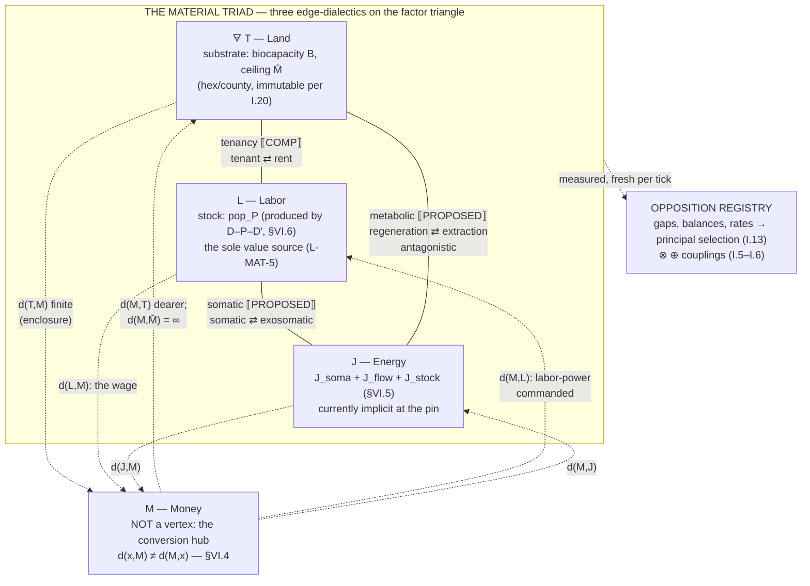
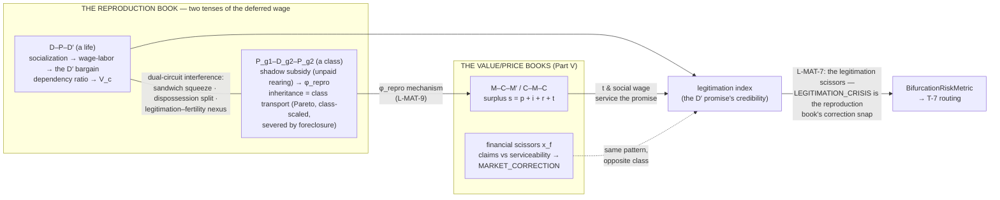

# The Metabolic Calculus

**Part VI of the Babylon Formalism — Land, Labor, Energy through the simplex; the D–P–D′ circuit; and the conversion structure of Money.**

| | |
|---|---|
| **Status** | v0.2 — DRAFT for BD review. Not ratified; confers no constitutional authority. Authored as the **proposed v0.5 insert** into `claude/babylon-formalism.md`: a new Part VI following Part V (The Value Calculus), with prior Parts VI–X renumbering to VII–XI — the v0.2 precedent, applied again. **v0.2 (2026-07-20):** adds **§VI.11 — the data estate**: a three-pass acquisition survey verified against live official documentation (2026-07-20), an on-hand inventory against `data-catalog.yaml` v2.7.1 + the ADR075 tables registry, per-source III.4 class rows, determinism landmines, and the BD acquisition queue. §VI.8's source list and Amendment W item 4 now defer to it. |
| **Companion to** | `CONSTITUTION.md` v2.10.0 (Amendments A–S) and `babylon-formalism.md` v0.4. The Constitution governs; the formalism presents; this Part extends the presentation. Where they disagree, this document has a bug. |
| **Ground truth** | Pinned to `dev@bd57dea` (2026-07-20, post-PR #219) — **one train ahead of v0.4's pin** (`f59d585`). Every cited class, kernel, coefficient, validator, and docstring below was read from that tree, not from memory. Deltas against v0.4's pin found during the read are recorded in §VI.10. |
| **Register** | Categorical (Lawverian) first, per the standing BD ruling. Every construct is tagged with its constructor family (**C** / **G** / **P**) at introduction and pays III.10 rent; the ledger is §VI.10. |
| **Scope** | The two interrelated directions ruled by the BD 2026-07-20: (1) the Land–Labor–Energy triad as the material base's generating contradiction, with Money as the non-invertible conversion hub (`Land→Money ≠ Money→Land`); (2) the D–P–D′ lifecycle circuit, inheritance, and population growth as the reproduction of the Labor vertex. One algebra, both directions. |

---

## VI.0 Thesis and constitutional posture

> "Labour is not the source of all wealth. Nature is just as much the source of use-values (and it is surely of such that material wealth consists!) as labour, which itself is only the manifestation of a force of nature, human labour power." — Marx, *Critique of the Gotha Programme* (1875)

**Value has exactly one source; wealth has three carriers.** Part V metered the first fact: the value book in `LaborHours`, surplus born only at the wage relation, four `creates_value` licenses, a conservation tower. This Part meters the second: **Land (T), Labor (L), Energy (J)** as the material triad on which every economic edge ultimately draws, a **matter book** beside the value and price books, and **Money as the hub through which the three convert — with morphisms that do not invert**. The generating asymmetry, in the BD's own notation:

```
Land → Money  ≠  Money → Land
```

The marginalist error is to place the three factors and money on one symmetric footing (a production function with four inputs). The physiocratic error is to crown Land; the energeticist error, following Podolinsky's critics, to crown Energy. The calculus below commits to the MLM-TW position with mechanism rather than assertion: **T, L, J are the carriers of wealth; L alone is the source of value; M is not a factor at all but the form through which the factors convert** — and the non-invertibility of that form is where rent, appropriation, and the rift all live. Each of those three claims is stated below as a law with a test, not a slogan (§VI.4).

**Amendment-S posture, stated before anything else.** Nothing in this Part abstracts over the dialectic. The triad is **three bound oppositions** in the ordinary catalog — one already registered (`tenancy`), two proposed (`metabolic`, `somatic`) — composed by the shipped ⊗/⊕ algebra and the shipped coupling kinds (**C**). The simplex is a **derived chart**: a coarse-graining-and-projection of the triad's pole samples, the §IV.5 partition pattern instantiated a second time (**G∘P**). The conversion quasi-metric is **derived edge data** — a projection of flows the graph already carries (**P**). The demographic circuit is **already-shipped composition** (`LifecycleSystem` @7). Every object below enters through A0's three constructor families or it does not enter; three candidates that failed are recorded in §VI.10.2.

The Part's one-sentence thesis, redeemed in §VI.7: **the metabolic clock forces the political fork** — the matter book supplies the finite-time mechanism that expels the Core from its pacified region (T-6), and topology chooses the branch (T-7). Collapse is default; the player shapes character, not outcome (I.8). This Part is where I.8 stops being a vibe and becomes a theorem schema.

---

## VI.1 The third book: matter, and the missing bridge

**Family: P (substrate) + one signature item.** COMP: `formulas/metabolic_rift.py`, `engine/systems/metabolism.py` LAW: proposed L-MAT-1

Part V keeps two books: the *value book* (`LaborHours` / `SignedLaborHours`) and the *price book* (`Currency`), bridged by MELT — a **zero-defect numeraire isomorphism** (`ValueFormAdjunction`, "not the site of exploitation"). This Part adds the third: the **matter book**, denominated in biophysical stock and flow. Its cells already exist in the tree, untyped: `Territory.biocapacity`, `Territory.max_biocapacity`, `Territory.regeneration_rate`, `Territory.extraction_intensity`, `Territory.habitability` — read and written every tick by `MetabolismSystem` @13 (MATERIAL_BASE, `creates_value=False`), with consumption metered as `Σ (s_bio + s_class) · population` over active `social_class` nodes. The Gatekeeper pattern has not yet reached these fields; bringing them onto the grid is the one genuine **signature motion** this Part requires — a new scalar sort `Matter = 𝔾 ∩ [0,∞)`, drafted into Amendment W (§VI.9). Everything else is term motion.

**The load-bearing negative fact: the matter book has no MELT.** There is no `τ_matter` making money ⇄ matter an isomorphism, and the absence is *constitutive*, not an implementation gap:

- The extraction leg dissipates by schema: `ΔB = R − (E·η)` with `entropy_factor` validated `gt=1.0` — the field's own description reads "extraction costs more than it yields (thermodynamic inefficiency)." η > 1 is I.9's constitutional text with a Pydantic fence around it: a Θ_theory envelope already enforced at load time.
- The restoration leg is severed by ratchet: `calculate_hysteresis_damage` permanently lowers `max_biocapacity`, and `hysteresis_rate` is validated `ge=0.001` with the ban stated in the schema itself: *"Must be > 0 — zero is 'Eden Mode' (infinite regenerative capacity), which violates the Tragedy of Inevitability."*
Formally: money ⇄ matter is an adjunction *candidate* whose defects never cancel. Where the value-form adjunction has zero defect and the **wage form**'s counit defect is Φ (V.2), the matter form's two defects are this Part's first two named quantities:

| defect | direction | content | theoretical name |
|---|---|---|---|
| **appropriation defect** | matter → money | inflow metered below reproduction: B drawn above R at no charge to the value book | Moore's "cheap nature"; the unpaid *inflow* |
| **rift defect** | money → matter | outflow unmetered entirely: entropy share `(η−1)·X` and carbon booked to no one (until §VI.5's register) | Foster's metabolic rift; the unpaid *outflow* |

The rift is the bookkeeping shadow of the missing bridge. `MetabolismSystem`'s docstring already states the mechanism in political language — *"extraction systematically exceeds regeneration because profit requires externalizing regeneration costs"* — this section only gives that sentence its accounting identity. **L-MAT-1 (matter budget)** LAW, A4 row: per territory and per tick,

```
B_{t+1} − B_t  =  R  −  X·η  −  (clamp losses)         Src(matter) = {solar regeneration R}
M̄_{t+1} − M̄_t =  −D_hyst ≤ 0                           Snk(matter) = {entropy (η−1)X, hysteresis, consumption}
```

with `X = extraction_intensity · B` the raw draw, `M̄ = max_biocapacity` the ceiling, and a nonzero residual outside declared sources an **alarm**, not a warning (III.11) — the matter-dimension instance of L-BUDGET(Q), joining the conservation registry beside I-CONS-POOL. The sun is the one legitimate exogenous inflow in the entire system; everything else conserves or dissipates. Georgescu-Roegen's entropy economics enters Babylon not as citation but as the residual evaluator's sign convention.

---

## VI.2 The material triad: three edge-dialectics

**Family: 𝔇 + C.** COMP: `instances/catalog.py` (tenancy); proposed Modulus-2 registrations (metabolic, somatic)

The triad is not a new container; it is three oppositions on the three edges of the factor triangle, entering the ordinary catalog beside the ten registered at the pin:

**T–L, the agrarian contradiction — `tenancy`** COMP, shipped. Already registered: poles `tenant ⇄ rent`, level `county`, unity *"occupancy presupposes the ground rent it is charged."* The land–labor edge has been in the catalog since the Vol III train; this Part changes nothing about it and claims it as the triad's first side. Its material substrate is the shipped ground-rent machinery (BEA REIS county rents, hex-level extraction before capital migration, V.6).

**J–T, the metabolic contradiction — `metabolic`** PROPOSED, Modulus-2 — no amendment. Poles `regeneration ⇄ extraction`; unity *"extraction presupposes the regenerative stock it draws down"*; level `county`; **`antagonistic=True`** — proposed with justification rather than by default: under the hysteresis ratchet the rift cannot close within the value-form level (closure would require the ceiling to recover, and `d(M, M̄-restoration) = ∞`, §VI.4); it resolves only above the level (planned metabolism) or below it (collapse). This is Laclau's flag carrying Foster's thesis. The measure is a pure function of shipped kernels — with `R = regeneration_rate · M̄` and `Xη = extraction_intensity · B · η` per territory:

```
balance b = (Xη − R) / (Xη + R)     ∈ [−1, 1]   (extraction-dominance, normalized)
gap     g = |b|                                  (the metabolic gap IS the magnitude of imbalance)
```

honest absence when `Xη + R = 0` (a dead territory is UNPOSITIONED, never "balanced"). Fresh per tick from flows — and note the line the formalism has already drawn (§IV.4): the **stock** B and the ratcheted ceiling M̄ carry memory *legally* (material hysteresis, "Earth remembers wounds"), while the **measure** (g, b) is re-derived every tick with no accumulator (VIII.11). The metabolic opposition can ship against existing kernels immediately.

**L–J, the somatic contradiction — `somatic`** PROPOSED, PENDING the §VI.5 energy accounts. Poles `somatic ⇄ exosomatic`; unity *"production is living labor directing energetic throughput; neither pole produces alone"* — Podolinsky's problem, stated as a dialectic rather than answered as a reduction. Measure, once the energy split exists: with `exo = J_exo / (J_soma + J_exo)` the exosomatic share,

```
balance b = 2·exo − 1        gap g = |b|      (v1 kernel; upgrade path: weight g by wage-share divergence)
```

`antagonistic=False`: the energy mix rebalances within the level (electrification, mechanization, de-mechanization are all intra-level motions). This is the organic composition of capital in its energetic clothing — dead energy displacing living labor — and its balance is the energetic face of OCC = c/v, measured instead of asserted.

**Coupling wiring** C: the five ratified kinds, §I.6, proposed rows for the `CouplingGraph`:

| edge | kind | reading |
|---|---|---|
| `metabolic` → `tenancy` | `constrains` | the rent base is the territory's biotic yield; a collapsing B collapses what tenancy can charge against |
| `somatic` → `metabolic` | `feeds` | exosomatic throughput *is* extraction demand; the somatic measure's J_exo is the metabolic measure's X-driver |
| `tenancy` → `somatic` | `transforms` | ground rent prices route energy investment: where rent is high, capital substitutes J for L |

**The principal contradiction of the material base requires no new machinery.** The registry's I.13 scoring — `g · (1 + w_rate·|ṙ|)` — applies verbatim to the triad's three gaps; Mao's selection runs on the triangle exactly as it runs on the full catalog. Likewise the composition algebra: the triad's ⊕ ("either edge develops → the material crisis develops") and ⊗ (joint sharpness) inherit the t-norm laws and L-DM unchanged. The triad adds *rows*, never *rules*.



---

## VI.3 The simplex chart 𝒦: the factor composition of the economy

**Family: G∘P — the §IV.5 pattern at a second chart.** COMP-adjacent: data paths shipped; kernel proposed

**Glyph fence, first:** the barycentric coordinate is **β**; the feasible set is script **𝒦(t)** — *not* K, which remains Part V's capital stock (`r = s/(K+v)`); energy is **J** — *not* E, which remains I.9's extraction intensity in `ΔB = R − (E·η)`.

Every production-bearing node n (county, class, industry) is assigned, fresh per tick, its **factor composition**:

```
β(n) = (β_T, β_L, β_J) ∈ Δ²      β_i ≥ 0,  β_T + β_L + β_J = 1
```

— the shares of n's reproduction cost routed through each factor: β_L from the WAGES flow share (QCEW-hydrated, V.3); β_T from the TENANCY/ground-rent share (BEA REIS county rents, V.6); β_J from the energy-input cost share, whose data path already exists — **the BEA input–output table ingested for the Leontief layer (V.3) carries the energy-sector rows**; the 70→4 department aggregator only has to expose them before folding. Normalization on the grid; a node with no cost data is UNPOSITIONED, never defaulted to the barycenter (L-ABS). **L-MAT-4 (chart well-formedness)** LAW, cheap property test: β lands on the simplex exactly (post-quantization renormalization), is re-derived per tick with no accumulator, and is equivariant under node relabeling (L-EQUIV applies — β is a derived operator field, not data).

Δ² is **compact** — the phase-space chart the project's mantra promises. Readings are class character, not metaphor, because they are cost shares:

- The **Core** sits near the T–J edge: rents plus energy capture, its β_L evacuated by the offshoring the Fundamental Theorem describes (I.2). A labor aristocracy is a class whose reproduction is financed across the cut — its own β_L understates the living labor its consumption commands, and the gap between the two *is* Φ's basket channel (γ_basket, V.2).
- The **Periphery** sits near the L vertex: reproduction dominated by the wage it is underpaid.
- Named drift directions, for the Archive's instrument and the historian's eye: **industrialization** = T→J flow; **automation** = L→J; **rentierization** = drift toward T; **planned degrowth** = drift toward L with total-throughput contraction (the Mastini–Kallis–Hickel content of the L-ward branch, §VI.7).
**The chart is a projection, constitutionally.** Like the IV.5 partition, β is a reporting and recognition surface — an Archive instrument, an endgame-recognizer input (recognizers are G∘P and may consume it) — **never a control input**. Systems keep acting on the underlying flows; the chart describes. This discipline is what lets the simplex enter without an amendment: it adds no dynamics, it names the dynamics already there.

**The feasible set.** 𝒦(t) ⊂ Δ² is the set of compositions reproducible at the current matter-book state: B stocks bound the T-routed share, the flow-energy ceiling (§VI.5) bounds β_J's renewable fraction, the carbon budget bounds its fossil fraction, and the somatic floor (existence costs calories, I.8) bounds β_L from below. Empirical calibration shape: **Fanning–O'Neill–Hickel–Roux 2021** — the doughnut's ecological ceiling and social foundation are precisely 𝒦's two boundary families, per-nation, time-series, fixture-class (III.4.2). The paper's headline finding — no country meets its social floor within its ecological ceiling; movement over the period is *toward* overshoot — is, in this chart, the statement that **𝒦(t) is currently occupied by no one and shrinking**. **L-MAT-2 (ratchet monotonicity)** LAW: the ceiling component of 𝒦 is non-expanding — `M̄_{t+1} ≤ M̄_t` per territory, already enforced by `MetabolismSystem`'s `new_max = max(0, max_cap − damage)`; the property test pins that no admissible motion raises M̄ (the grammar-level ban mirrors L-SUB: M̄'s only writer is the hysteresis kernel, and its deltas are non-positive).

**The five recognizers, read on the chart** interpretation riding shipped code — `engine/observers/endgame_detector.py`; recognition never adjudicates (VI.6): the endgame patterns are the possible answers to *which vertex absorbs the crisis* — FASCIST_CONSOLIDATION: **T absorbs** (rent-hoarding enclosure; blood-and-soil is the T-vertex's politics, literally); REVOLUTIONARY_VICTORY and RED_OGV: **L absorbs** (revalorization of labor); ECOLOGICAL_COLLAPSE: **no vertex absorbs** — 𝒦(t) → ∅; FRAGMENTED_COLLAPSE: **the chart shatters** — sovereignty fragmentation destroys the global β. Five patterns, one geometry.

---

## VI.4 The conversion structure: Money as the non-invertible hub

**Family: P over the graph.** data shipped (edge rates, price series); d/χ kernels PROPOSED on the II.12 stack LAW: L-MAT-5 PRED: L-MAT-6

This is the Lawverian core of the Part, and it is Lawvere in the *technical* sense: **a quasi-metric space is a category enriched over ([0,∞], ≥, +)** (Lawvere 1973). Define, on the factor stocks held at each node:

```
d(x, y)  =  −log( retention of converting one unit of x into y along the realized path )
```

— d(x,x)=0; the triangle inequality is the composition law (chained conversions multiply retentions, add costs); and **there is no symmetry axiom**. That absence is not a weakening of the metric concept; it is the honest axiomatics of exchange under class power, and it is the BD's generating statement in formal dress: `d(T,M) ≠ d(M,T)`. Every d-value has an Aleksandrov chain by construction — it is the measured loss on a conversion someone in the graph actually performs (a sale, a wage, a rent payment, a tribute flow) — so the construct is M2-generated, not free-floating: d is *derived edge data*, a projection of prices and rates the Ledger already carries, never stored (II.2).

Four structural facts, each with teeth:

**(a) The hub law.** For commodified stocks, the triangle *saturates* through M: `d(x,y) = d(x,M) + d(M,y)`. All conversion factors through the universal equivalent — this is what "universal equivalent" means, stated metrically. Measured deviation (`d(x,y) < d(x,M)+d(M,y)`) is surviving non-market conversion — barter, commons, mutual aid — and is itself an organizing-relevant observable: solidarity economies are exactly the sub-graphs where the hub law fails.

**(b) The commodification frontier is the finiteness domain.** `d(x,M) < ∞` is saleability; `d(M,x) < ∞` is purchasability; the frontier between finite and infinite hom-values is where primitive accumulation works. **This explains a standing constitutional oddity from theory**: `DispossessionEvents` @10 carries `creates_value=True`, yet dispossession mints nothing material. Correct on both counts — enclosure *extends the finiteness domain* (makes `d(M, land)` finite where it was ∞), booking previously unmetered wealth into the value ledger for the first time. The flag marks a **book transfer** — matter-book wealth becoming value-book visible — which is Moore's appropriation given an audit row. The license is right; now it has its derivation.

**(c) The infinite morphism.** `d(M, M̄-restoration) = ∞`. No finite quantity of money converts back into the ceiling that extraction destroyed — *"Earth remembers wounds"* (I.8) is a statement about a hom-value, and the schema already enforces its finite-side shadow (`hysteresis_rate ≥ 0.001`; Eden Mode banned in the validator's own text). The asymmetry the BD wrote as `Land→Money ≠ Money→Land` has a limit case: on the ceiling, the right-hand morphism does not exist at any price. Round-trip cost `δ(x) = d(x,M) + d(M,x) > 0` for every material stock; for M̄ it is infinite. That gradient of round-trip losses — small for the Core's liquid assets, large for peripheral commodities, infinite for destroyed nature — *is* the terrain of unequal exchange.

**(d) The circulation cocycle and where curvature lives.** Define the asymmetry cocycle and its holonomy:

```
χ(x,y) = d(x,y) − d(y,x)          hol(γ) = Σ_edges χ  over a directed cycle γ
```

hol(γ) = (cost of the cycle) − (cost of the reverse cycle): the value pumped by *direction of circulation*. On the II.12 stack (rustworkx authoring → scipy.sparse least-squares → operator algebra as truth), Hodge-decompose: **χ = δf + h**, with f a scalar *price potential* (the part of asymmetry explained by "some things are dearer than others") and h the **harmonic residual** — circulation profit with no potential explanation. h is rent proper; the cohomology class **[χ] ∈ H¹** of the conversion graph is *the rent class*. Two sourcing laws now separate value from wealth exactly where Marx separates them:

- **L-MAT-5 (value curvature is sourced at labor)** LAW, property test: on the **value book**, h is supported only on cycles crossing WAGES/EXPLOITATION edges. No surplus from circulation: the unique edge where the use-value bought exceeds the exchange-value paid is labor-power. This is the labor theory of value as a cohomological constraint — an H¹ obstruction concentrated at the wage relation — and it is testable: Hodge-decompose the five regression scenarios' conversion graphs and assert the support. It also upgrades v0.4 §IV.4's reading of Φ: "imperial rent as flow across a cut" is [χ] evaluated on Core–Periphery cycles, consistent with the σ-gradient coarse-graining and now carrying an exactness proof obligation (the residual off the cut must vanish).
- **L-MAT-6 (ecologically unequal exchange)** PRED, falsifiable: on the **matter book**, embodied-B and embodied-J flows run *anti-parallel* to value flows across the same cut — the Periphery exports biocapacity priced below reproduction; the Core's overshoot is financed by imported ceiling. The empirical anchor is already in the project's knowledge base: **Hickel–Sullivan–Zoomkawala 2021**'s ERDI (exchange-rate deviation index) is a *measured χ* — the deviation between exchange-rate and PPP valuations of the same flow is precisely the asymmetry `d(P→C)` vs `d(C→P)`, and the drain series ($62T-scale, 1960–present) calibrates the harmonic magnitude on the cut. Falsifier (III.2): the computed cut-holonomy per sim-year drifting outside the ERDI-implied band under nationwide hydration.
**The four circuits, one algebra.** The house already owns three circuits; the DPD estate (§VI.6) supplies the fourth. The correspondence is not analogy — spec-030's own ontology table declares it (*"The parallel to Marx is exact"*), and the calculus adds that the correspondence is **holonomy-preserving**:

| circuit | scale | book | hol sign for the class riding it | shipped home |
|---|---|---|---|---|
| C–M–C | a worker's day | price | **+** (leaks at every hop: rent, retail, interest) | V.4 circulation |
| M–C–M′ | capital's turnover | price | **−** (gains; sourced at the wage edge per L-MAT-5) | V.4–V.5 |
| D–P–D′ | a worker's life | reproduction | **+** (the D′ promise leaks: care costs, class-scaled inheritance) | `lifecycle.py` @7 |
| P_g1–D_g2–P_g2 | the class across generations | reproduction | **−** for capital's book (the shadow subsidy accrues to it unpaid) | `dual_circuit.py` |

Two timescales × two class positions, one sign structure. The worker's circuits close positive (they pay the spread); capital's close negative (they collect it); and the generational circuit's negative holonomy — value extracted from unwaged rearing — is exactly φ_reproduction's mechanism (§VI.6).

---

## VI.5 The energy split: J_soma, J_flow, J_stock

**Family: C (proposed structure — Modulus-2 systems + Θ growth + III.4 catalog additions).** PROPOSED; nothing at the pin models energy explicitly — verified by tree-wide read: no EROI, no fossil stock, no power density anywhere in `src/babylon/`

The J vertex is currently the triad's thin side: it exists only implicitly, as `extraction_intensity` pressure and the `entropy_factor` docstring's "thermodynamic inefficiency." The expansion, with every coefficient a Θ-projection declared at birth:

```
J = J_soma + J_exo          J_exo = J_flow + J_stock
```

- **J_soma** — somatic throughput: `population × θ.energy.soma_per_capita` (Θ_data: FAO/USDA dietary energy). The somatic floor is I.8's *"existence costs calories"* made literal — it is the energetic shadow of `base_subsistence > 0`, and it bounds β_L from below on 𝒦.
- **J_flow** — contemporary, land-coupled energy (biotic, hydro, solar, wind): **`J_flow ≤ θ.energy.power_density(source) · A_alloc`** — the power-density envelope (Θ_theory; envelope shape from the literature (Smil), magnitudes measured in-estate from USPVDB `p_area` × EIA-860 capacity — §VI.11.2). Flow energy *re-binds J to T*: every flow-watt has a land address on the immutable substrate, and allocating it is a claims-layer operation (I.20-compliant: allocation is overlay, never substrate mutation).
- **J_stock** — fossil draw against a finite reserve F (glyph fence: F here is a matter-book stock, distinct from Part V's *fictitious* prose), with a declining-EROI envelope (Θ_theory: net = gross·(1 − 1/EROI(F)), EROI monotone non-increasing in cumulative draw) and a carbon coefficient: each stock-joule books `θ.energy.carbon_intensity` to the **atmospheric register** — a *graph-level register* (`atmospheric_carbon`), following the `NATIONAL_FINANCIAL_ATTR` / `wealth_distribution` precedent exactly: declared state on the graph, no new node type, no amendment. Cumulative `Q_CO2` allocates per-sovereign by the **Hickel 2020 fair-shares method** (equal-per-capita shares of the 350 ppm-consistent budget, *recomputed* from the GCB national territorial + consumption series rather than extracted from the paper's appendix — §VI.11.4) — responsibility is consumption-based and historical, not territorial, which the drain machinery of §VI.4 already knows how to route.
- **Climate closure**: `Q_CO2` beyond budget degrades `regeneration_rate` and `habitability` — and the write-path template already exists at the pin: `MetabolismSystem` applies Sovereignty's `balkanization.metabolic_impact_by_territory` to `habitability` before the biocapacity update (spec-070 FR-043). The carbon damage term is a second reader of the same pattern.
**The fossil theorem, stated as structure rather than narrative.** J_stock is *T-decoupled* energy — energy with no contemporary land address. It stands to living land exactly as capital (dead labor) stands to living labor: **fossil energy is dead land** — subterranean photosynthesis, expended without a rent bill (Malm's fossil capital; Wrigley's organic→mineral transition). Its historical function was to *suspend the agrarian T–L contradiction*: the T–L bind of the organic economy (all energy land-coupled, land rent disciplining labor) was escaped by drawing on a stock outside the annual solar budget. The suspension was a **loan from the matter book** — serviced never, compounding as Q_CO2 and ceiling damage. Depletion (EROI decline) and the carbon budget force the re-coupling: renewables re-open the land question at planetary scale because ρ_pd makes flow-energy *land-hungry*. The T–L contradiction the fossil era suspended returns as the T–J–L triangle under a shrinking 𝒦 — which is the geometric content of the terminal crisis, and T-8's hypothesis set (§VI.7).

**L-MAT-8 (energy envelopes)** LAW family, Θ_theory tier: η > 1 (shipped validator); ρ_pd bounds per source class; EROI(F) monotone non-increasing; `J_flow` land-allocation never mutates substrate (untypeable via L-SUB). The anti-list gains members with the same schema-fence pattern as Eden Mode: infinite F, free carbon (`carbon_intensity = 0` for J_stock), and EROI that improves with depletion are all inexpressible by validator, not by review.

---

## VI.6 The demographic circuit: the reproduction of the Labor vertex

**Family: C (shipped) + three new bindings.** COMP: `engine/systems/lifecycle.py` @7, `domain/economics/lifecycle/*`, `formulas/lifecycle.py`, spec-030

The DPD estate is the most complete of the three factor-reproduction systems, and it is already built in circuit-algebraic form. Pinning what ships at `bd57dea`:

**The circuit.** `D–P–D′`: Dependent (pre-productive, receives socialization) → Productive (sells labor-power) → Dependent′ (post-productive, the legitimation bargain) — per-territory `DPDState` with CDC/Census-provenanced rates (`birth_rate` 0.0107, `rate_d_to_p` 1/18y, `rate_p_to_d_prime` 1/47y, `rate_d_prime_to_death` 0.039 — provenance in the Field descriptions, A6-ready). Its dual, from spec-030's own ontology table: **`P_g1 → D_g2 → P_g2` — this generation's workers produce the next generation's workers** — with the correspondence declared in the spec's own words: D–P–D′ ≅ C–M–C (the worker's circuit), P–D–P′ ≅ M–C–M′ (the class's self-expanding circuit); *"the parallel to Marx is exact."* §VI.4's table adds the holonomy signs.

**The shipped mechanics, in calculus order:**

- **Dependency → subsistence**: `dependency_ratio = (D + D′)/P`; `compute_subsistence_burden = base · (1 + ratio)`. Consequence for the Fundamental Theorem: **V_c is a demographic quantity** — the FT's denominator traces to DPD state, so Core aging raises V_c mechanically. This wire is load-bearing for T-8.
- **The legitimation index** — the credibility of the D′ promise: weighted sum over pension coverage, SS replacement, healthcare security, home ownership, retirement confidence, with the ordinal ranking (home 0.35 > healthcare 0.30 > confidence 0.20 > pension 0.10 > SS 0.05) declared in the docstring as *authorial political judgment whose ranking is not tunable* — an A6 **ordering envelope** already stated in prose, waiting for its registry row. Blended 0.6/0.4 with the agitation-inverse (structural promise vs worker mood), classified STABLE/UNSTABLE/CRISIS at threshold 0.3, feeding `BifurcationRiskMetric.legitimation` — the George Jackson pathway's demographic input. Events: `LEGITIMATION_CRISIS` / `LEGITIMATION_RECOVERY`.
- **Inheritance at the D′ terminus** — the P–D–P′ transport of class position: deaths × dying-fraction wealth, care costs deducted (`care_cost_fraction`), Pareto-α Gini, and the class transport coefficients `{BOURGEOISIE 1.0, PB 0.7, LA 0.5, PROLETARIAT 0.05, LUMPEN 0.0}`; **foreclosure severs the mechanism entirely** (net → 0, care absorbs all — the dispossession short-circuit), with `dual_circuit.compute_dispossession_effects` splitting each dispossession between D′ security and inheritance by the home-equity share. Chetty Opportunity Atlas KFR calibrates the empirical transition kernel (calibration source, not runtime ingest — III.4.2 respected). Event: `INHERITANCE_TRANSFER`.
- **Ideological socialization at D→P**: caregiver ideology ⊗ institutional hegemony (weighted), regression toward the mean, community-tendency amplification — consciousness *stickiness across generations*, the D phase as the pre-subsumption institution (schooling as hegemony's intake valve).
- **The eugenics contradiction**: differential P-phase duration via `early_mortality_modifier` and the carceral additive channel — racial capitalism's differential lifecourse encoded as differential transition rates, compounding intergenerationally into the racial wealth gap; I.10's carceral turn given its demographic base.
- **Dual-circuit interference**: the sandwich squeeze (dependency > threshold ∧ wage < subsistence + D′-care + D_g2-investment); legitimation-biased allocation (credible promise → invest in the next generation; broken promise → self-preservation); the **legitimation–fertility nexus** (below crisis threshold, fertility falls up to 50% and ideology shifts toward class consciousness — the birth strike as measured consequence, not event script); and the **shadow subsidy**: `p_g2_labor_value − wage_paid_for_d_g2` — the unpaid portion of producing the next generation of labor-power.
**The three bindings this calculus adds** (each a cross-wire between shipped estates, not new machinery):

**1. The L vertex is produced, not endowed.** `pop_P` is the labor-power stock; its production is the unwaged D-phase; the shadow subsidy is the *measured* unpaid rearing transfer. Bridge law **L-MAT-9 (φ_repro closes)** LAW, cross-wire: Part V's `φ_reproduction` — currently carried by a Meillassoux *proxy* in the tri-decomposition (V.2) — aggregates the shadow subsidy over the P–D–P′ circuit: `φ_repro = Σ_counties shadow_subsidy`, conservation-checked against the L-VAL-5 total. The tri-decomposition gains a running mechanism where it had a stand-in; the DPD estate gains its place in the imperial-rent accounting. One test, two estates unified.

**2. The D′ promise is fictitious capital in the reproduction book.** Pension claims, home equity, SS entitlements are titles to *future* surplus — the same ontological kind as Part V.7's fictitious stock, held by labor instead of capital. The legitimation index is their **credibility**; the scissors pattern applies verbatim: promise vs serviceability. **L-MAT-7 (the legitimation scissors)** LAW, proposed: structural legitimation is bounded by the serviceable-claim envelope — when the `s = p + i + r + t` split (V.6) can no longer fund the transfer systems backing the D′ promise (t's social-wage share, pension solvency, housing-equity realization), index degradation is *forced*, not chosen; and a `LEGITIMATION_CRISIS` is the reproduction book's `MARKET_CORRECTION` — the same snap, one book over. **Two scissors, one pattern**: finance's claims on future value vs the surplus that must service them; labor's claims on future subsistence vs the same surplus. Both close from the same s. This is the Part's strongest "draws Babylon together" wire: V.7 and spec-030 turn out to have built the same machine facing opposite classes.

**3. Demography closes the triad.** Fertility responds to legitimation (the nexus); population scales consumption in the shipped overshoot formula (`C = Σ(s_bio + s_class) · pop` — Metabolism @13 already reads the demographic scale); dependency raises V_c; differential mortality shapes the reserve army (@5). The L vertex's reproduction is thus coupled to T and J through the matter book (subsistence is calories and shelter — matter), and to M through the wage and the D′ promise (the reproduction book's two tenses). The triad's L corner is not an input to the economy; it is the economy's most intricate product.



---

## VI.7 T-8: the terminal metabolic theorem

**Family: G∘P over orbits.** PRED — statement + sketch + named obligation, the T-6 standard

*Statement.* On any orbit with **persistent overshoot** (O = C/B > 1 sustained) — and with `hysteresis_rate > 0`, which the schema guarantees — the following hold in sequence:

1. **The ceiling contracts monotonically** (L-MAT-2): sustained extraction under the ratchet lowers M̄ per territory; the ceiling component of 𝒦(t) is non-expanding and strictly contracts wherever extraction persists.
2. **Φ's material carriers contract with it**: imperial rent's real content is commanded matter and energy (embodied B and J imported across the cut, L-MAT-6); as peripheral ceilings fall and stock-energy nets decline (EROI), the same nominal Φ commands less reproduction — the pool's non-increase (I-CONS-POOL) acquires a material floor falling beneath it.
3. **V_c rises demographically**: Core aging raises the dependency ratio; `compute_subsistence_burden` raises V_c; differential mortality and the carceral channel deplete P-phase duration precisely where super-wages once pacified.
4. **The pacification condition fails in finite time**: W_c/V_c > 1 requires Φ-throughput ≥ the super-wage bill; with the numerator's material carrier contracting (2) and the denominator rising (3), the ratio crosses 1 on a finite horizon; T-6's fixed point Ψ* ≤ 0 loses existence, and the forward-invariant reproduction region is exited.
5. **T-7 routes the exit**: the crisis regime's bifurcation runs on cross-divide solidarity topology, exactly as shipped — **T-ward** (rent-hoarding enclosure; the eco-fascist resolution; lifeboat politics is the T vertex armed; FASCIST_CONSOLIDATION) or **L-ward** (revalorization of labor; planned degrowth as the L-vertex resolution, the Mastini–Kallis–Hickel "GND without growth" as its policy content; REVOLUTIONARY_VICTORY / RED_OGV) — with **ECOLOGICAL_COLLAPSE** the no-absorption limit 𝒦(t) → ∅ when routing fails altogether, and FRAGMENTED_COLLAPSE the shattered chart.
*Sketch.* (1) is the shipped clamp plus L-MAT-2. (2) composes L-MAT-6's anti-parallel flows with I-CONS-POOL. (3) is the shipped `compute_subsistence_burden` wire plus differential rates. (4) is arithmetic on (2)+(3) against T-6's hypothesis, which was always conditional on W_c > V_c — this theorem supplies the mechanism that ends the condition. (5) is T-7 verbatim. ∎-shaped, not ∎: the **forward-completion obligation** — that (1)–(3) actually force (4) on every admissible θ ∈ Θ* rather than merely generically — is named here as an open proof obligation, dischargeable as a property law over scenario orbits; the `starvation` and `imperial_circuit` regression scenarios are the natural probe seeds, and a dedicated overshoot scenario (Core β outside 𝒦) belongs in the goldens when the energy split lands.

*Reading.* T-6 says the Core cannot make revolution while the rent flows. T-8 says the rent cannot flow forever, on thermodynamic grounds the schema already enforces — and that the *ending* of the flow, not its persistence, is the politically decisive event the whole simulation is aimed at. The metabolic clock forces the political fork; topology chooses the branch; the player shapes which fork the graph is holding when the clock strikes. **I.8 was the vibe; T-8 is the theorem schema; the George Jackson bifurcation is the adjudicator.** Graph + Math = History.

---

## VI.8 Audit obligations and the tuning charter rows

Following the sentinel-family pattern: declared data, loud checks, nothing hand-maintained beside the record.

**A1 (manifest).** Rows for the two shipped systems this Part binds — Metabolism @13 (reads: territory metabolic fields, social_class s_bio/s_class/population, Θ.metabolism; writes: biocapacity, max_biocapacity, habitability; events: ECOLOGICAL_OVERSHOOT) and Lifecycle @7 with **seven step-level sub-entries** (transitions, conservation check, legitimation, inheritance, ideology, mobility, differential rates — the TickDynamics sub-footprint precedent). Proposed systems (energy accounts; the β/𝒦 projection) declare ε at birth or do not register.

**A4 (conservation).** Three new budget rows: **L-MAT-1** matter (Src = solar R; Snk = entropy share, hysteresis, consumption; residual = alarm). **L-BUDGET(population)**: the kernel exists (`verify_conservation`: total′ = total + births − deaths within tolerance) **but currently warns** — finding **F-3**: `lifecycle.py` logs `logger.warning` on conservation violation, the same disposition family as F-1/F-2 and the FR-015 pre-III.11 pattern; proposed disposition: alarm-severity signal or an owner-ruled exemption row, never a silent-ish warning in a P0-principle's path. **L-BUDGET(carbon)**: register inflows (J_stock × k_c) vs budget, per-sovereign responsibility ledger (fair-shares fixture).

**A3 (literal scan) — debts declared before the sentinel finds them** (the `w_rate = 10.0` precedent, honestly extended): `dual_circuit.py` carries inline allocation shares (0.6/0.4/0.2 by legitimation band), the 0.5 fertility-reduction cap, and the 0.1 ideology shift; `cohort_dynamics.py` carries the 0.1 community-amplification factor; `inheritance.py` carries `_CLASS_INHERITANCE_SCALE` as a module dict. All are Θ-shaped quantities awaiting GameDefines homes; this Part's implementing specs should carry the rehoming as their first task, and the A6 rows below assume it.

**A6 (charter rows).** Tier assignments for the estates this Part touches:

| coefficient | tier | envelope (the spirit) |
|---|---|---|
| `metabolism.entropy_factor` | **Θ_theory** | > 1 — *already a validator* (`gt=1.0`); I.9's constitutional text as schema |
| `metabolism.hysteresis_rate` | **Θ_theory** | ≥ 0.001 — *already a validator*; "Eden Mode" ban quoted in the Field description |
| `metabolism.overshoot_threshold` | Θ_feel | doom-clock tempo; overshoot exists at some threshold |
| `lifecycle.*` rates (birth, transitions, mortality) | **Θ_data** | CDC NVSS / Census / CDC WONDER — provenance already in Field descriptions |
| `lifecycle.legit_w_*` weights | Θ_feel | **ordering envelope**: home > healthcare > confidence > pension > SS — the docstring's "ranking is not tunable" as an A6 constraint |
| `lifecycle.legitimation_blend_weight`, thresholds | Θ_feel | crisis exists at some threshold; blend ∈ (0,1) |
| `lifecycle` mobility params | **Θ_data** | Chetty Opportunity Atlas calibration; racial gap ≤ base rate (shipped validator) |
| `energy.soma_per_capita` (new) | Θ_data | FAO/USDA dietary energy |
| `energy.power_density.*` (new) | **Θ_theory** | per-source W/m² bands; envelope from the literature (Smil), magnitudes calibrated from USPVDB `p_area` × EIA-860 capacity (§VI.11.2); flow energy is land-hungry at every admissible setting |
| `energy.eroi_*` (new) | **Θ_theory** | EROI(F) monotone non-increasing in cumulative draw |
| `energy.carbon_intensity` (new) | Θ_data | EIA/EPA emission factors, GCB-reconciled (§VI.11.4); > 0 for J_stock (free carbon inexpressible) |

**New data sources** (III.4/III.4.1 procedure — catalog rows + amendment registry, riding Amendment W): the researched, live-verified estate is **§VI.11** — per-source grain, period, access mechanics, III.4 class, and determinism pins. Headlines: the ERDI drain series is *already ingested* (`fact_hickel_erdi_annual`), nearly everything else is keyless bulk download, and two constructs that looked literature-bound turn out to be data-calibrated — USPVDB ships facility array area (`p_area`), so realized power density is *measured*, and the FoDaFo/York accounts ship free national biocapacity series 1961–2025.

---

## VI.9 Amendment W (draft) — The Material Triad and the Matter Book

**Class: MINOR** (new principle text + one new sort + catalog additions; no primitive removed or redefined — the Amendment L/R precedent). Drafted per IX.3's required shape. *Letter provisional: the Archive program's queue reserves T/U/V; the BD assigns the actual letter at ratification.*

**Problem.** I.9 states the rift formula and I.8 its irreversibility, but the constitution has no statement of (a) the material triad from which every economic edge draws, (b) the matter book as a first-class ledger beside value and price, (c) the constitutive absence of a matter-MELT, or (d) energy as an accounted quantity at all. Meanwhile the untyped matter fields sit outside the Gatekeeper, and the demographic estate (spec-030) carries constitutional-grade theory (the deferred wage; the P–D–P′ transport) with no constitutional anchor.

**Proposed text (sketch, BD wordsmiths):**

1. **I.9 extension — the Material Triad.** Land, Labor, and Energy are the three carriers of wealth; Labor alone is the source of value (the curvature law, L-MAT-5); Money is the conversion form, not a factor. The triad is registered as three catalog oppositions (`tenancy`, `metabolic`, `somatic`); their joint chart (the β simplex) is a canonical **reporting projection** under the II.1/IV.5 discipline — recognition input, never control input. The matter book is kept in the `Matter` sort; its budget law is a conservation-registry row; **there is no matter-MELT**: money⇄matter conversion is constitutively defective, with hysteresis as the infinite-cost restoration (`d(M, M̄) = ∞` — "Earth remembers wounds" as a hom-value).
2. **New sort** `Matter = 𝔾 ∩ [0,∞)` for biophysical stocks and flows (the one signature motion; brings `biocapacity`/`max_biocapacity` and the energy accounts onto the grid and under the Gatekeeper).
3. **Energy accounting principle.** J = J_soma + J_flow + J_stock; power-density and EROI as Θ_theory envelopes; the atmospheric carbon register as a declared graph register with per-sovereign fair-shares responsibility; stock-energy as T-decoupled ("dead land") with its carbon debt booked, never free.
4. **III.4 catalog additions** per the §VI.11 estate — each registered with agency, grain, cadence, class (Runtime/Fixture), access mechanics, and its determinism pin (§VI.11.6) recorded at registration.
5. **Demographic anchor.** The D–P–D′/P–D–P′ dual circuit is recognized as the reproduction of labor-power (the L vertex's production system); the legitimation index is the credibility of the deferred wage; φ_reproduction's mechanism is the generational shadow subsidy (L-MAT-9).
**Explicitly not amendment-gated** (Modulus-2, normal development): registering `metabolic` and `somatic` with their measures; the coupling rows; the β kernel and 𝒦 evaluator as projections; A1/A4/A6 rows; the energy-accounts system itself once the sort exists.

**Invariance sketch.** No primitive is removed or redefined; every construct is C/G/P over 𝔇 (§VI.0 posture); old theorems remain theorems (T-1..T-7 untouched; T-8 is additive and conditional); old traces are unchanged until implementing specs land behind their own declared ceremonies (conservative extension; the reduct to the old signature validates the old model). The five qa:regression scenarios are unaffected until the energy split ships, at which point new goldens enter by blessed ceremony, not drift.

---

## VI.10 The rent ledger, failed rent, and honesty notes

### VI.10.1 Constructs introduced, and the rent they owe

| construct | family | rent | discharge |
|---|---|---|---|
| Matter book + `Matter` sort | P-substrate | typed fields + budget row | Amendment W; A4 (L-MAT-1) |
| Appropriation defect / rift defect (the two-defect reading) | P | derivational (explains `creates_value` on Dispossession; the rift as missing bridge) | §VI.4(b); prose + audit cross-check |
| `metabolic` opposition + measure | 𝔇 | COMP-ready measure from shipped kernels | Modulus-2 registration; property test on b, g |
| `somatic` opposition + measure | 𝔇 | measure kernel (v1: g = \|b\|) | ships with energy accounts; PENDING-CODE |
| Triad coupling rows (constrains/feeds/transforms) | C | CouplingGraph rows, crisis-producer map growth | Modulus-2 |
| β simplex chart + UNPOSITIONED discipline | G∘P | L-MAT-4 property test; Archive instrument; recognizer input | kernel spec; L-EQUIV extension |
| Feasible set 𝒦(t) + doughnut calibration | G∘P | L-MAT-2 (ratchet monotonicity — clamp already shipped) | property test; Fanning fixture |
| Conversion quasi-metric d | P | derived from edge data; hub-law deviation observable | kernel spec on II.12 stack |
| Circulation cocycle χ, Hodge split, rent class [χ] | P | **L-MAT-5** (LTV as curvature support — property test) | scipy.sparse least-squares on scenario graphs |
| ERDI-as-measured-χ | P | **L-MAT-6** PRED falsifiable against drain series | Hickel 2021 fixture; per-sim-year band check |
| Four-circuits holonomy table | C (reading) | organizes shipped circuits; no new state | prose; the signs are computable from d |
| J split (soma/flow/stock), F, EROI, ρ_pd | C | **L-MAT-8** envelope family (validators) | implementing spec + A6 rows |
| Atmospheric register + fair-shares ledger | P | L-BUDGET(carbon); Hickel 2020 fixture | graph-register precedent; A4 row |
| Fossil-as-dead-land (suspension/re-coupling) | G (reading) | structures T-8's hypotheses; no stored state | §VI.5 prose; T-8 |
| L-MAT-9 (φ_repro = Σ shadow subsidy) | C (cross-wire) | one conservation test unifying V.2 and spec-030 | A4 row against L-VAL-5 |
| L-MAT-7 (legitimation scissors) | C | serviceability bound; LEGITIMATION_CRISIS as reproduction-book correction | property test vs s-split solvency |
| T-8 | G∘P | PRED + named forward-completion obligation | property law over scenario orbits; overshoot golden |

### VI.10.2 Candidates that failed the rent test (cut, recorded — the discipline binds)

1. **Money as the cone point of C(Δ²)** — the topological cone over the simplex with M at apex, commodification as the cone coordinate. Beautiful; vocabulary. The finiteness domain of d (§VI.4b) carries the entire computable content (what is saleable, what purchasable, what neither). Cut.
2. **Replicator/vector-field dynamics on Δ²** — a flow law for β would either duplicate the thirty systems (which already move the underlying flows) or store a derived dynamic (II.2 violation). The simplex stays a chart; motion on it is *observed*, never legislated. Cut — and this cut is load-bearing: it is what keeps the Part Amendment-S-safe.
3. **The full chain-complex rift** (a shadow chain map value-cycles → matter-chains with ∂∘shadow ≠ 0 as the rift) — the reading is correct and one sentence of it survives in §VI.1; as a *construct* it adds no test beyond the L-MAT-1 residual, which already detects exactly the non-closure the boundary operator would formalize. Cut as construct, kept as interpretation.
### VI.10.3 Honesty notes

- **Pin skew, declared**: this Part is pinned one train ahead of v0.4 (`bd57dea` vs `f59d585`). Nothing read for this Part contradicts Part V's citations; the catalog stands at ten, the systems at thirty, as v0.4 records.
- **The energy vertex is genuinely absent at the pin** — verified by tree-wide search (no EROI, fossil, power-density, or joule accounting anywhere in `src/babylon/`). Everything in §VI.5 is proposed structure and is tagged so; the `metabolic` opposition, by contrast, can ship against existing kernels immediately, and β_T/β_L against existing data today (β_J waits on the split or on the BEA energy-row exposure, whichever lands first).
- **F-3** (§VI.8): population conservation warns instead of raising — filed with the same disposition question as F-1/F-2.
- **Magic-constant debts** in `dual_circuit.py` / `cohort_dynamics.py` / `inheritance.py` declared in §VI.8 before the A3 scan finds them.
- **T-8 ships at the T-6 standard**: statement + sketch + named obligation — not a completed proof. The claim that (2) and (3) jointly force (4) *for all admissible θ* is exactly the kind of claim L-Θ\* sampling exists to check; until it is checked, T-8 is a prediction, and I.8 remains the constitutional bedrock it rests on, not the other way around.
- **What this Part deliberately does not do**: no new node types (the atmosphere is a register, not a node); no fourth Φ channel (L-MAT-6 calibrates Φ's *existing* UE channel materially; I.2a's fence is respected); no hyperedge anything (Amendment D stays untriggered); no verb changes (BUILD_INFRASTRUCTURE and Develop already reach the substrate overlays this Part prices).
---

## VI.11 Grounding: the data estate

Researched 2026-07-20 against live official documentation, three verification passes (energy / land–biocapacity / carbon–EUE–international). Claims below marked **[V]** were confirmed by fetching the official page; **[S]** located in search results only; **[U]** flagged unverified — never silently. On-hand inventory read from `data-catalog.yaml` v2.7.1 and the ADR075 per-table lineage registry at the pin.

**The landing rule.** Every source below terminates in the ADR076 artifact pipeline — the owner ruling verbatim: *"CI and tests should never be pulling from the babylon-data drive. any files it needs need to be encoded in parquet or some other form of file that can be loaded deterministically into postgres."* New ingests follow the shipped pattern (`tools/ingest/make_data_artifacts.py`, per-table hashed artifacts, repo-root manifest); rasters enter only through a **one-time zonal-statistics fixture build** (raster → county rows → parquet; the raster itself never becomes a runtime dependency). Every ingest pins `(edition, version string, checksum)` in provenance — III.4.2's hermetic-artifacts discipline extended to the matter book, with the specific landmines in §VI.11.6.

### VI.11.1 Already on hand — the estate this Part inherits

| on-hand source / table | feeds in this Part | note |
|---|---|---|
| `fact_hickel_erdi_annual` (Hickel_HSZ_Drain fixture, spec-057) | **L-MAT-6's bootstrap is already live** — ERDI by bloc/year currently feeds γ hydration and the Leontief periphery-labor coefficients | the measured χ asymmetry of §VI.4 is *in the reference DB today*; L-MAT-6 upgrades its consumer, adds no ingest |
| `fact_ricci_unequal_exchange` (in-repo CSV canonical, ADR076 R2) | second UE calibration series | already artifact-ized |
| PWT (cataloged, Runtime) | ERDI is *recomputable* from PWT price levels (the HSZ method itself) — extends the drain series past 2017 in-house | the creative-but-principled move: their method, our years |
| WID / Comtrade / OECD TiVA (Runtime) | international value flows for the cut-holonomy denominators | |
| USGS MCS minerals (`fact_mineral_production/_employment`, `fact_state_minerals` — Program 22 Wave 1) | the T-vertex extraction leg, national + state | county apportionment is Wave-2 and becomes this Part's first implementing task |
| `fact_energy_annual` (EIA MER 1949–2023, 525 rows, ADR076 R3 artifact) | a national J backbone sliver already exists | thin, but nonzero — the J estate below deepens it, not replaces it |
| BEA I-O Use/Supply/Total-Requirements (Runtime) | **β_J's data path** — the energy-sector rows ride the already-ingested Leontief layer | §VI.3, no new source needed |
| NLCD (cataloged, Fixture) + PAD-US + BIA_LAR + Natural Earth | land cover + protected/tribal land tenure overlays (I.20 claims layers) | catalog entry exists; Annual-NLCD refresh below |
| EPA_FRS (Runtime) + HIFLD | facility/point infrastructure spine | joins GHGRP facilities |
| CDC_WONDER / NCHS / SSA_Actuarial / HHS_AHRF / Census_ACS / Chetty_Atlas | the DPD estate's existing feeds | §VI.11.5 for the WONDER constraint |
| ATUS (Runtime) | unpaid labor time — φ_dom / Dept III side | already consumed by `shadow_labor.py` |
| Eviction_Lab / ATTOM_CoreLogic | the dispossession short-circuit's empirical feed | §VI.6 |
| QCEW / BEA GDP / REIS rents / FRED / Fed Z.1 / SCF | β_L, β_T, and the value books | Part V estate, unchanged |

### VI.11.2 The J estate (energy) — keyless bulk, county spine via EIA-860

All US-government public domain; no API key needed for any bulk file. The county spine is the **EIA-860 Plant file join** — EIA's own FAQ blesses it: 923 generation, eGRID emissions, USWTDB and USPVDB all carry the plant code / `eia_id`.

| id | dataset | grain / period | access (verified) | class | feeds |
|---|---|---|---|---|---|
| EIA_SEDS | State Energy Data System, consumption/production/prices | state, 1960–2024 [V] | direct CSVs (`eia.gov/state/seds/sep_use/total/csv/use_all_btu.csv` etc.); bulk `opendata/bulk/SEDS.zip` | Runtime | J state backbone; state CO2 derives from it |
| EIA_860 | Annual Electric Generator Report | plant/generator, 1990–2024; **county field confirmed** [V] | `eia.gov/electricity/data/eia860/xls/eia860{YYYY}.zip` | Runtime | the county spine; capacity for ρ_pd |
| EIA_923 | Power Plant Operations | plant, 2008– (predecessors to 1970) [V] | `.../eia923/xls/f923_{YYYY}.zip` | Runtime | county generation + fuel draw (J_stock flows) |
| EIA_CO2_STATE | state energy CO2 by fuel/sector | state, 1960–2024 [V] | `co2_source.xlsx` / `co2_sector.xlsx` on the state-emissions page | Runtime | Q_CO2 state allocation |
| EIA_RESERVES | proved oil/gas reserves (ARR); coal reserves + **county coal production** (Annual Coal Report Table 2) [V] | state; county for coal production | `ARR_2024_TABLES_ALL.xlsx`; `coal/annual/xls/table14.xlsx` | Runtime | the finite F stock; county J_stock extraction |
| EPA_EGRID | plant generation + emissions | plant, annual 2018– (sparse before); eGRID2023 rev2 current, 2024 announced Jan 2026 [U — unconfirmed] | single XLSX per year | Runtime | carbon intensity per plant; joins 860 via ORISPL |
| USWTDB | US Wind Turbine Database v8.3 (2026-03) | turbine point, **`t_fips` county field** [V]; 1982–2025 | `energy.usgs.gov/uswtdb/assets/data/uswtdbCSV.zip` — stable versionless URL, no key | Runtime | J_flow siting; county wind capacity |
| USPVDB | US Large-Scale Solar PV Database v4.0 (2026-04) | facility **polygon with `p_area` (m²)** [V — metadata XML] | `energy.usgs.gov/uspvdb/assets/data/uspvdbCSV.zip` | Runtime | **measured realized power density**: `p_cap` / `p_area` per facility — ρ_pd's Θ_data calibration; `p_county` native |
| NREL_CC_PROFILES | City & County Energy Profiles (OEDI submission 149) | county, modeled 2016 base [V] | `data.openei.org/submissions/149`, CC-BY-4.0, ~36 MB xlsb | Fixture | county consumption *downscale layer* — model output, declared as such, never ground truth |

The flagship wire: **the power-density envelope stops being a literature constant.** USPVDB's `p_area` (array footprint, m², USGS-digitized) against EIA-860 capacity gives realized W/m² per facility, per county, per vintage — L-MAT-8's ρ_pd envelope becomes a Θ_theory bound *calibrated from inside the estate*, and "flow energy is land-hungry" graduates from Smil citation to measured fact with a distribution. (Fence, honestly: `p_area` is array footprint, not fence-line parcel — the denominator must say which it means.)

### VI.11.3 The T estate (land, forest, water, soil, biocapacity)

| id | dataset | grain / period | access (verified) | class | feeds |
|---|---|---|---|---|---|
| NLCD_ANNUAL | **Annual NLCD Collection 1.2** — the current product line; 30 m, CONUS, **1985–2025 annual** [V] | raster → county zonal fixture | MRLC direct (`mrlc.gov/data`) or AWS S3 requester-pays (`s3://usgs-landcover/annual-nlcd/c1/...`) | Fixture | land-cover class areas per county — the B construction's base layer; refreshes the existing catalog row |
| NASS_QS | USDA NASS Quick Stats bulk | county; Census of Ag 2012/17/22 + annual surveys [V] | `nass.usda.gov/datasets/` — keyless gz dumps (`qs.crops_*.txt.gz` ≈ 1.05 GB etc.) | Runtime | crop acres/yields/production — cropland yield factors; β_T agrarian composition |
| NASS_CDL | Cropland Data Layer | raster, CONUS 2008–; **30 m through 2023, 10 m from 2024** [V] | CroplandCROS / NASS release directory | Fixture | crop-specific land allocation (zonal) |
| USFS_FIA | FIA DataMart + FIADB-API `/fullreport` | plot-based; **county is a documented domain; growth/removals/mortality via the GRM evaluation types (EXPGROW/EXPREMV/EXPMORT)** [V] | `apps.fs.usda.gov/fiadb-api/`, no key; per-state CSV/SQLite | Runtime | **the forest component's literal R and X** — measured regeneration vs removal, the `metabolic` opposition's empirical anchor |
| USGS_WATER | Water Use in the US | county, 5-yearly **1985–2015 complete; 2020 piecemeal by category (no unified compilation as of 2026-07)** [V] | `water.usgs.gov/watuse/data/` + per-category ScienceBase DOIs | Fixture | water withdrawal component of the matter book |
| NRCS_GSSURGO | gSSURGO + `valu1` table (**NCCPI v3** productivity index) [V] | map-unit → county area-weight; static vintage | NRCS Box folders, keyless | Fixture | soil productivity — `regeneration_rate` calibration per county |
| USDA_NRI | National Resources Inventory (erosion) | state-reliable survey; 2022 report (Sept 2025) [V] | LUCID (`nrisurvey.org/lucid/`) | Fixture | **hysteresis calibration** — measured sheet/rill + wind erosion as the damage kernel's empirical anchor (state control totals; county NRI is suppressed/noisy — never treated as measurement) |
| ERS_MLU | Major Land Uses | state, 1945–2017; cropland table to 2025 [V] | `ers.usda.gov/data-products/major-land-uses` | Fixture | top-down land-use control totals |
| FODAFO_NFA | **National Ecological Footprint & Biocapacity Accounts, 2026 edition — 1961–2025, free Excel, no registration** [V — fetched 2026-07-20] | country-year | `footprint.info.yorku.ca/data/` | Fixture | the national B/footprint ground truth; 𝒦's empirical anchor beside Fanning |

**The B construction — creative, and principled about it.** County biocapacity does not exist as a published dataset; it is *constructed*, and the construction is exactly the GFN accounts method applied at county grain with better inputs than GFN has: `B(county) = Σ_landclass area(NLCD) × yield factor(NASS crops / FIA forest / gSSURGO NCCPI) × equivalence factor`, with the national sum **reconciled to the FoDaFo/York US series** as a conservation law (`Σ_county B ≈ B_US(t)`, tolerance-bounded — an A4-checkable row, not a vibe). The method is theirs, the grain is ours, the reconciliation is a law. Likewise the forest rift: FIA's GRM evaluations give measured growth (R), removals (X), and mortality per county — the `metabolic` opposition's balance becomes *data* where forest is concerned, with the honest caveat that county-grain FIA estimates carry large sampling errors (carry the SEs; aggregate to BEA EA where non-estimable; L-ABS for zero-plot counties, never zeros).

### VI.11.4 The carbon + EUE estate (the imperial circuit's material ledger)

| id | dataset | grain / period | access (verified) | class | feeds |
|---|---|---|---|---|---|
| EPA_GHGRP | facility GHG emissions, RY2010–2023 posted [V] | facility point; county columns [U — verify on first pull]; ≥25k tCO2e threshold [U] | bulk zips at `epa.gov/ghgreporting/data-sets`; **Envirofacts `data.epa.gov/dmapservice` emits parquet natively** [V] | Runtime→Fixture | county industrial carbon. ⚠ **Fragility: EPA proposed rescinding most of the GHGRP (2025-09); RY2025 deadline pushed to 2026-10. Snapshot 2010–2023 now.** |
| GCB_2025 | Global Carbon Budget 2025 — national fossil CO2, **territorial + consumption-based** [V] | country, 1960–2024 (+2025 proj.) | datahub direct xlsx (`globalcarbonbudget.org/datahub/`), Zenodo flat CSVs; CC-BY 4.0 | Fixture | **Q_CO2 ground truth**; fair-shares *recomputed* from GCB + population per Hickel 2020's fully-specified method (equal-per-capita shares of the 350 ppm budget) — cleaner than extracting the paper's appendix, and it extends past 2015 |
| EXIOBASE3 | EE-MRIO v3.10.2 (2026-05), 1995–2024, satellites: GHG, energy, **land, materials**, water, employment [V] | 44 countries + 5 RoW × 163 industries | Zenodo record 20051562 — **anonymous, keyless**, ~235 MB/yr | Fixture | **L-MAT-6's full computation**: embodied land/energy/materials flows across the cut, via the Hickel 2022 method (OA at LSE eprints). License: academic/NC custom — flag if Babylon ever ships commercially. Periphery coarseness (5 RoW blocs) honestly noted; Eora26 is the higher-resolution fallback at real friction (registration + institutional email + non-transferable licenses; classic site past its 2026-06-30 sunset) |
| FAOSTAT | Food Balance Sheets (kcal/capita/day) + Land Use | country, FBS 2010– [V] | `bulks-faostat.fao.org/production/*.zip` — keyless; CC-BY 4.0; ~52 MB | Runtime | **J_soma** (`soma_per_capita` Θ_data); methodology break at 2010 (FBS vs FBSH — never concatenate) |
| UNEP_IRP | Global Material Flows Database, 1970–2024 [V coverage; access mechanics U — JS portal] | country | `unep-irp.fineprint.global` — **manual browser export** | Fixture | national material extraction/footprint cross-check for MCS + EXIOBASE |
| LEEDS_DOUGHNUT | Fanning et al. 2021 national trends (1992–2015 + BAU to 2050) [V] | country-year xlsx | `goodlife.leeds.ac.uk/download-data/` — free | Fixture | 𝒦's boundary families (already the §VI.3 calibration shape; now with its verified download) |

**Verified negative, recorded so nobody re-litigates:** neither Dorninger et al. 2021 nor Hickel et al. 2022 publishes an open tidy country-year dataset (checked: journal pages robots-blocked/paywalled, Lund + IIASA repository records list no data deposits, globalinequality.org serves charts only). The reproducible route for the four-dimensional drain (materials, land, energy, labor) is **recomputation from EXIOBASE satellites using the Hickel 2022 method** — full text free at LSE eprints — validated against the on-hand ERDI series. This is the better outcome anyway: the engine derives its own drain series from pinned inputs instead of trusting a static table it cannot audit (III.4's spirit).

### VI.11.5 The DPD estate: the WONDER constraint, honored

The county upgrade path for natality/mortality hits a hard wall, verified in CDC's own API documentation: for NVSS databases, *"only national data are available for query by the API. Queries for mortality and births statistics cannot limit or group results by any location field."* County pulls are interactive-UI-only by policy; natality additionally collapses every county under 100k population into *"Unidentified Counties,"* and counts of 1–9 are suppressed outright. Three consequences, all constitutionally pleasing: **(1)** spec-030's ruling to use scientifically-based tunable defaults instead of CDC ingestion is *vindicated* as the honest architecture, not a shortcut; **(2)** the upgrade path, if ever wanted, is ToU-compliant manual UI exports landed as Fixture-class artifacts — a BD sitting, not a pipeline; **(3)** suppression semantics map exactly onto L-ABS: a suppressed county is UNPOSITIONED, *never* imputed to zero — the CDC's disclosure rules and the formalism's absence discipline are the same discipline.

### VI.11.6 Determinism landmines (pin-or-bleed)

Every row is a way a re-download silently changes history. The rule: pin `(edition, version string, checksum)` at ingest; re-pulls are declared ceremonies, never drift.

| source | landmine | pin rule |
|---|---|---|
| EIA SEDS / state CO2 | whole 1960– series re-estimated every June release | re-pull full history as a new pinned edition; never append |
| Annual NLCD | Collection bump (C1.0→C1.2) rewrites 1985–2023 values | pin the collection/version string (`c1/v0` etc.) in the artifact manifest |
| NASS CDL | **30 m → 10 m at 2024** | aggregate every year to county polygons before anything consumes it; never mix grids |
| EXIOBASE | version churn (3.9.5→3.9.6→3.10.2 in ~15 months); now-cast years are model output | pin the *record* DOI, never the concept DOI; tag 2023–24 as now-cast |
| GCB | annual editions revise the back-series | pin edition + version (2025 v1.0) |
| EIA-923 / eGRID | in-place reissues and revs (2023 already rev2) | checksum snapshots; reissue = new pinned artifact |
| NASS QS | `(D)` disclosure suppression pervasive at county grain | suppressed = missing (L-ABS), never zero |
| USFS FIA | new panels re-estimate prior multi-year evaluations | freeze the EVALID set per campaign |
| USWTDB / USPVDB | wholesale rebuilds per version (case_ids stable) | re-download whole file as new pinned version; no diffing |
| FoDaFo NFA | annual editions revise 1961– history | pin "2026 edition" workbook by checksum |
| USGS water 2020 | released piecemeal across ScienceBase DOIs | pin per-category DOI + version; 2015 remains the last complete compilation |

### VI.11.7 The acquisition queue — what the BD actually has to do

1. **Nothing, for most of it.** SEDS, 860/923, state CO2, reserves, eGRID, USWTDB, USPVDB, NASS bulk, FIA API, gSSURGO, water-use, MLU, FoDaFo NFA, GCB, EXIOBASE, FAOSTAT, Leeds — all keyless direct HTTPS. Agent-runnable into the ADR076 pipeline as ordinary [P] ingest tasks.
2. **Optional free keys** (only if the API routes are wanted over bulk): EIA API v2 (`eia.gov/opendata/register.php`, emailed key), NASS Quick Stats API (50k-row cap makes bulk the right route anyway). Neither blocks anything.
3. **Manual browser sittings** (three, short): UNEP IRP portal export (JS app, mechanics unverifiable headlessly); CDC WONDER county exports *if and when* the DPD upgrade is wanted (ToU forbids automation); MRLC clip orders only if avoiding the AWS requester-pays route for Annual NLCD.
4. **One urgent ruling:** snapshot **EPA GHGRP 2010–2023 now** — the program is under an active rescission proposal and the bulk files are the archive of record. Recommended: this week's [P] task.
5. **One standing ruling:** EXIOBASE-only (default; anonymous, pinned, NC-licensed) vs adding Eora26 for periphery resolution (requires institutional email + license acceptance; classic portal already past sunset). Default stands unless the 5-RoW blocs prove too coarse for the σ gradient's tails.
6. **Disk budget note:** the rasters (Annual NLCD ~40 years × CONUS, CDL, gSSURGO) are the only heavy items — they pass through the one-time zonal fixture build and then cold-store; the parquet that reaches CI is county-tabular and small.
---

## Appendix VI-A — Glyphs introduced (with fences)

| glyph | meaning | fence |
|---|---|---|
| T, L, J | Land, Labor, Energy vertices | **J ≠ E** — E remains I.9's extraction intensity in ΔB = R − (E·η) |
| M | Money, the conversion hub | not a vertex; never a factor |
| β = (β_T, β_L, β_J) | factor composition, barycentric on Δ² | fresh per tick; UNPOSITIONED honest absence |
| 𝒦(t) | feasible set on the simplex | **𝒦 ≠ K** — K remains Part V's capital stock |
| B, M̄ | biocapacity stock, ratcheted ceiling | M̄'s only writer is the hysteresis kernel; deltas ≤ 0 |
| d(x,y) | conversion quasi-metric (−log retention) | Lawvere [0,∞]-enrichment; **no symmetry axiom** |
| χ(x,y) | circulation cocycle d(x,y) − d(y,x) | Hodge: χ = δf + h; **[χ] ∈ H¹ is the rent class** |
| hol(γ) | cycle holonomy Σχ | signs: worker circuits +, capital circuits − |
| δ(x) | round-trip cost d(x,M) + d(M,x) | δ(M̄) = ∞ ("Earth remembers wounds") |
| J_soma, J_flow, J_stock | somatic / land-coupled / fossil energy | F = fossil reserve (matter book; fence vs Part V's "fictitious" prose) |
| exo | exosomatic share J_exo/(J_soma+J_exo) | word-symbol (like MELT's τ); avoids ε(S) collision |
| Q_CO2 | cumulative atmospheric register | graph register, not a node; fair-shares allocated |
| D, P, D′ / P_g1, D_g2, P_g2 | lifecycle phases / generational circuit | spec-030's own notation, unchanged |
| L-MAT-1…9, T-8 | this Part's law family and theorem | numbering continues v0.4's T-1..T-7, L-VAL-1..8 |

*— end of v0.2 —*
