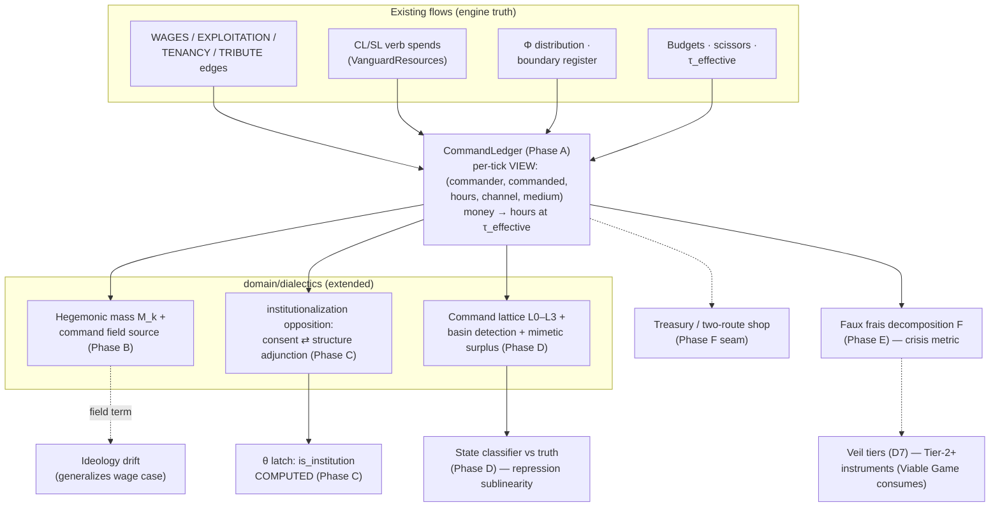

# The Command Ledger — Lawverian Unification Refactor (program plan, draft for ratification)

**Date:** 2026-07-17 · **Status:** DRAFT for owner review — program/spec/ADR numbers
allocated per `ai/decisions/` convention at plan time ("The Command Ledger" is a
working title; next free ADR is 079).
**Question answered:** *How do contradictions, value, money, labor command, hegemony,
organizations, institutions, and the diffuse-institution/basin material unify into one
executable layer?*
**Audit basis:** dev HEAD `744f865c` (2026-07-17), file-level verification cited
throughout. Design lineage: ADR051 (Lawverian dialectics), ADR070 (emergent class
partition), ADR073 (doctrine), ADR077/078 (market scissors/correction), the 2026-07-17
Viable Game record (`docs/superpowers/specs/2026-07-17-viable-game-design.md`, rulings
D1–D7), and the chat corpus on labor command, hegemonic mass, the command lattice, and
mimetic surplus / faux frais.

---

## 1. The unification thesis

Babylon already computes value (tensor, MELT, Φ), money (budgets, scissors,
corrections), labor (CL/SL, theoretical labor), contradictions (the opposition
registry), institutions (the apparatus entity), and ideology (George Jackson routing).
What it does not yet compute is the **one relation all of these are forms of: the
command of labor.**

The thesis, stated as machinery:

1. **Labor command is the common codomain.** Every value flow, wage payment, rent
   extraction, tribute transfer, tax, verb spend, and mobilization is a flow of
   commanded labor-hours from a commanded party to a commander.
2. **There are exactly two channels.** *Consent* — command mediated by membership and
   consciousness (MEMBERSHIP edges, CL/SL mobilization; renewable each tick, evaporates
   with coherence). *Structure* — command mediated by standing claims that operate
   regardless of belief (WAGES, TENANCY, TRIBUTE, taxation, legal authority; Marx's
   "dull compulsion"). Money is the structure channel's anonymous, transferable medium,
   converting at τ (`ValueFormAdjunction.to_labor_hours` — already live).
3. **Organization vs. institution is the channel dichotomy.** An organization commands
   labor through consent (inside membership); an institution commands labor through
   structure (outside membership). "Survives member turnover" (the shipped Institution
   entity's criterion) is the *symptom*; channel composition is the *mechanism*. The
   org→institution transition therefore becomes a **computed one-way threshold**
   (structural share ≥ θ), not an authored `is_institution: bool`.
4. **Hegemony is a field sourced by commanded-labor mass.** M_k = labor commanded by
   body k. Ideology is pulled along command edges in proportion to the labor commanded
   through them; the shipped consciousness dynamics (wage-driven decay, solidarity-gated
   routing) are the wage-edge special case. Tidal lock: an entity's orientation relaxes
   toward whoever commands its *reproduction* inflows.
5. **The two channels are adjoint.** Institutionalize (crystallize consent into
   standing claims) ⊣ Legitimate (structure manufacturing consent). The measured
   defects are the two great political pathologies — the coercive residue /
   legitimacy deficit on one side, alienation / surplus legitimacy on the other —
   and both round trips are strictly lossy (no perpetual motion of legitimacy).
6. **Diffuse institutions are detected basins, not authored nodes.** The NPIC, "the
   gang world": convergent formations in org-form space carved by the *joint*
   selectivity of named claim-holders (the tax regime, foundation capital, the
   counterinsurgent classifier). They live at level L2 of a third LevelLattice
   (labor_power ≺ organization ≺ basin ≺ formation), detected the way ADR070 detects
   class — emergent partition, never declared. Their own labor command is the
   **mimetic surplus**: compliance form-labor no named claim requires, the measured
   defect of the L1⇄L2 adjunction.
7. **Faux frais is mimetic surplus at formation scale.** Marx's *faux frais* —
   unproductive-but-necessary costs — generalizes to: **labor commanded solely to
   reproduce the command relation itself** (repression, surveillance, ideology
   manufacture, compliance/mimetic form-labor, circulation overhead). The faux frais
   ratio F = overhead-command hours / productive hours is the crisis metric: fascism
   is the regime where dF/dt > 0 while dΦ/dt < 0 — the empire spending ever more
   labor on commanding labor as the bribe fails. This makes the fascist bifurcation,
   the terminal-crisis arc, and the mimetic surplus one quantity at three scales.

Everything in this program is a *view or a measured defect over flows the engine
already produces*. No new primitive: the dialectic D=(A,Ā,w,T,σ) remains the sole
apex; channels are classifications over existing edge types (Aleksandrov III.8);
basins are emergent partitions (ADR070 precedent); the ledger is recomputed state
(III.11 — nothing fabricated, everything reconstructible).

---

## 2. Current-state audit (verified at HEAD `744f865c`)

**Already built — the refactor's load-bearing walls:**

| Capability | Where | Status |
|---|---|---|
| Opposition registry: gap/balance/rate, principal scoring, per-node PoleSamples (ADR070), **shadow bindings** (ADR077 promotion pattern) | `domain/dialectics/core/opposition.py` | LIVE, 5 bound oppositions + market shadow |
| Catalog: capital_labor / wage / tenancy / atomization / imperial, `GraphInputs` snapshot pattern (no engine imports) | `domain/dialectics/instances/catalog.py` | LIVE |
| Money⇄labor conversion at τ_effective: `to_labor_hours` / `to_money`; the Φ family (`phi_class`, `phi_hour`, `phi_domestic`, `phi_unequal_exchange`, `phi_reproduction`) | `instances/value_form.py` (docstring already says the wage "**commands** more value…") | LIVE |
| LevelLattice + spatial/social chains, closure = share-weighted regional mean, resolution = variance decomposition, `LEVEL_INDEX` | `instances/levels.py`, `core/level.py` | LIVE — ready for a third chain |
| Coupling graph, kinds = feeds/constrains/transforms/contains/antagonizes | `core/coupling.py` | LIVE |
| Regime classifier (reproduction/crisis/sublation), RUPTURE gate | `core/regime.py`, ContradictionSystem @18 | LIVE |
| Field stack (per-node fields, derivatives, predicates) | `contradiction_field.py` @19, `field_derivative.py` @20 | LIVE — the hegemony field's chassis |
| Institution entity (Feb design shipped): `InternalBalanceOfForces` (liberal/revanchist/bonapartist), `SelfReproduction`, `OrgTemplate` spawning, `InstitutionalHousing` (resource_provision, legal_cover, legitimacy_transfer, action_oversight), structural selectivity | `models/entities/institution.py`, `domain/institution/{balance,selectivity,ooda_effects,queries}.py` | LIVE |
| Organization: budget, cohesion, cadre_level, heat, legal_standing, doctrine trio (ADR073) | `models/entities/organization.py` | LIVE |
| CL/SL: `VanguardResources` (cadre_labor, sympathizer_labor, budget, caps; derived from cadre_level/cohesion/budget/heat/reputation) | `models/vanguard_resources.py`, `ooda/types.py`, trap_detection, postgres schema | LIVE |
| George Jackson routing: agitation → class_consciousness vs national_identity gated on solidarity_pressure | `engine/systems/ideology.py`, `formulas/consciousness_routing.py` | LIVE |
| Φ distribution to counties via BEA×QCEW exposure, DRAIN_EDGE boundary register | `engine/systems/phi_distribution.py` | LIVE |
| Market scissors axis + corrections, capitalization_rate define, shadow→promotion ceremony precedent | `market_scissors.py` @17.8, `config/defines/market.py`, ADR077/078 | LIVE |
| Conservation sentinels | `sentinels/conservation/` | LIVE — home for the ledger law |
| Layering: domain must not import engine; formulas pure; kernel layer 0 | `pyproject.toml` import-linter | ENFORCED |

**Gaps — what this program builds:**

- **No command decomposition.** Flows exist (edges, Φ, boundary register, CL/SL
  spends, budgets) but nothing answers *who commands whose labor, how many hours,
  through which channel* — the unifying view is absent.
- **No hegemonic mass.** The Jan-2026 tidal-lock formalization stalled on "mass needs
  grounding"; the fluid-dynamics W-B workstream holds the gravity idiom propose-only
  on the same question. The grounding (M = commanded labor) is ruled in chat but
  nowhere computed.
- **Formalization is authored, not computed.** `Organization.is_institution` is a
  hand-set bool sitting beside a separately authored Institution entity — the
  org→institution transition (deferred since the Feb spec-kit) has no order parameter.
- **No L2.** No basin detection, no mimetic surplus, no state classifier-vs-truth
  dual — the diffuse-institution layer exists only in the design corpus.
- **No faux frais.** Nothing classifies commanded labor as productive vs.
  command-reproducing overhead; the fascism-as-overhead-explosion thesis has no metric.
- **`RevolutionaryFinance` is dormant** (defined, exported, consumed nowhere) while
  the treasury/two-route shop design (2026-07-17 marketplace chat) is unimplemented —
  an orphan-vs-activation decision in ADR036 spirit.
- **Consciousness generality.** The drift law is wage-edge-specific; the general
  command-share pull (which must *reduce to* the shipped law) does not exist.

---

## 3. Target architecture

**Placement & layering.** New package `src/babylon/domain/command/` — a pure
downstream of `formulas` + `models` on the `GraphInputs` snapshot pattern (like
`domain/dialectics`), zero engine imports (import-linter contract extended). One new
engine system (`CommandLedgerSystem`, CONSEQUENCE phase, after MarketScissors @17.8 and
before ContradictionSystem @18, so the registry instances read this tick's ledger).
Observability rows are tick-keyed per ADR031 (`command_flow` table, same class as
`contradiction_field`); the ledger itself is recomputed truth, never accumulated
(VIII.11).

---

## 4. Phases

Rounds are dependency order, **not scope cuts** (no-MVP rule). Every phase is
shadow-first on a feature branch, byte-identical at every unit until its declared
promotion ceremony (the ADR077 pattern), one recording ADR per phase or one program
ADR with phase annexes — owner's call at ratification.

### Phase A — The Command Ledger (the Rosetta stone)

**A1.** `CommandChannel = Literal["consent", "structure"]` and
`CommandMedium = Literal["mobilization", "money", "claim"]` in `domain/command/types.py`.
Consent⇒mobilization always; structure carries money (wage payments, purchases, taxes
in money) or claim (rent-in-kind, tribute, corvée, legal compulsion). The medium axis
exists because the **Veil (D7)** is about the money-form specifically.
**A2.** `CommandFlow` (frozen Pydantic): commander_id, commanded_id, hours ≥ 0,
channel, medium, source_edge_type, tick. `CommandLedger`: the per-tick tuple + indexed
aggregations (by commander, by commanded, by channel).
**A3.** Extractors, one per substrate flow family, each a pure function over a
snapshot: WAGES→(employer commands worker, money), EXPLOITATION s-share→(capital
commands labor, structure), TENANCY rent→(landlord commands tenant, claim/money),
TRIBUTE→(core commands comprador chain), verb CL/SL spends→(org commands members,
consent), state budget spends→(apparatus commands personnel, money). Money converts at
`ValueFormAdjunction.to_labor_hours` (τ_effective — the scissors bites here for free).
**A4.** `CommandLedgerSystem` @17.9 fills the snapshot, computes the ledger, stashes
it on a graph attr (the `opposition_states` handoff idiom) + writes tick-keyed rows.

**Earn-its-keep dues (III.10):**
- **LAW — Ledger⇄Tensor reconciliation:** per tick, money-medium ledger hours ≡ the
  value tensor's corresponding (v, s) flows at τ_effective within ε; consent-medium
  hours ≡ CL/SL debits. Ships as a conservation **sentinel**. A flow the ledger cannot
  reconcile is a bug surfaced loudly, not absorbed.
- **COMPUTATION:** the ledger, every tick, all scenarios.

### Phase B — Hegemonic mass and the command field

**B1.** `hegemonic_mass(k) = Σ inbound flow-hours to k` + capitalized claim stock
(standing claims × `capitalization_rate` from MarketDefines — reuse, don't mint).
Counting convention per ruling **R-1** (below).
**B2.** `reproduction_commander(entity) = argmax_k` inbound flows funding the entity's
own reproduction (operational burn, wages of its staff, its rent) — the **tidal lock**
grounded: you orbit whoever commands the labor that reproduces you. Answers the
Jan-2026 open question and unblocks the fluid-grammar W-B gravity idiom with mass
finally grounded.
**B3.** Command field: per-node `commanded_share[k]` sourced into
ContradictionFieldSystem @19 as a new field family — **no new field machinery**, a new
source term on the existing chassis (no inverse-square anywhere: coupling propagates
along command edges via the existing Laplacian/derivative stack).
**B4.** Generalized drift (SHADOW): ideology pull per node = Σ_k commanded_share[k] ×
orientation_k × gain. Ships observing-only beside `ideology.py`.

**Dues:**
- **PREDICTION (consistency contract):** on worlds where only WAGES edges carry
  command, the shadow drift's routing decisions match the shipped George Jackson
  ternary (`route_agitation_to_ternary`) exactly — the general law *contains* the
  special case. Promotion to adjudicating is a declared ceremony (**R-4**).
- **COMPUTATION:** M_k, reproduction_commander, commanded_share fields, every tick.

### Phase C — The consent⇄structure adjunction (`institutionalization` instance)

**C1.** New `OppositionSpec(key="institutionalization", pole_a="consent-command",
pole_b="structure-command", unity="the command of labor", antagonistic=False)` with a
GapMeasure over the ledger's channel decomposition and a **PoleMeasure over
organizations** (ADR070 channel): per-org sigma = signed structural share. The
Galois pair itself: `GaloisConnection` instance Institutionalize ⊣ Legitimate over
(consent-configurations, structure-configurations); defect readings per the registry's
gap/balance convention, sign orientation pinned at first measurement (**R-2**), exactly
how the value-form instance pinned Φ's proxy.
**C2.** **The θ latch.** `formalization_threshold` in `config/defines/command.py`.
When an org's structural share crosses θ: one-way `is_institution` latch (I.7
quantitative→qualitative), emitted as an event. Authored Institution entities are
grandfathered as apparatus-layer objects (they remain the housing/spawning/selectivity
substrate — the Feb three-layer architecture is untouched); the org-side bool stops
being hand-set (**R-6** migration).
**C3.** Defect coupling into the shipped `InternalBalanceOfForces`: rising legitimacy
deficit with high structural share feeds `institutionalist_bonapartist` weight (a
`constrains` coupling in the CouplingGraph — Marx's parasite state as a measured
consequence, not a scripted mode).

**Dues:**
- **LAW — no perpetual motion of legitimacy:** for all defines-reachable
  parameterizations, both round trips (consent→structure→consent,
  structure→consent→structure) are strictly lossy. Property test (Hypothesis over
  defines ranges), twin of ADR077's no-arbitrage law.
- **PREDICTION:** the θ flip; and Bonapartist-weight growth correlates with the
  measured legitimacy deficit (behavioral contract over the regression scenarios).
- **COMPUTATION:** per-org channel shares + the instance in the registry, every tick.

### Phase D — The command lattice and basin detection (the diffuse institution)

**D1.** Third LevelLattice chain: `labor_power ≺ organization ≺ basin ≺ formation`
(names disjoint from spatial/social; extend `LEVEL_INDEX`). Hours aggregate extensive
(sum); orientation aggregates intensive (mass-weighted mean) — the existing
`ScaleAdjunction` machinery verbatim.
**D2.** **Basin detection** (deterministic, seedless): coupling-signature vector per
org — (reproduction_commander distribution, edge-type profile, legal_standing,
selectivity exposure from housed/constraining institutions) — clustered by
threshold-graph connected components with stable ordering (ADR070 discipline). Basin
membership carries a dwell/hysteresis define so partitions don't flicker tick-to-tick.
**D3.** **Mimetic surplus** = the L1⇄L2 measured defect: form-labor orgs in a basin
carry beyond what any named claim requires (realized form vector minus the minimal
claim-required form, priced in hours via the ledger's consent-medium compliance
flows). Ships as a registry instance (`mimetic`, SHADOW first).
**D4.** **Two classifiers.** Engine truth = the detected basins. The state's *map* =
a representation held on StateApparatus (its basin-assignment table), updated through
its OODA/intel machinery, deliberately biasable (the counterinsurgent classifier that
captures the organizations of the nationally oppressed regardless of conduct).
Gameplay = the gap: false positives (the breakfast program in the gang database),
false negatives (where the player hides).
**D5.** Repression sublinearity: REPRESS against a *classified basin* costs one
attention thread for the whole basin (gang injunction / RICO); unclassified targets
cost one thread each. CO-OPT is the symmetric forcible basin-assignment (funded into
the NPIC basin). Wired through the existing attention-thread economy.

**Dues:**
- **LAW — the revolution will not be funded:** no defines-reachable path to
  basin-mediated funding without basin legibility (property test).
- **LAW — sublinearity asymmetry:** classified-basin repression cost is sublinear in
  basin size; unclassified cost is linear (property test over the attention economy).
- **PREDICTION — isomorphic convergence:** an org entering a basin converges toward
  the basin's canonical form at a defines-rate; resisting costs funding access
  measurably.
- **COMPUTATION:** basins, mimetic surplus, classifier-gap metrics, every tick.
- **R-3** governs whether the performativity feedback (the state's classifier
  *consolidating* the basin it names — Jackson's prison as university) ships here as a
  `transforms` coupling with a defines gain, or defers.

### Phase E — Faux frais and the crisis metric

**E1.** Flow classification `is_faux_frais(flow)`: labor commanded solely to reproduce
the command relation — repression/surveillance labor (apparatus verb spends),
ideology-manufacture labor, compliance/mimetic form-labor (Phase D3's defect, priced
in hours), circulation overhead. Taxonomy boundaries per **R-5**; Marx's own category,
so the Aleksandrov trace is native.
**E2.** `F = faux_frais_hours / productive_hours`, per tick, per scope via the spatial
lattice (county → nation). Decomposed **by channel**: the fascism signature is the
coercion-side share exploding.
**E3.** Veil integration (D7): F, the channel decomposition, and hegemonic mass are
Tier-2+ instruments — serialization-gated on the doctrine/theoretical-labor state
exactly like the scissors instruments. This program ships the numbers; the Viable Game
Circuit screen ships the glass.

**Dues:**
- **PREDICTION (the fascism thesis, computable):** across the regression scenarios +
  one designed stress scenario, the fascist-convergence detector's firing region
  coincides with dF/dt > 0 under dΦ/dt < 0 — the state substituting overhead command
  for the failing bribe. Behavioral contract with golden trajectories.
- **COMPUTATION:** F and its decomposition, every tick.

### Phase F — Treasury seam (activation, not expansion)

The two-route shop (P-route/V-route, route-flip p*, endogenous dues/donations — the
2026-07-17 marketplace design) is **its own spec**; this program only delivers its
substrate and resolves the dormancy: verb spends and org income flow *through the
ledger* (consent-medium out, money-medium in), and `RevolutionaryFinance` is either
activated as the treasury fields' home or deleted per the orphan-audit discipline
(ADR036) — one commit, owner's pick at spec time. The shop then consumes
`CommandLedger` + `ValueFormAdjunction` and inherits the no-arbitrage law's home.

---

## 5. Testing & acceptance (Amendment Q)

- **Byte-identity:** every unit lands byte-identical on `qa:regression` (5 scenarios)
  except the declared ceremonies: (i) Phase B drift promotion (R-4), (ii) Phase C θ
  latch activation, (iii) Phase E stress-scenario baseline addition — each with
  per-scenario drift declared, the Market Scissors promotion pattern.
- **Sentinels:** ledger⇄tensor reconciliation joins `sentinels/conservation`;
  basin-partition stability (dwell respected) joins `sentinels/partition`.
- **Property laws:** no-perpetual-motion-of-legitimacy; revolution-will-not-be-funded;
  repression sublinearity; ledger non-negativity + channel exhaustiveness (every
  substrate flow lands in exactly one channel/medium or fails loud).
- **Golden baselines:** M_k trajectories, F trajectories, θ-crossing ticks on the
  canonical michigan run; George Jackson consistency contract (Phase B) pinned as
  exact-match on wage-only worlds.
- **Determinism:** clustering seedless + stable-sorted; ledger recomputed from
  snapshot; tick hash unchanged until each declared ceremony.
- **Layering:** import-linter contract added for `babylon.domain.command`; the
  `GraphInputs`-style snapshot keeps the dialectics/command packages engine-free.

## 6. Defines slate (`config/defines/command.py`, assembled into GameDefines)

`formalization_threshold` (θ) · `claim_capitalization_horizon` ·
`legitimacy_dissipation` / `alienation_dissipation` (the two round-trip loss floors) ·
`drift_gain` + `drift_promotion_enabled` (shadow flag, default False) ·
`basin_distance_threshold` · `basin_dwell_ticks` · `mimetic_form_weights` ·
`faux_frais_class_weights` · `classifier_bias_*` (state map priors) ·
`repression_basin_discount`. All coefficients here and nowhere else (III.1);
`defines.yaml` regenerated sync-guarded.

## 7. Constitutional compliance

- **No new primitive.** Channels classify existing edge/flow types; the ledger is a
  recomputed view; basins are emergent partitions (ADR070 precedent); lattice chains
  and registry instances are ADR051 machinery; θ is domain state in the doctrine-trio
  class (ADR073 precedent: recording ADR suffices, no amendment).
- **III.8 Aleksandrov:** every construct traces — channels to edge types, mass to
  flow-hours, mimetic surplus to compliance labor, faux frais to Marx's category.
- **III.10 earn-its-keep:** each phase ships laws/predictions/computations (tables
  above); nothing ships as vocabulary.
- **III.11 Loud Failure:** unreconcilable flows raise; unpositioned orgs are absent,
  never zero-filled; the veil serializes honest absence.
- **VIII.11:** ledger and defects are fresh per tick, never accumulated.
- **AI observes only:** nothing here touches the intelligence layer; the Voice may
  narrate F and M_k but the engine adjudicates them.

## 8. Open rulings (owner)

| # | Ruling needed | Recommendation |
|---|---|---|
| R-1 | **Mass counting:** per-relation (non-conserved; the same peripheral hour magnifies every hop of EXPLOITATION→TRIBUTE→WAGES) vs value-added netting | Per-relation — command is relational, not a substance; chain magnification *is* Amin's concentration of command. Carried open since the first labor-command chat; blocks B1. |
| R-2 | Adjunction defect sign conventions (which pole positive) | Pin at first measurement, value-form precedent |
| R-3 | Performativity feedback: state classifier consolidates the basin it names | Ship as `transforms` coupling with defines gain (Jackson is core theory), shadow-gated |
| R-4 | Drift generalization promotion ceremony timing | After Viable Game Track 3's ceremony (below) |
| R-5 | Faux frais taxonomy boundaries (advertising? finance? insurance?) | Start with repression + surveillance + mimetic + circulation; widen by evidence |
| R-6 | `is_institution` migration: grandfathered authored institutions vs computed latch | Authored apparatus entities keep entity-hood; org-side bool becomes latch-only |
| R-7 | **Sequencing vs the Viable Game program** (owner-approved today, 2 declared ceremonies of its own) | This program is engine-side and feeds Track 2's Circuit + the D7 veil; run it as the *engine sibling* after the Playability Spine, interleaved before/parallel to Track 2 — but strictly one merge at a time (the gated-stack lesson) |

## 9. Risks

- **Ceremony crowding:** three declared ceremonies here + two in the Viable Game.
  Mitigation: shadow-everything default; ceremonies are single, instrumented,
  drift-tabled.
- **Basin flicker:** clustering on live signatures can oscillate. Mitigation: dwell
  hysteresis define + partition sentinel.
- **Mass inflation (R-1):** per-relation counting makes M_k scale with chain depth.
  Mitigation: it's a ruling, and the decomposition-by-channel keeps any reading
  interpretable; the field consumes *shares*, which normalize.
- **Solo-dev bandwidth:** this is a Program-06-sized refactor landing beside a
  Program-24-sized one. Mitigation: Phase A alone is independently valuable (the
  reconciliation sentinel catches real bugs on day one); phases are separable at every
  boundary.

## 10. What this buys, in one paragraph

One ledger under everything: the wage, the rent, the tribute, the tax, the verb, the
due, and the tithe become rows in a single decomposition of commanded labor-hours by
channel. Hegemony gets a mass and the tidal lock gets a mechanism; the
org→institution transition becomes a phase transition with an order parameter instead
of a checkbox; the NPIC and the gang world become detectable objects with a measured
mimetic surplus; the state's counterinsurgent classifier becomes a biased map the
player exploits; and fascism becomes a computable regime — the explosion of faux
frais as imperial rent fails — rather than a scripted mode. Graph + Math = History,
with History now denominated in hours.
