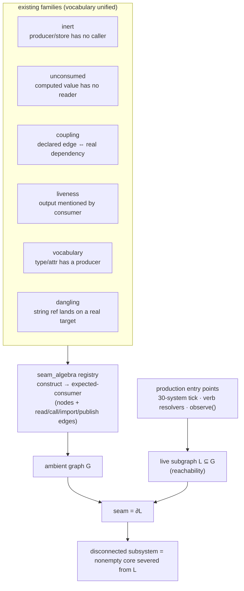
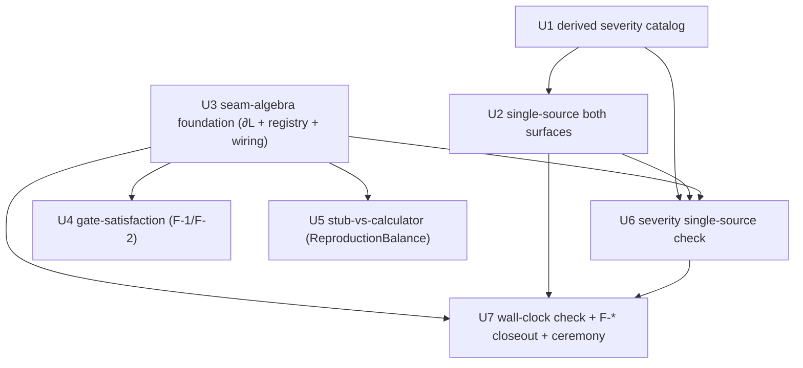

# T1.1 — Seam-algebra sentinel + derived severity (LANE DESIGN)

> STATUS: DESIGN (architect pass, lane `lane/t11-seam-severity`). Implements spine A+B of
> `ai/_inbox/PROGRAM_v1_0_0_playable_archive.md` (RATIFIED 2026-07-21). This doc is the
> design record for the T1.1 train; each unit below is a self-merge-on-green PR per the
> standing autonomy ruling.

## 0. Verified ground truth (this pass, read-only)

Re-confirmed against the lane worktree and the main checkout, so the units build on facts
not memory:

| fact | value | source |
|---|---|---|
| `EventType` members | **84** (AST-counted) | `src/babylon/models/enums/events.py` |
| `SEAM_REGISTRY` rows | **123** `SeamEntry` | `src/babylon/sentinels/seam/registry.py` |
| Web severity dict | **47 keys** (14 crit / 20 warn / 13 info) | `web/game/engine_bridge.py::_EVENT_SEVERITY` (line ~9011) |
| Archive severity dict | **47 keys**, byte-identical twin | `src/babylon/tui/chronicle_salience.py::EVENT_SEVERITY` |
| Equality sentinel between the twins | **none today** | — |
| Existing static sentinels wired | 14 in `check:sentinels-static` | `.mise.toml` |
| Family layer | 0.5 — imports nothing above `models`/`config`, reads source via `ast`, never imports engine/Django/DB | `pyproject.toml` import-linter contract; `sentinels/base.py` |
| Event-kind taxonomy (R-EC-1) | ALARM · CROSSING · FLOW · ACT · PATTERN | `ai/_inbox/math/babylon-events.md` §II.7 |

The two severity dicts are hand-copied twins with **no** mechanical guarantee they stay
equal — exactly the silent-drift failure the family exists to kill.

## 1. What T1.1 delivers (two intertwined artifacts)

**Artifact B — Derived severity.** ONE generated/derived catalog column, `severity`,
computed by a pure rule from `(event_kind × terminal_proximity)`, consumed by BOTH the web
bridge and the Archive Chronicle through a single shared resolver, guarded by a
single-source equality sentinel. Replaces the two hand-copied 47-entry dicts. The loud
`unclassified → warning` floor stays as the migration floor. Full R-EC-1 catalog codegen
(the five-registry `generated == registered` gate) is **staged OUT** — day-one is the
derived `severity` column only.

**Artifact A — The seam-algebra family.** A new `sentinels/seam_algebra/` family whose
core is a Lawvere-1991 co-Heyting **boundary computation** over a declared
`construct → expected-consumer` registry that **unifies the vocabulary** of the existing
`inert / unconsumed / coupling / liveness / vocabulary / dangling` families under one graph
`G` and one live subgraph `L`, `seam = ∂L`. It adds the three new checks named in spine A
(gate-satisfaction, stub-vs-calculator, severity single-source) **plus** the
wall-clock-call-site check (finding 3), and ships with a day-one catch list = the open
`F-*` dispositions.

Design constraint (Amendment-S tripwire, spine C): **severity is a `G∘P` read-only
projection.** It is NEVER read back into physics and NEVER enters the tick hash. Feedback
of severity into the engine would be a MAJOR amendment. Consequence: `qa:regression` stays
byte-identical across this whole train; the only ceremony is the conditional
severity/vault-surface note (§7).

## 2. The severity derivation rule (Artifact B core)

Two declared inputs per classified `EventType` member:

- `kind ∈ {ALARM, CROSSING, FLOW, ACT, PATTERN}` — the R-EC-1 generator fact (§II.7).
- `terminal_proximity ∈ {TERMINAL_ADJACENT, INTRA_LEVEL, NA}` — hand-declared day-one
  (grounded in the member's semantics; the full **feasibility-atlas** derivation of
  proximity, A9, is staged post-1.0). Plus, for FLOW/ACT, a declared `salience_floor ∈
  {warning, informational}` (the per-row Θ_feel salience floor is staged; day-one the floor
  is a declared field).

The pure derivation (`derive_severity`):

```
ALARM                          -> critical            # invariant residual, III.11, always
CROSSING & TERMINAL_ADJACENT   -> critical            # void-adjacency / regime→crisis entry / endgame-axis lock
CROSSING & INTRA_LEVEL         -> informational       # reversible intra-level crossing
FLOW | ACT                     -> salience_floor       # warning | informational, NEVER critical
PATTERN                        -> tier of its declared base crossing
unclassified (no row)          -> warning (loud floor, EventSalience.unclassified=True)
```

Severity is **INTENSIVE**: a bulletin's tier is the **max-fold join** over its events
(`critical > warning > informational`), never a sum. **Autopause keys on derived CRITICAL
only** (crimson = render tier for rupture).

**Load-bearing finding the architect must surface.** The pure rule is **not** a rubber
stamp of the current 47 hand tiers. Under it, `warning` is reachable only from FLOW/ACT (or
the unclassified floor); a CROSSING is binary critical-or-informational. The current
hand-copy has CROSSINGs sitting at `warning` (`mass_awakening`, `bifurcation_threshold`,
`level_transition`, `crisis_phase_transition`, `co_optive_breakdown`, `pattern_shift`) and
puts the `calibration_warning.*` ALARM family at `informational`. So reconciliation forces
**real, principled reclassification**: some current-warning crossings become
critical (correctly autopause) or informational (correctly quiet), and the ALARM family's
tier is an owner question (are `calibration_warning.*` true invariant-residual ALARMs, or
FLOW-tier data notices?). This is the whole point of deriving rather than hand-listing —
but it means the U1 ceremony **will** produce a small drift table (old-tier → new-tier per
member), and it changes autopause/render behavior on the game surface. It does NOT touch the
tick hash. This drift is a **feature disclosure**, owner-visible, not a regression (§7, §9).

**Home & layering.** The taxonomy + derivation + generated table live in ONE low module,
`src/babylon/models/event_severity.py` — it imports only `EventType` (`models.enums`), so it
is importable by the projection-pure TUI (`tui → engine/persistence/django` is forbidden by
the `pyproject.toml` contract; `tui → models` is fine) AND by the Django-layer web bridge.
The Observability Spine (T1.2, program §F) may later re-home it under an `observability`
package; the single-source sentinel guards the seam either way, so the move is safe.

## 3. The seam-algebra family (Artifact A core)

### 3.1 The boundary computation (Lawvere co-Heyting ∂L)

Ambient graph `G` = declared constructs (nodes) + `read / call / import / publish` edges,
all extracted **statically via `ast`** from source (never importing the engine — same
discipline as every existing static sentinel, which is what keeps it in the always-on fast
lane). Live subgraph `L` = nodes reachable from the declared **production entry points**:
the 30-system tick (`_DEFAULT_SYSTEMS`), the verb resolvers, and `observe()`. Then:

- **`seam = ∂L`** — the co-Heyting boundary of `L` in `G`: finite, machine-enumerable.
- A **disconnected subsystem** = a nonempty core severed from `L` (a construct declared but
  unreachable from any production entry point).

The existing families are re-expressed as facets of this one computation, unifying their
vocabulary onto ONE `construct → expected-consumer` registry:



Day-one scope: **static ∂L only** (dev fast lane). The trace-based residual leg (reachable
from probe goldens, program §A "trace-based residuals nightly") is **staged OUT** to the
nightly lane, not a day-one unit.

### 3.2 The four checks this family adds

1. **Gate-satisfaction** — enumerate construct-entry guards (`context.get(K)`,
   `services.X is None`, optional kwargs) and red when no production supplier exists for the
   gated input. Reuses `_ast.optional_defines_param_index` /
   `_ast.calls_missing_keyword_or_positional_arg`. Closes: vol2_step gate, LODES kwargs,
   transition_engine, reserve-army seeds. **Day-one witnesses: F-1, F-2.**
2. **Stub-vs-calculator** — AST-classify live consumers fed a literal/neutral constant while
   a registered calculator for that value exists. **Day-one witness:
   `ReproductionBalance(condition_met=True)`** (the `n=True` literal in
   `domain/economics/tick/system/__init__.py`).
3. **Severity single-source equality** — web severity map == Archive severity map ==
   generated table, over all 84 members incl. the warning floor (generalizes the
   `seam/checks.py::check_severity_vocabulary` pattern). **This is Artifact B's guardrail.**
4. **Wall-clock-call-site check (finding 3)** — call sites feeding P-tier / hashed
   artifacts that read wall-clock (`datetime.now`, `time.time`, `perf_counter`, …).
   **Day-one witnesses: `engine/observers/jsonl_recorder.py`, `engine/observers/metrics.py`,
   the run manifest.**

Two-tier like the seam family: land a check **gating** where the estate is already clean;
land it **advisory** (prints loudly, does not gate) where pre-existing drift awaits an owner
disposition, then promote. The `config-less-logging` check (program §A "(spine)") is
**scoped OUT to T1.2** (it belongs to the Observability Spine core T1.2 owns) — noted here so
the boundary is explicit, not forgotten.

### 3.3 Day-one catch list — the F-* dispositions

Every named `F-*` is discharged to **green** by T1.1, each either fixed or carried as an
owner-gated declared exemption row (the `sentinels/exemptions.py` VIII.12 pattern) with its
rationale + recommended fix. The mutation test for each check proves the check **reds** when
its disposition is reverted.

| finding | site | mechanism | day-one disposition |
|---|---|---|---|
| **F-EC-1** dead noise formula | `domain/bifurcation/consciousness.py::anisotropic_observation_error` (no production caller) | ∂L (U3): nonempty core severed from `L` | red witness → retire, or exemption row citing the R-EC-2 "observation-noise fifth stratum" BD question |
| **F-1** silent skip | `SimulationEngine._run_audit` early-returns (literal "skip silently") when `context.session_id` absent | gate-satisfaction (U4) | red witness → exemption row w/ rationale (owner-ruled raise-vs-exempt) |
| **F-2** wiring-gate silent skips | `_compute_financial_layer` returns unchanged when `services.distribution_calculator is None`; vol2/Φ-distribution sub-stages return on absent context keys | gate-satisfaction (U4) | red witness → exemption rows (the §X.2 F-2 ruling: loud one-time log OR exemption) |
| **F-EC-2** score dither | `ooda/state_ai/decision.py` `+ rng.uniform(0.0, 0.01)` soft-dither + literal | declared disposition row (full L-ACC static check is R-EC-2, staged) | exemption row citing recommended fix (i) true-argmax; NOT a new check day-one |
| **F-3** warn-not-raise | `substrate/conservation.py` warns rather than raises on violation (pre-III.11) | declared disposition row | exemption row w/ rationale (owner-ruled re-read under current constitution) |

### 3.4 Wiring

New package `src/babylon/sentinels/seam_algebra/` (`registry.py` + `checks.py` +
`__init__.py`, mirroring the family convention). New dispatcher key `seam-algebra` in
`tools/sentinel_check.py::_SENSORS`. New mise task `check:seam-algebra`
(`sentinel_check.py seam-algebra --check`) wired into `check:sentinels-static.depends`, with
the "14 static" / "ALL 15 sentinels" count descriptions bumped consistently. Import-linter
contract already covers `babylon.sentinels`; no new contract needed.

## 4. Units

Each unit: TDD red→green→refactor; frozen-Pydantic constructs; RST docstrings; commit per
unit; scoped `mise run test:q` in-lane; heavy gates single-flight. Every unit names its
**mutation test** — a code/registry mutation the check MUST catch, run locally (mutation is
local-only, never CI).

### U1 — Derived severity catalog
**Build:** `src/babylon/models/event_severity.py` — a frozen `EventKindRow`
(`event_type`, `kind`, `terminal_proximity`, optional `salience_floor`, optional
`base_crossing` for PATTERN); the `SEVERITY_TAXONOMY` declaration for the 47 currently-tiered
members (plus any unambiguous others); `derive_severity(kind, proximity, floor)` pure
function (§2); the generated `SEVERITY_BY_EVENT` mapping; and `resolve_severity(event_type)`
applying the loud `unclassified → warning` floor. Reconcile derivation vs the 47 hand tiers;
produce the old-tier→new-tier **drift table** (owner-visible); every intentional
reclassification is a declared row with rationale.
**Acceptance:** every taxonomy key is a real `EventType` value (loud at import); frozen +
`extra="forbid"`; `derive_severity` covers all five kinds; drift table generated and every
non-zero drift cell has a declared rationale; severity value is never numeric-in-events (E-2)
and never referenced by any engine/physics module (grep gate: no importer under
`babylon/engine|domain` reads `resolve_severity`).
**Mutation test:** flip one row's `kind` (e.g. an ALARM→FLOW) or `terminal_proximity`; assert
`derive_severity` returns a different tier for that member AND the reconciliation pin test
(derived == declared-intended tier per member) reds. Proves the derivation is load-bearing,
not a lookup table in disguise.
**Depends:** none.

### U2 — Single-source the two surfaces
**Build:** retarget `web/game/engine_bridge.py::_EVENT_SEVERITY` and
`src/babylon/tui/chronicle_salience.py::EVENT_SEVERITY` to consume U1's shared
`resolve_severity` (delete the hand-copied 47-entry literals; keep each surface's thin
adapter). Point `classify_event_salience` / `_classify_event` and `compute_autopause_state`
at the shared resolver; autopause fires on derived **CRITICAL** only.
**Acceptance:** both surfaces resolve identically for all 84 members; the loud
`unclassified → warning` floor preserved with `EventSalience.unclassified=True`; no local
severity literal remains in either surface (AST gate); `chronicle_salience` behavioral tests
(dedup/volume-floor/autopause) stay green with the new resolver; `qa:regression`
byte-identical (severity is `G∘P`, not in the hash).
**Mutation test:** reintroduce a local one-entry override in ONE surface differing from the
generated table; assert the parity test (both surfaces vs generated, all 84) reds. (This
mutation is the exact thing U6's sentinel then guards in CI.)
**Depends:** U1.

### U3 — Seam-algebra family foundation (unified registry + ∂L)
**Build:** `sentinels/seam_algebra/{registry.py,checks.py,__init__.py}` — the frozen
`ConstructNode` / `ExpectedConsumer` registry model unifying the
inert/unconsumed/coupling/liveness/vocabulary/dangling vocabularies; the static ∂L boundary
computation (`G` from `read/call/import/publish` edges via `_ast`; `L` reachable from the
declared production entry points; `seam = ∂L`; disconnected-subsystem detector); dispatcher
key + `check:seam-algebra` mise task + `check:sentinels-static` wiring + count-description
bump.
**Acceptance:** exit-code contract (0/1/2) via `run_sensor`; family runs green on the real
estate; **cross-validation** — a mutation each existing family already catches is ALSO
caught by the unified ∂L (re-express ≥1 known construct per family and prove parity, so the
unification loses no coverage); **F-EC-1** surfaced as a disconnected subsystem and
discharged (retire or exemption row); layer-0.5 import contract holds (no engine import).
**Mutation test:** add a declared construct whose only production edge is deleted in a
fixture graph (nonempty core severed from `L`) → assert ∂L reports it disconnected (red);
and revert F-EC-1's disposition → assert the real run reds.
**Depends:** none (parallel with U1/U2); U4–U7 depend on it.

### U4 — Gate-satisfaction check
**Build:** `check_gate_satisfaction` in `seam_algebra/checks.py` — enumerate construct-entry
guards (`context.get(K)`, `services.X is None`, optional kwargs) via `_ast`
(`optional_defines_param_index`, `calls_missing_keyword_or_positional_arg`); red where no
production supplier for the gated input exists. Declare exemption rows for **F-1** and
**F-2** with rationale.
**Acceptance:** gates on real service-absence early-returns lacking a supplier; F-1 and F-2
each surfaced then discharged to green via exemption-with-rationale; lands advisory if
residual pre-existing gates remain undisposed, gating once clean.
**Mutation test:** inject a fixture `if services.foo is None: return` with no production
supplier → check reds; remove F-2's exemption row → real run reds.
**Depends:** U3.

### U5 — Stub-vs-calculator check
**Build:** `check_stub_vs_calculator` — AST-classify live consumers fed a literal/neutral
constant while a registered calculator for that value exists. Declare the
`ReproductionBalance(condition_met=True)` / `n=True` site
(`domain/economics/tick/system/__init__.py`) as the founding case.
**Acceptance:** reds a live consumer wired to a literal when a calculator is registered;
`ReproductionBalance` stub surfaced then discharged (wire the calculator if in-lane-safe,
else owner-gated exemption row citing the circulation-engine train); no false positive on a
genuinely constant-by-design input (documented heuristic + exemption path).
**Mutation test:** point a fixture consumer at a literal where a registered calculator
exists → check reds; revert the ReproductionBalance disposition → real run reds.
**Depends:** U3.

### U6 — Severity single-source equality check
**Build:** `check_severity_single_source` — statically assert web severity map == Archive
severity map == U1's generated table across all 84 members (generalizes
`check_severity_vocabulary`). Gating.
**Acceptance:** passes clean on the post-U2 estate; reds on ANY of the three pairwise
inequalities; injectable paths/table so tests can supply a deliberately-forked fixture.
**Mutation test:** hand-edit one surface's resolved severity for one member to differ from
the generated table → check reds (the canonical single-source mutation).
**Depends:** U2, U3.

### U7 — Wall-clock-call-site check (finding 3) + F-* closeout + ceremony
**Build:** `check_wallclock_call_sites` — flag call sites feeding P-tier/hashed artifacts
that read wall-clock (`datetime.now`/`time.time`/`perf_counter`/`monotonic`/`utcnow`).
Declare disposition rows for the known leaks (`jsonl_recorder.py`, `metrics.py`, run
manifest) and for **F-EC-2** and **F-3**. Add the day-one catch-list integration test
asserting every named `F-*` is either a red witness or a declared exemption row with a
rationale. Author the conditional severity/vault-surface ceremony note (§7).
**Acceptance:** reds a wall-clock read at a hashed/P-tier call site; known leaks discharged
(hoist the timestamp out of the hashed path, or exemption row proving the field is excluded
from the hash); F-EC-2 + F-3 carried as exemption rows w/ recommended fixes; the F-* ledger
test enumerates all five + wall-clock leaks and passes; family + `mise run check:sentinels`
green.
**Mutation test:** add a `datetime.now()` at a fixture call site feeding a hashed artifact →
check reds; delete a known-leak exemption row → real run reds.
**Depends:** U3 (and U1/U2/U6 merged so the whole family + severity ship together).

## 5. Dependency graph



Fork after U3/U1 land; U4/U5 parallelize; U6 waits on U2+U3; U7 is the closeout.

## 6. Staged OUT of T1.1 (named, so nothing is silently dropped)

- **Full R-EC-1 catalog codegen** — five-registry `generated == registered` gate, A7
  Boundary Registry (`sentinels/boundary/`), A8 Crossing Observer, A9 atlas. Post-1.0.
- **Feasibility-atlas-derived terminal proximity** — day-one proximity is hand-declared; the
  atlas derivation is A9.
- **Per-row Θ_feel salience floors** — day-one FLOW/ACT floor is a declared field.
- **Trace-based ∂L residual leg** — nightly lane, not day-one (day-one = static ∂L).
- **`config-less-logging` check** — Observability Spine, owned by **T1.2**.
- **Content-hash chain** — ruling 12, post-1.0.
- The `boundary/` package **name is reserved** for A7; day-one family is `seam_algebra/` so
  the two never collide.

## 7. Ceremony

One **conditional** ceremony (program ledger: "T1.1 severity (conditional)"). Because
severity is `G∘P` read-only, `qa:regression` is byte-identical — this is NOT a
`tests/baselines/**` physics ceremony. It is a **severity/vault-surface** note recording the
U1 old-tier→new-tier drift table and the resulting autopause/render-tier changes, for owner
sign-off. If (and only if) U1 reconciliation produced zero drift does the ceremony collapse
to all-zero-with-reason. On current analysis (§2) a small principled drift is expected.

## 8. Verification (train battery)

`mise run check` green · `mise run check:sentinels` green incl. the new `seam-algebra`
family · all five `F-*` discharged (red-witness-then-green or declared exemption) · both
surfaces single-source (U6 gate) · `qa:regression` byte-identical · per-unit mutation tests
pass locally · adversarial opus review at each unit boundary.

## 9. Open questions for the owner (flag in review if wrong)

1. **`calibration_warning.*` kind.** Are these true invariant-residual **ALARMs** (→ derived
   CRITICAL, would autopause) or FLOW-tier data notices (current: informational)? U1 needs a
   ruling; default is to preserve current `informational` via a FLOW classification + a
   flagged disposition row, so no surprise autopause.
2. **CROSSING-at-warning reclassification.** The pure rule has no `warning` tier for
   CROSSINGs; current-warning crossings (`mass_awakening`, `bifurcation_threshold`,
   `level_transition`, `crisis_phase_transition`, `co_optive_breakdown`, `pattern_shift`)
   must go critical or informational. U1 will propose a per-member split in the drift table;
   owner confirms at the ceremony.
3. **F-EC-1 disposition** — retire `anisotropic_observation_error`, or wire it as the R-EC-2
   "observation-noise fifth stratum" (BD-owed per babylon-events.md §II.8).
4. **F-2 / F-1 / F-3 raise-vs-exempt** — per §X.2, each silent-skip/warn-not-raise gate wants
   either a loud log/raise or an explicit exemption row; T1.1 defaults to exemption-with-
   rationale (does not change engine behavior in-lane) unless owner prefers the raise.
