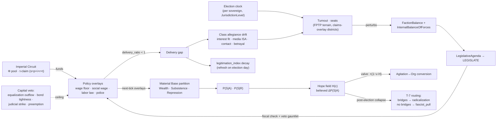
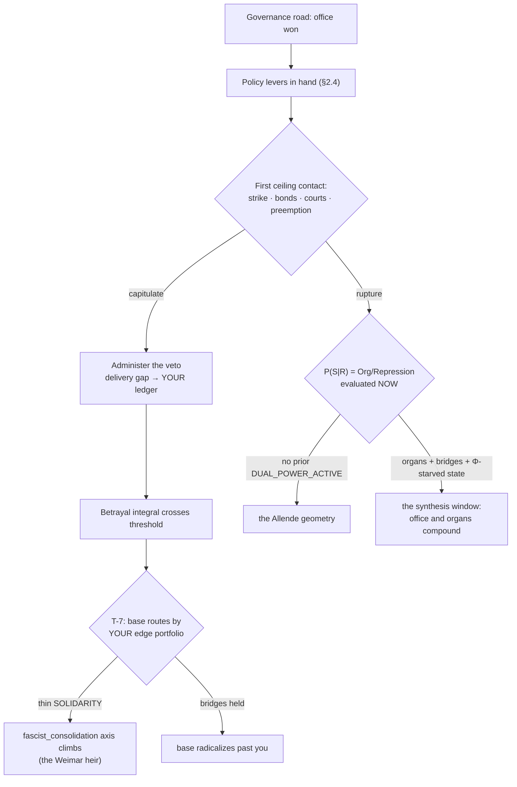

# The Electoral Question — Reformism as Terrain and as Line

**Design brief for BD ruling · 2026-07-20 · pinned to `dev@0c64446` (2026-07-20 clone; every cited class, coefficient, and position read from that tree)**

**Scope:** how Babylon models reformism / DSA-style electoralism / social democracy as (a) a genuine gameplay choice in the doctrine tree and (b) an **ambient electoral-and-policy machine that affects every actor whether or not they participate in it**. Program-scale proposal (candidate next free number, ≈ Program 24, "The Political Superstructure"); per the interleaving rule it queues behind Vol III U3–U8 and respects the one-engine-train limit.

**Modulus classification (VII.2):** everything below is **Modulus C/G/P — term motion, no amendment** — new Systems with declared ε, one new catalog opposition, new target-sorts on existing verbs, new defines namespace with A6 tiers. One 𝕊-risk (a `REPRESENTS` edge type) is identified and deliberately avoided. No new node kinds, no new verbs, no new primitives.

---

## §0 The ruling theses

Three commitments, each a theory claim converted into a mechanism obligation. Everything else in this document is elaboration.

**T-A. Reformism is a material phenomenon, not an error message.** Lenin's split-in-socialism thesis: opportunism has a base — superprofit. In Babylon's terms: **the social-democratic bargain is a distribution channel of Φ** — a slice of the imperial-rent pool routed through the state's tax-and-transfer machinery as social wage, purchased in exchange for class peace. Its payoff function is therefore parameterized by the pool: reformism *works* — really delivers wage floors, welfare, union recognition — exactly while Φ is high, and becomes **arithmetically impossible** as Φ falls. This is not a new theorem; it is T-6's other face. T-6 says revolution in the Core is impossible while `W_c > V_c`; the same rent that makes revolution impossible makes reform *deliverable*. The two statements are one statement. The game's premise — the fall of America — is precisely the traversal from funded to unfunded reformism, and the player should live the PASOK-ification of the American center-left as mechanism, not as narration.

*Design obligation:* no scripted "reformism is bad" verdict anywhere in the content. The MVP tree's static punitive `tag_deltas` (`electoral_socialism: militancy −2, class_analysis −1`) are replaced by practice-derived drift (§3.1). The trap is **derived, not declared**. Where the current `liquidationism` card *tells* the player "You won the election. And nothing changed," the full system lets the player actually win the election, actually pass the bill, and watch the ceiling machinery (§2.4) actually take it back — the card's text becomes the Archive's caption for a mechanically earned ending.

**T-B. Elections are the ISA_POLITICAL apparatus running its legitimation circuit — weather, not a menu.** The apparatus taxonomy already names it (`ApparatusType.ISA_POLITICAL: "Electoral system, party system"`, Feature 040). The machine exists in the world regardless of the player: parties contest on a fixed clock; outcomes re-weight the state's `FactionBalance` and the institutions' `InternalBalanceOfForces`; the governing configuration LEGISLATEs; enacted policy lands as **runtime overlays on the material base** — wage floors, social-wage transfers, labor-law regime, police budgets — read by next tick's Material Base partition. Three couplings hit non-participants unconditionally:

1. **Policy incidence** — overlays move Wealth, Subsistence, and Repression: the survival calculus inputs. Your classes eat the election result.
2. **The valve** — the election clock generates an **electoral hope field** over class nodes that throttles Agitation→Organization conversion (§2.5). Your base catches hope whether you file candidates or not; doctrine determines your *response* to the weather, never its existence. Abstention is also a stance with a price.
3. **Legitimation refresh** — each cycle re-manufactures consent proportional to turnout × competitiveness, and legitimation re-prices repression (the amplifier already exists: `legitimation_amplifier_scale`). A hollowing electoral ritual is itself a mechanism of regime decay — the machine that affects you whether you participate **can also die** (§2.5, bonapartist suspension).

**T-C. The line transforms the party (hysteresis).** Luxemburg's *Reform or Revolution*: the legal road is not a slower road to the same goal but a road to a **different goal** — because practice recomposes the organization walking it. Mechanically: sustained electoral practice rewires the org's edge portfolio (SOLIDARITY → TRANSACTIONAL/CO_OPTIVE), its cadre skill mix, its `class_character` drift, and its officeholders' institutional capture. Only one of the two roads' asset classes is `P(S|R)` numerator material. Reversal is a **split**, priced through the Party Congress machinery that already exists (DT-5 purge odds). The doctrine tree is not a menu; it is who you become.

---

## §1 What already exists (build on, never beside)

The repo is much closer to this program than the project prompt suggests. Survey, with each row's role in this design:

| exists at the pin | where | this design's use |
|---|---|---|
| Doctrine tree MVP: 3 trunks / 3 tags / 11 nodes, reformist trunk = `electoral_socialism → coalition_politics → liquidationism` (scripted trap) | `models/{enums,entities}/doctrine.py`, `data/game/doctrine_tree_mvp.json` | §3 replaces the reformist trunk's *content*; keeps tree/TL/tags/trap machinery |
| DoctrineSystem @14.7: decay, TL accrual, directed study, greedy acquire, trap firing, **Party Congress purge with seeded RNG** | `engine/systems/doctrine.py`, `domain/doctrine/congress.py` | congress = the split/line-change mechanism (§3.3); trap evaluator gains measured-practice variables |
| `PoliticalFaction` org subtype (`ideology`, `is_player`) | `models/entities/organization.py` | parties are these — **no new node kind** |
| `FactionBalance` (FINANCE_CAPITAL / SECURITY_STATE / SETTLER_POPULIST) gating `RuleBasedStateAI`; fascist-convergence thresholds | `state_apparatus_ai.py`, `state_ai` defines | elections are a **perturbation operator on FactionBalance** (§2.3) — the elected state's behavior needs no new AI |
| `InternalBalanceOfForces` (liberal_technocratic / revanchist_fascist / institutionalist_bonapartist) + bonapartist mode | `domain/institution/balance.py` | per-institution response to electoral shocks; judicial veto tolerance; emergency suspension |
| `ADMINISTER.LEGISLATE` state sub-verb (declared, thin) | `models/enums/organizations.py` | the policy pipeline (§2.4) becomes LEGISLATE's resolver |
| `legitimation_index` per territory + crisis amplifier | `domain/bifurcation/legitimation.py` | election-cycle refresh writes it; secular decay reads delivery gaps |
| Balkanization factions with `support_type=ELECTORAL`, seeded from **MIT Election Lab county presidential returns** (pipeline drafted, T112/T118) | spec-070, `data/game/balkanization/` | allegiance seeding data; RESTORATIONIST = the fascist-capture vehicle (§3.2 note) |
| `DUAL_POWER_ACTIVE` event (multiple sovereigns, same territory) | `engine/systems/sovereignty.py` @17.5 | the governance road's rupture arm reads whether the player built dual power *before* office (§3.5) |
| `s = p + i + r + t` exact county-year surplus split — **the tax claim is live** | `engine/systems/distribution.py`, SC-001 | the social wage's funding identity (§2.4, §4): reform spends `t` + a Φ slice, never minted value |
| Profit-rate equalization (`ΣΔc = 0`), endogenous interest, credit cycle, scissors snap | `substrate/equalization.py`, `credit/`, `market_scissors.py` | **the capital veto is already built** — §2.4 routes policy incidence into machinery that exists |
| `EdgeMode.CO_OPTIVE` — "concessions for quiescence" — in the I.15 seventeen-transition ladder | `models/enums/topology.py` | the social-democratic pact **is this mode at class-state scale**; already a first-class dialectical category |
| MEMBERSHIP / RECRUITMENT / TRANSACTIONAL / HOUSES / INFLUENCES / JURISDICTION / CLAIMS / ADMINISTERS edges | `models/enums/topology.py` | the full relational vocabulary §2 needs — **no new edge kind** |
| T-6 (pacification containment), T-7 (bifurcation routing by SOLIDARITY topology), reactionary machinery (fascist_pull, entitlement, chauvinism_superwage_bonus) | `formulas/`, `domain/bifurcation/` | the valve's disillusion-window routing (§2.5) and the labor-aristocracy allegiance gradient reuse these verbatim |
| Wayne-era trap heuristics (liberal/ultra-left/rightist, hardcoded thresholds) | `engine/trap_detection.py` | superseded: its liberal-trap factors become *measures* feeding §2.6's opposition; file is a III.1 remediation candidate (magic constants predate the defines discipline) |
| Endgame recognizer, 5 axes, continuous progress, never adjudicates | `engine/observers/endgame_detector.py` | electoral outcomes feed `fascist_consolidation` / `fragmented_collapse` axes; **no new win condition** (I.11 preserved) |

---

## §2 The ambient machine

Five subsystems. All run with zero player participation; all deterministic; all coefficients in a new `politics:` defines namespace (§5.3). The Gramscian one-liner for the whole section: elections are how the integral state renews hegemony — consent manufactured in the ISA_POLITICAL apparatus, coercion re-priced by the result.

### 2.1 Parties

NPC `PoliticalFaction` orgs per sovereign, seeded per scenario. The American terrain at minimum: the two duopoly machines (one LIBERAL_IMPERIAL-aligned, one RESTORATIONIST-aligned, in spec-070 faction terms), plus latent tendencies (socdem current, fascist current) that exist as *currents within* a host machine until crystallization (I.16 movement→institution machinery) or entry by the player (§3.2).

- **Base** = MEMBERSHIP edges party→social_class, weighted; **donor dependence** = budget inflow edges from Business/finance orgs (existing budget + transfer machinery).
- **Platform** = a *derived* position vector over the policy space (§2.4's axes), computed fresh each tick (II.2 — never stored): `platform(p) = normalize(Σ_c membership_weight(p,c) · interest_vector(c) + θ.politics.donor_platform_weight · Σ_d funding_share(d) · interest_vector(d) + inertia term from incumbency)`. Party positions **drift with the material composition of their coalition** — the Brahmin-left professional capture of the Democratic machine and Bad Godesberg both fall out as gradient descent (§4), unscripted.
- **The Przeworski–Sprague dilemma as law.** Because platform is base-composition-weighted and allegiance (2.2) rewards interest alignment, broadening reach dilutes the platform away from any single class's interest vector: vote share and base coherence trade off structurally. Pinned as property law **L-PRZ**: for fixed conditions, `∂(vote_share)/∂(platform breadth) > 0 ⟹ ∂(mean class-alignment of base)/∂(breadth) < 0`. *Paper Stones*, as a Hypothesis test.

### 2.2 Allegiance and the vote

Each social_class node carries an **allegiance distribution** over (parties ∪ abstention) — node attributes, not edges (vocabulary ruling in §5.2). Honest absence: disenfranchised strata (carceral machinery: felony status; non-citizen strata per reserve-army/immigration state) carry structural-abstention mass that no allegiance drift can move — the franchise itself is class-differential, from data.

Per-tick allegiance drift (all Θ-projections, deterministic):

```
Δallegiance(c, p) ∝  θ.align · fit(interest_vector(c), platform(p))          material interest
                   + θ.media · Σ_ISA_COMM influence(i, c) · line(i, p)       media apparatus weight
                   + θ.contact · organizing_contact(p, c)                     MEMBERSHIP/SOLIDARITY edge pull
                   − θ.betrayal · delivery_gap(p, c)                          incumbent promise − delivery (§2.4)
```

**Election event** every `θ.politics.cycle_ticks[level]` ticks per `JurisdictionLevel` (federal / state / local — the congress-clock idiom, `congress_interval_ticks` precedent). Turnout per class = base rate × allegiance concentration × hope (§2.5) − suppression costs (REPRESSION edges, carceral exposure, `θ.politics.suppression_cost_weight`). Seats/executive via **per-sovereign electoral rules** — FPTP, ballot-access thresholds, districting-as-CLAIMS-overlay (I.20 is explicit: *"The institutional layer and electoral mechanics operate on claims, not on substrate"* — a gerrymander is claims-overlay geometry, never a county-line mutation), malapportionment multipliers. Rules are **Θ_data tier**: terrain facts, calibrated from the MIT Election Lab fixture the spec-070 catalog amendment already drafted. Duverger is emergent from FPTP + allegiance concentration, not asserted.

Determinism: pure functions of state; ties broken lexicographically; where a genuinely contingent resolution is wanted (recount-grade ties), draw from ξ_t exactly as the congress purge does (III.7 precedent). The qa:regression five carry no party orgs → all five systems no-op there, byte-safety by the DoctrineSystem construction.

### 2.3 Government formation = a perturbation on the state you already have

The elected configuration does **not** get a new government AI. It maps onto existing state actors:

- `StateApparatus.faction_balance` re-weights toward the winning coalition's composition (bounded per tick by the existing `max_faction_shift_per_tick = 0.05` — elected governments steer a ship with existing momentum; the deep state is the α-smoothing).
- Institutions' `InternalBalanceOfForces` shift per their own update function (crisis, legitimacy, threat — `domain/institution/balance.py` unchanged): an elected fascist executive raises revanchist weights *through the existing formula's inputs*, and the existing fascist-convergence detector (`fascist_security_threshold`, `fascist_settler_ci_threshold`, `fascist_finance_ceiling`, confirmation ticks) recognizes consolidation. **Weimar is a parameter flow, not a script.**
- A `LegislativeAgenda` queue (graph register) is drafted from the governing platform, priority-sorted by the governing coalition's principal contradictions — then executed through LEGISLATE (2.4) at a bounded rate.

The state AI's verb preferences already differ by faction (FINANCE_CAPITAL prefers CO_OPT/DEVELOP; SECURITY_STATE prefers REPRESS; SETTLER_POPULIST is fascism's mass-base conduit) — so **who wins elections changes what the state does to you** through machinery that ships today. That is the largest single payoff of this program: ~70% of "government" is already built; elections are the missing input signal.

### 2.4 The policy pipeline and the reform ceiling

**Policy space** (compact, typed, all *runtime overlays* in the Ledger — never `defines.yaml` mutations; defines are Θ, the world's physics; policy is state, the world's politics):

| axis | overlay target | material read-side |
|---|---|---|
| `wage_floor` | clamps WAGES edge flow minima | Production/TickDynamics wage steps |
| `social_wage` | transfer into class Subsistence coverage | Survival calculus `P(S|A)` input |
| `labor_law` | organizing cost/legality regime | mass-work verb efficiency; repression targeting legality; strike (Mobilize) exposure |
| `police_budget` | repression capacity per territory | state AI Repress ladder capacity |
| `border_regime` | reserve army inflow valve | ReserveArmySystem |
| `war_posture` | Φ maintenance spending | ImperialRent pool upkeep; `t`-claim competition |

**Enactment** = the LEGISLATE sub-verb's new resolver: agenda item → fiscal check → veto gauntlet → overlay write (effective next tick — the one-tick lag is the correct dialectical grain: the superstructure acts on the base only through the next cycle of production, and partition monotonicity (I-ORD) enforces exactly this).

**The funding identity (the fiscal crisis of the state, O'Connor, as arithmetic).** The social wage is a *claim on measured surplus*, never minted:

```
SW_deliverable = min(SW_promised,  t_claim + θ.politics.phi_social_share · Φ_pool_inflow − debt_service)
delivery_ratio = SW_deliverable / SW_promised          ∈ [0, 1]
delivery_gap(p, c) = promised(p, c) − delivered(c)     — measured per class, per incumbent
```

`t` comes from the live `s = p + i + r + t` split; Φ inflow from the Imperial Circuit; debt service from the credit machinery. **As Φ falls, delivery detaches from promise with no one lying** — the platform is sincere, the arithmetic is fatal. The delivery gap is the single most load-bearing new quantity in this design: it drives allegiance drift (2.2), betrayal-agitation (2.5), and legitimation decay (2.5). PolicySystem carries `creates_value=False`; the four-source license (ImperialRent, Dispossession, Decomposition, Struggle) is untouched — **L-CEILING** (§5.5).

**The capital veto (the reform ceiling), entirely from existing machinery:**

1. **Investment strike** — policy incidence on `s` beyond `θ.politics.capital_tolerance` raises the effective local profit-rate penalty; the equalization operator (`Δc = α(r − r̄)c`, `ΣΔc = 0`) does what it always does: capital migrates out of high-incidence geographies. Unemployment up, tax base down, next cycle swings against the incumbent. Nobody conspires; the operator operates.
2. **Bond discipline** — incidence enters the endogenous-interest tightness term and the serviceability tightener; borrowing against unfunded promises opens the scissors; the snap is already deterministic.
3. **Judicial strike-down** — RSA_JUDICIAL institutions void overlays exceeding their class-balance tolerance (a threshold on the *existing* `InternalBalanceOfForces.liberal_technocratic` weight — a liberal court tolerates more redistribution than a revanchist one). Event: `POLICY_STRUCK`.
4. **Federal preemption** — a lower sovereign's overlay exceeding the platform envelope of a higher sovereign on the ADMINISTERS DAG is nullified (`POLICY_PREEMPTED`). **This is the municipal-socialism ceiling**: Seattle passes the wage; the state legislature erases it. Sewer socialism is real and bounded, exactly as historically.

**Mitterrand 1983 is the calibration scenario** (§5.5): reform government enacts past tolerance → strike + bond channels fire → forced austerity turn within k ticks, *tournant de la rigueur* as golden baseline. The ceiling is thereby something the player **discovers by hitting**, never a tooltip.

### 2.5 Legitimation, hope, and the valve

Two fields close the loop.

**Legitimation refresh.** Elections write `legitimation_index`: `refresh ∝ turnout_weighted_participation × competitiveness` — a ritual nobody attends legitimates nothing; a blowout in a one-party fief legitimates little. Between elections it decays; accumulated delivery gaps accelerate the decay. Low legitimation already amplifies crisis (`legitimation_amplifier`) and should symmetrically re-price repression: below `θ.politics.legitimacy_backfire_threshold`, each Repress action converts to agitation at multiplied rate (the `repression_backfire` coefficient exists in consciousness defines — this wires its modulation). Secular consequence, unscripted: Φ decline → delivery gaps → turnout decay → legitimation decay → cheaper agitation *and* costlier governance → the bonapartist mode (existing threshold machinery) suspends the clock: **`ELECTIONS_SUSPENDED` is a reachable event.** Bourgeois democracy is historical, not eternal — the game can show its death certificate with line items.

**The electoral hope field H(c)** — per class, per sovereign; the design's answer to "affects you whether or not you participate." Aleksandrov chain, so it pays III.8 rent: hope is not a mood primitive; it is **the believed arithmetic of the acquiescence branch** —

```
H(c) = Σ_p allegiance(c, p) · viability(p) · max(0, P(S|A | platform_p applied) − P(S|A | status quo))
```

— the allegiance-weighted, viability-discounted *promised improvement in survival-by-acquiescence*. Every term is already computable; `P(S|A | platform)` is one counterfactual evaluation of the existing sigmoid under the promised overlay (T-5 makes previews evaluations, not estimates).

**The valve law (the graveyard of social movements, as one line):**

```
Agitation → Organization conversion efficiency  ×=  (1 − θ.politics.valve_strength · H(c))
```

While hope is high, organizing is hard — not because the game disapproves, but because `P(S|A)`'s promised gradient outcompetes the risk of `P(S|R)` in every rational survival ledger. This *is* T-6's pacification, extended from the wage to the ballot: **the franchise is part of hegemony's machinery for keeping `P(S|A)` bounded away from zero.**

**Resolution.** On election day H collapses into one of:

- **Patience** (win): a delivery clock opens; H converts to suppressed-agitation credit that *accrues interest* — each tick of delivery gap accumulates betrayal `b(c) = Σ gap`; when `b` crosses `θ.politics.betrayal_threshold`, patience ruptures into a disillusion window regardless of the next cycle's promises (the SYRIZA-voter curve).
- **Disillusion window** (loss, suspension, or betrayal rupture): a `θ.politics.disillusion_window_ticks` period of *boosted* conversion — and the boost routes by **T-7 verbatim**: SOLIDARITY bridges present → the disillusioned radicalize (the Bernie→DSA surge, mechanically); bridges absent → `fascist_pull` and the entitlement machinery capture them (the Obama→Trump pipeline, mechanically). The game never chooses; the topology chooses. **Both 2016s are the same operator with different edge sets.**

### 2.6 Dialectics housing: the `political_form` opposition

Amendment S compliance — the whole section must be a composition/coarse-graining/projection of dialectical motion, so it gets its dialectic. One new catalog entry (Modulus C/G/P; catalog 10 → 11):

- **Poles:** `self_organization` (the class acts as itself: direct action, dual power, its own organs) ⟷ `representation` (the class acts through delegation into the ISA_POLITICAL apparatus).
- **Unity:** both are forms of the class's political existence; neither exists without the class's political energy to expend.
- **Gap:** measured failure of the class's political needs to close through *either* channel (deprivation with neither organs nor representation = maximal gap).
- **Balance:** signed share of the class's political labor-hours flowing through each channel — canvass-hours vs organizing-hours, dues-to-parties vs dues-to-organs; measured fresh per tick from flows (I-FRESH; no accumulator).
- **Couplings:** `wage feeds political_form` (the wage defect drives political expression); `political_form constrains atomization` (representation without organs leaves atomization intact — the balance at the representation pole caps solidarity-cylinder progress); `imperial transforms political_form` (Φ sets which pole can deliver).

H, allegiance, the valve, and the doctrine drift of §3 are all *measures and couplings on this opposition* — the systems talk through the registry, never through private channels, exactly as the Value Calculus does. The principal-contradiction scorer can then do something quietly beautiful: in a high-Φ core, `political_form` rarely leads; as Φ falls and the delivery gap widens, its gap and rate climb until **the electoral question becomes the principal contradiction of the era** — which is the game recognizing, with its own standing machinery, that a revolutionary situation includes a crisis of representation (Lenin's "the lower classes must not want to live in the old way").



---

## §3 The doctrine tree: the Electoral Question line

### 3.1 From scripted trap to derived verdict

Keep the tree, the tags, TL costs, congress, trap machinery. Re-found what nodes *do*: a doctrine node no longer carries punitive static `tag_deltas`; it carries **capability rewires** — which verb target-sorts and sub-modes your org can use, which edge types your mass work builds, how your cadre couple to H — and tag drift comes from **practice and material feedback** (the Unit-6b pattern, extended: `theory_bonus_per_class_analysis` already modulates consciousness deltas; symmetrically, CLASS_ANALYSIS should *decay* when the org's line predicts deliveries the ceiling then vetoes — theory rots when practice stops testing it, and grows when Investigate/Educate verbs confront it with the ledger).

The `trap_condition` evaluator's variable vocabulary extends from tags to **measured practice**: edge-portfolio composition, CO_OPTIVE dependency share, office tenure, delivery dependence. `liquidationism` stops being a purchasable node and becomes an **emergent absorbing state**: `SOLIDARITY_mass → 0 ∧ co_optive_share > threshold ∧ class_character drifted PETTY_BOURGEOIS`. You are not told you dissolved into the movement's left wing; you measurably did.

### 3.2 The five stances

Tier-2 fork under `trade_unionism` (which keeps its shared tier-1 seat): **The Electoral Question** — every org answers it; abstention is an answer. Stances are doctrine sub-branches; each is genuinely optimal somewhere in phase space (else the dilemma is fake and the game is a sermon):

1. **Principled Abstention / Boycott.** Unlocks Campaign(Election, mode=BOYCOTT): converts ambient H into agitation at low efficiency `θ.politics.boycott_conversion`. Your *cadre* decouple from the valve (their conversion unthrottled); your *base* does not — you cannot doctrine away the weather. Cost: when H is high among your base and you boycott it, MASS_LINK decays (`sect_isolation_rate`) — the sect death spiral, priced. Payoff geometry: dominant where legitimacy is already broken (boycott of a dead ritual reads as leadership; boycott of a living hope reads as irrelevance).
2. **Class-Struggle Elections** (the Debs mode). Candidates as agitators; office as tribune. Campaign(Election) converts campaign labor into SOLIDARITY edges at `η_cse` — below mass-work base efficiency per hour, but with the electoral reach multiplier; vote share structurally capped by L-PRZ (the full program repels the coalition's edges — you keep coherence, forfeit breadth). Electeds are cadre exposed to **officeholder capture** (3.3). Historically calibrated payoff: real recruitment engine, near-zero governance probability under FPTP — which is the point of the mode, and the game should let it be worth it.
3. **Entryism** (the DSA mode). Operate inside a host duopoly machine. Immediate returns, all real: the host's ISA_COMMUNICATIONS reach multiplier, ballot-line access without spoiler tax, membership surges on every H spike. Structural costs, all real: **host discipline** (your candidates' *effective* platform is clamped toward the host median — a projection operator applied at enactment, not at campaign; the gap between what you ran on and what you may enact is itself a delivery gap charged to *you*); **derecognition counter-play** (past `θ.politics.host_threat_threshold` of intra-host influence, the host runs the same Co-opt/Divide verb family the state AI already owns — superdelegates as INCORPORATE, primary purges as DIVIDE); **paper membership** (MEMBERSHIP edges minted at low weight — and Organization, the `P(S|R)` numerator, is *weighted edge density, not headcount*: the surge is real and the power is not, and the Ledger shows both facts without editorializing).
4. **Independent Ballot Line.** Own party org, own line. Pays the FPTP terrain tax in full: ballot-access costs per sovereign, spoiler arithmetic (your vote share subtracts from the lesser-evil coalition; the resulting rightward seat/policy shift lands on **your own base's** material conditions next cycle). "Heightening the contradictions" thereby becomes a real mechanical loop the player *owns* — immiseration and radicalization arrive together, and T-7 routes the mixture by whatever topology you actually built. The game neither endorses nor forbids the wager; it prices it.
5. **The Governance Road** (deep node, multiple parents: entryism or independent line at scale). Actually contest for state power. Winning is possible — high H, collapse conditions, coalition breadth — and winning is the most seductive moment in the game: **the §2.4 levers are in your hand.** Then the ceiling (§3.5).

*(State-side symmetry, no player trunk needed: fascism runs the same machine — SETTLER_POPULIST capture of the RESTORATIONIST vehicle through the same allegiance/hope dynamics under falling Φ. The player's anti-fascist decisions arrive as §3.4 conjunctures generated by the ambient system.)*

### 3.3 Hysteresis, splits, officeholder capture

- **Officeholder capture** (org-level attributes; the retired KeyFigure model stays retired, ADR084): office share and tenure accumulate `institutional_pull` — a drift force on the org's effective line toward the median of its officeholders' institutions (HOUSES edges into ISA_POLITICAL). Michels' iron law as a rate, not a rule: `θ.politics.office_capture_rate` per tenure-tick, resisted by cadre_level and cohesion. Recall/expulsion is available at congress, priced in cohesion.
- **Line changes are splits.** Switching stances is a congress motion resolved by the existing DT-5 purge machinery; success sheds branch-specific assets — electeds rarely follow you out of the party they are seated in; canvass-cadre skills don't convert to strike-support at par (`θ.politics.split_asset_retention`). Cost grows with tenure on the branch: **hysteresis is the mechanical form of "you become what you do."**

### 3.4 Popular-front conjunctures

When the `fascist_consolidation` axis_progress crosses `θ.politics.popular_front_trigger`, the ambient system generates a forced choice for **every** line, including abstentionists — the conjuncture does not care about your doctrine: commit org labor/credibility to defending the liberal state (suppresses consolidation rate; raises your CO_OPTIVE coupling and valve exposure; your legitimacy account entangles with the state's) — or hold autonomy (consolidation proceeds unless your independent SOLIDARITY topology blocks T-7's routing on its own). Third Period vs Popular Front, live, with deterministic consequences either way, under conditions the player did not choose. The game refuses to say which was correct in 1932; it shows what each costs in 2032.

### 3.5 The governance endgame: the SYRIZA fork, the Allende limit

First ceiling contact in office (veto gauntlet fires against your agenda) opens the fork — both arms just standing math:

- **Capitulate**: administer the veto. Keep office; the delivery gap re-registers against *you*; your base's betrayal integral accrues; bifurcation routes your own disillusioned base by your own edge portfolio — which, if the electoral road substituted for base-building, is now thin. PASOK-ification is the trajectory's name, and the Chronicle can print the whole causal chain.
- **Rupture**: attempt exit from the veto machinery — capital controls, defiance of the strike-down, extraction seizure. Now `P(S|R) = Org/Repression` is evaluated with whatever Organization you actually accumulated, against a state whose RSA institutions you do not hold (holding LEGISLATE never granted the military's `InternalBalanceOfForces`). No prior dual power (`DUAL_POWER_ACTIVE` never fired) ⟹ the Allende geometry. Prior dual power + bridges + the Φ-starved state ⟹ the narrow synthesis window — the one path where office and organs compound, which is the *united front* thesis the SCIENTIFIC trunk always claimed; here the claim is earned in the physics rather than asserted in a goal card.



---

## §4 The Third Worldist ledger (the receipts)

The design's sharpest edge, and it is pure bookkeeping already mandated by the BoundaryFlowRegister discipline (*no flow without a row*):

- **The social wage has a supply chain.** Every delivered transfer traces: overlay ← `t`-claim + Φ slice ← pool ← TRIBUTE ← periphery EXPLOITATION. The Archive can render the welfare check's provenance to the hex where the surplus was extracted. No editorial voice needed; the rows speak.
- **Anti-imperialist reformism is self-defunding in the core, by arithmetic.** A platform cutting `war_posture` (Φ maintenance) shrinks its own `SW_deliverable`; the fiscal gradient pushes every governing core-left platform toward social-imperialism (Bad Godesberg, the F-35s-and-social-wage Bernie tension) with no cynicism coefficient anywhere in the defines. Conversely the honest platform — empire *and* its dividends both go — prices the transition trough on screen, which is the conversation the game exists to force.
- **The periphery mirror.** In low-Φ sovereigns the same §2 machinery with no rent cushion: the ceiling arrives immediately (CLIENT_STATE conditionality, comprador machinery, RSA coup exposure per institution balances) — Allende/Arbenz as the *default* geometry rather than the failure mode. The Fundamental Theorem's two hemispheres, both playable, one engine.
- **The labor-aristocracy gradient in allegiance.** `entitlement_default_labor_aristocracy = 0.8` and `chauvinism_superwage_bonus` already exist: allegiance drift inherits them, so the rent-receiving strata's attachment to the parties of order — and their availability to `fascist_pull` when the super-wage contracts — is the same reactionary machinery, now with a ballot expression.

---

## §5 Engine integration

### 5.1 Systems and tick positions (proposal; final slotting via the A1/A2 conflict-DAG audit)

| system | partition | position | ε sketch (reads → writes) |
|---|---|---|---|
| `AllegianceSystem` | CONSEQUENCE | 17.42 | class material state, platforms, ISA_COMM influence, delivery gaps, fascist drift (@17.4) → allegiance attrs, H field |
| `ElectoralSystem` (clocked) | CONSEQUENCE | 17.45 | allegiance, turnout inputs, electoral rules, legitimation → seats/government registers, FactionBalance perturbation, legitimation refresh, H collapse/routing, events |
| `PolicySystem` (LEGISLATE resolver + agenda) | CONSEQUENCE | 17.47 | agenda, fiscal state (`t`, Φ inflow, debt), institution balances → policy overlays (read by next tick's MATERIAL_BASE), delivery gaps, veto events |

Placement logic: after ConsciousnessSystem @17.0 and FascistFactionSystem @17.4 (allegiance reads both), before SovereigntySystem @17.5 (election outcomes feed sovereign stance and the balkanization decision moments spec-070 already names: *"Sovereign collapse, election, …"*) and MarketScissors @17.8 (bond-discipline coupling reads enacted incidence). Overlays land on the next tick's Material Base — partition monotonicity holds by construction; I-ORD checks it mechanically once the manifest rows exist.

### 5.2 Vocabulary audit (the no-amendment proof)

- **Nodes:** parties = ORGANIZATION (`PoliticalFaction`); no new NodeType member.
- **Edges:** MEMBERSHIP (party base), RECRUITMENT (pipelines), TRANSACTIONAL/SOLIDARISTIC/CO_OPTIVE modes (the pact ladder — L-PATH governs how a class-party relation deepens or curdles), HOUSES (ISA_POLITICAL institutions house party orgs), INFLUENCES (spec-070 electoral influence), JURISDICTION/CLAIMS/ADMINISTERS (districts, preemption). **Allegiance is node state, not edges** — the relation carries no independent flow beyond what MEMBERSHIP/dues already carry, and a 3,100-county × parties edge fabric would be graph bloat with no law attached. If a future mechanic makes a `REPRESENTS` edge irresistible, that is Modulus 𝕊 and an amendment — this design deliberately never needs it.
- **Verbs: none added, honoring the nine-forever rule.** Player: Campaign(Election, mode ∈ {RUN, BOYCOTT}), Mobilize(CANVASS) sub-mode, Negotiate(Coalition/Endorsement) parameter; Investigate(Org) already reaches parties, since parties are orgs; Educate unchanged. State: the existing LEGISLATE sub-verb finally gets its resolver. All growth is verb × target-sort × parameter — the Investigate/Educate(Doctrine) precedent, cited by name in the permutation discipline.
- **Oppositions:** `political_form` joins the catalog (10 → 11) with couplings per §2.6 — the same Modulus-2 move the Vol III train just made (6 → 10, PR #216).

### 5.3 Defines: the `politics:` namespace (A6 tiers declared at birth)

| tier | coefficients (illustrative names) | envelope (the spirit) |
|---|---|---|
| **Θ_data** | `cycle_ticks{federal,state,local}`, electoral rules per sovereign (FPTP thresholds, ballot access, malapportionment factors), base turnout rates by class, MIT Election Lab seeding params | calibrated against IV-window observed returns; the spec-070 catalog amendment (T118) is this tier's data dependency |
| **Θ_theory** | `capital_tolerance` shape, `phi_social_share` cap, valve sign (H suppresses conversion), delivery-gap → betrayal sign, funding identity itself | reform may redistribute within the surplus; **no θ may hold `SW > t + Φ slice`** (that would mint value and break T-6's premise — the anti-list gains a row) |
| **Θ_feel** | `valve_strength`, `hope_spike_gain`, `disillusion_window_ticks`, `betrayal_threshold`, `office_capture_rate`, `split_asset_retention`, `sect_isolation_rate`, `boycott_conversion`, `popular_front_trigger` | the charter's archetype verbatim: these set **how long hope takes to die**, never whether the ceiling exists |

### 5.4 Determinism, events, layering

Pure functions of state throughout; contingent resolutions (recount ties, purge-grade contingency) draw ξ_t exactly as the congress does; org-less regression scenarios no-op all three systems (byte-safety by construction, the DoctrineSystem precedent). New events with builders: `ELECTION_HELD`, `GOVERNMENT_FORMED`, `POLICY_ENACTED / STRUCK / PREEMPTED`, `CAPITAL_STRIKE`, `DELIVERY_GAP_CROSSED`, `HOPE_SPIKE`, `DISILLUSION_WINDOW_OPEN`, `LEGITIMATION_REFRESH`, `ELECTIONS_SUSPENDED`, `POPULAR_FRONT_CALLED`, `LINE_STRUGGLE_SPLIT`. Layering: formulas in `formulas/politics.py` (pure), mechanics in `domain/politics/`, systems in `engine/systems/`, per Program 14; `intelligence` narrates election nights and never touches a single register.

### 5.5 Behavioral contracts (Amendment Q artifacts shipped with the program)

Five named golden scenarios — synthetic micro-scenes in the qa:regression idiom (determinism contracts, not scale samples):

| golden | pins |
|---|---|
| `mitterrand` | reform government enacts past tolerance → equalization outflow + bond tightening → forced austerity turn within k ticks, byte-identical |
| `weimar` | falling Φ + no cross-divide bridges + intact electoral machine → fascist consolidation *through* the ballot (FactionBalance path), never via script |
| `debs` | independent line under FPTP: vote-share ceiling, spoiler flow to the right, SOLIDARITY accumulation anyway — the mode's honest trade pinned |
| `syriza` | governance road, ceiling contact, capitulate arm: office retained, betrayal integral crosses, base routes by edge portfolio |
| `bernie_valve` | H spike suppresses org accumulation during the hope years; post-loss disillusion window run twice — with and without bridges — pinning **both** routings of the same operator |

Property laws: **L-VALVE** (`∂conversion/∂H ≤ 0`, monotone in `valve_strength`); **L-CEILING** (`SW_delivered ≤ t + Φ_slice` at every tick — conservation: politics routes value, never mints it; PolicySystem `creates_value=False` cross-checked by A4); **L-PRZ** (§2.1); **L-HOPE-MATERIAL** (H = 0 whenever no platform improves the class's counterfactual `P(S|A)` — no hope without a promise trace: the construct cannot become a mood); **L-RECEIPTS** (every delivered social-wage unit has a BoundaryFlowRegister path to a source flow); **L-SUSPEND** (legitimation below floor + bonapartist mode ⟹ clock suspension fires — the regime's death is reachable, not decorative).

---

## §6 Why this is the game and not a sermon

- **The electoral road must be genuinely attractive** — locally optimal much of the time, with real wins the Ledger honors — because it historically was, for serious people, for material reasons; and because the critique only lands on a player who felt the pull. Meaningful play (Salen & Zimmerman, the house UX canon) demands outcomes discernible *and* integrated: the valve, the gap, and the ceiling are all three — visible needles on the fixed instrument panel, consequences that compound across the century.
- **The argument is emergent, deterministic, and replayable.** The interesting question stops being "is reformism wrong" (a catechism) and becomes **"under which Φ trajectories, repression regimes, and solidarity topologies does each line dominate?"** — which is a *strategy space*, i.e., a game. Presets (θ_canonical deltas, "Long Spring" / "Iron Winter" idiom) can start campaigns at different points on the imperial decline curve; the periphery mirror is a scenario flag away.
- **Losing is legible.** The Chronicle reconstructs the causal chain from events + registry history: valve years → Organization deficit → ceiling contact → betrayal integral → routing by the edges you did or didn't build. *Graph + Math = History*, as a post-mortem the player can read and re-litigate.

## §7 Open rulings requested from the BD

1. **Allegiance representation** — node-attribute distribution (recommended, §5.2) vs. edge fabric. Rules the Modulus boundary.
2. **`political_form` as catalog opposition #11** (recommended) vs. nesting under `atomization`.
3. **Fascist electoral vehicle** — capture-of-RESTORATIONIST-machine (recommended; reuses spec-070 seeding) vs. distinct latent party org.
4. **Officeholder capture at org level** (recommended; ADR084 stays honored) vs. per-seat ledger rows.
5. **Primaries** — model intra-party allegiance contests now, or defer to a Phase-2 fiber of ElectoralSystem (recommended: defer; entryism's host-discipline projection covers the mechanism at MVP fidelity).
6. **Ownership of spec-070's "decision moments (… election …)"** — confirm this program owns the election moment type balkanization anticipated.
7. **MVP tree migration** — replace the reformist trunk in place (recommended: `electoral_socialism → the Electoral Question fork`; `liquidationism` demotes from purchasable node to detected absorbing state) vs. keep the 11-node tree as a tutorial epoch.
8. **`trap_detection.py` disposition** — absorb its liberal-trap factors into `political_form` measures and retire the file's hardcoded thresholds (III.1 remediation), or keep as a parallel diagnostic.

## §8 Constitutional compliance checklist

| principle | status |
|---|---|
| Amendment S apex | all constructs are C/G/P of dialectical motion; housed in `political_form` + couplings; no container abstraction |
| III.8 Aleksandrov | every construct traces to material relations — H to counterfactual `P(S|A)`, allegiance to interest/media/contact flows, platforms to base composition, the ceiling to the surplus split |
| III.7 determinism | pure functions + ξ_t for contingency (congress precedent); org-less goldens no-op; no wall-clock, no unordered iteration |
| III.11 loud failure | unseeded party/returns data → `NoDataSentinel` absence, never fabricated vote shares; missing resolver = loud dispatch failure |
| III.1 / L-θ | zero literals; `politics:` namespace, A6 tiers declared at introduction |
| I.20 substrate | districts, suppression geography, preemption — all claims/JURISDICTION overlays; substrate untouched by construction |
| I.11 / VI.6 no win condition | electoral outcomes feed recognizer axes; nothing adjudicates or terminates |
| V verb vocabulary | nine player verbs unchanged; growth by target-sort/parameter products; LEGISLATE resolver fills a declared-but-thin state sub-verb |
| Four value sources | PolicySystem/ElectoralSystem/AllegianceSystem all `creates_value=False`; L-CEILING + L-RECEIPTS make politics a routing layer over measured surplus |
| No MVP scoping | the five stances, the full ambient machine, the periphery mirror, and the five goldens are one program; phases are trains, not cuts |

---

*Companion reading order for reviewers: §0 theses → §2.4–2.5 (the two load-bearing mechanisms: ceiling and valve) → §3.5 (the fork) → §7 (rulings).*
