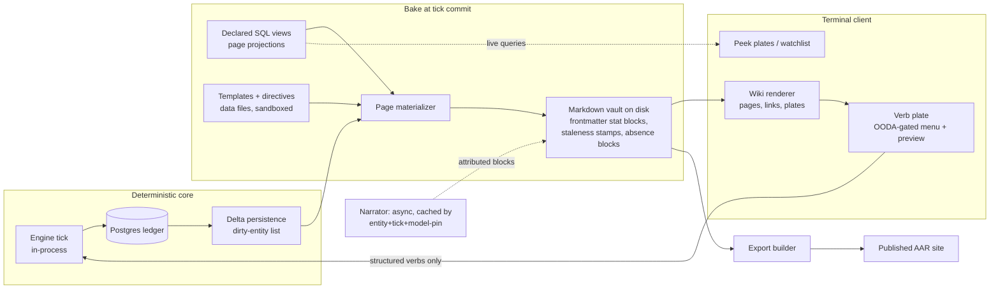

# The Archive Interface — wiki-as-gameplay terminal client (design brief)

**Provenance:** distilled from a design session between the BD and a Cowork Claude session, 2026-07-19, against `dev` @ `9d176612`. Items under **Owner rulings** are binding decisions the BD stated directly. Items under **Session synthesis** are the endorsed working design — treat them as the plan, and escalate to the BD if one proves wrong rather than silently deviating.

**Non-prescription clause:** this brief deliberately does **not** decide the tech stack. §7 lists binding *requirements* and advisory *candidates*. Evaluate candidates in the actual dev environment, spike them, and record the decisions in an ADR. Nothing in §7's candidate list is pre-ratified.

**Read before acting:** `CONSTITUTION.md` (v2.10.0), `CLAUDE.md`, `project/research/16-living-map/DESIGN_BIBLE.md` (§9b especially), `project/programs/12-cockpit.md`, `specs/089-delta-persistence/`, `docs/superpowers/specs/2026-07-18-hypergraph-rs-design.md`, `docs/reference/determinism-contract.rst`.

---

## 1. Vision

Babylon's interface is not a dashboard. It is **the Cadre Council's own files**: a wiki — the TUI/neovim answer to Obsidian, in the spirit of vimwiki — where every entity the organization knows about is a page, every relation is a link, and playing the game is reading, navigating, and acting on documents. The Trinity's third pillar is literally named The Archive; this makes it the thing you look at instead of a backend detail.

The loop: **read the Archive → form a theory → issue verbs through menus → the engine adjudicates → events revise the Archive.**

The terminal is the medium because the ratified aesthetic already lives there (§9b: Guix-installer chrome, ksbc palette, newt-dialog plates; Constitution VII.9 monospace-dominance becomes trivially true) and because a terminal enforces the correct interaction grammar: select a thing, issue a verb. Nothing is dragged; the substrate is never touched.

## 2. Owner rulings (binding)

- **R1 — Pivot.** The React web cockpit is superseded as the primary client. Program 12's Phase A data spine (spec-109) **survives untouched** and feeds this client; Phases B/C/D as specced are superseded; the pending A7 ruling is absorbed by this decision. (Note: Program 12's own diagnosis found the UI diseases were *not* React — a starving API, IA at war with canon, one bug. Phase A fixed the first. This pivot is argued on concept and medium, not on React having failed.)
- **R2 — Wiki is the gameplay metaphor.** Interface shape: TUI/neovim Obsidian — pages, wikilinks, backlinks, tags, fuzzy switcher, command palette; "the thing essentially becomes like vimwiki." Archive-first: maps and topology visualizations are page-embedded artifacts, not a primary canvas.
- **R3 — Point-and-click is required.** Full mouse support (click, hover, scroll) alongside modal/vim-style keyboard navigation. Neither is second-class.
- **R4 — No LLM in the input path.** The player acts through menus/buttons — "the TUI equivalent of a menu of buttons that's easy to click." The LLM adds **narrative flavor only** (style, uniqueness, personalization). Player free text exists only as flavor (naming, annotations, marginalia). There is no parse-to-verb pipeline in the core loop, and the game must be fully playable and fully informative with the narrator off.
- **R5 — The deterministic backend does the math.** Adjudication stays in the in-process engine (II.6: no DB I/O during tick). Postgres is the ledger of record and legitimately powers the **read side**: page projections as declared SQL views (the `v_hex_state_asof` family).
- **R6 — Pages are template-constructed.** Jinja-style template fill from Postgres-backed projections, plus a declarative directive vocabulary in the Sphinx *conceptual* family (directives/roles/domains mapping the ontology onto documents). Whether the Sphinx runtime itself appears anywhere is a stack decision (see §7 — suggested: concepts live, runtime only on the export path).
- **R7 — Victoria 3 nested views are canon.** Every noun is a link; views nest; the nested views are themselves wiki pages / the peek mechanism at different sizes.
- **R8 — Hypergraph shapes must render in the terminal.** The structures from the planned xgi Rust port (`hypergraph-rs`) need terminal-native visual idioms (see §5.6).

## 3. Session synthesis (endorsed design)

- **S1 — Vault-as-contract.** The Archive materializes as an actual on-disk markdown vault: one file per *known* entity, frontmatter as the deterministic stat block, wikilinks as edges. Regenerated from `observe()` projections; always regenerable; **never authoritative** (materialized view, not a second source of truth). Consequences: the fog boundary is literal (files that exist are what the org knows; red links are known-unknowns); the vault is git-versionable (revision history ≈ `git log`); publishing a campaign AAR = exporting the vault; any markdown tool (nvim/vimwiki, Obsidian, grep) is a degraded-but-working alternate viewer — II.8 client-disposability taken to its logical end.
- **S2 — In-process client.** The TUI consumes the same `observe()` projection contract as direct function calls — same shapes, no HTTP — collapsing the bridge seam for solo play. The Django estate demotes to optional transport; multiplayer/remote later is a *transport reinsertion*, not a rewrite. The discipline that keeps this honest: the client consumes projections only, never reaches into the graph.
- **S3 — Bake at tick commit.** The dirty-entity list from delta persistence (spec-089) drives incremental page materialization: projections → template fill → flat `.md` with values baked in and a `verified_tick` stamp. Regen cost tracks change volume, not world size. Live queries are reserved for ephemeral surfaces (peek plates, watchlists) that aren't vault pages.
- **S4 — Honest absence.** A projection that returns nothing renders an explicit absence block ("no record — not yet investigated"), reusing the `NoDataSentinel` idiom (`src/babylon/domain/economics/tensor.py`). Fog presentation and III.11 compliance are the same feature. Silence is loud.
- **S5 — Narrative layer with a byline.** LLM prose renders as an *attributed block* in a visually distinct register — provenance as typography; the reader can always tell ledger fact from narrator voice (II.5 enforced by stylesheet). Lazily rendered, cached by `(entity, tick, model_pin)` (III.6), persisted in the Archive store. Optional: condition the narrator persona on the player org's doctrine — same facts, different voice. Pages must be fully informative with this layer off.
- **S6 — The verb plate is a projection.** Select a target (node, edge, page) → a newt-style plate renders which of the nine Article V verbs are legal for that target type, gated by the org's OODA capacity this tick, costs shown, everything derived from the verb registry + GameDefines. Confirmation shows a deterministic consequence preview where computable (VII.8 feedforward). Investigate's three sub-verbs surface faithfully.
- **S7 — One peek mechanism.** A single `peek(entity, depth)` renderer producing a compact stat plate implements, at different sizes: Vic3 nested tooltips, Obsidian hover preview, page transclusion, and watchlist rows. Keyboard peek is first-class; mouse hover works but is never load-bearing. Navigation: Enter follows, jumplist (Ctrl-O/Ctrl-I) is the back-stack, breadcrumbs are the trail; pinned watchlist = a page of transclusions.
- **S8 — The Chronicle.** Tick bulletins as dated pages — the daily-notes idiom where the daily note *is* the tick. Event ledger as a browsable stream.
- **S9 — Topology idioms (no force-directed ports).** The wiki itself renders most hyperedges: a hyperedge is a community dossier page (roster, formation tick, overlaps); node pages list memberships; backlinks are incidence. Where geometry carries meaning: **PAOH** (nodes as rows, hyperedges as columns ordered by formation tick, membership dots joined by vertical segments — needs an *ordering*, not a layout, hence deterministic and snapshot-testable); **Levi/bipartite ego-trees** (matching hypergraph-rs's internal bipartite representation — the visualization walks the storage structure); **incidence/adjacency matrices** (making I.21's centrality/singleton/cutset targeting modes legible); a **map-room page** with choropleth at level-lattice tiers — cell-art (braille/half-block) as the portable floor, terminal raster graphics as progressive enhancement (the BD's terminal is Kitty).
- **S10 — `$EDITOR` escape hatch** for flavor-text authorship only (the git-commit idiom): hit edit on an annotation, write in real neovim, save back. Never for verbs.
- **S11 — Export path.** The same vault publishes to a static site for sharing campaign AARs. (Sphinx with a custom `babylon` domain is the natural candidate given existing docs infra — but that's a §7 decision.)

## 4. Constitutional constraints (map, not substitute — verify against `CONSTITUTION.md`)

- **II.8** — this pivot *is* the III.12 rewrite test exercised deliberately: the `observe()` contract is the durable spec; clients are disposable materializations. Governance item: propose a PATCH rewording II.8's "browser" to "client" (wording drift fix, no semantic change).
- **II.5 / R4** — AI parses/narrates only, made structural: no LLM in the input path at all.
- **II.6 / II.10** — no DB I/O during tick; the client reads projections; runtime writes stay where they are.
- **II.11** — page projections are **declared interfaces** (SQL views with contracts). The wiki is the most promiscuous cross-subsystem reader the project will ever have; it never touches another subsystem's tables raw. New views get table-ownership bookkeeping.
- **III.6** — narrative cache keys include the model pin; persisted prose survives model deprecation.
- **III.7 extended to renders** — vault generation is deterministic: every projection ends in an explicit `ORDER BY`; templates run sandboxed with wall-clock, randomness, and filesystem access forbidden (sim-time only); no dependence on unordered iteration.
- **III.11** — absence renders loud (S4). A template whose query fails must raise or render an alarm-marked block, never a plausible default.
- **III.12** — add a **golden-vault artifact**: materialize the Archive for a pinned scenario, byte-compare in CI alongside existing baselines. The presentation pipeline gets its own behavioral contract.
- **V** — nine verbs, atomic, always available; the verb plate is a faithful rendering of the registry, not a curated subset.
- **VII** — color-as-data with named tokens; §9b ksbc chrome + Cold Collapse data tokens; data-ink maximization; no decoration on data surfaces.
- **Amendment D caution** — hyperedge *rendering* is read-only presentation and safe; do **not** build affordances implying hyperedge mutation semantics while II.7 is `[TRANSITION STATE]`. The interface must not legislate ahead of the constitution.
- **Engine untouched** — this program should produce **zero** engine-value drift. `mise run qa:regression` stays byte-identical throughout; no rebaselines are sanctioned by this brief.

## 5. Architecture



A county page source should be boring — the intelligence lives in projections and the engine:

```jinja
---
entity: county/26163
verified_tick: {{ tick }}
---
# {{ county.name }} — Dossier

```{statblock} county/26163
projection: v_page_county
```

{{ table(county.rent_flows) }}
```{absence} no rent ledger — Investigate(Territory) to open one
```

```{narrative} cached:{{ tick }}:{{ model_pin }}
```
```

## 6. v1 surface inventory

Page pane (markdown + wikilinks + live stat blocks) · peek plates (S7) · verb plate (S6) · fuzzy switcher / command palette · Chronicle stream (S8) · topology surfaces: PAOH, ego-tree, incidence matrix, map room (S9) · watchlist page · epistemic search (`/` searches what the org knows — semantics to be specced).

## 7. Stack: requirements (binding) vs candidates (advisory)

**Any stack must provide:** full mouse + modal keyboard nav; deterministic, snapshot-testable rendering; a markdown-family vault readable by ordinary tools with graceful directive degradation in third-party viewers; in-process Python access to the engine and projections; theming to §9b tokens; works over ssh.

**Candidates to evaluate (verify in-env; decide in the ADR):**

- **Textual (+ Rich)** — mouse, CSS-like theming, SVG screenshot export (snapshot tests). Due diligence: Textualize-the-company wound down May 2025; the framework is author/community-maintained. Assess bus factor, pin versions, note the fork option (pure Python).
- **markdown-it-py** (already underneath Rich's Markdown) with MyST-style fenced directive plugins for `{statblock}` `{peek}` `{paoh}` `{absence}` `{narrative}` — Sphinx's *concepts* on a runtime-light parser. Fenced directives degrade to code blocks in Obsidian/nvim.
- **Jinja2 `SandboxedEnvironment`** for template fill. Templates are data files (the Paradox pattern) and double as the modding surface: modders get sandboxed templates + named projections, never SQL.
- **Terminal raster** (kitty graphics protocol / sixel) as progressive enhancement for the map room; braille/half-block cell art is the portable floor.
- **Sphinx** reserved for the export/publish path (custom `babylon` domain) — a whole-project static builder is the wrong shape for a per-tick renderer, and the right shape for AAR publishing.
- **hypergraph-rs** (once its phases land) as the ordering/projection provider for topology surfaces via its planned CLI/PyO3 surfaces; until then the existing Python xgi layer provides the same data. Either way the renderer consumes *orderings*, never force layouts.

## 8. What this keeps / supersedes

**Keeps:** Phase A data spine (spec-109) — it feeds the projections; all engine, persistence, delta, and defines work; the ratified design canon (§9b, Cold Collapse tokens).

**Supersedes:** Program 12 Phases B/C/D as specced; the pending A7 ruling. `src/frontend/` and `web/` are **not deleted by this brief** — they idle pending a cutover decision recorded in the program charter, with the test-port ledger discipline from the Phase D pattern applied at deletion time (behavioral knowledge in Playwright e2e migrates to projection contract tests + TUI snapshot tests + the golden vault; port the knowledge, not the tooling).

## 9. Delivery shape (per repo conventions)

1. **Brainstorm-to-spec cycle first**: program charter in `project/programs/` + ADR(s) in `ai/decisions/` (+ `index.yaml`). Stack decisions land in the ADR with in-env evidence.
2. A **thin throwaway feasibility spike is sanctioned** during spec-writing (scratch dir, never shipped): one materialized entity page, one verb plate, one nested peek, one PAOH on toy data, ksbc palette, snapshot screenshots. Its purpose is ADR evidence and a BD look at actual cells.
3. Then the full spec-kit flow (spec/plan/tasks) and TDD implementation. **No-MVP rule applies**: this brief is the plan floor; phases are ordered delivery of all of it, not cuts.
4. Governance items to raise with the BD early: II.8 wording PATCH; program number + codename; cutover criteria for the web estate; a DESIGN_BIBLE section for wiki-page anatomy (plate anatomy exists in §9b; page anatomy doesn't yet).
5. `CLAUDE.md` machine-safety rules apply throughout (single-flight heavy runs; parallel agents read-only; scoped `test:q`).

## 10. Open questions (resolve in spec; escalate rulings to the BD)

- Program + client codename (floated: The Archive, Iskra, Samizdat).
- Vault path/slug conventions (3,100 county pages; stable IDs vs readable names).
- Epistemic search semantics: what does `/` search when knowledge is fogged? Investigate-gated discovery?
- Watchlist/pin mechanics; jumplist depth; breadcrumb persistence across sessions.
- Narrator doctrine-conditioning (S5): in v1 scope or later unit?
- Multiplayer/remote posture — deferred by design (S2 makes it transport reinsertion); ssh serving?
- Fate of `/explain` (Program 17) and Observatory panes — absorb as Archive pages?
- Which level-lattice tiers get cell-art vs raster choropleths in the map room.

## 11. Kickoff checklist for the implementing session

1. Read the files listed at the top; confirm repo state (`git log --oneline -20`).
2. Draft the program charter + ADR skeleton citing this brief; separate R-items (binding) from S-items (endorsed, escalate-if-wrong) exactly as here.
3. Run the spike (§9.2); capture screenshots.
4. Bring to the BD: charter draft, spike evidence, stack ADR draft, and the §10 rulings list.
5. Only then: spec/plan/tasks and TDD build. Branch from `dev`; `mise run commit`; qa:regression byte-identical at every step.
