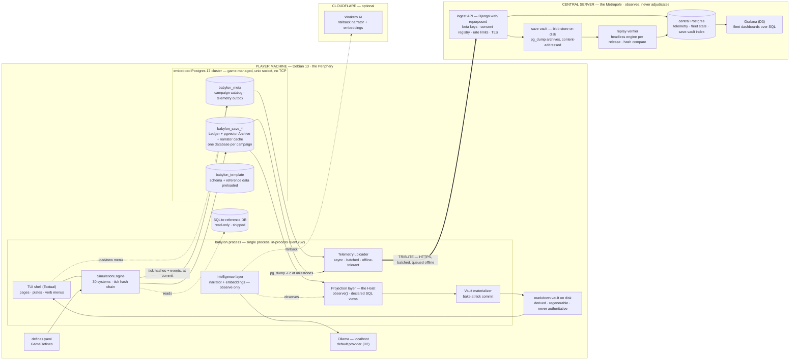
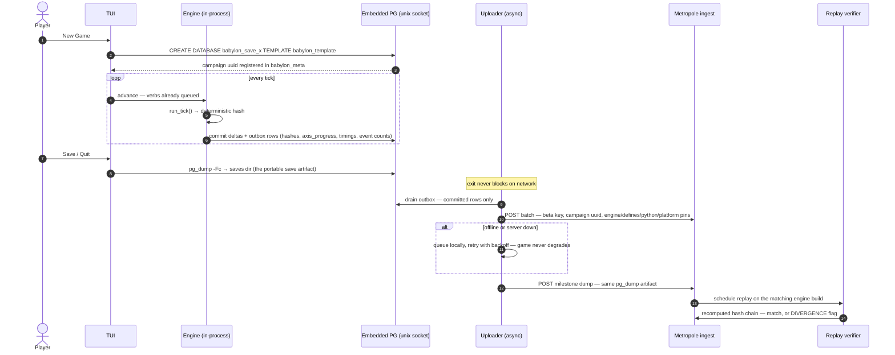

# Babylon — Local-First Infrastructure (the Periphery/Metropole split)

**Provenance:** distilled from a design session with the BD, 2026-07-19. Companion to `claude/2026-07-19-north-star-roadmap-v2.md` (the Archive pivot) and `claude/2026-07-19-archive-interface-design.md` (R1–R8/S1–S11). This doc answers the question those two deferred: *where does everything run once the client is a TUI?* Deployment decisions recorded here feed the **P0 stack ADR** — nothing here is ratified until it lands there with in-env evidence.

**BD decisions taken this session (binding for this doc):**

- **D1 — Game-managed embedded Postgres cluster** on the player machine (not a system service, not docker).
- **D2 — Ollama-first intelligence**, Cloudflare Workers AI as opt-in fallback, mute always legal.
- **D3 — Grafana + SQL** for fleet observability on the central server. The React estate still dies at cutover per the roadmap's P4 gate; it remains resurrectable from git if a bespoke observatory is ever wanted.

**Baseline platform ruling (BD):** Debian 13 (trixie) is the only supported target for beta. Windows via WSL2 as a documented workaround. Native Windows/macOS is the **2.0.0 "portability" release**, post-1.0 (§9).

---

## 0. The shape in one paragraph

The Archive pivot already collapsed the client into the engine process (S2: the TUI consumes `observe()` as function calls; Django demotes to optional transport). This doc extends that collapse to deployment: **the whole Trinity moves onto the player's machine.** Ledger, Topology, Archive, engine, vault, narrator — one process, one embedded Postgres cluster, one box. The central estate we built does not get discarded; it gets **repurposed and demoted to observer**: a telemetry/metadata/observability instrument plus a vault of contributed game data, participation in which is the price of a beta key. The metropole is subject to the same clause as the LLM — **it observes and narrates (dashboards are narration); it never adjudicates.** Nothing flows back down into a running game. Severing the WAN cable changes nothing about play.

## 1. System topology

The upload edge is labeled TRIBUTE because the ontology already had the correct word for a one-way flow of value from periphery to metropole. Unlike the in-game edge, this one is consensual, inspectable, and revocable (§5).

## 2. Session and telemetry flow

## 3. The player machine

### 3.1 The embedded cluster (D1)

First launch: `initdb` into `~/.local/share/babylon/pg/`, then spawn `postgres` as a **child process** bound to a unix socket in `$XDG_RUNTIME_DIR` with `listen_addresses=''`. No root, no systemd unit, no TCP port, no collision with any Postgres the player already runs, nothing to configure. The cluster lives and dies with the game (smart shutdown on exit; WAL makes crash exit safe). `babylon doctor` extends to check binaries, cluster health, and socket reachability — a cluster that cannot start is a **loud failure** with remediation text, never a silent fallback (III.11 extends to infrastructure).

Binaries come from the distro: trixie ships **postgresql-17** and **postgresql-17-pgvector** in main, so the `.deb` declares them as ordinary `Depends:` and never bundles a database. `CREATE EXTENSION vector` runs once in the template database. Pin the PG major (17) for the whole beta — replay parity on the metropole requires it (§4.3).

Dev/CI keep the existing docker-compose on 5433; players never see docker. **One guardrail worth adding to the P0 stack ADR now:** all connection handling reads a DSN from config and must work over unix sockets — no hardcoded `localhost:5433` anywhere in the keel, or the packaging train inherits a needless refactor.

### 3.2 Campaign = database (the "no lobbies" answer)

- **New game** = `CREATE DATABASE babylon_save_<slug> TEMPLATE babylon_template` — the template carries schema, migrations stamp, reference data, and a defines snapshot, so world creation is a file-level copy, near-instant.
- **Load game** = the catalog table in `babylon_meta` (uuid, slug, engine version, defines hash, last tick, last played) rendering as a menu. This *is* the roadmap P3 "lobby/briefing as vault-session management" item, reduced to its honest size: a load/new menu. Nothing multiplayer was ever hiding in it.
- **The portable save** = `pg_dump -Fc` of the campaign database. One artifact serves three masters: local backup, the file a player attaches to a bug report, and the milestone upload (§4.2). The BD's "nightly pg_dump is non-negotiable" instinct generalizes: pg_dump is now the save format.
- **Save-format migration becomes a public contract.** Once saves live on machines we don't control, Alembic migrations ship with the game and run on load (template stamped, campaign DBs migrated forward). Wiping the dev DB stops being an option the moment the first beta key goes out. This is the single biggest new obligation the pivot creates.

### 3.3 The vault stays derived

The markdown vault (S1) remains a materialized view of the campaign database — regenerable, never authoritative, never uploaded (the dump can rebuild it). Per-campaign vault dirs under `~/.local/share/babylon/vault/<slug>/`. AAR export (S11) stays a local/publish concern, orthogonal to telemetry.

### 3.4 The intelligence lane (D2)

One provider abstraction, three postures, strict order of precedence: **Ollama on localhost if present → Workers AI if the player configured a key → mute.** Mute is always legal — R4 already guarantees the game is fully playable and fully informative silent, so the network is *never* load-bearing for flavor. III.6 already solved multi-provider caching: prose is keyed by `(entity, tick, model_pin)`, so switching providers can never corrupt the record — it just writes new attributed blocks.

Embeddings need one extra discipline the narrator doesn't: **pgvector spaces are per-model.** The embedding model and its dimensionality are pinned per campaign at creation, recorded in campaign metadata; providers are never mixed within one campaign's Archive; changing the pin means re-embed or new campaign. Default pin should be a small local model served by Ollama so the Archive's semantic search works fully offline; name the actual model in the stack ADR, not here, and note Ollama is not in Debian main — it installs from upstream, and the game only ever auto-detects `localhost:11434`, never installs it.

**New behavioral contract, cheap and high-value:** tick hash chains are byte-identical across ollama/cloudflare/mute. The constitution asserts AI observes only; the fleet posture makes that *testable* — add it to the sentinel estate alongside the fog-containment gates.

### 3.5 Packaging

Primary channel: a small apt repo serving `babylon` (arch-dependent, the poetry-built wheel wrapped, `Depends: postgresql-17, postgresql-17-pgvector, python3`) and `babylon-data` (arch-independent: the SQLite reference DB, parquet reference outputs, templates, theme). The `data/`-symlink-to-external-trove pattern is a dev convenience that **does not ship** — players get a real payload, Debian-games style (cf. `0ad-data`). Fallback channel for non-Debian tinkerers: `pipx install` + `babylon doctor` telling them what system packages they owe. WSL2 note for the docs: unix sockets and Ollama-with-CUDA both work under WSL2; treat it as supported-but-second-class, bugs triaged behind native trixie.

## 4. The metropole

### 4.1 The ingest API — Django's new load-bearing purpose

The roadmap's cutover gate demotes `web/` to "whatever is verifiably load-bearing." This is what turns out to be load-bearing: a **thin DRF ingest surface** — issue/revoke beta keys, record consent, accept telemetry batches and dump uploads, enforce per-key rate limits and payload caps, sit behind caddy/nginx TLS. The 9,562-line engine-bridge monolith still gets hoisted per the keel plan; what survives in `web/` afterward is small, boring, and has nothing to do with gameplay. The infra wasn't wrong — its purpose inverted: it stops serving game state *down* and starts accepting observations *up*.

### 4.2 Data model

**Central Postgres** (the existing server): a `telemetry` schema — session rows (key, campaign uuid, engine semver, defines hash, python/platform pins, timings), tick-checkpoint rows (tick, hash, the 5-pattern `axis_progress` vector, event-class counts), crash rows (traceback fingerprint, pins, last checkpoint). A `fleet` schema for derived rollups Grafana reads. A `vault_index` for uploaded dumps.

**Dumps do not live in Postgres rows.** They land content-addressed on disk (sha256 path), indexed in `vault_index`; S3-compatible storage is a later swap if the fleet outgrows one box. Dumps default to `--exclude-table-data` on embedding-vector tables — vectors are big and recomputable from the pinned model + stored text; narrator prose ships (it is small and it *is* the record). Upload cadence: session end + recognized-pattern transitions + a config-set tick interval. Cadence lives in `config.toml [telemetry]`, **not** GameDefines — sim semantics and phone-home policy must never share a file.

Modded campaigns (edited defines.yaml) are welcome data: the defines hash won't match a stock release, the row gets flagged `modded`, and stock-balance dashboards filter it out rather than reject it.

### 4.3 The determinism dividend — the fleet as regression rig

This is the strategic payoff and the real reason telemetry earns its keep. Every tick already produces a deterministic hash; every player therefore runs a free instance of `qa:regression` against hardware and library permutations CI will never own. The **replay verifier** restores an uploaded dump (or, later, re-simulates seed + command stream) inside an **ephemeral container with a locked-down, non-superuser scratch cluster** — an uploaded dump is untrusted input; restoring one executes player-controlled DDL, so it is sandboxed like the hostile artifact it could be — using the *exact* engine build from the row's pins (one container image per release tag), recomputes the hash chain, and writes match/DIVERGENCE. A divergence is a nondeterminism bug found in the wild: platform float drift, iteration-order leak, version-skew in a dependency. The beta program quietly becomes distributed QA for invariant 1 of the north star.

Two standing implications: releases are container-imaged as a matter of course (the verifier needs the zoo), and the **Command Ledger's value just went up** — once verbs live in a ledger, replay inputs collapse to seed + commands, thin telemetry can verify without dumps, and dumps demote to divergence-debug artifacts. It is already first in the held engine queue; this is one more reason it stays there.

### 4.4 Observability (D3)

Grafana over the central DB, read-only role, zero bespoke code. Day-one boards: fleet composition (engine version × platform), tick-rate distributions (the `sim:pacing` instruments, now measured in the wild), **axis_progress distributions across the fleet** — what fraction of campaigns drift toward which of the five patterns by tick N is *the* balance instrument the recognizer ruling made possible — plus the divergence board and crash board. The Cold Collapse aesthetic loses nothing: Grafana is internal tooling; the crimson/gold estate lives in the TUI where players are.

## 5. The beta contract and the RMS tension

Name it honestly: **mandatory telemetry is not orthodox free software**, and hand-waving that would be beneath a project with a constitution. The resolution is the license/program distinction:

- **The license stays free.** Telemetry is an ordinary config flag in the FOSS tree. Anyone may build, run, study, and share a copy with it off. Freedoms 0–3 intact; nothing in the code is obfuscated, gated, or attested.
- **The beta program is a service with terms.** A beta key — access to the hosted ingest, the coordinated program, the support loop — is granted in exchange for running with telemetry on. Data-for-access, stated plainly in the beta agreement. Enforcement is **social and contractual (key revocation), never technical** — no DRM, no attestation, no phoning home as a launch precondition. The moment enforcement becomes cryptographic, the project crosses from telemetry into spyware and betrays its own §0.
- **Transparency is the load-bearing mitigation:** `babylon telemetry show` prints the pending outbox and the last transmitted payloads verbatim; the payload schema is documented in-repo; the uploader is ordinary readable source. Data collected is synthetic game state plus minimal machine metadata (pins, timings) — no personal data beyond the key linkage — with a stated retention policy and a delete-my-data path keyed by beta key.
- **Post-1.0, the default flips to opt-in.** The condition is a *beta* condition; writing that down now is what keeps it true later.

## 6. Constitutional posture

- **The metropole is an observer.** Same clause as the LLM (II.5 made infrastructural): it observes and narrates; it never adjudicates. No payload, response, or absence of response from the metropole may alter engine state. The engine never learns the network exists — the sibling of north-star invariant 1.
- **II.6 (no DB I/O during tick)** — outbox rows ride the existing tick-commit write alongside delta persistence (spec-089); network I/O never occurs in the tick path at all; the uploader reads committed rows from a separate process/thread.
- **III.11 (Loud Failure)** — partitioned correctly: a cluster that can't start, a template that can't clone, a migration that can't apply → loud, blocking, remediated. A network that can't be reached → quiet queue-and-retry. The sim fails loud; the tribute fails silent. Confusing these two would either mask corruption or make Wi-Fi a gameplay dependency.
- **III.6 (model pins)** — already provider-proof; D2 rides it unchanged. Embedding pins extend the same idea to vector space (§3.4).
- **III.7/III.12** — the hash chain and golden gates are what make §4.3 possible at all; the fleet is those contracts, deployed.

## 7. What survives, what changes

| Estate | Fate under this doc |
|---|---|
| Django `web/` | **Survives, inverted**: thin ingest API + key/consent registry. Gameplay-bridge role still exits via the keel's hoist; engine_bridge remains hoist source, not review target |
| React `src/frontend/` | **Unchanged from roadmap**: deleted at the P4 cutover gate (D3 chose Grafana); resurrectable from git as an internal observatory if ever wanted |
| Central Postgres server | **Survives, repurposed**: telemetry + fleet + vault index; her nightly pg_dump discipline now also covers contributed data |
| docker-compose PG :5433 | Dev/CI only; players get the embedded cluster (D1) |
| Ports 5432/5433 on player machines | Gone — unix socket, no TCP |
| Playwright e2e | Per the ratified cutover gate: behavioral knowledge ports to projection contracts + Pilot + golden vault; the tooling exits with the frontend |
| Cloudflare | Narrator/embedding fallback only (D2); never load-bearing |
| Lobby/briefing (roadmap P3) | Collapses to the load/new menu over the campaign catalog (§3.2) |

## 8. Sequencing and program fit

**None of this blocks the keel, and none of it should try.** The interleaving rule stands — Vol III U3–U8 to a clean boundary, then the Archive keel, at most one engine train + one Archive train. This doc's work sorts into three parcels:

1. **Now, costlessly:** the P0 stack ADR gains a deployment section — DSN-from-config, unix-socket support, PG 17 pin, provider-precedence order, campaign-uuid minting. Pure guardrail; prevents the keel baking in docker/port assumptions. One paragraph of ADR text.
2. **Metropole parcel [P]:** ingest API, telemetry schema, blob vault, Grafana, key issuance. Touches `web/` and new infra only — no engine, no client, no baselines. Rides as side tasks any time, like the flake/pg_dump items; genuinely parallel-safe by construction.
3. **Periphery parcel [S-heavy]:** cluster manager, template/catalog machinery, outbox writes at tick commit, uploader, Alembic-on-load, packaging. Touches persistence and the tick boundary → serial discipline, and it lands **after** the keel proves the projection loop (it provisions the substrate the keel assumes). Target: the packaging train the roadmap's §2.15 rewrite already anticipates, i.e. this parcel *is* "re-pose as packaging after cutover," now specified.

## 9. The 2.0.0 portability horizon

Deferred deliberately; recorded so it isn't re-derived: native Windows means the embedded-cluster pattern minus unix sockets (named pipes or loopback-with-auth; initdb-as-child works but is the fiddly part; EDB binary bundling replaces apt). macOS is the easy sibling (bundled binaries, launchd-free child process, same pattern). pglite (WASM Postgres) stays a watch item — single-connection and extension-limited today, wrong shape for pgvector + concurrent readers, worth re-checking yearly. textual-web / ssh-served sessions remain the roadmap's answer for zero-install demos — the metropole could host those without architectural change, because S2 made remote play a transport reinsertion, not a rewrite.

## 10. Additions to the BD decision queue

1. Ratify D1–D3 + the baseline-platform ruling into the P0 stack ADR (deployment section, §8.1).
2. Beta agreement text: data-for-access terms, retention window, delete-by-key. (§5 is the draft skeleton.)
3. Telemetry payload schema ADR — session/checkpoint/crash row shapes, dump exclusion list, cadence defaults.
4. Embedding model pin (per-campaign default) — fold into the stack ADR with the narrator pins.
5. Periphery/Metropole as the deployment-layer naming convention (cosmetic; pairs with the program codename ruling already queued).
6. Release containerization as standing practice (the verifier needs the version zoo) — cheap if adopted at the next tag, annoying retrofitted.

---

*Cross-checked against: roadmap v2 §§0–6 (cutover gate, interleaving rule, held queue), archive brief R1–R8/S1–S11 (S2 in-process client, S1 derived vault, R4 optional narrator), dev-head brief (30 systems, PG-on-5433 dev posture, nightly pg_dump, poetry, data/ symlink). Debian packaging facts verified against packages.debian.org (trixie: postgresql-17, postgresql-17-pgvector).*
