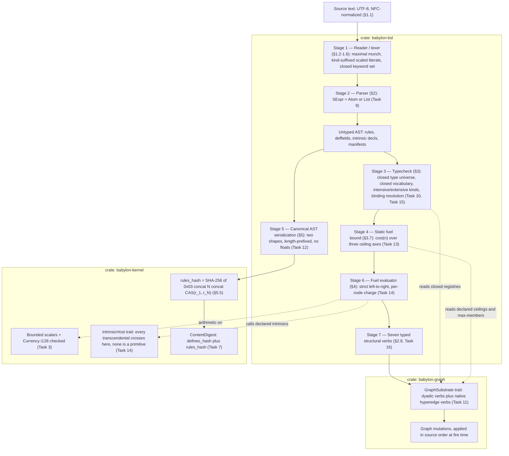
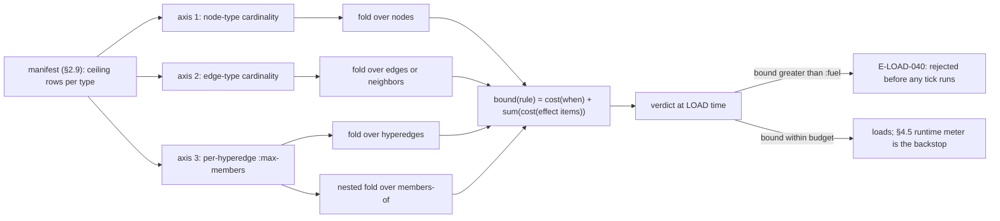
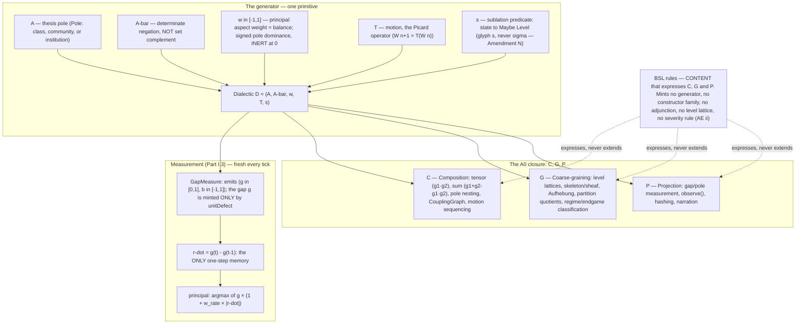
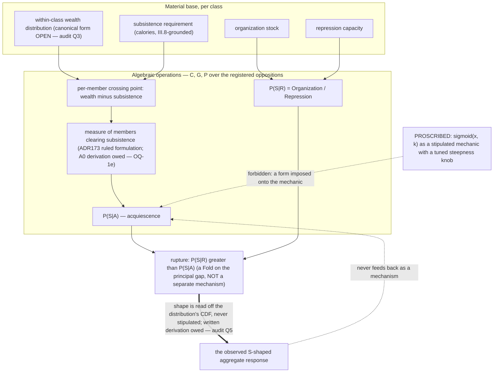
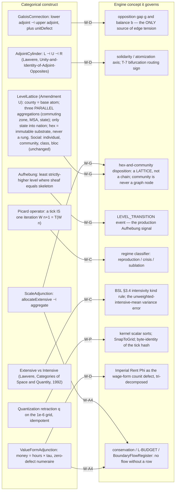
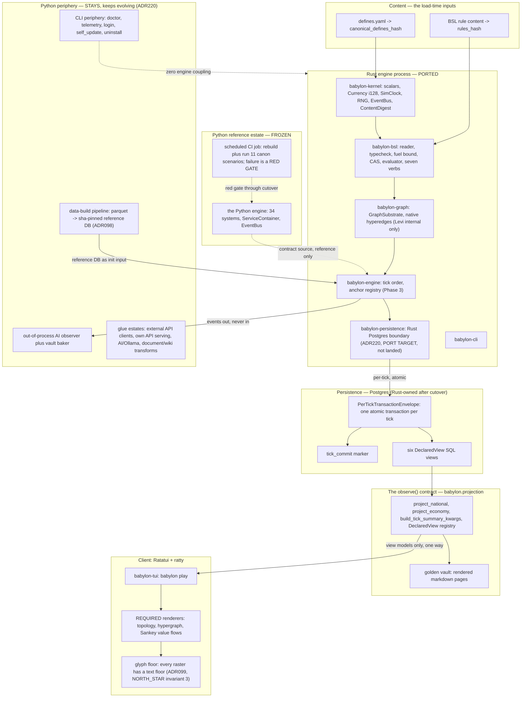

<!-- vale off -->

# The BSL Architecture Standard

*Program 27 · the diagrammed contract every Phase 1–4 implementation agent is held to.*

| Field | Value |
|---|---|
| Status | **Standard — binding on Program 27 Phase 1–4 implementation work.** Not a constitutional amendment; it confers no new authority and creates no new law. |
| Commissioned by | Director, 2026-07-29 (verbatim: *"an actual Mermaid-style chart that diagrams the entire flow of the grammar, the algebra, how it interacts with lawvere, its boundary seams with the actual api of the simulation engine … a kind of 'standard' you can hold yourself to"*). |
| Citation baseline | **`dev` @ `786893fc`** (2026-07-29, *Merge pull request #369 … docs/p27-ix1-step3-sweep*). Every `file:line` in this document resolves against that tree. |
| Supersedes | Nothing. Extends nothing. **Points at** the normative homes listed below. |

<!-- V4-BSL-ADDENDUM:START -->

## v4 governing addendum — 2026-08-22

This addendum controls current architecture and authority claims. The original
Program 27 investigation, diagrams, rulings, and evidence below remain the
historical record against their stated baseline.

### Status boundary

- v3/Amendment AE authority table status: historical
- S-4/S-5/S-22 vocabulary-amendment reading status: superseded
- S-11 whole-tick rollback status: implemented_current_PER-18
- S-25 renderer requirement status: retired
- S-32 writer assignment status: superseded
- D5/D16 phase-ordering status: implemented_executable_PER-17
- PER-18 rollback and combined-world-hash status: implemented_current
- PER-19 causal-composition and outcome-write-contract status: planned
- Persistence writer status: accepted_cutover_law
- PER-48 status: Done
- PostgreSQL boundary ADR: ADR220_rust_owned_postgresql_persistence_boundary
- Attributed membership identity status: implemented_current
- Attributed membership payload status: planned_research_PER-44

Constitution v4 governs the primitive as `D = (A, Ā, w, T, σ)`. The former
notation with `s` remains readable only as historical notation below. Article
VIII reserves constitutional amendments for new mathematics. New content
vocabulary instead uses its governed ceremony, schema, conformance evidence,
and ADR.

### Implemented current path

The Rust estate implements the BSL parser, vocabulary and type checking,
evaluator, canonical content digests, executable anchor placement, and graph
execution. Rule preparation compiles the frozen 34-system causal spine before
mutating caller state. Default homes come from the rule-ID namespace; explicit
anchors select governed boundaries; D16 orders only same-position ties by
rule-ID bytes. `TickSession` applies the ordered rules to a detached working
graph and buffers their events. It publishes graph state, allocator cursors,
events, and completed time only after every rule and both hash boundaries
succeed. Any failure leaves the prior in-memory world byte-identical.

The canonical graph hash remains a graph-only diagnostic. The version-1
nominal world hash adds the completed weekly tick, the node and hyperedge
allocator cursors, and the governed phase-schedule digest in a tagged,
big-endian layout. It covers every auxiliary Rust tick register that exists
today. It is not Gate 3's complete `TickContentHash` and does not claim durable
PostgreSQL publication.

The frozen Python estate's 34 systems, actions, resolvers, observers, and
persistence remain reference and port sources. They are not a prerequisite for
starting playable Rust slices. The Bevy client is an unfogged administrative
viewer; executable BSL shocks, executable player actions, and a player decision
loop are not current.

### Gate 2 delivery status

PER-17 has replaced the global byte sort with an executable phase-anchor total
order. Same-position rules remain sequential; their shared-prestate repair is
separate from placement. PER-18 has landed a whole-tick working copy that swaps
only after successful adjudication and extends canonical big-endian hashing
across current auxiliary registers into the nominal world hash. PER-19 owns
BSL causal composition, the provenance/direct-write whitelist, and negative
outcome-write contracts. Therefore, S-11 may cite in-memory rollback through
PER-18 and ADR223, but it cannot claim database durability or shared-prestate
composition.

### Durability and client boundary

The Ratatui glyph and renderer rule in S-25 is retired. Bevy is the current
client, but its player decision surfaces remain planned. Gate 3 owns the v4
`CommittedTickEnvelope`, transactional durability, Archive outbox and
materializer, and fog-safe Archive. PER-24 owns the executable
`DecisionSurfaceContract` at that gate.

S-32's indefinite Python writer assignment and any diagram that repeats it have
no live force. Graph, BSL, and tick adjudication remain database-free, and
durability begins after adjudication. PER-48 is Done;
`ADR220_rust_owned_postgresql_persistence_boundary` records the accepted
one-way cutover. Python remains the sole live PostgreSQL writer before that
cutover. Python migration and runtime-write entry points must be disabled before
Rust assumes game-managed PostgreSQL connections, migrations, the typed tick
transaction, hydration, H3 codecs, and compatibility views. Surviving Python
data-build, API, AI, document, and CLI roles remain. Transition observers may
read versioned views but cannot write or run DDL. This law does not claim that
PER-20 has implemented the cutover.

The current Rust graph carries base membership identity. Its attributed
membership payload is empty, absent from canonical hashing, unwritten, and
unconsumed. Payload production and consumption remain planned Research under
PER-44 until a named executable mechanic supplies the consumer and its tests.

### Slice and data policy

Each frozen system eventually receives exactly one disposition: `Port`,
`Adapt`, `Replace`, or `Retire`. Playable causal slices pull those decisions.
Kimi-derived data remains Research under PER-43 until a named mechanic names a
field consumer.

<!-- V4-BSL-ADDENDUM:END -->

---

## 1. Header and authority block

### 1.1 What this document is

This standard **diagrams and binds**. It does not restate law.

Every section below terminates in a pointer to the one document that owns the claim.
Where this standard and a normative home disagree, **the normative home wins and this
document is the bug**. That rule is itself the first thing an implementer is held to
(invariant **S-26**, §6).

Its job is the thing no single normative home does: showing the **whole path** — from a
byte of BSL source text, through the grammar, through the closed algebra it expresses,
through the Lawverian structure that algebra is built out of, out across the process
seams into the engine, the persistence envelope, and the client — as one picture, with
each stage's error surface and crate home named.

### 1.2 Authorities

| Authority | What it governs here | Where it lives |
|---|---|---|
| **Constitution v3.0.0** | All of it. Articles I–X + Amendments A–AE. | `CONSTITUTION.md` |
| **Amendment AE / ADR172** (ratified 2026-07-29) | Rust is the engine language; the formalism closure re-opens for **exactly one** additive construct (BSL) and for rider-recorded III.10 retirements; Amendment D resolved; v1.0 retargets to the Rust engine; clause (xi) renderer requirement. | `CONSTITUTION.md:639` |
| **Amendment D ruling — NATIVE HYPEREDGE** (2026-07-29, AE clause (vi), analysis §9, PR #353) | Hyperedges are first-class objects in `babylon-graph`'s exposed model and type system; membership is one typed hyperedge, never a clique expansion; Levi/incidence is sanctioned **internal storage only**. | `CONSTITUTION.md:436`, `CONSTITUTION.md:639`; `ai/_inbox/amendment-d-analysis-p27.md` |
| **The no-imposed-sigmoids theory line** (Director, 2026-07-29) | *"no functional form — sigmoid included — may be imposed on a mechanic; curve shapes must **emerge** from the algebraic operations."* | `NORTH_STAR.md:26-28`; recorded `ai/decisions/ADR172_amendment_ae_refoundation_ratified.yaml:44-49` |
| **BSL grammar — one normative home** | Lexis, grammar, typing, evaluation, fuel, and the canonical AST byte layout `rules_hash` is computed over. | `docs/reference/bsl-language.rst` (1755 lines on the baseline) |
| **The determinism contract — one normative home** | Tick hash field set, `defines_hash`, `ContentDigest` composition, RNG seeding. BSL explicitly does **not** restate these. | `docs/reference/determinism-contract.rst` (`bsl-language.rst:40-48`) |
| **The algebra — one normative home** | The generator 𝔇, the C/G/P constructor families, ontology, kinematics, dynamics, value calculus, extension theory. **Self-declared DRAFT v0.4, not ratified** (`ai/THE_FORMALISM.md:7`). | `ai/THE_FORMALISM.md` |
| **The rigor reference** | A GHC-typechecked Haskell re-encoding of the functional core: what "the export list is the constitutional boundary" and "the prohibition is an absence" look like when the type system carries them. **Draft, unratified.** | `ai/BabylonCoreDraft_2.hs` (945 lines), companion `ai/haskell-lawverian-core-draft.md` (279 lines) |
| **Phase plans** | The 18 Phase-1 tasks and their `**Interfaces:**` surfaces; the Phase-0 estate disposition. | `docs/superpowers/plans/2026-07-29-program-27-phase-1-language-and-kernel.md`; `reports/p27-estate-and-stops-disposition-2026-07-29.md` |
| **Wiring doctrine (ADR109)** | Connecting a built-but-dormant construct is a **typed motion** (W-C / W-𝔇 / W-G / W-P / W-A4), closed by a sentinel row. Used as the edge vocabulary of Diagram III. | `ai/wiring-doctrine.md` |

### 1.3 Provenance warning (read this before citing anything)

The citation baseline is `dev` @ `786893fc`. **The default local checkout may be behind it.**
At the time of writing, the working tree on `fix/p27-phi-hour-clamp` @ `7c8c63a5` carried
a `CONSTITUTION.md` at **v2.18.0 (Amendment AD)** — *without* Amendment AE — and a
`docs/reference/bsl-language.rst` of **1515 lines** — *without* the 2026-07-29
native-hyperedge revision. Both Amendment-AE-era artifacts are present on `dev`
(`git show dev:CONSTITUTION.md` matches "Amendment AE" 5×; `git show dev:docs/reference/bsl-language.rst | wc -l` = 1755).

Consequence for implementers: **`git fetch && git log dev` before you cite a line number.**
A stale worktree will make you cite the pre-AE constitution and get the hyperedge story
exactly wrong (see open question **OQ-2**).

Two further staleness facts an implementer must carry:

- `ai/THE_FORMALISM.md` and `ai/_inbox/math/metabolic-calculus.md` are pinned to commits
  roughly ten days before AE ratified. Their treatment of Amendment D (hyperedges reachable
  only through a `PoleBinding.community_id` indirection, "reconciliation stays pending",
  `THE_FORMALISM.md:230,1007`) is **STALE and wrong** as of 2026-07-29. Diagrams I and IV and
  invariant **S-8** carry the corrected reading.
- Both are self-declared drafts: *"Not ratified; confers no constitutional authority"*
  (`ai/THE_FORMALISM.md:7`; `ai/_inbox/math/metabolic-calculus.md:7`). They are the
  algebra's normative *home*, not the algebra's *ratification*.

**Citation path for the Haskell rigor reference.** The 945-line draft exists in **three
byte-identical copies** — `ai/BabylonCoreDraft_2.hs` and `docs/superpowers/specs/BabylonCoreDraft.hs`
(both tracked on the baseline, verified identical) plus an **untracked** local
`ai/_inbox/BabylonCoreDraft.hs`. This standard cites **`ai/BabylonCoreDraft_2.hs`** throughout,
because it is tracked and its line numbers are reproducible from the baseline tree. Do not
cite the `_inbox` copy — it will not exist in a fresh clone (**OQ-36**).

---

## 2. Diagram I — the grammar flow

**Normative home: `docs/reference/bsl-language.rst`.** This diagram is a map of that
document, not a substitute for it. Stage numbers below match its section numbers.

### 2.1 Source text to graph mutation



### 2.2 Error surface per stage

Every stage is **loud**. There is no warning level, no degraded mode, and no rule that
loads partially (`bsl-language.rst:756-758`).

| Stage | Error family | Fires at | Representative codes |
|---|---|---|---|
| 1 Reader | `E-LEX-0xx` | content load | `E-LEX-001` invalid UTF-8 / BOM; `E-LEX-002` non-NFC string; `E-LEX-003` maximal-munch run not classifiable; `E-LEX-020` `i64` overflow; `E-LEX-021` bare non-integer literal; `E-LEX-022/023/024` scaled-literal sign / scale / range; `E-LEX-025/026` string escape / length |
| 2 Parser | `E-PARSE-0xx` | content load | `E-PARSE-011` empty `:material-basis`; `E-PARSE-012` `:fuel` out of range; `E-PARSE-013` unrecognized keyword; `E-PARSE-020` empty `(when)`; `E-PARSE-021` `(and)`/`(or)`; `E-PARSE-022` shadowing `self`/`it`; `E-PARSE-030` duplicate binding; `E-PARSE-031` bare `:optional`; `E-PARSE-040` non-binary arithmetic |
| 3 Typecheck | `E-TYPE-0xx`, `E-LOAD-0xx` | content load | `E-TYPE-010` cross-node-type field read outside a fold; `E-TYPE-012` `it` outside a query; `E-TYPE-020` `if` branch type mismatch; `E-TYPE-030` illegal Currency-lane mix; `E-TYPE-040` `<arith>`/`if` kind-mixing rule (§3.4, D181, #491 T1 — a SEPARATE walk from the aggregation law below, not the same implementation); `E-TYPE-041/042/043` fold aggregation law; `E-LOAD-010/011` binding unresolved; `E-LOAD-020/021/022` intrinsic and deffield disagreement with the kernel; `E-LOAD-030/031` unknown enum type/member |
| 4 Fuel bound | `E-LOAD-04x` | content load | `E-LOAD-040` `bound(rule) > :fuel`; `E-LOAD-041` hydration exceeds a declared ceiling; `E-LOAD-042` manifest `:max-members` misuse / member list over ceiling |
| 5 CAS | *(total over well-typed ASTs; an unencodable value is a loud encoder failure with no registered E-code — see OQ-21)* | — | An unencodable value must fail loudly; `str()`-style fallbacks are banned outright (`bsl-language.rst:1307-1311`) |
| 6 Evaluator | `E-EVAL-0xx` | during a tick | `E-EVAL-010` Currency below zero; `E-EVAL-011` overflow; `E-EVAL-012` division by zero; `E-EVAL-013` coefficient out of `[0,1]`; `E-EVAL-014` non-finite binary64; `E-EVAL-020` store-boundary range violation (never a clamp); `E-EVAL-021` empty `mean`/`min`/`max`; `E-EVAL-040` fuel exhausted |
| 7 Verbs | `E-EVAL-03x` | during a tick | `E-EVAL-030` I.15 edge-mode transition violation; `E-EVAL-031` absence-is-never-success (remove nonexistent, add existing, duplicate member); `E-EVAL-032` `members-of`/`hyperedges-of` type mismatch |

**Blast radius rule.** A load-class error rejects **the whole content set** — no partial
load, no "skip the bad rule" mode. An eval-class error aborts the tick and rolls back the
**whole per-tick envelope transaction** — no partial commits (`bsl-language.rst:1134-1161`).
An implementation must not convert an evaluation error into a default value, a skipped
effect, or a log line (`bsl-language.rst:1160-1161`).

### 2.3 The three ceiling axes (why the fuel bound is static, not a trap)



The nested `members-of`-inside-`hyperedges` fold costs
`ceiling(T) × max-members(T) × cost(body)` — that is `Σ|members|`, **linear in the
incidence count, and never the `C(n,2)` a clique expansion would have cost**
(`bsl-language.rst:1019-1026`). This is the arithmetic reason Amendment D's native-hyperedge
ruling is a *fuel* ruling as well as an *ontology* ruling.

**Five cost rows are pinned by the Phase-0 cost model and are NOT draft rulings**
(`bsl-language.rst:990-994`): `cost(literal)=0`, `cost(variable-ref)=1`,
`cost(arith|cmp|bool)=1+Σchildren`, `cost(intrinsic call)=5+declared_cost+Σargs`,
`cost(fold)=2+cost(query)+ceiling(query)×(cost(body)+cost(weight))`. Every *other* cost row
in §3.7 is a draft ruling (register row **D14**) — see §7.

### 2.4 What the grammar cannot say (totality is syntactic)

Folds are the **only** iteration construct: no recursion, no `while`, no `loop`, no
user-defined functions (`bsl-language.rst:633-636`). No I/O, no time source but `:tick`, no
RNG primitive (kernel intrinsic only), no graph mutation outside the seven verbs, no
reflection, nothing unbounded (`bsl-language.rst:714-722`). No clique-expansion verb exists.

This is what makes **Power-of-10 Rule 2 a static property rather than a dynamic trap**
(`plans/…phase-1…md:2108-2115`).

**BSL's semantic category is FinSet-shaped, not Hask-shaped — there is no ⊥ (CT4P B6,
issue #525).** Milewski's *Category Theory for Programmers* Ch.2 §2.3: Haskell types form
`Hask`, not `Set`, precisely because ⊥ exists — a function may fail to terminate. BSL has no
such function: because evaluation is fuel-bounded and iteration is syntactically bounded (the
paragraph above), BSL functions are total on their declared domain in the strict sense — there
is no analogue of Haskell's ⊥, because non-termination is structurally excluded rather than
avoided by discipline. BSL's semantic category is closer to **FinSet** than to **Hask**. The
consequence is the reason **S-11** exists: with no ⊥ to stand in for "didn't finish," every
refusal must be an explicit typed return value with an E-code, never a silent default. This is
a naming exercise, not a new argument — the totality claim is already made structurally in this
section; Ch.2 only supplies the word for it.

### 2.5 Two accumulation structures, deliberately different (CT4P B1/B3, issue #525)

A query result and a collected write batch are governed by **different** algebraic
structures, on purpose — naming the difference is the whole answer to "why is one sorted
and deduplicated and the other not."

- **Query results are the free finite join-semilattice on element identity.**
  `GraphSubstrate::nodes`/`neighbors` contract ascending, deduplicated iteration
  (`babylon-graph/src/substrate.rs:151-181` — *"a set, so `:any` never yields a node
  twice"*), proved for every implementation by the reusable conformance suite
  (`babylon-graph/src/conformance.rs:28`, `run_substrate_conformance`;
  `nodes_edges_neighbors_hold_contractual_order_and_dedup` `:230`,
  `declared_order_never_leaks_through_any_ranged_accessor` `:446`). Order and multiplicity
  are **not data** — a canonical sorted-deduplicated form realizes the semilattice, and
  storage order is never observable (S-19).

- **The write batch collected each tick is the free monoid on writes.** `run_tick`'s
  `collect_pass` (`babylon-bsl/src/tick.rs`) collects every subject's `PendingWrite`s into
  one flat, subject-outer/source-inner `Vec`; order and multiplicity **are** data — a batch
  is list concatenation, not a set.

- **Application of that batch is NOT a fold in that monoid — it is a non-commutative
  monoid action.** `EffectExecutor::apply_pending_write`
  (`babylon-bsl/src/structural_verbs.rs`) reads the target's **current** value at APPLY time
  for `Add`/`Sub`/`Scale` (D-row Q2) — collect-time reading would make three subjects each
  adding to one carrier lose two of the three contributions. The batch acts on graph state
  as a sequence of **endomorphisms composed left-to-right**; `Add`/`Scale` do not commute,
  and reordering a batch changes the result even though the batch itself is unchanged. A
  future optimiser **may** re-chunk the collection phase (concatenation is associative) but
  **may not** reorder the application phase (the action is not commutative) — "monoid" alone
  would license exactly the reordering this distinction forbids. `PendingWrite`'s own doc
  carries the same statement.

Milewski Ch.13 §13.1 (free monoid), Ch.4 §4.1-4.3 (Writer/Kleisli), Ch.22 §22.2 (monoid in a
monoidal category), Ch.21 §21.2.2 (list/set nondeterminism) name the shapes; nothing here
mints new mathematics (S-4) — both structures already exist in the code, this only names
them so a future PR does not conflate them.

Optional half-sentence gloss (Ch.31 §31.1): the substrate carries **two** morphism-like
citizens over one object class — the strictly dyadic edge layer and the first-class
hyperedge/membership layer (Amendment D sub-ruling D-2) — the shape a double category
names. `substrate.rs`'s own module doc already argues this at length under "Two typed
halves, one substrate"; the name is free.

---

## 3. Diagram II — the algebra, and where curve shapes come from

**Normative home: `ai/THE_FORMALISM.md` (DRAFT v0.4, unratified — `:7`).**
**Governing constraint: Amendment AE clause (ii) — BSL expresses this algebra and mints
no new mathematics** (`CONSTITUTION.md:639`).

### 3.1 The generator and its closure



Citations: `𝔇`'s five components `ai/BabylonCoreDraft_2.hs:351-360`; `OppositionSpec`
and `GapMeasure` `THE_FORMALISM.md:92-97`; `ṙ` and per-tick `OppositionState`
`THE_FORMALISM.md:98-104`; principal-contradiction scoring `THE_FORMALISM.md:101` and
`ai/BabylonCoreDraft_2.hs:341-349`; C/G/P and Axiom A0 `THE_FORMALISM.md:123-175`; AE clause (ii)
`CONSTITUTION.md:639`.

**The tension-minting law.** `w` has exactly one constructor:
`unitDefect d gc x = d x (rightAdjoint gc (leftAdjoint gc x))`
(`ai/BabylonCoreDraft_2.hs:249-255`). Its comment is the law verbatim: *"Given a metric d on p,
the defect IS the tension. There is no other constructor of edge tension in the core:
tension cannot be invented, only measured."* Freshness (VIII.11): `g` and `b` are
re-measured from state each tick, never accumulated (`THE_FORMALISM.md:106`).

### 3.2 Emergence — where curve shapes come from, and where they do not

This is the load-bearing half of the diagram. **Read the arrow directions literally.**



**The direction that matters.** A sigmoid may be *observed at the output* of
`P(S|R) > P(S|A)` as a consequence of integrating a heterogeneous within-class wealth
distribution against a subsistence threshold. It may **never** be written into the mechanic
with a free steepness knob. `SurvivalDefines.steepness_k = 10.0` is described in-code as
*"Game design: sigmoid sharpness in acquiescence probability"* and has **no written
Aleksandrov chain** — the proscription audit's adversarial pass confirms the finding
survives every refutation avenue (`reports/p27-proscription-audit-2026-07-29.md:34`).

**Three facts an implementer must hold simultaneously, without collapsing them:**

1. The Director's ruling is settled: *"no functional form — sigmoid included — may be
   imposed on a mechanic; curve shapes must **emerge** from the algebraic operations"*
   (`NORTH_STAR.md:26-28`; `ai/decisions/ADR172_amendment_ae_refoundation_ratified.yaml:44-49`).
2. **The remediation reading is RULED for the survival family and ONLY for it** —
   **ADR173 ruling (1)** (Director interactive, 2026-07-29, post-baseline;
   `ai/decisions/ADR173_audit_and_stops_dispositions.yaml`): `P(S∣A)` is formulated as
   **the measure of class members whose wealth clears subsistence**; the S-curve is read
   off the within-class wealth distribution; `steepness_k` ceases to exist as a knob. The
   construct lands **Rust/BSL-only** — the frozen Python reference keeps its logistic *by
   design*, and Phase 1 Task 17's survival-family conformance vectors encode the emergent
   formulation, never Python replay (the plan's Task 17 ADR173 note, PR #372). Two
   obligations stay OPEN inside the ruled formulation: its **C/G/P derivation** under
   Axiom A0 has not been exhibited (a population measure is not among A0's enumerated
   G-members, `THE_FORMALISM.md:172` — **OQ-1e**), and the **canonical within-class
   distribution** is undecided (audit Q3).
3. For **every other confirmed site** — bifurcation `consciousness_sigmoid`,
   `reactionary.py`'s defection sigmoid, reserve-army wage pressure, the wealth-spring —
   the **posture is ruled by ADR175** ("Extend ADR173 treatment", Director 2026-07-29):
   the Python reference freezes as-is; each site receives an **emergent re-derivation
   from material operations at its Rust/BSL port**; each derivation is **presented to
   the Director per-family before it lands**. Curves appear in outputs, never stipulated
   in mechanisms. The posture closes the audit's reading-(a)-vs-(b) question; the
   per-family substance stays Director-gated
   (`ai/decisions/ADR175_emergence_extension_logging_phi_sign.yaml`).

**Standing instruction to Phase 1–4 agents: the survival family follows ADR173; every
other confirmed site follows ADR175 — no derivation lands without its per-family
Director review.** And know what Task 8 is: Phase-1 Task 8 is the
**transcendental-implementation Director gate** — polynomial approximation vs. pinned
deterministic libm, re-scoped by the plan's ADR173 note to open by enumerating the
post-audit *surviving* transcendental set. It does **not** produce the emergence reading
for the other families — that is ADR175's derive-at-port posture, and each family's
derivation review is its own gate (**OQ-1**, narrowed). Task 8
implements no intrinsic
(`plans/…phase-1…md:1164-1178`). BSL's posture is **determinism-correct and
emergence-silent**: `sigmoid` is never a language *primitive*, but it **is** a callable
named intrinsic with a pinned deterministic implementation
(`bsl-language.rst:611-617`, `plans/…phase-1…md:2326-2333`) — content may still call it
with a tuned steepness constant and violate S-7 while satisfying every determinism rule.
Emergence is a **content-side** obligation (S-7's proof column), not a language property.

**Live tension to flag rather than resolve.** `THE_FORMALISM.md:525-528` (T-6) still
states `P(S∣A) = Sigmoid(Wealth − Subsistence)` as a definitional form (`CLAUDE.md`'s
Mathematical Core carried the same form until its 2026-07-29 ADR173 annotation). ADR173
chose the ADR vehicle for the survival family's de-imposition; whether the un-ruled
families' de-imposition is a documentation correction, an ADR, or an amendment remains
open inside the audit (`reports/p27-proscription-audit-2026-07-29.md:307`). See **OQ-1b**.

---

## 4. Diagram III — the Lawvere interaction map

**Normative homes: `ai/THE_FORMALISM.md` (the algebra), `ai/BabylonCoreDraft_2.hs`
(the typed encoding), `ai/wiring-doctrine.md` (the motion vocabulary on the edges).**

Edge labels use the ADR109 wiring-doctrine motion classes: **W-C** dataflow, **W-𝔇**
opposition (written `W-D` inside the diagram — the fraktur 𝔇 is an astral-plane glyph
with poor SVG font coverage), **W-G** scale adjunction, **W-P** projection, **W-A4**
conservation closure.
A wiring PR without its sentinel row (or a blocking-dependency citation) is incomplete
(`ai/wiring-doctrine.md`, cited in `CLAUDE.md`).



### 4.1 What the encoding actually contains (and what it does not)

Stated precisely, because over-claiming Lawverian machinery is itself an Aleksandrov
failure:

- **Two named Lawvere citations exist in the entire draft estate**, and only two:
  *"Categories of Space and Quantity" (1992)* for the extensive/intensive split
  (`ai/BabylonCoreDraft_2.hs:167-168`), and *Unity-and-Identity-of-Adjoint-Opposites: L ⊣ U ⊣ R*
  for `AdjointCylinder` (`ai/BabylonCoreDraft_2.hs:257-258`). Everything else Lawverian in these
  documents is framed as *"the Lawverian layer (ADR051)"* without a further named paper.
- **No custom typeclasses.** The `class` keyword does not occur in `ai/BabylonCoreDraft_2.hs`.
  All categorical structure is plain records of functions plus GADTs (`SNodeKind`,
  `EdgeVerb`, `Step`, `Path`) and two closed type families (`NodeData`, `EdgePayload`).
  Whether that is deliberate Draft-0 scoping or a deferred generalization is **open**
  (**OQ-9**).
- **No limits, colimits, pullbacks, pushouts, categorical products/coproducts, or
  retractions appear anywhere** in the four draft documents. Reported as a negative finding,
  not assumed to exist elsewhere (**OQ-10**).
- **Lawvere-metric enrichment is structurally present but never named.** `unitDefect`'s
  `d :: p -> p -> Intensity` is exactly a metric-style map feeding an adjunction defect — the
  shape of Lawvere's 1973 `[0,∞]`-enriched-category framing — but the term never appears
  (**OQ-11**). The one place it *is* named is `ai/_inbox/math/metabolic-calculus.md:146-186`'s
  conversion quasi-metric `d(x,y) = -log(retention)` — which is **PROPOSED and unratified**,
  part of a draft "Material Triad" amendment carrying a **letter collision** with the already-
  ratified Amendment W (**OQ-12**).
- **§7's presented category of edge Modes** — five objects, generating `Step` morphisms, free
  category `Path`, with `organizingRoute :: Path 'Extractive 'Solidaristic` shipped as a
  **compiled proof term** `Then Formalize (Then Organize Here)` (`ai/BabylonCoreDraft_2.hs:626-649`)
  — is structurally adjacent to a Lawvere theory but is never labelled one (**OQ-13**).

### 4.2 The prohibitions that are *absences*, not runtime checks

This is the discipline Phase 1–4 carries from Haskell into Rust: a constitutional
prohibition realized as a **missing constructor** cannot be violated by a code path that
forgets to check.

| Prohibition | Authority | Realized as |
|---|---|---|
| EXTRACTIVE → SOLIDARISTIC without a TRANSACTIONAL intermediate | I.15 | No such `Step` generator exists (`ai/BabylonCoreDraft_2.hs:612-616`) |
| Dyadic reduction of an n-ary formation | VIII.9 | No exported arrow of type `CommunityId -> (Pole, Pole)` (`ai/BabylonCoreDraft_2.hs:308-310`) |
| Edges must be directed | I.14 | Inherent in every `EdgeVerb` constructor signature (`ai/BabylonCoreDraft_2.hs:369-370`) |
| Substrate immutability | I.20 / L-SUB | `HexState` and `AdjacencyV`'s `EdgePayload = ()` have no exported update arrows (`ai/BabylonCoreDraft_2.hs:421-422,508`) |
| Clique expansion of a hyperedge | VIII.9 + Amendment D | No BSL verb converts a member list into pairwise edges (`bsl-language.rst:714-722`) |

### 4.3 Known S-7 violation in the rigor reference itself

`ai/BabylonCoreDraft_2.hs:660,684,689-693` — `Defines.dSigmoidScale` (a free steepness
knob in the moddable-truth record), `sigmoidP13` (self-described *"THIS BODY IS A
PLACEHOLDER SHAPE"*), and `pSurvivalAcq d w = sigmoidP13 (k * (wealth − subsistence))` —
**impose the exact form S-7 proscribes**, in the artifact this standard bills as the
rigor reference. The draft's *structural* disciplines (export-list boundary, unforgeable
witnesses, prohibitions-as-absences) are what Phase 1–4 carries into Rust; its **§8
formula bodies are NOT portable**. For the survival family specifically, ADR173's
emergent formulation (§3.2 fact 2) replaces `pSurvivalAcq` outright; the remaining §8
bodies are frozen pending the OQ-1 reading. This site joins OQ-1c's enumeration.

---

## 5. Diagram IV — the boundary seams

**Normative homes: `reports/p27-estate-and-stops-disposition-2026-07-29.md` (the per-component
port/dies/stays ruling), `docs/superpowers/plans/2026-07-29-program-27-phase-1-language-and-kernel.md`
(the crate interfaces), `CONSTITUTION.md:639` (AE clauses i, iv, viii, ix, x, xi).**

Legend: **PORTED** = reproduced in Rust, ordering/bytes preserved · **FROZEN** = Python
reference estate at the `p27-python-freeze` executable pin, reference-only ·
**DIES** = not reproduced · **STAYS-PYTHON** = survives out of process.

<!-- vale ste.UnapprovedWords = NO -->
<!-- vale Vale.Spelling = NO -->
**The boundary criterion (ADR220, 2026-08-22):** ADR220 narrows only ADR174's Postgres
clause. Rust owns the calculation core and the authoritative engine-to-Postgres boundary.
The Postgres seam includes connections, migrations, committed-tick transactions, hydration,
H3 codecs, and compatibility views. It lives downstream in `babylon-persistence`. Database I/O
never enters tick calculation.

Python remains the **glue language** for deterministic data
builds, external API clients, API service, AI/Ollama, document and wiki work, and CLI periphery.
Transition observers can read versioned views but cannot write a game-managed schema. ADR174
otherwise stands. The `p27-python-freeze` tag still pins the **engine**, not Python's periphery.
<!-- vale ste.UnapprovedWords = YES -->
<!-- vale Vale.Spelling = YES -->

### 5.1 Process map



### 5.2 Seam table — what crosses, which way, what happens to it

| # | Seam | What crosses | Direction | Disposition | Citation |
|---|---|---|---|---|---|
| 1 | Tick entrypoint | `run_tick(graph, services, context) -> None`; 34 systems in derived position order | in-process | **PORTED** (ordering reproduced; the derived-order + duplicate-position `RuntimeError` must survive as a compile-time or equally loud load-time check) | `src/babylon/engine/simulation_engine.py:168-215,328-378` |
| 2 | DI container | `ServicesProtocol` (kernel Protocol) backed by `ServiceContainer` with ~84 `Any` slots | in-process | **NOT PORTED 1:1** — folds into a typed intrinsic table; *"reproducing it as `Option<Box<dyn Any>>` re-imports the type-erasure problem"* | `src/babylon/kernel/services.py:23-88`; `src/babylon/engine/services.py:151-459`; disposition `:24` |
| 3 | Event bus | `Event`, `EventBus`, `EventType` (**100 members**, verified) | in-process | **PORTED byte-for-byte** — registration-order dispatch, append-before-emit, stable-sorted interceptor chain, `ExceptionGroup` after full fan-out | `src/babylon/kernel/event_bus.py:32-288`; `src/babylon/models/enums/events.py:30-188`; disposition `:20` |
| 4 | Correlation id | per-tick `uuid4()` (log-only) | in-process | **REPLACED** by deterministic `SimClock::correlation_id()` = `{session_id}-{tick:010}` | `simulation_engine.py:195`; `plans/…phase-1…md:693-698` |
| 5 | Observers | legacy `SimulationObserver`, ad hoc `EndgameDetector.on_tick`, `TickCommitObserver` | in-process | **CONSOLIDATE to one hook point** — *"porting all three would be porting a bug"* | disposition `:21` |
| 6 | Session recorder | `SessionRecorder` (222 lines) | — | **DIES** — the real replay substrate is the envelope + commit marker | disposition `:22` |
| 7 | Endgame detection | 5 outcomes, re-evaluated every tick, never latching | in-process | **PORTED as BSL-expressible predicates**; priority order becomes conformance-corpus **data** | disposition `:23` |
| 8 | Tick partition | `TickPartition` (3 members) | in-process | **PORTED as-is**; mods use anchors | `src/babylon/kernel/tick_partition.py:18-30`; disposition `:26` |
| 9 | Content digest | `canonical_defines_hash` (JSON sort_keys, separators `,`/`:`, `ensure_ascii`, SHA-256, 64 hex, **no `default=` fallback**) + `rules_hash` | load-time, into the kernel | **PORTED** — byte layout must match exactly; `rules_hash` is `Option` only until Task 12 | `src/babylon/config/defines/_hash.py:18-26`; `plans/…phase-1…md:1082-1089,1991-1996` |
| 10 | Persistence envelope | `PerTickTransactionEnvelope` (frozen Pydantic, 64-char `replay_identity_hash`) | engine → Postgres, one transaction | **PORT TARGET** in downstream `babylon-persistence` (ADR220). Python remains the sole live writer until cutover. `tick_commit` follows the envelope rows. | `src/babylon/persistence/envelope.py:35-96`, ADR220 |
| 11 | `observe()` projection | `project_national`, `project_economy`, `build_tick_summary_kwargs`, `DeclaredView` registry (6 views) | persisted state → clients, **one way, no morphism back** | **PORTED / preserved** — Amendment V and II.8 untouched by AE (clause iv). **Port the contract, NOT the call graph:** the Python projectors call no gate (§5.4 row 1), so a faithful transcription ships an ungated projection | `projection/registry.py:41-303`, `projection/national.py:305`, `projection/economy.py:380`, `projection/tick_summary.py:214`; `THE_FORMALISM.md:717-719` |
| 12 | Client | view models only; clients never reach past `projection` into persistence | projection → client | **STAYS** (client-side v1.0 stops carry, AE clause ix); **renderers REQUIRED** for topology, hypergraph, Sankey (clause xi); glyph floor unchanged | `CONSTITUTION.md:639`; `projection/__init__.py:9-16` |
| 13 | AI observer | `SimulationEvent`s and projection view models | engine → observer, **never back** | **STAYS-PYTHON, out of process** — AE clause (iv) notes this *strengthens* the separation | `CONSTITUTION.md:639`; `simulation_engine.py:410-433` |
| 14 | CLI | none — zero engine coupling verified | — | **STAYS-PYTHON** | disposition `:28` |
| 15 | Composition root | `game/session.py` (1,897 lines) | — | **ABSORBED** into `babylon-engine` + `babylon-cli` — does *not* survive as Python periphery | disposition `:27` |
| 16 | `TickContext` | `extra="allow"` plus dict shims | in-process | **CENSUS THEN TYPE** — *"highest silent-breakage risk found"*; every stamped key becomes a first-class typed field | `src/babylon/engine/context.py:46`; disposition `:25` |
| 17 | Frozen engine | source + `flake.lock` rev + `uv.lock` + reference-DB sha + Postgres migration head | — | **FROZEN**; scheduled CI rebuild-and-run on the 11 canon scenarios through cutover, **failure is a red gate**; a mid-program fix needs Director sign-off plus contract re-extraction | `CONSTITUTION.md:639` clause (viii) |

### 5.3 Crate dependency order (Phase 1)

Tasks 1–2 gate everything. Task 3 depends on 1. Tasks 4–7 depend on 3 and are mutually
independent. Task 8 is the **Director gate** — no code dependency, blocks nothing except
entering the Task-18 exit checklist. Task 9 depends on 1–2; 10 on 9; 11 on 1 only; 12 on 7+9;
13 on 10+11; 14 on 13; 15 on 10; 16 on 11+14; 17 on everything 9–16; 18 last, additionally
gated on Task 8's ruling being **merged** (not implemented)
(`plans/…phase-1…md:3331-3347`).

**Machine-safety rider (binding, not advisory):** tasks 4–7 are parallel-safe for read-only
design work, but **`cargo build` and `cargo test` runs serialize** — single-flight, never
fanned out across agents (`plans/…phase-1…md:3333-3338`; `CLAUDE.md` machine-safety section).

---

### 5.4 Defects not to transcribe

Seams say what crosses. This says what the reference implementation gets
*wrong* — because §5.2's dispositions are read as "reproduce the Python
behaviour", and for these constructs that instruction would enshrine a defect
as a contract.

Director ruling, 2026-07-30: **do not repair these in Python; get them right in
Rust.** The frozen engine is the contract source for *structure and ordering*,
not a correctness oracle for the rows below. Repairing them in Python would
buy an 11-scenario `qa:regression` ceremony plus the separate golden-vault
estate to correct numbers the Rust engine reads straight from the reference DB.

Every row below was verified by hand at `b00b988d`, not inferred. Provenance:
the tech-debt census of 2026-07-30, `reports/tech-debt-ledger-2026-07-30.md`.

| # | Construct | What the reference implementation actually does | What Rust must do instead |
|---|---|---|---|
| 1 | **The gate layer** — `projection/fog/precedence.py:34` `apply_political_gates`, `projection/veil.py:193,273` `compute_veil_status` / `gate_value_axis_fields`, `projection/fog/filter.py` `apply_fog` | **Never runs on the shipping path.** `game/session.py` and every `projection/vault/render_*.py` contain ZERO references to any of the four. `apply_political_gates` has no production caller anywhere — not even the legacy bridge. Worse than unwired: `projection/vault/render_organization.py:38-47` declares a remedy dict stating `heat` / `consciousness_tendency` / `cohesion` / `cadre_level` require `Investigate(Organization)`, then prints all four at `:90-97` under `if … is not None`. **The file documents its own gating and does not gate.** | Gating is a **property of the projection boundary**, not a decoration a caller may forget. The port makes an ungated read *unexpressible* — the projector takes the reach/vision ledger as a required argument, so "forgot to gate" is a compile error rather than a silent leak. ADR182 R2 (structure public, magnitudes earned) is the content rule; this is its enforcement. Seam 15 absorbs `session.py` into Rust and seam 11 ports the projectors, so both call sites are already Rust-bound — there is nothing to retrofit in Python. |
| 2 | **Employment** — `domain/economics/tick/initializer.py:44,207` `_DEFAULT_EMPLOYMENT = 100_000.0` | **Not a fallback — the value.** `services.employment_source` is assigned at exactly ONE site tree-wide, `web/game/engine_bridge.py:7857` (the legacy bridge). `headless_runner/runner.py` wires `unemployment_source` and `wage_source` and **not** `employment_source`. Every canonical tick therefore divides by the literal. Two `sentinels/assumptions` rows wrongly describe it as conditional. | Read `fact_qcew_county_rollup`. Treat the frozen engine's wage / profit / exploitation-rate outputs as **unusable as oracle values** wherever employment is a denominator — the numbers are arithmetic on a constant. An Aleksandrov Test failure must not be promoted to a conformance vector. |
| 3 | **Housing / dispossession adapters** — `domain/economics/data_adapters.py`, `domain/economics/factory.py:454-464` | Hardcoded national dicts (6 housing rows; dispossession functions that accept a `fips` argument and discard it) stand in for `fact_census_rent` (44,997 rows) and `fact_foreclosure_rate` (6,570 per-county rows), which are present in the DB and unread. | Read the tables. **Do not port the `NoDataSentinel` returns as defects** — `_DefaultCountyRentalAdapter` returning `None` is the honest-null discipline working correctly. The debt is the unread table, never the sentinel. |
| 4 | **Fictitious capital** — `domain/economics/data_adapters.py:31` `Z1Loader._DEFAULT_DATA` | A hardcoded 7-year sample (2007, 2008, 2010, 2015, 2018, 2020, 2022) standing in for the Z.1 series. `NCBEILQ027S` sits in the reference DB unread. `sentinels/synthetic` — the family built for exactly this class — has no row for it. | Read the series. Add the `sentinels/synthetic` row in the same motion, so the gate that exists for this class can actually see this instance. |
| 5 | **The two finance models** — `models/entities/state_finance.py` and `models/entities/revolutionary_finance.py` | **One construct built twice.** `treasury`/`war_chest` is the same stock; `police_budget` + `social_reproduction_budget`/`operational_burn` the same per-tick spend; `tax_rate` + `tribute_income`/`dues_income` + `expropriation_income` + `donor_income` the same replenishment slot. Two vocabularies, one shape — which encodes the state and the movement as different KINDS of actor rather than as actors with different budgets. | **One `Capacity`, owned by an organization** (ADR184 R1/R3/R7). The allocation is identical for both sides and cannot tell a police budget from a strike fund; **the class difference lives entirely in replenishment** (R4). Do not port two models. `Organization` already carries `budget`, `violence_capacity`, `surveillance_capacity` — the owner exists. |
| 6 | **`RevolutionaryFinance.heat`** — `models/entities/revolutionary_finance.py:39` | `"heat: State attention level [0, 1]. Higher = more surveillance."` The indicted heat scalar, keyed to the movement's own conduct, living on the **movement's** finance model — the exact object the L/K/X split was built to replace, in the exact place that makes repression a consequence of illegality rather than of what the state can see and afford. | **Do not transcribe the field at all.** What the state knows is `Dossier` (L, `babylon-graph/src/dossier.rs`); what it can spend is `Capacity` (K); what a target is worth is derived `exposure` (X). There is no scalar to carry over. ADR184 R6. |

Two classes are **out of scope here on purpose.** Constructs that are merely
inert in the frozen engine (`TopologyMonitor`, `BifurcationMonitor` and the
`domain/bifurcation/resilience.py` chain they gate, the ⊗/⊕ combinators at
`domain/dialectics/core/composition.py:57,100` — verified: re-exported,
property-tested, and invoked by none of the 19 registered `OppositionSpec`s)
are a **transcription** question, not a defect: they compute nothing wrong,
they compute nothing at all. They carry forward on their merits, and the ⊗/⊕
pair carries with priority — it is the closed algebra BSL expresses and ADR172
mints no new mathematics. Constructs the port will delete need no disposition
at all.

## 6. The Standard

Thirty-two numbered invariants. Each row states the invariant, its authority, and **how an
implementer proves compliance** — a test, gate, or sentinel, not an assertion. A Phase 1–4
PR is incomplete if it touches a row's subject matter and cannot point at the proof.

| # | Invariant | Authority | Proof of compliance |
|---|---|---|---|
| **S-1** | Every tick produces a deterministic hash. Same `(Σ₀, θ, action log)` ⟹ same orbit and hash chain. Non-determinism is a bug. | III.7; T-5 `THE_FORMALISM.md:729-731` | `mise run qa:regression` byte-identical (11 scenarios + no-dead-columns + in-gate two-process determinism leg); `mise run qa:vault-regression-ci` |
| **S-2** | Byte-identity is **intra-implementation only**. Cross-implementation equality is tolerance-bounded `≈_τ` with a written derivation. | III.12(b) / Amendment Q; `THE_FORMALISM.md:733`; `ai/BabylonCoreDraft_2.hs:130-133` | A declared tolerance policy per cross-implementation check; the Rust↔frozen-Python hybrid correctness bar (R3) |
| **S-3** | Every loop has a statically provable bound. BSL has no recursion, no `while`, no user functions; folds are the only iteration. `bound(rule) > :fuel` is rejected **at load**. | Power-of-10 Rule 2; `bsl-language.rst:633-636,1028-1029` | `E-LOAD-040` vector; the Fuel required vector family (`bsl-language.rst:1467-1494` family 5); `:fuel-used` mandatory on every non-error vector |
| **S-4** | **BSL mints no new mathematics** — no new generator, no new constructor family (C/G/P stand), no new adjunction, no new level lattice, no new severity rule. | Amendment AE clause (ii), `CONSTITUTION.md:639` | Every BSL construct in a PR maps to an existing C/G/P term; a construct that does not is an **amendment**, not a feature |
| **S-5** | A III.10 Earn-Its-Keep retirement is **not sign-off-only** — each is recorded as a rider to Amendment AE enumerating the retired construct. | AE clause (iii), `CONSTITUTION.md:639` | The rider exists in the amendment text before the removal merges |
| **S-6** | Every formal construct traces a chain back to a **material relation**. Ungrounded operators are banned regardless of elegance. | III.8 Aleksandrov Test, `CONSTITUTION.md:442` | A written derivation chain in the PR; `III.10` rent tag; a coefficient without a named material process is a red gate |
| **S-7** | **No functional form may be imposed on a mechanic.** Curve shapes emerge from the algebraic operations; a sigmoid is a *result*, never a stipulated mechanism with a tuned steepness knob. | Director ruling 2026-07-29, `NORTH_STAR.md:26-28`; `ai/decisions/ADR172_amendment_ae_refoundation_ratified.yaml:44-49` | Intrinsic-vs-primitive status is a **determinism** property and proves nothing about emergence — `sigmoid` **is** a callable named intrinsic (`bsl-language.rst:611-615`). The emergence proof is a **content-side** obligation: every rule invoking a transcendental exhibits a written derivation of the form from the algebraic operations (III.8 chain), and any steepness/scale operand sourced from a feel-tier define is a red gate. Survival family: vectors encode the ADR173 emergent formulation (§3.2 fact 2). **No automated check exists yet — declared debt under §6.1.2; each non-survival family additionally requires its ADR175 per-family derivation review before landing.** |
| **S-8** | Hyperedges are **first-class** in `babylon-graph`'s exposed model and type system. Levi/incidence is **internal storage only** and must be unobservable. | Amendment D ruling / AE clause (vi), `CONSTITUTION.md:436,639` | `GraphSubstrate`'s hyperedge verbs (`plans/…phase-1…md:1619-1628`); Hyperedge vector family incl. the descending-id hydration vector proving declared member order is unobservable (`bsl-language.rst:1467-1494`) |
| **S-9** | **No clique expansion.** No verb converts a member list into pairwise edges; the combinatorial object VIII.9 bans has no BSL representation. | VIII.9 + Amendment D sub-ruling D-1; `bsl-language.rst:714-722` | Absence of the verb (structural); the `Σ∣members∣` fuel-bound vector (`bsl-language.rst:1019-1026`) |
| **S-10** | Membership change is **whole-hyperedge replacement** — `remove-hyperedge` then `add-hyperedge` in one effect list. No `add-member`/`remove-member`/`update-hyperedge`. | `bsl-language.rst:688-697`; `plans/…phase-1…md:2812-2828` | Absence of the verbs; a partially-mutated hyperedge is unrepresentable |
| **S-11** | **Loud Failure.** No warning level, no degraded mode. Load errors reject the whole content set; eval errors abort the tick and roll back the whole envelope. An error is never converted to a default, a skipped effect, or a log line. | III.11; `bsl-language.rst:756-758,1134-1161` | Accept/reject vector pair per E-code; `PerTickTransactionEnvelope` transaction rollback test |
| **S-12** | **Absence over fabrication.** Measures are partial maps; nothing totalizes a missing reading with a default. `:optional` requires `:default` and there is no `bound?` predicate. | L-ABS `THE_FORMALISM.md:249`; ADR070; `bsl-language.rst:939-948` | `E-LOAD-010`; the migration-corpus allowlist (every `:default` allowlisted, else lint failure requiring Director sign-off) |
| **S-13** | `Currency` is **i128 micro-units with `checked_*` arithmetic**; overflow is a loud failure, never wrapping, never saturating. Only four operators mix Currency with anything else. | `bsl-language.rst:810-847`; `plans/…phase-1…md:334-340` | Currency-operator vector family covering every table row, both overflow ends, half-even ties in both directions, and the i256 intermediate width |
| **S-14** | **Two numeric lanes never mix implicitly**, and **no floating-point value is ever serialized** — there is no binary64 in CAS and therefore no float-formatting ambiguity in the hash path. | `bsl-language.rst:852-856,1307-1311` | `E-TYPE-030` vectors; CAS vector per form tag and atom kind |
| **S-15** | Binary64 is **IEEE-754 basic operations only**, correctly rounded round-to-nearest-even. **No FMA contraction** (a contracting implementation is non-conforming). Non-finite results are unrepresentable (`E-EVAL-014`). | `bsl-language.rst:1073-1091` | Determinism vector family (full set replayed twice in-process + once fresh, byte-identical) |
| **S-16** | **Kind is a property of the field, not the scalar type.** An unweighted mean of an intensive field is a type error, not a runtime surprise. | `bsl-language.rst:868-928`; Lawvere extensive/intensive `ai/BabylonCoreDraft_2.hs:167-168` | `E-TYPE-041/042/043` vectors; the Kind-rule required family (5 rows, accept + reject); the `EXTENSIVE_INTENSIVE_EXEMPTIONS` ledger is itself content inside `rules_hash` |
| **S-17** | **Gaps are measured, never accumulated.** `g` and `b` re-measure from state each tick; only `ṙ` carries one-step memory, by definition. | VIII.11; `THE_FORMALISM.md:106`; `ai/BabylonCoreDraft_2.hs:114-115,320-321` | I-FRESH invariant; a `+=` on a gap register is a red gate |
| **S-18** | The **spatial substrate is immutable**: every admissible motion is the identity on `H` (hex + county). Political claims are overlays. | L-SUB `THE_FORMALISM.md:231`; `ai/BabylonCoreDraft_2.hs:421-427` | I-SUB invariant; absence of substrate-write verbs |
| **S-19** | **Order is structure.** Insertion-ordered adjacency (nx merge semantics), ascending byte-order query iteration, source-order effect application, ascending rule-id evaluation at one anchor. Storage order is never observable. | III.7; ADR052; `bsl-language.rst:573-584,702-712,1062-1071`; `ai/BabylonCoreDraft_2.hs:926-937` | `law_insertionOrder` property + the ported nx differential oracle; Hyperedge iteration-order vectors |
| **S-20** | **The public surface is the constitutional boundary.** What is `pub` is what callers may construct. A discipline claimed in prose but not enforced by the type system is a defect, not a boundary. | `ai/BabylonCoreDraft_2.hs:21-23,26-78`; carried to Rust `pub` surfaces by this standard | A Rust API-surface review per crate; note the Haskell draft's own asymmetry (`Fold`, `Chronicle`, `Violation`, `KernelViolation` exported *with* constructors while `World`/`Material`/witnesses are not) is a **known gap to not reproduce** (**OQ-8**) |
| **S-21** | **Witnesses are unforgeable.** `requireMembership` / `requirePresence` / `requireSolidarity` are the only mints for their witness types; a verb without its witness is unexecutable, not merely unchecked. | I.16/I.21; `ai/BabylonCoreDraft_2.hs:848-865,715-724` | Constructor privacy (module-private in Rust); a verb path that fabricates a witness is a red gate |
| **S-22** | **Closed vocabulary.** Enum types, node/edge/hyperedge types, event types, field names, metric names, intrinsic names are all closed registries. An unregistered name is a load error, never a fallback. Adding a member is **amendment territory, not modding territory**. | `bsl-language.rst:950-959`; `E-PARSE-013` `:340-342` | `E-LOAD-030/031`, `E-LOAD-020/021/022` vectors; `mise run check:vocabulary` (3 rules, `src/babylon/sentinels/vocabulary/`) |
| **S-23** | `Obs: 𝒮 → Proj` is **one-way**. The algebra contains no morphism `Proj → 𝒮`. Fog is epistemic and stays out of the tick hash. | II.8 / Amendment V; `THE_FORMALISM.md:717-723` | `mise run lint:imports` (`babylon.projection` never imports `babylon.engine`); the tick hash is blind to the projection lane |
| **S-24** | **The engine adjudicates; AI narrates; clients render.** No exceptions without an amendment. Survives AE verbatim, rebound to the Rust kernel. | NORTH_STAR invariant 2; AE clause (iv), `CONSTITUTION.md:639` | The AI observer runs **out of process**, consumes events and view models, and has no write path |
| **S-25** | The client **MUST** render topology, hypergraph structures, and Sankey value flows via Ratatui (ratty sanctioned for the 3D tier) — **and** every raster has a text floor; the game is fully playable glyph-only over ssh. | AE clause (xi), `CONSTITUTION.md:639`; ADR099; NORTH_STAR invariant 3 | A renderer without its glyph fallback fails the clause; neither ratatui nor ratty may enter `hypergraph-rs`'s dependency graph (AC (vi)) |
| **S-26** | **One normative home per contract.** BSL owns lexis/grammar/typing/evaluation/fuel/CAS; the determinism contract owns tick hash, `defines_hash`, `ContentDigest` composition. Neither restates the other. | `bsl-language.rst:40-48` | A PR that duplicates a normative claim across homes is a docs defect; this standard points, it does not restate |
| **S-27** | **Conservation closes.** `L-BUDGET(Q)` holds per tick; `creates_value` is a conservation claim; **no flow without a row** in the `BoundaryFlowRegister`. | `THE_FORMALISM.md:497-509,614`; L-VAL-1..8 + INV-001 `:661-677` | The conservation auditor + `A4` invariant/budget completion; note finding **F-1** (silent skip on missing `session_id`) is an open disarmed guardrail (**OQ-7**) |
| **S-28** | Every motion **declares its footprint** `ε(S) = ⟨R(S); W(S)⟩`; denotation depends only on the conflict-DAG restriction, and conflict edges never cross MATERIAL_BASE → ACTION → CONSEQUENCE backward. | T-1/T-3/T-4 `THE_FORMALISM.md:263-283` | The A1 footprint manifest + A2 ordering audit — **both PROPOSED, not shipped** (`THE_FORMALISM.md:832-905`); until shipped, the derived-position + partition-coverage `RuntimeError`s are the live proof (`simulation_engine.py:365-372,397-405`) |
| **S-29** | **Ceremony before drift.** A baseline change is a declared ceremony with a `Baselines: blessed(<slug>)` trailer and a drift table; a cost-model or expectation change is a **vector re-bless**; expectations are eyeballed before blessing and never captured from a run under test. | §6.5 owner ruling; `bsl-language.rst:1456-1462,1580-1585` (F1–F4) | `tools/check_baseline_ceremony.py`; the commit-msg + pre-push + CI three-way gate; `:fuel-used` on every non-error vector |
| **S-30** | **No ungrounded tensors.** The operator algebra is the source of truth; graph authoring and sparse matrix layers are interfaces and must remain separable. Never implement operator logic in the graph layer. | II.12 `CONSTITUTION.md:454`; III.8 | `L-EQUIV` relabeling-equivariance property (`THE_FORMALISM.md:442`, proposed); the three-layer separation is reviewable per PR |
| **S-31** | **Every construct earns its keep.** A construct introduced in a Phase 1–4 PR carries a ⟦COMP⟧/⟦LAW⟧/⟦PRED⟧ rent tag with its file or test cited; an untaggable construct is vocabulary and does not ship. Over-claiming Lawverian machinery is itself an Aleksandrov failure (§4.1). | III.10; ADR051; `THE_FORMALISM.md:52-58`; `ai/BabylonCoreDraft_2.hs:17-19` | The tag appears in the PR body and in the construct's docstring/comment |
| **S-32** | **Rust owns math and the authoritative engine-to-Postgres seam.** `babylon-persistence` is downstream of the pure tick. Python owns data builds, external API clients, AI/Ollama, documents, wiki, and CLI periphery. Observers only read. | ADR220 (narrows ADR174's Postgres clause), `ai/decisions/ADR220_rust_owned_postgresql_persistence_boundary.yaml` | A Postgres dependency in `babylon-tick`, a Python schema write after cutover, dual migration authority, or hot-path Python math fails S-32. |

### 6.1 How to use this table

1. Before writing code, find the rows your change touches.
2. If a row's proof does not yet exist (S-28's A1/A2, S-30's L-EQUIV), say so in the PR and
   cite this row — **declared debt is legal, silent debt is not** (NORTH_STAR invariant 5).
3. If a task requires violating a row, **STOP and escalate** — to an amendment or to the
   Director. Do not improvise around it (`CLAUDE.md` Constitutional Compact, escalation clause).

### 6.2 Pattern: the carrier-node idiom (ADR198 R6)

**Status.** Blessed as the standard graph-scope idiom by Director ruling — ADR198 R6
(2026-08-12, `ai/decisions/ADR198_program29_substrate_widening_charter.yaml`), Program 29
issue #558 (train T1). The construct itself is `bsl-language.rst`'s R9 chapter-C3
**[draft ruling — Phase 1 review]**, embedded in "3.6 Closed vocabulary" (`:2650-2688` on the
current tree). That draft-ruling status is language-law bookkeeping (§7.4's sense — "not yet
a settled law"), not a doubt about ADR198: the Director's ruling binds Program 29 content to
this model, and that binding stands independently of where the grammar's own paperwork sits.
Every `bsl-language.rst`/Rust citation below was re-verified against the current tree while
writing this section (2026-08-12) rather than trusted from the survey — §1.3's provenance
warning applies to this subsection's own citations exactly as it does to the rest of the
document.

**What the carrier is.** A value of graph scope — one number the whole graph agrees on, not a
per-node reading — becomes an ordinary `deffield` owned by a **carrier node type**: a
`NodeType` member whose manifest declares `(ceiling NodeType/<NAME> :ceiling 1 …)` (§2.9/§3.7
grammar, `<ceiling> ::= "(" "ceiling" <enum-ref> ":ceiling" <int-lit> …`, `manifest.rs:6-8`).
Content reads it with `(field-of (the NodeType/<NAME>) <qname>)` and writes it with
`(update-node (the NodeType/<NAME>) <qname> (<op> <expr>))` — the same `field-of`/`update-node`
grammar every other node field already uses (§2.10, §2.8). `the` (§2.10, R9 chapter C3) is the
one new accessor: `(the <NodeType-ref>)` resolves to the `NodeRef` of that type's unique node,
legal only when the manifest's declared ceiling for the type is exactly 1. The ruling text is
explicit that this "adds no new grammar and no new storage class" (`bsl-language.rst:2662-2663`)
— the engine hashes, iterates, bounds and inspects a carrier field exactly as any other node
field (`:2666-2669`).

Three shapes can touch a carrier, and only the first tick-executes today:

1. **The carrier-anchored rule — the shape that runs on landed Slice 1.** Give the rule at
   least one `:field` binding in the carrier's *own* namespace. `subject_type_of`
   (`tick.rs:159-182`) derives a rule's subject type purely from its `:field` bindings' shared
   namespace, so a rule whose only `:field` binding names, say, `national-economy/credit-overhang`
   derives `subject_type = NodeType/NATIONAL_ECONOMY`; `graph.nodes(&subject_type)`
   (`tick.rs:536-538`) then enumerates the carrier's one hydrated node — one because the scenario
   hydrated one, which the declared `:ceiling 1` row asserts but does not yet enforce (see "The
   ceiling law," below) — so the rule fires once per tick, reading/writing `self`. No `the`, no
   `(domain :graph)`. This is the discharge mechanism the survey names by citation: *"servable
   on landed Slice 1, with no `the` and no Slice 2, via a `:ceiling 1` carrier `NodeType`
   anchored through `subject_type_of`"* (`reports/port-estate-survey-2026-08-12.md:42-44`), and
   the discharge row for the carrier ruling itself is blunter still — *"No `the` needed"*
   (`:125`). The worked example below uses this shape.
2. **The `the`-accessor shape**, from an ordinary per-node rule anchored elsewhere in the
   graph, reaching into the carrier through `(the NodeType/<NAME>)` from its effects — the
   landed illustration's own idiom (`bsl-language.rst:1915-1931`). Grammatically real and
   statically checked, but not tick-executable today (see "The ceiling law," below).
3. **The `(domain :graph)` shape** — a rule that fires exactly once per tick at its anchor
   position and reads/writes nothing but the graph itself (§2.3 chapter C4,
   `bsl-language.rst:726-734`: *"Graph-domain rules read the graph through queries and through
   §2.10's accessors, which is what chapter C3's carrier ruling is for."*). Also grammatically
   real, also not yet tick-executable (same section, below).

All three shapes are legal language; only shape 1 clears "servable on landed Slice 1" in the
sense that matters for a Wave-B port — actually running at tick time, not merely loading.

**When it is honest.** The carrier's member name is an Aleksandrov claim (III.8, S-6): it
asserts that a real material aggregate exists and that the fields hung off it are properties
OF that aggregate, not incidental bookkeeping.

- *Positive.* `NodeType/POLITY` carrying `polity/imperial-rent-pool` — the landed illustration
  (`bsl-language.rst:1915-1931`; `rust/crates/babylon-bsl/tests/r9_chapters.rs:477-552`) —
  names the state apparatus: a real institutional actor with fiscal capacity, and the pool is a
  real stock that actor holds. The name and the field agree about what exists.
- *Negative — the easy case.* A carrier minted to avoid a design decision — say
  `NodeType/GLOBALS` or `NodeType/TICK_SCRATCHPAD`, holding `globals/electoral-turnout`,
  `globals/doctrine-phase` and `globals/market-overhang` side by side because three unrelated
  systems each needed "somewhere graph-scope to put a number" — fails the test twice: the name
  denotes nothing real (no aggregate called "globals" exists in Babylon's ontology), and even
  if it did, turnout, doctrine phase and the credit overhang are properties of three
  *different* real aggregates (the electorate, the movement's doctrine apparatus, the national
  economy), not one. This is the rejected `:global`/`update-global` alternative the ruling
  names and declines (`bsl-language.rst:2674-2682`), reintroduced under a node-shaped disguise
  instead of a bind-src — the same storage-class evasion the ruling closes off. A carrier
  honestly named "MISC" or "STATE" (in the generic, not the political, sense) is the tell.
- *Negative — the harder case.* A well-*named* carrier can still fail on its *fields*. Even
  `NodeType/POLITY` — a name that passes — would fail the test if it carried
  `polity/decomposition-tick`, `polity/crisis-emitted` or similar tick-latch flags: those are
  facts about when a SYSTEM last fired or whether it already emitted an event this tick — engine
  bookkeeping about the world, not a property of the state apparatus itself. One inventory
  proposes exactly this shape for its own graph-scope gap and names it "amendment territory
  under §3.6... not softened" (`reports/port-inventories/control-ratio-port-phase1-inventory-
  2026-08-12.md:329`) — cited here only as the shape to re-derive against this test, not
  adjudicated: whether that specific proposal is honest turns on whether a tick-latch is
  properly a fact about the world or a fact about the engine's own bookkeeping of it, and that
  question belongs to control-ratio's own train, not this section. Any inventory proposing a
  tick-latch carrier owes this derivation before it ships.

**The naming discipline.** The carrier's name is part of the claim, so:

1. One carrier per real aggregate, not one carrier per "whatever needed a graph-scope home this
   tick." Two systems whose graph-scope needs describe the *same* aggregate (e.g. the national
   economy's credit overhang and its price-value divergence) share one carrier; two that
   describe different aggregates get two, even when that means two `:ceiling 1` types instead
   of one.
2. Minting a new carrier member enters closed-vocabulary territory — the same discipline as
   adding any other `NodeType`/`EdgeType`/`HyperedgeType`/`EventType` member (S-22). Both
   `bsl-language.rst` (`:2669-2672`) and S-22 use the phrase "amendment territory" here verbatim
   and *undisambiguated* — neither text says which register it means — and two Phase-1
   inventories have read it two different ways as a result: the substrate inventory treats it as
   invoking the Constitution's own primitive-addition review — *"a primitive-addition,
   amendment-territory decision... outside any port's unilateral scope"*, citing the
   Article-level MUST-NOT against inventing primitives
   (`reports/port-inventories/substrate-port-phase1-inventory-2026-08-12.md:414`) — while the
   control-ratio inventory reads the same phrase at full weight, "not softened"
   (`reports/port-inventories/control-ratio-port-phase1-inventory-2026-08-12.md:329`). ADR198 R6
   settles this for Program 29 content specifically: it "declines case-by-case litigation," and
   its own consequences clause names R6 a **modeling idiom** that **mints no new mathematics** —
   the same register as R1-R3's storage widening, not a fresh primitive needing its own
   Article-level review every time a pack needs a carrier. Route a new carrier through R6's
   discipline (this section's naming test, plus a D-record) — mechanically, the landed Slice-1
   loader realizes the minting as a `(defvocabulary NodeType (… <NAME> …))` declaration in the
   content set (§2.13/§3.6, `scenario.rs::load_defvocabulary`, opt-in per content set):
   engineering-authored, reviewed content, never something a rule invents ad hoc and never open
   to modding (`bsl-language.rst:2644-2645`).
3. Field qnames still obey §2.9's ordinary namespace rule (a `<qname>`'s first segment names
   the owning type): `polity/imperial-rent-pool`, never `imperial-rent/pool-on-polity`. A reader
   should be able to recover the carrier's identity from the field name alone.

**The ceiling law.** Exactly one node of the carrier's type may ever exist. What actually
enforces that, verified against the current tree rather than assumed:

- *Specified and load-time-tested, in isolation.* `Manifest::parse`/`check_rule_against_manifest`
  (`rust/crates/babylon-bsl/src/manifest.rs`) cover the full ceiling-row grammar across three
  documented rulings and four coded checks (`manifest.rs:11-27`) — `E-LOAD-042` (a
  `:max-members`/`:invariant` flag on the wrong row shape), `E-LOAD-013` (a structural verb
  naming a type the manifest declares `:invariant`, `manifest.rs:44-50`), `E-LOAD-043` (`the`
  against a declared ceiling other than 1), `E-LOAD-045` (a type `the` or a query reaches with
  no manifest row at all) — proven by `manifest.rs`'s own unit tests and by
  `rust/crates/babylon-bsl/tests/r9_chapters.rs`'s family-12 `c3_graph_scope_carriers` suite,
  which hand-builds a manifest declaring `(ceiling NodeType/POLITY :ceiling 1)` and checks a
  carrier rule against it directly (`:477-552`). `cost(the) = 1` (`bsl-language.rst:2738`) —
  cheaper than the degenerate `(fold sum (nodes NodeType/POLITY) …)` it replaces, which paid a
  ceiling factor it did not need.
- *Not yet wired into the real content-loading path.* `rule_pipeline::split_content` — the
  function `babylon-tick`'s `run_once`/`prepare_rules` actually calls — does not split
  `manifest` top-forms out of a content source at all: *"`deffield` and `manifest` top-forms
  are not split out here — nothing in this crate's Slice 1 content path reads them from a rule
  source yet; adding a case is mechanical when one does"* (`rust/crates/babylon-bsl/src/
  rule_pipeline.rs:347-349`). What the real pipeline does instead is derive its
  `CardinalityCeilings` straight from the per-type count of nodes the scenario actually
  hydrated (`rust/crates/babylon-tick/src/lib.rs:141-173`) — an observed count, not a declared
  invariant. No path exists today by which a real content set's hydration could violate a
  *declared* `:ceiling 1` and trip a check: `bsl-language.rst` pins `E-LOAD-041`
  ("hydration exceeds a declared ceiling") as a spec code (`:1904,2831,3034,5038`), but no Rust
  producer for it exists in this crate at the time of writing — there is no declared ceiling in
  the loop yet for it to check.
- *`the`'s runtime resolution is separately unserved.* The production expression dispatch —
  `eval_form`'s `match head.as_str()` (`evaluator.rs:545-588`) — serves `and`/`or`/`not`/`if`/
  `fold`/`exists`/`forall`/`select-max`/`select-min`/`field-of` directly and falls everything
  else through to a lookup against `UNSERVED_EXPRESSION_HEADS`, which still lists `("the",
  "slice 2")` alongside `edges`/`edge-between` (`:503-512,581-586`) — reached at line 581, this
  produces a loud *"lands with slice 2, never as a default here"* refusal, live in the real
  dispatch, not merely in a test assertion. A rule invoking `the` loads, typechecks and
  fuel-bounds today (per the tests cited above) but cannot be tick-executed until that slice's
  evaluator work lands. `run_tick` itself (`babylon-bsl/src/tick.rs`) never references `domain`
  or `:graph` either, so a `(domain :graph)`-anchored rule is in the same position.
- *What does hold the line today*, stated plainly rather than assumed: on landed Slice 1 the
  loader refuses every one of the six structural "shape" verbs (`add-node`, `remove-node`,
  `add-edge`, `remove-edge`, `add-hyperedge`, `remove-hyperedge`) at LOAD, unconditionally
  (`check_no_deferred_shape_verbs`, defined `structural_verbs.rs:1388`, enforced
  `rule_pipeline.rs:268`) — so no rule can mint a second node of any type at tick time
  regardless of ceiling. Nothing but that blanket refusal keeps a carrier singular today: no
  rule can create a second node of *any* kind yet, which is a different fact from the ceiling
  law being independently enforced. That stops being true the moment shape verbs land (a later
  slice), at which point
  the ceiling check stops being vacuous and starts being load-bearing — which is exactly why
  the honest answer to "what enforces this" is that **enforcement lands with the train that
  first ships a carrier**: wiring `manifest` into `rule_pipeline::split_content` and serving
  `the` in the evaluator are both small, already-scoped, mechanical tasks (the rule_pipeline
  comment's own words: "adding a case is mechanical when one does"), not open design questions.

**The D-record template.** Each new carrier is a closed-vocabulary addition (naming discipline,
above) and gets one row in the content set's own D-record ledger before it ships. The real
Draft-Ruling Register this mirrors is itself a list-table with exactly three columns — `# |
Section | Ruling`, widths 8/30/62 (`bsl-language.rst:4618-4624`) — so the template below matches
that shape, with the carrier-specific facts folded into the Ruling cell as labeled clauses
rather than spread across bespoke columns. Per the Territory port plan's own practice, a
D-record's row belongs in *two* physical homes at once — *"each with file:line evidence,
written into the register AND the pack header"*
(`docs/superpowers/plans/2026-08-12-territory-port-plan.md:271`) — and the two homes use *two
different numbering sequences*, not one: `bsl-language.rst`'s own register is global (`D105`,
`D116`, one flat sequence across the whole language, the same re-check-the-register-first
discipline D105 records for E-codes); a "MODELING CHOICE — D-N" comment in the authoring
content pack's own header is pack-*local* and restarts at `D-1` in every pack
(`dispossession.bsl:16,170` has `D-1` and `D-3`; `lifecycle.bsl:67,148` has its own,
*different* `D-1` and `D-4`; `metabolism.bsl:210` has its own `D-2`). A carrier's pack-header
row cites its global register number instead of duplicating it as a second `D-N`:
"pack-local D-N, see register DNNN."

| # | Section | Ruling |
|---|---|---|
| `DNNN` (global, register) | §3.6 | **Carrier:** `NodeType/<NAME>`. **Names:** one sentence — what this node *is* in the world. **Fields:** `<namespace>/<field> : <type> <kind>`, one per line. **Aleksandrov citation:** the file:line or ADR this aggregate's material existence traces to. **Ceiling/hydration:** which content file declares its `(ceiling …)` row and which hydrates the one instance. **Pack header:** "MODELING CHOICE — D-N, see register DNNN" at the hydrating pack's own next pack-local number. |

Filled example, against the landed precedent (predates this template, so no real D-number was
ever assigned — recorded here as the worked illustration, not a retroactive ledger entry):

| # | Section | Ruling |
|---|---|---|
| *(illustrative)* | §3.6 | **Carrier:** `NodeType/POLITY`. **Names:** the state apparatus. **Fields:** `polity/imperial-rent-pool : currency extensive`. **Aleksandrov citation:** the ground-rent-to-state-treasury remittance of Vol. III; `src/babylon/domain/economics/imperial_rent/`. **Ceiling/hydration:** worked illustration only (`bsl-language.rst:1915-1931`) — no shipped `.bscn` hydrates `POLITY` yet; see the worked example's honest-gaps note on Currency storage, below. |

**Worked example.** Grounded in a real, cited system need: MarketScissors's national
credit-overhang check (`src/babylon/engine/systems/market_scissors.py:330-361`) writes
graph-scope state today through `graph.set_graph_attr(MARKET_CORRECTION_SHOCK_ATTR, …)`/
`graph.get_graph_attr(NATIONAL_FINANCIAL_ATTR, …)` (`:35,386,485`) — exactly the
`graph.graph[...]`/`set_graph_attr` pattern §3.6's own gap analysis names as the thing with no
BSL home (`:2652-2657`). The port-estate survey grades this system's national axis "storable
today on a `:ceiling 1` carrier" (`reports/port-estate-survey-2026-08-12.md` row 17.8). The
frozen system's own rate is `r = Σ(s) / Σ(c+v)` (`market_scissors.py:466-468`) — an
extensive-over-extensive ratio, deliberately read from ONE published location rather than
independently re-aggregated, per the docstring's own words: *"never two
independently-aggregated ones."* This snippet does not port that function; it models a
*different* graph-scope need in the same family, as **shape 1 above** (the carrier-anchored
rule, the one that actually runs) — the national economy's aggregate profit share, itself a
population-weighted aggregate over the class distribution rather than a pre-published ratio,
which is exactly why the fold below carries an explicit `:weight` and not a bare mean (§3.4's
kind law makes this precise after the snippet).

Three separate artifacts follow, validated by three different functions — pasting all three
into one file and handing it to any one of them fails immediately, not at the first
interesting checkpoint (`load_scenario`'s own words: *"a scenario file holds exactly one
(scenario ...) form; found {n}"*, `scenario.rs:313-318`) — so this presentation keeps them
separate too.

**Artifact 1 — the manifest.** Validated standalone by `Manifest::parse`; not read by the real
content-loading pipeline (see "The ceiling law," above).

```scheme
(manifest wave-b-example
  (ceiling NodeType/SOCIAL_CLASS :ceiling 2)
  (ceiling NodeType/NATIONAL_ECONOMY :ceiling 1))
```

**Artifact 2 — the scenario.** Loaded and hydrated by `scenario::load_scenario`; `scenario_src`
— one of the two source arguments both `run_once` (`lib.rs:72-76`) and `run_once_into`
(`:273-278`) take (neither takes a manifest).

```scheme
(scenario wave-b/market-scissors-carrier-example
  (defvocabulary NodeType (SOCIAL_CLASS NATIONAL_ECONOMY))
  (deffield social-class/profit-share coefficient intensive)
  (deffield social-class/members int extensive)
  (deffield national-economy/aggregate-profit-share coefficient intensive)
  (defconst market-scissors/overhang-alert-threshold 0.20c)

  ; The ONE national-economy carrier — the national economy's aggregate
  ; profit-share reading, not any one class's. Its aggregate-profit-share
  ; field is seeded here because the rule's :field binding on it must
  ; resolve to a real value (§3.5's absence discipline) — and that SAME
  ; binding is what anchors the rule on NodeType/NATIONAL_ECONOMY (see
  ; "What the carrier is," above, shape 1). Seeded at 0.25c — above the
  ; 0.20c alert threshold below — so the guard clears on tick 1; a lower
  ; seed would leave the rule permanently unfired and the pattern looking
  ; broken to its first reader.
  (node treasury NodeType/NATIONAL_ECONOMY
    (national-economy/aggregate-profit-share 0.25c))

  (node core NodeType/SOCIAL_CLASS
    (social-class/profit-share 0.35c) (social-class/members 800))
  (node periphery NodeType/SOCIAL_CLASS
    (social-class/profit-share 0.08c) (social-class/members 200)))
```

**Artifact 3 — the rule.** Loaded by the rule-loading pipeline; `rule_src` — the other of those
two source arguments. Carrier-anchored, fires once per tick over a population of one
(`tick.rs:159-182,536-538`) — shape 1, the one that runs today.

```scheme
(rule market-scissors/aggregate-profit-share
  :material-basis "the national economy's aggregate profit share, a population-weighted aggregate over the class profit-share distribution — the same extensive-over-extensive shape as Vol. III's r = surplus over capital (market_scissors.py:466-468)"
  :fuel 48
  (bindings
    (binding current-share :field national-economy/aggregate-profit-share)
    (binding alert-threshold :const market-scissors/overhang-alert-threshold))
  (when (> current-share alert-threshold))
  (effects
    (update-node self national-economy/aggregate-profit-share
                 (set (fold mean (nodes NodeType/SOCIAL_CLASS)
                            (field-of it social-class/profit-share)
                            :weight (field-of it social-class/members))))))
```

`current-share` is the rule's only `:field` binding, and its namespace (`national-economy`) is
what `subject_type_of` (`tick.rs:159-182`) derives the subject type from; `graph.nodes(
&subject_type)` (`:536-538`) then enumerates exactly the carrier's one hydrated node, so the
rule fires once per tick over `self` — no `the`, no `(domain :graph)`. Seeded at `core`'s 800
members and 0.35 profit share against `periphery`'s 200 and 0.08, the guard clears on tick 1
(`0.25c > 0.20c`) and the fold computes `(0.35×800 + 0.08×200) / 1000 = 0.296` — the reading a
real run would publish, comfortably inside `coefficient`'s domain.

A named coefficient gates the refresh, not a literal buried in the guard — illustrating the
no-magic-threshold discipline itself, rather than a claim about precisely when this reading
deserves refreshing: a single `defconst` declares `market-scissors/overhang-alert-threshold`
(its own name keeps the "overhang" framing this example corrected away from — a real Wave-B
pack would rename the threshold alongside the field it gates; this section's fix round did not,
per its own disposition), and an ordinary `:const` binding carries it into the rule
(`scenario.rs::load_defconst`; the same binding source `lifecycle.bsl`/`vitality.bsl`/
`dispossession.bsl` already use for every tuned coefficient in the landed content estate).

The fold's kind law deserves stating explicitly, because it names the first refusal a Wave-B
author reaching for this pattern will hit: the scenario declares `social-class/profit-share`
`intensive` (a share does not sum across classes), so `(fold mean …)` over it needs an explicit
`:weight` whose own field carries the `extensive` kind (§3.4;
`bsl-language.rst:2582-2586`) — `social-class/members` (`int extensive`, a headcount, genuinely
summable) is that weight. Drop the `:weight` and the load fails `E-TYPE-042` (an unweighted
mean of an intensive field — the exact variance error §3.4 exists to catch); weight with
something the scenario declares `intensive` instead of `extensive` and it fails `E-TYPE-043`. A
correctly weighted `mean` over an intensive body carries an intensive result in turn (D90,
`:2598-2599`) — the scenario declares `national-economy/aggregate-profit-share` `intensive` for
that reason, not as a free choice.

Because this rule fires exactly once per tick — one subject, the carrier itself — there is only
ever one write to it per tick, and that write is the whole point rather than a side effect of
some other population's iteration. The §2.5 non-commutative-monoid-action law this standard's
own account gives (two or more subjects' pending writes to one carrier composing as
endomorphisms in subject-id order) does **not** govern this rule; it governs the *other*,
not-yet-executable shape — a per-class rule anchored on `SOCIAL_CLASS` that reaches into the
carrier through `the` and accumulates with `add`/`sub`/`scale`. There, two or more classes
firing in the same tick really would compose correctly under `add`/`sub`/`scale`, but a `set`
from that shape would let
whichever class sorts last in subject-id order silently overwrite the rest — a bookkeeping
artifact standing in for a claimed national number, not a property the national economy
actually has, and exactly the honesty failure an earlier draft of this example made before this
fix round caught it. Aggregating with `fold mean` inside a carrier-anchored rule (shape 1)
sidesteps the question rather than answering it: there is only one writer, so there is nothing
to compose.

*Honest gaps and landed evidence:*

- Artifact 1 (the manifest) is documentary, not input. `run_once` takes exactly
  `(scenario_src, rule_src)` (`babylon-tick/src/lib.rs:72-76`), and `run_once_into` takes those
  same two sources plus the graph and sink to run them into (`:273-278`) — neither takes a
  manifest, so Artifact 1's absence from either call changes nothing about whether Artifacts 2
  and 3 can run; `Manifest::parse` checks the manifest separately and standalone ("The ceiling
  law," above), never folded into the real pipeline's own load path.
- This shape is not unprecedented — landed, green, end-to-end precedent comes close.
  `rust/crates/babylon-tick/tests/query_lane_e2e.rs:143-155`'s `RULE_SPILLOVER` runs, through
  the real `run_once_into` driver, a rule with the same `:field`+`:const` binding pair and a
  `fold` nested inside an `update-node`'s operand, and passes
  (`shape_a_heat_spillover_reads_pre_tick_neighbour_state`, `:157-166`). The only deltas from
  Artifact 3 above are the query head (`(nodes …)` here vs `(neighbors …)` there — both
  `SERVED_QUERY_HEADS`, `evaluator.rs:527`) and the fold op (`mean` with `:weight` here vs plain
  `sum` there — both served inside the same production `eval_fold` function, `evaluator.rs:774`,
  `FoldOp::Mean`/`fold_mean` at `:844`). Nobody has compiled and run Artifacts 2+3 exactly as
  written above — that remains an honest gap — but the shape they combine has proof behind it,
  not just hope.
- This worked example types `national-economy/aggregate-profit-share` as `coefficient`, not
  `currency`, on purpose: the landed illustration's own `polity/imperial-rent-pool` is
  Currency-typed, and the `.bscn` loader cannot hydrate a Currency-typed node attribute today —
  `attribute_value`/`attribute_value_unit_interval` refuse a Currency literal in a node's
  attribute list outright (`scenario.rs:1067,1244`, `currency_refusal_message`), deferred to
  Currency's first real consumer (Director ruling, 2026-08-11). A carrier whose graph-scope
  value is genuinely a money stock (an imperial-rent pool, a national credit position properly
  denominated) inherits this gap until that lands; this worked example picks a
  coefficient-typed field specifically to stay hydratable end-to-end today.
- Shapes 2 and 3 (the `the`-accessor and `(domain :graph)` forms, "What the carrier is," above)
  remain real, useful grammar for the day their evaluator/tick-loop seams land — a per-class
  rule that needs to contribute individually to a carrier via `add`/`sub`/`scale`, rather than
  recompute the whole aggregate in one place as this example does, will want shape 2, not shape
  1. This example uses shape 1 specifically because Slice 1 can actually run only that one.

---

## 7. Open questions register

Nothing here is resolved by inference. These feed the Director queue and Phase 1's own
Draft-Ruling Register. Rows marked **VERIFIED** were checked against the baseline tree during
the writing of this standard.

### 7.1 Theory line

| ID | Question | Status | Citation |
|---|---|---|---|
| **OQ-1** | Which remediation reading governs de-imposition: (a) the sigmoid appears only in the **aggregate rupture response** (the CDF of the crossing point across a heterogeneous population), with neither `P(S∣A)` nor `P(S∣R)` individually curve-shaped; or (b) each may remain smooth so long as it is *derived*, and only their **composition** may not be tuned? *"The Director's reading should be recorded before any code moves."* | **RULED as a posture — survival by ADR173 (P(S∣A) = the measure of members clearing subsistence, Rust/BSL-only, §3.2 fact 2); every other confirmed site by ADR175 ("Extend ADR173 treatment": emergent re-derivation at port, per-family Director review before landing). What remains open per family is its derivation review, not the reading** | `reports/p27-proscription-audit-2026-07-29.md:304`; ADR173; ADR175 |
| **OQ-1b** | Is de-imposition (a) a documentation correction, (b) an ADR, or (c) an amendment? `P(S∣A) = Sigmoid(Wealth − Subsistence)` is written into `CLAUDE.md`'s Mathematical Core, `docs/reference/`, and T-6. AE already reopened the substrate, so the closure's scope in the P27 era may itself need restating. | **PARTLY RESOLVED — the ADR vehicle was chosen for the survival family (ADR173); `CLAUDE.md`'s Math Core was annotated 2026-07-29; the un-ruled families' vehicle stays OPEN** | `reports/p27-proscription-audit-2026-07-29.md:307` |
| **OQ-1c** | Confirmed imposed-sigmoid sites beyond the paradigm one: reserve-army wage pressure (1.4); `precarity_state`'s off-registry duplicate (2.7 — **RULED: folds into the ADR173 survival construct at port**); bifurcation `consciousness_sigmoid` (1.2, flagged *"most serious"*, midpoint 0.4 tuned so *"the breakage cliff catches assimilated communities"*); `reactionary.py`'s hardcoded-steepness defection sigmoid (2.3); **plus the rigor reference's own `dSigmoidScale`/`sigmoidP13`/`pSurvivalAcq`** (`ai/BabylonCoreDraft_2.hs:660,684,689-693` — §4.3). Disposition per site: precarity folds into ADR173's survival construct; every other site follows ADR175's derive-at-port posture with per-family Director review. | **POSTURE RULED (ADR175); per-family derivations owed at port** | `reports/p27-proscription-audit-2026-07-29.md`; ADR173; ADR175 |
| **OQ-1d** | Transcendental implementation strategy — polynomial approximation vs. a pinned deterministic libm. | **CLOSED — ADR176 ruling 21, reaffirmed ADR188: a pinned soft-float libm crate (`libm 0.2.16`, `default-features = false`) with per-intrinsic golden vectors. Landed #576 Task 1 (2026-08-17).** | `bsl-language.rst` §4.3, §3.10; `determinism-contract.rst`'s *Transcendental Crossing — exp/log* chapter; ADR176; ADR188 |
| **OQ-1e** | The ADR173 survival formulation's **C/G/P derivation under Axiom A0 has not been exhibited** — a population measure over an intra-class distribution is not among A0's enumerated G-members (`THE_FORMALISM.md:172`), `social_class` nodes carry no member population (no carrier), and the canonical within-class distribution is undecided (audit Q3: lognormal / Pareto / empirical ACS brackets). The formulation is ruled; its derivation and carrier are owed before the Rust/BSL construct lands. | **OPEN — owed inside the ruled formulation** | ADR173; `THE_FORMALISM.md:171-175`; audit Q3/Q5 |

### 7.2 Constitutional / document status

| ID | Question | Status | Citation |
|---|---|---|---|
| **OQ-2** | `THE_FORMALISM.md` and `ai/_inbox/math/metabolic-calculus.md` describe Amendment D as unresolved (hyperedges via `PoleBinding.community_id` read-only indirection). **This is STALE.** AE clause (vi) ratified NATIVE HYPEREDGE 2026-07-29. Anyone reading only those documents gets the hyperedge story wrong. | **RESOLVED in law, STALE in docs — a doc-sweep item** | `THE_FORMALISM.md:230,1007` vs `CONSTITUTION.md:436,639` |
| **OQ-2b** | `ai/BabylonCoreDraft_2.hs:351-360` renders the I.19 pentad with glyph `σ` for the sublation predicate (renamed to `s` by Amendment N, v2.8.0 — σ is exclusively the I.2a spectrum coordinate) and conflates `w` (principal aspect weight, `[-1,1]`) with the `unitDefect`-minted gap `g` (`[0,1]`). **STALE on both points**; Diagram II §3.1 carries the corrected reading. | **OPEN — rigor-reference erratum, same class as OQ-2** | `CONSTITUTION.md:422,609`; `THE_FORMALISM.md:60,113-115` |
| **OQ-2c** | `THE_FORMALISM.md:165` states the pre-Amendment-U spatial chain (`hex ≺ county ≺ state ≺ nation`). Amendment U (v2.11.0) superseded it: county = base atom, three PARALLEL aggregations (CZ, MSA, state), only state ≺ nation, hex = substrate never a rung. **STALE — doc-sweep item, same class as OQ-2**; Diagram III carries the corrected reading. | **OPEN** | `CONSTITUTION.md:623` vs `THE_FORMALISM.md:165` |
| **OQ-3** | All three formalism documents are self-declared drafts conferring no constitutional authority. The A1–A6 sentinel designs, the ε effect-signature manifest, the L-MAT family and T-8 are **proposal-only** and must not be treated as binding law. | **OPEN (status, not a question to answer)** | `THE_FORMALISM.md:7`; `ai/_inbox/math/metabolic-calculus.md:7` |
| **OQ-4** | **Amendment B** (partition invariance, `Part∘κ = κ∘Part`) is stated only as a candidate equation; the Constitution index still lists it "(pending)". | **OPEN** | `THE_FORMALISM.md:517` |
| **OQ-5** | The draft **"Material Triad"** amendment's provisional letter **W collides** with the already-ratified Amendment W (III.13 Deterministic Materialization). No evidence it has been ratified under any letter — the `Matter` sort, metabolic/somatic oppositions, β simplex, conversion quasi-metric, energy split and T-8 all remain **unratified proposals**. | **OPEN** | `ai/_inbox/math/metabolic-calculus.md:~305`; `CONSTITUTION.md:627` |
| **OQ-6** | **T-6 forward-invariance** and **T-8 forward-completion** are named open obligations — statement + sketch, no proof. Dischargeable only as property laws over scenario orbits. | **OPEN** | `THE_FORMALISM.md:527`; `ai/_inbox/math/metabolic-calculus.md:267` |
| **OQ-7** | Findings **F-1/F-2/F-3** — silent-skip and silent-warn gaps in the conservation-audit path (`ConservationAuditor` early-return on missing `session_id`; `_compute_financial_layer` / vol2 sub-stage silent skips; population conservation warns instead of raising). Disposition not independently verified at the baseline. | **OPEN** | `THE_FORMALISM.md:757-759,1002`; `ai/_inbox/math/metabolic-calculus.md:279` |
| **OQ-7b** | `w_rate = 10.0` (principal-contradiction scoring weight) is an un-migrated magic constant awaiting its `GameDefines` home. | **OPEN** | `THE_FORMALISM.md:101,243,1000` |
| **OQ-7c** | Neither `THE_FORMALISM.md`, `ai/_inbox/math/metabolic-calculus.md`, nor the Haskell draft maps the C/G/P generator/constructor structure onto the Rust kernel crates or onto BSL's AST. **How AE clause (ii)'s "BSL expresses the existing closed algebra" cashes out is undocumented within that document set.** **Partially informed (CT4P B5, issue #525):** OQ-12's theory/model naming gives a VOCABULARY for the relationship (every BSL content pack is a "model" of the closed algebra's "theory"), but naming the relationship is not the same as exhibiting the mapping this row asks for — no product-preservation obligations have been shown, so OQ-7c's derivation obligation stays fully open. | **OPEN — a real Phase-1 documentation obligation; B5 supplies vocabulary, not discharge** | reader finding; `CONSTITUTION.md:639` |

### 7.3 The Haskell rigor reference

| ID | Question | Status | Citation |
|---|---|---|---|
| **OQ-8** | **Boundary-discipline asymmetry.** `Chronicle`, `Fold`, `KernelViolation`, `Violation` are exported **with** their constructors, while `World`, `Material` and the witness types are not. So the prose claims *"`Fold`'s threshold is constructed from `Defines` and nowhere else"* and *"`observe` is the entire read surface"* are **discipline, not type-enforced**, for `Fold` and `Chronicle`. Not raised as a concern in any source document. | **OPEN — surfaced by reading the export list against the prose** | `ai/BabylonCoreDraft_2.hs:31,39,44,58` vs `:214-216`; `ai/haskell-lawverian-core-draft.md:242` |
| **OQ-9** | **No custom typeclasses exist** in the draft (`class` never occurs). All categorical structure is records + GADTs + two closed type families. Whether this is deliberate Draft-0 scoping or a deferred generalization is unexplained. | **OPEN** | `ai/BabylonCoreDraft_2.hs` (whole file) |
| **OQ-10** | **Limits, colimits, pullbacks, pushouts, categorical products/coproducts and retractions do not appear anywhere** in the four draft documents. Reported as a negative finding. | **NEGATIVE FINDING — do not assume they exist elsewhere** | reader sweep of all four documents |
| **OQ-11** | **Lawvere-metric enrichment is structurally present but never named.** `unitDefect`'s `d :: p -> p -> Intensity` is exactly the shape of Lawvere's 1973 `[0,∞]`-enriched framing; the term never appears. **Named (CT4P B7, issue #525), scoped to `d` alone:** zero self-distance and the triangle inequality come free from the enrichment, and — Lawvere's own uphill/downhill reading — **symmetry is explicitly not assumed**. Naming the enrichment buys one free clause: `d`'s asymmetry is a FEATURE, not a bug to "fix" into a symmetric metric later. Scoped deliberately to `d` (the metric feeding `unitDefect`) and NOT to `w` (principal-aspect weight, `[-1,1]`) — OQ-2b records a DIFFERENT, already-known conflation of `w` with the `unitDefect`-minted gap `g` (`[0,1]`) in the Haskell draft; repeating THAT conflation here would import a known erratum, which is why this note stays off `w` entirely. `unitDefect` lives only in the unratified draft with no Rust implementation, so this is a note on an open question, not a change to shipping code. | **OPEN — implicit, unlabelled; now named (naming only, not a proof)** | `ai/BabylonCoreDraft_2.hs:249-255` |
| **OQ-12** | **Algebraic theories in the technical Lawvere-theory sense are never invoked.** §7's presented Mode category with generating `Step` morphisms and free category `Path` is structurally adjacent but unlabelled. **Partially named (CT4P B5, issue #525):** Amendment AG's "kinds closed, instances mintable" ruling (`CONSTITUTION.md:685`, clause ii) is the **theory/model split** of a Lawvere theory (Milewski Ch.30 §30.1-30.3) — sorts are the BSL types, operations are the fixed query/fold/effect combinators, laws are the intensivity kind law (§3.4/S-16) plus the collect-then-apply ordering (§4.2 chapter C4). Every content pack is a **model** of that theory: "kinds closed, instances mintable" is exactly the theory/model boundary — the signature never moves; `Mod(theory)` is as open as content authors need. An adjunction KIND (AE clause ii) is a fixed `L ⊣ R` pair; an adjunction INSTANCE (AG clause ii) is `L(generator)` for a new generator — applying an existing free functor, never defining a new one. **Honest caveat, carried verbatim in substance:** this is a NAMING claim, not a proof — nobody has exhibited the product-preservation obligations for BSL's operations; it answers OQ-12's own "never invoked" finding by supplying the vocabulary, and explicitly does NOT discharge OQ-7c's derivation obligation (see that row). | **PARTIALLY NAMED — vocabulary supplied by B5; product-preservation unproven** | `ai/BabylonCoreDraft_2.hs:626-649`; `CONSTITUTION.md:685` (ADR189) |
| **OQ-13** | Endpoint typing marked `[confirm]`: `Tribute :: EdgeVerb 'TributeV 'SocialClassK 'SocialClassK` (comprador→core); the `CoOpt`/`Break` steps; the omitted REPRESSION / COMPETITION / CLIENT_STATE verbs from the database enum. | **OPEN** | `ai/BabylonCoreDraft_2.hs:454,639-640`; `ai/haskell-lawverian-core-draft.md:135,266` |
| **OQ-14** | The Mode category ships **10 of a documented 17 generators**; the full table *"must transcribe 1:1 from the repo's transition source"* at ratification. | **OPEN** | `ai/BabylonCoreDraft_2.hs:620-624` |
| **OQ-15** | **Edge payload merge semantics**: ADR052 pins nx dict-style attribute merge on re-add; the draft's `addEdge`/`insertIO` use plain replace. Typed field-level merge is an explicit open ruling. | **OPEN** | `ai/BabylonCoreDraft_2.hs:588,596-597` |
| **OQ-16** | **Where `EdgeMode` lives** — drafted on `OrgRelationData.orMode` vs. as a property of more edge families. | **OPEN** | `ai/haskell-lawverian-core-draft.md:271` |
| **OQ-17** | **Phase membership of the systems** is not pinned by the draft (only the composition order). The draft's repeated "28 systems" figure is stale. | **OPEN — see OQ-22 for the verified count** | `ai/BabylonCoreDraft_2.hs:744` |
| **OQ-18** | The ledger and k-wave programs reuse ADR051's machinery for new opposition instances, but **no source reconciles the Haskell draft's typed encoding with how those Python-side instances would be typed if the Haskell core existed** — an unaddressed integration gap. Ledger open rulings **R-1..R-7** (mass-counting convention, adjunction-defect sign, performativity-feedback scope, drift-promotion ceremony timing, faux-frais taxonomy, `is_institution` migration, sequencing) are all owner-decision-pending; the whole ledger document is marked *"DRAFT for owner review."* | **OPEN** | `ai/_inbox/program-command-ledger-lawverian-unification.md:3-4,382-390` |

### 7.4 BSL grammar — the Draft-Ruling Register

**Meta-status, stated precisely because it is easy to get wrong.** The **Amendment D
meta-question** ("is the query/verb layer dyadic or native-hyperedge?") is **RESOLVED** —
NATIVE HYPEREDGE, 2026-07-29, AE clause (vi) (`bsl-language.rst:1593-1599`). But the register's
own preamble states every row is a Phase-1 review item, *"not a settled law"*
(`bsl-language.rst:1590-1591`). **All 28 content rows D1–D28 remain OPEN as language law.**
"Resolved" and "open" do not partition the register the way one might expect.

| ID | Subject | Status |
|---|---|---|
| **D1** | NFC requirement on string literals (`E-LEX-002`) | draft ruling |
| **D2** | No block comments, no reader macros | draft ruling |
| **D3** | Mandatory kind suffix; no bare non-integer literal | draft ruling |
| **D4** | Decimal canonicalization to minimal scale | draft ruling |
| **D5** | Anchor default (first rule-id segment's system position) | draft ruling |
| **D6** | `it` reserved as the query element name | draft ruling |
| **D7** | Query iteration order = ascending id byte order, never storage order | draft ruling |
| **D9** | `:kind` lives in BSL content, not host-language annotations | draft ruling |
| **D11** | Bounded-scalar arithmetic promotes to `Real`; range check at the store boundary | draft ruling |
| **D12** | `:const` / `:metric` bindings are kind-neutral | draft ruling |
| **D13** | `:optional` requires `:default`; no `bound?` predicate | draft ruling |
| **D14** | Cost model — **MIXED**: the five base rows are pinned by the Phase-0 cost model and are **NOT** draft rulings (`:990-994`); the remaining rows (`if`, `exists`/`forall`, `query`, `update-op`, structural verb, members list, guard, field path, `bound(rule)`) **are** | **partially pinned** |
| **D15** | `neighbors` uses the edge-type ceiling; a per-node degree ceiling would be tighter — **deferred** | draft ruling, deferred |
| **D16** | Rules at one anchor evaluate in ascending rule-id byte order | draft ruling |
| **D17** | No FMA contraction | draft ruling |
| **D18** | Empty-aggregate semantics (`mean`/`min`/`max` error; `sum` identity; `count` 0; `exists` `#f`; `forall` `#t`) | draft ruling |
| **D19** | Two-shape length-prefixed binary CAS with ASCII tag names (not a numeric registry) | draft ruling |
| **D20** | Flag keywords encode as `opt` with a bool atom, so every option has one shape | draft ruling |
| **D21** | Canonical child order: positional, then keyword options ASCII-sorted, then variadic body in **source order** (load-bearing) | draft ruling |
| **D22** | `rules_hash` formula and rule sort order | draft ruling |
| **D23** | `:fuel-used` mandatory; a cost revision is a vector re-bless ceremony | draft ruling |
| **D24** | `members-of` / `hyperedges-of` take a mandatory `HyperedgeType` operand (`HyperedgeRef` carries no static type) | draft ruling |
| **D25** | A hyperedge's member list **is a set**; declared member order is never observable | draft ruling |
| **D26** | Two typed hyperedge verbs rather than an overloaded `add-edge`; whole-hyperedge replacement. **Cost, explicitly flagged:** per-membership payload fields and hyperedge-field mutation are **not expressible in this revision** | draft ruling + named Phase-1 review cost |
| **D27** | Hyperedge manifest rows declare two numbers: `:ceiling` and `:max-members` | draft ruling |
| **D28** | `hyperedges-of` uses the type's `:ceiling`; a per-node incidence-degree ceiling would be tighter — **the exact dual of D15, deferred with it** | draft ruling, deferred |

Additional grammar-layer gaps:

| ID | Question | Status | Citation |
|---|---|---|---|
| **OQ-19** | `Str` exists in the type universe but **no operations on it are ever defined**. Whether that is deliberate closure or omission is not discussed. | **OPEN** | `bsl-language.rst:803-805` |
| **OQ-20** | The intrinsic table's actual contents (which named intrinsics exist beyond the six transcendentals + `round-half-even`) are deferred to Phase 2. | **DEFERRED by design** | `bsl-language.rst:629-631` |
| **OQ-21** | E-code numeric registration is deferred to `docs/reference/error-codes` *"when Phase 1 lands code"* — so `bsl-language.rst` is currently the **sole** normative source for the E-codes, with no registry to cross-check against. | **DEFERRED by design** | `bsl-language.rst:1742-1744` |

### 7.5 Engine seam — numeric drifts and design gaps

| ID | Question | Status | Citation |
|---|---|---|---|
| **OQ-22** | **System count.** `CLAUDE.md` says 33 Systems; `_SYSTEM_CLASSES` contains **34**. | **VERIFIED 34 — `CLAUDE.md` is stale** | `src/babylon/engine/simulation_engine.py:328-363` (counted at the baseline) |
| **OQ-23** | **Formula count.** `CLAUDE.md` says 23; `FormulaRegistry.default().list_formulas()` returns **24**. | **VERIFIED 24 — `CLAUDE.md` is stale** | `src/babylon/engine/formula_registry.py:69-137` |
| **OQ-24** | **Defines sub-model count.** `CLAUDE.md` says 39 category sub-models; `babylon.config.defines.__all__` has **55** entries (53 sub-models + `GameDefines` + `canonical_defines_hash`). | **VERIFIED 55 — `CLAUDE.md` is stale** | `src/babylon/config/defines/__init__.py:92-148` |
| **OQ-25** | **EventType count.** `CLAUDE.md` says 84; `len(list(EventType))` is **100**, matching the disposition report. | **VERIFIED 100 — `CLAUDE.md` is stale** | `src/babylon/models/enums/events.py:30-188`; disposition `:20` |
| **OQ-26** | **`ServiceContainer` `Any`-slot count.** The disposition report's authoritative figure is **~84** (verified against dev HEAD `3f4a1eb0`); a naive `: Any` grep returns 86 because it counts both dataclass fields and `create()` parameters. Cite ~84; the exact unique-field count was not reconciled. | **OPEN (counting convention)** | disposition `:24` |
| **OQ-27** | **Two same-named `determinism_hash` fields.** The envelope's is a **replay-identity stamp** `sha256(session:tick:seed)`; each `ConservationAuditRow`'s is a **content hash** over the tick's actual data. *"Any rename to disambiguate the two fields is a future schema decision, not made here"* (owner-queue item 31). A Rust port naming both identically reproduces the ambiguity. | **OPEN** | `src/babylon/persistence/envelope.py:43-66` |
| **OQ-28** | **`Currency`'s sign domain.** Python constrains `Currency` non-negative (`Field(ge=0.0)`); the Rust port keeps `i128` **signed** because intermediate deltas are naturally signed, deliberately not re-imposing non-negativity as a type invariant. Flagged in the plan's own open questions; a `NonNegativeCurrency` boundary wrapper is the mooted follow-up. | **OPEN** | `plans/…phase-1…md:514-522` |
| **OQ-29** | **The wide-integer dependency is unverified.** Whether `bnum` (or the `ethnum` fallback) fits the pinned toolchain/MSRV for Currency's i256 intermediate — *"this worktree has no network access to confirm it."* | **OPEN — implementation-time verification** | `plans/…phase-1…md:494-501` |
| **OQ-30** | **Anchor resolution is deferred.** Task 16 validates `(anchor :before/:after <system>)` **shape only**; resolution into a total order is `babylon-engine`'s Phase-3 anchor registry. The tick-ordering mechanism for BSL-authored content beyond Phase 1 is an uncovered design surface. | **DEFERRED to Phase 3** | `plans/…phase-1…md:2812-2828` |
| **OQ-31** | **Logging-estate design — RESOLVED BY DELEGATION** (ADR175 ruling 2): the Director delegated the design with the intent as the acceptance criterion — *"complete observability into the game state, world state, changes — everything you need"* for AI agents troubleshooting a live game. Design of record: one structured JSONL DEBUG sink for the Rust engine process (tick/system/correlation-id on every record); rust-client.log stays; client-capture.log retires with the process boundary; the AI observer keeps its own sink. Acceptance test: an agent reconstructs a live game's causal trace from the sinks + envelope without a debugger. | **RESOLVED — binds Phase 2-3 engine work** | disposition `:30`; ADR175 |
| **OQ-32** | **No dedicated out-of-process AI-observer API contract was located.** The seam is characterized only indirectly (projection view models + `SimulationEvent` conversion). If BSL/Rust design needs a precise contract for what the narrator ingestion pipeline consumes, that artifact does not exist in the read set. | **OPEN — real gap** | reader finding; `simulation_engine.py:410-433` |
| **OQ-33** | **`observe()` is a contract name, not a literal function.** No top-level `def observe(...)` exists in `src/babylon/`. The contract is realized as `babylon.projection`'s `project_*` / `build_*_kwargs` functions plus the `DeclaredView` registry. An orchestrator expecting one canonical `observe()` signature will not find one. | **OPEN — naming convention, not an API** | `projection/national.py:305`, `projection/economy.py:380`, `projection/tick_summary.py:214`, `projection/registry.py:41` |

### 7.6 Reader-flagged anomalies resolved during the writing of this standard

Recorded so nobody re-opens them.

| ID | Claim | Verdict |
|---|---|---|
| **OQ-34** | *"The two worked-example digests in `bsl-language.rst` §5.6 appear to print 65 hex characters against a stated 64-character SHA-256 rule."* | **FALSE — miscount.** Both strings are **exactly 64** hex characters (`8a62d0b5…f304da3` at `bsl-language.rst:1399`, `4e6fbf64…a724238f` at `:1406`), verified by direct length computation at the baseline. **No documentation defect exists.** |
| **OQ-35** | *"`docs/reference/bsl-language.rst` is ~2100 lines"* (task briefing) vs *"1756 lines"* (reader `wc -l`). | **RESOLVED: 1755 newline-terminated lines on `dev` @ `786893fc`.** The 1515-line variant in a stale local worktree is the **pre-hyperedge-revision** file — a branch artifact, not a discrepancy in the document. See §1.3. |
| **OQ-36** | The Haskell rigor reference exists in **three byte-identical 945-line copies**: `ai/BabylonCoreDraft_2.hs` (tracked), `docs/superpowers/specs/BabylonCoreDraft.hs` (tracked), and an **untracked** `ai/_inbox/BabylonCoreDraft.hs`. Two tracked copies of one artifact is a DRY violation with no single home; upstream extraction packets cite the untracked path, which will not resolve in a fresh clone. **RULED (ADR175): `ai/BabylonCoreDraft_2.hs` is canonical**; the specs-dir duplicate and the untracked `_inbox` copy are chartered for deletion in a hygiene PR. | **RULED — hygiene deletion agent-executable** (copies verified byte-identical by diff against the baseline tree) |

---

## 8. Change discipline for this document

This standard is a **map**. When a normative home moves, the map is stale and the map is
wrong, not the home. Specifically:

- If `bsl-language.rst` revises a stage, error code, or draft ruling → update §2 and §7.4.
- The emergence posture is fully recorded (ADR173 survival; ADR175 extension, 2026-07-29)
  and §3.2/S-7 carry it. What remains gated per family is its **derivation review** — when
  one lands, update §3.2 fact 3 and OQ-1c's per-site ledger. **No Phase 1–4 task ships a
  family's re-derivation without that review.**
- If a Draft-Ruling Register row ratifies → move it out of §7.4 into the body with its citation.
- If Amendment AE gains a subtractive rider (clause iii) → record the retired construct here
  under **S-5**, because a retirement changes what the algebra can express.
- If a proof named in §6 ships (A1–A6, L-EQUIV, the ε manifest) → replace the "PROPOSED" note
  with the gate command.

Update this file in place; do not fork it. One normative home per contract — **S-26** binds
this document too.

<!-- vale on -->
