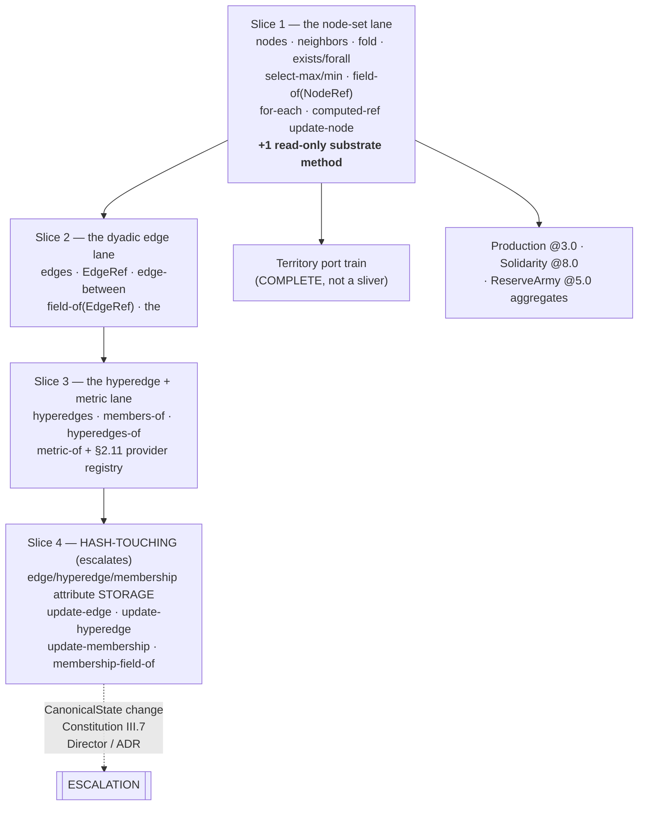

# BSL Query Evaluation — implementation plan (Program 27 Phase 2, Slice 2)

> **For agentic workers:** REQUIRED SUB-SKILL: use `superpowers:subagent-driven-development`
> (recommended) or `superpowers:executing-plans` to execute this plan task-by-task. Steps use
> checkbox (`- [ ]`) syntax for tracking. Branch from `dev`. One PR per task-group boundary marked
> **⟨PR⟩**; `mise run pr:merge -- N` is the only merge path (ADR181/R10).

**Written against:** `dev` @ `7d60c635`. **Normative source:** `docs/reference/bsl-language.rst`
(§2.6, §2.7, §2.8, §2.10, §3.7, §4.1–4.6, §6.1–6.2). This plan **implements that spec**; it does
not redesign it. Every point where the spec is silent or disagrees with itself is a **D-row
candidate** (see that section) — never a silent invention.

---

## Goal

Serve the BSL **graph-query surface** at evaluation time, so that rules can read the graph they
already parse, scope-check, typecheck and fuel-bound against — and so the frozen Python engine's
remaining fold, aggregation and selection-shaped systems become portable.

Today 27 `GRAPH_SEAM_HEADS` (`rust/crates/babylon-bsl/src/evaluator.rs:364-392`) pass every static
gate and then **refuse at evaluation** with "Task 16 / the Phase-2 query evaluator"
(`evaluator.rs:421-430`); `for-each` refuses in effect position
(`rust/crates/babylon-bsl/src/structural_verbs.rs:258-267`); and `update-node` accepts a computed
`NodeRef` (`structural_verbs.rs:623-642`) — but no query/selection form can currently COMPUTE
one (`self` and `add-node`'s result are the only producers today, neither selectable).

**Success criterion:** an author can write the whole Territory port in BSL with no
evaluation-time refusal in its path, and every head this plan does *not* serve refuses **loudly**
with a message naming the slice that will serve it.

### The motivating consumer

`reports/territory-port-phase1-inventory-2026-08-11.md` (branch `docs/territory-phase1-inventory`,
commit `ab0e7b89`) closed the Territory Phase-1 gate with verdict **DEFER — query-evaluation train
first**. Its §6 blocker table names four blocked shapes, and this seam is every one of them:

| Frozen behaviour (`src/babylon/engine/systems/territory.py`) | BSL shape it needs |
|---|---|
| Phase 2 sink selection, `_find_sink_node` (:139-194) | `select-max` over typed `neighbors`, with a language-level tiebreak |
| Phase 2 population transfer to sink (:259-267) | `update-node` against a **computed** `NodeRef` |
| Phase 3 heat spillover (:269-316) | `fold sum` over `neighbors … :any NodeType/TERRITORY` of `field-of it territory/heat` |
| Phase 4 PENAL_COLONY suppression (:349-378) | `for-each` over `neighbors … EdgeType/TENANCY :in NodeType/SOCIAL_CLASS`, writing the source node |

Two further requirements fall out of reading the frozen code against the spec, and are **not** in
that table:

- **`exists` earns its place, and slice 1 ships it.** `_find_sink_node` returns `None` when no
  adjacent sink exists, and the population then vanishes rather than transferring. `select-max`
  over an empty query is `E-EVAL-021` (§2.7, D45) — a *tick abort*, not a fallback. The only
  conforming transcription guards the selection with `(exists (neighbors …) …)`, so `exists` and
  `forall` both ship in slice 1.
- **Cross-firing pre-state carries weight.** Phase 3 spillover reads every neighbour's
  **pre-tick** heat (`territory.py:279-284, 304-309` — the frozen system's own collect-then-apply
  discipline). `tick.rs::run_tick` currently mutates the graph in place as it walks subjects
  (`rust/crates/babylon-bsl/src/tick.rs:372-418`, and its own module doc admits it), which
  contradicts §4.2 chapter C4: *"All firings of one rule observe the same pre-state … and the
  effects they collect are applied in that subject order."* A pull-side spillover fold under
  in-place semantics would read already-updated heat for every lower-id neighbour and **diverge
  from the frozen engine**. Task 12 repairs this; see D-row **Q1**.

---

## Architecture

Four slices. Slice 1 is the whole of this plan's task list; this plan scopes slices 2–4 so that
every unimplemented head's refusal message can name its successor by number today.



**Why this cut.** A single, checkable property defines slice 1: **it requires no change to
`CanonicalState` and exactly one new read-only method on `GraphSubstrate`.** Every Territory shape
above lands inside it — none of the four needs an `EdgeRef`, an edge attribute, or a hyperedge.
Slice 4 quarantines everything that *does* need new stored state, behind an explicit
escalation.

### Where the code goes

| Path | Role after this plan |
|---|---|
| `rust/crates/babylon-bsl/src/query.rs` | **new** — query materialization (§2.6): the `Element`/`ElementSet` types, the six heads' dispatch, the §2.6 total order, the `neighbors` type filter |
| `rust/crates/babylon-bsl/src/evaluator.rs` | `EvalEnv` gains the graph + the element stack; `fold`/`exists`/`forall`/`select-*`/`field-of` arms replace their refusal; `GRAPH_SEAM_HEADS` splits in two |
| `rust/crates/babylon-bsl/src/structural_verbs.rs` | `for-each` served; effects **collected** rather than applied inline; `update-node` gains the runtime `E-EVAL-033` referent-type check |
| `rust/crates/babylon-bsl/src/tick.rs` | per-rule pre-state: collect across firings, apply in subject order |
| `rust/crates/babylon-graph/src/substrate.rs` | **one** new method: `node_type_of` |
| `rust/crates/babylon-graph/src/hypergraph_store.rs`, `memory.rs` | that method's two implementations |
| `rust/crates/babylon-bsl/tests/r9_chapters.rs` | §6.2 families 14/15/17 flip from load-time pins to real evaluation |
| `rust/crates/babylon-bsl/tests/conformance_corpus.rs` | **deletes** its "fold/query EXECUTION needs the Phase-2 query evaluator" scope note, and its aggregation vectors run for real |
| `rust/crates/babylon-tick/tests/query_lane_e2e.rs` | **new** — the four Territory-shaped end-to-end vectors |

### Tech stack

Rust 2021, workspace at `rust/` (`babylon-kernel` < `babylon-graph` < `babylon-bsl` <
`babylon-tick` < `babylon-client`). No new dependencies. Gate: `mise run rust:check` — `cargo fmt
--check`, `clippy --workspace -D warnings`, `cargo test --workspace --locked`, plus
`clippy -D clippy::pedantic` and `cargo test` for `babylon-kernel` and `babylon-bsl` specifically,
plus `RUSTDOCFLAGS='-D warnings' cargo doc`. Python side untouched; `mise run qa:regression` and
`qa:vault-regression-ci` cannot move, by construction (no Python file changes); slice 1 runs
them once at the end as evidence rather than assuming it.

---

## Global constraints — these are LAW

1. **TDD red → green → refactor, per task.** Write the failing test, *run it and see it fail for
   the stated reason*, build the change, run it green, commit. A task that skipped its red phase is not
   done. `@red_phase`'s Rust analogue is a `#[test]` written and run before the production
   change; the plan's steps make the ordering explicit.
2. **Determinism is not negotiable.** Every iteration over graph elements walks a **canonically
   ordered materialized `Vec`** — §2.6's ascending node-id / `(source-id, target-id, edge-type)` /
   hyperedge-id byte order. No `HashMap`/`HashSet` iteration reaches a result, a fold reduction, a
   tiebreak, or the fuel meter. A filter runs *after* the sort, never
   by re-collecting into a hash container. (`ai/anti-patterns.yaml`; CLAUDE.md's "Systems mutate
   the shared graph in-place in strict order".)
3. **Floating-point reduction order is observable.** §4.2: the binary64 lane is not associative, so
   a fold's reduction order *is* the iteration order, and a test pins it rather than a convention.
   No `rayon`, no `par_iter`, no reordering "optimisation" anywhere in this lane. BLAS-cap
   reasoning applies: determinism outranks throughput.
4. **Loud refusal, never a silent no-op.** Anything this plan scopes out keeps a refusal that
   (a) names the construct, (b) names *why* the seam refuses, and (c) names the slice that will
   serve it. A refusal is never an empty set, a `0.0`, a skipped effect, or a log line (§4.6;
   Constitution III.11).
5. **No invented error codes.** New codes take the next free number in their family and are
   proposed as D-rows first. Current allocations, verified by grep over
   `rust/crates/babylon-bsl/src/`: `E-EVAL` 010–014, 020, 021, 031–037, 039, 040, 041 are
   implemented; 030 (edge-mode) and 038 (membership pair) are spec-allocated and unimplemented.
   **The next free `E-EVAL` number is 042.** This plan proposes exactly one (D-row **Q3**) and
   ships uncoded-loud until the register row lands.
6. **Fuel covers query cost.** Every AST node charges its §3.7 base when evaluated (§4.5). A fold
   over 3,222 counties charges the body's cost once per iteration, through the *same* meter
   `structural_verbs::charge` already shares. The meter runs **per firing** (§4.5's R9 repair) —
   never per rule-pass.
7. **Hash discipline (Constitution III.7).** New `GraphSubstrate` methods in slices 1–3 must be
   **read-only listing/lookup** methods: no new stored state, no change to `CanonicalState`'s four
   sections (`all_nodes` / `all_attributes` / `all_edges` / `all_hyperedges`,
   `rust/crates/babylon-graph/src/state_hash.rs:232-240`), no change to the encoder. **Anything
   that widens `CanonicalState` is OUT of scope and escalates to the Director as slice 4.**
   Evidence obligation: every substrate task carries a state-hash byte-identity test.
8. **Port-as-is.** This train adds language capability and ports no system. Territory, Production
   and Solidarity are separate trains with their own Director dossiers.
9. **Commit after each unit of work**, conventional commits, `mise run commit -- "type(scope): msg"`,
   `Co-Authored-By` trailer. Verify `git log --oneline -1` moved after every commit (hooks abort
   silently).

---

## Prior-art disposition — PR #464 (`feat/p2-slice2-query-trait`)

**Verdict: HARVEST THREE IDEAS, SUPERSEDE THE BRANCH.** Do not `git rebase` it; do not
merge it.

**Evidence, gathered 2026-08-11:**

- `git rev-list --count dev..origin/feat/p2-slice2-query-trait` = **5**;
  `git rev-list --count origin/feat/p2-slice2-query-trait..dev` = **229**.
- `git diff dev...origin/feat/p2-slice2-query-trait --stat`: 6 files, and **only two are
  production code** — `rust/crates/babylon-graph/src/substrate.rs` (+43/−18) and
  `rust/crates/babylon-graph/src/memory.rs` (+111). The other four are `ai/state.yaml`,
  `reports/loop-digest.md`, `reports/rust-estate-audit-2026-07-31.md` and a 4-line
  `structural_verbs.rs` call-site repair. The branch's real payload is **~150 lines**.
- **Its implementation target is no longer the production store.** `MemoryGraph`
  (`memory.rs`) held the substrate role when its author wrote #464; ADR179 T3, executed by ADR193 on 2026-08-11, swapped
  production to `HypergraphStore` (`rust/crates/babylon-graph/src/hypergraph_store.rs:129`). Every
  line of #464's `memory.rs` work would need re-doing against a file that did not exist on its
  branch point.
- **It predates the R9 spec chapters entirely.** #464 implements the *pre-C8* `neighbors` (three
  operands, edge-type-only ceiling). Current `dev` already carries C8's four-operand form in
  `bound_checker.rs:501-531` and `scope.rs:92`, with a unit test
  (`the_pre_c8_three_operand_neighbors_no_longer_bounds`) that #464's shape would fail.
- **It carries a live defect.** Commit `95047642` ("drop paused hyperedges accessor") removed the
  `hyperedges` method but left its doc comment attached to `edge_strength`, producing a `rustdoc`
  block that reads *"`(hyperedges <enum-ref>)` — every hyperedge of the given type … The strength
  stored on one dyadic edge."* Merging that ships a wrong doc comment through
  `RUSTDOCFLAGS='-D warnings'`.
- Its `hyperedges_of` → `Result` change **already landed on `dev` independently**; what did *not*
  land is the stale `neighbors` doc note that still says *"contrast `hyperedges_of`, whose
  infallible signature predates this ruling"* (`substrate.rs:174-176`) — false on `dev` today.

**The three ideas worth harvesting, and where they go:**

| #464 idea | Disposition | Lands in |
|---|---|---|
| `members_of(id, hyperedge_type)` — type as a mandatory operand so `E-EVAL-032` is enforceable at the boundary rather than merely documented | **Harvest, verbatim in reasoning.** This is D24 applied to the trait and is exactly right. | Slice 3 |
| `edge_strength(edge_type, from, to)` with two *distinguishable* error cases (dangling endpoint vs. absent edge), and the "never `0.0`, absence is not a value" argument | **Harvest the reasoning, widen the shape.** §2.10's `field-of` over an `EdgeRef` needs a general edge-attribute read, of which `strength` is one row; a later slice would supersede a single-purpose accessor. | Slice 2 |
| The stale `neighbors` doc-note repair | **Harvest now** — one comment, zero risk. | Slice 1, Task 3 |

**Closing action:** post the verdict on PR #464 and close it citing this plan by path. Leave the
branch in place (immutability of history); do not delete it.

---

## Substrate widening and the hash argument

Slice 1 adds **exactly one** method to `GraphSubstrate` (14 → 15):

```rust
/// The declared type of a live node — `(neighbors … <NodeType>)`'s filter
/// (§2.6, D24: this operand FILTERS) and §2.10 discipline 1's `E-EVAL-033`
/// referent check both need it, and neither is expressible without it.
///
/// READ-ONLY: it reports a fact the substrate already stores to satisfy
/// `nodes(&self, node_type)`. It adds no state, and `CanonicalState`'s four
/// sections are untouched.
///
/// # Errors
/// Returns [`GraphError`] if `id` names no live node — a dangling `NodeRef`
/// never reads as an untyped node (III.11).
fn node_type_of(&self, id: NodeId) -> Result<String, GraphError>;
```

Everything else slice 1 needs already exists: `nodes` (sorted, `hypergraph_store.rs:259-268`),
`neighbors` (sorted, de-duplicated, loud on a dangling operand, `:281`), `node_attribute`,
`node_exists`.

**Why this is hash-safe, stated explicitly.** `CanonicalState` (`state_hash.rs:224-291`) encodes
four sections from four reporting methods: `all_nodes` → `(NodeId, type)`, `all_attributes` →
`(NodeId, name, f64)`, `all_edges` → `(type, from, to, f64)`, `all_hyperedges` →
`(HyperedgeId, type, members)`. A node's type is **already** in section 1. `node_type_of` reads
what the encoder already hashes; it stores nothing new, changes no section, changes no sort key,
and changes no byte. Task 3 proves this rather than asserting it.

**What is out of scope and escalates (slice 4).** Edge attributes beyond the single `strength`
`f64`; hyperedge attributes (there are none); membership payload storage. Each would add a section
or widen an existing tuple in `CanonicalState` — a tick-hash change under Constitution III.7,
which needs a Director ruling and an ADR, not a plan. `structural_verbs.rs:268-279` already refuses
`update-edge`/`update-hyperedge` on exactly this ground; this plan leaves that refusal at full strength and only
renumbers its successor.

---

## Explicitly out of scope

- **`(domain :graph)` evaluation.** `domain.rs::resolve_domain`/`RuleDomain::Graph` resolves at
  load; `tick.rs::run_tick` never reads `loaded.domain` (metabolism.bsl's D-4 record,
  lines 278-298). This is **#502 WS2's subject** and is deliberately **not** claimed here — the two
  trains would collide on `run_tick`'s subject loop. Task 12 touches `run_tick`, so it carries a
  coordination obligation: **`git rebase` onto WS2 if WS2 lands first; otherwise leave
  `loaded.domain` unread and add no `RuleDomain` branch.** Territory's rules are all per-`TERRITORY`
  node-domain, so nothing in this plan's consumer needs it.
- **Any system port.** Territory, Production, Solidarity are separate trains.
- **The Python engine.** No file under `src/babylon/` changes.
- **Metric providers (§2.11).** `metric-of`'s refusal stays; it needs a provider registry, which is
  slice 3's, not a query-evaluation problem.
- **Closed-enum field storage** (`profile`, `territory_type` — the Territory inventory's fresh finding,
  §3 of that report). That is a `deffield` vocabulary question, not a query question. Restated as
  D-row **Q9** so the Territory train inherits it named.

---

# SLICE 1 — the node-set query lane

Sixteen tasks in five PR groups. Each task names the `bsl-language.rst` section it implements and
the `E-EVAL` codes it introduces or first exercises.

## ⟨PR 1⟩ Seam hygiene and the environment

### Task 1 — split `GRAPH_SEAM_HEADS`; every refusal names its slice

**Spec:** §2.7 (`<expr>` production), §2.8 (`<effect-item>`), §4.6.
**E-codes:** none new. Removes a *misdiagnosis*.

The current list conflates three different facts under one message. `add-node`, `remove-node`,
`add-edge`, `remove-edge`, `add-hyperedge`, `remove-hyperedge` and `emit` are **already served**
in `structural_verbs.rs` — they appear in `GRAPH_SEAM_HEADS` only because they are not expression
forms. `guard` is likewise effect-position-only (§2.7 has no `guard` production). Telling an author
that `(emit …)` in expression position "lands with Task 16" is simply false.

**Files:** `rust/crates/babylon-bsl/src/evaluator.rs`

**Interfaces:**
```rust
/// Heads that are EFFECT-position verbs (§2.8) or update-op/grouping forms.
/// In expression position these are grammar errors, not unimplemented seams.
const EFFECT_POSITION_ONLY: [&str; N] = [ /* guard, for-each, the ten §2.8 verbs,
                                            add/sub/set/scale, members — N resolved
                                            when the split is written, not guessed */ ];

/// Expression heads the query evaluator does not yet serve, each mapped to
/// the slice that will. Exhaustive: a head in neither table is `eval_intrinsic`'s.
const UNSERVED_EXPRESSION_HEADS: [(&str, &str); N] = [("edges", "slice 2"), ("the", "slice 2"), …];
```

- [ ] Write `refusal_messages_name_their_slice()`: assert `(emit …)` in expression position does
      **not** mention "Task 16", and does mention §2.8/effect position; assert `(edges …)` mentions
      "slice 2"; assert `(members-of …)` mentions "slice 3"; assert `(update-edge …)`'s existing
      storage refusal still mentions Constitution III.7.
- [ ] Run it — RED (every message today says "Task 14 / Task 16").
- [ ] Split the constant into the two tables; route each to its own message.
- [ ] Run it — GREEN.
- [ ] Write `every_seam_head_is_classified()`: for each of the 27 original heads, assert it appears
      in exactly one of `EFFECT_POSITION_ONLY`, `UNSERVED_EXPRESSION_HEADS`, or the served set.
      This is the sentinel that stops a head from silently falling through to `eval_intrinsic` and
      reporting `E-LOAD-021` (the failure mode the current module doc already names).
- [ ] `mise run rust:check`; `mise run commit -- "refactor(bsl): split the graph-seam refusal into effect-position vs unserved, each naming its slice"`

### Task 2 — the graph-bearing evaluation environment

**Spec:** §4.2 (the environment), §2.6 (`:as`, `it`).
**E-codes:** none new.

`EvalEnv` today holds bindings + intrinsic costs (`evaluator.rs:247-253`). Queries need the graph
and an **element stack** — §2.6's C8 ruling: *"`it` always denotes the element of the innermost
enclosing iterating form"*, and a `:as` name is in scope for the whole body **including nested
bodies**.

**Files:** `rust/crates/babylon-bsl/src/evaluator.rs`, callers in `structural_verbs.rs`,
`tick.rs`, `rule_pipeline.rs`, both test files.

**Interfaces:**
```rust
pub struct EvalEnv<'a> {
    pub bindings: HashMap<String, Value>,
    pub intrinsic_costs: &'a IntrinsicCosts,
    /// `None` for the pure-expression callers (`:expr` binding resolution,
    /// the conformance corpus's arithmetic vectors) — a query head with no
    /// graph is a LOUD driver error, never an empty set.
    pub graph: Option<&'a dyn GraphSubstrate>,
    /// Innermost-last. `it` reads the last entry; a `:as` name reads by name.
    pub elements: Vec<(Option<String>, Element)>,
}
```

- [ ] Write `it_outside_any_iterating_form_is_loud()` — `(field-of it x/y)` with an empty element
      stack must fail loudly, naming `it` and §2.6, rather than read a stale binding.
- [ ] Write `a_query_with_no_graph_is_a_loud_driver_error()` — `graph: None` + `(fold count (nodes NodeType/X) 1)`
      must name the driver, and must **not** yield `0`.
- [ ] Run both — RED (the fields do not exist).
- [ ] Add the fields; thread `Option<&dyn GraphSubstrate>` through every construction site. Keep
      existing call sites compiling by passing `None` where they pass no graph today.
- [ ] Run — GREEN.
- [ ] `mise run rust:check`; `mise run commit -- "feat(bsl): EvalEnv carries the graph and the §2.6 element stack"`

### Task 3 — `GraphSubstrate::node_type_of`, and the hash-invariance proof

**Spec:** §2.6 (D24's filtering operand), §2.10 discipline 1.
**E-codes:** first exercise of `E-EVAL-033`'s precondition (the check itself is Task 8).

**Files:** `rust/crates/babylon-graph/src/substrate.rs`, `hypergraph_store.rs`, `memory.rs`

- [ ] Write `node_type_of_reports_the_declared_type()` and
      `node_type_of_a_dangling_id_is_loud_not_untyped()` against **both** stores.
- [ ] Write `adding_a_read_only_query_method_does_not_move_the_state_hash()`: build a fixture graph
      (3 nodes, 2 edges, 1 hyperedge, mixed attributes), assert `state_hash()` equals a hex literal
      captured from `dev` **before** this change. This is the III.7 evidence, not a claim.
- [ ] Run — RED (method absent; the hash test compiles and passes and so serves as the *baseline*,
      captured first and asserted after).
- [ ] Build on `HypergraphStore` (it already keys `nodes: _ -> String`) and `MemoryGraph`.
- [ ] Run — GREEN, and the hash literal unmoved.
- [ ] Harvest #464's doc repair: delete the stale *"contrast `hyperedges_of`, whose infallible
      signature predates this ruling"* note on `neighbors` (`substrate.rs:174-176`) — `hyperedges_of`
      returns `Result` on `dev` today.
- [ ] `mise run rust:check`; `mise run commit -- "feat(graph): node_type_of — the one read-only lookup the query lane needs (III.7-clean)"`

## ⟨PR 2⟩ Query materialization and the aggregation forms

### Task 4 — query materialization: `nodes` and typed `neighbors`

**Spec:** §2.6 (the six heads, the total order, the set/multiplicity ruling D72, the C8 four-operand
`neighbors`), §4.4 (materialized before the body runs), §3.7 (`cost(query)` = 1 + Σ children).
**E-codes:** none new in slice 1 (slice 3's hyperedge heads own `E-EVAL-032`).

**Files:** `rust/crates/babylon-bsl/src/query.rs` (new), `evaluator.rs`, `lib.rs`

**Interfaces:**
```rust
/// One materialized graph element. `EdgeRef`/`HyperedgeRef` variants exist
/// from the start so slices 2–3 add heads, not a type migration.
#[derive(Debug, Clone, Copy, PartialEq, Eq, PartialOrd, Ord)]
pub enum Element { Node(NodeId), Edge(EdgeKey), Hyperedge(HyperedgeId) }

/// Materialize a `<query>` form in §2.6's total order, charging §3.7's
/// `cost(query)` base once plus its operand expressions.
///
/// # Errors
/// A query head slice 1 does not serve (named, with its slice); a dangling
/// element operand (the substrate's own loud error); a missing graph.
pub fn materialize(
    query: &SExpr, env: &EvalEnv<'_>, host: &dyn IntrinsicHost, fuel: &mut u64,
) -> Result<Vec<Element>, EvalError>;
```

- [ ] Write `nodes_materializes_in_ascending_id_order()` — seed a graph whose insertion order is
      *descending*, assert the result is ascending. (Guards the §2.6 contract against a store that
      returns storage order.)
- [ ] Write `neighbors_filters_by_the_annotated_node_type()` — a node whose `TENANCY :in` reach
      includes both a `SOCIAL_CLASS` and an `ORGANIZATION`; the annotated type must yield exactly
      one. §2.6 C8: this operand **filters**, it does not assert.
- [ ] Write `neighbors_is_a_set_not_a_multiset()` — the §6.2 family-17 multiplicity vector: two
      qualifying edges (one `:out`, one `:in`) reaching one node under `:any` must yield it
      **once** (D72).
- [ ] Write `neighbors_of_a_dangling_node_is_loud_not_empty()`.
- [ ] Write `query_materialization_charges_the_3_7_query_base()` — a fixed `:fuel-used` figure.
- [ ] Run all — RED.
- [ ] Build `materialize` for `nodes` and `neighbors`; every other head returns Task 1's
      slice-named refusal. Filter **after** the substrate's sorted `Vec` — never re-collect into a
      hash container (Constraint 2).
- [ ] Run — GREEN.
- [ ] **Mutation check:** delete the `neighbors` de-duplication in the substrate; assert
      `neighbors_is_a_set_not_a_multiset` flips RED; revert and confirm `git diff` is empty.
- [ ] `mise run rust:check`; `mise run commit -- "feat(bsl): §2.6 query materialization for nodes and typed neighbors"`

### Task 5 — `fold`: the five operators, `:weight`, and the §4.4 empty-set table

**Spec:** §2.7 (`<fold>`), §4.4 (empty-set semantics), §3.4 (the kind law — already enforced at
load by `typecheck.rs`), §4.2 (reduction order is iteration order).
**E-codes:** `E-EVAL-021` (first evaluation-time raise: `mean`/`min`/`max` over an empty set).

**Files:** `rust/crates/babylon-bsl/src/evaluator.rs`

- [ ] Write the §4.4 table as five tests: `mean`/`min`/`max` over an empty query are `E-EVAL-021`;
      `sum` over empty is the body type's additive identity; `count` over empty is `0`.
- [ ] Write `fold_reduces_in_iteration_order_and_the_order_is_observable()` — three `Real` bodies
      chosen so that `(a+b)+c != a+(b+c)` in binary64; assert the exact bits of the
      iteration-order reduction. This is the test that makes Constraint 3 real.
- [ ] Write `weighted_mean_is_sum_of_products_over_sum_of_weights()` with exact expected bits,
      pinning D-row **Q5**'s chosen shape.
- [ ] Write `fold_charges_the_body_once_per_element()` — `:fuel-used` over a 3-element set.
- [ ] Write `mean_over_an_int_body_refuses_by_name()` — the Director-ruled reading of D-row
      **Q6** (2026-08-11): the refusal message names `mean`, `Int`, and the D-row; no
      promote-then-divide.
- [ ] Run — RED.
- [ ] Build. `count` yields `Value::Int`. `mean` serves `Real`-typed bodies only; an `Int`
      body refuses loudly citing D-row **Q6** (Director ruling 2026-08-11) — the
      implementation **comments the D-row number**, it does not decide silently.
- [ ] Run — GREEN.
- [ ] **Mutation check:** make empty `mean` return `0.0`; assert the named empty-set test flips;
      revert byte-identical.
- [ ] `mise run rust:check`; `mise run commit -- "feat(bsl): fold over node-set queries — five operators, :weight, the §4.4 empty-set table"`

### Task 6 — `exists` / `forall`

**Spec:** §2.4/§2.7, §4.4 (`exists` over empty is `#f`; `forall` over empty is `#t`), §4.1
(short-circuit).
**E-codes:** none new.

- [ ] Write the two empty-set cases and the two short-circuit cases (`:fuel-used` must be strictly
      smaller when the predicate decides on element 1 of 3).
- [ ] Write `exists_guards_a_selection_over_a_possibly_empty_query()` — the Territory
      `_find_sink_node` shape: `(if (exists (neighbors …) #t) <select-max …> <fallback>)` must not
      raise `E-EVAL-021` on an empty neighbourhood.
- [ ] Run — RED. Build it. Run — GREEN.
- [ ] `mise run rust:check`; `mise run commit -- "feat(bsl): exists/forall over materialized queries with §4.4 empty semantics"`

### Task 7 — `select-max` / `select-min` and the language-level tiebreak

**Spec:** §2.7 (chapter C5): result is the query's element type; **ties break to the first element
in ascending id byte order, for both operators**; empty is `E-EVAL-021`; the score's comparable-
scalar class is already `E-TYPE-016` at load (`score_class.rs`); the score carries no kind constraint.
**E-codes:** `E-EVAL-021` (empty selection — same code, same reason, D45).

- [ ] Write the §6.2 family-14 **tie vector**: two elements scoring equally; assert the **smaller id**
      wins for `select-max` *and* for `select-min`. This is the test the frozen Python systems could
      not have — §2.7 hoists the tiebreak into the language so that a transcribed rule
      cannot forget one.
- [ ] Write `selection_over_an_empty_query_is_E_EVAL_021()`.
- [ ] Write `an_intensive_score_is_ACCEPTED()` — §2.7 states plainly that §3.4 polices aggregation, not
      ordering. This guards against over-applying the kind law.
- [ ] Write `a_selection_result_is_the_element_operand_of_field_of()`.
- [ ] Run — RED. Build it: a single forward pass over the materialized `Vec`, replacing the
      incumbent only on **strict** improvement (that is what makes "first wins" fall out of the
      §2.6 order rather than arriving as a bolt-on).
- [ ] Run — GREEN.
- [ ] **Mutation check:** change `>` to `>=` in the incumbent comparison; assert the tie vector
      flips RED; revert byte-identical.
- [ ] `mise run rust:check`; `mise run commit -- "feat(bsl): select-max/select-min with the §2.7 language-level tiebreak"`

### Task 8 — `field-of` over a `NodeRef`, and `E-EVAL-033`

**Spec:** §2.10 (the accessor table + the five shared disciplines), §3.7 (`cost(field-of)` =
1 + operand, **never** ceiling-multiplied).
**E-codes:** `E-EVAL-033` (first evaluation-time raise).

- [ ] Write `field_of_reads_a_declared_field_of_the_referent()`.
- [ ] Write `field_of_whose_referent_is_of_another_type_is_E_EVAL_033()` — read
      `social-class/wealth` off a `TERRITORY` ref. Discipline 1: **never a default, never an absent
      read**. This is the check `node_type_of` exists to serve.
- [ ] Write `field_of_a_field_the_element_carries_no_value_for_is_E_EVAL_033()` — discipline 2.
- [ ] Write `field_of_is_charged_as_a_keyed_lookup_not_an_iteration()` — a `:fuel-used` figure
      matching `bound_checker`'s `cost_of("(field-of it solidarity/strength)") == 2`.
- [ ] Run — RED. Build it (qname's first segment names the owning type; compare against
      `node_type_of`, rendering `social-class` → `SOCIAL_CLASS` through `tick.rs`'s existing
      `namespace_to_node_type` — **reuse it, do not write a second renderer**; widen its visibility).
- [ ] Run — GREEN.
- [ ] **Mutation check:** make the type mismatch return `0.0` instead of raising; assert the
      `E-EVAL-033` test flips; revert byte-identical.
- [ ] `mise run rust:check`; `mise run commit -- "feat(bsl): field-of over a NodeRef with §2.10's E-EVAL-033 disciplines"`

### Task 9 — `:as` element naming and nested bodies

**Spec:** §2.6 (chapter C8's `:as` ruling), §3.7 (`cost(:as name) = 0`, a reference costs 1).
**E-codes:** none new (`E-TYPE-012`/`E-PARSE-022`/`E-PARSE-030` are already load-time in
`scope.rs`).

- [ ] Write the §6.2 family-17 two-hop test: a nested fold naming the outer element with `:as`,
      whose inner body reads `it` — assert `it` resolves to the **inner** element and the `:as`
      name to the outer.
- [ ] Write `an_as_name_costs_zero_and_a_reference_to_it_costs_one()` (`:fuel-used`).
- [ ] Run — RED. Build it over Task 2's element stack.
- [ ] Run — GREEN.
- [ ] `mise run rust:check`; `mise run commit -- "feat(bsl): :as element naming, innermost-it, nested bodies (§2.6 C8)"`

## ⟨PR 3⟩ Effect-position iteration and the pre-state law

### Task 10 — `for-each` in effect position

**Spec:** §2.8 (chapter C6): `it` bound to the current element; **the query materializes against
the rule's pre-state before any effect applies**; application order is total (outer = iteration
order, inner = source order); **an empty query applies nothing and is not an error**; §3.7's
`cost(for-each)` row.
**E-codes:** none new.

**Files:** `rust/crates/babylon-bsl/src/structural_verbs.rs`

- [ ] Write `for_each_over_an_empty_query_applies_nothing_and_does_not_error()` — the one place an
      empty set is quiet (§2.8's own reasoning: an iteration is a command).
- [ ] Write `for_each_applies_the_body_once_per_element_in_iteration_order()`.
- [ ] Write the §6.2 family-15 **pre-state vector**: a `for-each` whose query would have changed had
      it seen an earlier verb's effect in the same effect list; assert it does not.
- [ ] Write `nested_for_each_composes_outer_iteration_then_inner_source_order()`.
- [ ] Run — RED (`structural_verbs.rs:258` refuses today).
- [ ] Build, replacing the refusal.
- [ ] Run — GREEN.
- [ ] `mise run rust:check`; `mise run commit -- "feat(bsl): for-each in effect position (§2.8 C6)"`

### Task 11 — `update-node` against a computed `NodeRef`

**Spec:** §2.7 (the `(update-node (select-max …) …)` worked example), §2.8 (`E-TYPE-014`'s runtime
half is `E-EVAL-033` on the update verbs, because a reference has no static type).
**E-codes:** `E-EVAL-033` on the write path.

`resolve_node` (`structural_verbs.rs:623-642`) already accepts any expression evaluating to a
`NodeRef`. With Task 7 landed, that path becomes reachable for the first time — and it currently
performs **no** referent-type check, only `store_range_check` on the field.

- [ ] Write `update_node_against_a_selection_result_writes_the_selected_node()` — the §2.7 worked
      example verbatim.
- [ ] Write `update_node_whose_referent_is_of_another_type_is_E_EVAL_033()` — writing
      `territory/population` to a `SOCIAL_CLASS` ref. Today this **succeeds silently** — a real
      defect the query lane makes reachable.
- [ ] Run — RED.
- [ ] Build the check in `update_node`, reusing Task 8's owner-type comparison.
- [ ] Run — GREEN.
- [ ] **Mutation check:** remove the check; assert the `E-EVAL-033` write test flips; revert.
- [ ] `mise run rust:check`; `mise run commit -- "feat(bsl): update-node against computed refs, with the E-EVAL-033 runtime type check"`

### Task 12 — the pre-state law: collect-then-apply, within and across firings

**Spec:** §2.8 chapter C6 and §4.2 chapter C4, quoted verbatim:

<!-- vale off -->
> "Every expression anywhere in an effects list … is evaluated against the pre-state, and the
> collected effects are then applied." (§2.8 C6)
>
> "All firings of one rule observe the same pre-state … and the effects they collect are applied
> in that subject order." (§4.2 C4)
<!-- vale on -->

**E-codes:** none new. **D-rows:** **Q1** (the conformance defect) and **Q2** (accumulating-read
timing).

The Territory port's Phase-3 spillover depends on this task, which repairs a **conformance
defect** rather than adding a feature: `tick.rs:372-418` applies each subject's effects before the next
subject binds, and its own module doc says so.

**Byte-neutrality argument, verified 2026-08-11 by grep over
`rust/crates/babylon-tick/content/rules/*.bsl`:** every landed pack writes only to `self`
(`vitality.bsl:68,78,79`; `metabolism.bsl:411,412`; `lifecycle.bsl:383-409`;
`fundamental-theorem.bsl:12`; `dispossession.bsl`). No landed rule reads another node. For
self-scoped writes, in-place and collect-then-apply are **observationally identical**. The change costs
nothing **now** and a great deal later — which is the argument for making it
here, in the train that first makes cross-node reads possible.

**Files:** `rust/crates/babylon-bsl/src/structural_verbs.rs`, `rust/crates/babylon-bsl/src/tick.rs`

**Interfaces:**
```rust
/// One collected, not-yet-applied mutation. The evaluator has ALREADY reduced
/// every operand expression against the pre-state; the accumulating ops read
/// the target's CURRENT value at APPLY time — §4.2's carrier-accumulation clause is only satisfiable that
/// way (see D-row Q2), and reading it at collect time would make three
/// subjects each adding to one carrier lose two contributions.
pub enum PendingWrite {
    Node { id: NodeId, field: String, op: UpdateOp, operand: f64 },
    NodeAdded { .. }, NodeRemoved { .. }, EdgeAdded { .. }, EdgeRemoved { .. },
    HyperedgeAdded { .. }, HyperedgeRemoved { .. },
}
```

- [ ] Write `all_firings_of_one_rule_observe_the_same_pre_state()`: two `TERRITORY` nodes joined by
      `ADJACENCY`, a rule whose effect adds a fold over its neighbours' `heat` to its own `heat`.
      Under in-place semantics the higher-id node reads its neighbour's *updated* heat; under §4.2 C4 it
      reads the pre-tick value. Assert the pre-state values, exactly. **This is the Territory
      Phase-3 shape.**
- [ ] Write `accumulation_into_a_shared_target_reduces_in_subject_order_and_keeps_every_contribution()`
      — the §6.2 family-12 accumulation vector: three subjects each `(add …)` to one carrier;
      assert the carrier holds the sum of all three (proving `add` reads at apply time), and that
      the binary64 reduction order follows subject order (choose values that expose it).
- [ ] Write `tick_goldens_are_byte_identical()` — run the existing
      `rust/crates/babylon-tick/tests/tick_goldens.rs` unchanged. **If any golden moves, STOP** and
      escalate: the byte-neutrality argument above was wrong and the change owes a ceremony.
- [ ] Run — RED on the first two, GREEN on the third (that one guards, it does not target).
- [ ] Build: `EffectExecutor` collects `PendingWrite`s instead of mutating; `run_tick` collects
      across all subjects, then applies in subject order, then in source order within a subject.
      The `WriteObserver` (ADR182 R1) records at **apply** time — observation must still leave
      behaviour identical (`write_log`'s own discipline).
- [ ] Run — all three GREEN, goldens unmoved.
- [ ] **Mutation check:** apply effects inline per subject again; assert
      `all_firings_of_one_rule_observe_the_same_pre_state` flips RED and `tick_goldens` stays green
      (proving the guard is a guard, not the test); revert byte-identical.
- [ ] `mise run rust:check`; `mise run commit -- "fix(bsl): §4.2 C4 pre-state — one rule's firings collect, then apply in subject order"`

## ⟨PR 4⟩ Conformance families

### Task 13 — flip §6.2 families 14, 15 and 17 from load-time pins to real evaluation

**Spec:** §6.1 (vector format, `:fuel-used` mandatory on non-error vectors), §6.2 families 14
(element selection), 15 (effect-position iteration), 17 (typed neighbours and element naming).
**E-codes:** exercises `E-EVAL-021`, `E-EVAL-033`, `E-TYPE-016`, `E-PARSE-042`, `E-TYPE-011`.

`rust/crates/babylon-bsl/tests/r9_chapters.rs`'s header records the boundary honestly today:

<!-- vale off -->
> "each `E-EVAL` row is pinned as its code's identity and discipline rather than as a raised value."
<!-- vale on -->

Slice 1 retires that sentence for three of its families.

- [ ] Family 17: the multiplicity vector, the filtering vector, the three-operand `neighbors`
      (`E-PARSE-042`), swapped operands (`E-TYPE-011` at both positions), the lesser-of-two-ceilings
      bound, and the five `:as` rows.
- [ ] Family 14: `select-max`/`select-min` over `nodes` and `neighbors` (the other four heads stay
      load-time pinned, each with a **named** slice-2/3 note — never a silent skip); the tie vector;
      the empty-query `E-EVAL-021`; the `Bool`/`Enum<T>` score `E-TYPE-016`; a selection feeding
      `update-node` and `field-of`; the accepted intensive score.
- [ ] Family 15: `for-each` over `nodes`/`neighbors` applying `update-node` and `emit` per element;
      the pre-state vector; nested `for-each` and its static bound; the empty-query quiet case; a
      `:fuel` one short of the static bound (`E-LOAD-040`).
- [ ] Update the module header: state precisely which families now execute and which still pin, with
      the slice number for each remaining one.
- [ ] `mise run rust:check`; `mise run commit -- "test(bsl): §6.2 families 14/15/17 execute against the query evaluator"`

### Task 14 — retire `conformance_corpus.rs`'s Phase-2 scope note

**Spec:** §6.3 (transcription contract).
**E-codes:** none new.

The corpus header (`conformance_corpus.rs:11-15`) says aggregation vectors *"pin load-time verdicts
… and their runtime values ride the Phase-2 vector re-run."* This train **is** that re-run for every
node-set-shaped vector.

- [ ] List every corpus vector currently pinned at load time only (`event_wealth_aggregates`,
      `event_forall`, `event_node_condition`, `event_bifurcation`, …). For each: does slice 1 serve
      it? If yes, give it a `:expect` value and a `:fuel-used` figure. If no (`event_edge_count`
      needs `edges`), leave it pinned **with an explicit slice-2 note naming the head**.
- [ ] Rewrite the header to state the new boundary exactly. Delete nothing that is still true.
- [ ] Run — the newly-executing vectors must pass against values derived from the frozen Python
      oracle (`tests/unit/engine/test_event_evaluator.py`), not from the Rust implementation.
      **An expectation derived from the code under test is no conformance vector at all.**
- [ ] `mise run rust:check`; `mise run commit -- "test(bsl): the aggregation corpus executes — the Phase-2 scope note retires"`

## ⟨PR 5⟩ The consumer handoff

### Task 15 — the four Territory-shaped end-to-end vectors

**Spec:** §6.1 (vector format), §6.2 families 12/14/15/17.
**E-codes:** none new.

**This task ships no Territory content.** It proves the four blocked shapes from
`reports/territory-port-phase1-inventory-2026-08-11.md` §6 are now expressible and correct, using
synthetic rule packs and `.bscn` fixtures — so the Territory port train starts from evidence rather
than from optimism.

**Files:** `rust/crates/babylon-tick/tests/query_lane_e2e.rs` (new),
`rust/crates/babylon-tick/content/scenarios/query-lane-e2e.bscn` (new)

- [ ] **Shape A — pull-side spillover.** `(fold sum (neighbors self EdgeType/ADJACENCY :any
      NodeType/TERRITORY) (field-of it territory/heat))` over a 4-territory chain; expected values
      computed from the frozen `TerritorySystem._process_spillover` on the same topology (the
      frozen engine is the value oracle; §5's dormancy finding means no canonical scenario supplies
      one, so this fixture is hand-built, as Metabolism's fixtures were).
- [ ] **Shape B — priority sink selection with a tie.** `select-max` over `neighbors … :out
      NodeType/TERRITORY` scored by an ordinal field, with two equal-scoring sinks; assert the lower
      id wins, matching §2.7's tiebreak. Note in the test that the frozen `_find_sink_node`
      (`territory.py:166-193`) carries its own mode-ordered tiebreak — the port's D-record owes a
      comparison, and this vector supplies the evidence for it.
- [ ] **Shape C — the empty-neighbourhood fallback.** The `exists`-guarded selection from Task 6,
      over a territory with no `ADJACENCY` edge; assert the fallback branch, and assert **no**
      `E-EVAL-021`.
- [ ] **Shape D — incidence write.** `(for-each (neighbors self EdgeType/TENANCY :in
      NodeType/SOCIAL_CLASS) (update-node it social-class/organization (set 0)))`; assert every
      tenant class zeroed and every non-tenant untouched (the frozen law
      `test_social_class_without_tenancy_edge_is_untouched`).
- [ ] Run the whole workspace suite twice in one process and once in a fresh process; assert
      byte-identical outcomes (§6.2 family 8).
- [ ] `mise run rust:check` **and** `mise run qa:regression` **and** `mise run qa:vault-regression-ci`
      — the last two as evidence that a pure-Rust change moved no Python baseline, not because anyone expected movement.
- [ ] `mise run commit -- "test(tick): the four Territory-shaped query-lane vectors — the port train's evidence"`

### Task 16 — the handoff record

- [ ] Update `ai/state.yaml`.
- [ ] Add an ADR in `ai/decisions/` recording: the four-slice cut, the III.7 read-only-widening
      rule, the #464 verdict, and the §4.2 C4 pre-state repair.
- [ ] File the D-row candidates below as register rows in `docs/reference/bsl-language.rst` —
      **numbered at execution time as the next free rows** (highest on `dev` today is `D100`; open
      PRs mint their own, so resolve the number when the PR opens, never hard-code it — this is the
      B2 plan's recorded collision lesson).
- [ ] Post the #464 verdict on the PR and close it, citing this plan by path.
- [ ] Update `reports/territory-port-phase1-inventory-2026-08-11.md`'s verdict section (or its
      successor) to record that the blocking train has landed.

---

# SLICES 2–4 — scoped, not built

Every head below keeps a loud refusal naming its slice (Task 1 wires the messages).

| Slice | Heads served | New substrate surface | Hash impact |
|---|---|---|---|
| **2 — dyadic edge lane** | `edges`, `edge-between`, `field-of` over an `EdgeRef`, `for-each`/`select-*`/`fold` over edge sets, `the` | `Value::EdgeRef` + an `EdgeKey`; a read-only edge-attribute lookup (harvesting #464's `edge_strength` reasoning, widened); `edge_exists` | **None** — `CanonicalState`'s edge section already carries `strength` |
| **3 — hyperedge + metric lane** | `hyperedges`, `members-of` (typed, harvesting #464), `hyperedges-of`, `metric-of` | `hyperedges(type)` listing; `members_of(id, type)` (`E-EVAL-032`); the §2.11 provider registry | **None** — every one is a read-only walk of existing sections |
| **4 — attribute storage** | `update-edge`, `update-hyperedge`, `update-membership`, `membership-field-of`, `add-*` `<field-init>`s beyond `:strength` | edge/hyperedge/membership attribute **storage** | **YES — `CanonicalState` widens. ESCALATES to the Director (Constitution III.7 + Amendment AG). Not a plan; an ADR.** |

`the` sits in slice 2 rather than slice 1 deliberately: it needs only `nodes(type)` plus the
manifest ceiling and would be nearly free here, but it unblocks nothing for Territory, and a slice
that scopes to "what the consumer needs" stays honest only if convenient extras stay out.

---

# D-row candidates

Spec silences and self-contradictions found while reading. Each is a proposed register row; this plan decides none of them, and each implementation site **cites its row number in a
comment** rather than choosing quietly.

| ID | Question | Where the spec is silent / contradicts | Proposed disposition |
|---|---|---|---|
| **Q1** | `tick.rs` applies one rule's effects per subject before the next subject binds; §4.2 C4 says all firings observe the same pre-state. | Not a silence — an **implementation/spec divergence**, admitted in `tick.rs`'s own module doc (*"Snapshot semantics would be a different model and would need a ruling"*). | **Follow the spec** (Task 12). Byte-neutral for every landed pack (verified). Record the divergence and its repair, so the reasoning survives. |
| **Q2** | Under collect-then-apply, does `add`/`sub`/`scale` read the target's **current** value at collect time or at apply time? | §2.8 C6 pins the *operands* to pre-state and says nothing about the accumulating read. | **Apply time.** §4.2's own accumulation clause (*"every class adding its slice to a carrier node reduces in exactly this order"*) is unsatisfiable otherwise: collect-time reads would collapse three contributions into one. |
| **Q3** | A query **operand** naming no live element (`(neighbors <dangling> …)`) has no `E-EVAL` code. | §2.6 codes the *annotation* mismatch (`E-EVAL-032`) and §2.10 codes accessor referents (`E-EVAL-033`), but the spec codes no query-operand case. | Propose **`E-EVAL-042`** (next free). Until the row lands, raise a **loud** error carrying no code, per the crate's standing "no invented codes" precedent. |
| **Q4** | Does a **self-loop** put a node in its own `neighbors … :any` set? | §2.6 is silent; the substrate's implementation currently yields the node itself. | Record the current behaviour explicitly and add a vector, either way. A silent, implementation-defined answer is exactly the cross-implementation trap §2.6 exists to close. |
| **Q5** | Weighted `mean`'s reduction shape: `Σ(wᵢ·xᵢ) ÷ Σwᵢ`, or an incremental update? | §2.7/§4.4 give the operator and §4.2 gives the iteration order, but binary64 non-associativity makes the *shape* observable too. | **`Σ(wᵢ·xᵢ) ÷ Σwᵢ`**, both sums reduced in iteration order. Pin with an exact-bits vector (Task 5). |
| **Q6** | `fold mean` over an `Int`-typed body: §4.3 says `Int ÷ Int` "has no pinned semantics" and is a loud error today; §3.3 promotes `Int` only "in a binary64 expression". Is `mean`'s division a binary64 expression? | Direct silence between two sections. | **RULED (Director, 2026-08-11 — see the rulings section): REFUSE LOUDLY.** `mean` serves `Real`-typed bodies only; an `Int` body refuses by name citing this D-row. (`count`'s `Int` result and `sum`'s type-preserving result are untouched.) |
| **Q7** | `fold sum` over an empty set is "the additive identity of the **body type**". What is that for `Ratio` (§3.2 addendum, whose domain is open at zero)? | §4.4 predates the `Ratio` variant. | Rule `Ratio` an **illegal fold-body type** (its only operator is `Currency × Ratio`), rather than mint an identity outside its own domain. |
| **Q8** | `(guard …)` in **expression** position is currently refused as a Phase-2 seam. | Not a silence — §2.7's `<expr>` has no `guard` production and §2.8 makes it effect-position-only. The **code is wrong**, not the spec. | Fix in Task 1; no register row needed, but note it in the ADR so the misdiagnosis is not re-derived. |
| **Q9** | `deffield` has no `enum` row and `Enum<T>` is typechecker-only (§3.1), so `TERRITORY.profile` (2-valued) and `territory_type` (5-valued) have no field-storage representation. | A genuine gap, first named in the Territory inventory §3; no Q-item in `reports/bsl-gap-analysis-2026-08-10.md` covers it. | **Outside this train** — restated here so the Territory port inherits it named. A `bool`/int-ordinal content encoding with its own D-record, or a spec addition. Director-facing. |
| **Q10** | Fuel charges query **materialization** at `cost(query)` = 1, while the runtime work is O(candidates) — a `neighbors` filter walks every incident edge and charges one unit. | §3.7's row is explicit; §4.5 charges bases. The implementation is conforming; the *property* is worth stating. | Record that fuel serves **totality and determinism** under declared ceilings, not a wall-clock budget. If national-scale profiling later disagrees, that becomes a measured change with a vector re-bless, not a silent constant edit. |
| **Q11** | `:weight` is admitted by §2.7's `<fold>` grammar for every fold-op (the production carries `( ":weight" <expr> )?` unconditioned on `<fold-op>`), but §3.4's per-operator table gives it a reading for `mean` alone. | Not a silence — an implementation gap found by the fix-round verifier: the grammar over-admits relative to §3.4's semantics, and `evaluator.rs` was silently evaluating and discarding the operand for `sum`/`min`/`max`/`count` (`fold_sum`/`fold_min_max`/`fold_count` each destructured `(body_val, _weight_val)`). | **Refuse loudly at evaluation** for every non-`mean` fold-op, naming the op and `:weight` and citing §3.4 — no grammar change (over-admission at the grammar layer is fine as long as no evaluator silently drops what it admits). |
| **Q12** | `fold sum` over an EMPTY query is §4.4's additive-identity case, but the identity is only computable for a body `static_additive_identity` can CLASSIFY — a nested `fold` or a bare binding-symbol body are both load-legal §2.7 shapes it does not attempt. | Not a spec silence — an implementation-classifier boundary; §4.4 says "the additive identity of the body type" without saying every implementation must be able to compute it for every body shape. | Empty-sum identity is servable only for classifiable bodies (literals, `field-of` reads, and homogeneous arithmetic over them); an unclassifiable shape refuses loudly citing this row rather than guessing or widening the classifier speculatively. |
| **Q13** | `fold count`'s §3.7 static bound charges `ceiling(query) × (cost(body) + cost(weight))` like every other fold op, but §3.4 row 6 makes count's RESULT independent of the body's value (pure cardinality) — should the RUNTIME meter still evaluate (and charge) the body per element? | §4.5 says "a fold over 3,222 counties charges the body's cost once per iteration" without carving out `count`; §3.4 row 6 gives count no dependency on the body's value at all. | **No** — `count` does not evaluate the body at runtime; the static bound's unconditional `× cost(body)` term over-charges `count` conservatively, which is the SAFE direction for `E-EVAL-040` (the runtime meter backstops the static bound's soundness against UNDER-charging, never against over-charging). |
| **Q14** | §4.2's own sentence: "rules within one system position observe the same pre-state." Task 12 (the Q1 repair) delivers exactly that WITHIN one rule's subject loop (collect-then-apply, `tick.rs::run_tick`), but `babylon-tick`'s `run_once_into`/`TickSession::advance` still run each rule in a content set TO COMPLETION — collect AND apply — before the next rule starts, against the SAME mutable graph. A second rule at the SAME anchor position observes the FIRST rule's already-applied writes from this tick, not the tick's pre-state: the cross-RULE half of the sentence Q1/Task 12 fixed only the cross-SUBJECT half of. | Not a silence — a second, narrower instance of the SAME admitted implementation/spec divergence Q1 named (there: subject-to-subject within one rule; here: rule-to-rule within one system position). Latent today: every landed rule pack keeps its system position to exactly ONE rule (`vitality.bsl`'s own header comment: "ONE rule, not three... a three-rule decomposition would have to restate the drain algebra" — the same reasoning holds across `dispossession`/`fundamental-theorem`/`lifecycle`/`metabolism`, all single-rule packs), so no landed content exercises the gap. | **Record the divergence; do not fix it here** (#519 fix round scope). Re-scoping `run_once_into`/`TickSession::advance` to collect-across-rules-then-apply is a second collect-then-apply repair, structurally the same shape as Task 12's but one anchor level up, and carries the same golden-baseline exposure Task 12 did — deferred to its own train. Until then, `lib.rs`/`session.rs`'s doc comments state the in-place cross-rule order as a RECORDED GAP (citing this row), never as "the frozen engine's semantics, inherited for free" — that phrasing asserted latent-incorrect behaviour as a design feature. **CT4P B2 (issue #525), naming the shape of the remaining gap:** within one rule the engine is now Reader-shaped over a shared pre-state (Task 12's repair — `collect_pass` takes an immutable substrate, CT4P A1); across rules at one system position the outer loop stays State-shaped — each rule's collect-AND-apply mutates the graph before the next rule's Reader-shaped pass begins, so the "environment" the next rule reads is not the tick's fixed pre-state but the running State left behind. The repair is precisely the promotion of the outer (rule-to-rule) loop from State to Reader, the same shape of change Task 12 already made one level down — and that sentence is the acceptance criterion for whichever train repairs this row. |

---

# Test estate

## Where fixtures live

| Layer | Path | What it holds after this plan |
|---|---|---|
| §6.2 R9 families | `rust/crates/babylon-bsl/tests/r9_chapters.rs` | Families 14/15/17 **executing**; the rest pinned with a named slice |
| Transcribed corpus | `rust/crates/babylon-bsl/tests/conformance_corpus.rs` | Aggregation vectors executing against Python-derived values |
| Unit | `rust/crates/babylon-bsl/src/{query,evaluator,structural_verbs,tick}.rs` `#[cfg(test)]` | Ordering, de-duplication, empty-set, tiebreak, fuel-charge units |
| Substrate | `rust/crates/babylon-graph/src/{hypergraph_store,memory}.rs` `#[cfg(test)]` | `node_type_of` on **both** stores; the state-hash byte-identity guard |
| End-to-end | `rust/crates/babylon-tick/tests/query_lane_e2e.rs` + `content/scenarios/query-lane-e2e.bscn` | The four Territory shapes |
| Regression guard | `rust/crates/babylon-tick/tests/tick_goldens.rs` | Unchanged, and **must stay byte-identical** through Task 12 |

## Where the oracles come from

- **Values** come from the frozen Python engine at the `p27-python-freeze` pin.
  `tests/unit/engine/systems/test_territory_system.py` (1303 lines) supplies every Territory shape;
  `tests/unit/engine/laws/test_law_territory_system.py` (236 lines) supplies the property laws;
  `tests/unit/engine/test_event_evaluator.py` supplies the corpus values.
- **Structure and ordering** come from the frozen engine as a **structure/ordering contract, not a
  correctness oracle** (ADR183, tech-debt census). Where the frozen code carries a defect (the
  missing `_find_sink_node` tiebreak; `_process_spillover`'s upper-only clamp), the vector records
  the divergence with its D-row — it neither silently adopts nor silently repairs.
- **Never** derive an expectation from the Rust implementation under test.

## Mutation verification

This repo mutation-verifies each fix: perturb production, confirm the **named** test flips RED,
revert, confirm `git diff` is byte-empty. Five mutations are mandatory in slice 1, one per
load-bearing invariant, each already written into its task:

| # | Mutation | Test that must flip | Task |
|---|---|---|---|
| 1 | Delete the `neighbors` set de-duplication | `neighbors_is_a_set_not_a_multiset` | 4 |
| 2 | Make `mean` over an empty set return `0.0` | the §4.4 empty-set test | 5 |
| 3 | `>` → `>=` in the selection incumbent comparison | the family-14 tie vector | 7 |
| 4 | `E-EVAL-033` type mismatch returns `0.0` | the `field-of` wrong-referent test | 8 |
| 5 | Apply effects inline per subject | `all_firings_of_one_rule_observe_the_same_pre_state` (and `tick_goldens` must stay GREEN, proving the guard is a guard) | 12 |

A mutation that flips **no** test means nothing guards the invariant — stop and write the guard
before proceeding (standing rule: a sentinel per error class).

## Determinism legs

- `cargo test --workspace --locked` twice in one process and once in a fresh process, byte-identical
  (§6.2 family 8).
- No `rayon`, no `par_iter`, no `HashMap` iteration on any result path (Constraint 2). A grep guard
  over `query.rs` costs little and earns its place.
- `tick_goldens.rs` byte-identity through Task 12 is the tripwire for the pre-state change. If it
  moves, the byte-neutrality argument was wrong: **STOP**, do not re-bless, escalate.

---

# Director rulings (2026-08-11, popup — all three questions RULED before this plan's PR)

1. **D-row Q6 (`fold mean` over `Int` bodies): REFUSE LOUDLY.** `mean` serves `Real`-typed
   bodies; an `Int` body refuses by name citing the D-row until the spec rules the `Int ÷ Int`
   division. No semantics invented; the frozen engine's float division stays available as the
   obvious later ruling. (Task 5 is amended accordingly below — the promote-then-divide step
   was the pre-ruling draft.)
2. **D-row Q1 / Task 12 (the §4.2 C4 pre-state repair): LANDS IN THIS TRAIN.** Byte-neutral
   now (proven by `tick_goldens.rs` — the STOP tripwire stands), required before any
   cross-node read exists. The rebase-or-yield coordination clause vs #502 WS2 stands.
3. **Slice 4 (CanonicalState-widening storage): DEFERRED TO FIRST CONSUMER.** Same pattern as
   the 2026-08-11 Currency-i128 ruling and ADR192's additive sequencing: the hash-widening
   train charters when a system port actually consumes an edge/membership attribute. Slices
   1–3 are hash-free and proceed regardless.
