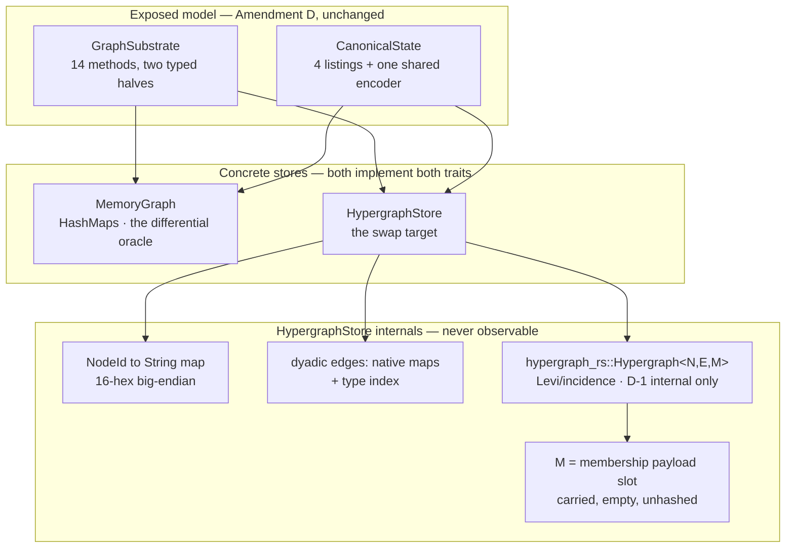

# The hypergraph-rs storage swap — implementation plan

> **For agentic workers:** REQUIRED SUB-SKILL: Use superpowers:subagent-driven-development (recommended) or superpowers:executing-plans to execute this plan task-by-task. Steps use checkbox (`- [ ]`) syntax for tracking.

**Goal:** `babylon-graph`'s concrete storage consumes the sibling `hypergraph-rs` library for the
native-hyperedge half of the substrate (ADR179 T3), behind the `GraphSubstrate` trait, with every
existing golden, conformance vector and canonical-byte pin unmoved — proved rather than asserted.

**Architecture:** Four phases in four PRs, and the first two contain no `hypergraph-rs` at all.
Phase A builds the **proof machinery** against the store we already have: it lifts the canonical
state encoding into a single implementation that no store can rewrite, turns `MemoryGraph`'s unit
tests into a suite any substrate must pass, and widens the tick-level golden surface from one pinned
hash to four. Phase B lands the **dependency** — the sibling repository's tip reaches its remote, the
crate builds under `default-features = false` inside our workspace, and `cargo deny` stays clean.
Phase C writes the **adapter**, `HypergraphStore`, red-green against Phase A's suite plus a
differential harness comparing its canonical bytes with `MemoryGraph`'s, operation by operation.
Phase D **cuts over** `babylon-tick`'s one concrete seam, re-asserts every pin, measures rather than
claims, and records the decision.

**Tech Stack:** Rust 1.91.1 (`rust/rust-toolchain.toml`), the in-tree `rust/` workspace,
`hypergraph-rs` 0.1.0 as a rev-pinned git dependency (BSD-3-Clause, which `rust/deny.toml` already
permits at line 49). No new babylon-side crate; the adapter is a module of `babylon-graph`.

**Source spec:** `docs/superpowers/specs/2026-08-10-program-28-bevy-cutover-roadmap-design.md` §4
engine lane item 3, success criterion 5. **Prerequisite reference:**
`docs/reference/graph-storage-capability-delta.md` — the seven-delta document ADR179 T3's `open`
field demanded. This plan carries out its §8 covenants and does not re-derive its findings.

**Governing rulings this plan carries out and does not reopen:**

- **ADR179 T3** — `babylon-graph`'s concrete storage consumes `hypergraph-rs` rather than
  re-implementing native-hyperedge storage in-tree. The Director attached a caveat: the library is
  not necessarily a one-for-one replacement for XGI, and she may still need to develop that
  repository. Adoption is an investment decision rather than a readiness certificate.
- **ADR172 / Amendment AE clause (vi), Amendment D sub-ruling D-1** — hyperedges are first-class in
  `babylon-graph`'s **exposed** model. A Levi/incidence bipartite encoding stays a permitted
  **internal** storage strategy and must stay unobservable through the trait. `hypergraph-rs`
  implements exactly that encoding, which is why the library fits here at all.
- **ADR185 R2** — node removal cascades: incident dyadic edges go, the node leaves every member
  list, and a hyperedge losing its last member goes with it rather than lingering empty. R4 — the
  iteration-order key is numeric at the id layer.
- **ADR189 / Amendment AG (i)** — the (member, hyperedge) incidence pair becomes an attributed
  membership carrying typed payload that counts toward the canonical state hash. This plan provides
  the **carrying capacity and nothing else**; the BSL forms (D79–D84) and the hash section covering
  them belong to the AG train.
- **Constitution III.7** — the canonical state-hash field set stays frozen. Widening it takes a
  declared decision with a ceremony, never a side effect of moving where bytes live.
- **Constitution III.11 (Loud Failure)** — five of the seven capability deltas exist because
  `hypergraph-rs` is faithfully permissive where XGI is, and we are loud. Absorbing that at the
  boundary is the adapter's main job.

## Global Constraints

- Branch from `dev`; conventional commits; every commit ends with
  `Co-Authored-By: Claude Fable 5 <noreply@anthropic.com>`.
- Worktree execution recipe (scar class #2): symlink `.venv` from the main checkout, copy `data/`
  and `.env`, commit with `PYTHONPATH="$PWD/src"`.
- **Single-flight cargo.** One `target/` directory holds one file lock. Never run two cargo legs at
  once and never fan out sub-agents that each build. `mise run rust:check` is deliberately a
  sequential run-block for this reason.
- Gates: `mise run rust:check` for every `rust/` change — it runs
  `cargo clippy --workspace --all-targets --locked -- -D warnings` plus pedantic legs for
  `babylon-kernel` and `babylon-bsl`, so a `dead_code` or `too_many_arguments` warning reds the
  gate. `mise run check` each phase. `mise run qa:regression` and `mise run qa:vault-regression-ci`
  are **not required** under the touched-file rule (no Python engine, economics or defines code
  changes), matching the B0 precedent; Phase D runs them once anyway as the final belt.
- Vale: run `vale <file>` on every Markdown page you touch and drive errors to 0.
- **No new mathematics and no new coefficients.** The adapter moves bytes between two stores. It
  introduces no threshold, no member-count floor beyond the one the Constitution already rules (a
  one-member hyperedge is legal, an empty one is an error), and no functional form.
- **Power-of-10 rule 2 (statically bounded loops).** Every loop in the adapter walks a collection
  whose length the adapter already holds. No loop takes its bound from a number the library reported
  without a prior check.
- **The frozen Python engine stays out of scope.** Amendment AE froze it; the seven `import xgi`
  call sites under `src/babylon/` are reference-only. The roadmap spec §5 supersedes issue #282's
  original Python-swap framing. Touch none of them.

---

## Current state — what each side actually holds

Verified by reading source on 2026-08-10. Babylon at `dev` `97c73278`; `hypergraph-rs` at local
`main` `ab558f0`, whose `origin/main` sits at `983d959` — 48 commits behind.

### What `babylon-graph` has

| Artifact | File | Shape |
|---|---|---|
| The trait | `rust/crates/babylon-graph/src/substrate.rs` | `GraphSubstrate`, **14 methods**, two typed halves. `NodeId(pub u64)` and `HyperedgeId(pub u64)` are separate new-types, which makes the dyadic/hyperedge separation type-level. Iteration order is contractual: ascending id, ascending `(source, target)`. |
| The store | `rust/crates/babylon-graph/src/memory.rs` | `MemoryGraph`, four `HashMap`s: `nodes`, `attributes` keyed `(NodeId, String)`, `edges` keyed `(String, NodeId, NodeId) -> f64`, `hyperedges` keyed `HyperedgeId -> (String, Vec<NodeId>)`. Monotonic `next_id`/`next_hyperedge_id`. 22 unit tests. |
| The encoder | `rust/crates/babylon-graph/src/state_hash.rs` | `StateEncoder`, four sections `0x01`–`0x04`, big-endian throughout, `u32`-length-prefixed UTF-8 strings, `f64` by `to_bits()` with `-0.0` normalized to `+0.0` and non-finites refused. Two byte-level pins live here. |
| Sorting | `memory.rs::encode_state` | Every section sorts before writing, because the store sits on `HashMap`s. The sort **is** the determinism argument. |
| Analysis modules | `induced.rs`, `dossier.rs`, `exposure.rs`, `backfire.rs`, `capacity.rs` | Already generic: `&impl GraphSubstrate`. They need no change. |

**The one concrete seam.** `babylon-bsl` already stands fully insulated — `load_scenario(source,
graph: &mut dyn GraphSubstrate)` and every `structural_verbs` method takes
`&mut dyn GraphSubstrate`. The only production code naming a concrete store is
`rust/crates/babylon-tick/src/lib.rs:40` and its `run_once_into(.., graph: &mut MemoryGraph, ..)`
signature at line 62. It names one **because `encode_state`/`state_hash` are inherent methods on
`MemoryGraph` rather than trait obligations.** That is the whole seam problem, and Phase A fixes it.

**Why a blanket implementation cannot work.** The canonical encoding needs every node with its type,
every attribute row, every edge with its strength and every hyperedge with its members. The trait
offers only type-keyed ranges (`nodes(node_type)`, `edges(edge_type)`), no way to list which types
exist, and no way to list attribute names. The 14 methods cannot yield the encoding.
Listing the whole store is a storage capability, and a store has to declare it as one.

### What `hypergraph-rs` has

| Question | Finding | Source |
|---|---|---|
| Core type | `Hypergraph<N = Value, E = Value, M = Value>` — `inner: StableDiGraph<NodeKind<N,E>, MembershipEdge<M>>`, plus `agent_ids: IndexMap<String, NodeIndex>`, `hyperedge_ids: IndexMap<String, NodeIndex>`, `edge_uid_counter: u64`, `graph_attrs`, `frozen: bool` | `crates/hypergraph-rs/src/core/hypergraph.rs:31-51` |
| Representation | The Levi graph natively — one bipartite `petgraph` holding `NodeKind::Agent` and `NodeKind::Hyperedge` vertices joined by membership edges. Exactly the internal encoding D-1 permits and forbids exposing. | same file, module docs |
| Ids | Plain `String` on both sides. The library never mints a node id; `add_node(node_id: &str, attrs: N) -> bool` takes one. `edge_uid_counter` mints hyperedge ids only. | `hypergraph.rs:118`, `:141` |
| Membership payload | **`MembershipEdge<M> { pub member_data: M }`** — a real per-incidence slot, the `petgraph` edge weight. | `core/kinds.rs:22-26` |
| Membership payload, accessors | **None.** Every construction site hard-codes `member_data: M::default()` (`hypergraph.rs:202`, `:523`, `:672`; `dihypergraph.rs:200`, `:212`, `:422`) and no method on `Hypergraph` reads or writes it. The library re-exports the type (`lib.rs:39`); nothing reaches the field through the public surface. | `rg member_data crates/` — six writes, zero reads |
| Determinism | `IndexMap` for both id tables, `shift_remove` everywhere (9 sites, zero `swap_remove`), `StableDiGraph` chosen for leaving holes rather than compacting, adjacency reversed explicitly to restore insertion order, `BTreeMap`/`BTreeSet` wherever grouping affects output. Zero randomized-hash collections on any order-sensitive path. Deterministic by design — on the **insertion-order axis**, not ours. | `core/`, verified by search |
| Serialization | The `Hypergraph` derives no `serde` traits; `readwrite/` converts to and from JSON/HIF/edgelist. No content hash. | `readwrite/` |
| Directed and simplicial | `DiHypergraph<N,E,M>` with `DiRole::{Tail, Head}`; `SimplicialComplex<N,E,M>` with a lazily built `FaceLattice`. The adapter needs neither. | `core/dihypergraph.rs`, `core/simplicialcomplex.rs` |
| Features | `default = [algorithms, generators, stats, readwrite, layout, viz, raster]`. `pub mod core;` carries **no feature gate**, so the storage surface compiles under `default-features = false`. | `crates/hypergraph-rs/Cargo.toml`, `lib.rs:10` |
| `petgraph` | Reached only through `rustworkx_core::petgraph`. Upstream rejected a direct pin because it resolves a second, type-incompatible copy. The re-export-only ruling holds and this plan does not disturb it. | root `Cargo.toml` comment |
| Gate state | Phases 0–7 plus R and I complete; the XGI 0.10.2 conformance harness runs 67 replay tests over committed ground truth; `compat/divergences.toml` carries 36 measured entries. | `plans/EXECUTION-STATE.md`, `compat/` |

### The delta, restated for this train

`docs/reference/graph-storage-capability-delta.md` lists CD1–CD7. Its one-sentence summary governs:
**`hypergraph-rs` is complete against XGI 0.10.2, and the failure discipline of XGI is the inverse
of ours.** CD2, CD3, CD4 and CD6 all reduce to the library staying silently permissive — auto-creating
unknown members, de-duplicating repeats, accepting empty member lists, panicking on a frozen graph
instead of returning `Result`. A validation preamble in front of the delegation absorbs every one.
CD5 and CD7 concern ordering, and both dissolve because the adapter sorts on its own key and never
reads the library's order. CD1 is the largest, and this plan removes it rather than absorbing it —
see the decision below.

Two items the delta document did not carry, both found while writing this plan:

1. **The membership payload slot has no accessor.** This is the concrete content of the Director's
   "may need development" caveat for Amendment AG: `hypergraph-rs` has the right *shape* (`M` on the
   incidence edge, precisely where an attributed membership belongs) and no way to reach it. Two
   upstream methods — a keyed read and a keyed write over `(hyperedge_id, member_id)` — close it.
   **This plan does not add them.** It records them as the enumerated delta the AG train inherits,
   and it instantiates `M` so the slot already sits in the type when they land.
2. **The sibling repository's tip is not on its remote.** `origin/main` is `983d959` (pushed
   2026-07-31); local `main` is `ab558f0` with 48 further commits, including the entire 2026-08-04
   xgi-compat parity program the roadmap spec cites as this swap's input. A cargo git dependency can
   pin only a rev the remote serves. Phase B Task 4 handles it, gated by open question 1.

---

## Decision: the seam is a sibling trait, not a wider `GraphSubstrate`

**Decided: add `CanonicalState` to `babylon-graph`, a small trait whose required methods list the
store's contents four ways, and whose `encode_state` and `state_hash` come as provided methods with
exactly one implementation, forever.**

```rust
pub trait CanonicalState {
    fn all_nodes(&self) -> Vec<(NodeId, String)>;
    fn all_attributes(&self) -> Vec<(NodeId, String, f64)>;
    fn all_edges(&self) -> Vec<(String, NodeId, NodeId, f64)>;
    fn all_hyperedges(&self) -> Vec<(HyperedgeId, String, Vec<NodeId>)>;

    // provided — the sort and the encoding live here and nowhere else
    fn encode_state(&self) -> Result<StateEncoder, GraphError> { /* sorts, then writes */ }
    fn state_hash(&self) -> Result<[u8; 32], GraphError> { Ok(self.encode_state()?.finish()) }
}
```

The point is not tidiness. **A second store cannot move the bytes by encoding differently**, because
it does not encode. It reports facts; the shared provided method sorts them on the ruled key and
writes the four sections. A swap can change the hash only by reporting a different set of facts —
which is the thing the differential harness in Phase C exists to catch, and which is a real defect
rather than a formatting difference. That turns an open-ended "did the bytes move?" question into a
closed one.

Three consequences worth stating in advance:

- The sort moves out of `MemoryGraph::encode_state` and into the provided method. That refactor
  itself risks byte identity, so it lands **first and alone**, with the existing pins as its gate
  (Phase A Task 1).
- `run_once_into` becomes generic over `G: GraphSubstrate + CanonicalState`. That is the entire
  production-side change the cutover needs.
- Nothing touches the ratified 14-method trait. No amendment, no spec edit, no re-ratification.

### Rejected alternatives, recorded

| Alternative | Why not |
|---|---|
| Add `encode_state` to `GraphSubstrate` | Widens a trait the project ratified against Amendment D's exposed model with a method about *serialization*, which that model does not cover. It also makes every `&dyn GraphSubstrate` call site pay for a capability it never uses. |
| Leave the inherent methods and duplicate them on the adapter | Two encoders, two sorts, two chances to differ. The single-implementation argument above is the plan's strongest guarantee and this alternative throws it away for nothing. |
| Make `babylon-tick` generic and hash outside the store | The encoder needs a full listing the trait cannot provide (see above). Hashing outside means re-deriving that listing outside, which is the duplicate-encoder problem wearing a different hat. |
| A `Box<dyn GraphSubstrate + CanonicalState>` in `run_once` | `encode_state` is a provided method, so the trait stays object-safe and this would work — but a generic parameter costs nothing here (one construction site) and keeps the call direct. Revisit only if a runtime store choice ever matters. |

## Decision: the library backs the hyperedge half; the dyadic half stays native

**Decided: `HypergraphStore` delegates hyperedge storage to one `hypergraph_rs::Hypergraph` and
keeps the typed dyadic edges in native Rust maps.**

ADR179 T3's words are exact: `babylon-graph`'s storage `CONSUMES hypergraph-rs rather than
reimplementing native-hyperedge storage in-tree`. The ruling addresses the **hyperedge half**, and
the hyperedge half is where the library actually pays:

- `hyperedges_of` in `MemoryGraph` scans every hyperedge and calls `contains` on each member list.
  The library answers the same question from the Levi adjacency in degree time
  (`memberships(node_id)`), the one structural improvement on offer.
- CD1 — the missing typed, directed, dyadic edge with a strength — is the delta's only **M**-sized
  adapter item, and it lives entirely on the dyadic side. Modelling a dyadic edge as a two-member
  hyperedge with type and strength stuffed into `attrs: E` buys nothing: the library has no
  type-keyed query, so the adapter must build the `(edge_type -> edges)` index itself regardless,
  and at that point the library holds a `HashMap` for us behind two `String` conversions.
- Anti-Pattern VIII.9 stops being a covenant and becomes a structural fact. With both halves in one
  library instance, `neighbors()` over a many-member hyperedge could read as a pairwise expansion —
  the delta document's named hazard. With the halves in different data structures, no code path
  could do it, so nothing needs policing.

**Rejected:** one library instance carrying both halves with disjoint type name-spaces (the other
option in delta §8 covenant 7). The option is defensible, and this plan declines it because
"provably disjoint" is a property discipline must maintain across every future type addition,
whereas two data structures maintain it by construction. The delta document offers both; this plan
takes the one nothing erodes.

**What this does not mean.** No hedge, and no partial adoption of the exposed model. The
exposed model stays unchanged, the trait stays unchanged, and the half ADR179 T3 names goes fully to
the library. Should the dyadic half ever grow attributes (the open III.7 escalation below), the
question of whether the library should carry it reopens on its own merits.



---

## File Structure

| Phase | File | Action | Responsibility |
|---|---|---|---|
| A | `rust/crates/babylon-graph/src/state_hash.rs` | Edit | `CanonicalState` trait; the sort and the encoding become provided methods |
| A | `rust/crates/babylon-graph/src/memory.rs` | Edit | `MemoryGraph` implements `CanonicalState`; the inherent `encode_state`/`state_hash` go |
| A | `rust/crates/babylon-graph/src/conformance.rs` | Create | The substrate conformance suite any store must pass, generic over a constructor |
| A | `rust/crates/babylon-tick/src/lib.rs` | Edit | `run_once_into` generic over `G: GraphSubstrate + CanonicalState` |
| A | `rust/crates/babylon-tick/tests/tick_goldens.rs` | Create | Pre- and post-tick hashes pinned for both committed content pairs |
| B | `rust/crates/babylon-graph/Cargo.toml`, `rust/Cargo.lock` | Edit | The rev-pinned git dependency, `default-features = false` |
| B | `rust/crates/babylon-graph/src/store_probe.rs` | Create then delete | A throwaway compile probe; its findings land in the PR body, not in the tree |
| C | `rust/crates/babylon-graph/src/hypergraph_store.rs` | Create | `HypergraphStore`: identity map, preamble, indices, both trait implementations |
| C | `rust/crates/babylon-graph/tests/differential.rs` | Create | Operation-sequence equivalence of canonical bytes across both stores |
| C | `rust/crates/babylon-graph/tests/covenants.rs` | Create | One test per delta §8 covenant |
| D | `rust/crates/babylon-tick/src/lib.rs` | Edit | `run_once` constructs `HypergraphStore` |
| D | `rust/crates/babylon-graph/benches/` or a recorded one-off | Create | The measurement; numbers go in the PR body |
| D | `ai/decisions/ADR1NN_hypergraph_storage_swap.yaml`, `ai/decisions/index.yaml` | Create/Edit | The swap record, including the enumerated upstream delta |
| D | `ai/state.yaml`, `docs/reference/graph-storage-capability-delta.md` | Edit | Status update; the delta document gains a "carried out" header |

---

## Phase A — The proof machinery

Nothing in this phase mentions `hypergraph-rs`. Everything in it earns its place even if the swap
never happens, which is the test of whether the proof strategy is real.

### Task 1: `CanonicalState` — one encoder, forever

**Files:**

- Edit: `rust/crates/babylon-graph/src/state_hash.rs`, `rust/crates/babylon-graph/src/memory.rs`

**Interfaces:**

- Produces the trait quoted in the seam decision above. `StateEncoder` itself does not change: its
  four `write_*` methods keep their signatures and their sorted-input contracts. What moves is the
  *caller* — the sort plus the four calls, from `MemoryGraph::encode_state` into the default body of
  `CanonicalState::encode_state`.

- [ ] **Step 1: Write the failing test.** In `state_hash.rs`, a test asserting that a hand-built
      value implementing `CanonicalState` with the same facts as the existing
      `the_canonical_encoding_is_pinned_byte_for_byte` fixture reproduces **the pinned byte array
      already in that test**, byte for byte, and hashes to
      `5e0041a4948bc52530bdcc3a19e61f94aee5523027e2ed1aee5310109fa1c0d8`. The point is to pin the
      *provided method's* output against the pin that today guards the manual call sequence. A
      second test: the provided method sorts, so a `CanonicalState` returning its four vectors in
      deliberately scrambled order hashes identically to one returning them sorted.
- [ ] **Step 2:** `cargo test -p babylon-graph` → FAIL (the trait does not exist).
- [ ] **Step 3: Write the trait** in `state_hash.rs` with the four required listings and the two
      provided methods. The provided `encode_state` sorts: nodes by id; attributes by `(id, name)`;
      edges by `(type, from, to)`; hyperedges by id, each member list ascending. Sort the member
      lists **in the provided method too**, not only at insert — a store reporting them in storage
      order must still hash correctly, because the contract belongs to the encoder.
- [ ] **Step 4: Move `MemoryGraph`** to `impl CanonicalState for MemoryGraph`, whose four methods
      are the existing `iter().map().collect()` bodies with the sorts deleted. Delete the inherent
      `encode_state` and `state_hash`. `attribute_key_count` and `edge_count` stay — they serve the
      tests, they are not state.
- [ ] **Step 5:** `cargo test -p babylon-graph` → PASS. Then `cargo test -p babylon-bsl -p
      babylon-tick -p babylon-client` — the call sites in `scenario.rs:574`,
      `fundamental_theorem_tick.rs` (7 sites) and `babylon-tick/src/lib.rs:68,147` need
      `use babylon_graph::state_hash::CanonicalState;` and nothing else.
- [ ] **Step 6:** `mise run rust:check` → green. **`babylon-client`'s
      `startup_tick_matches_the_pinned_hash` must still assert
      `783f651d04d32fffd0109e88423eb7a57b1e0836ed4a9f645d3a8a554e427679` untouched.** If it moves,
      the refactor changed behaviour — STOP, and do not re-pin.
- [ ] **Step 7: Commit** (`refactor(graph): CanonicalState — the canonical encoding gets exactly one
      implementation`).

### Task 2: The substrate conformance suite

**Files:**

- Create: `rust/crates/babylon-graph/src/conformance.rs`
- Edit: `rust/crates/babylon-graph/src/lib.rs` (`pub mod conformance;`)

**Interfaces:**

- Produces `pub fn run_substrate_conformance<G, F>(make: F) where G: GraphSubstrate + CanonicalState,
  F: Fn() -> G` — one function executing every invariant the trait rules, against any store. Declare
  it `pub` rather than `#[cfg(test)]`, because the second implementation lives in the same crate but
  a third might not.

- [ ] **Step 1: Write the failing test.** Call `run_substrate_conformance(MemoryGraph::new)` from a
      `#[cfg(test)]` module. It fails to compile because the function does not exist. That is the
      red phase for a harness.
- [ ] **Step 2: Lift the invariants**, one assertion block per rule, each carrying the citation
      already sitting in `memory.rs`'s tests: the ADR185 R2 cascade including the attribute sweep
      and the last-member hyperedge removal; duplicate-add and absent-remove loudness on both
      halves; the honest-null attribute read; `members_of` ascending regardless of declared order;
      duplicate and empty and unknown members loud; `nodes`/`edges`/`neighbors` ordering and the
      `:any` de-duplication; unknown *type* empty versus unknown *node* loud on `hyperedges_of`; a
      hyperedge minting no dyadic edges; the state hash stable across repeated encodings, invariant
      to **write** order, and moved by any real change.
- [ ] **Step 3: Add the two vectors the delta document says are missing** (§4, CD5) and that no
      current test covers.
      **(a) A decade boundary** — build at least 12 nodes so `NodeId(10)` exists, and assert
      `nodes()` returns them in numeric order. Under a store keying by a decimal string, `"10" < "2"`
      would fail here; today it passes by accident.
      **(b) Declared order contradicting id order** at every ranged accessor, not only at
      `members_of` — bind edges and hyperedges in an order that fights id order and assert the
      accessors never reveal it.
- [ ] **Step 4: Do not write the declaration-order vector.** The delta's third suggestion — hydrate
      the same scenario with node declarations shuffled and assert an unchanged hash — **cannot pass
      under a mint counter**, and it would be a red test asserting a property nobody ruled. Record it
      as open question 2 with a one-line comment at the top of the module pointing there.
- [ ] **Step 5:** `cargo test -p babylon-graph` → PASS. `mise run rust:check` → green.
- [ ] **Step 6: Commit** (`test(graph): the substrate conformance suite — invariants any store must
      hold`).

### Task 3: Widen the tick golden surface

**Files:**

- Edit: `rust/crates/babylon-tick/src/lib.rs`
- Create: `rust/crates/babylon-tick/tests/tick_goldens.rs`

**Interfaces:**

- `pub fn run_once_into<G: GraphSubstrate + CanonicalState>(scenario_src: &str, rule_src: &str,
  graph: &mut G, sink: &mut CollectingSink) -> Result<TickReport, String>`. `run_once` keeps its
  signature exactly — `babylon-client` consumes that seam, and it does not move.

- [ ] **Step 1: Write the failing test** in `tick_goldens.rs`. Today the workspace pins exactly
      **one** end-to-end tick hash (`babylon-client/tests/engine_link.rs`), and the pre-tick value
      `5a44ab0c426eca240a0010cc70321bd0ff944d2eee2408454899a942dc85a205` appears only in prose. Pin
      both hashes for `two-classes.bscn` + `fundamental-theorem.bsl`, and both hashes for
      `vitality-conformance.bscn` + `vitality.bsl`, reading the content with `include_str!`. Four
      pinned hashes where there was one. Measure the two vitality values by running the seam once
      and record them in the commit body as measured, never as derived.
- [ ] **Step 2:** `cargo test -p babylon-tick` → FAIL, then PASS once the measured values land.
- [ ] **Step 3: Make `run_once_into` generic.** One signature change; `run_once` still constructs
      `MemoryGraph`. Confirm `babylon-client` compiles untouched.
- [ ] **Step 4:** `mise run rust:check` → green; `engine_link` unmoved.
- [ ] **Step 5: Commit** (`test(tick): pin both hashes on both content pairs before the storage
      swap`), then open the Phase A PR
      (`refactor(graph): the storage-swap seam — one encoder, one conformance suite, four goldens`).
      Self-merge on green per the standing autonomy ruling, after harvesting the Copilot review.

---

## Phase B — The dependency

### Task 4: The sibling repository's tip reaches its remote

**Files:** none in this repository. The work happens in `/home/user/projects/game/hypergraph-rs`.

**Blocked by open question 1.** Do not start this task before the Director answers. Under a "no",
Phases C and D still execute — against a `path = "../../../hypergraph-rs"` dependency CI cannot
resolve, which means Phase D's cutover cannot merge. Say so plainly in that case rather than
improvising a vendored copy.

- [ ] **Step 1:** In the sibling repository, verify the tree is clean and `mise run rust:check` is
      green at `ab558f0` before pushing anything. Single-flight: this is a cargo build, so nothing
      else runs.
- [ ] **Step 2:** Push `main` to `origin`. Record the resulting rev.
- [ ] **Step 3:** While there, fix the one genuine upstream item the delta document names (§6): the
      doc comments at `hypergraph.rs:213-214` and `simplicialcomplex.rs:221` claim `add_edge`
      rejects empty members with `EdgeError::EmptyMembers`, a variant that does not exist and that
      register D1 deliberately deleted. A documentation defect, and a trap — anyone citing it has
      cited a known-false comment. One commit, conventional message, sibling-repository trailer.
- [ ] **Step 4: Do not add the membership-payload accessors here.** They belong to the AG train.
      Open an issue on the sibling repository naming them, and cite that issue number in the Phase D
      ADR.

### Task 5: Land the dependency and prove it builds

**Files:**

- Edit: `rust/crates/babylon-graph/Cargo.toml`, `rust/Cargo.lock`
- Create then delete: `rust/crates/babylon-graph/src/store_probe.rs`

- [ ] **Step 1: Add the dependency** in the shape the deleted `babylon-tui` established:
      `hypergraph-rs = { git = "https://github.com/percy-raskova/hypergraph-rs.git", rev = "<Task 4
      rev>", default-features = false }`. **`default-features = false` is a covenant rather than a
      preference** (delta §8 covenant 2): the default set pulls `generators`, which compiles a second
      unguarded permissive ingest surface into the build for free.
- [ ] **Step 2: Write the probe** — a temporary module constructing a `Hypergraph<(), EdgeAttrs, ()>`,
      adding two nodes and one edge, reading `members` and `memberships` back, and printing them. Its
      job is to answer three questions by execution rather than by reading: does the crate compile
      under no default features; does the un-gated `core` module expose everything the adapter needs;
      and what does the dependency tree actually pull in (`rustworkx-core`, `petgraph`, `indexmap`,
      `ndarray` and `sprs` all sit within reach of the core crate's manifest).
- [ ] **Step 3:** `cargo tree -p babylon-graph` and `cargo deny check` in `rust/`. `deny.toml:49`
      already permits BSD-3-Clause and its workspace comment already anticipates `hypergraph-rs`. Any
      *new transitive* license or advisory is a finding for the PR body — record it, do not silence
      it (the B0 precedent recorded two unmaintained-crate advisories in the commit body rather than
      adding them to an ignore list).
- [ ] **Step 4: Delete the probe.** Its output goes in the PR body. A probe that survives becomes
      dead code the clippy gate reds anyway.
- [ ] **Step 5:** `mise run rust:check` → green; `mise run check` → green.
- [ ] **Step 6: Commit** and open the Phase B PR (`build(graph): rev-pin hypergraph-rs as
      babylon-graph's storage dependency`). Self-merge on green.

---

## Phase C — The adapter

### Task 6: `HypergraphStore` — the dyadic half and the identity map

**Files:**

- Create: `rust/crates/babylon-graph/src/hypergraph_store.rs`
- Edit: `rust/crates/babylon-graph/src/lib.rs`

**Interfaces:**

```rust
pub struct HypergraphStore { /* private */ }

impl HypergraphStore {
    pub fn new() -> Self;
}
```

Nothing else goes public. A caller depends on `GraphSubstrate` and `CanonicalState`; the store's
shape is its own business, which is the entire point of the insulation ADR179 T3 leans on.

- [ ] **Step 1: Write the failing test:** `run_substrate_conformance(HypergraphStore::new)`, from
      Phase A Task 2. It will not compile. Turning that one call green drives everything in Tasks 6
      and 7.
- [ ] **Step 2: The identity map.** The adapter mints `NodeId(u64)` and `HyperedgeId(u64)` as
      monotonic counters exactly as `MemoryGraph` mints them — **the swap changes storage, never
      identity**, and any change to identity minting would move hashes for reasons having nothing to
      do with storage. The library key is the **16-character lowercase zero-padded hex of the
      big-endian u64**. That encoding makes byte-lexicographic and numeric order provably the same
      order, the delta document's recommended resolution of CD7 (§4) — adopted here as a mechanical
      property of the adapter rather than as a spec claim. Keep the reverse map so library results
      resolve back without parsing.
- [ ] **Step 3: The dyadic half**, native and identical in shape to `MemoryGraph`'s:
      `edges: HashMap<(String, NodeId, NodeId), f64>` plus `attributes` and `nodes`. Write
      `add_edge`, `remove_edge`, `update_node`, `node_attribute`, `node_exists`, `nodes`, `edges`
      and `neighbors` with the same loud discipline and the same sorts.
- [ ] **Step 4:** `cargo test -p babylon-graph` — the conformance call still fails, now only on the
      hyperedge half. Commit the half that works
      (`feat(graph): HypergraphStore — identity map and the native dyadic half`).

### Task 7: The hyperedge half over the library

**Files:**

- Edit: `rust/crates/babylon-graph/src/hypergraph_store.rs`

- [ ] **Step 1: The validation preamble** in front of every delegation, closing CD2, CD3 and the
      member-count floor in one place: reject an empty member list; sort and check adjacent-equal
      for duplicates; check every member against the adapter's own node table. **Mirror the ruled
      floor exactly — a one-member hyperedge is legal.** "Hardening" to two members while writing
      this preamble would smuggle in a cardinality constant nobody ruled. The sort happens anyway
      (members come back ascending), so the duplicate check is free.
- [ ] **Step 2: Mint nodes through the library's `add_node`** as well as into the adapter's table,
      or the existence check proves nothing about the library's universe and its silent auto-create
      stays reachable (delta §4, CD2/CD3 guardrail 3).
- [ ] **Step 3: The frozen pre-check** at the head of all seven mutating methods, via the library's
      public `is_frozen()`. This carries load rather than merely guarding: `subhypergraph()` freezes
      its return, `lib.rs` exports that function, and the library has no unfreeze anywhere — so the flag is
      terminal and the panic stays reachable without anyone calling `freeze()` (delta §4, CD4).
      **Do not adopt `freeze()` to enforce substrate immutability** — that would add a verb to a
      ratified trait and lands in amendment territory.
- [ ] **Step 4: The type index.** The library carries no type dimension on a hyperedge, so keep the
      type in `attrs: E` *and* hold a side `(hyperedge_type -> Vec<HyperedgeId>)` index, or
      `hyperedges_of` degrades to the full scan the swap exists to remove. `hyperedges_of` then
      intersects the library's `memberships(node)` with the type index; `members_of` maps the
      library's `members(edge)` back through the identity map and sorts.
- [ ] **Step 5: The ADR185 R2 cascade.** `remove_node` drops the node, its attributes, every
      incident dyadic edge, and the node from every member list; a hyperedge losing its last member
      goes rather than lingering empty. The library's `remove_node(node_id, strong, remove_empty)`
      offers exactly this as `strong = false, remove_empty = true` — but **verify the mapping by
      test rather than by reading the signature**, and where the library's flag semantics differ in
      any edge case, run the cascade in the adapter. The ruled semantics beat the convenient call.
- [ ] **Step 6: Instantiate `M`.** Declare the membership payload type parameter as a named empty
      struct with a doc comment citing ADR189 (i) and D79–D84: here is where an attributed
      membership's typed payload will live, the library has the slot
      (`MembershipEdge { member_data: M }`) and no accessor for it yet, and **nothing in this train
      writes it**. Do not add a side map to work around the missing accessor — that would put payload
      somewhere the library cannot see and turn the eventual upstream fix into a migration.
- [ ] **Step 7:** `cargo test -p babylon-graph` → the conformance call passes. `mise run rust:check`
      → green.
- [ ] **Step 8: Commit** (`feat(graph): HypergraphStore — the hyperedge half over hypergraph-rs`).

### Task 8: `CanonicalState` and the differential harness

**Files:**

- Edit: `rust/crates/babylon-graph/src/hypergraph_store.rs`
- Create: `rust/crates/babylon-graph/tests/differential.rs`

- [ ] **Step 1: Write the failing test** in `differential.rs`: a fixed script of operations — node
      adds across a decade boundary, attribute writes including `-0.0` and values that round to it,
      typed edges in three types with contradictory declaration order, hyperedges of one member and
      of many with declared order reversed, then removals exercising the cascade and the last-member
      case — applied to a `MemoryGraph` and a `HypergraphStore` in lockstep, asserting
      **`encode_state().as_bytes()` equality after every single operation**, not only at the end.
      Bytes rather than hashes on purpose: a hash says the states differ, the bytes say where, which
      is why `StateEncoder::as_bytes` exists.
- [ ] **Step 2:** `cargo test -p babylon-graph` → FAIL (`CanonicalState` unimplemented).
- [ ] **Step 3: Write `impl CanonicalState for HypergraphStore`** — four listings, no sorting, no
      encoding. `all_hyperedges` walks the library's `edge_ids()`, maps each through the identity
      map, reads `members`, maps those back, and reads the type off `attrs`. Should it need to sort
      to come out right, that is a bug in the provided method rather than a reason to sort here.
- [ ] **Step 4:** `cargo test -p babylon-graph` → PASS. **The four `tick_goldens.rs` hashes and
      `engine_link`'s hash stay untouched at this point**, because nothing constructs the new store
      in production yet — confirm that, because movement here would mean the refactor leaked.
- [ ] **Step 5: Commit** (`test(graph): differential canonical-byte equivalence across both
      stores`).

### Task 9: The covenants as tests

**Files:**

- Create: `rust/crates/babylon-graph/tests/covenants.rs`

The delta document's §8 lists ten covenants "binding on whoever writes the storage code", and its own
covenant 10 observes that the trait cannot enforce its ordering contract at compile time, so only
tests can. This task turns the list into the gate.

- [ ] **Step 1: One test per covenant a test can express** — sole-writer (no adapter method reaches
      an excluded library ingest surface; assert by construction and by a source-level guard that the
      adapter names only the delegations it declares); the loud preamble on all three failure modes;
      node universes coinciding (the preamble rejects a member unknown to the adapter before the
      library could auto-create it); no strength or attribute reaching a `Default` silently; the
      frozen pre-check on all seven mutating methods; deterministic identity-map assignment; the sort
      on the ruled key at every ranged accessor.
- [ ] **Step 2:** For the two covenants no test can express (feature declaration, two stores), assert
      them where they live: a test reading `Cargo.toml` that fails when `default-features` is not
      `false` or when `generators` appears, and a doc comment on the store recording why the halves
      sit in separate structures.
- [ ] **Step 3:** `cargo test -p babylon-graph` → PASS; `mise run rust:check` → green.
- [ ] **Step 4: Commit**, open the Phase C PR (`feat(graph): HypergraphStore — hypergraph-rs behind
      the substrate trait`). Self-merge on green after harvesting Copilot.

---

## Phase D — Cutover, measurement, record

### Task 10: Flip the one seam

**Files:**

- Edit: `rust/crates/babylon-tick/src/lib.rs`

- [ ] **Step 1:** Change `run_once`'s body from `MemoryGraph::new()` to `HypergraphStore::new()`.
      That is the entire production change — one line, because Phase A made `run_once_into` generic
      and everything else already ran on trait types.
- [ ] **Step 2: Run the pins, and leave them alone.** `cargo test -p babylon-tick -p babylon-client`
      must pass with `tick_goldens.rs`'s four hashes and `engine_link.rs`'s
      `783f651d04d32fffd0109e88423eb7a57b1e0836ed4a9f645d3a8a554e427679` **exactly as committed**. A
      moved hash here is a defect in the adapter rather than a baseline to bless. If one moves, run
      `encode_state().as_bytes()` on both stores over the failing scenario to localize it, and STOP.
- [ ] **Step 3: Run the rest of the byte surface.** `babylon-tick`'s `vitality_conformance.rs`
      (16 value assertions against the frozen engine's live output) and `babylon-bsl`'s
      `fundamental_theorem_tick.rs`. Re-assert §5.6's 421 canonical bytes and both digests
      (`canonical_ast.rs`, `r9_chapters.rs`) too — **as a non-regression check rather than as
      evidence.** Those pins cover the rule AST and `ContentDigest`, which the storage swap cannot
      reach; movement there would mean something far stranger than a storage bug, which is exactly
      why running them is cheap and worth it.
- [ ] **Step 4:** `mise run rust:check` → green. `mise run check` → green. `mise run qa:regression`
      and `mise run qa:vault-regression-ci` → byte-identical (the touched-file rule does not require
      them; run them as the final belt).
- [ ] **Step 5: Commit** (`feat(tick): the engine runs on HypergraphStore (ADR179 T3)`).

### Task 11: Measure, and claim only what the measurement shows

**Files:**

- Create: a benchmark or a recorded one-off under `rust/crates/babylon-graph/`

**No performance claim exists until this task produces numbers.** The mechanism for a possible
improvement is specific and narrow: `MemoryGraph::hyperedges_of` scans every hyperedge and calls
`contains` on each member list, while the Levi store answers from adjacency in degree time. Specific
reasons also point the other way on small graphs — the identity map costs two `String` conversions
per crossing, and the type index costs a second lookup. Both directions stay live hypotheses until
measured.

- [ ] **Step 1: Measure** `hyperedges_of`, `members_of`, `nodes`, `edges`, `neighbors` and a full
      `encode_state` on both stores across at least three sizes spanning a hundredfold range, with
      hyperedge counts and member counts drawn from what a real scenario holds rather than from round
      numbers.
- [ ] **Step 2: Record the numbers in the PR body and the ADR.** Where the swap runs slower, say so
      in the same sentence as anything it speeds up.
- [ ] **Step 3: Keep the benchmark out of the gate.** Wall-clock assertions in CI are determinism
      poison (the standing rule, and the reason mutation testing stays local-only). The benchmark is
      a thing you run, never a thing that reds a merge.

### Task 12: The record

**Files:**

- Create: `ai/decisions/ADR1NN_hypergraph_storage_swap.yaml`; Edit: `ai/decisions/index.yaml`,
  `ai/state.yaml`, `docs/reference/graph-storage-capability-delta.md`

- [ ] **Step 1: The ADR** takes a fresh number (the delta document §2.2 records that nobody ever
      reserved "ADR083" for this and that ADR083 is an accepted, unrelated ADR). It must carry: the
      seam decision and its rejected alternatives; the hyperedge-half-only decision and its rejected
      alternative; the enumerated upstream delta — **the membership payload slot exists with no
      accessor**, with the sibling-repository issue number from Phase B Task 4; the measurement; and
      an explicit statement that the canonical `state_hash` field set stays unchanged, four sections,
      no section `0x05`.
- [ ] **Step 2: The delta document gains a header** recording that the adapter carries out its §8
      covenants and where each covenant's test lives. Do not rewrite its body — it records what its
      author knew when she made the choice, and the immutability-of-history discipline governs.
- [ ] **Step 3: `ai/state.yaml`** gains the swap entry with the gate evidence.
- [ ] **Step 4: Is this a wiring motion?** ADR109 makes connecting a built-but-dormant construct a
      typed motion owing a sentinel row. Address it explicitly in the PR body rather than silently:
      this train substitutes one implementation of an already-live trait for another, connects no
      dormant construct, declares no new data, and closes no opposition — so it matches none of the
      five typed motions and owes no sentinel row. Should a reviewer disagree, that is a cheap
      conversation to have in the open; an unexamined omission is not.
- [ ] **Step 5:** `mise run check` → green. **Commit**, open the Phase D PR (`feat(graph): the
      hypergraph-rs storage swap — ADR179 T3, byte-identical`). Self-merge on green after harvesting
      Copilot.

---

## What this swap does not decide

Stated as obligations on the implementer, because the failure mode here is deciding one of these by
accident and letting the tick hash bless it.

**Q2 — edge endpoint accessors and incidence queries.** `reports/bsl-gap-analysis-2026-08-10.md`
§Q2 records that no BSL form yields the source or target of an `EdgeRef`, that 12 systems need one,
and that two landings compete: a `source-of`/`target-of` pair, or an `incident-edges` query head.
Register row **D78** in `bsl-language.rst` records the item as open and un-specced and names it the
one port blocker that document still carries. **The storage swap must not resolve it.** Concretely:

- Do not add an endpoint-accessor method to `GraphSubstrate`. The adapter implements the trait as it
  stands at swap time, including whatever PR #464 (`feat/p2-slice2-query-trait`, the §2.6 dyadic
  query accessors) lands first.
- Do build the `(edge_type -> edges)` index, because `edges(edge_type)` and `neighbors` already need
  it. That index serves **either** Q2 landing equally — an `incident-edges` head reads it keyed by
  endpoint, and a `source-of`/`target-of` pair reads the endpoints the index already holds. Leaving
  room is a matter of the index existing, never of choosing its query shape.
- Should a task feel as though it needs an endpoint accessor to proceed, the task is wrong. Stop and
  say so.

**Edge and hyperedge field storage — the open III.7 escalation.** Today `update-edge`,
`update-hyperedge` and an `add-edge <field-init>` all fail loudly, and the error text names the
reason exactly (`structural_verbs.rs:267-277`, `:430-436`): the substrate keys an edge to one `f64`
strength and gives a hyperedge no attributes at all, so widening that state `widens the canonical
state_hash field set, which is a declared Phase-2/substrate decision (Constitution III.7), never a
silently-dropped write`. The verbs exist in the language (D35/D65); the storage does not.

The swap leaves room without deciding:

- `hypergraph-rs` carries `N`, `E` and `M` type parameters natively, so per-edge and per-membership
  attribute storage sits one type instantiation away rather than one structural change away. That is
  the room.
- The canonical encoder keeps **exactly four sections**. A new section changes the bytes of every
  world, empty section included, so it becomes a declared ceremony belonging to whichever train
  widens the field set — never a side effect of this one.
- The loud errors stay loud, with their text unchanged. An adapter quietly starting to accept an
  edge field because the library has a slot for it would settle the escalation by implementation.

**Attributed membership (Amendment AG).** Provided here: the payload slot in the storage model,
which is `M` in `Hypergraph<N, E, M>` — the `petgraph` edge weight on the incidence edge,
structurally the right home because the (member, hyperedge) pair ADR189 (i) names is exactly the key
it hangs on, and internal-only, so D-1's confinement of the incidence encoding holds. Not provided
here, and not to attempt: the D79–D84 forms, the `membership-field-of` accessor,
`update-membership`, mint-time `(member ...)` initialisation, and the hash section that would let
payload count toward the state hash. **A payload the encoder does not cover stays honest only while
no path can write one** — true in this train by construction, since the library exposes no accessor
and the adapter adds none. Task 7 Step 6's doc comment is the tripwire: the moment an AG task adds a
write, that comment is the first thing it contradicts.

**Identity minting.** `NodeId` stays a monotonic counter, exactly as `MemoryGraph` mints it. Whether
it should instead be a deterministic function of the stable domain id is open question 2 — a
III.7/III.12 question rather than a storage question, and the swap must preserve the status quo so
the answer stays free.

---

## Open questions — Director-level only

**1. May the workforce push the sibling repository's unpushed tip to its remote?**
`percy-raskova/hypergraph-rs` is public and its `origin/main` (`983d959`, 2026-07-31) sits 48
commits behind local `main` (`ab558f0`) — the gap holds the entire 2026-08-04 xgi-compat parity
program the roadmap spec §4 names as this swap's input. A cargo git dependency can pin only a rev
the remote serves, so the push is a hard prerequisite for Phase B. Why this is a Director question
rather than an engineering one: that repository's standing constraints make any remote or publishing
act an owner decision, and the remote's existence answers half of that but not the half about who
may write to it. **Recommendation:** yes, push, and treat routine pushes to that repository as
licensed from here on, since ADR179 T3 already ruled adoption "a decision to INVEST in the sibling
repo". **Under a "no":** Phases A, C and D still execute against a path dependency, but Phase D
cannot merge, and the plan should say so out loud rather than route around it.

**2. Must the tick hash stay invariant under a reordering of a scenario's declarations?**
`bsl-language.rst:589-590` promises that the iteration-order ruling makes fold results "independent
of insertion history and of the underlying graph library". A monotonic mint counter cannot deliver
the first half: shuffle a scenario's node declarations and the ids permute, so the hash moves even
though the world is identical. The capability delta reserved this at §5.2, and ADR185 R4 ruled the
order *key* (numeric) without reaching it. Two landings: weaken the sentence to what a mint counter
delivers, or make identity a deterministic function of the stable domain id — the second touches
III.7 and III.12 and is a far larger ruling. **This plan preserves the status quo and decides
nothing**, and Phase A Task 2 Step 4 deliberately declines to write the test that would assert either
answer. The question appears here because the swap is the natural moment to notice it, never because
the swap depends on it.

**3. Does engine-storage adoption of `hypergraph-rs` need constitutional text now that Amendment AF
deleted its only consumer?**
ADR179 T3's consequences say Amendment AE's charter for `hypergraph-rs` "expands beyond client-side
raster" and that "if the expansion needs constitutional text, that is an amendment, not an
improvisation". When T3 landed, the library already sat in the workspace through `babylon-tui`'s
raster feature. The Amendment AF deletion ceremony removed that crate, so **the workspace holds zero
`hypergraph-rs` edges today** and this train re-introduces the library in a materially different
role — the engine's storage, inside a shipped pure-Rust binary, on the play path. That is a new fact
since the disclosure. **Recommendation:** ADR179 T3's disclosure plus the Phase D ADR suffices and
the train needs no amendment, because the constitutional objects at stake — the exposed
native-hyperedge model (Amendment D), the state hash (III.7), the loud-failure discipline (III.11) —
all stay unchanged by construction, and a test in this plan guards each one. Recorded as a question
because the ruling that anticipated it explicitly reserved the call.
