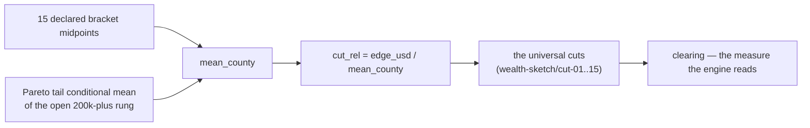

# #491 — The K=16 Rung Ladder — design dossier + implementation plan (relation-first)

> **For agentic workers:** REQUIRED SUB-SKILL — `superpowers:subagent-driven-development` (recommended)
> or `superpowers:executing-plans`. Steps use checkbox (`- [ ]`) syntax for tracking.

**Status — REVISION 2 (2026-08-17, post-adversarial-critique).** Revision 1 returned
**NEEDS-REVISION** (7 Critical, 11 Important, 5 Minor). This revision keeps everything the critique
verified sound — §2.3's LOUD find, the second-order artifact placement, the `E-TYPE-040` repair,
the B24080↔B23025 reconciliation guard — and repairs the A2 derivation chain, which was **not
sound as written**. **Executable now: T0–T7 and T8a. DIRECTOR-GATED: T8b** (the grid derivation),
**T9.6** (the seeded world), **the shipped τ**, **the `failing` definition**, and **the
household→person unit declaration**. Every reserved item is posed as a popup-ready question in
**§15 — THE DIRECTOR PANEL** (10 questions), which the controller can run as a sitting straight
from this file.
**State it plainly: the panel is now on ReserveArmy's critical path.** Revision 1 claimed the port
unblocked at T6; ADR202 R5's text blocks it behind *the artifact*, and the artifact's grid is
DP-4-gated (§6.3, DP-9).
**Authority:** ADR194 R1 (empirical quantile sketch, no parametric form); ADR173 (P(S|A) is a
measure); ADR191 R3 (Grinding Attrition, shape NOT transcribed); ADR202 R1/R2/R5/R6/R7 (the T4 curve
rulings; R5's no-interim rule for ReserveArmy); ADR210 R2/R12/R13/R14 (border valve held out;
OQ-G's midratio; the level-set assignment; κ as a `.bscn` defconst); the 2026-08-17 docket **OQ-F
ruling — RELATION-FIRST**; the same docket's disposition of **#510 into this train**; ADR098 +
ADR121 (the data-artifact lanes); ADR183 (frozen engine = structure contract, not a threshold or
shape oracle); ADR109 (wiring = typed motion + sentinel row); Constitution III.7/III.11/III.13.
**Author:** architecture pass, 2026-08-17 (night, parallel ultracode lane); **revised 2026-08-17
after adversarial critique**. Every number below was read out of the tree or measured against
`data/sqlite/marxist-data-3NF.sqlite`; line numbers are from `dev` at plan time. Numbers **re-measured
in the revision pass** (and therefore superseding revision 1 where they differ): the α partition
(22 / 5 / 39, disjoint), the per-county α distribution, the national α and reconstructed mean with
its tail sensitivity, the bottom-rung mass distribution, the B23025 identities and the 9,979-person
reconciliation delta, and the absence of any household-size instrument in the schema.

**Supersedes the pre-OQ-F draft of this same file** (9 tasks / 5 PRs, prerequisite (b) marked
"already discharged"). That draft was written before the relation-first ruling and before the data
verification in §2; where it survives it is cited as *the prior draft* and its still-valid material
is reused rather than re-derived.

### What revision 2 changed — the seven Criticals, one line each

| # | Revision-1 defect | Disposition in this revision |
|---|---|---|
| **C-1** | Household masses (B19001 `household_count`) consumed as **member** shares; the crossing never named. | **Named in the unit system as a declared conversion** (§3.3a): `household-person-equivalence`, a `.bscn` `Ratio` defconst carried at the visible identity value, its own Aleksandrov row (§3.6), its assumption ("household size independent of income bracket within a county") published in both `material_relation` strings — and its magnitude **unmeasurable in-repo**, so the measurement route is **DP-7**. |
| **C-2** | `mean_county` undefined; its only in-repo route runs through the midratios, refuting §5.3's own "the midratios are never read" defence. | **`mean_county` defined explicitly** (§5.3a) as a reconstruction from 15 declared midpoints + the tail conditional mean; the false defence **withdrawn**; the corrected dependency graph published; sensitivity measured (tail 300k→600k moves every `cut_rel` by 26 %). The choice of route is **DP-4**. |
| **C-3** | I3 pinned as an exact RED leg it can never satisfy. | **Demoted to a published residual** `mean_consistency_residual` with a declared bound (§5.3c). The RED leg now asserts *publication and bound*, not exactness. No leg in this plan can be red forever. |
| **C-4** | τ = 1 "derived" from the frozen threshold — a disqualified oracle, read at the wrong level set, contradicting H3's flow-derived `L`. | **Withdrawn as an engineering call.** §3.3 now shows what transcribing the frozen magnitude at R13's mortality level set *actually* implies (a class-varying τ, not 1) and poses the horizon as **DP-5** with three derivation options; §3.6/H3 reconciled to one horizon story. |
| **C-5** | ADR210 R12's county grain silently collapsed to one national number, from a substituted source, with T8.3 executing regardless. | **R12-vs-OQ-A surfaced as a ruling-level question** (**DP-4**) with **both** departures named; the midratio/cut objects separated so the collision is stated at its true width; **T8 split** — T8a builds the machinery and the per-option evidence, **T8b executes only what is ruled**. |
| **C-6** | ADR202 R2's asserted sign is structurally untestable in the seeded world (one shape per county, shared by every class). | **Limitation stated** in A2's `material_relation`, T5.6's register row and T10.1's not-discharged list: **R2 is CARRIED, not satisfied.** The class-varying test lives only in hand-authored fixtures; a **real-data cross-county** test is specified in its place (T8a.6) with the claim honestly downgraded. Whether that suffices is **DP-10**. |
| **C-7** | Rung 1 can never clear ⟹ an irreducible per-tick mortality floor (measured: **5.04 %** national, 4.92 % county median, 35.68 % max) that no accumulation ends. | **Grid/cut construction repaired** (§6.2 H2′): `cut-00` is not even expressible (`0.0r` is `E-LEX-027`), so the implicit-zero convention was hiding a value the language forbids naming. The measure now carries **two duals over the same grid** — `clearing` (lower bound on those who reproduce) and `failing_certain` (lower bound on those who cannot) — and **mortality reads `failing_certain`, which reaches exactly 0**, matching the frozen contract. Redefining `failing` departs from OQ-H's ruled `failing = 1 − clearing`, so it is **DP-6**; the floor is quantified and D-rowed either way. |

Ten Importants and all five Minors are dispositioned per the critique's own suggestions; the
map is in §13 (blockers) and inline at each site. Where a finding demanded theory the Director
holds (the B23025 → reserve-army-layer identification, DP-3's bourgeoisie visibility, R5's scope),
it is routed to §15 with an honest setup rather than decided here.

---

## 0. Execution preconditions — read before anything

1. **This worktree is BEHIND `dev`.** `ai/decisions/` here ends at **ADR208**; `dev` carries
   **ADR209–ADR212**, and *this plan's binding rulings R12/R13/R14 live in
   `ADR210_checkpoint_a_campaign_rulings.yaml`*, which is **not present in this checkout**.
   **First action of T0: rebase `feature/491-rung-ladder` on `origin/dev` and re-read ADR210.**
   Executing against this checkout as-is would build against rulings the tree cannot show you.
2. **Repo-read-only ends here.** The planning pass wrote exactly one file (this one). Everything
   below is normal TDD work on a branch off `dev`.
3. **Verify, do not trust, every `file:line` in this plan at the moment you use it.** The plan was
   written against a checkout that is one merge behind; the *facts* were measured, the *coordinates*
   may have moved.

---

## 1. The five deliverables, in one paragraph each

| # | Deliverable | Where it lands |
|---|---|---|
| **1** | **Relation-first mapping.** The employment relation assigns class (`fact_census_worker_class` → B24080 class-of-worker, plus `fact_census_employment` → B23025 for the layers outside the wage relation); ACS household income (B19001) shapes within-class distributions only, never assignment. | §2, T7 |
| **2** | **Subsistence-unit reconciliation.** A stock/flow unit system with a written derivation: `wealth` is a Currency stock, `s_bio`/`s_class` are Currency-per-member-per-tick flows, the bridge is a **declared horizon τ in ticks** (value **DP-5**, not decided here), and the **household→person crossing is declared, not silent** (`household-person-equivalence`, **DP-7**). | §3, T2 |
| **3** | **The `E-TYPE-040` / OQ-I repair**, scoped as one small self-contained task: split the shared `*`//` kind bullet, license `extensive ÷ extensive → intensive`, mint the missing `TypeCode` variant. | §4, T1 |
| **4** | **The ladder artifact.** **Three** files, all **second-order** (ADR121/#334 pattern — *not* new reference-DB tables): `county_class_relation_partition` (measured leaf counts) + `class_relation_mapping` (the interpreted rollup, revisable by ruling) + `county_wealth_sketch` and its grid (the within-class shape), each sha-pinned, double-run byte-identical, generator-committed. **The grid's derivation is DP-4-gated (T8b).** | §5, T7/T8a/T8b |
| **5** | **The ReserveArmy handoff.** One object the port cites instead of re-deriving: the 16 mass fields + 15 cuts, the `clearing`/`failing_certain` dual measure, and the **hold-out-horizon identity** that makes ReserveArmy's `concedes iff H < L` the *same measure at a different threshold*. R5's "full ladder, no interim" is satisfied when **the artifact lands** (T8b), not when the carrier does — see §6.3 and **DP-9**. | §6, T9 |

---

## 2. Deliverable 1 — the relation-first mapping design

### 2.1 What OQ-F changed, stated precisely

The 2026-08-17 docket ruling: *"RELATION-FIRST — class position derives from the employment relation
(ACS class-of-worker/occupation fields); household income shapes only the within-class wealth
distributions."*

This closes **GAP-2** (there is no class × income cross-tab, so *something* had to decide which class
an income record belongs to) by **removing the question**: class is never read off income at all.
It leaves **GAP-1** (the data is income; the construct is wealth) exactly where it was — the shared
county income shape, re-anchored per class through the engine-computed mean, remains the standing
PROVISIONAL answer with its Director-mandated expiry. Conflating the two is the single most likely
implementation error; every artifact below carries the distinction in its `material_relation` string.

### 2.2 Wire-before-buy (#546): the relation variable is ALREADY IN-REPO

Measured this pass against `data/sqlite/marxist-data-3NF.sqlite`:

| Table | Grain | Rows | Vintages | Verdict |
|---|---|---|---|---|
| `fact_census_worker_class` (`county_id, source_id, gender_id, class_id, time_id, race_id, worker_count`) | county × COW-code × gender × year, single race (`race_id=1`) | 900,900 | `time_id` 14–27 = **2010–2023 annual** | **PRESENT.** This is ACS **B24080**, already annotated to four Marxian categories by `dim_worker_class.marxian_class`. |
| `fact_census_employment` (`county_id, source_id, status_id, time_id, race_id, person_count`) | county × B23025 status × year, single race | 22,547 | `time_id` **419 only = 2021** (a month-grained row: `dim_time` 419 → year 2021, month 12) | **PRESENT, single vintage.** Carries `Employed / Unemployed / Armed Forces / Not in labor force` — the layers B24080 cannot see. |
| `dim_occupation` (`labor_type` column) | 74 rows | — | — | **DEAD.** `labor_type` is NULL on all 74 rows and no `fact_*` references `occupation_id`; `fact_census_occupation` was AMPUTATE-ruled and deleted. **Do not plan against occupation.** |
| ACS **PUMS** (the only true class × income joint variable) | person | — | — | **ABSENT** in-repo and on `/media/user/data/babylon-data/` (glob sweeps in the data-reality report). Acquisition + PUMA→county small-area estimation, out of scope. |

**Consequence: the plan's first data task is a WIRING task, not an acquisition decision.** #546's
standing rule is satisfied by naming what is here; nothing is bought. The one acquisition question
that *does* arise (PUMS, for the within-class shape) is routed as **DP-2** in §15 and is explicitly
not this train's work.

### 2.3 🔴 LOUD FINDING — `view_class_composition` is arithmetically wrong, and it is the exact artifact the ruling points at

`dim_worker_class` maps **B24080_003** and **B24080_013** — *"Private for-profit wage and salary
workers"* — to `marxian_class = 'proletariat'`. In B24080 those two rows are **nested parents**, not
leaves:

```
B24080_002 Male                                        13721   ← parent of 003,006..011
  B24080_003   Private for-profit wage and salary      10012   ← PARENT
    B24080_004     Employee of private company          9598   ←   leaf → proletariat
    B24080_005     Self-employed, own INCORPORATED       414   ←   leaf → petty_bourgeois
  B24080_006   Private not-for-profit                     705
  B24080_007/008/009  Local/State/Federal government   888/904/593
  B24080_010   Self-employed, own UNINCORPORATED         606
  B24080_011   Unpaid family workers                      13
```

`9598 + 414 = 10012` exactly, and `10012+705+888+904+593+606+13 = 13721 = B24080_002` exactly
(measured, `county_id = MIN`, `time_id = MAX`). `view_class_composition` filters only on
`marxian_class IS NOT NULL`, so it **sums the parent alongside its own children**.

Measured nationally at the latest vintage:

| Aggregation | proletariat | state_worker | petty_bourgeois | unpaid_labor | total |
|---|---|---|---|---|---|
| `view_class_composition` as written | **232,394,763** | 23,054,142 | 15,756,381 | 312,961 | 271,518,247 |
| Leaf-only (exclude `_003`/`_013`) | **119,953,078** | 23,054,142 | 15,756,381 | 312,961 | **159,076,562** |
| ACS's own `Male + Female` totals (`_002 + _012`) | — | — | — | — | **159,076,562** ✔ |

The leaf-only sum matches the ACS's own gender totals **to the person**, which is the proof that
`{_004,_005,_006,_007,_008,_009,_010,_011}` ∪ the female mirror is exactly the partition.

**Severity.** The view inflates the proletariat headcount by **+93.7 %** (+112.4 M phantom workers),
inflates the universe by 70 % beyond the entire US employed population, and — worse than inflation —
**counts the same 15.7 M incorporated self-employed in two different Marxian classes at once**
(inside `_003`'s proletariat total *and* as `_005` petty_bourgeois). It is not a partition.

**Why nobody has been bitten:** `view_class_composition` has **zero consumers**
(`reports/data-constitution-triage-2026-07-16.md:90,102`; the Director's 2026-08-17 docket ruling
C-14). This train would have been its first, which is exactly the "data-on-the-shelf" failure mode
#546's standing observation names.

**Disposition (engineering call, E-1 in §7):** the derivation excludes nested parents **by class_code, by
construction**, guarded by a mutation-validated sentinel that asserts the leaf sum equals
`_002 + _012` per county-year. The `dim_worker_class` row fix (NULL out `marxian_class` on `_003`
and `_013`, matching how `_001/_002/_012/NAM` are already NULL) is filed as a **separate data-hygiene
item** routed to #547 — it moves a parquet source and therefore the reference-DB sha, which is a
declared ceremony this train must not absorb. `view_class_composition` is marked
**DO-NOT-CONSUME** in `data-catalog.yaml` until that fix lands.
*Rejected alternative:* fix the dim first and consume the view. Rejected because it couples a
byte-pinned DB rebuild ceremony to a train that otherwise touches no sqlite table, and because a
derivation that is correct only *because* an upstream dim was fixed has no guard of its own.

### 2.4 The partition the train actually builds

**The universe is verified, not asserted** (revision-2 repair, critique I-10). It is exactly
**B23025_001**, whose ACS shell reads *"Population 16 years and over"* — the exact universe string is
**transcribed at implementation from the shell and asserted by a test against `dim_employment_status`'s
own label**, never paraphrased in code. Measured this pass at 2021 (`time_id = 419`, `race_id = 1`):

```
B23025_001 Total (16+)              266,885,578
  _002 In labor force               169,108,005   = _003 + _006          ✔ exact
    _003 Civilian labor force       167,908,608   = _004 + _005          ✔ exact
      _004 Employed                 158,566,825
      _005 Unemployed                 9,341,783
    _006 Armed Forces                 1,199,397
  _007 Not in labor force            97,777,573   ( _002 + _007 = _001   ✔ exact )
```

**Who sits outside the universe, stated because DP-1's option space depends on it:** persons under
16. **Who sits inside but is NOT separately recoverable:** the **institutionalized population** —
ACS assigns institutional group-quarters residents an employment status, so they fall **inside
`not_in_labor_force`** and neither instrument can split them out. That is precisely the layer
`LUMPENPROLETARIAT` and `CARCERAL_ENFORCER` are built on (DP-1). The A1 column is therefore named
**`universe_b23025_001`**, not `universe_16plus` — the artifact's most consequential column carries
its table code, not an assumption.

Seven mutually exclusive, collectively exhaustive relation classes. **The `Source leaves` column is
MEASURED; the `Material relation` column is INTERPRETED** — the distinction the critique's I-1
correctly says revision 1 blurred:

| `relation_class` | Source leaves | Material relation (Aleksandrov trace) | Interpretation status |
|---|---|---|---|
| `proletariat` | B24080 `_004,_006` + `_014,_016` | Sells labour power to private capital (for-profit and not-for-profit alike). | `dim_worker_class`'s own annotation |
| `state_worker` | B24080 `_007,_008,_009` + `_017,_018,_019` | Sells labour power to the state apparatus. **Contains the carceral apparatus, which COW cannot separate** (DP-1). | `dim_worker_class`'s own annotation |
| `petty_bourgeois` | B24080 `_005,_010` + `_015,_020` | Works its own means of production. **`_005/_015` — "self-employed in own INCORPORATED business", 6,218,347 people at 2023 (measured) — includes proprietors who employ wage labour, i.e. capitalists by relation. ACS cannot separate them, so this class is NOT purely petty-bourgeois** (DP-3). | `dim_worker_class`'s annotation + a KNOWN admixture |
| `unpaid_labor` | B24080 `_011` + `_021` | Works within a family enterprise without a wage — reproduction inside the value form. | `dim_worker_class`'s own annotation |
| `unemployed` | B23025 `_005` | Expelled from the wage relation but still seeking it. Identifying this with Marx's **floating** layer is a class-composition reading, not a measurement. | **INTERPRETED — DP-1** |
| `not_in_labor_force` | B23025 `_007` | Outside the wage relation. Identifying this with the **stagnant + latent** layers is likewise a reading; the row also contains the retired, disabled, students **and the institutionalized**. | **INTERPRETED — DP-1** |
| `armed_forces` | B23025 `_006` | Bears arms for the imperial state; outside the civilian wage relation by measurement. | measured category, unmapped role |

**Consequence for A1's shape (engineering call, revision 2).** Because three of the seven rows are
readings rather than measurements, **A1 publishes the MEASURED LEAF ROWS**, and the seven-class
rollup enters as a **declared mapping column** sourced from a small committed mapping file
(`class_relation_mapping.csv`). A later Director ruling on DP-1/DP-3 then revises **the mapping
file**, not the measured artifact — no regeneration, no sha ceremony on measured counts. This is
what replaces revision 1's "A1 carries NO provisional marking": A1's leaf counts are measured and
unmarked; A1's `relation_class` column is marked **MAPPING-PROVISIONAL (DP-1/DP-3)**.

**Reconciliation guard, with its measured tolerance (M-2 repair):** `Σ B24080 leaves` must equal
B23025 `_004` (Employed) per county-vintage — both are the same ACS instrument. **Measured
nationally at 2021: 158,556,846 vs 158,566,825 — a delta of 9,979 (0.0063 %).** The guard therefore
carries a **declared relative tolerance** (proposed: 0.05 % of `_004` per county, with the national
figure and the per-county delta distribution published in `material_relation`); **G3 (disjoint,
sums to `universe_b23025_001`) inherits the same tolerance** — revision 1 stated G3 as exact, which
the 9,979-person delta refutes.

**Vintage + join guard (M-1 repair — the `dim_time.year` join fans out).** Measured: **year 2021
resolves to `time_id` 25 (annual), 161–172 (monthly) and 419**. A literal `dim_time`-mediated
fact-to-fact join therefore duplicates rows. The declared form is **year-keyed aggregation, never a
join through `dim_time`**: aggregate each fact **independently** to `(county_fips, year)` under an
explicit per-fact `time_id` allowlist (`fact_census_worker_class` → the annual series 14–27;
`fact_census_employment` → 419), then join the two aggregates on `(county_fips, year)`. A test pins
that year 2021 resolves to more than one `time_id` **and** that the aggregate join returns exactly
one row per `(county, class)` — the fan-out is asserted, not assumed away. Only one common year
exists today: **2021**; its singularity is a disclosure in `material_relation`, not a footnote.

**What relation-first does NOT give us.** B24080's universe is the *civilian employed population 16
and over*, so it cannot see a capitalist who lives on ownership alone, and it cannot see children.
`unemployed`/`not_in_labor_force` recover the reserve army. But the owning class is **not simply
absent**: to the extent its members work in their own incorporated firms they are **silently inside
`petty_bourgeois`** via `_005/_015` (6.2 M people at 2023). DP-3 in §15 is posed on that corrected
premise — revision 1's "the owning class has no relation row at all" was false.

### 2.5 Income's remaining, strictly-bounded role

After OQ-F, income enters at exactly one place: the **within-class dispersion shape**, shared across
classes within a county, re-anchored to each class's engine-computed mean by the mean-relative cut
grid. Because the grid is mean-relative, two classes with the same shape but different means occupy
**different absolute wealth positions** — stratification enters through the means (already
theory-laden via wages + imperial rent), never through a statistical independence product.

Three prohibitions, each a test in T7/T8, not a comment:

1. **No income-keyed class assignment**, in any form (threshold, independence, IPF against the income
   marginal). Structurally asserted: no code path multiplies an income marginal by a class marginal.
2. **No claim that GAP-1 is closed.** The shape is income; the construct is wealth. PROVISIONAL,
   citing #510, at every entry point.
3. **No claim that #510 is fully discharged.** Its *assignment* half closes here; its *shape* half
   cannot close with in-repo data (DP-2).

---

## 3. Deliverable 2 — the subsistence-unit reconciliation, with its derivation

### 3.1 The problem, in units

Three quantities in the tree, and until this section they were not commensurable:

| Quantity | Site | Declared type | Actual dimension |
|---|---|---|---|
| `SurvivalDefines.default_subsistence = 0.3` | `src/babylon/config/defines/survival.py:23-28` (`ge=0.0, le=1.0`) | dimensionless `[0,1]` | compared against `wealth/population`, an **unbounded Currency-per-member** (`engine/systems/survival.py:143,154-158`) — a category error, and an artifact of the logistic era exactly like `steepness_k` |
| `EconomyDefines.base_subsistence = 0.0005` | `src/babylon/config/defines/economy_basic.py:267-275` | `[0,0.5]` float | a **per-member-per-tick rate**: `cost = (base_subsistence × population) × multiplier`, `engine/systems/vitality.py:118-120` |
| `s_bio + s_class` | `rust/.../content/rules/vitality.bsl:49-50,74`; frozen `formulas/vitality.py:38` | `int intensive` today, `currency intensive` after T3 | **Currency per member per tick** — the value of labour power's two components |

### 3.2 The unresolved dimensional error nobody had named

The ladder's comparison is `cut_{k-1} · w̄  ≥  S`.

- `w̄ = wealth ÷ population` is a **STOCK** per member (Currency).
- `S = s_bio (+ s_class)` is a **FLOW** per member per tick (Currency · tick⁻¹).

**A stock cannot be compared to a flow.** The prior draft declared the unit "per-member money" and
stopped — which is true of the left side and false of the right. The frozen engine already contains
the missing term, unnamed:

```python
# src/babylon/formulas/vitality.py:35-42  (read this pass, verbatim)
coverage_ratio = wealth_per_capita / subsistence_needs      # STOCK ÷ FLOW → TICKS
threshold = 1.0 + inequality
if coverage_ratio >= threshold:                             # survive
    return 0.0
```

`coverage_ratio` is a **duration in ticks** — how long a member can reproduce out of held wealth.
`threshold` is that duration's floor.

**Read this as a diagnosis, not as a derivation.** It shows that the frozen engine already carries
the missing dimensional term; it does **not** license transcribing that term's *value* into the
ladder — see §3.3b, where revision 1 did exactly that and the move is withdrawn.

### 3.3 The unit system, and the two constructs that bridge it

**Declared unit system** (revision 2 adds the mass rows — the crossing revision 1 left unnamed):

```
wealth            : Currency                        (stock,  extensive)
population        : count of MEMBERS                (        extensive)
w̄  = wealth ÷ population : Currency / member        (stock,  intensive)   ← licensed by §4
s_bio, s_class    : Currency / member / tick        (flow,   intensive)
S   = s_bio  |  s_bio + s_class                     (flow,   intensive)   ← level set, ADR210 R13
τ   : ticks                                         (Ratio defconst)      ← VALUE RESERVED: DP-5
S_stock = S · τ   : Currency / member               (stock,  intensive)
mass_k            : share of MEMBERS in rung k      (dimensionless, intensive, Σ = 1)
  derived from
mass^hh_k         : share of HOUSEHOLDS in rung k   (dimensionless — B19001 `household_count`)
η_k               : members per household in rung k, RELATIVE to the county mean
                    ← THE CROSSING. §3.3a. UNMEASURED in-repo. DP-7.
```

The comparison becomes `cut_{k-1} · w̄ ≥ S · τ` — Currency-per-member on both sides, dimensionally
exact. **The mass rows are the other half of the dimensional story, and revision 1 had them wrong.**

### 3.3a The household→person crossing, declared (C-1 repair)

A2's masses come from `fact_census_income.household_count` — **households**. The measure consumes
them as **member** shares: `clearing = Σ_k mass_k · c_k` over a class whose `population` counts
members, and `deaths = floor(population × failing × κ)` kills people. Revision 1's §3.3 was
scrupulous about Currency-per-member-per-tick and then imported a per-household shape into
per-member space without naming it. Named now:

```
mass_k  =  (mass^hh_k · η_k) / Σ_j (mass^hh_j · η_j)
```

- **A county-constant household size CANCELS EXACTLY.** Masses are normalised shares, so if η is the
  same in every rung the conversion is a numerical no-op. The whole content of the assumption is
  therefore **rung-independence of household size within a county at the declared vintage** —
  `η_k ≡ 1` for all *k*. That, and only that, is what is being assumed.
- **It is not true in the world**, and it is untrue in the direction that matters — household size
  covaries with income across exactly the tails the ladder exists to resolve. So the magnitude is
  what matters, and:
- **No in-repo instrument measures it.** Verified this pass against
  `data/sqlite/marxist-data-3NF.sqlite`: `fact_census_housing` carries *tenure* counts (owner /
  renter / total occupied units), not size; `dim_county` has no population column; there is **no
  B25010 / B11016 / B19019-family table** anywhere in the schema. The reference DB cannot bound this
  assumption, and a plan that claims a bound it cannot compute is exactly the fabrication this train
  is meant to stop doing.

**Declaration, in three places, so it cannot be re-hidden:**

1. **Content:** `(defconst wealth-sketch/household-person-equivalence 1.0r)` in the scenario, with a
   header comment stating it is the declared `η_k ≡ 1` bridge, that it cancels by construction at
   the identity value, and that the object which would *change* numbers is a per-rung vector the
   reference DB does not carry.
2. **Artifact:** A2 publishes **both** `mass_household` (measured) and `mass_member` (consumed),
   plus an **empty** `person_equivalence` column (L-ABS: unmeasured is empty, never `1.0` written as
   if measured). Today `mass_member == mass_household` **as a declared consequence, published as
   such** — never as a coincidence a later reader has to reverse-engineer.
3. **Aleksandrov + PROVISIONAL:** its own row in §3.6, and the `#510` PROVISIONAL string is extended
   from "income ≠ wealth" to "**income ≠ wealth AND households ≠ members**" at every entry point.

**What the Director is being asked** (DP-7): keep the declared identity crossing; or restructure A2
and the measure to stay in household units end-to-end (which relocates the same conversion onto the
consumer — the engine has no per-class household count, so it would have to derive one); or acquire
a size-by-income instrument under #546's wire-before-buy procedure. Options and costs: §15.

### 3.3b τ, the subsistence horizon — RESERVED, not derived (C-4 repair)

Revision 1 wrote "τ = 1 tick, derived — not picked." **That derivation does not hold.** Three
independent problems, each verified this pass:

1. **The source is disqualified.** τ was read off the frozen `coverage_ratio ≥ 1 + inequality` test.
   ADR210 R13 says, in the sentence this plan cites for the level sets: *"ADR183: the frozen engine
   is a structure contract, **not a threshold oracle**."* κ carries an explicit licence for
   frozen-magnitude calibration (OQ-H / R14, "default DERIVED with the derivation recorded"); **τ
   carries none**. Revision 1 helped itself to κ's licence.
2. **It was read at the wrong level set.** Verified verbatim, `src/babylon/formulas/vitality.py:29`:
   `subsistence_needs` is documented *"Per-capita subsistence requirement (**s_bio + s_class**)"* —
   the level set ADR210 R13 assigns to **acquiescence**. R13 assigns **mortality `s_bio` alone**. So
   the frozen `1` is a horizon *for the frozen S*, and the mortality reading changes S underneath it.
   Push the transcription through honestly and it does **not** give 1: preserving the frozen *death
   level* at R13's mortality level set requires

   ```
   τ_bio  =  (s_bio + s_class) / s_bio        — class-varying, data-dependent, ≠ 1
   ```

   which also re-imports `s_class` into the very level set R13 just separated. Transcribing the
   frozen magnitude and honouring R13 are **incompatible**; revision 1 did neither and called the
   residual `1` a derivation.
3. **It contradicted the plan's own best idea.** §3.6 traces τ as a hold-out horizon; H3 derives
   ReserveArmy's `L = reserve_army_stock ÷ absorption_flow` **from material flows**. Two horizons of
   the same declared kind, one stipulated and one derived. **One horizon story must stand** — that
   is the substance of DP-5, and H3's elegance is the argument for deriving both.

**Disposition: τ's value is a Director decision (DP-5, §15)**, with three options — (A) τ ≡ 1 tick
as a *definitional* accounting identity (the tick **is** the reproduction period; the mortality test
asks "does held wealth buy this tick's reproduction?"), invoking no frozen authority and letting the
level set do the theoretical work; (B) frozen-magnitude preservation, i.e. the class-varying `τ_bio`
above (analysed above and **not recommended** — it is the threshold-oracle move R13/ADR183 forbid);
(C) τ derived as a material hold-out horizon, the same construction as `L`, so mortality and wage
pressure share ONE horizon (theoretically strongest; **blocked** on the absorption-flow producer,
H5(i), which does not exist yet).

Two consequences hold under **every** option and are recorded regardless:

1. **`social-class/inequality` is explained.** The design doc records it as "declared and seeded,
   read by NO rule" (`vitality-conformance.bscn:31-34`). It is the frozen **dispersion surrogate** —
   its own docstring says so (*"with high inequality (e.g. 0.8), you need almost 2x subsistence"*,
   `formulas/vitality.py:23-25`) — and the ladder measures what it faked. Retiring the field is a
   content D-row at the Vitality port, not a theory call: ADR194 R1 already ruled the empirical
   sketch canonical. **Note the sharper reading the critique forces:** `inequality` enters the frozen
   form **twice** — in the threshold *and* in the slope (`vitality.py:39,47`) — so retiring it is
   also a slope change, which is κ's problem (§3.5, I-8).
2. **`SurvivalDefines.default_subsistence` retires** alongside `steepness_k` under ADR173 (1) — a
   consequence for the Survival port to execute, **not a change this train makes to frozen Python.**

**τ's home is unaffected by DP-5:** a `.bscn` defconst — `(defconst vitality/subsistence-horizon …)`
— for the identical reason ADR210 R14 gives for κ: a `GameDefines` field moves `defines_hash`, which
`tools/regression_test.py:1283-1285` compares as a hard gate across all 11 baselines, so it would
fail `qa:regression` on the spot and owe a §6.5 ceremony for a constant the frozen engine has no
consumer for. Because it is content, **the conformance world may declare a fixture value and T4–T6
can execute before DP-5 is ruled** (the scenario header states the value is fixture-declared, not
shipped); only the seeded world's value waits.

**What τ does NOT foreclose.** #546's reserved item 6 asks whether a *county-varying* subsistence cost
enters P(S|A). The unit system above admits a per-`(class, county)` `S` with **zero redesign** —
`s_bio`/`s_class` are already per-class intensive fields. Say so in the record so the ruling, when it
comes, is a seeding change and not an architecture change.

### 3.4 The prohibition this record must carry as law, not as a note

**Never compute `S / w̄`.** `Currency ÷ Currency → Coefficient` must land in `[0,1]` or it is
`E-EVAL-013` (`docs/reference/bsl-language.rst:2496-2497`; `rust/crates/babylon-bsl/src/evaluator.rs:1650-1660`).
A class below subsistence has `S·τ > w̄`, so the dimensionless spelling **fails at runtime for exactly
the class the measure exists to describe** — a happy-path conformance suite would never catch it.
The comparison is money-vs-money, always.

### 3.5 The second constant — κ — and why it is a different kind of thing

`deaths = floor(population × failing × κ)` (ADR210 R14: `.bscn` defconst, default **derived** with the
derivation recorded).

- **τ** converts a *flow threshold* into a *stock threshold* — a duration. Unit: ticks.
- **κ** converts a *failing mass* (a share of members) into a *death flow* (members per tick) — a
  hazard rate. Unit: tick⁻¹.

Neither bends a curve: τ slides the level set, κ scales the flow uniformly. Shape lives entirely in
the measured distribution, which is how the `wiring-completeness:552` steepness-knob trap is
discharged **by construction** rather than by promise.

**κ's derivation (T6) — specified properly (I-8 repair).** Revision 1 said "declare a named fixture;
measure the frozen deaths-per-tick; solve for κ" and named no fixture. That relocates the picked
number one level down: the frozen form is

```
attrition_rate = (threshold − coverage_ratio) × (attrition_base_factor + inequality),
threshold      = 1 + inequality                       (vitality.py:35-49, verified)
```

so **`inequality` enters the threshold AND the slope**; a one-point fit reproduces the frozen flow
**at that fixture only**, and diverges everywhere else. Three requirements, all of which T6.3 must
satisfy for R14's "DERIVED with the derivation recorded" to mean anything:

1. **Name and justify the fixture.** The calibration fixture is declared in the scenario by name,
   with its `(coverage_ratio, inequality, population)` written out and a one-sentence justification
   of why that point is the right reference (proposal: the frozen engine's own conformance point, so
   the reference is one the estate already treats as canonical).
2. **Kill the level-set contamination by construction.** The fit crosses R13's level-set change
   (frozen `S = s_bio + s_class`; mortality reads `s_bio`), which κ would otherwise silently absorb
   as a magnitude. **Fix: choose the calibration fixture with `s_class = 0`**, so the two level sets
   coincide at the reference point and κ absorbs only the shape substitution it is licensed to
   absorb. If the Director prefers a fixture with `s_class > 0`, the contamination is recorded in
   the D-row as a named magnitude, not left implicit.
3. **Publish the divergence surface, not just the fit point.** T6 emits a small table of frozen vs
   ported deaths-per-tick over a declared sweep of `(coverage_ratio, inequality)` — the honest
   evidence that κ is a scale and the rest is shape substitution. This table **is** the ADR183
   divergence D-row's exhibit; without it "derived" is a word, not a record.

Do not pick a number — picking one recreates `attrition_base_factor` with a better name, and
ADR191 R3 rules that form NOT transcribed. **κ multiplies whichever mass DP-6 rules the mortality
driver** (`failing` today, `failing_certain` under §6.2 H2′); the derivation recipe is unchanged by
that choice, but the fitted value is not — so T6.3 records which driver it fitted against.

### 3.6 Aleksandrov traces (the material relation behind each construct)

| Construct | Trace |
|---|---|
| `wealth-mass-k` | The share of a class's members whose held wealth falls in rung *k* — a distribution of a real stock over real people. |
| `cut-k` | The *k*-th ACS bracket edge as a multiple of the mean: a real dollar boundary in a measured schedule, made scale-free so it travels with the class's own mean. |
| `s_bio` | The per-member per-tick cost of biological reproduction — the value of labour power's physical component (Cap. I ch. 6). |
| `s_class` | Its historically-determined social component: what reproduction costs *at this class's own standard*. |
| `τ` | The number of ticks a member can reproduce out of held wealth before the wage relation compels submission. A stock buys time; τ is how much. **Its construction is DP-5** — under (A) τ is the tick's own accounting period; under (C) it is the same flow-derived object as ReserveArmy's `L`. The trace holds either way; only the derivation differs. |
| `κ` | The rate at which failure-to-reproduce becomes death — the observed mortality flow of a population that cannot reproduce itself. |
| `clearing` | The mass of class members the ladder can **establish** reproduce themselves for τ ticks at S — a lower bound on the true share, because a rung counts only when its whole span clears. A headcount, not a curve. |
| `failing_certain` | Its dual: the mass the ladder can establish **cannot** reproduce (the whole rung sits below the threshold). Also a lower bound. Deaths follow what is established, not what is unresolved (DP-6). |
| `straddle_band` | `1 − clearing − failing_certain` — exactly the mass of the one rung the threshold cuts through. **The ladder's declared resolution**: the members whose fate the K=16 grid cannot resolve. Published, never silently assigned to either side. |
| `η` (`household-person-equivalence`) | How many members a household in rung *k* contains, relative to the county mean. The bridge between an instrument that counts households and a class that contains people. Declared at `η_k ≡ 1`; **unmeasured in-repo** (§3.3a, DP-7). |
| `mean_county` | The county's mean household income at the declared vintage — the scale that makes a dollar edge comparable to a class's engine-computed mean wealth. **Not in the reference DB**; §5.3a defines its reconstruction and DP-4 rules its route. |
| `relation_class` | The relation each person stands in to the means of production, as the Census measures it: sells labour power to capital / to the state / works own means / unpaid within the family / expelled from the wage relation. **The four COW rows are `dim_worker_class`'s annotation; the three B23025 rows are an interpretation (DP-1).** |
| `unemployed`, `not_in_labor_force` | Measured ACS labour-force categories. Their identification with the reserve army's **floating** and **stagnant/latent** layers is class-composition theory the Director holds — carried here as a reading, marked as one (DP-1). |
| `pareto_alpha`, top `midratio` | The measured thinning rate of the top of a county's income schedule — a fact about counts in two brackets, from which a conditional mean is *inferred* under a Pareto tail. The inference is load-bearing for the measure via `mean_county` (§5.3a) — not decorative, as revision 1 claimed. |

---

## 4. Deliverable 3 — the `E-TYPE-040` / OQ-I repair (its own small task)

### 4.1 State of the estate, verified this pass

- The spec bullet (`docs/reference/bsl-language.rst:2613-2616`) governs `*` and `/` **together**:
  *"`E-TYPE-040` if both are extensive (an area-of-an-area) — this is deliberately conservative and a
  Phase-1 review item."*
- `rust/crates/babylon-bsl/src/typecheck.rs` `TypeCode` carries **six** variants — 016, 017, 041,
  042, 043, 044. **There is no `E-TYPE-040` variant at all.** The crate's only occurrence of the code
  is the module doc at `typecheck.rs:19` deferring it.
- So `extensive ÷ extensive` is **silently accepted today**, which is why `lifecycle.bsl:305`
  (`(/ deaths pop-d-prime)`) loads.
- `ai/bsl-architecture-standard.md:131` lists `E-TYPE-040/041/042/043` together, giving no signal
  that one of the four is unimplemented.

### 4.2 The repair

`w̄ = wealth ÷ population` is extensive ÷ extensive and is the **definition** of an intensive
quantity (density = mass ÷ volume). An area-of-an-area is a real error for **multiplication** only.

1. **Split the bullet.** `*` keeps `E-TYPE-040` for extensive × extensive. `/` gets its own rule:
   **`extensive ÷ extensive → intensive`**, no error.
2. **Mint `TypeCode::KindMixing → "E-TYPE-040"`** and implement the expression-kind arm over
   `<arith>` and `if`, honouring the existing kind sources (literal = neutral; `:const` = neutral;
   `:field`/`field-of`/`membership-field-of` carry the `deffield` kind; `:metric`/`metric-of` carry
   the §2.11 declared kind; a weighted intensive `mean` is intensive per D90).
3. **Standing:** unit algebra, not new mathematics — the same standing D90 took for the symmetric gap
   (`bsl-language.rst:2665-2673` says in as many words that the fold table exists *because* the
   `*`//` bullet rejects extensive ÷ extensive). AE (ii) is not engaged.

**Engineering call:** implement the arm now rather than only editing the spec.
*Rationale:* T5's `w̄` is the canonical instance; landing the measure against an unenforced prohibition
would leave the train's central binding legal-by-accident. *Rejected alternative:* edit the spec
bullet only and defer the arm to the general expression typechecker. Rejected because ADR202 R1(c)
names an *implemented-or-retired* D-row, and "the spec says X, nothing checks X" is precisely the
condition the register row already hides.

**Expect a real find.** The prohibition is normative and unenforced, so nothing in committed content
has ever been checked against it. If a committed pack now fails `E-TYPE-040`: **report it, do not
weaken the arm.**

---

## 5. Deliverable 4 — the ladder artifact

### 5.1 Where it lives — the engineering call

**Two SECOND-ORDER artifacts, outside the reference DB**, following #334's ADR098 disposition and the
ADR121 hand-maintained-artifact pattern (`data-artifacts.yaml:1-30`'s EXCEPTION note; generator
precedent `tools/make_faf_bloc_tons_artifact.py`; tripwire precedent
`tests/unit/tools/test_faf_artifact_manifest_entry.py:45-70`).

*Rationale:* the sqlite file **is** a build product (ADR098) whose sha is the contract. A derived
`fact_*` table computed **from** that DB and written **into** it is circular — #334 resolved exactly
this and the resolution is now precedent. Second-order artifacts get **no `schema.sql` table**, so
`data:schema` / `data:build-db` / `data:verify-build` / `data:verify-roundtrip` / `data:subset` are
**untouched by construction**, and the reference-DB byte-identity contract cannot be perturbed by this
train at all.

*Rejected alternative:* the design doc §4.4 stage 1 (`dim_wealth_sketch_bracket` + a
`fact_class_wealth_sketch` inside the reference DB), which the prior draft carried. Rejected on the
ADR098 circularity, on the pinned-sqlite-3.53.1 rebuild ceremony it drags in, and because
`make_data_artifacts.main()` rewrites the whole `artifacts:` list from its own tuple — a
KNOWN RISK (`data-artifacts.yaml:19-30`) that has already silently dropped hand-maintained rows.

**Reproducibility contract** (the only one a second-order artifact has): (a) generator double-run
byte identity, (b) the manifest `sha256` pin, (c) a regeneration-wipe tripwire test asserting the
names do **not** appear in `make_data_artifacts.ARTIFACTS`. **Never hand-type a sha256**
(`docs/how-to/reference-data-pipeline.rst:63-65`) — the generator prints the manifest block.

### 5.2 A1 — `county_class_relation_partition`

**Two files, because measurement and interpretation must be separable** (revision-2 change, I-1/I-2):

`src/babylon/data/reference/national/county_class_relation_partition.csv.gz` — **one row per
`(fips, vintage_year, source_leaf_code)`**, the MEASURED artifact:

```
fips, vintage_year, source_leaf_code, source_table, member_count,
universe_b23025_001, reconciliation_delta, absence_class
```

`src/babylon/data/reference/national/class_relation_mapping.csv` — the small, hand-maintained,
**INTERPRETED** file: `source_leaf_code → relation_class`, one row per leaf, with a
`interpretation_status` column (`ANNOTATED` for the rows that reproduce `dim_worker_class`'s own
`marxian_class`, `INTERPRETED` for the three B23025 readings) and a `material_relation` note per
row. A DP-1/DP-3 ruling revises **this file**; the measured artifact and its sha do not move.

- `absence_class` ∈ `PRESENT | ROW_ABSENT | VINTAGE_MISMATCH | RECONCILIATION_FAIL | LOW_COUNT`.
- **Absence is a value, never `0.0`** (L-ABS / ADR070): non-`PRESENT` rows carry **empty** measure
  cells, not zeros.
- `reconciliation_delta` = `Σ B24080 leaves − B23025_004`, published per county-vintage, never
  hidden. Measured national reference at 2021: **9,979 (0.0063 %)**.
- `universe_b23025_001` carries the exact transcribed ACS universe string in `material_relation`
  plus the explicit statement of who sits outside it (under-16s) and who sits inside it
  unrecoverably (the institutionalized, inside `not_in_labor_force`) — I-10's repair.
- `material_relation` carries: the leaf-only partition rule and **the `_003`/`_013` nested-parent
  exclusion with its measured magnitude**; the single-vintage disclosure (2021); the **year-keyed
  aggregation rule** (§2.4, M-1); the `_005/_015` admixture statement (**the owning class is not
  absent — part of it is inside `petty_bourgeois`**, DP-3); the MAPPING-PROVISIONAL marking on the
  `relation_class` column with its DP-1/DP-3 citation; and that `view_class_composition` is
  superseded and DO-NOT-CONSUME pending the #547 dim fix.
- **Guards (each its own test module + mutation leg):**
  G1 leaf-sum == `_002 + _012` per county-vintage (the identity measured in §2.3);
  G2 nested parents `_003`/`_013` appear in **no** sum — asserted structurally, by class_code;
  G3 the seven mapped classes are pairwise disjoint and sum to `universe_b23025_001` **within the
  declared reconciliation tolerance** — *not* exactly (M-2: the measured delta is 9,979 people);
  G4 `race_id = 1` only — a test that computes the naive all-race sum and asserts it **differs**
  (the `fact_census_hours` silent-label-bug class);
  G5 gender leaves summed exactly once (`gender_id` 2 carries `class_id` 2–11, 3 carries 12–21 —
  measured; no cross-product);
  G6 the year-keyed aggregation form: a test asserting that **year 2021 resolves to more than one
  `time_id`** (measured: 25, 161–172, 419) **and** that the two per-fact aggregates join to exactly
  one row per `(county, leaf)` — the fan-out is pinned, not assumed away;
  G7 **no income column, no income table, is read by this generator at all** — the relation-first
  prohibition, asserted structurally;
  G8 every `source_leaf_code` in the artifact appears exactly once in the mapping file, and every
  mapping row's `interpretation_status` is one of the two declared values — the seam that keeps
  a DP-1 ruling cheap.

### 5.3 A2 — `county_wealth_sketch` + the universal grid

`src/babylon/data/reference/national/county_wealth_sketch.csv.gz` — one row per
`(fips, vintage_year, rung 1..16)`:

```
fips, vintage_year, rung, mass_household, mass_member, person_equivalence,
households_raw, rebin_residual, mean_consistency_residual, mean_county_usd,
midratio_16_county, absence_class
```

`mass_household` is measured; `mass_member` is what the carrier seeds; `person_equivalence` is
**empty** (§3.3a — unmeasured, never `1.0` written as if measured), and the two mass columns are
equal today **as a published consequence of the declared `η_k ≡ 1`**, not as an accident.
`mean_county_usd` and `midratio_16_county` are published per county whatever DP-4 rules, because
the reconstruction is county-level even when the *grid* is not — a reader must be able to see the
scale that produced the cuts.

`src/babylon/data/reference/national/wealth_sketch_grid.csv` — the universal, declared grid
(15 cuts + the declared midpoint schedule + the OQ-G derivation), the file the `.bscn` `defconst`s
transcribe from:

```
rung, edge_lower_usd, edge_upper_usd, midpoint_usd, cut_rel, midratio_rel,
derivation_note, tie_rule, excluded_county_count
```

**The B19001 schedule is transcribed as declared constants.** `dim_income_bracket.bracket_min_usd`
and `bracket_max_usd` are **NULL on all 17 rows** (measured) — the edges exist only inside
`bracket_label` strings. **Never parse money out of a display string**; transcribe the schedule and
have a test assert it matches the labels. Bracket order 17 (`NAM`) has zero fact rows: exclude it and
assert the zero.

### 5.3a `mean_county` — defined, with its dependency graph (C-2 repair)

Revision 1 used `mean_county` in **both** grid definitions and **never defined it**. It is the scale
every `cut_rel` is divided by, so nothing downstream is well-posed without it.

**It cannot be read from the DB.** The only income tables are `fact_census_income` (B19001 bracket
counts), `fact_census_median_income` (B19013 — a **median**, not a mean) and
`fact_census_income_sources`. Substituting the median is not free: the grid is applied at read time
to `w̄ = wealth ÷ population`, an **arithmetic mean**, so a median-anchored grid is systematically
mis-scaled for a right-skewed distribution — the two anchors are not interchangeable.

**The only in-repo route is reconstruction:**

```
                Σ_{k=1..15} n_k · midpoint_k   +   n_16 · E[X | X > 200 000]
mean_county  =  ───────────────────────────────────────────────────────────
                                  Σ_{k=1..16} n_k
```

**Therefore the corrected dependency graph** — and this is the claim revision 1 got backwards:



> **WITHDRAWN.** Revision 1's central C1 defence — *"the midratios are never read by the measure:
> under the STEP ruling only the `cut` grid enters `clearing`"* — **is false and is withdrawn.**
> The tail conditional mean determines `mean_county`, `mean_county` determines every cut, and the
> cuts are exactly what `clearing` reads. **The Pareto tail assumption is load-bearing for the
> measure**, not decorative.

**Measured sensitivity** (this pass; national B19001 aggregates at `time_id = 27`, `race_id = 1`;
midpoints as scheduled in `wealth_sketch_grid.csv`):

| Assumed `E[X\|X>200k]` | reconstructed mean | `cut_rel(10k)` | `cut_rel(200k)` |
|---|---|---|---|
| $300,000 | $103,957 | 0.0962 | 1.9239 |
| **$415,184** (national α = **1.9294** fit) | **$118,227** | **0.0846** | **1.6917** |
| $500,000 | $128,734 | 0.0777 | 1.5536 |
| $600,000 | $141,123 | 0.0709 | 1.4172 |

A 2× move in the tail assumption moves **every cut on the ladder by ≈26 %** — which moves the
threshold rung for a whole band of classes and therefore moves deaths. That number is why the
midratio route is a Director question (**DP-4**) and not an implementation detail.

**The C1 position, restated honestly.** ADR194 R1 rejected Pareto as the **whole-distribution**
form; this uses a Pareto-consistent conditional mean for **one open tail**. That distinction still
holds — but the inference now demonstrably enters the measure *through the scale*, which revision 1
denied. Whether ADR194 R1 tolerates a tail inference in that position is DP-4's first sub-question,
asked plainly rather than pre-answered.

### 5.3b The midratio's grain — ADR210 R12 vs OQ-A (C-5 repair)

R12 verbatim (`ai/decisions/ADR210_checkpoint_a_campaign_rulings.yaml:147-151`, re-read this pass):

> *"the open top bracket's midratio is DECLARED as the **county-level** Pareto-consistent conditional
> mean implied by **the ACS aggregate-income tables**, published with source and derivation — never a
> fallout of the arithmetic."*

> 🔴 **DATA-GAP FINDING (stands, verified):** **there is no aggregate-income table in the reference
> DB.** ACS **B19025/B19313 (Aggregate Household Income) is absent** in-repo and absent on the data
> drive.

Revision 1 made **two** departures from R12 and acknowledged neither as a departure:

1. **Source substituted** — α estimated from B19001's top two bracket counts instead of the named
   aggregate-income tables.
2. **Grain collapsed** — `midratio_16` delivered as a *"national median across counties"*, one
   universal constant, where R12 says **county-level**. Revision 1 never mentioned this at all.

**How wide the R12-vs-OQ-A collision actually is** — narrower than it first looks, and the plan owes
the Director the precise width: R12 governs **the midratio** (a conditional-mean object feeding the
mean reconstruction and the mean-consistency check); OQ-A governs **the cut grid** (the object the
measure reads). They are different columns. County-level midratios and a universal cut grid are
arithmetically coherent — county midratios → county means → the universal cuts as a declared
national median of `edge_usd / mean_county`. What revision 1 collapsed was *both* objects at once,
which was neither ruling's requirement. The genuine, irreducible residue for the Director is
therefore: **(i)** the substituted source, and **(ii)** whether a tail inference may sit upstream of
the measure's scale at all (5.3a).

**Evidence for the choice, measured this pass** (`time_id = 27`, `race_id = 1`):

- per-county α, over the 3,182 counties where it is computable: **min 0.349, median 2.651, max
  11.558**;
- the national-aggregate α is **1.9294** — materially different from the county-median α. A national
  substitute is therefore **not** a neutral approximation of the county grain; it is a different
  estimate of a different object, and it lands ≈29 % higher on the tail conditional mean.

**I-7 repair — DP-8's old fallback was vacuous, and it was fabrication.** Revision 1's policy read
*"`absence_class = LOW_RELIABILITY`; use the national midratio"* while publishing **one** national
midratio — there was nothing to fall back to. And substituting a national value for an absent county
value **is** fabrication under the L-ABS rule §8 applies strictly everywhere else. **New policy,
uniform across DP-4's options:** a degenerate county gets an **empty** midratio cell and its
`absence_class`, is **excluded from the national median** with the exclusion count published in
`wealth_sketch_grid.csv`, and — if DP-4 rules county-level midratios — carries an empty
`midratio_16_county` rather than a borrowed one.

### 5.3c Re-binning, I1, and I3 — with I3 demoted to a residual (C-3, I-11, M-5, M-3)

The grid is *universal* (ruled, OQ-A) and *mean-relative*, but every county has its own mean, so a
county's raw B19001 shares do not line up with the universal relative cuts. The masses must be
recomputed against the universal grid per county, and that recomputation needs a within-bracket
assumption.

**The structural point revision 1 missed (I-11), stated before the recommendation:** under OQ-A —
universal grid, per-county means — **some** sub-bracket assumption is unavoidable, by any
interpolation choice, including "none". C1 (ADR194 R1, no imposed form) therefore **cannot be fully
honoured at derivation time under OQ-A**. That is a ruling-level tension between two MUSTs, and it
is **DP-8**, not an implementer's preference between PCHIP and linear. Revision 1 attached a
*conditional* escalation ("if the Director reads this as an imposed form") — which put the burden of
catching a MUST-level conflict on the Director. The conflict is stated affirmatively now.

*Recommended construction, pending DP-8:* **uniform-within-bracket re-binning** — evaluate the
county's empirical CDF at each universal cut, interpolating linearly **only inside the single ACS
bracket the cut falls into**. The blast radius is bounded by that one bracket's mass per cut, and
the generator **publishes `rebin_residual` per row** so the magnitude is measured, not asserted.
*Rejected alternatives:* PCHIP/spline CDF interpolation (adds curvature — an imposed form by any
reading); per-county cut grids (reopens the ruled OQ-A).

**I3 is demoted to a published residual (C-3).** Uniform re-binning is a determinate procedure with
**no free parameter**: it satisfies **I1** (`Σ mass_k = 1`) by construction, and it fixes all 16
masses. **I3** (`Σ mass_k · midratio_k = 1` against a *universal* midratio grid) will then hold only
by coincidence, because a county's own within-rung conditional means are not the national medians
the grid publishes. Sixteen determined masses cannot satisfy two independent constraints, a
universal midratio grid **and** an unadjusted county shape at once. Revision 1 rejected "accepting a
non-exact I3" on the ground that it "destroys the invariant's value as a load-time gate" — that
rejects the arithmetic, not the alternative, and it pinned a RED leg that could never go green.

> **I3 becomes `mean_consistency_residual`**, published per `(county, vintage)`, with a **declared
> bound**. The load-time gate checks *publication and bound*, never exactness. A county exceeding
> the bound gets an `absence_class`, never a silent adjustment of its masses. I1 stays exact.

**I1's residue sink (M-5):** **largest-remainder apportionment**, not "the last rung absorbs the
residue". The top rung is the one governing `clearing` at the highest thresholds and the one whose
midratio is the most assumption-laden (5.3a); it is the worst possible sink. Largest-remainder is
declared, deterministic, and spreads the rounding residue where it arose.

**Median tie rule (M-3):** every "national median across counties" in this train is the **lower
median** — the ⌈n/2⌉-th order statistic of the ascending sequence — declared explicitly, applied
**after** the α-guard exclusions, with the surviving county count published in
`wealth_sketch_grid.csv`. No averaging, so no new value is minted and double-run byte identity is
structural rather than accidental (county coverage varies by vintage; 3,209 being odd today is not
a contract).

### 5.3d α feasibility — the corrected, disjoint table (I-6 repair)

Re-measured this pass at `time_id = 27` (2023), `race_id = 1`, **3,209 counties**:

```
α(county,vintage) = ln( N(>150k) / N(>200k) ) / ln( 200000 / 150000 )
        with  N(>150k) = rung15 + rung16 ,  N(>200k) = rung16
E[X | X > 200000] = 200000 · α / (α − 1)          (defined only for α > 1)
```

| Case (disjoint) | Counties | Policy |
|---|---|---|
| `N(>200k) = 0` — top rung empty, no α computable | **22** | midratio irrelevant (mass 0); flagged; excluded from the median |
| `rung15 = 0` ⇒ ratio 1 ⇒ α = 0 | **5** | degenerate; `absence_class = LOW_RELIABILITY`; **empty** midratio; excluded |
| `α ≤ 1` (mean divergent or undefined), **excluding** the 5 above | **39** | `absence_class = LOW_RELIABILITY`; **empty** midratio; excluded. **Never silently clamp α** |
| **total flagged** | **66 (2.06 %)** | published by FIPS in `material_relation` |
| smallest county household total | **17 households** | `LOW_COUNT` flag, QCEW-suppression precedent (`tools/normalize_qcew_rollups.py:141,535-563` — surfaced in a report field, never zero-filled) |

**What was wrong with revision 1's "22 / 5 / 43", stated so nobody re-derives from it:** 43 is the
**strict** (`α < 1`) count **including** the five ratio-1 counties — it used a strict inequality
under a `≤` label and overlapped its own second row. The guard is **non-strict** (`α ≤ 1`) because
`200000·α/(α−1)` is *undefined* at exactly α = 1, not merely large. For the record, the strict
counts are **38** excluding / **43** including the five. Per-county α over the 3,182 computable
counties: **min 0.349, median 2.651, max 11.558**.

### 5.4 Determinism and pin discipline

1. **The artifacts are outside the tick hash.** They are build inputs to a generated `.bscn`; the
   engine never reads a CSV.
2. **Generator double-run byte identity** is the reproducibility contract (per #334 §8). Exact
   rational arithmetic for shares, **rounded once**, with the residue apportioned by
   **largest-remainder** (M-5 — *not* dumped in the open top rung, whose midratio is the most
   assumption-laden quantity in the artifact), the **lower-median** tie rule (M-3) declared for
   every cross-county median, and everything expressed in the same `f64` the encoder hashes.
3. **Manifest `sha256` pins** + a regeneration-wipe tripwire (`make_data_artifacts.main()` would
   otherwise silently drop the rows).
4. **No `tests/baselines/**` movement anywhere in this train.** τ and κ are `.bscn` defconsts
   precisely so `defines_hash` never moves. **If a baseline moves, STOP** — it means something
   reached `GameDefines` or the Python engine.
5. **The carrier seeds into a NEW scenario** (`vitality-attrition-conformance.bscn`), never into an
   existing one: `CanonicalState` section `0x02` holds one row per `(node, attribute)`
   (`rust/crates/babylon-graph/src/state_hash.rs:19-24,136-152`), so adding 16 fields to an existing
   scenario moves its pins. All pre-existing pins stay byte-identical; new pins are **measured, never
   derived**.
6. **The pinned devshell is not optional** for anything touching the reference DB
   (`PINNED_SQLITE_VERSION = "3.53.1"`, `tools/build_reference_db.py:82`, runtime guard `:395-397`).
   The host venv's 3.46.1 hard-fails by design. Use `mise run nix -- <cmd>`.

---

## 6. Deliverable 5 — the ReserveArmy-port handoff under ADR202 R5

### 6.1 What R5 forbids, and what it therefore requires of this train

> **R5 — CURVE 8: OPTION A — THE FULL LADDER, NOW**, overriding the workforce's staged-stub
> recommendation. *"the port BLOCKS behind the #491 (audit Q3) artifact rather than transcribing an
> interim form."* No wage floor — super-exploitation stays expressible.

So this train cannot hand ReserveArmy "a class-block staircase to upgrade later." It must hand over a
**complete measure**, and the measure must be **the same one** Vitality/Survival/Allegiance/
FascistFaction read, or R5's "one landing" is not satisfied.

### 6.2 The handoff object — five items, and one identity that does the work

**H1 — the carrier.** `social-class/wealth-mass-01..16` (`coefficient`, `:kind intensive`) +
`wealth-sketch/cut-01..15` (`Ratio` defconsts, `r` suffix, strictly positive or `E-LEX-027`;
`rust/crates/babylon-bsl/src/reader.rs:914,1265-1317`). Declared, seedable, hashed. Absence fenced by
the committed UNPOSITIONED idiom (`:optional` + `:default 0.0c` + an explicit sum-guard — a sum of
zero **is** "no distribution", never a fabricated uniform; precedent
`rust/.../content/rules/consciousness.bsl:301`).

**H2′ — the measure, defined once for an arbitrary threshold, as a DUAL PAIR** (C-7 repair).

```
w̄               = wealth ÷ population                     (Currency / member, intensive)
S_stock         = S · τ                                    (Currency / member)

c_k             = 1  iff  cut_{k-1} · w̄ ≥ S_stock          (STEP — OQ-B, lower edge, cut-(k-1))
clearing(S,τ)   = Σ_k mass_k · c_k          — the mass the ladder ESTABLISHES reproduces itself

f_k             = 1  iff  cut_k · w̄ < S_stock              (STEP — the SAME grid, upper edge)
                  f_16 ≡ 0 (rung 16 is open above: nothing establishes its failure)
failing_certain = Σ_k mass_k · f_k          — the mass the ladder ESTABLISHES cannot reproduce

straddle_band   = 1 − clearing − failing_certain  ≡ the mass of the ONE rung the threshold cuts
```

**Why revision 1's single quantity was broken.** Rung 1's lower edge is the implicit `0`, and for any
`S_stock > 0` we get `c_1 = 0` **always**. Revision 1 stated the mechanic ("`mass-01` never counts")
and stopped. The consequence it never stated: `failing = 1 − clearing ≥ mass_1` **unconditionally**,
so with `κ > 0` **every class carrying bottom-rung mass sustains deaths every tick, forever**, at a
rate set by a grid artifact rather than by material conditions — and no accumulation of wealth can
end it. Measured, so nobody has to guess the magnitude (`time_id = 27`, `race_id = 1`):
**national bottom-rung mass 5.04 %; county median 4.92 %; county max 35.68 %; min 0.**

That floor diverges from the frozen structure contract far harder than any divergence this train
budgets as a D-row: frozen `calculate_mortality_rate` returns **exactly `0.0`** above threshold
(verified, `src/babylon/formulas/vitality.py:41-43`), and T6.1's `failing = 0 ⇒ zero deaths, no
event` leg was unreachable outside a fixture built to reach it.

**And the implicit zero was hiding a value the language forbids naming.** `Ratio` literals must be
**strictly positive** or the reader refuses them as `E-LEX-027`
(`rust/crates/babylon-bsl/src/reader.rs:177,204,1265-1317` — verified). So `(defconst
wealth-sketch/cut-00 0.0r)` **cannot be written**. A convention that cannot be spelled in the
content language is not a convention; it is a gap.

**The repair, in the grid's own terms and inside OQ-B.** Nothing is smoothed and no interpolation is
added: the dual uses the **same 15 cuts**, the **same STEP comparison**, and the **same
money-vs-money form** — it simply asks the other question at the other edge. Both quantities are
lower bounds on their own event; the gap between them is not fudge but **declared resolution**,
published as `straddle_band`. `clearing` keeps its OQ-B definition verbatim for P(S|A);
`failing_certain` reaches **exactly 0** whenever no rung lies wholly below the threshold, which is
what the frozen contract's `return 0.0` expresses in the ported measure.

> **DP-6 (reserved).** OQ-H/ADR191 R3 ruled `deaths = floor(population × failing × κ)` with
> `failing = 1 − clearing`. Reading mortality off `failing_certain` **departs from that ruled
> formula**, so it is the Director's call, not the workforce's — posed in §15 with the floor
> quantified and the D-row owed either way. Rung 16 is guarded by `cut-15`; the ≤16-value staircase
> is **accepted by ruling** — do not smooth it.

**H3 — the hold-out-horizon identity. This is the item that makes the handoff work.**

Divide H2′'s rung condition through by `S` — **as an exposition of the identity only; the rule never
computes this quotient**, because `S / w̄`-shaped divisions land outside `[0,1]` for exactly the
below-subsistence class and trip `E-EVAL-013` (§3.4). The implementation stays money-vs-money.

```
H_k  =  (cut_{k-1} · w̄) ÷ S      — rung k's hold-out horizon, in TICKS
c_k  =  1  iff  H_k ≥ τ
⟹  clearing(S, τ)  ≡  the mass of the class whose hold-out horizon reaches τ
    (and, dually, failing_certain(S, τ) ≡ the mass whose horizon cannot reach τ at all)
```

The p29-T4 dossier's ReserveArmy derivation (`reports/p29-t4-curves-dossier-2026-08-12.md:2145-2168`)
states the wage-pressure condition as *"a worker concedes iff `H < L`"*, with `H = wealth ÷
(subsistence × multiplier)` and `L` the territory's replacement horizon. **That is H2′ with `L`
substituted for `τ`.** Therefore:

```
concede_share(territory) = the DP-6-ruled failing mass, evaluated at horizon L
                           (= 1 − clearing(S, L), or failing_certain(S, L))
wage_pressure            = population-weighted mean of concede_share over WAGES neighbours
                           (weighted mean over an intensive body — D90's licensed fold)
```

**One ruling, both consumers.** Whichever mass DP-6 rules, mortality and wage pressure read the
**same one** — the whole value of H3 is that they are one measure at two horizons. A plan that let
Vitality read `failing_certain` while ReserveArmy read `1 − clearing` would have re-created two
curves under one name, which is the condition this train exists to end.

- `sigmoid_k`, `sigmoid_r0`, **and `wage_pressure_ceiling` all retire.** The ceiling's replacement is
  not a constant: saturation is *the organized share* — whatever fraction of the labour force an
  organization's fund can carry past `L` — a fact about the territory the player moves by building
  organization (ADR184's "capacity belongs to organizations").
- **No clamp anywhere.** R5 gave no wage floor; a `min`/`max` would silently impose one. §3.10's
  rider declines scalar `min`/`max` precisely so a saturation stays legible in the source — express
  guards as nested `if`.

**H4 — the reserve-army seeding column.** A1 ships `unemployed` and `not_in_labor_force` shares per
county. `TERRITORY.reserve_ratio` today is produced by `TickDynamicsSystem` with **no data anchor**;
A1 gives it one, measured. The ReserveArmy port consumes it; this train only publishes it.

**H5 — what the port still owes itself, named so it does not wait on #491 for them.**
(i) **The absorption-flow producer** — `expansion_absorption` is hardcoded `0` at
`src/babylon/domain/economics/reserve_army/accumulation.py:133`; it is `L`'s denominator
(`L = reserve_army_stock ÷ absorption_flow`) and R5 names it the port's **first unit**, owed
regardless of the distribution question. **It does not block on this train.**
(ii) **The organizational arm** — no strike-fund stock exists; `Organization.budget`
(`src/babylon/models/entities/organization.py:164`) is the nearest declared stock. Declaring one is
the port's choice, not a coefficient.
(iii) **The border valve stays held out** under ADR210 R2's D-record (two named blockers: BSL has no
construct for the untyped `policy_overlays` graph side-channel; CLAIMS edge-attr ranking needs
unlanded slice-2 heads). Not this train's business — but the port's D-record must cite it.

### 6.3 The port-unblocking line, reverted to what R5 licenses (I-4 repair)

Revision 1 declared ReserveArmy unblocked at **T6** — before either artifact existed — and elevated
that reading to a deliverable. **That was a unilateral re-reading of a MUST-status ruling and it is
withdrawn.** R5's text:

> *"the port BLOCKS behind the **#491 (audit Q3) artifact** rather than transcribing an interim
> form."*

This plan's own **Deliverable 4 is titled "the ladder artifact"** and lands at T7/T8. So:

> **THE LINE, AS RULED: ReserveArmy is unblocked when the artifact lands — Deliverable 4, i.e.
> T7 + T8b — with H1/H2′ and the H3 identity recorded. T8b's grid derivation is DP-4-gated.
> Therefore the Director panel is on ReserveArmy's critical path, and this plan says so rather than
> reading around it.**

**The argument for an earlier unblock, laid out for the Director rather than acted on (DP-9).** It
is not a frivolous reading: R5's stated concern is *transcribing an interim form* — a lesser measure
— and the measure is complete at T6; the conformance world is hand-authored and needs no
`relation_class → SocialRole` map, so a T6 unblock would let the port proceed against the full
measure in a fixture world. **Against it:** landing ReserveArmy exercised **only** against
`vitality-attrition-conformance.bscn` puts the Constitution's MUST NOT ("substitute fixtures for
runtime data") directly in play, and R5's "in one landing… rather than transcribing an interim form"
reads at least as naturally as forbidding that as permitting it. Interpreting the *scope* of a
MUST-status ruling in the direction of earlier unblocking is the Director's call. **Posed as DP-9**,
alongside the second half of the same question:

**ADR202 R1's prerequisite (b) is still open, and revision 1 never said so (I-5).** R1 gates the
Survival landing on three prerequisites: (a) the subsistence unit reconciliation, (b) **the
ACS-household → SocialClass mapping**, (c) two language D-rows. This plan discharges (a) at T2
(subject to DP-5/DP-7) and (c) at T1 — and lands the P(S|A) measure at **T5**, while **(b) is DP-1,
explicitly reserved**. Revision 1 tracked DP-1 only as a "T9.6 blocker" and never as an unsatisfied
**R1 gate on the very measure T5 lands**. Either R1(b) is satisfiable in the conformance world — an
argument the Director accepts and the record then carries — or **T5 lands past an open gate**.
DP-9 asks both halves in one question, because they are one question about how far a fixture world
discharges a ruling written about the seeded one.

---

## 7. Reserved lines, engineering calls, and records — the index

Revision 2 **renumbers** the decision points, because revision 1's list mixed reserved rulings with
engineering calls and with items already ruled. **Ten reserved questions (DP-1…DP-10) are posed in
full, popup-ready, in §15 — THE DIRECTOR PANEL.** This table is the index; §15 is the sitting.

| # | Reserved question | Blocks | Was |
|---|---|---|---|
| **DP-1** | `relation_class → SocialRole` map — including which layer the institutionalized population belongs to | T9.6; and (via R1(b)) arguably T5 — see DP-9 | DP-1 |
| **DP-2** | The #510 fold-in: split closure vs. PUMS acquisition | nothing in-train; sets the record's honesty | DP-2 |
| **DP-3** | The owning class — **premise corrected**: it is not absent, it is partly inside `petty_bourgeois` via `_005/_015` (6.2 M people) | nothing in-train; A1's mapping file | DP-3 (option A **removed** — OQ-F forecloses it) |
| **DP-4** | **The grid derivation**: `mean_county`'s route, the midratio's grain (R12 county-level vs. OQ-A universal), and the substituted source | **T8b — and therefore the artifact, and therefore ReserveArmy** | new (absorbs old DP-8's substance) |
| **DP-5** | **τ**, the subsistence horizon — definitional, transcribed, or flow-derived | the shipped/seeded τ; not the fixture τ | old DP-7, re-opened |
| **DP-6** | **The mortality driver** — `1 − clearing` (ruled) vs. `failing_certain` (the dual that can reach 0) | T6's rule shape; κ's fitted value | new (C-7) |
| **DP-7** | **The household→person crossing** — declared identity, household-unit restructure, or acquisition | A2's mass semantics; nothing blocks on it if declared | new (C-1) |
| **DP-8** | **Derivation-time re-binning as an imposed form** under C1/ADR194 R1 — *some* sub-bracket assumption is unavoidable under OQ-A | T8b's re-binning | old DP-4, escalated from conditional to affirmative |
| **DP-9** | **ADR202 R5's unblock scope + R1(b)'s open gate** — how far does a fixture world discharge a ruling written about the seeded one | ReserveArmy's start date; T5's legitimacy | new (I-4/I-5) |
| **DP-10** | **ADR202 R2 carried, not satisfied** — the seeded world has no class-varying dispersion | nothing; the honesty of the R2 claim | new (C-6) |

**Engineering calls this plan makes (no Director action needed, recorded for review):**

| # | Call | Where |
|---|---|---|
| **E-1** | `dim_worker_class` nested-parent exclusion by `class_code` + a mutation-validated identity sentinel; the dim row fix filed to #547 with its own sha ceremony | §2.3 |
| **E-2** | A1 publishes **measured leaves** + a separate **interpreted mapping file**, so a DP-1/DP-3 ruling revises the mapping, not the artifact | §5.2 |
| **E-3** | Both artifacts are **second-order**, outside the reference DB (ADR098 circularity) | §5.1 |
| **E-4** | Year-keyed aggregation (never a `dim_time` fact-to-fact join); declared reconciliation tolerance; lower-median tie rule; largest-remainder residue | §2.4, §5.3c, §5.4 |
| **E-5** | Degenerate-α counties get an **empty** midratio and are excluded from the median — never a borrowed national value (L-ABS) | §5.3b |
| **E-6** | κ's calibration fixture is **named**, chosen with `s_class = 0` to kill the level-set contamination, and its divergence surface published | §3.5 |
| **E-7** | The `E-TYPE-040` kind arm is **implemented**, not just spec'd | §4 |

**Already ruled — recorded, not re-asked:** the level sets (mortality `s_bio`, acquiescence
`s_bio + s_class`; ADR210 R13) — owes the divergence D-row from the frozen `s_bio + s_class` death
threshold (ADR183). **Not foreclosed, recorded:** #546 item 6 (county-varying subsistence) — the
§3.3 unit system admits a per-`(class, county)` `S` with no redesign; when the ruling comes it is a
seeding change, not an architecture change.

---

## 8. Global constraints

Every task's requirements implicitly include this section.

- **The design doc's §0 postscript governs** wherever its body disagrees (§5.2's linear
  recommendation is superseded by STEP; §4.4's in-DB table shape is superseded by §5.1 here; §6.2's
  baseline claim is corrected by §5.4 item 4). Deviations are recorded in the task that carries them,
  never applied silently.
- **PROVISIONAL marking is a deliverable, not a courtesy.** Every place the income-shape proxy enters
  carries the word PROVISIONAL and the citation `#510`, and the marking now names **two** gaps, not
  one: *income ≠ wealth* (GAP-1) **and** *households ≠ members* (§3.3a). Sites: the generator
  docstrings, both `material_relation` strings, the catalog rows, the `.bscn` headers, the `deffield`
  block comment. A `#510` grep across touched files is a T10 checklist item.
  **A1's marking, corrected (I-1).** Revision 1 said A1 carries no marking at all because it is
  "measured, not proxied". That conflated two distinctions: OQ-F drew *income-vs-relation*, not
  *measured-vs-interpreted*, and A1's seven-class rollup **is** an interpretation — it extends
  `dim_worker_class`'s four annotated categories to seven by identifying `B23025_005` with the
  **floating** layer and `B23025_007` with the **stagnant + latent** layers, which is
  class-composition theory (DP-1). So: **A1's measured leaf counts carry NO marking; A1's
  `relation_class` mapping column carries `MAPPING-PROVISIONAL (DP-1/DP-3)`** — a different marking
  from `#510`'s, deliberately, so the two kinds of provisionality never blur.
- **Independence is never acceptable** (verbatim Director ruling). No code path multiplies an income
  marginal by a class marginal. T7/T8 pin this structurally (G7).
- **No imposed functional forms** (ADR172 r5 / S-7 / the 2026-07-29 standing ruling). No exponent, no
  steepness, no `sigmoid`, no interpolation beyond the ruled STEP in the read. `sigmoid` is already a
  prohibited intrinsic name (`E-LOAD-024`, `rust/crates/babylon-bsl/src/declarations.rs:116`). The
  S-7 derivation ships in the rule's `:material-basis` string and header, not only in a plan file.
- **SUBSTITUTE, never transcribe the shape.** ADR191 R3 + ADR183. The workforce **may not** derive
  attrition vectors by running the Python engine; conformance expected values come from an
  independent implementation (the PR #505 discipline). What **is** transcribed: attrition runs after
  the drain and off the re-read post-drain node (`src/babylon/engine/systems/vitality.py:114-131`),
  deaths reduce population and **never** wealth, the decrement is floored, and the two `continue`
  guards.
- **Absence over fabrication** (L-ABS / ADR070) in both lanes: BSL's UNPOSITIONED idiom; the
  artifacts' `absence_class` columns with **empty** measure cells. **This train grants itself no
  exemption (I-7):** a county with no computable midratio gets an **empty** cell, not the national
  value — substituting an aggregate for an absent local measurement is fabrication under the same
  rule §8 applies everywhere else, and revision 1 exempted itself without saying so. The same holds
  for `person_equivalence` (§3.3a): unmeasured means empty, never `1.0` written as if measured.
- **`Currency × Int` is `E-TYPE-030`** (`bsl-language.rst:2478-2482`; `evaluator.rs:1553-1557`); the
  five legal Currency operations are `± Currency, × Coefficient, × Ratio, ÷ Currency, ÷ integer`. The
  frozen drain's `cost = (base_subsistence × population) × multiplier` is therefore **not
  expressible** in the Currency lane as written — T4 runs the spike; the named fallback is a hydrated
  `currency extensive` cost field (§3.9 clause 1 authorises exactly that) with a D-row for the
  association-order divergence.
- **D-rows:** the register tail is **D156** (`docs/reference/bsl-language.rst:7140`) in this
  checkout — **verify against `dev` at execution** (Train B #591 may have advanced it). Row format is
  the three-column `list-table` under the Draft-Ruling Register.
- **ADR number:** this checkout's index ends at **ADR208**; `dev` carries **ADR212**. Expect
  **ADR213+**; verify at landing.
- **Branch from `dev`** in an isolated worktree; Conventional Commits via
  `mise run commit -- "type(scope): msg"` with the `Co-Authored-By` trailer; merge **only** via
  `mise run pr:merge -- N` after the Copilot harvest (ADR181).
- **Machine safety:** heavy runs single-flight. `rust:check` is one cargo target dir with one file
  lock. **Never fan out pytest or cargo across parallel agents.**
- **Power-of-10 + project standards:** explicit typing (MyPy strict on the Python lane; clippy
  `-D warnings` + pedantic on kernel/bsl/graph), statically-bounded loops, ≤~100-line functions, no
  catch-alls, RST docstrings, `vale` clean on every Markdown/RST touched.
- **Token economy:** subagents write artifacts to files and return ≤15-line summaries.

---

## 9. Tasks

Each task: **RED → GREEN → gate.** Do not proceed past a red gate.

### T0 — Rebase, governance, and the DIRECTOR PANEL (no production code) — ~0.30 Mtok

- [ ] **0.1** Rebase `feature/491-rung-ladder` on `origin/dev`. Re-read
      `ai/decisions/ADR210_checkpoint_a_campaign_rulings.yaml` (R2/R12/R13/R14) and ADR209/211/212.
      Re-verify the D-register tail and the next free ADR number. **If any ruling text differs from
      §0's summary, this plan's citation wins nothing — the ADR does.**
- [ ] **0.2** File the `view_class_composition` defect (§2.3) as a data-hygiene issue routed to
      **#547**, with the measured table, the `_002+_012` identity proof, and the DO-NOT-CONSUME
      disposition. Cross-link from #491.
- [ ] **0.3 Post the DIRECTOR PANEL — all ten questions of §15**, verbatim, to **#491**, mirrored on
      **#546** (the director-gate) and **#564** (the register), in the docket's own
      DECISION / SOURCE / BLOCKED-WORK / EVIDENCE / OPTIONS / LEAN shape. Reserved-line questions
      (DP-1, DP-3, DP-5, DP-6, DP-8, DP-10) carry **no lean**; the rest carry the workforce lean with
      its evidence. **State the critical path plainly and first: DP-4 gates T8b, T8b is the artifact,
      and ADR202 R5 blocks ReserveArmy behind the artifact — so this sitting is on the port's
      critical path** (§6.3). Also state the cross-cutting risk in the Director's own terms: **if
      DP-1 goes unruled, this train ships two sha-pinned artifacts with zero consumers** — the exact
      "data-on-the-shelf" condition §2.2 opens by naming and the 2026-08-17 docket's own C-14.
- [ ] **0.4** Attach the measured evidence pack the panel cites (this plan's §5.3a sensitivity table,
      §5.3d's corrected α partition, §2.4's B23025 identities and the 9,979-person reconciliation
      delta, §6.2's bottom-rung-mass distribution) as one comment, so no question is asked without
      its numbers. **Do not present the Pareto substitution as "the ruling satisfied without
      acquisition"** — revision 1 did, and it is a departure from R12 on two axes (§5.3b).
- **Gate:** rebase clean; panel posted on all three issues; one hygiene issue filed; ADR210 read.
      **A panel posted without its evidence pack is not posted.**

### T1 — `E-TYPE-040` / OQ-I repair (Deliverable 3) — ~0.35 Mtok

**Files:** `docs/reference/bsl-language.rst` (the bullet at `:2613-2616` + a register row);
`rust/crates/babylon-bsl/src/typecheck.rs`; the crate's typecheck test module.

- [ ] **1.1 RED.** Five legs, each named for its law: (a) extensive ÷ extensive → **intensive** (the
      licensed case, `w̄`); (b) extensive × extensive → `E-TYPE-040` (the case that stays);
      (c) intensive ± extensive → `E-TYPE-040` (the `+`/`-` bullet, also unwritten); (d) an `if`
      whose branches disagree in kind → `E-TYPE-040`; (e) a weighted-`mean` result (intensive, D90)
      divided by an extensive field does not silently become extensive.
- [ ] **1.2** Run; confirm failure (no `TypeCode` variant exists — verified this pass: the enum
      carries 016/017/041/042/043/044 only).
- [ ] **1.3 GREEN.** Split the spec bullet; add `TypeCode::KindMixing => "E-TYPE-040"`; implement the
      expression-kind arm over `<arith>` and `if`, extending the existing dispatch — **do not
      restructure the fold arm.**
- [ ] **1.4** Register row: the split, the licensed `extensive ÷ extensive → intensive` clause, D90 as
      the standing precedent, and the citation that it discharges ADR202 R1(c)'s `E-TYPE-040` half
      and OQ-I. Repair `ai/bsl-architecture-standard.md:131`'s grouping so 040 is no longer implied
      implemented-alongside-the-others.
- [ ] **1.5 Mutation-verify.** Flip the `/` arm to reject → leg (a) must fail. Flip the `*` arm to
      accept → leg (b) must fail. Record both in the test-file header.
- [ ] **1.6 Gate.** `mise run rust:check`; every committed pack still loads. **A newly-failing
      committed pack is a REAL FIND — report it, never weaken the arm.**
      Commit: `feat(bsl): E-TYPE-040 kind arm — extensive ÷ extensive → intensive (#491, ADR202 R1c)`.

### T2 — The subsistence-unit reconciliation record: units, the crossing, and τ's options — ~0.45 Mtok

**Files:** create `reports/subsistence-unit-reconciliation-2026-08-17.md`; modify
`docs/reference/bsl-language.rst` (register rows).

- [ ] **2.1** Write §3.1–3.2's three-quantity enumeration with every `file:line` **re-opened and
      re-verified**, including the stock-vs-flow error and the `population == 1` guard accident that
      makes the tree look commensurable today.
- [ ] **2.2 — τ, as an OPEN question with a corrected analysis (not a derivation).** Write §3.3b
      verbatim: why the frozen `coverage_ratio ≥ 1 + inequality` test **cannot** license τ (ADR183 /
      R13 — the frozen engine is not a threshold oracle, and κ's magnitude licence does not extend to
      τ); the level-set error (frozen `subsistence_needs` is documented `s_bio + s_class`,
      `formulas/vitality.py:29`, while R13 assigns mortality `s_bio`); the algebra showing that
      preserving the frozen death level at R13's level set implies `τ_bio = (s_bio + s_class)/s_bio`,
      **class-varying and ≠ 1**; and the §3.6/H3 coherence requirement that one horizon story stand.
      Record the three options and **make no pick — this is DP-5.**
- [ ] **2.3 — the household→person crossing (§3.3a).** Record it as a declared conversion: the
      formula, the exact statement of the assumption (`η_k ≡ 1` — rung-independence of household size
      within a county), the verified fact that **no in-repo instrument can bound it** (no
      B25010/B11016/B19019-family table; `fact_census_housing` is tenure, not size), the three
      declaration sites, and **DP-7's** option space. State plainly that revision 1 crossed this unit
      boundary silently.
- [ ] **2.4** Record the `E-EVAL-013` prohibition as **law**: never compute `S / w̄`; money-vs-money
      always; with the reason it is worse than an ordinary bug (it fails only on the below-subsistence
      class).
- [ ] **2.5** Record the `Currency × Int` obstacle and its two named routes so T4 does not discover it.
- [ ] **2.6** Record the two standing items: #546 item 6 (county-varying subsistence) stays **open and
      not foreclosed** — the unit system admits a per-`(class, county)` `S` with no redesign; and the
      level sets are **already ruled** (R13), owing their divergence D-row.
- [ ] **2.7** Register rows: the unit system **including the mass rows and the declared crossing**;
      τ's `.bscn` home and its **reserved value**; the money-vs-money law; the level-set assignment
      (citing ADR210 R13) **and its owed divergence D-row** from the frozen `s_bio + s_class` death
      threshold.
- [ ] **2.8 Gate.** `vale` clean; every citation re-verified. **No register row may assert a τ value.**
      Commit: `docs(reports): the subsistence unit reconciliation — units, the household crossing, τ's option space (#491, ADR202 R1a)`.

### T3 — Half 2: Currency typed-attribute storage (OQ-J) — ~0.60 Mtok

*Carried from the prior draft substantially unchanged — it was verified there and OQ-F does not touch
it.*

**Files:** `rust/crates/babylon-graph/src/{substrate.rs,state_hash.rs,memory_graph.rs,hypergraph_store.rs}`;
`rust/crates/babylon-bsl/src/{scenario.rs,tick.rs}`; `docs/reference/bsl-language.rst`.

- [ ] **3.1 RED.** Extend the PR #505 bit-equality contract to the Currency lane: a seeded Currency
      literal bit-matches the same literal written by a rule (`i128` micro-units off the live graph,
      expected computed **independently**). Encoder legs: a Currency-free scenario encodes
      **byte-identically to today**; a scenario with one Currency attribute grows exactly one `0x05`
      section.
- [ ] **3.2** Run; confirm failure (`Atom::Currency` refused at all three doors —
      `scenario.rs:40-48`, `load_defconst`, `tick.rs::atom_to_value`).
- [ ] **3.3 GREEN.** Shape 1 with the **conditional section**: two additive typed trait methods plus
      the listing method, a parallel `HashMap<(NodeId, String), Currency>` in both stores;
      `CanonicalState` section `0x05` = `u64 id ‖ str name ‖ i128 big-endian`, sorted `(id, name)`
      exactly as `0x02`, emitted after `0x04`, **omitted entirely when the Currency set is empty**.
- [ ] **3.4 GREEN.** Open the three doors; `bind_subject` dispatches on the field's declared type so a
      `currency` field reads back as `Value::Currency`. Every surviving refusal keeps its reason
      string — the entry point never decides the type system.
- [ ] **3.5** Prove byte parity on real content: all `tick_goldens.rs` pins and `babylon-client`'s
      `engine_link`/`tick_loop` pins byte-identical. **If a pin moves, the conditional emission is
      wrong — fix it, never bless a ceremony.** Register row for the conditional emission.
- [ ] **3.6 Gate.** `mise run rust:check`; `mise run qa:regression` 11/11 byte-identical;
      `mise run qa:vault-regression-ci` clean; mutation-verify the conversion contract.
      Commit: `feat(graph): Currency typed-attribute storage — Half 2, conditional CanonicalState 0x05 (#491, OQ-J)`.

### T4 — Phase 1: the carrier, inert — ~0.50 Mtok

**Files:** create `rust/crates/babylon-tick/content/scenarios/vitality-attrition-conformance.bscn`
and `rust/crates/babylon-tick/tests/vitality_attrition_conformance.rs`; modify
`rust/crates/babylon-tick/tests/tick_goldens.rs`, `docs/reference/bsl-language.rst`.

```scheme
; PROVISIONAL (issue #510), TWO declared gaps, not one:
;   (1) GAP-1 — these masses carry a county ACS B19001 household-INCOME shape standing
;       in for a within-class WEALTH distribution. Director-ruled allowed for gameplay
;       and development.
;   (2) THE HOUSEHOLD CROSSING — B19001 counts HOUSEHOLDS; this field is read as a share
;       of MEMBERS. Declared bridge: household-person-equivalence, assumed rung-independent
;       within a county (eta_k = 1), which cancels in normalised shares. UNMEASURED in-repo.
; CLASS ASSIGNMENT is NOT proxied — it comes from the measured employment relation
; (B24080), per the 2026-08-17 OQ-F ruling.
(deffield social-class/wealth-mass-01 coefficient intensive)   ; … through -16
(defconst wealth-sketch/cut-01 0.18r)                          ; … through cut-15
(defconst wealth-sketch/household-person-equivalence 1.0r)     ; the declared crossing — DP-7
(defconst vitality/subsistence-horizon 1.0r)                   ; τ — FIXTURE-DECLARED, DP-5 pending
```

**The two defconst values above are fixture values, and the scenario header says so.** τ's shipped
value is DP-5; the equivalence's per-rung form is DP-7. Declaring them here at legible values is
what lets T4–T6 execute *before* the panel sits, without either value acquiring the authority of a
ruling by having been committed.

- [ ] **4.1 RED.** Posture legs: a seeded class reads all 16 masses and they sum to exactly `1.0` in
      the stored `f64`; an **unseeded** class's mass read is ABSENT (III.11) and the optional-bind sum
      is exactly `0.0`; the 15 cuts are monotone non-decreasing and strictly positive; `0.0r` or a
      negative cut is `E-LEX-027`. Add the additive `tick_goldens.rs` pin skeleton.
- [ ] **4.2** Run; confirm failure.
- [ ] **4.3** Run the **Currency-drain spike** named in T2.4 and record the verdict in the scenario
      header. **Never weaken an assertion to make a spike pass.**
- [ ] **4.4 GREEN.** Author the scenario: the six-class world re-seeded in the Currency lane
      (`wealth`, `s-bio`, `s-class` as `currency`), plus 16 masses per class chosen to exercise every
      case — all mass in one rung; mass split across the threshold rung; a one-member class; an
      all-mass-at-the-top class; and **one class with no masses at all** (the absence fence's live
      subject). Hand-authored, exact, and stated as such.
- [ ] **4.5** Measure and pin (`run_once`, printed pre/post hashes, "measured, never derived"). All
      pre-existing pins byte-identical.
- [ ] **4.6** Register rows for the declared laws: **I1** (`Σ mass_k = 1` exactly, residue apportioned
      by **largest remainder** — declared, not incidental, and **not** dumped in the open top rung);
      **I2** (monotone grid, load-time checked); **I3 as a published residual with a declared bound,
      never an exactness claim** (§5.3c); **I4**
      (`coefficient` domain at the store boundary, `E-EVAL-020`); the absence fence; the `:default`
      allowlist posture chosen (`default_lint.rs` findings — content packs currently ride with them,
      `consciousness.bsl` precedent; **adding `DEFAULT_ALLOWLIST` rows needs Director sign-off**);
      and explicitly that this task supplies **the carrier only** and does **not** discharge OQ-D's
      C/G/P derivation under Axiom A0.
- [ ] **4.7 Gate.** `mise run rust:check`; `mise run qa:regression` 11/11 byte-identical.
      Commit: `feat(content): the K=16 wealth-mass carrier + τ, inert (#491 Phase 1, ADR194 R1)`.

### T5 — Phase 3a: the dual measure, P(S|A), and the horizon identity — ~0.70 Mtok

**Files:** `rust/crates/babylon-tick/content/rules/vitality.bsl`; create
`rust/crates/babylon-tick/content/scenarios/vitality_attrition_conformance.py`; modify the test file
and `docs/reference/bsl-language.rst`.

- [ ] **5.1 RED — four vector families.** (1) **Measure arithmetic** — expected values from the
      independent Python oracle, **exact equality, no tolerance** (a tolerance here hides exactly the
      transcription error it appears to absorb); the oracle computes **both** duals, `clearing` and
      `failing_certain`, plus `straddle_band`, and a leg asserts
      `clearing + failing_certain + straddle_band = 1` exactly. (2) **Boundary** — `S·τ` below every
      cut (`clearing = 1 − mass-01` under STEP, `failing_certain = 0`), at/above every cut
      (`clearing = 0`), **exactly on a cut — `≥`-inclusive** (M-4: a comparison has no rounding
      mode; revision 1's "half-even" conflated the boundary case with a rounding policy, and rounding
      belongs to the mass arithmetic, not to the test), the one-member class, all-mass-in-one-rung.
      (3) **Property** — `clearing` non-increasing in `S`, non-decreasing in `w̄`; and **ADR202 R2's
      asserted sign (more intra-class dispersion ⟹ less switch-like rupture) tested HERE ONLY, in the
      hand-authored fixture, where masses are free.** State the limitation in the test-file header in
      one sentence: **in the seeded world A2 gives one shape per county shared by every class, so
      intra-class dispersion is a county constant and this sign has no class-varying degrees of
      freedom to be right or wrong about** (C-6). The real-data companion is T8a.6; the honest claim
      is that R2 is **carried**, not satisfied, by this train (DP-10).
      (4) **Absence** — the unseeded class produces NO reading and the guarded rule does not fire.
- [ ] **5.2** Write the oracle. It implements **the MEASURE** — never the frozen logistic, never the
      frozen attrition rate. Header states in one sentence that it is an independent implementation,
      not a Python-engine replay (ADR183 + ADR173, both cited).
- [ ] **5.3** Run; confirm failure.
- [ ] **5.4 GREEN.** The binding: 16 optional mass bindings with `0.0c` defaults + the sum-guard;
      `w-bar = (/ wealth population)`; `s-stock = (* S subsistence-horizon)`; the 15 `cut-k` `:expr`
      bindings; `clearing` **and `failing_certain`** as nested binary `+`/`if` terms (`<arith>` is
      strictly binary, `E-PARSE-040`) over the **same** cuts at opposite edges (§6.2 H2′);
      `straddle_band` as their complement. **Guards are nested `if`, never a clamp.** Declare `:fuel`
      from the §3.7 cost model with the arithmetic in the comment. **Landing both duals is
      DP-6-neutral** — T5 lands two measures; T6 decides nothing about which one kills, and the rule
      that consumes it is written in T6 under whatever DP-6 rules.
- [ ] **5.5** Ship the **S-7 derivation** in the rule's `:material-basis` string and header: every
      operation is a multiply, an add, a comparison, or a rung-membership test; the S-curve emerges
      because `clearing` as a function of `S·τ/w̄` **is** the class's own complementary CDF. No
      exponent, no steepness, no `sigmoid`, no interpolation.
- [ ] **5.6** Register rows: the STEP reading and its accepted staircase (OQ-B); **the dual pair and
      the `straddle_band` as the ladder's declared resolution** (§6.2 H2′), with the bottom-rung
      floor named and its measured magnitude (5.04 % national / 4.92 % county median / 35.68 % max)
      and the `E-LEX-027` finding that `cut-00 = 0.0r` is not expressible; the money-vs-money law and
      the `S / w̄` prohibition; `w̄`'s licensed kind (citing T1); the level set (ADR210 R13) **and the
      owed divergence D-row**; **the C-6 limitation — R2 is CARRIED, not satisfied**; and **the H3
      hold-out-horizon identity** written out as a contract — the same measure at a different horizon
      — so ReserveArmy, Allegiance and FascistFaction each express it identically without copy-drift,
      **reading the same DP-6-ruled mass**.
- [ ] **5.7 Gate.** `mise run rust:check`; the new scenario's pins unchanged (this lands a binding and
      a condition, no effect); all other pins byte-identical.
      Commit: `feat(content): clearing — the within-class subsistence measure, STEP reading (#491 Phase 3a, ADR173)`.

### T6 — Phase 3b: Grinding Attrition (κ) — ~0.55 Mtok

- [ ] **6.1 RED.** Exact deaths at: **the mortality driver = 0 ⇒ zero deaths, no event** (a leg that
      must be reachable by a *material* configuration, not only by a fixture built to reach it —
      under DP-6 option B it is reachable whenever no rung lies wholly below the threshold; under
      option A the plan must instead assert the floor, see 6.4); driver = 1 with population 1 (one
      death, extinction path); a fractional product below 1 (floor to zero); the floor boundary.
      Plus the four **structure-contract** legs, which **are** transcribed
      (ADR183): attrition runs after the drain off the re-read post-drain node
      (`engine/systems/vitality.py:114-131`); deaths reduce population and **never** wealth; the
      decrement is floored; the two `continue` guards.
- [ ] **6.2** Run; confirm failure.
- [ ] **6.3 GREEN — κ, derived, with the fixture named (§3.5).** `(defconst vitality/kappa <derived>)`
      in the new scenario (ADR210 R14). The comment records (a) it is a stock→flow time-constant,
      **not** a shape parameter; (b) the calibration derivation — **the fixture by name**, with its
      `(coverage_ratio, inequality, population)` written out and one sentence of justification,
      **chosen with `s_class = 0` so the level sets coincide at the reference point** and κ absorbs no
      level-set contamination; (c) **which mortality driver it was fitted against** (DP-6); and
      (d) that it replaces `attrition_base_factor`, which ADR191 R3 rules NOT transcribed.
      **`GameDefines` is not an option** (ADR210 R14; and `defines_hash` is a hard gate at
      `tools/regression_test.py:1283-1285`). Emit the **divergence surface** — frozen vs ported
      deaths-per-tick over a declared `(coverage_ratio, inequality)` sweep — as the D-row's exhibit;
      `inequality` enters the frozen threshold **and** slope, so a one-point fit is exact only there
      and the record must show where it is not.
- [ ] **6.4 GREEN.** The rule, in whichever DP-6 form is ruled:
      `deaths = (floor (* population (* <driver> kappa)))` with `<driver>` = `(- 1.0c clearing)`
      (option A, the ruled OQ-H form) **or** `failing_certain` (option B, §6.2 H2′); the population
      decrement; the `POPULATION_ATTRITION` emit — in the structural order 6.1's legs pin.
      **Under option A the rung-1 floor is real and must be shipped as a named D-row**, with its
      measured magnitude (national 5.04 %, county median 4.92 %, max 35.68 % of a class's members
      dying at rate κ every tick, forever, irrespective of accumulation) and the explicit statement
      that this diverges from the frozen contract's `return 0.0`. **Under option B the D-row records
      the departure from OQ-H's `failing = 1 − clearing` instead.** One of the two rows ships; never
      neither.
- [ ] **6.5** Rewrite `vitality.bsl`'s stale "WHAT THIS RULE DELIBERATELY DOES NOT DO" block as a
      record of what the rule now DOES, citing ADR191 R3, ADR194 R1 and this train. Add the
      `social-class/inequality` disposition from §3.3b (explained, superseded, retires at the port —
      and note it entered the frozen form twice, threshold and slope).
- [ ] **6.6** Re-measure the new scenario's pins (the rule now writes state — new-scenario pin, no
      ceremony). All other pins byte-identical.
- [ ] **6.7 Gate.** `mise run rust:check`; `mise run qa:regression`; `mise run qa:vault-regression-ci`.
      Commit: `feat(content): Grinding Attrition as a measure — κ-scaled failing mass (#491 Phase 3b, ADR191 R3)`.

> **At the end of T6 the MEASURE is complete; the ARTIFACT is not, and ADR202 R5 blocks ReserveArmy
> behind the artifact** (§6.3). Whether the port may start here anyway is **DP-9** — a Director
> question, not a plan ruling. T7/T8 are on the port's path, not decoration.

### T7 — A1: the relation partition artifact + its mapping file (Deliverable 1) — ~0.80 Mtok

**Files:** create `tools/make_class_relation_partition_artifact.py` (pattern:
`tools/make_faf_bloc_tons_artifact.py`) + `src/babylon/data/reference/national/county_class_relation_partition.csv.gz`;
modify `data-artifacts.yaml`, `data-catalog.yaml`; create
`tests/unit/tools/test_class_relation_partition.py` and `tests/unit/tools/test_class_relation_manifest_entry.py`.

- [ ] **7.1 RED — the eight guards G1–G8 of §5.2**, each its own test with a mutation leg. G1 (the
      `_002 + _012` identity) and G2 (nested parents in no sum) are the load-bearing pair. G3 asserts
      the sum **within the declared reconciliation tolerance**, never exactly (measured delta 9,979 at
      2021). G6 pins the **year fan-out** (2021 → `time_id` 25, 161–172, 419) and the year-keyed
      aggregate join form. G7 (no income table read) is asserted **structurally** — the module imports
      and queries no income source. G8 pins the leaf↔mapping-file bijection.
- [ ] **7.2** Run; confirm failure.
- [ ] **7.3 GREEN.** The derivation: **leaf-grained rows** (one per `(fips, year, source_leaf_code)`),
      leaf class_codes only, gender leaves summed, `race_id = 1`, **year-keyed aggregation with a
      per-fact `time_id` allowlist — never a `dim_time` fact-to-fact join**, B24080↔B23025 reconciled
      with the delta published per county, absence classes assigned, exact-rational shares rounded
      once. **Write `class_relation_mapping.csv` as a separate hand-maintained file** with its
      `interpretation_status` column (E-2) — the seven-class rollup is a join, not a baked-in
      aggregation, so a DP-1/DP-3 ruling costs a mapping-row edit and no sha movement on measured
      counts.
- [ ] **7.4** Registration (#334 §4 pattern): a hand-maintained `data-artifacts.yaml` entry with
      `format: csv.gz`, `source_table: "N/A — no sqlite table; second-order product derived from
      registered parquet sources (ADR098 disposition, OQ-F relation-first ruling)"`, `generator`,
      `mode: generate`, `rows`, `sha256` (**printed by the generator, never hand-typed**), `home`, and
      a `material_relation` carrying **every disclosure of §5.2**. A `data-catalog.yaml` `kind:
      artifact` row with an **honestly empty** `consumers:` list, plus the DO-NOT-CONSUME note on
      `view_class_composition`.
- [ ] **7.5** Regeneration-wipe tripwire, modelled line-for-line on
      `tests/unit/tools/test_faf_artifact_manifest_entry.py:45-70`: pins `rows`/`sha256`/`home`/
      `generator`/`mode` and asserts the name does **not** appear in `make_data_artifacts.ARTIFACTS`.
- [ ] **7.6 Gate.** `mise run check`; generator double-run byte identity;
      `tests/unit/sentinels/test_coverage.py::TestArtifactManifestSentinel` green (including
      `test_real_committed_manifest_is_clean`). **No sqlite table was created — assert that
      `data:schema` output is unchanged.**
      Commit: `feat(data): the county class-relation partition — relation-first, leaf-only (#491, OQ-F)`.

### T8a — A2 machinery + the DP-4 evidence pack (UNGATED) — ~0.70 Mtok

**Split from revision 1's single T8 (C-5).** T8a builds everything that is the same under every
DP-4 option and computes the evidence the sitting needs; **it commits no pinned artifact.** T8b
executes the ruled derivation.

**Files:** create `tools/make_county_wealth_sketch_artifact.py` (library + CLI, option-parameterised)
+ `tests/unit/tools/test_county_wealth_sketch.py`; write `reports/491-grid-evidence-2026-08-17.md`.

- [ ] **8a.1 RED.** Legs: the transcribed B19001 edge schedule has 16 rows with strictly increasing
      non-NULL `min_usd`, and its labels match `dim_income_bracket`'s orders 1–16 (**never parse money
      from a display string** — verified: `bracket_min_usd`/`bracket_max_usd` are NULL on all 17 rows);
      order 17 `NAM` has zero fact rows (assert the zero); the race guard (compute the naive all-race
      sum and assert it **differs**); masses partition to exactly 1 per `(county, vintage)` under
      largest-remainder (**I1**); **`mean_consistency_residual` is PUBLISHED and within its declared
      bound** (**I3 as a residual — never an exactness leg**, C-3); `rebin_residual` published and
      bounded by the split rung's mass; the α-guard cases reproduce the **corrected disjoint counts
      (22 empty-top / 5 ratio-1 / 39 α ≤ 1 excluding those 5; 66 total, 2.06 %)** and **never**
      silently clamp; the lower-median tie rule and the exclusion set are pinned; the 3,209-county
      2023 coverage is asserted so a future load cannot change it silently.
- [ ] **8a.2** Run; confirm failure.
- [ ] **8a.3 GREEN — the machinery, parameterised over DP-4's options.** One code path, three
      configurations: `national-substitute`, `per-county`, `aggregate-anchored` (the last runs only
      if B19025 is acquired). `mean_county` implemented exactly as §5.3a defines it, with the midpoint
      schedule declared in `wealth_sketch_grid.csv` and **no** hidden default.
- [ ] **8a.4 — the evidence pack** (`reports/491-grid-evidence-2026-08-17.md`): the §5.3a tail
      sensitivity table; the per-county α distribution (min 0.349 / median 2.651 / max 11.558 over
      3,182 computable counties) against the national-aggregate α (1.9294); the resulting grids under
      options A and B side by side, with the per-county `rebin_residual` and
      `mean_consistency_residual` distributions for each; and the FIPS list of the 66 flagged
      counties. **This file is what makes DP-4 answerable** — post it with T0.3's panel if the
      sitting has not yet run.
- [ ] **8a.5 — the R2 real-data test (C-6's honest replacement).** ADR202 R2's sign cannot be tested
      across classes in the seeded world; it **can** be tested across counties, over the artifact:
      order county shapes by Lorenz dominance (a partial order — **no dispersion index is minted**,
      which would be an imposed form) and assert that the dominated (more dispersed) shape has the
      **smaller maximum single-rung mass**, i.e. a less switch-like `clearing` response. State the
      downgraded claim in the test header in one sentence: *this establishes R2's sign for the
      artifact's cross-county variation, not for intra-class variation inside a county, which the
      seeded world does not carry.*
- [ ] **8a.6 Gate.** `mise run check`; the machinery's double-run byte identity **per option**;
      `vale` clean on the evidence report. **No manifest row, no committed `.csv.gz`, no sha —
      T8a ships code, tests and evidence only.**
      Commit: `feat(data): county wealth-sketch machinery + the DP-4 grid evidence pack (#491, ADR210 R12)`.

### T8b — A2: the ruled grid and the committed artifact (**GATED ON DP-4, DP-8; DP-7 for the mass semantics**) — ~0.45 Mtok

**Files:** `src/babylon/data/reference/national/{county_wealth_sketch.csv.gz,wealth_sketch_grid.csv}`;
modify both manifests; create `tests/unit/tools/test_wealth_sketch_manifest_entry.py`.

- [ ] **8b.1** Re-read the ruling text before writing anything. **If DP-4 is unruled, STOP** — do not
      execute a substituted derivation "provisionally"; that is exactly the move revision 1 made and
      the critique caught. Record the stop in `reports/491-grid-evidence-2026-08-17.md`.
- [ ] **8b.2 GREEN — the ruled derivation.** Under the ruled option: α (or the aggregate-anchored
      conditional mean), `mean_county`, the cut grid at the declared grain, the midratios at **R12's
      ruled grain**, degenerate counties carrying **empty** cells and excluded from the median with
      the count published. Publish the source **and** the derivation in
      `wealth_sketch_grid.csv.derivation_note` and in `material_relation` — R12 requires both.
- [ ] **8b.3 GREEN — re-binning per DP-8.** Masses re-binned onto the ruled grid by the ruled
      construction (uniform-within-bracket unless the Director rules otherwise), `rebin_residual`
      published per row. **No improvised per-county grid** — that reopens OQ-A.
- [ ] **8b.4** Registration + tripwire, exactly as T7.4/7.5. `material_relation` carries: PROVISIONAL +
      **#510 naming BOTH gaps** (income ≠ wealth **and** households ≠ members, §3.3a — the shape half
      only, said explicitly); **the class-invariance of the shape within a county and the statement
      that ADR202 R2 is therefore CARRIED, not satisfied** (C-6); the ruled OQ-G derivation and its
      source, including any departure from R12's named tables; the re-binning assumption with its
      measured residual; `mean_consistency_residual`'s bound; and the small-count/low-reliability
      policy with **empty**, never borrowed, cells.
- [ ] **8b.5 Gate.** `mise run check`; double-run byte identity; manifest sentinels green;
      `data:schema` unchanged.
      Commit: `feat(data): the county wealth sketch + the ruled grid (#491, ADR210 R12, #510)`.

### T9 — The ReserveArmy handoff record, seam rows, the seeding rule, and the (gated) seeded world — ~0.60 Mtok

**Files:** create `reports/491-consumer-seams-2026-08-17.md`; modify `ai/wiring-doctrine.md`,
`ai/bsl-architecture-standard.md`, `reports/wiring-completeness-2026-07-29.md`; conditionally create
the `.bscn` generator + its pinned output.

- [ ] **9.1** Write the handoff record: **§6's H1–H5 verbatim**, plus the per-consumer seam table
      (Survival R1, Vitality R1, Allegiance R4, ReserveArmy R5, FascistFaction R6, Consciousness R7)
      giving for each the frozen site, the quantity it reads off the ladder, the level set, and **the
      coefficients that retire at that port's landing**. Re-open and verify every `file:line`.
- [ ] **9.2** State §6.3's port-unblocking line explicitly and prominently, **as R5 writes it**:
      **ReserveArmy is unblocked when the artifact lands (T7 + T8b), and T8b is DP-4-gated.** Cite
      R5 verbatim and ADR210's consequences (*"unblocked at the ruling level … blocked only on the
      #491 BUILD"*). If DP-9 rules an earlier start, record **the ruling** as the authority — never
      this plan's reading. Revision 1's "unblocked at T6" line is withdrawn and the withdrawal is
      part of the record, so a later reader does not resurrect it from the git history.
- [ ] **9.2a — the county→`social_class` seeding rule, specified here rather than discovered in 9.6
      (I-9).** Verified: `county_fips` is **optional** on `SocialClass`
      (`src/babylon/models/entities/social_class.py:426`, *"Optional per-county attribution"*), while
      A2 is county-grained. The declared rule: **a class with `county_fips` set takes that county's
      shape; a class without it gets NO shape** — the UNPOSITIONED absence fence fires (III.11,
      L-ABS), never a national or averaged default, because averaging shapes across counties is an
      unweighted fold over an intensive body and the intensive-aggregation rule forbids it. If a
      future construct needs a multi-county class, the only licensed fold is a **population-weighted**
      mean over the member counts (D90), and it needs its own declaration; this train does not mint
      one. Write this into the handoff record and into the generator's header.
- [ ] **9.3** Wiring-doctrine sentinel rows (ADR109 — a wiring PR without its sentinel row is
      incomplete). This train's own motion is **W-C** (carrier → attrition dataflow), closed by T6's
      vectors; the unwired consumers get **OPEN** rows naming their owner ports and this train as the
      discharged blocking dependency.
- [ ] **9.4** Housekeeping: `ai/bsl-architecture-standard.md`'s §3.2 diagram node still reads
      *"within-class wealth distribution (canonical form OPEN — audit Q3)"* — audit Q3 is now closed in
      direction **and** design; OQ-1e's **carrier** half closes, its **derivation** half (OQ-D) stays
      open — say so. `reports/wiring-completeness-2026-07-29.md:552-555`: the holdout term now has its
      carrier; the "must not smuggle a steepness knob back as a strike-resolve coefficient" warning
      stands.
- [ ] **9.5** File the **ReserveArmy port-train issue** on project 8 (none exists, though R5 names it
      as owner): R5's text, this train as the discharged blocker, the §6 handoff object, the three
      retiring coefficients, and H5's own three owed items (absorption flow, organizational arm,
      ADR210 R2's held-out border valve).
- [ ] **9.6 — GATED ON DP-1.** If and only if the `relation_class → SocialRole` map is ruled: write the
      `.bscn` generator (reads A1 + A2 at the declared vintage; declaration-order-stable node minting —
      declaration order **is** the id order and therefore the hash), commit generator **and** pinned
      output, header stating vintage, row count, excluded counties by FIPS, PROVISIONAL + #510, and the
      exact regeneration command. **If DP-1 is unruled: skip, and record the skip in the report.**
- [ ] **9.7 Gate.** `vale` clean; `mise run check`; if 9.6 ran, new pins measured and all pre-existing
      pins byte-identical.
      Commit: `docs(reports): the #491 consumer seams + the ReserveArmy handoff object (ADR202 R5)`.

### T10 — ADR, state, close-out — ~0.35 Mtok

- [ ] **10.1** ADR (next free — expect **ADR213+**, verify): the relation-first mapping and its
      leaf-grained partition + separate mapping file; the `view_class_composition` defect and its
      routing; the unit system **including the declared household→person crossing**; τ's disposition
      (whatever DP-5 ruled, recorded as a ruling, not a derivation); κ's home, named fixture and
      divergence surface; the `E-TYPE-040` repair; Half 2 under OQ-J; the second-order artifact
      disposition and **why not in-DB** (ADR098 circularity); the ruled OQ-G derivation, the absent
      aggregate-income table, and **any departure from R12's named source or grain**; the dual-measure
      construction and the bottom-rung floor; and every panel outcome. **The explicitly NOT discharged
      list:** OQ-C, OQ-D, GAP-1, #510's shape half, the household-size measurement, **and ADR202 R2 —
      CARRIED, not satisfied** (C-6).
- [ ] **10.2** `ai/state.yaml` closing entry (dense, evidence-cited, ADR/PR-linked); update
      `meta.updated` and `meta.truth_status`.
- [ ] **10.3** Grep the train's touched files for `#510` and confirm every proxy entry point carries it
      **naming both gaps** — and that A1's **measured leaf counts** do not, while A1's `relation_class`
      column carries `MAPPING-PROVISIONAL (DP-1/DP-3)` (§8's corrected marking rule).
- [ ] **10.4 — the consumer honesty statement.** §2.2 opens by indicting "data-on-the-shelf"; T7.4
      registers A1 with an honestly empty `consumers:` list; T9.6 — the only step that would consume
      A1/A2 — is DP-1-gated. **If DP-1 stayed unruled, say so in one plain sentence in the close-out
      and in `ai/state.yaml`: this train shipped two sha-pinned artifacts with zero consumers, and
      DP-1 is what stands between them and a consumed artifact.** Not a reason to stop; a reason to
      be the train that names it rather than the train that repeats it.
- [ ] **10.5** Close-out comment on #491 with the PR links, the mutation tables, the measured artifact
      shas, the corrected α partition (22 / 5 / 39), and the corrected claim set — including the
      three claims revision 1 made and this revision withdrew ("the midratios are never read", "τ = 1,
      derived", "ReserveArmy is unblocked at T6"). Revise the token estimate against actual
      (#255 conventions).
- [ ] **10.6 Gate.** `vale` clean; `mise run check`; `mise run qa:regression`;
      `mise run qa:vault-regression-ci`.
      Commit: `docs(state): the #491 rung-ladder train closing entry (ADR2NN)`.

---

## 10. PR structure

| PR | Tasks | Branch | Scope | Why separable |
|---|---|---|---|---|
| **A** | T0, T1, T2 | `feature/491-language-and-units` | The `E-TYPE-040` kind arm + the subsistence-unit record (units, the household crossing, τ's option space) + the **DIRECTOR PANEL posting** + register rows | Pure language + docs. No content, no data. Independently valuable — the kind arm is owed by ADR202 R1(c) regardless of #491. **Posting the panel first is what unblocks everything downstream.** |
| **B** | T3 | `feature/491-currency-storage` | Half 2 Currency typed-attribute storage, conditional `0x05` | Isolated per the typed-attribute design's own recommendation. Its acceptance test is "every pin is byte-identical." |
| **C** | T4, T5, T6 | `feature/491-carrier-and-measure` | The carrier, the dual measure, Grinding Attrition, the conformance world | Rust/BSL content only. **Completes the MEASURE; T6's rule shape is DP-6-shaped and its D-row differs by option.** Does not, by itself, unblock ReserveArmy (§6.3). |
| **D1** | T7, T8a | `feature/491-relation-and-machinery` | A1 (+ its mapping file) and A2's machinery + the DP-4 evidence pack | Python data lane, **ungated**. **Parallelisable with C** — no shared files. |
| **D2** | T8b | `feature/491-sketch-artifact` | The ruled grid + the committed, sha-pinned A2 | **GATED on DP-4/DP-8** (and DP-7 for the mass semantics). Stacked on D1. **This is the PR that lands "the artifact" in R5's sense, and therefore the one ReserveArmy waits for.** |
| **E** | T9, T10 | `feature/491-handoff-and-closeout` | Handoff record, seam rows, the seeding rule, the DP-1-gated generator, ADR, state | The record layer, written once the evidence exists. |

Do **not** use `--delete-branch` on a stacked parent (#193 closes rather than merges the child);
`pr:merge` refuses it by construction. Commit scopes: `feat(bsl)`, `feat(graph)`, `feat(content)`,
`feat(data)`, `docs(reports)`, `docs(bsl)`, `docs(state)`.

---

## 11. Gates

### Per commit
```bash
mise run rust:check        # Rust/BSL tasks: fmt, clippy -D warnings (+pedantic on kernel/bsl/graph),
                           # cargo test --workspace, cargo doc -D warnings.  SINGLE-FLIGHT.
mise run check             # Python tasks: lint + format + typecheck + test:unit
vale <file>                # every Markdown/RST touched
```

### Per PR
```bash
mise run check
mise run qa:regression              # BYTE-IDENTICAL — the Python engine does not move in this train
mise run qa:vault-regression-ci     # separate estate; byte-identical for the same reason
```
Plus, per lane:
- **Rust:** all pre-existing `tick_goldens.rs` and `babylon-client` pins **byte-identical**; new-scenario
  pins measured, never derived.
- **Data:** generator **double-run byte identity** (T8a: **per option**); manifest-sentinel suite
  green including `test_real_committed_manifest_is_clean`; **`data:schema` output unchanged** (no
  sqlite table was created — assert it). **T8a ships no manifest row and no `.csv.gz`** — code,
  tests and the evidence report only; the sha appears first at T8b.

### Ceremonies
**NONE expected, under every option this train executes itself.** This train writes no
`tests/baselines/**` file: τ and κ are `.bscn` defconsts and the artifacts are outside the reference
DB. **If a baseline moves, STOP** — it means something reached `GameDefines` or the Python engine.
The one ceremony this train deliberately does **not** absorb is the `dim_worker_class` row fix
(§2.3, routed to #547 with its own sha ceremony).
**Two panel outcomes would change this answer**, and neither is absorbed here either: **DP-4 option
(C)** (acquire B19025) and **DP-7 option (C)** (acquire a household-size instrument) each add a
parquet source, a `schema.sql` table and a **reference-DB rebuild ceremony on the pinned toolchain**
(sqlite 3.53.1, `mise run nix -- …`). If either is ruled, the acquisition ships as **its own train
and its own PR**, and T8b consumes the result — this train never mixes an acquisition ceremony into
a derivation PR.

### Merge protocol (ADR181)
Per PR: every check completed and `headRefOid == headSha`; **harvest the Copilot review** (wait for it;
fix or reply to every inline comment — zero unaddressed is a precondition); merge with
`mise run pr:merge -- N`, the only sanctioned path.

---

## 12. Out of scope — what stays behind, named so nobody assumes it landed

| # | Item | Why it stays behind |
|---|---|---|
| 1 | **OQ-D — the C/G/P derivation under Axiom A0.** | This train supplies the **carrier**, not the derivation. *"A population measure over an intra-class distribution is not among A0's enumerated G-members"* (`ai/bsl-architecture-standard.md:684`) stays unanswered — potentially Amendment-AE(ii)-gated. T4.6 and T10.1 must say so explicitly. |
| 2 | **OQ-C — redistributive-write semantics.** | Nothing in this train writes a mass field. Additive-vs-proportional shape writes belong to each redistributing system's own port (Dispossession, Decomposition, MarketScissors, WealthDistribution) as ADR109 typed motions. **Presumptively deferred but never re-ratified** — verify before a port assumes it closed. |
| 3 | **GAP-1 — income ≠ wealth.** | Untouched by OQ-F. The income-shape proxy remains the standing PROVISIONAL answer with its #510 expiry. |
| 3a | **The household→person conversion's MAGNITUDE.** | Declared as `η_k ≡ 1` (§3.3a) and **unmeasurable in-repo** — no B25010/B11016/B19019-family table exists. The measurement is an acquisition; **DP-7**. |
| 3b | **ADR202 R2's class-varying sign.** | **CARRIED, not satisfied** (C-6): the seeded world gives every class in a county the same shape, so intra-class dispersion has no class-varying degrees of freedom. Tested in fixtures, and cross-county over the artifact (T8a.5). Closing it needs a class-varying source — the same PUMS acquisition as #510's shape half. **DP-10.** |
| 4 | **#510's shape half / PUMS + SCF acquisition.** | Not in-repo, not on-drive; needs PUMA→county small-area estimation. **DP-2.** |
| 5 | **The `relation_class → SocialRole` map and the seeded world.** | **DP-1**, reserved. Blocks T9.6 — and, via ADR202 R1(b), possibly T5 (**DP-9**). |
| 6 | **The bourgeoisie's county grounding.** | **DP-3**, reserved. B24080 cannot see non-working owners — and it **merges** working incorporated proprietors into `petty_bourgeois` (6.2 M people), which is the corrected premise. |
| 7 | **`dim_worker_class`'s `_003`/`_013` row fix + retiring `view_class_composition`.** | Moves a parquet source and the reference-DB sha — its own declared ceremony. Filed to #547. |
| 8 | **Occupation revival** (`dim_occupation.labor_type`, the deleted `fact_census_occupation`). | Would be needed to separate `CARCERAL_ENFORCER` from `state_worker`. Acquisition + a new loader; not this train. |
| 9 | **The ReserveArmy port itself** — the absorption-flow producer, the organizational arm/strike-fund stock, the border valve. | H5. Owned by the port train (filed at T9.5); the absorption flow is R5's own "first unit" and does **not** wait on #491. |
| 10 | **Retiring `steepness_k`, `default_subsistence`, `sigmoid_k`, `sigmoid_r0`, `wage_pressure_ceiling`, `attrition_base_factor`, `chauvinist_peak_*`.** | Each retires **at its own port's landing**. This train records the consequence; it changes no frozen Python. |
| 11 | **ADR202 R7's threat-band choice** (Φ-trend vs `s_class`). | Deferred to the Consciousness port packet. |
| 12 | **#546 item 6 — county-varying subsistence.** | Reserved. **Not foreclosed** by §3.3 — record it and move on. |

---

## 13. Blockers and escalations — stated, not planned around

| # | Item | Severity | Disposition |
|---|---|---|---|
| **B1** | **`view_class_composition` double-counts B24080's nested parents** — +93.7 % proletariat, and the same 15.7 M people counted in two Marxian classes. Zero consumers, so never bitten. | **LOUD find; not a train blocker** | Derivation excludes by class_code with a mutation-validated identity guard (§2.3, T7 G1/G2). Dim fix filed to #547. |
| **B2** | **No aggregate-income table exists in the reference DB** (B19025/B19313 absent), yet ADR210 R12's midratio ruling names "the ACS aggregate-income tables" **and rules the midratio county-level**. | **LOUD find; ESCALATED, not resolved in-plan** | Revision 1 called this "resolved in-plan" by substituting a B19001-derived α **and** collapsing the grain to national. Both are departures from R12; the substitution also sits upstream of the measure via `mean_county` (§5.3a). **DP-4** — T8b executes only what is ruled. |
| **B2a** | **`mean_county` is not in the data at all** and is the scale every cut divides by; reconstructing it makes 15 declared midpoints + one tail inference load-bearing for `clearing`. | **New (C-2); ESCALATED** | Defined in §5.3a with a measured sensitivity (±26 % on every cut across a plausible tail range). Route ruled by **DP-4**. |
| **B3** | **DP-1 is unruled** and gates the seeded world — and, through ADR202 R1(b), arguably the P(S\|A) landing at T5. | Real, **wider than revision 1 said** | T9.6 certainly; T5's legitimacy is **DP-9**'s second half. And if DP-1 stays unruled the train ships two artifacts with **zero consumers** (T10.4 must say so). |
| **B3a** | **DP-4 is on ReserveArmy's critical path.** R5 blocks the port behind the artifact; the artifact's grid is DP-4-gated. | Real, **schedule-critical** | T0.3 posts the panel first, before T1, so the sitting can run while PRs A–C proceed. |
| **B4** | **`fact_census_employment` is single-vintage (2021)**, at a different `time_id` grain from `fact_census_worker_class`; **and year 2021 fans out to `time_id` 25, 161–172 and 419**. | Constraint, **resolved in-plan** | One declared vintage; **year-keyed aggregation with a per-fact `time_id` allowlist**, never a `dim_time` fact-to-fact join (M-1); the singularity is a disclosure in `material_relation`, not a footnote. |
| **B5** | **The universal-grid re-binning needs a sub-bracket assumption, and under OQ-A some such assumption is UNAVOIDABLE.** | Doctrinal, **ESCALATED (was an engineering call)** | C1/ADR194 R1 cannot be fully honoured at derivation time under OQ-A by any interpolation choice — a MUST-vs-MUST tension. **DP-8**; uniform-within-bracket recommended, residual published. |
| **B5a** | **I3 cannot hold exactly** under a determinate re-binning against a universal midratio grid. | **New (C-3); resolved in-plan** | Demoted to `mean_consistency_residual` with a declared bound (§5.3c). Revision 1 pinned a RED leg that could never go green. |
| **B5b** | **The rung-1 mortality floor** — under `failing = 1 − clearing`, every class with bottom-rung mass dies at rate `κ · mass_1` forever (measured 5.04 % national / 4.92 % median / 35.68 % max), and `cut-00 = 0.0r` cannot even be declared (`E-LEX-027`). | **New (C-7); ESCALATED** | Dual-measure repair in §6.2 H2′ lets mortality reach exactly 0; redefining the driver departs from OQ-H, so **DP-6**. A D-row ships under either option. |
| **B5c** | **The household→person unit crossing** was silent in revision 1 and cannot be bounded in-repo. | **New (C-1); declared + escalated** | Declared conversion (§3.3a) with its defconst, artifact columns and Aleksandrov row; measurement route is **DP-7**. |
| **B6** | **`Currency × Int` is `E-TYPE-030`**, so the frozen drain's association order is not transcribable in the Currency lane. | Known, **resolved in-plan** | T4.3's spike; the hydrated-cost-field fallback is named so the train cannot stall on discovery. |
| **B7** | **T1 may find live `E-TYPE-040` violations in committed content.** | Expected | A violation is a **real find** — report it; never weaken the arm. |
| **B8** | **This worktree is behind `dev`** and lacks ADR209–212, including ADR210 whose R12/R13/R14 this plan is built on. | Execution hazard | **T0.1 rebases first.** Nothing else starts before it. |
| **B9** | **The reference-DB toolchain hard-gates on SQLite 3.53.1.** | Environment | Anything reading the reference DB for the build runs under `mise run nix -- <cmd>`. The host venv's 3.46.1 fails by design. |
| **B10** | **`make_data_artifacts.main()` rewrites the whole `artifacts:` list** and has silently dropped hand-maintained rows before (`data-artifacts.yaml:19-30`). | Pre-existing | Regeneration-wipe tripwires in T7.5/T8b.4, modelled on the FAF precedent. |

**What stops, and what does not — corrected.** Revision 1 ended this section with "nothing in this
list stops the train." That is no longer true and pretending otherwise is how a substitution gets
executed. **B2/B2a/B5 stop T8b** (and therefore PR D2, and therefore — via R5 — ReserveArmy's start,
B3a); **B5b shapes T6's rule and its D-row**; **B3 may reach T5** via R1(b). Everything else is
resolved by design or is a fact a reviewer needs. The train's ungated body — T0–T7, T8a, and the
whole of PRs A/B/C/D1 — proceeds at once, and T0.3's panel is what clears the rest.

---

## 14. Estimate

| Task | Mtok | Δ vs rev 1 | Why |
|---|---|---|---|
| T0 rebase + governance + **the DIRECTOR PANEL + evidence pack** | 0.30 | +0.20 | ten questions, posted three places, with their measured evidence |
| T1 `E-TYPE-040` repair | 0.35 | — | unchanged (verified sound) |
| T2 subsistence-unit record: units + **the household crossing** + **τ's option space** | 0.45 | +0.15 | one more construct to record; τ becomes an analysis, not a one-liner |
| T3 Half 2 Currency storage | 0.60 | — | unchanged |
| T4 carrier, inert | 0.50 | — | two more defconsts, same shape |
| T5 the **dual** measure + P(S\|A) + the horizon identity | 0.70 | +0.10 | oracle computes both duals + the band; R2 limitation recorded |
| T6 Grinding Attrition (κ) | 0.55 | +0.10 | named fixture, `s_class = 0` construction, divergence surface, the floor D-row |
| T7 A1 relation partition (**leaf-grained + mapping file**) | 0.80 | +0.10 | second file, G8, tolerance-aware G3, fan-out-pinning G6 |
| T8a A2 machinery + **DP-4 evidence pack** + the R2 cross-county test | 0.70 | — (split) | option-parameterised machinery, evidence for the sitting |
| T8b the **ruled** grid + the committed artifact | 0.45 | — (split) | **gated**; executes one option, registers, pins |
| T9 handoff record + seams + **the seeding rule** (+ gated generator) | 0.60 | +0.10 | I-9's aggregation rule specified here, not discovered |
| T10 ADR + state + close-out | 0.35 | +0.10 | the withdrawn-claims list + the zero-consumer statement |
| **Total** | **~6.35** | **+1.15** | |

**~6.35 Mtok / 4 windows @1M**, of which **~0.45 (T8b) is behind the Director panel** and ~0.5
(T9.6) behind DP-1. PR D1 (T7 + T8a, ~1.50 Mtok) runs in parallel with PR C (T4–T6, ~1.75 Mtok) —
different lanes, no shared files — so wall-clock is roughly **three sequential windows plus one
parallel one**, with the panel's turnaround, not token budget, setting when D2 can land. Revise at
close-out per #255 conventions.

---

## 15. THE DIRECTOR PANEL — ten questions, popup-ready

> **How to run this sitting.** Format follows the 2026-08-17 docket and the #564 register memos:
> **DECISION / SOURCE / BLOCKED-WORK / EVIDENCE / OPTIONS / LEAN**, options carrying consequences,
> leans stripped on every reserved line. The workforce recommends; only the Director rules. Nothing
> in this section is a decision.
>
> **Suggested running order:** **DP-4 first** (it is on ReserveArmy's critical path), then the
> reserved-line theory block (DP-1, DP-3, DP-6, DP-5, DP-8, DP-10), then the two scope/record
> questions (DP-9, DP-7), then DP-2 as a confirmation-close. A partial sitting is useful: DP-4 alone
> unblocks the artifact; DP-1 alone gives the artifacts a consumer.

---

### DP-4 — The grid derivation: `mean_county`, the midratio's grain, and R12's source
**DECISION.** Three bound questions, one ruling. **(i)** May a Pareto tail inference sit *upstream of
the measure's scale* — i.e. inside `mean_county`, which every cut divides by — given ADR194 R1
rejected Pareto as a distributional form? **(ii)** At what grain do the midratios live: R12's
**county-level**, or collapsed to one national constant? **(iii)** Is the substituted source
(B19001 bracket counts) acceptable in place of R12's named **ACS aggregate-income tables**, or is
acquisition ordered?
**SOURCE.** ADR210 R12 (verbatim §5.3b); OQ-A (universal mean-relative grid, C2); ADR194 R1 (C1);
#546's wire-before-buy rule. Revision 1 of this plan executed a substituted, nationalized derivation
without gating on any of the three — the defect this question exists to undo.
**BLOCKED-WORK.** T8b → PR D2 → **the ladder artifact** → and, through ADR202 R5 ("the port BLOCKS
behind the #491 artifact"), **the ReserveArmy port train**. This is the panel's critical-path item.
**EVIDENCE (measured this pass).**
- **B19025/B19313 are absent** from the reference DB and from `/media/user/data/babylon-data/`.
- `mean_county` is **not readable**; reconstruction needs 15 declared midpoints + a tail conditional
  mean (§5.3a). **Sensitivity: a tail assumption of $300k vs $600k moves the reconstructed mean
  $103,957 → $141,123 and every `cut_rel` by ≈26 %.** The tail inference is load-bearing for
  `clearing`; revision 1's claim that "the midratios are never read by the measure" is withdrawn.
- Per-county α (3,182 computable counties, 2023): **min 0.349, median 2.651, max 11.558**; the
  national-aggregate α is **1.9294** (tail $415,184; national midratio 3.5118). The national and
  county-median tails are **different estimates of different objects**, ≈29 % apart.
- Degenerate counties, disjoint: **22** empty top rung / **5** ratio-1 / **39** α ≤ 1 — **66 total
  (2.06 %)**.
- Cuts and midratios are **separable objects**: county-level midratios are compatible with a
  universal cut grid (county midratios → county means → the lower-median of `edge/mean_county`).
**OPTIONS.**
- **(A) National substitute.** One national α, one reconstructed national mean, one universal cut
  grid, one national midratio. Cheapest and most legible. **Departs from R12 on both source and
  grain**; the 66 flagged counties become moot; the substitute is a different estimate, not an
  approximation of the county grain.
- **(B) Per-county Pareto, universal cuts.** County α → county tail mean → county `mean_county` →
  universal cuts as the lower-median of `edge_usd / mean_county`; **county-level midratios published
  per R12's grain**; the 66 degenerate counties carry **empty** midratios and are excluded from the
  median (never borrowed — L-ABS). Honours R12's grain **and** OQ-A simultaneously; source still
  substituted.
- **(C) Acquire ACS B19025 (Aggregate household income) — R12's named source.** Gives `mean_county`
  **exactly** (aggregate ÷ households) and the top-bracket conditional mean as
  `(aggregate − Σ_{k≤15} n_k·midpoint_k) / n_16` — literally "the conditional mean implied by the
  aggregate-income tables". Removes the α fit entirely. **Cost:** a Census-API pull → parquet source
  → `schema.sql` table → **reference-DB rebuild ceremony on the pinned toolchain (sqlite 3.53.1)** →
  manifest rows; this train otherwise touches no sqlite table by design (§5.1), so (C) adds a
  declared ceremony and is an acquisition decision under #546.
**LEAN.** On (ii)/(iii): **(B) if nothing is to be bought; (C) if R12 is to be honoured as written** —
(C) is small in data (one value per county-year) and large in ceremony. **No lean on (i)** — whether
a tail inference may sit upstream of the measure's scale is C1 doctrine, and C1 is the Director's.
**IF UNRULED.** T8b does not run. T8a still ships the machinery, the evidence pack and the R2
cross-county test; PRs A/B/C/D1 all land; ReserveArmy waits (or starts early only if DP-9 says so).

---

### DP-1 — The `relation_class → SocialRole` map, including where the institutionalized sit
**DECISION.** Which `SocialRole` each measured ACS relation category maps to — and specifically
whether US private wage labour lands in `LABOR_ARISTOCRACY`, splits with `INTERNAL_PROLETARIAT`, and
on what **measured** criterion; plus where the institutionalized population belongs.
**SOURCE.** ADR202 R1 prerequisite (b); the 2026-08-17 OQ-F ruling; `SocialRole`
(`src/babylon/models/enums/social.py:35-43`, 8 members); A1's mapping file (§5.2).
**BLOCKED-WORK.** T9.6, the seeded world — **the only step that would consume A1/A2**. If this stays
unruled the train ships two sha-pinned artifacts with **zero consumers**, the "data-on-the-shelf"
condition §2.2 opens by naming (docket C-14). Also feeds DP-9's second half.
**EVIDENCE.** Seven measured categories, eight roles, no 1:1. `state_worker` contains the carceral
apparatus and COW cannot separate it — `dim_occupation`, which could, is **dead** (`labor_type` NULL
on all 74 rows; `fact_census_occupation` AMPUTATE-ruled and deleted). The institutionalized
population sits **inside `not_in_labor_force`** (B23025_007 = **97,777,573** at 2021) and is not
separately recoverable from either instrument — that is exactly the layer `LUMPENPROLETARIAT` and
`CARCERAL_ENFORCER` are built on.
**OPTIONS.**
- **(A) Single-criterion map** — each relation class → one role; carceral share deferred to an
  occupation revival.
- **(B) Split map with a declared measured splitter** — requires reviving an occupation variable, i.e.
  acquisition + a loader.
- **(C) Labels only** — ship A1 with ACS labels and let a separate seeding spec own the map (ADR207
  names a "W7 seeding spec"). Consequence: zero consumers until that spec lands.
- **(D) Partial map now** — map the four COW categories `dim_worker_class` already annotates, leave
  the three B23025 readings reserved. Lets T9.6 seed the employed classes while the reserve-army
  layers wait.
**LEAN.** **None — reserved class-composition theory.** The workforce notes only that E-2's separate
mapping file makes any of these cheap to revise later, and that (D) is the smallest ruling that
gives the artifacts a consumer.
**IF UNRULED.** T9.6 is skipped and the skip is recorded (T10.4 states the zero-consumer outcome in
plain words).

---

### DP-3 — The owning class: not absent, partly *inside* `petty_bourgeois`
**DECISION.** How the owning class is grounded at county grain, given the corrected premise.
**SOURCE.** §2.4; B24080's universe (civilian employed 16+); the OQ-F ruling.
**BLOCKED-WORK.** Nothing in-train; it sets A1's mapping file and the honesty of the class partition.
**EVIDENCE (premise corrected — revision 1 posed this question on a false one).** `_005/_015`,
*"self-employed in own **incorporated** business"* = **6,218,347 people at 2023 (measured)**, is
routed into `petty_bourgeois`. An incorporated proprietor who employs wage labour is a capitalist by
relation, and ACS cannot separate them from own-account proprietors. So the owning class is **not
absent** — the working part of it is **silently merged into `petty_bourgeois`**, and only rentiers
(who do not work) fall outside B24080's universe entirely.
**OPTIONS.**
- **(A) — REMOVED, and named as foreclosed.** Revision 1 offered "project the national wealth axis
  (`fact_fred_wealth_shares` / `dim_wealth_class` top-1 % → `core_bourgeoisie`) onto counties". That
  assigns class **by wealth percentile**, which OQ-F forecloses categorically (*"Using income data to
  answer 'is this county-class cell proletarian or petty-bourgeois' in any form"*). It is listed only
  so nobody re-proposes it.
- **(B) Publish `_005/_015` as its own relation class** (`incorporated_proprietor`) and let the
  mapping file assign its role. Costs nothing — it is already a measured leaf under E-2 — and
  forecloses nothing.
- **(C) Derive from QCEW establishment/ownership counts.** In-repo, but 71.4 % of QCEW rows are
  BLS-suppressed and synthetically imputed (ADR045/ADR050) — validation-grade at best.
- **(D) Declared residual against total county population.** Needs a population instrument;
  `dim_county` carries none (verified) — so this implies acquisition.
- **(E) Out of scope for v1.0** — the class exists but is not county-seeded.
**LEAN.** **None — reserved.** Engineering note: (B) is free and reversible; every other option
either buys data or defers.

---

### DP-6 — The mortality driver, and the bottom-rung floor
**DECISION.** Does mortality read the ruled `failing = 1 − clearing`, or the dual `failing_certain`
(§6.2 H2′)? Equivalently: **is a permanent immiseration floor a claim this engine makes?**
**SOURCE.** OQ-H / ADR191 R3 (`deaths = floor(population × failing × κ)`); OQ-B's lower-edge STEP;
ADR183 (frozen = structure contract).
**BLOCKED-WORK.** T6's rule shape and its D-row; κ's fitted value (§3.5); every consumer that reads
the failing mass (H3 — one ruling, both consumers).
**EVIDENCE.** Under `failing = 1 − clearing`, rung 1's lower edge is the implicit 0, so `c_1 = 0`
always and `failing ≥ mass_1` unconditionally: **every class with bottom-rung mass dies at rate
`κ · mass_1` every tick, forever, irrespective of accumulation.** Measured bottom-rung mass
(2023, `race_id = 1`): **national 5.04 %, county median 4.92 %, county max 35.68 %, min 0.** The
frozen engine returns **exactly `0.0`** above threshold (`formulas/vitality.py:41-43`). And
`(defconst wealth-sketch/cut-00 0.0r)` **cannot be written at all** — `Ratio` literals must be
strictly positive (`E-LEX-027`, `reader.rs:177,204,1265-1317`), so the implicit-zero convention was
hiding a value the content language forbids naming.
**OPTIONS.**
- **(A) Keep OQ-H verbatim.** The floor ships as an asserted theoretical claim (a permanent
  immiseration floor is a defensible MLM-TW position). D-row records the divergence from the frozen
  `return 0.0`; the floor's magnitude belongs in the pedagogy, not a footnote.
- **(B) Mortality reads `failing_certain`**, the dual over the same cuts at the upper edge;
  `straddle_band` (exactly the threshold rung's mass) published as the ladder's declared resolution.
  Deaths reach **exactly 0** when no rung lies wholly below the threshold. D-row records the
  departure from OQ-H's formula. Nothing is smoothed, no interpolation is added, OQ-B's STEP is
  untouched.
- **(C) Keep `1 − clearing` but exclude rung 1 from the failing sum by declaration.** A partial
  patch; arbitrary, and worse than either principled option. Listed for completeness.
**LEAN.** **None on the theory.** Engineering note: (B) restores a reachable zero and makes the
measure's ignorance explicit and published; (A) is fully shippable if the Director wants the floor
asserted as theory rather than repaired as an artifact.
**IF UNRULED.** T5 lands **both** duals (they are DP-6-neutral); T6 waits on the ruling for its rule
shape, or ships (A) with the floor D-row and a named revisit.

---

### DP-5 — τ, the subsistence horizon
**DECISION.** How τ is constructed, and what value ships in the seeded world.
**SOURCE.** §3.3b; ADR210 R13 (level sets; "the frozen engine is not a threshold oracle");
ADR202 R1(a); ADR183. **κ has an explicit frozen-magnitude licence (R14); τ has none.**
**BLOCKED-WORK.** The shipped/seeded τ — **not** the fixture τ, which T4–T6 declare in content and
can run with. Also the coherence of §3.6 and H3 (one horizon story).
**EVIDENCE.** The frozen `subsistence_needs` is documented **`s_bio + s_class`**
(`formulas/vitality.py:29`), while R13 assigns **mortality `s_bio`**. Preserving the frozen death
*level* at R13's level set implies `τ_bio = (s_bio + s_class)/s_bio` — **class-varying, ≠ 1, and it
re-imports `s_class` into the level set R13 just separated.** So "τ = 1, derived from the frozen
test" (revision 1) is wrong on both authority and level set, and is withdrawn. Meanwhile H3 derives
ReserveArmy's `L = reserve_army_stock ÷ absorption_flow` **from flows**, and its producer is
hardcoded `0` today (`accumulation.py:133`).
**OPTIONS.**
- **(A) τ ≡ 1 tick, definitional.** The tick **is** the reproduction accounting period; the mortality
  test asks "does held wealth buy this tick's reproduction?" Invokes no frozen authority; the level
  set does the theoretical work. Ships today.
- **(B) Frozen-magnitude preservation** → the class-varying `τ_bio` above. **Not recommended:** it is
  the threshold-oracle move R13/ADR183 forbid.
- **(C) τ derived as a material hold-out horizon, the same construction as `L`** — mortality and wage
  pressure then share **one** horizon. Theoretically strongest; **blocked** on the absorption-flow
  producer (H5(i)), which the ReserveArmy port owes anyway.
**LEAN.** **None — τ is a threshold, and thresholds are the Director's.** Engineering fact only:
a combined ruling of the form "(A) now, (C) at the ReserveArmy port, recorded as a named revisit"
is expressible; each option's own row states its feasibility and blockers.

---

### DP-8 — Derivation-time re-binning: is it an imposed form?
**DECISION.** Does the sub-bracket assumption required to re-bin county shapes onto the universal
grid violate C1 (ADR194 R1, no imposed functional form)?
**SOURCE.** C1/ADR194 R1; OQ-A (universal, mean-relative grid); design doc §4.4 stage 2 (which never
named the interpolation).
**BLOCKED-WORK.** T8b's re-binning step.
**EVIDENCE — the structural point, stated affirmatively rather than conditionally.** Under OQ-A
(universal grid + per-county means) **some** sub-bracket assumption is unavoidable, by every
interpolation choice including "none": county bracket edges do not coincide with universal relative
cuts. **C1 therefore cannot be fully honoured at derivation time under OQ-A** — a MUST-vs-MUST
tension, not an implementer's preference. Revision 1 attached a *conditional* escalation, which put
the burden of catching it on the Director.
**OPTIONS.**
- **(A) Uniform-within-bracket** (recommended construction) — linear only inside the single ACS
  bracket a cut falls into; blast radius bounded by that bracket's mass; `rebin_residual` published
  per row. The minimum-assumption member of an option set with no assumption-free member.
- **(B) Per-county cut grids** — no re-binning at all, but **reopens OQ-A**: the grid stops being
  universal and the carrier's `Ratio` defconsts become per-county data. Substantial redesign of the
  ruled carrier.
- **(C) County-own rungs** — keep K=16 but let each county's rungs be its own ACS edges, publishing
  the county cut vector as data. Also reopens OQ-A; same redesign cost, different flavour.
**LEAN.** **None — reserved (whether a construction is an imposed form is the Director's
adjudication).** Engineering note: whichever option rules, the tension lands as a D-row that says
plainly which MUST yields and why.

---

### DP-10 — ADR202 R2 is CARRIED, not satisfied
**DECISION.** Is it acceptable that R2's asserted sign ("MORE intra-class inequality ⟹ LESS
switch-like rupture") has **no class-varying degrees of freedom** in the world this train seeds?
**SOURCE.** ADR202 R2 (a MUST with a declared falsifiable sign); A2's grain.
**BLOCKED-WORK.** Nothing — this governs what the record is allowed to claim.
**EVIDENCE.** A2 is grained `(fips, vintage_year, rung)` — **one shape per county, shared by every
class** (the C6 proxy). With identical masses and only the mean differing, `clearing` reduces to a
county-level step function of `w̄/(S·τ)`: **intra-class dispersion is a county constant.** It cannot
vary between classes and cannot respond to anything the engine does. So R2's sign is testable
(i) in hand-authored fixtures where masses are free (T5.1 leg 3), and (ii) **across counties** over
the artifact (T8a.5, ordering shapes by Lorenz dominance — a partial order, no dispersion index
minted) — but **not** across classes in the seeded world.
**OPTIONS.**
- **(A) Accept and record** — R2 is CARRIED by this train; the cross-county test is its real-data
  evidence; A2's `material_relation`, T5.6's register row and T10.1's not-discharged list all say so.
- **(B) Withhold the R2 claim** until a class-varying dispersion source exists (the same PUMS
  acquisition as #510's shape half, DP-2/B). Blocks nothing this train needs; delays the claim.
- **(C) Re-scope R2 in the record** to a cross-county claim. Editing a ruling's meaning is
  Director-only in any case.
**LEAN.** **None — reserved (R2's acceptability standard is the Director's).** Engineering note:
the honest wording lands in three places under ANY ruling — that carriage is the substance of the
critique's C-6 finding, independent of which option rules.

---

### DP-9 — ADR202 R5's unblock scope, and R1(b)'s open gate
**DECISION.** Two halves of one question about how far a **fixture world** discharges rulings written
about the **seeded** one. **(i)** May the ReserveArmy port start against the completed measure at T6,
or must it wait for the artifact (T7 + T8b)? **(ii)** Is R1's prerequisite (b) — the ACS-household →
SocialClass mapping — satisfied for a conformance-world landing of P(S|A) at T5, or does T5 wait on
DP-1?
**SOURCE.** ADR202 R5 (*"the port BLOCKS behind the #491 artifact rather than transcribing an interim
form"*); ADR202 R1's three prerequisites; ADR210's consequences (*"unblocked at the ruling level …
blocked only on the #491 BUILD"*); Constitution MUST NOT — "substitute fixtures for runtime data".
**BLOCKED-WORK.** ReserveArmy's start date; the legitimacy of T5's landing.
**EVIDENCE.** This plan's **Deliverable 4 is titled "the ladder artifact"** and lands at T7/T8 —
revision 1 nonetheless declared the port unblocked at T6 and made that reading a deliverable, which
is withdrawn. The conformance world is hand-authored and needs no `relation_class → SocialRole` map;
only the seeded world does. But an early unblock lands ReserveArmy exercised **only** against
`vitality-attrition-conformance.bscn`.
**OPTIONS.**
- **(A) Strict.** The port waits for T8b; T5 waits for DP-1. Maximum fidelity, maximum serialization
  — and T8b is itself DP-4-gated.
- **(B) Split.** The port may **start** at T6 and **land** only when the artifact exists; T5 lands in
  the fixture world with R1(b) recorded as open in the register. Keeps momentum without shipping a
  system exercised solely on hand-authored data.
- **(C) Fixture-sufficient.** Both may land against the conformance world, with the seeded world as
  follow-up.
**LEAN.** **None — this is the scope of a MUST-status ruling.** Engineering note only: (B) is the
reading that preserves both the schedule and the Constitution's fixture prohibition.

---

### DP-7 — The household→person crossing
**DECISION.** How the household→person unit crossing is handled in A2 and in the measure.
**SOURCE.** §3.3a; the Aleksandrov Test; L-ABS; #546's wire-before-buy rule.
**BLOCKED-WORK.** Nothing blocks if (A) is ruled — but the crossing must be **declared** either way;
revision 1 crossed it silently, which is the Constitution's fabrication prohibition in miniature.
**EVIDENCE.** A2's masses come from `fact_census_income.household_count`; the measure consumes them
as member shares and κ kills **people**. Because masses are normalised, a county-constant household
size **cancels exactly** — the entire assumption is **rung-independence of household size**
(`η_k ≡ 1`), which is false in the world in the direction that matters (size covaries with income at
exactly the tails the ladder resolves). **No in-repo instrument can bound it:** verified — no
B25010/B11016/B19019-family table exists; `fact_census_housing` carries tenure, not size;
`dim_county` has no population column.
**OPTIONS.**
- **(A) Declared identity crossing.** `η_k ≡ 1` shipped as a named defconst + published artifact
  columns (`mass_household`, `mass_member`, an **empty** `person_equivalence`) + an Aleksandrov row +
  the extended `#510` PROVISIONAL string. Numerically identical to revision 1; epistemically the
  opposite of it.
- **(B) Household units end-to-end.** A2 and `clearing` stay in household space and the consumer
  adapts. **Not a simplification:** the engine carries no per-class household count, so the same
  conversion re-appears at the consumer, with less visibility.
- **(C) Acquire a size-by-income instrument** (ACS B19019 / B11016 / B25010 family) under
  wire-before-buy and publish **measured** `η_k`. Same ceremony shape as DP-4(C): loader → parquet
  source → schema table → reference-DB rebuild on the pinned toolchain.
**LEAN.** **(A) now, with (C) folded into #510's shape half as a named revisit.** (B) relocates the
problem rather than solving it.

---

### DP-2 — The #510 fold-in (confirmation-shaped)
**DECISION.** Confirm how #510 closes, given the docket ruled its rigorous construction lands **at
this train**.
**SOURCE.** Issue #510; the 2026-08-17 docket disposition; memory
`direction-class-income-proxy-provisional.md` ("a declared approximation with a Director-mandated
expiry").
**BLOCKED-WORK.** Nothing in-train; it governs what the close-out may claim.
**EVIDENCE.** #510's **assignment half closes here** — relation-first, in-repo, measured (§2). Its
**shape half cannot close with in-repo data**: no PUMS, no SCF, nothing on the drive; and revision 2
adds a **second** open gap to it — households ≠ members (DP-7). So the shape half now carries two
named approximations, not one.
**OPTIONS.**
- **(A) Split closure** — record the assignment half CLOSED; the shape half stays PROVISIONAL with a
  narrowed, named scope: *"shape only, not assignment; two declared gaps — income ≠ wealth,
  households ≠ members."*
- **(B) Charter PUMS acquisition + PUMA→county small-area estimation** as its own train (also the
  route that would close DP-10/B).
- **(C) Partial cross-check** — `fact_qcew_annual`'s `ownership_id` average annual wage as a
  class-keyed **mean** cross-check; in-repo, but 71.4 % BLS-suppressed and synthetically imputed
  (ADR045/ADR050): validation-grade, never an anchor.
**LEAN.** **(A)**, with (B) filed as the named successor so the expiry stays live rather than
quietly lapsing.

---

### Unblock map — what starts moving the moment each is ruled

| DP | Unblocks immediately |
|---|---|
| **DP-4** | T8b → PR D2 → the sha-pinned artifact → **ReserveArmy's port train** (ADR202 R5). The whole downstream consumer set (Survival, Vitality, Allegiance, FascistFaction) inherits a real grid. |
| **DP-1** | T9.6, the seeded world — and with it **the artifacts' first consumer**; ends the zero-consumer condition. |
| **DP-6** | T6's rule shape, κ's fit, and the shape of the mortality D-row. |
| **DP-5** | The shipped τ; the §3.6/H3 horizon story closes. |
| **DP-8** | T8b's re-binning step (with DP-4). |
| **DP-9** | ReserveArmy's start date; T5's register status. |
| **DP-7** | A2's mass semantics — and, if (C), an acquisition train. |
| **DP-3** | A1's mapping file rows for the owning class. |
| **DP-10 / DP-2** | Nothing mechanical; both govern what the record is permitted to claim. |
