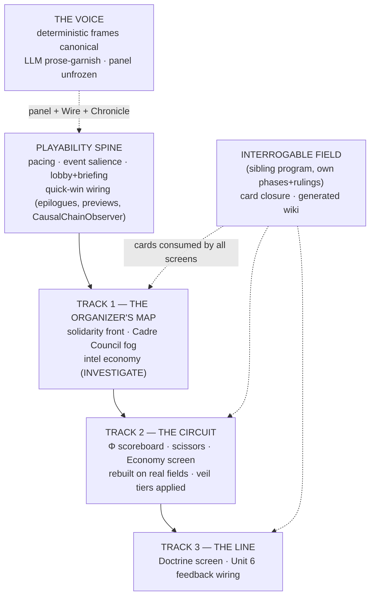

# The Viable Game — Design

**Date:** 2026-07-17 · **Status:** owner-approved section-by-section in brainstorm dialogue;
this file is the written record for final review.
**Question answered:** *"What do we need to do to get this a viable game?"*

**Research basis:** a 16-agent workflow (11 readers over the design library — Salen &
Zimmerman *Rules of Play*, Sylvester *Designing Games*, Norman *DOET*, Krug, Tufte ×3,
Shneiderman 1983, Debord/Becker-Ho *A Game of War* + kriegspiel docs, and the owner's
AUFKLÄRUNG UX draft — plus 4 codebase audits), and a hands-on audit of the live stack:
46 screenshots including a 26-tick live run (session artifacts:
`scratchpad/research-{books,audits,synthesis}.json`, `scratchpad/shots/`).
Program/spec/ADR numbers are allocated per `ai/decisions/` convention at plan time —
"The Viable Game" is a working title.

---

## 1. Verdict

Babylon is a rigorously-tested simulation engine wearing a competent shell — a
scientific instrument, not yet a game. The loop works end-to-end (login → lobby →
create → cockpit → verbs → live ticks → endgame, all real). The distance to "viable
game" is **not** primarily missing features: the engine already computes drama that
never reaches the player, and the player has no goal framing, no consequence preview,
no causal explanation, and no onboarding. This is mostly connection-and-framing work.

Firsthand findings from the live run (all reproduced on 2026-07-17 against `dev`):

- **Event spam:** 20+ identical "Sovereign Collapse — tick N" cards, one per tick,
  starting at tick 0; "164 developments this tick"; the autopause modal ("THE GAME HAS
  STOPPED ITSELF — THIS CANNOT PASS UNREAD") re-fired every tick — one minute of Play
  was ~half modal-clicking.
- **Pacing:** Wayne County reached "Endgame Reached" at tick 18 with zero player
  input; Fascist Consolidation progress read 1.00 by ~tick 1; "Sovereign Collapse"
  fired at tick 0 (threshold bug, not drama).
- **Dead-end first click:** EDUCATE at tick 0 → "No eligible targets," no explanation.
- **Lobby is test detritus:** 50 identical unnamed `wayne_county` rows.
- **Dark data:** Trends showed "No timeseries data yet" even at tick 26; the top-bar
  PROFIT chip permanently reads "no data"; the map outside the active county is black.

Audit findings (each with file:line evidence in the session audit JSON):

- `CausalChainObserver` — a fully-built "Crash → Austerity → Radicalization" causal
  narrator — is never instantiated by the bridge.
- 26 engine-computed `tick_*` attributes (crisis_phase, bifurcation_score,
  unemployment_rate, …) are never serialized to any endpoint.
- 45 of 79 EventTypes never reach the wire; POGROM/LOCKOUT/VIGILANTISM emit as generic
  `ORGANIZATIONAL_ACTION`.
- 4 of 5 terminal outcomes share one "THE BUNKER FAILS" headline; RED_OGV is
  structurally dead (CLAIMS seed edges never match real territory IDs).
- `preview_action` computes costs/warnings that the UI never shows; TargetPicker rows
  are label-only.
- EconomyDashboard: 8 of 10 stat chips are phantom fields the backend never emits.
- The Doctrine tree's feedback into bifurcation/consciousness (DT Unit 6) is unwired —
  the one foregrounded strategic layer does not move the numbers players watch.
- Zero tutorial/onboarding routes; full chrome mounts at tick 1; the AP/resource
  economy is explained nowhere.

## 2. Decisions ledger (owner rulings, 2026-07-17)

| # | Decision | Ruling |
|---|----------|--------|
| D1 | Who is the player? | **The Cadre Council** — material facts public, political state fogged by organizing reach, intel bought through action (INVESTIGATE economy). |
| D2 | The decisive mechanic | All three fronts matter — **each gets its own screen** (multi-page app, no god-dashboard): solidarity network / imperial-rent circuit / doctrine. |
| D3 | Session shape | **The 520-tick nationwide campaign IS the game** (empire-wide; "you can't resolve it at one county level"). Onboarding lives inside the campaign's opening arc. Wayne County reverts to dev fixture. |
| D4 | Theory literacy | **Play by feel, theory on demand** — concretized by the Interrogable Field program (card closure, generated wiki, formula terminals). |
| D5 | The Voice | **Deterministic canon, LLM garnish** — CausalChainObserver frames are the record; a local LLM may re-prose a frame but never add a claim; graceful degrade to templates. |
| D6 | Narration panel | **UNFROZEN** (supersedes the prior freeze). The panel is the persistent narrator; Wire stays event-anchored; Chronicle is the record/epilogues. |
| D7 | The Veil of Money | **Progressive disclosure of the price/value disjuncture, scaled by theoretical development** — see §5d. At low theoretical development the player sees only dollar prices; crossing doctrine thresholds unlocks perception of the value axis and the scissors. |

Still quarantined (owner-gated in the Interrogable Field prompt, untouched by this
program): R4 forecast overlay, Wave-5 deception half, Wave-6 items, curvature terrain
(Law 4 HELD).

## 3. Program architecture

One **Playability Spine**, then three sequential **screen tracks**, with two sibling
programs interleaved. Rounds are dependency order, **not scope cuts** (no-MVP rule).

**Why this order.** The spine fixes what is broken under any information model. Track 1
goes first among screens because the fog is the deepest structural change — everything
wired after inherits correct epistemics. Track 2 is mostly repair + elevation of
existing surfaces. Track 3 carries the only remaining engine work (Unit 6) so its
regression ceremony is isolated at the end.

**Interlocks.** The Interrogable Field keeps its own program identity, phases, and §7
owner rulings; this program consumes its card/wiki closure and never builds it. The
Voice ships its first heartbeat inside the spine (CausalChainObserver wiring) and
grows the persistent panel presence as frames flow.

**Governance per track:** own spec + ADR; branch from `dev`; conventional commits;
`mise run check` green per unit; `qa:regression` byte-identical except at the two
declared baseline ceremonies (spine pacing recalibration; Track 3 Unit 6), each
executed with per-scenario drift declared (the Market Scissors promotion pattern).

## 4. The Playability Spine

**4a. Campaign pacing (engine — declared ceremony #1).** A nationwide 520-tick
campaign must be survivable and dramatic under null play. Build a deterministic pacing
instrument first (headless nationwide run; record tick-of-first-crossing per endgame
axis and per-axis progress curves), then recalibrate at the defines level until the
null-play arc holds tension across hundreds of ticks. Fix the tick-0 "Sovereign
Collapse" threshold bug. One ceremony, instrument-first-tune-once.

**4b. Event salience (bridge + frontend).** (i) Dedup: consecutive same-type/
same-subject events collapse into one card with count and age. (ii) Severity tiers:
crimson reserved for genuine rupture/endgame proximity; political churn drops to
gold/muted (AUFKLÄRUNG: never average a severe signal into a bland composite — and
never let crimson become wallpaper). (iii) Autopause fires once per distinct critical
event — first occurrence or escalation, never repeats. Extends the existing
`event-tray-mutes` machinery.

**4c. Lobby & briefing (frontend).** Generated operation codenames, dates, tick/
status, delete/archive. Game creation lands on a **Scenario Briefing**: who you are
(the Cadre Council), the scenario's stakes, the five terminal outcomes in plain
language with the win condition named (`get_journal_objectives` already derives
these). Curated difficulty/config exposure via the existing `CreateGameSerializer`
overrides (never raw defines).

**4d. Quick-win wiring set (bridge + frontend; each evidence-backed).**

1. CausalChainObserver → bridge → wire/journal (the Voice's first heartbeat).
2. Five distinct endgame epilogues (kill "THE BUNKER FAILS" ×4).
3. `preview_action` costs/warnings rendered in ActionComposer before submit.
4. Per-target expected deltas in TargetPicker (no more blind picks).
5. Serialize the 26 dead `tick_*` attributes into CrisisTimeline / BifurcationGauge /
   Economy surfaces.
6. EconomyDashboard phantom chips fixed against real fields.
7. Event whitelist widened past 44/79; POGROM/LOCKOUT/VIGILANTISM get their own
   EventType, severity, title, and geographic anchor.
8. Verb dead-ends become disabled-with-reason ("EDUCATE — no eligible targets yet:
   organize a community first").
9. The permanent "PROFIT no data" chip is wired or removed (honest absence, but not as
   permanent chrome).

**Spine acceptance gates:** null-play nationwide run reaches a calibrated tick floor
before any endgame; no two consecutive identical event cards; autopause ≤ 1 per
distinct event; every terminal outcome renders a distinct epilogue; preview visible
before every submit; a fresh player reaches their first submitted action unaided
(scripted e2e trunk test).

## 5. The Three Screens

Today's top-bar takeovers (WIRE / DIALECTIC / CHRONICLE / NETWORK / DOCTRINE) are
promoted to **routed, deep-linkable pages** — which the Interrogable Field's
`(kind, id, tick?)` address scheme requires anyway. The map is home; each front gets a
room of its own; nothing is squeezed back onto one dashboard.

### 5a. Track 1 — The Organizer's Map (home; solidarity front + fog)

- **Solidarity edges render as literal lines** — organizing reach drawn on the map
  (Debord's front). Building/losing an edge is a visible territorial event.
- **Fog is a two-layer read model.** Material layer (production, wages, rent,
  demographics, territory) is public record — always visible. Political layer
  (consciousness, agitation, heat, faction stances) is visible only within organizing
  reach: where the org has presence or solidarity connection. Everything else renders
  as honest unknown — never zero, never a stale color (Loud Failure extends to
  pixels).
- **Intel is a ledger, not a dynamical system.** Visibility = pure function of
  (current graph, intel ledger). The ledger is session-scoped, event-sourced from
  INVESTIGATE resolutions; intel snapshots are time-stamped and age visibly. The
  engine is untouched; fog lives at the serialization boundary. Determinism preserved
  by construction.
- **No fogged dead ends:** clicking an unknown yields a card naming what you don't
  know and how to learn it, linking to the INVESTIGATE composer.
- Political lenses respect fog; material lenses stay full-map; lens legends link to
  concept cards.

### 5b. Track 2 — The Circuit (the scoreboard room)

- **Φ as a literal circuit:** tribute/rent/wage flows drawn as a flow diagram
  (periphery → core) from the imperial-rent tensor data.
- **The Fundamental Theorem meter is the centerpiece:** Wc vs Vc per region, the gap
  (Φ) trending — when the scissors close and Wc approaches Vc, revolution in the core
  becomes possible. (Subject to veil tiers, §5d — the meter is *earned*.)
- Scissors chart, MELT gauge, market-correction markers, wealth-distribution axes move
  here as designed instruments: Tufte small multiples, fixed scales, on the spine's
  repaired payloads.

### 5c. Track 3 — The Line (doctrine, the org's soul)

- The Doctrine page: the tree, acquisition history, theoretical-labor economy,
  AP/cadre glossary via concept cards.
- **Unit 6 lands here** (declared ceremony #2): doctrine feeds bifurcation/
  consciousness, so the tree moves the numbers the other screens watch.
- Light embedded scaffold: faction descriptions and key-figure identity anchor here —
  a cast of characters for the emergent numbers.

### 5d. The Veil of Money — theoretical disclosure tiers (D7)

Commodity fetishism as a mechanic: **you cannot see value directly — only prices —
until theory lets you see through the money-form.**

- Visibility has two orthogonal axes: **spatial** (organizing reach → political state,
  §5a) × **conceptual** (theoretical development → which economic categories the
  player can perceive).
- Conceptual visibility is a pure function of the org's existing doctrine/
  theoretical-labor state (the ADR073 accumulator — no Unit 6 dependency), evaluated
  at serialization. Thresholds live in `GameDefines`/`defines.yaml` (data-driven,
  never hardcoded).
- Tier sketch (exact thresholds and tier count are plan-time decisions, in defines):
  - **Tier 0 — the money-form.** Dollar prices, wages, profit. The Circuit shows a
    price-only economy.
  - **Tier 1 — exploitation visible.** Wage vs value-produced axes unlock (the wage /
    imperial oppositions become legible).
  - **Tier 2 — the scissors.** The price⟷value divergence instruments unlock:
    oscillators, MELT drift, corrections legible as what they are; the Fundamental
    Theorem meter reaches full form.
- Locked instruments are **visible-but-veiled with a path**, never hidden: "Your cadre
  cannot yet see through the money-form. Study: Value Theory" — linking into the
  Doctrine tree (closure holds even in darkness; Norman's signifiers of possibility).
- This is also the onboarding engine for the Circuit: UI complexity scales with
  theory, diegetically — solving "full chrome at tick 1" for exactly the instruments
  that overwhelm.
- Unlocks are monotonic within a session (theory is not forgotten).

## 6. The Voice

- **CausalChainObserver frames are the canonical narrative record** — every sentence
  traceable to the numbers that produced it ("voice rides on real numbers").
- Three surfaces, three tempos: the **narration panel** (unfrozen, D6) carries the
  persistent present — 3–5 causal sentences per tick, Nest-thermostat register
  ("Wages fell below subsistence in 3 counties → agitation rising → routing by
  solidarity"). The **Wire** stays event-anchored (dispatches opened from cards). The
  **Chronicle** is the permanent record and home of the five epilogues.
- **LLM contract:** when a local model is present it may re-prose a frame, **never add
  a claim** — enforced by an `ai`-marked entailment eval. Absent a model, templates
  render; nothing is ever empty.
- Narration lives in the observer layer, outside the tick hash — determinism untouched
  by construction.

## 7. Testing & acceptance (Amendment Q behavioral contracts)

- **Spine:** pacing-floor contract (null-play nationwide survives past the calibrated
  tick); event-dedup and autopause-once property tests; epilogue distinctness;
  preview-before-submit e2e.
- **Track 1 (fog):** no political value ever serializes outside organizing reach
  (property test over payloads, sentinel-style); intel ages monotonically; fog cards
  satisfy closure; visibility is a pure function — same graph + ledger ⇒ byte-identical
  view.
- **Track 2:** Fundamental Theorem meter pinned to formulas by golden values;
  chips↔payload seam contract so phantom fields can never return (extends
  `SEAM_REGISTRY`).
- **Track 3:** Unit 6 sign-predictability contract (acquiring doctrine moves
  bifurcation/consciousness in the documented direction) + declared ceremony.
- **Veil (D7):** below-threshold sessions **never receive** value-axis payloads (the
  veil is enforced at serialization, so no client inspection can pierce it — the same
  boundary as the fog); unlocks are monotonic; thresholds read from defines; locked
  instruments render the veiled state with a working study-link (e2e).
- **Voice:** frame→prose entailment eval (`ai` marker); template-fallback contract.
- **Cross-cutting:** per-screen trunk tests; one scripted first-session e2e (login →
  briefing → first action → first crisis → epilogue). Single-flight test discipline
  unchanged; heavy runs stay uncapped per the 2026-07-14 owner ruling.

## 8. Assumptions, risks, deferred items

**Assumptions (ruled):** D1–D7 above; Interrogable Field quarantine intact.

**Risks & mitigations:**

- *Pacing ceremony breadth* — many defines may move → instrument-first, tune-once, one
  declared ceremony with drift table.
- *Fog read-model cost* on the nationwide graph → per-tick memoized serialization;
  measure before optimizing.
- *Takeover→route migration* breaking the e2e suite → keep every frozen testid.
- *Solo-dev sprawl* → tracks merge strictly in sequence, one at a time (the
  gated-stack lesson).

**Owner box-ticks requested at spec review (recommendations, non-blocking):**

- [ ] **Fast-forward-to-epilogue** when an endgame basin is locked in (Sylvester's
      failure-trap mercy) — recommend YES, in the spine (2b adjacency).
- [ ] **RED_OGV seed repair** (CLAIMS edges never match territory IDs; the ending is
      structurally dead) — recommend YES, folded into Track 1 as a data fix so all
      five endings are reachable.

**Deferred (out of this program):** Interrogable Field quarantined items (R4, Wave-5
deception, Wave-6, curvature); FRED/NBER numeric anchors (blocked on deterministic
data artifacts); per-node claims sigma; county-level corrections; hex-level scissors
refinement (all per ADR078's deferral ledger).

## 9. Evidence appendix

- Research extracts: `scratchpad/research-books.json` (11 books × principles/
  recommendations/anti-patterns), `research-audits.json` (frontend-inventory,
  vision-gap, player-verbs, engine-riches — file:line evidence),
  `research-synthesis.json` (verdict, 6 pillars, quick wins, open questions).
- Screenshots: `scratchpad/shots/` — 46 captures; see esp. `02-lobby` (test-detritus
  lobby), `03-cockpit-initial` (god-view baseline), `31-action-composer` ("No
  eligible targets"), `42-critical-event-1` (autopause modal), `45/46` (event-spam
  rail, tick-18 "Endgame Reached", tick-26 empty Trends).
- The six research pillars (goals/stakes, agency/consequence, feedback/why,
  drama/narrative, legible front, onboarding/pacing) with full book+audit grounding
  live in `research-synthesis.json`; this design's spine and tracks are their
  execution shape.
