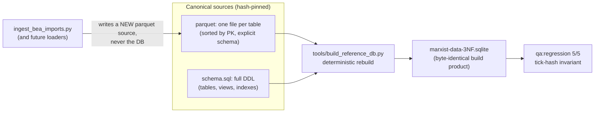

# Parquet Reference-Data Pipeline — Design

**Status:** EXECUTED 2026-07-20 (Phase 6 cutover, ADR098; plan `docs/superpowers/plans/2026-07-19-parquet-reference-pipeline.md`). Originally owner-ruled 2026-07-18 ("Parquet pipeline, ingest lands as a source").
**Owner intent (verbatim):** "Can you make a Parquet representation of that sqlite database, then in CI
for the load process you can make a byte-identical version of the same sqlite database, and have the
added benefit of adding whatever else you want to it?"

## 1. The problem this solves

`data/sqlite/marxist-data-3NF.sqlite` (4.5 GB; 76 tables + 8 views + 100 indexes; 83
catalog-governed objects per the catalog sentinel) is today the *source of truth* for reference
data, but it is a mutable opaque binary:

- **Ingest mutates the truth invisibly.** Running `tools/ingest_bea_imports.py` (the IMPORT_USE / Φ
  loader, ADR076's open item) directly against the DB would change what `qa:regression` reads with
  no reviewable diff and no rollback short of a drive restore.
- **CI already can't use it.** CI installs a *subset* DB via `.github/actions/fetch-reference-db`
  (built by `tools/make_reference_subset.py`, shipped on the ci-data release channel) — so the full
  DB's contents are effectively untestable off the dev box, and subset drift is invisible.
- **Lineage is partial.** Only 8 tables have hash-pinned artifact lineage in `data-artifacts.yaml`
  (ADR076); the other ~68 have catalog rows but no reproducible representation.

## 2. The inversion (core decision)

**Parquet becomes canonical; the SQLite file becomes a build product.**

This is ADR076 *completed and inverted*: ADR076 exported artifacts **from** the DB; this pipeline
makes the artifacts the source and derives the DB **from** them. New data ("whatever else you want
to add") enters by adding a parquet source + a schema entry and rebuilding — a reviewable,
hash-pinned, revertible event — never by mutating the shared binary in place.

## 3. Components

### 3.1 Source store
- **Layout:** one parquet file per table. Reuse the existing tier rule (ADR076 decision 1): tiny
  tables may stay in-repo CSV under `src/babylon/data/reference/`; everything else is parquet under
  `dist/data-artifacts/` (git-ignored, shipped on the ci-data release channel).
- **Registry:** `data-artifacts.yaml` grows from 8 entries to full coverage of the 76 tables. It
  stays REGENERATED by tooling, never hand-edited. Each entry keeps `sha256`, `rows`,
  `source_table`, `material_relation` (Aleksandrov trace).
- **Views and indexes carry no data** — they live in a new extracted `schema.sql` (full DDL for all
  76+8+100 objects, in `sqlite_master` order after canonicalization), hash-pinned in the registry
  like any other source. The 8 views include the live Fundamental Theorem views; DDL extraction must
  be verified against them specifically.

### 3.2 Builder — `tools/build_reference_db.py`
Deterministic rebuild, extending the proven ADR076 determinism discipline (`make_data_artifacts.py`
docstring, "decision 3") from parquet-writing to DB-writing:

- fixed `page_size`, journal_mode=DELETE during build (no WAL sidecars in the product),
  fixed `application_id`/`user_version` stamped with the pipeline version;
- tables created and populated in registry order; rows inserted in parquet order (already
  PK-sorted); indexes created after their table's data, in schema.sql order;
- finish with `VACUUM` so page allocation is canonical;
- SQLite version pinned (the Python `sqlite3` module version is recorded in the manifest and
  asserted at build time — a version bump is a declared regeneration event, exactly like the
  parquet codec pin).
- **Proof, not assertion:** byte-stability is proven by a double-build test (build twice, compare
  sha256), the same pattern as `tests/unit/reference/test_data_artifacts.py`'s double-generation
  test. If the plan discovers a nondeterminism the discipline can't remove, that is reported, not
  papered over — the file-hash layer degrades to advisory and the tick-hash layer remains the gate.

### 3.3 The layered contract (owner-ruled)
1. **File hash = drift alarm.** The rebuilt DB's sha256 is recorded in the registry. CI rebuilds
   and compares: a mismatch means *something changed* — investigate, never auto-accept.
2. **`qa:regression` tick-hash = the real invariant.** Byte-identity of the DB is instrumentation;
   what the Constitution actually guarantees is deterministic simulation. A regenerated DB with an
   intended data change moves the file hash (declared, in the regeneration commit) and must leave
   the 5-scenario tick hashes byte-identical *unless* the change is a declared baseline ceremony.

### 3.4 CI wiring
- The `fetch-reference-db` action gains a rebuild-verification leg: download parquet sources for
  the pinned ci-data version, rebuild, compare sha256 against the registry. The existing subset
  mechanism (`make_reference_subset.py`) is rebased to *derive the subset from the same parquet
  sources*, ending subset drift by construction.
- Release-asset constraint: GitHub caps release assets at 2 GB each. The 4.5 GB DB compresses well
  as per-table parquet (zstd, single row group), but the plan must MEASURE per-table sizes; any
  table whose parquet exceeds the cap is sharded by PK range with the shards hash-pinned
  individually. No size claims are made here — measurement is a plan task.

### 3.5 Ingest lands as a source (the IMPORT_USE ruling)
`tools/ingest_bea_imports.py` (317 lines, already written) is re-targeted: instead of INSERTing
into the shared DB, it emits `fact_bea_import_use.parquet` (+ registry entry + schema.sql DDL) and
the DB gains the table on the next rebuild. This is the template for every future loader: **loaders
produce sources; only the builder produces the DB.** This completes the ADR076 arc and unblocks the
Φ/imperial-rent data path (Tier-1 blocker ruling, superseding "run the loader against the DB").

## 4. Governance & sequencing

- **Sequenced ALONE** (owner ruling): the cutover mutates the file `qa:regression` reads, so it
  shares a branch with nothing. Order of operations inside the cutover: export-verify (prove
  parquet round-trips the current DB exactly: rebuild equals the live DB *content-wise* —
  per-table row counts + per-table content hashes — before byte-identity of the container is even
  attempted), then flip authority, then land IMPORT_USE as the first new source.
- The catalog sentinel keeps gating: catalog rows and registry entries must reconcile 1:1 (the
  ADR076 "atomic handoff" rule generalizes to the whole DB).
- The trove at `/media/user/data/babylon-data/` is unchanged — it remains the raw upstream archive;
  this pipeline governs the *derived* reference DB only. CI still never touches the drive.
- An ADR records the inversion when the cutover lands.

## 5. Acceptance gates

1. Double-build byte-stability test green (two rebuilds, identical sha256) on the dev box AND in CI.
2. Content round-trip proven: rebuilt DB matches the pre-cutover DB per-table (row counts + ordered
   content hash per table) for all 76 tables and 8 views.
3. `mise run qa:regression` 5/5 byte-identical against the rebuilt DB.
4. Catalog sentinel + coverage sentinel green with the expanded registry.
5. `ingest_bea_imports.py` emits its parquet source; the rebuilt DB contains IMPORT_USE; the Φ
   consumers that ADR076 left dark light up (their own tests say which).
6. CI's reference-data legs run against a rebuilt-and-verified DB (subset derived from the same
   sources), not a hand-shipped binary.

## 6. Explicitly out of scope

- Postgres runtime data (per-game state) — rotation/retention is a separate owner-ruled program.
- The raw trove and its acquisition pipelines.
- Any change to simulation semantics: gate 3 pins that.
