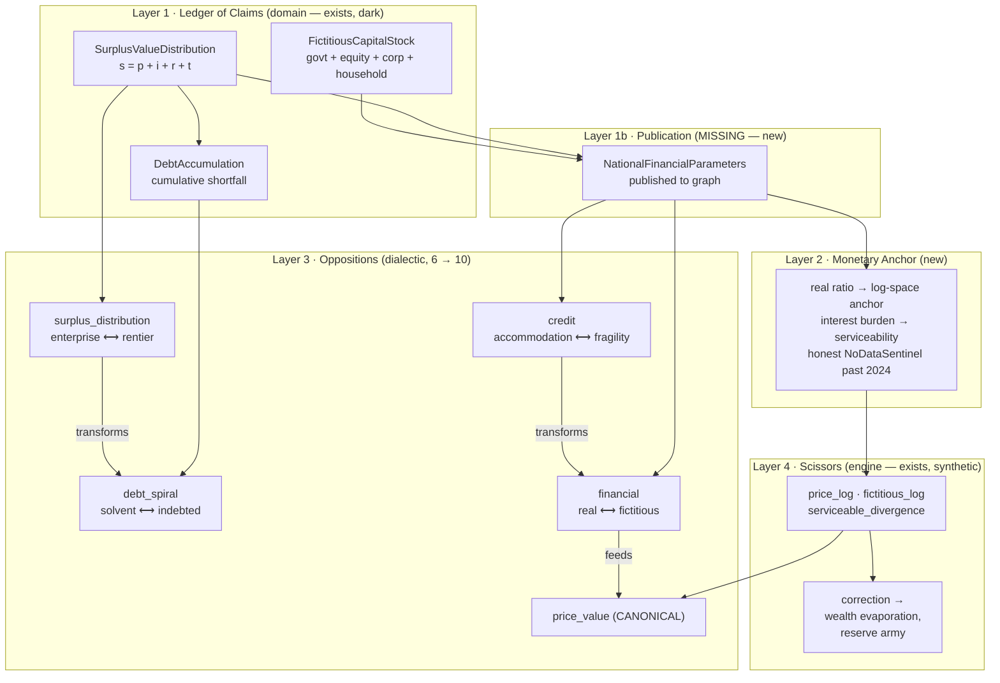

# Design — Volume III Money through the Value–Price Scissors

**Date:** 2026-07-18
**Branch:** `refactor/vol3-money-scissors` (worktree, from `origin/dev` @ `f83b6353`)
**Status:** Approved by owner (Persephone Raskova), 2026-07-18
**Verification:** every factual claim below was adversarially fact-checked against code by a
7-group verification pass (64 claims); 9 required correction and are corrected here. Claims
marked *(verified)* were independently re-confirmed by hand.
**Supersedes in practice:** `project/execution/briefs/feat-vol2-vol3-service-wiring.md`
Batch D (that brief's Step 1 and its defines-overlay prerequisite have since landed; its
Vol III wiring never did)

---

## 1. Why this exists

Spec `024-capital-volume-iii` is **built**. Its packages —
`domain/economics/{distribution,credit,rent,counter_tendencies,financial_crisis,monetary}` —
contain frozen Pydantic models, protocol-injected calculators, and real federal data
adapters. It is not missing. It is **disconnected**, and in a way no test currently detects.

### 1.1 The estate is live in one of three entry points — not the game, not the gate

`create_financial_services()` (`factory.py:335`) instantiates all eleven Vol III calculators.
`TickDynamicsSystem` (position 4.0, MATERIAL_BASE) calls them at every year boundary. Each
call is gated `if services.<slot> is not None`, and the county layer additionally needs
`services.tensor_registry` to supply `total_surplus` (`tick/system/__init__.py:1445`, `:1583`).

| Entry point | `tensor_registry` reaches services | financial services | Vol III county layer |
|---|---|---|---|
| `engine/simulation/_legacy.py` (`Simulation`; used by `tools/`, `__main__`) | yes — via `calculator_overrides` `:332` | yes `:289` | **live** |
| `web/game/engine_bridge.py` (**the playable game**) | no — built `:6268`, consumed only by `CapitalStockCalculator` | yes `:6445` | national only |
| `tools/regression_test.py` (**the `qa:regression` gate**) | no | no | fully dark |

Note the third row. `qa:regression` is `poetry run python tools/regression_test.py compare`
(`.mise.toml:730`) — **not** the headless runner. `regression_test.py:585` calls
`step(state, sim_config, persistent_context, defines)` with no `calculator_overrides`
argument at all, and the file contains zero DB or session references: it is a pure in-memory
harness *(verified)*.

Consequences, in order of severity:

- **`s = p + i + r + t` never evaluates in the shipped game.** `_get_county_surplus` returns
  `None`, so the `total_surplus is not None and total_surplus > 0` gate (`:1446`) never
  opens. `surplus_distribution` is permanently `None`; `debt_accumulation` never updates;
  `financial_crisis_assessor` — gated on `"surplus_distribution" in updates` (`:1479`) —
  never runs. The `TensorRegistry` the web path needs is constructed ~200 lines from where
  it is missing, in the same file, and discarded after building one calculator.
- **`qa:regression`'s byte-identical baselines never execute a line of Vol I/II/III** — and
  more strongly than first assessed: *no* economics calculators of any kind are injected
  there. The project's Definition of Done is blind to the entire economics estate.

**On the injection mechanism.** The `_legacy.py` conduit is *not* a `ServiceContainer` field
assignment. `self._services` (`:113`) is built with no overrides and never reassigned; line
`:331` stores `tensor_registry` to `self._tensor_registry`, consumed only by `get_snapshot()`
(`:849`, a GUI field). The live path is `create_economics_services(...)` (`:280`) → returned
dict already containing a `"tensor_registry"` key → threaded as `calculator_overrides=` at
`:332` → module-level `step()` → `ServiceContainer.create(config, effective_defines,
**overrides)` (`simulation_engine.py:527`), which builds a **fresh, ephemeral container per
tick**. Every unit below wires through `calculator_overrides`, not through container fields.

### 1.2 There are two "fictitious capital"s, and the synthetic one is the one with teeth

|  | Vol III `FictitiousCapitalStock` | Scissors `fictitious_log` |
|---|---|---|
| Source | FRED/Z.1: government debt, corporate equity, corporate debt, household debt | Damped-driven oscillator, no external data |
| Cadence | Annual (52-tick boundary) | Every tick |
| Home | **none — transient local**, dies inside `_assess_county_financial_crisis` after producing one boolean | `graph.graph["market"]` |
| Effect on the world | none beyond that boolean | **evaporates claim-holder wealth, swells the reserve army, publishes `MARKET_CORRECTION`** |

Neither reads the other. `market_scissors.py:259-272` drives speculation from
`calculate_growth_drive(surplus, prior.surplus_ema, …) + momentum_coupling * price_velocity`
— entirely self-referential.

The "no home" cell is load-bearing and was corrected during verification. `graph_bridge.py:58-69`
publishes `state.national_params`, typed `NationalTickParameters` (`tick/types.py:199-236`),
whose fields are `tau`, `gamma_basket`, `gamma_III`, `tau_effective`, `v_reproduction` — **no
financial fields whatsoever** *(verified)*. The type that carries
`fictitious_capital: FictitiousCapitalStock | None` is `NationalFinancialParameters`
(`tick/types.py:454-484`), and it is **never instantiated in production**: its only
non-test references are its own definition, an uncalled `empty()` classmethod, and its
`__all__` entry *(verified)*.

And only `price_log` reaches the dialectic: `contradiction.py:284-290` converts it to
`GraphInputs.market_balance`, which `catalog.py:262-274` measures as the `price_value` gap.
`fictitious_log` reaches `GraphInputs` **nowhere** — its complete reader set is
`market_scissors.py`, `formulas/market.py`, `models/market.py`,
`models/events/spine_payloads.py:42-43` (the `MarketCorrectionEvent` payload type), the
event-builder, Postgres columns, `engine_bridge.py:7797` (`_build_tick_summary`), and
`engine_bridge.py:2669-2672` (`get_game_timeseries`, a read-only **national timeseries
endpoint**).

That last point deserves care. This codebase has an established *map lens* idiom meaning
something else: `_project_price_divergence` (`market_scissors.py:211-231`) projects
`price_log` onto territory nodes as `PRICE_DIVERGENCE_ATTR`. `fictitious_log` receives **no**
per-territory projection anywhere. §3.4 must not accidentally imply one.

### 1.3 The dialectic already reserved the landing slots

`instances/catalog.py:378-394` declares, in `_DEFAULT_COUPLINGS`:

```python
Coupling(source="circulation",          target="realization",        kind="transforms"),
Coupling(source="reproduction",         target="disproportionality", kind="transforms"),
Coupling(source="surplus_distribution", target="debt_spiral",        kind="transforms"),
Coupling(source="credit",               target="financial",          kind="transforms"),
```

with a comment that these reference "Phase D/E value-form oppositions … not yet bound on this
branch." `build_default_coupling_graph` keeps only edges whose *both* endpoints are
registered, so all four are dropped from the returned graph — **each logged at INFO**
(`catalog.py:422-428`). That log line is a ready-made verification instrument for U5's
acceptance criterion.

`CouplingGraph` and `build_default_coupling_graph` have **zero production callers**:
`ServiceContainer` has no `coupling_graph` field in either `kernel/services.py` or
`engine/services.py`. The coupling layer is dormant scaffolding awaiting its first consumer.

### 1.4 The data ceiling, and a live latent crash

All six Vol III FRED series terminate at **2024** (`GFDEBTN` starts 2010; the rest cover
1990–2024). `Z1Loader` (`data_adapters.py:31-67`) is an exact-year dict over seven discrete
years; its accessors (`:94-107`) do a bare `self._data.get(year)` with no fallback.
`CensusHousingLoader` covers exactly two FIPS × three years.

`SIM_EPOCH_YEAR = 2010` (`kernel/sim_clock.py:19`) *(verified)* and `year = SIM_EPOCH_YEAR +
tick // WEEKS_PER_YEAR` (`:55`). A 5200-tick campaign therefore runs **2010–2109**. Real
coverage is 2010–2024 — fifteen years. The financial layer returns `NoDataSentinel` every
year for the remaining **~85**. The endogenous path is not the exception; it is 85% of the
game.

**The year ceiling is not hypothetical.** `InterestRateState`, `CreditState`, and
`FictitiousCapitalStock` declare `year: int = Field(..., ge=2007, le=2040)`
(`credit/types.py:136,161,190`), as do `DebtAccumulation` (`distribution/types.py:137`) **and
`NationalTickParameters` itself** (`tick/types.py:228`) *(verified)*. Year 2041 arrives at
tick ≈ 1612 of 5200 — **inside every canonical campaign**. Data scarcity currently masks the
Vol III models (loaders return `None` → `NoDataSentinel` before construction), but
`NationalTickParameters` is on the **live, already-wired** MELT path. This is a latent
`ValidationError` in existing production code, independent of Vol III, and U2 must treat it
as such.

---

## 2. Owner decisions

**D1 — Vol III calibrates; the scissors integrates.** Real FRED data seeds and anchors the
scissors where it exists (2010–2024). Past the data horizon the oscillator's own dynamics
*are* the money system, carrying the last real reading as initial condition. One axis,
materially grounded at its origin, endogenous thereafter.

*Rejected:* replacing the oscillator with `FictitiousCapitalStock` outright — money would
stop moving for ~85 years of a campaign; keeping two axes with an explicit coupling —
preserves two "fictitious capital" concepts the codebase must forever explain.

**D2 — Bind all four Vol III opposition keys and activate `CouplingGraph`.** Catalog 6 → 10.
Both reserved `transforms` edges go live. `CouplingGraph` gets its first production consumer.

*Rejected:* binding only the two producer oppositions; routing all money through
`price_value` alone (inter-capitalist conflict never becomes rankable).

**D3 — On by default; prove the delta, then re-baseline.** Before regenerating anything,
produce a written per-scenario delta analysis. Then regenerate the five baselines in a
dedicated ceremony commit, per the Program 23 precedent.

**D4 — The gate gets a committed FRED fixture.** To make `qa:regression` guard Vol III, the
in-memory harness needs money data without touching the babylon-data drive (standing owner
ruling). The six Vol III series are ~200 values total; they ship as a committed deterministic
artifact and `regression_test.py` builds `calculator_overrides` from it. The harness stays
hermetic.

*Rejected:* a separate DB-backed economics gate (leaves the DoD gate blind); accepting the
gate stays blind (re-opens the objection that sank defines-gating).

---

## 3. Architecture

Money is not a subsystem beside the value substrate. It is the form **claims** take upon it.
Every Volume III category — interest, ground rent, taxes, credit, fictitious capital, debt —
is a claim on surplus value that is either validated by production or unserviceable. The
scissors is precisely the measure of that validation failing.



### 3.1 Layer 1 — Ledger of Claims

Already implemented; needs turning on and one correction.

`SurplusValueDistribution` enforces `s = p + i + r + t` with `profit_of_enterprise` as the
residual, permitted to go negative. `DebtAccumulation` tracks the cumulative shortfall.
Both frozen; reconstructed via `model_copy` / `DebtAccumulation.update`.

**Correction required — the ground-rent path.** Two independent ground-rent computations run
per county per year:

- *Path A* — `DefaultDistributionCalculator.compute_distribution()` derives
  `SurplusValueDistribution.ground_rent` from real FRED rental income (`B230RC0Q173SBEA`) via
  `_FredRentalAdapter` (`factory.py:416-421`).
- *Path B* — `DefaultRentCalculator.compute_rent_extraction()` sources from
  `_DefaultCountyRentalAdapter` (`factory.py:447-457`), which unconditionally returns `None`,
  so it always short-circuits to `NoDataSentinel`.

`graph_bridge.py:158-162` stamps the per-node `tick_ground_rent` attribute from **Path B**.

Precisely stated: Path A's figure is *not* discarded outright — `write_tick_state_to_graph`
stores the whole `county_states` dict under `TICK_DYNAMICS_KEY`, and
`Simulation.get_time_series()` reads `surplus.ground_rent` back out (`_legacy.py:738`), with a
real caller in `tools/validate_detroit.py:147`. What Path A never becomes is the **per-node
`tick_ground_rent` territory attribute** — and that is exactly what every consequence-phase
System reads, via `attrs.get("tick_*")`. So `MarketScissorsSystem` and `ContradictionSystem`
see only Path B's permanent absence.

Repointing is still correct and necessary. Note for U1: after repointing, `validate_detroit.py`'s
output converges with the node attribute — an intended outcome, not a regression.

The three-way agricultural/resource/urban split has no data source
(`immutable_reference_bea_reis_rent` is a single blended figure — a genuine schema mismatch).
It stays honestly absent (III.11); it is not faked.

### 3.2 Layer 1b — Publication (new; discovered during verification)

`FictitiousCapitalStock` and the national interest state must reach the graph before the
scissors at @17.8 can read them. They currently do not (§1.2).

`NationalFinancialParameters` already exists and is exactly the specified entity for this
(spec 024 Key Entities). It is instantiated in `_compute_national_financial_state` and
published by `graph_bridge` under its own key alongside `national_params` — rather than
bloating `NationalTickParameters`, which is the MELT/gamma carrier and has a different
lifecycle.

### 3.3 Layer 2 — The Monetary Anchor (new)

`domain/economics/monetary/anchor.py`, a small pure module implementing D1's handoff:

- `fictitious_anchor` — `log(FictitiousCapitalStock.ratio_to_real(real_output))`, the
  log-space target the oscillator is pulled toward while real data exists.
- `serviceability_anchor` — the real interest burden `i / s` from
  `SurplusValueDistribution`, tightening `calculate_serviceable_divergence` beyond the
  existing profit-rate slope.

**Contract (binding):**

1. Returns `NoDataSentinel` with a specific reason when any input is absent. Never fabricates
   a zero, never substitutes a default for missing data (Constitution III.11).
2. When the anchor is absent the scissors **continues unchanged** on its endogenous dynamics.
   Absence is the normal steady state for ~85% of a campaign, not an error path.
3. Pure function of its arguments. No RNG, no clock, no I/O. Deterministic float ordering.
4. Lives in `domain/`, imports nothing from `engine/`. The engine reads it.

### 3.4 Layer 3 — Four bound oppositions

Added to `build_default_registry` (`catalog.py:277`). Measures read `GraphInputs`, extended
alongside the existing `market_balance`.

| key | pole_a | pole_b | level | antagonistic | gap measures |
|---|---|---|---|---|---|
| `surplus_distribution` | `enterprise` | `rentier` | county | no | rentier share `(i + r + t) / s`; balance signed by which claim leads |
| `debt_spiral` | `solvent` | `indebted` | county | no | accumulated debt relative to annual surplus |
| `credit` | `accommodation` | `fragility` | *(unplaced — national)* | no | `default_rate × spread`; balance signed by expansion vs contraction |
| `financial` | `real` | `fictitious` | *(unplaced — national)* | no | financialization ratio: real where anchored, `fictitious_log` past the horizon |

`antagonistic=False` throughout: the catalog reserves `antagonistic=True` for `capital_labor`
and `imperial` alone *(verified)* — the contradictions producing rupture *between* classes.
The division of surplus among capitals is real conflict but intra-class; mislabelling it
would corrupt principal-contradiction ranking.

Each `unity` string must satisfy the Aleksandrov Test — naming the concrete material
relation, not the formalism.

**Coupling edges — derived, not authored.**

Owner ruling (2026-07-18) on the open question of which edge enters `price_value`: *do
whatever is healthiest long-run; do it right.* The right answer is not to pick an edge by
theory. `coupling.py:45-46` gives the five kinds precise operational definitions —
`feeds` = "the target's step reads the source's observation"; `constrains` = "the source
limits the target's reachable state space"; `transforms` = "the source's output becomes the
target's input prices". Against those definitions the edge set is **read off the code**, and
each edge carries its citation:

| edge | kind | code evidence |
|---|---|---|
| `surplus_distribution → debt_spiral` | `transforms` | reserved; `DebtAccumulation.update` consumes `profit_of_enterprise`, the distribution residual (`tick/system/__init__.py:1460-1464`) |
| `credit → financial` | `transforms` | reserved; credit conditions become fictitious accumulation's input |
| `price_value → financial` | `feeds` | `fictitious_drive` includes `momentum_coupling * price_velocity` (`market_scissors.py:259-264`) *(verified)* |
| `financial → price_value` | `feeds` | the correction snaps `price_log` from `fictitious_log` overhang (`market_scissors.py:313`, `:327-331`) *(verified)* |
| `surplus_distribution → financial` | `constrains` | the interest burden sets `serviceable_divergence` — the ceiling on `fictitious_log` before the snap (`:308-313`, after U6) |

Both my earlier candidates (`credit → price_value` in the approved sketch,
`financial → price_value` in the first draft) were under-specified. The honest structure is
**mutual `feeds` between `price_value` and `financial` at different moments of the cycle** —
in expansion, price momentum drives speculation; in correction, the bubble snaps prices — plus
a `constrains` edge nobody had considered. Nothing in `CouplingGraph` requires acyclicity
(`coupling.py:108-133`), so the reciprocal pair is legal and is the truthful record.

**The governing principle, and the reason this matters beyond four edges:** the coupling graph
is a claim *about the code*. A hand-authored graph drifts from the dependencies it describes
the moment either side changes — which is exactly how the four reserved edges came to sit
dormant and undetected for months. So the graph must be **verified against real measurement
dependencies**, not merely declared. That gate is specified in U8.

**`CouplingGraph` activation.** A `coupling_graph` field on `ServiceContainer` (protocol +
concrete), built beside the registry. Per Constitution III.10, it must not ship as
vocabulary: `ContradictionSystem` consumes it, and its first duty is to constrain
principal-contradiction ranking so a `transforms` target cannot rank principal while its
source reads absent. Crisis has a direction of travel; the coupling graph is what knows it.

### 3.5 Layer 4 — Closing the scissors loop

`MarketScissorsSystem` (@17.8) runs after `TickDynamicsSystem` (@4.0) in the same `run_tick`
over one shared graph with no `WorldState` round-trip between them
(`simulation_engine.py:164-204`) *(verified)*. The `tick_*` attributes are already territory-node
attributes by the time the scissors executes — readable through the same `attrs.get(...)`
pattern `_mean_profit_rate` uses for `tick_profit_rate`.

Changes:

1. `calculate_serviceable_divergence` gains an interest-burden term alongside the existing
   `correction_profit_slope`. A financialised county tightens its own correction threshold
   independent of profit rate — Vol III part 3 meeting part 5.
2. Correction severity gains an accumulated-debt term.
3. Where the anchor is present, the fictitious oscillator is pulled toward it; where absent,
   existing dynamics are untouched.

`fictitious_log` gains **no** per-territory projection. If a per-county financial reading is
ever wanted it is a separate decision, not a side effect of this work (§1.2).

Every new coefficient becomes a `GameDefines.market` field regenerated into `defines.yaml`
via `tools/generate_defines_config.py`. Zero inline constants (III.1).

### 3.6 Layer 5 — Honesty sweep

Defects found during investigation. Twelve of thirteen rows were confirmed verbatim by the
verification pass; the thirteenth was correct in substance with a drifted citation.

| Defect | Location | Nature |
|---|---|---|
| `credit_spread=national_rate` passes the **effective borrowing rate** where the parameter is documented as a **spread** (BAA–AAA), inflating `credit_fragility` against a threshold calibrated for pure spread | `tick/system/__init__.py:1521` vs `financial_crisis/assessment.py:43` | correctness |
| `default_rate=0.02,  # Placeholder` | `tick/system/__init__.py:1520` | fabricated input (III.11) |
| Magic `0.05` profit-rate fallback | `tick/system/__init__.py:1451` | III.1 |
| Magic `_default_interest = 0.05` capitalisation rate, while a real FRED-backed interest calculator is built **54 lines above** | `factory.py:461` vs `:407` | III.1 + wasted real data |
| `DefaultHousingDecompositionCalculator.__init__` stores `self._interest_rate` once at construction and never reassigns it, while an in-repo comment claims it is overridden per tick | `rent/calculator.py:171-177` | stale comment + frozen rate |
| `max_counties = 3300` scaling fudge | `tick/system/__init__.py:1511` | III.1, undocumented derivation |
| `DEBT_SPIRAL_THRESHOLD`, `DISTRIBUTION_EPSILON`, `COUNTER_TENDENCY_WEIGHTS`, `IMPERIAL_RENT_REFERENCE_SCALE` are module-level `Final`s, not `GameDefines` fields | `distribution/types.py:16,25`; `counter_tendencies/types.py:16,28` | III.1, blocks modding |
| `STAGNATION_CREDIT_GROWTH` computed at import from bare `GameDefines()` rather than `load_default()` — `defines.yaml` edits silently have no effect | `credit/types.py:95` | moddability |
| `ge=2007, le=2040` raises `ValidationError` inside the tick loop instead of degrading to `NoDataSentinel` — **reached at tick ≈1612 of 5200, and `NationalTickParameters` is on the already-live MELT path** | `credit/types.py:136,161,190`; `distribution/types.py:137`; `tick/types.py:228` | **latent production crash** |
| `DEBT_SPIRAL_THRESHOLD` has zero references — designed as a fifth `FinancialCrisisAssessment` signal, never wired | `distribution/types.py:16` | dead constant, now used by `debt_spiral` |
| Two stale comments assert Group C/D services are unwired and rows `NOT_YET_COMPUTED`; false for 8 of 9 rows | `engine_bridge.py:6649-6652`, `:8703-8714` | misleading docs |
| `catalog.py` docstring says "five bound contradictions" and omits `price_value`, canonical since ADR078 | `catalog.py:1,12,16-38` | stale docs |
| `market_scissors.py` docstrings still say "Phase 1 SHADOW ONLY … no correction feedback", but Phase 2 is wired and firing | `market_scissors.py:1,13-19,124` | stale docs |
| `RentCategory` exported with zero behavioural consumers | `rent/types.py:13-30` | dead export |
| `_mean_profit_rate` takes an **unweighted mean of an intensive across space** — `total/count` over territory `tick_profit_rate`. The aggregate profit rate is `Σs / Σ(c+v)`, not `mean(rᵢ)`; the unweighted form lets a tiny county swing the national serviceability line as hard as Wayne. `tick_capital_stock` is already stamped (`graph_bridge.py:104`), so a capital-weighted mean is available with no new data | `market_scissors.py:411-429` | **intensive-aggregation variance error** (named class) |

### 3.7 Sentinels — the error classes this work discovered

Standing rule (owner, 2026-07-18): every phase ships a gate preventing the class it
discovered, agent-legible, validated by mutation. This work surfaced five classes, four of
which are already on the owed list:

| Class | What it looks like here | Gate |
|---|---|---|
| **correct-but-inert** | The entire Vol III estate computes correctly and changes nothing | A System/service that runs but whose outputs have no consumer is reported |
| **computed-but-never-consumed** | Path A `ground_rent`; `FictitiousCapitalStock`; `DEBT_SPIRAL_THRESHOLD`; `pole_readings` (a live producer with zero readers) | Every declared output has ≥1 production reader, or is declared dormant with a reason |
| **gate-blindness** | `qa:regression` nominally guards the engine but injects no economics calculators at all | The DoD gate's executed-code set is compared against the estate it claims to guard |
| **intensive-aggregation** | `_mean_profit_rate` (§3.6, last row) | No unweighted mean of a rate/ratio/balance across space or class |
| **undeclared-coupling** (new) | Four reserved edges sat dormant for months; `momentum_coupling` was a real dependency nobody had declared | Every declared coupling edge maps to a real measurement dependency, and every real dependency is declared |

The last one is the direct consequence of §3.4's governing principle and is the novel
contribution here. The other four pay down existing debt.

---

## 4. Units of work

Each unit is independently committable, ends green on `mise run check`, and carries its own
red-phase tests first (TDD; Amendment Q behavioural contracts).

**U1 — Plug the sockets.** Wire `create_financial_services` + `tensor_registry` through
`calculator_overrides` (not container fields — §1.1) in the headless runner and the web
bridge. Export the six Vol III FRED series to a committed deterministic fixture and build
`calculator_overrides` from it in `tools/regression_test.py:585` (D4). Repoint
`graph_bridge.py:158-162` at `surplus_distribution.ground_rent`.
*Acceptance:* `surplus_distribution` is non-`None` for at least one county-year in a real
run; `s = p + i + r + t` holds within `DISTRIBUTION_EPSILON` for 100% of observations
(SC-001); `tick_ground_rent` carries a non-zero real figure; the regression harness remains
hermetic (no DB, no drive).

**U2 — Honesty sweep.** §3.6 in full. Lands before behaviour changes so U7's delta is
uncontaminated. The year-ceiling row is prioritised: it is a live crash on the existing MELT
path, not a Vol III concern.
*Acceptance:* zero inline coefficients in touched modules; year-range failures degrade to
`NoDataSentinel` rather than raising; a 5200-tick run crosses 2040 without `ValidationError`;
`defines.yaml` edits demonstrably affect `STAGNATION_CREDIT_GROWTH`.

**U3 — Publish the financial state.** Instantiate `NationalFinancialParameters` in
`_compute_national_financial_state`; publish it via `graph_bridge` under its own graph key.
*Acceptance:* `FictitiousCapitalStock` and the national interest state are readable from the
graph by a CONSEQUENCE-phase System in the same tick they are computed.

**U4 — Monetary Anchor.** §3.3, with its honest-absence contract as property tests.
*Acceptance:* anchor present ⇒ deterministic pull toward the real ratio; anchor absent ⇒
scissors output bit-identical to pre-U4; absence never fabricates a value.

**U5 — Bind four oppositions + activate `CouplingGraph`.** §3.4, including the `GraphInputs`
extension, the `coupling_graph` service field, and the `ContradictionSystem` consumer.
*Acceptance:* registry reports 10 keys; both reserved `transforms` edges survive
`build_default_coupling_graph` (assert against the INFO log at `catalog.py:422-428`); a
`transforms` target cannot rank principal while its source reads absent; catalog docstring
corrected.

**U6 — Close the scissors loop.** §3.5, new defines regenerated into `defines.yaml`.
*Acceptance:* rising interest burden measurably tightens the correction threshold; every new
coefficient is player-editable.

**U7 — Sentinels.** §3.7, five gates. Each is agent-legible (names the class, points at the
offending symbol, states the remedy) and validated by mutation: introduce the defect the gate
exists to catch and prove the gate fails. Per standing owner ruling, sentinels are advisory
and local/on-demand — no nightly CI plumbing. The `undeclared-coupling` gate carries the
§3.4 principle: it walks each declared edge to a real dependency and flags declared-but-absent
and present-but-undeclared in both directions.
*Acceptance:* each gate red on an injected defect, green on `dev`; the four owed classes are
struck from the owed list or explicitly narrowed with a reason.

**U8 — Baseline delta + ceremony.** Run `qa:regression`, expect red. Write
`reports/vol3-baseline-delta.md`: per scenario, which tick moved, which correction fired
differently, which principal contradiction changed, and why each is materially correct.
**Owner reads and approves before any baseline is regenerated.** Then regenerate in a
dedicated ceremony commit.
*Acceptance:* every delta explained by a named mechanism, not "values shifted"; ADR landed;
`ai/state.yaml` updated.

---

## 5. Determinism

Non-negotiable (III.7). Specific hazards:

1. **Sorted iteration everywhere** — all new graph traversals follow the existing
   `sorted(graph.query_nodes(), key=lambda n: n.id)` pattern to fix float summation order.
2. **The ephemeral-container cadence is not web-only.** `ServiceContainer.create(...,
   **overrides)` runs per tick in the module-level `step()` (`simulation_engine.py:527`), so
   the `_legacy` path rebuilds per tick too. Same-inputs → same-outputs across every
   construction site must be verified **empirically** before U7, not inferred from reading
   code. ADR056's precedent applies: the planned determinism proof was wrong and only an
   empirical run caught it.
3. **No new cross-tick accumulators** beyond `DebtAccumulation`, an explicit specified model
   field — not a shadow attribute (VIII.11).
4. **Frozen models throughout.** All mutation via `model_copy(update=…)`.

---

## 6. Out of scope

- The value → price-of-production transformation (ADR051-deferred).
- Volume II circulation and Volume I reserve-army service wiring.
- New FRED acquisition, projection, or extrapolation sources. D1 resolves the post-2024
  horizon endogenously.
- The three-way agricultural/resource/urban rent split (no data source; stays honestly absent).
- Any UI or lens work, including a per-territory `fictitious_log` projection.
- `circulation → realization` and `reproduction → disproportionality` — the two Volume II
  reserved coupling edges. They remain unbound and are not faked.

---

## 7. Risks

1. **Turning on never-executed code surfaces latent bugs.** `s = p + i + r + t` has never
   evaluated in production. *Mitigation:* U2 lands first; U7 proves every delta.
2. **Determinism across construction cadences** (§5.2). *Mitigation:* empirical verification
   before the ceremony.
3. **The endogenous path carries 85% of the campaign.** *Mitigation:* it is the
   default-tested path; absence is pinned by property tests, not examples.
4. **Catalog growth 6 → 10 changes principal-contradiction ranking.** Four new competitors may
   displace existing principal contradictions, altering narrative and endgame detection.
   *Mitigation:* U7's delta analysis reports principal-contradiction changes per scenario.
5. **Scope pressure toward Vol I / Vol II.** *Mitigation:* U1 wires only what Vol III needs.

---

## 8. Resolved items

All three open items were decided by the owner on 2026-07-18. Recorded here rather than
deleted, because the reasoning is load-bearing for U5 and U7.

1. **Which edge enters `price_value`** — RESOLVED, delegated to the implementer with the
   instruction "do whatever is healthiest long-run; do it right." Answer: neither candidate.
   The edge set is *derived from code* against `coupling.py`'s operational definitions of the
   five kinds, yielding five edges including a reciprocal `feeds` pair and a `constrains`
   edge nobody had considered (§3.4). The generalisation — that a coupling graph is a claim
   about code and must be verified against it — became U7's `undeclared-coupling` sentinel.
2. **`CouplingGraph`'s earn-its-keep duty** — APPROVED. `ContradictionSystem` consumes the
   graph to constrain principal-contradiction ranking by coupling direction. This is the one
   place the design alters existing semantics rather than filling absence, and U8's delta
   analysis reports principal-contradiction changes per scenario as a result.
3. **The `le=2040` year ceiling** — FIX HERE, not on a separate branch. It stays in U2 and is
   its highest-priority row: it is a live `ValidationError` on the already-wired MELT path at
   tick ≈1612 of 5200, so it is a production bug this work happens to have found, not a Vol III
   prerequisite.

## 9. Setup note

The worktree has no `data/` directory — the symlink farm to `/media/user/data/babylon-data/`
is untracked and exists only in the main checkout *(verified)*. U1's FRED fixture export
reads the reference DB, so the farm must be recreated in the worktree first
(`mise run doctor` step 3b catches this).
