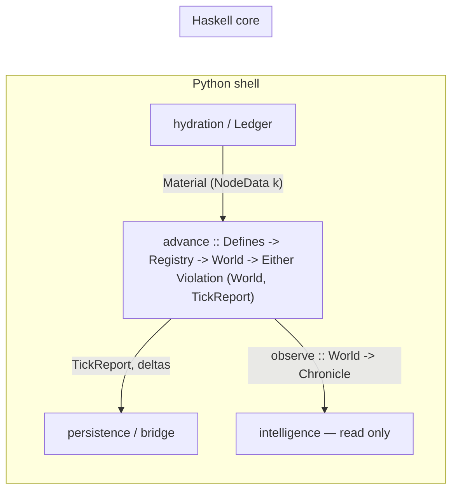

<!-- Provenance: BD-authored draft, delivered in-session 2026-07-22 and committed
     verbatim (Immutability of History — this text is design material, not a
     ratified spec). The companion module BabylonCoreDraft.hs referenced below is
     held by the BD and should be committed beside this file when dropped.
     The preparatory spec that frames this draft for ratification is
     2026-07-22-mirror-typed-core-spec.md. -->

# Babylon Core, Typed — a Haskell Algebra in the Lawverian Tradition

Draft 0 · 2026-07-22 · companion module `BabylonCoreDraft.hs` **typechecks under GHC 9.4.7** (`-Wall`, deps: base + containers only; remaining warnings are unexported-constructor residue, which is the boundary working as intended).

Scope per the prior feasibility discussion: this drafts the **functional core** — kernel, models, formulas, topology, dialectics — as one Haskell algebra, with the tick as the sole arrow. Persistence, the Django bridge, hydration/loaders, and intelligence stay in the Python shell. Nothing here is a spec; it is the type-level shape a spec would ratify. Every construct obeys the earn-its-keep rule (ADR051): it ships a law, a prediction, or a computation — never vocabulary.



The organizing claim: **most of the Constitution's Part I–III clauses are typing judgments that happen to be written in English.** The port's real payoff is not speed (though deleting the per-tick Pydantic round-trip will likely deliver some); it is that a class of constitutional violations stops being reviewable and becomes unrepresentable.

---

## 1. The two planes (I.7, I.12)

Constitution I.7: floats for quantities, enums for qualities, thresholds explicit, no continuous quality gradients. I.12: continuous control parameters, discrete state variables at fold crossings. That is a two-sorted ontology, and the type system enforces the sort discipline: the continuous plane is kernel newtypes with smart constructors, the discrete plane is closed sums, and the **only** morphisms from the first to the second are values of one type:

```haskell
data Fold q s = Fold
  { fThreshold :: q   -- explicit, Defines-sourced (I.7)
  , fBelow     :: s
  , fAbove     :: s }

crossFold :: Ord q => Fold q s -> q -> s
```

A `Fold` is I.12's fold catastrophe as a value. Its threshold is data constructed from `Defines` and nowhere else, so a numeric literal in a formula body has no type to hide behind — the magic-constants audit's Tier taxonomy becomes a construction rule rather than a sweep.

Kernel scalars are the existing constrained types, verbatim: `Probability`, `Intensity`, `Ideology` [-1,1], `Coefficient`, `Ratio` (0,∞), `Balance` [-1,1], and `Currency`. Smart constructors return `Either KernelViolation a` — refusal, not clamping; the only saturating arrow is `raiseIntensity`, and it is named, because consciousness saturating at 1 is a semantic, not an accident.

`Currency` is the deliberate departure: `newtype Micro = Micro Int64` fixed-point micro-units. Moving the value plane (the Φ circuit, wages, tribute) to fixed point makes cross-implementation byte-identity *trivial* exactly where Amendment Q's gap (2) bites hardest, at the cost of a one-time re-baseline that III.12(b) already anticipates. Ruling needed (§12).

## 2. Extensive and intensive quantity

This is Lawvere directly ("Categories of Space and Quantity," 1992), and ADR051 Phase D already shipped it operationally as `aggregate_extensive` vs `aggregate_intensive`: extensive quantities sum under aggregation (population, value, biocapacity); intensive quantities take share-weighted means (rates, tensions, consciousness — a gap is a ratio).

```haskell
newtype Extensive a = Extensive a
newtype Intensive a = Intensive a   -- NO Num instance, no sum arrow

sumExtensive      :: Num a => [Extensive a] -> Extensive a
meanIntensive     :: [(Share, Intensive Double)] -> Intensive Double
allocateExtensive :: [Share] -> Extensive Micro -> [Extensive Micro]
```

The type-level payoff is blunt: `Intensive` has no `Num` instance, so the classic bug class — summing tension ratios across counties — does not compile. `allocateExtensive` is the left adjoint of the scale adjunction (allocate ⊣ aggregate), integer-deterministic (floor per share, remainder to the first region *in insertion order*, so "first" has a III.7-defined meaning), and carries the sheaf law as an executable property: gluing = conservation.

```haskell
law_allocateConserves :: [Share] -> Extensive Micro -> Bool
```

## 3. The Lawverian layer, typed

Everything in this section already runs in Python under `src/babylon/dialectics/` (ADR051 A–E). Haskell adds two things: the laws become first-class `Bool`-valued functions lifted into the Amendment Q property layer, and adjunction defect becomes the **only constructor of tension** — tension cannot be invented, only measured, because `unitDefect` is the sole arrow producing it.

```haskell
data GaloisConnection p q = GaloisConnection
  { leftAdjoint :: p -> q, rightAdjoint :: q -> p }

law_adjunction :: (Ord p, Ord q) => GaloisConnection p q -> p -> q -> Bool
-- f x <= y  <=>  x <= g y

unitDefect :: (p -> p -> Intensity) -> GaloisConnection p q -> p -> Intensity
-- the gap: how far x <= g(f x) fails to close (Laclau; ADR051 "measured adjunction defect")
```

The adjoint cylinder is Lawvere's unity-and-identity-of-adjoint-opposites, L ⊣ U ⊣ R, with the shipped Phase B instance as its motivating inhabitant: over the SOLIDARITY subgraph, L = discrete (total atomization), R = codiscrete (total solidarity), U = underlying node set. The world's actual solidarity topology sits between two adjoint opposites, and atomization is its measured distance from R's image:

```haskell
data AdjointCylinder c d = AdjointCylinder
  { unity :: c -> d, leftOpposite :: d -> c, rightOpposite :: d -> c }
```

E1's two level lattices are chains with `aufhebung` as the least strictly-higher level where the resolution predicate (within-region variance zero) holds — `l < aufhebung resolved l` holds by construction rather than by test. E2's regime classifier transcribes verbatim as a total function, and RUPTURE stays what ADR051 made it: the crisis regime's boiling point, a `Fold` on the principal gap, not a separate mechanism.

```haskell
classifyRegime :: Epsilon -> Opposition -> Maybe Level -> Regime
-- Reproduction | Crisis | SublationTo Level

principal :: Defines -> [Opposition] -> Maybe Opposition
-- I.13: one leads per tick; rank = gap * (1 + rate_weight * |rate|)
```

The constitutional primitive lands with its fields named for the Compact, and "motion is primitive, statics are derived" becomes literal: a static is a fixed point of the Picard operator, and `staticOf` computes it.

```haskell
data Dialectic a = Dialectic
  { dThesis    :: Pole              -- A
  , dNegation  :: Pole              -- A-bar (determinate negation, not complement)
  , dWeight    :: Intensity         -- w — via unitDefect only
  , dMotion    :: Picard a          -- T
  , dSublation :: a -> Maybe Level  -- sigma
  }
```

VIII.9's n-ary protection is an absence: `Pole` includes `CommunityPole CommunityId`, and no exported arrow has type `CommunityId -> (Pole, Pole)`. Dyadic reduction isn't forbidden by review; it's unwritable.

## 4. The grammar: typing judgments

"Verb grammar" reads literally here. A well-formed edge is a well-typed sentence; the typing judgments — which subject and object kinds each verb admits — are GADT constructor signatures. I.14's "edges MUST be directed" is inherent: constructors have ordered signatures.

```haskell
data EdgeVerb v s t where
  Exploitation :: EdgeVerb 'ExploitationV 'SocialClassK 'SocialClassK
  Wages        :: EdgeVerb 'WagesV        'SocialClassK 'SocialClassK
  Tenancy      :: EdgeVerb 'TenancyV      'SocialClassK 'TerritoryK
  Adjacency    :: EdgeVerb 'AdjacencyV    'TerritoryK   'TerritoryK
  Membership   :: EdgeVerb 'MembershipV   'OrganizationK 'SocialClassK
  Attention    :: EdgeVerb 'AttentionV    'InstitutionK  'OrganizationK
  -- … full table in the module
```

| verb | subject ⊢ object | payload | source |
|---|---|---|---|
| EXPLOITATION | class ⊢ class | `FlowData` (Φ conduit, tension) | database-spec |
| SOLIDARITY | class ⊢ class | `BondData` (tension, resilience) | database-spec |
| WAGES | class ⊢ class | `FlowData` (super-wages from Φ) | database-spec |
| TRIBUTE | class ⊢ class **[confirm]** | `FlowData` | database-spec |
| TENANCY | class ⊢ territory | `TenancyData` | Sprint 3.5.1 |
| ADJACENCY | territory ⊢ territory | `()` — substrate carries no dynamics | Sprint 3.5.1 |
| MEMBERSHIP | org ⊢ class | `MembershipData` (tier: Sympathizer/Member/Cadre) | game-loop spec |
| PRESENCE | org ⊢ territory | `PresenceData` | game-loop spec |
| ORG_RELATION | org ⊢ org | `OrgRelationData` (mode, resilience, agreement, intel) | game-loop spec |
| ATTENTION_THREAD | institution ⊢ org | `AttentionData` (intensity, intel, phase, stickiness) | game-loop spec |

An ill-formed edge — ADJACENCY between classes, WAGES into a hex — is not invalid data caught by a Pydantic validator downstream; it fails to compile at the call site that tried to build it. Payloads are per-verb via a closed type family, so `edge.value_flow` on a SOLIDARITY edge is likewise unwritable. REPRESSION, COMPETITION, CLIENT_STATE from the database enum are omitted pending endpoint confirmation (§12) rather than guessed.

Node payloads follow the same pattern (`NodeData :: NodeKind -> Type`), with every value-plane field kernel-typed — a raw `Double` in a payload record is a review artifact.

## 5. Insertion order as structure (III.7)

ADR052 preserved NetworkX's iteration contract by wrapping rustworkx in insertion-ordered Python mirrors. Here the mirror *is* the structure — an insertion-ordered pure map, with per-source adjacency nesting so `edgesInOrder` reproduces source-insertion-then-adjacency byte-for-byte:

```haskell
data Topology = Topology
  { tNodes :: InsOrd AnyId SomeNode
  , tAdj   :: InsOrd AnyId (InsOrd AnyId SomeEdge) }

nodesInOrder :: Topology -> [SomeNode]
edgesInOrder :: Topology -> [SomeEdge]
law_insertionOrder :: [(Int, Char)] -> Bool   -- ports the nx differential oracle
```

Insert-on-existing-key updates payload and keeps position; delete drops the key (nx semantics, ADR052's pinned behaviors). The Hypothesis model test in `test_graph_iteration_order.py` ports directly as this structure's conformance property — the oracle survives the language.

This section is also where the migration's one real idiom shift lives, so it should be said plainly: ADR052's payload dicts are shared by reference and mutated in place by ~28 systems; these payloads are values and every system is `World -> World`. Reference semantics out, state threading in. That rewrite is the cost center of the whole program.

`addEdge` returns `Either Violation Topology`: well-*kinded* by construction (the GADT), well-*referenced* by check (dangling endpoints fail loud, ADR033). Two of ADR033's runtime invariants — dangling edges, negative currency — move into types entirely; `checkInvariants` keeps only the residue.

## 6. The mode category (I.15, ADR051 E3)

The modes form a presented category: objects are the five modes, generating morphisms are the ratified transition table, and `Path` is the free category on the presentation. Two constitutional facts become compiler facts.

```haskell
data Step a b where
  Degrade   :: Step 'Solidaristic 'Transactional
  Organize  :: Step 'Transactional 'Solidaristic   -- THE core player mechanic
  Marketize :: Step 'Transactional 'Extractive
  Formalize :: Step 'Extractive    'Transactional
  Rebel     :: Step 'Extractive    'Antagonistic
  ResolveS  :: Step 'Antagonistic  'Solidaristic
  -- … 17 generators total, transcribed 1:1 at ratification

organizingRoute :: Path 'Extractive 'Solidaristic
organizingRoute = Then Formalize (Then Organize Here)
```

First, I.15's prohibition — EXTRACTIVE → SOLIDARISTIC requires a TRANSACTIONAL intermediate — is an **absence**: no such generator exists, so no such one-step path can be written, ever, by anyone. Second, E3's corrected law ("no direct jump AND a transactional route exists") is an **inhabitant**: `organizingRoute` is the proof term, and deleting the intermediate makes the module stop compiling. E3 currently tests this; here the compiler audits it on every build. I.15's gates ("conditions reference contradiction internals") stay value-level guards on attempted steps — the type admits the step, the gate admits the occasion.

## 7. Formulas

All coefficients arrive through `Defines` (the GameDefines/defines.yaml image), which deliberately has no `Default` instance. The mathematical core transcribes with its theorems as return types:

```haskell
data Rent = RentFlows Currency | RentExhausted

imperialRent :: Currency -> Currency -> Rent
-- the Fundamental Theorem is the SHAPE of the type: while W_c > V_c the rent
-- flows and the core cannot rupture — not a comment on a float

sigmoidP13   :: Double -> Probability          -- portable, no libm (see below)
pSurvivalAcq :: Defines -> Currency -> Probability
pSurvivalReb :: Probability -> Probability -> Either KernelViolation Probability
rupture      :: Probability -> Probability -> Bool   -- P(S|R) > P(S|A)

routeAgitation :: Maybe SolidarityWitness -> BifurcationPole   -- Revolution | Fascism
deltaB     :: Defines -> Extensive Double -> Extensive Double -> Double  -- R − E·η
overshootO :: Extensive Double -> Extensive Double -> Either KernelViolation Ratio
```

`sigmoidP13` is the Amendment Q gap (2) closure point: a pure-arithmetic sigmoid (no libm), byte-stable across implementations. The body in the draft is a placeholder from the fast-sigmoid family; the ratified polynomial and its error bound belong to Program 13's float-honesty document, and the migration gate compares Python-vs-core under III.12(b) tolerances until cutover, then re-baselines.

`pSurvivalReb` refuses zero repression (`Left ZeroRepression`) rather than fabricating an infinity, and its saturation at 1 is named — Loud Failure applied to arithmetic.

The bifurcation shows the witness pattern that generalizes in §9: `SolidarityWitness` has an unexported constructor and `requireSolidarity` is its only mint, so the routing function cannot be called with a fabricated edge.

## 8. The tick: causality as types

Materialist-causality order is today a list in the engine plus review discipline. Here systems are phase-indexed, the registry has one slot per phase, and `advance` composes the phases in the only order that exists — registering a Consequences system into the MaterialBase slot is a type error. Base-determines-superstructure, compiler-checked.

```haskell
newtype System (p :: Phase) = System (Defines -> World -> (World, [Event]))

data Registry = Registry
  { materialBase :: [System 'MaterialBase]
  , oodaAction   :: [System 'OodaAction]
  , consequences :: [System 'Consequences] }

advance :: Defines -> Registry -> World -> Either Violation (World, TickReport)
```

`advance` is a function with no `IO` in its signature. Same `Defines`, same `World`: same result. III.7 stops being a discipline the regression gates check and becomes a property of the arrow's type — the gates remain as *redundant* verification, which is what Amendment Q says verification should be. The RNG is splittable pure state inside `World` with pinned seeds (ADR033); the tick hash consumes exactly the III.7 iteration surface (`nodesInOrder ++ edgesInOrder`), with the byte recipe owned by Program 13 (gap (1)). An invariant violation aborts the tick — `Left`, no partial states, no fabrication (III.11).

Within a phase, the list is the strict registry order — the 28 systems keep their sequence as data. Phase membership of all 28 needs transcription (§12).

## 9. Verbs as capabilities

Organizations are the agents (I.16); verbs operate through them (I.21). Each verb's Requires-clause from the game-loop spec becomes an argument whose type is an unforgeable witness — `requireMembership` is the only mint for `MembershipW`, so EDUCATE without a MEMBERSHIP edge is not a rejected action, it is an uncallable function. The spec's validation table becomes the module's arguments page:

```haskell
requireMembership :: NodeId 'OrganizationK -> NodeId 'SocialClassK -> Topology -> Maybe MembershipW
requirePresence   :: NodeId 'OrganizationK -> NodeId 'TerritoryK  -> Topology -> Maybe PresenceW

educate :: Defines -> MembershipW -> Double -> World -> (World, [Event])
```

The nine verbs — EDUCATE, AID, ATTACK, MOBILIZE, CAMPAIGN, MOVE, INVESTIGATE, REPRODUCE, NEGOTIATE — form a closed sum; `educate` is given a real body in the draft because it exhibits the state-threading idiom the whole port turns on (pure payload update and re-insert, replacing shared-dict mutation). MOBILIZE's consciousness threshold arrives as a `Fold` from `Defines`; OODA capacity (I.17) makes an unpayable verb unexecutable via `Maybe`, not exception. REPRODUCE is a `Tier` transition on the MEMBERSHIP payload — quantitative organizing work, qualitative membership change, I.7 again.

## 10. Boundaries as physics

Three module-boundary decisions carry constitutional clauses:

**Observation.** `World` exports no constructors; `observe :: World -> Chronicle` is the entire read surface for intelligence. "AI observes and narrates; the engine adjudicates" stops being a review rule and becomes linkage fact — the narrator cannot reach the math because there is no symbol to link against.

**Provenance (Aleksandrov).** State enters the world only as `Material (NodeData k)`, and `Material`'s constructor is exported only to the hydration module — the Ledger boundary. A formal construct with no material source has no way into the topology.

**Substrate immutability.** `HexState` and ADJACENCY payloads have no exported update arrows. The spatial substrate's immutability is an absence of functions, which is the strongest form a prohibition can take.

## 11. Law → verification mapping (Amendment Q)

| law (in the module) | pins | verification layer |
|---|---|---|
| `law_adjunction` | Galois connections are real adjunctions | QuickCheck property |
| `law_cylinderLeft/Right` | L ⊣ U ⊣ R | QuickCheck property |
| `law_insertionOrder` | III.7 iteration contract | property + nx differential oracle (ported) |
| `law_allocateConserves` | gluing = conservation (Phase D sheaf) | property + `conservation_check` column |
| `organizingRoute` | I.15 prohibition + E3 route existence | **the compiler** |
| absence of `CommunityId -> (Pole, Pole)` | VIII.9 n-ary protection | **the compiler** |
| `advance` purity | III.7 determinism | **the compiler** + goldens as redundancy |
| dense goldens, tick-hash chain | cross-implementation behavior | Program 13 artifacts, III.12(b) tolerances |

The pattern throughout: what the compiler can enforce, it enforces; the existing gates stay as the redundant layer Amendment Q requires rather than the only layer.

## 12. Open rulings

1. **Currency representation** — fixed-point `Micro` (drafted) vs Double-with-softfloat. Fixed point buys byte-identity on the value plane; costs a re-baseline. My recommendation: fixed point, and III.12(b) already licenses the re-baseline.
2. **Endpoint typing confirmations** — TRIBUTE (comprador→core as class⊢class?), and the omitted REPRESSION / COMPETITION / CLIENT_STATE verbs (institution⊢class? sovereign⊢sovereign?). Transcribe from `src/babylon/models`, don't ratify my `[confirm]` marks.
3. **The 17 generators** — the mode category's presentation must transcribe 1:1 from the repo's transition source; the draft carries the documented subset plus two marked speculative (`CoOpt`, `Break`).
4. **Sigmoid polynomial** — Program 13 owns the ratified coefficients and error bound; the draft body is a shape, not a spec.
5. **Phase membership** — assign each of the 28 systems to MaterialBase/OodaAction/Consequences; the draft pins only the composition order.
6. **Edge payload merge** — ADR052 pins nx attribute-merge on re-add; typed payloads want per-verb field-level merge functions or replace semantics. Draft uses replace.
7. **Where `EdgeMode` lives** — `OrgRelationData.orMode` (drafted, per the game-loop spec) vs mode as a property of more edge families.

## 13. What this buys, what it costs

Bought: determinism as a type rather than a discipline; the verb grammar and mode transitions as compile-time law; tension constructible only by measurement; intensive/extensive confusion unrepresentable; the intelligence boundary as linkage fact; and a formulas layer whose theorems are return types. The Lawverian layer turns out to be the *easiest* part of the port — ADR051's constructs are nearly literal Haskell already, which is evidence the 2026-04-26 discipline was load-bearing rather than aesthetic.

Cost, unchanged from the feasibility discussion: rewriting ~28 systems from shared-dict mutation to state threading (§5 is the idiom), a permanent two-toolchain estate for a solo dev, and the float cutover. Sequencing recommendation stands: Program 13 first (this draft depends on its artifacts at three named points), then a spec ratifying §12's rulings, then the port validated shadow-mode against dense goldens under III.12(b) tolerances.

Nix note from the prior discussion, for completeness: the toolchain (GHC 9.4+, cabal, HLS) lands in babylon-infra's existing flake devshell (ADR071 scoped Article X.1 to the production host); `packages.babylon-core` builds the core; the flake pin doubles as float-determinism infrastructure for CI. If the core binary ever deploys to the production host, ship the ELF, not a closure.
