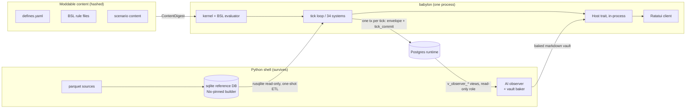

# Program 27 — Refoundation: BSL + Rust Kernel-First Rewrite

**Status:** Director-approved design (brainstorm 2026-07-28 → 2026-07-29). Precedes the
constitutional amendment and the implementation plan; nothing in this document is code
authorization by itself. *Exception:* the triple-`defines_hash` unification (§7) is
authorized now as a standalone pre-program bug fix on its own branch and PR, with its
baseline and campaign-metadata consequences dispositioned there.
**Authority:** Persephone Raskova (Director, Amendment AD / Constitution IX.5).
**Supersedes:** the current v1.0 critical path (Director ruling R2, below).

---

## 1. Summary

Babylon's engine is rewritten **kernel-first in Rust** around a new deterministic,
total, fuel-metered, Lisp-like DSL — the **Babylon Scripting Language (BSL)** — which
becomes the substrate for game rules. Rules move out of Python code into homoiconic
BSL data; the surface that must be trusted shrinks from ~200k lines of Python
semantics to one small spec'd evaluator plus a table of named numeric intrinsics.
Python survives only as the data-build pipeline and the out-of-process AI observer.
The Rust/Ratatui client (Amendment AC) survives unchanged in contract and gains an
in-process engine. This is one program, not two: BSL is what makes the Rust port
tractable, and the Rust kernel is what BSL runs on.

**Drivers (Director, R1):** BSL-as-portable-core plus one-toolchain convergence;
performance is a suspicion to be converted into evidence (Phase 0 publishes the
existing per-system tick profile), not an assumed motive. The Director's framing:
the sentinel estate, the architecture, and the Lawverian formalization all point to
this — the sentinels are a hand-rolled compiler front-end (AST audits enforcing
grammar conformance, closed vocabulary, literal-freeness) for a language that did
not yet exist; THE_FORMALISM.md Part III is a language spec (BNF, typing judgments,
totality theorems) with no language. This program makes the language exist.

## 2. Evidence base

Two orchestrated research passes (13 read-only agents + 1 adversarial reviewer)
over claude-mem history, `ai/`, `reports/`, `docs/`, `specs/`, the Constitution,
NORTH_STAR, `src/babylon/`, `rust/`, and the `hypergraph-rs` sibling repo. Key
prior art this design consciously supersedes or builds on:

- `hypergraph-rs/plans/BABYLON-RUST-MIGRATION-DOCTRINE.md` (rev 2, 2026-07-22,
  1,415 lines, PLANNING ONLY): §5 analyzed BSL directly (recommended
  Python-first, outside the hash boundary — **overridden by R1/R4**: BSL is the
  portable core and lives inside the hash boundary); its C1–C11 contract
  framework, its failure-class lessons (renumbered here **F1–F4** — eyeball-before-
  golden, tautology ban, transcription/idiom-mismatch review, spec-completeness —
  to avoid collision with the §3 rulings ledger), and cross-language trap inventory
  (rounding modes, MT19937, iteration order, inf/NaN JSON, absence idioms) are
  adopted into Phases 0–4.
- ADR063 (Program 14 Correspondence): deferred a Rust kernel behind a measured
  CPU profile; **superseded by Director ruling R2**. Its monorepo argument
  ("one determinism contract spans the sim") is retained — the engine lands in
  the existing in-tree `rust/` workspace.
- NORTH_STAR §6.2 ("Python stays the engine language") and §0 (formalism surface
  closed for v1.0): **re-opened by the amendment this design mandates** (§4).
- The 2026-07-27 babylon-next-move rejection of a "Rust scripting language":
  superseded by R1–R2 with what changed stated: the exhaustive sweep surfaced the
  migration doctrine, the audit showed 29/34 systems are wholly or partly
  rule-shaped, and the Director ruled the program's scope directly.
- `ai/haskell-lawverian-core-draft.md` + `BabylonCoreDraft_2.hs` (typed-core
  prototype, tabled): its rulings are adopted where they transfer — fixed-point
  Currency, extensive/intensive typing, phase-indexed system registry,
  insertion-order-as-structure. Haskell itself stays rejected (interop, Nix,
  agent-codegen — `reports/user-interface-debate.md` Part II).
- The adversarial design review (Opus, 2026-07-28, this brainstorm session):
  blockers B1–B4 and majors M1–M14 cited throughout are indexed in **Appendix A**
  with the section that discharges each.

## 3. Director rulings ledger (2026-07-28 → 2026-07-29)

| # | Ruling | Note |
|---|--------|------|
| R1 | Driver = BSL-as-portable-core + toolchain convergence; performance evidenced not assumed | mix of drivers 1+3, suspected 2 |
| R2 | **This IS the new program** — supersedes the v1.0 critical path | re-opens §6.2, §0, ADR063 |
| R3 | Correctness = **hybrid**: evaluator hard-proof + game law-fidelity + 11 canon scenarios; NOT per-tick trace equivalence | |
| R4 | Architecture = **B, kernel-first** | agent recommendation was A+shadow (evaluator-first strangler); overruled — recorded per house ADR practice |
| R5 | §4 governance & amendment slate + §5 the BSL language — approved | presented as brainstorm sections 1–2 |
| R6 | §6 kernel + §7 data flow — approved, v2 post-adversarial hardening | brainstorm sections 3–4 |
| R7 | Amendment D: **Phase-0 analysis first**, Director ratifies before `babylon-graph`'s data shape commits | working assumption dyadic; nothing commits |
| R8 | RNG: **streams change at cutover** | agent recommendation was a bit-exact CPython-RNG crate; overruled — consequence recorded in §8.5 |
| R9 | §8 correctness + §9 error handling + §10 sequencing + §11 risk register — approved | brainstorm sections 5–8 |

## 4. Governance & amendment slate

One **MAJOR constitutional amendment** (targeting v3.0.0) carries the program:

1. **Engine language:** Rust is the engine language; Python is the data-build and
   AI-observer shell. Supersedes NORTH_STAR §6.2's "Python stays the engine
   language."
2. **Formalism closure:** NORTH_STAR §0 re-opens for exactly one **additive**
   construct — BSL. The language *expresses* the existing closed algebra; it mints
   no new mathematics. The closure also re-opens **subtractively** for III.10
   retirements out of the §6.2 numeric annex: a retirement is not sign-off-only —
   it is recorded as an amendment rider enumerating each retired construct, since
   removing a construct changes what the algebra can express. Everything else
   stays closed.
3. **Invariant 2** ("the engine adjudicates; AI narrates; clients render — no
   exceptions without amendment") survives verbatim with "engine" rebound to the
   Rust kernel.
4. **ADR063's deferral** is superseded by Director ruling. The tick profile is
   still published in Phase 0 as evidence hygiene, not as a gate.
5. **Amendment D** (II.7 hyperedge vs dyadic, [TRANSITION STATE]) is resolved
   inside this program via a Phase-0 analysis PR the Director ratifies **before**
   `babylon-graph` commits a data shape (R7). Per IX.3.4 it is not resolved by
   engineering default. The analysis must state how VIII.9 (community as pairwise
   edge) and I.18's material/ideological distinction fare under each option.
6. **Amendment AA Windows note** (mandatory one-liner): Rust+cargo improves
   native-Windows feasibility versus the Nix-pinned CPython/numpy stack; residual
   foreclosure risks are the embedded Postgres cluster and whatever LAPACK
   linkage, if any, the §6.2 per-site rulings retain.

**Python engine disposition:** frozen at the end of Phase 0 (the freeze tag).
Phase 0 runs it a final time to publish the profile and bake every contract
artifact. The freeze tag is an **executable pin**, not a source-only tag: it pins
source + `flake.lock` rev + `uv.lock` + reference-DB sha + Postgres migration
head, and a scheduled CI job rebuilds and runs the tagged engine on the 11 canon
scenarios through cutover, so the ceremony's Python half is known-runnable when
Phase 4 needs it — failure of that job is a red gate. After the tag the engine is
reference-only; mid-program fixes to the frozen branch require Director sign-off
plus contract re-extraction.

**v1.0 is redefined** as the Rust engine's release ("the game ships" retargets).
Save-compat semver resets with it. In-flight v1.0 stops (Gate 3 #262, M4 owner
smokes, the ADR109 wiring train, GitHub Project 8 items) receive an explicit
disposition table in the implementation plan: closed-as-superseded, absorbed, or
carried (client-side items carry, since the client survives).

**Repo layout:** engine crates land in the existing in-tree `rust/` workspace
(monorepo; ADR063's one-determinism-contract argument is strengthened when
engine and client share a language). `hypergraph-rs` stays a sibling library
consumed as a dependency; its charter does not expand.

## 5. The BSL language

**Shape.** Lisp-like s-expressions, fully homoiconic. Rules are data: stored as
content files, diffed in PRs, inspectable in-game, rewritable by tools. One form
replaces today's three disjoint substrates — the doctrine trap-condition string
DSL (`src/babylon/domain/doctrine/mechanics.py`), the flat Pydantic
event-precondition tree (`src/babylon/engine/event_evaluator.py` +
`models/entities/event_template.py`), and the 4-op effect enum.

**Totality.** No general recursion, no unbounded loops. Iteration exists only as
folds over finite graph-query results. Fuel budgets are **per-rule, declared in
the rule, inside the content hash**. The static bound is computed against
**declared cardinality ceilings, not the runtime graph**: each scenario manifest
declares per-NodeType/per-EdgeType `max_cardinality` values (themselves inside
the content hash); the worst-case bound is the sum over folds of (declared
ceiling × per-node AST cost); a rule whose bound exceeds its budget is rejected
**at content load**, and a hydration that exceeds a declared ceiling is itself a
III.11 load failure. This makes the Power-of-10 Rule 2 claim true as a static
property, not a dynamic trap; the runtime fuel meter remains as the III.11
backstop. The per-AST-node fuel cost model is specified in the III.12(a)
language-agnostic reference produced in Phase 0 (its conformance-vector layer is
§8.2) and pinned by a cross-version conformance vector.

**Types.** Values are the kernel scalars — `Probability`, `Intensity`,
`Coefficient`, `Currency` (fixed-point **i128 micro-units**, §6.1) — plus the
closed enums (DoctrineTag, PracticeVariable, NodeType, …), booleans, and typed
node/edge-set references. **Unweighted aggregation of an intensive quantity is a
type error; weighted aggregation requires an explicit weight term.** Intensivity
is a **per-field declaration** (`:kind intensive|extensive`) on model fields, not
a property of the scalar type; the BSL typechecker propagates it through folds
and rejects unweighted aggregation over an intensive-kinded field (Phase-0 census
counts the fields needing a kind). Exemptions live in a declared
`EXTENSIVE_INTENSIVE_EXEMPTIONS` ledger with a mandatory reason string; adding a
row takes the same sign-off as a sentinel exemption. This is the narrow, true
form of the extensive/intensive law — it does not reject correct weighted code.

**Determinism.** Strict left-to-right evaluation. Evaluator arithmetic is
IEEE-754 basic ops and fixed-point integer **only**. Transcendentals (sigmoid,
exp, log, tanh, sqrt, entropy) are never BSL primitives — they are named kernel
intrinsics with pinned deterministic implementations (polynomial vs pinned-libm
is an open Phase-1 ruling, §13). The evaluator's byte-level semantics, the
canonical AST serialization, and the fuel cost model are one language-agnostic
reference document per III.12(a).

**Expressible.** Conditions (a superset of the two existing grammars'
*expressible set* — see the honesty note below), effects (the 4-op arithmetic
set **plus typed structural verbs**: add/remove node/edge and update-node under
the I.15 edge-mode state machine — 20 of 39 system modules mutate graph
structure — by the strict add/remove verb grep 5 of the 39 system modules, 29 when
`update_node` payload writes count, per the Phase-0-reproducible AST definition —
so arithmetic alone was never sufficient), formula composition over registered
intrinsics, guards, folds. **Not expressible:** I/O, defining new
intrinsics, graph mutation outside the typed verb set, anything unbounded.

**Grammar-superset honesty (adversarial finding M8).** BSL is a superset of the
two existing grammars' expressible sets, **not of their failure semantics**. Four
silent-degradation behaviors are deliberately broken as III.11 corrections:
unknown graph metric → 0.0 (`event_evaluator.py:313`), unknown aggregation →
False (`:439`), unknown comparison operator → False (`:405`), empty precondition
set → True (`:103`). The ~899 lines of existing evaluator tests (271 doctrine +
628 event-evaluator) transcribe as the conformance seed **with a documented
delta** at exactly those four points.

**Bindings, not honest-null.** A rule declares the variables it reads; a plain
declared binding that is unbound is a **load-time error**. The opt-in is content,
not a test list: a binding may be declared `(:optional <name> :default <literal>)`,
and only an optional binding may be absent at evaluation. The migration corpus
enumerates the exact rules permitted to carry `:default 0` (the trap DSL's pinned
absent-reads-as-0 sites), and a lint forbids new `:default` declarations outside
that set without Director sign-off.

**Aleksandrov at parse time — scoped honestly (M3).** Every rule carries a
mandatory `:material-basis` field. The parser enforces **presence and
non-emptiness only**; the semantic III.8 obligation (does the named material
process actually ground the construct?) stays with Director review and the
sentinel successor's aggregation/aleksandrov families (§6.3).

**Modding boundary.** BSL is the modding surface by construction: modders author
rules and coefficients over a **closed content vocabulary**. New enum members,
node types, or intrinsics remain amendment territory. Fuel + the closed
intrinsic set + no I/O = sandbox with no escape to express. Mods declare
ordering **anchors** (before/after a named system), never raw position floats;
the resolved total order goes inside the content hash; interleaving into the
Material Base partition is rejected at load.

## 6. The Rust kernel

**Crates** (in-tree `rust/` workspace; the crate DAG enforces the Program-14
layering law — kernel < bsl < graph < domain < persistence < engine < cli):

| Crate | Contents |
|---|---|
| `babylon-kernel` | scalars, i128 Currency, ContentDigest + tick hash, sim clock, event bus, RNG service |
| `babylon-bsl` | reader, typechecker, load-time bound checker, fuel evaluator |
| `babylon-graph` | graph substrate (data shape blocked on Amendment D ratification, R7; working assumption: `StableDiGraph` via the rustworkx-core re-export — petgraph via re-export ONLY, the hypergraph-rs lesson) |
| `babylon-domain` | numeric intrinsic systems + the intrinsic table (§6.2) |
| `babylon-persistence` | single-writer Postgres runtime + rusqlite reference-DB reader |
| `babylon-engine` | tick loop, anchor-based phase-indexed registry, consolidated observer hook, BSL rule host |
| `babylon-cli` | the `babylon` binary; `play` is one process |
| existing | `babylon-tui`, `babylon-md`; `babylon-tui-python` (PyO3) retires at cutover |

### 6.1 Numeric representation (adversarial blocker B2)

Currency is **i128 micro-units** with `checked_*` arithmetic everywhere;
overflow is a loud III.11 failure — never wrapping, never saturating. Rationale:
i64 micro-units cap at ~9.2e12 while the shipped tri-county baseline already
carries single values of ~5.5e11, and Article IV/Amendment R mandates ~3,100
counties (two to three orders of magnitude up — 1e14–1e15). Phase 0 runs a
magnitude census over the nationwide seed data and pins it as a test; i128's
performance cost is measured in the same phase (fallback: i64 at cent
granularity, only with a written precision derivation). Operator semantics are
pinned, never implicit: `Currency ± Currency → Currency` (checked);
`Currency × Coefficient → Currency`, rounded half-even to micro-units;
`Currency ÷ Currency → Coefficient`, computed at i256 intermediate width then
rounded half-even; `Currency ÷ integer → Currency`, half-even. Truncation is
never implicit; intermediate widths and rounding points live in the III.12(a)
reference with conformance vectors.

### 6.2 The numeric annex (adversarial blocker B4)

The determinism restriction covers `babylon-domain`, not just the evaluator.
Phase 0 audits **every numpy/scipy call reachable from `run_tick`** and issues a
per-site ruling: (a) same-LAPACK linkage under the existing BLAS=1 pin, (b)
re-derivation with a written III.12(b) tolerance policy and a tolerance-bounded
gate, or (c) retirement under III.10 Earn-Its-Keep. Known live sites:
`np.linalg.inv` (`domain/economics/tensor_hierarchy/inter_industry.py:253`,
`production_chain_rent.py:144`), `np.linalg.eig` — LAPACK dgeev, nonsymmetric
(`class_transition.py:74`), `scipy.optimize.linprog` — HiGHS
(`formulas/curvature.py:26`; a degenerate LP has multiple optima, so this is
behavioral drift, not float noise — a leading III.10-retirement candidate),
`scipy.sparse` (`substrate/circulation.py:27`, `lodes_commute_matrix.py:42`).
The II.12 three-layer stack (authoring → sparse matrix → operator expression)
restates in Rust with **faer** as the default numeric layer; same-LAPACK linkage
is available per-site **only** where a Phase-0 ruling records that faer cannot
reproduce the required decomposition, and each such site is itself a
Windows-foreclosure entry (§4.6). `round_half_even(x, digits)` becomes a kernel
intrinsic with its algorithm in the III.12(a) reference and a conformance
vector; bare `f64::round` is lint-banned in engine crates; the 73 Python
`round()` sites (32 files) enter the porting contract table (§8.4) classified
in-tick vs presentational.

### 6.3 The sentinel successor (adversarial blocker B3)

The Python sentinel estate — 84 files / 20,642 lines across 24 families, ~30
`check:*` tasks, all reading Python source via `ast` — is the machinery
Constitution IX.5 names as the license for agent autonomy. It cannot lapse.
Phase 0 delivers a **per-family disposition table**; every family lands in one
of: (a) **subsumed by the type system**, with the subsumption argument written
(closed enums subsume the type half of vocabulary; the extensive/intensive
lexicon becomes real types); (b) **ported** to syn/cargo-metadata/BSL-AST
analyzers (the reachability halves: "every queried type has a producer", and
inert-detection across the BSL content boundary — cargo's `dead_code` lint
cannot see a rule no content file references); (c) **survives as git-level
tooling** (the baseline-ceremony law — CONTRIBUTORS.md §6.5,
`tools/check_baseline_ceremony.py`). The (b) ports are scheduled work, not a
follow-on: Phase 3 implements every (b) family, each landing with a
mutation-validated proof it still catches its original error class. **Cutover
blocks on the table being green**; a family whose port slips either blocks
cutover or degrades to a declared, Director-signed exemption row — no silent
lapse.

### 6.4 The 34-system classification (Phase-0 audit, executed 2026-07-28)

Source of truth: `src/babylon/engine/simulation_engine.py:328-363`
(`_SYSTEM_CLASSES`, 34 entries — the CLAUDE.md "33" is stale by one).

- **BSL_RULES (17):** Vitality, Territory, Lifecycle, Solidarity,
  DispossessionEvent, Decomposition, ControlRatio, Metabolism, Doctrine,
  Struggle, FascistFaction, Allegiance, Policy, Sovereignty, CollapseTransition,
  EdgeTransition, EpistemicHorizon.
- **HYBRID (12):** Substrate, Production, ReserveArmy, Community, ImperialRent,
  Transport, OODA, FactionInfluence, Survival, Consciousness, Electoral,
  Contradiction — rule-shaped guards/thresholds in BSL, structural/numeric cores
  (lattice rungs, tensor lookups, sigmoids, entropy) as named intrinsics.
- **RUST_INTRINSIC (5):** TickDynamics (2,558-line Vol I/II/III tensor core),
  MarketScissors, ContradictionField, FieldDerivative, WealthDistribution.

The language carries roughly half the engine directly and guards most of the
rest — the III.10 earn-its-keep floor is met. Float-hazard inventory (sigmoids
in Survival/ReserveArmy/TickDynamics; tanh+log in MarketScissors; Shannon
entropy in Consciousness; sqrt in Allegiance; seeded RNG draws in
Struggle/FascistFaction/Electoral/FactionInfluence/OODA) is carried per-system
into the porting contract table (§8.4).

### 6.5 Engine periphery dispositions

| Component | Disposition |
|---|---|
| EventBus (`kernel/event_bus.py`, 288 lines) + 100-value EventType (`models/enums/events.py:30-188`; CLAUDE.md's "84" is stale) | **Port.** Ordering guarantees (registration-order dispatch, append-before-emit, stable-sorted interceptor chain) are already deterministic and load-bearing; preserved byte-for-byte. Single consumption pattern: batch-drain-per-tick. |
| Three observer mechanisms (legacy SimulationObserver; ad hoc `EndgameDetector.on_tick` direct call; TickCommitObserver → vault baker) | **Consolidate into one hook point.** Porting all three would be porting a bug. |
| SessionRecorder | **Dies.** The real replay substrate is `PerTickTransactionEnvelope` + the commit marker, which ports as a kernel construct. |
| EndgameDetector (812 lines; 5 outcomes, every-tick re-evaluation, never latching) | **Port as BSL-expressible predicates**; the priority order (RED_OGV > FRAGMENTED_COLLAPSE > ECOLOGICAL_COLLAPSE > FASCIST_CONSOLIDATION > REVOLUTIONARY_VICTORY) becomes **data** asserted by the conformance corpus — today it is a docstring plus an if/elif chain. |
| ServiceContainer (~40 `Any`-typed optional slots) | **Not ported 1:1.** Folds into the typed intrinsic table; reproducing it as `Option<Box<dyn Any>>` re-imports the type-erasure problem. |
| TickContext (`extra="allow"` + dict shims; ≥5 undeclared stamped keys in `game/session.py:1444-1451` alone) | **Phase-0 census of every stamped key → first-class typed fields.** The escape hatch does not survive. Highest silent-breakage risk found. |
| TickPartition (system declares own partition+position) | **Port as-is** — already-declarative, single source of truth; mods use anchors (§5). |
| `game/session.py` composition root (1,897 lines) | Absorbed into `babylon-engine` + `babylon-cli`. |
| CLI: doctor/telemetry/login/self_update/uninstall | **Stays Python** — zero engine coupling verified. |
| `uuid4()` per-tick correlation id | Replaced by a deterministic per-tick counter (log-only today; the replacement is strictly better). |
| Logging estate | The **game process** collapses to one JSONL DEBUG sink (`babylon.log`); the Python observer keeps its own sink; `client-capture.log` retires with the PyO3 boundary. This supersedes the 2026-07-28 three-log Director directive — flagged for Director confirmation (§13). Currently-log-only failure signals (handler ExceptionGroups, blocked/modified interceptor events) keep equivalent coverage. |

## 7. Data flow

**Persistence.** The Rust writer reproduces the modern envelope path verbatim:
one Postgres transaction per tick, `ON CONFLICT DO NOTHING` idempotency, the
`tick_commit` marker written last in the same transaction
(`persistence/postgres_runtime/_spec_062.py`, migration 0029). Resume logic
reads the commit-marker table, never `MAX(tick)` on sparse tables. The legacy
full-snapshot Path A writer (`_legacy.py` `persist_tick`) is **flagged for
deletion, not porting** (Director sign-off in the plan). `v_hex_state_asof`
(migration 0030) stays a live Postgres view queried from Rust — its
LEAD/as-of-interval-join semantics are not reimplemented. The per-table-family
transaction pattern (`partitioning.py`; one transaction per family, a
deadlock-avoidance lesson already paid for) and the 52-tick checkpoint cadence
(`delta.py` `CHECKPOINT_EVERY_TICKS`) are preserved. Client: the sync
`postgres` crate with a blocking pool — the scout verified zero async anywhere
in the current tick path, so nothing forces tokio; sqlx is rejected.
`rusqlite` opens the reference DB read-only; the sqlite 3.53.1 byte-identity
pin binds the **builder** only (`tools/build_reference_db.py`), verified — no
read-time pin obligation.

**Observer seam (fixes M12).** The Python AI observer reads through a
**versioned `v_observer_*` view set behind a dedicated read-only Postgres role**
whose grants exclude base tables — II.11 discipline, not table-tailing. The
narrator seam stays structurally one-way: a fire-and-forget sink (subject id +
tick + prompt strings in, nothing engine-shaped ever returned) — the current
codebase already has zero feedback paths, verified by sweep. The vault baker
stays Python; the III.13 golden-vault gate therefore needs **no change**: it is
a byte contract over rendered markdown + sim-time-pinned dulwich commit shas,
not a Python pin. Host trait implementation splits into tiers: **BAKED**
(read_page/known_subjects/backlinks — vault file/git access only, no engine
needed; exception: `trade/*` subjects render live), **LIVE** (subject/dashboard/
trend/topology/field/choropleth/endgame/chronicle/pacing/verb-plate views), and
**MUTATE** (advance_tick, run_until_paused, acknowledge_pause, issue_verb,
pin_watchlist, save_nav_state, campaign lifecycle).

**Content pipeline.** One canonical **`ContentDigest { defines_hash, rules_hash }`**
function with a specified byte layout replaces the **three mutually
inconsistent `defines_hash` implementations live today**
(`engine/headless_runner/runner.py:957-965`, `cli/play.py:322-336`,
`tools/regression_test.py:339-349` — the third uses field-declaration order and
16-hex truncation; the first two agree only by coincidence of both calling
`sort_keys=True`). Retiring this triad is a **live bug fix that lands now, on
its own branch and PR** (header exception): the canonical form is the
sorted-keys full-64-hex serialization with pinned separators (the runner/play
shape, made byte-identical by specification); the declaration-order 16-hex
variant retires; stored `babylon_meta.defines_hash` campaign values and the
regression-baseline `defines_hash` fields are dispositioned (restamped or
declared-invalidated) in that PR with whatever ceremony the baseline drift
requires. `rules_hash` is computed over the
canonical whitespace/comment-insensitive AST serialization, so a rule edit is
declared input drift while a formatting edit is nothing. Defines schema
authority migrates in two phases (X.7: never two generators): Phase 1–3, Python
Pydantic schema stays the source of truth and the Rust `GameDefines` mirror is
hand-written, validated by a round-trip conformance test against the same
`defines.yaml` (50 top-level categories / 55 models; per-field range **and**
description metadata are both load-bearing and must be represented); at
cutover, authority flips to the Rust types, `babylon defines generate` renders
the commented player YAML (the generator's round-trip-verify safety gate is the
asset that survives, not its language), and the Python generator + sync test
are **deleted**, not kept in parallel. Scenario content is today Python
literals (`tools/regression_scenarios.py`) — expressing scenario topology and
overrides as BSL content is chartered as part of Phase 2, and noted as new
ground, not a port.

## 8. Correctness & testing

Seven redundant layers (III.12(c)):

1. **Evaluator:** the 899-line transcribed conformance corpus (documented
   4-point delta, §5); property laws under proptest; fuel + canonical-AST
   conformance vectors; cross-run/cross-machine byte-determinism.
2. **Kernel primitives:** `round_half_even` and Currency checked-arithmetic
   vectors; the pinned Rust PRNG's seeding derivation in III.12(a) plus a
   within-implementation replay vector (streams differ from Python by R8).
3. **Intrinsics:** per-intrinsic golden vectors for every transcendental
   replacement, with written tolerance derivations against Python values.
4. **Systems:** the **porting contract table** — the single named artifact
   (every earlier "port checklist" reference means this): one row per system,
   created in Phase 0, closed in Phase 3, carrying float hazards, RNG usage,
   `round()` sites classified in-tick vs presentational, the coverage instrument
   (scenario / property law / transcribed suite), the BSL-vs-intrinsic split,
   and reviewer sign-off. Current coverage per the live gate-coverage sentinel:
   **17/34 systems evidenced by scenarios, 17 explicitly declared as coverage
   gaps, 0 blind** (the "12/30" figure is ADR090-era and stale). The floor is
   **all 34**: before the freeze tag every gapped system lands a property law or
   transcribed unit suite on the Python side, or carries a Director-signed
   waiver row — a CoverageGap row alone (e.g. DispossessionEventSystem today)
   does not survive the freeze (fixes M14).
5. **Game:** every game-level instrument is **split by column family under R8**,
   uniformly. The 11 canon scenarios are fidelity instruments per R3's third leg,
   not merely a within-Rust determinism check: each is compared against its
   frozen Python baseline — deterministic families tolerance-bounded with
   written per-family derivations, stochastic families under ensemble envelopes
   (note: 5 of the 11 are the electoral goldens, the RNG-heaviest, so their
   stochastic families lean entirely on envelopes — stated, not hidden) — plus
   within-Rust byte-determinism and the qualitative outcome contracts with the
   endgame priority law as data. **Michigan-83 (`michigan-e2e.json`) and Wayne
   tri-county (`detroit-tri-county-5t.json`) are the Article IV acceptance
   gates** (fixes B1) under the same family split. Comparison granularity:
   **per-column at declared checkpoint ticks** (the existing 52-tick cadence
   plus the terminal tick; for short scenarios like the 5-tick tri-county, the
   terminal tick) — consistent with R3's rejection of per-tick trace
   equivalence; tolerances state max |d|, and conserved-sum columns add a
   conservation-residual bound. Ensemble parameters: N and the envelope
   statistics are fixed in the Phase-0 envelope declaration. A nationwide
   ~3,100-county hydration + profile run is a named cutover gate.
6. **Vault:** III.13 unchanged (baker stays Python).
7. **Empirical invariants:** the Pareto-thirds contrapositives carry over as
   runtime checks.

TDD red-phase discipline and local-only mutation testing carry unchanged. The
**cutover ceremony** (under the baseline-ceremony law, CONTRIBUTORS.md §6.5;
fixes M13) is a bounded parallel-run window: both engines run the same frozen
content once; the drift table becomes a per-column tolerance report
(deterministic families) plus ensemble comparison (stochastic families) against
the tagged Python branch — a one-time artifact-level differential, not a
standing oracle. The ceremony message uses an **extended drift-table format**:
deterministic families keep the max |d| columns; stochastic families report
(N, envelope, observed statistic, pass/fail); `tools/generate_ceremony_message.py`
gains that second table shape in Phase 0, since today's shape cannot express an
ensemble comparison.

## 9. Error handling & determinism

- **Load-time rejection** (III.11): unbound declared bindings, fuel bounds
  exceeded, position interleaving into Material Base, unknown coefficients,
  unknown enum members.
- **Run-time loud failure:** checked-arithmetic overflow panics with context; a
  failed tick aborts the entire envelope transaction (no partial commits); Host
  errors keep the current panic-with-traceback pattern.
- **Hash story:** III.12(a) reference gains three chapters — the new tick-hash
  field set with byte encodings (and an explicit ban on `str()`-style
  fallbacks; today's `conservation_audit.py` uses `default=str`), the canonical
  AST serialization behind `rules_hash`, and `ContentDigest`. The
  replay-identity vs content-hash naming collision (owner-queue item 31,
  documented in `persistence/envelope.py`) is resolved in the port: one
  unambiguous name per hash.
- **RNG (R8):** one kernel RNG service, seeded per (session, tick, salt)
  following the existing `resolve_rng` pattern (`kernel/system_base.py:35-55`,
  salt `0xBA1AC1A`); algorithm pinned and specified; Python streams declared a
  closed epoch — stochastic baselines re-bless at the cutover ceremony.

## 10. Sequencing — one program, five phases

Phases are ordering, not scope cuts (no-MVP standing rule).

**Phase 0 — Contracts & Evidence** (Python live; ends with the freeze tag):
publish the per-system tick profile (instrumentation exists at
`simulation_engine.py:139-157`; its output has never been published); numeric
dependency closure audit + per-site rulings (§6.2); Currency magnitude census;
TickContext stamped-key census; sentinel disposition table (§6.3); test-estate
disposition (1,329 files / ~303k lines classified transcribe / retire-with-code
/ re-derive-as-property-law per the 2026-07-09 stratification); estate
inventory finalized (§6.5); **Amendment D analysis PR → Director ratification
(R7)**; III.12(a) extensions (tick hash, AST serialization, ContentDigest, fuel
cost model, RNG seeding); Michigan/tri-county tolerance derivations +
stochastic-family designation + ensemble envelopes (including N and the envelope
statistics); cutover ceremony design + the extended drift-table format in
`tools/generate_ceremony_message.py`; build-budget measurement (cold build,
incremental rebuild, test wall-time; linker/codegen posture); **coverage-floor
backfill** — for every scenario-gapped system (17 today per the gate-coverage
sentinel), land a property law or transcribed unit suite on the Python side, or
a Director-signed waiver row; the freeze tag is blocked until that set is empty;
**draft and ratify the v3.0.0 amendment** (§4 — engine-language rebinding,
formalism re-opening with the retirement rider, Invariant-2 rebinding, ADR063
supersession, the AA Windows note); **fix the triple-`defines_hash` bug
immediately** (header exception — its own branch/PR, may precede the rest of
Phase 0). **Phase 1 does not begin until the v3.0.0 amendment is ratified.**

**Phase 1 — Language & Kernel:** the BSL specification as the language-agnostic
reference; `babylon-kernel`, `babylon-bsl`, RNG service; conformance corpus
green; sigmoid polynomial-vs-pinned-libm ruling; Amendment D ratified →
`babylon-graph` lands.

**Phase 2 — Content & Intrinsics**, in three legs. **2a:** the intrinsic table
(formula-registry-adjacent defines categories first: survival, economy,
contradiction_field, solidarity, community, consciousness, market,
capital_vol2/vol3 — the audited `services.formulas.get()` call sites;
plain-scalar categories become BSL environment constants, never callable
wrappers); hand-written defines mirror + round-trip conformance; the typed
structural verb algebra; the 17 BSL_RULES systems transcribed to rule files.
**2b — Intrinsic cores:** the 5 RUST_INTRINSIC systems ported as named
intrinsics — TickDynamics first (it gates Fundamental-Theorem accounting and is
the largest single work item), each with its §8.3 golden vectors and tolerance
derivation. **2c — Hybrid split:** for each of the 12 HYBRID systems, a written
guard/core boundary (which predicates become BSL, which numerics become
intrinsics), then both halves ported.

**Phase 3 — Engine:** tick loop; anchor-based registry; event-bus port; the one
consolidated observer hook; envelope persistence + hydration ETL; the **sentinel
successor** — every family classified (b) in the Phase-0 disposition table
implemented, each with a mutation-validated proof it still catches its original
error class. **Completion condition: all 34 systems have a signed-off porting
contract row and a green per-system check**, and the 11 canon scenarios are
green in Rust.

**Phase 4 — Integration & Cutover:** native Host implementation
(baked/live/mutate tiers); client in-process; `v_observer_*` views + role;
Michigan gates; nationwide hydration gate; the parallel-run cutover ceremony;
sentinel disposition table green; Python engine and `babylon-tui-python`
retire.

## 11. Risk register

| Risk | Disposition |
|---|---|
| Kernel-first without an oracle (ruling R4) | Porting contract table (§8.4), ensemble law checks, and four named review gates matching the already-incurred F1–F4 failure classes: eyeball-before-golden (F1), tautology ban (F2), transcription review with idiom-mismatch checklist (F3), spec-completeness check (F4). |
| RNG streams change (R8) | Michigan gate degraded to law-level on stochastic families — **accepted by Director ruling**; ensemble envelopes are the compensating instrument and the spec states plainly they are weaker than stream-compatible comparison. |
| i128 performance; solo-box build times | Measured in Phase 0, not assumed; 12-core/31 GB box; heavy runs stay single-flight; the client-only workspace already resolves 348 crates / 737 MB target — the budget is stated in seconds before Phase 1 begins. |
| LP/eigensolver determinism (§6.2) | Per-site rulings; possible III.10 retirements (Ollivier-Ricci curvature foremost) are theory-surface changes needing Director sign-off. |
| Frozen-Python drift | Any fix to the frozen branch: Director sign-off + contract re-extraction. |
| Sentinel continuity | Disposition-table-green is a hard cutover gate; Amendment AD's autonomy license depends on it. |
| Two-toolchain estate during the program | Temporary by design — ending it is the program's convergence driver (R1). |
| Windows (AA) | Favourable; residuals: embedded Postgres cluster, plus whatever LAPACK linkage, if any, the §6.2 per-site rulings retain. |

## 12. Alternatives considered

- **A — evaluator-first strangler (agent recommendation):** BSL born inside the
  live Python engine against the existing evaluator tests; Rust evaluator
  differential-tested; systems flip shadow-mode. Overruled by R4.
- **Pure A** (no shadow harness) and **C — full dual-engine shadow**: rejected
  with A.
- **Trace fidelity** (III.12 rewrite test as-is) and **full re-founding** (no
  Python contracts at all): rejected by R3 in favor of the hybrid bar.
- **babylon-rng bit-exact CPython crate** (agent recommendation): overruled by
  R8.
- **Haskell typed core / OCaml:** previously rejected on interop, Nix, and
  agent-codegen grounds (`reports/user-interface-debate.md`); their transferable
  rulings are adopted (§2).

## 13. Open rulings queue (for the Director, inside the program)

1. Amendment D ratification after the Phase-0 analysis PR (R7).
2. Sigmoid/transcendental intrinsics: polynomial approximation vs pinned
   deterministic libm (Phase 1).
3. Per-site numeric-annex rulings — faer vs retained-LAPACK per site, with each
   retained linkage a Windows-foreclosure entry, and any III.10 retirement
   entering the §4 amendment rider (Phase 0).
4. Legacy persistence Path A deletion sign-off (Phase 0).
5. Program name — "Refoundation" is the **binding working title** for all
   artifacts (branches, ADR block, amendment text) until the Director rules
   otherwise; a later rename is a documentation-only sweep.
6. Disposition table for in-flight v1.0 stops (Phase 0, with the plan).
7. Log-estate consolidation (§6.5 logging row) — supersedes the 2026-07-28
   three-log directive; needs Director confirmation.

## Appendix A — Adversarial-finding index (review of 2026-07-28, this session)

| Id | Finding (one line) | Discharged in |
|---|---|---|
| B1 | 11 micro-scenarios substituted for Article IV acceptance criteria | §8.4–8.5 (Michigan/tri-county gates, nationwide gate) |
| B2 | i64 micro-unit Currency overflows at nationwide scale | §6.1 (i128 checked; magnitude census) |
| B3 | 20,642-line sentinel estate had no successor | §6.3 + §10 Phase 3 (disposition table + ports; cutover gate) |
| B4 | LAPACK/HiGHS numerics outside the determinism story; no sparse layer | §6.2 (numeric annex; faer; per-site rulings) |
| M1/M2 | Fuel non-determinism across edits/versions/scale; Power-of-10 claim was dynamic | §5 Totality (per-rule budgets, declared ceilings, load-time bound) |
| M3 | `:material-basis` parse check presented as semantic III.8 enforcement | §5 (scoped to presence; semantic duty named) |
| M4 | Tick hash redefined without a III.12(a) reference; rule hash unspecified | §9 (three new reference chapters; ContentDigest) |
| M5 | RNG portability unaddressed | §9 + R8 (streams change; §8.5 ensemble compensation) |
| M6 | 73 banker's-rounding sites vs Rust rounding | §6.2 (`round_half_even` intrinsic + vectors) |
| M8 | "Conservative superset" imported four silent-degradation semantics | §5 (superset of expressible set; four III.11 corrections) |
| M9 | Effect algebra couldn't express real system behavior | §5 (typed structural verbs) + §6.4 (audit: floor met) |
| M10 | Intensive-typing claim unenforceable/too strong | §5 Types (per-field kind; weighted aggregation legal) |
| M11 | Closed-enum/modding tension unstated; honest-null fails green | §5 (modding boundary; declared bindings; `:optional`) |
| M12 | Observer tailing engine tables violated II.11 | §7 (`v_observer_*` views + read-only role) |
| M13 | Cutover ceremony undesigned; drift table meaningless across a rewrite | §8 (parallel-run window; extended drift-table format) |
| M14 | ~half the systems ported with no catching gate | §8.4 (porting contract table; floor = all 34) |
| F1–F4 | Doctrine failure classes (golden/tautology/mistranslation/dropped-step) | §11 row 1 (named review gates) |

(M7 — Amendment D by engineering default — is discharged by R7/§4 item 5.
Findings N1–N6 are folded into §4.6, §10 build budget, §11, §6.5, §7, and §5
respectively.)
