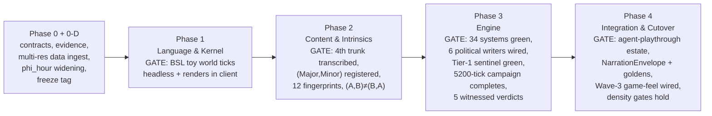

# The Babylon Game Design Standard

**Date:** 2026-07-29 · **Status:** DRAFT — §§1–7, 10 Director-approved live in session; §§8–9 drafted from workflow briefs, Director review pending · **Authority:** on ratification, a binding peer of `ai/bsl-architecture-standard.md` under Constitution v3.0.0 (Amendment AE)
**Provenance:** Director brainstorming interview 2026-07-29 (16 rulings) + three ultracode research workflows (estate study, 11 readers; design-inputs deep dive, 15 agents / 2.17M tokens; Postgres deep dive, 13 agents) + the wiring-completeness study. Full evidence: `reports/design-inputs-dossier-2026-07-29.md`, `reports/postgres-brief-2026-07-29.md`, `reports/wiring-completeness-2026-07-29.md`.

**Purpose.** The Director's end state, verbatim: *"Babylon becomes a playable game, a good game, a game with a sharp interface, you can play through the entire thing"* — built agentically, ideologically aligned, with playable output that agents can verify. This standard concentrates every scattered idea into one binding design, and re-cuts Program 27 so the engine port serves the game rather than the other way around.

**Counts discipline (standing clause).** During this standard's research, three independent lanes mis-stated an enum cardinality. Any clause of this standard or its successors that pins a count MUST cite a computed figure with the command that produced it, or a sentinel that recomputes it.

---

## §0 The Rulings Ledger (Director, 2026-07-29)

1. **The sandbox is the game** — one seeded, deterministic history; nothing scripted.
2. **Horizon is the ending; patterns are the verdict** — every run concludes at the 100-year/5,200-tick horizon, or earlier only by the player's Council rite accepting a locked verdict; the ending screen renders history's verdict, including the honest absence of a recognized pattern. (Reconciles ruling 1 with the standing 2026-07-18 no-termination doctrine — no re-ruling needed.)
3. **All four pleasure loops co-equal** — run a living organization; emergent-story witness; grand-strategy mastery; analyst/cartographer. The interface is load-bearing.
4. **The Paradox loop, literally** — read state → choose verb → tick (1 week) → read consequences. BSL is the Paradox-script analog.
5. **One org, any line, honest consequences** — wrong lines (reformism, electoralism, revisionism) fail emergently for the material reasons MLM-TW names.
6. **Doctrine identity = ordered (Major, Minor) pair over 4 trunks** — 12 non-commutative identities; (A,B) ≠ (B,A).
7. **Multi-resolution native** — the engine simulates coarse where history is quiet, H3-res-7 fine where contradiction is hot; Lawverian adjoint clamping IS the LOD system.
8. **Start local, world refines with you** — one campaign: found your org in a chosen county/metro; resolution follows your reach and history's heat. Wayne County becomes the tutorial's home.
9. **Grand campaign: 30–80 wall-clock hours** — mid-game density is a first-class concern.
10. **Narrator required, with a deterministic template fallback as a complete supported experience** — tested against 1–2 pinned local models; the epilogue is the "book of your run."
11. **Pedagogy and engagement are one criterion** (standing ruling, reaffirmed).
12. **Verification doctrine** — null-hypothesis Marxist invariants; contrapositive rupture tracing; agents playing end-to-end.
13. **Bold MLM-TW line** — MIM Prisons' fundamental political line document as reference; theses emerge, never hard-coded; the line is Director-reserved.
14. **Design standard first; P27 re-cut with playability gates** (Approach 1: one binding standard, then the re-cut; no parallel Python-side game work).
15. **Ships when it ships** — gates are the clocks, not calendars.
16. **Negative Φ is real** — an extraction industry/county can be a net tribute payer; `phi_hour` widens to admit negatives with the theory documented; the tick-52 crash was a discovery, not a defect.

Supplementary rulings recorded in session: interface **Layout B** (tabbed right rail: Chronicle/Verdict/Intercepts; Doctrine as the Dashboard hero block — §4); the **Postgres estate is in scope** as a shipping component (§8); the **Wiring Completeness Doctrine** is chartered (§9); the Director's standing **loop goal** governs execution (memory: `loop-contract-playable-game`).

---

## §1 The Sandbox Contract

A **campaign** is one deterministic, seeded, 100-year (5,200-tick) history of the United States, begun by founding a single organization in a chosen county or metro. The nation simulates coarse; the world **refines around your reach and history's heat** (§7 — the Lawverian LOD camera). Every campaign **concludes**: at the horizon, or earlier only when a terminal pattern has locked (≥ `pattern_lock_ticks` held ticks) and the player performs the **Council rite** — accepting history's verdict. The conclusion is a **Verdict**: the recognized pattern (or the honest absence of one), rendered with its full material genealogy — every verdict traceable to rupture events per the contrapositive doctrine — followed by the narrated epilogue, the book of the run (§5).

The five patterns (REVOLUTIONARY_VICTORY, ECOLOGICAL_COLLAPSE, FASCIST_CONSOLIDATION, RED_OGV, FRAGMENTED_COLLAPSE) remain *recognizers*, never terminators, with continuous progress `[0,1]` promoted to a first-class interface instrument (the **Verdict Watch**, §4). **Reachability is a standing playability gate** (§6): verified by recorded agent playthroughs and witness scenarios — the fixture-vehicle doctrine stays intact; no unit test ever asserts an outcome. The known reachability defects (sovereignty CLAIMS seeding, flat-axes-under-null-play, the six missing political writers) are chartered as Rust-side port work (§10), not Python patches.

Open Director calls attached to this section: whether the no-pattern verdict is a *named* sixth ending with authored legibility ("the Long Containment") or stays an unnamed honest absence; and the George Jackson routing contradiction (Decision Queue Q3, Q7).

## §2 The Player's Seat and the Doctrine Surface

You are the founding core of **one organization**. Its entire life is the play surface: line, practice, cadre, resources, congresses, splits, the risk of capture and the temptation of liquidation. You act only through the nine Article V verbs — and the constitutional **verb asymmetry is pedagogy**: you cannot LEGISLATE (you are not the state); the state cannot NEGOTIATE (it has nothing to negotiate with you). The standard requires this asymmetry be *taught* — surfaced in tutorial and interface copy — not buried in enum docstrings.

**Line is an ordered pair.** The organization holds a **(Major, Minor) doctrine** over the four trunks — twelve non-commutative identities. The research-validated formalization: the pair is **one registered opposition** (a W-𝔇 motion under ADR109), where `sign(w)` names the principal trunk (Mao's principal aspect — the actual theoretical source of the ordering), `|w|` is how sharply the line is drawn, `w = 0` is the legitimate INERT pre-congress state, and there is no (A,A) diagonal — a "pure line" is `|w| → 1`, a limit, not a thirteenth identity. Doctrinal **strain is measured** (a `unitDefect`-shaped gap between the org's actual practice-tag vector and the profile its declared line implies), never a hand-authored matrix — a stipulated interaction matrix would be an imposed functional form under ADR172 ruling 5. Asymmetry lands in existing channels: trunk-scoped verb economics, which practice-drift term runs at full rate, congress **transposition** (the Minor is who wins when the Major's practice fails — one unordered pair, two failure trajectories), and capture susceptibility.

**Facts on the ground (computed):** `DoctrineTrunk` ships **three** members today (`REFORMIST`, `SCIENTIFIC`, `INSURRECTIONIST` — `src/babylon/models/enums/doctrine.py`); the fourth trunk (**Autonomist** — "Build the New World in the Shell of the Old," Dissociation trap) is fully authored and untranscribed at `ai/epochs/epoch3/doctrine-tree.yaml:441-500`. Capability resolution today is a commutative union (`any()` — `_capability.py:61`), which cannot express Major/Minor. Both are chartered work (§10 Phase 2), gated on the Director's trunk rulings (Decision Queue Q2, Q6, Q8).

**Any line is playable — including wrong ones — and the sim never editorializes mid-run.** The honest-failure machinery exists (measured practice, the liquidationism absorbing state, officeholder capture, the reform ceiling); this standard binds it to the player's chair: a reformist Major gets no scripted scolding — it gets the material consequences of routing agitation into electoralism, on the same map and ledgers as everything else. The consequences are the editorial; the epilogue is where the verdict speaks plainly.

**The tutorial teaches the loop, not the line.** Patches teaches a new player to read the map, issue verbs, and watch consequences in Wayne County. The sim teaches the line — rulings 5 and 11 fused: nobody is lectured into MLM-TW; they organize their way into understanding it, or they liquidate and read why in the verdict.

**Gates for this section (§10, Phase 2 exit):** twelve identities produce twelve distinguishable trajectory fingerprints; (A,B) and (B,A) diverge from the same seed. Known hazard: the qa goldens all carry `org_count=0`, so the byte-gate cannot protect this estate — the fingerprint gates are its only protection.

## §3 The Verb Loop and the Shape of an Hour

**The turn is the Paradox loop, and the week is sacred.** Read the state → issue verbs → advance the tick → read consequences. The nine verbs stay **always visible and honestly gated** (III.11): an ineligible verb shows its reason and remedy inline; an unaffordable-but-legal verb renders as legal. Nothing is hidden — the verb plate is a standing lesson in the state-space.

**Blocked verbs are drama, not errors.** The interceptor chain (state attention, fascist opposition, resource limits, fog) can block or modify a verb *with a narrative reason* — promoted from its current thin seam to a **bound interface channel** (§4's Intercepts tab): every interception must reach the player as a legible story beat, because verbs failing meaningfully is where grand-strategy mastery is earned.

**The closed algebra holds; doctrine differentiates.** No new verbs without an Article V amendment. Doctrine acts only through the five constitutional levers — mode authorization, edge-type authorization, **cost/efficacy coefficient (missing today; the highest-leverage wiring item in the verb estate — "G3")**, valve coupling, and trap exposure — never by hiding a verb ("all always available" is verbatim Article V law). Sub-modes are the depth engine: twelve identities play differently through the same nine keys. **Correction recorded:** `ActionType.STRIKE` currently has *no resolver* — no player verb touches the EXPLOITATION or WAGES edges at all. The strike lane is chartered as the exemplar of the Wiring Completeness Doctrine (§9), with its Article V disposition and pedagogy reserved to the Director (Decision Queue Q10).

**The shape of 30–80 hours.** 5,200 ticks across that envelope is 20.8–55.4 seconds per tick — a *fast-forward budget, not a deliberation budget*. The standard pins a three-regime cadence: early game slow-ticked (founding, learning your county); mid-game **autoplay-until-event** as the default mode (~650–1,200 genuine decision ticks per campaign, the rest batched); late game re-slowing as the Verdict Watch tilts. Wall-clock attention follows history's heat — the same law as the multi-res camera. This presupposes a **standing-orders mechanism** (the player sets a line; it persists until material conditions make it questionable), which does not exist today and is chartered with Director sign-off on scope (Decision Queue Q4). The falsifiable cadence gates: **≤150 autopauses per century; no 20-tick window with zero decisions; no dead 15-minute stretch of a mid-game session** — achieved without one scripted event (§6).

## §4 The Interface — Information Architecture (Layout B)

The shipped Rust/Ratatui skeleton **stays**: Lobby → play screen; four center panes (**Dashboard / Map / Wiki / Topology** on keys 1–4); Watchlist rail (left); HUD strip; verb plate (F1–F9); keybar; palette; help; tutorial overlay. The ksbc line (crimson `#dc143c` / gold `#ffd700` on near-black) is law.

**Director-selected Layout B** adds the instruments:

- **The right rail becomes the history instruments** — three tabs: **Chronicle** (the week's narrated events), **Verdict** (the five recognizers' live progress bars with trend arrows, lock state, horizon date), **Intercepts** (the blocked-verb story beats with remedies).
- **Doctrine is the Dashboard's hero block** — the (Major, Minor) identity, measured practice (never declared), congress countdown with brewing line-fights, capture/liquidation risk, and the survival calculus read (P(S|R) vs P(S|A) with direction).
- **The flows view** — the constitutionally required Sankey/value-flow renderer (Amendment AE clause xi: imperial-rent tribute, Vol-II circulation, trade flows) joins the Topology pane's lens set; the county_extraction tension lens (ADR170) remains the map's principal lens.
- **Wave-3 game-feel is folded into this standard's gates**: the 39 SFX and 13 music tracks (ADR152/153) get wired — confirmation feedback, cue table, event-class stingers — as a §10 Phase-4 exit criterion. Composed-but-unwired assets are a §9 ledger entry, not a backlog wish.

Mockups of record: `.superpowers/brainstorm/2391209-1785361517/content/section4-layout.html` (Layout B selected by the Director in the visual companion, 2026-07-29).

## §5 The Narrator and the Archive

**Two voices, one truth.** The deterministic event stream *is* the history; the narrator is a voice over it, never a hand in it. Narration never enters the tick hash; the LLM never touches the input path (Amendment V); every narration is attributed and cached by (entity, tick, model_pin) — replays never re-roll the story.

**Template-first is the fallback and the discipline.** Everything narratable exists as a deterministic rendering *before* it may be elevated by the LLM — a gate, not a preference. The deterministic layer already substantially exists (`summarize_event` pure functions, derived severity, `NarratorCache`/`NarratorSideProcess`, the single provider seam); what is missing is the **contract**, which this standard adopts:

- **The `NarrationEnvelope`** — one append-only JSONL record per committed tick: deterministic summary, severity, deltas, player acts, and an `entities[]` proper-noun dictionary. This is the artifact the Rust engine must emit (it closes the BSL standard's OQ-32).
- **The narration ladder** — bulletin every tick; dispatch on salience; **chapter every 52 ticks**; the **Book at close**. Derived latency bound: a chapter must generate faster than a player plays a simulated year (chapter p95 < ~90 s on the pinned models).
- **The grounding filter (production)** — the narrator may add *no new numbers and no new proper nouns*; a rejected beat publishes a visible `{absence}` page naming the offender (III.11). Fallback-coverage becomes a sentinel: every `EventType` member has a bespoke deterministic builder (34 of 98 fall through to generic today — computed, `chronicle_adapter.py`), gated against enum growth.
- **Constitutional repair (chartered):** the shipped system prompt instructs the model to "escalate or de-escalate contradictions" — an adjudication instruction shipped as data, contra Amendment V. Retire or rewrite as observe-and-narrate (Decision Queue Q12 fixes the register).

**The Epilogue — the book of your run.** At conclusion, the narrator composes the complete narrated history of the century from the session archive with L0–L3 hierarchical compaction: the organization's line and its turns, the ruptures and their material genealogy, the verdict and why — MLM-TW analysis embodied in the player's own playthrough. Exportable as a markdown volume; the template fallback produces the structured-chronicle edition. Voice, register, and how bluntly the narrator may speak in theory's own voice are Director-reserved (Decision Queue Q12).

## §6 Verification — Proving the Game Is Real and Playable

Three layers; the first two extend what exists, the third is new and makes "playable" a checked property.

**Layer 1 — the null hypothesis: the economy holds.** Absent player action, the sim holds its Marxist invariants (the accounting identities of Capital I–III, Pareto-thirds, value conservation, long-wave rhythm) and tracks federal calibration data from matched starting conditions. Today scattered across `qa:regression`, empirical-invariant checks, and the golden vault; the standard names it one gate family with one report.

**Layer 2 — the contrapositive: ruptures have genealogies.** Any invariant deviation must trace to a rupture event. A deviation with no genealogy is a red gate — either the trace machinery failed or the sim invented history; both are constitutional defects.

**Layer 3 — agent playthroughs: the game completes and the verdicts are witnessable.** Recorded agent campaigns driving the real client headlessly, archived as (seed, action-log, verdict) triples — every claim one command to re-witness. Four checked properties: **completion** (campaigns conclude; the tick-52 class becomes a gate), **reachability** (each pattern witnessed in ≥1 archived run), **cadence** (§3's density law measured, not asserted), **honesty** (every interception legible; every ineligible verb showed its remedy).

**Reachability is tiered** (from the endings audit): **Tier 1, static, every PR** — every gate operand has a production writer; every enum value a gate tests has an emitter (this sentinel alone would have caught all five current ending-blockers). **Tier 2, qa** — one committed witness scenario per outcome that reaches it by perturbing *initial material conditions only*, never by stamping an operand. **Tier 3, nightly** — per-axis progress curves to the full horizon; **no axis may sit frozen at a constant for the whole horizon**.

Determinism stays sovereign over all three layers: same seed + same actions = same history; the verification estate is replayable evidence, never anecdote.

## §7 The Multi-Resolution Substrate (the Lawverian Camera)

Adopted: the judge-panel hybrid of three adversarial designs.

**The world's cells are fixed; resolution is attention.** The full H3 cell set is frozen at world-build (a sha-pinned atlas build product). *Refining never mints a cell — it activates support*; coarsening deactivates it. This keeps ruling 7 legal under the immutable-substrate clause (I.20): the substrate never mutates; only the grain of active carriers does.

**The trigger is a measured contradiction.** The LOD error *is* the `unitDefect` of the coarsening adjunction — "coarse where quiet" is *exact* precisely where the contradiction has resolved (Aufhebung); refinement follows measured heat. Derived from the existing algebra; no new mathematics minted. (The formalism lane's finding of record: the required invariance proof has the same shape as Amendment B's ratification requirement — the coarse-graining morphism-invariance obligation — though Amendment B itself concerns the class schema; see Decision Queue Q11a for the recording vehicle.)

**Determinism extends, not bends.** Active carriers and their grain enter the tick-hash preimage (a declared hash amendment landed *inside* the p27-cutover ceremony, before Phase-1 Tasks 5/7 freeze, alongside the per-identity counter-based RNG rider); `GrainPolicy::{None, Fixed{COUNTY}, Adaptive}` with a **reduction test** — a fixed policy must emit zero re-grain motions and a byte-identical county frontier (multi-res that can't play dumb is unverifiable); splits use largest-remainder integer apportionment on absolutes, so conservation is exact by arithmetic. **LOD is physics**: `B`/`θ_refine`/`θ_coarsen`/`dwell_ticks` are ceremony-bearing GameDefines; a saturating cell budget must ALARM (III.11), never silently coarse-grain the climax. CZ/MSA are barred as grains (non-nesting rungs cannot host conservative transitions). Cut by the judge: Merkle fold (two hash definitions; degrades exactly during crisis churn), rayon parallelism (collides with the live single-thread determinism pin), i32 deviation fields (overflow).

**The Jensen guard — where the two boldest rulings meet.** A coarse cell carrying only a mean has *no P(S|A) at all*: coarsening would destroy exactly the within-class dispersion the no-imposed-sigmoids ruling derives emergence from. The standard binds: **carriers carry distributions (dispersion-preserving summaries), never bare means, at every grain** — the intensive-aggregation scar promoted to law. The representation choice (moments vs quantile sketch vs pinned-fine counties) is Director-gated (Decision Queue Q1 — it may be amendment territory).

**Performance headline (measured):** memory is not the constraint — a full national res-7 dynamic state is ~120–210 MB; write volume and memory bandwidth are the constraints, hence the county-anchored three-tier tower, binary-blob yearly checkpoints, and the multi-res economy of attention.

**The honest blocker is data.** No sub-county share key exists anywhere in the estate (`bridge_county_h3.coverage_pct`: constant 100 at res-7, all-NULL at res-5 — computed by SQL); ~40% of measured Michigan res-7 cells sit over unmasked Great Lakes water. **Phase 0-D** is chartered: a sha-pinned ingest (land/water mask; block-group→H3 population; LODES WAC workplace weights) *before* engine work — refinement without it can only fabricate, and a uniformly-refined cell has zero closure defect *by construction*, so the trigger would measure its own assumption. Whether a loudly-declared-fabrication interim may precede Phase 0-D is Director-gated (Decision Queue Q9). Also chartered: reconciling the two live spatial-grain estates (`SPATIAL_LEVEL_NAMES` chain vs the lattice-corrected rungs).

## §8 Persistence and the Player Machine — Postgres as a Shipping Component

*Drafted from the Postgres Optimization Brief (13 agents; live-instance forensics re-verified by its editor); full text with the 34-row change table: `reports/postgres-brief-2026-07-29.md`. Director review pending on this section.*

**Two measured facts drive the whole design.** (1) The 5.8 GB estate is **91% duplicated reference data**, not state — all 78 sessions of simulation history total 388 MB; content-addressing the reference tier by `ref_digest` (the ADR098 sha, preserving the determinism pin *exactly*) reclaims ~4.4 GB and makes New Campaign an O(1) metadata write instead of a 960-second reference copy. (2) **Reads dominate writes ~16×** — the as-of dossier reads cost seconds while all simulation INSERTs ever cost 111 s; optimization effort on tick-write throughput is misallocated.

**One live defect, fixed before anything else: the torn tick.** `persist_tick_atomic` writes eight row families + `tick_commit` in one transaction — but node/edge state is written in a *second* transaction, and rehydration reads `MAX(tick) FROM node_state` (the documented anti-pattern, applied to the graph). A crash between the transactions can **rehydrate the engine from a torn tick**. Fix: topology rows join the `PerTickTransactionEnvelope`, one transaction, resume resolves from `tick_commit`; red-phase test reproduces the tear. Companions: the archival purge-verification skip (a dropped table *passes* the completeness gate) and the missing `rng_seed` on `CampaignRecord` (persisting `(rng_seed, ContentDigest)` converts "save lost" into "rebuild save").

**Graph-at-rest verdict: versioned relational with content-addressed hyperedges** — not Apache AGE, not a C extension. Amendment D's own rulings dictate the shape: membership change is whole-hyperedge replacement, so a mutable incidence table is the *wrong* shape (it makes representable what S-10 declares unrepresentable); instead `hyperedge_version` rows carry a `member_digest` (sha256 over ascending member ids — **byte layout specified, not implied**) referencing a content-addressed member-set table, so an unchanged hyperedge costs zero member rows per tick, and the exposed `v_hyperedge_asof` view presents one hyperedge as one row. AGE is rejected on structure, not maturity: openCypher is dyadic (inviting exactly the pairwise decomposition Amendment D bans), needs `shared_preload_libraries` + a server restart on a player machine, and taxes every tick write through `agtype`. The traversal power AGE promises is unused, not unavailable — `WITH RECURSIVE` has zero uses in `src/` today; "every SOLIDARITY edge that died in the year before the rupture" is already expressible over `edge_state` validity intervals.

**The read path must be bounded before any 5,200-tick campaign ships.** The as-of reconstruction is O(campaign history) per read — ~1.1 s at 10 checkpoint frames, extrapolating toward ~11–110 s at full length, spilling to disk on a default player config. Now: bound by `tick_commit.is_checkpoint` (cadence stays data, never `tick/52` in SQL) + the missing `(session_id, h3_index, tick DESC)` index — growth becomes constant. At the port: store validity (`valid_range int4range`, GiST, `EXCLUDE` proving non-overlap) and add the **baked projection tier** — engine-written per-tick county/national rows *inside* the envelope transaction (atomic with the state they project; materialized views are rejected because a REFRESH staleness window cannot be reconciled against two byte-gates).

**Four deployment profiles, one discipline.** **CI:** un-gate first, tune second — the Postgres tier is currently gated on `CI_REFDB_READY` *and* `continue-on-error` (possibly zero PR coverage); a `requires_postgres and not requires_reference_db` tier runs ungated on every PR in ~2–3 min with a forked `postgresql.ci.conf` (fsync off, autovacuum ON with `cost_delay=0`), sealed-template per-xdist-worker database clones (making the 2026-07-16 deadlock class structurally impossible), and a digest-pinned image + `PINNED_POSTGRES_VERSION` guard (a mutable tag + `apt-get upgrade` currently sits beneath a byte-identity gate). **Dev:** move to PG 17 (the flake ships 17; dev runs 16.14 — every config claim is unvalidated against the shipping major); drop the seven duplicate indexes born of a `LIKE … INCLUDING ALL` migration bug, with a redundant-index sentinel so it stays dead. **Player:** ADR104's game-managed cluster, now concrete — `initdb -k` (checksums: the only silent-corruption detector on consumer hardware, un-addable later), socket-only, `synchronous_commit=off` as a *declared* durability ruling (worst case: one in-flight tick, re-simulated bit-identically), `restart_after_crash=off` (the game is the clusterware; self-restart would hide crashes from the supervisor, contra III.11), config via an `include_if_exists 'babylon.conf'` the game owns, disk preflight (~10 GB) + mid-run warning (ENOSPC is a scheduled event on a 30–80 h campaign and currently surfaces as a PANIC), parquet export as the retained-history tier via the *existing* archival module. **Rust engine:** the clean seam is **Rust emits the envelope; Python persists it** (no Postgres client in the engine's dependency graph); the Amendment AE boundary becomes *grants, not habit* — an engine role with no SELECT on projection views, the `reference`/`ledger`/`babylon_meta` schema split, and the `v_observer_*` seam scheduled (0 of 16 views exist today).

**Also fixed by this section:** the Archive's silent recall bug (default HNSW `ef_search` yields ~4 rows under a 10%-selective collection filter — `hnsw.iterative_scan = strict_order` on the intel connection + the missing GIN on `metadata`); `h3_index` TEXT(15) → `BIGINT` while the window is open (H3 *is* a u64; `rust/` has no H3 code yet; touches the ADR138 domain contract — Director-gated); `double precision` settled for value substance (NUMERIC round-trips can drift the vault gate); LISTEN/NOTIFY rejected for engine→client push (no such seam exists — the client is in-process; and it would be at-most-once, non-durable); h3-pg conditional and later than it looks (hierarchy ops only, geodesic ops stay off SQL for FP-divergence reasons); logical decoding rejected as a constitutional inversion.

**The change table** (34 rows: 18 now / 11 at the rust-port / 5 post-v1.0, each naming the table/query/screen it serves) is the §10 work-list feed; its "now" rows are freeze-discipline-legal (gates, indexes, CI config, defect fixes — no engine behavior changes).

## §9 The Wiring Completeness Doctrine

*Drafted from the wiring-completeness study (5 agents, 0 errors); full text with the 25-row ledger: `reports/wiring-completeness-2026-07-29.md`. Director review pending on this section.*

**W.0 The defect this clause exists against.** Nothing in the game touches the EXPLOITATION or WAGES edges from the player side; `ActionType.STRIKE` has an eligibility row and no resolver; `BUILD_INFRASTRUCTURE` is implemented, tested, and deliberately unregistered; no verb or system ever *writes* `budget` (a one-way ratchet to zero); `social_class.organization` — the P(S|R) numerator — has no producer at all: its only runtime write sets it to `0.0` on eviction. **A construct can be declared, tested, documented, and never wired, and no gate notices.** ADR109 solved this for subsystem connections; this clause generalizes it to every declared construct.

**W.1 The law — the construct triple.** Every declared construct (edge type, enum member, attribute, model field, graph register, event type, formula, coefficient, content asset) carries three obligations: **W1 a Writer** (a production path reachable from `run_tick` or a declared seed step — a test fixture is not a writer; a build-time projection is a seed writer, not a runtime writer — witness PRESENCE, minted only in `to_graph()` while `resolve_move` never touches it; a literal constant is not a writer — witness `coverage_pct ≡ 100`); **W2 a Consumer** (a production read reaching the tick hash, a projection surface, or an event — a validator-only read is not a consumer, witness `is_goal`); **W3 a Sentinel** (a registry row pinning both anchors, typed by ADR109 motion class, red-phase first, mutation-validated locally).

**W.2 Dispositions — five words that make silence impossible.** A PR that touches, tests, or trips over a construct failing the triple records exactly one: **WIRE** (closed here as a typed motion) · **CHARTER** (open, with citation) · **BLOCKED** (naming the blocker) · **RULED-ABSENT** (the absence *is* the design; Director-signed at the declaration site) · **RETIRE-WITH-RECORD**. Anything else — including not noticing — is a red gate. RULED-ABSENT is first-class because some absences are probably *correct* (ecology having no player-side generator; the state always seeing you eventually) — and an unruled absence is indistinguishable from an oversight.

**W.3 Enforcement.** The existing sentinel family covers six construct kinds; the stated blind spot — *this-member-is-declared-and-nobody-emits-it* — is closed by six rules: the ADR109 §7.1 registry (chartered, never built); every gate operand has a writer (witness `state_violence_index`, defaulted `0.0` in three reads, written nowhere — the conjuncture measure silently capped at 2/3); every tested enum member has an emitter; fallback coverage (`.get(field, 0.0)` needs a writer or a cited exemption — the standing gotcha, turned into a gate); outcome-operand reachability, *static by necessity* under the fixture-vehicle doctrine (witness FRAGMENTED_COLLAPSE, gated on three sovereignty strings with zero references tree-wide); and ledger completeness.

**W.4 The strike exemplar** (the EXPLOITATION/WAGES wire, end-to-end). `Mobilize`, `sub_mode="strike"`, dispatched exactly as `canvass` — parameter growth on a fixed generator, not a tenth verb. Eligibility is four material conjuncts (a class target; a live WAGES/EXPLOITATION relation; an organized base via MEMBERSHIP/SOLIDARITY — making Educate/Aid/Canvass the prerequisite play; a fund against `budget`). **The basic stoppage is ungated by doctrine** — withdrawal of labour is a capacity of organized workers, not a doctrinal unlock. Issuance writes budget, wealth, a new `labor_withdrawal` field, and one event — deliberately *no* heat, agitation, tension, wage, or SOLIDARITY: state attention must *respond* through the interceptor chain, never be stipulated. It never writes `w_paid` (strike pay with `v_produced ≈ 0` would read union mutual aid as imperial bribe and route the strike's own energy to fascism). **Resolution is entirely existing math**: withdrawal enters ProductionSystem as a participation factor → value falls, wages fall, subsistence burns → P(S|A) falls because striking is materially costly; on EXPLOITATION the stoppage drains the rent pool and the shipped cascade does the rest — `pool_ratio ↓ → BRIBERY unavailable → super-wage ↓ → chauvinist_pressure → 0 → agitation routes to revolution instead of fascism`. The labour aristocracy becomes available to the revolutionary pole *because the bribe stopped*. Effective withdrawal = `declared × (1 − reserve_ratio) × holdout` — three shipped quantities: the reserve army breaks strikes (Marx's mechanism, gaining its missing second face), and `holdout` reuses ADR173's subsistence-clearing measure, so **strike capacity and acquiescence capacity are the same quantity**. Doctrine differentiates only through the five levers; eleven typed motions carry sentinel rows. Its pedagogy fork is Director-reserved (§11).

**W.5 The ledger.** 25 rows, ~110 constructs, seven groups (verb surface 8; five dead edge types; gate operands 5; outcome/narration reachability — 19 EventTypes dropping to `None` at the bus boundary, *including every endgame and consciousness event, precisely the verdict surface*; 52 unwired assets; 4 forward-design; 1 recursive). **17 of 25 rows are Director-gated** — the wiring is incomplete largely because the questions underneath it were never put to the Director. Sequencing: registry → Phase-0 disposition pass → verb-algebra rows → graph/event rows → client. Standing cautions: no count belongs in prose (every number sentinel-emitted); several rows are one mechanism, not several — the ledger carries a coupling column.

## §10 Program Consequences — the P27 Re-Cut

P27 keeps its five-phase shape; every phase gains a **playable-slice exit gate**, and the stranded content trains fold back in.

- **Phase 0 addenda:** **Phase 0-D** (land/water mask, block-group→H3 population, LODES WAC — sha-pinned build products); the **phi_hour sign-widening** as a declared pre-freeze fix under ruling 16 (ceremonial exception; the frozen reference must run).
- **Phase 1 exit adds:** a BSL-scripted toy world ticks headless, deterministically, and renders in the client — the first playable slice.
- **Phase 2 exit adds:** the doctrine surface — Autonomist trunk transcribed (naming Director-gated), the (Major, Minor) opposition registered as a W-𝔇 motion with its sentinel row, twelve distinguishable trajectory fingerprints, (A,B) vs (B,A) divergence from one seed.
- **Phase 3 exit adds:** the six political writers (the one unexecuted plan — `2026-07-18-null-play-political-coupling.md` Tasks 4–9 — behind four provably-dead endings); Tier-1 reachability sentinel green repo-wide; a full 5,200-tick headless campaign completing; Tier-2 witness scenarios reaching each of the five verdicts by initial-conditions perturbation only.
- **Phase 4 exit adds:** the agent-playthrough estate (completion/reachability/cadence/honesty); NarrationEnvelope + fallback goldens; Wave-3 game-feel wired (39 SFX + 13 tracks); the density gates (≤150 autopauses/century; no dead 20-tick window).

**Constitutional recordings owed** (each Director-gated): the multi-res ADR with its hash-preimage + per-identity-RNG riders inside the cutover ceremony; the phi_hour rider; ratification of this standard as a binding peer of the BSL standard; the Wiring Completeness clause (§9); the per-family sigmoid de-imposition schedule; the Amendment-surface dispositions (Decision Queue Q11).

**First moves, cheapest-first (also correctness-first):** (1) the Tier-1 reachability + fallback-coverage sentinels — static, and they would have caught everything five lanes found by hand; (2) the projection-layer density fixes (CROSSING `warning` tier, classify the unclassified, adaptive card ceiling, narrator reads derivatives) + the `NarrationEnvelope` schema; (3) ratify the verb 3×3 and wire the G3 cost/efficacy lever; (4) reconcile the two spatial-grain estates + execute Phase 0-D; (5) the amendment-bearing mechanics, each behind its Director ruling.

**Backlog hygiene:** project 8 gains the P27 issues (#343/#368 — absent today, contra the source-of-truth directive); the v1.0-spine train re-frames under this standard; each `director-gate` item in the Decision Queue below becomes a board issue.

---

## §11 The Director Decision Queue

Consolidated from all research lanes, ordered by leverage; each becomes a `director-gate` issue on project 8. None may be decided by agents.

1. **Q1 — Coarse-cell sufficiency vs ADR173** (blocks the LOD program): may coarse cells carry low-order moments/quantile sketches as first-class kinded fields (possibly amendment territory), or are P(S|A)-non-degenerate counties pinned fine forever, or is a declared bounded Jensen bias acceptable? And is the principal contradiction evaluated at a fixed reference rung or the live rung?
2. **Q2 — The fourth trunk**: Autonomist (already authored) vs National Liberation (chartered phase 3; or an orthogonal axis crossing all trunks)? And are REFORMIST/SCIENTIFIC/INSURRECTIONIST/AUTONOMIST the player-facing names — "Scientific" asserts its claim in the label?
3. **Q3 — Is UNRESOLVED a named sixth ending** ("the Long Containment") with authored legibility, or an unnamed honest absence? (The horizon-verdict model is ruled; this is its rendering.)
4. **Q4 — Standing orders**: confirmed in scope? (Without them, 5,200 ticks = 5,200 forced verb selections and the 30-hour floor is unreachable. The 100-year horizon itself was reaffirmed in session.)
5. **Q5 — Restoration channels & Mandel's asymmetry**: which adjudicated recovery channels (fascist bifurcation, war devaluation, re-division of the periphery) are in v1.0 scope; does the K-wave charter's coefficient ban bind pacing tuning?
6. **Q6 — Retire `is_goal`; demote `is_trap` to reachability metadata?** The flags are the only place the game *states* the thesis — sequencing demands Layer-1 verification lands first, so removing them yields emergence, not a game with no line.
7. **Q7 — The George Jackson routing**: does a revolution clearing every gate except cross-divide solidarity route to RED_OGV (as the defines document) or UNRESOLVED (as the code does)? Should the game name the settler-socialist road, or let the Archive document its cost?
8. **Q8 — (Major, Minor) semantics vs "all always available"**: cost/efficacy asymmetry (verb lane) vs Minor-modes-fade (doctrine lane); identity chosen at start vs earned at a founding congress; transposition vs split as the default failure motion.
9. **Q9 — Does Phase 0-D block LOD work**, or may a loudly-declared-fabrication interim proceed (knowing the trigger would measure its own assumption)? Is the land/water mask in 0-D scope? Confirm LOD-is-physics ceremony treatment.
10. **Q10 — The verb algebra**: STRIKE as mobilize sub-mode vs tenth verb; register BUILD_INFRASTRUCTURE (Attack's constructive dual — the dual-power verb)?; EXPROPRIATE's home; a clandestinity/security motion; draft the unwritten Article V 3×3 for ratification ("Manage resources" may be unfillable — no verb replenishes budget or mints PRESENCE).
11. **Q11 — The amendment surface**: recording vehicle for the hashed grain register (rider vs A0 G-family ruling vs amendment); the per-identity RNG rider (must precede Phase-1 Task 5); does the DoctrineTag namespace open (MILITANCY inert; Autonomist wants RESILIENCE/SECRECY/LEGALITY); is `aggregate_constraint` (fibrewise MIN for binding ceilings) existing G-family or new math? (Averaging a binding constraint makes overshoot look survivable.)
12. **Q12 — The narrator's register and honesty**: one voice vs the earned epistemic position (the wire by default; the underground register achieved materially; the Bondi Algorithm voice for carceral surfaces); does the wire *flatter* a failing reformist line (dramatic irony) or stay neutral; may the narrator speak in theory's own voice, and how bluntly on the labor-aristocracy and settler questions; retire the adjudication instruction in `default_system.txt`; are grounding-filter rejections visible `{absence}` pages?
13. **W-A — Does capital concede to domestic struggle?** The load-bearing strike fork: (i) *the bribe, not the fight, sets the core wage* — verified matrix stands; a core wage strike yields organization gain, tension, material cost, and **zero wage gain while Φ holds**; economism isn't punished by a debuff, it simply *doesn't work* (teaches Emmanuel/Amin; zero new math; needs the narrator to keep it from reading as a bug); (ii) add a concession arm — the player *wins* the strike and, through shipped code alone, chauvinist pressure rises and the strike's own agitation routes to the fascist pole (victory as defeat, emergent — but a theory change requiring an explicit ruling+ADR); (iii) untouched-Φ strikes actively feed national chauvinism. Bundled: symmetric or asymmetric with capital's reform-ceiling levers (ADR135)?
14. **W-B — Strike surface framing**: `mobilize:strike` sub-mode vs edge-type-target authorization vs RULED-ABSENT (labour withdrawal as a class act the engine adjudicates, never a player button). Each is a different theory of who acts.
15. **W-C — The strike as school of war** (companion, recommended): a struck tick's sole reliable gain is `social_class.organization` — the P(S|R) numerator the engine currently only destroys; a decade of "failed" strikes becomes materially the precondition for rupture. Channel choice: solidarity-producer exemption vs organization-channel-only (recommended).
16. **W-D — Class-fraction positionality** (~90% built): the labour aristocracy strikes *longer* because it is bribed but can never reach UPRISING (a prohibition realized as an absence); the periphery strikes shorter, explodes, and severs EXPLOITATION edges at source. Needs legibility (narrator + verb plate) or unreachability reads as a bug.
17. **W-E — Budget replenishment**: dues from MEMBERSHIP mass vs a FUNDRAISE sub-mode vs expropriation-only vs RULED-ABSENT (a depleting endowment; running out IS the pattern). Each writes a different politics into the org loop.
18. **W-F — `is_goal` / MILITANCY dispositions**: retire the victory-condition leaf vs demote to a projection label; MILITANCY as P(S|R)-numerator co-input vs repression-exposure multiplier vs *both* (the sharpest trade in the game) vs retire-and-measure-practice.
19. **W-G — Crisis sovereignty minting** (unblocks FRAGMENTED_COLLAPSE): consent-insolvency adjunction-failure trigger vs CLAIMS/fiscal collapse vs L-SUSPEND-derived EMERGENCY; plus the bare-string `sovereignty_type` stamps fixed in the same motion.
20. **W-H — The two ruled absences** (ecology has no player generator; no clandestinity/security motion hardens the P(S|R) denominator): rule each ABSENT with recorded rationale, or charter one sub-mode each.
21. **W-I — The five dead edge types**: retire TARGETS/OWNED_BY/JURISDICTION now and charter RECRUITMENT/EMPLOYMENT to the org loop, or retire all five and re-mint under BSL.
22. **W-J — Enforcement posture**: promote the two advisory verdict-surface checks (event coverage, narrator vocabulary) to gating now, after the Phase-0 disposition pass, or leave advisory under the ledger.
23. **P-A — Is the hex layer supposed to change between checkpoints?** 510 of 520 ticks wrote zero hex rows: either hexes are materially static across ten simulated years, or the delta write path is inert. Both readings are bad, imply opposite fixes, and the mechanism that must absorb res-7 refinement has zero production exercise. Blocks Phase 4 hex persistence.
24. **P-B — Should `immutable_reference_*` (91% of the runtime DB) live in Postgres at all**, or does "SQLite = reference data only" mean eviction rather than `ref_digest` re-key? (Confirm content identity across the row cohorts before any collapse.)
25. **P-C — The `h3index` TEXT domain (ADR138) vs `BIGINT`** — the window closes with the Rust schema; it is the exact column the as-of sort keys on.
26. **P-D — Save/resume and the AE line** (rule binding, not incidental): must resume always replay from `tick_commit` + a full-frame checkpoint, or may the engine rehydrate from a SQL-computed reconstruction? Checkpoint-only hydration sidesteps interval math and float round-trips entirely.
27. **P-E — Multi-res persistence shape**: one table with mixed-resolution rows vs one per resolution; the res-7 refinement coverage *budget* (storage swings ~2.3 GB → 10 GB+ per campaign on this parameter); is a mid-campaign refinement a fresh checkpoint or deltas against an absent baseline?
28. **P-F — The durability ruling**: declare `synchronous_commit=off` on the player (worst case one in-flight tick, re-simulated bit-identically) — currently set *invisibly* via `ALTER ROLE`.
29. **P-G — Is `view_runtime_trace_emission`'s exact-tick read of the sparse delta table a defect** (silently sparse 22-column trace → ceremony territory) or a carried-forward perf item?
30. **P-H — Retention enforcement**: "1 live session + parquet export" turns out to be a *planner* requirement (2,964 partitions vs `max_locks_per_transaction=64`) — enforce in code (auto-purge on close) or player-elective? And should New Game cost ~31 DDL objects, or does the player tier collapse partitioning?
31. **P-I — CI authorizations**: is `CI_REFDB_READY` true today (if not, the real-Postgres surface has zero PR coverage and un-gating is urgent); is digest-pinning the postgres image a ceremony in the sqlite-pin sense; is the dev/CI move to PG 17 authorized now?
32. **P-J — The three Python-side defects** (torn-tick envelope gap; archival purge-verification skip; missing `rng_seed` column): land now as declared freeze-discipline exceptions, or Phase 4 slate? The torn tick can corrupt a save today.
33. **This standard's §8 and §9** — Director review of the two brief-derived sections.

---

## Appendix — Evidence & Provenance

- Estate study (11 readers): journal `subagents/workflows/wf_5162b870-9fc/journal.jsonl` (session-local).
- Design-inputs deep dive (15 agents, 0 errors): `reports/design-inputs-dossier-2026-07-29.md` — includes the editor's count-verification log and per-lane briefs.
- Postgres deep dive: `reports/postgres-brief-2026-07-29.md`.
- Wiring completeness: `reports/wiring-completeness-2026-07-29.md`.
- Interface mockups of record: `.superpowers/brainstorm/2391209-1785361517/content/` (gitignored; Layout B selection logged in session).
- Interview record: the sixteen rulings + Layout B + approach selection, Director live session 2026-07-29.
