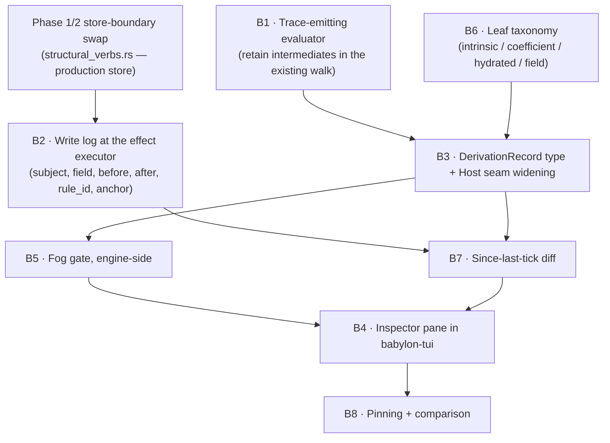
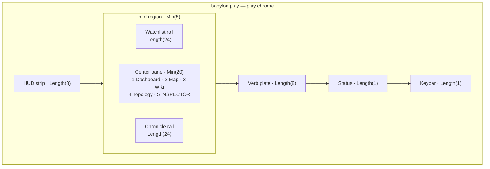
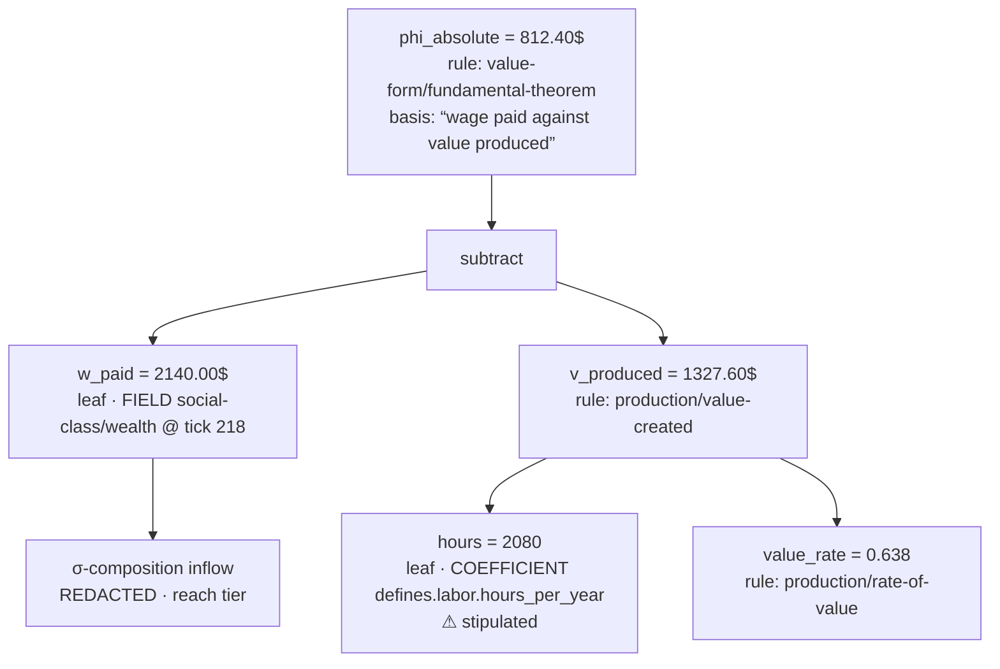

# The Derivation Inspector

**Quadrant:** Explanation. **Audience:** the Director (for the reserved calls in §10) and engineering agents (for §4–§7).
**Status:** RULED 2026-07-30 — all five reserved calls decided by the Director in session; see §10 and `ai/decisions/ADR182_derivation_inspector_rulings.yaml`. Nothing in §4–§7 is built yet. §3 is the honest inventory and is the only section that describes code that exists.

---

## 1. Why

A player standing in front of a county dossier today sees `phi_hour: 3.41` and `p_revolution: 0.12` and can go no further. The vault page is a statblock of label–value rows plus honest absences (`projection/vault/render.py` `_statblock_rows` / `_absent_fields`, `templates/county.md.j2`); `peek()` renders the same values at four depth tiers but is explicitly a live current-value reader (`src/babylon/tui/peek.py:271`); the Chronicle rail tells you *that* something happened and how loudly (`models/event_severity.py:229-274`, `tui/chronicle_salience.py`). None of these answers **why this number is this number**, and none answers **why it changed since last tick**.

That is not a cosmetic gap. A simulation whose thesis is that class struggle is the *deterministic output of material conditions* teaches the opposite thesis if it shows only outcomes. A number with no visible ancestry reads as arbitrary — as fate, or as the designer's opinion. The inspector exists to make the causal chain the player's to walk.

Two questions define the feature:

1. **"What produced this value?"** — recursively, until you hit a genuine leaf.
2. **"What moved it since the last tick, and which rule did the moving?"**

---

## 2. The principle: no number is a dead end

Victoria 3's real UX invention is that every displayed value decomposes into contributing terms, recursively. It achieves this with five separate tooltip systems (`tooltip.gui`, `custom_tooltip.gui`, `cooltip.gui`, `table_tooltips.gui`, `graph_tooltips.gui`) and roughly 154 localization files of hand-authored explanation. Its content is data-driven — 136 directories under `common/` — but its *interface* is hardcoded: there is no `common/lenses`, no `common/panels`. The explanation is authored prose bolted to computed numbers.

Its failure mode is the **tooltip labyrinth**: ephemeral hover, six levels deep, gone when the mouse twitches, and two tooltips can never be compared side by side.

Our version differs in four ways, and each difference is a design commitment, not a boast:

**Structured, not authored.** A V3 tooltip is a string a human wrote about a calculation. It can be wrong; it can drift from the code and nothing catches it. Our decomposition is the *evaluation tree of the calculation itself* — the same walk the evaluator already performs. It cannot drift, because it is not a description of the computation, it is the computation.

**Persistent, not ephemeral.** A pane with a keyboard cursor, like a debugger call stack — not a hover. It survives while you go read something else. Depth is navigated deliberately and is addressable, not stumbled into.

**Comparable.** Two derivations pinnable side by side. This is the single thing V3 structurally cannot do, and it is where most of the analytical value lives: *why is Wayne County's Φ twice Marquette's?*

**Temporal.** Deterministic simulation with strict rule ordering makes "what changed since last tick, and which rule changed it" answerable in principle. V3 cannot answer this at all.

And a fifth, which is ours specifically: **honesty**. Where V3 always has a string, we will frequently have no producer — a value that is hydrated data, or a stipulated coefficient, or a term the player is not entitled to see. The vault already has the discipline for this (every absent field is paired with a declared remedy, `render.py:49-61,113-134`, and a missing remedy is a loud `KeyError`). The inspector inherits it: a leaf that is not derived says so, and says what would be needed to derive it.

### 2.1 What the screenshots actually show

The Director supplied 35 in-game captures (`~/.local/share/Steam/userdata/…/529340/screenshots`,
2026-07-30). Four observations from them sharpen the design, and one of them reverses a
convenient assumption.

**Their layout is four zones, and all four translate.** A top vitals strip carrying signed
deltas (`+22.3`, `+928`, `+35.4K`) over a secondary row of absolutes; a left icon rail of
panel switches; a large tabbed detail panel (Overview / Buildings / Population / Local
Prices / Information); a right outliner of collapsible trees with counts. Ratatui does every
one of these natively — `Layout`/`Constraint`, `Tabs`, stateful lists, `Table`. Nothing in
the information architecture requires pixels.

**Qualitative and quantitative are shown together, and we should copy this exactly.**
"Struggling (9.3)", "Middling (17.0)", "Impoverished (11.7)", "Neutral (−25)",
"Pre-Eminent (100)". The word carries the interpretation, the parenthetical keeps it
falsifiable. For us this is pedagogically load-bearing rather than decorative: rendering
`Labor Aristocracy (Φ 0.34)` states the theoretical category *and* the measurement that
earned it, so the category never floats free of its evidence. Adopt as a formatting rule
for every classified value the inspector renders.

**Their Budget panel is already a persistent decomposition — which concedes our argument.**
It is not a tooltip. `National Expenses −£66.1K` decomposes in-pane into Construction Goods,
Government Wages, Goods for Government Buildings, Military Wages, each with its own signed
figure, scrollable and stable. Paradox evidently knows the persistent form is the better one;
they simply reserve it for the budget and make you hover for everything else. **§2's
"persistent, not ephemeral" claim is therefore not a bet against their design — it is their
own best pattern, generalized.**

**Chrome consumes their density advantage, and this is where a TUI wins outright.** The
state panel spends roughly a quarter of its area on a decorative landscape image and a heavy
gilt frame to present about six values. The same rectangle in a glyph grid holds several
times the information. This matters specifically for §5's two-column comparison: side-by-side
derivations need real estate that ornamented frames cannot spare, which is a structural
reason V3 could not build the comparison view even if it wanted to. Density is not a
consolation for going text-only; it is the enabling condition for the one feature they
cannot have.

---

## 3. What exists today

Five independent code surveys informed this document. **They covered the Python estate and the Ratatui client; none of them read `rust/crates/babylon-bsl`.** I verified that crate directly, and it changes the central conclusion — so this section is split by lane, and §3.6 records where I diverge from the surveys and why.

### 3.1 The Rust/BSL lane — the strongest substrate, and the surveys missed it

`rust/crates/babylon-bsl` is ~7,900 lines of shipped Phase-1 code. Four properties matter here:

- **The evaluator is already a tree walk.** `evaluator.rs` (943 lines) implements §4.1 of `docs/reference/bsl-language.rst`: evaluation is *strict, call-by-value, left-to-right, depth-first*, with `and`/`or`/`if` short-circuit as the only deliberate exceptions. §4.5's fuel meter charges a base cost at every AST node as it is evaluated (`fuel.rs`, `evaluator.rs`). The engine therefore **already visits every node of every expression with the node's value in hand** — a derivation tree is that same visit with the intermediate values retained instead of dropped.
- **Every rule carries a mandatory material-basis string.** `material_basis.rs` enforces `:material-basis` presence and non-emptiness at parse time (`E-PARSE-011`), and `:fuel` in `1..=1_000_000` (`E-PARSE-012`). The module is scoped honestly in its own docstring: this is the *parse-time half* of the Aleksandrov Test; whether the named process actually grounds the construct stays with Director review, never automated. This is the closest thing in the codebase to the "constitutional derivation record" the commission's premise gestured at — and it is a caption, not a proof.
- **Rule identity is content-addressed and stable.** `canonical_ast.rs` implements §5's binary tagged canonical encoding and `rules_hash = SHA-256(0x03 ‖ N ‖ CAS(r₁) ‖ …)` over rules sorted by id, proved against §5.6's pinned worked example. A derivation node can cite a rule by an identity that survives reformatting and breaks on meaning changes.
- **Every write goes through one executor.** `structural_verbs.rs` executes a rule's `(effects …)` list against the substrate, running §3.3's store-boundary range check on each written value. Its own header records that it runs against `PlaceholderGraph` today and that **the production store swaps in at the Phase 1/2 boundary**. Per §4.2, effects apply only after the whole condition has evaluated, and a rule can never observe its own effects.

That last point is the load-bearing one for the tick diff, and §4 returns to it.

`rust/crates/babylon-kernel` supplies the scalar/currency/clock/event-bus floor and a `content_digest.rs`. `rust/crates/babylon-graph` is materialized (Lane C).

**What the BSL lane does *not* have:** the language reference contains no notion of trace, derivation, provenance, or inspection — a full-text search for those terms returns only unrelated uses ("unobservable member order", "tolerance derivations"). Folds, queries and effects are Task-16-era work; the evaluator's own header says meeting one outside its scope is a loud error naming the seam. There is no trace type, no evaluation record, nothing to expose.

### 3.2 The Python engine (frozen reference, per Amendment AE)

Real decompositions exist, narrowly:

- **`ClassPhiReading`** (`domain/dialectics/instances/value_form.py:253-291`, built by `compute_fundamental_theorem` at `:317-378`, written to graph attr `fundamental_theorem` at `engine/systems/contradiction.py:105-113`) is the one clean case in the entire codebase of a displayed number sitting next to its immediate terms: `w_paid`, `v_produced`, and the derived `phi_absolute`, `phi_relative`, `labor_aristocracy_ratio`. It bottoms out after one level — `w_paid` and `v_produced` are read as-is.
- **The opposition registry** gives a per-tick numeric result (`OppositionState`: gap, balance, rate, leading_pole, is_principal — `core/opposition.py:275-297`, written at `contradiction.py:89-99`, read by five systems) plus a *qualitative* dependency graph among oppositions (`Coupling(source, target, kind)`, `core/coupling.py:49-61`; e.g. `Coupling("wage", "capital_labor", "feeds")` at `instances/catalog.py:1196-1218`). Topology without magnitudes.
- **Severity is fully reconstructible after the fact**: `SEVERITY_TAXONOMY` and the pure `derive_severity(kind, terminal_proximity, …)` are public (`models/event_severity.py:229-274, 285-804`), and `resolve_severity` returns only `{tier, unclassified}` (`:904-919`) — so "why is this critical" is a second lookup away, no engine change required.

And the losses are severe:

- The richest decomposition in the codebase — `ProductionChainRentResult.phi_vector` (per-BEA-industry Φ) and `dept_phi` (per-Department Φ) at `domain/economics/tensor_hierarchy/types.py:726-756` — is computed per tick and **discarded at the point of use**: `dept_phi`'s only caller never reads it, and `phi_vector` is collapsed to one scalar per county by `industry_to_county_allocator.py:247`. `CountyEconomicState.phi_hour` is a bare float with no companion breakdown.
- **σ-composition Φ attribution** (`domain/economics/sigma/attribution.py:55-101`) computes per-node shares and immediately collapses them to `national_phi * share`, writing only the scalar `phi_year_inflow` (`persistence/external_node.py:33-58`); the table has no share/gap/tier columns (`migrations/0012_…sql:7-21`). It runs once at session init, not per tick.
- **`FormulaRegistry` is a bare `dict[str, Callable]`** (`engine/formula_registry.py:18-137`); every registered formula returns a bare scalar.
- **The composition combinators** (`core/composition.py:57-144`) stamp `component_keys` provenance and recompute both components every tick inside a closure — and none of the 19 registered `OppositionSpec`s use them. Tested, dormant.
- **There is no system attribution anywhere, live or dormant.** `SimulationEngine.run_tick` keeps only per-system wallclock (`simulation_engine.py:200-211`); `BabylonGraph.update_node` is a bare `payload.update(attributes)` (`topology/graph.py:660-669`). 34 systems mutate one shared graph in place and the information is discarded by construction.

### 3.3 Persistence — what could be diffed today

- **Hex state** is sparse-with-checkpoints (`persistence/delta.py:32,59-91`) and reconstructible at any committed tick via `v_hex_state_asof` (`migrations/0030_views_current.sql:37-67`, exercised by `tests/integration/test_asof_reconstruction.py`). A hex field-by-field diff is buildable today.
- **`dynamic_consciousness_state` / `demographics` / `employment`** are dense per county per tick (`engine/headless_runner/bridge.py:471-486`). Trivially diffable.
- **`node_state` / `edge_state`** — the tables that would hold class/organization/institution history — hold **zero rows for canonical runs**, because `WorldStateBridge.persist_tick` calls `persist_tick_atomic(envelope)` with no `graph=` (`bridge.py:568`); confirmed empirically in `reports/postgres-brief-2026-07-29.md:22-40`.
- **`dynamic_relationship_state`** is empty in practice — `WorldState.relationships` is never mutated by any system (`migrations/0024_…sql:19-21`).
- `SessionRecorder`, `JsonlSessionRecorder`, and `tick_log.mutations` are all **built, documented, and never called from production**.
- `tick_commit.replay_identity_hash` is `sha256(session_id:tick:rng_seed)` — its own docstring says it is "structurally incapable of noticing a dropped node" (`kernel/tick_hash.py:9-18`). The real content digest (`compute_tick_hash`, `:253-311`) is called only by `tools/regression_test.py`.

So: the entities a player most wants explained have **no per-tick history in the Python lane at all**.

### 3.4 The client

`babylon-tui` has no extension point to plug into. `Pane` is a closed 4-variant enum (`Dashboard`, `Map`, `Wiki`, `Topology` — `app.rs:75-84`); `PlayChrome` is a fixed struct of named fields (`app.rs:137-171`); `ChromeFocus` is a closed 3-variant enum (`app.rs:61-68`); layout is hand-written `Layout::vertical/horizontal` constraint literals inline in `render_frame` (`app.rs:685-718`); `handle_key` is one ordered match cascade whose comments name the "match-arm-order trap" five times (`app.rs:849-1255`). `LayoutRegistry` is a per-frame mouse hit-test map, not a pane registry (`layout_registry.rs:1-125`). Overlays are two ad hoc `Option<T>` fields (palette, help) with hand-ordered z-order; there is no overlay stack.

The Python↔Rust seam is a bespoke `Host` trait — roughly two dozen methods, every one returning a JSON `String` (`host.rs:1-223`), each pane owning its own `serde` shape. There is no generic "give me arbitrary state" query.

Adding a pane is a five-site edit following the pattern Topology/Map/Dashboard already established three times. That is well-trodden, not novel — but it is not plug-in.

### 3.5 The seams

`observe()` **is not a function.** Zero matches for `def observe(` across `src/`. It is a contract name from Constitution II.8 / Amendment V, realized as ~14 `project_<kind>(…)` functions returning frozen `extra="forbid"` Pydantic view models under the `ProjectionRecord` union (`projection/view_models.py:1553-1569`), plus the `DeclaredView` SQL registry (`projection/registry.py:41-303`). The project's own architecture doc already records this as OQ-33 (`ai/bsl-architecture-standard.md:742`).

The seam carries **no machine-readable per-field provenance**. Which formula produced which field exists only as prose list-tables in module docstrings (`projection/county.py:1-56`). The only runtime provenance is the record-level `verified_tick`.

**Fog is real and unwired.** `apply_fog` (`projection/fog/filter.py:107-223`) redacts `POLITICAL_FIELDS` (heat, agitation, solidarity_index, dominant_class, consciousness, …, `:59-68`) and org-internal fields (`:79-83`) unless the requester is in reach or an `IntelLedger` entry covers the field. Its only production callers are the **legacy** `web/game/engine_bridge.py` and a diagnostic tool. Grepping `county.py`/`national.py`/`economy.py` for `fog` returns zero. The money-veil gate (`veil.py:193`) is likewise legacy-only. **An inspector built naively on `project_<kind>` today would leak politically-gated ground truth.**

### 3.6 Where I diverge from the surveys, and why

Survey 1 concludes: *"the 'already computes derivation chains' claim should be treated as refuted… building the inspector means adding retention, not surfacing it."* Survey 5 concludes per-system attribution is *"a from-scratch build, not a wiring job."*

Both are **correct about the Python engine and wrong as a verdict on the project**, because neither read `rust/crates/babylon-bsl`. In the going-forward engine the derivation *is* the evaluation, and every field write already funnels through a single effect executor. The problem changes shape entirely. I flag this as a survey coverage gap rather than papering over the disagreement: if you only read the Python estate, "impossible retrofit" is the right answer; the BSL lane is a different question.

One thing all five surveys agree on and I confirm: **nothing today answers "why."** The one real causal-structure mechanism (`engine/observers/causal.py`, the Shock Doctrine detector) is a single hand-curated three-step pattern wired only into the legacy web client.

---

## 4. What must be built

Ranked. Each item names its dependency. The ordering is a build order, not a priority ranking of value.



**B1 — Make the evaluator emit its tree.** *Depends on: nothing new.* `evaluator.rs` already walks every AST node depth-first with the node's value in hand and charges fuel per node. Add an optional trace sink: when enabled, each node emission records `(node_kind, value, children)`. Two invariants: the trace must be **off the hot path** (a compile-time or per-call flag, never a cost on the simulation tick), and enabling it must not change a single evaluated value — the conformance corpus (`tests/conformance_corpus.rs`) is the guard.

**B2 — The write log at the effect executor.** *Depends on: the Phase 1/2 store-boundary swap.* This is the hardest item in the commission's framing — per-system attribution — and in the BSL lane it collapses to one interception point. Every field mutation in the engine passes through `structural_verbs.rs`'s effect executor, which already runs the §3.3 store-boundary range check on each written value. Record, per applied effect: `(subject_node, field, value_before, value_after, rule_id, anchor_position)`.

Three consequences worth stating plainly:

- **The write log *is* the diff.** No per-tick snapshots, no `node_state` retention, no re-simulation from tick 0. The before/after pair is captured where the write happens.
- **Attribution is free at this point and expensive at every other point.** §4.2 guarantees effects apply after the whole condition evaluates and that a rule never observes its own effects — so the executor is a clean, total chokepoint. This is precisely what the Python engine lacks (`graph.update_node` is a bare `payload.update`), and precisely why survey 5 correctly called Python attribution a from-scratch build.
- **The window is now.** `structural_verbs.rs`'s own header records that the production store swaps in at the Phase 1/2 boundary. Installing the write log while that boundary is being built costs a struct and a `Vec`; installing it after the store has calcified is the Python retrofit again. This is the single most time-sensitive item in this document.

**B6 — The leaf taxonomy.** *Depends on: nothing new.* Every leaf of a derivation tree must declare *what kind of leaf it is*, because "derived" and "stipulated" must be visually distinguishable (ADR172 ruling 5 — no imposed functional forms). Four kinds, minimum: a **field read** (node, field, tick), a **coefficient** (its `defines` key — visibly stipulated), a **hydrated datum** (its source artifact), and an **intrinsic** (the `intrinsic_host.rs` boundary — opaque by construction, and it must say so). A fifth, **redacted**, comes from B5.

**B3 — The derivation record and the widened seam.** *Depends on: B1, B6.* §6 gives the type sketch. The seam widens by *addition* — a new projector and one or two new `Host` methods — never by editing a shared one.

**B5 — Fog, engine-side.** *Depends on: B3.* §7. Redaction happens before the record crosses the Host boundary. Non-negotiable.

**B4 — The inspector pane.** *Depends on: B5.* A fifth `Pane` variant and a fourth `ChromeFocus` variant, following the Topology/Map/Dashboard pattern across its five edit sites. The three existing panes are near-identical in shape (`dashboard.rs`'s own header says it copies "the TopologyView shape verbatim") — extracting a shared trait while adding the fourth is the DRY move, and is optional.

**B7 — The since-last-tick diff.** *Depends on: B2, B3.* Given the write log, this is a query: "all log entries at tick N whose subject is X", each already carrying before, after, and the rule that did it.

**B8 — Pinning and comparison.** *Depends on: B4.* Two derivation columns, independently navigable.

**Explicitly not on this list:** retrofitting derivation onto the frozen Python engine. Per Amendment AE the Python engine is reference-only after `p27-python-freeze`. The Leontief `phi_vector`/`dept_phi` retention (survey 1's richest loss) is a *Rust-side* obligation when that pipeline is ported, not a Python change.

---

## 5. The interaction model

Keyboard-first. Glyph floor. Crimson/gold on near-black.

The inspector is a **center pane**, not an overlay. This is the deliberate answer to the tooltip labyrinth: an overlay cannot be compared with another overlay, and comparison is where the analytical value lives. It is `Pane::Inspector`, reachable as `5`, and it takes focus as `ChromeFocus::Inspector`.



### Entering

From any pane, with a value selected, `i` opens the inspector on that value. From the Wiki dossier this means: cursor on a statblock row, press `i`, and the row's derivation is the inspector's root. `5` opens the inspector on whatever it last held. This mirrors how `peek` already works as a depth-tiered reader (`tui/peek.py:271`) — the inspector is peek's next depth, promoted to a pane because it must persist and be compared.

### Navigating

Inside the pane (these keys are safe because per-pane key blocks precede the wiki fallthrough in `handle_key`):

| Key | Action |
|---|---|
| `j` / `k` | move the cursor among sibling terms |
| `l` / `Enter` | descend into the highlighted term |
| `h` / `Backspace` | ascend to the parent |
| `g` / `G` | jump to root / deepest expanded leaf |
| `[` / `]` | previous / next inspection in this pane's history |
| `p` | pin the current derivation into a column |
| `P`… | *taken globally — do not use* |
| `d` | toggle diff-vs-previous-tick for the current root |
| `o` | jump to the subject's dossier page (`babylon://` via `router.rs`) |
| `Esc` | defocus back to Center; a second `Esc` leaves the pane |

The stack is **addressable**: a breadcrumb line shows the path from root to cursor, and `[`/`]` walk the history. You cannot get lost six levels deep, because the six levels are on screen as a spine, not stacked as transient popups.

### A worked derivation

Reading a core social class's Φ, in the shape `ClassPhiReading` already has today:



Three things the player learns from the *rendering*, before reading any prose: the wage is a **difference**, not a given; one of its inputs is a **stipulated constant** and is marked as such; and one branch is **withheld from them**, with a named reason.

---

## 6. The derivation contract

The engine hands the client a tree. Sketch, Rust-side, in the projection lane (not in `babylon-kernel`, not in the engine crates — see §7):

```rust
/// One node of a derivation tree. Read-only projection; never simulation input.
pub struct DerivationNode {
    /// What this node evaluates to, in the BSL runtime lane it belongs to.
    pub value: DerivedValue,
    /// Display label — the field qname, operator, or binding name.
    pub label: String,
    /// The declared static type, so the client can format correctly.
    pub ty: BslType,
    /// Intensive vs extensive — carried so the client can REFUSE to
    /// render an unweighted mean of intensives.
    pub kind: FieldKind,
    /// The rule frame this node was evaluated inside, if any.
    pub frame: Option<RuleFrame>,
    /// Empty iff this node is a leaf; `leaf` then says which kind.
    pub children: Vec<DerivationNode>,
    pub leaf: Option<Leaf>,
}

pub struct RuleFrame {
    /// Stable identity: the rule's qname; `rules_hash` pins the content.
    pub rule_id: String,
    /// The rule's mandatory `:material-basis` string (E-PARSE-011).
    /// AUTHORED CONTENT — a caption on the frame, never a claim about
    /// the arithmetic. See §10 Q3.
    pub material_basis: String,
    /// Where in the anchor order this rule ran (mod_anchors.rs).
    pub anchor: String,
    pub fuel_consumed: u32,
}

pub enum Leaf {
    /// A read of committed state. Fully explainable via a further query.
    Field { node_id: String, field: String, tick: u64 },
    /// A stipulated coefficient. RENDERED AS STIPULATED (ADR172 r5).
    Coefficient { defines_key: String },
    /// A hydrated datum from the reference build. Names its artifact.
    Hydrated { source: String },
    /// The intrinsic-host boundary: opaque by construction, and says so.
    Intrinsic { name: String },
    /// The player is not entitled to this value. Carries the tier and
    /// the remedy, NEVER the value. See §7.
    Redacted { tier: RedactionTier, remedy: String },
}

/// One field's movement across a tick, from the effect-executor write log.
pub struct FieldDelta {
    pub subject: String,
    pub field: String,
    pub before: DerivedValue,
    pub after: DerivedValue,
    pub rule_id: String,
    pub anchor: String,
}
```

**Does the seam widen? Yes — by addition.** `observe()` is a contract name, not a function (OQ-33), realized today as a family of `project_<kind>` projectors plus the `DeclaredView` registry. The inspector adds one more family member: a derivation projector, and two `Host` methods following the existing convention that every read crosses as a JSON string —

```rust
fn derivation_json(&self, target: &str, opts: &str) -> String;
fn derivation_diff_json(&self, target: &str, tick: u64) -> String;
```

No existing `Host` method changes shape. No existing projector changes shape.

**Three binding invariants:**

1. **The derivation record is a read-only projection.** It is computed from committed state and never feeds physics or the tick hash. `models/event_severity.py:50-53` already declares exactly this discipline for severity and enforces it with a grep gate; the derivation projector gets the same gate — nothing in the engine crates may import it.
2. **Units and intensivity travel with the value.** `types.rs` already declares `BslType` and `FieldKind{Intensive, Extensive}` per field, precisely because no type makes intensivity decidable. Carrying `FieldKind` into the record lets the client refuse to render an unweighted mean of intensives — a known variance error in this project's history, cheaply fenced here.
3. **The trace must be value-identical to the untraced run.** The BSL conformance corpus is the guard; a traced evaluation that produces a different number is a red gate.

---

## 7. Fog and honesty

The inspector is the single most dangerous surface in the game for epistemic leakage. It walks upstream through the exact terms fog exists to hide.

**Redaction happens engine-side, before the record crosses the Host seam.** Not in the client, not as a display filter. The client must never hold a value the player is not entitled to. `apply_fog`'s semantics (`projection/fog/filter.py:107-223`) are the reference: political fields (heat, agitation, solidarity_index, consciousness, dominant_class, colonial_stance) and org-internal fields (cohesion, cadre_level, consciousness_tendency) are gated by reach or by an `IntelLedger` entry at exact or approximate tier. Note honestly that this logic is **currently wired only into the legacy web bridge** — the Lane-P projectors call it nowhere. Building the inspector on the projection lane therefore *requires* wiring it, and that wiring is a prerequisite, not a nice-to-have.

**Two distinct refusals, and the difference is the whole design:**

- **REDACTED** — you know the term exists; you do not know its value. The node renders with its label, its position in the tree, and a remedy (*"Organize in the receiving bloc to gain reach"*). This is the Mud case.
- **ABSENT** — you do not know the term exists. The branch is **omitted entirely**, with no placeholder. This is the Water case: clandestine organizational membership, org-internal state of a formation you have no contact with. A redaction marker is itself information; where the *existence* of a relation is secret, showing "[redacted]" leaks it.

Approximate-tier values render as a band with the ledger entry's age, labelled as an estimate, never as a number that looks exact.

**Player knowledge never enters the tick hash.** The inspector reads a fog-filtered projection of state the engine already committed and already hashed. The derivation projector lives outside the kernel and engine crates, and the grep gate from §6 enforces it structurally rather than by convention.

**No AI, anywhere in this surface.** The inspector renders computed structure. The one string it displays is `:material-basis`, which is authored content in our own rule files, parse-enforced non-empty (`E-PARSE-011`) — and it is a *caption on a frame*, never a statement about the arithmetic beneath it. If the caption and the math disagree, the math is what is shown; the caption is what needs fixing. AI narration remains where it already is: the grounding-gated `narrator_cache.py` seam, disjoint from this estate.

---

## 8. Pedagogy

The claim is that the inspector shows *material causality producing political outcomes, in causal order*. Three arguments, and one honest counter-argument.

**1. Causal order is not a presentation choice; it is the theory, and it is already encoded.** The engine runs in strict materialist-causality order: Material Base, then Action, then Consequences. In BSL that ordering lives in anchor placement (`mod_anchors.rs`, checked at load as `E-LOAD-002`), with rules at the same anchor evaluating in ascending rule-id byte order. A derivation tree rendered along that ordering means the player reads base → superstructure *every single time they ask why*. They are not told that consciousness follows from material conditions; the shape of the answer enacts it, repeatedly, for every number they interrogate.

**2. The traversal that does the actual teaching.** Take a core worker's wage. The chain, using constructs that exist or are specified: wage → the Fundamental Theorem record (`w_paid` against `v_produced` — `ClassPhiReading`) → the gap Φ → the σ-composition attribution that assigns national Φ across trade blocs by tier weight, gap, and trade volume (`sigma/attribution.py:55-101`, which today computes those shares and discards them — retention is a named obligation in §4) → a named periphery node.

A player who walks that chain has **derived** the labor-aristocracy thesis from the game's own arithmetic rather than been told it. That is a materially different pedagogical event from reading a tooltip that asserts it. And it is falsifiable in both directions: if the chain does not bottom out in a periphery extraction, either the model is wrong or the retention is missing. **The inspector makes the theory auditable against the implementation** — which is why it is as much a Director tool as a player feature.

**3. It is the enforcement surface for "no imposed functional forms."** ADR172 ruling 5 holds that sigmoids must *emerge* from P(revolution)/P(acquiescence) and the algebra, never be stipulated by a mechanic; ADR173 makes P(S|A) the measure of class members whose wealth clears subsistence, so the S-curve emerges from within-class wealth dispersion. In the inspector, an emergent curve renders as a **fold over members** — you can see the dispersion doing the work. A stipulated one renders as `Leaf::Coefficient{defines_key}` with a stipulation mark. Question-begging becomes *visible*, to us in review and (subject to §10 Q4) to the player. No other artifact in the project makes that check cheap.

**The counter-argument, stated honestly:** a derivation tree can also teach that the world is a spreadsheet — that society is a pile of floats with arrows between them, which is a mechanistic vulgarization, not Marxism. The mitigation is `:material-basis`: every rule frame in the tree names the material process it stands for, so the spine of the tree reads as a chain of *social relations* with quantities attached, not a chain of quantities. This is why the field being mandatory and non-empty at parse time matters more than it looks, and why §10 Q3 is a real question rather than a formality.

---

## 9. Scope

**In v1.0** — the derivation inspector as one coherent feature, not a phase-split of one:

- B1 trace-emitting evaluator; B6 leaf taxonomy; B3 record + Host seam; B5 engine-side fog gate (including wiring fog onto the projection lane, which is a prerequisite regardless); B4 the inspector pane with the §5 keymap; B8 pinning and two-column comparison; **B2 + B7 the write log and the since-last-tick diff**.

The diff belongs in v1.0 on a cost argument, not an ambition argument: the write log costs a struct and a `Vec` **if installed while the production store boundary is being built** (`structural_verbs.rs` says that swap is at the Phase 1/2 boundary), and costs a full retrofit across a calcified store afterwards. Deferring it is not deferring a feature; it is choosing to pay several times more for it later. That is exactly the trap the Python engine fell into.

**Deliberately later** (specified, sequenced, not abandoned):

- Multi-tick history — scrubbing back further than one tick, and trend-over-time on a single derived term.
- Derivation *through* the Leontief pipeline — surfacing per-industry `phi_vector` and per-Department `dept_phi` requires retaining them at the Rust port of that pipeline; until then the county Φ leaf is honest about being a collapsed aggregate.
- Vault-baked derivation pages (`derivation/<kind>/<id>.md` under the existing stable-ID slug scheme, reusing the absence-with-remedy discipline) — the inspector is live-first; baking is a second consumer of the same record.
- 3D/raster rendering of the derivation graph via ratty (clause xi) — the glyph floor is the v1.0 rendering and is sufficient; the raster lane is an enhancement of the same data.
- Export / yank of a derivation as text.
- Narration-ladder integration. The four-tier ladder (bulletin / dispatch / chapter-52 / Book) is unbuilt (task #27, pending) and is a **peer consumer** of the same substrate, not a dependency. The inspector neither blocks on it nor pre-empts it.

**Cut, explicitly:**

- Hover tooltips of any kind. The pane replaces them; we are not building the labyrinth we are correcting.
- Any AI-generated explanation in this surface, ever.
- A general "explain any pixel on screen" mechanism. The inspector explains *values with derivations*. Values without derivations say so.
- Retrofitting derivation onto the frozen Python engine.

---

## 10. Director rulings (2026-07-30)

All five reserved calls were ruled the same session they were raised. Recorded
here as decisions, not questions; the ADR is `ai/decisions/ADR182_*`.

**R1 — The write log ships; the diff UI does not have to.** *(was Q5)*
Install the interception point at the effect executor **while the Phase 1/2 store
boundary is under construction**, and let the diff pane land when it lands. The
irreversible-if-missed half is bought for a struct and a `Vec`; the UI half stays
schedule-flexible. **This is now a Phase 2 obligation with a closing window** — it
must go in before the production store calcifies, or it becomes the Python
retrofit this project already paid for once.

**R2 — Structure is the premise; magnitudes are earned.** *(was Q1)*
An unorganized player sees THAT their wage traces through imperial rent to a named
periphery node, with the values REDACTED and a remedy attached. The exploitation
relation is not a secret to be discovered — it is the game's thesis, legible from
tick 0. What organizing buys is the *quantity*, not the *fact*.

Consequence: §7's REDACTED path is the default for the σ-inflow chain, and the
ABSENT path narrows to genuinely secret *existence* (clandestine membership,
formations you have no contact with). Wiring `apply_fog` onto the Lane-P
projectors is therefore a hard v1.0 prerequisite, not a nice-to-have — the
projectors call it nowhere today.

**R3 — Stipulation marks are ours, not the player's.** *(was Q4)*
`Leaf::Coefficient` renders with its `⚠ stipulated` mark in a review/dev tier only.
The player-facing tree does not editorialize about the model's posits. The ADR172
ruling-5 enforcement surface is preserved for review — where it is actually
actionable — without the fiction narrating its own epistemology at the player.

**R4 — Mint a separate player-facing `:gloss`.** *(was Q3)*
`:material-basis` stays the engineering/Aleksandrov artifact, parse-enforced and
written for us. A distinct authored `:gloss` keyword carries the player-facing
register. Two audiences, two fields, neither compromised. §8's defence against the
spreadsheet-vulgarization reading now rests on `:gloss`, which means `:gloss`
quality is player-facing content the Director owns.

**R5 — Inspection depth is gated by `DoctrineCapability`.** *(was Q2)*
Shallow inspection is free; deeper traversal requires the organization to have
developed analytical practice. **Analysis is a practice the movement develops** —
"no investigation, no right to speak" becomes a mechanic rather than an epigraph.

Consequence, and it is a real one: the inspector is no longer a neutral instrument
sitting outside the game's systems. It joins the doctrine estate, which means it
composes with the `DoctrineCapability` verb gating (P25 U11 / ADR137) and needs a
capability declared for it. This is a larger commitment than the always-available
option and is deliberate — it makes investigation a thing the player *invests in*,
which is the correct-theory reading. It also pairs with R2: the thesis is public,
the measurement is earned, and the ability to trace deeply is built.

---

## 11. Two consequential CI rulings from the same session

Recorded here because both bear on this document's estate.

**Integration shard stays nightly-only.** `tests/integration/`, `scenarios/`,
`property/` and `contract/` get no PR-time gate on dev. Drift surfaces within 24h
via the per-leg nightly split rather than at PR time; dev iteration stays fast.
The #395 class is accepted as a 24-hour-latency risk, now that the nightly signal
is legible for the first time in the estate's history.

**G1 pacing is RETIRED until its Rust successor exists.** The frozen Python engine
cannot regress — it is pinned at `p27-python-freeze` — so a weekly two-hour
survival run over immutable code buys nothing. `nightly-pacing.yml` is deleted; the
Rust G1 is chartered as a Phase 3/4 exit gate, to be written when the Rust engine
can carry 520 ticks.
