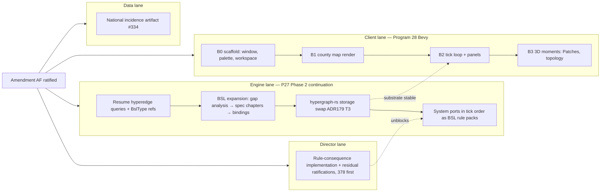

# Program 28 — The Bevy Cutover: roadmap design

**Date:** 2026-08-10
**Status:** Director-approved in session (rulings R1–R7 below)
**Supersedes:** the Ratatui client lane (Amendment AC; Amendment AE clause xi) — pending
Amendment AF ratification
**Companions:** Program 27 Refoundation (continues unchanged on the engine side)

## 1. Where the project stands

- **P27 Phases 0 and 1 both closed.** Phase 0 cut the `p27-python-freeze` tag; the full BSL
  language stack (reader, §3.4 intensivity typechecker, §5 binary CAS, §3.7 fuel bound
  checker, §4 fuel-metered evaluator, structural verbs) lives in `rust/`.
- **P27 Phase 2 Slice 1 merged** (PR #461): `MemoryGraph` promoted, canonical state
  hash pinned byte-for-byte, scenario file → graph load path, and the Fundamental Theorem
  running end-to-end through the `babylon-tick` driver. The Rust engine runs its first tick.
- **The Director paused the hyperedge query lane** (directive 2026-07-31): the Slice 2
  evaluator proceeded dyadic-only. Substrate hyperedges stayed first-class per Amendment D.
- **hypergraph-rs xgi-compat parity completed 2026-08-04** (local main `ab558f0`,
  unpushed by policy): 316/492 honest conformance, 36 registered divergences. The Babylon
  swap (#282) awaits the Phase 2 substrate decision.
- **Seven director-gate ruling bundles** from the Game Design Standard §11 remain open
  (#376–#382). They gate content design.

## 2. Director rulings of 2026-08-10

| # | Ruling |
|---|--------|
| R1 | **Bevy replaces the Ratatui client outright** — Textual-deletion precedent: no deprecation window, no dual-client period. |
| R2 | **Parallel lanes** — the engine lane continues P27 Phase 2 while a new client lane scaffolds the Bevy app against the current engine seam (scenario load → tick → state hash). |
| R3 | **Visual scope at v1.0 = 2D map game + 3D moments** — county choropleth map, panels, and charts as the primary surface; selective 3D scenes (Patches the tutorial guide, the topology view) where they earn it. |
| R4 | **The shipped game is a pure Rust binary** — engine crates + Bevy client in one cargo workspace, no PyO3 in the play path. Python remains the offline data pipeline and the out-of-process AI observer, exactly where Amendment AE put it. |
| R5 | **All four side threads ride in the near-term roadmap**: the seven ruling bundles, the hypergraph-rs storage swap (ADR179 T3), the national incidence data program (#334), and **the hyperedge lane un-pauses** (lifts the 2026-07-31 hold). |
| R6 | **Ruling sessions start immediately on this doc's approval**, conducted interactively, while agents start the amendment + Bevy scaffold in parallel. |
| R7 | **First ruling bundle: #378 (strike & verb algebra)** — the verb algebra is the player's action surface and constrains doctrine (#377), pacing (#380), and what the client UI must present. |
| R8 | **BSL-first porting doctrine, escape by proof.** Every system's default port target is a BSL rule pack. A system (or part of one) escapes to Rust only with a written justification — linear algebra, dispersion machinery (ADR176 r17), or measured performance need. **The Director rules OODA unique**: it ports as a kernel/engine module, never BSL. Heavy linear algebra (Leontief, value tensor, σ-composition) stays in Rust domain crates that BSL rules consume through bindings. The Phase-1 17/12/5 audit re-baselines under this stronger default. **Refinement (same day): kernel loop, content brain** — "OODA is unique" rules the LOOP only (cycle order, budget conservation, arbitration, dispatch — adjudication, the engine's job); the policy consulted inside it (doctrine-conditioned scoring, target preferences, what counts as a live option) is BSL/data content the kernel invokes — the Lane A heat pattern. A maximal-kernel reading would collapse ideological differentiation into coefficient tweaks, against the no-imposed-forms line. |
| R9 | **BSL expansion precedes system ports** — a Phase 2 track: (1) the 34-system gap analysis (walk every system against BSL's current surface → needed query forms, graph abstractions, RNG/clock host bindings, rule-pack structure), (2) spec chapters in `bsl-language.rst` (the one normative home), (3) implementation. Then system ports proceed in tick order, Material Base first, each with its sentinel row, §5.4 do-not-transcribe check, and conformance vectors only from live surfaces. |
| R10 | **The r21 intrinsic cap holds** ({exp, log} at most). Widening the intrinsic table needs an ADR176 rider presented to the Director with the gap analysis — never a quiet addition. New host *bindings* (RNG streams, SimClock) are seams to kernel services, not new mathematics, and stay within Amendment AE's charter. |

## 3. Amendment AF — scope of the constitutional act

Nothing else may start until this lands: R1 contradicts two live clauses — AC's "the
Rust/Ratatui client IS v1.0's terminal client" and AE clause (xi), which requires
ratty + Ratatui as the in-game renderers. One docs PR, Director-ratified, covering:

1. **Bevy is the v1.0 client.** A standalone Bevy executable in the `rust/` cargo
   workspace; engine crates link in-process.
2. **Supersessions.** Amendment AC superseded in full; AE clause (xi) superseded; the
   glyph floor retired. The topology / hypergraph / Sankey visualization obligations
   transfer to Bevy scenes — the obligations survive, the renderer changes.
3. **Deletion ceremony.** The amendment deletes the Ratatui client (`rust/` TUI
   crates, the `babylon-tui` wheel) outright. The wheel leaves the default dependency
   set, so `uv sync` no longer requires cargo — which also removes the #463
   CI-timeout lane's trigger surface.
4. **Packaging.** The amendment retires `babylon play` (the Python CLI entry) from
   the play path; the game launches as a normal binary. The Python CLI survives only
   for the data-pipeline and observer periphery.
5. **Carried assets and contracts.** The crimson/gold/near-black aesthetic and Iosevka
   type direction; the SFX suite (39 CC0 sounds, ADR152) and soundtrack (13 CC0 tracks,
   ADR153) port to Bevy's audio/asset system; the ADR175 structured-JSONL engine log
   sink design stays as ruled; the client log contract re-points from
   `rust-client.log` to the Bevy client's log.
6. **Hyperedge formalism note.** Implementing `HyperedgeSet` / `NodeRef` / `EdgeRef` /
   `HyperedgeRef` in `BslType` mints no new mathematics — `bsl-language.rst` §2.6
   already specifies the element/result table — so it does not extend the
   formalism surface under Amendment AE. The amendment records this reading so the
   un-paused lane starts clean (closes the open question recorded on task #50).

## 4. The four lanes

### Engine lane (P27 Phase 2, continued — reshaped by R8/R9)

1. **Un-pause the hyperedge query surface**: `hyperedges` / `members-of` /
   `hyperedges-of` query forms + the `HyperedgeSet` and ref types in `BslType`, per
   §2.6. Anti-Pattern VIII.9 still binds — a member list crosses whole, never C(n,2).
2. **The BSL expansion track** (R9, before any system port):
   - **Gap analysis**: walk all 34 systems (per the alignment survey,
     `reports/babylon-dev-systems-rust-alignment-2026-08-02.md`) against BSL's
     current surface; produce the needed query forms and graph abstractions
     (typed node-set iteration with multi-attribute writes, the scale-lattice
     `allocate`/`aggregate` adjunction pair, edge-set predicates), the host-binding
     additions (KernelRng per-carrier streams, SimClock reads), and the
     rule-pack / anchor structure for system-shaped content. Flag anything that
     would breach the r21 intrinsic cap as a rider proposal (R10), never build it.
   - **Spec chapters** in `docs/reference/bsl-language.rst` — the one normative
     home; the Phase-1 standing lesson (every plan sketch was wrong against the
     rst) binds here doubly.
   - **Implementation** of the ruled additions, conformance-vectored.
   - Intrinsics stay within r21 ({exp, log} at most).
3. **The storage swap** (ADR179 T3): babylon-graph consumes hypergraph-rs as its
   storage backend behind the trait insulation layer, with the written capability
   delta the Director's caveat requires. The Aug 4 parity work (316/492, divergence
   registry) is the input; the byte-identical gate on Babylon's own goldens is the
   proof. Note: the frozen Python engine's XGI call sites are out of scope — the
   freeze supersedes #282's original Python-swap framing.
4. **System ports in tick order** (R8): Material Base first (positions 1–13 — the
   producers everything downstream reads), then Consequences, each system landing
   as a BSL rule pack by default with a written escape justification where Rust is
   genuinely needed. **OODA @14 ports as a kernel/engine module** (R8, ruled
   unique). Every port carries: structure from the frozen lane (ADR183 — never a
   correctness oracle), conformance vectors only from live surfaces (22 of 34
   systems are dormant on canonical scenarios — dormant systems land as honestly
   dark BSL content or wait for a chartered scenario), the §5.4 do-not-transcribe
   check, its sentinel row (ADR109), and a §6.5 ceremony if values move. Content
   from the ruled game design (#376–#382 outputs) lands through the same pipeline.

### Client lane (Program 28)

- **B0 — scaffold**: a `babylon-client` (name subject to the plan) Bevy crate in the
  `rust/` workspace; window opens; crimson/gold/near-black palette and type direction
  established; engine crates linked in-process.
- **B1 — the map**: county choropleth of real scenario data rendered as the primary
  surface. The spatial-adjacency lookup estate (Director ruling 2026-07-30) is the
  data source; the CSR-at-startup shape carries over.
- **B2 — the loop on screen**: tick advance, state panels, event feed — the
  scenario → tick → hash seam that already runs headless, made visible and playable.
- **B3 — 3D moments**: Patches the golden snub-nosed monkey as the tutorial guide
  (per the standing directive) and the topology view as 3D scenes inside the same app.

B0–B2 depend only on the merged Slice 1 seam; B3 waits for nothing on the engine side
but comes last because the 2D game must be playable first (R3).

### Director lane

The seven §11 ruling bundles, conducted interactively, in this order:
**#378** strike & verb algebra → **#377** doctrine surface → **#376** endings &
verdicts (already In Progress on the board) → **#379** multi-res & spatial (feeds the
map lane) → **#380** pacing, density & long-wave → **#381** narrator → **#382**
persistence & CI. Each session's rulings land as an ADR + issue closure with evidence.

**Correction (2026-08-10, same day, pre-merge):** ADR176 (2026-07-29) already rules
the §11 queue in full — the seven bundles carry their rulings on-issue, and the #378
follow-ups closed the EXPROPRIATE and reformist-funding sub-items. The Director lane
is NOT seven fresh ruling sessions — just two smaller things: (a) implementing each bundle's
ruled consequences and closing #376–#382 with evidence; (b) the residual Director
items — ratifying the workforce-drafted Article V 3×3 (#378), the player-facing trunk
names (#377), and #383 (the spec §8/§9 review, the one un-disposed queue item). Read
R6/R7 accordingly: the "sessions" reduce to these residual ratifications, with #378's
Article V draft first.

### Data lane

The ADR171 national incidence artifact + data program (#334): agent work in the
Python data pipeline, producing the content the national-oppression axis needs.

## 5. Board hygiene Amendment AF triggers

- **Close as superseded:** #284 (kitty raster lane for the Map pane), #262 (eyes-on
  TUI campaign gate — the amendment deletes the client it would inspect; a Bevy
  eyes-on gate replaces it before v1.0).
- **Reshape:** #291 / #292 / #293 (installer + release trains) — a pure Rust binary
  ships as a normal game executable; the nix-bootstrap + wheel machinery in those
  trains shrinks accordingly. Rescope at plan time, do not close.
- **Re-scope:** #282 (Babylon swap) — becomes the engine-lane storage-swap task; the
  freeze supersedes its Python XGI-surface framing.

## 6. Non-goals

- No 3D globe or terrain-first presentation at v1.0 (R3 rejected it).
- No dual-client maintenance period (R1).
- No Python launcher for the game (R4).
- No new mathematics: the hyperedge types follow §2.6 as written; the BSL
  expansion adds reach (query forms, bindings, structure), never algebra; anything
  beyond the r21 intrinsic cap re-enters through the amendment process (R10).
- No engine-lane pause for the client: the lanes are parallel by ruling (R2).

## 7. Success criteria

1. Amendment AF ratified and the constitutional docs swept (CONSTITUTION.md,
   CLAUDE.md, NORTH_STAR, architecture references).
2. The Ratatui estate deleted; `uv sync` completes without cargo; CI green without
   the wheel-build leg.
3. B2 reached: a person can open the Bevy app, see the county map, advance ticks,
   and watch state change — against the Rust engine, deterministic hash intact.
4. All seven ruling bundles closed with ADRs.
5. Hyperedge queries + storage swap merged with the byte-identical gate green.
6. The BSL gap analysis delivered and ruled; the first Material Base system running
   as a BSL rule pack in the Rust engine, conformance-vectored from live surfaces.

## 8. Open questions (deferred to plan time)

- Bevy version pin and the plugin set (map rendering approach: custom mesh vs
  tilemap plugin) — resolve in the client-lane implementation plan with current docs.
- The Bevy eyes-on gate's definition (replaces #262).
- Whether the M1–M7 Ratatui estate's surface code (choropleth math, Sankey layout,
  chart estates) transplants into Bevy scenes or is rewritten — decide per-module at
  deletion time; the underlying data projections (`observe()` contract) carry regardless.
