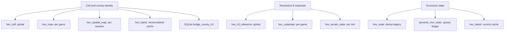
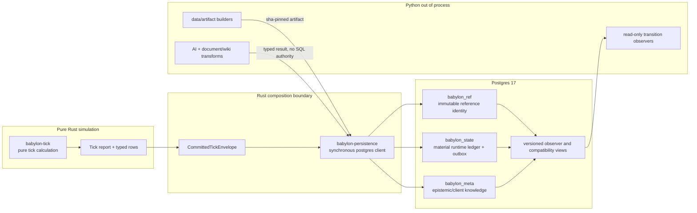

<!-- vale ste.UnapprovedWords = NO -->
<!-- vale Vale.Spelling = NO -->
<!-- vale ste.ProcedureLength = NO -->

# Rust-owned Postgres and H3 boundary (approved design)

**Status:** Director-approved in session on 2026-08-22. This document fixes ownership and
cutover order. It does not claim that the Rust writer has landed. Python remains the only live
runtime writer until the cutover gate in this design passes.

**Tracking:** Linear PER-48 (boundary ruling), PER-20 (three-schema foundation), PER-21 (H3
normalization), and PER-22 (semantic Archive). GitHub #697, #578, #285, #379, #382, and #599.
Implementation begins on `codex/per-48-rust-postgres-boundary` in the isolated worktree at
`/media/user/data/worktrees/9013/babylon`.

**Normative inputs:** Constitution II.6, II.11, III.7, III.12, X.8, and Amendment AE.
ADR098, ADR172, ADR174, ADR179, and ADR220 also apply. The numbered Postgres migrations and
`docs/reference/determinism-contract.rst`. ADR220 is the ruling. This document is its working
architecture and migration design.

## Problem

The current Postgres estate has three kinds of ambiguity that cannot survive the Rust engine
cutover:

- Runtime, reference, spatial, semantic, and journal relations share the `public`
  schema. Only the client-owned `babylon_meta` tier has a structural namespace.
- Python constants contain fresh-database DDL. SQL migrations `0010` through `0044` repair
  deployed databases. More than one Python entry point can apply those contracts.
- H3 identity appears in 15 tables and bridges with incompatible text widths and integer
  representations. The duplicate tables encode different resolution and overlap assumptions.

The ownership conflict is explicit. ADR174 assigned Postgres connections and persistence glue
to Python. The approved Program 27 design specified a Rust `babylon-persistence` crate and one
synchronous writer. The Director chose the Rust boundary. Python keeps data builds, AI,
document and wiki processing, external APIs, and CLI periphery.

`/media/user/data/babylon-data` is a large local source and build-artifact trove. The trove supplies
input to deterministic builders and provenance manifests, but it has no clean Git history,
remote, or runtime schema authority. No shipped migration, test, or executable can depend on
that absolute path.

## Current Postgres and H3 inventory

Every current H3 relation lacks a schema qualifier. Thus, it lands in `current_schema()`, normally
`public`. The only explicit game schema is `babylon_meta`, which has no H3 column. The web stack
also names separate `default` and read-only `sim` database aliases. Thus, equal unqualified names
can exist in two physical databases.

The live estate contains 15 persistent H3-bearing tables:

- `hex_cell` uses `VARCHAR(15)` and duplicates county identity at global scope.
- `hex_state` and `hex_terrain_state` use `VARCHAR(15)` references to `hex_cell`.
- `hex_r8_reference` uses `VARCHAR(17)` with a `VARCHAR(15)` parent.
- `hex_r8_linear_features_reference` uses `VARCHAR(17)`.
- `infrastructure_link_state` stores two unconstrained `VARCHAR(15)` endpoints.
- `hex_map` uses `VARCHAR(16)` and repeats cell-to-county identity per game.
- `org_snapshot.home_hex` and `tick_event.h3_index` use nullable `VARCHAR(16)` values.
- `hex_activity`, `hex_latest`, and `hex_substrate` use `VARCHAR(16)`.
- `dynamic_hex_state` uses `TEXT` with a 15-character check.
- `immutable_reference_lodes_od_matrix` uses unbounded `TEXT` for home and destination.
- `hex_spatial_map` uses checked 15-character `TEXT` and repeats identity per session.

Two temporary hydration tables use `TEXT`. They are not catalog contracts. The current ten
H3-related views inherit either `VARCHAR(16)` or `TEXT`. Three earlier migration files replace
some of those same view names and are history, not extra current views.

Migration 0039 creates an unused `h3index` domain as 15-character `TEXT`. No column uses it.
No native H3 Postgres type or `h3-pg` extension exists. The unused domain also creates a name
collision if a future extension defines `h3index` in the same schema. The retired Django
`sim.hex_states` table used `VARCHAR(20)` and does not count as current state.

The duplicate groups are structural:

The identity contracts span `VARCHAR(15)`, `VARCHAR(16)`, `VARCHAR(17)`, unbounded `TEXT`, and
checked 15-character `TEXT`. Ancillary H3 columns lack one shared foreign key. The Rust cutover
must include organization homes, events, infrastructure endpoints, and LODES destinations. The
LODES destination column also permits the literals `canada` and `rest_of_usa`, so it cannot use a
blind H3 conversion.

The Python schema constants and Django migration 0003 both create the same Spec 037 objects.
Engine and web startup paths also apply the numbered SQL migrations. These are duplicate
migration authorities, not duplicate tables.

The `babylon-data` reference lane contains these relevant facts:

- SQLite `bridge_county_h3` has 48,764 rows in its registered Parquet artifact.
- Its resolution-5 rows cover 3,192 counties but have no coverage percentage.
- Its resolution-7 rows cover 83 Michigan counties and use 100 percent coverage.
- `dim_county.h3_res4` has zero populated values across 3,285 counties.
- The bridge mixes representative cells and centroid assignments. It does not give weighted overlap.
- The registered Phase-0D land, population, and workplace H3 artifacts are currently absent.
- TIGER, Census, and LODES source files exist and can rebuild those Phase-0D products.
- Historical P27 Postgres exports are Parquet snapshots, not a live database.
- FCC H3 shapefiles for California are external raw inputs, not the canonical Michigan grid.

The canonical backfill must restore or regenerate the three Phase-0D artifacts. A new name cannot
promote the mixed SQLite bridge into a weighted-overlap authority.

Evidence anchors for this inventory:

- `src/babylon/persistence/postgres_schema.py:434-540,656-672,738-775,906-1163`
- `src/babylon/persistence/migrations/0011_dynamic_hex_state.sql:3-44`
- `src/babylon/persistence/migrations/0016_lodes_od_matrix.sql:8-23`
- `src/babylon/persistence/migrations/0027_hex_spatial_map.sql:18-23`
- `src/babylon/persistence/migrations/0028_hex_spatial_map_session_scope.sql:16-43`
- `src/babylon/persistence/migrations/0030_views_current.sql:27-341`
- `src/babylon/persistence/migrations/0039_domain_contracts.sql:74-79`
- `src/babylon/reference/schema.py:84-99,164-187`
- `data-artifacts.yaml:1282-1328`
- `tools/phase0d/fetch.py:71-105`

## Boundary ruling

Rust owns every authoritative game-managed Postgres operation after cutover:

- connection configuration and bounded connection ownership
- schema adoption, migration checksums, advisory locking, and new migrations
- the typed committed-tick envelope and its single transaction
- checkpoint hydration and resume reads
- writes to reference, state, outbox, and client-knowledge relations through typed adapters
- compatibility and observer-view definitions
- the checked `H3CellId` to Postgres `BIGINT` conversion.

Python retains:

- deterministic data acquisition and artifact builders
- out-of-process AI and Ollama work
- document, wiki, and vault transformation
- external API clients and a separately chartered API service
- CLI periphery
- read-only compatibility consumers during the transition.

Python transformations can return typed artifacts to a Rust persistence adapter. They do not
gain an independent write path into a game-managed schema. The one temporary exception is the
already-live Python writer before the cutover release. It remains the sole writer. The cutover
release removes its authority and enables the Rust writer.

## Process and dependency shape

`babylon-persistence` depends downstream on `babylon-kernel`, `babylon-graph`, and
`babylon-tick`. None of those crates depends on Postgres. Tick calculation returns before any
database operation begins. This preserves Constitution II.6. The composition root acknowledges a
tick only after the persistence transaction commits.

The client is synchronous. Persistence performs one bounded local operation after a tick.
Program 27 selected the synchronous `postgres` crate. No measured concurrency need justifies an
async API or application-level runtime. The synchronous crate can use internal runtime machinery,
but that machinery does not control game flow. A later change requires evidence and a new decision.

## Schema ownership

### `babylon_ref`

This schema owns immutable, versioned reference identity: canonical H3 cells, shipped ancestors,
county and place identity, geometry references, and measure-specific spatial bridges. Tick
execution never writes it. `ref_digest` keys each reference cohort. A builder or import ceremony
can replace or extend a versioned artifact only after its hash and provenance checks pass.

### `babylon_state`

This schema owns material truth: campaign-run identity, current and historical engine state,
events, boundary-flow rows, conservation rows, checkpoints, and the durable Archive outbox.
It also owns the commit marker. Each subsystem owns its tables. Cross-subsystem derived reads
are views, not unowned summary tables.

The canonical campaign-run row belongs here. Its `campaign_id UUID` is the ledger key. The row
also stores the exact deterministic engine namespace, RNG seed, `ContentDigest`, and `ref_digest`
under separate names. `ContentDigest` covers defines and rules. It does not identify reference data.

### `babylon_meta`

This schema remains epistemic and client-owned in meaning: campaign catalog, watchlist,
jumplist, breadcrumbs, knowledge grants, rendered Archive pages, and search materializations.
Its campaign catalog can use the same `campaign_id` as `babylon_state`, but material state never
depends on a metadata row. Meta content remains excluded from the tick content hash.

## Identity and hash contracts

Two campaign identities remain distinct:

- `CampaignId(UUID)` supplies durable database, partition, and foreign-key identity. This random
  storage identity never enters engine physics.
- Rust `SessionId(String)` supplies a deterministic engine and RNG namespace. The writer stores
  it verbatim for replay and never constructs it from `CampaignId`.

For G3, `(campaign_id, tick)` identifies a checkpoint. We introduce no separate save identifier
until parallel named saves at one tick create a real need. A campaign copy or fork preserves draws
when content, explicit RNG seed, deterministic session namespace, and actions are the same.
Intentional divergence changes an explicit replay input, never the UUID.

The implementation must thread the explicit RNG seed into the Rust replay contract. It must do so
before it claims checkpoint and resume support. An inert `rng_seed` column fails III.7 when the
RNG ignores that column.

The campaign also pins `ref_digest`. Checkpoint hydration must select the same reference cohort.
A reference or bridge row from another cohort is a replay-identity mismatch, not an update.

Three hashes keep honest names and distinct Rust newtypes:

- `ReplayIdentityHash` / `replay_identity_hash` is the legacy lineage and idempotency stamp. It
  does not prove state equality.
- `GraphStateHash` / `graph_state_hash` covers the graph-only canonical state and is diagnostic.
- Only the complete constitutional byte contract can use `TickContentHash` / `content_hash`:
  tick, seed, all canonical state, and applied actions in order.

The writer cannot store the current Rust graph `state_hash` as `content_hash`. Shadow and contract
work can record honestly scoped hashes. The writer cutover stays closed until Rust reproduces the
complete P27 content-hash bytes for tick, seed, canonical state, and ordered actions. A partial
digest cannot gain a stronger guarantee through a new name.

## Migration authority and adoption

Two ordered DDL sets form the legacy baseline:

- the `POSTGRES_SCHEMA_DDL` chunks that create or check a fresh database
- the UTF-8 content of SQL migrations `0010` through `0044` that repairs deployed databases.

Each set has its own digest stamp. The digest is SHA-256 over each ordered chunk followed by one
NUL byte. Both sets share advisory-lock key `0xBAB10537`. These are behavioral contracts for
adoption, not implementation details to quietly replace.

The handoff proceeds in this order:

1. Freeze and pin both legacy sequences, exact bytes, NUL-framed digests, advisory-lock key, and
   expected schema census. Freeze the complete Django graph from `0001` through `0015` as legacy
   web history. Rust does not replay it.
2. Land a contract-only Rust crate with typed identities, typed hashes, migration manifest
   parsing, and the legacy digest vectors. It opens no database.
3. Add a read-only Rust verifier. For a deployed database, it adopts exact legacy stamps and a
   matching census without DDL. It reports an absent stamp. Tests prove repair on a clone.
4. Build the Rust migrator and all additive migrations, backfills, equivalence checks,
   versioned `v_compat_*_v1` views, and writer behind a disabled cutover gate. Shadow comparison
   can compare serialized envelopes and disposable databases. It cannot write twice to one campaign.
5. Stop the local runtime for a bounded maintenance window. Adopt or repair both legacy sets
   under the shared advisory lock. Create a Rust-owned append-only ledger for versions and checksums.
   Apply the schemas, backfill, build indexes, check constraints, create views, and prove parity.
6. In that same release, disable Python and Django migration and runtime-write entry points.
   Enable the Rust writer only after the full content-hash gate passes. Resume the game. Python refuses
   a database with the Rust-authority epoch unless an explicit read-only observer path applies.
7. Keep legacy tables for at least one release. The distinct `v_compat_*_v1` names avoid catalog
   collisions. Remove a table only in a reviewed migration after every reader has moved.

A fresh post-cutover database starts at the canonical Rust schema epoch. It does not create and
backfill the retired public-schema estate. Compatibility views expose only the legacy interfaces
that a supported observer still needs.

No migration creates a view with the same qualified name as a live legacy table. If a future
consumer requires that exact name, one stopped-writer migration must rename the table first. That
migration must create the view atomically and include the reverse rename in its recovery procedure.

The design prohibits a dual-writer or dual-migrator interval. The advisory lock serializes
operations. It cannot reconcile divergent ledgers or semantics, and it cannot allow two authorities.

New Rust migrations use an append-only per-version ledger with a checksum per migration. A
version and checksum mismatch fails before DDL. A migration records success only after its transaction
commits. The frozen whole-set replay behavior survives only as the legacy-adoption protocol.

## Atomic tick contract

One `CommittedTickEnvelope` contains every logical output of one tick. It contains graph and state
rows, events, subsystem rows, conservation records, boundary-flow records, checkpoint data, and
Archive dirty receipts. The writer performs one transaction:

1. Check the campaign identity, tick monotonicity, content identity, and row ownership.
2. Write state and history rows in a fixed declared order.
3. Write events and outbox receipts.
4. Write `tick_commit` last.
5. Commit the transaction.
6. Acknowledge the tick to the composition root.

A dropped or failed transaction rolls back all rows. A same-payload retry is an idempotent
success. A retry at the same `(campaign_id, tick)` with different replay or content identity is a
loud conflict. A tick with zero changed state rows still receives its commit marker. Readers use
the marker as the visibility boundary and never infer the last committed tick from a sparse state
table.

The player profile keeps `synchronous_commit=off` under ADR176 decision 32. A successful
commit makes the tick logically visible but does not prove that WAL reached storage. A server or
operating-system crash can lose the latest acknowledged tick. Resume finds the last surviving
`tick_commit`, loads the nearest full checkpoint, and re-simulates the bounded loss byte-identically.

## H3 canonical contract

Validation of `H3CellId(u64)` belongs to Rust. Postgres stores the checked value as positive
`BIGINT`. Conversion to `i64` is explicit and fails if the value is zero, invalid, or outside the signed
range. Columns in SQL use standard `BIGINT` plus named constraints instead of a custom domain. This
keeps driver interoperability simple and preserves one semantic type in Rust.

`babylon_ref.h3_cell` is the canonical identity table. It records the cell, resolution,
immediate parent, and the shipped resolution 4 through 7 ancestors where they exist. Only pinned
reference artifacts and official H3 validation can create canonical rows. Runtime tables can
reconcile against this table but cannot add cells to it. Invalid or unknown runtime cells block
cutover and produce an audit report. Tagged LODES literals remain external destinations.

Each bridge names one measure and one denominator. No generic `weight` column combines unlike
facts:

- `county_land_area_share` groups by `(ref_digest, county_id)` and measures county land area.
- `county_population_count` stores people as integers. Its derived share groups by county cohort.
- `county_workplace_count` stores jobs as integers. Its derived share groups by county cohort.
- `place_land_area_share` groups by `(ref_digest, place_id)` and measures place land area.
- `linear_feature_length_m` stores meters. A derived share groups by feature identity.

Count totals must match exactly. Area and length builders declare fixed units, scale, and a
derived tolerance in the artifact manifest. This identity hierarchy and these measures do not
decide GitHub #379's held physical multi-resolution cache shape.

Canonical text is lowercase hexadecimal with no prefix or padding. Text exists only at import,
export, and compatibility boundaries. Joins and keys use `BIGINT`.

The H3 consolidation sequence is additive and one-way:

1. Add the validated Rust type, official cross-language vectors, and checked SQL codec.
2. Add canonical reference tables and constraints without reader changes.
3. Backfill canonical cells and measures only from pinned reference artifacts.
4. Reconcile runtime and journal tables. Fail on invalid or unknown cells. Preserve tagged literals.
5. Prove row counts, non-null coverage, uniqueness, resolution, parent semantics, lowercase text
   round trips, measure-specific group laws, and ordered row hashes.
6. Build final indexes and check all foreign-key, uniqueness, and nullability constraints.
7. Publish schema-qualified `public.v_compat_<legacy>_v1` and `v_observer_*` views. Never rely on
   `search_path` to choose semantics.
8. Move readers and builders to canonical tables. Compare old and new query results.
9. Enable the Rust writer only after the constraints, parity, and full content-hash gates pass.
10. Retire legacy tables only in a later ceremony. Keep each compatibility view until a scan
    proves its last consumer absent.

The initial design needs no `h3-pg` extension. The stored hierarchy serves current joins and parent
queries. Add an extension only when a measured live query needs server-side H3 computation and
tests pin official extension-version parity.

## Failure and availability behavior

The local game never silently falls back to an unpersisted authoritative run. Connection,
migration, serialization, constraint, and commit errors are distinct typed failures. A bounded
connection operation either succeeds or leaves the tick unacknowledged. The caller can retry,
return to the menu, or explicitly start a separately chartered ephemeral mode. It cannot claim a
durable campaign while Postgres is unavailable.

No log contains DSN credentials. No migration accepts an unqualified destructive target. Every
retirement first resolves exact schema-qualified objects and preserves recovery instructions.

## Behavioral contracts and verification

The implementation proceeds red, green, refactor. Durable, language-neutral fixtures outlive the
Python-to-Rust rewrite:

- migration-manifest vectors for both legacy sets: order, bytes, NUL framing, digests, lock key,
  and adoption outcomes
- the frozen Django `0001` through `0015` graph and disabled cutover entry points
- identity vectors that prove UUID changes cannot alter RNG and `SessionId` is never UUID-derived
- replay vectors that pin RNG seed, `ContentDigest`, and `ref_digest` separately
- distinct newtypes and SQL columns for replay, graph-state, and full-content hashes
- official H3 vectors for resolutions 0 through 15, all pentagons, parent and ancestor relations,
  invalid cells, lowercase text, and signed conversion
- envelope golden vectors for zero-row ticks and every row family
- crash injection before and after each transaction boundary
- same-payload retry, payload-conflict retry, torn-tick rejection, and marker-last visibility tests
- comparison of old and new ordered queries and row hashes on a production-shaped database clone
- measure-specific conservation tests with declared group keys, units, and tolerances
- read-only role tests that prove observers cannot mutate a game-managed schema
- static checks that prove `babylon-tick` has no Postgres dependency
- static checks that let only one runtime writer and one migration authority run.

Heavy Cargo and Postgres integration gates run single-flight. Read-only inventory, fixture work,
and documentation can use separate worktrees in parallel with explicit file ownership.

## Implementation slices

1. **Boundary record:** ADR220, this design, the architecture-standard correction, state record,
   and Linear and GitHub reconciliation.
2. **Contract keel:** add `babylon-persistence` with identities, hash names, migration manifest,
   error taxonomy, and failing-then-passing unit vectors. No database dependency yet.
3. **H3 identity:** add the checked Rust and SQL codec and cross-language vector corpus for PER-21.
4. **Legacy adopter:** reproduce both frozen digests and the read-only schema census. Test repair only
   against disposable databases.
5. **Three-schema migration:** additive objects, backfill, equivalence proofs, and versioned
   compatibility and observer views for PER-20 and PER-21.
6. **Atomic writer and hydration:** the marker-last transaction, checkpoint resume, failure
   injection, idempotency, and explicit unavailable behavior.
7. **Archive seam:** commit dirty receipts atomically. Python document and wiki transforms then
   operate out of process. Rust keeps Postgres write authority.
8. **Cutover and retirement:** make the one-way authority change. Keep one compatibility release
   before a separately reviewed legacy-table ceremony.

## Rejected alternatives

- **Keep Postgres in Python:** rejected because it splits the authoritative engine-ledger
  contract across languages and duplicates replay types at the most failure-sensitive seam.
- **Run Python and Rust writers in parallel:** rejected because order, retries, partition
  creation, and migration ledgers can diverge even under one advisory lock.
- **Rewrite every schema at once:** rejected because it removes the equivalence oracle and makes
  rollback indistinguishable from data loss.
- **Store H3 as text:** rejected because width, case, padding, and lexical ordering remain
  ambiguous across languages and tables.
- **Adopt `h3-pg` immediately:** rejected until a measured server-side computation requires it.
- **Use async Postgres now:** rejected because one bounded writer has no measured concurrency
  need that pays for a runtime and cancellation surface.

## Platform disclosure

Per Amendment AA, this pre-1.0 design makes no Windows-support claim. The post-1.0 Windows port
must preserve the same schema, byte, identity, and transaction contracts.
