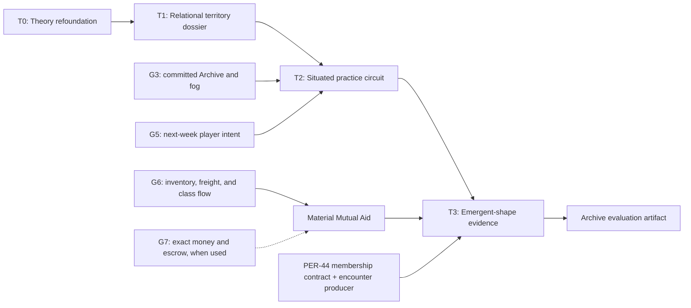

<!-- Vale: this normative specification preserves exact source titles, BSL identifiers,
error identities, byte-contract terms, and mathematical classification names. -->
<!-- vale off -->

# Neel Relational Territory and Situated Practice Design

**Status:** The Director approved the governing ontology on 2026-08-23 and
authorized autonomous engineering within it. The authorization does not permit
a new mathematical primitive, a weaker constitutional prohibition, a change to
the reserved theory line, or an expansion of external authority. The
page-complete source study corrected the mixed-source and organization boundary
on 2026-08-25; this specification includes that correction.

**Authority:** `CONSTITUTION.md` v4.0.0, `NORTH_STAR.md`, the v4 addendum to the
Babylon Game Design Standard, the Organization-as-Game-Object rulings, and the
2026-08-18 game-train ruling record control. This specification narrows those
contracts; it does not reopen them.

**This is a specification, not an implementation plan.** It defines four
dependency-ordered trains: theory refoundation, relational territory dossier,
situated organization practice, and emergent-shape verification.

## 1. Problem

Babylon currently has five mismatched surfaces:

1. `ai/theory.yaml` and `docs/concepts/theory.rst` still describe inevitable
   collapse, a fixed survival sigmoid, geographic class essences,
   unidirectional consciousness, and threshold-selected terminal outcomes.
   Those claims conflict with Constitution v4.
2. The Rust territory pack carries fixed territory categories and local
   displacement mechanics. Adding `NEAR_HINTERLAND` or `FAR_HINTERLAND` there
   would turn a relational analysis into geography.
3. The Rust organization foundation contains an `ORGANIZATION` kind plus
   `MEMBERSHIP`, `PRESENCE`, and `SOLIDARITY`, but it has no player intent loop.
4. BSL intent and external-event roles have no executable effect allowances.
   Ordinary mechanics still lack the exact governed footprint required for
   this politically sensitive circuit.
5. The engine can forbid the intrinsic name `sigmoid`, but permitted
   arithmetic and `exp` can author the same response. A curve-shaped trace
   therefore proves nothing by itself.

The design must make the player inhabit an organization, make territory
legible as a changing bundle of relations at declared scales, and let
slow-fast-slow aggregate behavior arise from local practice without writing a
wave, stage, subject, or outcome into the world.

## 2. Evidence and source boundary

The theory study read the complete supplied editions of Phil Neel's
*Hinterland: America's New Landscape of Class and Conflict* (Reaktion, 2018;
PDF SHA-256 `2799eb76f267551afa04a6bb76ffed4a89c5e1fc387c3744fcca3be3b00b4525`)
and *Hellworld: The Human Species and the Planetary Factory* (Brill, 2025;
PDF SHA-256 `43127a54390f9fb798cb644f0e5af0f8228b79cc5c392b1b472b5dc96be8fe1e`).
It also used the supplied `theory-of-the-party-ill-will.md` clipping (SHA-256
`373c2b594f932cbc7fcf590a784e6b48b9031a9bf7363e9b33a58fdc074454b1`) and
the CPUSA 1935 *Organizers' Manual*, chapter 3 (local HTML SHA-256
`6d27b580c657f68f35e8d4b5b2ac6ea6b076050b1de7a82cb0b615cce12f44fb`),
as bounded supporting evidence.

The table below is a compact routing index. The page-complete evidence ledger in
`docs/superpowers/research/2026-08-25-neel-source-study.md` records findings
H1-H10 and W1-W104, their page anchors, causal questions, and negative rulings.

| Design constraint | Reproducible anchor |
|---|---|
| The hinterland contains materially different, unevenly connected spaces and cannot be reduced to rural absence. | *Hinterland*, supplied PDF p. 18 (printed p. 17), including industry, logistics, extraction, and the near/far distinction. |
| Territorial industrial complexes join fixed capital, firms, labor, logistics, and metropolitan command without becoming one organic super-agent. | *Hellworld*, supplied PDF pp. 170–171 (printed pp. 143–144). |
| Territorial positions can be built, deconstructed, and recomposed through crisis and social reproduction. | *Hellworld*, supplied PDF p. 239 (printed p. 212). |
| Organization can be produced through situated practice and practical confrontation with material limits, rather than guaranteed by a label. | `theory-of-the-party-ill-will.md` lines 30-42, admissible only with independent support from H8, W10, W20, W36-W40, W45, and W62-W65. |
| Organization must root work across workplaces, residence, mass organizations, housing, and rent struggles, and must evaluate and revise practice. | CPUSA chapter 3 local HTML lines 45–61, 265–271, 464–505, and 1175–1190. “Reproduction struggle” is this design's synthesis, not the chapter's terminology. |

The source boundary is normative:

- Neel constrains ontology and causal questions. He supplies no coefficient,
  threshold, curve, or guaranteed historical outcome.
- The party clipping is a mixed-admissibility source. Only its bounded practice
  observations at lines 30-42 remain available, and only with independent
  support from permitted book findings. Its quarantined ranges cannot authorize
  organization kinds, party relations, vocabulary, or mechanics.
- The CPUSA chapter supports rooting across workplaces, neighborhoods, and
  concrete reproduction struggles, plus observation, deliberation, action,
  evaluation, and revision. Its hierarchy, fractions, membership thresholds,
  secrecy rules, and numeric guidance are historical particulars, not Babylon
  universals.
- Director exclusions apply transitively. A concept, analogy, rationale, or
  mechanic that depends on an excluded lineage remains excluded even when the
  lineage identifier is omitted. Canonical corpus-denial records remain the
  only active-policy location for those identifiers.
- The current narrator/RAG manifest denies standalone CPUSA material. This
  design uses the approved chapter as research evidence and does not change
  that ingestion policy.
- Discovery sources in the local corpora may locate primary evidence. They may
  not become coefficient authority or executable content by citation alone.

Every substantive value introduced by an implementation must be labeled
`Observed`, `Derived`, `Calibrated`, or `Designed`. Designed values must state
their play purpose and cannot masquerade as measurements.

## 3. Adopted interpretation

### 3.1 Planetary factory

The planetary factory is a relation among production, circulation,
reproduction, ecology, finance, and state power. It is not a super-agent named
Capital or Technosphere. A Babylon rule may move a burden, stock, relation, or
capacity through one declared causal role. It may not make the planetary
factory write its own conclusion.

Logistical leverage is contingent on throughput, route substitutability,
inventory, labor participation, coordination, community support, repression,
and counter-logistics. No worker, sector, corridor, or location receives an
intrinsic vanguard bonus.

### 3.2 Hinterland

Near and far are relations at a declared scale, not radial bands:

- a place may have little command power while carrying dense production,
  logistics, and proletarian settlement;
- another may be organized through extraction, abandonment, carceral power,
  informal reproduction, or a thin transport corridor;
- the same place may be locally central and nationally peripheral without
  contradiction.

Babylon therefore retains separately named facets. It never stores a canonical
`hinterland_position`, score, rank, stage, or territorial essence.

### 3.3 Organization and party

The player begins inside one concrete organization. It may be described by
content as a party, union, tenant formation, council, mutual-aid network,
affinity group, or another organization form. These descriptions do not mint
kernel kinds.

The organization exists through typed relations and material practices. Its
line is real, but selecting a line cannot directly write subjectivity or an
outcome. Organizations may appear, split, federate, or disappear. A coalition,
federation, council, or communication network exists only through concrete
graph relations among its participants. Babylon does not infer a broader party
relation behind those organizations, repertoires, or events.

Competence is not XP. A typed repertoire may be recognized from attributed
receipts, may fail under changed conditions, and may decay or be lost.

## 4. Architecture



The arrows are dependencies, not permission to absorb another Linear issue's
scope. Each landing must name its writer, consumer, sentinel, and portfolio
owner.

## 5. Cross-train invariants

1. Geography is fixed. Jurisdiction, claims, control, occupation, and
   organization reach are actor-identified overlays.
2. A territory dossier is a projection, not graph state. BSL cannot read its
   aggregate presentation.
3. Facets do not collapse into a canonical score, target rank, coefficient,
   rule guard, AI objective, or statement of territorial identity.
4. Indigenous jurisdiction remains a potentially overlapping, actor-identified
   authority or claim overlay with provenance. It cannot reuse
   `territory/territory-type`, `RESERVATION`, or the retired generic
   `JURISDICTION` edge.
5. Native public hyperedges remain n-ary objects. No projection may replace one
   with a clique of dyads.
6. The player and non-player actors use the same intent, adjudication, effect,
   decay, repression, and receipt machinery. Controller identity may change
   knowledge and input authority, not physics.
7. `ActionBudget`, `Capacity`, inventory, labor, money, treasury, and escrow are
   distinct domains. No implicit conversion, fallback payment, or double spend
   is lawful.
8. An action supplies a cause, not a result. It cannot directly write generic
   support, membership, worldview, revolutionary potential, revolt, fascism,
   or a shape stage.
9. Equal canonical inputs produce equal output bytes and hashes. Failure is
   atomic and loud.
10. Every loop has a static upper bound. Non-finite values, unchecked overflow,
    and order-dependent iteration are rejected.

## 6. Train T0: theory refoundation

T0 updates the existing canonical pair, `ai/theory.yaml` and
`docs/concepts/theory.rst`. It must not create a competing theory registry.
`ai/mantras.yaml` remains the machine-readable orientation and changes only if
the new prose exposes a verifiable inconsistency.

T0 makes these replacements:

| Current claim | Governing replacement |
|---|---|
| American hegemony collapses inevitably | Accumulation produces pressures and limits; paths and outcomes remain contingent. |
| Core revolution is structurally impossible while imperial rent exists | Imperial rent changes incentives and causal pathways; organization, crisis, coercion, solidarity, and countervailing relations remain live variables. |
| `P(S|A)` is a fixed sigmoid | Survival is an aggregate over heterogeneous material distributions and relations. No fixed response curve is lawful. |
| Classes carry intrinsic revolutionary potential | Classes are positions and relations. Political practice and subjectivity are historical results. |
| Consciousness flows from periphery to core | Consciousness and line travel through attributed organization and solidarity relations in multiple directions. |
| Collapse chooses a deterministic terminal bifurcation | Outcomes are recognizers over histories, not downstream writes or promised verdicts. |
| Ecology makes victory impossible | Ecological degradation and care capacity constrain choices; construction, repair, and redistribution can change consequences without promising equilibrium. |

Historical formulas that remain in the frozen Python reference must be labeled
as reference or surrogate behavior. Documentation must not describe them as
the live Rust law.

T0 acceptance requires:

- no fixed sigmoid or inevitability claim in the canonical pair;
- no geographic or class-potential essence;
- explicit distinction between theoretical constraint and executable status;
- source exclusions and evidence classes recorded;
- links to the live Constitution and architecture;
- targeted Vale with zero errors or warnings.

## 7. Train T1: relational territory dossier

### 7.1 Decision question

The eventual player surface answers:

> Through which visible territorial relation should this organization commit
> its next constrained action, and what evidence, uncertainty, and prior
> consequence make that choice legible?

The first landing is an unfogged administrative projection. It cannot satisfy
a gameplay milestone.

### 7.2 Contract

`RelationalTerritoryDossierV1` is a closed record. Its first implementation
must check in `contracts/relational_territory_dossier_v1.yaml`, generated Rust
and Python types, and two independent canonical-byte encoders before it adds a
projection producer. The contract contains:

```text
schema = "babylon.relational-territory-dossier"
schema_version = 1
projection_version
audience = ADMIN_MATERIAL | PLAYER_KNOWLEDGE
durability = IN_MEMORY | COMMITTED
verified_tick
graph_state_hash
nominal_world_hash
reference_digests[]
definitions_digest
template_digest
fog_policy_digest | null
knowledge_context_digest | null
actor | null
focus[]
scale_memberships[]
facets[]
dyads[]
hyperedges[]
flows[]
gaps[]
provenance[]
decision_surface
projection_hash
```

The schema uses these sealed nested records:

| Record | Required fields |
|---|---|
| `TypedIdentityV1` | `domain`, `authority`, `local_id` |
| `ReferenceDigestV1` | `reference_id`, `sha256_hex`, `artifact_schema_id_or_null`, `vintage`, `evidence_class` |
| `DimensionCoordinateV1` | `dimension_ref`, `member_ref` |
| `ScaleMembershipV1` | `membership_id`, `member_ref`, `scale_ref`, `membership_kind`, `status`, `weight_status`, `weight_bits_or_null`, `coverage`, `evidence_class`, `provenance_refs` |
| `FacetV1` | `facet_id`, `family`, `subject_ref`, `metric_id`, `unit_id`, `native_scale`, `coordinates`, `vintage`, `status`, `value_kind`, `value_bits_or_null`, `coverage`, `evidence_class`, `provenance_refs` |
| `DyadV1` | `relation_id`, `relation_kind`, `from_ref`, `to_ref`, `native_scale`, `status`, `coverage`, `payload_facets`, `evidence_class`, `provenance_refs` |
| `HyperedgeV1` | `hyperedge_id`, `hyperedge_kind`, `member_refs`, `native_scale`, `status`, `coverage`, `payload_facets`, `evidence_class`, `provenance_refs` |
| `ReferenceFlowV1` | `flow_id`, `flow_kind`, `origin_ref`, `destination_ref`, `payload_facets`, `native_scale`, `status`, `coverage`, `evidence_class`, `provenance_refs` |
| `GapV1` | `gap_id`, `requested_metric_or_relation`, `status`, `reason_code`, `required_producer_or_null`, `provenance_refs` |
| `ProvenanceV1` | `provenance_id`, `artifact_digest`, `locator`, `vintage`, `evidence_class`, `transformation_digest_or_null` |
| `DecisionSurfaceV1` | `question_id`, `signal_refs`, `action_refs`, `receipt_refs`, `archive_subject_refs` |

Every enum is closed in the schema. Every `*_ref` is a complete
`TypedIdentityV1`; a local string alone is never an identity. Unknown fields,
unknown enum members, duplicate identities, dangling references, and a record
whose declared status disagrees with its nullable payload fail before hashing.
Outside `TypedIdentityV1` itself, every field whose name ends in `_id` is also
a complete `TypedIdentityV1`. The metric literals below are readable shorthand
for `local_id` under `{domain: "metric", authority: "babylon.rtd.v1"}`; the
wire form always carries all three identity components. A non-null
`artifact_schema_id_or_null` follows the same rule.

An H3 cell identity cannot be frozen locally by this dossier. PER-21 owns the
shared cross-language `H3CellId(u64)` validation contract, official vectors,
and the text boundary of lowercase unpadded hexadecimal. Until that contract
lands, a requested H3 facet or membership produces a `GapV1` with
`NOT_COMPUTED` and `required_producer_or_null = PER-21`; the dossier emits no
H3-bearing `TypedIdentityV1`, facet, membership, or canonical vector. After
PER-21, RTD consumes that identity contract unchanged. Weighted overlap remains
a separate measure-specific producer and does not follow merely from identity.

`ReferenceDigestV1.sha256_hex` is exactly 64 lowercase hexadecimal characters.
`reference_digests` sorts by the canonical bytes of `reference_id`; duplicate
reference identities fail even when their digests match. A facet's
`coordinates` sorts by `dimension_ref`; duplicate dimensions or a coordinate
set that differs from the metric registry's exact native grain fails.

The wire contract has exact `Designed` hard limits: 64 focus identities; 4,096
reference digests; 65,535 records in each of `scale_memberships`, `facets`,
`dyads`, `hyperedges`, `flows`, `gaps`, and `provenance`; 32 coordinates per
facet; 1,024 members per hyperedge; 256 payload facets per relation record; 256
decision-surface references in each ordered list; 8,192 provenance references
per record; 256 UTF-8 bytes per identity component; 1,024 UTF-8 bytes per
provenance locator; and 67,108,864 canonical bytes for one dossier. These are
schema validation limits, not count fields serialized into the JSON object.

A bounded builder refuses an append at `limit + 1` before growing the target
container. A canonical encoder writes only to a private staged sink, maintains
a checked `u64` byte counter, and refuses as soon as byte 67,108,865 would be
written. It discards the staged output on any refusal and never publishes a
partial, truncated, or silently paginated dossier. Every validating loop has a
static bound of its declared limit plus the one refusal witness. These limits
bound the proof slice and do not claim that every possible national dossier
fits one envelope.

A `focus` is a canonical set of existing identities, sorted by the canonical
bytes of `TypedIdentityV1`. It does not mint a region or graph node.

Every material facet, scale membership, dyad, hyperedge, and flow carries an
evidence class, native scale or scale reference, provenance, coverage, stable
identity, and status. Facets additionally carry a governed unit, vintage, and
typed value governed by that status:

- `PRESENT`: a value and sufficient provenance exist;
- `ABSENT`: covered evidence establishes nonexistence;
- `UNKNOWN`: evidence cannot establish a value;
- `NOT_COMPUTED`: a lawful producer has not computed it;
- `REDACTED`: truth exists but this audience may not know it.

Only `PRESENT` may carry a value. A measured zero is `PRESENT` with provenance;
a scaffold zero is `UNKNOWN`. Missingness never becomes zero.

Dyads, hyperedges, reference flows, and scale memberships remain different
record families. An origin-destination row is not a graph edge. An external
node is a relation endpoint, not a geographic parent. Top-level record arrays
sort by their record identity. `member_refs`, `payload_facets`, and
`provenance_refs` sort by the canonical bytes of the referenced identity;
`coordinates` and `reference_digests` follow their rules above. The four
`DecisionSurfaceV1` lists alone preserve declared display order. A duplicate
sort key fails in every order-insensitive array.

### 7.3 Canonical projection

The projection hash is SHA-256 over:

```text
ASCII("babylon.relational-territory-dossier.v1")
0x00
canonical_json(dossier_without_projection_hash)
```

Canonical JSON uses UTF-8 and the closed schema's field names. Input strings
must already be Unicode NFC; a non-NFC string, an unpaired surrogate, or a
control character outside JSON's required escapes fails instead of being
rewritten. Object keys sort by their UTF-8 bytes. Encoding uses no whitespace,
the shortest required JSON escapes, lowercase literals, and explicit nulls.
Unsigned integers use shortest unsigned decimal with no leading zero.
`FLOAT64` values encode their finite IEEE-754 bits as sixteen lowercase
hexadecimal characters; negative zero normalizes to positive zero. The schema
defines every field's JSON type, presence, order-insensitive identity key, and
bounded-container limit. Unknown fields and versions fail.

Order-insensitive data arrays sort by their complete typed identities.
Decision-surface signal, action, receipt, and Archive lists preserve declared
display order because order is presentation semantics.

The dossier is hash-neutral to authoritative world state. Its hash binds the
projection output; it never enters the next tick.

### 7.4 Native-scale laws

- County-to-state and county-to-nation mappings are total.
- MSA membership is partial. CZ membership has explicit exclusions. MSA and CZ
  are parallel county aggregations, not nested rungs.
- Extensive quantities may sum through a declared membership. Intensive
  quantities need governed weights and a coarse-graining invariance test.
- H3-to-county area claims need overlap weights. A centroid bridge cannot claim
  area overlap.
- FAF remains CFS-area or external-bloc data until a populated governed bridge
  permits another scale.
- Partial coverage is never grossed up.

### 7.5 Independent facets

The V1 facet families are:

1. command and administrative centrality;
2. production and circulation;
3. reproduction, settlement, and access;
4. extraction, abandonment, and carceral pressure;
5. ecological exposure and care capacity;
6. organization-specific rootedness through existing typed relations.

The dossier renders each family separately. It has no cross-family reducer.
An action preview may combine only the inputs named by that action's causal
contract and cannot persist the result as territory identity.

The Detroit V1 metric registry is closed:

| Metric IDs | Native grain and producer | Evidence rule |
|---|---|---|
| `production/qcew-leaf-employment`, `production/qcew-leaf-establishments`, `production/qcew-leaf-total-wages-usd`, `production/qcew-leaf-average-annual-pay-usd` | county × 6-digit NAICS × ownership × year, `fact_qcew_annual`, SHA-256 `ca3825a3d60831479313632073b7fc9a941d57dcf9b8940181c4713b6d442248` | A published unsuppressed magnitude is `Observed`. An imputed magnitude is `Derived` and retains `disclosure_code`, `is_imputed`, and transformation provenance. Average pay remains at leaf grain; V1 defines no average-of-averages. |
| `production/qcew-county-employment`, `production/qcew-county-establishments`, `production/qcew-county-total-wages-usd` | county × ownership × year, `fact_qcew_county_rollup`, SHA-256 `34c2bbb935f79b3c8076a97092b004b14cca120e8272b93c35b3ac9dc2721d13` | The `own_code = 0` coordinate is the published all-ownership county total. A row is `Observed` only when `is_imputed = false`; otherwise it is `Derived`. V1 performs no implicit sum across ownership coordinates. |
| `circulation/lodes-county-commuter-total-jobs` | home county × work county × year, `fact_lodes_commuter_flow`, SHA-256 `d3745f8def09cd8c7a38e1870e6ec2c1853e210b777d8e8358cfce36665bd64d` | `Derived` load-time sum of LODES origin-destination block rows. It remains a `ReferenceFlowV1`; it is neither a graph edge nor an H3 flow. |
| `reproduction/census-housing-households` | county × source × tenure × time × race, `fact_census_housing`, SHA-256 `09ff2d9666b3f5ef267b65cbc77c14e99384f0157b6a4c898ac37df2e67ca59f` | A covered source row is `Observed`. A sum across tenure or race requires a separately registered `Derived` metric; absence is not zero. |
| `reproduction/census-median-rent-usd` | county × source × time × race, `fact_census_rent`, SHA-256 `4c8cc134ec490ca75961d83485fc97c6bf240b32128e9d0517e00e62d578a99e` | A covered source row is `Observed`. V1 neither sums nor averages median rows. |
| `reproduction/census-rent-burden-households` | county × source × burden category × time × race, `fact_census_rent_burden`, SHA-256 `8a42a51c17bf3ebee09f0b0b5145d5c8253c7e3446eec8c75714f9951b20df12` | A covered source row is `Observed`. Any rollup is a separately named `Derived` metric with its exact sum set. |
| `reproduction/h3-population-persons` | H3 resolution 7 cell × Census 2020 P.L. 94-171 vintage, `h3_res7_population`, SHA-256 `b096a5891284f0ca55bedae9d1a9092eb8ea9e9e32d32b6ace430a9833b53afc` | `Derived` block internal-point assignment. It makes no within-block density or area-overlap claim. |
| `production/h3-workplace-jobs` | H3 resolution 7 cell × LODES8 WAC vintage, `h3_res7_workplace`, SHA-256 `ea2ce1508f4fe51f1e879b9f4a1daf579c4b00349388b12a85f884a8f49eabb6` | `Derived` block-coordinate assignment of WAC `C000`; it does not derive from the county commuter-flow table. |
| `carceral/facility-count` | county × coercive type × source, `fact_coercive_infrastructure`, SHA-256 `33e6558d2b438e7aea672021f0e15f743f1ea331ab82407c0805a428b29cf808` | A present source row is an extensive `Observed` count. A missing row is `UNKNOWN`, not the ORM column default. The artifact reference supplies the pinned vintage. |
| `ecology/h3-land-fraction` | H3 resolution 7 cell × TIGER 2023 vintage, `h3_res7_land_mask`, SHA-256 `4e6caba297f0111a9ec93d948a83543bb9f7179361fe5dd318bb8a98a5be5194` | Finite dimensionless `Derived` value in `[0, 1]` from equal-area water intersection. It is neither land area, water area, land cover, nor ecological condition. |
| `rootedness/presence`, `rootedness/solidarity`, `rootedness/membership` | committed typed graph relations at the verified tick | `Derived` projection of actor-identified relations; missing payload remains unavailable. |

The command/administration family, freight intensity, eviction, foreclosure,
absentee ownership, agricultural tenure, Indigenous jurisdiction, care
capacity, and every ecology claim beyond the registered land-fraction measure
remain `UNKNOWN` or `NOT_COMPUTED` in the control fixture until a governed
producer is added to this registry. Adding a metric is a schema/content change
with a new producer, unit, native grain, evidence class, and canonical vector.

The metric registry declares the exact required `DimensionCoordinateV1` set
for every row above. The required `vintage` field carries the one temporal
coordinate named as year, time, or source vintage in the table and is not
duplicated in `coordinates`. A producer cannot drop any other categorical
coordinate, aggregate it implicitly, or substitute a differently grained
artifact under the same metric ID. Any allowed aggregation receives a new
metric ID, evidence class, transformation digest, and conservation or weighting
test.

### 7.6 Detroit-Windsor fixture

`detroit-windsor-rtd-v1` focuses on Wayne `26163`, Oakland `26125`, and
Macomb `26099`. It mints no tri-county region. Each county maps independently
to Michigan `26`, United States `US`, and, through the pinned 1990 ERS
artifact, CZ `11600`. A legacy MSA value of `19820` remains unavailable until
the OMB artifact requirement below is satisfied. The control emits one
`GapV1` for the requested OMB MSA membership with reason
`MISSING_GOVERNED_OMB_DELINEATION`; it emits no MSA `ScaleMembershipV1` and
never places `19820` in `scale_ref`. Its provenance references the inspected
legacy export and the contract check that rejected it; provenance records the
failed evidence path without promoting that code.

The registry pins the population, workplace, and land-fraction artifact
digests, but the control emits a `GapV1` for each requested H3 facet until
PER-21's identity contract lands. Once it does, resolution 7 cells retain their
own identity and those facets retain their declared evidence class; a county
disaggregation is `Derived`, never relabeled as a native observation. The
current county bridge selects a cell by its centroid assignment only. It makes
no area-overlap or complete-coverage claim. A weighted overlap membership must
be a separately versioned measure-specific producer rather than a silent
replacement. `EXTERNAL canada` is a separate relation endpoint. The fixture
infers no Canadian H3, county, metro, or jurisdictional geography.
Each pre-PER-21 H3 gap references the pinned metric artifact and the identity
contract dependency, so the missing producer and the already available
material measure remain distinguishable.

The canonical control has no Canadian LODES commute row. A separately named,
disabled-by-default synthesis may add one `Derived` aggregate Detroit-to-Canada
relation with full provenance. It cannot overwrite canonical LODES or create
Windsor geography.

The county-to-CZ row identifies the 1990 ERS commuting-zone artifact and its
digest. The MSA gap names the missing pinned OMB delineation vintage and digest
as its remedy; until that artifact exists, no MSA membership row exists even if
a legacy mapping carries `19820`. V1 may present the registered QCEW, LODES,
Census, and carceral metrics at their native supported scales only when every
fact coordinate resolves consistently through its pinned dimension artifacts.

The 2026-08-23 T1 artifact audit found a concrete Census provenance conflict in
`data-artifacts-v7`: the selected 2023 fact rows carry `source_id = 2`, while
the pinned source dimension maps 2 to the 2010 ACS five-year source and maps 4
to the 2023 source; the three fact tables contain no matching source-4 rows at
that 2023 coordinate. The control therefore emits no `Observed` Census housing,
rent, or rent-burden facet from those rows. It retains the conflicting rows and
all dimension coordinates in the extraction ledger and emits one `UNKNOWN` gap
per registered Census metric with reason
`PROVENANCE_COORDINATE_CONFLICT` and required producer `PER-28`. A corrected,
reproducibly pinned artifact may close those gaps later; changing the source id
inside T1 or relabeling source 2 as 2023 is forbidden.

V1 may present the registered H3 metrics only after PER-21 lands; before then it
presents the typed gaps above. It must present these as unknown or not computed
when appropriate:

- county freight and road-corridor intensity;
- eviction, foreclosure, and absentee ownership scaffolds;
- agricultural tenure and displacement;
- Indigenous jurisdiction until the AIANNH source receives a governed artifact
  and overlap bridge;
- ecology beyond the registered land-fraction measure;
- Windsor/Essex geography and Canadian spatial membership;
- player fog, action eligibility, and organization practice state before their
  producers exist.

### 7.7 T1 acceptance

The language-neutral contract suite must prove:

- independent implementations produce the same bytes and projection hash;
- order-insensitive permutations preserve bytes while semantic mutations move
  the hash;
- measured zero differs from every missingness status;
- unsupported downscaling fails;
- CZ and MSA remain parallel;
- missing governed OMB evidence yields one MSA gap and no membership row;
- the pinned source/time mismatch yields three Census provenance gaps and no
  Census facet until PER-28 supplies corrected artifacts;
- before PER-21, each requested H3 metric yields a typed gap and no H3-bearing
  identity or vector; after PER-21, official cross-language vectors are reused;
- one n-member hyperedge remains one n-member hyperedge;
- canonical control has no Canadian commute row;
- the opt-in border variant changes only its declared relation and provenance;
- no score, near/far label, radial band, stage, or response curve exists;
- the administrative surface remains visibly unfogged and exempt;
- player output refuses unless durability, fog, actions, receipts, and Archive
  subjects are complete.

## 8. Train T2: situated organization practice circuit

### 8.1 Player seat and closed vocabulary

Campaign setup declares exactly one immutable `player_org_id` that resolves to
an existing `ORGANIZATION`. Every player intent names that organization as
actor. Control grants no automatic legitimacy, authority over a coalition, or
vanguard status.

Input authority is separate from actor identity. The player gateway can submit
only an intent whose actor equals `player_org_id`. A non-player intent can
originate only from a deterministic policy producer whose content manifest
registers the exact `(producer_content_digest, actor_org_id)` pair. An external
caller cannot assert policy authority. Both sources emit the identical sealed
`PracticeIntentV1`; after source authorization they share admission, budget,
resolution, reduction, receipt, and rollback without a controller branch.

The Director's 2026-08-18 ruling maps the three display practices to this
closed target vocabulary:

| Display practice | `PracticeIdV1` code | Machine stem and mode |
|---|---:|---|
| `ORGANIZE` | `1` | `mobilize:canvass` |
| `AGITATE` | `2` | `mobilize:agitate` |
| `MUTUAL-AID` | `3` | `aid` |

These are the only valid `practice_id_u8` values in V1. Zero and every
unassigned value fail. `PracticeIntentV1`, `SfsPreregistrationV1`, receipts,
ledgers, and independent encoders all use this one code table.

Display labels do not mint verbs. `mobilize:agitate` is a ratified target
sub-mode. T2 landed the closed `VerbMode` enum, canonical registry identity,
mismatch sentinel, and shared content declaration. This remains a contract-only
surface because no executable intent effect exists. Strike Support and Study
remain outside V1 until their real production and doctrine consumers exist.

`organization/consciousness-tendency : ConsciousnessTendency` is the
organization's ideological line. Community content already declares the closed
members `LIBERAL`, `FASCIST`, and `REVOLUTIONARY`, and its
`community/c03*-org-weight-push` rules read the field through `MEMBERSHIP`.
The organization-foundation content set now composes the shared
`organization-practice.bscn` declaration prelude. That prelude owns the existing
enum/deffield contract plus `organization/cadre-level` and
`organization/cohesion`; it does not mint a second line field. Scenario setup is
their sole V1 initializer and the line's sole V1
writer; an intent cannot change the tendency. These fields are not XP,
ActionBudget, inventory, or money. The separate line-attribution boundary reads
the actor's tendency and binds it into the attributed receipt. An action
mechanic does not read tendency merely to decorate its material effect. Neither
boundary can write a target ternary, dominant tendency, or generic subjectivity.

The existing community path is not falsely credited to a practice. A practice
becomes a mechanical line-transmission cause only when a separately governed
encounter-to-membership resolver changes attributed membership and the existing
community consumer observes that change. Until that resolver and PER-44's
payload law exist, the receipt's tendency is evidence and the T2 line-return
leg remains explicitly unavailable.

T2 therefore lands in named slices. T2a is the seeded-target practice slice and
cannot claim complete line transmission. T2b is the PER-44-dependent
encounter-to-membership producer; only T2b closes the binding mass-work line
path. Receipt attribution without T2b never satisfies the T2 completion gate.

### 8.2 Intent contract

`PracticeIntentV1` is canonical next-week input:

```text
schema_version: u16 = 1
submit_after_tick: u64
resolve_tick: u64 = checked_add(submit_after_tick, 1)
actor_org_id: u64 NodeId
practice_id: u8 PracticeIdV1
target_domain: u8 PracticeTargetDomainV1 code naming a closed NodeType
target_node_id: u64 NodeId
quoted_content_digest: [u8; 32]
quoted_action_budget_cost: u32
parameters[]: PracticeParameterV1
evidence_digests[]: [u8; 32]
```

`PracticeParameterV1` is `(key: u8, value_kind: u8, value_length: u16,
value_bytes)` with a maximum 256-byte value. Each practice declares its exact
allowed keys and types; unknown, duplicate, non-finite, or non-minimal values
fail. An intent has at most 16 parameters, 64 sorted unique evidence digests,
and 16,384 total canonical bytes. A resolve tick has at most 4,096 accepted
intents and at most one per organization. Every boundary has exact empty,
maximum, maximum-plus-one, duplicate, and overflow vectors.

Source authorization produces `PracticeInputAuthorityV1` with
`schema_version: u16 = 1`, `authority_kind: u8` (`PLAYER_SEAT = 1`,
`DETERMINISTIC_POLICY = 2`), `actor_org_id: u64`, and
`producer_content_digest: [u8; 32]`. Its bytes are
`ASCII("babylon.practice-input-authority.v1") || 0x00 ||
schema_version_u16_be || authority_kind_u8 || actor_org_id_u64_be ||
producer_content_digest_32`. The pending row and committed input digest bind
both its SHA-256 digest and the authorized `PracticeIntentV1` digest. For a
player source, the producer digest is the committed player-gateway content
identity and the actor must equal `player_org_id`. For a policy source, the
pair must appear exactly once in the content-identity manifest. Unknown kinds,
unregistered pairs, actor disagreement between the authority and intent, and a
caller-supplied policy claim fail before ordinary admission and create no
durable row.

The intent byte contract is:

```text
ASCII("babylon.practice-intent.v1") || 0x00
|| schema_version_u16_be
|| submit_after_tick_u64_be || resolve_tick_u64_be
|| actor_org_id_u64_be || practice_id_u8
|| target_domain_u8 || target_node_id_u64_be
|| quoted_content_digest_32
|| quoted_action_budget_cost_u32_be
|| parameters_count_u16_be || length_framed_parameters
|| evidence_count_u16_be || evidence_digests_lexicographic
```

`intent_digest` is SHA-256 of those bytes. The engine derives stem, mode, and
actual cost from `practice_id` and the quoted content identity. A stale digest,
zero-cost quote where content requires a cost, or any quoted-cost mismatch
fails. The digest order is only serialization order; it grants no material
priority. Every admitted practice evaluates against the same sealed pre-action
snapshot, produces typed contributions, and uses collect-then-apply. A
non-composable structural conflict fails the detached tick. V1 Organize and
Agitate admit no magnitude parameter: each contribution carries the one
governed constant's exact bits. Contributions group by complete target/field or
edge identity. A group of identical `add` quanta reduces as one binary64
`f64(count) * quantum` followed by one `add` to the sealed prior value. The
count is an exact `u32` no larger than 4,096. Differing operands, more than one
`set`, or any colliding structural operation fail before application. Groups
sort by complete target/locus identity for effect bytes, but distinct groups do
not observe one another. Permuting or alpha-renaming actors therefore cannot
change a material sum. Actor-renaming twins must preserve results under the
corresponding graph isomorphism.

The flat-cadence proof uses two additional exact identities. Canonical
parameter-sequence bytes are `parameters_count_u16_be ||
length_framed_parameters` from the intent contract, and
`parameter_bytes_digest = SHA256(ASCII("babylon.practice-parameter-bytes.v1")
|| 0x00 || canonical_parameter_sequence_bytes)`. The V1 fixed-target policy
bytes are `ASCII("babylon.fixed-target-selection.v1") || 0x00 ||
target_domain_u8 || target_node_id_u64_be`; their SHA-256 digest is
`target_selection_policy_digest`. A different policy kind requires a new
closed byte contract; a caller cannot supply an unexplained digest. These
identities let the post-commit evaluator prove constant practice, fixed target
selection, governed cost, and parameter bytes without interpreting an opaque
intent digest.

Submission validates against the last committed state and pending ledger. A
rejection returns a stable `PracticeSubmissionRejectionV1` and creates no
receipt, Archive subject, outbox row, graph write, budget debit, or durable
pending row. Acceptance atomically seals the canonical bytes into the durable
next-tick input ledger; it still changes no graph or budget. A future
`TickSession::advance_with_inputs` bridge consumes that sealed ledger as part of
the committed input digest. Current `TickSession::advance` has no such input,
so the Gate 3 committed envelope/outbox and Gate 5 pending-ledger bridge are
hard prerequisites, not claims about live behavior.

### 8.3 ActionBudget

`organization/action-budget` is a non-negative integral, non-Currency decision
quota. It is not an efficacy multiplier or a substitute for `Capacity`, goods,
labor, money, treasury, or escrow.

The shared campaign prelude declares `organization/action-budget` as an
intensive BSL `int` field whose live graph storage is binary64-exact
`u32`, not a new typed graph lane. Campaign setup is the sole initial writer
and seeds every active organization from the `Designed`
`practice/action-budget-initial` `GameDefines` row. The player organization's
initial value must cover at least one cheapest wired practice. A later
organization-creation resolver must initialize the field atomically with
`organization/active`; until that resolver exists, dynamic organization
creation is unavailable. An active organization with a missing, negative,
fractional, or out-of-`u32` value makes load or tick fail; there is no default.
On read, the boundary requires a finite non-negative binary64 value with zero
fractional part and an exact `u32 -> f64 -> u32` round trip. It performs all
budget arithmetic with checked `u32` operations before the one exact `u32` to
binary64 graph write. Because every `u32` is exactly representable in binary64,
this contract needs no new mathematical or graph-storage primitive.

The cast-back check is bitwise canonical: storage bits must equal
`f64::from(value).to_bits()` after the checked conversion. Thus `-0.0` refuses
instead of becoming a second stored representation of integer zero.

`MAX_ORGANIZATIONS = 4,096` and
`MAX_ORG_SOLIDARITY_EDGES_PER_ORG = 256` are `Designed` compile-time scenario
and fuel limits, not tunable `GameDefines`. The content loader counts typed
`ORGANIZATION` nodes and each organization's outbound organization-to-class
`SOLIDARITY` edges before BSL evaluation and refuses at the first count of
4,097 or 257. The accepted ceilings enter content identity and the BSL fuel
profile. Dynamic organization creation remains unavailable in V1; its future
resolver must refuse `MAX_ORGANIZATIONS + 1` atomically. Contract vectors cover
zero, exact maximum, and maximum plus one, so the budget and decay scans inherit
statically enforced bounds rather than an assumed scenario size.

V1 replenishment is `Designed` and transparent:

- the sealed pre-action snapshot is the only replenishment input;
- each distinct live outbound organization-to-social-class `SOLIDARITY`
  relation with positive finite strength contributes one unit;
- the scan uses sorted edge identity and the `Designed` static ceiling
  `MAX_ORG_SOLIDARITY_EDGES_PER_ORG = 256`; a larger footprint fails;
- `GameDefines` supplies a non-negative weekly credit cap, per-practice cost,
  and storage ceiling;
- intent admission requires `budget_before >= governed_cost`; the transition is
  `min(storage_ceiling, budget_before - governed_cost +
  min(footprint_count, weekly_credit_cap))` with checked integer arithmetic;
- `OrganizationBudgetDeltaV1` records the snapshot hash, count, cost, raw and
  credited replenishment, whether the ceiling bound, and resulting balance;
- no controller-specific exception exists.

Every active organization receives exactly one budget transition each tick;
an organization without an accepted intent has governed cost zero. Admission
and replenishment happen before practice effects. A resolving practice cannot
fund itself by creating a relation, and that tick's later decay cannot reduce
the already measured credit. The existence rule is not a claim that weak and
strong ties are equivalent. Relation strength affects downstream mechanics;
footprint breadth alone replenishes decision throughput in V1. A later
replacement requires a new designed contract and behavior vectors.

`OrganizationBudgetDeltaV1` is fixed-order
`schema_version_u16_be || tick_u64_be || actor_node_id_u64_be ||
pre_action_world_hash_32 || budget_before_u32_be || governed_cost_u32_be ||
footprint_count_u32_be || raw_credit_u32_be || credited_credit_u32_be ||
ceiling_bound_u8 || budget_after_u32_be`. Its digest uses the
`babylon.organization-budget-delta.v1` domain. Values that cannot round-trip
through the binary64-exact `u32` storage contract fail rather than clamp.

### 8.4 Practice mechanisms

Every practice passes through an intent-role admission rule and a separately
named shared mechanic with an exact read/effect footprint.

The playable V1 fixture has an admissible starting topology: an active player
organization, its `PRESENCE` relation to the declared territory, at least one
outbound `SOLIDARITY` edge to a target `SOCIAL_CLASS`, and the separately
declared `MEMBERSHIP` relation used by the community consumer. The target
class must also have `TENANCY` in at least one territory reached by that
actor's `PRESENCE`. Organize and Agitate are selectable only when this
`PRESENCE ∩ TENANCY` join and the positive finite solidarity path both exist
in the sealed snapshot. A remote branch or solidarity edge cannot substitute
for a local social base. A missing relation returns an eligibility remedy and
produces no pending intent.

**Organize** reads the pre-action `solidarity/strength`, the actor's active and
presence fields, and the governed gain and ceiling constants. It adds the gain
to that admitted existing edge and clamps at the declared ceiling. It does not
mint membership, create topology, or write subjectivity in V1.

**Agitate** reads the same actor, target, and path eligibility. The
`act/` rule adds its governed contribution to the target's existing
`social-class/agitation` accumulator before `consciousness/p5-agitation` reads
that value, and before `p6-route` consumes and decays it. This is an intermediate
pressure write, not a ternary result. Agitate cannot select the revolutionary,
liberal, or fascist channel directly.

Expansion beyond seeded targets and the live T3 proof require a separately
owned encounter-to-membership resolver after PER-44 ratifies attributed
membership. It consumes attributed practice receipts, co-presence, the changed
solidarity relation, prior attributed membership, target material state, and
repression. An intent cannot invoke it directly or guarantee a positive
membership change. It is the only T2-scoped producer allowed to change the
attributed membership consumed by the existing community tendency path.

**Mutual Aid** is material and conservative. No suitable Rust stock exists at
the current head. The action remains offerable but unavailable with
`E-PRACTICE-UNWIRED` until the governed inventory/order train supplies an
organization-owned stock, attributed labor, routing, arrival, and a recipient
consumer. When enabled, `aid` reserves and debits real stock before crediting
delivery, records routing and loss, and uses exact money/escrow only through
their own later ledger. It never reuses ActionBudget, `Capacity`,
`social-class/wealth`, or `institution/rent-pool` as the missing goods.

Stock-only aid does not wait for a money ledger when no monetary claim exists.
Its enabling contract must nevertheless pin reservation identity, source
debit, recipient credit, attributed labor, route and loss conservation,
rollback, and receipt identity under PER-30 and PER-31. If an aid route uses
money, credit, or shipment escrow, PER-36 becomes a hard precondition for that
route and the receipt records each exact debit and credit separately.

### 8.5 Antagonism and decay

Solidarity strength decays through one shared bounded mechanic after the
organization, community, and consciousness consumers run. V1 subtracts the
non-negative `solidarity/decay-per-tick` `GameDefines` value from each live
organization-to-social-class edge and floors at positive zero. The scan uses
sorted organization then edge identity, at most 4,096 organizations and the
same 256-edge per-organization ceiling. Renewal comes from declared practice,
not a controller flag.

Antagonist repression uses the same next-week intent and receipt path. Its
eligibility may read a target organization's visible footprint and the existing
`Dossier`/exposure calculation. It has no executable material-effect allowance
until a shared resolver names the affected population, writes the existing
`social-class/repression-faced` pressure, and consumes the existing structural
`Backfire` result. The antagonist has no privileged mutation API.

The resolving tick phase order is fixed:

1. seal and validate the accepted-input envelope;
2. compute all organization budget transitions from the sealed pre-action
   snapshot;
3. evaluate and collect practice and antagonist contributions;
4. apply them, then run organization, community, and consciousness consumers;
5. run solidarity decay;
6. build targeted receipts and publish the committed envelope and outbox.

A phase failure aborts the detached tick. Phase 1 resolves material eligibility
against the sealed snapshot before phase 2 computes the cost. An accepted input
that became ineligible produces a committed `INELIGIBLE` outcome with zero
debit and no effect; a lawful practice that resolves to zero material delta
remains `APPLIED`, pays its governed cost, and explains the zero in its receipt.

### 8.6 Governed footprints

The V1 allowance matrix is normative:

| Component | Exact governed reads | Exact graph write or durable evidence | Named consumer and prohibited writes |
|---|---|---|---|
| `input/player-gateway` (Rust boundary) | campaign `player_org_id`; committed player-gateway content identity; candidate intent actor | `PracticeInputAuthorityV1(PLAYER_SEAT)` candidate paired with the unchanged intent bytes | common `intent/admit`; no graph, budget, event, receipt, outbox, or pending-ledger write |
| `input/non-player-policy` (Rust boundary) | registered producer/actor pair; policy content digest; candidate intent actor | `PracticeInputAuthorityV1(DETERMINISTIC_POLICY)` candidate paired with the unchanged intent bytes | common `intent/admit`; each actual policy producer needs its own exact mechanic-profile row; no controller-specific mechanic, arbitrary actor, or externally asserted policy authority |
| `intent/admit` (Rust boundary) | authorized input-authority digest and matching actor; committed tick and input identity; practice-to-stem/mode registry; quoted content digest and cost; actor `organization/active`; target type and eligibility result required by the selected practice; pending-ledger uniqueness | authority and accepted `PracticeIntentV1` digests in the pending ledger, or non-durable `PracticeSubmissionRejectionV1` | `advance_with_inputs`; no graph, budget, event, receipt, or outbox write |
| `eligibility/organize-agitate` | actor `organization/active`; actor-to-territory `PRESENCE`; target-to-that-same-territory `TENANCY`; actor-to-target `SOLIDARITY`; target `NodeType/SOCIAL_CLASS`; positive finite `solidarity/strength` | eligible/refusal contribution to admission; no durable evidence on refusal | `intent/admit`; no graph, budget, event, receipt, or outbox write |
| `budget/transition` | `organization/active`; `organization/action-budget`; sealed governed cost; sorted outbound organization-to-class `SOLIDARITY` and `solidarity/strength`; the weekly-credit and storage constants | `set organization/action-budget`; one `OrganizationBudgetDeltaV1` in the committed envelope | next dossier and next admission; no `Capacity`, inventory, labor, money, treasury, escrow, efficacy, or target write |
| `act/organize` | admitted `PRESENCE ∩ TENANCY` witness from the sealed snapshot; `organization/active`; actor-to-target `SOLIDARITY`; prior `solidarity/strength`; organize-gain and solidarity-ceiling constants | `set solidarity/strength = min(prior + gain, ceiling)` on the admitted existing edge; effect delta attributed in `PracticeReceiptV1` | `consciousness/p2-org-solidarity-push`; no edge creation, membership, agitation, ternary, line, or generic support write |
| `act/agitate` | admitted `PRESENCE ∩ TENANCY` witness from the sealed snapshot; `organization/active`; actor-to-target `SOLIDARITY`; target `social-class/agitation`; agitate-contribution constant | `add social-class/agitation` on the admitted target; effect delta attributed in `PracticeReceiptV1` | `consciousness/p5-agitation` then `p6-route`; no edge, membership, ternary, line, or generic support write |
| `practice/line-attribution` (Rust boundary) | actor `organization/consciousness-tendency`; attributed effect and membership digests | tendency and causal-path digest in `PracticeReceiptV1` | Archive evaluator and existing membership/community path; no graph write and no claim of transmission when membership did not change |
| `act/solidarity-decay` | sorted organization-to-class `SOLIDARITY`; prior `solidarity/strength`; decay constant | `set solidarity/strength = max(prior - decay, +0)` | next tick's budget and consciousness inputs; no edge creation or controller exception |
| `aid` | none until PER-30/PER-31 supplies the complete stock/labor/route contract | no material allowance; `E-PRACTICE-UNWIRED` at submission | no fallback asset or pressure write |
| `repress` | no material allowance until the affected-population, exposure, `repression-faced`, and `Backfire` resolver contract lands | no material allowance; `E-PRACTICE-UNWIRED` at submission | no privileged mutation or direct membership write |
| `encounter-to-membership` | no allowance until PER-44 ratifies the attributed payload and territorial join | no membership allowance in V1 | T3 and `community/c03*`; no intent-callable or guaranteed-positive write |

The new constants are explicit `GameDefines` rows:
`practice/organize-gain`, `practice/solidarity-strength-ceiling`,
`practice/agitate-contribution`, each practice's action-budget cost,
`practice/action-budget-initial`,
`practice/action-budget-weekly-credit-cap`,
`practice/action-budget-storage-ceiling`, and
`solidarity/decay-per-tick`. Each is `Designed` with a play-purpose statement,
finite/non-negative validation, generated config parity, boundary vectors, and
no hidden conversion among resource domains. Each wired practice cost is a
positive `u32`; the initial, credit-cap, and storage rows are `u32`, and the
storage ceiling is not below the initial value.

Current causal authorization exempts ordinary mechanics. T2 therefore owns a
bounded engine migration: an external governed manifest opts only the new
practice rules and the named shared consumers into exact AST-footprint
equality. It does not retroactively change unrelated mechanics. Each row carries
rule ID, role, evidence class, actor/target domain, exact field/edge/constant/
intrinsic/query reads, exact operations and writes, producer, consumer,
conservation obligation, authority, and content identity. Prefixes, wildcards,
supersets, dead permissions, and intent-to-mechanic relabeling fail CI. This
migration needs its own Linear child before implementation.

### 8.7 Receipt and dossier loop

`PracticeReceiptV1` binds:

```text
schema_version: u16 = 1
intent_digest: [u8; 32]
resolving_tick: u64
actor_ref: u64 NodeId
target_ref_or_redaction: tagged u64 NodeId | redaction code
resolution_outcome: APPLIED | INELIGIBLE
reason_code_or_null: closed u16 code
action_budget_debit: u32
organization_budget_delta_digest: [u8; 32]
organization_tendency: ConsciousnessTendency
causal_path_digest: [u8; 32]
mechanism_id: closed u16 code
effect_delta_digest: [u8; 32]
identity_bearing_write_digest: [u8; 32]
committed_world_hash: [u8; 32]
archive_subjects[]: TypedIdentityV1
```

`TypedEffectDeltaV1` is a closed operation record containing target kind and
identity, field or edge QName identity, operation code, before bits, operand
bits, and after bits. Effect rows sort by those complete canonical bytes before
hashing. Identity-bearing write rows use the reserved Gate 3 write-ledger
contract; this spec does not weaken or duplicate it. Each digest is SHA-256 of
`ASCII(domain) || 0x00 || u32_be(payload_length) || payload`. A receipt has at
most 256 sorted unique Archive subjects and at most 65,536 canonical bytes.
`PracticeReceiptV1` itself uses the same fixed-order, big-endian,
length-framed discipline as the intent and has independent golden vectors.

`PracticeSubmissionRejectionV1` is fixed-order
`schema_version_u16_be || submitted_bytes_digest_32 || reason_code_u16_be ||
last_committed_tick_u64_be || content_digest_32`. It is not a receipt and is not
authoritative world evidence. An accepted intent gets one receipt only when the
entire detached tick commits. `INELIGIBLE` means the accepted input became
materially ineligible against the sealed resolving snapshot; it debits zero and
has an empty effect delta. Evaluator, invariant, receipt, persistence, or outbox
failure aborts the whole tick and publishes no receipt or world state.

The existing identity-free `AuditReceipt` remains causal audit evidence but is
not the player receipt. The Archive and narrator consume only the fog-safe
receipt and dossier projection. They never adjudicate.

### 8.8 T2 acceptance

- The three display mappings are total and closed; the ratified Agitate mode is
  present in the second closed enum, and an unknown stem or mode fails.
- A rejected submit has no durable effect. An accepted submit writes only the
  canonical pending-input ledger.
- A valid intent resolves only at the next committed tick.
- Stale, duplicate, mismatched, oversubscribed, unauthorized, and unwired
  intents fail atomically with stable error identities.
- Actor-renaming graph isomorphisms produce equivalent material results; input
  serialization order never grants priority.
- Organize and Agitate cannot write outside their exact footprints.
- Agitation reaches the existing downstream consciousness path without writing
  its result.
- The organization tendency is attributed in the receipt; a membership change
  reaches the existing community tendency consumer only through the governed
  encounter-to-membership resolver.
- ActionBudget uses the sealed pre-action snapshot; replenishment and
  solidarity decay have fixed ceilings, exact phase order, and controller
  parity.
- Material Mutual Aid refuses before its producer-consumer-conservation triple
  exists, then passes debit-before-credit and routing-loss vectors.
- Repression has no direct-write bypass and exercises eligibility, receipt, and
  backfire paths.
- Fog tests prove sufficient decision evidence without hidden graph leakage.
- An injected mechanism or envelope failure leaves no partial budget, graph,
  receipt, Archive outbox, or durable tick.

## 9. Train T3: emergent slow-fast-slow evidence

### 9.1 Bounded claim

T3 may claim only:

> A predeclared organization-membership aggregate exhibited slow-fast-slow net
> change under shared relational mechanics, and the behavior disappeared,
> reversed, flattened, or persisted when named causal conditions changed.

It does not fit a curve, optimize a breakpoint, smooth output, predict history,
or add an engine/BSL primitive. Classification runs after commit and never
feeds the next tick.

### 9.2 Non-authorability

The proof is invalid if any authoritative graph/register state, scenario,
exogenous input, pending intent, event, committed tick envelope, or BSL-readable
payload stores the aggregate, wave stage, shape class, hinterland class, or
political subjectivity. BSL cannot read the derived observable.

One immutable `SfsTraceV1` post-commit evaluation artifact may store the
aggregate and classification. Its producer reads only completed committed
evidence, runs outside the engine, and has no path into a later tick, action
preview, AI objective, eligibility rule, or BSL binding. Archive may index the
artifact's digest as evaluation evidence; the artifact cannot become
authoritative world input.

The evaluation window and scope are committed before execution and enter the
run identity. Scenario content may set initial conditions; it cannot seed later
aggregate values or classifications. The designated emergence witness has the
canonical empty exogenous-input ledger and uses a preregistered flat-cadence
practice schedule. Exogenous intervention runs may serve named counterfactual
or persistence tests, but they cannot serve as the emergence witness. Separate
time-shifted and permuted-driver twins reveal whether the schedule authored the
shape. Scoped practice rules cannot read elapsed tick, calendar, cumulative
action count, scenario identity, evaluation window, classifier result, or a
cross-facet territorial reduction as a shortcut.

“Flat cadence” means that attempted intent ticks are evenly spaced and the
practice, target-selection policy, governed cost, and parameter bytes remain
constant throughout the witness. Eligibility and effect may still change from
world state. No scenario-authored magnitude or dormant interval may encode the
three classifier windows.

### 9.3 Observable

For organization `o`, declared disjoint relational scope `S`, and committed
tick `t`, `M(t,o,S)` is the sorted sum of eligible attributed active-membership
contributions. Each contribution retains
`(attributed_membership_id, member_node_id)`, a finite non-negative extensive
mass, and a governed territorial join into `S`.

Missing membership payload or territorial reach makes the observable
unavailable, not zero. A genuinely empty eligible set is positive zero.
Contributions sort by attributed identity and sum through binary64 addition in
that exact order, round-to-nearest ties-to-even, with no fused or extended
intermediate operation. PER-44 must ratify the payload and join before this
observable becomes executable. T3 live also requires the separately owned
encounter-to-membership resolver; PER-44 alone supplies no producer and cannot
make the trace move.

### 9.4 Trace identity

The proof's preregistration, run, and trace core uses these sealed records:

| Record | Closed contents |
|---|---|
| `RunIdentityV1` | schema version; exact `SessionId` bytes, required to be NFC; scenario, prelude/declaration, vocabulary, rule-AST, host-component-manifest, defines, intrinsic-cost/cap, reference-manifest, governed-footprint-manifest, proof-profile, preregistration, initial-envelope, initial-world, exogenous-input-ledger, and practice-attempt-ledger digests; RNG algorithm identity; supported graph-contract identity |
| `SfsPreregistrationV1` | pre-run commit tick; start tick; relational-scope, candidate-schedule, proof-profile, driver-contract, mutation-manifest, and expected empty-exogenous-ledger digests; empty-exogenous policy; exact flat-cadence declaration |
| `PracticeCandidateScheduleV1` | every pre-run canonical attempt tick, stable row identity, input-authority digest, and practice-intent digest, without a disposition |
| `RelationalScopeV1` | organization `NodeId`; sorted disjoint scope identities; territorial-join contract digest; attributed-membership contract digest; start tick; sample interval; window width; optional intervention-removal tick |
| `MembershipContributionV1` | PER-44 attributed-membership identity; member `NodeId`; joined scope identity; finite non-negative extensive mass bits; membership-payload digest; territorial-join evidence digest |
| `SfsSampleV1` | tick; nominal world hash; committed-envelope digest; sorted-contribution digest; exact aggregate bits |

`SessionId` is 1 through 256 UTF-8 bytes and must already be NFC before the
engine starts a proof run. The run identity and RNG both consume those same raw
bytes; no proof-side normalization occurs. The current constructor's broader
acceptance does not weaken this T3 admission check. A scope has at most 4,096
sorted unique identities and a sample has at most 65,535 contributions. The
sample interval is exactly one committed tick in V1. The window width satisfies
`2 <= w <= 52`; a trace therefore has exactly `3w + 1` and at most 157 samples.
Count, length, duplicate, overlap, unavailable payload, non-finite value,
negative mass, tick discontinuity, and overflow failures are explicit.

The live `RelationalScopeV1` and `MembershipContributionV1` schemas cannot
freeze before PER-44 decides attributed-membership identity and the territorial
join. Until then, T3 groundwork uses synthetic contract vectors only and may
not claim a live observable.

Every T3 record uses schema version literal `1` and one uniform envelope:

```text
ASCII(domain) || 0x00 || schema_version_u16_be || payload_length_u32_be
|| payload
```

The exact domains are `babylon.run-identity.v1`,
`babylon.relational-scope.v1`, `babylon.membership-contribution.v1`,
`babylon.membership-contribution-set.v1`,
`babylon.sfs-sample.v1`, `babylon.sfs-trace.v1`,
`babylon.sfs-preregistration.v1`,
`babylon.practice-candidate-schedule.v1`,
`babylon.practice-attempt-ledger.v1`,
`babylon.sfs-component-proof-profile.v1`, `babylon.sfs-proof-profile.v1`,
`babylon.sfs-causal-cone.v1`,
`babylon.intervention-delta.v1`, and
`babylon.persistence-comparison.v1`. A record digest is SHA-256 of the complete
envelope. No T3 digest uses `u16` payload framing.

`SfsTraceV1` payload bytes are:

```text
run_identity_digest_32 || relational_scope_digest_32
|| organization_node_id_u64_be
|| start_tick_u64_be || sample_interval_u16_be || window_width_u16_be
|| sample_count_u16_be
|| repeated complete SfsSampleV1 envelopes in ascending tick order
|| classification_u8
```

Each repeated sample includes its domain separator, schema version, `u32`
payload length, and payload. It receives no second length prefix. The declared
`sample_count` must consume the trace payload exactly; trailing or truncated
bytes fail.

`RunIdentityV1` uses this fixed payload order:

```text
session_length_u16_be || session_utf8
|| scenario_digest_32 || prelude_declarations_digest_32
|| vocabulary_digest_32 || rule_ast_digest_32
|| host_component_manifest_digest_32 || defines_digest_32
|| intrinsic_cost_cap_digest_32 || reference_manifest_digest_32
|| governed_footprint_manifest_digest_32
|| sfs_proof_profile_digest_32
|| sfs_preregistration_digest_32
|| initial_committed_envelope_digest_32 || initial_nominal_world_hash_32
|| exogenous_input_ledger_digest_32
|| practice_attempt_ledger_digest_32
|| rng_algorithm_id_length_u16_be || rng_algorithm_id_ascii
|| graph_contract_id_length_u16_be || graph_contract_id_ascii
```

The two ASCII algorithm/contract identifiers are each 1 through 64 bytes and
closed by the trace schema version. `RelationalScopeV1` and
`MembershipContributionV1` receive equally explicit field-order tables and
goldens in PER-44's contract freeze; live evaluation refuses before those
tables exist.

`SfsSampleV1` is exactly `tick_u64_be || nominal_world_hash_32 ||
committed_envelope_digest_32 || sorted_contribution_digest_32 ||
aggregate_f64_bits_u64_be`. The aggregate must be finite and non-negative;
negative zero normalizes to positive zero before encoding.

`sorted_contribution_digest` hashes one complete
`MembershipContributionSetV1` envelope. Its payload is
`contribution_count_u32_be || repeated complete MembershipContributionV1
envelopes`, sorted by attributed-membership identity and then member `NodeId`.
Each nested contribution carries its own domain, schema version, and `u32`
payload length and receives no second length prefix. The count is at most
65,535, duplicates fail, and the count must consume the payload exactly.

`PracticeCandidateScheduleV1` payload is `row_count_u32_be || repeated
candidate rows`. Each fixed candidate row is:

```text
stable_row_id_digest_32 || attempt_tick_u64_be
|| practice_input_authority_digest_32 || practice_intent_digest_32
```

Rows sort by attempt tick then stable row identity, are unique, and number at
most 65,535. `stable_row_id_digest` uses the preimage defined below.

`SfsPreregistrationV1` has this fixed payload:

```text
preregistered_at_tick_u64_be || start_tick_u64_be
|| relational_scope_digest_32 || practice_candidate_schedule_digest_32
|| sfs_proof_profile_digest_32 || driver_contract_digest_32
|| mutation_manifest_digest_32 || expected_exogenous_ledger_digest_32
|| exogenous_policy_u8 || cadence_kind_u8
|| first_attempt_tick_u64_be || attempt_stride_u16_be
|| attempt_count_u16_be || practice_id_u8
|| target_selection_policy_digest_32 || governed_cost_u32_be
|| parameter_bytes_digest_32
```

V1 accepts only `exogenous_policy = 0 = EMPTY` and
`cadence_kind = 0 = FLAT`. `expected_exogenous_ledger_digest` must be the
canonical empty-ledger digest and must equal `RunIdentityV1`'s actual
exogenous-input-ledger digest. `start_tick` is exactly
`checked_add(preregistered_at_tick, 1)` and equals the scope start tick. The
candidate rows must exactly realize the declared first tick, positive stride,
count, practice, target-selection policy, governed cost, and parameter bytes.
The initial committed envelope at `preregistered_at_tick` must carry the
preregistration record digest before any candidate resolves. Missing, late, or
mismatched commitment invalidates the proof.

`PracticeAttemptLedgerV1` contains every canonical candidate declared before
the proof run, including one that later receives a dynamic rejection, plus its
disposition. Its payload is `accepted_intent_ledger_digest_32 ||
row_count_u32_be || repeated attempt rows`, where each fixed row is:

```text
stable_row_id_digest_32 || attempt_tick_u64_be
|| practice_input_authority_digest_32 || practice_intent_digest_32
|| disposition_u8 || disposition_digest_32
```

`stable_row_id_digest` is SHA-256 over
`ASCII("babylon.practice-attempt-row.v1") || 0x00 || attempt_tick_u64_be ||
practice_input_authority_digest_32 || practice_intent_digest_32`. Malformed or
unauthorized bytes cannot enter a proof schedule.

Codes are `0 = ACCEPTED`, whose disposition digest is the durable pending-row
digest, and `1 = REJECTED`, whose disposition digest is the exact stable
rejection digest. Every other code fails. Rows sort by attempt tick then stable
row identity, are unique, and number at most 65,535. The ledger uses its
declared T3 domain and uniform envelope and has canonical maximum-plus-one
rejection vectors. Its header digest must equal the authoritative accepted
subset produced by its `ACCEPTED` rows. Thus an attempt and its admission
disposition cannot disappear from run identity merely because world state made
it ineligible or unaffordable; later resolution outcomes remain bound through
the sampled committed-envelope digests.

Projecting every attempt row to its first four fields must reproduce the exact
`PracticeCandidateScheduleV1` bytes committed by `SfsPreregistrationV1`.
Neither the evaluator nor the Archive may insert, omit, or reorder a candidate
after seeing results. The driver and mutation contracts named by the
preregistration must equal the contracts the evaluator executes.

Nested counts and strings use the exact widths shown in their record contracts;
the outer envelope always uses `u32`. The run identity covers every field named
above; existing `ContentDigest` and `NominalWorldHash` are inputs but are not
falsely described as complete. The trace extends the reserved Gate 3
complete-tick identity and cannot activate before that identity exists. It does
not create a competing world hash. Two independent encoders must reproduce the
checked-in canonical and single-field-mutation vectors.

### 9.5 Discrete classifier

For predeclared window width `w`, the trace contains `M_0 ... M_3w`. Define
`d_i = M_i - M_(i-1)` for `1 <= i <= 3w`, then:

```text
G0 = M_w  - M_0
G1 = M_2w - M_w
G2 = M_3w - M_2w
```

Every subtraction is one IEEE-754 binary64 operation in round-to-nearest,
ties-to-even mode, with no extended intermediate. A non-finite result is
invalid. Positive and negative zero normalize to positive zero before bit
comparison. Classification order is exact:

1. `FLAT_PLATEAU`: every `M_t` has identical bits.
2. `REVERSAL`: not flat and `G2 < 0`.
3. `SFS_CONTINUING`: every `d_i >= 0`; `G0 >= 0`; `G1 > G0`; `G1 > G2`;
   `G2 > 0`; final mass exceeds initial mass; and at least two middle-window
   deltas are positive.
4. `SFS_LATE_PLATEAU`: every `d_i >= 0`; `G0 >= 0`; `G1 > G0`; final mass
   exceeds initial mass; at least two middle-window deltas are positive; and
   every late-window delta has positive-zero bits.
5. `NO_WAVE_CONSTANT_RATE`: every `d_i` has identical positive finite bits.
6. `NO_WAVE_OTHER`: every remaining valid trace.

The `classification_u8` codes are respectively `0`, `1`, `2`, `3`, `4`, and
`5` in the order above. Every other code is invalid.

This classifier recognizes output. It supplies no engine response function.
The committed golden vectors use `w=2`:

| Class | Vector |
|---|---|
| Continuing | `0,1,2,5,8,10,11` |
| Late plateau | `0,1,2,5,8,8,8` |
| Flat plateau | `5,5,5,5,5,5,5` |
| Reversal | `0,1,2,5,8,6,4` |
| Constant rate | `0,1,2,3,4,5,6` |
| Other | `0,3,6,7,8,10,12` |
| Collapse-and-rebound adversary, Other | `0,1,2,5,8,0,8` |
| Alternating-rate adversary, Other | `0,2,2,4,4,6,6` |

Persistence uses control/intervention twins whose run identities differ only by
the declared intervention ledger. Let `q` be the predeclared final intervention
tick, `P = w`, and `D_j = I_(q+j) - C_(q+j)` for `0 <= j <= P`, with the
same binary64 rules:

1. `RECONVERGED`: `D_(P-1)` and `D_P` have positive-zero bits.
2. `REVERSED`: `D_0` and `D_P` are non-zero and have opposite signs.
3. `PERSISTENT`: `D_0` is non-zero and every `D_j` is non-zero with the same
   sign as `D_0`.
4. `MIXED`: every other valid pair.

Golden pairs pin all four predicates, removal-window off-by-one mutations, and
the exact twin-identity difference. No persistence class is intrinsically
success or failure.

With control mass fixed at zero and `P=2`, the separation goldens are:
`RECONVERGED = [2,0,0]`, `REVERSED = [2,1,-1]`,
`PERSISTENT = [2,1,0.5]`, and `MIXED = [2,0,1]`.

`PersistenceComparisonV1` is another immutable post-commit evaluation record.
Its payload is:

```text
control_trace_digest_32 || intervention_trace_digest_32
|| differing_ledger_kind_u8
|| control_differing_ledger_digest_32
|| intervention_differing_ledger_digest_32
|| intervention_delta_digest_32
|| last_intervention_tick_u64_be || post_width_u16_be
|| separation_count_u16_be || separation_f64_bits_u64_be[]
|| persistence_class_u8
```

`differing_ledger_kind` is `0 = EXOGENOUS_INPUT` or
`1 = PRACTICE_ATTEMPT`; all other `RunIdentityV1` fields and the non-selected
ledger digest must match. V1 refuses a comparison that changes both ledgers.
`intervention_delta_digest` hashes a complete `InterventionDeltaV1` envelope.
Its payload is `ledger_kind_u8 || row_count_u32_be || repeated delta rows`.
Each row is fixed width:

```text
operation_u8 || stable_row_id_digest_32
|| control_row_digest_or_zero_32 || intervention_row_digest_or_zero_32
```

V1 admits at most 65,535 delta rows. Row 65,536 refuses before sorting or
payload allocation. The ceiling is `Designed`: it keeps comparison work and
the maximum 6,356,900-byte payload statically bounded without changing which
ledger differences the rows represent.

Rows sort by `stable_row_id_digest`; duplicates fail. Operation codes are
`0 = ADD`, `1 = REMOVE`, and `2 = REPLACE`. `ADD` requires a zero control
digest and a non-zero intervention digest; `REMOVE` requires the inverse;
`REPLACE` requires two distinct non-zero digests. The chosen ledger contract
must expose a stable row identity before comparison. Each non-zero row digest
is SHA-256 over `ASCII("babylon.intervention-ledger-row.v1") || 0x00 ||
ledger_kind_u8 || exact_canonical_ledger_row_bytes`. The evaluator constructs
the canonical row-level diff of the two chosen ledgers and requires its full
envelope bytes and digest to equal this declared delta. For a
`PRACTICE_ATTEMPT` delta, every changed non-zero side must have disposition
`ACCEPTED`; its header accepted-ledger digest is recomputed from those rows.
An undeclared changed, added, removed, or replaced row therefore invalidates
the comparison even when the whole-ledger digests differ as expected.

`last_intervention_tick` is the final committed tick whose sealed input
contains a row named by the intervention delta and must equal the greatest
affected effective tick for exogenous rows or resolve tick for accepted
practice rows. `D_0` compares the two states committed at
that tick; the first intervention-free resolving tick is the next tick. The
traces must contain aligned consecutive samples through
`last_intervention_tick + P`, use identical scopes and sample intervals, and
have `separation_count = P + 1`. The persistence class codes are
`0 = RECONVERGED`, `1 = REVERSED`,
`2 = PERSISTENT`, and `3 = MIXED`; every other code is invalid.

### 9.6 Anti-hidden-shape gate

`SfsProofProfileV1` is a checked-in closed contract, not prose interpreted by
the evaluator. `SfsComponentProofProfileV1` has this exact payload order:

```text
component_id_length_u16_be || component_id_nfc_utf8
|| component_kind_u8 || component_source_digest_32
|| field_read_set || edge_read_set || constant_read_set || query_set
|| operator_set || intrinsic_set || comparison_clamp_context_set || effect_set
```

Each set is `entry_count_u16_be || repeated
entry_length_u16_be || entry_nfc_utf8`. Entries are 1 through 96 bytes, sorted
by UTF-8 bytes, and unique; each set has at most 64 entries. A component ID is 1
through 256 NFC UTF-8 bytes. Component-kind codes are `0 = BSL_RULE`,
`1 = RUST_BOUNDARY`, `2 = REDUCER`, and `3 = POST_COMMIT_PRODUCER`; every
other code fails. `component_source_digest` binds the exact BSL AST or governed
host-component implementation identity. A complete component profile uses the
uniform T3 envelope and is at most 65,535 bytes.

`SfsProofProfileV1` contains at most 64 complete component-profile envelopes
sorted by component ID. Its payload is:

```text
governed_manifest_digest_32 || forbidden_corpus_digest_32
|| audit_semantics_id_length_u16_be || audit_semantics_id_ascii
|| audit_source_digest_32 || causal_cone_digest_32
|| component_count_u16_be
|| repeated complete SfsComponentProofProfileV1 envelopes
```

The audit ID is 1 through 64 ASCII bytes. A nested component envelope carries
its own domain, schema version, and `u32` payload length and receives no second
length prefix. `component_count` must consume the profile payload exactly. The
profile's record digest is its content digest; no recursive digest field exists.
`RunIdentityV1` binds that complete digest, so weakening the audit or profile
changes run identity and fails the pinned profile golden.

`CausalConeV1` has payload `root_count_u16_be || sorted length-framed root
component IDs || sink_count_u16_be || sorted length-framed sink component IDs
|| component_count_u16_be || sorted length-framed component IDs`. Each count is
at most 64; every ID is 1 through 256 NFC UTF-8 bytes and uses a `u16` length.
The roots are every practice/policy input producer present in the committed
candidate schedule, which the final practice-attempt ledger must reproduce.
The sinks are the exact `MembershipContributionV1` set producers. Using the
pinned audit semantics, a producer-consumer edge exists
for every typed field, relation, contribution, ledger row, receipt, or reducer
output written by one component and read by another. The reachability sentinel
recomputes every component on any root-to-sink path and requires exact set
equality with both `CausalConeV1.component IDs` and the proof profile's
component IDs. A missing, extra, unreachable, or unprofiled component
invalidates the proof; an absent root-to-sink path makes the live observable
unavailable.

The scoped organization-territory proof profile has these finite
machine-decidable laws:

1. exact field, edge, constant, query, operator, and intrinsic allowlists;
2. no tick, elapsed-time, calendar, window, classifier, scenario-identity,
   aggregate-reach, cumulative-action, or RNG read;
3. no `exp` or `log`, response table, threshold ladder, absolute schedule, or
   direct write to the derived observable;
4. every numeric constant arrives through an attributed declaration, and every
   clamp or comparison appears in the governed footprint;
5. exact read/effect equality for the scoped mechanics and intents;
6. flat-cadence, time-shifted, permuted-driver, topology, distribution, and
   mechanic-specific dynamic counterfactuals.

Every component in the complete causal cone, whether new or pre-existing, may
use a comparison or clamp only for input validity, eligibility that yields no
effect, conservation/refusal, material-state routing, or one declared
non-negative/domain ceiling on a named material field. Its exact AST and
material inputs must appear in the profile. No comparison or clamp may select
among multiple fixed effect magnitudes or read tick, stage, aggregate shape,
scenario identity, or driver ordinal.

Arithmetic can disguise authored shapes, so the static gate claims only a
bounded forbidden corpus and exact profile conformance, never universal
semantic detection. The non-writable aggregate, complete trace identity,
direct-write ledger, preregistered cadence, and counterfactual dependence
together support the emergence claim.

The driver predicates are exact:

1. The initial committed envelope contains the preregistration digest; its
   scope, window, proof profile, driver contract, and mutation manifest match
   the executed artifacts; its candidate schedule exactly projects from the
   final practice-attempt ledger; and its actual exogenous ledger is canonical
   empty. A mismatch invalidates the witness before classification.
2. A cumulative attempted-quanta and cumulative governed-cost trace is built
   from every row of the practice-attempt ledger with the same `w`; its stored
   disposition keeps a refusal visible. Either driver trace
   classifying as `SFS_CONTINUING` or `SFS_LATE_PLATEAU` invalidates the witness.
3. A translated-tick twin starts from identical graph bytes and identical
   relative canonical inputs at tick offset `k = w`. After aligning by first
   attempted intent, its membership-contribution bits and aggregate bits must
   equal the control at every sample. World/tick/envelope identities may differ;
   material sequences may not. A difference is an absolute-time leak.
4. Permuting identical canonical input records before sealing must reproduce
   the same accepted-ledger digest and trace bytes.

### 9.7 Mutation suite

Static mutants must fail before execution: the bounded named/disguised-curve
corpus, stored aggregate/stage fields, time/calendar/RNG reads, absolute
schedules, scenario-authored later state, direct membership injection,
unauthorized writes, intent-to-mechanic relabeling, dead permissions, and a
semantic AST change that fails to move content identity.

Each designated scenario carries a mutation manifest naming one producer-
consumer seam and its expected causal-difference predicate. Dynamic mutants
include:

- flat-cadence, time-shifted, and permuted-driver controls that expose a shape
  authored by input timing;
- no-intent and alternate-practice controls with predeclared difference
  predicates, without banning lawful endogenous change;
- zero inventory or labor for the material-aid scenario;
- severed presence, communication, transport, solidarity, or membership paths
  only where the scenario declares that path as causal;
- removal of the encounter-to-membership resolver;
- degree-preserving topology rewiring, redundant-route versus cut-bridge, and
  equal-total concentrated-versus-dispersed carriers;
- missing-as-zero, contribution omission, contribution double-count,
  summation-order, sample-window off-by-one, comparator, uncommitted-sample,
  and omitted-run-identity evaluator mutants;
- insertion permutations of identical canonical inputs, process restarts, and
  supported graph backends, all of which must preserve bytes. A genuinely
  different semantic input order must change input identity and follows its own
  declared causal expectation.

The live suite must admit no-wave, plateau, reversal, continuing growth, late
plateau, fragmentation, and persistent separation without changing the
classifier or authoring an outcome.

### 9.8 T3 acceptance

- The observable has no authoritative writer or BSL read path.
- The initial envelope binds scope, window, candidates, drivers, mutations, and
  the empty-exogenous policy before the first proof tick.
- Complete run identity covers every executable input.
- Independent encoders reproduce canonical bytes, digests, and classifier
  vectors.
- Every BSL and host component in the closed causal cone equals its opt-in
  governed profile and manifest row.
- Replay, insertion permutation, and supported backend twins reproduce trace
  bytes.
- Topology and distribution mutations show that equal totals do not erase
  relational differences.
- The designated flat-cadence scenario satisfies a predeclared slow-fast-slow
  witness; shifted and permuted-driver twins do not reveal authored timing.
- Named counterfactuals produce multiple other classifications.
- PER-44's payload/join and the encounter-to-membership producer exist before
  any live-growth claim; synthetic groundwork is labeled synthetic.
- Every static and dynamic mutant is killed by its named gate.
- No administrative projection is counted as player agency or emergence proof.

## 10. Errors and atomicity

Implementations use specific stable errors. The plan may align names with an
existing registry but must preserve these distinctions:

- unsupported schema or projection version;
- invalid identity, scale, H3 value, or duplicate canonical key;
- digest or provenance mismatch;
- illegal missingness/value combination;
- unsupported downscaling or intensive aggregation;
- forbidden territorial reduction or curve authoring;
- unknown practice or stem/mode mismatch;
- invalid actor, target, line, budget, tick, order, or duplicate intent;
- unwired practice consumer or unauthorized effect;
- incomplete receipt, stale dossier, or fog violation;
- invalid trace identity, sample interval, contribution, or classification.

A failed projection publishes no partial envelope. A failed tick publishes no
partial graph, budget, receipt, Archive row, or tick commit.

## 11. Dependency and landing order

Linear ownership is explicit. The status labels below are the verified
2026-08-23 snapshot, not a substitute for refreshing Linear before each train:

| Scope in this design | Existing owner and boundary |
|---|---|
| Neel theory correction, wire-contract groundwork, bounded footprint-profile migration, and emergence evaluator | A new Neel integration umbrella and scoped children must be created from this committed spec before implementation. They coordinate; they do not replace the rows below. |
| Persistence and player-agency critical path | PER-20 (`In Progress`) blocks PER-22 (`Todo`), which blocks PER-26 (`Backlog`), which blocks PER-27 (`Backlog`). No T2 schedule or landing may bypass this chain. |
| Committed envelope, Archive outbox, fog-safe player evidence | PER-22 and its Gate 3 dependencies. |
| County/place dossier-to-decision-to-consequence surface | PER-23 (`Todo`, blocked by PER-22) and PER-24 (`Todo`). T1 supplies their relational contract; it does not claim their milestone. |
| Detroit-Windsor proving basin | PER-28 (`Backlog`). Every H3-bearing identity, vector, facet, or producer remains blocked by PER-21 (`In Progress`); weighted overlap is a further measure-specific PER-21 concern. |
| Player agency, next-week input, and the first costed intervention | PER-9 (`Backlog`) and PER-27 (`Backlog`, blocked by PER-26). The T2 practice circuit is a governed consumer, not a duplicate agency rail. |
| Orders, inventory, labor, freight, and realization for material aid | PER-30 and PER-31 (`Backlog`). |
| Exact organization money, working capital, and escrow for aid routes that use them | PER-36 (`Backlog`). |
| Attributed membership payload and territorial join | PER-44 (`Backlog`). A new encounter-to-membership child depends on PER-44 and owns the producer; PER-44 by itself does not produce growth. |

The new footprint-profile child is deliberately narrow. PER-19 is already done
for the existing restricted-role contract; this design does not reopen or
misstate that completed scope.

1. **Spec and source policy:** this document, source exclusions, and portfolio
   identity.
2. **T0:** correct the canonical theory pair and add contract tests for the
   prohibited claims.
3. **T1 contract:** schema, canonical vectors, rejection corpus, and
   administrative Detroit-Windsor fixtures.
4. **T2 contract groundwork:** closed practice/input codecs, detached
   ActionBudget math, bounded topology admission, and shared declarations.
5. **T3 groundwork:** classifier and byte vectors, non-authorability checks,
   the scoped opt-in mechanic-footprint profile, and mutation specifications.
6. **Gate 3 dependencies:** committed envelope, complete content/reference
   identity, Archive outbox, fog, and decision-surface contract.
7. **Gate 5 dependencies:** next-week intent input, ActionBudget, Organize,
   Agitate, antagonist, decay, targeted receipt, and dossier update.
8. **G6 dependency:** inventory, routing, and labor enable stock-only Mutual
   Aid. Any route that uses money, credit, or escrow also depends on G7.
9. **PER-44 activation and producer:** attributed membership payload,
   territorial join, and the separately owned encounter-to-membership resolver.
10. **T3 live proof:** control twins, flat-cadence and time-shifted inputs,
   topology/distribution mutations,
   persistence comparison, and player-facing Archive evidence.

No unit may weaken an earlier missingness, conservation, source, or
non-authorability contract to make a downstream milestone appear complete.

## 12. Completion definition

The Neel integration is complete only when all four trains are live and the
following can be replayed from committed evidence:

1. the player inhabits an organization and reads a fog-safe relational dossier;
2. the player chooses a costed, next-week situated practice;
3. ordinary BSL mechanics, not a direct write, carry its local consequences;
4. the receipt and revised dossier explain what happened and what remains
   unknown;
5. material Mutual Aid conserves stock, labor, routing loss, and every exact
   monetary claim that the selected route uses;
6. aggregate organization growth sometimes exhibits the predeclared
   slow-fast-slow witness and sometimes does not under named causal mutations;
7. the theory documents describe those mechanics without inevitability,
   geography essence, a fixed sigmoid, or an automatic revolutionary subject.

Anything less is a staged landing, not completion of this specification.

<!-- vale on -->
