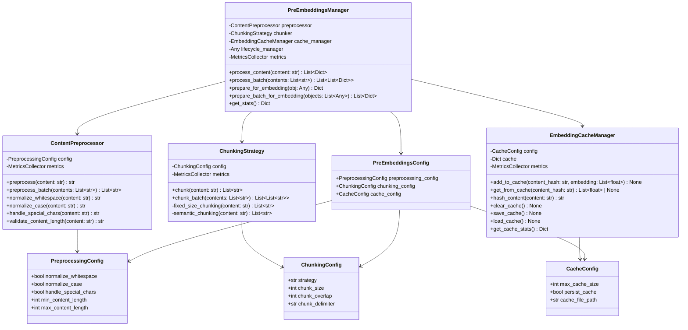

# Pre-Embeddings System

The Pre-embeddings system is a critical component of the RAG pipeline in "The Fall of Babylon" project. It optimizes content before it enters the embedding generation process, improving embedding quality while reducing API costs.

## Class Diagram



## Testing Strategy

### Unit Testing Approach

The Pre-embeddings system follows a Test-Driven Development (TDD) approach with comprehensive test coverage:

1. **Basic Functionality Tests**
   - Test core functionality of each component
   - Verify expected outputs for standard inputs
   - Ensure configuration options work as expected

2. **Edge Case Testing**
   - Empty/null content handling
   - Extremely long content handling
   - Special character handling
   - Boundary conditions (e.g., chunk size limits)
   - Cache collisions and eviction

3. **Integration Tests**
   - Component interaction tests
   - LifecycleManager integration
   - EmbeddingManager integration
   - End-to-end pipeline tests

4. **Performance Tests**
   - Processing time for large content
   - Memory usage under load
   - Cache hit/miss performance
   - Batch processing efficiency

### Test Implementation Details

#### ContentPreprocessor Tests
- Test whitespace normalization
- Test case normalization
- Test special character handling
- Test content length validation
- Test batch processing
- Test metrics collection

#### ChunkingStrategy Tests
- Test fixed-size chunking
- Test chunking with overlap
- Test empty content handling
- Test content smaller than chunk size
- Test semantic chunking
- Test batch chunking
- Test metrics collection

#### EmbeddingCacheManager Tests
- Test cache hits and misses
- Test cache eviction
- Test cache updates
- Test cache clearing
- Test content hashing
- Test metrics collection
- Test cache persistence

#### PreEmbeddingsManager Tests
- Test initialization with default and custom components
- Test content processing
- Test cache integration
- Test batch processing
- Test error handling
- Test metrics collection
- Test lifecycle manager integration

## Integration Interfaces

### LifecycleManager to PreEmbeddingsManager Interface

The PreEmbeddingsManager integrates with the LifecycleManager to retrieve objects and track their state:

```python
# Interface between LifecycleManager and PreEmbeddingsManager
class LifecycleManager:
    def get_object(self, object_id: str) -> Any:
        """Retrieve an object by its ID.
        
        Args:
            object_id: Unique identifier for the object
            
        Returns:
            The object with the specified ID
            
        Raises:
            ObjectNotFoundError: If the object is not found
        """
        pass
    
    def update_object_state(self, object_id: str, state: str) -> None:
        """Update the state of an object.
        
        Args:
            object_id: Unique identifier for the object
            state: New state for the object
            
        Raises:
            ObjectNotFoundError: If the object is not found
            InvalidStateError: If the state is invalid
        """
        pass

# Usage in PreEmbeddingsManager
def prepare_for_embedding(self, obj: Any) -> Dict[str, Any]:
    """Prepare an object for embedding by processing its content.
    
    Args:
        obj: Object with content to prepare for embedding
        
    Returns:
        Dictionary with processed content and metadata
    """
    if self.lifecycle_manager and hasattr(obj, "id"):
        try:
            # Retrieve the latest version of the object
            obj = self.lifecycle_manager.get_object(obj.id)
            
            # Process the object's content
            processed_chunks = self.process_content(obj.content)
            
            # Update the object's state
            self.lifecycle_manager.update_object_state(obj.id, "PREPROCESSED")
            
            return {
                "object_id": obj.id,
                "chunks": processed_chunks,
                "chunk_count": len(processed_chunks),
            }
        except Exception as e:
            # Handle errors
            self.metrics.record_metric(
                name="lifecycle_manager_error",
                value=1,
                context=f"error={str(e)[:100]}"
            )
            raise
```

### PreEmbeddingsManager to EmbeddingManager Interface

The PreEmbeddingsManager prepares content for the EmbeddingManager:

```python
# Interface between PreEmbeddingsManager and EmbeddingManager
class EmbeddingManager:
    def create_embedding(self, content: str) -> List[float]:
        """Create an embedding for the given content.
        
        Args:
            content: Content to embed
            
        Returns:
            Vector embedding for the content
            
        Raises:
            EmbeddingError: If embedding creation fails
        """
        pass
    
    def create_embeddings_batch(self, contents: List[str]) -> List[List[float]]:
        """Create embeddings for multiple content items.
        
        Args:
            contents: List of content items to embed
            
        Returns:
            List of vector embeddings
            
        Raises:
            EmbeddingError: If batch embedding creation fails
        """
        pass

# Usage with PreEmbeddingsManager
def embed_preprocessed_content(pre_embeddings_manager: PreEmbeddingsManager, 
                              embedding_manager: EmbeddingManager,
                              content: str) -> Dict[str, Any]:
    """Process content and create embeddings.
    
    Args:
        pre_embeddings_manager: PreEmbeddingsManager instance
        embedding_manager: EmbeddingManager instance
        content: Raw content to process and embed
        
    Returns:
        Dictionary with processed chunks and their embeddings
    """
    # Process the content
    processed_chunks = pre_embeddings_manager.process_content(content)
    
    # Create embeddings for chunks that don't have cached embeddings
    for chunk in processed_chunks:
        if "embedding" not in chunk:
            try:
                # Create embedding for the chunk
                embedding = embedding_manager.create_embedding(chunk["content"])
                
                # Add the embedding to the chunk
                chunk["embedding"] = embedding
                
                # Cache the embedding for future use
                pre_embeddings_manager.cache_manager.add_to_cache(
                    chunk["content_hash"], embedding
                )
            except Exception as e:
                # Handle errors
                chunk["embedding_error"] = str(e)
    
    return {
        "chunks": processed_chunks,
        "chunk_count": len(processed_chunks),
        "cached_count": sum(1 for chunk in processed_chunks if chunk.get("from_cache", False)),
    }
```

## Key Metrics

The Pre-embeddings system collects various metrics to monitor performance, optimize resource usage, and track costs:

### Processing Time Metrics

| Metric Name | Description | Context |
|-------------|-------------|---------|
| `pre_embeddings_processing_time` | Time to process a single content item | `content_length={length},chunks={count}` |
| `pre_embeddings_batch_time` | Time to process a batch of content items | `batch_size={size},total_chunks={count}` |
| `preprocessing_time` | Time spent in the preprocessing stage | `content_length={length}` |
| `chunking_time` | Time spent in the chunking stage | `content_length={length},strategy={strategy}` |
| `cache_lookup_time` | Time spent looking up embeddings in the cache | `cache_hit={true/false}` |

### Throughput Metrics

| Metric Name | Description | Context |
|-------------|-------------|---------|
| `chunks_per_second` | Number of chunks processed per second | `batch_size={size}` |
| `content_items_per_second` | Number of content items processed per second | `batch_size={size}` |
| `cache_hits_per_second` | Number of cache hits per second | `batch_size={size}` |
| `cache_misses_per_second` | Number of cache misses per second | `batch_size={size}` |

### Resource Usage Metrics

| Metric Name | Description | Context |
|-------------|-------------|---------|
| `cache_size` | Current size of the embedding cache | `max_size={size}` |
| `cache_memory_usage` | Memory used by the embedding cache | `bytes={bytes}` |
| `chunk_count` | Number of chunks generated | `content_length={length}` |
| `average_chunk_size` | Average size of generated chunks | `strategy={strategy}` |

### Cost Optimization Metrics

| Metric Name | Description | Context |
|-------------|-------------|---------|
| `cache_hit_ratio` | Ratio of cache hits to total lookups | `period={time_period}` |
| `embedding_api_calls_saved` | Number of API calls saved due to caching | `period={time_period}` |
| `estimated_cost_savings` | Estimated cost savings from caching | `period={time_period},rate={api_rate}` |
| `duplicate_content_ratio` | Ratio of duplicate content detected | `period={time_period}` |

### Optimization Strategies

Based on the collected metrics, the following optimization strategies can be implemented:

1. **Dynamic Chunk Size Adjustment**
   - Adjust chunk size based on embedding quality and processing time
   - Increase chunk size when processing time is low
   - Decrease chunk size when embedding quality is poor

2. **Adaptive Caching**
   - Increase cache size when hit ratio is high
   - Implement tiered caching for frequently accessed embeddings
   - Use persistent caching for stable content

3. **Batch Size Optimization**
   - Adjust batch size based on throughput metrics
   - Use larger batches for similar content types
   - Use smaller batches for diverse content

4. **Content Deduplication**
   - Identify and remove duplicate content before processing
   - Implement fuzzy matching for near-duplicate detection
   - Track content similarity to optimize chunking

5. **Resource Allocation**
   - Allocate more resources to preprocessing during peak loads
   - Implement backpressure mechanisms to prevent overload
   - Scale cache size based on available memory

## Implementation Roadmap

The Pre-embeddings system was implemented following this roadmap:

### Phase 1: Core Components

1. **ContentPreprocessor**
   - Basic text normalization (whitespace, case)
   - Special character handling
   - Content length validation
   - Batch processing support
   - Metrics collection integration

2. **ChunkingStrategy**
   - Fixed-size chunking implementation
   - Chunking with overlap support
   - Semantic chunking foundation
   - Batch chunking capabilities
   - Metrics collection integration

3. **EmbeddingCacheManager**
   - LRU cache implementation
   - Content hashing functionality
   - Cache persistence support
   - Cache statistics tracking
   - Metrics collection integration

4. **PreEmbeddingsManager**
   - Component integration
   - Error handling with specific error codes
   - Lifecycle manager integration
   - Batch processing support
   - Comprehensive metrics collection

### Phase 2: Integration and Optimization

1. **System Integration**
   - Integration with Object Lifecycle Management
   - Integration with Embedding Manager
   - End-to-end pipeline testing
   - Performance benchmarking

2. **Performance Optimization**
   - Cache tuning for optimal hit ratio
   - Chunking strategy optimization
   - Batch processing optimization
   - Memory usage optimization

3. **Advanced Features**
   - Semantic chunking enhancements
   - Content filtering implementation
   - Content enhancement capabilities
   - Adaptive preprocessing based on content type

### Phase 3: Monitoring and Maintenance

1. **Metrics Dashboard**
   - Real-time metrics visualization
   - Performance trend analysis
   - Cost optimization tracking
   - Anomaly detection

2. **Documentation and Standards**
   - Comprehensive API documentation
   - Integration guides
   - Performance tuning guidelines
   - Error handling standards

3. **Continuous Improvement**
   - Regular performance reviews
   - Feature enhancement based on usage patterns
   - Integration with new embedding models
   - Adaptation to changing content types
