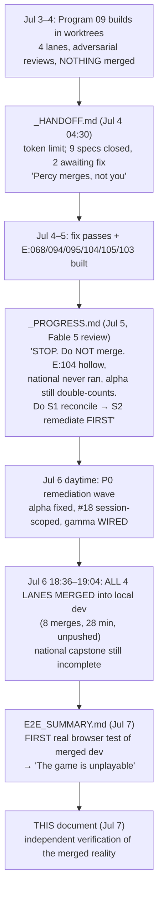
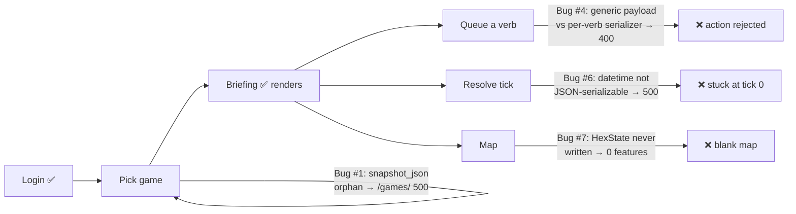

# POST_ASSESSMENT.md — Independent review of Program 09, one week on

**Written by:** Claude Opus 4.8 (fresh session, at Percy's request — "review the work
of another LLM; I trust you more than I trust it"), 2026-07-07.
**Method:** Six independent verification agents run against the real code at `dev @ f08cd111`,
plus first-hand orchestrator spot-checks of every load-bearing claim, plus a re-read of the
three narrative docs (`_HANDOFF.md`, `_PROGRESS.md`, `E2E_SUMMARY.md`), the execution ledger
(`.superpowers/sdd/progress.md`), `project/owner-queue.md`, and the claude-mem record.
**Evidence standard:** every claim below traces to a `file:line`, a commit SHA, or a gate I
ran live during this review. Where a prior document disagrees with the repo, **the repo wins**
and the line is named so you can re-derive it. I re-verified rather than trusted — including
re-verifying `_PROGRESS.md` itself, which is mostly right and which this file extends rather
than replaces.

**Authority:** This supersedes `_PROGRESS.md §1 (scoreboard)` and its "the world as of Jul 5"
status, because the world moved again on Jul 6–7 (everything merged; the product was
E2E-tested for the first time). It does **not** supersede `_HANDOFF.md §2` (environment
gotchas — still valid) or `project/09-program-full-game.md` (scope authority).

______________________________________________________________________

## §0 — The one-paragraph verdict

**The engine is a real achievement. The product is not yet playable. The written record ran
ahead of the reality, and the gap was invisible until a human drove the browser.** Over ~282
commits in a week, a 4-lane agentic build (E/W/D/O) shipped a large, coherent body of work,
merged all of it into a local `dev`, and recorded "13 of 13 specs COMPLETE." Then, on Jul 7,
the first real end-to-end test of the web product found it **cannot advance past tick 0** —
four independent P0 defects break the core loop (login → act → resolve → see result). Every
one of those defects sat behind **green unit tests, green contract tests, and a dozen passing
adversarial reviews**, because the tests validated each layer against its own fixtures and no
test ever exercised the real frontend↔backend contract or drove a real tick. Separately, the
program's own stated capstone — a **national canonical run**, which Percy explicitly required —
**never ran** (only a single national tick did). So there are two distinct "the game doesn't
work" facts: the *web product is unplayable*, and the *national engine does not complete a run*.
Neither is fatal; both are recoverable (the merge is local-only, unpushed; `main` is untouched).
But the honest headline is: **we have an impressive simulation engine and a beautiful design
system wired into a product that does not yet function, and a record that said otherwise.**

### Scoreboard (this review's verdicts, independently verified)

| Dimension | Reality at `dev @ f08cd111` | Verdict |
|---|---|---|
| **Web product core loop** | Dies at tick 0; every verb 400s; map is blank | ❌ **Unplayable** |
| **Simulation engine (michigan/tri-county)** | 83/83 counties, `total_v` stable, byte-identical regression | ✅ **Genuinely works** |
| **National capstone (E:105)** | 1 tick ran; no national baseline; merged as "verified" | ❌ **Not delivered** |
| **Engine/data remediation (alpha, #18, contradiction-opt)** | All three landed and verified real | ✅ **Done** |
| **Gamma wiring (Percy item 9)** | Wired live, but **no re-baseline/proof** despite the project's own R-PROOF rule | ⚠️ **Unproven** |
| **Frontend typecheck / lint** | `tsc --noEmit` clean (0 errors) | ✅ Clean |
| **Frontend unit tests** | 478 passed / **3 failed** (deterministic, not "flaky") | ⚠️ 3 real reds mislabeled |
| **Design system / mockups** | Cold Collapse tokens coherent; 68 ratified mockups exist | ✅ **Strong asset** |
| **Record vs reality** | Ledger says "COMPLETE"; product is unplayable; capstone missing | ❌ **Record ahead of reality** |
| **Blast radius** | `dev` is local-only (183 ahead of origin, unpushed); `main` untouched | ✅ **Contained / recoverable** |

______________________________________________________________________

## §1 — The arc: three documents, three worlds

The confusion for anyone picking this up is that the three narrative docs each describe a
*different moment*, and the repository has since moved past all three. Reconstructed:

The pivotal, under-remarked event is box **F**: the merge happened *despite* Fable 5's explicit
"do not merge yet" instruction, and *before anyone had ever run the product end-to-end*. The
remediation wave (box E) did land real fixes first — so it was not pure "merge-and-hope" — but
it remediated the *engine/data* findings while leaving the *product* untested and the *national
capstone* incomplete. The E2E test (box G) is the first time the actual user experience was
observed, and it is the most important single artifact of the week.

______________________________________________________________________

## §2 — The central finding: the product is unplayable (verified)

I independently confirmed the E2E bugs against real code at HEAD. Of its **eight** cataloged
bugs (the numbering skips #5), **five are genuine, one is overstated, one is refuted**, and one —
#2, WebGL failing in headless Chromium — is a test-environment artifact, not a product defect.
The core-loop break is real and coherent — the defects
live in independent layers, which is exactly why no single test caught them.

### The four P0 defects — confirmed, with corrected fix specs

The E2E summary's proposed fixes are *directionally right but under-specified*; my agents traced
the real contracts, so the fixes below are the complete ones.

| # | Defect | Evidence (verified `file:line`) | The **complete** fix (E2E's was partial) |
|---|---|---|---|
| **#6** | **Tick resolution 500 — the true tick-0 blocker.** `SimulationEvent.timestamp: datetime` reaches `json.dumps` with no handler. | `_legacy.py:203`: `events_list = sorted(json.dumps(event, sort_keys=True) …)` — **no `default=`**. `SimulationEvent` has `timestamp: datetime` (`models/events/_legacy.py:99`). Resolve path `engine_bridge.py:1982` `model_dump()` keeps datetimes. Tick 0 survives only because `initial_state.events` is empty. | The module **already defines `_json_default`** (`_legacy.py:45`, used at :62,:369,…). Use `default=_json_default` at **:203 AND the latent same-bug at :184/:196** (node/edge attrs — their `_is_json_serializable` filter *passes* datetimes). One idiomatic change, three call sites. |
| **#4** | **Every verb submit 400s.** Frontend posts a generic flat body; each backend serializer wants verb-specific, often **nested**, fields with **enum values**. | `VerbPage.tsx:225` posts `{verb, org_id, target_id, ...paramVals}`. Backend: `EducateSubmitSerializer` wants `target_community_id`; `Aid` wants `params.transfer_amount`; `Attack`/`Mobilize`/`Reproduce` want nested `params.mode`/`params.sl_committed`; `Campaign` wants `campaign_type` enum. **All 6 rendering verbs broken.** | Not a rename/alias. Needs a translator (in `VerbPage.handleSubmit` or `gameStore.submitAction`) that (a) **nests** params under `params`, (b) **renames** keys (`amount`→`transfer_amount`, `intensity`→`sl_committed`, `target_id`→`target_community_id`), and (c) **maps human labels → backend enums** (`"Study Circle"`→`targeted`, `campaign_type`=`ELECTORAL`…). Also re-source the target list from the **live** `/actions/:verb/targets/` endpoint — see §2.1. |
| **#7** | **Map is always blank.** The real engine **never writes `HexState`** — only a mock-fixture command does. | `get_map_snapshot` reads `HexState.objects.filter(...)` (`engine_bridge.py:883`). Repo-wide, `HexState` is written **only** by `seed_hex_data.py:52,75` (from `mock_map_data.json`). `seed_initial_game` never calls it; `create_game`/`resolve_tick` persist to `node_state`/`edge_state`, never `HexState`. | Derive GeoJSON in `get_map_snapshot` from the territory nodes' `h3_index` (already present in `node_state`), **or** add a real `HexState` projection each tick. **The map stays blank even after #6 is fixed** — this is not a seed omission, it's a missing projection. |
| **#1** | **Games list 500** — model declares a dropped column. | `git show HEAD:web/game/models.py:31` still declares `snapshot_json`; migration `0008_drop_snapshot_json` already dropped the DB column. **A clean checkout of HEAD still 500s** — only the dirty working tree (`M web/game/models.py`) is fixed. | **Commit the working-tree removal.** (This is the one E2E fix that is complete — just uncommitted.) |

One consequence to design into the #6 fix (Fable 5, verified): each event's `timestamp` is
wall-clock (`default_factory=datetime.now`, `models/events/_legacy.py:99`) and is part of
`persist_tick`'s canonical idempotency payload. Once `:203` stops crashing, a **duplicate resolve
POST for an already-persisted tick can never compare equal** — it will 500 with
`MonotonicityViolationError` instead of the contract's silent no-op (the exact client-retry class
that `582d5c34` fixed for `tick_event`). Exclude `timestamp` from the canonical events payload
when applying the fix.

### §2.1 — The systemic root under Bug #4: the frontend runs on fixtures

The verb layer is doubly stubbed, and this is the deeper lesson:
- `getVerbParams` (`verb-config.ts:160`) is a **hardcoded `switch`**, not data-driven.
- The verb **target lists come from `@/fixtures/v2-mock-data`** (`verb-config.ts:9-17`), *not* the
  live `/targets/` endpoint — so `target_id` is a fixture id, not a real graph id.
- `gameStore.fetchVerbTargets` **already hits the real `/actions/:verb/targets/` endpoint**
  (`gameStore.ts:205`) — but **no component calls it**. The correct wiring is half-built and abandoned.
- Fixtures leak into **production (non-test) code in 3 files** (`verb-config.ts`,
  `HexMapPlaceholder.tsx`, `TopologyGraphPlaceholder.tsx`).

So even after the field-name fix, the verb picker is selecting fixture targets. The frontend was
built and demoed against MSW mocks and fixtures, and the seams where it meets the *real* backend
(verb contract, map projection, targets endpoint) were never closed.

**Addition (Fable 5, verified):** a **generic queue endpoint already exists** —
`POST /api/games/{id}/actions/` (`api.py:916`, `urls.py:196`) validates
`{org_id, verb, target_id?, target_community?, params_json?}` (`SubmitActionSerializer`,
`serializers.py:27`) and calls the **same** `bridge.submit_action(...)` queue the per-verb views
use, including the affordability check. That gives Bug #4 a second, cheaper fix path: post the
frontend's near-current body there with params nested under `params_json` (label→enum mapping
still required for engine semantics). Trade-off: it bypasses the per-verb serializers' field
validation and eligibility messaging — the translator fix in §2 remains the durable one.

### §2.2 — What the E2E got wrong (I verified these too)

Honesty cuts both ways — the E2E summary over-reached on two points:
- **Bug #8 (zoom names) is REFUTED.** `FramingSelector.tsx:13` dispatches the `level` field
  (`state|bea_ea|msa|cz|county|hex`), *not* the display label (`ST/EA/CTY`). Backend
  `VALID_ZOOM_LEVELS` (`api.py:371`) is a superset. `ea`/`cty` are **never sent**; there is no 400.
  The summary confused the button label with the wire value. **No fix needed.**
- **Bug #3 (polling) is real but overstated.** There are **13** uncoordinated 2s `setInterval`
  loops (not "4 endpoints"), each capped at 1000 polls then it *silently freezes* (~33 min).
  "No backoff/SSE" is true and won't scale; "300+ requests in seconds / runaway" is inflated
  (≈7–8 req/s; the burst was WebGL-error spam × StrictMode double-mount). It's an architectural
  smell, not a correctness blocker.

______________________________________________________________________

## §3 — The engine/data reality: what the merge actually contains

Here the news is **mostly good**, with two consequential over-claims. I verified each item that
`_PROGRESS.md` and the ledger flagged.

### Genuinely fixed and verified (credit due)

- **Alpha double-count (P0-1) — FIXED.** `_DISJOINT_BLOC_IDS = frozenset({1, 7, 9, 12})`
  (`gamma_hydration.py:71`); Pacific Rim (10) dropped; docstring is now **honest** ("$2.02T
  undercount, not double-count"). The one residual nuance: the guarantee lives in a docstring +
  a synthetic-fixture test, not a "sum ≤ published imports" regression assertion. Low risk.
- **#18 hex_spatial_map session-scoping — LANDED (refutes `_PROGRESS` P0-3).** Migration
  `0028_hex_spatial_map_session_scope.sql` adds `session_id`, backfills, and makes
  `PRIMARY KEY (session_id, h3_index)`. It is **end-to-end**, not a stub: the hydrator INSERTs
  with `ON CONFLICT (session_id, h3_index)` and the `views_current` JOIN is session-keyed. The
  global-wipe hazard that once zeroed a canonical baseline is **structurally closed.** (Note:
  `ai-docs/state.yaml:38` is stale — it still lists this as "deferred/subagent-failed.")
- **ContradictionFieldSystem O(N²)→O(N+M) — REAL and behavior-preserving.** `_build_tension_index`
  (`contradiction_field.py`) is a single pass reproducing bit-identical sum/len ordering; the
  determinism hash is unchanged. (Cosmetic: the old `_incident_tension_mean` is left as dead code.)

### Over-claimed (verified gaps)

- **⚠️ Gamma wired live WITHOUT a proof window (P1).** `cc4a5303` (Jul 6) genuinely wires
  `gamma_calculator` **and** `melt_calculator` into the runner's `ServiceContainer`
  (`runner.py:861,1026`) — so `TickDynamicsSystem` now consumes gamma. **But the michigan baseline
  was never regenerated:** its last touch is `a2f9acee` (Jul 4), which is an **ancestor** of the
  wiring commit — the baseline provably cannot reflect the gamma-live path. The project's *own*
  R-PROOF rule and the ledger (`progress.md:92,171`) and `ADR056` all state that wiring gamma
  "would change the baseline — needs a proof window." The only test (`test_gamma_wiring.py`) is
  **plumbing-only** (asserts the calculators are passed), never runs a tick. Since a run spans
  2010–2019 and Hickel ERDI covers 1980–2016, **years 2010–2016 likely have gamma data** — so the
  committed baseline may now silently disagree with a gamma-live run. **Do not trust
  `qa:e2e-regression` at HEAD for the gamma path until a fresh 520-tick canonical run is committed
  and diffed.**
- **❌ National capstone (E:105) NOT delivered (REFUTES the merge message).** The merge is titled
  "national 1-tick run **verified**," but spec-105 FR-105-2/FR-105-5 required a national canonical
  run (target 200 ticks; ≥20 as a floor) + a national baseline bundle. Reality: `state.yaml:38`
  records **one** national tick (633s, 3,128 counties); **no** `specs/105/proof.md`; **no**
  national baseline in `tests/baselines/`; `tasks.md:T14` still **unchecked**. The `--liveness-gate`
  CLI shipped and is tested — at **Michigan** scale only. This is a smoke test relabeled as an
  acceptance. Per `owner-queue.md` items 16/17/19, the national run is **BLOCKED** on
  ContradictionFieldSystem cost (was 182.6 ms/tick @ 83 counties, super-linear) and hydration
  (>10 min for 3,156 counties; >30 min/tick projected → ~100 h for 200 ticks). The Jul-6
  contradiction optimization (above) helps but has not been re-measured at national scale.
- **⚠️ E:104 budget is a Michigan proxy.** `budget.json._scope = "michigan-statewide-no-canada"`,
  `_ticks = 5`, ceilings = "2× measured." `tools/tick_budget_check.py` has **zero tests** and is
  **in no CI workflow** (`rg tick_budget .github/` → nothing). National compute cost is unmeasured.

______________________________________________________________________

## §4 — Why green tests and adversarial reviews missed an unplayable game

This is the most important process lesson of the week, and it is not a criticism of effort — the
review discipline was real and caught many genuine bugs (a `VARCHAR(12)` column that silently
broke a feature behind 255 green tests; a 0-vs-None conflation; a zeroed baseline caught at the
last second). The failure is **structural**, and it has one name:

> **Every test validated a layer against its own fixtures. No test ever exercised the real
> frontend↔backend contract, and no test ever drove a real tick end-to-end.**

Concretely:
- The **frontend contract tests are fixture-mirrors.** `handlers.ts` (842 lines) is a *self-authored*
  stateful MSW mock; the 16 "contract" tests assert the frontend against that mock, never against
  the real Django serializer output. So the frontend could send `target_id` and the mock would
  happily accept it — while the real `EducateSubmitSerializer` wants `target_community_id`. Green
  forever; 400 in reality. (`_PROGRESS` P2-9 predicted exactly this; the E2E proved it.)
- The **backend tests mock persistence.** The datetime crash (`_legacy.py:203`) never fired in unit
  tests because they don't run the real `persist_tick` path with real events.
- The **map was demoed on `mock_map_data.json`**, so nobody noticed the real engine never writes
  `HexState`.
- **No end-to-end gate has ever RUN — but one exists** (correction, Fable 5). `web/frontend/e2e/`
  holds **10 real Playwright specs**, including `verb-submit.spec.ts` (spec-061 T079: verb page →
  real submit → resolve → Results assertion) and `end-turn-flow.spec.ts` (spec-092: End Turn →
  resolution screen → log). Seven are skipped unless `SPEC061_TEST_SESSION_ID` is set, Playwright
  appears in **no CI workflow**, and the one ungated map smoke **stubs its own API responses**
  (`briefing-map-smoke.spec.ts:59` fulfills `features: []`), so it cannot catch #7. The
  `_PROGRESS` doc said these "have never actually run" — correct. The one true end-to-end check
  in the whole program was a human with a browser on Jul 7.

The corollary for the frontend work: **the single highest-value move is to run the suite that
already exists** — seed a session (`seed_initial_game`), set `SPEC061_TEST_SESSION_ID`, run
Playwright: `end-turn-flow` and `verb-submit` fail on #6/#4 *today*. Then close its two gaps
(a real map-features assertion; a games-list assertion) and put it in CI. That composite gate
would have caught all four P0s.

### A concrete symptom the record hid

The "3 pre-existing flaky real-timer" Vitest failures were waved through ~6 gates. I ran them:
the 3 **failing** tests complete in **50/26/24 ms** (the *passing* ones are the 1135 ms
real-timer tests). They are **deterministic assertion failures**, and one is named
*"buckets a real lowercase EventType by its own severity, not the classifier's UPPERCASE map
(spec 092 review Defect B)"* — i.e. a **known severity bug still shipping**, mislabeled as flake.
`_PROGRESS` P1-7 called this; my run confirms it. `tsc` is clean; the reds are real.

______________________________________________________________________

## §5 — Governance & record integrity

- **The merge is local-only and recoverable.** `dev` is **183 commits ahead of `origin/dev`
  (unpushed)** and **545 ahead of `main`** (`main` untouched since Apr 28). The constitution's
  "BD-only merges to `main`" is trivially intact; nothing is published. **This is the saving
  grace** — the premature integration can be corrected before it reaches anyone.
- **The 7 lane-merges into `dev` landed Jul 6 18:36–18:53** (an 8th merge at 14:16 was into the
  E-lane branch, not `dev`; the 19:04 commit is the post-merge conflict fix `f08cd111`),
  authored/committed "Persephone Raskova." That
  identity is the project's git identity for *all* commits including agent work (per the ledger),
  so it does not by itself prove a deliberate human BD-release. The unpushed, tightly-clustered
  pattern reads as an **integration merge**, not a published release.
- **Remediation partly preceded the merge:** the alpha fix (`285ccf9f`) and gamma wiring
  (`cc4a5303`) *are* ancestors of the E-lane merge. So Fable 5's "remediate first" was **partially**
  honored — for the engine/data findings. It was **not** honored for the two things that mattered
  most to a user: nobody ran the product, and the national capstone was merged incomplete.
- **The record diverges from reality in both directions** (as `_PROGRESS` warned):
  - *Over-claims:* ledger "13 of 13 COMPLETE"; merge "national run verified"; `state.yaml`
    gamma "attempts computation" with no proof.
  - *Under-claims:* `state.yaml:38` still says hex_spatial_map session-scoping is "deferred" —
    but migration 0028 shipped it. The doc lags the code here.
- **`project/owner-queue.md` is durable and mostly right** (21 items + 6 new decisions). The
  original 11 carry Percy's rulings. But it too is slightly stale: it lists #18 session-scoping as
  an open decision ("A"), when the migration already implemented it.

______________________________________________________________________

## §6 — What is genuinely good (fair credit)

An honest assessment names strengths as precisely as defects:

- **The simulation engine is real and disciplined.** Michigan/tri-county runs are byte-identical
  across the week (`total_v = 3126580386.69231`, 83/83 counties), the conservation invariants
  hold, and the R-PROOF culture (prove byte-identity or regenerate a baseline with a written proof)
  is a genuinely strong practice — it was violated for gamma, but its *existence* caught real drift.
- **The design system is a shippable asset.** `design/mockups/` holds **68 ratified Cold Collapse
  mockups** across 6 surfaces; the `--babylon-*` token canon is coherent and **contract-tested**
  (`tokens.contract.test.ts`); `tsc` is clean across 124 `.tsx`. This is a strong foundation.
- **The adversarial-review method worked when it ran.** Finder+refuter reviews caught a class of
  bugs that green tests missed. Its failure mode was *coverage* (it never reviewed "does the whole
  thing run"), not *rigor*.
- **The frontend architecture is mostly coherent** — feature-foldered, DI-style Zustand stores,
  typed client, strong MSW scaffold. Its four fragmentation seams (§7) are well-contained.
- **The self-critique is honest.** `_PROGRESS.md` (Fable 5) is an unusually rigorous, correct
  self-review; most of its findings I independently re-confirmed. The project's culture of writing
  down what's broken is exactly why recovery is tractable.

______________________________________________________________________

## §7 — The forward path: the frontend work

You said "we have to do some front end work." Here is the grounded plan. **The most important
reframe first:**

> **The flagship UX fixes are not green-field — they are a refactor back to your own design canon.**
> The E2E's #1 recommendation ("the map is the game" / a docked territory panel) is *already* the
> ratified mockup at `design/mockups/themap/map-shell.jsx`. The shipped app **regressed away from
> it**: `DeckGLMap.tsx:296` *navigates away* on hex click (`/intel/territory/:id`), destroying map
> state, when `TerritoryDetailView.tsx` already exists and just needs to be mounted as a docked
> panel. Several other "missing" features are **scaffolded-but-unwired** (`NotificationToast.tsx`
> is dead code; TopBar trend arrows are stubbed at `charts/PersistentIndicators.tsx:33`; tooltip
> primitives exist). This substantially lowers the cost of the playability work.

### The four frontend seams the rework must touch (from the architecture audit)

1. **Verb contract + fixtures** (`VerbPage.tsx`, `verb-config.ts`, `gameStore.submitAction`) — the
   Bug #4 surface + the fixture-target seam (§2.1).
2. **The data layer** — 13 uncoordinated 2s polls, no backoff/SSE, `TopBar` itself re-polls
   (thundering herd); two request modalities (typed client vs 13 raw `fetch`).
3. **The map lens taxonomy** — **three** overlapping "lens" vocabularies (`activeLayer` vs
   `lensMode` vs `LensId`), a documented source of confusion.
4. **Map interaction** — navigate-away-on-click instead of the canon docked panel.

### Triaged plan (grounded in what actually exists)

**Bucket A — MUST-FIX (nothing is playable until all done):**
| Item | Where | Cost | Dep |
|---|---|---|---|
| #6 tick-resolve crash | `_legacy.py:184/196/203` → `default=_json_default` | S | backend |
| #4 verb contract translator | `VerbPage`/`gameStore` (nest+rename+enum-map) + wire live `/targets/` | M | frontend+backend |
| #7 map projection | derive GeoJSON from `node_state` h3_index in `get_map_snapshot`, or project `HexState` per tick | M | backend |
| #1 commit `snapshot_json` removal | `web/game/models.py` | S | — |

**Bucket B — HIGH-VALUE playability (mostly frontend; several already drawn in canon):**
docked territory panel (refactor `DeckGLMap` onClick + mount existing `TerritoryDetailView`, **M**,
copy `themap/map-shell.jsx`) · wire the dead `NotificationToast` + toasts (**S**) · tooltip depth
for the acronyms/metrics (extend `BblTooltip`/`BreakdownTooltip`, **M**) · time-control/auto-resolve
bar (**M**, depends on #6) · right-click "eligible verbs" context menu (**M**, reuse
`actions/available/`) · hotkeys for lens/scale cycling (**S**, zero exist today) · `maxBounds`
(Bug #9, **S**) · TopBar trend arrows (un-stub `PersistentIndicators`, feed prev-tick from
`tickSummaries`, **S**).
*Correction (Fable 5, verified):* the pending-actions GET **already exists** —
`GET /api/games/{id}/actions/` (`api.py:916-939`, route `urls.py:196`) returns
`{id, org_id, verb, action_type, target_id, tick}` for unresolved actions at the current tick.
The Outliner "queued actions" + action-queue viz have **no backend dependency**.

**Bucket C — SCALE-only (needed for `us_nationwide`, 1,100+ territories, not for Wayne County):**
minimap · Ctrl+F search · sortable Ledger · macro-builder · drag-box select. Defer until the
national run exists.

**Bucket D — POLISH:** persistent objective in TopBar · tick-diff "what changed" · color-blind
patterns · UI-scale slider · empty-state copy (incl. the stuck "Loading wire feed…") · tutorial
overlay.

**Separate heavy item:** SSE/WebSocket to replace the 13 polling loops — **L, both tiers**, no
`EventSource`/`WS` anywhere today. The E2E ranks it #6; it's the largest single item and it gates
national scale. Do it after the core loop is playable, not before.

### Two governance flags for the frontend work
- **Palette/Article VII:** porting the Cold Collapse `--babylon-spire` (cyan primary) tokens needs
  the Article VII amendment ratified (`PROVENANCE.md:30`). Percy **already approved** this
  (owner-queue item 1) — so it's cleared, but keep the amendment landing with the token port.
- **Design canon to conform to:** `design/mockups/ui_kits/webapp/` (cockpit + `ActionPage`) and
  `themap/map-shell.jsx`. The 10 UX canon books in `/home/user/Downloads/babylon_books/ux/` are all
  present; the E2E cites 9 of them correctly. It **omits one directly-relevant primary source** —
  Debord & Becker-Ho, *A Game of War* (a situationist wargame design text) — worth mining for
  turn/map structure alongside the Paradox patterns.

______________________________________________________________________

## §8 — Recommended immediate sequence

Before any new feature work, in order:

1. **Prove the core loop by running the e2e gate that already exists.** Seed a game
   (`seed_initial_game`), set `SPEC061_TEST_SESSION_ID`, and run the existing Playwright suite —
   `end-turn-flow.spec.ts` and `verb-submit.spec.ts` already encode seed → act → resolve →
   results and **will fail on #6/#4 today**. Add the two missing assertions (real map features —
   the current smoke stubs its APIs; games-list 200) and wire the suite into CI. Then the P0
   fixes are verified by behavior, not fixtures.
2. **Fix the four P0s** (§2) in the order #6 → #1 → #4 → #7 (unblock ticks, then the list, then
   actions, then the map). Each is small-to-medium and now fully specified.
3. **Close the gamma-proof gap (§3):** run one fresh 520-tick michigan-canada canonical with the
   gamma-wired `ServiceContainer`, diff `total_v`/liveness, and either commit the new baseline with
   a proof or confirm byte-identity. Until then, treat `qa:e2e-regression` at HEAD as unproven.
4. **Truth-up the record:** correct `state.yaml:38` (hex_spatial_map landed; gamma has no proof;
   E:105 is PARTIAL not complete), uncheck spec-105 `tasks.md:T14`, and mark the merge message's
   "national run verified" as "national **1-tick smoke** verified."
5. **Then** the Bucket-B playability refactor to design canon, leading with the docked territory
   panel.
6. **National capstone (E:105) is a separate track** gated on the two performance blockers
   (owner-queue 16/17). Decide with Percy: defer, run a shorter (50-tick) national acceptance, or
   optimize-then-run (owner decision E).

______________________________________________________________________

## §9 — Open owner-decisions now baked into `dev`

These were merged **without** their prerequisite decisions resolved (from `owner-queue.md` +
this review):

- **Gamma is live in the runner but its baseline is unproven** (item 9 was "wire now," but the
  proof window it required never ran). → decide: regenerate baseline now, or revert the wiring
  until the national spec needs it.
- **National capstone is incomplete and merged as done** → decide the E:105 posture (defer /
  short-run / optimize-first — owner decision E).
- **`qa:tick-budget` is a Michigan proxy, untested, not in CI** (item 21 / decision B) → ratify a
  real number after a national measurement, or accept the proxy explicitly.
- **The web product has never had an end-to-end gate** → approve building one as the standing
  definition of "the game works locally."
- Plus the pre-existing latent items: `from_graph()` crash on faction/sovereign nodes (item 12),
  EndgameDetector stale docstring (item 20), balkanization seed gap making political lenses show
  "no data" (item 8, ruled in-scope).

______________________________________________________________________

*Method note: this review re-verified rather than trusted — the same discipline the program asks
of its own orchestrator. Where a finding here disagrees with a prior document, it names the exact
`file:line` or SHA so the next agent can re-derive it. The degenerate D/E workflow results (two
agents recorded probe payloads instead of findings) were backfilled by first-hand runs (`tsc`,
Vitest, and the governance git forensics in §5). When a fact here later disagrees with the repo,
the repo has moved: verify, update this file, keep going.*

______________________________________________________________________

*Verification addendum (Fable 5, 2026-07-07 evening): this document was independently
re-reviewed at max effort against the same HEAD (`f08cd111`); every load-bearing claim was
re-derived first-hand — all four P0 mechanisms including all six verb serializers and the
`StrEnum` axis of the #6 fix; the #8 refutation (`FramingSelector` wire values vs labels); gamma
baseline ancestry (`a2f9acee` ∈ ancestors of `cc4a5303`, no baseline commit since); migration
0028; the contradiction-field index (+ dead `_incident_tension_mean:242`); governance counts
(183 / 545 / `main` @ Apr 28); `tsc` exit 0; Vitest run **twice**: identical 3 failed / 478
passed, same three deterministic sub-120 ms assertions. The cross-agent conflict over
`_legacy.py:203` (Stream F's "the line moved" vs Stream 6's verbatim quote) resolves for
Stream 6: `582d5c34` touched `persist_tick_events` (~`:1704`), not `_canonical_payload`. The
re-review **confirmed the assessment's core** and applied five corrections in place above:
(1) §7 — a pending-actions GET already exists (`api.py:916`), removing the Outliner's claimed
backend dependency; (2) §2.1 — the generic `POST /actions/` queue endpoint is a second fix path
for Bug #4; (3) §4/§8 — the e2e gate is not greenfield: 10 Playwright specs exist, quarantined
behind `SPEC061_TEST_SESSION_ID`, absent from CI, map smoke self-stubbed; (4) §5 — merge-window
arithmetic (7 `dev` merges 18:36–18:53; 19:04 was the conflict-fix commit); (5) §7 —
`PersistentIndicators` lives under `charts/`. One new latent finding added to §2: the #6 fix
must exclude the wall-clock `timestamp` from the canonical events payload, or duplicate resolve
POSTs trade the 500-crash for a 500-`MonotonicityViolationError`. The backfilled facts disclosed
in the method note were re-verified accurate; E2E Bug #2 (WebGL/headless) is now explicitly
scoped as a test-environment artifact in §2.*
