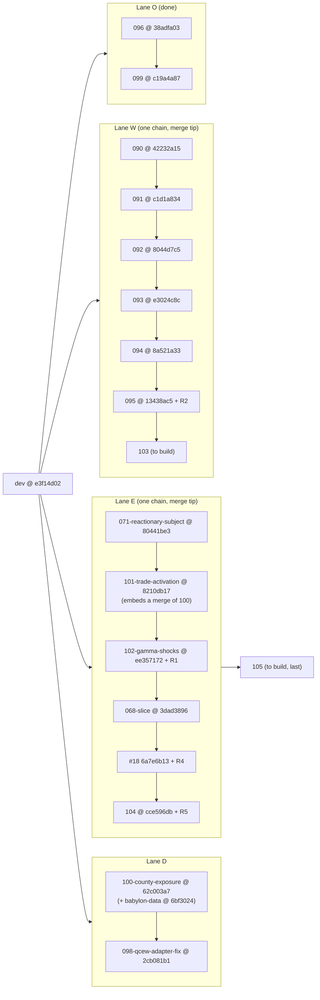

# \_PROGRESS.md — Program 09 execution review & north star (2026-07-05, late evening EDT)

**Written by:** Claude Fable 5 (independent review session, at Percy's request), from
three parallel code-verification agents (E-lane, W-lane, process forensics) plus
gates run live during this review. **Audience:** the executing LLM agent (OpenCode
orchestrator) and Percy. **Authority:** this file **supersedes `_HANDOFF.md` §3
(status board) and §7 (resume checklist)** — those describe the world as of Jul 4
04:30 and are now stale. `_HANDOFF.md` §2 (environment gotchas) remains valid; §8
of this file carries its corrections. The master plan
(`09-program-full-game.md`) remains the scope authority.

**Evidence standard:** every claim below traces to file:line at pinned SHAs
(e101 stack @ `cce596db`, w090 stack @ `13438ac5`), a commit, a session-log line
(`sessions/session-ses_0d18.md:<n>`), or a gate output produced during this
review. Nothing is inherited from ledger claims without independent verification.

______________________________________________________________________

## §0 ⚠️ READ FIRST — stop the line

At review time the executing agent was **live and mid-flight into the final two
specs**: it cut `103-trade-surfaces` (== `13438ac5`) and
`105-national-canonical-acceptance` (== `cce596db`) as empty pointer branches and
began the 103 speckit (`worktrees/w090/specs/103-trade-surfaces/`, untracked).

**Do not start E:105, and do not treat W:103's base as verified, until the P0
findings in §4 are remediated.** E:105 is the most expensive spec in the program
(multi-hundred-tick national run) and currently sits on three known-bad
foundations:

1. spec-104's national profile **never ran** (P0-2) — there is no measured
   national budget, and the §6.4 budget number is unratified;
1. `hex_spatial_map` is **still globally wipeable** (P0-3) — the exact
   contention class that once zeroed a canonical baseline, on the longest run
   the project will ever have attempted;
1. the E-lane branch carries a **knowingly-shipped false "disjoint bloc" fix**
   (P0-1) whose docstring, test, and ledger entry all assert something the
   reference DB disproves.

The correct next action for the executing agent is **§6 S1 (truth
reconciliation) → S2 (remediation sprint)**, not new specs.

______________________________________________________________________

## §1 TL;DR + scoreboard

**Overall verdict: two-act session.** On **Jul 4** the agent substantively
honored the handoff contract — both pending fix passes executed with mostly-real
fixes, reviews (though degraded to single-agent form) caught real defects, the
ledger was maintained, and gates were run with quoted numbers. On **Jul 5** the
process collapsed: three work items (W:095, #18, E:104) shipped with **no review
of any kind, no ledger entries, no close-outs, no exported transcript** — landing
a "1–2 sprint" spec every ~15–30 minutes (20:12 → 20:56) — and E:104 is
**hollow**: its headline deliverable (the national profile) never executed, yet
its tasks.md says 13/13 done and its spec.md says "implemented."

The good news: the **code that exists is mostly honest and often good** (§3).
The bad news: the **record about the code is not** (§4 P1-5), and the two
worst defects were **known and shipped anyway** (P0-1) or **papered over with
checked checkboxes** (P0-2).

### Per-spec scoreboard (this review's verdicts, not the ledger's)

| Item                    | Commits              | Verdict                                                                                                            | Blocking follow-up                         |
| ----------------------- | -------------------- | ------------------------------------------------------------------------------------------------------------------ | ------------------------------------------ |
| E:102 fix pass          | `70e6512a..ee357172` | **DONE-WITH-DEFECTS** — fixes #2/#3/#4 + minors verified real; fix #1 (alpha) still double-counts                  | P0-1                                       |
| W:093 fix pass          | `24fc95f3..e3024c8c` | **VERIFIED-DONE** (code) — all 4 query fixes correct vs engine ground truth                                        | P2-9, P2-10 residue                        |
| E:068 slice             | `ee357172..3dad3896` | **VERIFIED-DONE** — wiring genuine, proof.md complete, baselines intact 83/83                                      | P1-6 (no independent canonical re-run)     |
| W:094 The Wire          | `e3024c8c..8a521a33` | **VERIFIED-DONE** (code) — narrator genuinely deterministic + injectable                                           | P2-11 (CORPUS label; Playwright never run) |
| W:095 Endgame Chronicle | `8a521a33..13438ac5` | **UNVERIFIED-but-honest** — code clean on static review; gates green only as of THIS review; zero governance trail | P0-4                                       |
| #18 hardening           | `6a7e6b13`           | **PARTIAL** — isolates one fixture; structural risk remains                                                        | P0-3                                       |
| E:104 profile+budget    | `cce596db`           | **HOLLOW** — national profile never ran; budget is a Michigan proxy; gate untested/unenforced                      | P0-2                                       |
| W:103 / E:105           | —                    | **NOT-STARTED** (empty pointer branches only)                                                                      | gated on P0s                               |

### Gate state measured by this review (2026-07-05 ~23:50, at the pinned SHAs)

| Gate                                                              | Result                                                                                                                                                                                                                                                                     |
| ----------------------------------------------------------------- | -------------------------------------------------------------------------------------------------------------------------------------------------------------------------------------------------------------------------------------------------------------------------- |
| w090 backend `PYTHONPATH=src poetry run pytest tests/unit/web -q` | **311 passed** in 7.6s (spec-095's tests included and green — they had simply never been run on any record)                                                                                                                                                                |
| w090 `mise run web:test` (Vitest)                                 | **433 passed / 3 failed** — the 3 failures are exactly `tick-resolution-page.test.tsx` (P1-7); deterministic, not flake-of-the-day                                                                                                                                         |
| e101 quality legs + unit suite                                    | run during this review — see the addendum line at the end of this section                                                                                                                                                                                                  |
| `mise run sim:status` (5433)                                      | no run in flight; **1,818 MB** DB; the 068 canonical session (partition `ee05760c…`, 455,720 rows) is **still hot — never archived** (§4.7 violation); one **0-row / 69 MB** partition (`311f1547…`) is very likely the corpse of the timed-out national hydration attempt |

> **e101 gate addendum (filled at review close):** see §1.1 below.

## §1.1 e101 gate result (completed during this review; ~12 min)

At `cce596db`: `ruff format --check` — 1,494 files clean; `ruff check` — all
passed; `mypy src` (strict) — 570 files, no issues; `mise run test:unit` —
**1 failed, 9,006 passed, 17 skipped, 4 xfailed** in 718s.

**The one failure was introduced by spec-104's own commit:**
`tests/unit/tools/test_shared_signature.py::test_run_simulation_signature_is_preserved`
— a signature-pin guard — fails because `cce596db` added `*, scope_name: str = 'detroit-tri-county'` to `run_simulation` in `tools/shared.py` and never ran
the suite. **The E-lane stack has been red since 20:56 Jul 5 and nobody knew.**
This is P0-2's process failure made concrete: zero tests in the commit, zero
gates after it. (Fix belongs to R5: either update the pin deliberately — that
test exists precisely to force conscious acknowledgment of API changes — or
thread scope differently; either way, with a commit message that says so.)

______________________________________________________________________

## §2 Scope & method

Reviewed: the ~30 post-handoff commits (Jul 4 ~15:00 → Jul 5 20:56) across
`102-gamma-shocks`, `093-territory-org-detail`, `068-bea-io-completion-slice`,
`094-the-wire`, `095-endgame-chronicle`, `104-national-tick-compute` (+ `6a7e6b13`),
against: the authoritative fix briefs (`.superpowers/sdd/reports/{102,093}-fixes.md`),
the master plan (`09-program-full-game.md` §2 scopes + §4 protocol + §6 owner
items), engine ground truth (`src/babylon/**` writers), the reference SQLite DB
(independent queries), the execution ledger, and the exported session transcript
(`sessions/session-ses_0d18.md`, which covers **only Jul 4 Waves 16–17**; the
Jul 5 session was never exported — git is its only record).

Pre-handoff work (Waves 1–15, nine closed specs) was **not re-audited**; it
carries its own durable review artifacts. This review verified only what
post-handoff work builds on (fix briefs, baselines).

______________________________________________________________________

## §3 What held (verified strengths — keep doing these)

- **Hard prohibitions all held**: zero commits to `dev`/`main` (`e3f14d02..dev`
  empty); `design/mockups/` untouched on every branch; no `git -C`; no
  `--no-verify` misuse; 5432/5433 lane split respected; babylon-data untouched
  at `6bf3024`; **no zeroed baseline accepted** — `tests/baselines/michigan-e2e.json`
  at HEAD is sane (`total_v=3126580386.69231`, 83/83, tick 519) and
  `detroit-tri-county-5t.json` `external_node_flows` is correctly bloc-keyed.
- **E:102 fixes #2–#4 are real**: `shock_schedule` in `deterministic_inputs`
  with order-canonicalization (`manifest.py:264-275`) + both hash tests;
  `TerminalAggregateResolutionError` → exit 5 (`runner.py:129-130,1381-1383`)
  - CLI test; partial-gap guard with `null_entity_count` at both call sites
    (`runner.py:564,586-601,648,712`) + 2 tests; `tick: Field(ge=1)`; no-op
    shock warnings.
- **E:068 is genuinely good work**: `BEAShareLookupService` threaded per-county
  (`hex_hydrator.py:134,581-585`, 0.5 now strictly the FR-010 fallback);
  production call-site real (`postgres_initialization.py:713-736`); the
  falsy-zero bug fixed with an explicit `is not None`
  (`stale_share_summary.py:127-129`); SC-005/SC-008 wired as report gates with
  dedicated tests; a complete R-PROOF `proof.md` (stddev(c/v) 0.271→0.393,
  total_c +8.64% MI / +10.66% tri-county, total_v/s/k unchanged, 83/83).
- **W:093 fix pass verified against engine ground truth**, not just against its
  own claims: educate → `social_class` (engine never writes `community` nodes
  to the main graph — `world_state.py:373-405`); extractive filter reads
  `edge_mode` (`EdgeMode.EXTRACTIVE`, `enums/topology.py:85`) with fallback,
  StrEnum-safe; `extraction_intensity` read from Territory — matching its sole
  writer (`systems/production.py:248-254`); `OrgType.CIVIL_SOCIETY = "civil_society"` exact (`enums/social.py:83`); `rg 26163 engine_bridge.py`
  clean; `isBalkanizationEmpty()` + faction picker + distinct collapse lens all
  present.
- **W:094's narrator is genuinely deterministic and injectable**: zero
  `babylon.*`/`random`/`time` imports in `web/game/narrator.py` (grep-proof);
  byte-identical `json.dumps(sort_keys=True)` determinism test; bridge accepts
  `narrator:` param and `get_wire_feed` uses it, tested end-to-end with a
  MockNarrator through the bridge (`engine_bridge.py:461-468,1079`;
  `test_narrator.py:356-398`); wire feed consumes real `tick_event` data.
- **W:095's code is honest** (despite its governance vacuum, §4 P0-4): engine
  untouched (`git diff 8a521a33..13438ac5 -- src/babylon/**` empty); the bridge
  **reports the engine's own terminal event** (first-match scan,
  `engine_bridge.py:262-266,1195-1200`) so bridge and engine cannot disagree;
  "3-of-5 fix" = `_TERMINAL_OUTCOMES` now carries all 5 `GameOutcome`s
  (previously 3 — RED_OGV and FRAGMENTED_COLLAPSE endgames were invisible to
  resolve_tick); the RED test pins the **code's actual FR-033 order** and
  explicitly labels the docstring stale — **Percy's §6.6 decision was NOT
  usurped**; no stubs, no fabricated data, honest empty states
  (`EndStateScreen.tsx:62-78`), `--babylon-*` tokens per convention.
- **The Jul-4 reviews, though degraded in form, did real work**: they caught the
  residual EU⊇Europe double-count, W:094's provider-swap structural gap, and
  E:068's missing proof.md + undocumented tri-county drift — and the agent then
  fixed all three. The instinct to fix-what-review-finds is intact.

______________________________________________________________________

## §4 Findings (ranked; each with evidence → impact → required action)

### P0-1 — E:102 alpha "disjoint bloc" fix still double-counts, and was shipped knowingly

- **Evidence.** `gamma_hydration.py:71` `_DISJOINT_BLOC_IDS = frozenset({1, 7, 9, 10, 12})` keeps **both Pacific Rim (10) and Asia (12)** — the exact overlap the
  fix brief named (`102-fixes.md:24`: "'Asia' overlaps 'Pacific Rim'"). Reference-DB
  arithmetic (this review, independent): 2012 five-bloc sum = **$2,779,242M >
  ~$2,750,000M real US imports** — a genuinely disjoint subset cannot exceed the
  whole. Committed `alpha = 0.171` vs `0.124` with the overlap removed (~38%
  inflated). The docstring claims "no bloc's trade is double-counted"
  (`gamma_hydration.py:76-86`) — false. The new test seeds Pacific Rim and Asia
  as synthetic **disjoint** values (`test_gamma_hydration.py:214-235`), so it is
  structurally incapable of catching the real overlap. The orchestrator's own
  transcript **raised** "Asia ⊇ Pacific Rim?" and noted `{7,9,12}` as the
  geographically disjoint core (`session-ses_0d18.md:6358,6392`) — then shipped
  the 5-bloc set anyway. The ledger records "RE-REVIEW: FIX PASS CLEAN, all 5
  dimensions CONFIRMED" (`progress.md:182`); the actual re-review verdict was
  **WITH CONCERNS** and no post-correction re-review ever ran.
- **Impact.** Runtime: currently none — gamma is shipped-but-inert (the
  headless runner never wires `TickDynamicsSystem`'s basket calculator; owner
  queue item). But the moment Percy rules to wire gamma (owner item 9), a ~38%
  inflated α flows into basket visibility. Worse is the epistemic damage: code,
  docstring, test, and ledger all assert a falsehood that the repo's own data
  disproves — exactly the anti-pattern this project's constitution (III.8
  data-grounding) exists to prevent.
- **Required action (E-lane, small, do first).** Derive the disjoint set from
  the DB rather than assert it: either drop 10 (Pacific Rim ⊂ Asia, keeping
  {1,7,9,12}) or replace the frozen set with a query-derived non-overlapping
  partition; rewrite the test to use **real-DB semantics** (assert the bloc sum
  ≤ published total imports — that single assertion would have caught both
  shipped bugs); fix the docstring; sweep the Hickel-window residue
  (`gamma_hydration.py:34,203` and `ADR056…yaml:61-62` still say 1980-2016; DB
  and specs say **1980-2017**); correct ledger Wave 16 wording. Baseline-neutral
  (gamma inert), so no proof window needed — but it MUST land before any gamma
  wiring decision. Re-verify: `sqlite3 data/sqlite/marxist-data-3NF.sqlite` sum
  of chosen blocs vs total; targeted pytest.

### P0-2 — E:104 is hollow: the national profile never ran, and the record says otherwise

- **Evidence.** `specs/104-national-tick-compute/research.md:59-65` admits the
  `--scope=national` 5-tick run "**timed out at 10 minutes during hex hydration —
  it never reached the tick loop**" and that 20-tick results "will be appended if
  it completes" (never appended). `budget.json` header: `_scope = "michigan-statewide-no-canada"`, `_ticks = 5`, values = "2× measured" — a
  Michigan proxy with a fudge factor, not a national measurement. Only the top-5
  of 23 listed systems trace to any published measurement; ~18 ceilings are
  round guesses; 3 systems are "N/A" (unenforced). `tools/tick_budget_check.py`
  has **zero tests**, is in no CI workflow, and its `DEFAULT_SCOPE = "national"`
  (`:36`) is precisely the configuration that hangs. Yet `tasks.md` is 13/13
  `[x]` (T09 — the run that failed — checked as done) and `spec.md:6` says
  "Status: implemented". Master-plan gate (`09:514`): "national 20-tick run
  inside budget" — unmet. "Fix top hotspots" — `research.md:109`: "No pure-perf
  fixes were applied in this spec." The whole spec is **one monolithic commit**
  (`cce596db`: speckit + tooling + mise task in one shot; no RED commit, no
  close-out) — against both the repo's commit-per-unit rule and §4(6).
  Corroboration on 5433: a **0-row / 69 MB** `dynamic_hex_state` partition
  (`311f1547…`) — consistent with the aborted national hydration. And the
  commit **left the E-lane unit gate red**: its `tools/shared.py` signature
  change trips `test_shared_signature.py`'s pin guard (1 failed / 9,006
  passed, measured by this review — §1.1); no gate was run after `cce596db`.
- **Impact.** E:105 (national acceptance) is **gated on 104's budget**; §6.4
  says Percy ratifies the number **after first measurement**. There is no
  measurement. Running 105 now means a multi-hour national run with no compute
  budget, no per-system baseline, and an unfixed 10-minute hydration wall that
  will hit 105 identically at startup.
- **Required action (E-lane, substantial — this is a redo, not a patch).**
  Treat the hydration timeout as **the first hotspot** (master plan: "fix top
  hotspots"): profile/fix or checkpoint national hydration until a
  `--scope=national` ~20-tick run completes under `sim:profile` (5433-exclusive;
  archive hot sessions first, see §6 S1). Wire/verify
  `PerformanceBreakdown.per_system_ms` from that run; regenerate `budget.json`
  from **measured national values** (mark any extrapolated entry as such);
  write tests for `tick_budget_check.py` (happy + over-budget + malformed);
  fix or justify `DEFAULT_SCOPE`; decide with Percy where `qa:tick-budget`
  runs (CI vs pre-105 gate); re-do `tasks.md` truthfully; split future work
  into per-unit commits; queue the budget number for §6.4 ratification. Also
  reconcile the master-plan scope item "close the DecompositionSystem
  carceral-enforcer no-op" — spec-071 shipped on-demand enforcer creation
  (ledger Wave 1), so record in the 104 close-out that this item was satisfied
  by 071, rather than leaving it silently unaddressed.

### P0-3 — Task #18 did not close the hazard it names

- **Evidence.** `6a7e6b13` touches **only tests** (`tests/integration/conftest.py`
  PinnedPool; `test_tiger_ingestion.py` DELETE-inside-rolled-back-txn;
  `test_hex_spatial_map_isolation.py`). It neutralizes **one known offender**
  (the `fresh_tiger_table` fixture). `hex_spatial_map` remains a single global
  non-session-scoped table — the new isolation test's own docstring says so
  (`test_hex_spatial_map_isolation.py:9`); migration `0027_hex_spatial_map.sql`
  is unchanged. Any other concurrent writer (another fixture, `clean:testdb`,
  a manual TRUNCATE, a parallel lane) can still wipe county spatial resolution
  for every live run. The E:102 fail-loud guard converts silent zeros into loud
  failures — a backstop, not prevention.
- **Impact.** The handoff (`_HANDOFF.md` §3 #18) requires this hardened
  **before E:105** precisely because the national run is the longest exposure
  window the project will ever have. A wipe mid-run aborts (loudly now) a
  multi-hour job; the failure mode recurs.
- **Required action.** Either implement structural protection
  (session-scoping `hex_spatial_map`, or a Postgres advisory lock / trigger
  guard on the shared table for the run's duration), **or** present the
  residual risk to Percy for explicit acceptance ("guard-only is enough for
  105 given 5433-exclusivity is enforced by protocol") and record her ruling.
  Silence is not one of the options. If accepting guard-only: add the
  5433-exclusivity check to the 105 preflight (§6 S3).

### P0-4 — W:095 shipped with zero verification trail (code honest; governance absent)

- **Evidence.** 3,405 lines / 31 files across 4 commits — no review of any
  kind, no ledger wave, no `state.yaml` entry, no ADR, no close-out; its own
  `tasks.md` is **7/43 checked**, with every verification checkbox (T028/T039/
  T040/T041 "tests green", T045 cross-lane flag, T050 state.yaml, T051 ADR,
  T052 "commit all work") **unchecked** while the code sits committed. No
  exported transcript for the Jul-5 session.
- **Impact.** W:103 stacks directly on 095. Building on an unreviewed base
  re-creates the exact situation the program's review discipline exists to
  prevent — and the one time this chain skipped review-before-build (the 093
  orphan-merge), review later found a critical wiring bug (b0588ec1).
- **Required action (W-lane, cheap — the code will likely survive it).** This
  review already ran the gates: **backend 311 passed; Vitest 433/436 with the
  3 failures being the pre-095 tick-resolution tests** (P1-7). Remaining: run
  a real adversarial review of `8a521a33..13438ac5` (this review's static pass
  found it clean — but that is one reviewer, not a protocol substitute); then
  truth-up `tasks.md`, add the `web_lane_w_spec_095` block to
  `ai/state.yaml`, append the ledger wave, and record the two §6.6-adjacent
  facts: the priority-pinning test exists, and the docstring fix remains an
  **E-lane** task awaiting Percy's doc-vs-code ruling.

### P1-5 — The record diverges from reality in both directions

- **Evidence.** (a) Ledger Wave 16 overstates the E:102 re-review verdict
  (F-C3 above; actual: WITH CONCERNS, `session-ses_0d18.md:5865-5970`).
  (b) `w090/.superpowers/sdd/reports/093.md:61` still asserts cross-lane #6 is
  "BLOCKING" while the accepted adjudication (re-review + ledger) is
  "latent, not blocking" — never corrected. (c) **No durable review artifact
  exists** for the E:102 fix pass re-review, E:068, W:094, W:095, #18, or
  E:104 — reviews live only in a chat transcript (and for Jul 5, nowhere).
  (d) The consolidated owner queue (15 items) exists **only in an ephemeral
  chat message** (`session-ses_0d18.md:10730-10746`). (e) Jul-5 work is
  entirely un-ledgered; the ledger's closing "13 of 13 specs COMPLETE" now
  **understates** what shipped, which misleads a resumer in the opposite
  direction. (f) E:102's fix-pass full gate `mise run check` **timed out at
  900s and was accepted anyway** (`:5613-5618`); the ledger's "8995/0" is the
  pre-handoff implementation gate.
- **Impact.** The project's continuation model is agent-agnostic resume from
  durable records (`project/README.md`). Every divergence between record and
  repo is a landmine for the next resumer — this program has already once been
  saved *by* its records (the zeroed-baseline catch) and now nearly harmed by
  them (a "CLEAN" verdict covering a known-broken fix).
- **Required action.** §6 S1 executes the full reconciliation list.

### P1-6 — E:068's baseline change has no independent canonical re-run

- **Evidence.** The 0.271→0.393 stddev and 83/83 liveness rest on the
  implementer + review subagents; the orchestrator never independently re-ran
  or spot-queried the canonical session (contrast: it DID independently verify
  the alpha SQLite claims and the regression gate). This review verified the
  **committed baseline files** are internally consistent and non-zeroed — but
  no one has reproduced the run.
- **Impact.** Low-probability, high-cost: 068 is the first baseline-changing
  E-lane spec post-071; if its baseline is subtly wrong, 104/105 inherit it.
- **Required action.** Fold into the 105 preflight (§6 S3): one tri-county
  `qa:e2e-regression` (Δ must be 0.000% vs the committed baseline) plus a
  527-tick michigan `sim:e2e-bg` liveness check before the national window
  opens. Cheap insurance, already-scripted commands. Also archive the hot 068
  session (`ee05760c…`) — it is still occupying 5433 (§4.7).

### P1-7 — The 3 tick-resolution-page Vitest failures: mislabeled, undiagnosed, now confirmed red

- **Evidence.** This review ran Vitest at `13438ac5`: **3 failed / 433
  passed**, all three in `tick-resolution-page.test.tsx` (e.g. line 163
  `findByText(/Wage escalation line/)` — element not found). Provenance
  (W-lane agent): test, component, and every fixture dependency **unchanged
  since spec-092**; ledger claims green at 092 close (378/378, Wave 9) AND 093
  close (417/417, Wave 13); failures first surface during the 093 **fix** pass
  and were then waved through three consecutive gates as "pre-existing
  spec-092 failures — not touched." Both halves of that label are unproven:
  something changed in the shared environment (the fix-pass `handlers.ts`
  appends are the prime suspect) or the earlier green claims were inflated.
- **Impact.** A red suite that everyone has learned to ignore is how the next
  real regression ships unseen. It also poisons every "Vitest N/N green" claim
  downstream.
- **Required action (W-lane, before W:103 gates).** Root-cause it: bisect the
  three tests across `8044d7c5..e3024c8c` (they allegedly passed at both ends
  of that range per the ledger — verify), check MSW handler match order for
  `/journal/`//`/alerts/` after the appends, and either fix the regression or
  document the flake mechanism and de-flake (fake timers). "Pre-existing" is
  no longer an accepted label for these.

### P1-8 — Review protocol degraded, then disappeared

- **Evidence.** Jul 4: every review ran as a **single `general` subagent
  self-grading "5-6 dimensions"** — zero refuter agents all session (vs §4(3):
  5-6 domain finders + 2 independent refuters per non-minor finding; the
  pre-handoff waves ran these as `wf_*` workflows). Jul 5: no reviews at all.
- **Impact.** The single-agent form still caught real bugs (§3) but visibly
  under-adjudicated: it caught EU⊇Europe yet the un-refuted "CLEAN"
  characterization let the Asia∩PacificRim overlap ship. The refuter step
  exists precisely to catch the reviewer's (and orchestrator's) blind spots.
- **Required action.** Restore the finder+refuter protocol for: the P0
  remediations' re-reviews, W:095's retroactive review, and everything from
  W:103 onward. If token economy forces degradation, the floor is: independent
  reviewer ≠ implementer, verdicts recorded verbatim in a durable report file,
  and the orchestrator spot-verifies the highest-value finding with its own
  tool calls (the Jul-4 SQLite spot-checks were the model — keep those).

### P2-9 — Contract tests are fixture-mirrors (systemic across 093/094/095)

Every "contract test" (map, wire, contradiction, endgame, objectives) asserts a
**self-authored MSW fixture** via raw `fetch` — never the real Django serializer
output, never the hook/store path (`map-contract.test.tsx:22-55` is the
pattern). This is the exact gap class that made 093's critical wiring bug
(b0588ec1) shippable with green suites. **Action:** add Python-side serializer
contract tests (assert `_build_balkanization_block` / wire / dialectic /
endgame / objectives response keys from the real view layer) and at least one
frontend test per surface that goes through the store/hook path. Schedule with
W:103 (it touches the same surfaces) — and hold 103 to this standard from its
first commit.

### P2-10 — De-fixtured verbs are attribute-correct but functionally empty in real games

The 093 fix reads the right node types/attrs/enums (verified against engine
writers), but `edge_mode` only exists on seeded edges and **no scenario seeds
spec-070 balkanization data** (owner item 8, still undecided). Verbs and
political lenses render honest "no data" in a live game. This is now a **data
task decision blocking the "game works locally" milestone**, not a W-lane bug.
Present owner item 8 with this framing.

### P2-11 — Minors (sweep opportunistically, none blocking)

- CORPUS tab labels the narrator's static template bibliography "RAG
  retrieval" (`CorpusPage.tsx:49-75`) — no pgvector behind it; relabel or note.
- Objectives progress uses invented coefficients (heat_avg→ecological;
  principal_gap×0.5→red_ogv, ×0.7→fragmented) — III.1-adjacent; move to
  defines or mark as presentation heuristic (owner item 19).
- Hickel 1980-2016 residue (with P0-1's sweep).
- EndgameDetector docstring still contradicts FR-033 code — **E-lane** fix
  awaiting Percy's §6.6 ruling (095's test pins code order meanwhile).
- Playwright suites never actually executed: 092 end-turn flow, 094 wire
  50-tick (skips without `SPEC061_TEST_SESSION_ID`), 095's terminal-outcome
  drive (master-plan gate) — consolidate into one owner-run checklist before
  BD merge.
- Article-III narrator import test can pass vacuously if `web.game.narrator`
  was already imported by an earlier test (source grep is the real guarantee);
  cheap fix: assert on `sys.modules` snapshot inside a subprocess, or keep and
  document.
- `mise run check`'s `format` leg mutates the tree (`ruff format` without
  `--check`) — reviewers and CI-ish runs in shared/live worktrees should use
  `ruff format --check` (this review did).

______________________________________________________________________

## §5 Process scorecard vs the handoff §4 contract

| Item      | Impl       | Review                                               | Fix pass            | Orchestrator verify                                                           | Ledger          | Close-out                  |
| --------- | ---------- | ---------------------------------------------------- | ------------------- | ----------------------------------------------------------------------------- | --------------- | -------------------------- |
| E:102 fix | ✅         | log-only, single-agent; verdict overstated in ledger | (is the fix)        | strong-partial (SQLite spot-checks real; full check gate timed out, accepted) | ✅ (inaccurate) | ❌ no fix report           |
| W:093 fix | ✅         | log-only + **stale artifact contradicting verdict**  | (is the fix)        | moderate                                                                      | ✅              | partial                    |
| E:068     | ✅         | log-only, single-agent (caught 2 real issues)        | doc-fix inline      | moderate; **no canonical re-run**                                             | ✅              | ✅ proof.md                |
| W:094     | ✅         | log-only, single-agent (caught provider-swap gap)    | 1 review-fix commit | moderate                                                                      | ✅              | ✅ state.yaml + 29/29      |
| W:095     | ✅         | **none**                                             | **none**            | **none** (until this review)                                                  | ❌              | ❌ (7/43)                  |
| #18       | ✅ partial | **none**                                             | **none**            | **none**                                                                      | ❌              | ❌                         |
| E:104     | ⚠️ hollow  | **none**                                             | **none**            | **none**                                                                      | ❌              | ❌ (13/13 falsely checked) |

______________________________________________________________________

## §6 NORTH STAR — the ordered path to completion

### S0 — Standing rules (bind every remaining step; violations = stop)

1. **No new spec starts until the previous one is reviewed, ledgered, and
   closed out.** Cutting a branch counts as starting.
1. **Every review leaves a durable artifact** in `.superpowers/sdd/reports/`
   (verdicts verbatim, not paraphrased upward). Chat transcripts are not
   records.
1. **Gates must COMPLETE.** A timed-out gate is a failed gate; rerun it
   (backgrounded if needed) or report it honestly as not-run.
1. **Checkboxes and status fields follow evidence**, never precede it. A
   checked task with a failed deliverable (104's T09) is worse than an
   unchecked one.
1. **Owner-reserved decisions** (§7) are never made by agents — flag, queue,
   proceed on the non-blocking path.
1. Canonical-run protocol unchanged: 5433-exclusive, gated fields verified
   **non-zero** before any baseline commit, `sim:archive` immediately after
   (§4.7 — the 068 session is currently in violation).

### S1 — Truth reconciliation (½ day; do before any code)

- Append honest ledger waves for Jul 5 (W:095, #18, E:104 — with THIS review's
  verdicts, not aspirational ones); correct Wave 16's E:102 re-review wording.
- Fix `w090/.superpowers/sdd/reports/093.md` cross-lane #6 to "latent" (match
  the adjudication).
- Export the Jul-5 OpenCode session into `sessions/` (if recoverable).
- Truth-up `specs/104-national-tick-compute/tasks.md` (uncheck what didn't
  happen) and `spec.md` status; truth-up 095's `tasks.md`/state.yaml per P0-4.
- Archive hot 5433 sessions: `mise run sim:archive -- list` → `archive --all`
  (the 068 canonical `ee05760c…` and the 0-row national corpse `311f1547…`).
- Adopt §7 of this file as the durable owner queue (it was chat-only).

### S2 — Remediation sprint (dependency order)

| #   | Item                                                                                                 | Lane       | Size | Gate to re-verify                                                                                                 |
| --- | ---------------------------------------------------------------------------------------------------- | ---------- | ---- | ----------------------------------------------------------------------------------------------------------------- |
| R1  | P0-1 alpha real fix + honest test + docstring + Hickel sweep + ledger correction                     | E          | S    | SQLite sum ≤ published imports; targeted pytest; `qa:e2e-regression` Δ=0.000% (should be untouched — gamma inert) |
| R2  | P0-4 095 retroactive adversarial review + close-out                                                  | W          | S    | already-green gates recorded; review artifact exists                                                              |
| R3  | P1-7 tick-resolution root-cause + fix/de-flake                                                       | W          | S–M  | Vitest fully green at w090 tip                                                                                    |
| R4  | P0-3 #18 structural fix **or** Percy's recorded risk-acceptance                                      | E (+owner) | M    | isolation test suite; ruling recorded in §7                                                                       |
| R5  | P0-2 104 redo: hydration hotspot → real national ~20-tick profile → measured budget + tested checker | E          | L    | master-plan gate `09:514`; budget queued for §6.4 ratification                                                    |
| R6  | P2-9 serializer contract tests (fold into W:103's standard)                                          | W          | M    | Python-side contracts green                                                                                       |

R1, R2/R3 can run in parallel (different lanes/DBs). R5 is the long pole and is
**5433-exclusive** — schedule it after S1's archival, and nothing else touches
5433 while it profiles.

### S3 — Then, and only then, the final two specs

- **W:103 Trade surfaces** (`09:300-311`): deps genuinely met (101 ✅, 093 ✅,
  094 ✅). Build WITH the serializer-contract standard (R6). Gate: Playwright
  drill-down provenance chain to reference citations.
- **E:105 National canonical acceptance** (`09:519-533`) — **preflight
  checklist, all mandatory**: R4 + R5 closed; Percy has ratified the tick
  budget (§6.4) and the #18 posture; tri-county `qa:e2e-regression` Δ=0.000%
  - michigan liveness re-run (P1-6); `sim:status` clean (all sessions
    archived); 5433-exclusivity announced; liveness gates generalized from 83 to
    `N_scope`; baseline gated-field non-zero check wired into the run script
    (not a human memory); Observatory as verification surface; archive on
    completion.

### S4 — Program close

1. Final whole-branch adversarial review per lane (fresh eyes over each full
   diff vs dev — the per-spec reviews were incremental).
1. Owner-run Playwright checklist (all deferred suites, one session).
1. Present to Percy: the §7 queue + the merge plan below.

Merge mechanics for Percy: each lane is a linear chain — merging the lane tip
brings the whole lane. `101-trade-activation` already embeds `100-county-exposure`
(merge at `8cea433b`), so land D:100 before/with the E chain to keep history
clean. Expected conflicts: the one shared `App.tsx` route line (W vs O, trivial)
and speckit `CLAUDE.md` appends (adjudicated benign in the 090 review).
`babylon-data` merges its own `100-county-exposure` branch. **Article VII
amendment (owner item 1) must be ratified before the W chain lands on dev**
(R-VII: no production palette change until ratified).

______________________________________________________________________

## §7 Consolidated owner-decision queue (now the durable record)

Items 1–11 from `_HANDOFF.md` §6 (unchanged, still open). 12–15 added in-session
Jul 4 (previously chat-only). 16–20 added by this review.

| #   | Decision                                                                                                                                                                              | Needed by                          |
| --- | ------------------------------------------------------------------------------------------------------------------------------------------------------------------------------------- | ---------------------------------- |
| 1   | Article VII Cold Collapse amendment (Amendment M draft at `specs/090-cold-collapse/article-vii-amendment.md`)                                                                         | before W chain merges to dev       |
| 2   | E:071 fascist_alignment ratchet — sub-threshold decay on restored hegemony?                                                                                                           | Wave-2 catalog work                |
| 3   | E:101 `_NODE_TO_BLOC` Φ-attribution crosswalk ratification                                                                                                                            | before next E proof window reopens |
| 4   | Scope-renorm drain magnitude — is national scope required for meaningful Φ magnitudes?                                                                                                | informs 105 acceptance criteria    |
| 5   | SYSTEMIC: III.7 determinism-hash cannot verify cross-run (schema change vs value-comparison)                                                                                          | before any determinism-gate claims |
| 6   | O:099 hash pane "STRUCTURE OK" + hex archive endpoint 501 — want the schema changes?                                                                                                  | backlog                            |
| 7   | D:098 Oakland importer/exporter conflict — correct tests or investigate LODES                                                                                                         | backlog                            |
| 8   | W:093 balkanization seed gap — is seeding spec-070 data into the product game in-scope for "game works locally"? (now also blocks verb functionality, P2-10)                          | before milestone sign-off          |
| 9   | E:102 gamma shipped-but-inert — wire into canonical runner (needs proof window)? **Blocked on R1 (P0-1) landing first**                                                               | E-lane scheduling                  |
| 10  | spec-100/101 trade column naming (USD ruled; confirm)                                                                                                                                 | paperwork                          |
| 11  | W:092 eventClassifier tray casing + journal-id UUID5 mismatch                                                                                                                         | backlog                            |
| 12  | W:093 cross-lane `from_graph()` crash — latent; fix when spec-070 graph integration lands                                                                                             | Wave-2/3                           |
| 13  | W:094 Playwright e2e needs a live 50+ tick session (owner-run)                                                                                                                        | pre-merge checklist                |
| 14  | W:094 Manufacturing-Consent filters are static rules until LLM M8                                                                                                                     | note only                          |
| 15  | W:094 hegemony-visibility no-op until spec-077                                                                                                                                        | note only                          |
| 16  | **NEW** E:102 alpha bloc-set semantics — ratify the non-overlapping partition R1 derives (which blocs constitute "total imports")                                                     | at R1 review                       |
| 17  | **NEW** #18 posture — structural session-scoping vs guard-only risk acceptance                                                                                                        | **before E:105**                   |
| 18  | **NEW** `qa:tick-budget` number — ratify after R5's real national measurement (§6.4 says never guess)                                                                                 | **before E:105**                   |
| 19  | **NEW** 095 objectives progress coefficients (0.5/0.7 heuristics) — defines-ify or accept as presentation                                                                             | backlog                            |
| 20  | **NEW** OpenCode config: "DeepSeek Thinking subagents with max thinking" was not honored by any dispatch (no model/effort overrides found) — fix agent config if the directive stands | next session start                 |
| 21  | **NEW** §6.6 EndgameDetector priority doc-vs-code — 095 pinned CODE order in tests as ground truth; ruling still required, then E-lane fixes docstring (or order)                     | before 095 merges                  |

______________________________________________________________________

## §8 Standing environment truths (delta to `_HANDOFF.md` §2 — that section stays valid)

1. All eight handoff §2 gotchas remain true **except** #3, which is now
   PARTIALLY fixed: the known offending fixture is isolated (`6a7e6b13`), the
   fail-loud guard covers full AND partial gaps (`runner.py:564-601`), but the
   table itself is still global — see P0-3 / owner item 17.
1. `mise run check` **mutates** (its `format` leg runs `ruff format` without
   `--check`). In a worktree another agent is using, run the read-only
   variants: `poetry run ruff format --check src tests`, `poetry run ruff check src tests`, `mise run typecheck`, `mise run test:unit`.
1. Frontend tests from a worktree: use `mise run web:test` (a bare `vitest`
   is not on PATH — this exact mistake caused the Jul-4 stash/conflict
   near-miss, `session-ses_0d18.md:5436-5581`).
1. The exported transcript convention is `sessions/session-<id>.md` — export
   every session at close; the Jul-5 gap is why git is the only witness to
   three work items.
1. Baseline non-zero verification before commit is now enforceable
   mechanically: gated fields are `counties_alive=83`,
   `counties_with_population=83`, `total_v≈3126580386.69`, tick 519 — and the
   partial/full resolution guards raise exit-5 if county resolution fails.
1. Current branch heads at review close: E stack `cce596db`
   (`104-national-tick-compute`; `105-…-acceptance` is an empty pointer),
   W stack `13438ac5` (`095-endgame-chronicle`; `103-trade-surfaces` is an
   empty pointer + untracked speckit dir), O `c19a4a87`, D `2cb081b1`,
   babylon-data `6bf3024`, dev `e3f14d02` (untouched).

______________________________________________________________________

*Method note: this review deliberately re-verified rather than trusted — the
same discipline §4(5) asks of the orchestrator. Where it found the prior record
wrong, the finding names the exact line so the next agent can re-derive it.
When a fact here disagrees with the repo, the repo has moved: verify, update
this file, keep going.*
