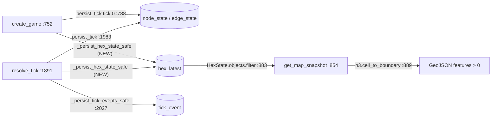

# Implementation Brief — P0 #7: `hex_latest` projection so the map API emits features

**Branch:** `feat/map-hex-projection` (cut from `dev`; verified against `chore/test-infra-rearm` = dev @ 9101dddf + test-infra edits)

**Root cause (verified):** `EngineBridge.get_map_snapshot` reads `HexState` (table `hex_latest`), but nothing in the real game loop ever writes that table. `create_game` and `resolve_tick` persist only `node_state`/`edge_state`/`events` via `PostgresRuntime.persist_tick` (`src/babylon/persistence/postgres_runtime/_legacy.py:163-167`). The only writer that can actually put rows in `hex_latest` today is the mock-fixture management command `seed_hex_data`. Result: `/api/games/{id}/map/` returns `features: []` at every zoom, for every real game.

---

## 1. Verified seams (all quoted from current code)

### 1.1 `HexState` model — `web/game/models.py:154-224` ✅ matches claim

```python
class HexState(models.Model):
    """Per-hex current state — denormalized R7 cache for map rendering.

    Wraps ``hex_latest``. County economics are broadcast from
    ``territory_snapshot``; hex-specific data (heat, org) comes
    from ``hex_activity``. Updated server-side via SQL UPSERT
    after each tick.
    """

    game = models.ForeignKey(GameSession, on_delete=models.CASCADE, db_column="game_id")   # :163-167
    h3_index = models.CharField(max_length=16, primary_key=True)                            # :168
    tick = models.IntegerField()                                                            # :169
    county_fips = models.CharField(max_length=5)                                            # :172  NOT NULL
    county_name = models.CharField(max_length=100)                                          # :173  NOT NULL
    bea_ea_code = models.CharField(max_length=8, null=True, blank=True)                     # :174
    msa_code = models.CharField(max_length=10, null=True, blank=True)                       # :175
    state_fips = models.CharField(max_length=2, default="26")                               # :176
    center_lat = models.FloatField()                                                        # :177  NOT NULL
    center_lng = models.FloatField()                                                        # :178  NOT NULL
    profit_rate / exploitation_rate / occ / imperial_rent / g33_visibility (null=True)      # :181-185
    pop_bourgeoisie..pop_lumpenproletariat, pop_total (default=0), dominant_class (null)    # :188-194
    faction_* (null=True)                                                                   # :197-199
    heat = models.FloatField(default=0.0)                                                   # :202
    heat_delta = models.FloatField(default=0.0)                                             # :203
    org_count / actions_taken (SmallInteger, default=0), was_target (default=False)         # :204-206
    terrain_type (default="LAND"), water_coverage (default=0.0), internet_access (False)    # :209-211

    class Meta:                                                                             # :213-221
        managed = False
        db_table = "hex_latest"
        constraints = [models.UniqueConstraint(fields=["game", "h3_index"], name="unique_hex_latest_pk")]
```

Canonical Postgres DDL: `src/babylon/persistence/postgres_schema.py:790-852` — `PRIMARY KEY (game_id, h3_index)` (:850); NOT NULL columns are exactly `game_id, h3_index, tick, county_fips, county_name, center_lat, center_lng` (+ `state_fips` with `DEFAULT '26'`). Everything else nullable or defaulted. The DDL also has `org_ids VARCHAR(64)[]` and `attributes JSONB` which the Django model omits — harmless (model is a column subset).

### 1.2 The only reachable writer today — `web/game/management/commands/seed_hex_data.py:52-68` ✅ matches claim

```python
                HexState(
                    game=session,
                    tick=tick,
                    h3_index=props.get("h3_index"),
                    county_fips=props.get("county_fips"),
                    county_name=props.get("county_name"),
                    profit_rate=props.get("profit_rate"),
                    exploitation_rate=props.get("exploitation_rate"),
                    occ=props.get("occ"),
                    imperial_rent=props.get("imperial_rent"),
                    heat=props.get("heat", 0.0),
                    org_count=props.get("org_presence", 0),
                    dominant_class=props.get("dominant_class"),
                    pop_total=props.get("population", 0),
                    center_lat=props.get("center_lat", 42.0),
                    center_lng=props.get("center_lng", -83.0),
                )
```
…followed by `HexState.objects.bulk_create(records_to_create)` (:75). Source is `frontend/src/fixtures/mock_map_data.json` (a 50-hex mock fixture).

**Nuance (see drift alerts):** two *dormant* production-grade writers exist in the persistence layer — `seed_hex_latest` (`src/babylon/persistence/hex_init.py:93-119`, `INSERT INTO hex_latest ... SELECT ... FROM territory_snapshot ts JOIN hex_map hm ...`) and `PostgresRuntime.refresh_hex_latest` (`_legacy.py:1896-1935`, two-phase `UPDATE ... FROM territory_snapshot/hex_activity`). Both are called **only by unit tests**, and both are no-ops in the web path because `territory_snapshot`, `hex_map`, and `hex_activity` are never populated by `EngineBridge` (its `persist_tick` writes only node/edge/event tables). Do NOT try to reuse them for this P0 — they need `hex_map` county↔hex mapping data the engine bridge does not have. The chosen fix is a direct territory→hex projection in the bridge.

### 1.3 Reader — `web/game/engine_bridge.py:883-916` ✅ matches claim

```python
        hex_states = HexState.objects.filter(game=session, tick=target_tick)     # :883

        if zoom == "hex":                                                        # :885
            features = []
            for state in hex_states:                                             # :888
                boundary = h3.cell_to_boundary(state.h3_index)                   # :889
                coordinates = [[lng, lat] for lat, lng in boundary]              # :890
                coordinates.append(coordinates[0])
                feature = {  # properties: h3_index, county_fips, county_name, bea_ea_code,
                             # msa_code, profit_rate, exploitation_rate, occ, imperial_rent,
                             # heat, org_presence(=org_count), dominant_class, population(=pop_total)
                ...
        else:
            features = self._aggregate_hex_features(hex_states, zoom)            # :916
```
`target_tick = tick if tick is not None else session.current_tick` (:881). `api.resolve_tick` updates `game_session.current_tick` right after resolution (`web/game/api.py:1037-1038`: `new_tick = snapshot.get("tick", ...)`; `GameSession.objects.filter(id=session.id).update(current_tick=new_tick, status="active")`), so the read filter and our writes stay in sync. `import h3` and `from game.models import GameSession, HexState` are done lazily inside the method (:872-874) — copy that style.

### 1.4 `_serialize_territory` — `web/game/engine_bridge.py:3329-3360` ✅ matches claim

```python
def _serialize_territory(t: Any) -> dict[str, Any]:
    ...
    return {
        "id": t.id,
        "name": t.name,
        "h3_index": t.h3_index,
        "h3_resolution": getattr(t, "h3_resolution", 7),
        "county_fips": getattr(t, "county_fips", ""),
        "heat": float(t.heat),
        "sector_type": _enum_val(t.sector_type),
        "territory_type": _enum_val(t.territory_type),
        "profile": _enum_val(t.profile),
        "rent_level": float(t.rent_level),
        "population": t.population,
        "under_eviction": t.under_eviction,
        "biocapacity": float(t.biocapacity),
        "host_id": t.host_id,
        "occupant_id": t.occupant_id,
        ...
    }
```
Fields available for projection: `h3_index` (str), `name`, `heat` (float), `population` (int), `county_fips` (always `""` — the engine `Territory` model has **no** `county_fips` field, verified `src/babylon/models/entities/territory.py`). The engine `Territory.h3_index` is `str | None` with pattern `^[0-9a-f]{15}$` (`territory.py:62-66`) — a 15-char lowercase hex **string**, fits `VARCHAR(16)`; **no int↔str H3 coercion is needed anywhere** (the whole repo uses the h3 4.x string API — `h3 = "^4.2"` in pyproject:54). Scenarios set it on every territory: US scenario res-3 (`scenarios/_legacy.py:689-700`, `territories[cell] = Territory(id=cell, h3_index=cell, ...)`), Wayne County res-6 (`scenarios/_legacy_wayne.py:82,272-284`). The abstract two_node/imperial_circuit territories have `h3_index=None` → must be skipped.

### 1.5 Sibling pattern — `_persist_tick_events_safe`, `web/game/engine_bridge.py:3228-3260`

```python
def _persist_tick_events_safe(
    persistence: RuntimePersistence,
    session_id: UUID,
    tick: int,
    serialized_events: list[dict[str, Any]],
) -> None:
    """Best-effort write of a tick's events into the ``tick_event`` table.
    ... Never raises: a journal-write failure must not fail tick resolution."""
    if not serialized_events:
        return
    persist_fn = getattr(persistence, "persist_tick_events", None)
    if not callable(persist_fn):
        return
    rows = [_tick_event_row(e) for e in serialized_events]
    try:
        persist_fn(session_id, tick, rows)
    except Exception:  # noqa: BLE001 — diagnostic; never blocks tick resolution
        logger.exception("Failed to persist tick_event rows session=%s tick=%d", session_id, tick)
```
Its call site in `resolve_tick` is line **2027**: `_persist_tick_events_safe(self._persistence, session_id, new_state.tick, snapshot["events"])`, immediately after `snapshot = _state_to_snapshot(new_state, session_id)` (:2021). Also relevant: `_persist_action_result` (:3628-3648) establishes the "fall back to Django ORM" precedent inside the bridge.

### 1.6 Call sites for the fix (exact)

- **`create_game`** — `engine_bridge.py:752-796`. Tick-0 seeding is :785-793:
  ```python
        # Seed initial world graph for tick 0 so snapshot/state endpoints
        # have material data immediately after game creation.
        initial_state = _build_initial_state_for_scenario(scenario)
        self._persistence.persist_tick(
            tick=initial_state.tick,
            graph=initial_state.to_graph(),
            events=[event.model_dump() for event in initial_state.events] or None,
            session_id=session_id,
        )
  ```
  Insert the new call **after :793** (before `logger.info(...)` at :795). Note the `game_session` row already exists at this point (created by `self._persistence.create_session(...)` at :777), so the `HexState.game` FK is satisfied.

- **`resolve_tick`** — `engine_bridge.py:1891-2053`. Insert **after :2027** (right below the `_persist_tick_events_safe` call, before the Spec-095 comment block at :2028), passing `snapshot["territories"]` — `_state_to_snapshot` builds it at :3527 (`territories = [_serialize_territory(t) for t in state.territories.values()]`) and stores it at :3541.

- **`hydrate_state` backfill (third site, strongly recommended)** — `engine_bridge.py:818-834`: legacy/unseeded sessions get lazily seeded via the same `persist_tick` path (:828-833). Add the projection there too so pre-fix sessions gain a map on first hydrate.

### 1.7 No schema change needed ✅

Everything the territory snapshot provides maps onto existing `hex_latest` columns:

| hex_latest column (constraint) | source | coercion |
|---|---|---|
| `game_id` (PK, FK) | `session_id: UUID` | none (psycopg/ORM handles UUID) |
| `h3_index` (PK, VARCHAR(16)) | `territory["h3_index"]` | `str`; **skip row if `None`/empty** |
| `tick` (NOT NULL) | `initial_state.tick` / `new_state.tick` | `int` |
| `county_fips` (NOT NULL) | `territory["county_fips"]` | `str(... or "")` — engine Territory has no fips → `""` |
| `county_name` (NOT NULL, ≤100) | `territory["name"]` | `str(...)[:100]` |
| `center_lat`/`center_lng` (NOT NULL) | `h3.cell_to_latlng(h3_index)` | returns `(lat, lng)` floats |
| `heat` | `territory["heat"]` | `float` |
| `pop_total` | `territory["population"]` | `int` |
| everything else | column defaults / NULL | — |

---

## 2. Implementation steps

### Step 0 — RED tests first (TDD)

**(a) Extend `tests/integration/test_map_api.py`** (the requested RED test "map features > 0 after create_game").

First, its autouse fixture (:16-41) creates only `game_session` — extend it with the `hex_latest` DDL. Copy the SQLite DDL verbatim from `tests/unit/web/conftest.py:138-174` (it already models the composite `UNIQUE(game_id, h3_index)` plus an rowid `id` column) and `cursor.execute` it after the existing `game_session` statement.

Then add (match the file's existing style — `Client`, `game.api._bridge_instance` injection per the module docstring "In tests, patch ``game.api._bridge_instance``"):

```python
@pytest.mark.unit
@pytest.mark.django_db
class TestMapFeaturesAfterCreateGame:
    """P0 #7 (RED): a real game must project territories into hex_latest so
    GET /api/games/{id}/map/?zoom=hex returns features > 0."""

    def test_map_features_positive_after_create_game(self):
        from unittest.mock import MagicMock

        from game.engine_bridge import EngineBridge, _build_initial_state_for_scenario

        user = User.objects.create_user(username="hexuser", password="hexpass123")
        client = Client()
        client.login(username="hexuser", password="hexpass123")

        session_id = uuid.uuid4()

        mock_persistence = MagicMock()
        # Mimic PostgresRuntime.create_session: it inserts the game_session
        # row the HexState FK points at (same table Django reads in prod).
        def _create_session(**kwargs):
            GameSession.objects.create(
                id=session_id,
                player_id=user.id,
                scenario=kwargs["scenario"],
                current_tick=0,
                status="active",
            )
            return session_id

        mock_persistence.create_session.side_effect = _create_session
        mock_persistence.persist_tick.return_value = None
        mock_persistence.hydrate_graph.return_value = _build_initial_state_for_scenario(
            "wayne_county"
        ).to_graph()

        bridge = EngineBridge(mock_persistence)
        game.api._bridge_instance = bridge

        created_id = bridge.create_game(scenario="wayne_county", rng_seed=42)
        assert created_id == session_id

        response = client.get(f"/api/games/{session_id}/map/?zoom=hex")
        assert response.status_code == 200
        data = json.loads(response.content)
        assert data["status"] == "ok"
        assert len(data["data"]["features"]) > 0
```

(`wayne_county` seeds 81 res-6 territories, all with `h3_index`; `default`/US would also work with ~1100 res-3 hexes but is slower.)

**(b) Add a unit class to `tests/unit/web/test_engine_bridge.py`**, after `TestTickEventPersistence` (ends :575), modeled on it:

```python
@pytest.mark.unit
@pytest.mark.django_db
class TestHexStateProjection:
    """P0 #7: create_game / resolve_tick project territories into hex_latest."""

    _SID = uuid.UUID("aaaaaaaa-bbbb-cccc-dddd-eeeeeeeeeeee")

    def _make_session_row(self) -> None:
        from game.models import GameSession

        GameSession.objects.create(id=self._SID, scenario="default", current_tick=0, status="active")

    def test_create_game_writes_hex_latest_tick0(self) -> None:
        from game.models import HexState

        self._make_session_row()
        bridge = EngineBridge(_make_mock_persistence())

        bridge.create_game(scenario="wayne_county", rng_seed=42)

        assert HexState.objects.filter(game_id=self._SID, tick=0).count() > 0

    @patch("game.engine_bridge.step")
    def test_resolve_tick_upserts_hex_latest(self, mock_step: MagicMock) -> None:
        from babylon.models import Territory
        from babylon.models.enums import SectorType
        from game.models import HexState

        self._make_session_row()
        mock_persistence = _make_mock_persistence()
        mock_persistence.get_pending_turns.return_value = []

        cell = "862a91a17ffffff"  # 15-char lowercase hex, matches Territory pattern
        territory = Territory(id=cell, h3_index=cell, name="Test Hex", sector_type=SectorType.INDUSTRIAL)
        mock_new_state = _make_mock_new_state(tick=7)
        mock_new_state.territories = {cell: territory}
        mock_step.return_value = mock_new_state

        bridge = EngineBridge(mock_persistence)
        bridge.resolve_tick(self._SID)
        bridge.resolve_tick(self._SID)  # second resolve must UPDATE, not duplicate

        rows = HexState.objects.filter(game_id=self._SID)
        assert rows.count() == 1
        assert rows.first().tick == 7

    @patch("game.engine_bridge.step")
    def test_resolve_tick_skips_territories_without_h3(self, mock_step: MagicMock) -> None:
        """two_node-style territories (h3_index=None) must be skipped, not crash."""
        from babylon.models import Territory
        from babylon.models.enums import SectorType
        from game.models import HexState

        self._make_session_row()
        mock_persistence = _make_mock_persistence()
        mock_persistence.get_pending_turns.return_value = []
        territory = Territory(id="T001", name="Abstract", sector_type=SectorType.INDUSTRIAL)
        mock_new_state = _make_mock_new_state(tick=1)
        mock_new_state.territories = {"T001": territory}
        mock_step.return_value = mock_new_state

        EngineBridge(mock_persistence).resolve_tick(self._SID)
        assert HexState.objects.filter(game_id=self._SID).count() == 0
```

(Verify the Territory import path first: `from babylon.models import Territory` per CLAUDE.md core-entities export; `_make_mock_persistence` :21-32, `_make_mock_new_state` :379-392 already exist in this file. The `tests/unit/web/conftest.py` session-scoped autouse fixture `_create_unmanaged_tables` (:178-189) already creates `hex_latest` in the SQLite test DB.)

Run and watch both fail (RED):
```bash
poetry run pytest tests/unit/web/test_engine_bridge.py::TestHexStateProjection -x
poetry run pytest tests/integration/test_map_api.py::TestMapFeaturesAfterCreateGame -x
```

### Step 1 — the projection helpers (GREEN)

Add two module-level functions in `web/game/engine_bridge.py` directly after `_persist_tick_events_safe` (i.e., after :3260, before `_game_event_from_tick_event_row` at :3263), matching the sibling's style:

```python
def _hex_state_row(session_id: UUID, tick: int, territory: dict[str, Any]) -> dict[str, Any] | None:
    """Project one :func:`_serialize_territory` dict onto ``hex_latest`` columns.

    Returns ``None`` for territories without an ``h3_index`` (abstract
    scenarios such as ``two_node``) — those cannot be drawn on the map.

    Args:
        session_id: The game session UUID (``hex_latest.game_id``).
        tick: The tick this row reflects.
        territory: One entry of ``snapshot["territories"]``.

    Returns:
        Kwargs dict for the :class:`game.models.HexState` constructor, or None.
    """
    import h3

    h3_index = territory.get("h3_index")
    if not h3_index:
        return None
    try:
        center_lat, center_lng = h3.cell_to_latlng(str(h3_index))
    except (ValueError, TypeError) as exc:
        logger.warning("Skipping territory with invalid h3_index %r: %s", h3_index, exc)
        return None
    return {
        "game_id": session_id,
        "h3_index": str(h3_index),
        "tick": tick,
        "county_fips": str(territory.get("county_fips") or ""),
        "county_name": str(territory.get("name") or h3_index)[:100],
        "center_lat": float(center_lat),
        "center_lng": float(center_lng),
        "heat": float(territory.get("heat") or 0.0),
        "pop_total": int(territory.get("population") or 0),
    }


def _persist_hex_state_safe(
    session_id: UUID,
    tick: int,
    serialized_territories: list[dict[str, Any]],
) -> None:
    """Best-effort projection of a tick's territories into ``hex_latest``.

    P0 #7: :meth:`EngineBridge.get_map_snapshot` reads ``hex_latest`` but the
    game loop never wrote it, so the map rendered zero features for every
    real game (only the ``seed_hex_data`` mock-fixture command wrote rows).
    Mirrors :func:`_persist_tick_events_safe`'s never-raise contract, and
    :func:`_persist_action_result`'s Django-ORM write path — Django's
    ``default`` database is the same Postgres the persistence pool points at
    (see :func:`init_persistence`), so an ORM UPSERT lands in the exact table
    the map reader queries. Uses ``bulk_create(update_conflicts=True)`` →
    ``INSERT ... ON CONFLICT (game_id, h3_index) DO UPDATE`` against the
    composite PK (``postgres_schema.HEX_LATEST_DDL``); ``hex_latest`` is a
    latest-tick cache, so each tick overwrites the previous one in place.

    Args:
        session_id: The game session UUID.
        tick: The tick these rows reflect.
        serialized_territories: ``snapshot["territories"]`` (output of
            :func:`_serialize_territory` per territory).
    """
    if not serialized_territories:
        return
    rows = [
        row
        for t in serialized_territories
        if (row := _hex_state_row(session_id, tick, t)) is not None
    ]
    if not rows:
        return
    try:
        from game.models import HexState

        HexState.objects.bulk_create(
            [HexState(**row) for row in rows],
            update_conflicts=True,
            unique_fields=["game", "h3_index"],
            update_fields=[
                "tick",
                "county_fips",
                "county_name",
                "center_lat",
                "center_lng",
                "heat",
                "pop_total",
            ],
        )
    except Exception:  # noqa: BLE001 — diagnostic; never blocks tick resolution
        logger.exception(
            "Failed to persist hex_latest rows session=%s tick=%d", session_id, tick
        )
```

Notes for the implementer:
- `unique_fields` must use the field name `"game"` (Django maps it to column `game_id`); `"game_id"` raises `FieldDoesNotExist`.
- Django auto-computes SQLite batch sizes for `bulk_create`, so ~1100-row US-scenario writes are safe on both backends.
- Do NOT import `game.models` or `h3` at module top — `engine_bridge.py` is the import-boundary file (module docstring :1-10; `tests/unit/web/test_import_boundary.py` guards it) and both are already lazily imported inside `get_map_snapshot` (:872-874).
- The never-raise wrapper also absorbs pytest-django's DB blocker in existing non-`django_db` unit tests (`TestTickEventPersistence` etc. pass `territories={}` → early return; `TestEngineBridgeCreateGame` will log a swallowed exception — acceptable, matches sibling semantics).

### Step 2 — wire the three call sites

**(a) `create_game`** — after `engine_bridge.py:793`, before `logger.info(...)` at :795:

```python
        # P0 #7: project the tick-0 territories into hex_latest so the map
        # endpoint has features immediately after game creation.
        _persist_hex_state_safe(
            session_id,
            initial_state.tick,
            [_serialize_territory(t) for t in initial_state.territories.values()],
        )
```

**(b) `resolve_tick`** — immediately after :2027 (`_persist_tick_events_safe(...)` call):

```python
        # P0 #7: refresh the hex_latest map cache from this tick's territories
        # (sibling of the tick_event write above; best-effort, never raises).
        _persist_hex_state_safe(session_id, new_state.tick, snapshot["territories"])
```

**(c) `hydrate_state` backfill** — after :833 (`self._persistence.persist_tick(...)` inside the `_is_unseeded_graph` branch), so legacy sessions gain a map on first hydrate:

```python
                _persist_hex_state_safe(
                    session_id,
                    seeded_state.tick,
                    [_serialize_territory(t) for t in seeded_state.territories.values()],
                )
```

### Step 3 — GREEN + gates

```bash
# scoped
poetry run pytest tests/unit/web/test_engine_bridge.py -q
poetry run pytest tests/integration/test_map_api.py -q
poetry run pytest tests/unit/web/test_seed_hex_data.py tests/unit/web/test_schema_parity.py -q   # regression: existing hex tests
# agent inner loop equivalents
mise run test:q -- tests/unit/web/test_engine_bridge.py tests/integration/test_map_api.py
# full fast gate (lint + format + typecheck + test:unit)
mise run check
```

Optional real-Postgres proof (Docker required): `poetry run pytest tests/integration/web/test_pg_contract.py -q` still passes (composite-PK contract untouched). Manual end-to-end: `mise run web:dev`, create a wayne_county game in the UI, then `curl -s "localhost:8000/api/games/<id>/map/?zoom=hex" | jq '.data.features | length'` → expect 81; resolve a tick and repeat.

Commit as `fix(web): project territories into hex_latest at create_game/resolve_tick (P0 #7)`.

---

## 3. Existing tests covering the area (none to un-skip)

- `tests/integration/test_map_api.py` (:44-178) — HTTP contract for `/map/` with a **mocked** bridge; the new RED test extends this file with a real bridge.
- `tests/unit/web/test_engine_bridge.py` — `TestTickEventPersistence` (:530-575) is the exact sibling pattern for the new `TestHexStateProjection`; `TestEngineBridgeCreateGame::test_create_game_persists_initial_tick_state` (:95-107) pins the tick-0 `persist_tick` call the new call rides behind.
- `tests/unit/web/test_seed_hex_data.py` (:14-60) — pins the fixture command (50 rows; unique-constraint IntegrityError). Unaffected; do not modify.
- `tests/integration/web/test_pg_contract.py` — `TestHexStateOnPostgres` (:98-155) proves ORM insert + composite `UNIQUE(game_id, h3_index)` against real Postgres DDL; `test_hex_latest_columns_match` (:211-224) guards column parity. No changes needed.
- `tests/unit/persistence/test_hex_init.py`, `test_hex_latest_refresh.py` — cover the dormant SQL writers; unaffected.
- **No skipped tests exist for this seam** (the `requires_postgres`-gated `tests/integration/web/test_game_lifecycle.py`/`test_bridge_roundtrip.py` are env-skipped, and their `bridge` fixtures are broken anyway — see drift alert 2; do not build the RED test on them).

## 4. Scope boundaries / explicitly out of scope

- **Aggregated zooms stay data-poor:** engine `Territory` has no `county_fips`, so projected rows carry `""` and `_aggregate_hex_features` (:949-1029) collapses everything into one `""` group with `geometry: None` (:1012). Only `zoom=hex` gains real polygon geometry from this fix. Frontend framing default is `"county"` (`web/frontend/src/stores/mapStore.ts:56`) — fixing county aggregation needs a hex→county mapping (spec-088 `hex_spatial_map` territory) and is a separate work item, as is Bug #8 (frontend sends `ea`/`cty`, backend wants `bea`/`county`).
- `hex_latest` is a latest-tick cache: map queries for **historical** ticks return empty after the tick advances. Pre-existing semantics of the table; don't fight it here.
- Marxian indicator columns (`profit_rate`, `occ`, …) remain NULL — the bridge snapshot has no per-hex economics yet (gamma wiring is a separate dormant-sim phase).
- `DeckGLMap.tsx` renders its base hex layer from `snapshot.territories` (:148, :184-209), so the blank-map symptom has plural causes (headless-WebGL in the E2E among them); this fix closes the `/map/` API contract, which the e2e gate and the Situation Map metadata path consume.

## 5. Data-flow after the fix


