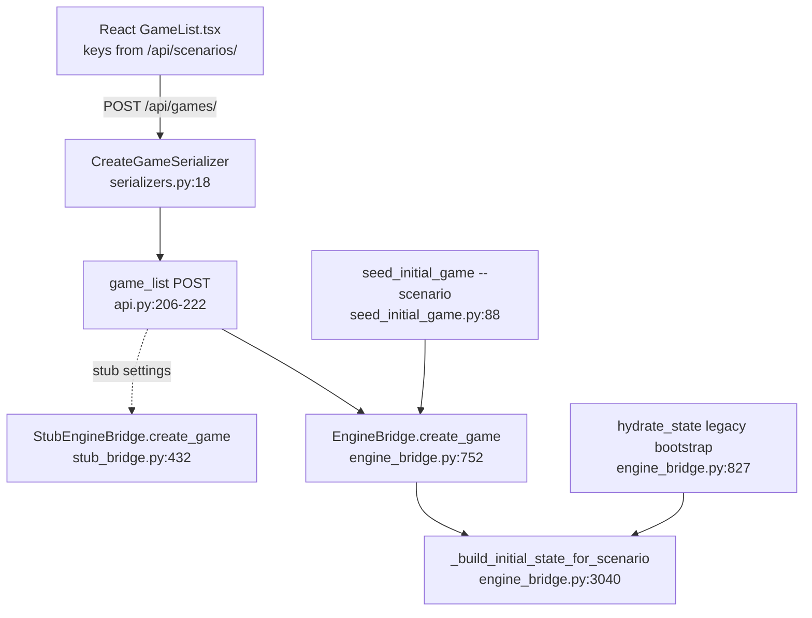

# Implementation Brief — `fix/seed-scenario-loud`

**Goal:** Unknown scenario names must fail loud at every entry point — `ValueError` in the bridge, `CommandError` in the seed command, HTTP 400 in the API — instead of silently seeding the `us` scenario. Known scenarios (including the catalog key `us_nationwide` and the aliases `default`/`wayne`/`detroit`) must keep working.

All file paths are repo-relative to `/home/user/projects/game/babylon`. All line numbers verified against `chore/test-infra-rearm` (dev @ 9101dddf) on 2026-07-08.

---

## 1. Verified seams (current code)

### 1a. The silent fallback — `web/game/engine_bridge.py:3040-3068`

```python
3040	def _build_initial_state_for_scenario(scenario: str) -> WorldState:
3041	    """Construct initial WorldState for a supported scenario identifier.
...
3049	    normalized = scenario.strip().lower()
3050	    if normalized in {"default", "us"}:
3051	        state, _config, _defines = create_us_scenario()
3052	        return state
3053	    if normalized == "imperial_circuit":
3054	        state, _config, _defines = create_imperial_circuit_scenario()
3055	        return state
3056	    if normalized == "two_node":
3057	        state, _config, _defines = create_two_node_scenario()
3058	        return state
3059	    if normalized == "labor_aristocracy":
3060	        state, _config, _defines = create_labor_aristocracy_scenario()
3061	        return state
3062	    if normalized in {"wayne_county", "wayne", "detroit"}:
3063	        state, _config, _defines = create_wayne_county_scenario()
3064	        return state
3065
3066	    logger.warning("Unknown scenario '%s', falling back to us", scenario)
3067	    state, _config, _defines = create_us_scenario()
3068	    return state
```

Its scenario imports are at `web/game/engine_bridge.py:20-26`:

```python
20	from babylon.engine.scenarios import (
21	    create_imperial_circuit_scenario,
22	    create_labor_aristocracy_scenario,
23	    create_two_node_scenario,
24	    create_us_scenario,
25	)
26	from babylon.engine.scenarios_wayne_county import create_wayne_county_scenario
```

`create_wayne_county_scenario` and the four `create_*` names are used **nowhere else** in this file (verified with `rg`) — after the fix they become orphaned imports and must be removed.

Two in-file callers of `_build_initial_state_for_scenario`:
- `EngineBridge.create_game` at **line 787** — CRITICAL ordering bug to respect: `self._persistence.create_session(...)` runs at **line 777** *before* the scenario is built at 787, so validation must happen at the top of `create_game` or an invalid scenario leaves an orphaned session row.

```python
777	        session_id: UUID = self._persistence.create_session(  # type: ignore[attr-defined]
778	            scenario=scenario,
...
787	        initial_state = _build_initial_state_for_scenario(scenario)
```

- `EngineBridge.hydrate_state` legacy bootstrap at **lines 818-834** (re-seeds an unseeded session from its stored scenario string, defaulting `"default"`):

```python
822	                scenario = (
823	                    str(session_row.get("scenario", "default"))
824	                    if isinstance(session_row, dict)
825	                    else "default"
826	                )
827	                seeded_state = _build_initial_state_for_scenario(scenario)
```

**Decision (documented, intentional):** after the fix, a stored junk scenario in a legacy session row makes `hydrate_state` raise `ValueError` instead of silently reseeding as `us`. Only pre-fix rows can contain junk (post-fix, `create_game` validates), and "fail loud on corrupt data" is the project's stated error philosophy. Do not add a fallback here.

### 1b. Valid scenario names — the engine registry (source of truth)

`src/babylon/engine/scenarios/base.py:38` holds the auto-registry (`_SCENARIO_REGISTRY`); `get_scenario` (lines 92-94, raises bare `KeyError`) and `list_scenarios` (lines 97-99) are exported from `src/babylon/engine/scenarios/__init__.py` (in `__all__`). Registered names (each `name: ClassVar[str]` at line 23 of its file):

| Registry name | File | Notes |
|---|---|---|
| `us` | `scenarios/us.py` | the nationwide CONUS scenario |
| `wayne_county` | `scenarios/wayne_county.py` | default for seed command |
| `two_node` | `scenarios/two_node.py` | |
| `imperial_circuit` | `scenarios/imperial_circuit.py` | |
| `labor_aristocracy` | `scenarios/labor_aristocracy.py` | |
| `high_tension` | `scenarios/high_tension.py` | registered but NOT dispatched by the current bridge |

Every subclass `build(*args, **kwargs)` delegates to the `_legacy.py` free functions (byte-equality per SC-007), and all legacy builders have full default args (`create_us_scenario` at `_legacy.py:704`, `create_two_node_scenario` at `:30`, `create_imperial_circuit_scenario` at `:239`, `create_high_tension_scenario` at `:185`, `create_wayne_county_scenario` at `_legacy_wayne.py:508`) — so `get_scenario(name)().build()` is a drop-in replacement for the if-chain.

Aliases the bridge currently accepts that are NOT registry names: `default`→us, `wayne`→wayne_county, `detroit`→wayne_county. **Additionally required:** `us_nationwide`→us, because…

### 1c. The API advertises a key the bridge doesn't handle — `web/game/api.py:247-276`

`SCENARIO_CATALOG` keys: `wayne_county`, **`us_nationwide`** (line 259), `imperial_circuit`, `two_node`. The React `GameList.tsx` (`web/frontend/src/components/GameList.tsx:38-65`) populates its picker from `GET /api/scenarios/` and POSTs the selected `key` — so **the flagship UI flow sends `us_nationwide`, which today rides the silent fallback to `us`**. The fix must map `us_nationwide` → `us` as an alias, or game creation from the UI would start returning 400.

### 1d. API create entry point — `web/game/api.py:184-240`

POST branch of `game_list` (route `game:game-list` = `/api/games/`, `web/game/urls.py:24`):

```python
206	    create_serializer = CreateGameSerializer(data=request.data)
207	    if not create_serializer.is_valid():
...
213	        return _error(str(create_serializer.errors))
...
215	    bridge = _get_bridge()
216	    session_id = bridge.create_game(
217	        scenario=create_serializer.validated_data["scenario"],
```

`_error` defaults to `http_status=400` (`api.py:123-128`), so serializer-level validation automatically produces the required 400. The serializer today accepts any string — `web/game/serializers.py:18-24`:

```python
18	class CreateGameSerializer(serializers.Serializer[dict[str, Any]]):
19	    """Validate POST /api/games/ request body."""
20
21	    scenario = serializers.CharField(max_length=64)
22	    config = serializers.JSONField(required=False, default=dict)
23	    defines = serializers.JSONField(required=False, default=dict)
24	    rng_seed = serializers.IntegerField(required=False, default=0)
```

### 1e. Seed command — `web/game/management/commands/seed_initial_game.py`

`CommandError` already imported (line 22). `--scenario` defaults to `wayne_county` (lines 31-36). Flow in `handle()` (lines 50-92): options extracted at 51-53 → user get_or_create at 55-61 → bridge-None check raises `CommandError` at 74-79 → bridge-class check at 81-86 → `bridge.create_game(scenario=scenario, ...)` at 88-92 with **no scenario validation anywhere**. Existing style does deferred imports inside `handle()` (`from game import api as game_api` at line 71) — match it.

### 1f. Complete entry-point enumeration (everything that accepts a scenario string)



- `StubEngineBridge.create_game` (`web/game/stub_bridge.py:432-468`) accepts any string; it is only reachable through the API view, so serializer validation covers it. (NOTE, out of scope: the stub's signature uses `_config`/`_defines`/`_rng_seed` while `api.py:216-222` passes `config=`/`defines=`/`rng_seed=` keywords — the stub create path already `TypeError`s today. Flagged in drift alerts; do NOT fix on this branch.)
- `web/game/apps.py:121` and `web/game/tests/conftest.py:21` only contain a DDL column default (`'wayne_county'`) — no dispatch, no change.
- The headless runner's `scope_name="michigan-canada"` (`src/babylon/engine/headless_runner/models.py:109`) is a **different subsystem** that never touches `_build_initial_state_for_scenario` — no change (see drift alerts re: the "michigan" claim).

---

## 2. Design

Registry-driven resolution (DRY: the registry at `scenarios/base.py` exists precisely for name→builder lookup; the if-chain duplicates it and is exactly what drifted out of sync with the catalog):

- New module-level alias map + public `resolve_scenario()` in `engine_bridge.py`, placed immediately above `_build_initial_state_for_scenario`.
- `_build_initial_state_for_scenario` becomes `get_scenario(resolve_scenario(scenario))().build()` and raises `ValueError` for unknowns.
- `create_game` calls `resolve_scenario(scenario)` **before** `persistence.create_session` (no orphan rows). The raw scenario string is still persisted unchanged (required: `game_list_page` at `api.py:156-161` looks names up by the raw catalog key, e.g. `us_nationwide`).
- Serializer gains `validate_scenario` (lazy-imports `resolve_scenario`) → existing 400 path.
- Seed command validates first thing in `handle()` (before user creation) → `CommandError`.

Consequence to accept: `high_tension` becomes a creatable scenario (it is a real registered builder). Conservative alternative if the owner objects: keep the if-chain, add `us_nationwide` to the `{"default", "us"}` set, and replace lines 3066-3068 with a `raise ValueError(...)` — everything else in this brief stays identical.

`mypy --strict` note: calling `get_scenario(name)()` through the `type[Scenario]` return annotation is accepted by mypy (abstractness is only enforced on direct class references). `list_scenarios()` is O(6) — loop bounds are static.

---

## 3. Tests — RED first

There are **no skipped tests to un-skip** in this area (verified: only a test *named* `..._skips_persist...` at `tests/unit/web/test_engine_bridge.py:564`; no skip/xfail markers in the three affected test files).

### 3.1 RED: bridge unit tests — `tests/unit/web/test_engine_bridge.py`

Replace `TestScenarioBootstrap` (currently lines 110-119, which **pins the buggy fallback**):

```python
114	    def test_unknown_scenario_falls_back_to_default_state(self) -> None:
115	        state = _build_initial_state_for_scenario("not-a-real-scenario")
```

with (also extend the import at line 18 to include `resolve_scenario`):

```python
@pytest.mark.unit
class TestScenarioBootstrap:
    """Verify scenario bootstrap selection for initial game state."""

    def test_unknown_scenario_raises_value_error(self) -> None:
        with pytest.raises(ValueError, match="Unknown scenario 'not-a-real-scenario'"):
            _build_initial_state_for_scenario("not-a-real-scenario")

    def test_aliases_resolve_to_canonical_names(self) -> None:
        assert resolve_scenario("default") == "us"
        assert resolve_scenario("us_nationwide") == "us"
        assert resolve_scenario("wayne") == "wayne_county"
        assert resolve_scenario("detroit") == "wayne_county"

    def test_known_scenario_builds_tick_zero_state(self) -> None:
        state = _build_initial_state_for_scenario("two_node")

        assert state.tick == 0
        assert len(state.entities) > 0

    def test_every_catalog_key_is_seedable(self) -> None:
        """Guard against SCENARIO_CATALOG/bridge drift (the us_nationwide bug)."""
        from game.api import SCENARIO_CATALOG

        for entry in SCENARIO_CATALOG:
            assert resolve_scenario(entry["key"])
```

Add to `TestEngineBridgeCreateGame` (orphan-session guard):

```python
    def test_create_game_unknown_scenario_raises_before_session_created(self) -> None:
        mock_persistence = _make_mock_persistence()
        bridge = EngineBridge(mock_persistence)

        with pytest.raises(ValueError, match="Unknown scenario"):
            bridge.create_game(scenario="atlantis", rng_seed=42)

        mock_persistence.create_session.assert_not_called()
        mock_persistence.persist_tick.assert_not_called()
```

**Existing tests that MUST be updated in the same commit** (they pass bogus names that only worked because of the silent fallback — they will start raising `ValueError`):

| Line | Current | Change to |
|---|---|---|
| 54 | `bridge.create_game(scenario="detroit_1967", rng_seed=42)` | `scenario="detroit"` (valid alias, keeps flavor) |
| 63 + assertion 66 | `scenario="test_scenario"` / `== "test_scenario"` | `scenario="two_node"` / `== "two_node"` |
| 72 | `scenario="test"` | `scenario="two_node"` |
| 82 | `scenario="test"` | `scenario="two_node"` |
| 89 | `scenario="test"` | `scenario="two_node"` |

Untouched and fine: `_make_mock_persistence` uses `"default"` (lines 25, 28), as do lines 99, 157, 474; `tests/integration/web/test_game_lifecycle.py` + `test_bridge_roundtrip.py` use `scenario="default"` throughout; `tests/unit/web/test_schema_parity.py:541` only lists the method name `create_game`.

### 3.2 RED: API tests — new class in `tests/unit/web/test_api.py`

Model on `TestActionValidation._setup_bridge_and_session` (lines 186-277: `Client` + login + assign `game.api._bridge_instance`, in-method imports; `json` is already imported at module top):

```python
@pytest.mark.unit
@pytest.mark.django_db
class TestCreateGameScenarioValidation:
    """fix/seed-scenario-loud: unknown scenario -> 400, never a silent 'us' game."""

    def _login_client(self):
        from django.contrib.auth.models import User
        from django.test import Client

        User.objects.create_user(username="scenuser", password="scenpass123")
        client = Client()
        client.login(username="scenuser", password="scenpass123")
        return client

    def test_unknown_scenario_returns_400_and_never_reaches_bridge(self) -> None:
        from unittest.mock import MagicMock

        import game.api

        client = self._login_client()
        mock_bridge = MagicMock()
        game.api._bridge_instance = mock_bridge

        response = client.post(
            "/api/games/",
            data=json.dumps({"scenario": "atlantis"}),
            content_type="application/json",
        )

        assert response.status_code == 400
        data = json.loads(response.content)
        assert data["status"] == "error"
        assert "Unknown scenario" in data["message"]
        mock_bridge.create_game.assert_not_called()

    def test_catalog_scenario_key_returns_201(self) -> None:
        import uuid as uuid_mod
        from unittest.mock import MagicMock

        import game.api

        client = self._login_client()
        mock_bridge = MagicMock()
        mock_bridge.create_game.return_value = uuid_mod.uuid4()
        game.api._bridge_instance = mock_bridge

        response = client.post(
            "/api/games/",
            data=json.dumps({"scenario": "us_nationwide"}),
            content_type="application/json",
        )

        assert response.status_code == 201
        mock_bridge.create_game.assert_called_once()
```

### 3.3 RED: command test — append to `TestSeedInitialGameBridgeContract` in `tests/integration/test_seed_initial_game_command.py`

(File style: `pytestmark = pytest.mark.integration`, `db`/`monkeypatch` fixtures, `call_command` with `StringIO`.) This is RED today because with `_bridge_instance=None` the current code raises `CommandError("EngineBridge not initialized")`, which fails the `match="Unknown scenario"`:

```python
    def test_raises_on_unknown_scenario_before_user_creation(self, db, monkeypatch) -> None:  # noqa: ARG002
        """Unknown --scenario fails loud before user creation AND before the bridge check."""
        from game import api as game_api

        monkeypatch.setattr(game_api, "_bridge_instance", None, raising=False)

        User = get_user_model()
        username = "scenario-loud-nouser"
        User.objects.filter(username=username).delete()

        with pytest.raises(CommandError, match="Unknown scenario 'atlantis'"):
            call_command(
                "seed_initial_game",
                "--scenario",
                "atlantis",
                "--player",
                username,
                stdout=StringIO(),
                stderr=StringIO(),
            )

        assert not User.objects.filter(username=username).exists()
```

(Ordering interplay: `test_creates_django_user_when_absent` at lines 74-97 requires user creation to precede the bridge-None error for the *default* scenario `wayne_county` — validating the scenario before user creation does not disturb it.)

Run RED and confirm the new tests fail for the right reasons:

```bash
mise run test:q -- tests/unit/web/test_engine_bridge.py tests/unit/web/test_api.py tests/integration/test_seed_initial_game_command.py
```

---

## 4. Implementation steps (GREEN)

### 4.1 `web/game/engine_bridge.py`

**(a) Imports — replace lines 20-26** with:

```python
from babylon.engine.scenarios import get_scenario, list_scenarios
```

(Removes the 4 `create_*_scenario` names and the whole `scenarios_wayne_county` shim import — both orphaned by this change.)

**(b) Replace lines 3040-3068** (`_build_initial_state_for_scenario` + add alias map and public resolver above it):

```python
# Aliases accepted at the API/CLI boundary, mapped to canonical names in the
# engine scenario registry (babylon.engine.scenarios). "us_nationwide" is the
# SCENARIO_CATALOG key served by GET /api/scenarios/ (web/game/api.py) and the
# key the React game-creation UI submits — it MUST stay resolvable.
_SCENARIO_ALIASES: dict[str, str] = {
    "default": "us",
    "us_nationwide": "us",
    "wayne": "wayne_county",
    "detroit": "wayne_county",
}


def resolve_scenario(scenario: str) -> str:
    """Resolve a scenario identifier or alias to a canonical registry name.

    Args:
        scenario: Scenario name from an API request or management command.

    Returns:
        The canonical name registered in the engine scenario registry.

    Raises:
        ValueError: If the identifier matches no registered scenario or alias.
    """
    normalized = scenario.strip().lower()
    canonical = _SCENARIO_ALIASES.get(normalized, normalized)
    if canonical not in list_scenarios():
        valid = ", ".join(sorted({*list_scenarios(), *_SCENARIO_ALIASES}))
        raise ValueError(f"Unknown scenario '{scenario}'. Valid scenarios: {valid}")
    return canonical


def _build_initial_state_for_scenario(scenario: str) -> WorldState:
    """Construct initial WorldState for a supported scenario identifier.

    Args:
        scenario: Scenario name from API request.

    Returns:
        Seeded WorldState at tick 0.

    Raises:
        ValueError: If ``scenario`` is not a registered scenario or alias.
    """
    canonical = resolve_scenario(scenario)
    state, _config, _defines = get_scenario(canonical)().build()
    return state
```

**(c) `create_game` — insert after the docstring (after current line 771), before the `# Validate configs via Pydantic` comment at 772:**

```python
        # Fail loud on unknown scenarios BEFORE creating the session row, so a
        # typo cannot leave an orphaned session silently seeded as 'us'.
        resolve_scenario(scenario)
```

(Keep persisting the *raw* `scenario` string at line 778 — `game_list_page` looks display names up by the raw catalog key.)

Also update the `Raises:` section of `create_game`'s docstring to document `ValueError`.

### 4.2 `web/game/serializers.py` — extend `CreateGameSerializer` (lines 18-24)

```python
class CreateGameSerializer(serializers.Serializer[dict[str, Any]]):
    """Validate POST /api/games/ request body."""

    scenario = serializers.CharField(max_length=64)
    config = serializers.JSONField(required=False, default=dict)
    defines = serializers.JSONField(required=False, default=dict)
    rng_seed = serializers.IntegerField(required=False, default=0)

    def validate_scenario(self, value: str) -> str:
        """Reject scenario names the engine cannot seed (loud 400, not a silent 'us' game).

        Raises:
            serializers.ValidationError: If ``value`` is not a registered
                scenario or alias.
        """
        from game.engine_bridge import resolve_scenario

        try:
            resolve_scenario(value)
        except ValueError as exc:
            raise serializers.ValidationError(str(exc)) from exc
        return value
```

The lazy import keeps the heavy `babylon.*` import chain out of Django module-load time (matches `api.py`'s lazy-import pattern at lines 79/98) and also validates the `StubEngineBridge` path, since the stub is only reachable through this view.

### 4.3 `web/game/management/commands/seed_initial_game.py` — insert after line 53 (`rng_seed: int = options["rng_seed"]`), before the `User.objects.get_or_create` block

```python
        # Validate the scenario before creating any state (user or session).
        from game.engine_bridge import resolve_scenario

        try:
            resolve_scenario(scenario)
        except ValueError as exc:
            raise CommandError(str(exc)) from exc
```

### 4.4 Update the 5 existing bridge unit tests

Per the table in §3.1 (`tests/unit/web/test_engine_bridge.py` lines 54, 63/66, 72, 82, 89).

---

## 5. Verification

```bash
# 1. Scoped GREEN run (unit + the command's integration file)
mise run test:q -- tests/unit/web/test_engine_bridge.py tests/unit/web/test_api.py tests/integration/test_seed_initial_game_command.py

# 2. Bridge round-trip / lifecycle integration files (use scenario="default"; require the test Postgres)
mise run test:q -- tests/integration/web/test_bridge_roundtrip.py tests/integration/web/test_game_lifecycle.py

# 3. lint + format + mypy strict
mise run check:quick

# 4. Full fast gate before commit
mise run check

# 5. Manual loudness proof (optional but per repo /verify culture) — expect CommandError listing valid names:
cd web && poetry run python manage.py seed_initial_game --scenario atlantis --player admin
```

Commit (tests + fix are one unit per repo convention):

```bash
mise run commit -- "fix(web): reject unknown scenario names loudly at every seeding entry point"
```

Branch from `dev` as `fix/seed-scenario-loud`; PR targets `dev`.

## 6. Out-of-scope items to NOT touch (mention in PR description)

- Stub-bridge kwarg mismatch (`stub_bridge.py:434-437` `_config/_defines/_rng_seed` vs `api.py:218-220` `config=/defines=/rng_seed=`) — pre-existing `TypeError` on the stub create path; belongs to Phase 3.1 stub-visibility work.
- `SCENARIO_CATALOG` curation (it omits `labor_aristocracy`/`high_tension`/`us`) — the new `test_every_catalog_key_is_seedable` guard only enforces the safe direction (catalog ⊆ seedable).
- `web/HOW-TO-LOCAL-DEV.md:163-164` stays accurate as written; no doc change needed (demand-driven docs).
