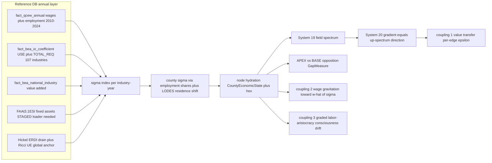

# Program 10 — The Spectrum of Unequal Exchange (spec-107)

**Status:** RATIFIED 2026-07-08 (owner interview, 5 rulings below). Spec-107 NOT yet
authored — that is the first work item of the next session. Implementation slot:
**Phase 5.5** of the remediation program (`execution/REMEDIATION_PLAN.md`), immediately
after 5.2 (Vol II/III service wiring) and 5.3 (Leontief `phi_hour`) land, with
acceptance exhibited in the Phase-6 national capstone run.
**Provenance:** three read-only scout briefs (dialectics engine, economics stack, data
trove) executed 2026-07-08 against dev @ `3371dc8c`; every file:line and table cited
here was verified by a scout at that ref. Re-verify seams if the underlying files have
since changed.

______________________________________________________________________

## 1. The theory

Percy's formulation (2026-07-08, verbatim intent): labor transfers from colony to
metropole align along a **scale**. At the imperialist core sits the **apex of labor**:
high organic composition of capital, high capital intensity, very specialized
high-tech labor. In the colonies sits the **base**: high variable capital, low capital
intensity. This is the Amin/Emmanuel/Wallerstein unequal-exchange thesis, and the game
must **systematize it**: labor, wages, and value flows organize along this basal
spectrum — not as a core/periphery binary but as a continuous gradient.

Theoretical grounding (all texts on disk — see reading list):

- **Marx, Capital III** — organic composition of capital (c/v) and the transformation:
  profit-rate equalization across capitals of unequal composition transfers value from
  low-OCC to high-OCC capitals through price formation. The domestic mechanism.
- **Emmanuel, *Unequal Exchange*** — internationalize it: capital mobile, labor
  immobile, wage differentials institutionally fixed → prices of production
  systematically transfer value from low-wage to high-wage zones. His double factorial
  terms of trade is already in the repo as `calculate_exchange_ratio`
  (ε = (L_p/L_c)·(W_c/W_p), `src/babylon/formulas/unequal_exchange.py:11`) — dormant.
- **Amin, *The Law of Worldwide Value* / *Unequal Development*** — the wage gap
  exceeds the productivity gap; the difference is **imperial rent** (Φ), the material
  base of the metropolitan social contract. Babylon's fundamental theorem
  (W_c > V_c ⇒ no revolution in the core) is Amin's rent stated as a threshold; the
  spectrum makes it **evaluable per node** as a continuum.
- **Wallerstein** (text not on disk; cited from the tradition) — core-ness and
  periphery-ness are properties of *production processes*, not countries; a world
  scale on which regions occupy bands. This is exactly the "one global axis" ruling.
- **Cope, *Divided World Divided Class* + the MIM labor-aristocracy corpus** — the
  political consequence at the apex: super-wages purchase loyalty; consciousness
  varies **along the spectrum**, not just across the core/periphery line. MIM's
  internal-colony analysis means the *domestic* US gradient (Black Belt, extraction
  counties vs FIRE/tech counties) is band structure on the SAME world axis.
- **John Smith, *Imperialism in the 21st Century*** — the empirical program:
  GDP/trade statistics systematically misattribute southern value-added to northern
  firms; measurement must go through labor content, not market prices. Hence the
  vertically-integrated labor coefficients below.

**The MLM-TW payoff:** with a spectrum coordinate σ per node, the fundamental theorem
stops being a global switch and becomes geography. Consciousness drift, solidarity
viability, and rupture probability acquire a *predicted spatial structure* — the
labor aristocracy is wherever W tracks the apex band, and the revolutionary subject
is wherever wages sit below the value-line. That prediction (anti-correlation of
consciousness with σ) is testable inside the sim and IS the acceptance criterion.

### Reading list (exact on-disk paths)

| Text | Path |
|---|---|
| Emmanuel, *Unequal Exchange* | `/home/user/Downloads/babylon_books/UnequalExchange_ArghiriEmmanuel.pdf` |
| Amin, *The Law of Worldwide Value* | `/media/user/data/mim/TheLawofWorldwideValue_SamirAmin.pdf` |
| Amin, *Unequal Development* | `/home/user/Downloads/babylon_books/UnequalDevelopment_SamirAmin.pdf` |
| Cope, *Divided World Divided Class* | `/media/user/data/mim/DividedWorldDividedClass_ZakCope.pdf` |
| MIM labor-aristocracy corpus | `/media/user/data/mim/etext/classics/laboraristocracyenemy.txt`, `/media/user/data/mim/etext/contemp/marxspace/laborarist2a-f.htm`, `/media/user/data/mim/mt10.pdf` |
| John Smith, *Imperialism in the 21st Century* | `/home/user/Downloads/babylon_books/Imperialism in the twenty-first century -- Smith, John Charles.pdf` |
| Lenin, *Imperialism* | `/media/user/data/old-hdd/old-hdd/www.marxists.org/archive/lenin/works/1916/imp-hsc/` |
| Marx, Capital III | repo root `Capital-Volume-III.pdf` (mirror `archive/marx/works/1894-c3/`) |
| Adjacent (useful): Marini *Dialectics of Dependency*, Farjoun–Machover *Laws of Chaos*, Cottrell/Cockshott *Classical Econophysics* | `/home/user/Downloads/babylon_books/` |

**Gap:** Wallerstein is not on disk — cite what we hold; acquisition deferred (§8).

## 2. Owner rulings (2026-07-08)

1. **Axis scope: ONE global axis.** US hexes occupy the upper band; internal
   core-periphery emerges as domestic band structure on the same scale as the world
   periphery; external boundary nodes sit low on it. **Caveat (binding): the axis must
   reflect the actual data of the economy** — every position empirically traceable to
   loaded reference data; nothing hand-stylized.
2. **Wages align, don't define.** σ is production structure only (OCC, capital
   intensity, integrated labor content). Wages gravitate toward position; the
   wage–position deviation is the measured tension. (Avoids the circularity of
   wage-as-input once wages become dynamic.)
3. **First shippable slice couples three dynamics:** value transfer up-gradient,
   wage gravitation, consciousness coupling. **Position mobility** (nodes moving
   along the axis via capital deepening / disinvestment) is the explicit follow-up
   slice — the coordinate is static-per-year in slice 1.
4. **Timing: spec now, land as Phase 5.5**, after 5.2/5.3 provide the hydrated
   TensorRegistry/CapitalStock and Leontief `phi_hour` the spectrum rides on;
   acceptance in the Phase-6 national capstone. Remediation order otherwise unchanged.
5. **Data grounding via I-O matrices** (owner note, same day): BLS EP I-O tables are
   NOT in the trove; the loaded BEA TOTAL_REQ (Leontief inverse) composes with QCEW
   labor coefficients to give vertically-integrated labor content with **zero new
   downloads**. BLS EP becomes an optional cross-check (§8).

## 3. Formalization (what spec-107 must specify precisely)

**σ — the spectrum coordinate** per production node, computed from data only:

- **Stock organic composition** `OCC = K/v` — BEA Fixed Assets net stock by industry
  (FAAt3.1ESI, §4 loader) over the QCEW wage bill.
- **Capital intensity** `K/L` — net stock per QCEW employee.
- **Vertically-integrated labor content** `ℓ` — BEA TOTAL_REQ (Leontief inverse,
  loaded) × QCEW jobs-per-dollar-output by industry: total direct+indirect labor
  embodied per unit of final output (the Pasinetti construction; what BLS EP
  publishes, derived here from loaded tables).
- Composite σ per BEA-industry×year (107 industries, 2010–2024) → **county** σ by
  QCEW county×industry employment shares, LODES-shifted to residence basis →
  **hex** via the existing county→hex allocation patterns.
- **Global anchoring:** normalize on the world scale using the loaded Hickel
  ERDI/drain series (`FactHickelERDIAnnual`, `FactHickelDrain`) and
  `FactRicciUnequalExchange`, so US counties land in the upper band of a world axis
  and external boundary nodes (Canada, external Φ sources) take positions on the
  same scale. Interim fallback until FAAt3.1ESI loads: flow proxy
  `intermediate_inputs / wage_bill` from `fact_bea_national_industry` (the scout's
  zero-new-loads path) — acceptable for spec drafting, NOT for the R-PROOF activation.

**Wage alignment:** target wage `ŵ(σ)` monotone in σ, calibrated once per sim-year
from the QCEW cross-section (wage regression on σ over counties). Actual wage `w`
gravitates toward `ŵ(σ)` each tick with a defines-tuned rate, composing with (not
replacing) reserve-army pressure. Deviation `δ = w − ŵ(σ)` is the observable tension.
At the apex, sustained `δ > 0` **is** the super-wage / imperial-rent share — the
graded generalization of `unearned_increment`.

**The opposition — APEX_LABOR ⊣ BASE_LABOR:** a new `BoundOpposition` in the
dialectics catalog. GapMeasure = population-weighted asymmetry between value-share
captured and labor-share contributed along σ (Amin's rent asymmetry mapped to a gap
in [0,1]); balance = which pole is leading; couplings to `capital_labor` and the
existing core/periphery entries. Through the registry it participates in Maoist
principal-contradiction ranking, RUPTURE eligibility, regime classification
(reproduction/crisis/sublation), and level-lattice Aufhebung — all machinery that
already exists (§5).

**The field — `"spectrum"`:** σ becomes a per-node scalar field in System 19; System
20 then automatically yields the **edge gradient σ(target) − σ(source)** — which IS
the up-spectrum ordering and the direction of value transfer — plus Laplacian,
temporal derivative (inert in slice 1; becomes live in the mobility slice), and
principal-field competition.

**Value transfer up-gradient (coupling 1):** per-edge exchange ratio
`ε = calculate_exchange_ratio(ℓ_src, ℓ_tgt, w_src, w_tgt)` and transfer
`calculate_value_transfer(production, ε)` on EXPLOITATION/WAGES/TRIBUTE edges,
modulating (defines-gated: replacing) the current national-flat
`extraction_efficiency`. Flows ledger into the existing per-edge `value_flow` attr and
`BoundaryFlowRegister` DRAIN_EDGE rows. Conservation: Σ(edge transfers) must
reconcile with the signed tensor Φ (`ValueTensor4x3.imperial_rent`).

**Consciousness coupling (coupling 3):** the dormant graded labor-aristocracy ratio
`calculate_labor_aristocracy_ratio` (W_c/V_c as a continuum) evaluated per node,
keyed to σ, drives per-node consciousness drift — the fundamental theorem as a field.
The binaries are **kept as derived classifications** of σ-bands for back-compat, not
deleted: `SocialRole` (3-class), `TerritoryType.CORE/PERIPHERY`, boolean
`is_labor_aristocracy`, and the level-lattice class→bloc {core, periphery} fold all
become quantizations of σ.

**Constraints (binding):** everything defines-gated under a new `SpectrumDefines`
(default OFF ⇒ baselines byte-identical; C.2(a) determinism A/B green in both
states); every activation ships an R-PROOF `proof.md` (standing owner ruling);
deterministic per Constitution III.7; authoring-API discipline per II.12; the
fixed-assets **loader lives in the babylon-data repo** (standing owner ruling on
loader home, 2026-07-02).

## 4. Data contract

| Ingredient | Source (verified 2026-07-08) | Status |
|---|---|---|
| Wages by industry×county | `fact_qcew_annual` (14,670,249 rows, 2010–2024, 6-digit NAICS, `total_wages_usd`/`avg_annual_pay_usd`) | **LOADED** |
| Employment by industry×county | `fact_qcew_annual.employment` | **LOADED** |
| Value-added / gross output / intermediate inputs by industry | `fact_bea_national_industry` (2010–2024); `fact_bea_county_gdp` (1,995,283 rows, 2001–2023) | **LOADED** |
| I-O linkages + Leontief inverse | `fact_bea_io_coefficient` (131,239 rows = USE 57,876 + TOTAL_REQ 73,363; 107 `dim_bea_industry`; 2010–2024) | **LOADED** (MAKE/SUPPLY defined but unloaded; Detail xlsx staged) |
| NAICS↔BEA mapping | `bridge_naics_bea` (462 exact maps) | **LOADED** |
| Capital stock by industry (the c in c/v) | BEA Fixed Assets `FAAt3.1ESI` (+3.1E/S/I, 3.4x depreciation) at `/media/user/data/babylon-data/fixed-assets/` (84 MB, vintages through Sept-2025) | **STAGED — the one loader this program needs.** No ORM class yet (`reference/schema.py` has none); loader home = babylon-data repo |
| Commuter flows (residence shift) | `fact_lodes_commuter_flow` (2,645,347 rows, 2010–2021) | **LOADED** |
| Global anchor | `FactHickelERDIAnnual`, `FactHickelDrain`, `FactRicciUnequalExchange` (ORM classes in `reference/schema.py`) | **LOADED** |
| BLS EP I-O (jobs per $M final demand) | bls.gov/emp | **MISSING — not needed** (derive ℓ = TOTAL_REQ × QCEW labor coefficients); optional cross-check §8 |
| Productivity/hours | `fact_productivity_annual` **0 rows**; `fact_bls_productivity` 2010–2011 only | gap — not required for slice 1 |

Index build lands as a **precomputed reference table** (deterministic, III.7-friendly,
fast session hydration — the spec-069 cache pattern), not per-tick computation.
Consumed at hydration into `CountyEconomicState` (new field) and node attrs; the
existing `DerivedRates.organic_composition` (live at year boundaries, currently
K-proxying-c per `derived_rates.py:69,80`) gets upgraded by the same loader.

## 5. Engine integration map (scout-verified seams, dev @ `3371dc8c`)

| Seam | Location | What happens there |
|---|---|---|
| Field entry | `engine/systems/contradiction_field.py:46` `_OPPOSITION_FIELD_NAMES` + `:149` `_step_from_oppositions` raw dict | add `"spectrum"`; σ sourced from hydrated node data |
| Free machinery | `engine/systems/field_derivative.py:97` `_discover_field_names`, `:330` principal ranking | gradient/Laplacian/df_dt/principal_field automatic once the field is named |
| Opposition | `dialectics/instances/catalog.py:186` `build_default_registry`, couplings `:264`; inputs via `dialectics/.../opposition.py` `GraphInputs:86` extracted at `engine/systems/contradiction.py:184` (D4 `wage_value_pairs` precedent); `level_name` from `instances/levels.py:71` | APEX_LABOR ⊣ BASE_LABOR with the Amin-asymmetry GapMeasure |
| Transfer lever | `engine/systems/economic.py:260-269` (national-flat `extraction_efficiency`), `:296` rent formula, `:307` `value_flow` edge attr; `phi_distribution.py:96` DRAIN_EDGE ledger | per-edge ε/transfer replaces the flat coefficient (defines-gated) |
| Dormant formulas to activate | `formulas/unequal_exchange.py:11,68` (ε, transfer — registered `engine/formula_registry.py:103-106`, zero callers); `formulas/fundamental_theorem.py:15` graded LA ratio; `formulas/trpf.py:174` OCC | the spectrum is their first runtime caller |
| OCC-bearing structures | `economics/tensor.py:211` `ValueTensor4x3` (+ `:384` organic_composition, `:402` **signed** imperial_rent Φ — the spectrum's seed); `dynamic_hex_state` c/v/s/k (migration 0011); `tick/types.py:269` `CountyEconomicState`, `:235` `DerivedRates` | σ attaches beside these; tensor gets a `spectrum_coordinate` computed field |
| Wage machinery | ImperialRentSystem wages phase `economic.py:390-532` (writes `w_paid`/`v_produced`); `reserve_army.py:72-84` pressure | ŵ(σ) gravitation composes here |
| Round-trip safety | `models/world_state.py:58` `SOCIAL_CLASS_COMPUTED_FIELDS` | σ inside `contradiction_fields` = already excluded (free); any standalone node attr must be added to the frozenset **in the same commit** (C.1 gate enforces) |
| Prerequisites from Phase 5 | 5.2 Batch A: hydrated `TensorRegistry` + `CapitalStockCalculator` (real per-county OCC/K); 5.3: Leontief `phi_hour` services | briefs: `execution/briefs/feat-vol2-vol3-service-wiring.md`, `feat-tensor-hierarchy-resolution.md` |

Note: System 21 (edge transitions) stays inert for the new field until a
`PredicateCondition` names it — deliberate for slice 1; spectrum-conditioned edge-mode
transitions are a natural follow-up once the field has run in a canonical window.

## 6. Scheduling and synergy

Phase 5 order becomes: 5.1 gamma-ATUS (makes Dept-III visibility data-driven — the
reproduction axis of the tensor σ reads) → 5.2 Vol II/III wiring (TensorRegistry +
CapitalStock online = real OCC/K per county) → 5.3 tensor-hierarchy/Leontief
(`phi_hour` per county — the Emmanuel/Amin structural chain: 107 BEA industries ×
import content × ERDI wage differential) → **5.5 spec-107 spectrum** (this program;
rides on all three) → Phase 6 (spec-106 national perf → 105 capstone **exhibits the
spectrum live**). 5.4 storage gates are independent. Nothing earlier in the
remediation program moves.

## 7. Acceptance criteria (to be encoded verbatim in spec-107)

**Index sanity (data layer):** semiconductors/petrochemicals/utilities rank high-σ;
agriculture/apparel/care services rank low-σ; σ rank-correlates strongly and
positively with QCEW average pay cross-sectionally (the alignment premise — if this
fails, the theory's empirical leg fails loudly, which is the point); the US band mean
sits far above the Hickel-anchored world mean.

**Engine (slice 1):** defines OFF ⇒ baselines byte-identical + determinism A/B green;
defines ON ⇒ (a) Φ flows strictly up-gradient and Σ(edge transfers) reconciles with
signed tensor Φ; (b) wages converge toward ŵ(σ) at the configured rate; (c)
consciousness anti-correlates with σ across nodes — the labor aristocracy emerges at
the apex as a *result*, reproducing the MLM-TW prediction; C.1 roundtrip green; C.8
wiring-audit rows show the spectrum services wired; R-PROOF proof.md with before/after
canonical traces.

**Capstone:** the Phase-6 national run exhibits all three couplings live, with the
spectrum field visible in the Observatory panes.

## 8. Deferred (explicitly out of slice 1)

1. **Position mobility** — dσ/dt from capital deepening/disinvestment (System 20's
   temporal derivative is already computed; the mobility slice makes σ respond to
   investment flows — deindustrialization as sliding down the axis).
2. **BLS EP I-O download** (bls.gov/emp) as a cross-check on the derived ℓ.
3. **BEA MAKE/SUPPLY table load** (Detail xlsx staged) for a finer industry order
   (~400 industries vs 107).
4. **Wallerstein acquisition** for the library.
5. **Spectrum-conditioned edge-mode transitions** (System 21 predicates naming the
   field).
6. **σ on the map** — frontend choropleth of the spectrum (post-capstone).

## 9. Next-actions checklist

- [ ] **Next session, first item:** author `specs/107-spectrum-unequal-exchange/`
      via speckit (specify → clarify → plan → tasks), using THIS document as input;
      spec-106 (national perf) keeps its reserved number.
- [ ] Fixed-assets loader (FAAt3.1ESI + 3.4x) in the **babylon-data repo**; ORM
      class + migration in `reference/schema.py`; audit report per the 086 pattern.
- [ ] σ index build (precomputed table) + hydration adapter (5.1's
      `SQLiteQCEWCarePaidHoursSource` is the adapter pattern precedent).
- [ ] Dialectics: `"spectrum"` field + APEX⊣BASE opposition (seams in §5).
- [ ] Couplings 1–3 behind `SpectrumDefines`; R-PROOF proof.md.
- [ ] Update `ai-docs/` (architecture/state) as part of Phase 7 or the spec itself.
