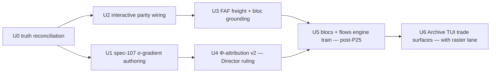

# Program 26 — International Trade

**Status:** CHARTERED 2026-07-27 (Director directive; ADR160). Lane: `101-trade-activation`
(+ worktree `trade-activation`), rebuilt at dev `56d34bd3` the same day — the pre-rewrite
snapshot survives only as the local tag `backup/101-trade-activation-pre-rewrite-DO-NOT-PUSH`.
**Authority:** Director reopening, 2026-07-27 ("international trade is a big thing").
Supersedes the 2026-07-20 deferral (`project/research/trade-after-capital-refactors.md`) —
whose preconditions were in fact already satisfied: Vol I and Vol II both merged 2026-07-21
(ceremonies `blessed(vol1-value-production-merge)` `c8aef4a1` /
`blessed(vol2-circulation-merge)` `3ce087ec`), Vol III merged 2026-07-19 (ADR089), qa
modernization (ADR090) and the parquet pipeline (ADR098) long landed. Only step 6 of that
doc — "a trade kickoff proposal to the owner" — was unexecuted; the Director's directive is
that kickoff. Tracking issue: #274 (repurposed from blocker record; est. ~8 Mtok stands
until re-estimated at U5).

## 1. Where trade actually is (audit of record, 2026-07-27)

Three-agent read-only audit of the spec-101/103 estate vs the tree at `56d34bd3`.

**Landed and live — but only on the headless batch path.** Spec-101 (ADR055, 2026-07-04)
wired Φ-week distribution end-to-end: `ImperialRentSystem._invoke_phi_distribution_if_wired`
fires when four `TickContext` keys (`session_id`, `boundary_flow_register`,
`external_nodes_phi`, `county_exposure_by_external`) are populated —
`engine/headless_runner/runner.py` is the **only** production writer of those keys
(`_advance_tick`, plus `initialize_session` → `_bootstrap_external_nodes` for the 8
international nodes + `rest_of_usa`). The Leontief imperial-rent pipeline (spec-057,
`domain/economics/tick/system/imperial_rent.py::compute`) is likewise gated on five
`ServiceContainer` overrides that only `runner.py::_build_economics_overrides` supplies.

**Absent from the playable game.** `game/session.py` (the interactive Archive-campaign
driver) calls `ServiceContainer.create()` with no overrides and never calls
`initialize_session`: interactive campaigns have **no external nodes, no Φ distribution
(silent no-op), a zero-stub Leontief pipeline, and zero TRIBUTE edges seeded**
(`WayneCountyScenario` seeds one EXPLOITATION edge, no TRIBUTE). The player never sees
imperial rent flow from abroad. This is the central defect this program exists to fix.

**Dormant, with its wiring motion already declared.** `Vol2CirculationStep`
(`engine/systems/vol2_circulation.py`) is never constructed in production;
`context["vol2_step"]` has zero writers. The seam-algebra sentinel registry
(`sentinels/seam_algebra/registry.py`, row `vol2_circulation_vol2_step`, F-2) documents
this exactly and prescribes the fix: *"wiring context['vol2_step'] into the runner is a
W-C dataflow"* motion. Note: Vol II's ADR123 "light the step" lit the **circulation
calculators**, not this gated sub-stage — both audits agree.

**Dormant formulas.** All four `formulas/unequal_exchange.py` functions are registered in
the formula registry (`exchange_ratio`, `exploitation_rate`, `value_transfer`,
`prebisch_singer`) with **zero registry callers**; the only direct call site is legacy
`web/game/engine_bridge.py`. `territory.rent_spike_multiplier`'s Prebisch-Singer tie is
comment-only. `CirculationVConservationEvaluator` is defined but never registered.

**Never authored.** Program 10 (Spectrum of Unequal Exchange, σ-gradient) and Program 11
(Transport Substrate) were RATIFIED as program docs but no `specs/107-*` or `specs/108-*`
was ever written. These are trade's theory and infrastructure layers.

**Known disclosed gaps carried from ADR055:** `bilateral_trade_tons = 0.0` (needs FAF
freight); `india`/`latin_america` → Φ=0 (no grounded bloc); the trade-share Φ-attribution
crosswalk is lossy at bloc granularity (**ADR055's declared #1 owner-review item — still
unruled**); sub-national scoped runs absorb the FULL national Φ_week (~84–141× inflation
on the michigan-canada run) — magnitude honesty requires national scope (Amendment R+S is
already NATIONWIDE-canonical, so this resolves along the way, but the invariant only
validates plumbing until then). Web trade surfaces (spec-103) are backend-only relics —
their frontend died with `web/frontend` (spec-112); the Archive TUI has no trade view.

## 2. Design constraints (binding)

1. **No shadow value system.** Every international quantity derives from the now-complete
   domestic value architecture: Vol I production (Fundamental Theorem computed), Vol II
   circulation (real calculators, I(v+s)=IIc), Vol III money (endogenous interest, P23
   price⟷value scissors). No parallel ledger, no invented prices.
2. **Aleksandrov Test** (Constitution): every construct traces to a material relation —
   blocs to trade/Φ data (Hickel ERDI, `fact_bilateral_trade_annual`, FAF freight), σ to
   OCC/vertically-integrated labor content, flows to the transport substrate.
3. **Determinism III.7** — all of it inside the tick hash; conservation invariants extend
   (`Σ_nodes Φ_node = national Φ` stays; add freight/value closure as flows materialize).
4. **Φ attribution is theory-line content.** How imperial rent attributes across blocs is
   an ideological/theoretical modeling choice — under IX.5 that is the **Director's**, not
   an agent's. U4 packages the decision; agents do not improvise it (this formalizes
   ADR055's #1-owner-review flag under the new constitution).
5. **ADR block 160+** (P25 consumes 127+; raster holds 150; governance 151).

## 3. Non-overlap covenant (the P25 lane)

P25 political-superstructure is the active engine train (another agent; 142-file surface,
measured 2026-07-27). Verified clear: all 13 files this program's near-term units touch.
Binding rules while P25 is in flight:

- **No tick-pipeline mutation** — no new/reordered systems, nothing in
  `simulation_engine.py` (Constitution IX.5 interleaving rule).
- **No touching P25-shared files:** `models/enums/events.py`, `formulas/__init__.py`,
  `models/world_state.py`, `tests/baselines/*.json`, `tools/regression_scenarios.py`,
  `web/game/engine_bridge.py`, `engine/systems/*` (except additive work inside
  `economic.py`'s already-gated sub-stages is still deferred — the file is clear today
  but the covenant treats all of `engine/systems/` as P25 territory),
  `domain/dialectics/instances/catalog.py`, `config/defines/politics.py` + `defines.yaml`
  regeneration, `CLAUDE.md`, `ai/wiring-doctrine.md`.
- `ai/decisions/index.yaml`: append-only entries; expect the zipper conflict at merge and
  resolve by keeping both blocks.
- Units marked **[post-P25]** below start only after the P25 lane merges.

## 4. Units

- **U0 — Truth reconciliation** *(safe now; this charter's companion commit).*
  spec-101 `tasks.md` checkboxes reconciled with the shipped record (ADR055 + commit
  trail); `plan.md` path corrected to `domain/economics/county_exposure.py`; ADR057's
  internal YAML key fixed (`ADR054_…` → `ADR057_…`, matching filename + index); issue
  #274 repurposed to this program's tracking issue.
- **U1 — spec-107: the σ-gradient** *(safe now; off-pipeline).* Author the Spectrum of
  Unequal Exchange spec from Program 10: per-node spectrum coordinate σ (OCC, capital
  intensity, vertically-integrated labor content; Hickel ERDI world-scale anchoring so
  external nodes and US counties share one axis). Domain math + data artifact + red-phase
  tests; **no system insertion** — consumption seams declared for U5.
- **U2 — Interactive parity (the wiring unit)** *(safe now; ADR109 typed motions, each
  closing its sentinel row).* W-C: the four Φ-distribution context keys +
  `initialize_session`/external-node bootstrap into `game/session.py` campaign start;
  W-C: `vol2_step` per the pre-declared `vol2_circulation_vol2_step` seam row; explicit
  ruling-or-wiring for the five Leontief overrides in interactive play (no silent stub).
  qa:regression is headless and MUST stay byte-identical; Archive-TUI golden drift, if
  any, is a declared §6.5 ceremony. TRIBUTE-edge seeding for the default campaign
  scenario rides here (an interactive game where `_process_tribute_phase` has nothing to
  walk is the same defect class).
- **U3 — Freight + bloc grounding** *(safe now; data lane).* `bilateral_trade_tons` from
  FAF freight as a hash-stamped checked-in artifact (the ADR121 LODES pattern);
  india/latin_america bloc grounding so Φ=0 stops being a coverage hole.
- **U4 — Φ-attribution model v2** *(packaging now; ruling before code).* Replace the
  trade-share proxy: options paper (trade-share status quo / ERDI-weighted / σ-gradient
  composition once U1 lands) → **Director ruling** → implement. Resolves ADR055's #1
  owner-review item and the sub-national inflation finding (national-scope evaluation).
- **U5 — Blocs + flows: the international layer** *(**post-P25**; the engine train).*
  Blocs as graph-level alignments over sovereigns; resource flows over the transport
  substrate (author spec-108) priced by Vol III money; σ acting on Vol I/II value flows;
  Φ becomes an actual inter-national transfer rather than a distributed national
  aggregate. New EventTypes, a `trade` defines category, possible new system position —
  all the P25-shared surfaces, hence the gate. Re-estimate #274 here.
- **U6 — Archive trade surfaces** *(coordinates with the raster-cutover lane).* Successor
  to spec-103's dead web panels: bloc Φ/trade flows, county import exposure, ERDI — in
  the terminal client. Backend projections first (client-agnostic `observe()` seam).

## 5. Definition of done (program)

International trade is **in the playable game**: an interactive campaign seeds external
nodes, Φ flows every tick and is visible to the player, freight/value have real units,
attribution carries a Director ruling, blocs/flows run on the substrate under conservation
invariants, and every formerly-dormant construct in §1 is either wired (sentinel row
closed) or deliberately retired by ADR. Full gates: `mise run check`, qa:regression
byte-identical (or declared ceremony), sentinel families green, per-unit ADRs 160+.
