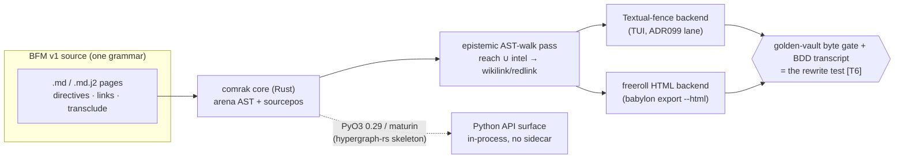
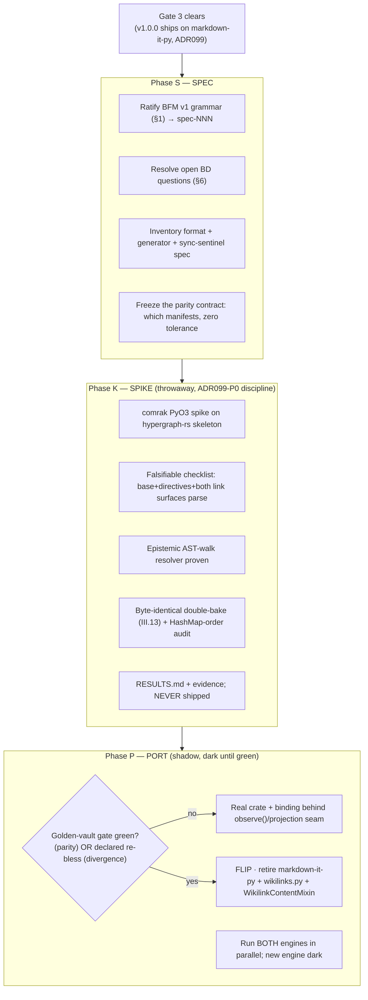

# Markdown Engine Positioning — BFM and the Rust Successor

**Program 24 (The Archive) / successor-engine positioning brief.** v0.1.0 (draft for BD
disposition), 2026-07-21. Positioning-editor synthesis over the four md-engine research
sections (`tmp/md-engine/{01-rust-cores, 02-syntax-spec, 03-estate-ground-truth,
04-html-reskin}.md`, cited below as **[S1]–[S4]**) plus the T6 tutorial-BDD ruling
(`ai/_inbox/t6-tutorial-bdd-ruling.md`, **[T6]**), the graph-render-lane ruling
(`ai/_inbox/graph-render-lane-ruling.md`, **[GRL]**), and `ai/decisions/ADR099_archive_stack.yaml`
(**[ADR099]**). Constitution v2.15.0 (2026-07-21). This engine is the **successor** to the
v1.0.0 markdown-it-py pipeline, staged **post-Gate-3**; nothing here touches the v1.0.0 train.

---

## 0. Executive verdict (the architecture in ten lines)

1. **One grammar, one AST, two renderers — and they are the same decision, not two.** The
   Rust parse core [S1] *is* the shared AST the freeroll HTML emitter renders [S4]; adopt one
   crate, hang two backends off it (Textual-fence bindings + static HTML). [S1 §5, S4 §5]
2. **Core crate: adopt `comrak` as the parse/AST core.** Richest built-in surface for our exact
   asks (native `wikilinks_*`, `alerts`, `math_dollars`, front-matter — directive dispatch rides on
   ordinary fenced `CodeBlock` info strings, which comrak produces natively, *not* comrak's own
   colon-fence `BlockDirective` extension, which BFM does not use, §1.2), a mutable arena AST with
   full sourcepos, `create_formatter!` for partial custom backends, and the strongest *structural*
   III.13 story (arena + `phf`, not HashMap-keyed). [S1 §2.2, §4, §5]
3. **Do NOT "fork markdown-it.rs for compatibility."** The token-stream-compatibility premise
   does not survive the evidence (Node-tree vs flat-token list, no dynamic Python plugins,
   core 2 yr / binding 21 mo stale, PyO3 pin 10 versions behind) — it is the *highest*-risk
   option surveyed, not the lowest. [S1 §2.5, §5]
4. **Python surface: PyO3/maturin native bindings, NOT a FastAPI loopback sidecar.** A pure,
   deterministic renderer belongs in-process; a sidecar adds a port, a process lifecycle, and a
   JSON-serialization determinism surface for zero benefit when the only caller is Python. [S1 §5, §2]
5. **Reuse the in-house precedent:** `hypergraph-rs/crates/hypergraph-rs-python` (PyO3 0.29,
   maturin, `cdylib`) is the exact skeleton — build our own binding, treat the young `comrak`/
   `comrak-ext` PyPI packages as reference only. [S1 §0, §3, §5]
6. **HTML reskin: freeroll our own emitter on the shared comrak AST.** $0 marginal toolchain
   (`rustc`/`cargo` already in `flake.nix`), one CommonMark interpretation to gate, fog boundary
   inherited for free by rendering the already-materialized vault. [S4 §5, §6]
7. **Reject the off-the-shelf SSGs.** mkdocs-material/Zola both *own the parse* → a second
   grammar (breaks "ONE single definition", doubles the III.13 surface); Hakyll adds a third
   foreign toolchain and the only *new* Amendment-AA Windows liability. mdBook (scaffold-only) is
   the sole credible fallback. Pagefind is the static-search answer regardless. [S4 §1–§2, §5.6, §6]
8. **BFM v1 = GFM base + a tiny opinionated additive set, single-definition per construct.**
   Backtick directive fences only (ADR099 re-affirmed), standard-Markdown links absolute-from-root,
   two roles collapsing to one (`{cite}`), one `{transclude}` directive, a committed line-oriented
   inventory (objects.inv's *idea*, not its bytes). [S2 §1, §3, §4]
9. **The parity gate already exists by construction.** Golden-vault byte gate (§3.5) + the
   tutorial-BDD playthrough transcript **is** the rewrite test [T6]; the successor is correct iff
   it reproduces the committed manifests byte-identically, or ships a declared §6.5 re-bless
   ceremony where the new spec *intentionally* diverges. [S3 §3.5, T6]
10. **Staging: spec → throwaway spike → shadow port, post-Gate-3, dark until the gate is green.**
    v1.0.0 ships on markdown-it-py [ADR099]; the flip is a single gate event, not a train delay.



---

## 1. BFM v1 draft grammar (Babylon Flavored Markdown)

**The single-definition law.** Every construct has exactly ONE canonical **emitted/gated**
spelling — the form that survives to the AST the byte-gate sees. A second spelling that is
*accepted only as input* and desugars deterministically to that one emitted form is not a
violation of the law; a second spelling that survives to output alongside the first is, by
definition, "a confusing edge case" and is rejected. This is the operational reading of BD
directive (b), "the standardization of GFM with the expressive power of MyST … ONE single
definition," and it is exactly the shape §6-Q1 recommends for the link construct: `[[kind/id]]`
kept as first-class accepted-on-input sugar, both spellings desugaring to one resolver + one
AST, while the baker emits only the standard-link form — one canonical emitted spelling, two
accepted input spellings, zero edge cases at the gate. Where MyST's real behavior conflicts with
what ADR099 already found true about the shipped walker, **ADR099 wins**; MyST is a grammar
reference, never an implementation to inherit wholesale. [S2 §0, §1; §6-Q1]

### 1.1 Table A — GFM/CommonMark base (inherited, single-spelling)

| Construct | BFM canonical form | Rejected alternate (and why) | Determinism note (III.13) |
|---|---|---|---|
| Headings | ATX `# … ######` | **Setext** `===/---` — two spellings of one construct | pure text |
| Emphasis / strong | `*em*`, `**strong**` | `_em_`/`__strong__` — CommonMark intraword `_` (`snake_case`) is the most-cited footgun; `*` has no such ambiguity | inherited emphasis scan is deterministic but complex; accepted as unavoidable base cost |
| Code blocks | Fenced backtick only, closer ≥ opener | **4-space indented** blocks — the "why did my paragraph become code" footgun | fence-length-outrun is the canonical escape (already `narrator_cache._fence_for`) |
| Inline code | `` `code` `` | — | none |
| Lists | `-` bullets, `1.` ordered | mixed-marker restart inherited as-is (low value to touch) | — |
| Tables | GFM pipe tables | — | already rendered (`MarkdownTD/TH`) |
| Strikethrough | `~~text~~` | — | GFM, unambiguous |
| Task lists | `- [ ]` / `- [x]` | — | unambiguous; T6 tutorial-checklist use plausible |
| Autolinks | angle-bracket `<https://…>` | **bare-URL linkify** — undelimited URL-boundary detection is a classic edge-case generator | — |
| Hard line break | trailing backslash `\` | **trailing double-space** — invisible in editor and `git diff`; backslash is greppable ("text is the assertion medium" [T6]) | — |
| Raw HTML | **dropped entirely** | no safelist — dead weight in a TUI, an injection surface in the HTML lane | removes a cross-renderer non-determinism surface |

### 1.2 Table B — the additive MyST-style set (BFM's own canonical form)

| Construct | BFM canonical form | Rejected alternate (and why) | Determinism note |
|---|---|---|---|
| **Directive fence** | backtick fence + `{name} arg` info string (ADR099's shipped form: `` ```{statblock} county/26163 `` … `` ``` ``) | **colon-fence `:::{name}`** — rejected on the grounds that survive the engine swap: a second accepted spelling of "directive fence" is exactly the "confusing edge case" §1 rules out, and backtick is the zero-migration-cost form already shipped. (ADR099-era reasoning — that paired open/close tokens break the 8.2.8 walker's generic close-pop — was true of the *incumbent* markdown-it-py/Textual-8.2.8 walker; comrak's native `BlockDirective` node parses `:::` into matched-fence nodes with no such blocker, so that reason does **not** carry over to the successor and is kept only as historical context, not as the live justification.) | zero migration cost — "keep as shipped" |
| **Directive body** | directive-private micro-DSL, unchanged (`nodes:`/`edges:`, `tier:`, `kind:`, `key: value`) | a universal generic `:key: value` option block — `{paoh}`'s hyperedge list and `{matrix}`'s grid are not key/value-shaped; forcing one relocates edge cases, doesn't remove them | each body grammar independently unit-tested today |
| **Roles** | `` {role}`target` `` / `` {role}`text <target>` `` — **exactly one role, `{cite}`** (xref collapses into it, §1.4) | MyST's `{ref}/{numref}/{eq}/{doc}/{term}/{py:class}/{external:…}` vocabulary — BFM has exactly one thing worth inline-cross-referencing | fewer roles = fewer deterministic resolution paths |
| **Targets / labels** | a page's frontmatter `id:` is its ONLY label (already shipped: `id: county/{{ fips }}`) | MyST inline `(target)=` + `:label:`/`:name:` — the addressable unit is the **page**, not the heading; sub-page anchors add heading-slug-collision machinery for a granularity the client doesn't use | reuses the Link-Law mechanism; zero new syntax |
| **Frontmatter** | YAML, `---`-delimited, flat keys only (`mdit-py-plugins.front_matter`) | nested/complex YAML values — flat was the ADR099 finding | flat keeps frontmatter byte-diffable line-by-line for the ceremony drift table |
| **Citations / xrefs** | one role `` {cite}`work-id` `` or `` {cite}`Text <work-id>` `` against the committed inventory (§1.4) | MyST's `{cite:p}/{cite:t}` style variants, `.bib` files, **live DOI resolution** — DOI is a network call (local-first violation, X.8); style variants are academic baggage | one role, one path, zero network calls — strictly stronger than MyST |
| **Transclusion** | `` {transclude}`target` `` (§1.5) | MyST `{include}` (arbitrary file byte-ranges, `start-after`/`lines`/`literal`) — BFM composes **typed** artifacts by stable id, not raw byte ranges | §1.5 |

### 1.3 Table C — explicit baggage drops (upstream constructs BFM refuses)

| Dropped construct | Why (single-line) |
|---|---|
| **Substitution** (MyST `{{ var }}` in prose) | Jinja substitution already fires **upstream** at bake time on `.md.j2`; a BFM-level `{{ }}` would be a second templating pass inside the parser — the exact Jinja-asymmetry target. No substitution construct exists, so nothing can re-trigger. [S2 §1, S3 §3.6] |
| **Smart typography** (`--`→en-dash, curly quotes, `…`) | silent locale-flavored byte mutation without a visible marker; NFC/NFD normalization drift is precisely what the byte-gate (ADR090) exists to catch. Text is byte-literal. |
| **Def lists / field lists** | redundant — the directive-body micro-DSLs already give typed key:value display; a second whitespace-sensitive syntax reopens RST's indentation edge cases |
| **Inline attributes** (`{#id .class}`) | TUI styling is a fixed closed vocabulary (directive-driven), never author-chosen syntax — "opinionated" means style is directive-driven, not syntax-driven |
| **Footnotes** (`[^1]`) | superseded by `{cite}` — a citation resolves against the checkable inventory, never sits as unverified prose-adjacent text (Verifiability principle applied to syntax) |
| **Comments** (RST `%`) | author commentary already lives in Jinja `{# … #}` on the `.md.j2` source, stripped before a `.md` exists — no demand |
| **Math beyond dollarmath**, `amsmath`, alert, distinct gfm_autolink | zero current call sites; adding grammar for unused constructs is premature (demand-driven principle) |

### 1.4 The Link Law and the BFM inventory (intersphinx without Sphinx)

**Link Law, stated once.** Every BFM link is a *standard* Markdown inline link
`[display](/kind/id)`, where the path is **absolute from one single root — the vault root**,
never relative to the linking page's directory. There is nothing to be relative *to* (every
page lives at a flat `kind/id` coordinate), which deletes an entire class of "which directory
am I linking from" bugs before it can exist. [S2 §2]

Resolution has **three** outcomes, not two (this is why BFM cannot be pure static Sphinx/
intersphinx): **revealed** → live gold link; **known-but-unrevealed** (fog) → crimson redlink,
honest "you don't know this yet" (III.11); **unknown-entirely** → also redlink today, but worth
distinguishing (`redlink-fog` vs `redlink-absent`, §6-Q3). The resolver is therefore a function
of `(inventory, target, viewer_epistemic_state)`, **not** the pure `(inventory, target)` Sphinx
uses. [S2 §2, §3; S3 §3.3]

**The BFM inventory** — the intersphinx analogue. One committed, versioned, line-oriented file
(`vault/inventory.tsv`), **objects.inv's *idea* (a committed inventory a role resolves against),
not its bytes** (BFM drops the zlib compression — the corpus is orders of magnitude smaller, and
plain text stays `git diff`-reviewable). Five fields, mirroring objects.inv's proven shape 1:1
with `domain:role` collapsed to one `kind` discriminator and `uri` collapsed away (the `id`
**is** the URI under the Link Law): `id · kind · priority · title · provenance`. `provenance` is
the one genuine addition — the field the Verifiability principle needs (a game entity's minting
tick, or a `corpus-work`'s exact corpus path). Generated-never-hand-authored (like `defines.yaml`),
committed, sync-gated by a `test_inventory_sync.py`-shaped sentinel, resolved by a flat dict
lookup — **no docutils, no builder, no network, ever** (strictly more local-first than even
MyST's own `myst.xref.json`, which still does live DOI resolution). [S2 §3]

> **Positioning-editor reading of BD's "single directory".** BD said "absolute path from a
> single directory." The estate is one-subdir-per-kind (11 dirs) [S3 §3.8]. I read "single
> directory" as **single root, absolute-from-root paths** — which the `kind/id` coordinate
> already satisfies structurally. Do **not** flatten to one physical folder: the kind-subdirs
> *are* the absolute path segments, and flattening re-blesses every manifest path + rewrites 11
> `bake_*` methods for no gain. Only the link *spelling* migrates, not the layout. (Confirm — §6-Q2.)

### 1.5 Transclusion design (the LLM-artifact seam)

**One directive, `` {transclude}`target` ``**, two resolution disciplines by the target's `kind`
— mirroring `{statblock}`'s already-shipped baked-vs-live dual mode. `target` is one of:
(1) a **whole page** `kind/id` — the materialized, byte-bakeable form of the live `peek(entity,
depth)` mechanism (`watchlist`'s docstring already calls itself "a page of transclusions"); (2) a
**page-scoped directive fragment** `kind/id#directive-name`, restricted to the **closed** directive
vocabulary (never an arbitrary heading anchor — sidesteps heading-slug collisions entirely); (3) a
**narrator artifact** `narrative/<entity>/<tick>--<pin_slug>` — the III.6 `(entity, tick,
model_pin)` key, i.e. `CachedNarrative`, "transcluding a typed pydantic part of an LLM conversation"
made concrete. This is a **new** capability relative to the shipped estate (there is no multi-turn
conversation model today — `narrate()` is single-shot); the successor's conversation-turn type
should **compose with or supersede** `CachedNarrative`, not parallel it, since `NarratorCache`
already owns the disjoint-subtree / fire-and-forget / degraded-is-recorded / byte-gate-exclusion
machinery. [S2 §4; S3 §3.6]

**The Jinja-asymmetry law, enforced at the transclusion boundary.** A `{transclude}` of a
`narrative/**` target inserts the target's `text` as **opaque literal bytes** — a string-splice on
already-rendered `.md` bytes, never a re-entrant call into the Jinja sandbox and never re-parsed
as markdown-with-directives. This *extends* the existing `narrator_cache.py` discipline ("LLM text
never meets Jinja") to the one new place prose could leak into template evaluation; the
fence-length-outrun defense (`_fence_for`) composes cleanly (the host page re-wraps the transcluded
body in a fresh outrun fence). [S2 §4; S3 §3.6, §3.10 item 2]

**Determinism split (why `narrative/**` stays byte-gate-excluded even when transcluded).** The
gated/committed copy of a page transcluding narrator content renders an **inert citation stub**
(literal target-id text — deterministic, sourced from the id string alone), exactly `{statblock}`'s
baked-vs-live split; the live TUI (never byte-gated, structurally cannot see `narrative/**`)
resolves the same directive fully via a host-injected provider. Net: simultaneously
byte-bakeable AND fully informative — the S5 "pages stay fully informative with narrator off"
commitment, extended to composed pages. **Fog behavior** reuses the redlink pattern scaled to a
block: an unrevealed transclusion target renders an `{absence}` fence with the established
"Verb(Noun) to <goal>" remedy text — one fog discipline uniform across links, transclusion, and
directives. [S2 §4; S3 §3.6]

---

## 2. Core-engine recommendation

### 2.1 Adopt comrak; do not fork markdown-it.rs; spike-not-adopt Djot

**Adopt `comrak` as the parse/AST core, build our own PyO3 binding.** Ranked verdict from the
landscape survey [S1 §4–§5]:

1. **comrak** — richest built-in surface for our exact asks (native `wikilinks_*`, `alerts`,
   `math_dollars`, front-matter), mutable arena AST with full `--sourcepos`, `create_formatter!`
   for partial custom backends (write only the node kinds you care about, fall through for the
   rest — the friendliest "Textual-content emitter" path of the group), strongest *structural*
   III.13 story (arena + `RefCell` + `phf`, not HashMap-keyed), and load-bearing in exactly our
   role (crates.io, docs.rs, GitLab, Deno `deno_doc`). Weakest point: neither PyPI binding is
   production-grade — **budget writing/hardening our own**. *(Correction: comrak also ships a
   first-class `BlockDirective` AST node — *"a container directive block … for custom
   extensions"* — but per docs.rs it is COLON-FENCE syntax (`:::warning` … `:::`,
   `NodeBlockDirective = {fence_length, fence_offset, info}`, opt-in via
   `ExtensionOptions.block_directive`). BFM v1 explicitly rejects colon-fence directives (§1.2
   Table B) in favor of backtick `` ```{name} arg``` `` info-string fences, so this node stays
   OFF; BFM's directive dispatch reads ordinary fenced `CodeBlock` "info" strings instead — the
   same shape the shipped markdown-it-py pipeline already parses via `DIRECTIVE_RE` on
   `token.info` (S3 §3.2) — which comrak produces natively regardless of the directive
   extension.)*
2. **pulldown-cmark** — unmatched maintenance/downloads/wasm track record (mdBook, Zola, rustdoc),
   but **no custom-rule mechanism** — directives/wikilinks/transclusion would be bolted on via
   source-text or Event-stream pre/post-processing rather than real grammar rules. Safe-but-more-labor.
3. **markdown-it.rs + markdown-it-pyrs** — conceptually the closest API-shape match, but the
   evidence makes it the **highest-risk** option: core untouched 2 yr, binding 21 mo, PyO3 pin 10
   versions stale, and a documented dynamic-plugin gap that specifically defeats porting our one
   existing custom rule (wikilinks) without a Rust rewrite. **The "lowest-risk migration" framing
   in the directive is not supported by the evidence** — the risk is concentrated here.
4. **jotdown (Djot)** — best *philosophical* fit for "no confusing edge cases" (Djot's entire
   thesis) with native generic-attribute/fenced-div syntax closer to MyST colon-fences than any
   CommonMark-family option — but a **content-migration** decision (new grammar for the whole
   corpus), smallest ecosystem, no Python story. **Time-boxed spike, not a default pick** (§6-Q5).
5. **markdown-rs** — best-engineered AST/positions/testing story, but its maintainer explicitly
   does not want a general extension mechanism (the one thing we most need) and it is 15 mo quiet
   post-1.0 with no Python bindings. Wrong shape.

BD's "GFM standardization" instinct lands on comrak cleanly: it *is* a cmark-gfm-fidelity port
(652/652 CommonMark, 670/670 GFM), so "standard GFM" is the base, and the MyST-expressive-power
delta rides on native `wikilinks_*` plus info-string directive dispatch over comrak's natively
produced `CodeBlock` nodes — not comrak's colon-fence `BlockDirective` extension, which stays OFF
(§1.2). [S1 §2.2]

**Resolver note that shapes the port.** comrak's `wikilinks_*` parses `[[…]]` into a real AST node
but has **no parse-time resolver callback** — the redlink-vs-wikilink classification becomes a
**post-parse AST-walk pass** checking each resolved href against the epistemic known-set. This is
*cleaner* than ADR099's current parse-time closure (classification decoupled from grammar) **and**
it is exactly the seam we need for §1.4's dual-surface Link Law: comrak parses both `[[…]]` and
standard links into href-bearing nodes, and **one** AST-walk pass does epistemic resolution
(`reach ∪ intel`) and re-tags both into `wikilink`/`redlink`. One resolver, both surfaces, in Rust.
The hard constraint [S3 §3.3, §3.10] carries: resolution stays **call-time and pluggable**, never
baked into the parse tree — the same target is a wikilink for one org and a redlink for another,
and can flip within a session as the org investigates. [S1 §2.2; S3 §3.3]

### 2.2 Python surface: PyO3/maturin bindings, NOT a FastAPI sidecar

**Verdict: in-process PyO3/maturin native bindings.** Reuse `hypergraph-rs/crates/
hypergraph-rs-python` verbatim as the skeleton (PyO3 0.29 — already at the crates.io ceiling —
maturin, `cdylib` `_…_core`, edition 2021 / rust 1.85). [S1 §0, §5]

**The local-first argument, spelled out.** A loopback FastAPI sidecar *is* legal under X.8 (the
llama-server precedent permits loopback child processes) — but "legal" is not "indicated," and for
this component the sidecar is strictly worse:

- **The function is pure and deterministic.** A markdown renderer is `(source, view, tick) → bytes`.
  In-process, that is a synchronous call with zero serialization. A sidecar interposes an HTTP
  request/response and a JSON (or other) serialization boundary that **itself must be made
  byte-stable** to satisfy III.13 — a *new* determinism surface (float formatting, key ordering,
  async completion ordering) invented for no gain. [S3 §3.10 item 1; S4 §3]
- **The only caller is Python.** The sidecar's one real advantage — a language-agnostic HTTP
  surface / process isolation — buys nothing when the projection layer that calls the renderer is
  always the same Python process. PyO3 gives the identical "Python API surface" BD asked for
  (`fastapi python api surface or something`) without a port, a bound socket, a health probe, or a
  child-process lifecycle the baker must supervise.
- **The precedent is the *opposite* case.** llama-server exists as a loopback child because
  llama.cpp is a heavyweight, GPU-bound, stateful server with its own lifecycle. A stateless pure
  parser is the inverse — it is exactly the "move the hot 5% into Rust, keep the Python API" shape
  that pydantic-core / Ruff / Polars / tokenizers all solve **in-process** via PyO3/maturin, and
  that hypergraph-rs already solves in-house. [S1 §3]
- **Layering is preserved either way** — the Constitution seam is `observe()`/projection emits,
  clients display; a PyO3 module slots under the projection layer without a new network hop, keeping
  the import-linter contracts and the local-first "no external servers" posture intact. [GRL layering]

*(A sidecar would still be a Rust binary calling the same comrak crate — so this decision does not
change the crate choice, only the boundary. In-process wins on every axis that matters here.)*

---

## 3. HTML reskin / SSG lane recommendation

**Freeroll: our own HTML emitter on the shared comrak AST** — this is the same "one grammar, two
renderers" decision as §2, applied to the second backend. The comrak AST that must already be
byte-stable for the TUI's golden vault produces the HTML too, via a `create_formatter!` backend.
[S4 §5, §6]

Why freeroll wins:

- **$0 marginal toolchain.** `rustc`/`cargo` are already vendored in `flake.nix` (present for
  hypergraph-rs) — the only candidate with a *verified* zero incremental Nix-closure cost. [S4 §5.1]
- **One determinism surface, not two.** A Rust-owned emitter means the exported site and the
  interactive vault share **one** CommonMark interpretation — there is no second parser whose
  version bumps can silently drift the HTML out of parity with the TUI. This is the concrete form of
  "a Rust core should STRENGTHEN determinism": not Rust-is-more-deterministic, but **not doubling the
  implementations that must independently agree with one golden baseline**. [S4 §3]
- **Fog boundary inherited for free.** `babylon export --html` renders the already-materialized,
  already-fog-filtered vault — a render-target swap over the *same* content, never a second
  projection that re-queries the engine (II.11: one projection contract, two consumers). Pagefind
  (post-build static-search) inherits the same boundary — it can only index what got rendered. [S4 §5.5, §5.6]
- **Graph-render lane drops in natively.** [GRL] applies unchanged — DOT/layout-JSON source stays
  inside the byte-gate, rasterized SVG/PNG stays outside it ("assert the SOURCE, display the
  RENDER"); HTML is the *easier* target than the TUI (no glyph-floor/kitty duality — an `<svg>`/
  `` just works). KSBC §9b ports to CSS custom properties almost verbatim, and the TUI-only
  256-color degraded fallback has **no HTML analog** — a genuine cost reduction. [S4 §5.3, §5.4]

**What the rejected options were rejected FOR:**

- **mkdocs-material — rejected as a base FOR introducing a second CommonMark implementation**
  (Python-Markdown + `pymdown-extensions`) solely for the export lane, directly contradicting
  directive (b)'s "ONE single definition" and doubling the III.13 surface. Its `--md-*-color`
  custom-property theming is worth reading as a **styling reference** for §5.3's KSBC token layer —
  reference only, not adoption. [S4 §2, §5.3, §6]
- **Zola — rejected as a base FOR** being hard-coupled to its own bundled `pulldown-cmark` with no
  verified raw-AST/pre-rendered-HTML ingestion path (same second-grammar problem), **plus** Tera as
  a second template language that would need the Jinja-asymmetry retrofit applied to an engine we
  do not control. Its single-binary speed does not offset grammar duplication. [S4 §2, §6]
- **Hakyll — rejected FOR** a third foreign toolchain (Haskell/GHC/Cabal) with a real verified
  closure cost (~1.1 GB GHC alone, ~2 GB total via nixpkgs) for a single export feature, **and** it
  is the one candidate that opens a *new* Amendment-AA Windows-disclosure liability (native-Windows
  GHC/cabal is materially rockier than Rust's Tier-1) rather than riding the one Rust already
  carries. Indefensible against simplicity-first + DRY. [S4 §5.7, §6]
- **mdBook — the sole credible fallback (viable, not recommended).** Uniquely among third-party
  tools it has a **verified escape hatch**: declare only `[output.babylon]` and omit
  `[output.html]` and its own markdown parser never runs — our binary gets the raw chapter text and
  does 100% of the parse+emit, keeping our grammar sole. It buys `SUMMARY.md`/`book.toml` nav +
  `mdbook serve` live-reload. Rejected as default only because its chapters/book content model does
  not fit our page taxonomy (dossiers, PAOH pages, Chronicle) and would need immediate overriding —
  likely *more* total code than freerolling. Keep as the fallback if contributor-familiarity or the
  dev-server loop are later judged worth the extra dependency. [S4 §4, §6]

---

## 4. Staging — how this lands without touching the v1.0.0 trains

**The parity gate already exists by construction — that is the whole point.** [T6] made the
golden-vault byte gate (`tests/integration/archive/test_vault_golden.py` + `tools/vault_regression.py`,
§3.5) plus the tutorial-BDD playthrough transcript the **rewrite test**: a rebuilt engine is correct
*iff* (a) it reproduces the committed per-page sha256 maps + HEAD shas of `single_county` and
`detroit_tri_county` byte-identically across two independent bakes, and (b) the tutorial-BDD suite
(Textual Pilot, narrator-OFF, fixed seed) stays green, its playthrough transcript un-drifted. No new
acceptance apparatus is needed; the successor is judged against the same gate v1.0.0 is. [S3 §3.5; T6]

**Which goldens re-bless as a declared ceremony (and which never).** Two disjoint cases:

- **Pure parity (bytes MUST match).** Anything the new engine reproduces identically — the base
  grammar, directive dispatch, transclusion stubs — is gated at *zero tolerance*; a byte difference
  there is a bug, STOP. No ceremony.
- **Intentional spec divergence (declared re-bless).** The Link-Law migration is the load-bearing
  case: switching `[[wikilink]]`→`[standard](/kind/id)` changes the *rendered byte content* of ≥9 of
  13 templates [S3 §3.9, §3.5], so **every committed vault manifest re-blesses** via a §6.5 ceremony
  — a `git commit` carrying `Baselines: blessed(<slug>)`, the drift table generated by
  `tools/generate_ceremony_message.py` (never hand-written), enforced by the commit-msg hook +
  pre-push range mirror + CI ceremony-gate. **The ceremony surface is exactly `tests/baselines/
  vault/**` manifests** — and *only* those. The 27 `.raw` SVG snapshots are **tertiary/aesthetic**
  per [T6] ("regenerate freely, never a behavioral gate"); they re-render but they do **not** gate
  and do **not** ceremony. If §6-Q2 lands on "keep kind-subdirs" and the wikilink-input-sugar path
  (§6-Q1) keeps standard links as the sole *emitted* form, the divergence is one declared re-bless,
  not a layout churn. [S3 §3.5, §3.9; T6]

**Program shape: spec → spike → port, post-Gate-3.**



- **Phase S (Spec).** Promote §1 to a real `spec-NNN`; resolve §6; write the inventory
  generator + `test_inventory_sync.py` sentinel spec (mirror `test_constants_sync.py`); freeze the
  parity contract (which manifests, zero tolerance, ceremony surface = `tests/baselines/vault/**`).
- **Phase K (Spike).** A **sanctioned throwaway** comrak+PyO3 spike, mirroring ADR099's own P0
  discipline (scratchpad, N/N green, RESULTS.md + evidence, never shipped) against a falsifiable
  checklist: base+directives+both link surfaces parse; the epistemic AST-walk resolver works;
  byte-identical double-bake holds; the **"no HashMap iteration reaches output order" audit** passes
  (owed for any Rust core, comrak included, per III.13); the maturin build stands on the
  hypergraph-rs skeleton. [S1 §2.1–§2.2, §5; ADR099 spike pattern]
- **Phase P (Port).** Build the real crate + binding behind the **same** `observe()`/projection seam
  the TUI already uses; run **both** engines in parallel with the new one *dark* until the
  golden-vault gate proves parity (or a declared re-bless covers the intentional divergence). The
  gate **is** the switch. Retire `markdown-it-py` + `wikilinks.py` (~333 lines) +
  `WikilinkContentMixin` **only after** the flip. This lands post-Gate-3 without touching v1.0.0:
  the successor is dark/shadow until green; v1.0.0 ships on the incumbent; the flip is one gate
  event, not a train delay. [S3 §3.5, §3.9; ADR099]

---

## 5. Decision matrices

### 5.1 Core parse/AST engine (candidates × criteria)

| Criterion | **comrak** ✅ | pulldown-cmark | markdown-it.rs / -pyrs | jotdown (Djot) | markdown-rs |
|---|---|---|---|---|---|
| Extension surface for our asks | **best** (native `wikilinks_*`, alerts, math, front-matter; directives dispatch off `CodeBlock` info strings — comrak's own colon-fence `BlockDirective` node is OFF, BFM rejects that spelling, §1.2) | none (event pre/post-process only) | ruler/plugin *in Rust only* (no dynamic Py plugins) | generic attrs + fenced divs (closest to colon-fence) | **deliberately none** |
| Determinism / III.13 posture | **strongest structural** (arena+RefCell+`phf`) | HashMap lookup-only (audit owed) | less scrutiny (241K dl) | zero-deps (supply-chain +) | best-tested but no ext seam |
| Python binding path | our own on hypergraph-rs skeleton; 2 young PyPI refs | none official (write from scratch) | pyrs stale 21 mo, PyO3 10 vers behind | none | none |
| WASM / HTML-lane reuse | `comrak-wasm` [UNVERIFIED] | **excellent** (mdBook/Zola/rustdoc) | none | demo-only | in-progress [UNVERIFIED] |
| Maintenance / bus factor | **very strong** (pushed today, 12 issues, load-bearing) | **healthiest** (2.6k★, 121M dl) | **worst** (core 2 yr, binding 21 mo) | active single-maintainer | 15 mo quiet post-1.0 |
| Migration cost (our estate) | moderate (write binding + resolver walk) | higher (bolt-on rules) | **highest** (Rust rewrite of wikilinks) | **corpus grammar migration** | high (no ext seam) |
| Windows / Amendment AA | rides Rust Tier-1 | rides Rust Tier-1 | rides Rust Tier-1 | rides Rust Tier-1 | rides Rust Tier-1 |
| **Verdict** | **ADOPT** | fallback (safe, more labor) | build-on-bones only, never as-is | spike-only fallback | reject |

### 5.2 HTML reskin / SSG lane (candidates × criteria)

| Criterion | **Freeroll (Rust emitter)** ✅ | mdBook (scaffold-only) | mkdocs-material | Zola | Hakyll |
|---|---|---|---|---|---|
| Owns the parse? (second grammar?) | **No — reuses our AST** | No (verified escape hatch) | **Yes** (Python-Markdown) | **Yes** (bundled pulldown-cmark) | Yes (Pandoc) — escapable only in Haskell |
| Determinism surface | **one** grammar to gate | one (our parser via escape hatch) | **two** implementations | two | two |
| Marginal toolchain cost | **$0** (rustc/cargo vendored) | $0 (Rust) + extra CLI/dep | Python markdown stack | Rust binary + Tera | **~1–2 GB GHC** (foreign) |
| Windows / Amendment AA | rides Rust Tier-1 | rides Rust Tier-1 | rides Python | rides Rust | **new AA liability** (rocky GHC) |
| Maintenance (verified) | ours | v0.5.4, Jul 2026, active | v9.7.7, Jul 2026, active | v0.22.1, slow cadence | 4.17, Apr 2026, small team |
| Fit to page taxonomy | **native** (our projection model) | chapters/book mismatch → override | forced content model | forced content model | arbitrary but hand-rolled |
| **Verdict** | **ADOPT** | credible fallback | styling reference only | reject | reject |

*Cross-cutting: search = **Pagefind** (post-build, SSG-agnostic, fog-inherits-for-free) regardless of
lane [S4 §5.6].*

---

## 6. Risks and open BD questions

### Risks (engineering — carried, not BD-gated)

- **comrak's PyPI bindings are young (0.0.x).** We write and harden our own on the hypergraph-rs
  skeleton; the PyPI packages are reference only. Budgeted in Phase K/P. [S1 §2.2, §5]
- **HashMap-iteration-order audit is owed for any Rust core (comrak included).** Rust's per-process
  random SipHash seed makes accidental iteration-order reliance a *run-to-run* non-determinism bug —
  exactly the III.13 class. Explicit "no HashMap iteration reaches output order" audit is a Phase-K
  gate item. [S1 §2.1–§2.2]
- **The epistemic resolver must stay call-time/pluggable, never baked into the parse tree.** Same
  target = wikilink for one org, redlink for another, flippable mid-session. A Rust core that freezes
  resolution at parse time silently freezes fog. The comrak post-parse AST-walk seam is the fix, but
  it is a *requirement*, not an optimization. [S3 §3.3, §3.10 item 6; S2 §2]
- **This checkout's venv is drifted** (`markdown-it-py` 3.0.0 installed vs 4.2.0 pinned) — `uv sync`
  before any "vs the current pipeline" benchmark, or the baseline is wrong. [S3 §3.1]
- **Postgres FTS is not yet real** (no `to_tsvector`/`pg_trgm` in `src/babylon` today) — do NOT
  architect the parser around an indexing integration that doesn't exist; search is declared-column
  text over projection rows, orthogonal to the parser. [S3 §3.7, §3.10 item 5]

### Open BD questions (max 5 — genuinely BD-level only)

1. **Wikilink sugar: keep-or-kill?** *(the headline call.)* BD's directive leans standard-links
   ("probably standard markdown links"), but the estate is 100% `[[kind/id]]` and design-canon R2/S1
   makes wiki the *gameplay metaphor* ("essentially becomes like vimwiki"; Obsidian/vimwiki/logseq
   interop). **Editor recommendation:** keep `[[kind/id]]` as first-class **accepted-on-input** sugar
   (both spellings desugar to one resolver + one AST → the "edge case" is eliminated at the resolver,
   not the surface), but make standard `[text](/kind/id)` the **canonical emitted/gated** form (the
   baker never emits `[[…]]`, so the byte-gate sees exactly one form). Killing input sugar *entirely*
   for one-definition purity is a **design-canon amendment** to R2/S1 — BD's call, not the parser's.
   [S2 §2; S3 §3.9 row 1, §3.10 item 6]
2. **"Single directory" = single root, or literal single folder?** Editor reads it as **single root,
   absolute-from-root paths, keep the 11 kind-subdirs** (they *are* the path segments) — dissolves
   the 11-`bake_*`-rewrite + path re-bless cost. Literal flattening re-blesses every manifest path
   for no gain. Confirm the reading. [S3 §3.8, §3.9 row 2]
3. **Redlink two-state: fog vs absent — visually distinct?** Should "known-but-unrevealed" (the thing
   exists, you haven't found it) and "unknown-entirely" (broken reference) render as distinct redlink
   variants, or stay one crimson state as today? A game-design/UX call (S7/S10 nav canon owner), not a
   syntax question. [S2 §2 open point; S3 §3.3]
4. **Promote `ConceptCard.formula` to `$$…$$` dollarmath?** Today it's a plain undirected fence. One
   new construct (dollarmath — pulldown-cmark/comrak stream it natively) buys a real KaTeX/MathJax
   render target in the HTML lane **from the same source bytes** (TUI still degrades to literal LaTeX
   text, unchanged). The one "add a construct" with payoff beyond parity — flagged, not decided. [S2 §1]
5. **Djot fallback: authorized or off the table?** If comrak's directive/attribute story proves
   insufficient at spike, is a corpus-wide grammar migration to Djot (jotdown) — literally BD's own
   "no confusing edge cases" wording, but blast radius = *every* `.md` — an authorized fallback, or
   ruled out now? Recommendation: authorize a *time-boxed spike* only, decide on evidence. [S1 §2.4, §5; S4]

---

## Reference register

**Section files** (positioning inputs, `/home/user/.claude/jobs/756d4549/tmp/md-engine/`):
- **[S1]** `01-rust-cores.md` — Rust core landscape, candidate matrix, comrak verdict, PyO3 prior art.
- **[S2]** `02-syntax-spec.md` — BFM v1 grammar (Tables A/B/C), Link Law, inventory, transclusion.
- **[S3]** `03-estate-ground-truth.md` — shipped-estate constraints, compatibility ledger, hard constraints.
- **[S4]** `04-html-reskin.md` — SSG lane candidate matrix, freeroll verdict, KSBC/graph/fog/AA.

**Repo rulings & decisions:**
- **[T6]** `ai/_inbox/t6-tutorial-bdd-ruling.md` — tutorial-BDD = the rewrite test; text is the assertion medium; SVG snapshots tertiary/aesthetic.
- **[GRL]** `ai/_inbox/graph-render-lane-ruling.md` — assert the SOURCE, display the RENDER; glyph floor mandatory; layering.
- **[ADR099]** `ai/decisions/ADR099_archive_stack.yaml` — v1.0.0 stack: markdown-it-py + fenced directives + wikilink rule; REJECTED list (MyST runtime, mistune, marko, minijinja-py, sixel …).

**Repo paths cited (verified present, 2026-07-21, branch `feature/archive-wo52b`):**
`src/babylon/tui/wikilinks.py`, `src/babylon/tui/directives.py`,
`src/babylon/projection/vault/narrator_cache.py`, `src/babylon/projection/vault/render.py`,
`src/babylon/projection/epistemic_search.py`, `src/babylon/projection/vault/materializer.py`,
`tests/integration/archive/test_vault_golden.py`, `tools/vault_regression.py`,
`tools/generate_ceremony_message.py`, `hypergraph-rs/crates/hypergraph-rs-python/Cargo.toml`,
`flake.nix`, `CONSTITUTION.md` (v2.15.0), `project/programs/24-the-archive.md`.

**Constitutional anchors:** III.6 (narrator cache key), III.11 (Loud Failure), III.13 / Amendment W
(byte-identical bakes, golden vault), X.8 (local-first), Amendment AA (Windows Tier-1 disclosure),
§6.5 (baseline ceremony), II.11 (declared interfaces).

*Do not commit — draft for BD disposition.*
