# Player Interface Shell — Design Spec

*Design document, 2026-07-21. Brainstormed and BD-approved. This is the information-architecture
spec for the v1.0 player-and-agent interface: the four player views, the composable shell, the
action registry, the two drivers (keyboard + deterministic policy), and the BDD e2e gate that
gates the whole game. It threads the NORTH_STAR projection lane (`clients render, AI observes,
engine adjudicates`) into a concrete Textual shell. The plan lives downstream (writing-plans);
the law stays `CONSTITUTION.md`; the runtime seams stay `ai/architecture.yaml`.*

Status: **APPROVED design, pre-plan.** Feeds T3 (economy dossier), T4-integration (views into the
campaign shell), T6 (tutorial-BDD). Scope-fenced against the post-1.0 horizon (§F).

---

## 0. The one-sentence frame

The four player views **render** the observation seam for a human; the deterministic policies
**consume the same seam** for the CPU agents; both write through **one action registry** into
**one adjudication queue**; the engine ticks and the cycle repeats. **The player is the one agent
whose driver is a keyboard.** This is the NORTH_STAR projection lane made concrete: the shell is a
disposable *client* on a durable *seam*.

## A. The unifying architecture — agents in the graph

There is no "human vs. the AI." There is a **population of agents** living in the BabylonGraph —
the state, corporations, institutions, mass orgs, factions, and the player — and each agent has two
faces: an **observation** (what it can see of the projected world) and an **action space** (what it
can do to the world). The player's action vocabulary is the nine Article V verbs; the state's and
corporations' vocabularies are the macro list (construct, fund research, guide tech, procure
military, police, courts, public health, trade, freight, logistics…). Intersections are first-class:
an action available to several agent types (both a state and a corporation can "invest"; both a
revolutionary org and a state can "repress/counter-repress"), gated by agent type. One action
algebra, agent-type as the gate.

```mermaid
flowchart TB
    subgraph GRAPH["BabylonGraph — Stratum 0 (the world)"]
        AG["AGENTS as nodes: organizer(YOU) · state · corporations<br/>institutions · mass orgs · factions"]
    end
    subgraph SEAM["OBSERVATION SEAM — observe() = a family, not one call"]
        VM["project_* → frozen Pydantic view models<br/>+ DeclaredView registry + fog/veil gate"]
    end
    subgraph REG["ACTION REGISTRY — ActionSpec (agent-type-gated)"]
        AS["9 player verbs → organizer · macro actions → state/corp<br/>intersections = actions gated to several types"]
    end
    subgraph DRV["TWO DRIVERS over the SAME registry + seam"]
        KB["KEYBOARD driver<br/>TUI action bar → submit_verb"]
        POL["POLICY driver (deterministic, in-tick)<br/>ActionPolicy = generalized npc_stub"]
    end
    subgraph VIEWS["THE FOUR VIEWS — human renderers of the seam"]
        V1["Dashboard"]:::g
        V2["Map"]:::ok
        V3["Wiki"]:::ok
        V4["Topology"]:::half
    end
    GRAPH --> VM
    VM --> VIEWS
    VM --> POL
    KB --> QUEUE["game_turn queue → OODASystem adjudicates"]
    POL --> QUEUE
    AS -.gates.-> KB
    AS -.gates.-> POL
    QUEUE --> GRAPH
    VIEWS -->|"you read, form a theory"| KB
    classDef ok fill:#1a3a1a,stroke:#4a4;
    classDef half fill:#3a3a1a,stroke:#aa4;
    classDef g fill:#3a1a1a,stroke:#a44;
```



**Constitutional grounding.** The CPU agents decide via **deterministic in-engine policies** —
algorithms over the projected state, computed in-tick, seeded, reproducible, part of the tick hash.
The narrator LLM only *describes* what they did. This is the only model that preserves
"Graph + Math = History," determinism, and Amendment V's "AI narrates, never adjudicates"
(`CONSTITUTION.md:348`). The barred "AI" is the *narrator*, not deterministic policy — so the CPU
player needs **no amendment**. `ooda/npc_stub.py::select_npc_actions` + `RuleBasedStateAI` already
*are* deterministic in-engine policies; the CPU player is their **generalization** into the richer
agent action space, not a clean-slate build.

## B. The composable shell — hybrid, in Textual terms

Window model: **tabbed main + persistent rails** (BD-selected over full tiling and simple tabs — it
gives the "many systems at once" feel and keeps chronicle + verbs always visible, without the
window-manager build that risks the v1.0 ship; full tiling is the post-1.0 evolution).

```
┌ BABYLON ───────────────────── T+142 ⏸ ┐
│chron│ [Dashboard] Map Wiki Topology │watch│
│icle ├───────────────────────────────┤list │
│tick │                               │orgs │
│feed │      MAIN VIEW (1 of 4)        │you  │
│     │                               │track│
├─────┴───────────────────────────────┴─────┤
│ ⌨ Agitate  Organize  Investigate ▸  …      │
└────────────────────────────────────────────┘
```

A new `AppShell` reuses the parts that already exist as pure renderers:

- **Docked header** — title · tick counter · pause state.
- **Left rail** — chronicle ticker (`tui/chronicle.py` `ChronicleEvent`/`TickBulletin`; the
  "wind is blowing" digest lands here via T5's `v_*_trend` views).
- **Right rail** — watchlist / context inspector (`tui/watchlist.py`).
- **Bottom action bar** — verb plate (`tui/verb_plate.py`, currently render-only).
- **MAIN region** — the four domains, switched by a `ContentSwitcher` + number keys `1–4`; the
  command palette (`tui/palette.py::EntityNavigatorProvider`) does fuzzy entity jumps. Today's
  single-Markdown-document app (`tui/app.py::ArchiveApp`, `app.py:164`, `compose` `:251-262`)
  becomes the WikiView's body.

Keyboard-first, glyph-floor everywhere. The shell lives in `babylon.tui` as a projection client;
the composition root (`babylon.game.session`, built by T4) glues it to the live runtime. The
import-linter contract (`pyproject.toml`, tui ⊄ engine/persistence/django) is preserved — the shell
never imports the engine; it consumes projections and emits queued verbs.

## C. The four views — bounded units

Each view is a unit with one purpose, a declared data source, and a v1.0-live vs. stub split.

### C1. DashboardView — economic data *(GAP → build; = T3's economy dossier)*
- **Renders:** the Fundamental-Theorem verdict read off `opposition_states["wage"].balance`
  (that IS (Wc, Vc) — reuse, never a parallel Φ); Φ tri-decomposition (φ_UE + φ_repro + φ_dom);
  surplus split (s = p+i+r+t); wealth distribution; reserve army. **All aggregates as extensive
  ratio-of-sums**, never mean-of-ratios (the intensive-aggregation error class).
- **Data source:** a NEW `EconomyView` frozen-Pydantic projection + `project_economy`, aggregating
  today's scattered per-subject fields (`view_models.py` `median_wage`/`imperial_rent_phi`,
  `SocialClassView.wealth` `:831`) and surfacing `engine/systems/wealth_distribution.py` — computed
  in-engine but never projected today.
- **Status:** GAP. No `economy.md.j2`, no `EconomyView`. This unit is exactly T3's economy-dossier
  deliverable — the brainstorm specs it; T3 builds it.

### C2. MapView — geographic *(wired → extend)*
- **Renders:** existing choropleth (`tui/map_room.py::render_map_room` `:120`, bitmap via
  `build_choropleth_image` `:90`) at glyph/raster **information parity** (ADR097 — same bitmap,
  glyph floor `HalfcellImage` or kitty `TGPImage`).
- **Data source:** `projection/topology/choropleth.py::ChoroplethCell` `:67` ←
  `choropleth_aggregation.py:91` ← DeclaredView `v_county_value_aggregate` (`registry.py:140-161`).
- **Extend:** a **lens selector** (view-state) — value-band lens, tension lens, and the fog /
  class-vision filter (`projection/fog/filter.py::apply_fog`, `class_vision.py:44`) *promoted from a
  payload gate to a selectable UI lens* — plus a tier/resolution selector
  (`MapTier = ea|state|county`, `choropleth.py:48`). PNG/SVG via the existing in-process bitmap path.

### C3. WikiView — the Archive *(wired → extend)*
- **Renders:** the baked markdown vault (`projection/vault/materializer.py:67-361`), git-committed
  at sim-time, through `BabylonMarkdown` (`app.py:119`) + `BabylonFence` directives
  (`tui/directives.py:369` — dispatches `{statblock}/{narrative}/{paoh}/{maproom}/{egotree}/{matrix}`,
  loudly refuses unknown directives) + wikilinks/redlinks (`tui/wikilinks.py`; absence renders as
  absence, III.11).
- **Extend — the semantic layer at v1.0 depth:** a **computed backlink index** + type/category
  facets, derived cheaply (each page knows its type + its outbound wikilinks → invert for
  backlinks). Replaces the current *convention* ("backlinks = incidence," a page listing its own
  roster) with a real "what links here." **Full property-query language = post-1.0 BFM engine.**
- **Status:** vault wired; backlink index + facets are the new v1.0 work.

### C4. TopologyView — the graph *(text-floor → raster polish)*
- **Glyph floor (LIVE today):** ASCII incidence / adjacency / Levi / PAOH renderers
  (`projection/topology/{incidence,levi,paoh}.py` → `tui/topology/{matrix,egotree}.py`, shown via
  `{matrix}/{egotree}/{paoh}` fences).
- **Raster polish:** the graph-render lane (`rustworkx.visualization` `graphviz_draw`/`mpl_draw`, or
  XGI → SVG/PNG via the kitty raster lane) per `graph-render-lane-ruling.md` — **assert the DOT
  source, display the render**; glyph floor mandatory beneath every raster. Zero code today (ruled
  2026-07-21); XGI/`hypergraph-rs` deps added only when the unit lands.
- **Node-type gap (survey):** production node types are TERRITORY, SOCIAL_CLASS, ORGANIZATION,
  INSTITUTION, INDUSTRY, SOVEREIGN, FACTION (`models/enums/topology.py:12`). **Individuals &
  coalitions/alliances are NOT production node types** — `KEY_FIGURE` model retired (ADR084),
  `PERSON` fixture-only, "coalition" has no vocabulary term. v1.0 renders what exists; individuals &
  coalitions render as **declared-future absence** (a stub-labeled node, never a fabricated one).

## D. The action registry + the two drivers

- **`ActionSpec`** (frozen Pydantic): `id · label · agent_types · cost (AP/resources) ·
  preconditions · effect_ref (ActionType) · status(LIVE|STUB)`.
- **The 9 verbs** (`educate, reproduce, attack, mobilize, campaign, aid, investigate, move,
  negotiate` — `projection/verbs/preview.py:25-35`) = LIVE specs gated to the organizer agent.
- **Institutional macro-actions** = STUB specs gated to state/corp (construct/research/procure/
  courts/health/logistics) — rendered as honest `{stub}` in Dashboard/Topology, never fake-resolved.
- **Player driver:** wire the currently-dead path — action bar → `submit_verb`
  (`projection/verbs/submit.py:93`) → `TurnSink` protocol (`:31-51`) → `game_turn` queue
  (`PostgresRuntime.submit_turn`, `postgres_runtime/_legacy.py:1091`) → `build_player_actions`
  (`:142`) → `OODASystem` (`engine/systems/ooda.py:68`). The TUI never calls `submit_verb` today
  (`verb_plate.py:44-49` is render-only) — this closes that ∂L seam.
- **CPU driver:** generalize `ooda/npc_stub.py::select_npc_actions` (`_NPC_PRIORITIES` `:33-56` +
  `RuleBasedStateAI`) into a deterministic `ActionPolicy` selecting from the `ActionSpec` registry
  (agent-type-gated) given the observed projection — in-tick, in the hash.
- **Design note (flagged engine cleanup, stageable after the mock):** npc_stub writes engine state
  *directly* today, while player verbs go through the queue. Route CPU actions through the SAME
  queue/adjudication for symmetry — so human and CPU actions are adjudicated identically. This is an
  engine refactor, not shell work; flag, don't block.

## E. Mock / build strategy — build against the real contracts

Build the shell against the **real contracts** (view models, the new `ActionSpec`, the existing
`TurnSink`) with **fixture data** where the engine isn't wired yet. The mock shell renders
real-shaped projections and issues real queued verbs against a stub runtime. Nothing is throwaway:
as T3 (dashboard), T4 (campaign runtime), and Vol I+II (live economy) land, fixtures swap for live
projections with **zero interface change**. This is how we "feel the game now" without faking the
seam — the disposable client on the durable seam.

## F. Scope fence

**v1.0 LIVE:** hybrid 4-view shell · map + wiki wired · dashboard built (= T3) · topology
text-floor + raster polish · 9-verb player driver wired · `ActionSpec` registry with institutional
stubs · CPU policy = generalized npc_stub surfaced · the BDD e2e gate.

**POST-1.0:** full tiling window-manager · Semantic-Wiki property-query language (BFM Rust engine) ·
individual & coalition node types · the macro-action *mechanics* (tech tree, military procurement,
courts, public health, freight/logistics — most gated on Capital Vol I+II and beyond; trade is
formally deferred) · custom-font/TTF raster polish · external/LLM anything.

## G. The BDD e2e gate — the capstone (what gates the game)

One `TutorialStep` script (frozen Pydantic), three consumers per the tutorial-BDD ruling: **player
overlay · headless Pilot CI driver · dev docs**. The headless driver runs the shell via Textual
`Pilot`, issues each step's verb, and **captures the emitted screen text** — the raw render of what
the player sees. Determinism: narrator OFF ⇒ byte-reproducible; the narrator lane (`narrative/**`)
is fenced out of every verify story by design.

Each captured step asserts **three layers** — the elegant payoff of "everything the player touches
is text": because the render is text and the math is read from the same projection, **one transcript
run validates behavior, render, and math simultaneously.**

1. **Behavioral coverage** — every Article V verb + every tutorial option is exercised and resolves.
   A verb that never appears = dead option = **∂L red gate**. ("Does every option that gets clicked
   work as advertised?")
2. **Render fidelity** — the emitted text matches semantic expectations (text assertions primary;
   the Textual SVG snapshot is aesthetic-only). ("The raw text render is what the person sees, and
   it follows along.")
3. **Algebraic invariants** — the state the verbs produced satisfies the mathematical-core
   **property laws**, not just golden bytes:
   - Fundamental Theorem: revolution-impossible ⟺ `Wc > Vc` (off `opposition_states["wage"].balance`)
   - `Φ ≥ 0` and `Φ = φ_UE + φ_repro + φ_dom` (tri-decomposition closure)
   - Survival calculus: rupture ⟺ `P(S|R) > P(S|A)`
   - Bifurcation direction by SOLIDARITY-edge sign · metabolic overshoot `O = C/B > 1`
   - Dialectic freshness law (gap readings never accumulated) · intensive = ratio-of-sums
   - Determinism: same seed ⇒ identical tick hash across the whole run

This is the CLAUDE.md "redundant verification" doctrine made concrete — **golden text replay +
property laws + scenario playthrough + determinism gate**, four evaluation strategies with different
blind spots, all riding one transcript. Transcript drift *is* behavior drift (NORTH_STAR §4). It is
the v1.0 Definition-of-Done line "tutorial completes + full campaign session with computed theorem."

---

## Appendix — file anchors (from the 2026-07-21 grounding survey)

| Area | Real today | Gap / new work |
|---|---|---|
| Shell | `tui/app.py:164` single-page; one `Screen` = `LobbyScreen` (`campaign_menu.py:322`); no tabs | `AppShell` + `ContentSwitcher` + rails |
| Dashboard | fields scattered in `view_models.py`; `wealth_distribution.py` unprojected | `EconomyView` + `project_economy` + `economy.md.j2` |
| Map | `map_room.py:120`, `choropleth.py:67`, `v_county_value_aggregate` | lens selector (UI), tier selector |
| Wiki | `materializer.py`, `directives.py:369`, `wikilinks.py` | computed backlink index + facets |
| Topology | ASCII `topology/{incidence,levi,paoh}.py` | raster lane (rustworkx/XGI); individual/coalition node types |
| Observation seam | `project_*` → view models; `registry.py:235` (5 DeclaredViews); `fog/filter.py` | — |
| Verb write-path | `verbs/submit.py:93` `submit_verb`→`TurnSink`; works headless; **zero live callers** | wire TUI action bar → submit_verb |
| CPU agent | `ooda/npc_stub.py` deterministic selector; `ooda.py:68` resolver | generalize to `ActionPolicy` over `ActionSpec` |

## Decisions log (this brainstorm, BD-approved)

1. Combined surface — one spec for all five consumers (4 views + AI). *Approved.*
2. CPU agents = deterministic in-engine policies; opponents ARE the physics; no amendment. *Approved.*
3. One unified `ActionSpec` registry, agent-type-gated; intersections first-class. *Approved.*
4. Player = revolutionary/organizer agent; seat swappable by design (a player is just a
   keyboard-driven agent). *Approved.*
5. Window model = hybrid (tabbed main + persistent rails); full tiling = post-1.0. *Approved.*
6. Mock against real contracts with fixtures; nothing throwaway. *Approved.*
7. BDD e2e gate with three assertion layers (behavior · render · algebra). *Approved.*
