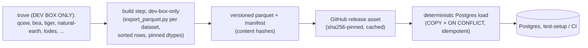

# Deterministic Data Artifacts — design seed for the B1-successor program

**Status:** research/design seed, not ratified. Every claim traces to the four investigation maps
commissioned 2026-07-14 (drive-coupled test surface, CI data pipeline, parquet/Postgres-load
machinery, loader history + trove shape). No code changes; this proposes the shape of the program
that makes the owner's ruling true.

## 1. The ruling

> "from a CI perspective, CI and tests should **never** be pulling from the babylon-data drive.
> any files it needs need to be encoded in parquet or some other form of file that can be loaded
> deterministically into postgres."

— Owner ruling, 2026-07-14, verbatim.

**Why now.** The 2026-07-13 mount-displacement incident is the proximate cause
(`reports/incident-2026-07-13-data-mount-displacement.md`). The LUKS data drive was unmounted when
Docker came up after an earlyoom session kill; Docker silently auto-created the missing bind-mount
directory `/media/user/data/babylon-pg` **on the root filesystem** and `initdb`'d a fresh, empty
Postgres cluster into it, no error anywhere. When the drive was later remounted, its rightful
mountpoint name was squatted by that root-fs leftover, so udisks fell back to `/media/user/data1`,
dangling all 29 repo `data/*` symlinks — 10 reference-DB unit tests went **red** (not skipped,
per `tools/data_doctor.sh`), ~40 more skipped, and two divergent Postgres lineages appeared (a real
8-day history frozen, a throwaway shadow growing live), needing a manual sudo-gated runbook to fix.
The ruling generalizes the lesson: a workstation mount state should never be load-bearing for
CI/test greenness — remove the coupling, don't heal it faster.

## 2. Current state — the drive-coupled surface

### 2.1 Three trove-coupled families (Map 1)

| Family | Path pattern | Scale | Env override? |
|---|---|---|---|
| A. Reference SQLite | `data/sqlite/marxist-data-3NF.sqlite` (repo symlink → babylon-data drive, 5.7 GB) | 86 files (tests+src+tools) | `BABYLON_NORMALIZED_DB_PATH` |
| B. Raw trove files (bypass the DB) | `/media/user/data/babylon-data/{bea,lodes,tiger,natural-earth,qcew,gdp-by-industry}/...`, `babylon_hickel_final.csv`, `babylon_ricci_final.csv` | ~12 files | **none** — hardcoded absolute paths |
| C. Session archives (unrelated dataset) | `/media/user/data/babylon-archives` | 4 files | `BABYLON_ARCHIVE_ROOT` |

Family B is most fragile: no env-var indirection, so a mount-path change breaks it with no override.

### 2.2 Two independent skip/fail mechanisms (Map 1)

| Mechanism | Where | Behavior when data absent |
|---|---|---|
| 1 — marker-only CI deselect | `pytest.mark.requires_reference_db`, filtered only inside `test:unit-ci`/`test:rest-ci` mise tasks | Local `mise run check` doesn't filter it → ~15 files run for real, no existence guard → **hard fail**, not skip |
| 2 — runtime `pytest.skip()`/`skipif` | ~30 files, e.g. `qcew_db_path()` session fixture (`tests/integration/economics/conftest.py`, mirrored in `tests/integration/tensors/conftest.py`), module `pytestmark`, per-function `skipif` | Clean `pytest.skip()` — the ~40-skip half of the incident signature |

### 2.3 Distinct datasets tests actually consume (Map 1)

From the reference SQLite: `dim_county`, `dim_industry`, `dim_time`, `dim_bea_industry`,
`dim_bea_economic_area`, `dim_metro_area`, `bridge_county_metro`, `bridge_county_h3`,
`fact_qcew_annual`, `fact_bea_county_gdp`, `fact_bea_io_coefficient`, `fact_bea_final_demand_annual`,
`fact_census_income`, `fact_coercive_infrastructure`, `fact_broadband_coverage`,
`fact_lodes_commuter_flow`, `fact_hickel_erdi_annual`, `fact_bilateral_trade_annual`, and ~15 more
(full list in Map 1). From raw trove files, outside the DB entirely: `babylon_hickel_final.csv`,
`babylon_ricci_final.csv`, `gdp-by-industry/GrossOutput.xlsx`, `bea/MAKE-USE-IMPORTS*.zip`, TIGER
shapefiles, the Natural Earth sqlite, LODES OD `.csv.gz` files.

### 2.4 The CI mechanism today — `ci-data-v1`/`v2` (Map 2)

| Aspect | Current state |
|---|---|
| Builder | `tools/make_reference_subset.py` — per-table policy dict (`full`/`michigan`/`skip`), hard-fails loud on any unclassified table |
| Format | **SQLite**, not parquet — a smaller SQLite file, byte-reproducible via `VACUUM` + forced `journal_mode=DELETE` |
| Size | 391 MiB published (target "comfortably under 2 GB"), 93% smaller than the 5.7 GB source |
| Distribution | GitHub release asset via `.github/actions/fetch-reference-db/action.yml`: pinned tag (`ci-data-v2`) + asset name + hardcoded sha256; verified **before first open** (readers flip to WAL mode, mutating bytes) |
| Gating | 4 `main.yml` jobs + 2 `nightly.yml` jobs behind repo var `vars.CI_REFDB_READY == 'true'` (currently `true`) |
| `/media/user` in CI | Confirmed **zero** references in any workflow/action file (Map 2, `rg`-verified) — already never touches the drive for the tables it covers |

**This already satisfies the hermetic-path half of the ruling for what it covers** — the gap is
freshness/process, and coverage (SQLite not parquet; family A only, not B or C).

### 2.5 The IMPORT_USE gap (Map 2, `ai/_inbox/deferred-repo-refactors.md` §1)

Program 17 loaded 31,688 BEA IMPORT_USE rows into `fact_bea_io_coefficient` via
`tools/ingest_bea_imports.py` — **locally only**, 2026-07-12. `make_reference_subset.py` classifies
that table `"full"`, reasoned pre-ingestion (4.7 MB, 131,239 rows, "no direct real-DB test hit
found") — zero mentions of `IMPORT_USE`. The published `reference-subset-20260711b.sqlite` was
built one day **before** the ingestion and never regenerated since. Net effect:
`tests/integration/economics/tick/test_imperial_rent_real_wiring.py` (the crown Φ test) passes
locally and is unproven everywhere else — CI, other devs, Hetzner. This is exactly the freshness
failure the ruling should make structurally impossible: a `"full"` policy only carries whatever sat
in the local source DB at build time, with no forcing function to rebuild.

## 3. Target architecture

**Reused machinery:**

- **Manifest + hash pattern** — model on `make_reference_subset.py`'s JSON manifest + `.sha256`
  sidecar + per-table policy, hard-loud-fail on unclassified tables (III.11). Pattern reused,
  output format moves from one SQLite file to a parquet-file-per-table manifest.
- **CI distribution** — reuse `fetch-reference-db/action.yml`: pinned release tag + asset +
  hardcoded sha256, verified **before first open**, `actions/cache@v6` on tag+hash — generalized
  from "one sqlite file" to "manifest + N parquet files."
- **Postgres schema for reference tables** — reuse `src/babylon/reference/schema.py` as-is: a
  dialect-agnostic SQLAlchemy `DeclarativeBase` (`NormalizedBase`, 33 `dim_*` + 34 `fact_*`
  tables), not SQLite-specific DDL. `NormalizedBase.metadata.create_all(pg_engine)` builds the
  same schema in Postgres — no hand-authored DDL for ~67 tables.
- **Idempotent DDL application** — reuse `postgres_schema.py`'s `POSTGRES_SCHEMA_DDL` pattern
  (loop over statements, catch `DuplicateTable`/`DuplicateObject`/`UndefinedObject`).
- **Ephemeral Postgres provisioning** — reuse `testcontainers.postgres.PostgresContainer`
  (`tests/integration/web/conftest.py`, hermetic, no host-mount) and/or `.github/actions/postgres-up`'s
  postgis+pgvector image for longer-lived CI instances.
- **Bulk-load pattern** — reuse `hex_hydrator.py`'s `COPY ... FROM STDIN` into a
  `CREATE TEMP TABLE ... ON COMMIT DROP` then `INSERT ... ON CONFLICT DO NOTHING` (10-50x faster
  than `executemany`), fed from DuckDB's `read_parquet()` (already used one-directionally in
  `archival.py::query_archived_session`).

**New (does not exist in either repo today):** a Parquet **writer** for reference/trove data
(`archival.py`'s writer is Postgres→Parquet for live session exports — wrong direction/source;
only its DuckDB-view-over-Parquet reading pattern is reusable); a Parquet→Postgres **loader** (no
such path exists — `sqlite_hydrator.py` is SQLite→Postgres, row-by-row, not COPY); the per-dataset
trove **export scripts** (new packages homed in `babylon-data`, following the QCEW package's
proven shape — `qcew/writer.py` staged-rebuild + atomic swap, `qcew/audit.py` jsonschema report,
checkpoint-per-year resumability — per Map 4's recommendation); the **multi-file manifest scheme**
(today's manifest describes one SQLite file's table policies; a parquet set needs a manifest keyed
by file, one hash per file plus a top-level manifest hash).

**Determinism requirements (explicit, Constitution III.7/III.12):**

1. **Sorted row order at write time** — every parquet file sorted by its natural key (e.g.
   `dim_county` by `county_fips`; `fact_qcew_annual` by `(county_fips, naics_code, year)`), never
   left to DuckDB/pyarrow's incidental write order — the parquet analog of
   `make_reference_subset.py`'s `VACUUM` + `journal_mode=DELETE` byte-stabilization.
2. **Pinned dtypes** — an explicit `pyarrow.Schema` per table, mapped column-for-column from
   `schema.py`'s SQLAlchemy types (`Numeric`, `Float`, `Date`, `Text`, …), never inferred, so a
   `Decimal` column can never silently round-trip through a float.
3. **Content-hash manifest** — a `.sha256` per parquet file plus one manifest-level hash, verified
   **before first use**, matching `fetch-reference-db`'s pre-open verification discipline.
4. **Idempotent load** — `COPY` into a temp table, then `INSERT ... ON CONFLICT DO NOTHING` (the
   `hex_hydrator.py` pattern), so a retried CI job or repeated local test-setup never double-inserts.

## 4. Migration waves

### Wave A — artifact builder + manifest + one pilot dataset

**Pilot: QCEW + the three core dims (`dim_county`, `dim_industry`, `dim_time`) +
`fact_qcew_annual`.** Reasoning: **(1) breadth** — the `qcew_db_path` session fixture is
duplicated across `tests/integration/economics/conftest.py` and
`tests/integration/tensors/conftest.py`, feeding `qcew_engine` → `qcew_session` →
`real_qcew_source`; the same four tables also gate `test_michigan_reference_data.py`,
`mvp/test_hydration.py`, `mvp/test_industry_hydration.py`, and the QCEW/census-backed methods in
`test_county_aggregation.py` — no other cluster in Map 1 touches this many currently
red-or-skipping files at once. **(2) existing scaffold** — `babylon-data`'s spec-086 QCEW package
already has a deterministic, checkpointed, audited imputation pipeline (US1 imputation core, US2
staging/checkpoints/swap/CLI, US3 audit models — Map 4, "effectively implemented"); Wave A adapts
this into an *exporter* rather than building export logic from zero.

**Files touched:** NEW `babylon-data`: `src/babylon_data/qcew/export_parquet.py` (reads spec-086's
staged output, sorts by natural key, writes pinned-schema parquet + per-file sha256) and a
manifest-fragment builder adjacent to `qcew/audit.py`'s jsonschema report shape. NEW `babylon`:
`tools/build_reference_artifacts.py` (dev-box-only orchestrator modeled on
`make_reference_subset.py`'s policy-dict + manifest + sha256-sidecar shape), a release-publish
step modeled on the `ci-data-v1`/`v2` precedent (new tag, e.g. `ci-parquet-v1`, coexisting with the
current SQLite asset), and a Parquet→Postgres loader for these 4 tables (per §3). MODIFIED:
`qcew_db_path` in both conftest files becomes a Postgres-session fixture; the 5-candidate-path
`_DB_PATH_CANDIDATES` search is retired for this dataset.

**Acceptance test:** with the babylon-data drive fully unmounted, the qcew-fixture-chain tests
(`tests/integration/economics/throughput/test_adapters.py`, `tests/integration/mvp/`) go from
skip/red to green, sourced entirely from the published parquet artifact + a freshly-provisioned
Postgres — zero `/media/user` references anywhere in the invoked code path (Map 2's own `rg`
technique).

### Wave B — migrate remaining reference tests off `data/sqlite`

Generalize Wave A's exporter/loader pair to the remaining ~30 `dim_*`/`fact_*`/`bridge_*` tables
(§2.3), prioritized by spec-098's stated hydrator-consumer order (`bea_io`, `melt_tau`,
`basket_gamma`, `erdi`, `hickel_drain`, `ricci_unequal`, `faf_freight`, qcew done, `bea_reis_rent`,
`fred_rates`) — one `babylon_data/<dataset>/export_parquet.py` sibling per dataset.

**Files touched:** N new `babylon-data` export packages; each of the ~86 Family-A test files gets
its SQLite-search fixture replaced, one cluster at a time, with a Postgres-session equivalent;
`tools/make_reference_subset.py` retired once every table it subsets has a Wave-B parquet
equivalent (or kept for dev-box convenience, see §5).

**Acceptance test:** all 15 `requires_reference_db`-marked files (§2.2) run green under
`mise run check` with `CI_REFDB_READY` unset and the drive absent; the marker becomes deletable.

### Wave C — IMPORT_USE/Φ into the artifact

Closes the gap in `ai/_inbox/deferred-repo-refactors.md` §1: wire
`tools/ingest_bea_imports.py`'s 31,688-row IMPORT_USE output into the `fact_bea_io_coefficient`
exporter built in Wave B, republish, confirm `test_imperial_rent_real_wiring.py` — currently
unguarded, marker-only, locally-green-only — passes in CI.

**Files touched:** the BEA export package gains the IMPORT_USE rows; manifest regenerates and
republishes under a new content hash.

**Acceptance test:** `test_imperial_rent_real_wiring.py` green in a CI run that never touched
`/media/user` — Program 17's "map lights up everywhere, not just this machine" claim becoming true.

### Wave D — delete the test-side drive coupling; `data:doctor` stays dev-box-only

Give each of Family B's ~12 raw-trove-reading files (Hickel/Ricci CSVs, the BEA XLSX direct-driver
test, Natural Earth sqlite reader tests, LODES OD test) its own Wave-B-style parquet artifact;
retire the `_DB_PATH_CANDIDATES` fallback chains repo-wide.

**Files touched:** `tests/unit/infrastructure/test_ne_reader.py`,
`tests/unit/economics/circulation/test_lodes_loader.py`,
`tests/integration/economics/tick/test_imperial_rent_calibration.py`,
`tests/integration/economics/test_tensor_hierarchy.py`; `tools/data_doctor.sh` +
`tools/heal_data_mount.sh` keep current behavior, gain a header note that they are dev-box-only
diagnostics (already accurate — Map 2 confirms neither is referenced by any CI workflow).

**Acceptance test:** `rg -rn '/media/user' tests/ src/` returns zero hits (Map 2's own technique);
the full suite is green with the babylon-data drive never mounted.

## 5. Open owner decisions

- **Hosting location for artifacts.** Continue the GitHub-release-asset pattern (`ci-data-v1`/`v2`)
  for parquet too, or move elsewhere? `archival.py::upload_to_r2` is already retired
  (`NotImplementedError`, owner's 2026-07-03 local-only ruling for *session archives*, a different
  data class); reference artifacts need their own fresh hosting decision.
- **Artifact size budget.** Current SQLite subset targets "comfortably under 2 GB," ships at 391
  MiB. Does that carry over once content is columnar/compressed parquet across ~67 tables (likely
  smaller), or does the owner want a fresh budget once Wave C's IMPORT_USE rows and Wave B's ~30
  additional tables land?
- **Does `data/sqlite/marxist-data-3NF.sqlite` stay for local dev convenience?** Parquet/Postgres
  CI-and-test-only while local dev keeps the SQLite symlink+drive, or does local dev migrate too,
  retiring the SQLite reference DB entirely?
- **spec-097/spec-086 interaction.** spec-086's QCEW imputation loader is the Wave-A scaffold, but
  Map 4 finds no evidence the same imputation work has started for the ~23 other loaders spec-098
  calls for generalizing it to. Does the parquet program wait on spec-086-style imputation per
  dataset before exporting it, or proceed with "full copy, no imputation yet" (mirroring
  `make_reference_subset.py`'s own untouched-table handling today), layering imputation in later?

## 6. Explicitly out of scope

- **Production/Hetzner deploy's Postgres usage** — targets CI/tests; the running game already uses
  `PostgresRuntime` for real gameplay and is not drive-coupled today.
- **Dev-box use of the babylon-data drive for anything other than test/CI data paths** —
  loader/exporter authorship, ad hoc analysis, `tools/data_doctor.sh`/`tools/heal_data_mount.sh`,
  and the raw trove remain legitimate dev-box-only activity; the ruling's own phrasing — "any
  files **it** [CI] needs" — scopes the fix to what CI/tests touch, not the dev box.
- **Session-archive data** (Family C, `babylon-archives`/`BABYLON_ARCHIVE_ROOT`) — a different
  dataset (simulation output, not reference input) with its own settled ruling (2026-07-03, R2
  upload retired, local-only); not part of the reference-data trove this ruling addresses.
- **Rewriting `archival.py`'s Postgres→Parquet exporter** — solves the opposite problem (live
  session export for later replay); only its DuckDB-read pattern (§3) is repurposed here.
