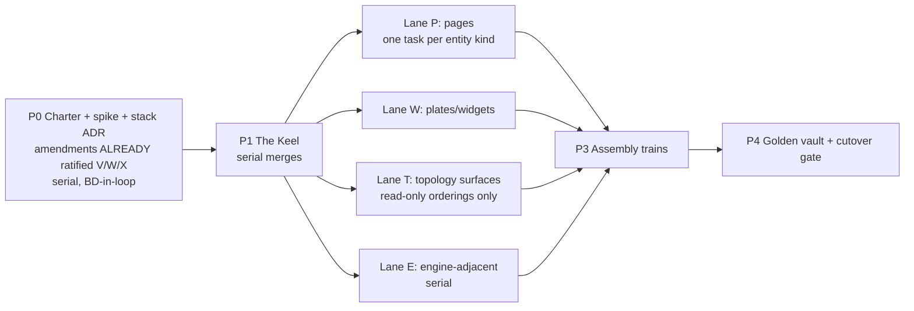

# Babylon — Roadmap v3 (canonical)

**As of:** `dev@37234235` + branch `docs/archive-p0` (2026-07-20 late evening).
**Supersedes:** `ai/_inbox/tui/tui-roadmap-original.md` (July Design Backlog, pinned `744f865`)
and `ai/_inbox/tui/tui-roadmap-update.md` (North Star v2, pinned `72def41c`) — both now in
`ai/_inbox/archive/`. Verified by a 31-agent recon pass against the live tree, not memory.
**Companions (live canon, unchanged):** `ai/_inbox/tui/20260719archiveinterfacedesign.md`
(binding rulings R1–R8, synthesis S1–S11), `ai/_inbox/tui/20260719archivestackresearch.md`
(starting pins), `ai/_inbox/tui/babylonlocalfirstinfrastructure.md` (D1–D3 deployment),
`project/programs/24-the-archive.md` (charter).

---

## 0. North star (carried verbatim from v2; undated — everything else churns, this shouldn't)

Babylon is a deterministic engine read through **The Archive** — a wiki the player inhabits
in a terminal. Every entity the organization knows is a page; every relation is a link; play
is reading the files, forming a theory, and issuing verbs the engine adjudicates. Between
engine and eyes there is exactly one kind of thing: a **declared projection**. Clients are
disposable; projections are the product.

Invariants:

1. **The engine never learns the client exists.** Zero engine-value drift from interface
   work; `qa:regression` byte-identical except at declared ceremonies.
2. **Fog, veil, and absence are properties of projections, not widgets.** No political value
   serializes outside organizing reach; below-veil sessions never receive value-axis
   payloads; a missing record renders as a loud absence block. Loud Failure extends to
   pixels (III.11).
3. **No LLM in the input path.** Narrator prose is attributed, cached by
   `(entity, tick, model_pin)`, and optional; the game is fully playable and fully
   informative with it off (R4/S5 — now constitutional via Amendment V).
4. **Rendering is deterministic and golden-gated.** III.13 (Amendment W): ordered
   projections, sandboxed sim-time-only templates, snapshot baselines, a golden vault in CI.
5. **Work ships as plans of agent-sized tasks, tagged parallel-safe or serial, integrated on
   trains, ruled by batched BD decisions.** The estimation unit is one agent context window.
   Ceremonies are counted, never smuggled.
6. **History is provenance.** Every commit binds its work to its plan, train, pin, and
   baseline claim through structured trailers; ceremonies are tags; project state is
   *derived from the record*, never hand-maintained beside it.

## 1. Ground truth — what landed since the v2 pin (`72def41c` → `37234235`, PRs #214–#233)

The deltas that invalidated v2's prose:

| Landed | Consequence for the roadmap |
|---|---|
| **Amendments V/W/X ratified** (v2.12.0, ADR093, PR #224) | v2's proposed "T/U + X.1 PATCH" P0 gates are DONE, under different letters (§2). Constitution is ahead of code, as v2 wanted. |
| **Capital Vol III fully merged** (U1–U9, PR #216, ADR089) | v2's "U3–U8 open" and decision-queue item 7 ("finish or park?") are moot. The interleaving precondition for the keel is satisfied. |
| **Ceremony gate mechanized** (PR #226, `tools/check_baseline_ceremony.py`) | v2 §5.4's highest-leverage git-doctrine item is live: `Baselines: blessed(<slug>)` trailer enforced by hook + CI. |
| **infra/ submodule mounted; Nix flake canonical** (PR #223, X.7 IMPLEMENTED) | v2's "Article X bans Nix" blocker is gone; nothing waits on a flake. |
| **Parquet-canonical reference pipeline cut over** (ADR098, PR #227; follow-ups closed via #231/#232/#233 + infra#4) | Reference DB is a sha-pinned build product; absence sentinel (15th family) live. |
| **qa:regression modernized** (ADR090, PR #220) | 6-scenario byte-identical gate + declared-coverage checks — the Archive program's "byte-identical throughout" contract has real teeth. |
| **hypergraph-rs Phases 0–3 done, Phase 4 paused** (owner ruling 2026-07-19) | Topology surfaces (Lane T) have a maturing ordering/projection provider; Python xgi remains the interim source. |
| **web estate ruled legacy** (owner 2026-07-20; Amendment V; `tests/unit/web/test_engine_bridge.py` module-skip) | `engine_bridge.py` (now 11,778 lines) is extraction source, not maintained surface. Fog logic still sits at `web/game/fog/` awaiting the Hoist. |

Still true from v2: no `observe()`/projection contract exists anywhere in `src/babylon`;
no vault/materializer scaffolding; Playability Spine essentials DONE (ADR079–083);
systems dedup DONE (ADR081).

## 2. Constitutional state (the letter map — v2 guessed wrong letters)

| Requirement (v2 name) | Ratified as | Status |
|---|---|---|
| Client rebinding + narrator-only AI ("Amendment T") | **Amendment V** (v2.12.0, ADR093) | LIVE. II.8 transport-generalized (browser = legacy); II.5 narrator-only; Amendment I superseded-in-part. |
| Deterministic materialization / golden vault ("Amendment U") | **Amendment W** → III.13 | RATIFIED · **PENDING CODE** — the pending code *is* Program 24's pipeline. ADR093 forbids describing it as existing. |
| Article X.1 Nix/Docker scope PATCH | **Amendment X** | RATIFIED and exceeded: X.1 rescoped to prod estate; X.7 IMPLEMENTED (flake = sole pinning authority); X.8 local-first Periphery/Metropole RATIFIED · **PENDING CODE**; X.6 Grafana carve-out (D3). |
| Provenance & ceremony ("Amendment V" in v2 §6.5) | **Not constitutionalized — by BD ruling 2026-07-20 (tonight): lives permanently in CLAUDE.md §6.5 + CI.** Question CLOSED. | Mechanization live (PR #226). |

Held / untriggered, all confirmed: **Amendment T remains reserved for ADR072** (Divergence
Channel, awaiting BD); **Amendment D** (hyperedge reconciliation) pending — Lane T renders
read-only orderings and must not trigger it; **CCL** re-derive against ADR082/083 before any
ratification; **NLCD** data-source amendment held (gates Epic 14); **Amendment B** untouched.
The constitution's follow-up TODO for a **II.11 subsystem-boundary-contracts spec** is still
open — Program 24's projection registry (P1.2) is designated to discharge it.

## 3. Program 24 — The Archive (codename ruled 2026-07-20)

Charter: `project/programs/24-the-archive.md`. Phases (from v2 §3, unchanged in shape):

- **P0 (in flight tonight):** charter, throwaway spike (stack research §7's 8-item
  falsifiable checklist), stack ADR099 draft, consolidated ruling batch. The amendment
  half of v2's P0 is already discharged.
- **P1 The Keel (serial):** the Hoist (fog + read-model logic out of Django, transport-
  neutral projection package — discharges the II.11 TODO), projection registry + contracts,
  vault materializer skeleton, TUI shell, fixture recorder. Exit: county end-to-end
  (tick → projection → baked page → rendered → snapshot golden).
- **P2 fan-out lanes / P3 assembly / P4 ceremony + cutover** as in the charter.

**Cutover gate — RATIFIED by BD 2026-07-20 (tonight), binding:**

1. Test-port ledger closed — every Playwright behavioral assertion mapped to a projection
   contract test, a Pilot test, or the golden vault.
2. Unaided-first-action e2e green in the TUI.
3. The BD completes a full campaign session in the TUI.
4. Golden-vault byte-gate green in CI.

Then `src/frontend/` is deleted in one commit; `web/` demotes to what is verifiably
load-bearing (per the local-first doc: the thin ingest API).

**Interleaving rule:** after the keel, at most one engine train + one Archive train;
cross-train surfaces behind one narrow named helper + a loud behavioral contract.

## 4. Workflow + git doctrine (BD rulings 2026-07-20, tonight)

- **§6.5 provenance home: CLAUDE.md + CI, permanently.** No constitutional amendment.
- **Git doctrine adoption items 1–3 APPROVED** (v2 §5.9): (1) trailer schema + generated PR
  bodies + in-repo hook estate; (2) `wt:new`/`wt:done` workspace primitives; (3) complete
  blessing mechanization (partially live via PR #226). Build as engine-untouched side tasks
  during P1. Items 4–5 (reservations/codegen, integrator formalization + single-flight
  lock) activate when the first fan-out plan demands them.
- Vocabulary (program/design record/plan/task/train/ruling batch) and parallel-safety rules
  carry from v2 §4 unchanged; the work-order header is doctrine for every P2 task prompt.

## 5. Inbox disposition ledger (2026-07-20 sweep; recon-verified)

**Archived** (`ai/_inbox/archive/`): systems-dedup spec prompt (executed, ADR081);
`value-price-divergence` + `dialectic-value-price` (shipped as Program 23, ADR077/078);
weather-visualization + lawvere-visualization (Wave 3 shipped; remainder owner-gated or
mooted by the TUI pivot); deferred-repo-refactors (executed/mooted; residual items 3/6c
judged low-value); topological_dialectic_theory_v2 (superseded by Amendment U lattice);
fronten-game-feel (prereqs shipped ADR075/079; cockpit legacy); theory-of-the-party-ill-will
(reading material); organizations.md (import crisis fixed in `194b3315`; **carried task:**
owner-gated Phase-G `OrganizationComponent` shim deletion + 270-line contract-suite port —
belongs to whichever program next touches the Organization entity, i.e. Vol I/II).
Deleted duplicates: `cyclic-abstraction.md` (byte-dup), `tui/amendment-consciousness-
coupling-law.md` (mislabeled byte-dup of the design brief).

**Live in inbox — held engine queue (§6):** command-ledger, cycle-conservation,
clone-sentinel, observer-husk, CCL amendment, k-wave, morphism-compact.

**Live in inbox — re-derive before use:** `babylon-data-arch-review-prompt.md` (Lane 7
targets legacy web; Lane 8 inverted by ADR098 and partly automated by the absence
sentinel), `data-shortages.md` (EIA headline false — `fact_energy_annual` loaded; points
2–5/7 remain verified-dark; re-derive against the Program 21 catalog + ADR098 intake).

**Live in inbox — owner input:** `wayne-hex-substrate-design-brief.md` (committed PR #228;
the required input to the #57 brainstorm session; 7 BD decisions + B1–B7 blockers).

**Execute-now (owner-directed, all hard gates green):**
`vol1-value-production-program-prompt.md` ∥ `vol2-circulation-engine-program-prompt.md` —
the sanctioned next engine train (contract commit first, per their §10 parallel protocol).
Zero code started; ADR numbers must be re-picked at launch (see §6 numbering note).

## 6. Held engine queue (order confirmed; per-item gates)

| # | Item | Gate |
|---|---|---|
| 0 | **Vol I ∥ Vol II** (execute-now, jumps the queue by owner directive 2026-07-20) | None — all §1 hard gates verified green tonight. |
| 1 | Command Ledger (`program-command-ledger-lawverian-unification.md`) | Owner rulings R-1…R-7 (R-1 mass counting blocks Phase B). Playability-Spine precondition now satisfied. |
| 2 | Cycle construct (`cycle-conservation-sentinel-prompt.md`) | Owner decision: extend-vs-supersede the existing narrow `sentinels/conservation/` (ADR068 instance #3). Stale paths (`domain/dialectics/`, not `dialectics/`); branch 053 already merged. |
| 3 | Clone Sentinel (`spec-prompt-clone-sentinel.md`) | **Most shovel-ready.** Census pinned `744f865` — re-verify counts; punch-list destination needs re-ruling (`reports/` now 0 tracked). |
| 4 | Observer husk (`observer_husk_refactor_prompt.md`) | Re-read Phase-3.1 endgame premise against ADR082/083; census misses `balkanization_projections.py`; `[CRISIS_DETECTED]` consumer answer is "projection". |
| 5 | CCL (`amendment-consciousness-coupling-law.md`) | RE-DERIVE against ADR082/083 (narrow #42 recoupling shipped without CCL's P/Q machinery). |
| 6 | Spectral Sentinel | No inbox artifact; registry model + four checks still to be drafted. |
| 7 | K-wave (`kwave_lawverian_program_prompt.md`) | RE-DERIVE: CREDIT opposition duplicates ADR089; ADR071 misattribution; VINTAGE/TECHNIQUE-RENT overlap Vol I/II reserved slots. |
| 8 | Shop / Treasury | No inbox artifact; ties to Command Ledger Phase F. |
| 9 | NLCD / Epic 14 | Data-source amendment (held). |
| — | Morphism Compact (`PROGRAM_the_morphism_compact.md`) | Unsequenced; slot against #3/#4 when the owner sequences verb work. §3g self-heat item already done (`7b718dfd`); line cites drifted. |

**ADR numbering:** 094–098 consumed. **ADR099 is claimed tonight by the Archive stack ADR.**
Command-ledger and observer-husk prompts both still self-assign 079 (taken by Playability
Spine) — every queued prompt re-picks from 100+ at its own ratification.

## 7. Decision queue v3 (genuinely open for the BD)

1. ~~Codename + number~~ — **RULED tonight: The Archive, Program 24.**
2. ~~Cutover gate ratification~~ — **RULED tonight: ratified (§3).**
3. ~~§6.5 provenance home~~ — **RULED tonight: CLAUDE.md + CI.**
4. ~~Git doctrine adoption~~ — **RULED tonight: items 1–3 approved.**
5. ~~Brief §10 rulings~~ — **RULED tonight: all six recommendations adopted, binding**
   (recorded in the charter's P0-exit section).
6. ~~Embedding model pin~~ — **RULED tonight: mechanism in ADR099; concrete model named
   at P1 with in-env evidence.**
7. ~~Stack ADR099~~ — **RATIFIED tonight as drafted** (P0 exit complete; three Kitty
   eyes-on checks remain owner-verifiable, reopening only graphics-lane rows).
8. ~~Next trains~~ — **RULED tonight: keel (Archive P1) next session; Vol I ∥ Vol II
   launches as the one engine train whenever the BD wants it running.**
9. Wayne #57 brainstorm session (7 decisions in the committed brief).
10. CCL re-derivation review, when re-derived (engine matter).
11. Clone Sentinel re-pin + punch-list destination.
12. Carried: R-1 hegemonic mass; shop hiring/placement; NLCD amendment; R-2…R-6 as their
    phases arrive; Amendment T disposition (ADR072); telemetry payload-schema ADR + beta
    agreement text (Metropole parcel, post-keel).

## 8. Standing collateral

- `ai/state.yaml` truth_status corrected tonight (ADR098 follow-ups closed; §6.5 ruled).
- Nightly dispatch 29790479476 (remote byte-identity verdict for the reference-DB rebuild)
  still queued at time of writing; local double-build proof already matched `f760bab5`.
- `sources/bretto_hypergraph-theory.txt` is untracked reading material (hypergraph-rs
  companion), deliberately left as-is.
