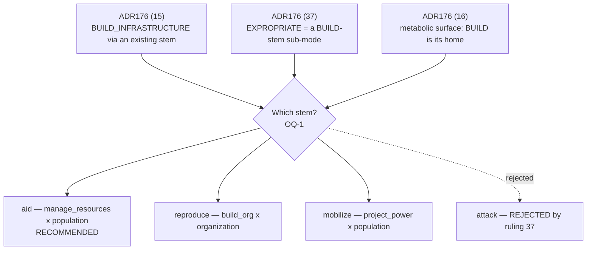

# The Article V 3×3 — Sub-Mode Layer

**RATIFIED by the Director, 2026-08-10 — recording ADR187.** The Director approved the
draft's recommendations in session ("i approve all"): OQ-1 through OQ-4 and OQ-6 through
OQ-8 dispose per ADR187; The Director RULED OQ-5
same-day by correcting the question (ADR190): the aid stem is mutual aid first — the
mass-line recruitment channel — and restore stipulates no metabolic term; each practice,
as content, declares what it moves. The body below stands as posed, for the record.

**Date:** 2026-08-10 · **Author:** workforce (agentic engineering model, Constitution IX.5)
· **Commissioned by:** ADR176 items (15), (16), (37) and the #378 follow-ups
· **Status:** RATIFIED — see ADR187; OQ-5 ruled same-day, ADR190.

---

## 0. Status correction — what the Director already ratified, and what remains open

The Program 28 roadmap (`docs/superpowers/specs/2026-08-10-program-28-bevy-cutover-roadmap-design.md:155`)
lists "ratifying the workforce-drafted Article V 3×3 (#378)" as a residual Director item.
That entry is stale, and the draft brief that produced this document inherited the same
staleness. The record says otherwise:

- **ADR177 (V1), 2026-07-30, ratified the 3×3 as drafted.** Rows Build-org / Project-power /
  Manage-resources; columns Organization / Population / Other-actors; the nine verbs in
  their cells; the Iskra double cell (`educate` + `campaign`) as law; the
  Manage-resources × Organization cell declared honestly empty.
- **The ratified grid already lives as canonical data** at
  `src/babylon/game/actions/matrix.py`, pinned byte-for-byte by
  `tests/unit/game/actions/test_verb_matrix.py`. Moving a verb is a Director ruling, never
  a refactor.

**What ADR177 did not do, and what this draft supplies:** ADR177 placed the nine *stems*.
It placed no sub-modes. ADR176 items (15), (16) and (37) then ruled three sub-modes into
existence — `strike`, `BUILD_INFRASTRUCTURE`, `EXPROPRIATE` — plus two chartered surfaces
(clandestinity/security, metabolic/restoration), and named no host stem for any of them
except `strike`. **The sub-mode layer of the 3×3 is the genuinely undrafted artifact.**
This document drafts it, and it changes no ratified cell.

---

## 1. The axes, and why this derivation

**The derivation adopted: Article V's own literal pair.** Rows are the three player-facing
motions the Constitution names in one sentence — "Player-facing (3x3): Build org | Project
power | Manage resources"; columns are the three engine-facing target sorts named in the
next — "Organization (node) | Population (org↔class edges) | Other actors (org↔org edges)"
(`CONSTITUTION.md:541`). The Standard's Q10 calls the grid "unwritten"; Article V had in
fact already written its axes and left only the assignment open.

**Why this derivation and no other.** ADR177 V1 ratified exactly these axes. Any richer
derivation — rows as moments of the survival calculus, rows as the three strata of the
ontology, columns as class fractions — would re-open a ratified decision under cover of a
drafting exercise, which the workforce may not do (IX.5). This draft weighed two
alternatives and set both aside on that ground alone. Both appear here so the Director can
call either one back:

1. **Rows as the survival calculus** — P(S|R) numerator work / P(S|R) denominator work /
   P(S|A) work. This reads the modes of struggle off the engine's own adjudicating
   quantity, and it would place the chartered clandestinity surface without argument —
   denominator work by definition. It also collapses the player-facing legibility Article V
   serves, and it re-cuts every ratified cell.
2. **Columns as the four strata** — organization / population / other actors / **substrate**.
   §3 below shows why this alternative keeps surfacing: `BUILD_INFRASTRUCTURE` writes a
   territory node, and the ratified column vocabulary has no territory column. A fourth
   column breaks the 3×3 shape that ruling (15) explicitly preserves ("no tenth key"), so
   this draft resolves the tension inside the ratified columns instead — see OQ-1.

**The column reading this draft applies (and asks the Director to confirm).** A verb's
column follows **whose state the motion writes**, not what the player clicks. The ratified
grid already forces this reading: `move` takes a *territory* target and sits in the
Organization column, because its write-set lands on the acting org's own node
(`src/babylon/engine/actions/move.py:62-74` writes `territory_ids` and `headquarters_id`).
Without that reading, `move` has no cell either. OQ-1 puts the reading up for ratification,
because the whole BUILD placement rests on it.

---

## 2. The grid

Rows = player-facing motions. Columns = engine-facing target sorts. **Bold** = the nine
ratified stems (ADR177 V1, unchanged). Indented entries = sub-modes. `†` marks a sub-mode
this draft proposes rather than one the Director already placed.

| | **Organization** (own node) | **Population** (org↔class) | **Other actors** (org↔org) |
|---|---|---|---|
| **Build org** | **reproduce** · `cadre_training` (shipped) · `mass_recruitment` (shipped) · `security` † — the clandestinity posture, ruling (16) | **educate** **campaign** · `election:run` (shipped) *the Iskra double cell — ADR177 V1* | **negotiate** · `coalition` (shipped) |
| **Project power** | **move** · `relocate` (shipped) · `expand` (shipped) | **mobilize** · `canvass` (shipped) · **`strike`** — RULED, item (12) | **attack** *(no new sub-mode; item (37) rejected the Attack framing for EXPROPRIATE)* |
| **Manage resources** | **— declared empty —** *the funding cell; see §4. Not ruled absent: chartered and blocked on a vehicle ruling* | **aid** · `build` † — BUILD_INFRASTRUCTURE, item (15) · `expropriate` † — item (37) · `restore` † — the metabolic surface, item (16) | **investigate** · `territory` / `org` / `edge` (Article V sub-verbs) · `counter_intel` † — the outward face of the security posture, ruling (16) |

**Reading the row names honestly.** "Manage resources" reads thinly against the cell this
draft loads it with. The row's material content is *the organization's practice over
material means* — spending them on the masses, seizing them from the expropriators,
repairing the metabolism they degraded, and finding out where they are. Ratifying the
placement while keeping the label is legitimate; renaming the row is a Director call
(OQ-6).

---

## 3. The BUILD stem — the one placement that carries the weight

Ruling (15) puts `BUILD_INFRASTRUCTURE` live "via an existing stem's sub-mode mapped onto
the tested resolver (Article V ruling; no tenth key)". Ruling (37) then binds `EXPROPRIATE`
to whatever that stem turns out to be ("a BUILD-stem sub-mode"). Ruling (16) binds the
metabolic/restoration surface to the same place ("BUILD its natural home"). **One
unnamed stem carries three sub-modes.** Naming that stem ranks as the highest-leverage
single decision in this document.

### 3.1 What the resolver already does

`resolve_build` exists, carries unit tests, and stays deliberately unregistered
(`src/babylon/engine/actions/build.py:13-24`). Registering it in `VERB_RESOLVERS` would
mint a tenth canonical verb and break the hard-pinned nine-verb contract — which is the
break ruling (15) forecloses. Its material effect runs through
`ooda/layer3.py::_propagate_infrastructure`: it writes the community-scoped
`infrastructure` float on a **Territory** node and repairs every corridor-mesh edge
touching that territory (ADR165's uniform territory splash, `build.py:26-35`).

### 3.2 The structural problem, stated plainly

`BUILD_INFRASTRUCTURE`'s write-set lands on a territory node. The ratified columns cover
the org's own node, org↔class edges, and org↔org edges. **The write-set falls outside the
column vocabulary.** Ruling (15) forbids a tenth key and the 3×3 shape forbids a fourth
column, so the placement must follow §1's column reading — whose *condition* the motion
changes — and that reading admits exactly two serious candidates.

### 3.3 The candidates

**Candidate A — `aid` (Manage-resources × Population). This draft recommends it.**

- `resolve_aid` already *is* the value-transfer resolver: it moves value from the org's
  `budget` to the target's `wealth`, with an overhead fraction and a loud failure on an
  insufficient budget (`src/babylon/engine/actions/aid.py:90-103`). Ruling (37)'s
  substance — "expropriation TRANSFERS value, it does not destroy it" — describes that
  resolver's conservation shape with the source reversed. The W-A4 conservation row the
  wiring ledger asks of a wired EXPROPRIATE (row A4) writes itself against a resolver that
  already respects L-SPEND.
- Infrastructure that serves the population it stands in is the survival-programs practice
  the dual-power framing names. The row is the org's material practice over means; the
  column is the class whose conditions of reproduction change.
- The metabolic/restoration sub-mode sits naturally beside a resolver that already spends
  the budget to raise a target's material condition.
- **Cost, stated:** the player-facing name "Aid" under-describes seizure. The interface
  copy carries a pedagogy burden, and the Director may prefer a row or stem rename (OQ-6).

**Candidate B — `reproduce` (Build-org × Organization).** Reads dual power as org-building
and keeps "build" next to "build org", which is rhetorically clean. It fails on write-set:
`resolve_reproduce` writes `cadre_level`, `cohesion` and `budget` on the acting org's own
node only (`reproduce.py:6-10`). Hosting build, expropriate and restore there would make
one stem write territory nodes and other actors' stocks, which destroys the Organization
column's meaning for every other cell. The funding dossier separately recommends
`reproduce` for a *burn-reduction* mechanic (M3), which suits the stem far better.

**Candidate C — `mobilize` (Project-power × Population).** Land seizure and factory
occupation are mass actions, and the stem already carries `canvass` and now `strike`. It
sits awkwardly with ruling (16): ecological restoration as a projection of power reads
wrong, and `resolve_build`'s effect is construction rather than mobilization. Recorded for
completeness.

**Candidate D — `attack`.** Ruling (37) rejected the Attack framing by name. Recorded only
so the rejection stays visible.

---

## 4. The declared-empty cell — reconciling the Standard against ADR184 and ADR176 (14)/(38)

The Standard's Q10 warns: *"Manage resources may be unfillable — no verb replenishes budget
or mints PRESENCE."* Both halves of that sentence were true when the Standard shipped. The
rulings since have moved them apart, and they now need different answers.

### 4.1 "No verb replenishes budget" — true of the frozen engine, superseded as design

The frozen engine confirms the observation: one seed step sets `budget`
(`_legacy.py:953`), `aid` and `reproduce` decrement it, and no system ever writes it —
a one-way ratchet to zero (wiring ledger row A7, verified).

Three rulings since then supply the mechanism the Standard found missing:

- **ADR176 (14)** rules funding a **doctrine-pair surface**: clandestine lines run illegal
  economies with the state-attention bill; Autonomists crowdfund and refuse party
  enterprise; scientific socialists run principled party businesses. "Ship simple at start."
- **ADR176 (38)** rules reformist funding **institutional money, and the capture vector** —
  routed into the machinery that already ships (`institutional_pull`, `office_tenure`, the
  reform ceiling at `PolicySystem` @17.47, the liquidationism absorbing state).
- **ADR184 (R4)** rules that **the class difference lives in replenishment, not in
  allocation** — tax and tribute on one side, dues and expropriation on the other. **(R5)**
  then rules Φ a legitimate replenishment source, because currency to currency needs no
  conversion and mints no coefficient.

**The reconciliation:** the Director has ruled replenishment into existence. That makes the
cell **CHARTERED** in the W.2 vocabulary — never RULED-ABSENT. ADR177 V1 said as much at ratification time:
"honestly empty **until** the funding-verb train (rulings 14/38) lands it." What stays open
is the **vehicle**, and the obvious vehicle is unconstitutional as drafted: the funding
dossier's §4 recommends "one verb in `("manage_resources", "organization")` — call it
`fundraise`", and a tenth stem is a constitutional event (Article V is verbatim "All always
available" over nine keys; `ai/wiring-doctrine.md:84-89`). OQ-3 puts the three legal
vehicles to the Director.

### 4.2 "No verb mints PRESENCE" — true, and it stays true without blocking anything

PRESENCE has one producer, `world_state.py:754,762` — session construction inside
`to_graph()`, which W.1 classifies as a seed writer and not a runtime writer. `move` writes
`territory_ids` and never the PRESENCE edge set, so the two drift apart (wiring ledger row
A6). That row is **not Director-gated**: the ledger scopes it as a repair inside MOVE's own
declared effect, with the invariant `PRESENCE set ≡ territory_ids` as its A4 residual. A
missing PRESENCE minter points at a defect inside a placed verb, and not at an unfillable
cell. The funding dossier separately notes that a `party_enterprise` channel
would mint PRESENCE at `LOW_PROFILE` as a side effect of standing operations — a shop or a
farm *is* a footprint.

**Net:** the Standard's warning holds as a description of the frozen engine and lapses as a
design verdict. The cell is fillable; the Director chooses the vehicle.

---

## 5. Absences named honestly

The Wiring Completeness Doctrine (§9, W.2) allows exactly five dispositions and treats
silence as a red gate. This draft records the verb-surface absences it touches:

| Construct | Disposition | Basis |
|---|---|---|
| `("manage_resources", "organization")` — the funding cell | **CHARTERED**, blocked on OQ-3 | ADR177 V1; ADR176 (14)/(38); ADR184 R4/R5 |
| Metabolic axis has no player-side generator (ledger F3) | **CHARTERED** — supersedes the RULED-ABSENT option | ADR176 (16): "a metabolic/restoration surface (BUILD its natural home)" |
| P(S\|R) denominator has no hardening generator (ledger F4) | **CHARTERED** — supersedes the RULED-ABSENT option | ADR176 (16): "a clandestinity/security posture … P(S\|R)-denominator hardening" |
| `ActionType.STRIKE` (the enum member and its eligibility row) | **RETIRE-WITH-RECORD** candidate | Ruling (12) puts the surface on `mobilize:strike`; reviving the member would need a tenth `VERB_RESOLVERS` key. Flagged, untouched. |
| `ActionType.EXPROPRIATE` | **WIRE** under the BUILD stem | Ruling (37); the member had one reference tree-wide (`action_eligibility.py:65`) |
| `ActionType.BUILD_INFRASTRUCTURE` | **WIRE** under the BUILD stem | Ruling (15); the resolver ships and stays unregistered by design |
| Attack × Other-actors gains no new sub-mode | **RULED-ABSENT** (by ruling (37)'s rejection) | "the Attack framing is rejected" |

**Counts discipline** (Standard, standing clause). Every count in this document cites the
command that produced it: nine matrix cells and nine registered resolvers —
`rg -c "ActionType\." src/babylon/engine/actions/__init__.py` → 9, and
`RATIFIED_MATRIX` holds nine keys (`src/babylon/game/actions/matrix.py:33-43`); thirty
`ActionType` members — `rg -c '^    [A-Z_]+ = "' src/babylon/models/enums/actions.py` → 30.

---

## 6. What ratification would change in code

Nothing in this section runs ahead of a ruling; it exists so the Director can price each
option.

1. `src/babylon/game/actions/matrix.py` gains a **sub-mode layer** beside `RATIFIED_MATRIX`
   — a cell-keyed map of ruled sub-modes — and the sentinel gains a pin per placement, so
   moving a sub-mode becomes a Director ruling on the same footing as moving a verb.
2. The BUILD stem's resolver gains a `sub_mode` branch that dispatches to the existing,
   tested `resolve_build`. `VERB_RESOLVERS` stays at nine keys.
3. The G3 cost/efficacy lever — the fifth constitutional doctrine lever, missing today —
   hangs coefficients off `(doctrine-pair, cell, sub-mode)` coordinates rather than
   `(doctrine-pair, cell)`.
4. One housekeeping item, workforce-level and recorded here only for visibility: the
   parameter key for sub-modes differs across resolvers today — `mobilize` reads
   `params["sub_mode"]`, while `reproduce`, `move` and `negotiate` read `params["mode"]`.
   The sub-mode layer wants one key.

---

## OPEN QUESTIONS — what the Director must ratify or reject

Each item states the question, the options, and what this draft recommends. None binds
until ruled.

**OQ-1 — Which stem hosts BUILD?** Ruling (15) named a mechanism and no stem, and rulings
(37) and (16) bind `expropriate` and `restore` to the same answer. Options: **(a) `aid`**
(Manage-resources × Population) — recommended, on the value-transfer resolver already
shipped; **(b) `reproduce`** (Build-org × Organization); **(c) `mobilize`**
(Project-power × Population). Ruling (37) already rejected `attack`. §3.3 gives the
evidence for each.

**OQ-2 — Confirm the column reading.** A verb's column follows whose state the motion
writes, not what the player targets. `move` already depends on this reading, and OQ-1
rests on it entirely. Ratify, or supply the alternative reading that places a
territory-writing sub-mode inside three columns that name no territory.

**OQ-3 — The funding vehicle for the declared-empty cell.** Options: **(a)** amend
Article V to a tenth stem (`fundraise`) — the funding dossier's §4 shape, and a
constitutional event under IX.1; **(b)** host the four channels as sub-modes of an existing
stem, which fills the *channels* while leaving the 3×3 cell itself empty; **(c)** rule
replenishment a **system** consequence rather than a verb — dues follow from MEMBERSHIP
mass, institutional money follows from office tenure, Φ follows from tribute per ADR184 R5
— so the org's money follows from what it already **is**, and the cell stays empty by
design. Option (c) reads as the sharpest pedagogy and avoids the resource-minigame hazard
the wiring study flagged; option (a) is the only one that fills the cell.

**OQ-4 — The clandestinity posture's home and its shape.** This draft proposes an inward
face (`reproduce:security` — compartmentalization and cadre discipline, hardening the
P(S|R) denominator on the org's own node) and an outward face
(`investigate:counter_intel` — the existing `ActionType.COUNTER_INTEL` member, currently
without a resolver). Ratify both, ratify one, or place them elsewhere. **Bundled shape
question:** ruling (16) says "posture", and a posture persists, while Article V says verbs
are "atomic per target instance" (`CONSTITUTION.md:541`). Reconcile through the standing
orders ruled in scope by ADR176 (22), or as a per-tick sub-mode whose effect the engine
re-measures fresh each tick. The second keeps ADR172 ruling 5 satisfied without a new
construct.

**OQ-5 — The metabolic/restoration sub-mode's write-set.** Ruling (16) charters the surface
and names BUILD its home; it does not say what restoration writes. The metabolic identity
that ships is `ΔB = R − (E·η)` with overshoot `O = C / B`. Does `restore` raise `R`, lower
`E`, or repair `B` directly — and does it spend budget on the same conservation footing as
`aid`? Reserved because the answer states a theory of what an organization can do to a
metabolic rift.

**OQ-6 — Row and stem naming.** "Manage resources" and "Aid" both under-describe a cell
that would carry seizure and metabolic repair. Keep the ratified labels and let interface
copy carry the pedagogy, or rename the row, or rename the stem. Renaming touches tutorial
and interface copy, and the ratified matrix keys.

**OQ-7 — `ActionType.STRIKE`'s retirement.** Ruling (12) placed the surface on
`mobilize:strike`, leaving the enum member, its eligibility row
(`action_eligibility.py:56-61`) and `base_cost_strike` (`ooda.py:302`) reachable and never
reached. Retire with record now, or fold the retirement into the Phase 2 BSL vocabulary
ceremony alongside the five dead edge types that ADR176 (34) already retires.

**OQ-8 — Does this draft become the ADR177 amendment, or a fresh ADR?** The sub-mode layer
extends a ratified decision without moving a verb. Recording it as an `amends:` entry on
ADR177 keeps one home for the grid; a fresh ADR keeps ADR177's ratification record clean.
Workforce preference: a fresh ADR that names ADR177 in `related:`, because the sub-mode
layer carries its own open questions and its own sentinel.

---

## Sources

- `CONSTITUTION.md:535-555` — Article V, the nine player verbs, the 3×3 sentence, the
  Investigate sub-verbs, the six state-AI verbs.
- `ai/decisions/ADR176_director_rulings_batch_gds_dispositions.yaml` — items (11)–(16),
  (22), (34), (37), (38).
- `ai/decisions/ADR177_verb_matrix_ratified_main_ruleset.yaml` — V1, the ratification of
  record.
- `ai/decisions/ADR184_capacity_belongs_to_organizations.yaml` — R3, R4, R5, R8.
- `docs/superpowers/specs/2026-07-29-game-design-standard-design.md` — §3, §9 (W.0–W.5),
  §11 items 10, 13–17.
- `reports/wiring-completeness-2026-07-29.md` — ledger rows A2–A8, B1, F3, F4; Part IV
  options 1–5, 10.
- `reports/funding-verb-historical-dossier.md` — §4 the four channels, M1–M6; §5 open
  questions 1–6 (its Q4 is this document's OQ-1 seen from the funding side).
- `src/babylon/game/actions/matrix.py`, `tests/unit/game/actions/test_verb_matrix.py`,
  `src/babylon/engine/actions/{__init__,build,aid,reproduce,move,mobilize}.py`.
