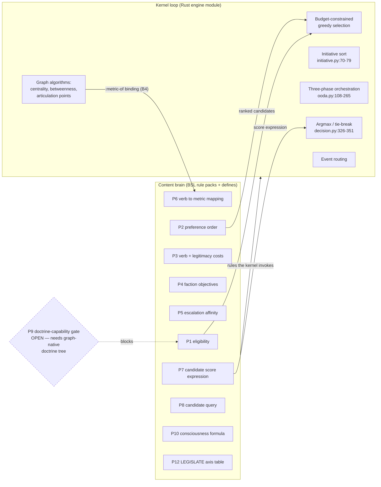
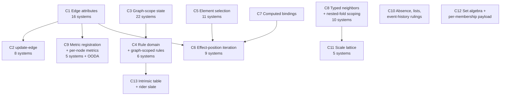

# BSL Gap Analysis — All 34 Systems Against the Language Surface

**Purpose.** This report is step 1 of 3 in the R9 track of the Program 28 roadmap
(`docs/superpowers/specs/2026-08-10-program-28-bevy-cutover-roadmap-design.md`, row R9):
**gap analysis → spec chapters in `docs/reference/bsl-language.rst` → implementation.**
R9 puts BSL expansion *before* any system port, so nothing here authorizes code. It
names what the language cannot yet express, what the surveys got right, what they got
wrong, and what the Director must rule before anyone authors Phase 2 content.

**Date.** 2026-08-10.

**Sources.**

- Nine per-system survey agents covering all 34 registered Systems, plus a tenth
  covering the OODA policy seams.
- `reports/babylon-dev-systems-rust-alignment-2026-08-02.md` — the R8 alignment survey
  the roadmap names as the gap-analysis input.
- `docs/reference/bsl-language.rst` — **the one normative home** (R9). Every capability
  claim below is cross-checked against this file directly; corrections appear inline.
- `src/babylon/engine/simulation_engine.py:328-380` (`_SYSTEM_CLASSES`, 34 entries,
  verified by reading) for tick order.
- Standing rulings: ADR172 r5 and ADR173 (no imposed functional forms), ADR176
  (the rulings batch R10 cites as the intrinsic cap), ADR183 §5.4 (defects not to
  transcribe), ADR182 (structure public, magnitudes earned), ADR174 (the Python-glue
  boundary), ADR109 (wiring doctrine).

**One thing the reader should carry into every section.** BSL's own §2.4 coverage table
promises that `EdgeCondition`'s `sum_strength` and `avg_strength` transcribe as
`(fold sum|mean (edges …) …)` — but §2.5 gives `:field` only node-type qualification,
and §2.7 gives no expression form that reads an edge's strength or any other edge
attribute. **The specification already commits to a capability its grammar cannot
express.** That single hole blocks more systems than any other finding in this report,
and it names no wish-list item: it records an internal inconsistency in the normative
document.

---

## 1. The R8 re-baseline table

All 34 Systems in strict `_DEFAULT_SYSTEMS` order. `R8 target` follows the R8 doctrine —
BSL rule pack by default, escape only with a written justification (linear algebra,
ADR176 r17 dispersion machinery, or measured performance need). **OODA is unique**: it
ports as a kernel/engine module, refined the same day to *kernel loop, content brain*.

| Pos | System | Partition | Dormant on canonical | R8 target | Rule-pack shape (one line) |
|---|---|---|---|---|---|
| 1.0 | Vitality | Material Base | No | BSL_RULES | One self-scoped `social_class` rule: drain → coverage-ratio mortality → extinction, computed algebraically in one effects list. |
| 2.0 | Territory | Material Base | No | BSL_RULES (blocked) | Three self-scoped families — heat dynamics, camp decay, heat spillover reformulated pull-side; eviction routing has no expressible form. |
| 2.5 | Substrate | Material Base | Yes (county-free scenarios) | HYBRID | Per-territory ΔB = R − E·η depletion/regen as BSL; the scale-lattice roll-up-and-publish step is a **blocked port, not an escape** — Q7 rules the lattice graph content (no new grammar), and `substrate.py:253-256` publishes the rungs into `context.persistent_data`, the Q6/C3 gap. |
| 3.0 | Production | Material Base | No | HYBRID | Per-worker value production and per-territory extraction-intensity as BSL. **Two blocked ports, no escape.** (a) The tensor-registry read is *not* linear algebra: `tensor_registry.get(fips, year)` (`tensor_registry.py:179`) is a cached `(fips, year)` lookup returning a Pydantic `ValueTensor4x3`, and `production.py:162-172` reads one scalar off it (`tensor.total_v`) — B5 closes it by hydrating the series as declared node fields. (b) The labour-aristocracy employer-routing branch — `production.py:185-192` walks the incoming WAGES edge to its source and writes that node's wealth — needs Q2 (endpoint accessors) and Q5 (cross-node write targeting). |
| 4.0 | TickDynamics | Material Base | No | HYBRID | Seven rule packs (national params, county indicators, Vol I/II/III loops, crisis detectors, class transitions, bifurcation) plus one Leontief-inverse Rust binding. |
| 5.0 | ReserveArmy | Material Base | Yes (zero-rate inputs — see §5) | BSL_RULES | One rule `:after tick_dynamics`: border-valve dampening, wage pressure, median-wage write, `RESERVE_ARMY_PRESSURE` emit. |
| 6.0 | Community | Material Base | Yes (no wired hypergraph) | BSL_RULES (blocked) | Four per-`CommunityType` rules — consciousness from orgs, solidarity amplification, threat score, decay; two blocked on set algebra and per-membership payload. |
| 7.0 | Lifecycle | Material Base | No | BSL_RULES | Five flat per-territory rules: DPD flow, legitimation index, inheritance flow, ideology transmission, class mobility. |
| 8.0 | Solidarity | Material Base | No | BSL_RULES (blocked) | One `social_class` rule folding incoming SOLIDARITY transmission into consciousness, with a threshold-crossing emit. |
| 9.0 | ImperialRent | Material Base | No (5b/5c seams dormant) | HYBRID | Five phase rule packs over the circuit plus the decision matrix. **Escape (R8: linear algebra):** Vol II circulation — the sparse LODES origin-destination matrix-vector product at `vol2_circulation.py:235` over the hex↔county `ScaleAdjunction` at `:213`. **Blocked port:** Φ-distribution — `phi_distribution.py:91-95` is a scalar weighted split (weekly slice × exposure weight), blocked on Q5 (per-county effect iteration), B5 (exposure weights hydrated as declared fields) and B6 (the register row as a kernel-observed receipt), with no linear algebra in it at all. |
| 9.5 | Transport | Material Base | Yes (default-OFF) | HYBRID | A Rust `transport-mesh` crate owns lattice decay and aggregation; a thin rule pack consumes the per-territory demand signal behind a `:const` master switch. |
| 10.0 | Dispossession | Material Base | Yes (zero-rate inputs) | BSL_RULES | One per-territory rule: five-term weighted intensity, clamped, wealth transfer, two emits. Cleanest fit in the estate. |
| 11.0 | Decomposition | Material Base | Yes (crisis-gated) | BSL_RULES | A crisis-stamp rule on the producer side plus one latch-guarded split rule writing the pre-declared sibling class nodes. |
| 12.0 | ControlRatio | Material Base | Yes (crisis-gated) | BSL_RULES (blocked) | One graph-scoped four-phase state machine over filtered population and organization folds; blocked on graph-scoped evaluation and phase storage. |
| 13.0 | Metabolism | Material Base | No | BSL_RULES (blocked) | Per-territory biocapacity/hysteresis rule plus one graph-scoped overshoot rule; blocked on graph-scoped evaluation only. |
| **14.0** | **OODA** | **Action** | **No** | **KERNEL LOOP / CONTENT BRAIN** | **Kernel owns the cycle, budget, arbitration, dispatch and the graph algorithms; BSL owns eligibility, preference order, cost tables, faction objectives, escalation affinity, scoring expressions, the consciousness formula. See §6.** |
| 14.5 | FactionInfluence | Consequences | Yes (no faction topology) | HYBRID | Per-territory influence argmax and per-faction trap diagnostic as BSL; contiguous-region search stays a Rust domain crate. |
| 14.7 | Doctrine | Consequences | Yes (org_count = 0) | HYBRID | Trap conditions already prove out as BSL content; decay, accrual and greedy acquisition wait on the doctrine tree becoming graph content. |
| 15.0 | Survival | Consequences | No | HYBRID | P(S\|R) as a plain per-node rule; P(S\|A) moves to Rust dispersion machinery and BSL reads the resulting measure (ADR173). |
| 16.0 | Struggle | Consequences | No (lumpen branch dark) | HYBRID | Spark roll, uprising condition and spontaneous riot as BSL. **Blocked ports:** the solidarity-gain edge loop (`struggle.py:384-400`, one `update-edge` per incident SOLIDARITY edge — Q5 plus Q3) and the comprador bifurcation (`struggle.py:542-581`, a node picked by role then written — Q4 plus Q5). **Performance escape, PENDING MEASUREMENT:** bulk EXPLOITATION-edge severing (`struggle.py:715-724`). B8 states the test — once Q5 lands the bulk case "survives only as a performance escape, which then needs measurement rather than assertion" — and nobody has measured it, so R8 does not yet license it. |
| 17.0 | Consciousness | Consequences | No | BSL_RULES (blocked) | Per-class agitation, ternary routing and decay; blocked on reading WAGES/SOLIDARITY edge attributes. |
| 17.4 | FascistFaction | Consequences | No (org-defection half dark) | BSL_RULES (blocked) | Fascist pull → alignment drift → capture, plus per-membership chauvinism accrual and the crisis-gated defection roll. |
| 17.42 | Allegiance | Consequences | Yes (no party orgs) | HYBRID | Platform fit → allegiance drift → hope field → the agitation valve; vector algebra escapes, and the hope field waits on ADR173's replacement measure. |
| 17.45 | Electoral | Consequences | Yes (no party orgs) | HYBRID | Clocked per-sovereign family: election gate, L-SUSPEND, vote folds, formation, legitimation; the faction-balance fixed point escapes to Rust. |
| 17.47 | Policy | Consequences | Yes (no agenda registers) | HYBRID | One rule per resolution kind over an agenda item; capital-strike equalization escapes to Rust; the registers themselves are a blocked port, not an escape. |
| 17.5 | Sovereignty | Consequences | Yes (no sovereign topology) | BSL_RULES (blocked) | Per-territory CLAIMS argmax → enum-keyed impact table write, plus a dual-power count rule. Smallest clean port in the estate. |
| 17.8 | MarketScissors | Consequences | No | HYBRID | Correction consequences (wealth evaporation, reserve swell, price projection) as BSL; the oscillator recurrence is a **blocked port, not an escape** — "for want of a state home" names the Q6/C3 gap exactly, since the axis lives in a graph-metadata key (`market_scissors.py:63`) and the recurrence itself is scalar arithmetic. |
| 18.0 | Contradiction | Consequences | No | HYBRID | One rule per registered opposition computing gap/rate/balance. **All three land as blocked ports, not escapes.** ⊗/⊕ are scalar arithmetic, not linear algebra — `dialectics/core/composition.py` defines ⊗ as `gap1 · gap2`, ⊕ as `gap1 + gap2 − gap1 · gap2`, both with a gap-weighted-mean balance; the level lattice is share-weighted scale aggregation (Q7/C11, `dialectics/instances/levels.py`); the registry is graph-scope state (Q6/C3, `contradiction.py:26`) whose principal/runner-up pick is Q4. |
| 19.0 | ContradictionField | Consequences | No | BSL_RULES (blocked) | Per-class per-named-field mean over incident edges, clamped, with a three-field shift register for history. |
| 20.0 | FieldDerivative | Consequences | No | HYBRID | Per-edge gradients and per-node Laplacian/derivatives as BSL; the whole-graph principal-contradiction argmax is a **blocked port, not an escape** — `field_derivative.py:371-431` picks the field with the largest absolute derivative across the field stack, which is Q4/C5 selection under Q12/C4's `(domain :graph)`, with its history in `persistent_data` (Q6/C3). |
| 20.5 | CollapseTransition | Consequences | Yes (no sovereign topology) | HYBRID | BSL expresses only the collapse trigger predicate; partition execution is a **performance escape, PENDING MEASUREMENT** — `bulk_partition_claims` (`collapse_transition.py:244`) re-parents CLAIMS edges, which Q5 `for-each` plus Q3 `update-edge` express directly. The O(K) claim rests on assertion, never on measurement; B8's obligation binds here first. |
| 21.0 | EdgeTransition | Consequences | Yes (inert by defect) | BSL_RULES (blocked) | One rule per (from-mode, transition) pair, priority encoded in rule-id order; the predicate vocabulary needs re-chartering first. |
| 21.5 | WealthDistribution | Consequences | Yes (shadow) | BSL_RULES (blocked) | Three rules on a singleton carrier — seed, Euler advance, market shock — plus a per-class share projection. |
| 22.0 | EpistemicHorizon | Consequences | Yes (shadow) | BSL_RULES (blocked) | One guarded per-territory rule writing mass receptivity, intel confidence and vision state together or not at all. |

**Counts.** 34 Systems. Targets: 17 BSL_RULES, 16 HYBRID, 1 kernel-loop/content-brain
(OODA). Of the 17 BSL_RULES targets, **12 carry at least one hard language blocker** —
they are BSL-shaped and currently unauthorable, not Rust escapes. The twelve, in tick
order: Territory @2.0, Community @6.0, Solidarity @8.0, ControlRatio @12.0, Metabolism
@13.0, Consciousness @17.0, FascistFaction @17.4, Sovereignty @17.5, ContradictionField
@19.0, EdgeTransition @21.0, WealthDistribution @21.5, EpistemicHorizon @22.0. The
remaining five (Vitality, ReserveArmy, Lifecycle, Dispossession, Decomposition) carry no
`(blocked)` tag. Dormancy as recorded by the per-system agents: **17 dormant, 17 live**
(see §5 for why this disagrees with the roadmap's 22/12 and what to do about it).

**How to read the three tags, because R8 makes the distinction load-bearing.**
`BSL_RULES` marks a system whose whole port is BSL-shaped; the `(blocked)` suffix adds
that no one can author it today. `HYBRID` marks a row carrying at least one item BSL
cannot express today — and that covers **two different things** R8 does not let this
table conflate: an **escape**, which needs a written justification in one of R8's three
categories (linear algebra, ADR176 r17 dispersion machinery, measured performance need),
and a **blocked port**, which is BSL-shaped content waiting on a §2 gap and hence never
an escape. Each `HYBRID` cell below sorts every item into one of the two and cites either
the closing gap or the R8 category. Two items carry the flag **pending measurement**:
they claim a performance escape nobody has measured, so R8 does not yet license them.
No system in this table targets a pure Rust kernel — the third tag belongs to OODA alone,
and even there the kernel owns only the loop (§6).

---

## 2. Needed query forms and graph abstractions

Deduplicated across all 34 systems. For each: the demanding systems, whether the current
`bsl-language.rst` already specifies it, and a proposed surface sketch. Sketches are
illustrative s-expressions for the spec-chapter authors, not settled syntax.

### Q1 — Edge attribute reads

**Systems (16):** Solidarity, ImperialRent, Consciousness, FascistFaction,
ContradictionField, FieldDerivative, EdgeTransition, Doctrine, Struggle, Survival,
Allegiance, Electoral, FactionInfluence, Policy, Sovereignty, Territory.

**Spec status: NEW chapter, and it closes an existing contradiction.** §2.5 scopes
`:field` to node types only ("reads a declared field of `self`'s node type unless the
qualified name's first segment names a different node type"). §2.9's `deffield` carries
no edge-type case. Yet §2.4's coverage table (line 466) promises
`EdgeCondition count/sum_strength/avg_strength → (fold count|sum|mean (edges …) …)`,
and §2.6's grammar admits `<edge-pred> ::= <cond>` — a predicate over an `EdgeRef` about
which no expression can say anything. The chapter must extend `deffield` and `:field` to
edge types, or delete the §2.4 row.

```scheme
(deffield exploitation/tension :type Intensity :kind intensive)

(binding tension :field exploitation/tension)   ; legal inside a fold over
                                                ; (edges EdgeType/EXPLOITATION …)
(fold mean (edges EdgeType/EXPLOITATION) tension :weight population)
```

Edge `:strength` needs the same treatment — `add-edge` writes it as an operand today,
and no form reads it back.

### Q2 — Edge endpoint accessors and incidence queries

**Systems (12):** Solidarity, ImperialRent, Consciousness, FascistFaction,
ContradictionField, FieldDerivative, Survival, Struggle, Electoral, Policy,
FactionInfluence, Doctrine.

**Spec status: NEW.** No form yields an `EdgeRef`'s source or target. Every frozen system
that walks edges filters on `edge.target_id == node.id`, and `neighbors` discards the
traversed edge entirely (§2.6's result table: `NodeSet`, `it` is `NodeRef`).

Two candidate surfaces; the chapter should pick one and say why.

```scheme
; (a) accessors — general, but re-introduces a filter the engine could index
(fold sum (edges EdgeType/SOLIDARITY (= (target-of it) self)) strength)

; (b) an incidence query head — narrower, indexable, and matches how every
;     frozen call site actually reads
(fold sum (incident-edges self EdgeType/SOLIDARITY :in) strength)
```

Recommendation: ship (b) as the primary form and (a) only if a system genuinely needs an
endpoint that is neither `self` nor `it`. (b) keeps `ceiling(query)` computable from the
edge-type ceiling exactly as `neighbors` does today (§3.7, D15).

### Q3 — `update-edge`, and field initialisers on `add-edge`

**Systems (8):** ImperialRent (`value_flow` on four edge types), Doctrine (mass-work
SOLIDARITY decay), Struggle (uprising solidarity gain), FascistFaction (MEMBERSHIP
chauvinism accrual), FieldDerivative (`field_gradients`), EdgeTransition (`edge_mode`,
`contradiction_character`, `_dominant_party`), CollapseTransition (CLAIMS attributes at
mint time), FactionInfluence (hysteresis on a candidacy edge).

**Spec status: NEW.** §2.8 closes the verb set at eight: `update-node`, `add-node`,
`remove-node`, `add-edge`, `remove-edge`, `add-hyperedge`, `remove-hyperedge`, `emit`.
`add-edge` accepts a single `:strength` operand and no `<field-init>*` list, unlike
`add-node` and `add-hyperedge`. Nothing overwrites a standing edge's attributes.

```scheme
(update-edge EdgeType/SOLIDARITY self other solidarity/strength (scale 0.95c))
(add-edge EdgeType/CLAIMS s t :strength 1.0c
          (claims/control-level 0.6c) (claims/claimed-since-tick tick))
```

Note the interaction with D26: the hyperedge layer deliberately forbids in-place
mutation and uses whole-object replacement. The chapter must state why the dyadic layer
differs — the honest answer is that a dyadic edge has no member list to leave
half-mutated, so the D26 rationale does not carry over.

### Q4 — Element selection (argmax / argmin / first match)

**Systems (11):** Territory (eviction sink), FactionInfluence (winning faction),
FascistFaction (fascist faction pick), Allegiance (best platform), Electoral (FPTP
winner, spoiler target, DAG parent), Policy (top claims holder), Sovereignty (winning
claimant), Decomposition (node by role), Struggle (node by role), FieldDerivative
(principal field), OODA P7 (repress target).

**Spec status: NEW.** §2.7 closes `<fold-op>` at `sum|mean|min|max|count`, each
returning the folded **value**. No form returns the element that achieved it, and no
expression form yields a `NodeRef` other than `self` and effect-list-scoped minted names
(§2.8's id-operand draft ruling). This is the second-largest blocker after Q1/Q6.

```scheme
(select-max <query> <expr>)   ; -> NodeRef | EdgeRef | HyperedgeRef
(select-min <query> <expr>)
```

Ties break by the §2.6 iteration order (ascending id byte order), which makes the
deterministic tiebreak a property of the language rather than of each rule. An empty
query is `E-EVAL-021`, matching `min`/`max` (§4.4). Cost row:
`2 + cost(query) + ceiling(query) × cost(body)`, identical to `exists`/`forall`.

**Selection alone is not enough.** A selected ref is only useful if effects can target
it — see Q5.

### Q5 — Effect-position iteration and cross-node write targeting

**Systems (9):** Solidarity (per-edge emit), Territory (push to a chosen sink),
Production (write to employer), ImperialRent (both endpoints per edge),
Doctrine (decay every incident edge), Struggle (bulk edge severing, comprador
bifurcation), Decomposition (write two sibling nodes), CollapseTransition (per-territory
partition), FactionInfluence (per-territory transition).

**Spec status: NEW.** `<effects> ::= "(" "effects" <effect-item>+ ")"` fixes arity at
parse time, folds live in expression position only ("Folds are the only iteration
construct", §2.7), and `it` outside a query context is `E-TYPE-012` (§2.5) — so `it` can
never appear in an effect. Together these make "for every matching element, apply a verb"
inexpressible.

```scheme
(for-each <query> <effect-item>+)     ; `it` in scope inside the body
```

Cost row `2 + cost(query) + ceiling(query) × Σ cost(effect-items)`, keeping §3.7's static
bound computable. Totality holds: the executor materialises the query before the body runs
(§4.4), so this is a bounded iteration, not a loop.

**Correction to the Solidarity survey.** It claims "only one emit per rule firing exists
in the grammar". That is wrong in letter — `<effect-item>+` admits any fixed number of
`emit` verbs — and right in substance: the frozen system emits **once per contributing
edge**, a runtime-sized count. Q5 is the fix; the survey's proposed fallback (one
summed emit per target node) is a content ruling the Director should take explicitly,
not a language limitation.

### Q6 — Graph-scope state, read and write

**Systems (22):** TickDynamics, ReserveArmy, Substrate, Production, ImperialRent,
Decomposition, ControlRatio, Metabolism, Doctrine, Survival, Struggle, Consciousness,
FascistFaction, Allegiance, Electoral, Policy, MarketScissors, Contradiction,
ContradictionField, FieldDerivative, EdgeTransition, WealthDistribution,
CollapseTransition. **The single most pervasive gap in the estate.**

**Spec status: NEW ruling; possibly no new grammar.** §2.5 closes `<bind-src>` at
`:field`/`:const`/`:metric`/`:tick`; `:metric` reads a *registered graph-level metric*
and no rule may write one; no verb in §2.8 writes anything but a node, edge, hyperedge or event.
Everything the frozen engine keeps in `graph.graph[...]`, `set_graph_attr` or
`context.persistent_data` — the opposition registry, the scissors axis, the electoral
registers, the national wealth vector, the imperial-rent pool, phase latches — has no BSL
home.

Two routes:

```scheme
; (a) singleton carrier — no new grammar, one closed-vocabulary addition
(deffield nation/imperial-rent-pool :type Currency :kind extensive)
(rule imperial-rent/pool-decay … (effects (update-node self nation/… (scale 0.98c))))

; (b) new bind-src + verb — new grammar, new error codes, new hash surface
(binding pool :global economy/imperial-rent-pool)
(update-global economy/imperial-rent-pool (sub drawn))
```

**Recommendation: (a).** It keeps the verb set closed, makes the state ordinary hashable
node state that the inspector and the write log already cover (ADR182 R1, ADR185 R2), and
costs exactly one `NodeType` member — amendment territory under §3.6, which is the right
weight for a decision this load-bearing. Route (b) invents a second storage class whose
determinism, iteration and hashing obligations would all need restating.

The chapter must also rule the **cross-system register discipline**: three of these
values are one-tick-lagged handoffs (Sovereignty → Metabolism, MarketScissors →
WealthDistribution, Production → ImperialRent). Once they live on nodes, tick ordering
already does that work and rules need no staging construct — the Metabolism survey
proved this by construction and it generalises.

### Q7 — Scale-lattice grouping and aggregation

**Systems (5):** Substrate (county → CZ/MSA/state/nation), MarketScissors (per-county
wage/value sums, then reverse join), Contradiction (county ≺ state ≺ nation regime
classification), Transport (hex link → county pair → national), WealthDistribution
(bracket grouping over roles).

**Spec status: NEW vocabulary, not a new query form.** No query head groups elements by a
runtime attribute value or by an external crosswalk. But the Director's
spatial-adjacency-lookup-estate ruling (2026-07-30) already says the invariant spatial
substrate belongs in static lookup tables, never per-tick state — which points at
modelling the lattice as *graph content* rather than inventing a grouping operator:

```scheme
; scale carriers as nodes, membership as a typed relation
(fold sum (neighbors self EdgeType/IN_SCALE :in) territory/wage-bill)
```

Then county aggregation becomes an ordinary one-hop fold and the adjunction pair
(`allocate`/`aggregate`) becomes a hydration contract plus rule content. This costs
closed-vocabulary members and a hydration spec, and it costs no new grammar. The
alternative — a `group-by` fold returning a keyed collection — needs a map type §3.1
deliberately lacks, and would drag list/map semantics into the hash surface.

### Q8 — Typed `neighbors` (so foreign-field reads typecheck)

**Systems (6):** EpistemicHorizon, Consciousness, Survival, Production, Territory,
Metabolism.

**Spec status: UNDER-DETERMINED in the current rst — needs a ruling, and the precedent
already exists.** §2.5 permits a foreign node type's `:field` "only inside a fold body
over that type" (`E-TYPE-010`). `nodes` carries its `NodeType` as an operand, so a fold
over `nodes` carries its annotation. `neighbors` does not: it yields an untyped `NodeSet`
(§2.6 result table). The document never says whether
`(fold mean (neighbors self EdgeType/TENANCY :in) social-class/consciousness :weight …)`
typechecks. This is the exact problem D24 solved for `members-of` by making
the `HyperedgeType` a mandatory operand; the same fix applies:

```scheme
(neighbors <expr> EdgeType/TENANCY :in NodeType/SOCIAL_CLASS)
```

The EpistemicHorizon survey adds a check I confirmed: no conformance vector and no corpus
rule exercises a `neighbors` fold at all, so nothing in the estate pins the answer.

### Q9 — Nested-fold element scoping

**Systems (4):** Territory (2-hop pull), Production (worker → territory from inside a
worker fold), Community (org × community overlap), Contradiction.

**Spec status: UNDER-DETERMINED — two passages of the rst disagree.** §2.5 declares `it`
"reserved and always in scope, never declared and never shadowed (`E-PARSE-022`)". §3.7's
cost model explicitly discusses "a fold over members nested inside a fold over
hyperedges", which requires two live elements at once. The Territory survey caught this
and I confirm the tension is real. Either nested folds rebind `it` (and §2.5's
no-shadowing sentence needs a carve-out), or the language can name elements:

```scheme
(fold sum (hyperedges HyperedgeType/ECONOMIC_SECTOR) :as h
      (fold sum (members-of h HyperedgeType/ECONOMIC_SECTOR) :as m
            (field-of m social-class/wealth)))
```

Naming is the safer ruling: it leaves `E-PARSE-022` intact for the reserved names and
makes two-hop rules readable. Without a ruling, **no one can author a 2-hop rule pack with
confidence**, which is exactly the situation Territory, Production and Community are in.

### Q10 — Set algebra on query results

**Systems (1):** Community (`shared_communities` = intersection of two membership sets).

**Spec status: NEW, low priority.** `NodeSet`/`EdgeSet`/`HyperedgeSet` are "only
consumable by `fold`, `exists`, `forall`" (§3.1). Intersection is expressible today as a
nested `exists` inside a `count` fold body, at quadratic fuel cost:

```scheme
(fold count (hyperedges-of a HyperedgeType/COMMUNITY)
      (if (exists (hyperedges-of b HyperedgeType/COMMUNITY) (= it it-outer)) 1 0))
```

That form needs Q9's naming to be writable at all. Recommend deferring a dedicated
`intersect` until a second system asks for it.

### Q11 — Per-membership payload and hyperedge field mutation

**Systems (2):** Community (role/strength/visibility on `CommunityMembership`), Doctrine
(if acquired stances land as hyperedges).

**Spec status: EXISTING acknowledged gap.** §2.8's draft ruling D26 names both by name:
"per-membership payload … and mutation of a hyperedge's own declared fields are not
expressible in this revision. Both are Phase-1 review items; neither is a silent
omission." The chapter closes an already-declared debt rather than opening a new one. The
survey's finding that Community's threat score depends *entirely* on that payload
promotes this from a review item to a port blocker.

### Q12 — Rule domain declaration, including graph-scoped rules

**Systems (6):** ControlRatio, Metabolism, FieldDerivative, Contradiction,
WealthDistribution, TickDynamics.

**Spec status: UNDER-DETERMINED.** §4.2 says a rule evaluates against "the subject node",
and §5.6's worked example lets the reader *infer* the subject's type from a `:field`
binding's qname prefix. The document never states the inference rule, and it says nothing
about a rule whose only bindings are `:const`, `:metric` and `:tick`. Three of them
perform exactly one graph-level check per tick — ControlRatio's four-phase state machine,
Metabolism's overshoot check, FieldDerivative's principal-contradiction pick. Under
per-node inference those would emit once per node.

```scheme
(domain NodeType/SOCIAL_CLASS)    ; explicit, replaces inference
(domain :graph)                   ; fires exactly once per tick
```

Making the domain explicit also removes the surprise where adding a `:field` binding
silently changes how many times a rule fires.

### Q13 — Ordered and list-valued state

**Systems (3):** Policy (FIFO agenda), Doctrine (order-significant
`acquired_doctrine_ids`), EdgeTransition (`co_optive_suppressed_fields`).

**Spec status: NEW ruling, and the recommended ruling is "no list type".** §3.1 has no
sequence or map type, and adding one drags ordering into CAS, the kind rule and the fuel
model. Every case above re-models cleanly:

- agenda items become their own bounded `NodeType` with a `queued-at-tick` field, and
  "next item" becomes `select-min` (Q4) on that field;
- `acquired_doctrine_ids` order becomes an `ACQUIRED` edge carrying `acquired-at-tick`,
  and "newest reformist stance" becomes `select-max`;
- `co_optive_suppressed_fields` becomes one Bool field per suppressible field.

The chapter should say this in the rst, so no future port reads the absence as an
oversight.

### Q14 — Computed (let) bindings

**Systems (many; sharpest in 5):** Vitality (three phases collapse into one rule and must
re-derive the post-drain value algebraically), Electoral (a five-iteration renormalisation
with no place to hold intermediates), Metabolism, Consciousness, TickDynamics.

**Spec status: NEW, and cheap.** `<bind-src>` admits only external sources, so a rule
cannot name an intermediate value. Every non-trivial rule then repeats
sub-expressions verbatim — which multiplies fuel cost, multiplies transcription errors,
and makes the "no imposed forms" review harder because the algebra is not legible.

```scheme
(binding drained :expr (- wealth subsistence-cost))
```

Critically, this **does not** weaken §4.2's law that a rule never observes its own
effects: a computed binding is a pure function of pre-state bindings, evaluated before any
effect applies. Cost is `cost(expr)`, charged once at binding time.

### Q15 — Bounded numeric iteration

**Systems (1):** Electoral (`renormalize_faction_balance`, five clamp-then-normalise
iterations with an early-exit convergence check).

**Spec status: recommend NO language addition.** A loop construct would break the
syntactic totality argument §2.7 rests on. With Q14 in hand the five iterations unroll
into five named bindings, which is ugly but honest; otherwise this is a legitimate Rust
domain-crate binding. Declaring a bespoke `renormalize` intrinsic would be the worst of
the three — it hides a mechanism inside the kernel and needs an R10 rider for a
single call site.

### Q16 — Same-tick event-history reads

**Systems (2):** Decomposition (was `SUPERWAGE_CRISIS` emitted?), FascistFaction (was a
crisis emitted this tick by TickDynamics @4.0?).

**Spec status: recommend NO language addition; record the ruling.** `emit` is write-only
and §2.6's six query heads do not include an emission log. The ADR183 §5.4 answer is
better than a language feature: the *emitting* rule also stamps a field
(`superwage-crisis-tick`) on a carrier node, and the consuming rule reads it as an
ordinary `:field`. That makes the dependency visible in content, hashable, and
inspectable — three properties an event-log query would not have.

### Q17 — Absence, and writing it back

**Systems (2):** Contradiction (`_write_pole_shadow` explicitly sets `None` when a node
loses an axis), Substrate (permanent skip when `raw_material_stock is None`).

**Spec status: NEW ruling.** `<literal>` has no null form, `<update-op>` has no unset, and
§3.5's D13 removes `bound?` from the language on purpose. Substrate's case is the sharper
one: supplying `:default 0.0` converts "never seeded" into "seeded with zero stock", a
different eligibility population. Recommended landing: a companion `-present` Bool field
per optional axis, written by the same rule that writes the value, so absence stays
representable without re-opening `bound?`. The chapter should state that explicitly,
because the naive `:optional`/`:default` reading silently changes behaviour.

### Q18 — External keyed reference data

**Systems (5):** TickDynamics (~14 `(fips, year)`-keyed series), Production (tensor
registry by FIPS and year), Substrate (county → CZ/MSA crosswalk), Consciousness
(working-day visibility modifier), ReserveArmy.

Treated as a host-binding question in §3 (B5), because the right answer is probably not a
new BSL surface at all.

---

## 3. Needed host bindings

**R10 frames these correctly and the frame should carry into the spec chapters: host
bindings are seams to kernel services, not new mathematics.** They stay inside Amendment
AE's charter and need no rider. Each entry below names what the kernel must expose and
what the language chapter must say about it.

### B1 — `KernelRng::for_carrier` per-carrier streams

**Systems:** FactionInfluence (incumbent tiebreak), Doctrine (congress purge roll),
FascistFaction (per-(org, member) defection roll), Struggle (excessive-force spark),
Electoral (recount margin).

**Already sanctioned.** §2.8's *Prohibited* paragraph states there is "no randomness
primitive (RNG draws are kernel intrinsics with the kernel's per-(session, tick, salt)
seeding, specified in the determinism contract)". The gap is documentary: the rst never
shows the declaration or the carrier-key convention. The chapter needs the
`intrinsic` declaration, the carrier-key shape
`(session, tick, domain, stable_key)`, and the rule that the kernel draws only when the
guard consuming that draw passes — otherwise a rule's fuel path changes the stream.

### B2 — SimClock reads

**Already exists** as `:tick` (§2.5, binds `Int`). The genuine gap is arithmetic, not
binding: `tick % interval` and `base_year + tick // WEEKS_PER_YEAR` need integer modulo
and floor division that `<arith> ::= + | - | * | /` does not provide. **Recommended
resolution: add calendar bindings rather than arithmetic operators** — `:tick-of-year`,
`:year`, `:tick-in-cycle` are kernel-computed seams (R10's own category) and avoid an
intrinsic rider entirely. See §4 item 1.

### B3 — Event emission to the kernel bus

**No language gap.** `emit` exists (§2.8) with `EventType` enum-refs and name/expression
payload items. The remaining work is kernel wiring (Phase 3) and one content constraint:
payloads cannot carry strings (§3.1: `Str` has "no operations"; `<expr>` has no string
literal), so every payload field must be a number, bool or enum-ref. EdgeTransition's
`predicate`/`description` strings and FieldDerivative's field-name strings must become
enum-refs or disappear — the rule id already identifies the transition.

### B4 — The metric registration contract, including per-node metrics

**Systems:** OODA P6/P7 (Sparrow degree/betweenness centrality, articulation-point
cutsets, isolation), Transport (per-territory demand signal from the mesh crate),
ContradictionField (`atomization_gap` from Contradiction), EdgeTransition
(`dialectical_regime` as a numeric ordinal), FieldDerivative.

**Spec status: NEW chapter.** §2.5 says `:metric` "reads a registered graph-level metric"
and stops there. Nothing states who may register one, what determinism obligations a
registration carries, whether a Rust domain crate's per-tick output qualifies, or —
crucially — whether a metric can be **indexed by node**. Every topological score OODA
needs is per-node. Without an indexed form, the whole Sparrow seam has no way to reach
content:

```scheme
(binding centrality :metric-of self betweenness-centrality)
```

The chapter must also state the ordering and hashing obligations, because a metric
computed by a Rust crate enters the tick hash through the fields rules write from it.

### B5 — External keyed reference data (Q18)

**Recommended resolution: no new bind-src.** ADR174 already draws the boundary — data
sources stay Python glue, and values enter as declared BSL bindings. The consistent
landing is that the data-build pipeline materialises `(fips, year)`-keyed series as
**declared node fields at hydration**, so a rule reads them with an ordinary `:field`.
That keeps §2.8's no-I/O prohibition intact, keeps the values inside the content hash, and
needs no language change. The chapter should say so, because five systems currently read
these through host calls and a naive port would invent a `:reference` bind-src to match.

**Director-visible consequence:** this makes the reference-series hydration contract a
blocking dependency for TickDynamics, Production and Substrate ports.

### B6 — Ledger and receipt writes

**Systems:** ImperialRent (`BoundaryFlowRegister.record`, the L-RECEIPTS append-only
ledger, ADR139).

**No language gap, and no binding either.** §2.8 prohibits I/O outright. The receipt is a
kernel observation of an effect that already happened — the rule emits, the kernel
records. The chapter should name this pattern once, because three surveys reached for a
"ledger-write binding" independently.

### B7 — Write-log and cascade semantics

**Systems:** CollapseTransition (orphan cleanup), every `remove-node`.

**Already ruled outside BSL.** ADR185 R2 makes node-removal cascade an engine-level
observable (incident edges removed, memberships dropped, one write-log record per cascaded
item). The rst should cross-reference it so no future chapter re-specifies cascade in the
verb table.

### B8 — Bulk structural operations

**Systems:** CollapseTransition (`bulk_partition_claims`, O(K) claims rewiring).

A Rust domain-crate binding a BSL trigger rule invokes — the R8 pattern. If Q5
(`for-each`) lands, part of this need dissolves; the bulk operation survives only as a
performance escape, which then needs measurement rather than assertion.

---

## 4. Intrinsic-cap rider proposals (R10)

**Framing, and the framing matters more than the list.** R10 holds the cap at
`{exp, log}` at most, citing ADR176 r21. I checked r21's own text: it rules that
*transcendentals cross via a pinned soft-float libm crate with golden vectors per
intrinsic* — it pins the mechanism, not the membership. The `{exp, log}` enumeration is
the roadmap's rendering. For R9/R10 purposes the roadmap's cap is the operative
constraint, so everything below is a **proposal to the Director, not a build**. But the
Director should know the enumeration and its cited authority are not word-for-word the
same ruling.

**The load-bearing distinction: cap-legality is not doctrine-legality.** `exp` sits
inside the cap. Three of the five `exp` call sites in the estate stipulate a logistic
sigmoid that ADR173 and the 2026-07-29 no-imposed-sigmoids ruling already retire. A
verbatim port of those formulas would pass the cap check and violate the theory line.
Every rider row below answers the elimination question first.

| # | Intrinsic | Python site(s) | In cap? | Eliminable under ADR173 / no-imposed-forms? | Proposal |
|---|---|---|---|---|---|
| 1 | `mod`, `floor-div` (Int) | `domain/economics/tick/system/__init__.py:174,423`; `engine/systems/doctrine.py:522`; Electoral cycle clock | No | Not applicable — a calendar is not a curve | **No rider.** Add `:year` / `:tick-of-year` / `:tick-in-cycle` SimClock bindings instead (B2); R10 classes bindings as seams, not mathematics |
| 2 | `floor` / `trunc` (Real→Int) | `engine/systems/vitality.py:253`; `engine/systems/decomposition.py:298-301` | No | Not applicable — integer people, not a functional form | **Rider proposed.** §3.1 declares "no coercions" and `Int` promotes to `Real` one way only, so there is no demotion path at all today |
| 3 | `round-half-even` | Required by §3.2's Currency table and named in §2.7 | No | Not applicable | **Rider affirming it.** The rst already obliges the kernel to expose it to rules; the cap as written by R10 omits it. This is a housekeeping rider, not a widening |
| 4 | `abs` | `ooda/state_ai/escalation.py:39-76` | No | Not applicable | **No rider.** Rewrite as `(if (>= a b) (- a b) (- b a))`, which the OODA inventory already proposes |
| 5 | scalar `min` / `max` | `engine/systems/metabolism.py:113,116`; `transport.py:85,104`; `production.py:267`; `vitality.py` clamps | No | Not applicable | **No rider.** Nested `if` expresses them, and §3.3 already frames silent clamping as forbidden quiet degradation — an explicit `if` makes the saturation legible. Record the ergonomic cost |
| 6 | `sqrt` | `formulas/politics.py:145,227,228` (L2 norm, cosine similarity) | No | **Probably yes** — a cosine-similarity platform fit is an imposed functional form on political preference | **Present both.** Preferred: re-derive platform fit as a measure (the share of a class's interest dimensions a platform satisfies), which needs no norm. Fallback: a `sqrt` rider. A silent switch to squared magnitudes changes the metric's scale and must never happen by default |
| 7 | `exp` | `formulas/survival_calculus.py:41-43`; `formulas/reactionary.py:91`; `domain/economics/reserve_army/calculator.py:44-57`; `engine/systems/contradiction.py:455`; `formulas/sustained_exploitation.py:198` | **Yes** | **Three of five: yes.** P(S\|A) (ADR173 — the S-curve emerges from within-class wealth dispersion); the defection probability; the wage-pressure sigmoid | **No rider needed; a theory ruling is.** Ask the Director to dispose each of the three sigmoid sites: re-derive as a measure, or except it explicitly as a bounded auxiliary. The Gaussian at `sustained_exploitation.py:198` and the financialization index at `contradiction.py:455` are ordinary in-cap uses |
| 8 | `tanh` | `formulas/market.py:107`, called from `engine/systems/contradiction.py:427` | No | **Probably yes** — squashing a log-ratio into `[-1,1]` is a stipulated bounded form | **Present elimination first.** Re-derive the scissors balance as a measure (the share of realised value above and below price). Rider only if the Director keeps the squash |
| 9 | `sigmoid` | Named in §2.7's and §4.3's transcendental lists; no live call site under that name | No | **Yes, by construction** | **Recommend never declaring it.** Declaring `sigmoid` as an intrinsic hands content the exact mechanism ADR172 r5 forbids. The rst's transcendental *list* is illustrative, not a table of intrinsics that must exist |
| 10 | `entropy` | Named in §2.7 / §4.3; no live site found | No | Unknown | **No proposal.** Nothing in the 34 systems asks for it |
| 11 | RNG draw | `resolve_rng` sites in FactionInfluence, Doctrine, FascistFaction, Struggle, Electoral | n/a | n/a | **Not a rider.** §2.8 already sanctions RNG as a kernel intrinsic with per-(session, tick, salt) seeding; R10 classes it as a seam |
| 12 | `renormalize` (bespoke) | `ooda/state_ai/faction_dynamics.py:171-229` | No | Not applicable | **Recommend against.** A bespoke intrinsic for one call site hides a mechanism in the kernel. Prefer a Rust domain-crate binding or a Q14 unroll |

**Summary of what the Director must rule.** Two housekeeping riders (`floor`/`trunc`,
`round-half-even`), one contested rider with a preferred elimination (`sqrt`), one
elimination proposal (`tanh`), one standing theory disposition covering three `exp` sites,
one recommendation to never declare `sigmoid`, and four "no rider needed" rows recorded so
the same questions do not return. **This report builds nothing.**

---

## 5. Dormant-system policy

**First, a discrepancy the port sequence needs settled.** The roadmap states "22 of 34
systems are dormant on canonical scenarios". The per-system agents, reading source
directly, mark **17 dormant and 17 live**. The gap is not sloppiness on either side: the
roadmap's ledger counts sub-mechanic dormancy (ImperialRent's 5b/5c seams,
FascistFaction's org-defection half, Struggle's lumpen branch, Sovereignty's
all-`SOV_EXTERIOR_NULL` seed, EdgeTransition's unreachable transition table) while
the agents record system-level dormancy. ReserveArmy is inconsistent *within* the survey
itself — its prose says "live (input-gated)" and its status ledger buckets it under
gated-dormant.

**Recommendation:** the R9 spec-chapter work should produce **one dormancy ledger with two
columns — system-level and sub-mechanic** — because the column decides whether a port can
be conformance-proven at all. A port whose only proof is a system that never fires proves
nothing.

The honestly-dark landing, by class:

**Class A — default-off by defines (Transport @9.5).** The rule pack lands with the master
switch as a top-level `:const`-gated `when`, mirroring the frozen early return. No
conformance vectors. The switch itself *is* the honest darkness; it hides nothing.

**Class B — topology-absent (Sovereignty, CollapseTransition, FactionInfluence, Doctrine,
Allegiance, Electoral, Policy, Community, FascistFaction's org half).** Land the rule pack;
prove nothing. This is ADR182's "structure public, magnitudes earned" applied to content:
the rules are readable, diffable and hashed, and they produce no values until a chartered
scenario seeds the node types. **Charter the scenarios before claiming conformance** — the
P25 electoral estate needs a party-bearing scenario, and the sovereignty family needs a
non-null balkanization seed.

**Class C — input-gated / zero-rate (Dispossession, ReserveArmy, Substrate on county-free
scenarios).** These fire and produce no writes. The gate must land as a declared `when`,
never as an early return — a `when` is visible in the content diff and in the inspector;
an early return is invisible. Conformance needs fixture data carrying non-zero rates.

**Class D — crisis-gated (Decomposition, ControlRatio).** Reachable only downstream of
another system's emission. Port them **together with their producer**, because the port
also replaces the event-history read with a producer-written field (Q16). Porting them
apart would leave a rule reading a field nothing writes — the exact defect class
`check:vocabulary` exists to catch.

**Class E — shadow / observes-only (EpistemicHorizon @22.0, WealthDistribution @21.5).**
Safe to port; they observe a fully-mutated tick and write shadow fields. Conformance from
live surfaces only. Note EpistemicHorizon's honest-absence discipline (all three attributes
or none) is already the correct BSL pattern — one `when` covering the whole effects list.

**Class F — inert by defect (EdgeTransition @21.0).** Most of its 17 transitions reference
fields (`immiseration`, `imperial_rent`) that ContradictionField never writes; only
`exploitation` and `atomization` reach the graph. ADR183 §5.4 governs: **do not port the
defect.** Re-charter the predicate vocabulary against real producers, and let the
unreachable transitions land as declared-dark content or not at all. The same rule applies
to TickDynamics' never-fed adapters and its 100k employment literal.

**Cross-cutting.** Every dormant port still owes its ADR109 sentinel row, its §5.4
do-not-transcribe check, and an explicit statement in the PR of *which* class it lands in.
"Dormant" without a class is not a disposition.

---

## 6. The OODA chapter — kernel loop, content brain

R8 rules OODA unique, then refines it the same day: **"OODA is unique" governs the LOOP
only** — cycle order, budget conservation, arbitration, dispatch, the engine's
adjudication job. The policy consulted inside the loop is BSL content the kernel invokes.
The refinement exists to prevent a maximal-kernel reading that would collapse ideological
differentiation into coefficient tweaks, against the no-imposed-forms line.



**Stays kernel (13 seams, L1–L13).** Tick-phase orchestration; bounded org/action
iteration; the initiative sort mechanics; the verb-resolver dispatch *mechanism*; the
budget-constrained greedy loop (L7) and the argmax/tie-break loop (L9) — the Lane A
rank-order-under-budget pattern; all real graph algorithms Sparrow depends on (L8); event
routing; the LEGISLATE agenda plumbing.

**Becomes content (11 seams).** Action eligibility (P1) as per-verb `when` conditions;
the NPC priority table (P2) and the cost tables (P3) as `:const` rows; the three faction
objectives and their weighted combination (P4) — pure arithmetic over `:field`
bindings, the textbook rule-pack case; escalation affinity (P5) once `abs` is rewritten as
a nested `if`; the verb→metric *mapping* (P6, the mapping only); per-candidate scoring
expressions feeding the kernel's argmax (P7); the candidate query (P8); the doctrine-scaled
five-factor consciousness formula end to end (P10) — the richest content candidate in the
system; the LEGISLATE axis table (P12), already documented as provisional.

**P11 deserves its own note.** The `if action_type == …` dispatch cascade in
`action_effects.py:152-186` and the five-processor dispatch in `layer3.py:60-70` do not
port at all — they *dissolve* into rule anchoring. Each verb becomes its own rule with its
own effects block; the kernel's question changes from "which branch" to "which rules anchor
here". This is the clearest illustration in the estate of a seam that looks like
loop code and is actually legacy dispatch shape.

**Two language dependencies OODA carries into §7.** P6/P7 need **per-node indexed metrics**
(B4) — every Sparrow score is per-org, and `:metric` is graph-scope scalar. P7 additionally
needs Q4 selection to be well-defined at the kernel boundary, since content supplies the
score expression and the kernel picks the winner.

**One open design question the inventory could not resolve, and neither can I.** P9, the
doctrine-capability gate (`engine/actions/_capability.py:31-93`), reads a JSON-loaded
`DoctrineTree` rather than graph state. For a rule's `when` to gate on "has an acquired
stance granting verb-mode X", either the doctrine tree becomes queryable graph structure,
or capability membership becomes a kernel intrinsic. Since DoctrineSystem @14.7 is itself
slated as BSL content — its trap conditions are the proven BSL content shape, carried by
three of the twelve `.bsl` conformance files in
`rust/crates/babylon-bsl/tests/conformance/` (`doctrine_adventurism`,
`doctrine_liquidationism`, `doctrine_liquidation_absorbing`; the other nine exercise
grammar constructs, not doctrine) — the graph-native route is the consistent one:

```scheme
(exists (edges EdgeType/CAPABILITY_GRANT) (= (grant-mode it) VerbMode/CAMPAIGN_ELECTION_RUN))
```

That form needs Q1 (edge attributes) and Q2 (endpoint filtering), which makes P9 a
*consequence* of the chapter plan rather than an independent question. **Recommendation:
the Director rules the doctrine tree graph-native, and P9 falls out.**

---

## 7. Recommended spec-chapter plan for `bsl-language.rst`

The R9 step-2 work list, ordered by blast radius (systems unblocked) and by dependency.
Chapters C1–C4 unblock more systems than everything after them combined.



| # | Chapter | Sections touched | Unblocks | Why here |
|---|---|---|---|---|
| **C1** | **Edge attributes: `deffield` and `:field` over edge types; edge `:strength` reads** | §2.4 (delete or honour the coverage row), §2.5, §2.9, §3.1, §3.4 | 16 systems | Closes an internal contradiction in the normative document, not just a wish. Nothing downstream typechecks without it |
| **C2** | **`update-edge`; `<field-init>*` on `add-edge`** | §2.8, §3.7 cost table, §5.2 form tags | 8 systems | Depends on C1 for the field vocabulary. State why the dyadic layer differs from D26's whole-object hyperedge discipline |
| **C3** | **Graph-scope state: the singleton-carrier ruling** | §2.5, §2.8, §3.6, plus a new register-discipline section | 22 systems | The most pervasive gap. Recommend the no-new-grammar route (a closed-vocabulary carrier `NodeType`) and record the rejected `:global` alternative |
| **C4** | **Rule domain declaration, including `(domain :graph)`** | §2.3, §4.2, §5.6 | 6 systems | Removes the silent inference §5.6 only implies, and makes once-per-tick rules expressible. C3's carrier rules need it |
| **C5** | **Element selection: `select-max` / `select-min`** | §2.7, §3.7 cost table, §4.4 empty-set semantics, §5.2 | 11 systems | The deterministic tiebreak becomes a language property via §2.6 iteration order |
| **C6** | **Effect-position iteration: `for-each`** | §2.8, §3.7 cost table, §5.2, §5.3 | 9 systems | Depends on C1/C2 (per-edge writes) and pairs with C5 (select then act). Preserves totality — the executor materialises the query first |
| **C7** | **Computed bindings: `:expr`** | §2.5, §3.7, §4.2 | Broad ergonomic + fuel win | Cheap, low risk, and it must state explicitly that a computed binding cannot observe the rule's own effects |
| **C8** | **Typed `neighbors`; nested-fold element naming** | §2.5, §2.6, §3.7 | 10 systems | Two under-determined points, one fix pattern — D24's precedent for `members-of` |
| **C9** | **Metric registration contract; per-node indexed metrics** | §2.5, plus a new registration section | 5 systems + the whole OODA Sparrow seam | Says who registers, with what determinism obligations, and whether a Rust crate output qualifies |
| **C10** | **Rulings chapter: absence without `bound?`; no list type; no event-history query** | §3.5, §3.1, §2.6 | 7 systems | Three "we deliberately do not add this, here is the re-modelling" rulings. Written down so future ports read the absence as a decision |
| **C11** | **The scale lattice as graph vocabulary** | §3.6, plus a hydration contract | 5 systems | Designed **once**, not twice — MarketScissors and Contradiction need the identical county aggregation |
| **C12** | **Set algebra; per-membership payload; hyperedge field mutation** | §2.6, §2.7, §2.8 (closes D26) | 2 systems | Lowest system count, but D26 already declares the debt |
| **C13** | **The intrinsic table chapter: the cap, the declared set, and the rider slate** | §2.7, §4.3 | All | Records §4's proposals as *proposals*, pins the cap's authority chain, and states that cap-legality is not doctrine-legality |

**Sequencing note for the port train.** R8 ports run in tick order, Material Base first.
C1, C3, C4, C7 and C8 must land before *any* Material Base port beyond Vitality,
Lifecycle and Dispossession — those three are the only systems in positions 1–13 with no
hard language blocker, and they are the right first ports precisely because they exercise
the existing surface honestly.

**Conformance obligation carried by every chapter.** §6.2 requires a vector family per
construct and a `:cas` vector per form tag and atom kind. Each new form above adds a form
tag, hence a CAS vector, hence a `rules_hash` surface change. The chapters should
say so in-line, so the teams plan the vector re-bless rather than discover it.

---

## Appendix — findings I doubted, and how I resolved them

Recorded because the R9 standing lesson (every Phase-1 plan sketch was wrong against the
rst, at every rung) applies to this document too.

1. **"Only one `emit` per rule firing exists in the grammar" (Solidarity survey).**
   Wrong in letter — `<effects> ::= <effect-item>+` admits any fixed number. Right in
   substance: the need is per-edge emission, which is Q5. Corrected in §2.
2. **"No scalar `min`/`max` is a missing language capability" (Metabolism, Transport,
   Production).** Partly wrong. The intrinsic *mechanism* exists (§2.7); the cap blocks the
   *members*. Reclassified from a query-form gap to a §4 rider question, then recommended
   against a rider because nested `if` is doctrinally preferable under §3.3.
3. **"`Currency × unbounded coefficient` has no legal operation" (Territory, Substrate).**
   Confirmed against §3.2 — `Currency × Real` is `E-TYPE-030`. But a *static* multiplier
   decomposes legally: `×1.5` is `(+ c (* c 0.5c))`. The residual gap is real only for a
   runtime-valued `:const` outside `[0,1]` (`entropy_factor`, domain `(1.0, 3.0]`), which
   authors cannot split at load time. Recorded with that precision.
4. **The `it`-nesting tension (Territory survey).** Confirmed: §2.5's "never shadowed"
   and §3.7's nested-fold cost example genuinely disagree. Kept as Q9 and promoted to a
   ruling item, because no one can author three of the systems until it resolves.
5. **The `neighbors` typing question (EpistemicHorizon survey).** Confirmed, and
   strengthened: D24 already solved the identical problem for `members-of`, which gives the
   chapter its precedent rather than requiring a fresh design.
6. **ADR176 r21 as the source of `{exp, log}`.** Checked. r21's text pins the *mechanism*
   (a pinned soft-float libm crate with golden vectors per intrinsic); the `{exp, log}`
   enumeration is R10's rendering in the roadmap. R10 is operative for R9 purposes, and the
   Director should know the two are not word-for-word the same. Recorded in §4.
7. **`round-half-even` versus the cap.** The rst obliges the kernel to expose it to rules
   (§3.2, §2.7); the cap as written omits it. Filed as a housekeeping rider (§4 item 3)
   rather than treated as a widening.
8. **The dormancy count (17 versus 22).** Neither number is wrong; they count different
   things. Resolved in §5 by proposing a two-column ledger, and by naming ReserveArmy's
   internal inconsistency in the survey itself.
9. **"22 systems need graph-scope state" — inflated?** Re-counted from the survey findings
   directly. It holds: 22 distinct systems read or write `graph.graph[...]`,
   `set_graph_attr`, or `context.persistent_data`. Read-only cases exist too, which is why C3 must
   specify the *read* side (a carrier field) as well as the write side.
10. **`update-edge` as an oversight versus a deliberate omission.** Checked D26, which
    deliberately forbids in-place *hyperedge* mutation with a stated rationale (no
    partially-mutated member list). That rationale does not extend to dyadic edges, so C2
    is a genuine addition rather than a reversal of a ruling.
