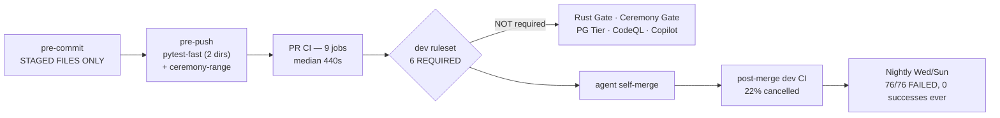

# CI / Copilot / CodeQL Synergy Report
**For the Director — 2026-07-30. Every claim traces to Lanes 1–5.**

---

## 1. CURRENT STATE

### The gate map (what actually binds)

**Required on dev (6):** Fast Gate, Unit Tests, Determinism Gate, gitleaks, trivy-config, pip-audit.
**Run but non-binding:** Rust Gate (the go-forward engine language, Amendment AE), Baseline Ceremony Gate, Postgres Integration Tier, CodeQL, Copilot review.
**dev has no `pull_request` rule at all** — a direct `git push origin HEAD:dev` satisfies zero checks; only the local `no-commit-to-branch` hook stops it.

### Where the wall-clock goes

Repo is public → **hosted minutes are free. The currency is agent time-to-green, not dollars.** 400 runs = 24.4 hours; ~1,590 min wall/day.

| Item | Number | Note |
|---|---|---|
| CI median run | **440s** (p90 510s) | 139 runs/day |
| **Unit Tests job** | **462s median** | *is* the critical path; everything else finishes under it |
| ├─ bootstrap-python | 154s | 5 of 9 jobs pay it → ~750s runner-time/run |
| └─ pytest shard | 388s | xdist -n4 on 4-core standard runners = saturated |
| Rust Gate | 84s | finishes 6 min before the unit job — **making it required costs zero latency** |
| CodeQL | 132 runs / **418.8 min/day** | Python only, 0 findings in sample, no concurrency block |
| Cancelled CI | 22% (91 min/day) | 13 of 59 dev post-merge runs — **22% of merged states are never fully validated** |

### What Copilot contributes today

37 inline comments across 18 sampled PRs (18/18 reviewed, auto-requested 0–1s after PR open). Classification: **32% real defects, 51% legit improvements, 14% style, 3% wrong (1/37).** ~83% substantive signal, and it does cross-file, cross-language verification (it cited `src/babylon/models/types.py:42-44` to prove a Rust doc comment misdescribes Pydantic validator ordering).

**Acted-on rate: 0/16 (0%).** Zero replies. Zero responsive commits. Merge-after-review deltas: 34s, 99s, 2m15s, 3m0s, 3m43s… **#397 merged 10 minutes before its review posted.** Escalated "🟡 Not ready to approve" verdicts (415, 428, 392, 397, 435) were merged straight through.

**Six Copilot-confirmed real defects are live on dev tip right now.** Two of them sit on P27's cross-language determinism/conformance surface — the repo's most sacred contract:
- `rust/crates/babylon-kernel/src/grid.rs:23` — `quantize` returns **−0.0** for inputs in (−5e-7, 0), leaking a distinct IEEE-754 bit pattern into the tick hash, contradicting the adjacent claim that the hash "never sees a quantized −0.0".
- `evaluator.rs` `apply_arith` — **Currency × Int accepted via `real_lane`**, a BSL type-law hole.
- Plus: `reader.rs:201` BOM offset skew; `mod_anchors.rs:115` accepts multiple anchors; `retention.py:111` hardcodes `~/.local/share` while its docstring claims XDG; `test_conservation_audit_strict.py:110` shim passes `hex_frame_hash` where production takes `replay_identity_hash` → **that test raises TypeError and exercises nothing.**

`.github/copilot-instructions.md` (323 lines) is badly stale — NetworkX, ChromaDB, `ai-docs/`, 7 systems, 12 EventTypes, "Benevolent Dictator". Review quality tracks reality anyway, because the file points at `CLAUDE.md`.

### What CodeQL contributes today

Python-only, `security-extended`, 132 runs/day. **Open alerts: 11, all in legacy `web/`** (Amendment V, non-gating) — 9 log-injection, 2 stack-trace-exposure, static since 07-15/07-19. **Zero open alerts in `src/` or `rust/`.** 32 fixed historically, 1 dismissal documented exemplarily. Not required anywhere.

**The budget is inverted:** the entire SAST spend scans the 23.6 MB Python estate that *froze today*, while **Rust — 1.23 MB, 6 crates, 355 locked packages, the engine language — has zero CodeQL coverage, zero `cargo` block in dependabot.yml, and zero cargo-audit/cargo-deny.** The `hypergraph-rs` git dep is invisible to advisory matching by construction.

### Scar classes with no gate (Lane 5, ranked by strikes × blast radius)

1. **Pre-commit staged-files-only → stale cross-file pins** — ≥5 strikes in 12 days; dedicated sentinel declared OWED at P25 closeout, absent from `src/babylon/sentinels/`.
2. **Worktree environment family** — ≥5 incidents (venv shadow, inverse shadow, uv.lock relock, missing `server` extra / `data/` / `.env`); recipe-in-memory only.
3. **`gh` merge discipline** — #392 (`--auto` ignored failing non-required checks) and #193 (`--delete-branch` silently *closed* a stacked PR while reporting success). Rule is prose. **And `dependabot-automerge.yml` lines 49/59/71 still use `gh pr merge --auto`** — the exact scar mechanism, sanctioned in a committed workflow.
4. Workflow `args`-as-string (thrice-bitten; one near-miss was a 1000-agent runaway).
5. Wall-clock/timing tests (no static detector).
6. `uv.lock` requires-dist staleness (`uv lock --check` tolerates it by design; slipped every layer).
7. Silently-inert CI gate (`rg` absent on runner; broken sed left security non-blocking).
8. Correct-but-inert / written-but-never-read; subset_policy JOIN; frozen-constant inertness; CI-bootstrap ≠ prod bootstrap; migration census undercount.

**The pattern:** the worst-latency scars — nightly dead 5 days, phi_hour hidden ~20 days, RNG seed dead forever, #392 — were caught by **no layer at all**, and three of four live in surfaces the layers structurally cannot see: the CI definition itself, coverage past tick 52, config dead on arrival, and the merge mechanism. The repo's best-performing pattern is the **mutation-validated sentinel** (`check:vocabulary` caught a fresh instance 11 days after landing). Your standing rule *"sentinel every error CLASS"* is honored for engine invariants and **not once applied to the process layer** — items 1–7 are all process-layer classes still living as prose.

---

## 2. RANKED RECOMMENDATIONS

---

### R1 — Make Copilot review a merge precondition in the *agent protocol*, not a required check
**Effort: S · Risk: Low**

**What:** Add `mise run pr:harvest -- <pr>` (thin `gh api repos/:owner/:repo/pulls/<n>/comments` wrapper) that lists unresolved `copilot-pull-request-reviewer` inline comments. Amend the agent merge protocol in `CLAUDE.md` (§Git & commits) to: *before self-merging, wait for the Copilot review, then for each inline comment either push a fix or post a reply stating why not. Zero unaddressed comments is a merge precondition.* Fold the check into the existing `mise run pr:merge` wrapper from R2.

**Why:** 83% substantive, 1/37 hallucination, **0% acted-on** — this is the largest already-paid-for signal in the estate, and it is 100% discarded. Six confirmed defects sit on dev tip, two on the P27 determinism/conformance surface. **The latency cost is ~zero: Copilot median 230s / p90 340s vs CI median 440s / p90 510s — the review lands ~200s *before* CI goes green.** Today's merge deltas (34s, 99s, 2m15s) mean agents are merging before the review exists, not after weighing it.

**Risk:** the 14% style/noise tail eats a little agent attention. Mitigated by R1b. The 3% hallucination rate is why this is a *reply-or-fix* protocol, not an approval gate — see WND-2.

---

### R1b — Rewrite `.github/copilot-instructions.md` around this repo's invariants
**Effort: S · Risk: None**

**What:** Delete the 323-line stale description (NetworkX, ChromaDB, `ai-docs/`, 7 systems, 12 EventTypes, Benevolent Dictator). Replace with ≤60 lines of *review directives*, not architecture prose:
- Determinism: every tick produces a deterministic hash; flag any float path that can emit −0.0, NaN, or reduction-order dependence; flag `time.sleep`/wall-clock in tests.
- **No imposed functional forms** — flag any stipulated sigmoid/logistic/tanh in a mechanic (ADR172 ruling 5); the S-curve must emerge from P(rev)/P(acq).
- Frozen Pydantic: `model_copy(update=…)` **skips validation** (scar #15, phi_hour) — flag every use writing a constrained scalar.
- Hyperedge law: Amendment D is NATIVE HYPEREDGE; Levi/incidence is internal storage only — flag exposed-model leakage.
- Cross-language transcription fidelity Python↔Rust (this is empirically its best skill — see the `AfterValidator` ordering catch).
- No fixture-fabricated node types or attributes (`check:vocabulary` classes).
- Say explicitly: *do not comment on line length, unused dev-dependencies, or naming preferences* — that is exactly the 14% tail.
- Keep the pointer to `CLAUDE.md`.

**Why:** the file is the only tuning knob, it is factually wrong on ~8 counts, and the one hallucination in 37 comments was a formatter-line-length claim (98 chars vs `line-length = 100`) — precisely the class the "do not comment on" list removes.

---

### R2 — Close the merge mechanism: promote 3 checks to required, delete `--auto`, stop cancelling dev validation
**Effort: S · Risk: Low**

Three edits, one theme:

**(a) Add to the dev ruleset (18807584) required checks: `Rust Gate`, `Baseline Ceremony Gate`, `Postgres Integration Tier`.**
Rust is the engine language by Amendment AE and can currently merge red into dev. Rust Gate is **84s median** and PG Tier **143s** — both finish inside the 462s unit job, so **required-status costs zero added latency.** The PG Tier is also the *only* layer that ever caught scar #8 (the `audit_rows` stash deletion; unit + fast gate stayed green throughout).

**(b) Delete `gh pr merge --auto` from `.github/workflows/dependabot-automerge.yml` (lines 49/59/71)** — replace with an explicit wait-then-`--merge`. This is the literal #392 mechanism, sanctioned in a committed workflow while the repo-wide law says NEVER `--auto`. With (a) applied the blast radius shrinks, but the rule should not have a hole in it.

**(c) Split ci.yml concurrency so `push: dev` runs are `cancel-in-progress: false`.**
13 of 59 dev post-merge runs (22%) are killed mid-flight because merges land faster than the 7.3-min wall — **so 22% of merged dev states are never fully validated, and #392 was caught by exactly a *completed* dev post-merge run.** You are cancelling the layer that caught your worst merge scar, 1 run in 5. Minutes are free; there is no reason to cancel.

**Risk:** (a) can red an in-flight PR that was relying on non-required leniency — that is the point. (c) increases concurrent runners, no cost on a public repo.

---

### R3 — Nightly: 76 consecutive failures, zero successes ever — split it and rescue the michigan gate
**Effort: M · Risk: Low**

**What:** (i) Move `qa:michigan-rollover-smoke` out of `nightly.yml` into its own tiny workflow on a daily cron (or onto PR CI — it is a tick-52 rollover smoke, not a 520-tick pacing run). (ii) Split the remaining nightly into per-leg workflows (test-rest, security, pg-integration, refdata, rebuild-verify, pacing) so one broken leg cannot red the estate. (iii) Fix or delete the 5 currently-failing legs; the 07-29 run failed Reference-Data, Postgres Integration, Rebuild-Verify, G1 Pacing, Non-Unit Tests.

**Why:** Nightly is **69% of all recent failure events and has never once succeeded** since history began 2026-07-12. It produces zero information per run and actively trains agents to ignore red. **The sharp edge:** `qa:michigan-rollover-smoke` — the *blocking* gate you created yesterday precisely because a crash hid for ~20 days past tick 52 — is buried inside a workflow that has been red 76/76 times. **That repair gate is de facto inert.** It cannot signal, because nobody can distinguish its red from the ambient red.

**Risk:** splitting costs a day of triage. Doing nothing costs the phi_hour class staying ungated in practice while looking gated on paper.

---

### R4 — Kill the staged-files blind spot with a pre-push full-tree sentinel leg
**Effort: S · Risk: Low**

**What:** Add to `.pre-commit-config.yaml` `pre-push` stage: `mise run check:sentinels-static` + `mise run check:surface` (full-tree, `pass_filenames: false`).

**Why:** This is the **#1 recurring ungated class — ≥5 strikes in 12 days** (enums baseline `abff30a6`; U12-C1 severity pins; the self-declared "FOURTH strike" U13 `PENDING_CEREMONY` re-export drop, 34 failures; #352 `canonical_defines_hash`; #359 `ooda_profile`). Every single one was caught by PR CI full-tree — i.e. after push, after a runner cycle, at ~43 PRs/day cadence. The gate already exists and already runs in Fast Gate; it is simply not run at the layer that would catch it in seconds. The dedicated sentinel was declared OWED at P25 closeout and never built; this is the cheap 80% of it.

**Risk:** adds seconds-to-tens-of-seconds to `git push`. Pre-push already carries pytest-fast, import-linter, radon, semgrep and vitest — proportionate.

---

### R5 — Retune CodeQL: add Rust, halve the runs, zero the noise floor, keep it informational
**Effort: M · Risk: Low-Medium**

Four edits to `.github/workflows/codeql.yml` (39 lines):

**(a) Add a `rust` matrix leg** with `build-mode: none` (public preview since the CLI 2.22.x line; no cargo build needed). Raise `timeout-minutes: 10` → 20. *Why:* 1.23 MB / 6 crates / 355 packages of go-forward engine has zero SAST while the estate that froze today gets `security-extended`.

**(b) Drop the `pull_request` trigger; keep `push: [main, dev]` + weekly cron.** *Why:* 132 runs / 418.8 min per day with **0 failures in sample and 0 open alerts in `src/` or `rust/`**, on a non-required check nobody reads. Dropping PR removes ~73 runs (~232 min/day) while keeping the default-branch alert database fresh — which is where alerts actually live.

**(c) Add a `concurrency` block.** It is the only one of 12 workflows without one, so overlapping runs never cancel.

**(d) Zero the noise floor:** dismiss the 11 open `web/` alerts with reason, citing Amendment V (legacy, non-gating), or add a CodeQL config `paths-ignore: [web/, src/frontend/]`. *Why:* a standing 11-alert floor since 07-15 means "nonzero alerts" carries no information. This shop already runs zeroed floors elsewhere — pip-audit ignores at 1 justified residue with expiry, `.trivyignore` at 1 with owner. Once the floor is 0, **any** new alert is news, and *that* is when the triage rule ("a new alert on `src/` or `rust/` is a STOP") becomes enforceable by an agent reading one number.

**Risk:** the Rust extractor is preview — expect an initial false-positive batch; triage it once, dismiss with reasons, then the floor is 0 again. Do **not** make it required (WND-4).

---

### R6 — Rust supply chain: dependabot `cargo` block + `cargo-deny` in the Rust Gate
**Effort: S/M · Risk: Low**

**What:** (a) add a `cargo` ecosystem block to `.github/dependabot.yml` (`directory: /rust`, target `dev`, weekly, grouped minor/patch — mirror the pip model). (b) Add `cargo deny check advisories bans licenses sources` to the `rust-gate` job with a `deny.toml`, including a `[sources]` allowlist entry for the `hypergraph-rs` git dep.

**Why:** 355 locked crates get **zero proactive update PRs** while the frozen Python stack gets weekly bumps. `rg 'cargo.?(audit|deny|vet|about)'` = zero hits repo-wide. Today's only Rust protection is async repo-level Dependabot alerts — never PR-blocking. The rev-pinned `hypergraph-rs` git dep (`babylon-tui/Cargo.toml:50`) has **no version→advisory mapping and never will**; a `[sources]` allowlist plus a periodic manual rev-bump protocol is the ceiling, and cargo-deny is the only tool that provides it. Rust Gate is 84s — there is headroom.

---

### R7 — Cut PR→main double-compute by deleting one trigger (also fixes the drift-on-the-required-path)
**Effort: S · Risk: Low**

**What:** Remove `pull_request: branches: [main]` from `main.yml`; keep its `push: main`. PRs to main then run `ci.yml` only.

**Why:** Both files currently trigger on PR→main and emit **identical check-context names** — double compute, and required contexts satisfiable by either copy. Worse, the twins have admitted drift (`main.yml:55-59`): **main.yml's fast-gate runs only `check:seams` + `check:coverage`, ~18 fewer sentinels than ci.yml's `check:sentinels-static`**; main.yml's qa-regression lacks `qa:vault-regression-ci` and `check:gate-coverage-truth`; no main.yml job runs `ci_hypergraph_stub.sh`. So on the "whole ordeal" branch, whichever copy reports first may be the *weaker* one. main's 3 extra required contexts (PG Tier, Rust Gate, Ceremony Gate) are produced **only by ci.yml**, so this edit is safe by construction and makes the required path unambiguously the stronger workflow. The doc-blocked `workflow_call` factoring stays unnecessary.

---

### R8 — Take the maturin rebuild off the venv-cache critical path
**Effort: M · Risk: Medium**

**What:** Add a single `build-wheel` job that runs `maturin build` once per PR head, uploads the `babylon-tui` wheel as an artifact; downstream Python jobs `uv sync --frozen --no-install-package babylon-tui` then install the artifact. Separately, add `restore-keys` to the **cargo** caches (`bootstrap-python/action.yml:57`, `ci.yml:113`) — they use exact-match on `rust/Cargo.lock` with no fallback, one screen away from the mypy cache that demonstrates the correct pattern.

**Why:** bootstrap is 154s inside the 462s critical-path job (33%) and ~750s of runner-time per run (~1,700 runner-min/day). More important is the trajectory: the venv cache key hashes `rust/crates/**` + `rust/python/**`, so **every Rust-touching PR = cold venv = the ~15-min maiden bootstrap**, which is why `test-unit`'s timeout was already raised 20→30. Under P27 *every* PR touches `rust/`. This cost is about to become the normal case, not the exception.

**Risk:** Medium — a wheel-artifact seam is a new place for staleness. Key the artifact on the head SHA, never on a content hash.

---

### R9 — Three cheap sentinels for three ungated process classes
**Effort: S each · Risk: Low**

**(a) Wall-clock tests (scar #7).** One `semgrep` ERROR rule banning `time.sleep(` and `datetime.now()`-based assertions under `tests/`, with a documented bounded-poll exemption. semgrep-ERROR is already a pre-push hook — this is one pattern file. The class's one specimen red'd main probabilistically under load; a static rule is strictly better than a flake.

**(b) Inert / uncommitted / undocumented workflows (scars #9, #10, and two live instances).** Extend `tests/unit/test_workflow_hygiene.py` — which already exists, sweeps step shapes, and ships with a mutation self-test — with two rules: *(i) every workflow carrying a `schedule:` trigger must exist on the default branch*, and *(ii) every workflow path referenced in `CLAUDE.md`/docs must appear in `git ls-files`.* This catches both live instances at once: `frozen-engine.yml` (Mon cron, exists only on your feature branch → cannot fire until it lands on the default branch) and `openwiki-update.yml` (**never committed at all**, yet `CLAUDE.md` asserts "The scheduled OpenWiki GitHub Actions workflow refreshes the repository wiki" — a verifiability violation under your own documentation law).

**(c) Worktree environment contract (scar class #2, ≥5 incidents).** Promote `check:env-contract` — which today guards only the PYTHONPATH-unset half — into `mise run check:worktree-contract`, run `fail_fast` as the first pre-commit hook: assert venv interpreter matches `.python-version`, the `server` extra is installed, `data/` symlinks resolve, `.env` exists, and **`uv.lock` is unmodified vs HEAD** (which also closes scar #5's relock half). Every one of these five incidents cost a debugging session and one produced a false "the game is broken" 500.

---

### R10 — Codify the two remaining merge-protocol rules as one wrapper
**Effort: S · Risk: Low**

Add `mise run pr:merge -- <pr>`: refuses `--auto`; verifies `headRefOid == green run headSha`; refuses if `Rust Gate`/`Ceremony Gate`/`PG Tier`/`CodeQL` are red even after R2 (belt and braces); refuses if R1's harvest returns unaddressed comments; refuses on stacked PRs where `--delete-branch` would close-not-merge (scar #193). Then make it the only sanctioned merge path in `CLAUDE.md`. This converts four prose rules — all of which have already bitten — into one mechanism, matching how `mise run commit` retired the silent-hook-abort class (scar #3).

---

## 3. WHAT NOT TO DO

**WND-1 — Do not retire Copilot review.** 83% substantive, 1 wrong comment in 37, and it produces catches no deterministic gate in this repo can: cross-language transcription fidelity (it proved a Rust doc comment misdescribes `AfterValidator` ordering by citing `types.py:44`), and spec-conformance reading against `bsl-language.rst` §-numbers and E-LEX/E-TYPE/E-EVAL codes. The failure is entirely in the harvest loop, not the reviewer. Retiring it would discard your highest-precision non-mechanical signal on the P27 surface.

**WND-2 — Do not make Copilot a required check or a blocking approval.** It is stochastic, its p90 latency (340s) can and did exceed merge cadence (#397 merged 10 min before its review arrived), and 14% of its output is style noise. Putting a non-deterministic LLM verdict on the merge path in a repo whose first law is *"every tick produces a deterministic hash; non-determinism is a bug"* is self-contradictory. Machine gates stay deterministic; the LLM belongs in the agent's own pre-merge discipline (R1).

**WND-3 — Do not add `restore-keys` to the venv cache.** The exact-match key hashing `rust/crates/**` is *deliberate* and documented at `bootstrap-python/action.yml:63-71` — uv does not invalidate on `.rs` edits, so a fallback key would resurrect a stale `babylon-tui` wheel and silently test the wrong Rust. Add restore-keys to the **cargo** cache only (fingerprinted, stale entries are merely extra bytes). This is the one obvious cache "fix" that would create a determinism hole.

**WND-4 — Do not make CodeQL a required check today.** Zero open alerts in `src/` or `rust/`; the Rust extractor is public preview. Requiring a preview tool with an unmeasured false-positive rate on a 43-merge/day self-merge path buys nothing and can wedge the workforce. Zero the noise floor first (R5d), watch a Rust cycle, then reconsider.

**WND-5 — Do not adopt a GitHub merge queue.** 43 merges/day × 7.3 min serialized ≈ **5.2 hours/day of pure queue time**, and it serializes a workforce whose entire operating model is parallel self-merge. The problem it would solve — unvalidated merged states — is solved for free by R2(c) (`cancel-in-progress: false` on `push: dev`) on a repo where minutes cost nothing.

**WND-6 — Do not add test-impact selection to shave the 388s pytest shard.** Test selection is only as good as blast-radius prediction, and this repo's scar record is *dominated by mis-predicted blast radius*: the ContextType census `rg` missed 5 shapes and broke 113 tests across 9 files (caught only by the 110s PG-tier test); phi_hour hid 20 days because no leg ran michigan past tick 52; the staged-files class has 5 strikes for exactly this reason. Buy latency from bootstrap (R8), not from coverage.

**WND-7 — Do not chase CI minutes.** The repo is public; hosted minutes are free. Optimize time-to-green and signal-per-run. Every recommendation above that *adds* compute (Rust CodeQL leg, uncancelled dev runs, required Rust/PG gates, pre-push sentinels) is correctly priced at zero dollars.

**WND-8 — Do not refactor `ci.yml`/`main.yml` into a shared `workflow_call`.** Already assessed and blocked at `main.yml:55-59` — it renames required-check contexts. R7 gets the same benefit with a one-line deletion.

---

## 4. HONEST SURPRISES (you did not ask; you should know)

1. **Your newest gate is born inert.** `qa:michigan-rollover-smoke` — created yesterday because a crash hid ~20 days — lives inside a workflow that has failed **76 out of 76 runs, ever**. It cannot signal.
2. **`frozen-engine.yml` will never fire** until it reaches the default branch (scheduled workflows execute from the default branch). Right now the frozen-canon verification of `p27-python-freeze` is a file, not a gate.
3. **`CLAUDE.md` documents a workflow that does not exist in git.** `openwiki-update.yml` is untracked (`??`), absent from `git ls-files` and `origin/dev`. Its daily cron cannot fire. Under your own Verifiability rule, that sentence should come out today.
4. **`main` — "the whole ordeal" — is weaker than `dev` on the sentinel axis.** main.yml's fast-gate enforces ~18 fewer sentinels, skips the vault leg, skips `check:gate-coverage-truth`, and runs no hypergraph stub. Also `qa:e2e-regression` is a standing red there with two ceremonies owed.
5. **`dev` has no `pull_request` rule.** Required checks bind PR merges; a direct push to `dev` satisfies nothing. Only a local pre-commit hook and convention stand between any process with a token and an unvalidated dev tip.
6. **72 Dependabot Auto-Merge runs/day, all skipped.** Cosmetic, but it means the automerge path has essentially never executed — which is why nobody has noticed it still carries `--auto`.
7. **CodeQL spends 418 min/day and produced 11 findings, all in an estate you have ruled legacy and non-gating**, while the language you just declared the engine has none. That is the single clearest budget inversion in the stack.
8. **The one Copilot hallucination in 37 comments was a *gate* claim** ("will fail the formatting gate" — 98 chars vs `line-length = 100`). Its failure mode is asserting things about your tooling, not about your code. R1b's "do not comment on formatting" line removes the whole class.

---

## 5. VERIFICATION ADDENDUM (main-loop, post-synthesis — every defect claim independently checked before delivery)

The six "live defects" in §1 were re-verified against the working tree at dev
`bb6df6cf`+; the report's provenance discipline requires it. Results:

| Claim | Verdict | Evidence |
|---|---|---|
| `grid.rs` `quantize` emits −0.0 on (−5e-7, 0) | **CONFIRMED — conformance bug** | Live probe: Python `quantize(-4e-7)` → bits `0000…0` (+0.0); the Rust negative branch computes `-(0.0)/GRID` → bits `8000…0` (−0.0). Divergent bit patterns on the tick-hash surface, exactly the open interval (−5e-7, 0); `quantize(-5e-7)` → −1e-6 matches on both sides. The module's own "never sees a quantized −0.0" claim is false for this range. |
| `evaluator.rs` accepts `Currency × Int` | **CONFIRMED — type-law hole** | `bsl-language.rst:849-850` rules `Currency × Int` a type error ("multiply by a Coefficient instead"); `real_lane` maps `Int → Some(f64)`, so the `*` arm's guard passes it to `currency_mul_coefficient`. With §3.4 kind PROPAGATION deferred to Phase 2, nothing else rejects it — live end-to-end. |
| `mod_anchors.rs` accepts multiple `(anchor …)` forms | **CONFIRMED — silent-first-wins** | `find_map` takes the first anchor form; a second, contradictory one is silently ignored (III.11 violation). |
| `reader.rs` BOM position skew | **CONFIRMED — diagnostics-only** | `read_all` strips the BOM then scans; every subsequent error `position` is relative to the stripped text, off by the BOM's 3 bytes vs the file. |
| `test_conservation_audit_strict.py:110` TypeError shim | **NOT CONFIRMED — cited file does not exist** | No such path in the tree; nearest analogues (`test_conservation_auditor.py`, `tests/scripts/quickstart_062_walkthrough.py:170`) check out — `ConservationAuditRow` declares `hex_frame_hash`, no TypeError. Treat this row as a lane-3 transcription error unless a PR-diff context resurfaces it. |
| `retention.py:111` hardcodes `~/.local/share` vs XDG docstring | **CONFIRMED as written, disposition = Director flag** | The code doesn't consult `$XDG_DATA_HOME` — but it deliberately mirrors the 2026-07-28 logging directive's literal `~/.local/share/babylon/` path. Honoring XDG would have to move logs and archives together; that touches the directive, so it is flagged here, not fixed unilaterally. |

**The four confirmed Rust defects are being fixed immediately** (TDD, separate
`fix(rust)` PR) — they sit on Phase 1's conformance surface and predate any
ruling on R1–R10.

## 6. DELIVERY NOTES (facts that moved while the evidence lanes ran)

- **Surprise #2 is already resolved:** `frozen-engine.yml` merged to `dev` (the
  default branch) via PR #436 during this audit, and its first
  `workflow_dispatch` run is green (run 30569880754). The frozen-canon
  verification of `p27-python-freeze` is a live gate as of 18:23Z.
- **Surprise #3 stands and is the Director's call:** `openwiki-update.yml` and
  the `openwiki/` tree are untracked files in the Director's own working tree
  (visible in `git status` since session start) — the agent workforce does not
  commit the Director's uncommitted work. Until they land, the `CLAUDE.md`
  OpenWiki paragraph asserts a workflow git does not contain.
- **R1–R10 and WND-1..8 are RECOMMENDATIONS AWAITING DIRECTOR RULING.** Nothing
  from §2 is implemented. Several rows change the merge protocol, required
  checks, or `CLAUDE.md` law — those are process-constitution edits and stay
  hers. The defect fixes above are the only action taken unilaterally, under
  the standing "fix real problems as encountered" grant.
