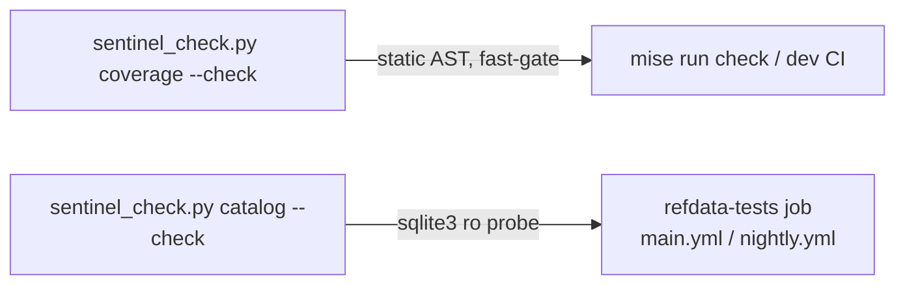

I have a complete, verified picture. Here is the design.

---

# Data Constitution — data-catalog.yaml as an enforcing per-table registry + Coverage-sentinel extension

**Evidence base (verified this session):**
- `data-catalog.yaml:6-7` — top-level is `version` + `categories[].sources[]` (source-provenance only; 6 categories, ~45 agency-level sources). No per-*table* layer exists yet. III.4.1 pins it as the canonical machine catalog (`CONSTITUTION.md:269`).
- Reference DB holds **99 tables + 10 views** (`sqlite_master`), yet the *code-consumed* dependency set is only 4 rows (`coverage/registry.py:81-130`, `DATA_REQUIREMENTS`).
- **The pathology is real:** `view_surplus_value` (a shipped analytical view) `SELECT`s `FROM fact_productivity_annual`, which has **0 rows** — a view that silently returns empty, the exact III.11 silent-degradation `CONSTITUTION.md:297` forbids. Sibling `fact_bls_productivity` = 5,320 all-zero placeholder rows (`reports/test-estate-audit-2026-07-16.md:470-472`).
- Two adjacent SoTs already exist and must be *reconciled*, not duplicated: `tools/make_reference_subset.py` `TABLE: dict[str, TablePolicy]` (per-table CI-subset scope, with a `find_unknown_tables` loud-failure at `:737-750`), and the coverage sentinel's `DataRequirement` literal.
- CI lane exists: marker `requires_reference_db` (`pyproject.toml:180`), job `refdata-tests` in `main.yml:361` / `nightly.yml:124`, fed by `fetch-reference-db` (ci-data subset). Fast-gate (`dev`) excludes it.

**One deliberate idiom deviation (justified):** coverage/synthetic use hand-written frozen `.py` literals *because they are not moddable YAML SoTs*. The catalog **is** a maintained YAML SoT (III.4.1), so the registry loads `data-catalog.yaml` into frozen Pydantic rows at check time — mirroring `GameDefines.load_default()` reading `defines.yaml`, not the `.py`-literal idiom. Everything else (frozen `extra="forbid"` rows, pure-AST static checks, `run_sensor` two-tier exit-code contract) is followed exactly.

## (1) Per-table catalog entry schema

Add a new top-level `tables:` block to `data-catalog.yaml` (leaving `version`/`categories` untouched — backward-compatible). Each entry loads into a frozen `CatalogTable` (new `babylon/sentinels/coverage/catalog.py`):

```yaml
tables:
  - name: view_surplus_value          # table OR view name; must exist in sqlite_master
    kind: view                          # Literal["table","view"]  (drives the empty-view probe)
    source: BEA_IO_NATIONAL_USE         # FK → an id in categories[].sources[] (or "derived"/"internal")
    extractor: null                     # "Class @ src/…/loader.py" or null (loaders deleted spec-037; archaeology only)
    reads: [fact_productivity_annual]   # views only: base fact/dim tables (empty-view probe target)
    consumers: []                       # code symbols that read it: "sym @ repo/rel/path.py" (AST-checked, static)
    tests: [tests/unit/reference/test_view_columns.py]   # guarding tests (existence AST-checked)
    disposition: vestige                # Literal["keep","fill","artifact","amputate","vestige"]  (task #11 triage)
    subset_policy: full                 # Literal["full","michigan","skip"] — MUST equal TABLE[name].scope
    material_relation: "s/v rate of exploitation by industry"   # Aleksandrov Test; required, non-blank
    notes: "base table empty → view yields 0 rows (III.11); triage: fill or amputate"
```

`CatalogTable(BaseModel, frozen=True, extra="forbid")`, fields typed as above, with a `model_validator(mode="after")` rejecting: blank `name`/`material_relation`; a `view` with empty `reads`; a non-`view` with non-empty `reads`; `consumers`/`tests`/`extractor` entries not matching `"<symbol> @ <path>.py"` (or bare `path.py` for tests). Loud at import (III.11), same pattern as `DataRequirement._validate_shape` (`registry.py:56-72`).

## (2) Sentinel checks

Split by data need, matching the layer-0.5 boundary:

**STATIC tier — extends the existing `coverage` sensor's `_GATING_CHECKS` (fast-gate, no DB):**
- `check_catalog_symbols_exist` — every `consumers`/`extractor`/`tests` path parses and defines its named symbol, via the existing `symbol_exists`/`module_class_names` AST helpers (`_ast.py`, `synthetic/checks.py:99`). Orphaned consumer ⇒ red. *(Extends, does not replace, `check_source_classes_exist`.)*
- `check_subset_policy_parity` — for every catalog row, `subset_policy` **==** `TABLE[name].scope` parsed statically from `make_reference_subset.py`. This is the **catalog-vs-DB-policy drift** guard against the two SoTs diverging (both are source files → pure AST, fast-gate-safe).

**DB-PROBE tier — new `catalog` sensor, lazy-imported like `_partition_main` (refdata lane only):**
- `check_no_undeclared_tables` — every `sqlite_master` table/view (filtered to `fact_/dim_/bridge_/view_` prefixes, reusing `find_unknown_tables`' prefix rule) must have a catalog row. Undeclared ⇒ red (III.4 traceability). Mirror of `find_unknown_tables`.
- `check_no_declared_missing` — every catalog `name` must exist in `sqlite_master`. Phantom row ⇒ red.
- `check_no_empty_consumed` — **the view_surplus_value guard.** For any row with `disposition ∈ {keep, fill}` **and** non-empty `consumers`: `SELECT COUNT(*)` must be `> 0`; for `kind: view`, each table in `reads` must be `> 0` (an empty base table = a silently-empty view). This is the check that would red today on `view_surplus_value`.

DB access via a genuinely read-only connection (`mode=ro`, copy `_open_source_readonly`, `make_reference_subset.py:753`); a missing/unopenable DB raises `SentinelCheckError` → exit 2 (never a false pass), so the probe can never be run against no DB and report clean.

## (3) CLI + CI wiring



- **`coverage`** sensor gains the two static checks in its `_GATING_CHECKS` (`coverage/checks.py:95`). Runs where it already runs: `mise run check` fast-gate. No new lane.
- **`catalog`** is a *new* key in `tools/sentinel_check.py` `_SENSORS` (`:39`), routed through a `_catalog_main` lazy-import shim exactly like `_partition_main` (`:26-35`) because it opens sqlite3 and must not load into the layer-0.5 fast-gate. Invoked **only** in the `refdata-tests` job (add `poetry run python tools/sentinel_check.py catalog --check` beside `main.yml:372`/`nightly.yml:139`), which already has `fetch-reference-db`. Same 0/1/2 exit contract via `run_sensor`.

## (4) TDD test list (`tests/unit/sentinels/test_catalog.py` static; `tests/integration/reference/test_catalog_db.py` `@requires_reference_db`)

Static (fast-gate, mirror `test_coverage.py`):
1. `test_catalog_yaml_loads` — real `data-catalog.yaml` parses to ≥1 `CatalogTable`, no `extra="forbid"` reject.
2. `test_real_catalog_symbols_coherent` — `check_catalog_symbols_exist() == []` (invariant).
3. `test_real_subset_policy_parity` — `check_subset_policy_parity() == []` (invariant; catalog == TABLE).
4. Efficacy: injected row with a nonexistent consumer symbol reds; injected `subset_policy` mismatch reds.
5. Loud: `CatalogTable` rejects blank `name`, a `view` with empty `reads`, a non-`.py` consumer path (raises at construction).
6. Efficacy: missing catalog file / unparseable → `SentinelCheckError` (exit 2).

DB (refdata lane, mirror the injectable-registry pattern):
7. `test_no_undeclared_tables` / `test_no_declared_missing` against the ci-data subset == `[]`.
8. `test_empty_consumed_reds` — a synthetic registry row (`kind=view`, `reads=[fact_productivity_annual]`, `disposition=fill`, non-empty consumers) **reds** — pins the `view_surplus_value` pathology as a regression contract.
9. `test_probe_missing_db_is_loud` — pointed at a nonexistent DB path → `SentinelCheckError`.
10. `test_cli_catalog_check_exit` — `sentinel_check.py catalog --check` subprocess exits 0 on the subset (idiom from `test_synthetic_registry_check.py:217`).

## (5) Out of scope

- **Populating/deleting data.** The sentinel *declares and detects*; FILL / ARTIFACT-IZE / AMPUTATE execution is task #13 and needs owner rulings (task #11 triage matrix). `disposition` is the declared verdict, not an action.
- **Row-value profiling** (all-zero detection like `fact_bls_productivity`, distribution/coverage-by-county/year). The probe checks `COUNT(*) > 0` only; "present but all-zero/placeholder" is a nightly *value*-coverage probe, deferred (same boundary the coverage sentinel already draws, `coverage/checks.py:18-21`).
- **Non-prefixed tables** (`ingest_checkpoint`, `staging_arcgis_feature`) — utility tables outside the `fact_/dim_/bridge_/view_` traceability scope; excluded exactly as `find_unknown_tables` excludes them.
- **Regenerating the catalog from the DB.** The YAML stays hand-curated (it carries `material_relation`/`disposition` judgments no schema scan can infer); the sentinel enforces bijection, it does not author rows.
- **Backfilling all ~109 rows in this task** — the *mechanism* + the `view_surplus_value` regression contract are the deliverable; full enumeration rides the census workflow (task #10).

**Files touched (implementation, not this task):** `data-catalog.yaml` (+`tables:`), new `src/babylon/sentinels/coverage/catalog.py` (loader+model), edits to `coverage/checks.py` (+2 static checks), new `coverage/db_probe.py` (lazy, DB), `tools/sentinel_check.py` (+`catalog` route), 2 new test modules, +1 line in `main.yml`/`nightly.yml` refdata job. Bump `data-catalog.yaml` `version` 2.6.3 → 2.7.0; ADR in `ai/decisions/`.
