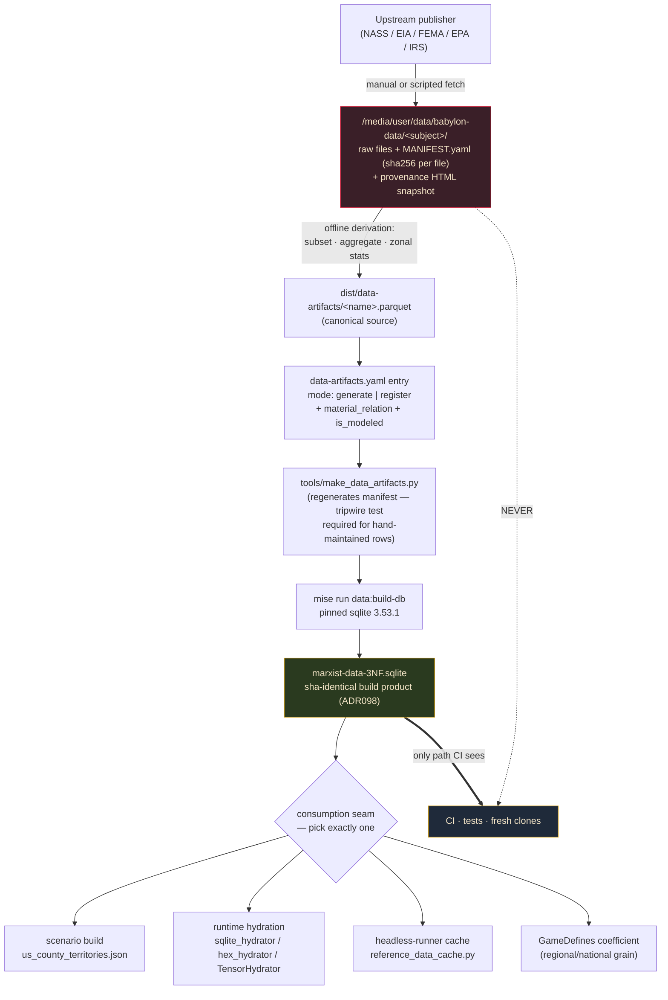

# Data Gap Audit — Reference Estate, Runtime Estate, and Acquisition Slate

**Date:** 2026-08-12
**Commissioned by:** Director (Persephone Raskova), verbatim brief recorded in §0.1
**Method:** four estate censuses (reference build, Postgres runtime, raw trove, consumer side) plus five
gap-research passes (agriculture, land ownership, energy, climate outcomes, unasked domains), synthesized
and spot-verified against the live estate on 2026-08-12.
**Status:** advisory. Nothing here is ratified. Schema/enum changes flagged in §8 are Director/amendment
territory and must not be improvised.

---

## 0. How to read this document

### 0.1 The brief

> "i want you to review the codebase as well as our postgres database, and what not, and see if there's any
> missing data we should grab. One that comes to mind is USDA agricultural land surveys, another is land
> ownership. Land ownership we may already have that in the Piketty data and if not we could go BLM (land
> management ...) or Zillow or whatever. Another one that comes to mind for when we eventually get to the
> phase where we need to do the energy calculations as part of the energy-land-labor simplex mediated by
> dollars. as well as CO2 and pollution metrics because eventually Babylon will need to model **the outcomes
> of** climate (not the actual climate itself because that would be insane and not really enrich gameplay)"

### 0.2 Citation keys

Every factual claim below carries a source key. Nothing is asserted without one.

| Key | Source |
|---|---|
| `[C1]` | CENSUS 1 — the reference build estate (`data-artifacts.yaml` + `data/sqlite/marxist-data-3NF.sqlite`) |
| `[C2]` | CENSUS 2 — the Postgres runtime estate (`babylon_test` @ 5433, `src/babylon/persistence/`) |
| `[C3]` | CENSUS 3 — the raw trove at `/media/user/data/babylon-data` (87 GB) |
| `[C4]` | CENSUS 4 — the consumer side (which mechanics eat which data) |
| `[G-AG]` | Gap report — agricultural land (USDA NASS / ERS) |
| `[G-LAND]` | Gap report — land ownership / tenure |
| `[G-EN]` | Gap report — energy |
| `[G-CLIM]` | Gap report — CO2 / pollution / climate **outcomes** |
| `[G-CRIT]` | Gap report — the unasked domains (repression, struggle, organization, health, money, media) |
| `[V]` | Verified live in this session against the working tree / reference DB (§0.3) |

### 0.3 What was re-verified in this session

Five load-bearing claims were checked directly rather than inherited:

1. **The three dispossession tables are empty shells, not data.** `fact_eviction_lab_filing` = 6,570 rows
   across 3,285 counties × 2 time_ids, and `SUM(filings), SUM(executions), SUM(filing_rate),
   SUM(renter_households)` all return `0`. `fact_foreclosure_rate` and
   `fact_census_institutional_ownership` are identical zero-shells. `[V]`, confirming `[C1 §5.2]` and
   **correcting `[C4 §2]`** — see §7.1.
2. **`get_agricultural_rent` has exactly one implementation and it returns `None`.** Protocol at
   `src/babylon/domain/economics/rent/data_sources.py:59`, called at `rent/calculator.py:109`, stubbed at
   `factory.py:457`. `[V]`, confirming `[G-AG]`, `[G-LAND]`.
3. **`HexTenureComposition` has zero production constructors.** `rg "HexTenureComposition\("` over `src/`
   returns only the class definition at `substrate/types.py:88`. `[V]`, confirming `[G-AG]`.
4. **`BiocapacityType` has no agricultural member, and LAND hexes get no biocapacity stock at all.** The
   enum docstring at `src/babylon/models/enums/territory.py:135-147` states "WATER hexes get FRESHWATER,
   FISHERY, SHIPPING_ACCESS. RESOURCE hexes get MINERAL, TIMBER, HYDROELECTRIC" — LAND is unlisted. `[V]`,
   confirming `[G-AG]` notes.
5. **The reference DB has 76 tables and none of them are energy, agriculture, land, climate, emissions,
   health, or union tables.** A `sqlite_master` scan for those name patterns returns nothing. `[V]`,
   confirming `[C1 §5.7]`.

### 0.4 The rule that killed proposals

Every candidate was tested against the Aleksandrov standard as the Constitution states it: *every formal
construct traces to a material relation*. Operationally — **a dataset earns acquisition only if a named,
existing-or-chartered mechanic consumes it.** Fourteen candidates failed and are killed outright in §9;
nineteen more are deferred with an explicit unblocking condition in §10. This is not a wish list.

---

## 1. Executive summary

### 1.1 Surprises first — what we already HAVE

Nine findings that change the shape of the acquisition question. The first three mean the highest-value
work in this dossier is **wiring, not buying**.

1. **The energy-labor-money simplex's only empirically dark vertex is sitting on the drive, orphaned.**
   `[C4 §3]` records that β_L (wages) exists via QCEW, β_T (ground rent) is proxied by `fact_census_rent`,
   and β_J (energy input cost share) is "empirically dark → simplex uncalibratable." But
   `/media/user/data/babylon-data/gdp-by-industry/KLEMS.xlsx` `[V]` — the BEA-BLS Integrated Production
   Account — contains sheets `TKE102/103/104` (*Chain-Type Quantity and Price Indexes for Energy Inputs by
   Industry*) and `TKG105`. That **is** β_J, measured, national × BEA industry × year, concordant with the
   existing `dim_bea_industry` (107 rows) and `bridge_naics_bea` (462 rows) `[C1 §3b]`. `[C3]` flagged it as
   "KLEMS greps empty in both registries." The current BEA file is **26 KB** `[G-EN #3]`. The simplex's
   blocking vertex costs a wire, not a purchase.
2. **The 49 MB EPA GHGRP capture on the drive already ships its own join key.**
   `/media/user/data/babylon-data/epa_ghgrp/` `[V]` holds RY2010–2023 facility emissions, sha256-manifested
   in `MANIFEST.yaml`, plus `ghgrp_oris_power_plant_crosswalk_12_13_21.xlsx` — the GHGRP↔EIA/ORIS plant-ID
   crosswalk `[C3 §2]`. It has waited a year for its partner: one 21 MB eGRID workbook turns a facility CO2e
   list into a county-resolvable **intensity** `[G-CLIM #3]`.
3. **County-level agricultural TENURE exists, is free and federal, and is not where anyone looks.** The
   2022 Census of Agriculture county chapter has 57 tables and **none is titled for tenure** — a searcher
   concludes county tenure is unpublished. It is inside **Table 45**, whose `OWNED AND RENTED LAND IN FARMS`
   / `TENURE` sections carry Full owners / Part owners / Tenants at county columns; `[G-LAND #2]` verified
   this by fetching and text-extracting Iowa's `st19_2_045_045.pdf`. This is the only free, federal,
   county-FIPS, actual-land-tenure source in existence.
4. **The Director's Piketty hypothesis is answered: NO.** The 5.8 GB WID.world dump at
   `/media/user/data/babylon-data/piketty/` `[C3]` *does* carry land variables — `ahwagri` (personal
   agricultural land), `ahwlani` (land underlying dwellings), plus corporate and government counterparts —
   but `[G-LAND]` verified by direct `awk` over `WID_data_US.csv` that every one is published at percentile
   `p0p100` **only** (224 rows, one bucket; `ahwagri` has exactly one distinct percentile), 1913–2024,
   national aggregate. By contrast `shweal*` carries the full `p0p1 … p0p100` ladder. WID gives Babylon a
   national *composition* constraint (land vs. dwellings vs. financial, by owning sector) — a calibration
   invariant for #491/#510 — and nothing county-resolved, nothing distributional across the wealth ladder.
   It is already wired exactly that way, to `tools/extract/empirical_invariant_series.py`, with no rows
   landing in the reference DB `[C3]`.
5. **We already have county agricultural employment and wages, and have since Program 1.**
   `fact_qcew_annual` (14,670,249 rows) `[C1 §3a]` carries NAICS sector 11 at county grain: `[G-AG]`
   verified 1,327,285 employment across 3,164 counties for 2022, top codes 115115 farm labor contractors,
   112120 dairy cattle, 111421 nursery/greenhouse. It is already wired through `TensorRegistry` into
   ProductionSystem @3.0 `[C4 §1]`. What it structurally cannot see is farm **proprietors** — the 3.4M
   producers on 1.9M farms — and sub-FUTA hired labor. The gap is the agrarian petty bourgeoisie, not
   agricultural labor as such.
6. **"LODES is absent" is a stale project belief.** MEMORY.md's note refers to *test-data* availability. The
   raw national estate is on the drive: 7.9 GB, 607 `.csv.gz` files, 51 states × 2010–2016 and 50 × 2017–2021
   `[C3]`. Only the Detroit tri-county hex slice is artifact-ized.
7. **The Postgres runtime holds zero application rows.** `[C2 §2]` — 50 relations in `public` + 4 in
   `babylon_meta`, every application table at 0 rows, `tick_commit` = 0, no campaigns; only PostGIS's
   `spatial_ref_sys` (8,500 rows) has content. There is no runtime data to audit for gaps: the runtime
   estate is pure schema, and its `immutable_reference_*` mirrors are session-scoped copies of the SQLite
   build product, purged rather than exported by design `[C2 §1d]`. **The Director's "review our postgres
   database" is answered structurally, not statistically** — see §7.2 for the three drift findings it did
   surface.
8. **Data-on-the-shelf, mechanic-on-fiat is the estate's dominant failure mode, and it is bigger than the
   acquisition gap.** `fact_census_rent_burden` (450,450 rows), `fact_bls_unemployment_decomposition`
   (51,404), `fact_census_worker_class` (900,900), `fact_coercive_infrastructure` (3,867) all exist and are
   unconsumed or mis-consumed `[C4 §2]`. TerritorySystem @2.0's heat/eviction pipeline runs on pure defines
   while three of its intended inputs sit in the reference DB `[C4 §3]`. No amount of acquisition fixes this.
9. **`fact_energy_annual` is not in the database.** The only energy data in the estate — EIA MER, 525 rows,
   national annual 1949–2023 — was demoted to a register-only parquet ("R3 one-shot export then DB-table
   demotion") and has **zero `src/` consumers** `[C1 §5.6]`, `[C4 §2]`. Energy is not merely coarse in this
   estate; it is architecturally outside it.

### 1.2 What is genuinely missing

| Domain | State | Consequence |
|---|---|---|
| **Agriculture** | Total absence. The only USDA object in 87 GB is a *geographic* crosswalk (`usda-ers-cz90-crosswalk.xls` → `bridge_county_cz`) `[C3 §4]`, `[G-AG]`. No agricultural source is even declared in `data-catalog.yaml`. | Ground rent — a first-class Marxist construct in this codebase since the Vol III train — has never once been measured `[G-AG]`. |
| **Land ownership / tenure** | No parcel data; `ATTOM_CoreLogic` declared-and-never-acquired; `PAD_US`, `NLCD`, `BIA_LAR` declared-and-absent `[G-LAND]`. Housing "tenure" in the DB is ACS *occupancy*, not land tenure `[C1 §3a]`. | ADR171 is **ratified** and its chartered national-incidence artifact (#334) does not exist anywhere in `data-artifacts.yaml`, `src/`, or `tools/` `[C4 §3]`. A ratified ideological ruling with no material substrate is the Aleksandrov failure the Constitution forbids `[G-LAND #3]`. |
| **Energy** | National-annual only, unconsumed, outside the DB `[C1 §5.6]`. No SEDS, no plant-level 860/923, no county energy `[C3 §4]`. `TerritoryDefines.initial_energy_per_hex` reads verbatim "Placeholder until per-hex energy data lands" `[C4 §3]`. | The simplex is uncalibratable; hex energy is a constant. |
| **Climate outcomes** | Zero tables — no hazard, no emissions (beyond the orphan GHGRP), no mortality, no land cover beyond a water mask `[C1 §5.7]`, `[V]`. | ECOLOGICAL_COLLAPSE — one of five canonical endgames — rides `biocapacity = 100.0` seeded flat in every scenario (`engine/scenarios/_legacy.py:151-152`) and η = 1.2 chosen for feel `[C4 §3]`, `[G-CLIM]`. |
| **Repression / struggle / organization / vitality** (unasked) | Near-total. Repression = 3,867 static facility counts consumed only for hex surveillance `[C4 §1]`. Zero union, strike, protest, nonprofit, mortality, or campaign-finance data `[G-CRIT]`. | **Both terms of the rupture condition `P(S|R) = Organization / Repression` are empirically dark**, and VitalitySystem @1.0 — first in the causal chain, so everything inherits its error — is 100% ungrounded `[G-CRIT]`. |

### 1.3 Top-5 acquisitions, ranked by value ÷ effort

Ranked strictly by grounding delivered per unit of engineering. Each names the mechanic it feeds; none
would survive §0.4 without one.

| # | Acquisition | Size | Consumer mechanic | Why here |
|---|---|---|---|---|
| **1** | **BEA-BLS KLEMS energy-input sheets** — *wire, don't buy; already on the drive* `[G-EN #3]`, `[V]` | **26 KB** | β_J vertex of the energy-labor-money simplex; upstream of the Leontief/imperial-rent tensor in `domain/economics/tensor_hierarchy/` `[C4]` | Closes the simplex's **only** dark vertex `[C4 §3]` at effectively zero cost. Highest ratio in the entire dossier. Also grounds β_J *in dollars* — precisely the brief's "mediated by dollars" framing. |
| **2** | **EPA eGRID2023rev2** `[G-CLIM #3]` | 21 MB | η = `defines.metabolism.entropy_factor`, today a bare 1.2 in `formulas/metabolic_rift.py:14` with no material referent `[C4 §3]` | eGRID's output emission **rate** (lb CO2e per MWh) *is* waste-per-unit-useful-output, measured per plant per county. Retires a SYNTHETIC define with a physical rate **and** activates the 49 MB GHGRP capture whose ORIS crosswalk is already on disk `[C3 §2]`, `[V]`. |
| **3** | **USDA NASS Cash Rents by County** `[G-AG #1]`, `[G-LAND #1]` | ~2 MB parquet | `CountyRentalIncomeSource.get_agricultural_rent(fips, year)` — one implementation, returns `None` `[V]` | The only published product whose native shape is exactly (county FIPS, year, dollars of ground rent per acre). No derivation, no raster, no imputation. Annual, so it fits the year-climbing `TensorRegistry.get(fips, year)` read pattern the engine already uses `[C4 §1]`. Cash rent is not a proxy for ground rent — it *is* ground rent. |
| **4** | **FEMA National Risk Index v1.20, county CSV** `[G-CLIM #1]` | ~3 MB | `territory.habitability` (metabolism.py:78-88, today written only by the spec-070 Sovereign channel) and `max_biocapacity` seeding | The exact object the brief asked for: it never models a climate, it models what a climate **does** to a county's buildings, people and crops, in dollars, at county FIPS. Drops into an existing graph attribute with no new mechanic. Filter to the 12 climate-linked hazards — see §6.3. |
| **5** | **EIA State Energy Data System (SEDS) complete** `[G-EN #1]` | 86.5 MB (verified `Content-Length`) | E (extraction intensity) in `ΔB = R − (E·η)` `[C4 §3]`; `initial_energy_per_hex`; MarketScissors @17.8 input-cost channel | The only product carrying **all four** energy quantities — physical consumption, production, price, dollar expenditure — on one geography and one 65-year spine (1960–2024). That dual readability in joules *and* dollars is the simplex's structural requirement. Costs an honest, declared state→county apportionment (§8.4). |

**Next tier, in order:** 2022 Census of Agriculture county bulk (`qs.census2022.txt.gz`, 295 MB, frozen
vintage — lights four mechanics including ADR171 producers-by-race) `[G-AG #2]`; NOAA Storm Events
(VitalitySystem's first-ever mortality anchor, county FIPS, 1950–2026) `[G-CLIM #2]`; BIA AIAN-LAR
(the material substrate ADR171 lacks) `[G-LAND #3]`; DOI PILT (corrects SubstrateSystem's area-share smear
with a plain tabular join) `[G-LAND #4]`; IRS EO BMF (organization density, serving the Director's live
Organization-contract design front) `[G-CRIT #4]`; Census ASPEP police/corrections payroll (the Repression
denominator, in dollars, as ADR184 requires) `[G-CRIT #3]`.

### 1.4 The one thing to say plainly

Four of the five top acquisitions and most of the next tier exist to move **ECOLOGICAL_COLLAPSE and the
rupture condition off fixtures.** Today one of five canonical endgames is decided by `biocapacity = 100.0`
seeded uniformly in every scenario and an entropy factor chosen for feel `[C4 §3]`, and the rupture
condition divides an organization count seeded by fiat by a facility count with no time dimension
`[G-CRIT]`. Both are narratively present and materially ungrounded — the one condition the Aleksandrov Test
exists to forbid. The data to fix the ecological half costs roughly **110 MB** (items 1–5) and is entirely
US federal public domain, CC0, or CC-BY.

---

## 2. Agriculture

### 2.1 HAVE / GAP / RECOMMEND

| | Item | Evidence |
|---|---|---|
| **HAVE** | County × agricultural NAICS employment + wages, 2010–2024, already wired to ProductionSystem @3.0 via `TensorRegistry` | `fact_qcew_annual` sector 11 = 1,327,285 employment / 3,164 counties (2022) `[G-AG]`; `[C4 §1]` |
| **HAVE** | NAICS sector 11 fully classified with `class_composition='goods_producing'`, `has_qcew_data=1` | `dim_industry` 2,660 rows `[C1 §3b]`, `[G-AG]` |
| **HAVE** | County BEA "Farms" industry line — the county V term for agriculture | `fact_bea_county_gdp`, 1,995,283 rows, 2001–2023 `[C1 §3a]`, `[G-AG]` |
| **HAVE** | ERS 1990 commuting-zone crosswalk (geographic only, zero agricultural content) | `bridge_county_cz`, 3,141 → 741 CZs `[C1 §2a]`, `[C3 §4]` |
| **GAP** | **No agricultural data of any kind.** `nass`, `cropland`, `agricultur` return zero hits in `data-artifacts.yaml` and `data-catalog.yaml`; no NASS, Census of Ag, CDL, or Quick Stats anywhere in the 87 GB trove | `[G-AG]`, `[C3 §4]`, `[V §0.3.5]` |
| **GAP** | Farm proprietors — 3.4M producers on 1.9M farms, 880.1M acres — structurally invisible to QCEW's UI-covered universe | `[G-AG]` |
| **GAP** | `HexTenureComposition` has **zero production constructors**, so `compute_ground_rent` short-circuits to `_ZERO_RENT` on every hex; `R_abs` and `R_diff` are dead code | `[V §0.3.3]`, `[G-AG]` |
| **GAP** | `get_agricultural_rent` — one implementation, returns `None`, docstring reads "Stub: returns None until BEA REIS county data is loaded" | `[V §0.3.2]`, `[G-AG]` |
| **GAP** | `BiocapacityType` has no cropland/soil member; LAND hexes receive no biocapacity stock at all | `[V §0.3.4]`, `[G-AG]` notes |
| **RECOMMEND (NOW)** | **NASS Cash Rents by County** — county FIPS, annual, $/acre for irrigated cropland / non-irrigated cropland / pasture. Public domain, keyless bulk or free-key Quick Stats. ~2 MB parquet | `[G-AG #1]`, `[G-LAND #1]` |
| **RECOMMEND (NOW)** | **`qs.census2022.txt.gz`** (295 MB, keyless, static since 2024-02-14 — ideal ADR098 material). Lights four mechanics: `HexTenureComposition` (Table 45 tenure), MetabolismSystem land-class base + Table 3 fertilizer/chemical/fuel expense as E's material content, ProductionSystem hired farm labor (Table 7) + agrarian petty bourgeoisie, and **ADR171 producers by race/ethnicity at county grain** (Tables 48–54) | `[G-AG #2]`, `[G-LAND #2]` |
| **RECOMMEND (NOW, capture-only)** | **NASS Agricultural Labor Survey back series** — **discontinued 2025-08-28**, no restoration. Regional (18 farm-labor regions), so it lands as a `GameDefines` calibration coefficient, not a county fact — the same honest disposition `fact_hickel_erdi_annual` already has. Cost: an afternoon, a few MB | `[G-AG #3]` |
| **RECOMMEND (deferred → §10)** | CDL, gSSURGO NCCPI, ERS Major Land Uses, NASS Land Values — the "B construction" train. Charter together, not piecemeal, and **not before** the `BiocapacityType`/`TerrainType` ruling (§8.1), because the output has nowhere to be stored | `[G-AG #4-7]` |
| **KILLED** | ERS County Typology Codes; ERS Food Environment / Food Access Atlases; USDA 2024 TOTAL survey (deferred with trigger) | §9, §10 |

### 2.2 The correction worth carrying

Cash rents and land values are **NASS** products, not ERS `[G-AG]` notes. ERS republishes and analyses them
under "Land Use, Land Value & Tenure" but publishes no county-grain machine-readable series of its own.
ERS's genuinely distinct contributions are Major Land Uses (state control totals) and the food atlases.

### 2.3 Fragility — this is the non-obvious finding

Federal agricultural statistics are being actively dismantled on a timeline that makes acquisition urgent
rather than routine `[G-AG]` notes: NASS staffing fell 54% (839 FTE FY23 → 389 FY26) and ERS ~25%; all
County Estimates for Crops and Livestock plus the July Cattle report were discontinued April 2024 under an
11% budget cut and restored only March 2025 by explicit appropriations directive; the Agricultural Labor
Survey was discontinued outright 2025-08-28; ERS terminated the 30-year *Household Food Security in the
United States* report September 2025. Gaps 1–3 deserve the `epa_ghgrp/` treatment now — keyless bulk `.gz`,
a `MANIFEST.yaml`, provenance HTML snapshots, under 1 GB total. See §5.4 for the governance rule that keeps
this from becoming a license to hoard.

---

## 3. Land ownership and tenure

### 3.1 The Piketty answer, stated for the record

**No. WID/Piketty does not cover land ownership in any usable sense.** `[G-LAND]` verified by direct `awk`
over `/media/user/data/babylon-data/piketty/WID_data_US.csv`: the land variables exist (`ahwagri`,
`ahwlani`, `ahwhoui`, plus `acw*` corporate and `agw*` government counterparts — the full institutional-sector
split of land wealth) but every one is published at percentile **`p0p100` only** — a single bucket, 224 rows,
years 1913–2024, national aggregate, zero spatial grain, zero distribution across the wealth ladder. The
contrast is decisive: `shweal*` in the same file carries the full `p0p1 … p0p100` ladder.

What that leaves WID good for, and it is real: a national **composition** constraint — what share of national
wealth is land vs. dwellings vs. financial, by owning sector — usable as a calibration invariant for the
#491/#510 class-conditional wealth work. It is already wired exactly that way, to
`tools/extract/empirical_invariant_series.py`, with no rows entering the reference DB `[C3]`.

**On the Director's alternates:** BLM is the right instinct but the wrong agency for *title* — see §3.2's
BLM SMA caveat. **Zillow/ZTRAX is verified restricted, not dead** — Zillow ended direct distribution in
October 2023 and ICPSR (University of Michigan) is now the exclusive distributor under a live agreement with
roughly twice-yearly refreshes, application-gated and DUA-bound `[G-LAND]`, `[G-CRIT]`. It is killed in §9 on
redistribution grounds, not availability grounds.

### 3.2 HAVE / GAP / RECOMMEND

| | Item | Evidence |
|---|---|---|
| **HAVE** | ACS **occupancy** tenure — renter/owner household counts, county × tenure × race, 2010–2023 | `fact_census_housing` 1,351,380 rows, `dim_housing_tenure` `[C1 §3a]` |
| **HAVE** | Median rent + rent-burden brackets at county × year × race | `fact_census_rent` 44,997, `fact_census_rent_burden` 450,450 `[C1 §3a]` |
| **HAVE** | WID land **composition** at national aggregate (§3.1) | `[G-LAND]`, `[C3]` |
| **HAVE (unwired)** | TIGER AIANNH polygons on the drive, 15 MB, no artifact — **statistical** geography, not the authoritative BIA title layer | `[C3 §2]`, `[G-LAND #3]` |
| **GAP** | **Three all-zero shells** where dispossession data should be: `fact_census_institutional_ownership`, `fact_eviction_lab_filing`, `fact_foreclosure_rate` — 6,570 rows each, every measure `0` | `[V §0.3.1]`, `[C1 §5.2]` |
| **GAP** | `TerritoryDispossessionDataSource.get_dispossession_state(fips_code, year)` — county-FIPS-keyed protocol with **zero implementations**; only `HardcodedNationalDispossessionSource` (national literals in code) is live | `[C4 §2]`, `[G-LAND]` |
| **GAP** | No parcel data. `ATTOM_CoreLogic` declared Runtime/Parcel at `data-catalog.yaml:354`, never acquired, paywalled. `BIA_LAR` (:296), `PAD_US` (:303), `NLCD` (:310) declared Fixture, zero bytes on disk | `[G-LAND]` |
| **GAP** | ADR171's chartered national-incidence artifact (#334) does not exist anywhere in the estate | `[C4 §3]` |
| **RECOMMEND (NOW)** | **NASS Cash Rents by County** — see §2.1; it is simultaneously the agriculture and the land-tenure NOW item | `[G-LAND #1]` |
| **RECOMMEND (NOW)** | **AgCensus Table 45** (inside `qs.census2022`) — Full owners / Part owners / Tenants, owned and rented acres, at county grain. Feeds TENANCY-edge seeding (`projection/territory_anchor.py`, `domain/bifurcation/ceiling.py`) and gives the 2017→2022 delta as *measured* county-level dispossession of the land | `[G-LAND #2]` |
| **RECOMMEND (NOW)** | **BIA AIAN-LAR national layer** (~50–150 MB, US Government Works, ArcGIS REST + shapefile) → county-FIPS and res-7 hex trust-land-fraction tables. Closes a declared-but-absent catalog row rather than opening new scope, and gives ADR171's ratified B+C+I partition a **territorial** base instead of a demographic label. Secondarily an existing non-state territorial claim overlaying the immutable substrate — exactly the Constitution's "political claims are overlays" shape | `[G-LAND #3]` |
| **RECOMMEND (NEXT)** | **DOI PILT** — county-FIPS entitlement acres and payments, annual, ~90k rows. Corrects SubstrateSystem @2.5's allocation of `fact_state_minerals` to counties by **raw `area_sq_km` share** (`substrate.py:18-29`), which is materially wrong wherever the federal government holds the surface. Carries a second signal free: PILT payments are the settler state buying off county governments for holding land off the tax rolls. **PDF-only publication — budget a parse step** | `[G-LAND #4]`, `[C4 §1]` |
| **RECOMMEND (NEXT)** | **HMDA Modified LAR**, aggregated offline to county × year × {occupancy, race, action}. The best free replacement for the paywalled parcel wish, fitting the empty `TerritoryDispossessionDataSource` signature exactly. **Must be labeled FLOW, never STOCK** (§3.3) | `[G-LAND #5]` |
| **RECOMMEND (NEXT)** | **PAD-US 4.1 + BLM SMA** — hex-resolvable refinement of PILT, adding state/local/tribal/NGO tiers and private conservation easements. Sequence *after* PILT, never parallel | `[G-LAND #6]` |
| **RECOMMEND (NEXT)** | **FHFA county HPI**, 1978–2025, ~3 MB — turns MarketScissors' `price_value` opposition spatial. Flag its "developmental" label in `material_relation` | `[G-LAND #7]` |
| **RECOMMEND (NEXT)** | **AFIDA foreign agricultural landholding** — the only dataset connecting land tenure to the **imperial-rent** machinery: it routes bloc-level Φ to counties through *title held abroad* rather than commerce, extending `fact_county_exposure_by_external` (384,200 rows) beyond trade weights. PDF-parsing tax; reporting rules rewritten 2025-12/2026-01, so pin the vintage and record the break | `[G-LAND #8]` |
| **KILLED** | Regrid, ZTRAX, ATTOM/CoreLogic | §9 |

### 3.3 The honest limit on institutional ownership

`fact_census_institutional_ownership` **cannot be filled correctly from any free federal source**, and CRS
said so in 2026: "No single data source provides authoritative and comprehensive information on
single-family rental property ownership" `[G-LAND]`. The numbers in circulation are not in conflict, they
have different denominators: RHFS 2024 puts large investors below 2% of one-unit rentals nationally with
three-quarters held by owners of ≤10 properties; GAO's March 2026 six-metro study finds institutional
investors at 1–3% of all single-family homes; trade sources put institutional share at 15–25% of the
single-family *rental* stock in Atlanta, Jacksonville, Charlotte, Tampa.

**Design consequence, binding on whoever wires this:** the mechanic must consume a **flow** proxy (HMDA
investor-purchase share) bounded by a **stock** constraint (RHFS national), and the artifact's
`material_relation` must say so. Filling the stub with a single confident county number would be exactly the
honest-instrumentation failure the declared-synthetic governance exists to prevent `[G-LAND]`.

### 3.4 Recommendation on a standing ghost

**Retire or annotate the `ATTOM_CoreLogic` catalog declaration.** It has been declared and unacquired long
enough to function as a placeholder for work nobody can do, and per the project's documentation philosophy
an unacquirable declared source is an inaccurate claim about the estate `[G-LAND]`. If it is kept, it must
carry an explicit "commercial, never acquired, blocked by ADR098 redistribution" note so no future agent
plans against it. Same treatment for the two stale rows found in passing: `NLCD` records a "5-year" cadence
that stopped being true 2024-10-24, and `PAD_US` records "Annual" when USGS explicitly warns against reading
version deltas as ground change `[G-LAND]`, `[G-CLIM]`.

---

## 4. Energy

### 4.1 HAVE / GAP / RECOMMEND

| | Item | Evidence |
|---|---|---|
| **HAVE** | EIA Monthly Energy Review, national annual 1949–2023 — `fact_energy_annual` (525 rows) + `dim_energy_series` (20) + `dim_energy_table` (14), **register-only parquet, not in the sqlite DB, zero `src/` consumers** | `[C1 §5.6]`, `[C4 §2]`, `[V §0.3.5]` |
| **HAVE** | Raw MER on the drive: `MER_Excel_Zip.zip` + 114 table workbooks, 13 MB | `[C3]`, `[V]` |
| **HAVE** | BEA I-O energy-sector rows already in `fact_bea_io_coefficient` (162,927 rows) — β_J's existing data path, blocked only by the 70→4 department aggregator folding energy away before exposure. **No acquisition needed at IO grain** | `[G-EN]`, `[C4]` |
| **HAVE (orphaned)** | **BEA-BLS KLEMS on the drive** — `gdp-by-industry/KLEMS.xlsx`, 636 KB, sheets TKE102/103/104 (energy input quantity/price indexes by industry) + TKG105 | `[V]`, `[G-EN #3]`, `[C3 §2]` |
| **GAP** | No state (SEDS), no plant-level (EIA-860/923), no county energy anywhere | `[C3 §4]`, `[G-EN]` |
| **GAP** | `TerritoryDefines.initial_energy_per_hex` — verbatim "Placeholder until per-hex energy data lands"; `pipeline_energy`/`transmission_energy` labelled `SYNTHETIC` | `[C4 §3]` |
| **GAP** | Tree-wide verification: "no EROI, no fossil stock, no power density anywhere in `src/babylon/`" | `[G-EN]`, `[C4 §3]` |
| **GAP** | η (`entropy_factor` = 1.2) is game-design fiat, and η > 1 is what makes the rift irreversible | `[G-EN]`, `[G-CLIM #3]` |
| **RECOMMEND (NOW)** | **KLEMS — wire, don't buy.** Refresh the Sept-2025 on-drive copy to the 26 KB 1997–2024 BEA vintage and artifact-ize it. Closes β_J | `[G-EN #3]` |
| **RECOMMEND (NOW)** | **EIA SEDS complete** — 86.5 MB verified, state × sector × fuel × year, consumption + production + prices + expenditures, 1960–2024, released 2026-06-26, next 2027-06-25 (stable annual cadence, safe to pin). Feeds E, `initial_energy_per_hex`, and MarketScissors' input-cost channel | `[G-EN #1]` |
| **RECOMMEND (NOW)** | **PUDL selective parquet** (Catalyst Cooperative, CC-BY-4.0, DOI-versioned) — `out_eia__yearly_plants` 3.56 MB + `out_eia__yearly_generators` 12.95 MB + `out_eia923__yearly_generation_fuel_by_generator_energy_source` 12.40 MB ≈ **30 MB for the full county energy spine, 2001–2025**. EIA-860's PlantY carries native state + county + lat/long. Take the **DOI-pinned stable release**, never the nightly bucket; do **not** take the 3.44 GB `pudl.sqlite.zip` | `[G-EN #2]` |
| **RECOMMEND (NOW)** | **DOE LEAD Tool 2022** (CC-BY-4.0) — county + tract energy expenditure and **energy burden by income bracket**, joining natively to `fact_census_income` (17 brackets) and `fact_census_rent_burden` (11 brackets) on county × year × bracket. **The only energy dataset that reaches the class, not just the territory**: energy burden is a measured, spatially-varying component of Subsistence in `P(S|A)`, which is a flat define today. Declare it MODELED (ACS PUMS × EIA utility surveys) and document the 2022-vs-2019/2023 vintage offset | `[G-EN #4]` |
| **RECOMMEND (NEXT)** | EIA MECS 2022 (measures η in joules); Annual Coal Report Table 2 (**the only nationwide county-grain fossil extraction series that exists** — 19 KB — replacing SubstrateSystem's state-minerals area smear for the largest extractive flow, and carrying mine employment/union status as a rare ecology→struggle bridge); EIA state CO2 by source and sector (325 KB, free rider on the SEDS pull); USGS/LBNL wind + solar databases (CC0, 2 MB, native `t_fips`, `p_cap`/`p_area` → **measured** W/m², turning "flow energy is land-hungry" from a cited constant into an in-estate distribution); OWID country energy (9.23 MB, CC-BY, keyed to `dim_country`) | `[G-EN #5-9, #11]` |
| **KILLED / DEFERRED** | Enverus, IEA WEB (killed §9); EXIOBASE, EIA proved reserves, nationwide county oil/gas, NREL county profiles (deferred §10) | §9, §10 |

### 4.2 The county-grain honesty problem

Only three energy products carry nationwide county detail: EIA-860/923 power plants (via PlantY), Annual
Coal Report Table 2, and the two USGS renewable databases `[G-EN]`. SEDS, MECS, KLEMS, state CO2 and the
reserves reports are state or national and **must** be apportioned. The rule is set in §8.4 and it is not
optional: apportion with an **economic** weight, never bare land area or population, and stamp `is_modeled`
on every downscaled row. SubstrateSystem's existing area-share smear of `fact_state_minerals` `[C4 §1]` is
the anti-pattern, in-tree, today.

### 4.3 Corrections to the prior research pass

`ai/_inbox/math/metabolic-calculus.md` §VI.11.2 (2026-07-20) is otherwise accurate and should be **updated,
not replaced** `[G-EN]`: two of its URLs 404/503 (state-CO2 files are under `/state/seds/sep_sum/html/xls/`;
EIA-923 finals moved to `archive/xls/`); it marked eGRID2024 as "slated January 2026" — as of 2026-08-12 it
has **not** shipped and EPA still advertises eGRID2023rev2; it listed NREL county profiles without noting
they are a 2016 base year published 2019 and never re-based; and it did not consider PUDL, which is the
strongest single find because it is already shaped like an ADR098 build product. Separately, verified against
rumor: **the EIA proved-reserves report is still published** (year-end 2024, released 2026-04-07).

---

## 5. Climate outcomes

The Director's line — *outcomes of climate, never the climate itself* — is treated as binding and is the
reason two otherwise-attractive datasets are killed in §9.

### 5.1 HAVE / GAP / RECOMMEND

| | Item | Evidence |
|---|---|---|
| **HAVE (orphaned, queued)** | **EPA GHGRP RY2010–2023**, 49 MB, sha256-manifested, incl. the ORIS↔EIA crosswalk. Named W0 in the Material Triad brief. No artifact, no table, zero consumers | `[C3 §2]`, `[V]`, `[G-CLIM]` |
| **HAVE** | `h3_res7_land_mask` (45,572 cells) — land vs **water** fraction. Not land cover | `[C1 §2a]`, `[G-CLIM]` |
| **GAP** | **Zero environment/emissions/hazard/health tables in the 76-table reference DB** | `[C1 §5.7]`, `[V §0.3.5]` |
| **GAP** | `biocapacity`/`max_biocapacity`/`regeneration_rate` seeded flat 100.0 / 0.02 in every scenario; `substrate.py:11-16` states outright "no biocapacity/land-use table exists in the reference DB" | `[C4 §3]`, `[G-CLIM]` |
| **GAP** | `territory.habitability` is a live graph attribute with **no material input** other than the Sovereign channel | `[G-CLIM]` |
| **GAP** | No mortality data of any kind — VitalitySystem @1.0 runs first in the causal chain on defines alone | `[C4 §3]`, `[G-CRIT #5]` |
| **RECOMMEND (NOW)** | **FEMA NRI v1.20 county CSV** (~3 MB) — EAL in dollars per hazard, county FIPS, + SoVI and Community Resilience. Seeds `habitability` and `max_biocapacity`. **Filter to the 12 climate-linked hazards** (§6.3). Download via OpenFEMA — `hazards.fema.gov/nri/*` now 301-redirects, and fema.gov 403s automated fetches, so sizes need a manual `curl -I` | `[G-CLIM #1]` |
| **RECOMMEND (NOW)** | **NOAA Storm Events** (1950–April 2026, monthly updates, county FIPS) — `DEATHS_DIRECT`/`DEATHS_INDIRECT` give **VitalitySystem its first empirical anchor ever**; `DAMAGE_CROPS` is realized biocapacity destruction; `DAMAGE_PROPERTY` feeds habitability. Use it for spatial/temporal **shape**; take magnitude from NRI and NFIP, since NWS-office damage estimates systematically under-report | `[G-CLIM #2]` |
| **RECOMMEND (NOW)** | **eGRID2023rev2** — see §1.3 #2 | `[G-CLIM #3]` |
| **RECOMMEND (NOW)** | **OpenFEMA triad** — NFIP Redacted Claims v2 (county FIPS + tract, 1978–present, >2M rows) + Housing Assistance Owners/Renters v2 (**already county-aggregated** — the right first slice, ~150 MB) + Disaster Declarations Summaries v2 (~15 MB). Fills the empty `TerritoryDispossessionDataSource` on its climate-displacement channel, with the denominator already in the estate as `fact_census_housing`. Disaster declarations additionally give ElectoralSystem @17.45 a legitimation signal: federal relief arriving or not arriving is a material fact about the imperial state's local standing. **Skip NFIP Policies (~20 GB) and IHP Valid Registrations (~8–12 GB)** | `[G-CLIM #4]` |
| **RECOMMEND (NOW, capture-first)** | **EJ index family** — EJScreen 2.3 (via the Public Environmental Data Partners mirror; EPA removed the original 2025-02-05 and the legal challenge was **dismissed on standing 2026-03-13**), CDC/ATSDR EJI 2024 incl. its Climate Burden Module, CDC SVI, CEJST. Feeds the ADR171 national-incidence artifact, `habitability`, and VitalitySystem. **Priority is set by deletion risk, not wiring readiness** — see §5.4 | `[G-CLIM #5]` |
| **RECOMMEND (NEXT)** | NEI 2020 (the only source closing county metabolism beyond the 25,000 tCO2e GHGRP threshold — nonpoint, onroad, nonroad, fire; **2023 vintage stuck "under review"** past its own March 2026 deadline); EPA AirData county AQI (**25 MB for 1980–2025**, already county × year); TRI (uniquely carries NAICS → lands pollution *inside* the Leontief tensor); US Drought Monitor (county × week 2000–present — the cleanest possible grounding for R, the regeneration term); NOAA Billion-Dollar Disasters archive + county footprints (magnitude calibrator; **federal product retired May 2025**) | `[G-CLIM #6-9, #11]` |
| **KILLED** | First Street Foundation; NOAA SLR inundation grids; CDC heat-illness tracking | §9 |

### 5.2 How the four metabolic terms get grounded

`ΔB = R − (E·η)` and `O = C/B` currently have four ungrounded inputs. The slate maps onto them exactly:

| Term | Today | Grounded by |
|---|---|---|
| **R** (regeneration) | flat 0.02 define | US Drought Monitor county×week `[G-CLIM #9]`; gSSURGO NCCPI as a per-county fertility coefficient `[G-AG #5]` |
| **E** (extraction intensity) | fiat [0,1] graph attr, no data path | SEDS `[G-EN #1]` + NEI 2020 `[G-CLIM #6]` + GHGRP-already-on-disk + Annual Coal Report Table 2 `[G-EN #6]` |
| **η** (entropy/waste multiplier) | hardcoded 1.2 | **eGRID output emission rate** `[G-CLIM #3]`; MECS energy-per-dollar-of-output `[G-EN #5]` |
| **B / max_biocapacity** | flat 100.0 in every scenario | FEMA NRI EAL-inverse `[G-CLIM #1]`; land-cover class fractions (CDL or Annual NLCD — **pick one line**, §10) `[G-AG #4]`, `[G-CLIM #10]` |
| **C** (consumption/load) | — | EIA state CO2 by sector `[G-EN #8]`; NEI `[G-CLIM #6]` |

### 5.3 Expectation and realization

NRI's EAL is a **modeled expectation** over a ~20-year hazard window; Storm Events and NFIP claims are
**realized observations** `[G-CLIM]`. Acquire both. The pairing is not redundancy — it is the correct shape
for a deterministic engine: **seed from EAL, shock from Storm Events**, and use the pair as a behavioral
contract (simulated county losses should track the historical distribution) in the CLAUDE.md "rewrite test"
sense.

### 5.4 The preservation ceremony, and the rule that fences it

Six products in this dossier are terminal or at material risk: NASS Agricultural Labor Survey (discontinued
2025-08-28) `[G-AG #3]`; EJScreen 2.3 and CEJST (removed 2025-02-05, challenge dismissed 2026-03-13)
`[G-CLIM #5]`; NOAA Billion-Dollar Disasters (retired May 2025, no updates past CY2024) `[G-CLIM #11]`;
eGRID2024 (slipped 7+ months against the proposed GHGRP rescission) `[G-CLIM #3]`; NEI 2023 (stuck "under
review") `[G-CLIM #6]`; EIA collections generally (−14% budget, −$15.2M, April 2026) `[G-EN]`.

**Recommendation: one capture ceremony, not six.** Copy the `epa_ghgrp/MANIFEST.yaml` pattern exactly —
sha256 per file, provenance HTML snapshots of the source pages, capture date recorded `[C3 §2]`, `[V]`.

**And fence it, because this is acquisition ahead of wiring, which §0.4 normally forbids.** The rule:

> Capture-ahead-of-consumer is permitted **only** when (a) the dataset has a named consumer mechanic recorded
> in this dossier, **and** (b) it is demonstrably at risk of ceasing to exist. Captures land on the drive with
> a `MANIFEST.yaml` and **do not enter `data-artifacts.yaml`** until a consumer is wired. A drive capture is
> preservation; a manifest entry is a claim about the estate.

This is not a general license to hoard, and it should be quoted whenever someone tries to use it as one.

---

## 6. The critic's finds — domains the brief did not ask about

`[G-CRIT]` surveyed seven domains nobody commissioned. Two of its findings outrank several of the
commissioned ones on pure grounding value, and one of them is load-bearing for a design front the Director
opened on 2026-08-11.

### 6.1 HAVE / GAP / RECOMMEND

| | Item | Evidence |
|---|---|---|
| **HAVE** | `fact_coercive_infrastructure` — 3,867 rows, 2,819 counties × 15 types, HIFLD-derived, **no time dimension** — and it is consumed **only** as a hex surveillance-coupling input, never as the Repression denominator | `[C1 §3a]`, `[C4 §1]`, `[G-CRIT]` |
| **HAVE** | `fact_broadband_coverage` (3,221 counties, single FCC vintage, no time_id) — the only communication-infrastructure data | `[C1 §3a]`, `[G-CRIT]` |
| **HAVE** | The entire Program 25 electoral estate seeded from **one** artifact: `mit_countypres_rep_share`, 3,107 counties, 2024 Republican vote share | `[C4 §1]`, `[G-CRIT]` |
| **GAP** | **Both terms of `P(S|R) = Organization / Repression` are empirically dark.** Organizations are seeded by fiat in scenario fixtures; Repression is a static building count consumed for something else | `[G-CRIT]`, `[C4 §3]` |
| **GAP** | Zero union / strike / NLRB / protest data. StruggleSystem's `calculate_spontaneous_riot_risk` runs on `GameDefines` + RNG alone — the base rate of insurrection is a free parameter | `[G-CRIT #1-2]` |
| **GAP** | Zero civil-society organization data — no density, membership, or treasury table — under a **live Director design front** (Organization = game object contract, 2026-08-11) | `[G-CRIT #4]` |
| **GAP** | Zero mortality/health data. VitalitySystem @1.0 runs **first**, so everything downstream inherits its error | `[G-CRIT #5]` |
| **GAP** | EpistemicHorizonSystem's own docstring concedes I_a is reduced to `class_consciousness` alone — an "HONEST, DOCUMENTED PROXY" — because its other inputs have no data | `[G-CRIT #9]` |
| **RECOMMEND (NOW)** | **DOL/OLMS LM-2/LM-3/LM-4 filings** — every filing union entity, national and local, with address and treasury, annual ~2000–2025, public domain. The `(entity, capacity, place)` triple ADR184 needs. Pin a vintage: OLMS modernized the LM-2 effective 2026-07-01 | `[G-CRIT #1]` |
| **RECOMMEND (NOW)** | **Census ASPEP + State & Local Government Finances** — police-protection and corrections FTE and **March gross payroll** per government unit, annual. Repression measured in **dollars**, which is the correct measure under ADR184's framing (a purchased capacity competing with other state expenditure). Lights two more mechanics free: PolicySystem's reform ceiling gets a fiscal basis, and the consent-insolvency balkanization seed gets its material trigger. **Needs the Census Government-ID → county FIPS crosswalk (§8.3)** | `[G-CRIT #3]` |
| **RECOMMEND (NOW)** | **IRS EO BMF** (monthly, public domain, ~1.9M orgs with subsection taxonomy — 501(c)(3)/(c)(4)/(c)(5) LABOR/(c)(8)) **+ 2020 US Religion Census county file**. County associational density is the direct empirical inverse of the atomization thesis and the natural prior for SOLIDARITY-edge presence — **which is what routes bifurcation to Fascism (+1) vs Revolution (−1)**. Also the archetypal Amendment AG attributed-membership payload. Ingest BMF first; **defer the 990 XML financial layer** (tens of GB/year) | `[G-CRIT #4]` |
| **RECOMMEND (NOW)** | **HRSA Area Health Resources File** — county FIPS × year, 6,000+ variables, one free federal file, no crosswalk. Plus CDC WONDER county mortality (honor the sub-10 suppression) and CDC PLACES. Grounds VitalitySystem, LifecycleSystem @7, and the human half of the metabolic rift | `[G-CRIT #5]` |
| **RECOMMEND (NOW, license-clean spine)** | **BLS Work Stoppages** (public domain, 1,000+ worker stoppages, 1993–present) as the strike spine, with Crowd Counting Consortium as the density layer **once its Dataverse terms are read** | `[G-CRIT #2]` |
| **DEFERRED** | Vera incarceration (license + no `reserve_ratio` loader); FEC bulk (design pass owed); media ownership / Medill (EpistemicHorizon Phase 2) | §10 |

### 6.2 Three of these serve one active design front

`[G-CRIT]` notes make a sequencing point worth elevating: union locals, state coercive capacity, and
nonprofits/congregations are **the same object seen three ways** — organizations with members, money, and a
place. The Director's 2026-08-11 Organization ruling is dossier-first. The highest-leverage move is to pull
all three into the Organization dossier as its **empirical section, before** the Game-Design-Standard
brainstorm — because what the schema should carry (membership, treasury, address, capability) is exactly
what these three sources can and cannot supply, and it is cheaper to learn that from the data than to
discover it after the contract is frozen.

### 6.3 Two definitional cautions

- **NRI bundles non-climate hazards** (earthquake, volcano, tsunami). Ingested unfiltered and then described
  as climate data, the artifact's `material_relation` becomes untrue — the exact class of drift the
  vocabulary sentinel exists to catch elsewhere. Filter to the 12 climate-linked hazards at load time and
  say so in the manifest `[G-CLIM]`.
- **Veterans is a wiring gap, not an acquisition gap.** County veteran population is ACS S2101/B21001,
  reachable by the same Census API path that produced `fact_census_income` and `fact_census_poverty`. There
  is nothing to acquire; there is a loader to write, and it belongs in the ADR171/#334 work. Note also that
  its plausible consumer (FascistFactionSystem recruitment) is an **ideological-line call, not an
  engineering one**, and must be escalated rather than assumed by whoever writes the loader `[G-CRIT]`.

---

## 7. Estate hygiene — findings from reviewing the codebase and Postgres

These are not acquisitions. They are things the review turned up that should be fixed or recorded.

### 7.1 A contradiction between censuses, adjudicated

`[C4 §2]` states that per-county eviction data "sits in the DB unread," and `[G-CRIT]`'s cross-check repeats
that Eviction Lab "has since LANDED in the DB (6,570 rows)." **This is false on the data half.** `[C1 §5.2]`
verified the values are all zero, and this session re-verified it directly: `SUM(filings)`,
`SUM(executions)`, `SUM(filing_rate)`, `SUM(renter_households)` all return `0` across 3,285 counties × 2
time_ids, with `fact_foreclosure_rate` and `fact_census_institutional_ownership` identical `[V §0.3.1]`.

**Ruling: the dispossession gap is BOTH an acquisition gap and a wiring gap, not just a wiring gap.** The
rows are schema-shaped placeholders. `[C4]`'s protocol-unimplemented half stands. Correct any planning
document that inherited the "data is there, just unread" framing — it would produce a loader against an
empty table and a green test over a dead feature, which is precisely the failure mode
`mise run check:vocabulary` exists to catch for node shape.

### 7.2 Postgres findings

1. **The Feature-037 estate is not materialized live.** No `game_session`, `node_state`, `tick_summary`,
   `document_chunk`, `hex_cell`, snapshots, `v_hex_*` views, and no `_babylon_schema_stamp` — i.e. neither
   `mise run db:bootstrap` nor any `ensure_ddl_applied` caller has run against this DB since creation. Only
   the migrations-directory applier (runner/session boot) has touched it `[C2 §3.1]`.
2. **Migration watermark = 0042/0043; 0044 is UNAPPLIED.** Live columns are still
   `tick_commit.determinism_hash` and `conservation_audit_log.determinism_hash`; 0044's guards would rename
   them to `replay_identity_hash`/`hex_frame_hash` on the next runner start. Code already reading the new
   names against this DB as-is would miss `[C2 §3.2]`.
3. **Stale docstring:** `postgres_schema.py`'s header advertises a "Layer 5: trace_log (UNLOGGED,
   partitioned)" for which no `TRACE_LOG_DDL` exists anywhere in the file — trace is a view contract
   (`view_runtime_trace_emission`) instead `[C2 §3.4]`.

### 7.3 Reference-estate findings

| Finding | Evidence |
|---|---|
| Three **empty** tables: `bridge_cfs_county`, `fact_commodity_flow`, `fact_hpms_road_segment` (schema exists, never loaded). `bridge_cfs_county` blocks county-scoping of FAF/CFS flows; `fact_hpms_road_segment` is TransportSystem's named calibration source and is vapor | `[C1 §5.1]`, `[C4 §2]` |
| **FAF grain discrepancy**: the manifest says county-to-county; the actual schema and data are CFS-area-to-CFS-area (132×132), 2022 only | `[C1 §5.4]` |
| **"Michigan-scoped" manifest language is stale** — the DB is nationwide, ~3,221–3,285 counties across 52 state rows | `[C1 §5.5]` |
| `fact_census_hours.aggregate_hours` is **100% NULL** (documented loader bug; loader deleted) | `[C1 §5.3]` |
| Two time-less facts (`fact_coercive_infrastructure`, `fact_broadband_coverage`) — single-vintage snapshots with no `time_id`, which silently makes them constants in a time-stepping engine | `[C1 §5.8]` |
| `make_data_artifacts.py main()` rewrites the whole `artifacts:` list and **would drop the hand-maintained tail** (13 LODES entries, `mit_countypres_rep_share`, `faf_bloc_trade_tons`). Tripwire tests exist — **every new hand-maintained entry needs one** | `[C1 §1]` |
| ~27 GB of the 87 GB trove is backups and DB copies, and the 21 GB `hpms-spatial.json` is a re-encoding of an already-wired 10.2 GB CSV. **The entire NOW slate in this dossier is smaller than that one redundant file** | `[C3 §3]` |

---

## 8. Acquisition plan sketch

### 8.1 The pipeline every acquisition must pass through

**The drive rule is architectural, not stylistic:** CI and tests never read
`/media/user/data/babylon-data`. Raw downloads and transient rasters live there; the engine sees only
parquet artifacts declared in `data-artifacts.yaml` `[C3]`, `[G-AG]`, `[G-EN]`.

**The seam rule:** no System does a per-tick reference-DB read — stated as doctrine in
`engine/systems/substrate.py:25-26`. Reference data enters at exactly four build/hydration-time seams
`[C4 §0]`. **Every acquisition must name its seam in its PR description.** An acquisition without a seam is
a table nobody reads, which is how the estate accumulated the §7.3 orphans.

### 8.2 Per-acquisition checklist

1. **Redistribution rights first.** ADR098 makes the reference DB a build product rebuildable
   sha-identically by anyone on the pinned toolchain. **A dataset that cannot be redistributed cannot be a
   committed build source.** This is a hard filter, not a preference `[G-LAND]` — it is why every NOW-tier
   item in this dossier is federal public domain, CC0, or CC-BY (attribution-only).
2. **Pin the vintage, never "latest."** NASS Quick Stats bulk filenames carry a date and are rewritten every
   weekday; NASS revises prior-year cash rents and land values in each release; CDL breaks resolution at
   2025 (30 m → 10 m); FHFA labels its county HPI "developmental"; AFIDA's reporting rules changed
   2025-12/2026-01 `[G-AG]`, `[G-LAND]`. Pin `(edition, version string, sha256)`.
3. **Prefer frozen vintages as ADR098 material.** `qs.census2022.txt.gz` has been static since 2024-02-14;
   FEMA NRI v1.20 is a single Dec-2025 vintage; PAD-US should be governed as a pinned static Fixture
   `[G-AG]`, `[G-CLIM]`, `[G-LAND]`.
4. **Carry suppression, never impute it away.** AgCensus `(D)`, CDC WONDER sub-10 deaths, QCEW disclosure,
   BJS non-response, NLRB withdrawn petitions `[G-AG]`, `[G-CRIT]`. The estate already has the pattern in
   `fact_qcew_annual`'s `disclosure_code`/`is_imputed`. Route to `NoDataSentinel`/UNPOSITIONED. The
   `fact_census_hours` 100%-NULL bug and the three all-zero shells are what the failure looks like `[C1 §5]`.
5. **Declare a `dim_data_source` row** (Constitution III.4 traceability) and `dim_time` rows for any new
   vintage `[C1 §3b]`.
6. **Add the tripwire test** if the entry is hand-maintained (§7.3).
7. **Expect a baseline ceremony.** Any new reference data entering a hydration seam will move
   `qa:regression` and quite possibly `qa:vault-regression-ci`. That is declared drift: regenerate via
   `tools/generate_ceremony_message.py --slug <slug>` and carry the `Baselines: blessed(<slug>)` trailer.
   Undeclared drift is a red gate.

### 8.3 Two shared bridges to build FIRST

Three NOW items are ZIP-keyed and one is Government-ID-keyed. Building these once prevents three independent
ingests from each inventing their own allocation and drifting `[G-CRIT]`:

| Bridge | Source | Needed by |
|---|---|---|
| `bridge_zip_county` | HUD USPS ZIP Crosswalk (quarterly, public domain) — residential/business/other address-count weights make the allocation defensible rather than arbitrary | OLMS union addresses, IRS EO BMF addresses, FEC contributor records |
| `bridge_govid_county` | Census government-units file (14-digit Government ID → county FIPS) | ASPEP / Government Finances |

Note the estate has `bridge_lodes_block` (1,150,562 rows) but it is block-origin, not ZIP-origin `[C1 §2a]`
— it does not substitute.

### 8.4 Apportionment doctrine (binding on SEDS, MECS, KLEMS, state CO2, NRI-adjacent work)

- Apportion state/national quantities with an **economic** weight — QCEW county × NAICS employment crossed
  with MECS/KLEMS industry energy intensity — using `dim_geographic_hierarchy` (6,468 rows carrying county
  population/employment/GDP weights). **Never** a bare land-area or population weight `[G-EN]`.
- Stamp `is_modeled` on every apportioned row so a downscaled estimate can never be mistaken for a
  measurement `[G-EN]`.
- **Never unweighted-mean an intensive quantity across counties or classes.** Energy intensity, $/acre,
  EAL rates, emission rates and burden shares are all intensive. This is a standing project rule
  (intensive-aggregation variance error) and this domain is where it will bite.
- If a modeled series ever becomes an engine input of record, it belongs in
  `docs/reference/declared-synthetic-data.rst` alongside the five sanctioned fakes — this is the explicit
  disposition recommended for NREL county profiles if they land at all `[G-EN #10]`.

### 8.5 Rasters

CDL, gSSURGO, Annual NLCD and the SLR grids are rasters. **Rasters enter only through a one-time
zonal-statistics fixture build; the raster itself never becomes a runtime dependency** `[G-AG]`, `[G-CLIM]`.
The estate has built this exact pipeline once already — `tools/phase0d/build_mask.py` produced
`h3_res7_land_mask` — so this is an EXTEND, not a CREATE `[C1 §2a]`, `[G-CLIM #10]`. Acquire rasters
transiently on the drive; ship only the derived county/hex table, register-mode, as the `h3_res7_*` products
already do.

### 8.6 Suggested train structure

| Train | Contents | Gates on |
|---|---|---|
| **T1 — Wire what we own** | KLEMS β_J; GHGRP + eGRID2023rev2 → η | nothing. Start here. |
| **T2 — Ground rent** | NASS Cash Rents; AgCensus Table 45 tenure | §8.1 §8.2 only |
| **T3 — Climate outcomes** | FEMA NRI (filtered); NOAA Storm Events; OpenFEMA triad | nothing structural; NRI needs the 12-hazard filter |
| **T4 — Energy spine** | SEDS; PUDL selective parquet; LEAD | §8.4 apportionment doctrine |
| **T5 — Preservation ceremony** | Ag Labor Survey; EJ family; NOAA billion-dollar archive; NEI 2020 | §5.4 fence — drive + MANIFEST only, no manifest entry |
| **T6 — Organization dossier empirics** | OLMS; IRS EO BMF + Religion Census; ASPEP | §8.3 bridges; feeds the Director's live design front |
| **T7 — B construction** | CDL **or** NLCD (pick one), gSSURGO, ERS MLU, Land Values | **§8.1 enum ruling (below) — do not start without it** |

### 8.7 Schema and enum changes — FLAGGED, NOT IMPROVISED

Per the Constitution's prohibition on inventing primitives, these are Director/amendment territory:

1. **`BiocapacityType` has no agricultural/cropland/soil member**, and `TerrainType` offers only
   LAND/WATER/RESOURCE — so a cropland hex is indistinguishable from a parking lot, and LAND hexes receive
   no biocapacity stock at all `[V §0.3.4]`, `[G-AG]`. Landing agricultural or land-cover biocapacity
   requires extending both enums plus `InfraTerrainDefines.get_initial_stock`. **T7 is blocked on this.**
2. **`HexTenureComposition`'s seven shares carry a strict sum-to-1.0 validator and no agricultural
   category** — farmland has nowhere to go, and adding a share touches the validator and every construction
   site (of which there are currently zero) `[V §0.3.3]`, `[G-AG]`.
3. **`compute_ground_rent` books `rent_from_v`/`rent_from_s` with no receiving class**, and
   `dim_wealth_class` has four Fed-DFA-keyed rows, none a rentier fraction `[G-AG]`, `[G-LAND]`. Grounding
   agricultural rent will surface this immediately, and it is the precondition for the USDA TOTAL survey
   ever becoming acquirable (§10).

---

## 9. KILL list — proposals that die here

Killed for lack of a consumer mechanic, for redundancy, for license incompatibility with ADR098, or for
crossing the Director's climate line. Recorded so they are not re-litigated.

| Proposal | Reason |
|---|---|
| **First Street Foundation** climate risk | Proprietary noncommercial-only license (an AWS Open Data listing is **not** an open license) **and** duplicates FEMA NRI's consumer mechanic. Technically excellent, legally unusable — the ZTRAX-shaped trap of this domain `[G-CLIM]` |
| **NOAA SLR inundation depth grids** | Scenario projection ("what happens at 3 feet"), not outcome — wiring it imports a climate model through the back door, which is exactly what the Director ruled out. The realized half is already covered by NFIP claims + Storm Events at full national coverage `[G-CLIM]` |
| **CDC Tracking heat-illness** | Coverage holes are non-random: available only for participating states, so the holes correlate with state health-department capacity, which correlates with the political variables the engine is trying to **explain**. Baking a reporting artifact into the material base is indefensible under Aleksandrov `[G-CLIM]` |
| **USDA ERS County Typology Codes** | DRY violation: the generator already reads county industry shares from BEA and QCEW — the same information at finer, continuous grain. The engine must not consume a derived categorical where it holds the underlying continuous measure `[G-AG]` |
| **Regrid** nationwide parcels | Redistribution rights unverified and free-tier field list unpublished; grain mismatch (no mechanic consumes parcel grain — everything aggregates to county on ingest, which HMDA + AgCensus reach for a fraction of the cost); hundreds of GB `[G-LAND]` |
| **ZTRAX** | Restricted, not dead — ICPSR-exclusive since Oct 2023, application-gated, DUA-bound, non-redistributable; window stops at 2020, before the estate's 2010–2024 core. Use HMDA `[G-LAND]`, `[G-CRIT]` |
| **ATTOM / CoreLogic** | Paywalled; already declared-and-never-acquired. **Recommend retiring or annotating the catalog row** (§3.4) `[G-LAND]` |
| **Enverus (ex-Drillinginfo)** | Commercial, redistribution-prohibited — and the structural reason no free nationwide county oil/gas series exists. Do not accept a derived extract either `[G-EN]` |
| **IEA World Energy Balances** | Restricted license, paid, redistribution limited. OWID + EI Statistical Review is the free CC-BY substitute and is what OWID compiles from `[G-EN]` |
| **SHELDUS** | Subscription-only curated alternative to NOAA Storm Events, which is free and public domain `[G-CLIM]` |
| **ACLED-US** | Commercial licensing for non-academic use; CCC covers the same ground with cleaner terms `[G-CRIT]` |
| **GDELT** | Event volume without county-grain reliability `[G-CRIT]` |
| **OpenSecrets as a dependency** | Attribution/permission-restricted; FEC raw bulk is license-clean and sufficient to answer the reform-ceiling design question `[G-CRIT]` |
| **Social-media / search-trend data** | Killed on Aleksandrov grounds, not license: no consumer mechanic, and it would model discourse rather than a material relation `[G-CRIT]` |
| **NREL City & County Energy Profiles** *as a series of record* | 2016 base year, published 2019, never re-based, modeled. Permitted **only** as a declared-synthetic downscale prior or transport-energy stopgap, registered in `declared-synthetic-data.rst` `[G-EN #10]` |

**Also recorded as a verified negative:** there is no adequate free nationwide **county oil and gas
production** series. EIA's own FAQ 807 states county detail exists for coal (ACR Table 2) and power plants
(923+860), while for oil and gas only "production estimates for selected regions are in the Drilling
Productivity Report." USDA ERS's county series is frozen at 2011 and discontinued. The honest posture is
SEDS state totals apportioned by an economic weight and **declared modeled** — not a purchase, not a
pretense `[G-EN]`.

---

## 10. DEFER list — what unblocks each

| Deferred | Blocked on | Note |
|---|---|---|
| **USDA 2024 TOTAL survey** (non-operating landlords) | **A chartered rentier / absentee-landlord class or organization node.** `compute_ground_rent` books rent with no receiving class and `dim_wealth_class` has no rentier row (§8.7 #3) | Theoretically the strongest item deferred: 2.0M landowners renting out 348M acres, **79% held by non-operating landlords**, $1.6T of rented land and buildings, $34.1bn rental income against $12.0bn operating expenses. The cleanest published measurement of the rentier fraction of the American bourgeoisie — and a rebuke to "family farmer" ideology worth its weight on the pedagogy criterion alone `[G-AG #8]`, `[G-LAND]` |
| **CDL + gSSURGO NCCPI + ERS MLU + NASS Land Values** ("B construction" train, T7) | **The `BiocapacityType`/`TerrainType` ruling (§8.7 #1)** — without it the output has nowhere to be stored. Charter as one train; do not start piecemeal | ERS MLU is worthless alone and mandatory beside the others: it converts the county B construction from "a defensible method" into "a method with a failing test when it drifts" `[G-AG #4-7]` |
| **Annual NLCD** | Same enum ruling; **#379 P27 multi-res shape** gates the hex consumer, exactly as the Phase 0-D products are gated | **Deduplicate with CDL — pick ONE land-cover line and never mix vintages inside an artifact.** Both gap reports proposed it independently `[G-LAND #9]`, `[G-CLIM #10]` |
| **EXIOBASE 3** | (a) Director ruling on **CC-BY-SA 4.0 share-alike** — the only viral license in the slate, and it would propagate into build products; (b) ratification of L-MAT-6, which lives in an inbox document with an unresolved OQ-5 letter collision | The ERDI series already in the DB is the honest bootstrap `[G-EN #12]` |
| **EIA proved reserves** | A `J_stock` construct — verified absent: "no EROI, no fossil stock, no power density anywhere in `src/babylon/`" | Capture-cheap (~5 MB) insurance given EIA's −14% budget; report verified still published `[G-EN #13]` |
| **EIA MECS 2022** | The SEDS/PUDL spine landing first, to validate the county × NAICS re-weighting against | Quadrennial; next wave ~2029, so 2022 will stand for years `[G-EN #5]` |
| **EPA TRI** | **GHGRP actually wired through W0 first.** Three unwired emissions sources before any has a consumer would be data for data's sake | Uniquely carries NAICS, so it lands pollution *inside* the Leontief tensor rather than beside it `[G-CLIM #8]` |
| **NEI 2020** | #379 hex gate; and the 2023 vintage is stuck "under review" past its own deadline | Capture 2020 anyway — "under review" at this agency in this period is not a promise `[G-CLIM #6]` |
| **EPA AirData county AQI** | An honest `NoDataSentinel` path — roughly ⅔ of counties are unmonitored in any year — plus the VitalitySystem dossier | 25 MB for 1980–2025, already county × year. Cheapest real acquisition in the climate domain; worth doing right, not fast `[G-CLIM #7]` |
| **US Drought Monitor** | (a) Tick-cadence aggregation design decision (engine ticks are not weeks); (b) **license verification** — NDMC is a university consortium, not a US Government work | The cleanest grounding available for R `[G-CLIM #9]` |
| **HMDA Modified LAR** | An offline aggregation pipeline (multi-GB/year, drive-only) | Must be labeled **flow**, bounded by RHFS national stock (§3.3) `[G-LAND #5]` |
| **PAD-US 4.1 / BLM SMA** | A geoprocessing pipeline; sequence **after** PILT | Caveats: USGS warns against diffing versions to infer ground change; BLM SMA's own metadata says it is surface *management jurisdiction*, not title. **Neither is a cadastre** `[G-LAND #6]` |
| **FEC bulk** | A design pass: **how does contribution volume enter the LEGISLATE resolver?** Landing 4 GB ahead of that is data for data's sake | Highest-pedagogy dataset for the electoral half; under ADR172 ruling 5 the reform ceiling ought to **emerge** from capital's measured capacity to fund and defund, not be stipulated `[G-CRIT #7]` |
| **Vera Incarceration Trends** | (a) Read `License.pdf` — a shipped binary embedding these values is redistribution; BJS is the public-domain fallback; (b) a `reserve_ratio` loader, since nothing currently stamps it | Correct Marxist grounding for ReserveArmySystem: the carceral state is how the US disposes of the population its economy cannot employ `[G-CRIT #6]` |
| **Media ownership / Medill local-news file** | **EpistemicHorizon Phase 2.** Phase 1 is write-only shadow — nothing consumes its outputs, so data acquired now sits unread. Medill bulk-file license unstated; FCC fallback is public domain | The theory matters here: the epistemic horizon in MLM-TW is not fog of war, it is who controls the means of mental production `[G-CRIT #9]` |
| **Crowd Counting Consortium** | Reading the Harvard Dataverse deposit terms for the specific DOIs | BLS Work Stoppages is the license-clean spine meanwhile `[G-CRIT #2]` |
| **ERS Food Environment / Food Access Atlases** | **A Director-gated scope decision**, not an acquisition decision: does a county-varying **subsistence threshold** enter the Survival Calculus? | If ever chartered, the entry point is `base_subsistence` inside `P(S|A)` — where it changes the rupture condition — **not** a bolted-on food subsystem that adjudicates nothing. Under ADR173 the logistic is the frozen reference's form, so a spatially-varying subsistence cost is a genuine input to the *emergent* S-curve `[G-AG #10]` |
| **Nationwide county oil/gas** | Would be a 30-state heterogeneous ingestion program, not a download | See §9's verified negative `[G-EN #14]` |

---

## 11. Bottom line

**Wire before you buy.** The single highest-value item in this dossier (β_J via KLEMS) is a 26 KB file
already sitting on the drive `[V]`, `[G-EN #3]`, and the second (η via eGRID) is a 21 MB download whose join
key was captured a year ago and has been waiting `[C3 §2]`, `[G-CLIM #3]`. The estate's characteristic
failure is not that data is hard to find — FEMA NRI and eGRID are one free download each — it is that
nobody has been assigned the consumer-side wiring `[G-CLIM]`.

**The whole NOW slate is ~110 MB**, entirely federal public domain / CC0 / CC-BY, against an 87 GB trove of
which 27 GB is backups and 21 GB is a redundant re-encoding of an already-wired CSV `[C3 §3]`. Disk is not
the constraint. Loader and wiring effort is, and the §8.7 enum ruling is the one genuine blocker on the
largest train.

**Two mechanics deserve naming one last time.** ECOLOGICAL_COLLAPSE — one of five canonical outcomes —
currently rides `biocapacity = 100.0` and η = 1.2 `[C4 §3]`. And `P(S|R) = Organization / Repression`, the
rupture condition the entire game turns on, divides a fiat-seeded count by a static building count consumed
for something else `[G-CRIT]`. Both are narratively present and materially ungrounded. That is the condition
the Aleksandrov Test exists to forbid, and closing it is what this slate is for.
