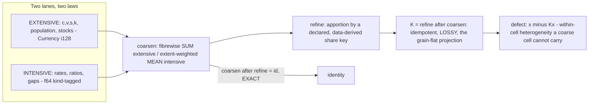
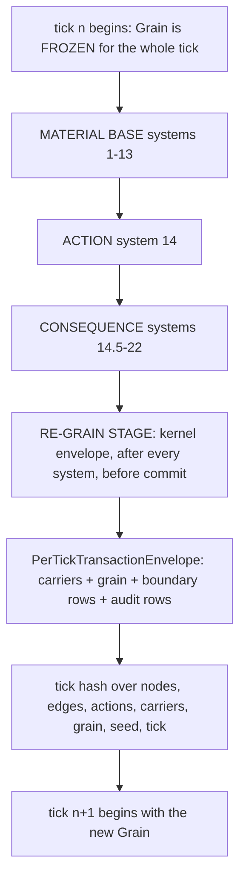
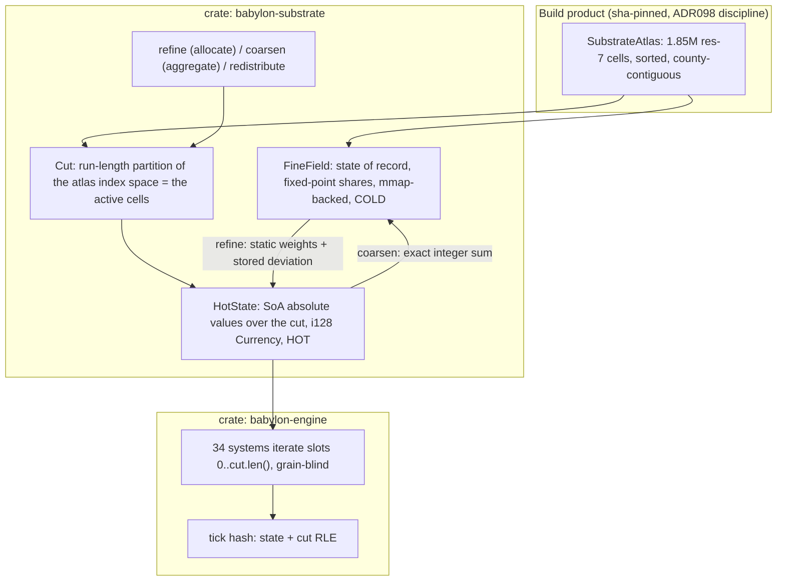
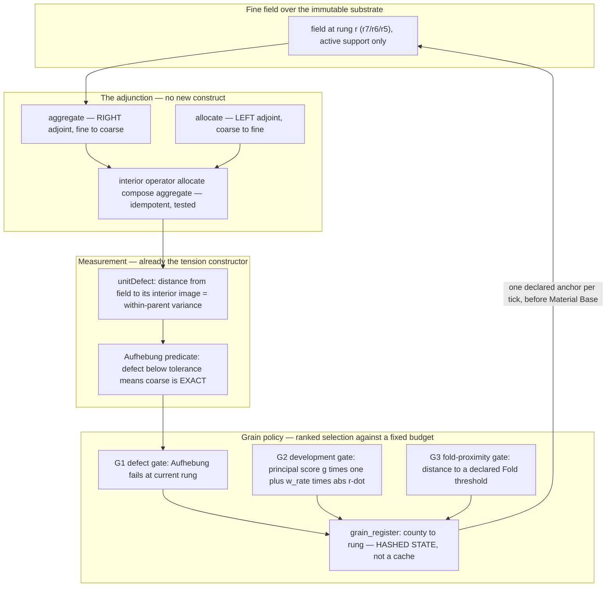
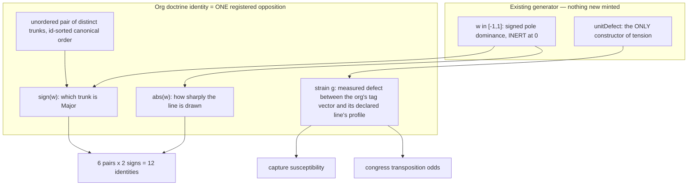
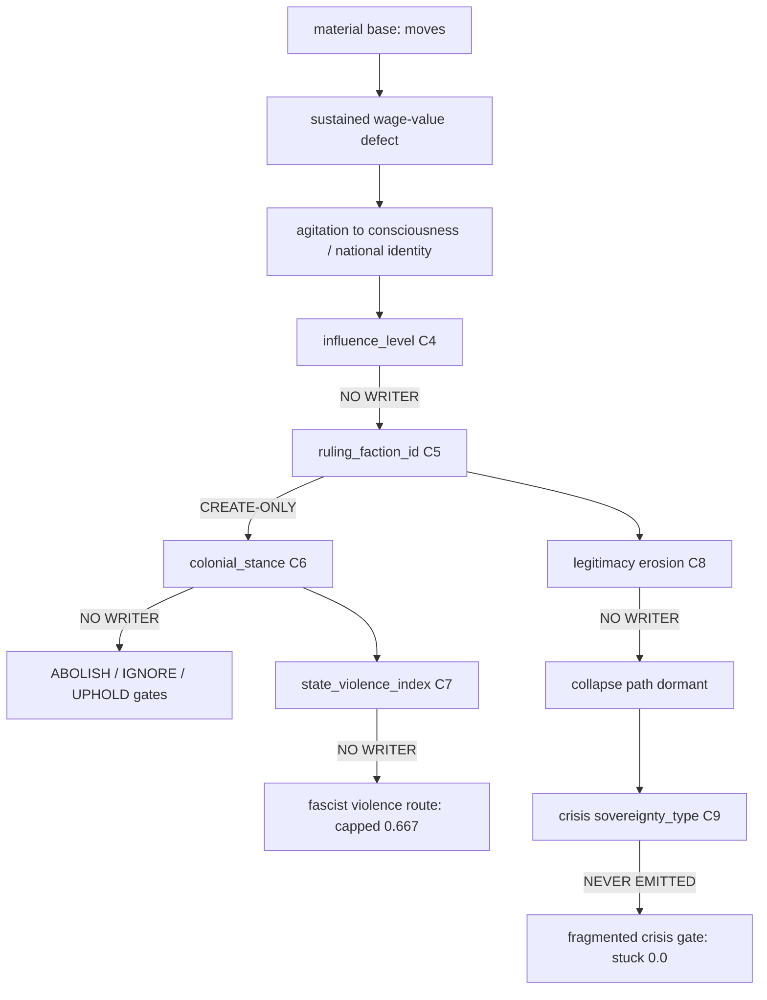
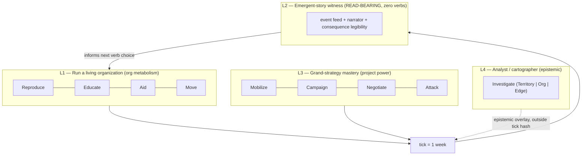
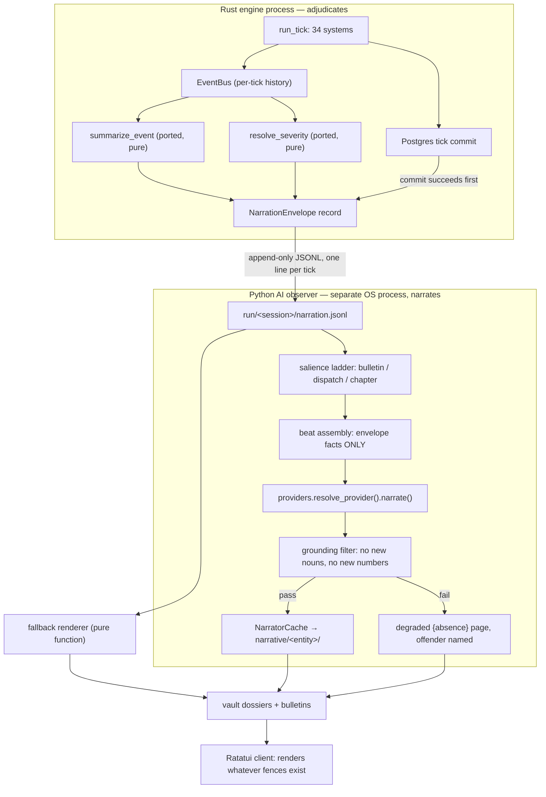

# Design-Inputs Dossier — Babylon Game Design Standard

**Prepared:** 2026-07-29 · **Editor:** dossier-editor subagent (Opus 5, 1M) · **Mode:** read-only research
**Repo:** `/home/user/projects/game/babylon` · **Branch:** `feature/p27-kernel-bsl-scaffold`
**Inputs:** six research lanes (multi-resolution substrate, doctrine identity, ending reachability, mid-game density, verb set, narrator)
**Governing rulings:** Director live interview 2026-07-29, rulings (1)–(13); Constitution v3.0.0 Amendments A–AE; ADR172/ADR173

---

## Part 0 — Editor's verification log

The lanes disagreed on several load-bearing integers. I re-verified the ones that change a design decision. Everything below was run read-only.

| Claim under test | Lane position | Verified result | Command / cite |
|---|---|---|---|
| `DoctrineTrunk` member count | doctrine lane: 3; ruling (9): 4 needed | **3** — `REFORMIST`, `SCIENTIFIC`, `INSURRECTIONIST`; docstring reads "The three strategic trunks" | `src/babylon/models/enums/doctrine.py:40-57` |
| `VERB_RESOLVERS` entry count | verbs lane: 9, hard-pinned | **9** exactly (`EDUCATE, RECRUIT, ATTACK_INFRASTRUCTURE, PROTEST, PROPAGANDIZE, PROVIDE_SERVICE, MAP_NETWORK, MOVE, PROPOSE_ALLIANCE`) | `src/babylon/engine/actions/__init__.py:58-68` |
| `colonial_stance` has a runtime writer | endings lane: **no writer** | **CONFIRMED — no writer.** Occurrences are: seed JSON (`data/game/balkanization/seed_factions.json`), defines descriptions, a formula *parameter*, a migration CHECK constraint, and one chronicle-adapter read. Nothing assigns it during a tick. | `rg colonial_stance src/ web/` |
| `state_violence_index` has a runtime writer | endings lane: **no writer** | **CONFIRMED — read-only.** Only reads, all with a `0.0` default: `endgame_detector.py:545`, `electoral.py:413`, `conjuncture.py:106`. | `rg state_violence_index src/` |
| Baseline terminal outcomes | endings lane: all `SURVIVED` | **CONFIRMED, 11/11** files | `tests/baselines/{bernie_valve,debs,fascist_bifurcation,glut,imperial_circuit,mitterrand,single_county,starvation,syriza,two_node,weimar}.json` |
| `bridge_county_h3.coverage_pct` carries information | judge: constant 100 / NULL | **CONFIRMED.** res-5: 3,192 rows, **0 distinct** values (all NULL). res-7: 45,572 rows, **1 distinct** value, min=max=**100**. | `sqlite3 -readonly data/sqlite/marxist-data-3NF.sqlite "SELECT resolution, COUNT(*), COUNT(DISTINCT coverage_pct), MIN(coverage_pct), MAX(coverage_pct) FROM bridge_county_h3 GROUP BY resolution;"` |
| Stale spatial chain still live | multires lanes A & C | **CONFIRMED** — `SPATIAL_LEVEL_NAMES: tuple[str, ...] = ("hex", "county", "state", "nation")` | `src/babylon/domain/dialectics/instances/levels.py:108` |
| `EventType` member count | doctrine lane: 91; narrator lane: 100 | **98** (`EventType`), plus `GameOutcome` 7 and `ResolutionType` 3 in the same module — **both lanes were wrong** | AST-shaped count of `src/babylon/models/enums/events.py` |
| Chronicle fallback builder coverage | narrator lane: 64 builders | **64 distinct `EventType` keys** → **34 of 98 event types fall through to `_generic_summary`** | `src/babylon/game/chronicle_adapter.py` |

**Editor's note on counts.** Three lanes independently mis-stated an enum cardinality. Any clause of the Standard that pins a count must cite a *computed* figure with the command that produced it, or a sentinel that recomputes it. Four of the small integers in circulation (3 trunks / 4 trunks / 3 tags / 5 practice variables / 8-trunk target / 9 verbs / 98 event types / 34 systems) are one careless sentence away from being conflated.

---

## Part I — Executive dossier

*(The ≤1500-word deliverable. The version returned to the orchestrator is this text trimmed to 1,490 words; the trims are wording-only, no claim was added or removed.)*

### Frame

Six lanes reported independently. One finding recurs in five of them and should set the Standard's sequencing: **the engine has far more declared machinery than wired machinery, and the gates cannot tell the difference.** Every lane found a named construct with no writer, no producer, or no consumer — `colonial_stance`, `state_violence_index`, three crisis sovereignty types, `is_goal`, `MILITANCY`, `coverage_pct`, `ActionType.STRIKE`, 21 `hex_to_county_sum_*` invariants, `render_epilogue` — and every one of them ships green. The Standard's highest-value clause is not a mechanic. It is a **reachability sentinel**: every gate operand must have a production writer; every enum value a gate tests must have a production emitter.

### 1. Multi-resolution substrate (ruling 10)

**Direction:** adopt the judge's three-way hybrid, gated behind a data program. Contract surface from design A — `GrainPolicy::{None, Fixed{COUNTY}, Adaptive}` with a **reduction test** (a fixed policy must emit zero re-grain motions and a byte-identical county frontier), `carriers`+`grain` added to the tick-hash preimage, and largest-remainder integer apportionment on **absolutes** (the only exactness story that is derivable rather than asserted). Law table and trigger semantics from design C — the LOD error *is* `unitDefect` of the interior operator, i.e. a measured contradiction gap, so coarse-where-quiet is exact where Aufhebung has resolved; CZ/MSA are **barred as grains** because a non-nesting rung cannot host a conservative transition; the cell set is frozen at world-build and refine *activates support*, never mints a cell (this is what makes ruling 10 legal under I.20). Layout, budget and phasing from design B — county-anchored three-tier tower, sha-pinned atlas build product, binary-blob yearly checkpoint, and a 3a/3b/3c/3d rollout that stays byte-identical at `B = 0` until a declared ceremony. **Cut** A's Merkle fold (two hash definitions, and it degrades to O(all cells) exactly during crisis churn), B's rayon plan (collides with the live `RAYON_NUM_THREADS=1` determinism pin), and B's i32 deviation field (overflows by B's own argument).

**Evidence:** verified — `bridge_county_h3` res-7 = 45,572 rows over 83 counties, `coverage_pct` constant 100 at res-7 and all-NULL at res-5; `SPATIAL_LEVEL_NAMES = ("hex","county","state","nation")` still live at `levels.py:108` beside the lattice-corrected rungs; `determinism-contract.rst:762-800` hashes only `{tick, rng_seed, nodes, edges, actions}`, and Amendment U forbids hex graph nodes — so sub-county carriers would be invisible to the constitutional hash.

**Top risks:** **no sub-county share key exists anywhere in the data estate**, so refine can only fabricate — and a uniformly refined cell has zero closure defect *by construction*, meaning the trigger would measure its own assumption; ~40% of the measured Michigan res-7 cells sit over Great Lakes water with no mask; and Jensen/ADR173 — a coarse cell carrying only a mean has **no `P(S|A)` at all**, so coarsening destroys precisely the emergence ruling (6) mandates.

**Demands on P27:** a Phase 0-D ingest (land/water mask, block-group→H3 population, LODES WAC at block grain) as sha-pinned build products *before* engine work; hash-preimage and per-identity-RNG riders landed **inside** the p27-cutover ceremony and before Phase-1 Tasks 5/7 freeze; and reconciliation of the two live spatial-grain estates first.

### 2. Doctrine identity (ruling 9)

**Direction:** the `(Major, Minor)` pair is **one registered opposition**, not two labels. `sign(w)` is which trunk is principal; `|w|` is how sharply the line is drawn; 6 unordered pairs × 2 signs = **12**, with `w = 0` the legitimate INERT pre-congress state and no diagonal. Non-commutativity is sign-antisymmetry of the principal aspect — Mao's principal aspect, which is the actual theoretical source of the distinction. Strain is **measured** (a `unitDefect`-shaped gap between the org's actual tag vector and the profile its declared line implies), never a hand-authored 4×4 matrix, which would be a stipulated functional form under ADR172 ruling 5. Asymmetry lands in four existing channels: trunk-scoped verb economics, which practice-drift term runs at full rate, congress **transposition** (the Minor is who wins when the Major's practice fails, so the same unordered pair has two different failure trajectories), and capture susceptibility.

**Evidence:** verified `DoctrineTrunk` has exactly three members; the fourth trunk (Autonomist, "Build the New World in the Shell of the Old", with a Dissociation trap) is **already fully written and untranscribed** at `ai/epochs/epoch3/doctrine-tree.yaml:441-500`; capability resolution today is a commutative **union** (`any()` over acquired blocks, `_capability.py:61`) — union cannot express Major/Minor; `MILITANCY` has zero consumers outside the doctrine domain; `is_goal` has zero production consumers.

**Top risks:** cosmetic identity (12 labels, one campaign); identity churn collapsing 12 campaigns into one adaptive one if transposition is cheap; and building a militancy-defined trunk pair on an inert tag.

**Demands on P27:** build the *gates* first — 12 distinguishable trajectory fingerprints, and `(A,B)` vs `(B,A)` diverging from the same seed — before the mechanics; register the pair as a **W-𝔇 opposition** motion with its sentinel row (ADR109); author the rules in BSL rather than a second hand-rolled DSL.

### 3. Ending reachability

**Direction:** make ending reachability a **standing blocking gate** in three tiers. Tier 1 (static, every PR): every gate operand has a production writer, every enum value a gate tests has an emitter. Tier 2 (qa): one committed witness scenario per outcome that *reaches* it by perturbing **initial material conditions only** — never by hand-stamping a gate operand. Tier 3 (nightly): per-axis progress curves to the full horizon, with the missing clause — **no axis may be frozen at a constant for the whole horizon.**

**Evidence:** verified all 11 baselines record `final_outcome: SURVIVED`; `colonial_stance` has **no runtime writer**, so ABOLISH- and IGNORE-majority gates are 0.0 for all time; `state_violence_index` is read-only with a 0.0 default, pinning the fascist violence route at exactly 2/3; the three crisis sovereignty types are never emitted; and a complete **5200-tick run recognized nothing**, with every axis frozen below 1.0 (`reports/pacing-calibration-2026-07-17.md:95`). Verdict: **four of five outcomes are provably unreachable**, the fifth needs total ideological capture, and no ending mechanism exists at all — `projection/endgame.py:86` ends a run only at the horizon.

**Top risks:** arming four dead endings simultaneously risks instant-lock (the fascist fraction already had to be raised 0.75→0.9); the six missing writers move qa, vault and electoral goldens together (one large ceremony); and priority order is first-match-wins with RED_OGV first, so newly-armed low-priority axes can be structurally unobservable.

**Demands on P27:** the five blockers are not five bugs — they are one unexecuted plan (`2026-07-18-null-play-political-coupling.md`, Tasks 4–9 all unchecked). The Tier-1 sentinel would have caught **all five**, and it is the cheapest artifact in this dossier.

### 4. Mid-game density (ruling 12)

**Direction:** 5200 ticks over 30–80 hours is 20.8–55.4 s/tick, so **ruling 12's range is a fast-forward range, not a content-volume range** — which puts most of the fix in the projection layer, already sealed from physics. Free half first: give CROSSING a real `warning` tier keyed on the derivative the registry already computes, classify the unclassified defaults, raise the 1-card-per-tick ceiling adaptively, and point the narrator at `axis_progress`/`FieldDerivative` deltas so slow structural change is legible on ticks where nothing fires. Constrained half: desynchronize the institutional clocks (per-entity congress and election periods with phase offsets), the doctrine pair as a standing internal opposition, Mandel-asymmetric long waves, cascade envelopes with **material** refractory (never a `cooldown_ticks` define), and refinement following contradiction heat.

**Evidence:** `congress_interval_ticks` is a **single global scalar** (`defines.yaml:975`), so every organization on Earth holds its congress the same week, forever; ~250 scheduled clusters land on ~100 distinct ticks, phase-locked at period 104; 26 of 65 classified event types resolve to `critical`, and critical drives autopause; CROSSING has no `warning` branch by design.

**Top risks:** long waves shipped without a restoration channel make the century a monotone slide legible by year 30; the target decision cadence presupposes **standing orders**, which do not exist; and the K-wave charter's Phase-3 prohibition may forbid the very coefficient moves that would fix a measured dead stretch.

**Demands on P27:** a four-tier cadence pyramid with two falsifiable gates — **≤150 autopauses per century**, and **no 20-tick window with zero decisions.**

### 5. Verb set (Article V)

**Direction:** **no new verbs.** Nine verbs are nine keys; the sub-mode lattice is the depth engine. Article V's "All always available" makes verb-level doctrine gating unconstitutional, so doctrine may act only through five levers: mode authorization (exists), edge-type authorization (exists), **cost/efficacy coefficient (does not exist — the highest-leverage wiring item in the set)**, valve coupling (exists, one stance), and trap exposure (exists, one trunk).

**Evidence:** verified `VERB_RESOLVERS` has exactly nine entries; only **three** of the nine carry any doctrine gate at all; BSL exposes seven typed structural verbs plus `emit`, so any sub-mode must compile to those effects; and the 3×3 cell assignment Article V names is **written nowhere in the repo**.

**Top risks / gaps:** nothing touches the `EXPLOITATION` or `WAGES` edge (`ActionType.STRIKE` is an enum with zero resolver); `BUILD_INFRASTRUCTURE` is implemented, tested and deliberately unregistered; no verb mints `PRESENCE`; no verb replenishes `budget`, so the "Manage resources" column may be unfillable without new capability. G3 is load-bearing for every depth claim.

**Demands on P27:** treat the nine resolvers as a **porting contract**, ratify the 3×3 assignment, and preserve the operational form of "all always available" — eligibility may hide a row with a reason; affordability never may.

### 6. Narrator (ruling 11)

**Direction:** the deterministic fallback **already exists and is better than templates** — `summarize_event` is a pure function per event type, `resolve_severity` is derived, `NarratorCache`/`NarratorSideProcess`/`providers.py` are live and wired. What is missing is the contract: specify the **`NarrationEnvelope`** (one append-only JSONL record per committed tick, carrying the deterministic summary, severity, deltas, player acts and an `entities[]` proper-noun dictionary), a four-tier **ladder** (bulletin every tick / dispatch on salience / **chapter every 52 ticks** / Book at close), a **production** grounding filter (no new numbers, no new proper nouns; failures publish a visible `{absence}` page naming the offender), and hierarchical L0–L3 compaction for the Book.

**Evidence:** verified 64 bespoke fallback builders against **98** `EventType` members — **34 types render generically today** and nothing gates coverage against enum growth; `default_system.txt` instructs the model to "escalate or de-escalate contradictions", an adjudication instruction shipped as data contra Amendment V; `render_epilogue` has zero production callers outside the legacy web bridge; `_replay_identity_hash` hashes only `session_id:tick:rng_seed`, so any narrator-ON/OFF hash-equality claim is currently vacuous.

**Demands on P27:** the envelope closes the standard's own **OQ-32** and is the artifact Rust must emit; envelope golden + fallback golden inside `check`, grounding tests behind the `ai` marker, two pins with a *derived* bound (a chapter must generate faster than a player plays a simulated year → chapter p95 < ~90 s).

### Sequencing

Cheapest-first, and it is also correctness-first: (1) the reachability sentinel and the fallback-coverage sentinel — both static, both would have caught defects five lanes found by hand; (2) the free projection half of density plus the `NarrationEnvelope` schema; (3) ratify the 3×3 and wire G3; (4) reconcile the two spatial estates and charter Phase 0-D; (5) the amendment-bearing work — grain register, the fourth trunk and the pair, the six political writers — each behind its Director ruling.

---

# Part II — Lane 1: Multi-Resolution Native Substrate (ruling 10)

Three independent designs were commissioned and adjudicated by a judge pass. All three are reproduced in full, followed by the judge's verdict, recommendation, must-resolve ledger and questions.

---

## II.A — Design A: DETERMINISM-AND-CONTRACTS-FIRST

### Angle

I treat the LOD system as a *hash-preimage change* before treating it as a performance feature: any construct that changes which state cells exist mid-run rewrites the tick-hash input set, the RNG stream layout, the golden-trace column contract, and the save format — so the design is driven backwards from those four contracts rather than forwards from "make it fast".

Central claim: adaptive grain is admissible under III.7 only if

(a) the grain trajectory is a pure function of hashed state + hashed content (never wall-clock, never camera),
(b) refine/coarsen are exact on the extensive lane (integer apportionment, not float allocation) so conservation stays a *law* rather than a tolerance, and
(c) county-grain parity is a **degenerate policy of one code path**, proved by a reduction test that emits zero re-grain motions — not a second engine mode.

Two things found that block the current P27 contracts outright: the specified P27 tick-hash field set covers only `nodes/edges/actions/seed/tick` (`determinism-contract.rst:779-793`), so sub-county carriers would be invisible to the constitutional hash; and the planned RNG is one stream per `(session_id, tick)` (`plans/…phase-1…md:865`), which makes every draw order-dependent, i.e. LOD becomes a butterfly generator. Both must be fixed *inside* the p27-cutover ceremony or never.

### 0. Posture: what this extends, what it supersedes

| Artifact | Disposition |
|---|---|
| `reports/p27-porting-contract-table.md` (34 systems, `:9-13`, table `:65-100`) | **EXTENDED, not superseded.** No system gains a grain argument; re-grain is a kernel envelope stage, not a 35th System (§4). The 34-row port contract stands verbatim. |
| `reports/p27-tolerance-and-envelope-derivations.md` §2 family designation (`:64-109`) | **UNAFFECTED for the 11 canon scenarios** — they seed only abstract class ids (`p_w`/`p_c`/`c_b`/`c_w`, `:69-72`), zero territory, therefore zero carriers, therefore grain-free. |
| Same report §2.2 / §5 cutover ceremony (`:125-141`, `:337-398`) | **EXTENDED:** Michigan-e2e and detroit-tri-county must be declared `GrainPolicy::Fixed{COUNTY}` for the ceremony, and the pass criteria gain one row (§6.4 reduction test). |
| `docs/reference/determinism-contract.rst` "The P27 Tick Hash" (`:744-877`) | **SUPERSEDED IN FIELD SET.** Must gain `carriers` and `grain`. Today's spec hashes only graph nodes/edges — and Amendment U forbids hex graph nodes (`CONSTITUTION.md:623`), so fine state would be hash-invisible. |
| Dense golden traces (`determinism-contract.rst:587-742`, column contract `:629-641`) | **SUPERSEDED IN DERIVATION.** The header derives from tick-0 topology on the explicit assumption that "a regression scenario's entity and relationship set is static for its whole run"; a mid-run delta raises `ValueError`. Fix: goldens are always taken at the **reporting rung** (county), never the simulation rung — which is what Article IV.2 demands anyway ("coarse-grained to those resolutions", `CONSTITUTION.md:514`). |
| Amendment U (`CONSTITUTION.md:623`) | **RESPECTED, NOT AMENDED.** "Territory graph nodes are county-grain overlays on the substrate; hex is never a graph node." Sub-county grain therefore lives in the **carrier layer** — precedent: `NodeType.HEX` exists but "no code path stamps a `hex` node" (`src/babylon/models/enums/topology.py:45-47,69`), and hex state already persists sparsely as `dynamic_hex_state`. |
| Amendment B / II.1 (`CONSTITUTION.md:432`), pending (`ai/bsl-architecture-standard.md` OQ-4) | **DISCHARGED IN SHAPE.** The refine/coarsen defect is the measured "recoverable under morphism-preserving coarse-graining" quantity Amendment B asks for. This is the LOD system's III.10 ⟦LAW⟧+⟦COMP⟧ rent tag. |

### 1. State representation — the carrier frontier

Not "hexes plus counties". One structure: a **frontier** — a per-county disjoint cover of the county's res-7 cell set by H3 cells at mixed resolution, with the degenerate cover `{the county itself}`.

```rust
// babylon-kernel, new module `grain`
pub struct CellId(u64);                 // H3 index; resolution is encoded IN the index
pub enum CarrierKey { County(Fips5), Cell(CellId) }

pub struct Carrier {
    key:    CarrierKey,
    county: Fips5,                      // Amendment U: the only spatial key the economy reads
    extent: Extent,                     // measure: population, employment (LODES), land area
    ext:    ExtensiveVec,               // c, v, s, k, population, stocks — Currency i128 micro-units
    int:    IntensiveVec,               // rates, ratios, gaps — f64, kind-tagged (S-16)
}

pub struct Grain {                      // canonical, hashed, part of state
    frontier:  Box<[CarrierKey]>,       // sorted ascending; disjoint; covering (checked)
    policy_id: [u8; 32],                // hash of the GrainPolicy content
}
```

Three properties make this state, not a view:

1. **Disjoint + covering per county**, checked on construction (loud, III.11). A frontier that neither covers nor partitions is a conservation break, not a rendering glitch.
2. **County remains the base atom.** Every carrier names its county; every economy read (`resolve_county_identity`) still resolves at county grain by coarsening. Amendment U's three parallel aggregations (CZ/MSA/state) are untouched — LOD only refines *below* the county.
3. **Coarsening is irreversible**, so the frontier's history is material: coarsening emits an event and `BoundaryFlowRegister` rows; it is not a free representational choice.

### 2. The operators, and which adjoint is which



**Left/right, stated honestly.** In the fibrewise reading over the parent map `q: cells → county`, the standard triple is `Σ_q ⊣ q* ⊣ Π_q`: fibrewise **sum** (coarsen) is the *left* adjoint of **broadcast**, and broadcast is left adjoint to fibrewise **inf**. `src/babylon/domain/dialectics/instances/scale.py:1-9` labels it the opposite way ("allocate … the left adjoint, aggregate … the right adjoint") — not wrong so much as naming a different arrow: `allocate` is **not** `q*`, it is `q*` twisted by a share vector, i.e. a *section* of `Σ_q`, not its adjoint. Rather than re-litigate labels, pin the two facts that carry weight:

- `coarsen ∘ refine = id`, **exactly**, from the per-parent unit-sum law (`scale.py:83-101`; round-trip doctest `:74-75`).
- `refine ∘ coarsen = K`, idempotent and lossy — already implemented and documented as the level-lattice closure that "smooths within-parent variation (variance → 0)" (`levels.py:188-215`).
- Therefore **refinement is safe and reversible; coarsening is the lossy motion**, and `‖x − Kx‖` is both the LOD error and the trigger signal (§3).

**Three obligations this exposes:**

1. **The third adjoint is missing and LOD needs it.** Constraint fields (biocapacity ceilings, repression capacity, `max_biocapacity`) coarsen by fibrewise **min**, not sum, not mean. `scale.py` ships only `aggregate` and `aggregate_intensive` (`:141-177`). Averaging a binding constraint is the variance-error's cousin, and it fails in the direction that makes overshoot look survivable. Adding `aggregate_constraint` is a *use* of the existing G family, not new mathematics (AE clause (ii)/S-4) — but it needs the ADR.
2. **Extensive refinement is integer apportionment, not float allocation.** Currency is `i128` micro-units with checked arithmetic (S-13); `by_parent × share` cannot divide exactly. Use **largest-remainder apportionment, ties broken by ascending `CarrierKey`**: the sum is preserved *bit-exactly*, so the round-trip law needs **no tolerance at all** on the extensive lane — the strongest determinism result available here.
3. **Share keys are content.** Refinement needs a per-county share vector (population, LODES workplace density, area); those keys enter `ContentDigest`. Today's hydrator hardcodes "uniform within county … LODES-workplace-density weighting is deferred" (`hex_hydrator.py:31-33`), which is fabrication of structure under S-12 unless declared as such.

### 3. Trigger policy — what "contradiction is hot" measures

Four already-shipped, materially grounded measures. Nothing new is minted.

| Signal | Source | Why it is right |
|---|---|---|
| gap `g`, balance `b` | opposition layer, only mint is `unitDefect` (`bsl-architecture-standard.md` §3.1) | measured tension, re-measured fresh each tick (S-17) |
| rate `ṙ = g(t) − g(t−1)` | the one legal one-step memory (S-17) | *acceleration* of contradiction, not level |
| spatial gradient / Laplacian of the exploitation field | `FieldDerivativeSystem` already "computes gradients on edges, Laplacian at nodes, and temporal derivatives" (`field_derivative.py:36-44`); source is mean fresh edge tension (`contradiction_field.py:1-17`) | a steep gradient across a county *is* "this cell is internally inhomogeneous" |
| closure defect `‖x − Kx‖` | §2 | the LOD-native signal: "this coarse cell is currently lying about its interior" |

`score = w_g·g·(1 + w_rate·|ṙ|) + w_grad·‖∇field‖ + w_def·‖x − Kx‖`; weights live in `GameDefines`/BSL content (hashed); all inputs quantized to the existing 1e-6 grid before comparison so ordering is platform-stable.

Policy mechanics, all deterministic:

- **Hysteresis + dwell:** refine at `θ_hi`, coarsen at `θ_lo < θ_hi`, minimum residency `d_min` ticks. Prevents chatter (which is both a perf disaster and a hash-noise generator).
- **Budget in cells, never milliseconds.** `max_carriers` is an integer ceiling; candidates ordered `(score desc, CarrierKey asc)` then truncated. A wall-clock budget ("refine while frame time allows") is *forbidden* by III.7, same error family as wall-clock in the render sandbox (III.13, `CONSTITUTION.md:500`).
- **Data clamp (VI.2, `CONSTITUTION.md:541`):** refine only where a real share key exists at the target resolution. No key → loud failure, never a uniform fallback (III.11 + S-12).
- **Player-driven refinement only through a verb.** `Investigate(Territory)` is already atomic and deterministic (`CONSTITUTION.md:526`) and actions are in the hash preimage. Refinement driven by camera/zoom is illegal (S-23: `Obs` is one-way; fog is epistemic and stays out of the tick hash).

### 4. How systems iterate mixed grain



- **No system ever observes a grain change mid-tick.** Re-grain is one envelope stage after all 34 systems, before the atomic commit. That keeps the port contract intact and keeps grain out of BSL's authorable surface: there is no BSL verb that changes grain, the same way there is no clique-expansion verb (S-9) or `add-member` verb (S-10). Prohibition as absence.
- **Systems iterate carriers, not resolutions.** One surface: `carriers()` yields the frontier ascending by `CarrierKey` (S-19 / draft ruling D7: ascending id byte order, never storage order). Another rung is reached via `coarsen_to(rung)` / `refine_to(res)`; cross-grain arithmetic is a **type error** enforced by the kind system (`Extensive<T>` cannot be unweighted-averaged, `Intensive<T>` cannot be summed — S-16, `E-TYPE-041/042/043`).
- **Grain-boundary flux matching is the hard part.** Adjacency lifts from the immutable substrate by quotient; each coarse↔fine interface carries a declared interface weight (shared boundary measure). The fine side's summed interface flux must equal the coarse side's single flux; any residual becomes a `BoundaryFlowRegister` row plus an alarm (S-27, "no flow without a row"). This is the AMR flux-matching problem, and it is where value leaks if it leaks anywhere.
- **BSL fuel stays statically bounded.** Manifest ceilings (`bsl-architecture-standard.md` §2.3, `:143-184`) are declared against `max_carriers` — the LOD budget — not the national res-7 cardinality (the repo's own figure for the full multi-resolution set is "~12M+ cells nationwide", `spatial.py:11-12`). The LOD budget therefore *is* a BSL manifest ceiling, so Power-of-10 rule 2 stays a static property (S-3).

### 5. Why this is needed at all (measured, not asserted)

At 83 counties the tick is ~1900 ms median and only ~20% sits inside `system.step()`; the other ~80% is "per-tick persistence writes, tick hashing, event-bus/observer plumbing" (`reports/tick-profile-2026-07-29.md:19,77-86`). Nationwide (Article IV, ~3,100 counties) is ~37× the county count, and the current hash path hashes "the **full** per-tick hex checkpoint frame (every hex, restamped to the current tick) … not the delta" (`determinism-contract.rst:299-301`). The envelope — persistence + hashing — is what LOD must shrink, which is why §6 makes the hash grain-*aware*, not merely grain-inclusive.

### 6. Determinism and contracts

**6.1 Tier A — replay byte-identity (III.7 unchanged).** Same `(Σ₀, ContentDigest, seed, action log)` ⟹ same grain trajectory ⟹ same hash chain. Guaranteed because every re-grain input is committed state or hashed content, candidate ordering is total on quantized scores, and the budget is an integer.

**6.2 The hash preimage change (must land inside the cutover ceremony).** Add to the P27 tick hash (`determinism-contract.rst:779-793`): `carriers` (sorted ascending by H3 index — resolution is encoded in the index, so one ascending order is total and grain-aware) and `grain` (frontier + `policy_id`), reusing the specified encodings (`i128` decimal ASCII, `f64` 16-hex bit pattern, no stringly fallback, `:810-851`). Any preimage addition moves **every** hash: land it inside the p27-cutover mega-ceremony (`p27-tolerance-and-envelope-derivations.md:337-398`) or pay for a second global re-baseline.

**Grain-aware incremental hashing.** Re-hashing every carrier every tick reimposes the O(all-cells) cost LOD exists to remove. Make the carriers digest a **Merkle fold over the H3 parent tree** (children ascending, resolutions ascending, byte layout specified per III.12(a)) so re-hash is O(dirty subtrees). Legal: the "no chaining" rule at `:871-877` bans *cross-tick* `H_n = H(H_{n-1}‖data_n)`, not within-tick tree hashing. Cost to name: the Merkle root ≠ the flat canonical digest, so the flat form survives as a reference implementation with equality conformance vectors on small worlds.

**6.3 RNG — the change that decides whether LOD is safe at all.** Task 5 currently specifies one stream per tick: `seed_for(session_id, tick) -> [u8;32]`, `KernelRng(ChaCha8Rng)` (`plans/…phase-1…md:799-881`), mirroring `resolve_rng(services, tick)` (`kernel/system_base.py:35-55`). With one stream consumed in iteration order, **adding one carrier shifts every later draw that tick**, and every stochastic family in the tolerance report §2 (`:82-92`) becomes grain-coupled. Fix: counter-based per-identity streams — `seed_for(session, tick, StreamDomain, stable_key)` with an explicit per-draw counter. Draws then depend only on a carrier's own identity: grain-invariant by construction, and refinement needs no RNG state migration because children derive streams from their own ids. Small change to an unimplemented task; decisive for LOD.

**6.4 Is county-grain parity degenerate, or a separate mode?** **One code path, contracted as a distinct pinned policy** — deliberately both:

- `GrainPolicy::None` — no spatial carriers. The 11 canon scenarios (abstract classes, no territory, `p27-tolerance-and-envelope-derivations.md:64-72`; Article IV's own carve-out calls them determinism contracts, not scale samples, `CONSTITUTION.md:506`). `carriers`/`grain` serialize empty and constant.
- `GrainPolicy::Fixed{COUNTY}` — michigan-e2e, detroit-tri-county, every parity/ceremony run.
- `GrainPolicy::Adaptive{…}` — new scenarios only.

The gate that makes it one path rather than two engines is a **reduction test**: under a `Fixed` policy the re-grain stage emits **zero motions**, the frontier is byte-identical to the county set every tick, and the run reproduces the parity baselines byte-for-byte. If parity were merely "adaptive with thresholds off", tuning the adaptive machinery could drift parity baselines; the pinned-policy form makes that structurally impossible and leaves the ceremony's pass criteria (`:363-375`) untouched.

**6.5 Tier B — the LOD-invariance envelope (new verification family, III.12(c)).** Adaptive and `Fixed{COUNTY}` runs will **not** agree trajectory-for-trajectory: coarse-graining and stepping do not commute for nonlinear dynamics (a Jensen gap, not a bug). Do not paper it over with a tolerance. Three-part contract:

1. **Conservation is a law.** Extensive county-rung totals agree to the conservation residual bound (`1e-9`, derived against an observed 4.44e-16, `:186-196`) — and **exactly** on the Currency lane via §2's apportionment. Aggregation is linear; there is no excuse here.
2. **Qualitative agreement is a law.** Same terminal outcome, same principal-contradiction identity at declared checkpoints, same endgame priority order (`:371-375`).
3. **Continuous intensive aggregates get a statistical envelope only** — mean ± 2 sample-stdev over an N-seed ensemble, reusing the existing machinery (`:198-222`), declared as a weakening in the report rather than hidden.

Article IV.2 supplies the constitutional obligation these discharge: reproduce Michigan-statewide and tri-county "when coarse-grained to those resolutions. Regression at either resolution = implementation wrong" (`CONSTITUTION.md:514`).

**6.6 Save compatibility.**

- Save header carries `ContentDigest` + `policy_id` + frontier. A save whose `policy_id` differs from the running build's policy content **refuses to load** and demands a declared migration — MAJOR under `docs/versioning.md:13-15`, because coarsened interiors genuinely cannot be reconstructed.
- Only resident carriers persist (sparse-delta precedent: `dynamic_hex_state` read via `v_hex_state_asof`; envelope shape `persistence/envelope.py:35-96`).
- **Coarsening is recorded as a material event**, not a view change, precisely because it is irreversible; the frontier history is the audit trail.
- **The mid-run-refinement replay crossing is the highest-risk bug site in the design** and gets its own gate: save at `t−1`, refine at `t`, reload, replay, require identical hashes `t..t+k`.

**6.7 Gates to add.** `qa:grain-regression`, five legs: (1) fixed-policy reduction → byte-identical to parity baselines, zero re-grain motions; (2) two-process determinism on an adaptive scenario (the existing in-gate two-process leg never touches the hex path today); (3) `coarsen ∘ refine = id` — exact on Currency, ≤1e-9 on f64 extensive, per rung; (4) mid-run refine → save → reload → replay hash identity; (5) grain-aware inertness declarations — `check_dead_columns` (`tools/regression_test.py:869-914`) will legitimately flag a dormant coarse region as dead, so `at_rest` rows must be keyed by grain rather than silenced.

### 7. Wiring-doctrine typing (ADR109)

Re-grain is a **W-G scale-adjunction** motion (it is literally `ScaleAdjunction` in the tick loop) closed by a **W-A4 conservation** motion (the flux-matching register rows). Both need sentinel rows; a PR wiring re-grain without them is incomplete.

### A — Determinism story (verbatim)

Three tiers, and one honest concession.

**Tier A — replay byte-identity (III.7 unchanged).** The grain trajectory is a pure function of committed state plus hashed content: re-grain runs once per tick as a kernel envelope stage *after* all 34 systems and *before* the atomic commit, so no system ever iterates a changing frontier. Candidate scores are quantized to the existing 1e-6 grid before comparison, ordered `(score desc, CarrierKey asc)` — a total order — and truncated by an **integer** cell budget. Budgets are never milliseconds: a wall-clock-driven LOD is non-determinism by construction, the same error family as wall-clock in the render sandbox (III.13). Player-triggered refinement is legal only through the verb registry (`Investigate(Territory)`, `CONSTITUTION.md:526`) because actions are in the hash preimage; camera/zoom-driven refinement is forbidden by S-23 (`Obs` is one-way, fog is epistemic).

**The hash preimage must change, inside the cutover ceremony.** The specified P27 tick hash covers `{actions, edges, nodes, rng_seed, tick}` (`determinism-contract.rst:779-793`) and Amendment U forbids hex graph nodes — so sub-county carriers would be *invisible to the constitutional hash*, a determinism hole rather than an optimization. Add `carriers` (sorted ascending by H3 index; resolution is encoded in the index, so one ascending order is total and grain-aware) and `grain` (frontier + `policy_id`), reusing the already-specified encodings (`i128` decimal ASCII, `f64` 16-hex bit pattern, no stringly fallback). Any preimage field addition moves every hash, so it lands in the p27-cutover mega-ceremony or costs a second global re-baseline. To stop hashing from re-imposing the O(all-cells) cost LOD exists to remove — persistence + hashing is ~80% of a 1900 ms tick at 83 counties (`reports/tick-profile-2026-07-29.md:77-86`) — the carriers digest is a Merkle fold over the H3 parent tree with a byte-specified layout; legal because the "no chaining" rule bans cross-tick Merkle, not within-tick tree hashing.

**RNG must become per-identity or LOD is unsafe.** Phase-1 Task 5 specifies one ChaCha8 stream per `(session_id, tick)` (`plans/…phase-1…md:865`). Draws are consumed in iteration order, so adding one carrier shifts every later draw that tick and every stochastic family in the tolerance report §2 becomes grain-coupled. Counter-based per-identity streams — `seed_for(session, tick, domain, stable_key)` with an explicit per-draw counter — make each carrier's randomness depend only on its own id, so refinement needs no RNG state migration and grain changes cannot perturb unrelated draws.

**Tier B — grain-invariance, split by what is actually provable.** Adaptive and fixed-grain runs will not agree trajectory-for-trajectory; coarse-graining and stepping do not commute for nonlinear dynamics. So conservation is enforced as a **law** (extensive county-rung totals to the 1e-9 residual bound derived in the tolerance report §3.3, and *bit-exactly* on the Currency lane because refinement uses largest-remainder integer apportionment with ascending-key tie-breaks instead of float share multiplication); qualitative outcomes are enforced as a **law** (terminal outcome, principal-contradiction identity, endgame priority order); continuous intensive aggregates get only a **statistical envelope** (mean ± 2σ over an N-seed ensemble, reusing the existing ensemble design). Article IV.2's "coarse-grained to those resolutions … regression at either resolution = implementation wrong" is the constitutional obligation this discharges, and Amendment B/II.1's pending invariance proof is the construct's earn-its-keep tag.

**Parity is a degenerate policy of one code path, proved by a reduction test.** `GrainPolicy::None` for the 11 abstract canon scenarios (no territory, no carriers), `Fixed{COUNTY}` for michigan/tri-county and every ceremony run, `Adaptive{…}` for new scenarios. The reduction test requires zero re-grain motions and a byte-identical county frontier under a fixed policy, making "parity drifted because someone tuned the LOD thresholds" structurally impossible rather than merely unlikely.

**Save compat:** the save header carries `ContentDigest` + `policy_id` + frontier; a policy mismatch refuses to load and demands migration (MAJOR, `docs/versioning.md:13-15`), because coarsening is irreversible — a save taken while a region is coarse cannot be refined back to its pre-coarsening interior. The mid-run-refinement replay crossing gets its own gate leg.

**The concession, stated plainly:** LOD changes results. What is guaranteed is reproducibility (same seed, content, and grain history ⟹ bit-identical), conservation (exact on Currency), and outcome-class agreement — not trajectory equality across grain policies. Anyone who wants trajectory equality across grain is asking for linear dynamics, and Babylon does not have them.

### A — Failure modes (verbatim, 10)

1. **THE GOLDEN-TRACE COLUMN CONTRACT BREAKS OUTRIGHT.** Dense goldens derive their header from tick-0 topology on the explicit assumption that the entity set is static all run, and a mid-run delta raises `ValueError` naming the tick (`determinism-contract.rst:629-641`; `tools/regression_test.py`). Adaptive refinement violates that on its first refine. Mitigation — take goldens at the reporting rung (county) only — means the byte-identical dense gate stops seeing fine-grain behaviour at all, so fine state needs its own artifact family or it is simply unpinned.
2. **THE HEX→COUNTY CONSERVATION INVARIANTS ARE DECLARED BUT UNWIRED.** `conservation_audit.py:405-428` enumerates `hex_to_county_sum_{c,v,s,k}` and 18 more; `evaluate()` returns empty lists when nothing is registered (`:466-469`) and the live runner registers exactly two evaluators (`runner.py:1256-1263`). `scale.py:26-36` admits it: "those 21 auditor names are a contract with no-op evaluators today". The exact invariant family multi-res depends on is names with no bodies — and wiring them may surface pre-existing leaks that then get misattributed to LOD.
3. **LATENT NONDETERMINISM ALREADY EXISTS ON THE SUBSTRATE PATH AND THE GATE IS BLIND TO IT.** `generate_h3_cells` returns `set[str]` (`h3_utils.py:61-82`) and `hex_hydrator` iterates it directly ("for h3_index in cells", `:246`). `PYTHONHASHSEED` is not pinned in `.mise.toml`'s `[env]` (`:21-37`), so per-county cell enumeration order varies per process; the determinism hash sorts rows before hashing and therefore MASKS any float-accumulation-order effect instead of catching it. The in-gate two-process determinism leg never exercises this path because the canon scenarios seed no hexes — and LOD will fold over these cells orders of magnitude more.
4. **H3 CELLS DO NOT NEST INTO COUNTIES, AND PENTAGONS BREAK THE 7:1 ASSUMPTION.** Cells come from polyfilling each county polygon independently (`hex_hydrator.py:876-877`), so a boundary cell can be claimed by two counties or neither — double-count or hole, both conservation breaks that refinement amplifies. Separately `hex_graph_bridge.py:12-18` hardcodes a "7:1 aggregate" chain; H3 has 12 pentagons per resolution with 6 children, so 7:1 arithmetic is wrong at 12 places nationwide and surfaces as a tiny seed-dependent residual that looks like float noise. Also note `h3_utils.py:45-58` swallows any exception into a single centroid cell — silent degradation, III.11 violation, on the cover-generating path.
5. **INTEGER APPORTIONMENT IS PATH-DEPENDENT.** Largest-remainder makes `coarsen∘refine` exact, but `refine(refine(x, res5), res7)` can differ from `refine(x, res7)` in the last micro-units. "Single hop from the resident carrier to the target resolution" must be pinned as law and conformance-vectored; otherwise identical material states with different refinement histories carry different values and the grain descriptor becomes undocumented load-bearing state.
6. **UNIFORM-SHARE REFINEMENT IS FABRICATION, AND IT BLINDS ITS OWN TRIGGER.** The shipped allocation is "uniform within county … LODES-workplace-density weighting is deferred" (`hex_hydrator.py:31-33`). Refining with a uniform key manufactures a homogeneous interior the data never asserted (S-12), and a uniformly refined cell has zero closure defect by construction — so the `‖x − Kx‖` trigger would be measuring its own assumption rather than the world.
7. **MISSING CONSTRAINT AGGREGATION.** `scale.py` ships sum and share-weighted mean only (`:141-177`). Constraint-shaped fields — biocapacity ceilings, repression capacity, `max_biocapacity` — must coarsen by fibrewise min. Averaging a binding constraint is the same class as the unweighted-intensive-mean variance bug and fails in the direction that makes ecological overshoot and repression look survivable at coarse grain.
8. **GRAIN-BOUNDARY FLUX LEAKAGE AND GRAIN CHATTER.** Get an interface weight wrong and value leaks at a rate proportional to grain churn — worst exactly in the hot regions the design exists to model — presenting as a drifting residual with no single culprit system. Without hysteresis and a dwell floor, cells oscillate across θ; each flip is an irreversible coarsening plus a fabricating refinement, so the run accumulates apportionment residue and the trigger starts tracking its own history.
9. **TWO COMPETING SPATIAL-GRAIN ESTATES ALREADY EXIST IN-TREE AND LOD WOULD INHERIT BOTH.** `hex_graph_bridge.py:1-24` describes an R8→R7→R6 chain terminating in "R6 territory graph nodes" keyed by H3 index, while Amendment U (`CONSTITUTION.md:623`) makes territory nodes county-grain and forbids hex graph nodes; `levels.py:110` still hardcodes the superseded chain `SPATIAL_LEVEL_NAMES = ('hex','county','state','nation')` beside the lattice-corrected `SpatialLatticeRungs` (`:477`). Build LOD before reconciling these and the new system picks a side by accident while the losing side's tests keep passing.
10. **CEREMONY-TIMING TRAP PLUS A KNOWN SEED-DEPENDENT CRASH ON THE SAME NUMERIC PATH.** Adding carriers/grain to the hash preimage moves every hash: after the p27-cutover ceremony it costs a second global re-baseline, and landing it quietly red-lights the baseline-ceremony gate — so it must be sequenced before Phase-1 Task 7 (`ContentDigest`) and Task 5 (RNG) freeze. Meanwhile the Phase-0 pilot already found `EconomicConditions.phi_hour`'s strict `ge=0.0` rejecting `-9.8e-7` under seed 3001 but not baseline seed 2010 (`p27-tolerance-and-envelope-derivations.md:266-292`); multi-res multiplies the allocation/aggregation sites that produce tiny signed residuals, so this class gets likelier and will present as "refinement broke the economy" rather than "a zero-headroom constraint met float noise".

---

## II.B — Design B: PERFORMANCE-AND-MEMORY-FIRST

### Angle

Sized the substrate from the actual data (reference DB queries + the measured Michigan tiling), then designed the Rust layout backwards from a tick budget.

Headline finding: **memory is not the constraint — write volume and memory bandwidth are.** A full national H3 res-7 dynamic state is only ~120–210 MB (affordable on the 31 GB box and on a player machine), but full-frame persistence at that grain is already measured-projected at **~450 GB per run** (`src/babylon/persistence/delta.py:6-10`) and ~30 streaming sweeps/tick over a 207 MB hot array costs ~0.2–0.6 s/tick in pure bandwidth. So LOD's payoff is a ~8× cut in sweep bytes and a ~40× cut in emitted rows, not a smaller heap.

Second finding, which reframes the whole task: **the fine grain has no dynamics today to preserve** — the hex hydrator allocates county values uniformly across res-7 cells (`hex_hydrator.py:34-36`) and *zero of 1,045 hex rows change value between consecutive ticks* (`delta.py:6-8`). Multi-resolution is therefore not a re-grained port; it is the first fine-grain dynamics the engine will ever have, and the porting contracts are silent on it rather than in conflict with it.

Third finding: the task brief's "res-7 ~5 hexes per county-sized area" is wrong by ~100×; the measured figure is **549 res-7 cells per county** (max 2,720).

Fourth: H3 cells do not nest into counties at any resolution, and county is the constitutional base atom and the sole spatial key the economy reads (Amendment U, `CONSTITUTION.md:623`) — so the coarsening tower must be **county-anchored**, which kills the naive "just pick a resolution per region" design and forces the run-length-over-a-canonical-atlas layout below.

### 0. Measured envelope

All figures queried read-only from `data/sqlite/marxist-data-3NF.sqlite` or cited to file:line.

| Quantity | Value | Source |
|---|---|---|
| Canonical county universe | **3,153** | `src/babylon/data/game/us_county_territories.json:10` (`county_count`) |
| Counties with geometry rows / Σ area | 3,222 / **9,862,957 km²** | `dim_county_geometry` (`SUM(area_sq_km)`) |
| `bridge_county_h3` contents | 3,192 rows at res-5 (exactly 1/county — an *anchor*, not a tiling) + 45,572 rows at res-7 covering **83 counties** (the `michigan-statewide-no-canada` scope) | `bridge_county_h3` schema + `GROUP BY resolution` |
| Measured res-7 density | 45,572 cells / 250,486 km² = **5.497 km²/assigned cell** | as above + `dim_county_geometry` |
| res-7 cells per county (Michigan) | mean **549**, min **246**, max **2,720**; cell-weighted mean 903 (heavy tail) | as above |
| H3 res-7 nominal area | 5.1613 km²; 7 children per parent (**6 for pentagons**) | H3 resolution table |
| **National res-7 envelope** | 1.79 M (at measured density) – 1.91 M (at nominal area) → **plan on 1.85 M cells** | derived |
| Intra-county res-6 block tower | ~264 k blocks minimum (1.85 M / 7); higher with boundary-partial blocks — **must be counted from a build product, not estimated** | derived |
| Per-cell dynamic fields today | **9** (`c,v,s,k`, 3 stocks, 2 coefficients) | `src/babylon/persistence/migrations/0011_dynamic_hex_state.sql` |
| Fine-grain dynamics today | **none** — "uniform within county (one county's per-county values divided across its H3 res-7 cells)" | `src/babylon/persistence/hex_hydrator.py:34-36` |
| Measured hex churn | **0 of 1,045 hex rows change any value across consecutive ticks**; 7 GB per Michigan run; **~450 GB projected at national res-7** | `src/babylon/persistence/delta.py:6-10` |
| Tick profile (Python, MI-83) | 378 ms in-system of ~1900 ms median tick → **~80 % of the tick is envelope**, not systems | `reports/tick-profile-2026-07-29.md:73,77-86` |
| Hottest systems are numeric, not graph-CRUD | top 6 = 89.8 % of in-system time; graph-CRUD < 3 % | `reports/tick-profile-2026-07-29.md:98-105` |
| Rust build reality | cold 30.57 s, incremental 1.46 s; declared inner-loop budget **< 10 s incremental** | `reports/rust-build-budget-2026-07-29.md:22-23,106-113` |

**Consequence:** the LOD system exists to cut (a) bytes swept per tick and (b) rows emitted per tick. It does **not** exist to cut resident memory — full-fine resident state is affordable, and §3 exploits that to make coarsening reversible.

### 1. What this supersedes, and what it does not

- **Does not conflict with the porting contracts.** `SubstrateSystem` is contract row 3, tier HYBRID, and its own source says the old `NodeType.HEX` loop was "confirmed dead code … a no-op every tick" (`reports/p27-porting-contract-table.md:69`; `src/babylon/engine/systems/substrate.py:1-9`). Parity for the fine grain is trivially satisfied because there is nothing to be parity-with. This is additive Phase-3 construction with a **zero-cell cut** as its parity configuration (§7).
- **Supersedes** `src/babylon/config/h3_splitter.py`'s `UNIFORM`-only splitter (its own docstring names AREA/POPULATION/EMPLOYMENT weighting as "future rules"). Grounded weights are load-bearing here, not optional — §4.
- **Supersedes in effect** the hex row as the persistence unit of record. Amendment U (`CONSTITUTION.md:623`) is *satisfied*, not amended: "the immutable substrate is the res-7 H3 hex … hex is never a graph node." Under this design the res-7 cell stays the substrate, stays out of the graph, and stays immutable in its static attributes.
- **Needs a Director/amendment call on exactly one point:** whether the *LOD cut* is engine physics (it enters the tick hash) or a performance knob (it must not). §5 argues it is unavoidably physics and shows the mitigation that makes that acceptable.

### 2. New crate: `babylon-substrate`

Slots below `babylon-graph` in the Phase-1 layering (`docs/superpowers/plans/2026-07-29-program-27-phase-1-language-and-kernel.md:61-64`): depends on `babylon-kernel` only. Never depends on `babylon-graph` — the substrate is not graph state, and this is enforced the same way the plan already enforces the BSL/graph split (`cargo tree -p babylon-substrate | rg babylon-graph` returns nothing).



**2.1 `SubstrateAtlas` — immutable, mmap'd, never written at runtime.** The canonical order is **ascending `h3o::CellIndex` (u64), re-sorted so that every county's cells are one contiguous range and every intra-county res-6 block is one contiguous sub-range.** That single layout decision is what makes both adjoint directions contiguous slice scans with no gather.

```rust
// All arrays are 1.85M-long, mmap'd from a sha-pinned build product.
pub struct SubstrateAtlas {
    cells:     Mmap<[u64]>,   // 8 B  — h3o::CellIndex, canonical order
    county_of: Mmap<[u16]>,   // 2 B  — index into county table (3,153 fits u16)
    block_of:  Mmap<[u32]>,   // 4 B  — intra-county res-6 block id
    area_m2:   Mmap<[u32]>,   // 4 B  — max res-7 area 5.16e6 m² fits u32
    terrain:   Mmap<[u8]>,    // 1 B  — TerrainClassification
    w_area:    Mmap<[u32]>,   // 4 B  — allocation weight, 1e-9 fixed point
    w_pop:     Mmap<[u32]>,   // 4 B
    w_emp:     Mmap<[u32]>,   // 4 B
    county_range: Vec<Range<u32>>,  // 3,153 entries
    block_range:  Vec<Range<u32>>,  // ~264k+ entries
}
```

≈ 31 B/cell → **~57 MB**, page-cache resident, zero runtime allocation, zero write path (satisfies L-SUB / I.20 / S-18 structurally: there is no `&mut` accessor to build).

Adjacency is **not stored** — `h3o`'s `grid_disk` computes it, and `bridge_county_h3` already supplies the county mapping the atlas is built from. h3o 0.10 is already a pinned workspace dependency in the sibling repo, and the `hypergraph-rs` raster crate already confines all H3 bitwise algebra to one module with the same "`CellIndex` is the domain type, stringify only at the graph boundary" rule (`crates/hypergraph-rs/src/raster/h3.rs:1-6`) — reuse that discipline verbatim.

**2.2 `FineField` — the state of record, stored as *shares*.** Per-cell absolute Currency is a trap: a Manhattan res-7 cell carries on the order of $10¹⁰ of product, and `Currency` is i128 **micro**-units (S-13), so i64 micro-dollars (cap ≈ $9.2 M) overflows. Rather than pay 16 B × 4 fields per fine cell, the fine field stores **deviation-from-share-proportional in i32 fixed point (1e-9 grid)** and the coarse cell holds the i128 total:

```rust
pub struct FineField {          // 1.85M cells
    d_c: Mmap<[i32]>, d_v: Mmap<[i32]>, d_s: Mmap<[i32]>, d_k: Mmap<[i32]>,
    d_bio: Mmap<[i32]>, d_energy: Mmap<[i32]>, d_raw: Mmap<[i32]>,
    internet_pct: Mmap<[i32]>,     // genuinely per-cell datum (FCC), 1e-6 grid
    surveil:      Mmap<[i32]>,     // genuinely per-cell datum, 1e-6 grid
}
```

36 B/cell → 67 MB. Atlas + fine field ≈ **124 MB**, mmap-backed (page cache, not anonymous RSS). Windows-impact note (Amendment AA disclosure duty): `memmap2` supports Windows; no foreclosure.

**2.3 `Cut` — a run-length partition of the atlas index space.**

```rust
pub struct Cut { runs: Vec<CutRun> }              // runs.len() == active cell count
#[repr(C)] pub struct CutRun { start: u32, len: u32, level: Level }  // 12 B
pub enum Level { County = 0, Block = 1, Cell = 2 }
```

A county-grain cell is one run of `len ≈ 549`; a res-7 cell is a run of `len == 1`. Three tiers, all county-nesting by construction: **County (1 cell) → Block (~108 res-6-parented blocks/county) → Cell (~549)**. Intermediate whole-H3 rungs are *rejected* — a res-6 cell straddles county lines, which would break `resolve_county_identity` and the `hex_to_county_sum_{c,v,s,k}` conservation invariants (`src/babylon/persistence/conservation_audit.py:406-409`). A "block" is therefore *county-local*: the set of a county's res-7 cells sharing a res-6 parent. Boundary blocks are partial (size 1–7), which is fine and is why the block count must come from the build product rather than `n/7`.

**2.4 `HotState` — SoA over the cut, the only thing systems touch.**

```rust
pub struct HotState {
    c: Vec<i128>, v: Vec<i128>, s: Vec<i128>, k: Vec<i128>,   // 64 B
    bio: Vec<i64>, energy: Vec<i64>, raw: Vec<i64>,           // 24 B
    internet: Vec<i32>, surveil: Vec<i32>,                    //  8 B
    extent: Vec<u32>,        // # of res-7 atoms this cell covers — 4 B
    area_m2: Vec<u64>,       // summed static area of the extent  — 8 B
}                            // ≈ 112 B/slot, double-buffered = 224 B
```

`extent` and `area_m2` are the grain-agnosticism mechanism (§6).

### 3. The two operators, and which adjoint is which

**refine = `allocate` = the LEFT (lower) adjoint, coarse → fine. coarsen = `aggregate` = the RIGHT (upper) adjoint, fine → coarse.**

This is already ratified and already coded three times:

- Amendment U: county→CZ, county→MSA, county→state are "each an **allocate ⊣ aggregate** adjunction" (`CONSTITUTION.md:623`).
- `ai/BabylonCoreDraft_2.hs:193-198`: "The **left adjoint** of the scale adjunction (allocate ⊣ aggregate) … Law: `sumExtensive (allocateExtensive shs t) == t` (gluing = conservation)", with the deterministic tie rule "floor per share, remainder to the **FIRST** region in insertion order (III.7 gives 'first' a defined meaning)."
- `src/babylon/domain/dialectics/instances/scale.py`: `allocate` is docstring'd "(left adjoint)", `aggregate` "(right adjoint; EXTENSIVE quantities)", `aggregate_intensive` share-weighted.

**Why that orientation, mechanically:** `aggregate ∘ allocate = id` — the unit closes exactly, which *is* conservation. `allocate ∘ aggregate ≠ id` — it is an **idempotent projector** onto the share-proportional subspace of the fine field, and the distance `d(y, allocate(aggregate(y)))` is precisely the within-parent structure that coarsening destroys. So refine is the exact direction and coarsen is the lossy one, and **the loss is a single measurable number.** That number is the LOD trigger (§4).

**Honest mathematical caveat (S-31).** Componentwise, `allocate ∘ aggregate ≤ id` does **not** hold — redistribution moves mass both ways between cells — so this pair is rigorously a **section/retraction with an idempotent projector**, not a poset Galois connection, unless you restrict the fine side to the share-proportional sub-poset or re-order it by majorization. The registers already note that no retractions appear anywhere in the four draft formalism documents (OQ-10, `ai/bsl-architecture-standard.md:671`). Recommendation: state the *section-retraction law* (`aggregate ∘ allocate = id`, already tested as `test_sheaf_gluing_conservation`) and **escalate the adjunction framing to the algebra's normative home (`ai/THE_FORMALISM.md`)** rather than mint it in a Phase-3 PR. Calling this an `AdjointCylinder` or a `GaloisConnection` without that ruling would trip S-4.

**3.1 Coarsening is *deferred redistribution*, therefore reversible.** This is the design's load-bearing trick, affordable only because §0 showed fine memory is cheap.

- The **cut governs integration grain, not the state of record.** `FineField` always holds the truth.
- `coarsen(run)`: sum the fine slice into one hot slot (exact — integers, §5). The fine deviations `d_*` are **left in place**.
- Each tick, a coarse slot's delta is accumulated as `pending_delta: i128` on the slot. Nothing touches the fine array.
- `refine(run)`: `fine_new = fine_old + allocate(pending_delta)` over the sub-runs, then split the run. Applied lazily — only on refinement or on projection read.

The physical claim reduces from "a quiet region is internally homogeneous" (false and offensive to the economics) to "**within a quiet region, this tick's increment distributes in proportion to measured weights**". That is exactly the content of the ratified Aufhebung resolution predicate (`ai/BabylonCoreDraft_2.hs:288-290`), and it is bit-exactly invertible. Cost: zero per-tick fine-array traffic; one contiguous fine pass per refinement event only.

### 4. Trigger policy

Three terms, all already computed somewhere; **nothing invented.** Score computed in i64 on the 1e-6 grid so comparisons are exact.

1. **Counit defect potential (structural).** `δ̂(region) = spread(w_pop, w_emp, area over the region) × Σ_extensive(region)`. An *a priori bound* on the projector distance, computable **without** having the fine values — the chicken-and-egg a measured defect would hit. Weights come from the atlas (immutable, measured), so this is grounded, not stipulated.
2. **Principal-gap heat (dynamic).** The county's existing principal-contradiction score `g × (1 + w_rate·|ṙ|)` (`ai/THE_FORMALISM.md:101`; `ai/BabylonCoreDraft_2.hs:341-349`) plus the cross-boundary contradiction-field gradient `FieldDerivativeSystem` already computes (rank 2 in the profile, 90.9 ms/tick).
3. **Event incidence.** Rupture/strike/repression event counts stamped at the county this tick.

`score = clamp(δ̂) · (α·heat + β·events)`, coefficients in `GameDefines`.

Policy: descending `score`, ties by **ascending atlas index**; refine while `score > ε_refine` and the global cell budget `B` is not exhausted; coarsen when `score < ε_coarsen` (`ε_coarsen < ε_refine`, hysteresis) and the cell has been at its level ≥ `dwell_ticks`; **hard budget `B` (a define)** makes the refine loop's bound static — Power-of-10 rule 2 by construction, the same argument BSL's static fuel bound makes.

**Player attention is NOT a trigger.** Fog is epistemic and hash-blind (S-23). Refining because the player zoomed would put the client inside the tick hash. The compensating design is a *feature*: a coarse region renders as visibly coarse, so **LOD is diegetic** — "the map is smooth here" reads as "history is quiet here," which serves fun-loop 4 and satisfies III.11 loud-absence rendering.

**Verification instrument.** A `--lod-oracle` mode forces `B = ∞, ε = 0` (all-fine). It (a) measures the *actual* projector defect against the a-priori bound `δ̂`, and (b) is the reference orbit for §5's tolerance test.

### 5. Determinism story

1. **The cut is a pure function of committed state.** `cut_{t+1} = Π(state_t, defines)` — one ordered pass, no wall clock, no thread-order input, no RNG.
2. **The cut is in the tick hash.** Hash the RLE canonically: `Σ (start:u32 LE, len:u32 LE, level:u8)` ascending `start`. Without this, two runs at different grain could agree on aggregates and diverge later, silently.
3. **All cross-cell arithmetic is integer.** `c/v/s/k` Currency i128 micro (S-13); stocks i64; intensives i32 on the 1e-6 grid. Integer addition is **associative**, so a rayon tree-reduction over the fine slice yields the *identical* value as a serial fold — any thread count, any chunk size. Float aggregation would not have it. **Corollary that must become a sentinel: no f64 may appear in a cross-cell reduction.** f64 survives only inside per-cell intrinsic evaluation (S-15).
4. **Allocation ties are pinned** (`ai/BabylonCoreDraft_2.hs:193-198`); atlas order gives "first" its III.7 meaning.
5. **`aggregate ∘ allocate = id` is bit-exact**, so conservation is provable, not tolerance-bounded.
6. **LOD-invariance is a tolerance-bounded property, not a byte-identity claim.** Gate: run at `ε = 0` (oracle) and at production `ε`; conserved quantities **byte-identical**, distributional statistics inside a declared band with a written derivation, in the style of `reports/p27-tolerance-and-envelope-derivations.md:155,167`.
7. **A sorted-set landmine to fix on port.** `generate_h3_cells` returns `set[str]` (`h3_utils.py:61-82`) — Python set iteration order must never reach the atlas; precedent fix in `hypergraph-rs`'s `aggregate_by_parent` (`raster/h3.rs:63-70`).

### 6. How systems iterate mixed grain

**They don't know the grain.** A system sees `for slot in 0..cut.len()` over SoA columns. Grain enters only through `extent`, `area_m2`, and the existing kind law: extensive sums; intensive takes an extent- or area-weighted mean (S-16, `E-TYPE-041/042/043`).

**One new load-time rule is required** — a genuinely new bug class mixed grain creates: today S-16 catches "unweighted mean of an intensive field." Under mixed grain an *unweighted* mean is wrong in a new way (a county-grain cell and a res-7 cell contributing equally). So: **an intensive fold over the cut must name an extensive weight, and `extent`/`area_m2` must be in scope as extensive fields.** Expressible in the existing kind system (no new mathematics), and it closes the project's known `intensive-aggregation-variance-error` class at the new grain.

Neither `dict`-keyed `ScaleAdjunction` nor `IndexMap<String, NodeIndex>` shapes may be used for the substrate: stringly-keyed maps at 1.85 M cells are the performance failure this design exists to avoid. The substrate is dense u32-indexed arrays; it crosses into the graph only at county grain (3,153 nodes), where string keys are fine.

### 7. Tick budget

Derived from the Paradox loop (ruling 3): **p50 ≤ 250 ms, p99 ≤ 1000 ms.** At 2,600 ticks that is ~11 min of engine time inside a 30–80 h campaign (0.2–0.6 %).

| Lane | Budget | Basis |
|---|---|---|
| Cut evaluation + refine/coarsen | ≤ 40 ms | O(counties) score pass + ≤ B-bounded slice ops |
| 34-system numeric core over the cut | ≤ 120 ms | sweep table |
| Envelope (persistence + hash) | ≤ 60 ms | the lane that is ~80 % of today's Python tick |
| Slack | 30 ms | |

| Cut size | Hot bytes | 1 sweep @10 GB/s | 30 sweeps | @30 GB/s (rayon) |
|---|---|---|---|---|
| 222 k (50 metro fine, 600 block, rest county) | 24.9 MB | 2.5 ms | **75 ms** | 25 ms |
| **B = 400 k (recommended)** | 44.8 MB | 4.5 ms | **134 ms** | 45 ms |
| 1.85 M (all-fine, oracle) | 207 MB | 20.7 ms | **620 ms** | 207 ms |

**Bandwidth caveat, load-bearing and unmeasured:** 10/30 GB/s are *derived* from DDR4-3200 dual-channel nominal at 20–60 % streaming efficiency. **This must be measured on the box before the budget is ratified** — the `rust-build-budget` report flags that `/usr/bin/time -v` is absent here (`:117-121`). Per-cell *arithmetic* is not the constraint (~50 int ops × 400 k ≈ 2 ms at 4 IPC). **Layout beats math.**

**Persistence lane — the real win.** Full-frame national res-7 ≈ 450 GB/run: non-starter. Under the cut with deferred redistribution a coarse cell emits **one** row carrying `pending_delta`; steady state ≈ 80 k rows/tick — a ~23× reduction. **The yearly checkpoint must not expand**: `CHECKPOINT_EVERY_TICKS = 52` (`delta.py:33`) currently emits a full frame; at 1.85 M rows that is ~18 s at 100 k rows/s COPY. Fix: checkpoint the `FineField` as **one canonical binary blob** in atlas order (67 MB), sha-stamped — 50 × 67 MB ≈ 3.3 GB/run vs 450 GB. Consequence to declare: `v_hex_state_asof` must resolve `fine + allocate(pending)`, and `hex_to_county_sum_*` must be restated "at the cut" or evaluated post-redistribution.

**Build budget.** One new crate against 30.57 s cold / 1.46 s incremental; pin `[profile.dev] opt-level = 1` for this crate (numeric code at `opt-level = 0` is unusable at these cell counts).

### 8. Rollout that keeps every gate green

1. **Phase 3a — atlas as a build product.** `mise run data:build-atlas` from `bridge_county_h3` + `dim_county_geometry`, sha-pinned (ADR098). Ships with `B = 0` (cut = all-county), **bit-identical to today's engine grain** — every qa scenario and the golden vault stay byte-identical, no ceremony.
2. **Phase 3b — cut + operators, `B = 0` still.** Conservation and LOD-invariance property tests land against the oracle. Zero drift.
3. **Phase 3c — turn on `B > 0`.** A **baseline ceremony** with a `Baselines: blessed(<slug>)` trailer and a drift table; the fine grain becomes live physics here and only here.
4. **Phase 3d — fine-grain dynamics.** Each family follows ADR175: emergent derivation from material operations, per-family Director review. **No imposed functional forms** anywhere in the trigger or split rule — the §4 trigger is a product of *measured* quantities with no steepness knob, deliberately.

### B — Failure modes (verbatim, 10)

1. **LOD is in the tick hash, therefore LOD is physics.** `B`, `ε_refine`, `ε_coarsen`, `dwell_ticks` cannot be tuned for framerate without a baseline ceremony and a drift table. Realistic bad day: a performance fix changes an endgame outcome, and the qa + vault gates catch it as undeclared drift days later. Mitigation is procedural only — declare these defines ceremony-bearing in `ai/wiring-doctrine.md` terms up front.
2. **Budget starvation degrades fidelity exactly when the game gets interesting.** A nationwide crisis means only the top-scoring counties refine, and `B` cannot be raised mid-run because it is hashed. Worst case: a general strike whose interesting regions exceed `B`, and the engine silently coarse-grains the climax.
3. **The adjunction framing may be over-claimed.** `allocate ∘ aggregate ≤ id` does not hold componentwise; OQ-10 records no retractions in the four draft formalism documents. Shipping it labelled an adjoint cylinder / Galois connection would trip S-4. Needs a ruling from `ai/THE_FORMALISM.md`.
4. **Deferred redistribution weakens the memory case.** Keeping `FineField` resident (67 MB) is what makes coarsening reversible, but the design saves sweep bytes and emitted rows, not heap. Anyone justifying this as "multi-resolution to fit in memory" is wrong on the measured numbers.
5. **The yearly checkpoint is an unfixed 18-second stall unless the blob change lands** — ~50 stalls per campaign. A hard dependency, not an optimization.
6. **Conservation-audit contract break.** `hex_to_county_sum_{c,v,s,k}` assumes res-7 rows exist and are current. Under a coarse cut they are stale-but-derivable. S-27's "no flow without a row" interacts with `pending_delta` rows in a way not fully traced. OQ-7's silent-skip finding is in the same auditor path.
7. **H3 geometry assumptions asserted, not verified.** Pentagons have 6 children and 5 neighbours; `split_uniformly` documents "the typical value is 7"; `hypergraph-rs` returns `Err(LocalIjError::Pentagon)`. Whether the CONUS/AK/HI/PR res-7 tiling is pentagon-free was NOT verified read-only. If a pentagon is in scope, every `/7` and `grid_disk` degree assumption is a latent bug.
8. **Intra-county res-6 blocks are boundary-partial**, so sizes vary 1–7 and the L1 tier degenerates to L2 at boundaries. Block counts are data-dependent and must come from a sha-pinned build product; any runtime `n/7` is wrong.
9. **Mixed grain creates a new variance-error class S-16 does not catch.** Without the new load-time rule requiring an extensive weight with `extent`/`area_m2` in scope, every intensive fold in BSL content becomes silently grain-dependent.
10. **Thrash and dwell interact badly with the fun thesis.** A region that just went hot stays coarse for `dwell_ticks` weeks; short dwell churns the hash, long dwell lags the story. A playability gate to derive from the Standard, not a number to guess.

---

## II.C — Design C: FORMALISM-FIRST

### Angle

Verdict: a multi-resolution substrate needs **no new mathematics** — it is the ratification of the long-pending **Amendment B** (`CONSTITUTION.md:585`: "Four-node schema as derived partition. Requirement: invariance proof under morphism-preserving coarse-graining"), whose stated ratification requirement IS the LOD system's correctness gate. II.1 (`CONSTITUTION.md:432`) already declares the partition "a derived partition of the dialectic graph at a specific resolution… at finer resolutions the same structure resolves into more specific contradictions." Ruling (10) is that clause becoming executable.

The load-bearing discovery is an identity the repo already has but never named: **the LOD error IS a contradiction gap.** `ScaleAdjunction.allocate ∘ aggregate` is a tested idempotent closure (`tests/unit/dialectics/test_scale.py:87-93`); its fixed points are exactly the fields with zero within-parent variation; the distance from a field to that closure is `unitDefect d gc x = d x (rightAdjoint gc (leftAdjoint gc x))` — the ONLY sanctioned constructor of tension ("tension cannot be invented, only measured", `ai/BabylonCoreDraft_2.hs:249-255`). And that same quantity is already the Aufhebung resolution predicate: `sheaf_higher(skeleton_lower(x)) == skeleton_lower(x)` with the closure being "broadcast the regional mean" (`core/level.py:99-119`; `instances/levels.py:188-209`) — i.e. within-parent variance → 0.

So "contradiction is hot" is not a metric anyone has to invent, and coarse-where-quiet is not an approximation: **where Aufhebung has resolved, the coarse representation is EXACT.** Running coarse where the defect is nonzero does not merely lose fidelity — it erases a measured contradiction. That is the Aleksandrov chain (III.8) in one sentence, and it makes the LOD trigger a G-family construct already enumerated in Axiom A0 ("level-lattice coarse-graining and Aufhebung; partition quotients", `ai/THE_FORMALISM.md:172`), satisfying S-4's "no new adjunction, no new level lattice".

Two honest corrections to the inherited formalism come with this angle, both cheap now / expensive later. (1) `(allocate, aggregate)` is **not** a pointwise Galois connection — the biconditional fails; what is true is section/retraction plus idempotent interior. (2) The kind rule's aggregation table covers only folds; **the refine side is unguarded** and `allocate_intensive` does not exist.

### 1. What the repo actually has (the whole toolkit)

| Construct | Home | Status |
|---|---|---|
| `ScaleAdjunction` `allocate ⊣ aggregate` | `instances/scale.py:56` — `allocate` **left adjoint** (`:124-125`), `aggregate` **right adjoint** (`:141-142`), `aggregate_intensive` share-weighted mean (`:158-177`) | live, law-tested |
| `aggregate ∘ allocate = id` (section law) | `tests/unit/dialectics/test_scale.py:77-83` | tested (float-approx) |
| `allocate ∘ aggregate` idempotent (interior operator) | `test_scale.py:87-93` | tested |
| Functoriality `A₆→₅ ∘ A₇→₆ = A₇→₅` over real h3 parentage | `test_scale.py:127-135` | tested |
| Aufhebung / resolution predicate | `core/level.py:99-119` + `instances/levels.py:188-209` (`_closure_operator` = broadcast-the-regional-mean) | live |
| `unitDefect` — the only tension constructor | `ai/BabylonCoreDraft_2.hs:249-255` | rigor reference |
| Principal-contradiction score `g·(1 + w_rate·|ṙ|)` | `ai/THE_FORMALISM.md:101` | live |
| Amendment U lattice (county atom; CZ/MSA/state parallel; only state→nation) | `CONSTITUTION.md:623`; `instances/levels.py:476-560` | ratified + built |
| Sub-county rungs r7 ≺ r6 ≺ r5 | `domain/economics/substrate/types.py:222`; `hex_graph_bridge.py:107` | built |
| Intensivity kind rule + `E-TYPE-041/042/043` | `docs/reference/bsl-language.rst:868-928` | specified |
| Footprint `ε(S) = ⟨R(S); W(S)⟩`, T-1/T-3/T-4 | `ai/THE_FORMALISM.md` §III.2 | specified, audits A1/A2 unshipped (S-28) |
| Deterministic integer allocation (floor + remainder to first in insertion order) | `ai/BabylonCoreDraft_2.hs:197-204` | rigor reference |

**1.1 Correction 1 — stop calling it a Galois connection.** `GaloisConnection` (`core/galois.py:33`) demands `lower(p) ≤_Q q ⟺ p ≤_P upper(q)`. For the scale pair the reverse implication is **false** pointwise: two children with shares `.5/.5`, coarse value `10`, fine value `(0, 10)` — `10 ≤ aggregate = 10` holds, but `allocate = (5,5) ≰ (0,10)`. The repo never actually asserts otherwise (the Haskell property is `law_allocateConserves`, not `law_adjunction`), and no Python test applies `law_adjunction` to `ScaleAdjunction`.

**True statement to build on:** `aggregate` is a split epi with section `allocate`; `aggregate ∘ allocate = id_coarse`; `allocate ∘ aggregate` is an idempotent **interior operator** whose image is the homogeneous subposet. Claiming the full biconditional would itself be the over-claiming §4.1 names as an Aleksandrov failure.

**1.2 Correction 2 — the refine side of the kind rule is missing.** `bsl-language.rst:890-918` types only **folds**. Refine is untyped, and `scale.py` has exactly **one** `allocate` (share-multiplying, extensive-only); there is no `allocate_intensive` anywhere in `domain/dialectics/`. Share-splitting an intensive on refine is the **dual of the recorded variance error** and no E-code covers it.

Required new rows (a `bsl-language.rst` revision, not new mathematics):

| Direction | extensive | intensive |
|---|---|---|
| coarsen (`aggregate`) | `sum` | share-weighted mean; unweighted = `E-TYPE-042` |
| refine (`allocate`) | share-split | **broadcast (copy parent value)**; share-split = **`E-TYPE-044` (new)** |

*Rider (2026-08-12): the Territory port train (PR A) allocated `E-TYPE-044` to the enum-fold-body refusal (§3.4, `#551` closure) — `docs/reference/bsl-language.rst`'s register carries the authority. This page's proposal stays speculative; the refine/allocate kind rule must claim a fresh next-free number when it lands, never this one.*

### 2. The central mechanism



**The identity that licenses everything:** LOD error = `unitDefect` of the interior operator = within-parent variance = a contradiction gap. Material relation (III.8): a political unit reported as homogeneous while containing real internal differentiation is a unit whose contradiction is unresolved at that level.

### 3. State representation

**3.1 The graph topology is grain-INVARIANT.** I.20 (`CONSTITUTION.md:426`) bans "creating hexes"; Amendment U says "hex is never a graph node"; S-18 says every admissible motion is the identity on `H`. Therefore:

- Nodes stay **county-grain forever.** Refinement never mints a node. The morphism layer, hyperedges (Amendment D native), the 34-system order, and the hash *shape* are all grain-invariant.
- The substrate cell set is **enumerated once at world-build and frozen.** Refine **activates support** on pre-existing cells; it never creates them. (This is the clause that makes ruling (10) constitutional rather than an I.20 violation.)
- Grain lives **beneath the node's attribute reads** — a property of the field, not of the graph.

**3.2 The grained field.**

```rust
#[derive(Clone, Copy, PartialEq, Eq, PartialOrd, Ord)]
pub enum Rung { R7, R6, R5, County, State, Nation }   // the ONLY simulation spine

pub struct GrainedField {
    kind: Kind,                    // Extensive | Intensive — from the deffield, S-16
    coarse: BTreeMap<CountyFips, Currency>,        // always present, always authoritative
    residual: BTreeMap<CellId, Currency>,          // sparse; Σ over a parent's children == 0
    support: Vec<CellId>,                          // SORTED (H3 u64) — never HashMap iteration
}
```

**The residual carrier is what makes the round trip bit-exact.** A refined cell stores its *deviation* from the smeared field. Then `coarsen` = `coarse[county] + Σ residual` = `coarse[county]` exactly, on the integer `Currency` path, no float in the loop. This turns L3 from a tolerance claim into an integer equality — which is what a hash contract requires and what the current float-approx test (`rel=1e-9`) is *not* strong enough to give.

**3.3 One coarsening spine — CZ and MSA are barred as grains.** Amendment U: CZ and MSA cross state lines and never nest into the state rung. A non-nesting rung **cannot host a conservative grain transition** — allocating a CZ-grain aggregate back down double-counts across state boundaries, breaking L1. So: **`state` is the only supra-county simulation rung**; CZ and MSA stay read-only analytic overlays in the projection lane. This constraint is *derived*, not chosen.

**3.4 The grain register is state, not a cache.** `grain_register: BTreeMap<CountyFips, Rung>` enters the tick hash with its own declared byte encoding. Same seed ⟹ same grain trajectory; a grain change is **visible as hash drift** instead of a silent behavior change. A cache would be invisible to III.7.

### 4. Refine / coarsen — which adjoint, and why (materially)

**coarsen = `aggregate` = RIGHT adjoint.** Right because it is the forgetful/limit-like direction, *uniquely determined by the conservation law* — there is exactly one way to sum. Materially: the county total is not a decision, it is a fact about the cells beneath it.

**refine = `allocate` = LEFT adjoint.** Left because it is the free/colimit-like direction: infinitely many child assignments are consistent with a given parent total, and `allocate` picks the unique one that **adds no information beyond the declared shares**. Materially: distributing a total downward *is* a decision, and the entire material content of that decision lives in the share vector. This is why shares are the Aleksandrov-load-bearing part and why `ScaleAdjunction.uniform` is an **honest-absence fallback, not a neutral default**: uniform shares assert that people and value are evenly spread, which is a claim about the world, and a false one.

Plus: **integer exactness** (floor-per-share, remainder to the **first child in insertion order**; i128 micro-units, `checked_*`, half-even) and **writes go through the operators too** — a coarse write into a refined county *is* a refine; kind-dispatched, never a raw assignment that silently smears residuals to zero.

### 5. Trigger policy

Three gates, all reusing live constructs, combined as `refine if (G1 ∨ G3) ∧ budget`, ranked by G2:

- **G1 — the defect gate (primary).** Run `is_resolved_at` downward on the county's own field probes: if the Aufhebung predicate **fails** at the current rung, the coarse representation is lossy and the county refines.
- **G2 — the development gate (ranking key).** `g·(1 + w_rate·|ṙ|)` over oppositions whose `level_name` places at or below county. Mao's ordering (I.13) decides *where to spend resolution*: a gap developing fast outranks a larger static one. **Shadow bindings are excluded** — a shadow never adjudicates (Amendment T), and grain is adjudication.
- **G3 — fold-proximity.** Distance to a declared `Fold` threshold. Refine *before* a catastrophe crossing: a threshold evaluated on a smeared field crosses at the wrong tick, and I.7/I.12 make that a correctness issue, not a fidelity one.

**Hysteresis is load-bearing.** Refine threshold ≠ coarsen threshold, plus a minimum dwell. Both `GameDefines` inside `defines_hash` (III.1). **Bounded selection, never a cascade:** sort by G2 desc with `county_fips` asc tie-break; take top `k`, a define — `O(budget)` with a statically provable bound.

**PROHIBITED: player attention drives grain.** Camera position, watchlist, `chronicle_salience.py` — none of it may touch the grain register. That would put the projection lane into the tick hash, violating S-23, Amendment S, and W-P's "control inputs FORBIDDEN" (`ai/wiring-doctrine.md:66-72`). The player's only sanctioned influence is **indirect through material consequence**: her organization acts somewhere, the gap there rises, the gap raises the grain. That is also the better game design — the map sharpens where you have made history, not where you are looking.

### 6. How systems iterate over mixed-grain nodes

**Systems do not see grain.** They keep iterating county-grain nodes in ascending byte order (S-19). Two access modes: `read_coarse(node, field)` (always available, grain-invariant by construction — most of the 34 systems need only this) and `read_fine(node, field)` (available **only** to systems that declare a fine footprint).

**Extend `ε(S) = ⟨R(S); W(S)⟩` to `⟨R; W; grain_max⟩`.** Three things fall out free:

1. **T-1 (effect soundness) extends:** a system is the identity on all coordinates outside `W` *at every rung*.
2. **A coarse-only system is provably grain-invariant** — the class for which the Amendment-B invariance proof is trivial, so the footprint manifest *partitions the systems into proof-obligation tiers*. Only fine-declaring systems need a real L6 proof.
3. **The conflict relation `⋈` gains a grain component:** two systems writing the same field at different rungs conflict. A coarse write followed by a fine read in the same tick — the exact silent-smearing hazard — becomes a declared W-then-R conflict edge.

This is the W-G motion class and its sentinel obligation is already chartered (the empty-iteration check plus vocabulary rule (f) wrong-rung keying). New sentinel row owed: a fine `read_fine` over a field no producer ever refines is the hex-aggregation bug class again.

### 7. Determinism contract (full ordering)

- **One flip point per tick**, at a declared anchor before the Material Base partition. Mid-tick grain changes would make a system's read rung depend on its position, destroying T-4's conflict-order determination.
- **Grain transitions consume ZERO RNG.**
- **L3 as integer equality**, not `pytest.approx` — promote `test_aggregate_after_allocate_is_identity` to the exact `Currency` path.
- **The intensive path is where float creep lives.** Sum order pinned ascending `CellId`; result snapped to the declared grid; and per S-14 **no float is ever serialized**, so intensive fields either move to the fixed-point lane or stay out of the hash and are recomputed.
- **Cross-implementation:** the grain trajectory has **no frozen-Python counterpart**, so per S-2 it is a law-level/qualitative contract only — never a replay comparison. Same posture ADR173 took for the survival family. Say it in the ADR rather than discovering it at the parity gate.
- **Gate extension:** `qa:regression` gains a scenario engineered to flip grain at a known tick, run through the existing in-gate two-process determinism leg.

### 8. Coexistence with the porting contracts

**Coexists unchanged:** `GraphSubstrate` trait, the event bus, `Currency`, the anchor registry, the kind rule, `ε(S)`.

**Supersedes (both Amendment-U-stale chains):** `SPATIAL_LEVEL_NAMES` / `LEVEL_INDEX` with `hex: 0` (`instances/levels.py:108-122`), and `data SpatialLevel = HexL | CountyL | StateL | NationL` (`ai/BabylonCoreDraft_2.hs:279`). Both encode a chain where the ratified structure is a **lattice**.

**Amendment surface — this is an escalation, not a feature.** AE clause (ii) opened the formalism surface for exactly ONE additive construct (BSL) plus III.10 retirements. A **hashed grain register is new state**, and the lattice-shaped level structure supersedes ratified-adjacent text. Required before code: (1) **Amendment B ratification**, whose stated requirement is discharged by L6; (2) an **AE rider** recording the grain register, or a Director ruling that it is a G-family construct already inside A0; (3) a `bsl-language.rst` revision for the refine-side kind rows (`E-TYPE-044`).

### 9. The law table

| # | Law | Status |
|---|---|---|
| **L1** | Conservation / gluing (extensive): `Σ children = parent`, **exactly**, integer path | tested float-only (`test_scale.py:119`) — promote |
| **L2** | Kind fidelity, all four cells. Unweighted mean of an intensive AND share-split of an intensive are type errors | half-specified — refine side is the gap |
| **L3** | Section law `coarsen ∘ refine = id`, **bit-exact** | tested float-approx — promote |
| **L4** | `refine ∘ coarsen` idempotent (the interior operator) | tested (`:87`) |
| **L5** | Functoriality `A₆→₅ ∘ A₇→₆ = A₇→₅`, extended through the county rung | tested for hex rungs (`:127`); county extension owed |
| **L6** | **Grain invariance of coarse observables (= Amendment B's proof):** for every coarse-declared system, `coarsen(run(x@fine)) ≈_τ run(coarsen(x))`, per field, with a written tolerance derivation | **THE GATE. Can fail.** |
| **L7** | Substrate identity (I.20 / S-18): every motion is the identity on the cell set; refine activates support, never creates cells | structural — absence of a create-cell verb |
| **L8** | No flow without a row (S-27): a grain transition is a representation change with **zero** net flow; a nonzero residual in the `BoundaryFlowRegister` at a flip is a red gate | owed |

L6 is the one that earns the construct its keep (III.10 / Amendment K) — a law, a falsifiable prediction, and a running computation in one.

### C — Failure modes (verbatim, 10)

1. **Jensen bias — the deepest problem, and it lands on the Director's own ruling.** L6 is FALSE in general: for nonlinear `f`, `aggregate(f(fine)) ≠ f(aggregate(fine))`. And ADR173's ruled `P(S|A)` — "the measure of class members whose wealth clears subsistence", the S-curve read off within-class wealth dispersion (`ai/bsl-architecture-standard.md:312-321`) — is a **functional of the distribution**. A coarse cell reporting only a mean has no `P(S|A)` at all. The very emergence the Director mandated is the mechanism coarsening destroys most completely. Same for metabolic overshoot `O = C/B` and the Leontief inverse. Mitigation: coarse cells must carry low-order moments or a fixed-size quantile sketch as first-class kinded fields — but a quantile sketch is plausibly new mathematics and therefore amendment territory (S-4).
2. **Grain-dependent principal contradiction — a theory problem.** Refining lets you *see* dispersion, raising `g`, keeping the county refined; coarsening smears it, lowering `g`, keeping it coarse. Grain is self-reinforcing and can lock into a wrong level. Worse, since `g` becomes rung-dependent, the **principal contradiction itself becomes a resolution artifact** — Mao's I.13 ordering could be decided by the LOD budget rather than the world.
3. **The Aufhebung-search chicken-and-egg — the savings may be illusory.** Deciding that a county does *not* need r7 requires evaluating the r7 field. Escapes: a coarse-carried moment sketch (same amendment), or a strided/lagged schedule — deterministic and legal, but hot-detection lags too, so a fold crossing can happen at coarse grain before G3 ever fires.
4. **The hex→county map is an order-dependent tie-break, not a material rule.** `spatial.py:88-91`: a res-7 cell straddling two counties hits `if h3_id in hexes: continue  # Skip duplicates from boundary overlap`, so it is credited entirely to whichever county appears **first in `county_fips_list`**. Change the iteration order and the partition, the shares, and the tick hash all change. Amendment U names `bridge_county_h3` as the Aleksandrov trace for this rung, but the trace is currently an accident of loop order.
5. **`allocate_intensive` does not exist and the kind rule does not cover refinement.** Share-splitting an intensive on refine is the exact **dual** of the recorded variance error and no E-code catches it. It would sail through `mise run check` and every existing property test.
6. **Over-claiming the adjunction fails a gate.** Property-testing `core/galois.py`'s `holds()` against `ScaleAdjunction` will go red, and §4.1 of the BSL standard names over-claiming Lawverian machinery as itself an Aleksandrov failure (S-31).
7. **Float creep on the intensive path collides with S-14.** Summation order, the grid snap point, and the prohibition on serializing binary64 into the hash path together mean intensive fields must either migrate to fixed-point or be excluded from the hash and recomputed — a decision touching every intensive field in the port.
8. **The amendment surface is real and Phase 1 cannot improvise past it.** Needs Amendment B ratified (its invariance-proof requirement = L6) plus an AE rider or an explicit Director ruling. Building first and amending later is exactly the escalation-clause violation the Compact forbids.
9. **The performance case may not close — and it fails worst exactly where the Director wants density.** ~1.8M cells nationwide at ~8 scalars each is hundreds of MB resident before delta persistence. But ruling (12) makes **mid-game density first-class**, and mid-game is precisely when many counties are hot: the refine budget saturates, ranked selection starves genuinely-hot counties, and the engine silently degrades toward uniform-coarse-with-a-cap — a III.11 loud-failure obligation (the budget hitting its ceiling must alarm, not quietly truncate).
10. **The projection-lane shortcut is the obvious move and it is constitutionally fatal.** Driving grain from camera position / watchlist / `chronicle_salience.py` is natural, cheap, and would put fog into the tick hash — violating S-23, Amendment S, and W-P. It will be proposed during interface work by someone who has not read the wiring doctrine. It needs a named prohibition in the ADR and a grep-gate sentinel, not just a paragraph of prose.

---

## II.D — Judge verdict

### 0. Verification pass — what survives contact with the repo

| Claim | Who | Verdict |
|---|---|---|
| P27 tick hash covers only `{tick, rng_seed, nodes, edges, actions}` | A | **CONFIRMED** `docs/reference/determinism-contract.rst:762-800` |
| RNG is one stream per `(session_id, tick)` | A | **CONFIRMED** `plans/…phase-1…md:~860-880`; ratified at spec level `specs/2026-07-28-program-27-refoundation-design.md:493` |
| Dense-golden header derived from tick-0 topology; mid-run delta raises `ValueError` | A | **CONFIRMED** `determinism-contract.rst:626-641`; `tools/regression_test.py:437-445,510-535` — guard covers the **county** set too |
| Two-process determinism leg never touches the hex path | A | **CONFIRMED** `tools/regression_test.py:1417` — `imperial_circuit`, zero territory |
| `generate_h3_cells` returns `set[str]`, iterated directly; `PYTHONHASHSEED` unpinned | A | **CONFIRMED** `h3_utils.py:61-82`; `hex_hydrator.py:246`; `.mise.toml [env]` pins BLAS and `RAYON_NUM_THREADS=1` but not `PYTHONHASHSEED` |
| `h3_utils` swallows any exception into a single centroid cell | A | **CONFIRMED** `h3_utils.py:52-58` and `:82-84` |
| 21 `hex_to_county_sum_*` invariants are names with no-op evaluators | A | **CONFIRMED** `conservation_audit.py:406-409`, `:464-469`; `runner.py:1256-1263`; `scale.py:26-36` |
| `bridge_county_h3`: res-5 = 1 anchor/county; res-7 = 45,572 rows / 83 counties | B | **CONFIRMED exactly** |
| res-7 per county: mean 549, min 246, max 2,720 | B | **CONFIRMED to the decimal** |
| Zero of 1,045 hex rows change between ticks; 7 GB/MI run; ~450 GB national | B | **CONFIRMED** `delta.py:6-10`, `:33` |
| `SubstrateSystem`'s old `NodeType.HEX` loop was dead code | B | **CONFIRMED** `substrate.py:1-9`; contract row 3 = HYBRID, 338 LOC |
| i64 micro-units already overflow at *current* scale | B | **CONFIRMED and stronger than B stated** `reports/currency-magnitude-census-2026-07-29.md:86-106` |
| Amendment B pending; its requirement *is* the invariance proof | C | **CONFIRMED verbatim** `CONSTITUTION.md:585` |
| `_closure_operator` = broadcast the regional mean; variance → 0 | C | **CONFIRMED** `levels.py:188-211` |
| `allocate_intensive` does not exist | C | **CONFIRMED** — one `ScaleAdjunction.allocate` only |
| Section-law test is `pytest.approx(rel=1e-9)` | C | **CONFIRMED** `test_scale.py:77-83` |
| `SPATIAL_LEVEL_NAMES` still live with `hex: 0` | C | **CONFIRMED** `levels.py:108-122` beside `SpatialLatticeRungs` at `:477` |
| `hex_graph_bridge` hardcodes R8→R7→R6 "7:1" ending in R6 territory graph nodes | A, C | **CONFIRMED** `hex_graph_bridge.py:1-18` — flatly contradicts Amendment U |
| Boundary cell can be claimed by two counties **or neither** | A | **HALF-REFUTED.** `bridge_county_h3` has `PRIMARY KEY (h3_index)` — double-claiming impossible *in the artifact*. But the **live** path `spatial.py:79-82` dedups first-in-`county_fips_list`-wins. Two mechanisms that disagree, and nobody noticed. C's framing is correct. |
| `allocate` = left / `aggregate` = right | B, C (A dissents) | **Ratified nomenclature CONFIRMED** — `CONSTITUTION.md:623`; `scale.py:124,141` |

### 1. Where they contradict each other

**1.1 The adjunction naming fight is fake — and the convergence underneath it is the strongest signal in the set.** A says the standard fibrewise triple is `Σ_q ⊣ q* ⊣ Π_q`; B says `allocate = left` is ratified three times; C says it isn't an adjunction at all. **Adjudication: C is right, A agrees with C without noticing, B concedes it in its own caveat.** A's "`allocate` is a *section* of `Σ_q`, not its adjoint" is *the same statement* as C's "split epi with section plus idempotent interior" and B's S-31 caveat. Three designers, three angles, one conclusion — worth more than any of the three arguments individually. Operationally all three agree on the facts that matter. **Do not re-litigate the labels.** Keep the ratified prose, add a one-paragraph correction stating the section/retraction form as load-bearing, and never property-test `core/galois.py::holds()` against `ScaleAdjunction`.

**1.2 What the trigger measures — and B silently solves C's worst problem.** A: `‖x − Kx‖` plus gap/rate/Laplacian. C: the Aufhebung predicate run in the LOD direction, ranked by `g·(1+w_rate·|ṙ|)`, plus fold-proximity. B: an *a-priori* spread bound `δ̂`, computable **without the fine values**. A and C both hit C's own failure mode 3. **B's `δ̂` is the actual answer, and neither A nor C saw it** — the single highest-value cross-pollination in the set. But it has a fatal dependency B did not check (§3.1).

**1.3 Is county-grain parity one code path or two engines?** **A wins decisively.** If parity were "adaptive with thresholds off," tuning the adaptive machinery could drift the parity baselines; a pinned policy makes that structurally impossible. B's `B = 0` is exactly the failure mode A names. A does contain one internal contradiction: §6.2 says any preimage addition moves **every** hash while §6.4 says the ceremony pass criteria stay "untouched." Both cannot hold.

**1.4 Is grain a graph change or beneath it?** All three agree it is beneath; **C's articulation is the constitutionally safest and should be the ADR's wording** — "enumerate once at world-build and freeze; refine activates, never creates." Note this converts B's `Cut` from "a partition of the atlas index space" into "an activation mask over a frozen atlas" — same data structure, defensible provenance.

**1.5 CZ/MSA as grains.** Only C derives the constraint. B reaches a compatible conclusion by another route. A doesn't address it and would have inherited the bug. **C's derivation is the best single piece of reasoning in any of the three documents** — a constraint *derived*, not chosen, and it kills a whole class of design.

### 2. Breaking the determinism stories

**2.1 A — the Merkle fold does not survive.** A's own concession is the crack: "equality conformance vectors on small worlds." That is a determinism contract with two definitions and an equivalence claim verifiable only where it doesn't matter — failing CLAUDE.md's byte-specified-contract rule and III.12(a). Worse, the performance argument inverts under load: a coarsen event dirties an entire subtree, and a nationwide crisis is when grain churns most, so the incremental win degrades toward O(all cells) **precisely in the mid-game density ruling (12) makes first-class**. A's textual defence is defensible but the same sentence says "**No** … Merkle-style construction is introduced" — a Director/ADR call, not an agent's reading. **Verdict: drop the Merkle fold; keep A's field-set addition, ordering, and encodings.** A's RNG fix is correct and necessary, but it is not "a small change to an unimplemented task": R8 is a recorded Director ruling, so it needs a **rider**.

**2.2 B — two hard breaks.** (1) **The `RAYON_NUM_THREADS = "1"` pin.** B's decisive mechanism requires relaxing a live, documented determinism guard whose recorded rationale names "parallel float-summation order (Constitution III.7)". B never mentions it. (2) **The i32 deviation field overflows, by B's own argument.** i32 on a 1e-9 grid caps at ±2.15; a metro cell's deviation is enormously larger. And `refine` adds an i128 micro-unit `pending_delta` to a 1e-9-grid field — **two different quanta added without a specified rescale**, which is where bit-exactness dies. B's memory case survives the fix (67 MB → ~270 MB) but its byte-per-cell table does not. Third, softer: B's `--lod-oracle` leg is ~27 min of sweeps alone per run on a single-flight box.

**2.3 C — the exactness claim is asserted, not derived.** C never specifies the arithmetic that *produces* zero-sum integer residuals. Floor-per-share produces child **absolutes** summing to the parent; converting to deviations means subtracting `parent × share`, which is not an integer unless every share is dyadic — and shares are population-derived. **Comparative note: A is the only one whose extensive-lane exactness is actually derivable** (absolutes + largest-remainder, no deviation lane, no second quantum). Both B and C independently invented a deviation representation to save memory and both broke exactness doing it — the clearest technical separation in the set. A does have a real hole: largest-remainder is path-dependent, so grain *history* is load-bearing state, contradicting A's own claim that grain is "a property of the field."

**2.4 The one thing that breaks *all three* stories.** **`dynamic_hex_state` is `DOUBLE PRECISION` for all nine fields** (`migrations/0011_dynamic_hex_state.sql:18-34`), and `delta.py:39-56` types the change-detection key `tuple[float, ...]`. Every integer-exactness story requires a schema + model migration of the persisted hex contract, plus a `v_hex_state_asof` rewrite. None of the three costed it.

### 3. What each one misses

**3.1 The finding that reframes the whole task: there is no sub-county share key anywhere in the data estate.**

- `bridge_county_h3`'s only payload column is `coverage_pct` — **the constant `100` for all 45,572 res-7 rows and `NULL` for all 3,192 res-5 rows.** A declared partial-coverage field carrying no information.
- `substrate_apportionment` (`hex_hydrator.py:529-563`) is **per-county** `(pop_factor, area_factor)`, mean-normalized, applied identically to every hex (`:241-243`).
- `fact_lodes_commuter_flow` — the "LODES workplace density" all three name — is **`home_county_id → work_county_id`** (2,645,347 rows). Not per-block, not per-cell.
- Every `fact_census_*` keys on `dim_county`. No tract, block-group, or block table exists.
- `h3_splitter.py:26-33` ships `UNIFORM` only.

Consequences: **A** states the correct rule and does not notice **it makes A's design refine nowhere**; A's failure mode 6 is the sharpest single observation any of the three made and A files it as a risk rather than a blocker. **B** would have to fabricate `w_pop`/`w_emp`, and since `δ̂ = spread(w_pop, w_emp, area)`, fabricated-uniform weights make **B's trigger identically zero** — the best idea in the set is load-bearing on the one dataset that doesn't exist. **C** is closest to honest and then designs around it anyway. **This is a Phase-0-sized data ingest program**, sequenced before any engine work, in the shape the repo already knows (ADR098).

**3.2 The res-7 tiling covers open water — and nobody noticed.** `dim_county_geometry` gives the 83 bridge counties **250,486 km²**; Michigan's *land* area is ~146,000 km². Per-county density is uniformly ~5.6 km²/cell right up the size distribution. So roughly **40% of the measured Michigan res-7 cells are over water**, and B's national extrapolation inherits the contamination in both directions. There is no water/land mask — `coverage_pct` would be its natural home and is inert.

**3.3 The 1900 ms tick figure both A and B build on is contradicted by the same report set.** `p27-tolerance-and-envelope-derivations.md:252-265` records a `--ticks 2` michigan run that "had **not completed** a full run within several minutes." The 1900 ms is **tick-loop-only**, excluding session partitioning, SQLite hydration, hex hydration, and LODES map construction. B's `p50 ≤ 250 ms` is denominated against the wrong baseline: per-run wall clock is dominated by world-build, which LOD does not touch and which grows ~37× nationwide.

**3.4 Smaller misses.** B and C both miss that the two-process determinism leg runs `imperial_circuit` (zero territory) — A caught it. A overstates the golden-trace break (the guard covers `{entities, edges, counties}`; sub-county carriers can stay out of the dense trace, which is A's own mitigation). A's boundary-cell claim is half wrong. C conflates two amendments — Amendment B is about the four-node **class** schema; same proof *shape* ≠ same amendment (C's underlying point still stands). All three underrate the two-estates problem; neither A nor C makes reconciliation a **precondition**, and it must be one.

**3.5 The deepest finding, and it is C's.** C alone connects LOD to ADR173: the ruled `P(S|A)` is a *functional of the distribution*, so **a coarse cell reporting only a mean has no `P(S|A)` at all.** And it lands on already-open ground — **OQ-1e** (the C/G/P derivation is unexhibited; a population measure is not among A0's enumerated G-members) and **audit Q3** (the canonical within-class distribution is *undecided*). C's mitigation is plausibly new mathematics. **Neither A nor B mentions ADR173. This is the finding that should set the program's sequencing.**

### 4. Scorecard

| Dimension | A | B | C |
|---|---|---|---|
| Contract archaeology (hash, RNG, gates) | **best** — found three live holes | partial | partial |
| Measured evidence | cited | **best** — every number reproduced exactly | asserted orders-of-magnitude |
| Formal grounding / material justification | good | good, honestly caveated | **best** — the defect *is* a contradiction gap |
| Derived constraints | budget-in-cells, no wall clock | county-anchored tower | **best** — CZ/MSA barred, I.20 discharged |
| Extensive-lane exactness | **best** — actually derivable | broken (i32) | asserted, underived |
| Parity protection | **best** — pinned policy + reduction test | weak (`B=0`) | absent |
| Rollout that keeps gates green | ceremony-aware | **best** — 3a/3b/3c/3d, zero drift until ceremony | — |
| Risk honesty | strong | strong | **best** — names the theory-level killer |
| Missed the share-key void | yes (states the rule that forbids its own design) | yes (fabricates the columns) | nearly caught it |
| Missed the water tiling | yes | yes (extrapolates from it) | yes |

### 5. Judge recommendation (verbatim)

**Adopt a three-way hybrid with named ownership, gated behind a blocking data program. Do not adopt any single sketch.**

**A owns the contract surface.** `GrainPolicy::{None, Fixed{COUNTY}, Adaptive}` plus the **reduction test** is the only proposal that makes "someone tuned the LOD thresholds and drifted parity" structurally impossible. Take A's tick-hash field-set addition (`carriers`, `grain` with `policy_id`), encodings, integer **largest-remainder-on-absolutes** apportionment with ascending-key tie-breaks, forbidden-inputs list (no wall clock, no camera, no milliseconds; player influence only through a hashed verb), and the `qa:grain-regression` five-leg gate. **Cut A's Merkle fold.**

**C owns the law table and the trigger semantics.** C's identity — LOD error = `unitDefect` of the interior operator = a *measured contradiction gap* — is the only material grounding offered, is confirmed against `levels.py:188-211`, and mints nothing. Take C's L1–L8 table as the gate artifact (L3 promoted to integer equality), the CZ/MSA-barred derivation, the I.20/S-18 discharge, the four-cell kind table with the new `E-TYPE-044`, and `ε(S) = ⟨R; W; grain_max⟩` — which partitions the 34 systems into proof-obligation tiers, so only fine-declaring systems owe a real L6 proof.

**B owns layout, budget, and phasing.** Take B's county-anchored three-tier tower (whole-H3 intermediate rungs rejected), the sha-pinned atlas build product, the binary-blob yearly checkpoint (otherwise ~18 s × ~50 stalls per campaign — a hard dependency), and above all **B's 3a/3b/3c/3d rollout**. **Reject B's rayon plan and i32 deviation field.** Keep **B's `δ̂`** — the answer to C's chicken-and-egg — subject to the gate below.

**The blocking gate: Phase 0-D, a data program, before any engine work.** No sub-county share key exists. Therefore A's own rule means A's design refines nowhere; B's `w_pop`/`w_emp` would be fabricated and `δ̂` identically zero; both A's and C's triggers would measure their own assumption. Plus ~40% water contamination with no mask. Phase 0-D delivers, as sha-pinned build products in the ADR098 shape: (1) a real per-cell land/water mask, retiring the inert `coverage_pct`; (2) census block-group → H3 res-7 population apportionment; (3) LODES WAC at block grain → per-cell workplace density.

**Two preconditions that are cheap now and expensive later:** (1) reconcile the two spatial-grain estates first; (2) land the hash-preimage and RNG changes inside the p27-cutover mega-ceremony or never — the RNG change needs a **rider**, not a task edit, and both must precede Phase-1 Task 5 (RNG) and Task 7 (`ContentDigest`) freeze.

**Escalate, do not engineer around, the Jensen/ADR173 problem. Deciding what a coarse cell must carry to remain a sufficient statistic for the engine's nonlinear functionals is the design's first question, not its last.** Everything else in this hybrid is engineering.

Finally, keep A's diegetic framing (B states it best): a coarse region *renders* as coarse, so "the map is smooth here" reads as "history is quiet here." That serves fun-loop 4 and satisfies III.11's loud-absence obligation instead of fighting it — but the budget hitting its ceiling must **alarm**, not silently truncate.

### 6. Judge must-resolve ledger (13 items, verbatim)

1. **SHARE-KEY VOID (blocking).** `bridge_county_h3.coverage_pct` is the constant 100 at res-7 and NULL at res-5 (verified by SQL); `_fetch_per_county_substrate_apportionment` (`hex_hydrator.py:529-563`) returns per-COUNTY factors applied identically to every hex (`:241-243`); `fact_lodes_commuter_flow` is county→county; every `fact_census_*` keys on `dim_county`; `h3_splitter.py:26-33` ships UNIFORM only. Refine has nothing but UNIFORM to allocate by, which is S-12 fabrication AND zeroes the closure-defect trigger by construction. Charter a Phase 0-D ingest before any engine work.
2. **WATER TILING.** 83 bridge counties measure 250,486 km² — Michigan's total area *including* the Great Lakes (land ~146,000 km²) — and per-county density is uniformly ~5.6 km²/cell up the whole size distribution. ~40% of measured res-7 cells are over open water; uniform allocation smears `c/v/s/k` onto them, refining them burns the cell budget, and extent-weighted intensive means are weighted by water. No land/water mask exists. Fixing this also invalidates B's national extrapolation in both directions.
3. **PERSISTED HEX STATE IS f64, NOT FIXED-POINT.** `migrations/0011_dynamic_hex_state.sql:18-34` declares all nine dynamic fields DOUBLE PRECISION, and `delta.py:39-56` types the change-detection key `tuple[float, ...]`. Every integer-exactness story requires a schema + model migration plus a `v_hex_state_asof` rewrite.
4. **TWO COMPETING SPATIAL-GRAIN ESTATES, BOTH LIVE.** `hex_graph_bridge.py:1-18` (R8→R7→R6, "7:1 aggregate", "R6 territory graph nodes") directly contradicts Amendment U, while `levels.py:108-122` still ships `SPATIAL_LEVEL_NAMES` with `hex:0` beside `SpatialLatticeRungs` at `:477`. Reconcile BOTH before LOD lands.
5. **RNG STREAM LAYOUT.** Task 5 specifies `seed_for(session_id, tick)` with one ChaCha8 stream per tick, and the spec ratifies "seeded per (session, tick, salt)". Draws consumed in iteration order make LOD a butterfly generator. Counter-based per-identity streams are the fix, but this touches a ratified spec + Director ruling R8 — it needs a rider, before Task 5 freezes.
6. **HASH PREIMAGE SEQUENCING AND ITS COST.** Adding `carriers` + `grain` moves EVERY hash including the 11 zero-carrier canon scenarios (two new keys with empty values still change the canonical byte string). Land it inside the p27-cutover mega-ceremony or pay a second global re-baseline. Resolve the internal inconsistency: you cannot both re-baseline every hash and leave the ceremony pass criteria "untouched."
7. **MERKLE-VS-FLAT HASH DEFINITION.** `determinism-contract.rst` says "No `H_n = H(H_{n-1} || data_n)` Merkle-style construction is introduced" — the formula is cross-tick but the sentence is broader. A Merkle root also gives a digest ≠ the flat canonical form, verifiable only by small-world conformance vectors, failing CLAUDE.md's byte-specified-contract rule and III.12(a). And it degrades to O(all cells) during crisis churn. Recommend dropping; if not, a Director/ADR call.
8. **RAYON PIN COLLISION.** `.mise.toml [env]` pins `RAYON_NUM_THREADS = "1"` with the rationale "oversubscription hazard + parallel float-summation order (Constitution III.7). Rayon reads this once at pool init." Any parallel reduction over the cut requires relaxing a live determinism guard on the box whose freeze history is why the pin exists.
9. **APPORTIONMENT PATH-DEPENDENCE AND THE DEVIATION-LANE QUANTUM.** Pin "single hop from the resident carrier to the target resolution" as law with conformance vectors, and accept that grain HISTORY is then hashed state. Separately both deviation schemes are underspecified: B adds i128 micro-units into an i32 1e-9-grid field (two quanta; i32 caps at ±2.15 on that grid), and C never gives the arithmetic producing zero-sum INTEGER residuals from floor-per-share over non-dyadic shares. Prefer A's absolutes-only representation.
10. **MISSING CONSTRAINT AGGREGATION + UNGUARDED REFINE SIDE OF THE KIND RULE.** `scale.py:141-177` ships only sum and share-weighted mean. Constraint-shaped fields must coarsen by fibrewise MIN — averaging a binding constraint makes ecological overshoot look survivable. And there is no `allocate_intensive`, so share-splitting an intensive on refine has no E-code. Both need the ADR + `E-TYPE-044` before the first refine.
11. **THE GATES ARE CURRENTLY BLIND TO THIS ENTIRE PATH.** `regression_test.py:1417` runs the two-process leg on `imperial_circuit` (zero territory). `conservation_audit.py:406-409` names 21 invariants and `evaluate()` returns empty lists when nothing is registered. `h3_utils.py:52-58,82-84` swallows any exception into a single centroid cell. `PYTHONHASHSEED` is unpinned while `generate_h3_cells` returns `set[str]` iterated directly. Fix all four before `B > 0`, and expect wiring the auditors to surface PRE-EXISTING leaks that will be misattributed to LOD.
12. **PERFORMANCE BASELINE IS THE WRONG NUMBER.** The 1900 ms figure is tick-loop-only; per-run wall clock is dominated by world-build (session partitioning + SQLite hydration + hex hydration + LODES map), which LOD does not touch and which grows ~37× nationwide. Re-derive the tick budget against a measured full-run profile; install the measurement harness first (`/usr/bin/time -v` is absent). Expect the zero-headroom-constraint-meets-float-noise class (the seed-3001 `phi_hour` crash) to get likelier and to present as "refinement broke the economy."
13. *(implicit, from §1.3)* Resolve A's internal ceremony contradiction before the cutover plan is written.


# Part III — Lane 2: The (Major, Minor) Doctrine Identity Surface (ruling 9)

## III.1 — Inventory (as built)

**Trunks today = 3, not 4.** `DoctrineTrunk` StrEnum = `REFORMIST`, `SCIENTIFIC`, `INSURRECTIONIST` (`src/babylon/models/enums/doctrine.py:40-57`). This is the doctrine-tree axis (ideological path), **NOT** the Director's "4 trunks" doctrine-identity ruling (9) — those are two different "4/3" numbers and must not be conflated in design.

- `DoctrineTag` = exactly 3 members (`CLASS_ANALYSIS`, `MASS_LINK`, `MILITANCY`), pinned in 3 places per ADR137 (exact-dict test, `_STARTING_TAG_VALUES`, docstring) — `enums/doctrine.py:15-37`.
- `PracticeVariable` = 5 members, a namespace **DISJOINT** from `DoctrineTag` by construction (guarded by a disjointness test): `SOLIDARITY_MASS`, `CO_OPTIVE_SHARE`, `OFFICE_TENURE`, `DELIVERY_DEPENDENCE`, `PETTY_BOURGEOIS_DRIFT` (`enums/doctrine.py:60-88`).
- The Doctrine Tree is a DAG of **14** `DoctrineNode` entries (grew from 11 at ADR137's U11 fork), `root_id=class_consciousness`, data at `src/babylon/data/game/doctrine_tree_mvp.json`, transcribed from `ai/epochs/epoch3/doctrine-tree-mvp.yaml`. Mechanically a "doctrine" held by an org IS an ordered tuple `acquired_doctrine_ids` (append-only, `models/entities/organization.py`) plus a decaying float accumulator `doctrine_tags: dict[DoctrineTag, float]` plus `theoretical_labor: float`.
- **Reformist trunk** (5 stances under `trade_unionism`, ALL with `tag_deltas={}`): `abstention_boycott`, `class_struggle_elections`, `entryism`, `independent_ballot_line`, `governance_road`. **Scientific trunk** (3 nodes, real `tag_deltas`): `democratic_centralism` → `mass_line` → `united_front` (`is_goal=true`). **Insurrectionist trunk** (3 nodes, real `tag_deltas`): `armed_vanguard` → `urban_guerrilla` → `adventurism` (`is_trap=true`). `liquidationism` sits under the reformist branch as a tier-2 absorbing-state TRAP (`is_trap=true`; `tag_deltas` populated only for the trap-fall event itself, not for acquisition).
- **Accumulation mechanics** (`src/babylon/domain/doctrine/mechanics.py`, all pure functions): `decay_tags` (multiplicative, `tag_decay_rate=0.0055`/tick), `accrue_theoretical_labor` (`max(0,surplus) * clamp(study_allocation,0,1)`), `can_acquire` (4 gates: not-held, not-trap, all-parents-held, `cost_tl <= TL`), `acquire` (idempotent append). The `DoctrineSystem` (`src/babylon/engine/systems/doctrine.py`) runs per-org each tick at position 14.7: decay → accrue TL → bootstrap root → greedy cheapest-first auto-acquire (AI default; the Study verb targets a specific node for the player) → reachable-trap firing (fires `DOCTRINE_TRAP_SPRUNG`).
- **The `@coeff` trap-condition DSL** (`mechanics.py:1-320`): a hand-rolled, provably-terminating recursive-descent parser (never eval/exec) over grammar `or_expr := and_expr (OR and_expr)*` down to `comparison := VAR OP operand`, VAR = `DoctrineTag`|`PracticeVariable` name (tag-first resolution, absent=0), operand = INT literal or `@snake_case` coefficient resolved against a `GameDefines` subset (unknown coeff/var raises `DoctrineExpressionError` loudly, never silently defaults). `liquidationism`'s `trap_condition` is the DSL's first 3-clause AND over pure `PracticeVariable` reads: `SOLIDARITY_MASS <= @solidarity_liquidation_floor AND CO_OPTIVE_SHARE >= @co_optive_liquidation_threshold AND PETTY_BOURGEOIS_DRIFT >= @petty_bourgeois_liquidation_threshold`.
- **`DoctrineCapability`** (`models/entities/doctrine.py:26-61`): the reformist fork's real mechanism instead of `tag_deltas` — `verb_modes` (tuple of `verb:target:mode` slugs, e.g. `campaign:election:boycott`), `edge_types` (tuple of `EdgeMode` strings a node's mass work may build), `cadre_valve_decouple` (bool). Gated in `engine/actions/_capability.py` and consumed by `campaign.py`, `negotiate.py`, `mobilize.py`, `educate.py` — an unacquired mode/edge-type is refused LOUDLY (never silently downgraded); mutation-validated (forcing the gate True fails 7 tests).
- **Officeholder capture** (ADR137 commit E2): `Organization` gains `office_tenure` (accumulated tenure-ticks, non-contiguous) and `institutional_pull` (drifts toward 1 at `office_capture_rate` while seated in the `electoral_governments` register, RESISTED by `cadre_level × cohesion`; both persist with hysteresis out of office) — `organization.py:228-236`, computed each tick in `doctrine.py`'s `_officeholder_capture` (~line 576) and `_delivery_gap`; `institutional_pull` feeds `CLASS_ANALYSIS` decay via `reformist_theory_decay × institutional_pull` and feeds practice→tag drift.
- **Congress/line-splits** (`src/babylon/domain/doctrine/congress.py`, pure functions consumed by `doctrine.py`): `run_congress` fires every `congress_interval_ticks` (default 52), attempts at most ONE purge — the first held trap by id — if `theoretical_labor >= trap_escape_tl` (300); `purge_probability = clamp(0.5 + congress_delta_weight*tag_delta_score, [congress_contingency_floor, 1-congress_contingency_floor])`; success reverses the trap's `tag_deltas` and removes it (`DOCTRINE_TRAP_ESCAPED`), failure still spends the TL (`DOCTRINE_PURGE_FAILED`). An org holding >1 reformist stance resolves via the SAME congress machinery: consolidate to newest line, shed the others, retain only `split_asset_retention` fraction of theoretical labor, publish `LINE_STRUGGLE_SPLIT` (ADR137 commit F).
- **The liberal-trap absorption seam** (ADR137 commit H): `DoctrineSystem` publishes each org's `(self_organization, representation)` position to a graph attr `POLITICAL_FORM_POSITIONS_ATTR='political_form_org_positions'` (`doctrine.py:80`); `ContradictionSystem` (`contradiction.py:579`) reads that register and threads it into the sole `GraphInputs` assembly site as a deterministically sorted tuple, blended against U8's national `political_form` share at weight `political_form_org_weight` (0 reproduces the pre-org reading exactly).
- **`DoctrineDefines`** (`src/babylon/config/defines/doctrine.py`): 11 coefficients — `tag_decay_rate`, `study_allocation_min/max`, `congress_interval_ticks`, `trap_escape_tl`, `faction_flip_enabled` (OFF, gates Phase-2 faction-flip), `congress_delta_weight`, `congress_contingency_floor`, `theory_bonus_per_class_analysis`, `mass_work_solidarity_gain`, `mass_link_weight`, `mass_work_solidarity_decay_rate`. Ten more U11-specific coefficients live in `config/defines/politics.py`. All player-moddable via `src/babylon/data/defines.yaml`.
- **Byte-safety/determinism argument:** all 6 `qa:regression` golden scenarios carry `org_count=0`, so every doctrine-system commit to date has been byte-identical on the gate **by construction** (org-less worlds never touch the per-org loop); the actual determinism contract is a separate 100-tick `GOLDEN_CHAIN` test in `test_doctrine_system.py` that has moved 6 times, each attributed to a specific commit in the harness docstring.

**Inventory gaps declared by the lane:** ruling (9) names 4 trunks with an ORDERED (Major, Minor) pair (12 combinations) — current code has 3 trunks and **no concept of a per-org pair at all**; no per-org `DoctrineTrunk` field reads back selected-trunk state anywhere (trunk membership is a per-NODE static attribute only); non-commutativity has **no existing analog** in decay/accrual/acquisition/congress/capability-gating (all order-independent set/tuple operations); `tags.py`, `validation.py`, `loader.py` were not read line-by-line; the doctrine test suite was not re-run (read-only).

## III.2 — Brief: the (Major, Minor) identity surface

### 0. Spot-verification of the handed-down inventory

**Confirmed as stated:** `DoctrineTrunk` 3 members; `DoctrineTag` 3; `PracticeVariable` 5; 14 nodes; `DoctrineCapability` carries `verb_modes`/`edge_types`/`cadre_valve_decouple` (`models/entities/doctrine.py:50-61`).

**Correction 1 — the line-split code is not in `congress.py`.** `run_congress` (`congress.py:85-142`) does purge-only. The line-struggle resolution is `_resolve_line_struggle` at `engine/systems/doctrine.py:476-495`, called from `compute_doctrine` at `:562-568`, published as `LINE_STRUGGLE_SPLIT` in `DoctrineSystem.step` at `:677-693`. The design touches the engine-layer function, not the domain-layer one.

**Correction 2 — an order-dependent read already exists.** The inventory says non-commutativity has no existing analog. `_resolve_line_struggle` reads `keep = held[-1]` and reports `held[0]` (`doctrine.py:493-495`) — acquisition order is already load-bearing there. Precisely: a *last-wins projection* over an ordered tuple, not a non-commutative composition. That distinction matters because **this function is the natural home for transposition** rather than a greenfield build.

**Correction 3 — the capability gate is a pure commutative union.** `grants_verb_mode` is `any(mode in block.verb_modes for block in acquired_capabilities(...))` (`_capability.py:61`), as are `grants_edge_type` (`:71`) and `decouples_cadre_valve` (`:85`), plus the in-system copy `_decouples_cadre_valve` (`doctrine.py:263-267`). Set-union is exactly the operation that *cannot* express Major/Minor asymmetry. **This is the single most important seam to change, and it is four small functions.**

**Addition — the repo already names its own 4th trunk, and its 8-trunk endpoint.** `ai/epochs/epoch3/doctrine-tree-mvp.yaml:8` states "Full 8-trunk system remains the target"; `:24` enumerates it as "Scientific, Reformist, Insurrectionist, Autonomist + 4 synthesis"; `:456-459` charters phase 2 as "Autonomist trunk (4th path)". The Autonomist trunk is **already fully written** in `ai/epochs/epoch3/doctrine-tree.yaml:441-500` — slogan "Build the New World in the Shell of the Old", `primary_tags` with ranges, Zapatista/Rojava/mutual-aid exemplars, and a trap node "Dissociation" with the game-over narrative "THE COMMUNE: A Beautiful Irrelevance". **Ruling (9)'s "4 trunks" is therefore transcription, not invention.**

**Two honesty findings that shape the design:**

- `is_goal` has **zero production consumers.** It is read only by the structural validator (`domain/doctrine/validation.py`) — no mechanic anywhere reads it. The "victory condition" flag is inert.
- `MILITANCY` has **zero consumers outside the doctrine domain.** `CLASS_ANALYSIS` is live (theory bonus, `ooda/action_effects.py:103-110`); `MASS_LINK` is live (mass-work solidarity gain, `engine/actions/_mass_work.py:99-105`, and the political-form position, `doctrine.py:244-247`). `MILITANCY` accumulates and decays and gates nothing.

The tag namespace is 2/3 live and the thesis flags are already dead. That is good news: the codebase has *de facto* already stopped asserting its own conclusion, which is what rulings (6) and (8) demand.

### 1. Central claim: (Major, Minor) needs no new mathematics

Amendment AE clause (ii) permits exactly one additive construct — BSL — and it "mints no new mathematics". A naive Major/Minor design invents a new asymmetry primitive and violates this. It does not have to.

The dialectic generator `D = (A, Ā, w, T, s)` already carries the required object:

> `w ∈ [-1,1]` — **principal aspect weight = balance; signed pole dominance, INERT at 0** — `ai/bsl-architecture-standard.md:212`

and the selection rule already exists: `principal: argmax of g × (1 + w_rate × |ṙ|)` — `:220`.

**So: an organization's doctrine identity is not two labels. It is one registered opposition.** The org's line contradiction has pole `A` = one trunk's strategic program, pole `Ā` = another's, and `w` = which is principal. Major/Minor is the **sign of `w`**; `|w|` is how sharply the line is drawn.

This yields non-commutativity for free and for the theoretically correct reason: transposing the poles flips the sign of `w`. `(A,B)` with `w>0` and `(B,A)` with `w>0` are different states because the second *is* `(A,B)` with `w<0`. **Non-commutativity is sign-antisymmetry of the principal aspect** — Mao's principal aspect of a contradiction, which is the actual theoretical source of the Major/Minor distinction the Director ruled.

**1.1 Where "12" comes from.** Two derivations coincide: 4 trunks × 3 remaining = **12** ordered pairs of distinct trunks; C(4,2) = 6 unordered × 2 signs of `w` = **12**. The second is recommended because it grounds the count in the existing algebra and gives `w = 0` a principled home: **`w = 0` is INERT — a founded-but-not-yet-lined organization**, the pre-congress state, not one of the 12. The `(A,A)` diagonal (which would make 16) is likewise not representable — a "pure line" org is `|w| = 1`, a limit of an identity, not a 13th–16th identity. Both facts need a Director ruling.



**1.2 Strain must be measured, not authored.** The tempting move is a hand-written 4×4 compatibility matrix. That is a stipulated functional form and it collides head-on with ADR172 ruling 5 and the no-imposed-sigmoids directive.

The constitutionally correct source already exists. The tension-minting law is verbatim: *"Given a metric d on p, the defect IS the tension. There is no other constructor of edge tension in the core: tension cannot be invented, only measured"* (`ai/bsl-architecture-standard.md` §3.1, citing `ai/BabylonCoreDraft_2.hs:249-255`). And the corpus already declares, per trunk, a characteristic tag profile with ranges — autonomist `RESILIENCE: HIGH (8-10)` / `MILITANCY: LOW (2-4)` (`doctrine-tree.yaml:445-451`), scientific `CLASS_ANALYSIS: HIGH (8-10)` (`:508-513`).

**Therefore: strain = `unitDefect`-shaped gap between the org's *actual* tag vector and the profile its *declared* (Major, Minor) line implies.** A party whose practice has drifted from what its line claims is a party under strain, measured freshly every tick (VIII.11 freshness). No matrix. This also makes strain a live consequence of the *existing* practice-drift machinery (`_apply_practice_drift`, `doctrine.py:313-344`) rather than a parallel bolt-on.

### 2. The four trunks

| Trunk | Status | Slogan / theory of victory | Source |
|---|---|---|---|
| **SCIENTIFIC** | exists, 3 nodes | mass line + democratic centralism; correct analysis of concrete conditions | `doctrine_tree_mvp.json`, `doctrine-tree.yaml:502+` |
| **REFORMIST** | exists, richest — 5 stances + full `DoctrineCapability` blocks + a measured absorbing state | contest the state on its own terrain | `doctrine_tree_mvp.json:44-158`, ADR137 |
| **INSURRECTIONIST** | exists, 3 nodes | the revolution will be armed or it will not be | `doctrine_tree_mvp.json:207-254` |
| **AUTONOMIST** | **written, untranscribed** | build the new world in the shell of the old; prefigurative counter-institutions | `doctrine-tree.yaml:441-500` |

The competing 4th-trunk candidate is **National Liberation**, chartered in the same corpus at phase 3 alongside a `NATIONAL_CHAUVINISM` tag and a "PatSoc Pipeline" degeneration (`doctrine-tree-mvp.yaml:461-467`). Under MLM-**TW** the national question has a strong claim to be *the* principal contradiction, and the Director ruled it fresh in ADR171. **ADR171 was checked and contains no doctrine or trunk mentions** — it is a partition/rendering ruling (B+C+I partition, E-primary/Λ-secondary/Ω̂-bribe), so it does not decide this. Project memory also records that the `NATIONAL_CHAUVINISM` doctrine tag went stale, with #42-C grounding that axis in `colonial_stance` instead — evidence the national question may belong on an **orthogonal axis crossing all four trunks**, not as a fourth trunk competing with them.

**2.1 The trunks must be four *bets*, not one truth and three traps.** Today the structure asserts the conclusion: `united_front` carries `is_goal: true`, `adventurism` and `liquidationism` carry `is_trap: true`. Rulings (6) and (8) forbid it. The good news: `is_goal` is already inert, and `is_trap`'s real content is already a *measured* condition — `liquidationism`'s trigger is three `PracticeVariable` reads against `@coeff` thresholds (`doctrine_tree_mvp.json:155`), exactly per ADR137's "you are not told you liquidated; you measurably did."

**Design position:** each of the four trunks gets a real theory of victory, real capabilities, and a real failure mode reachable only through measured practice. The verdict is delivered by the material simulation — Φ, `P(S|R) > P(S|A)`, the reform ceiling, the metabolic rift — precisely the verification doctrine in ruling (5). `is_goal` should be retired outright; `is_trap` retained only as *reachability metadata for the trap-firing loop* (`_reachable_traps`, `doctrine.py:347-358`), never as a judgment surfaced to the player.

### 3. Mechanical asymmetry: what Major vs Minor *does*

**3.1 Channel 1 — Verb access becomes trunk-scoped (the load-bearing change).** Today: `any()` over the acquired union. Proposal: the gate resolves against the org's identity.

- **Major-trunk capabilities: full grant.** Unchanged economics.
- **Minor-trunk capabilities: conditional grant** — available, but with a declared efficiency term, and gated on `|w|`: *a sharply-drawn line cannot fluently use its minor's tactics.* As `|w| → 1` the minor's verb modes fade out; near `w = 0` both are fluent and nothing is decisive.
- **Neither trunk: refused loudly**, as today (III.11 — mutation-validated; forcing the gate `True` fails 7 tests). That property must survive.

The corpus already has the precedent: `available_to: ["autonomist","scientific"]` / `unavailable_to: ["insurrectionist"]` per action (`doctrine-tree.yaml:855-869`). The extension is `available_to_major` / `available_to_minor`, which is **content**, not code — the right shape for BSL.

This is where non-commutativity first bites in play, on the 9 canonical verbs (`projection/verbs/preview.py:25-37`). `(Scientific, Reformist)` may run candidates, but as a tribune at degraded conversion; `(Reformist, Scientific)` runs candidates at full efficiency while its mass-line work converts below par. Same two trunks — different verb economics. There is already a coefficient of exactly this shape: `debs_solidarity_efficiency`, "a class-struggle ballot campaign IS recruitment, but converts labour to solidarity below the base rate of direct mass work" (`_mass_work.py:88-93`).

**3.2 Channel 2 — Which drift term is at full rate.** `_apply_practice_drift` (`doctrine.py:313-344`) has three erosion terms: `class_analysis_veto_decay × delivery_gap` (theory rots when the line promises what the ceiling vetoes); `reformist_theory_decay × institutional_pull` (Michels as theory rot); `co_optive_dependence_drift × CO_OPTIVE_SHARE` (a base held by concessions is not a live mass link). All three are global today. Proposal: **the Major trunk selects which erosion runs at full rate; the Minor's runs attenuated.** Reformist-as-Major takes full Michels rot under office; Reformist-as-Minor takes a fraction. Needs no new coefficients — only a Major/Minor-sensitive scaling of the eight already read in `DoctrineSystem.step` (`doctrine.py:658-667`).

**3.3 Channel 3 — The congress: transposition, and the Minor as standing opposition.** The most legible and most pedagogically correct expression. **The Minor trunk is who wins the congress when the Major's practice fails.** So `(A,B)` fails *into* `B`, and `(B,A)` fails *into* `A` — non-commutativity becomes visible as **different failure trajectories from the same unordered pair**, which is what line struggle actually is.

Three congress motions, all resolved by the existing DT-5 machinery (`purge_probability = clamp(0.5 + congress_delta_weight × tag_delta_score, [floor, 1-floor])`, `congress.py:74-82`, rolled from the seeded tick RNG, `doctrine.py:527-537`) — **mint no new stochastics**:

- **Transposition** (`w` flips sign; the pair unchanged): the minority line wins. Cheapest motion. Mao's principal and non-principal aspects transforming into each other. Natural home: extend `_resolve_line_struggle` (`doctrine.py:476-495`).
- **Substitution of the Minor**: a split, priced by the existing `split_asset_retention = 0.4` ("electeds rarely follow you out; canvass-cadre skills convert below par" — `defines.yaml:1104`), publishing the existing `LINE_STRUGGLE_SPLIT`.
- **Substitution of the Major**: party refoundation. Must cost more than TL — it should shed **cadre**, not just theoretical labour, or the identity surface is free to churn and the 12 campaigns collapse into one.

Ordering constraint: the congress convenes *first* on a congress tick ("it sums up the period the org just lived through", `doctrine.py:509-512`). Identity changes must stay inside that window — an identity that can flip mid-period breaks ruling (3)'s loop.

**3.4 Channel 4 — Capture susceptibility.** `_officeholder_capture` resists institutional pull by `cadre_level × cohesion` (`doctrine.py:306-309`). Proposal: the resistance term is additionally reduced by the measured **strain** of §1.2 — *it is easier to capture a party that is at war with itself.* Composes with the existing `cadre_valve_decouple` immunity (abstention accrues tenure but takes no pull, `doctrine.py:304-305`) rather than replacing it.

### 4. The 12 campaigns

S = Scientific, R = Reformist, I = Insurrectionist, A = Autonomist. Read `(Major, Minor)`.

| Identity | Theory of victory | Characteristic mid-game | Fails toward |
|---|---|---|---|
| **(S,R)** | mass line, ballot as tribune | dual-power growth under legal cover | absorption — the minor becomes principal *by succeeding* |
| **(S,I)** | protracted war: base areas + self-defense | militancy accrues but MASS_LINK gates its use | adventurism, if repression outruns base-building |
| **(S,A)** | serve-the-people institutions as recruitment | strongest survivability *with* a live mass link | enclave drift, if Φ is never disrupted |
| **(R,S)** | win office, govern with a cadre core | the governance road and its ceiling | liquidationism via `institutional_pull` (the live mechanism) |
| **(R,I)** | legal party, militant wing | maximum strain: both repression *and* cooptation aimed at you | decapitation, or reactionary capture (`RED_BROWN_COUP` exists) |
| **(R,A)** | municipalism + mutual aid delivery | delivery politics; `DELIVERY_DEPENDENCE` is the live variable | managed decline (the liquidationism narrative verbatim) |
| **(I,S)** | armed initiative that a line disciplines | militancy high, MASS_LINK deltas fighting the scientific gains | adventurism — `MASS_LINK <= 0`, the live trap condition |
| **(I,R)** | armed core plus a political front | legality whiplash; the state uses your actions to delegitimize the front | front liquidated while the core is destroyed |
| **(I,A)** | territorial defense of liberated ground | defensible base, low external engagement | siege, then Dissociation |
| **(A,S)** | prefiguration accumulating toward rupture | highest survivability, real institutions, slow accumulation | Beautiful Irrelevance, if it never contests Φ |
| **(A,R)** | co-ops plus municipal power | gentrification/co-optation live via `CO_OPTIVE_SHARE` | NGO-ification |
| **(A,I)** | autonomous zone with defense forces | Rojava-shaped: real dual power, one border away from annihilation | destroyed by a state that decides to bother |

Every failure mode is reachable **only** through measured practice — each mechanism named is either already live (`institutional_pull`, `CO_OPTIVE_SHARE`, `DELIVERY_DEPENDENCE`, `MASS_LINK <= 0`) or is the corpus's own written trap (Dissociation).

Two structural properties make these *different* 30–80h campaigns rather than reskins: **different verb economics from tick 1** (§3.1), and **different failure trajectory from the same pair** (§3.3).

**Mid-game density (ruling 12)** gets a natural engine here: strain is a *contradiction the org generates*, so it is a legitimate refinement trigger for the multi-resolution substrate of ruling (10) — a strained party operating in a county is exactly a place where history is loud.

### 5. How this lands in P27 / BSL

- **`DoctrineTrunk` grows a 4th member.** Closed enums are BSL value types (P27 spec). Growing a closed vocabulary is content, not new mathematics — safe under AE (ii). Growing the *tag* enum is a different matter.
- **Identity is 2 fields + 1 scalar on the org:** the id-sorted trunk pair, and `w`. Not four fields; the ordering lives in `sign(w)`.
- **The trap-condition DSL is being replaced by BSL.** P27 explicitly names `mechanics.py`'s string DSL as one of the three substrates BSL replaces. So the `@coeff` grammar, the trunk-scoped `available_to_major/minor` tables, and the strain measurement should all be authored as **BSL rules**, never as a second hand-rolled parser. Note the four deliberate III.11 corrections P27 records against the old grammars' failure semantics.
- **Wiring doctrine (ADR109) classifies this as W-𝔇 — "the opposition registration"** (`ai/wiring-doctrine.md:50`), plus **W-C** dataflow for the capability gate reading it. Precedent directly adjacent: ADR137 commit H registered the *organizational* scale of `political_form` as a W-𝔇 motion, CLOSED with named sentinels (`ai/wiring-doctrine.md:111`). **A PR without its sentinel row is incomplete.**
- **Determinism.** The qa:regression goldens all carry `org_count=0`, so this whole estate is byte-safe on that gate by construction (`doctrine.py:36-43`) — which means **the gate will not protect you here.** The real contract is the 100-tick `GOLDEN_CHAIN` in `test_doctrine_system.py`, recorded as having moved 6 times with per-commit attribution. Expect to move it, and attribute each move.

### 6. Playability gates (ruling 7)

- **G1 — 12 distinct campaigns.** An agent-played end-to-end run per identity yields 12 distinguishable trajectory fingerprints (declared metric over the tick-hash trajectory + endgame outcome + a small vector of material observables). No two identities may fall within tolerance. *This is the gate that fails if the design is cosmetic.*
- **G2 — non-commutativity is observable.** For each of the 6 unordered pairs, `(A,B)` and `(B,A)` from the **same seed and same material initial conditions** must diverge past a declared threshold before a declared mid-game tick.
- **G3 — no dominant and no dead identity.** No identity reaches `REVOLUTIONARY_VICTORY` across all scenario seeds; every identity reaches mid-game.
- **G4 — the verdict is material.** Every identity's failure traces to a named material mechanism. Statically testable: no outcome may be produced by reading `is_trap`/`is_goal`.
- **G5 — legibility.** `(Major, Minor, w)` and the measured strain are visible in the Ratatui client at any tick — interface is load-bearing per ruling (2), and AE clause (xi) makes ratty/Ratatui required renderers.
- **G6 — loud gate preserved.** The mutation validation ADR137 records (forcing the capability gate `True` fails 7 tests) must still fail after the gate becomes trunk-scoped.

### Lane 2 risks (verbatim, 10)

1. **COSMETIC-IDENTITY (highest):** 12 labels over one campaign. If Major/Minor only reweights coefficients, all 12 runs converge on the same material trajectory. Gates G1/G2 exist specifically to fail loudly here, and they should be built BEFORE the mechanics.
2. **STIPULATED STRAIN MATRIX:** the path of least resistance is a hand-authored 4×4 trunk-compatibility matrix — exactly an imposed functional form (ADR172 ruling 5 + the 2026-07-29 no-imposed-sigmoids directive). The matrix must be explicitly refused, not quietly shipped as a fallback.
3. **THE GOLDENS DO NOT PROTECT THIS ESTATE:** all qa:regression scenarios carry `org_count=0` (`doctrine.py:36-43`), so every change here is byte-identical on the main gate by construction. A regression can ship green.
4. **IDENTITY CHURN COLLAPSES THE CAMPAIGNS:** if transposition is cheap and repeatable, an optimizing player flips (Major, Minor) to whatever the current tick rewards. Substitution-of-Major must cost cadre, and identity changes must be confined to the congress window.
5. **FOURTH-TRUNK CONTENT DEBT:** the Autonomist trunk needs nodes, capabilities, costs and a trap condition. Its corpus profile leans on RESILIENCE/SECRECY/LEGALITY tags that do not exist in the 3-member `DoctrineTag` (pinned in 3 places). Transcribing it faithfully may force the tag pin open — a formalism-surface question under AE.
6. **MILITANCY IS INERT** (verified: zero consumers outside the doctrine domain). Two of the four trunks are defined primarily by militancy posture. Building an identity surface on a tag that gates nothing produces a green test over a dead feature — the exact failure class `check:vocabulary` was built to catch.
7. **SEQUENCING HAZARD:** this design targets the Rust/BSL engine per ruling (7), but every mechanism cited lives in the frozen Python reference. Prototyping it in Python risks wasted work or a de facto second implementation the BSL port must match bug-for-bug.
8. **CAPABILITY-GATE REGRESSION:** making `grants_verb_mode` trunk-scoped and `|w|`-conditional adds a silent-downgrade surface to a gate whose entire value is that it refuses LOUDLY. An attenuated Minor grant is one refactor away from a silent fallback.
9. **IDEOLOGICAL DRIFT BY OMISSION:** retiring `is_goal`/`is_trap` as judgments removes the only place the game currently states the MLM-TW thesis. If the material simulation does not in fact deliver the verdict, the result is not emergence — it is a game with no line at all. Ruling (5)'s null-hypothesis verification is the only thing standing between those two outcomes.
10. **FOUR-VS-THREE CONFLATION:** "four trunks" (ruling 9), "3 DoctrineTrunk members", "3 DoctrineTag members", "5 PracticeVariable members", and the corpus's "8-trunk target" are five different small integers in one design space. Any spec, test name, or defines category that conflates two will be quietly wrong for a long time.

---

# Part IV — Lane 3: Ending Reachability

## IV.1 — Inventory (as built)

- `EndgameDetector` (`src/babylon/engine/observers/endgame_detector.py`, 813 lines) is a pure RECOGNIZER re-evaluated every tick (`on_tick`, `:247-310`) — it never terminates the sim. Priority order on ties (first-match-wins, `:292-306`): **RED_OGV > FRAGMENTED_COLLAPSE > ECOLOGICAL_COLLAPSE > FASCIST_CONSOLIDATION > REVOLUTIONARY_VICTORY.**
- **REVOLUTIONARY_VICTORY** (`_axis_revolutionary_victory`, `:377-447`): 6 AND-gates — `percolation_ratio>=0.7`, mean `class_consciousness>=0.8`, ABOLISH-stance Sovereign majority (>=0.5 of CLAIMS edges), aggregate `extraction_policy==CEASE`, non-negative habitability slope, cross-divide SOLIDARITY edge floor.
- **ECOLOGICAL_COLLAPSE** (`:449-488`): single counter gate — consumption/biocapacity ratio > 2.0 sustained >= 5 consecutive ticks.
- **FASCIST_CONSOLIDATION** (`:490-549`): EITHER false-consciousness route (>=90% of ideology-bearing nodes with `national_identity>class_consciousness`; `fascist_majority_fraction` raised 0.75→0.9 in spec-116 Task 6) OR political-violence route (UPHOLD majority + `extraction==INTENSIFY` + `state_violence_index` at max), delegated to `domain/politics/conjuncture.py::consolidation_pressure` (P25 U12/ADR139).
- **RED_OGV** (`:551-577`, spec-070 FR-032, "settler-socialist trap"): IGNORE-stance majority + class tension at/below a floor + aggregate habitability at/below a floor + negative habitability slope.
- **FRAGMENTED_COLLAPSE** (`:579-640`, FR-032a): >=3 surviving Sovereigns + >=1 of {insurgent, occupation, emergency} `sovereignty_type` + no stance holding a >=0.5 CLAIMS supermajority, sustained >= `fragmented_collapse_min_duration_ticks`.
- Sovereign-stance attribution (all 3 political axes, `_has_stance_majority`/`_lookup_sovereign_stance`, `:696-812`) requires CLAIMS edges from Sovereigns with a `ruling_faction` whose `colonial_stance` resolves.
- **ADR080** (2026-07-17, Task R) root-caused an ID-namespace bug in the **WEB bridge only**: `seed_sovereigns.json`'s `initial_claims` territory_ids never matched real H3 Territory keys, so the fallback routed 100% of every web-session Territory to `SOV_EXTERIOR_NULL` (`ruling_faction_id=null` by design) ⟹ stance gate permanently 0.0. Fix: fallback now claims to `SOV_USA_FED` (UPHOLD/FAC_RESTORATIONIST). ADR080's own consequences section states the repair is web-bridge-only and that qa:regression is byte-identical because no engine scenario referenced sovereign seeding at all.
- `reports/p27-estate-and-stops-disposition-2026-07-29.md:66`: GitHub issue #270 "Balkanization/RED_OGV repair: activate the sovereignty layer (engine half)" is disposed **"closed-as-superseded (R2)"** — the engine half was never executed in Python and is deferred to the Rust/BSL port.
- `tests/scenarios/test_endgame_flow.py`: the ONLY integration test that runs a Simulation to a recognized pattern uses `create_fascist_state()`, a hand-stamped fixture explicitly documented as "the cheapest vehicle" to make the detector fire, NOT organic play; `reports/p27-proscription-audit-2026-07-29.md` flags two assertions as letter-of-ruling violations for pinning `outcome==FASCIST_CONSOLIDATION` as the asserted subject.
- The proscription audit states: "Terminal endgame outcomes never enter baselines: all 11 canon baseline JSONs record `final_outcome=SURVIVED`" — **independently re-verified by the editor: 11/11.**
- `tools/regression_test.py`: `DEFAULT_MAX_TICKS = 52` (one in-game year) for all 11 qa scenarios, while `config/defines/endgame.py` defines `campaign_horizon_years=100` (= 5200 ticks) — the qa harness runs to ~1% of the campaign horizon.
- No hits found in `reports/` or `ai/` for any real simulation run ever having recognized a pattern other than the hand-built test fixture.

## IV.2 — Brief: the reachability verdict

### 1. Verdict

The audit's conclusion is confirmed and **stronger** than it claimed. Not "untested": **four of five outcomes are provably unreachable in every code path**, the fifth is reachable only via total ideological capture, and there is **direct empirical proof at the full campaign horizon**.

`reports/pacing-calibration-2026-07-17.md:95` records a **complete 5200-tick `wayne_county` run** — the entire canonical century, on a path that *does* carry the sovereignty layer:

> "all `first_recognition` null, fascist progress frozen at 0.6667 (raw fraction ≈0.6, comfortably < 1.0) for the entire run, **all other axes also frozen well below 1.0**, run completed all 5200 ticks with a non-degenerate event histogram"

A century of simulated history recognized nothing. The audit listed "no full-horizon run found" as a gap; the run exists, and it is the indictment.

Worse: **no ending mechanism exists at all.** `src/babylon/projection/endgame.py:86` — `game_over = tick >= horizon or force_game_over`. Recognition never terminates a run; `locked` (`:89-93`) is advisory and nothing consumes it to end anything. The only reachable ending today is *reach tick 5200 and receive `GameOutcome.UNRESOLVED`*. Under ruling (1) this is not sandbox-until-history-ends; it is a sandbox that cannot end.

### 2. Where the brief refuted the audit

**(a) "The engine half was never executed; qa scenarios never seed the sovereignty layer." — REFUTED.** `src/babylon/engine/scenarios/balkanization_seed.py` (P25 U6 / ADR132) ports the seed into the engine. `electoral_fixture.py:204` calls it inside `apply_political_terrain`, and `electoral_goldens.py:33` imports that. So 5 of 11 qa scenarios (mitterrand, syriza, weimar, debs, bernie_valve — `tools/regression_scenarios.py:76-126`) **do** carry sovereign/faction nodes and CLAIMS edges. ADR080's "six qa scenarios" byte-safety note predates P25's five additions. The seed file is intact: `seed_sovereigns.json` gives SOV_USA_FED literal FIPS claims 26163/26125/26099 plus the FR-040b fallback claiming every remaining territory (`balkanization_seed.py:141-152`).

**(b) "All 3 political axes depend on stance attribution." — REFUTED for FRAGMENTED_COLLAPSE.** `endgame_detector.py:614-628`: when no sovereign has a resolvable stance, `total == 0`, so `supermajority_share = 0.0`, `_gate_floor(0.0, 0.5) = 1.0`, and `conditions_hold`'s `not (total > 0 and share >= 0.5)` is True. Stance inertness *helps* this axis. Its blocker is elsewhere.

**(c) "ADR080 made RED_OGV theoretically emergent." — REFUTED.** ADR080 armed the UPHOLD route, but **nothing can ever change a stance**. `colonial_stance` has **no writer anywhere** — the sole non-read occurrence is an event payload (`faction_influence.py:187`). `ruling_faction_id` is written only at sovereign *creation* (`collapse_transition.py:165,235`), and both creation paths are themselves dead (§3). So ABOLISH-majority and IGNORE-majority are **0.0 for all time**. RED_OGV and REVOLUTIONARY_VICTORY are not unexercised — they are impossible. *(Editor: independently re-verified — no runtime writer for `colonial_stance` exists in `src/` or `web/`.)*

**(d) The audit read FASCIST_CONSOLIDATION's violence route as live. It is dead.** `state_violence_index` has **no writer in `src/` or `web/`** — readers only (`endgame_detector.py:545-546`, `conjuncture.py`, `electoral.py`), plus tests that hand-stamp it. `plans/2026-07-18-null-play-political-coupling.md:409` states it outright. `conjuncture.py` averages three binary gates; with UPHOLD-majority and INTENSIFY both true at tick 0 from the seed, the route is pinned at exactly **2/3 = 0.6667** forever — precisely the frozen value the pacing report measured. *(Editor: independently re-verified — reads only, all with `0.0` defaults.)*

### 3. Per-axis reachability ledger

| Outcome | Blocking gate | Mechanism | Status |
|---|---|---|---|
| RED_OGV | IGNORE stance majority | `colonial_stance` no writer | impossible |
| RED_OGV | habitability ≤0.4 **and** slope <0 | self-extinguishing (below) | transient even if stance fixed |
| REVOLUTIONARY_VICTORY | ABOLISH stance majority | `colonial_stance` no writer | impossible |
| REVOLUTIONARY_VICTORY | ≥5 cross-divide SOLIDARITY edges | anti-correlated with its own consciousness gate | contradictory |
| ECOLOGICAL_COLLAPSE | overshoot >2.0 × 5 ticks | population factor omitted; flow÷stock | impossible, ~6 orders off |
| FASCIST_CONSOLIDATION | violence route | `state_violence_index` no writer | capped 0.6667 |
| FASCIST_CONSOLIDATION | false-consciousness route | needs 6/6 entities | **the only live route** |
| FRAGMENTED_COLLAPSE | ≥1 insurgent/occupation/emergency sovereign | never emitted | impossible, caps 0.75 |

**RED_OGV's habitability conjunction is self-extinguishing.** `habitability` is written only by `metabolism.py:83-88` as `current_hab + impact`, via `_write_clamped` bounded to `[0,1]` (`kernel/system_base.py:162-170`). Under SOV_USA_FED's INTENSIFY, `metabolic_impact_intensify = -0.02`/tick. From 1.0 it crosses the 0.4 floor near tick 30 and clamps to 0.0 near tick 50; `_habitability_slope()` is `history[-1] - history[0]` over a 10-tick window (`:653-660`), so once clamped the slope is 0.0 and `slope < 0` is **False**. The conjunction has roughly a 30-tick window and then closes permanently. RED_OGV is a transient, not an attractor. In the 6 non-electoral scenarios there is no sovereign, so habitability never moves off 1.0, and RED_OGV is doubly blocked while REVOLUTIONARY_VICTORY's `slope >= 0` gate passes for free.

**REVOLUTIONARY_VICTORY's gates fight each other.** `_is_settler_aligned` defines settler as `national_identity > class_consciousness` (`:780-792`), and the cross-divide gate counts SOLIDARITY edges where exactly one endpoint is settler-aligned (`:753-777`). Raising mean consciousness toward the 0.8 gate *shrinks* the settler-aligned set, shrinking cross-divide edges toward zero. The two gates are anti-correlated **by construction**. Both the counting function and the predicate are self-described placeholders: "Sample heuristic" (`:757`), "Best-effort" (`:781`) — a placeholder is the load-bearing predicate of the game's victory condition. Separately, mean consciousness is taken over all `state.entities` with a `0.0` default for entities lacking ideology (`:415-424`).

**A documented routing that does not exist.** `config/defines/balkanization.py`'s description of `revolutionary_victory_min_cross_divide_solidarity_edges` asserts: "Below this count, an ABOLISH-majority + extraction-stopped + habitability-stabilizing run routes to RED_OGV (I.4 George Jackson Bifurcation)." **No such routing exists.** Such a run has ABOLISH (not IGNORE) stance and `slope >= 0` — it fails **two** RED_OGV gates. It routes to nothing. The intended consolation ending for a revolution that wins without decolonizing is unreachable *and*, as specified, self-contradictory. This is the theoretically most important gap in the set, and it is documented as if implemented.

**ECOLOGICAL_COLLAPSE is the cleanest defect.** The detector computes `total_consumption = Σ(s_bio + s_class)` over `state.entities` with **no population factor and no `active` filter** (`:466-479`). `MetabolismSystem` — whose physics it shadows — computes the same quantity as `Σ(s_bio + s_class) × population`, skipping inactive (`metabolism.py:127-132`). Empirical proof: the wayne_county run fired `ecological_overshoot` **6 times** while the ecological axis stayed frozen. Second, dimensional: `s_bio`/`s_class` are per-tick **flows** ("Total consumption required per tick", `social_class.py:499`, defaults 0.01/0.0) while `biocapacity` is a **stock** ("Current stock of extractable resources", `territory.py:155`, default 100.0). Flow ÷ stock has units of 1/tick, compared against a dimensionless 2.0. A single-territory scenario sits near 1e-4 against a threshold of 2.0 — four orders of magnitude before population enters. Same error class as the standing "intensive aggregation = variance error" note.

**FRAGMENTED_COLLAPSE has a single total blocker.** `crisis_gate` needs a sovereign of type insurgent/occupation/emergency. Those three values appear **only** in the enum (`models/enums/balkanization.py`), the PG CHECK constraint (`migrations/0025_balkanization.sql`), and the detector's own docstring. The seed roster is `recognized_state` ×2 + `provisional`. The only runtime sovereign minter stamps `"provisional"` (`collapse_transition.py:162`) and `"secessionist"` (`:234`) — neither is in the crisis set. Progress caps at 3/4 = 0.75 and `matched` is provably always False. Both minting paths are also dead: Phase 1 needs `balkanization.collapse_triggers` (no producer — `:70,101` only read and clear it) or `legitimacy <= 0.0` (no erosion writer; seeds are 1.0/0.85/0.0 and the 0.0 one is explicitly exempted at `:79-80`); Phase 2 needs `secession_eligible`, requiring a non-incumbent faction at ≥0.5 influence over ≥12 contiguous hexes, but `influence_level` has no per-tick writer. Corroborated: `faction_victory` fired 260 times in 260 ticks — the same winner recomputed every tick from static inputs.

**Two more legibility defects.** (i) `_gate_floor(share, 0.5)` returns 1.0 at share == 0.5 while `conditions_hold` treats `>= 0.5` as a supermajority — the HUD can read "gate satisfied" while the duration counter never advances. (ii) Two divergent `locked` definitions: `projection/endgame.py:89-93` recomputes it (can unlock when a pattern dissolves) while `PacedTickDriver.locked` is a **permanent one-way latch** (`game/pacing.py:53-55,360`). Two clients would disagree about whether the game has ended.

### 4. One root cause, and a plan that was written and never executed

Every blocker is the same thing: **the political-topology layer is seeded-but-static.** Every blocking gate traces to a missing per-tick writer.



All six missing writers are enumerated, with hosts and reasoning, in `docs/superpowers/plans/2026-07-18-null-play-political-coupling.md` Tasks 4–9 — **every checkbox unchecked**. Tasks 1/1b and 2 shipped (`src/babylon/formulas/sustained_exploitation.py` exists and is wired into `ConsciousnessSystem`); Task 3 was superseded by ADR132's engine seed. So the **material** half of the causal spine got built and the **political** half did not — which is exactly why the one live route (false consciousness, material) works and all four stance/type-dependent endings are dead. **The five blockers are not five bugs; they are one unexecuted plan.**

### 5. What must change per outcome

Reuse-first: most of this is wiring built-but-dormant machinery (ADR109 typed motions), not new mathematics — which keeps it inside Amendment AE's one-additive-construct limit. All of it belongs in the Rust/BSL port, not as Python patches against the frozen reference.

**ECOLOGICAL_COLLAPSE** (cheapest). (1) EXTRACT one canonical overshoot measure — population-weighted, active-filtered — shared by the metabolism system and the recognizer, mirroring the "one math, two adapters" pattern `conjuncture.py` already uses. (2) Fix dimensions: compare consumption **flow** against regeneration **flow** (`regeneration_rate × max_biocapacity`), with the stock as the depleting buffer — the Constitution's `ΔB = R − (E·η)` form. This makes the existing hysteresis ratchet (`metabolism.py:106-118`) the thing that closes the ending. (3) Repace: 5 consecutive ticks is a five-week point of no return, illegible in a century campaign. Two stages — a reversible overshoot regime (in-game years) and an irreversible rift when the ceiling passes below subsistence.

**FASCIST_CONSOLIDATION.** (1) Replace the entity-count fraction with a **population-weighted** measure — necessary under ruling (10) where entity count varies with LOD, making a fraction over records a moving bar. (2) Revive the violence route by wiring the existing, tested, zero-caller machinery: `ooda/state_ai/repress_effects.py` and `administer_effects.py` (Task 7). (3) Treat the two routes as **distinct endings**: capture-by-consent versus capture-by-force.

**FRAGMENTED_COLLAPSE.** Needs the crisis-sovereignty classifier (Task 9) whose inputs all already exist and are computed before @20.5 — dual power (@17.5), control-ratio crisis (@12.0), UPRISING/EXCESSIVE_FORCE (@16.0), dialectical regime (@18.0), percolation — plus legitimacy erosion (Task 8). Fix the `>= 0.5` boundary inconsistency, and correct the docstring (`:589` says "no Faction holds the supermajority"; the code measures ColonialStance concentration at `:614-619`).

**RED_OGV.** Needs stance drift (Task 6) **and** a redesign so the ending is an attractor rather than a 30-tick transient. Replace "habitability ≤ floor AND slope < 0" with a **settled** condition: habitability below floor, class tension below floor, and the extraction policy that produced it still in force. Theoretically more correct — the settler-socialist trap is a stable equilibrium (a labor aristocracy secured by continued extraction), not a crash. Then implement the George Jackson routing the defines already promise.

**REVOLUTIONARY_VICTORY.** Needs the stance writer, plus dissolution of the anti-correlated gate pair: define the cross-divide gate on a **material** settler/non-settler partition (`is_settler_formation` already exists on every seeded faction; #42-C grounded the axis in colonial stance) instead of the `ni > cc` proxy. Retire the two self-described placeholder predicates before v1.0.

### 6. "Ending reachability" as a standing playability gate (ruling 7)

**Tier 1 — Static reachability (fast lane, every PR).** For every terminal outcome: every gate operand must have at least one production **writer**, and every enumerated value a gate tests for must have at least one production **emitter**. This is the existing `check:vocabulary` sentinel's shape extended from node types/attributes to gate operands, and the dual of the `inert` sentinel. **This single AST check would have caught all five blockers** — `colonial_stance`, `state_violence_index`, `legitimacy`, `influence_level`, and the three crisis sovereignty types. Milliseconds. The highest-value artifact in the brief.

**Tier 2 — Witness fixtures (qa lane).** One committed scenario per outcome that **reaches** it inside a bounded tick budget, asserted as a *reachability witness* — "a path exists" is a property of the machine, not a scripted ending, so this respects the emergent-endgames ruling. Binding constraint: a witness may perturb **initial material conditions only**, never hand-stamp a gate operand. Stamping `sovereignty_type = "insurgent"` proves nothing. `create_fascist_state()` is exactly that failure mode and the proscription audit already flagged it.

**Tier 3 — Horizon census (nightly / Director-run).** One null-play run per canonical scenario to the full horizon, recording per-axis progress curves and tick-of-first-crossing. `sim:pacing` already emits this payload. The gate asserts: (a) no axis matches before a minimum tick (the existing spec-116 gate), **and (b) no axis may be FROZEN at a constant value for the whole horizon.** Clause (b) is the one that was missing: it would have failed the wayne_county run and surfaced this entire problem twelve days ago.

**Two cross-cutting clauses.** *Anti-dominance:* priority is first-match-wins with RED_OGV first, so a co-saturating lower-priority axis is unobservable; each outcome must be reachable **as the reported outcome**. *Legibility:* every gate must be renderable as a named player-visible pressure with a direction of travel. An ending the player cannot see approaching is indistinguishable from a random death — which under ruling (2) fails three of the four loops at once.

### 7. A horizon arithmetic problem the standard must resolve

5200 ticks over 30–80 wall-clock hours is **20.8 to 55.4 seconds per tick** including reading state, choosing a verb, and reading consequences. That is not a deliberation budget; it is a glance. The 100-year horizon, the 30–80h campaign, and the weekly Paradox loop are **mutually inconsistent unless most weeks are auto-resolved.** So the standard needs an explicit decision-density model — perhaps 500-800 genuine decision ticks with the rest batched — which is the same abstraction as ruling (10)'s "coarse where history is quiet." Ending reachability is downstream: gates with sustained-tick counters and rolling slope windows behave differently under batching, and any counter tuned against a played tick will misfire against a fast-forwarded one. Separately, the pacing report's cost model puts a single 5200-tick `us` century at ~7.7 hours of headless Python engine time (`:114,127`).

### 8. Ending legibility — the last 30 minutes (proposals)

Governing principle: **the last 30 minutes are where agency inverts** — from "what do I do" to "was what I did enough." Each ending needs a distinct inversion signature, and all four loops need something to do in that window.

- **REVOLUTIONARY_VICTORY — ratification, not conquest.** The percolation map collapsing from many components into one; the cross-divide edges that actually gate it should be individually visible and **named** — you should be able to point at the specific edges that made this a revolution rather than a settler coup. Not fireworks — the quiet of a metabolism that has stopped bleeding. The genuine cliffhanger the theory demands is whether the cross-divide gate holds.
- **RED_OGV — comfort that curdles.** Every number you own looks good; habitability quietly falls and the periphery pages go dark one by one. The player keeps winning locally while the map's outer ring stops reporting. The ending arrives as recognition, not defeat. Most dependent on the interface being load-bearing: without a rendered periphery, RED_OGV is indistinguishable from victory — which is exactly the pedagogical point.
- **FASCIST_CONSOLIDATION — the room emptying.** Track the identity-versus-consciousness flip per class and make each flip an event with a name and a date. Your own base defects; membership edges go one way. With the violence route live, add repression capacity climbing while the survivable action set shrinks verb by verb. The legible signature is **the shrinking verb menu**.
- **ECOLOGICAL_COLLAPSE — arithmetic.** The hysteresis ratchet is the drama: once the ceiling has ratcheted below the consumption flow, the ending is determined. Make the last stretch openly deterministic — show the crossing point, show the countdown, let the player try the only remaining lever too late. The one ending where the player should be told the **exact tick** it became unavoidable, because the pedagogy is that the metabolic rift is physical accounting.
- **FRAGMENTED_COLLAPSE — loss of a single subject.** The map fragmenting into a legend with too many entries. The signature interface is **the legend itself becoming unreadable**. Your organization stays locally coherent while the national frame dissolves.
- **UNRESOLVED — currently the modal outcome, and undesigned.** A century with no pattern is itself a result under MLM-TW: the imperial core held. Propose promoting it to a named sixth ending — "the Long Containment" — rather than shipping a null.

### Lane 3 risks (verbatim, 10)

1. The static-reachability sentinel is easy to satisfy dishonestly: a writer that exists but is never invoked, or invoked only on a dead branch, passes an AST check. It must pair with Tier 2 witnesses or it becomes a green gate over the same dead features.
2. Wiring the six missing writers changes engine trajectories, so qa:regression, the golden-vault byte-gate, and the electoral goldens will all move — a large declared baseline ceremony. If it lands in the Python reference it burns effort on a frozen engine; if it lands only in Rust, the Python goldens and the Rust conformance corpus diverge on endgame behavior.
3. Making four dead endings live simultaneously risks instant-lock. `fascist_majority_fraction` already had to be raised 0.75→0.9 because a 6-entity scenario sat one ideology flip from a false positive. The 5-tick ecological counter is the most likely to snap.
4. The priority order means arming several axes at once can make lower-priority outcomes structurally unobservable. REVOLUTIONARY_VICTORY is last in priority and has the most gates — most likely to be permanently masked.
5. The George Jackson routing touches the reserved ideological line. It is documented in a defines description as if implemented but does not exist; implementing it is a theory decision.
6. The habitability redesign changes what the settler-socialist trap MEANS. Getting it wrong makes RED_OGV either unreachable again or a trivial early absorbing state that ends most runs by in-game year five.
7. The 100-year horizon versus 30-80h campaign arithmetic may force a horizon change or a decision-density abstraction. Either would invalidate every sustained-tick counter and rolling-window gate currently tuned against played ticks, including all pacing calibration done to date.
8. The two divergent `locked` definitions mean the Rust client and the Python projection can disagree about whether the game has ended. Arming the endings makes that latent disagreement player-visible.
9. Population-weighting the fascist fraction and the overshoot ratio changes both measures by orders of magnitude. Every threshold calibrated against the unweighted values — including the ratified 0.9 — becomes meaningless and must be re-derived, not rescaled.
10. This brief rests on reading the frozen Python reference. If the Rust kernel/BSL scaffold has already re-specified any of these gates, some blockers may be moot; `rust/` crates were not audited for endgame predicates.


# Part V — Lane 4: Mid-Game Density (ruling 12)

## V.1 — Inventory (event-stream eventfulness)

- `EventBus`/`Event` (`src/babylon/kernel/event_bus.py`) is a plain-str-typed pub/sub with `_history` (per-tick, not cumulative) and an interceptor chain for adversarial block/modify. `EventType` (`src/babylon/models/enums/events.py`) is the typed vocabulary; `SimulationEvent` (`models/events.py`) is the typed payload `NarrativeDirector` consumes. *(Editor: the lane reported 109 StrEnum-family values / 91 in `EventType`; **verified actual: `EventType` = 98, `GameOutcome` = 7, `ResolutionType` = 3.**)*
- `event_builders.py`'s `EVENT_BUILDERS` registry covers **80** of those values with a typed `SimulationEvent` builder; ~19 values (`BIFURCATION_TENDENCY_CHANGE`, `CALIBRATION_DISAGREEMENT`, `CONSCIOUSNESS_SHIFT`, `DUAL_CIRCUIT_INTERFERENCE`, `EXPLOITATION_MODE_SHIFT`, `FACTION_SHIFT`, `FASCIST_CONVERGENCE`, `FRAGMENTED_COLLAPSE_ENDGAME`, `INFRASTRUCTURE_CHANGE`, `INITIATIVE_CONTESTED`, `INSTITUTION_REPRODUCTION`, `LEGAL_FRAMEWORK_ENACTED`, `LEGAL_FRAMEWORK_REVOKED`, `PATTERN_SHIFT`, `POPULATION_DEATH`, `RED_OGV_ENDGAME`, `SOLIDARITY_AWAKENING`, `STATE_ACTION_EXECUTED`, `THREAD_ESCALATION`) drop to None at the bus→pydantic boundary — "dead enum values or events injected pre-typed elsewhere" (`event_builders.py:1-13`).
- `WorldState.events` is per-tick only, never cumulative (`models/world_state.py:475-477`) — a quiet tick literally emits `[]`.
- `OODASystem` @14.0 (`engine/systems/ooda.py:91-114,135-262`) runs every tick for EVERY organization in initiative order — the one event family (`ORGANIZATIONAL_ACTION` / `STATE_ACTION_EXECUTED`) guaranteed to recur every tick, scaling with live org count, not with narrative significance.
- `ElectoralSystem` @17.45 fires on a per-sovereign clock keyed by `JurisdictionLevel`: `cycle_ticks = {federal/state: 104, local: 52}` (`data/defines.yaml:1075`, `config/defines/politics.py:26`) — each firing bursts ~5-8 typed events rather than a steady drip.
- `DoctrineSystem` @14.7 (`doctrine.py:626`) emits `DOCTRINE_TRAP_SPRUNG`/`_ESCAPED`/`DOCTRINE_PURGE_FAILED` only on `congress_interval_ticks` firings and only when a trajectory actually hits a reachable trap — state-dependent, not per-tick.
- `MarketScissorsSystem` @17.8 emits `MARKET_CORRECTION` only on a threshold crossing.
- Most Consequence-phase systems (Contradiction @18, ContradictionField @19, FieldDerivative @20, CollapseTransition @20.5, WealthDistribution @21.5, EpistemicHorizon @22) publish only on threshold/phase transitions.
- `SessionRecorder` persists per-tick `WorldState` for replay; `EndgameDetector` watches the 5 terminal outcomes plus `UNRESOLVED` at the fixed horizon.
- Lane-declared gaps: no empirical per-tick event COUNTS from a golden trace (estimate is structural); live `org_count` not verified; **no Kondratiev/long-wave system or EventType found** (not exhaustively searched); congress mechanics inventoried from the enum only; `chronicle_adapter.py` not read.

## V.2 — Brief: diagnosing the sagging middle

### 0. The budget

`campaign_horizon = 5200 ticks = 100 years at 1 tick = 1 week` (`tools/shared.py:71-72`). The five outcomes are *recognized, never adjudicated* (`endgame_detector.py:33-36`).

| | 30 h | 80 h |
|---|---|---|
| s / tick | 20.8 | 55.4 |
| ticks / hour | 173 | 65 |

**The 30–80h range is not a content-volume range — it is a fast-forward range.** Same 5200 ticks, different dwell time. That matters because dwell time is a projection-layer concern, and the projection layer is *already architecturally sealed off from physics*: severity "is a `G∘P` read-only projection. Nothing in `babylon/engine` or `babylon/domain` may read `resolve_severity` — it never feeds back into physics and never enters the tick hash" (`models/event_severity.py:49-52`, with a day-one grep gate).

**This is the single most useful architectural fact in this brief.** Density work splits into a **free half** (projection: salience, tiering, autopause, narrator, aggregation, LOD rendering, pacing controls — zero emergence-legality exposure) and a **constrained half** (anything that changes what the engine computes — governed by ruling 6, III.8/III.10/VIII.11, ADR172 ruling 5).

### 1. Diagnosis — five named sag sources

**S1. Clock harmonic lock.** Every institutional clock is a multiple of 52. `congress_interval_ticks: 52` is a **single global scalar** (`data/defines.yaml:975`) — every organization on Earth holds its Party Congress on the same week, forever (`doctrine.py:522`: `tick % defines.congress_interval_ticks == 0`). Elections are `federal: 104, state: 104, local: 52` (`defines.yaml:1074-1077`). Consequence: ~100 congresses + ~50 federal/state elections + ~100 local elections = **~250 scheduled clusters landing on only ~100 distinct ticks**, all phase-locked with period 104. No beat frequencies, no interference, no calendar surprise. Year 40 is isomorphic to year 20. Not emptiness, but **isochrony**.

**S2. Attention inversion (measured).** Computed from `models/event_severity.py` (`SEVERITY_BY_EVENT`, 65 classified): **critical 26** (and critical drives autopause, `chronicle_salience.py:38-44`), **warning 10**, **informational 29**, **unclassified 35** → all resolve to `warning` with `unclassified=True` (`:795-810`). Kinds: 38 crossing, 13 flow, 11 act, 3 pattern. Two structural problems: **40% of the classified vocabulary demands an autopause**, so over 5200 ticks the player trains themselves to dismiss critical; and **the middle tier is unreachable by design** — `derive_severity` makes a CROSSING binary (`TERMINAL_ADJACENT → critical`, `INTRA_LEVEL → informational`, no warning branch, `:248-256`), and the module says so ("There is no `warning` tier for a CROSSING under the pure rule", `:86-88`). So the tier that should say *"a structure is shifting"* consists of 10 designed members plus 35 accidental defaults.

**S3. Structural quiet.** `NARRATIVE_EVENT_CEILING_PER_TICK: Final[int] = 1` (`chronicle_salience.py:298`) and all `ORGANIZATIONAL_ACTION` events collapse to one rollup card (`:56-60`). A tick with no crossing renders **~2 cards**. Against ~250 clusters over 5200 ticks, roughly **85% of ticks are 2-card ticks.**

**S4. Doctrine exhaustion.** `doctrine_tree_mvp.json` holds **14 nodes**, total cost 850 TL; the full scientific line is 350 TL. TL accrues every tick as `max(0, surplus) × clamp(study_allocation)` — **unbounded** (`mechanics.py:281-294`), allocation in `[0.15, 0.25]` (`defines.yaml:973-974`). A solvent org finishes its line early and then has no growth vector for the remaining decades. The one counterweight is real but blunt: `tag_decay_rate: 0.0055` per tick, half-life `ln2/0.0055 ≈ 126 ticks ≈ 2.4 years` — "unexercised theory erodes" (`mechanics.py:300-302`). Correct theory, genuinely anti-exhaustion, but *undifferentiated*: it erodes every tag equally, so it generates **maintenance chores, not choices**.

**S5. Monotone-decline risk — the deepest one, and a Director question.** `ai/_inbox/kwave_lawverian_program_prompt.md:5` is a fully-drafted but **unexecuted** program carrying a binding theoretical ruling: **Mandel's asymmetry.** "The downswing is endogenous — this program builds its generators. The upswing is **not** automatic and may only occur through adjudicated event-layer outcomes that already exist (fascist bifurcation +1, war devaluation, re-division of the periphery). Building any endogenous 'spring' mechanism is forbidden." If the downswing generators land and the restoration channels do not, **the century becomes one slide whose ending is legible by year 30**, and the player spends 70 years spectating a foregone conclusion. Not a bug to engineer around — a theory commitment whose pacing consequence needs a ruling.

### 2. Emergence-legal density mechanisms

**The legality test.** Ruling 6 forbids *scripted events*. The operative distinction is **who decides that something happens**: **forbidden** — the *firing* is authored (a schedule, a weight, an MTTH, a designer-chosen trigger); **legal (a)** — authored *recognition* (naming a cell of state the engine already computes; the `PATTERN` kind is exactly this and already in production — `RED_SETTLER_TRAP_DETECTED` inherits `BIFURCATION_THRESHOLD`'s tier, `event_severity.py:556-561`); **legal (b)** — authored *rendering* (narrator templates over real numbers); **legal (c)** — *terrain facts* (election periods are already declared "Θ_data — Terrain fact", `defines.yaml:1074`); **legal (d)** — *player-side pacing* (the sealed projection layer).

**M1 — Desynchronize the institutional clocks** *(constrained half, data-only)*. **Fixes S1. Highest value per unit of work in the whole brief.** Replace the global scalar with **per-organization congress periods**, and the 2-value election table with **per-sovereign periods and phase offsets**, as terrain fact under the `defines.yaml:1074` precedent. Real institutions are not harmonics: US House 2yr, Senate 6yr staggered thirds, presidency 4yr, municipal calendars vary, union contracts 3–5yr, party congresses 4–5yr. Near-coprime periods with staggered offsets produce **beat frequencies** — long interference patterns where three clocks coincide once every few decades and that coincidence is *structurally* a big deal. No scripting: the aperiodicity is arithmetic. Cheap version worth pricing first: keep the periods, add a **deterministic per-entity phase offset** derived from existing identity (e.g. founding tick) — spreads the 250 clusters across ~250 distinct ticks, roughly doubling calendar texture with no new mechanism. Legality: (c). Changes the tick hash ⟹ declared baseline ceremony.

**M2 — The doctrine pair as a standing internal opposition** *(constrained half)*. **Fixes S4. Implements ruling 9.** `4 × 3 = 12` confirms the pair is over **distinct** trunks. Current state: **3 trunks**; the 4th trunk and the pair are both new work. **Proposal: the pair is not a label — it is an `OppositionRegistry` instance.** Poles are the two trunks' tag/practice demands; `gap` is the measured divergence between what Major and Minor demand of the same org's practice; non-commutativity comes from *which pole is principal*, which is exactly what `principal = gap*(1 + rate_weight*|rate|)` already expresses. What this buys: **line struggle becomes continuous, not periodic** (the gap is measured fresh every tick; factions form inside the org from accumulated divergence; the congress then *resolves what has accumulated* rather than generating it); **it converts S4's maintenance chore into a choice** (decay is felt *asymmetrically* — sustaining the Major starves the Minor, and *which* part you let erode is a real decision every year for a century); **12 combinations × distinct internal weather = 12 genuinely different campaigns.** Legality: follows the **ADR070 precedent** — instances/coarse-grainings of the ratified primitive, so Amendment S should not fire. That non-firing argument must be made explicitly in the ADR, and STOP if any part of it fires. Asset worth preserving: `congress_contingency_floor: 0.1` clamps purge success to `[0.1, 0.9]` — "a nonzero contingent term stays live at ANY delta (Lushan 1959 / Gang of Four 1976: the decisive information was never in the observable state)" (`defines.yaml:978`). Congresses are *never* fully predictable — an emergence-legal surprise generator already shipped.

**M3 — Mandel-asymmetric long waves** *(constrained half; the big one)*. Charter the drafted program as three `OppositionRegistry` instances: **VINTAGE** (use-value durability ⊣ value durability; moral depreciation *is* a measured adjunction failure; density payoff = **replacement echoes**, giving investment autocorrelation at the service-life lag — aperiodic, emergent, and the 7–11 year Juglar-scale texture the mid-game entirely lacks); **CREDIT** (fictitious claim ⊣ realized surplus; phase law expansion → overextension → crisis → recovery, no teleports; fires on the existing ADR051 RUPTURE shape — gap above threshold **and** rising, no new trigger form); **TECHNIQUE-RENT** (monopoly ⊣ generalized technique, with monotone diffusion decay absent innovation; critical asymmetry — imperial divergences (γ < 1) **persist by design**, only intra-core technique rents decay). The wave is "the **slow mode** of the contradiction layer's own time series" — an output, never an input. Phase 3's prohibition is explicit and endorsed: *"If someone tunes a service life to sharpen a 50-year peak, the wave has been imposed through the back door and the program has failed its own mandate"* (`:94`). **Pacing caveat, serious:** under Mandel's asymmetry M3 alone makes the campaign *worse*. M3's density value is **reversibility**, and reversibility lives entirely in the restoration channels. **M3 must not ship ahead of at least one working restoration channel.**

**M4 — Rupture cascades with *material* refractory periods** *(constrained half, partly built)*. Contagion machinery exists: heat spillover via ADJACENCY, solidarity transmission, `DISPOSSESSION_CASCADE`, and a `disillusion_window_ticks: 26` whose boost "T-7 routes ... by SOLIDARITY topology" (`defines.yaml:1096`). The missing shape is **rise-and-fall**. The fix is a refractory trace — but it must be a **material quantity**, never a cooldown timer. Legal precedent exists: an uprising does `wealth *= (1 - destruction_rate)` (`ai/game-loop-architecture.yaml:216`). Spent organizational capacity, exhausted cadre, destroyed wealth — these *are* the refractory period. A `cooldown_ticks` define would be a scripted schedule wearing a mechanism's clothes. Reject it if proposed. Payoff: cascades acquire a natural envelope, so the mid-game gets **episodes** — multi-tick arcs with a beginning, a peak and an exhaustion.

**M5 — Give CROSSING a real middle tier** *(free half — cheapest high-value item)*. **Fixes S2.** Pure projection change. Use the derivative that already exists:

| crossed? | rising? | terminal-adjacent? | tier |
|---|---|---|---|
| yes | rising | yes | **critical** |
| yes | rising | no | **warning** |
| yes | falling / flat | — | **informational** |
| approaching (progress high, not crossed) | rising | yes | **warning** |

Converts the binary into a ramp, creates the "something is developing" signal a century needs, and shrinks the autopause set toward the subset that is *both* terminal-adjacent *and* currently rising. Companion cleanups in the same free half: **classify the 35 unclassified members** (correct as a III.11 loud floor, wrong as a permanent state — 35 accidents outnumber 10 designed members in the tier that matters most); **raise `NARRATIVE_EVENT_CEILING_PER_TICK` from 1**, or better, make it *adaptive* (low when crossings fire, higher on quiet ticks — a quiet tick is exactly when the witness loop has spare attention).

**M6 — The narrator surfaces derivatives, not events** *(free half; ruling 11)*. The narrator's mid-game job is **not** to announce events. Its job is to make **slow structural change** legible. Feed it the *derivative* surfaces: `FieldDerivative` (@20), `ContradictionField` (@19), `WealthDistribution` (@21.5), and above all `EndgameDetector.axis_progress()` — all five axes as continuous `[0.0, 1.0]`, recomputed **every tick**, where "a pattern can dissolve as well as form" (`endgame_detector.py:36-41, 199-208`). That last one is the best density asset already in the repo and is currently only a terminal yes/no consumer. `axis_progress` deltas are how you say *"the third year in a row real wages fell while your membership grew"* — a true statement about a trend nobody scripted, on a tick where zero events fired. The deterministic template fallback runs off the same numbers, which is exactly why ruling 11's fallback can be a complete experience rather than a degraded one.

**M7 — Refinement follows contradiction heat** *(constrained half; ruling 10)*. When a region's contradiction gap rises, it refines toward res-7 and its internal structure becomes visible. The most elegant emergence-legal answer to "the map is fully explored by year 30": the content was always there, and *the world's own contradictions decide when you get to see it.* Risk to design against explicitly: **refine/coarsen thrash** at the threshold. Hysteresis must be justified materially (a refined region stays refined while its *organizational* presence persists), not as a UI cooldown.

### 3. Paradox comparison

Repo-cited rows draw on `project/research/16-living-map/`. Rows marked *(genre)* are unverified general knowledge.

| Paradox solution | Mechanism | Verdict here |
|---|---|---|
| **Pulse events**, weighted timers yearly→5yr (CK3) — `games/crusader-kings-3.md:232-236` | Designer-scheduled ambient firing | **FORBIDDEN.** *The* canonical Paradox mid-game density tool, ruled out by (6). The repo research already notes Babylon's wire "is closer to CK3's *pulse events*" (`:247-249`) — a hazard to design away from, not a template. |
| **MTTH** event weights *(genre)* | Probabilistic authored schedule | **FORBIDDEN.** Same defect, softer edges. |
| **Mid/late-game crisis decks** *(genre)* | Authored escalation on a timer | **FORBIDDEN.** Precisely the tool other studios reach for to fix the sagging middle. |
| **Tech eras / institution unlocks** *(genre)* | Authored progression gates | **FORBIDDEN as authored. LEGAL as M3 Instance 3** — technique-rent minted by innovation, decaying by diffusion, is the emergent form of the same pacing function. |
| **Mission trees / national focus** *(genre)* | Authored objective chains | **FORBIDDEN as content.** The Doctrine Tree is the legal analog. |
| **Real-time-with-pause + speed controls** — `studios/paradox-studio.md:180-188` | Player-side pacing | **LEGAL, load-bearing.** How 5200 ticks becomes 30–80h. Requires pause as a true first-class state where "every panel, verb menu, and lens must remain fully interactive" (`:200-202`). |
| **Effective decision window** — EU4 recalculates monthly, so "missing a handful of ticks is low-consequence ... which is what makes variable-speed play tolerable rather than punishing" (`:195-196`) | Decouples decision cadence from tick cadence | **LEGAL and directly adopted** — the basis of §4's tier structure. A month ≈ 4.3 weekly ticks. |
| **Autopause on flagged events** — `chronicle_salience.py:38-44` | Attention routing | **LEGAL.** Already sealed outside physics. M5 fixes its calibration. |
| **4-month auto-resolve on an unanswered choice** (CK3) — `:239-242, 254-257` | Anti-stall valve | **LEGAL and recommended.** The repo research already flags it: "never let an unanswered popup silently stall simulation time." Essential at 5200 ticks. |
| **Nested tooltips / progressive disclosure**; "all difficulty into **strategy**, zero difficulty into **information retrieval**" — `:312-321` | Information density | **LEGAL.** The analyst/cartographer loop's design brief, nearly verbatim. |
| **Character-first IA, "give every abstract number a face"** — `:274-283` | Legibility of abstraction | **LEGAL.** `key_figure` nodes exist. Cheap, large witness-loop payoff. |
| **Tutorial as in-fiction narrative events** — `:300-302` | Onboarding without modals | **LEGAL** (repo already holds "Tutorial IS the BDD suite"). |
| **Snowballing blobs** (EU4) *(genre)* | Emergent from conquest feedback | **LEGAL in kind.** Babylon's analog is rupture cascade + Φ collapse feedback. Also the source of EU4's *own* mid-game problem — copy the emergence, not the runaway. |

**The pattern:** everything Paradox does to *route player attention* is legal here and mostly already built. Everything Paradox does to *manufacture events* is forbidden. Babylon must therefore get mid-game density from **clock interference (M1), internal organizational life (M2), emergent economic rhythm (M3), cascade envelopes (M4), and resolution-following-heat (M7)** — while spending its cheapest effort on making the density it *already* produces legible (M5, M6).

### 4. Target decision/event cadence

| Tier | What it is | Target rate | Per century | Autopause |
|---|---|---|---|---|
| **T0 — Ambient** | Chronicle texture, flows, org rollups, narrator trend lines | every tick, **2–4 cards** | ~5200 ticks | never |
| **T1 — Decision** | Standing order becomes questionable; a verb choice has real stakes | **1 per 4–8 ticks** | ~650–1200 | never |
| **T2 — Conjuncture** | "This changes my plan" — named pattern, congress resolution, consequential election, crisis phase turn | **1 per 40–60 ticks** (~annual) | **~90–130** | yes, *rising* only (M5) |
| **T3 — Epochal** | Regime-level restructuring — K-wave turn, elections suspended, governance fork, level transition, secession | **1 per ~350–650 ticks** | **8–15** | yes, always |

**Wall-clock closure check.** *80h end (288,000 s):* 1200 T1 × 60 s = 20.2 h; 110 T2 × 240 s = 7.3 h; 12 T3 × 900 s = 3.0 h → 30.5 h directed; remaining **~50 h across 5200 ticks ≈ 35 s/tick** of observation/map-reading/analysis. *30h end (108,000 s):* 650 T1 × 40 s = 7.2 h; 90 T2 × 120 s = 3.0 h; 12 T3 × 600 s = 2.0 h → 12.2 h directed, leaving **~18 h ≈ 12 s/tick** ambient. Both ends close, and the difference between them is dwell time — a projection-layer lever. **Ruling 12's range is a design target the architecture can actually hit, without varying content volume.**

Two derived constraints for the Standard as gates: **autopause budget ≤ 150 per century** (T2 rising + T3) — today's 26 critical types × many instances would exceed this by an order of magnitude; and **no 20-tick window with zero T1** — a five-month stretch where nothing is worth deciding is the sagging middle, operationalized.

### 5. Sequencing

1. **Free half first, because it is free.** M5 + M6. No physics, no ceremony, no amendment. Largest legibility gain per unit of risk, and it makes the sag *measurable* before anything is rebuilt.
2. **M1 phase offsets**, then per-entity periods. Data-only, one baseline ceremony.
3. **Instrument the gates.** Headless 5200-tick runs emitting the T0–T3 histogram, the autopause count, and the longest zero-T1 window — ruling 7's playability gates, which must exist *before* M2/M3 so the density claims are measured, not asserted.
4. **M2** (4th trunk + pair-as-opposition), with the explicit Amendment-S non-firing argument.
5. **M3** — *only behind a restoration-channel ruling*.
6. **M4 / M7** — cascade envelopes and heat-following refinement, both needing materially-grounded hysteresis/refractory designs.

### Lane 4 risks (verbatim, 10)

1. Autopause fatigue is already latent: 26 of 65 classified EventTypes resolve to `critical` and critical drives autopause. Over 5200 ticks the player learns to dismiss criticals and the salience system inverts into noise. M5 is projection-only, but if skipped no other density work will be legible.
2. M3 makes pacing WORSE if shipped alone. Mandel's asymmetry binds the downswing as endogenous and forbids any endogenous spring; without a restoration channel the century is a monotone slide whose ending is legible by year 30. A theory commitment, not an engineering defect.
3. The K-wave program's Phase 3 prohibits any coefficient change justified by the spectrum (`:94`). If long runs return an honest null, there is no sanctioned lever to add rhythm — the program would be structurally forbidden from fixing the very sag it was chartered to address.
4. Doctrine exhaustion: 14 nodes / 850 TL against unbounded per-tick accrual. A solvent org completes its line early with no growth vector. Global tag decay is the only counterweight and is undifferentiated.
5. M1 changes the tick hash: per-entity periods require a declared baseline ceremony plus qa:regression AND qa:vault-regression-ci regeneration (the golden vault is a separate estate that can drift while every qa checkpoint stays byte-identical).
6. The middle severity tier is 10 designed members plus 35 accidental unclassified defaults. Any tiering redesign that does not also classify the 35 leaves accidents outnumbering design 3.5-to-1.
7. M7 risks refine/coarsen thrash — a performance problem and a determinism-surface risk. Hysteresis must be materially grounded, not a UI cooldown, or it becomes a scripted schedule in disguise.
8. The T1 cadence presupposes that a chosen verb PERSISTS as a standing order between decisions. **No standing-order/verb-persistence mechanism was found** — if every tick requires a fresh verb selection, T1 collapses into 5200 forced micro-decisions and the 30h floor becomes unreachable.
9. M4's refractory period is the easiest place in this design to smuggle in a script. A `cooldown_ticks` define would look like a mechanism and function as an authored schedule. Needs to be written into the standard as a named anti-pattern.
10. `ai/game-loop-architecture.yaml` is substantially stale (claims 7 systems, NetworkX, 12 formulas) versus the live 34-system rustworkx pipeline. Anyone deriving pacing assumptions from that file will design against imagined state.

---

# Part VI — Lane 5: The Verb Set (Article V)

## VI.1 — Inventory (as built)

**THE NINE CANONICAL ARTICLE V VERBS** (hard-pinned count, `tests/contract/verbs/test_registry.py`) — registry `src/babylon/engine/actions/__init__.py:58-68`. *(Editor: independently re-verified — exactly 9 entries.)*

1. **EDUCATE** → `resolve_educate` (`educate.py`). Consciousness/w axis. Sub-verb `Educate(Doctrine)` (ADR073) writes `acquired_doctrine_ids`. LIVE.
2. **RECRUIT** (displayed "reproduce") → `resolve_reproduce`. Org self-reproduction/membership growth. LIVE.
3. **ATTACK_INFRASTRUCTURE** → `resolve_attack`. Constant-capital destruction (c-side). LIVE.
4. **PROTEST** (displayed "mobilize") → `resolve_mobilize`. Writes `heat` (Territory/Org) or `ideology.agitation` (SocialClass); backfire emits `EXCESSIVE_FORCE`. Sub-mode `Mobilize(Canvass)` (`params.sub_mode='canvass'`, ADR137): `DoctrineCapability`-gated, mints the engine's ONLY `MEMBERSHIP` edge. LIVE. **No 'strike' sub_mode exists in code** — only `_SUB_MODE_CANVASS`.
5. **PROPAGANDIZE** (displayed "campaign") → `resolve_campaign`. Electoral valve/legitimation. Sub-verbs `Campaign(Election)` gated via `grants_verb_mode`. LIVE.
6. **PROVIDE_SERVICE** (displayed "aid") → `resolve_aid`. Survival-calculus/dual-power social-wage substitution. LIVE.
7. **MAP_NETWORK** (displayed "investigate") → `resolve_investigate`. Epistemic overlay (fog, outside tick hash). Three named sub-verbs Territory/Org/Edge. In-code note: "no verb can create PRESENCE edges yet" (Phase 3 gap, dormant).
8. **MOVE** → `resolve_move`. Spatial re-basing of org presence. LIVE; "thinnest but thin != redundant" generator.
9. **PROPOSE_ALLIANCE** (displayed "negotiate") → `resolve_negotiate`. Topology surgery (SOLIDARITY edge creation). Sub-verb `Negotiate(Coalition)` gated via `grants_verb_mode`. LIVE.

- **DOCTRINE-CAPABILITY GATE** (`engine/actions/_capability.py`): `acquired_capabilities()` reads `org_attrs['acquired_doctrine_ids']`, loads the doctrine tree, returns `DoctrineCapability` blocks; `grants_verb_mode()`/`grants_edge_type()` check membership; an unacquired sub-mode request FAILS LOUDLY. Shared growth mechanism for all parameterised sub-verbs.
- **FORECLOSED NON-VERB:** `BUILD_INFRASTRUCTURE` (`engine/actions/build.py`) is explicitly documented as NOT the 10th canonical player verb ("Amendment O forecloses a new verb"); it exists in the `ActionType` enum for non-player paths only.
- **Full `ActionType` enum, 26 members** (`models/enums/actions.py:32-92`): RECRUIT, ORGANIZE, EDUCATE, AGITATE, PROPAGANDIZE, FUNDRAISE, PROVIDE_SERVICE, EMPLOY, REPRESS, PROTEST, STRIKE, EXPROPRIATE, SURVEIL, INFILTRATE, COUNTER_INTEL, MAP_NETWORK, PROPOSE_ALLIANCE, DENOUNCE, BUILD_INFRASTRUCTURE, ATTACK_INFRASTRUCTURE, ASSIMILATE, MOVE, plus 4 fascist verbs POGROM/LOCKOUT/VIGILANTISM/RED_BROWN_COUP. Only the 9 have a player resolver; the rest are NPC/state/auto-triggered and fail loud if a player action targets them.
- **STRIKE** (`ActionType.STRIKE='strike'`) is a defined enum value with **ZERO resolver and zero other src/ references** — not wired to any verb, player or NPC. The Director's 'strike' proposal (2026-07-27) is a FUTURE `mobilize:strike` `DoctrineCapability` sub-mode acting on the EXPLOITATION/WAGES edge, flagged UNIMPLEMENTED and Article-V-amendment-gated.
- **LEGISLATE / Policy resolver** (`engine/systems/policy.py`, @17.47/ADR135) is invoked via `ooda/state_ai/legislate_effects.py` — a STATE-AI (NPC) dispatch path; no LEGISLATE entry in the player-facing `game/actions/registry.py`.
- **OODA loop** (`engine/systems/ooda.py:91-121`, @14): three phases per tick — Layer 0 automatic metabolism (Business orgs), Action Phase (initiative-ordered for ALL orgs; player via `resolve_player_action`, NPC via deterministic `ActionPolicy`), Layer 3 consequence propagation. `game/actions/policy.py`'s `select_actions()` is the deterministic CPU chooser (no LLM/wall-clock/randomness), with an explicit not-yet-done follow-up: unify NPC and player actions through the same `game_turn` queue.
- **RUST/RATATUI verb plate** (`rust/crates/babylon-tui/src/views/verbs.rs:1-70`): renders the SAME nine verbs (`CANONICAL_VERBS`) bound F1-F9 by POSITION over that order, mirroring `projection/verbs/preview.py::VERB_TO_ACTION_TYPE`. Investigate's 3 sub-verbs render as 3 named lines sharing one row's eligibility signal. Eligibility gates row visibility-with-reason; **affordability never hides a row.**
- **RUST DISPATCH:** `app.rs cmd_issue_verb(idx)` (~:1972) on F1-F9 or a click (~:1296) calls `Host::issue_verb`; base trait default (`host.rs:100-101`) is a stub refusal; the real impl is `babylon-tui-python` (PyO3, `lib.rs:127-129`).
- **PYTHON BRIDGE:** `src/babylon/game/session.py:1275` `GameSession.issue_verb(action_id, target_id, target_community) -> int` — "the FIRST real write the player can make on the world from the Archive shell's action bar" (Program 24 P5); delegates to `game/actions/player_driver.issue_action` with persona `'organizer'`, `player_org_id`, tick+1 queuing; gates on registry `agent_types`/`status` BEFORE `submit_verb`'s affordability gate.
- **P27 STATUS:** `rust/crates/babylon-kernel/` and `babylon-bsl/` are freshly scaffolded crate SHELLS only (commit b00b988d) — no verb/action logic ported to Rust yet.

## VI.2 — Brief: the v1.0 verb set by the four pleasure loops

### 0. The constraint envelope (verified)

**Wall 1 — nine verbs, hard-pinned.** A tenth breaks the pinned count test (documented at `build.py:16-20`).

**Wall 2 — "All always available."** Article V, verbatim: *"Every verb maps to a graph operation. Atomic per target instance. **All always available.** Deterministic."* (`CONSTITUTION.md:522`). **The single most important finding.** **Doctrine may never hide, disable, or unlock a verb.** Every existing gate is consistent: `_capability.py` gates *sub-modes* and *edge types*, never verbs. Any proposal of the form "insurrectionists can't Campaign" is unconstitutional as written.

**Wall 3 — the BSL compile target.** BSL has **seven typed structural verbs** — `update-node`, `add-node`, `remove-node`, `add-edge`, `remove-edge`, `add-hyperedge`, `remove-hyperedge` — plus `emit` (`docs/reference/bsl-language.rst:644-651`), and *"no graph mutation outside this verb set"* (`:714-722`). These are **graph** verbs, not player verbs. **Design test for any new verb or sub-mode: can it be written as those effects?** Two known casualties: per-membership payload mutation and hyperedge field mutation are *"not expressible in this revision"* (`:688-697`).

**Wall 4 — the 3x3 cell assignment does not exist.** Article V names the axes — player-facing *Build org | Project power | Manage resources*; engine-facing *Organization (node) | Population (org↔class edges) | Other actors (org↔org edges)* — but **no document in the repo assigns the nine verbs to the nine cells** (searched `*.md`/`*.yaml`/`*.rst`; only axis labels and a stale hardcoded `VERB_GRID` in dead web code). A live documentation hole in the canonical taxonomy.

### 1. Central thesis: depth comes from the sub-mode lattice, not from new verbs

The 30-80 hour requirement and the learnability requirement pull opposite ways *only if depth must come from verb count*. `DoctrineCapability.verb_modes` is a tuple of **`verb:target:mode` slugs** (`models/entities/doctrine.py:36-53`), checked by `grants_verb_mode()`; `edge_types` names which `EdgeType` an org's mass work may mint. The docstring states the intent: *"Adding a stance to `doctrine_tree_mvp.json` with a `capabilities` block is the only step needed to grant a tactic"* (`_capability.py:20-22`).

So: **9 verbs = 9 keys (F1–F9); N sub-modes = the depth.** The player learns nine motions in the first hour and spends the next seventy discovering what their line lets those nine motions *mean*. This is the Paradox-loop shape and it is constitutionally free. The mid-game density concern is answered the same way: density is not more verbs per tick, it is **more consequential choice inside the same verb** as doctrine accumulates and trap conditions tighten.

### 2. The four loops mapped — with one honest correction

Ruling 2 names four co-equal loops. **Three are verb-bearing; one is read-bearing.** Adding verbs to serve the witness loop would be a category error.



L2's load-bearing surfaces are the deterministic event feed, the narrator, and `observe()` projection — none of which are verbs. The one client affordance worth building for L2 (a player journal / annotation on the event feed) is **not a verb**: it writes no graph state, so it needs no amendment and must stay outside the tick hash. L4 is genuinely thin — one verb, three sub-verbs — the loop most at risk of feeling unsupported.

### 3. Per-verb disposition table

Status: **LIVE** = registered resolver; **WIRING** = mechanism exists, data + plumbing, no amendment; **AMEND** = requires Article V text change.

| Verb | Loop | Engine-facing row | Status | Doctrine gate today | Proposed gate |
|---|---|---|---|---|---|
| **Reproduce** (`RECRUIT`) | L1 | Org node | LIVE | none | G3 cost/efficacy by trunk |
| **Educate** | L1 | org↔class + org node | LIVE | `Educate(Doctrine)` writes `acquired_doctrine_ids` | G1 sub-modes `educate:cadre` / `educate:mass` |
| **Aid** (`PROVIDE_SERVICE`) | L1 | org↔class / org↔community | LIVE | none | **G2** — `TRANSACTIONAL` vs `SOLIDARISTIC` edge choice |
| **Move** | L1 | Org node (spatial) | LIVE | none | G1 `relocate`/`expand`/(`underground`?) |
| **Mobilize** (`PROTEST`) | L3 | org↔class edges | LIVE | **G2** — `mobilize:canvass` requires `membership` edge grant (`mobilize.py:137-145`) | + `mobilize:strike` (Director call) |
| **Campaign** (`PROPAGANDIZE`) | L3 | superstructure / org↔institution | LIVE | **G1** — `campaign:election:*` (`campaign.py:100`) | already the model case |
| **Negotiate** (`PROPOSE_ALLIANCE`) | L3 | org↔org edges | LIVE | **G1** — `negotiate:coalition` (`negotiate.py:95`) | + `merger`/`split` (heavier) |
| **Attack** (`ATTACK_INFRASTRUCTURE`) | L3 | Territory / constant capital | LIVE | none — modes exist but costs are a **hardcoded module constant** (`submit.py:24`) | **G3** — the cheapest big win |
| **Investigate** (`MAP_NETWORK`) | L4 | all three rows (epistemic) | LIVE, 3 sub-verbs | none | G3 + a 4th sub-verb (AMEND) |

**Note the asymmetry:** of nine verbs, only three carry any doctrine gate at all. Doctrine currently touches the electoral fork and nothing else. **That is the real gap — not verb count.**

### 4. Doctrine gating — the five legal levers

- **G1 — mode authorization.** `verb_modes` + `grants_verb_mode()`. **EXISTS, LIVE.**
- **G2 — edge-type authorization.** `edge_types` + `grants_edge_type()`; the only path that mints `MEMBERSHIP`. **EXISTS, LIVE.**
- **G3 — efficacy / cost coefficient.** *Does not exist.* `submit.py`'s attack costs are a module-level constant and no resolver consults doctrine for cost or magnitude. **The highest-leverage wiring item in the whole proposal:** one doctrine-conditioned coefficient lookup (a `GameDefines` category, never hardcoded) makes all nine verbs doctrine-sensitive without a new verb, sub-mode, or amendment. It is also how a wrong line *fails emergently* (ruling 8) rather than being forbidden — the reformist can Attack, it just costs them their mass link.
- **G4 — valve coupling.** `cadre_valve_decouple` (`_capability.py:82-93`). **EXISTS, LIVE, one stance only.**
- **G5 — trap exposure.** `trap_condition` over `PracticeVariable`. **EXISTS, LIVE for the reformist trunk.**

The G5 design principle is already correct and should be preserved for all trunks: the reformist stances carry **zero `tag_deltas`** — *"Tag drift then comes from PRACTICE and material feedback, not from acquisition deltas"* (`doctrine.py:30-34`). Same rule as ADR172's no-imposed-functional-forms: consequences are measured, not stipulated.

### 5. The (Major, Minor) ordered pair vs Article V

Two verified problems: `DoctrineTrunk` is a 3-member enum, and **no pair concept exists anywhere** (an org holds a flat `acquired_doctrine_ids` list; no `major`/`minor`/`doctrine_pair` field in the doctrine models or domain package).

**The mechanism problem, stated precisely:** capability is currently a *union* (`grants_verb_mode` is `any(...)`). Union is commutative. If Major/Minor only widens the capability set, `(A,B) = (B,A)` and ruling 9 is cosmetic. Non-commutativity needs an order-sensitive operator that mints no new mathematics.

**Proposal — order-sensitive on cost and precedence, order-free on authorization:**

- **Authorization stays a union** (Wall 2 friendly, keeps "any line" honest): the pair's `verb_modes` and `edge_types` are the union of both trunks' acquired blocks. Order does not change *what you may do*.
- **Cost and efficacy are Major-weighted** (G3): a sub-mode authorized by your **Major** resolves at the Major coefficient; the same sub-mode authorized only by your **Minor** resolves at a strictly worse one. Two coefficients, one comparison. `(Scientific, Insurrectionist)` executes militant action at a penalty and mass work cheaply; `(Insurrectionist, Scientific)` inverts. Same twelve capability sets, twelve genuinely different games.
- **Trap exposure is Major-first** (G5): both trunks' `trap_condition`s remain armed, but the Major's absorbing state is reachable on a shorter path.
- **Precedence resolves conflict:** where two acquired blocks disagree on a valve, Major wins.

Expressible as `update-node` + coefficient lookup — Wall 3 clean. Also *legible to the player*: "I am Scientific-Major, Insurrectionist-Minor" is a sentence a player can hold in their head and predict from.

### 6. Verb-shaped gaps found (all → Director questions)

- **Nothing touches the exploitation edge.** The game is about exploitation; `EXPLOITATION` and `WAGES` are edge types (`models/enums/topology.py:99,104`) and **no player verb acts on either.** `ActionType.STRIKE` exists as an enum value with zero resolver and zero other source references. The sharpest hole in the vocabulary.
- **`BUILD_INFRASTRUCTURE` is written, unit-tested, and deliberately unregistered** (`build.py:1-30`). It is Attack's constructive dual and the natural dual-power verb. Amendment O's precedent is instructive: it *extended an existing verb rather than minting a new one* (`CONSTITUTION.md:611`) — the constitutional habit is reuse.
- **`EXPROPRIATE`** — enum member, no resolver. Ideologically loaded: seizure is not sabotage.
- **Heat has no player counter-move.** `heat` is a live resource pool (`models/vanguard_resources.py:63-66`) that Mobilize writes; the state has a five-step repression ladder (`CONSTITUTION.md:530`) and the player has no security motion. An org that cannot manage its own security is not a living organization.
- **No verb mints `PRESENCE`.** `EdgeType.PRESENCE` exists (`topology.py:113`) but `investigate.py:19-20,92-93` says in code "no verb can create PRESENCE edges yet". Move relocates a footprint it cannot create.
- **No verb replenishes `budget`.** No player resolver writes it. **The "Manage resources" column of the 3x3 has no acquisition motion** — likely why that column's cell assignment was never written down.
- **Investigate(Community)** — communities are hyperedges with first-class BSL verbs, but Article V names exactly three Investigate sub-verbs. A fourth is an Article V text change.

### 7. Sequencing and playability gates

1. **Ratify the 3x3 cell assignment** — pure documentation, unblocks the interface loop. *Gate: every verb has a declared cell; the Rust plate's F1–F9 order matches.*
2. **Wire G3** via `GameDefines`. *Gate: `qa:regression` byte-identical with coefficients at current effective values, then a declared ceremony for intentional drift.*
3. **Wire the (Major, Minor) pair model** once the 4th trunk is named. *Gate: 12 combinations produce 12 distinct outcome distributions on a fixed seed; `(A,B)` and `(B,A)` differ measurably.*
4. **Broaden G1/G2 beyond the electoral fork.** *Gate: every trunk grants ≥1 sub-mode; an unacquired sub-mode fails loud, never falls back.*
5. **Only then** revisit any Article V amendment from §6.

Cross-cutting gate: **eligibility may hide a row with a reason; affordability may never hide a row** (`projection/verbs/view_models.py:48-54`). That rule is the operational form of "all always available" and every new sub-mode must honor it.

### 8. What is explicitly not proposed

No new verbs. No verb-level doctrine gates. No replacement of the constitutional 3x3 with the four-loop taxonomy — the loops are a **presentation lens for the HUD**, the 3x3 stays the engine taxonomy.

### Lane 5 risks (verbatim, 10)

1. Ruling 9 collides with Article V's "All always available" if the pair is ever read as gating verb ACCESS rather than cost/efficacy. Keeping authorization commutative stays legal — if the Director intends the pair to lock verbs, that is an Article V amendment, not a wiring task.
2. G3 does not exist today and is load-bearing for nearly every depth claim. If G3 proves harder than a defines lookup, the 30-80 hour depth argument loses its main engine.
3. The 4th doctrine trunk does not exist in enum or data. Ruling 9's 12 combinations are unreachable until the Director names the line.
4. Wall 3 can silently kill a sub-mode late: BSL already cannot express per-membership payload mutation or hyperedge-field mutation (`bsl-language.rst:688-697`). Any sub-mode touching community membership roles/strength/visibility is unshippable in this BSL revision, and that will not be discovered until port time unless each sub-mode is BSL-checked at design time.
5. The witness loop gets zero verbs. If the Director reads ruling 2's co-equality as requiring verb-side support for L2, this brief under-serves a quarter of the fun thesis.
6. The analyst loop rests on a single verb with three sub-verbs, and its cadre-presence gating is explicitly deferred in code.
7. No player verb replenishes `budget` and none mints `PRESENCE`, so the "Manage resources" column has no acquisition motion. Ratifying the cell assignment may surface that the 3x3 cannot be filled honestly without new capability — turning a documentation task into an amendment.
8. Broadening doctrine gating multiplies the loud-failure surface: every unacquired sub-mode request fails hard by design, which is correct engine behavior but can read as an unexplained refusal. The reason/remedy copy path must scale with the lattice.
9. Every claim about the Rust engine is a claim about a shell. All nine resolvers live in Python behind the PyO3 bridge, so verb work now is work that must be ported — treat the verb set as a porting contract.
10. Four resolvers (reproduce, aid, educate, move) were characterized from docstrings, grep and registry entries rather than full reads; the proposed sub-mode column for those rows is design intent, not verified feasibility.

---

# Part VII — Lane 6: The Narrator (ruling 11)

## VII.1 — Inventory (as built)

- **Event spine:** `EventBus`/`Event` (`kernel/event_bus.py`), plain-str-typed pub/sub with `_history` and an interceptor chain. `EventType` (`models/enums/events.py`) is the typed vocabulary; `SimulationEvent` (`models/events.py`) is what `NarrativeDirector` consumes.
- **The single network seam:** `src/babylon/intelligence/providers.py` — one `NarratorProvider` Protocol (narrate/embed/health, **no parse()** per Amendment V/R4), one real impl `OpenAICompatProvider` (pydantic-ai `Agent`/`OpenAIChatModel` for chat, stock `openai` client for embed/health), `MuteProvider` (always-legal silence), `MockNarrator` (scripted, test/demo only, never returned by `resolve_provider`). `resolve_provider()` walks bundled llama-server → external (Ollama) → Cloudflare-if-keyed → mute (§A7.6). `prose_cache_key(entity, tick, model_pin)` implements III.6 pinning.
- **`NarrativeDirector`** (`intelligence/ai/director.py`): a `SimulationObserver` mapping `EventType` → theory query strings via `SEMANTIC_MAP` (11 entries), gated by `SIGNIFICANT_EVENT_TYPES`; builds prompts via `DialecticalPromptBuilder` + `prompt_registry` (reads versioned `.txt` data files, per III.12) — `corporate_system.txt` / `liberated_system.txt` / `default_system.txt` under `src/babylon/data/game/prompts/narrator/`; dual Gramscian corporate-vs-liberated system prompts.
- **Archetype/event-template data:** `data/game/prompts/archetypes/{riot,rupture,unrest_wave}.json` + `archetype.schema.json`.
- **RAG/Archive:** `intelligence/rag/` (chunker, embeddings, rag_pipeline, retrieval, lifecycle, context_window) feeds "Materialist Retrieval"; persistence is `persistence/pgvector_store.py` — `PgVectorStore` (Feature 037/spec 061) via psycopg + pgvector HNSW/cosine, dimension preflight (`EmbeddingDimensionError`).
- **The `observe()` contract is NOT a literal function** — OQ-33 (`ai/bsl-architecture-standard.md:742`) notes no top-level `def observe(...)` exists; it is realized as `src/babylon/projection/`: `project_*`/`build_*_kwargs` functions + the `DeclaredView` registry (`projection/registry.py`) enumerating every Postgres view a client may read, each with `owning_subsystem`, deterministic ORDER BY (III.13), FTS columns, and a frozen Pydantic row model.
- **The vault** (`projection/vault/`): deterministic markdown baker (`materializer.py`, `tick_baker.py`, `incremental_baker.py`, `git_backend.py` via dulwich, commits stamped at sim time) rendering per-entity dossiers as "Deliberately prose-free scaffold pages" — stat blocks + `{absence}` blocks, never narrator prose, run through an `ImmutableSandboxedEnvironment`/`StrictUndefined` so byte-identity gates stay narrator-independent.
- **`projection/vault/narrator_cache.py`** is the narration-to-page seam (WO-42): `NarratorCache`/`NarratorSideProcess` call `resolve_provider().narrate(system, prompt)` on a single background worker thread (fire-and-forget, never on the tick path per design-canon S5), write attributed pages under `narrative/<entity>/` keyed by `prose_cache_key`, with degraded generations recorded as visible `{absence}`-fenced pages rather than silently dropped (III.11); LLM text is assembled by plain string building, never through Jinja, to avoid prompt-injection via template syntax.
- **Observers:** `engine/observers/` — `session_recorder.py`, `endgame_detector.py`, `jsonl_recorder.py`, `causal.py`, `economic.py`, `metrics.py`, `schema_validator.py`, `balkanization_projections.py`.
- **Logging estate** (per CLAUDE.md, not re-verified): `babylon.log` (JSONL DEBUG), `rust-client.log` (log4rs), `client-capture.log`, all under `~/.local/share/babylon/logs/`, 10 MB rotation.
- **Amendment Y / ADR100-101:** `MockNarrator` is the `NarratorProvider`-shaped successor to a retired hand-rolled MockLLM; legacy langchain/litellm stacks were deleted — `providers.py` is deliberately the *entire* network surface.
- Lane-declared gaps: `prompt_builder.py`, `prompt_registry.py`, `persona*.py`, `judge.py` not read in full; per-entity `{narrative}` vs prose-free scaffold not verified file-by-file; **live wiring status of `NarratorSideProcess` into the production tick path not confirmed by grep** (the brief below closes this); logging paths taken from CLAUDE.md; `rag_pipeline.py`/`retrieval.py` bodies not read.

## VII.2 — Brief: the v1.0 narrator architecture

### 0. Headline finding: most of this is already built, and the fallback already exists

The fallback is already in production, and it is better than a template system:

- `src/babylon/game/chronicle_adapter.py` — `summarize_event(event_type, tick, payload)` renders a deterministic, per-`EventType`, human-readable one-liner as a **pure function over the real wire payload** (no RNG, no wall-clock, no LLM). **64 bespoke builders** (verified); everything else falls through to `_generic_summary`, which names the raw event and its present fields rather than inventing prose.
- `src/babylon/models/event_severity.py` — `resolve_severity(event_type)` → `critical | warning | informational`, **derived** from `(EventKind, TerminalProximity)` by a stated rule.
- `src/babylon/projection/vault/narrator_cache.py` — `NarratorCache` (III.6 `(entity, tick, model_pin)` pages under `narrative/<entity>/`, degraded generations as visible `{absence}` fences, prose assembled by plain string building, fences grown to outrun interior backtick runs) and `NarratorSideProcess` (one worker thread, `schedule()` never blocks and never raises).
- `src/babylon/intelligence/providers.py` — the entire network surface.
- **Live wiring:** `src/babylon/cli/play.py:403-462` constructs `NarratorSideProcess(NarratorCache(vault_root))` and threads it into `resume_campaign`; `babylon play --narrator/--no-narrator` defaults **ON**. `GameSession.advance_tick` schedules exactly one beat per committed tick, after the deterministic bake.
- Both modes already render through the same directive fences the Rust client dispatches: `{statblock}` / `{absence}` / `{narrative}` in `rust/crates/babylon-md/src/style_sheet.rs:135` and `rust/crates/babylon-tui/src/md_style.rs:16,71`.

So this design is mostly **specification of the missing contract plus a budget ladder**. The genuinely missing piece is named in the P27 standard itself: `ai/bsl-architecture-standard.md:741` **OQ-32 — "No dedicated out-of-process AI-observer API contract was located… that artifact does not exist in the read set." OPEN — real gap.**

### 1. The pipeline



Direction is one-way by construction (`bsl-architecture-standard.md:562`, seam 13: *engine → observer, **never back***).

### 2. The `NarrationEnvelope` (closes OQ-32)

One append-only JSONL record per committed tick at `~/.local/share/babylon/run/<session>/narration.jsonl`.

| Field | Purpose |
|---|---|
| `session_id`, `tick`, `sim_date` | identity; tick strictly monotone so gaps are detectable |
| `determinism_hash`, `canonical_defines_hash`, `rules_hash` | pins prose to the exact content that produced it (III.6 generalized to rule content) |
| `events[]` | `{event_type, summary, severity, anchor?, payload_keys[]}` — **the deterministic summary travels with the event** |
| `deltas` | small typed set of movements the narrator may mention (Φ, wage/value gap, consciousness, legitimation, overshoot) as *before → after* pairs |
| `player_acts[]` | verbs the player's org issued this tick, from the registry |
| `entities[]` | id → display name for every entity referenced above — the **admissible proper-noun dictionary** |
| `autopause`, `endgame_axes` | why the game stopped; terminal proximity |

Three commitments: (1) **the deterministic summary is computed in the engine, not the observer** — ruling 11 requires the fallback to be complete, so the event feed must exist with the observer absent entirely; `summarize_event`/`resolve_severity` port to Rust as projection (seam 11, PORTED). (2) **`entities[]` is the anti-hallucination substrate** — the closed set of names the prose may use. (3) **The envelope is a convenience projection; Postgres is authoritative** — the engine writes the line *after* the tick's transaction commits, best-effort; a sink failure can never fail a tick; an observer that misses lines backfills from the declared views.

Transport is a **file, not a socket**: survives observer restarts, satisfies OQ-31's acceptance criterion, needs no IPC dependency, and (Amendment AA duty (ii) one-liner) a file does not foreclose native Windows; a unix socket would.

### 3. Where narration lives relative to the tick hash

**Never inside it**, guarded five ways: (1) **process isolation** (P27); (2) **DB privilege** — ADR096 D4, the `babylon_intel` role holds `SELECT` on projection views and `INSERT` on narrator-prose/embedding tables only; (3) **path isolation** — `narrative/` is disjoint from every deterministic dossier path (`narrator_cache.py:69-71`); (4) **static gate** — extend the existing `event_severity` grep tripwire to the whole narration estate, as a standing sentinel over the Rust crates too; (5) **executable test** — same seed, narrator ON vs OFF, assert per-tick `determinism_hash` equality (the existing guard at `tests/unit/game/test_session.py:951` asserts deterministic *vault page* byte-equality with a `MockNarrator` — good, but see risk 9).

One prohibition to state explicitly: **no verb's availability, cost, or resolution may depend on a narrative page existing.** Fog is epistemic; narration is fog.

### 4. The ladder — how mid-game density is solved

| Tier | Trigger | LLM? | Role |
|---|---|---|---|
| **Bulletin** | every tick | no | the pulse: severity-styled chronicle rows, always present |
| **Dispatch** | salience gate — any `critical` severity, `PRINCIPAL_CONTRADICTION_SHIFT`, a player verb resolving, or an autopause | yes | crisis gets a voice |
| **Chapter** | every 52 ticks (reuse `is_checkpoint_tick`) | yes | **guarantees narrative rhythm independent of event density** — quiet years read as quiet, honestly |
| **Book** | terminal outcome or campaign close | yes | §6 |

The chapter cadence is the load-bearing answer to mid-game density: it decouples reading rhythm from crisis frequency. Estimated budget for 100 simulated years: ~100 chapters + a few hundred dispatches versus 5,200 per-tick beats — the difference between roughly an hour of background generation across a 30–80 hour campaign and something unusable.

### 5. Grounding: what makes an 8B model safe to ship

**The grounding filter runs in production, not only in tests.** After generation, before the page is written: extract every numeral and assert each appears in the envelope (modulo a declared normalization for spelled-out small integers); extract every capitalized multiword sequence that is not sentence-initial and assert each is in `entities[]` or a declared register allowlist; assert the prose claims no action whose `EventType` is absent from `events[]`.

A failure does **not** publish. It writes a degraded `{absence}` page naming the offending token — the exact III.11 discipline `NarratorCache` already implements for transport failures. Hallucination becomes a *recorded, visible failure* rather than fiction presented as history.

This also delivers "both modes render the same events" as a **proved set inclusion**: `facts(narrator) ⊆ facts(envelope) = facts(fallback)`. The LLM's job narrows from *inventing prose from numbers* to *rewriting pre-verified sentences into voice* — which is what an 8B model is actually good at.

### 6. The Book of your run

Generated by **hierarchical compaction**: **L0** tick bulletins (deterministic, already in the vault); **L1** year chapters (already generated during play, so the book costs almost nothing at run end); **L2** **acts** — segmented at *structural* boundaries the engine already emits (`PRINCIPAL_CONTRADICTION_SHIFT`, `PHASE_TRANSITION`, `LEVEL_TRANSITION`, `CRISIS_PHASE_TRANSITION`), one narrated act summary per act; **L3** the ending — `EPILOGUES[outcome]` (`projection/vault/epilogues.py`, six authored terminal texts) as the **deterministic spine**, plus a narrated coda conditioned on the acts.

The artifact at `epilogue/<session>/book.md`: campaign frontmatter (seed, defines hash, rules hash, model pins) → a deterministic **statistical dossier** (Φ trajectory, wage/value gap, the org's ordered doctrine pair over time, verbs issued, outcome) → act narrations → the deterministic epilogue → an **attribution ledger** (which pin wrote which act; which are degraded). The vault is a git repo, so the book's provenance *is* the run's commit history.

**Fallback book**: the identical document with L2/L3 narration replaced by deterministic renderings — acts become chronological bulletins of their critical events, the coda is `EPILOGUES[outcome].body` alone. Complete, publishable, honest.

Requirement: the book must be generatable **post hoc from a finished run's vault + envelope log, with no live engine.** That makes it testable, and re-generatable under a new pin without touching the old pages (III.6).

### 7. Pinned models and hardware envelopes

The lane is already ratified — ADR096 D1/D2/D3 (bundled CPU llama-server over sha256-pinned local GGUF, loopback-only) and the Program-v1.0.0 item 4 chain: **bundled Llama 3.1 8B GGUF (R2 signed manifest) → Ollama `llama3.1:8b` → Cloudflare `@cf/meta/llama-3.1-8b-instruct-fast` → mute**. Embeddings: `embeddinggemma-300m` / 768-dim.

| Pin | Role | Weights (Q4_K_M) | Notes |
|---|---|---|---|
| Llama 3.1 8B Instruct | **primary** | ~4.6–4.9 GB | the ratified default; already resident on the dev box |
| a ~3B instruct (Llama 3.2 3B / Qwen2.5 3B) | **floor** | ~1.9–2.3 GB | low-end box; must pass the same conformance suite |

**No throughput is asserted.** No hardware-envelope document exists — ADR096 promised `ai/reference/local-inference.md` and `ai/reference/cloudflare-ai.md` and **`ai/reference/` was never created**. The envelope table is a shape to be filled by measurement (`narrator:bench`: tok/s, peak RSS, p95 latency per pin per tier, single-flight).

The acceptance gate should be **derived**: *a chapter must generate faster than the player plays a simulated year.* At 52 ticks/year and ≥2s/tick of reading, that is ≥104s of cover — so chapter p95 < ~90s, dispatch p95 < ~20s. A pin that misses is a floor-tier pin only.

Sampling reproducibility, free: pass a derived seed (`sha256(session_id, tick, subject, pin) → u64`) as the sampling seed and record it in page frontmatter. **Verified implementable through the existing seam** — `ModelSettings.seed` exists in the installed pydantic-ai (`.venv/.../pydantic_ai/settings.py:216`). Document as best-effort reproducibility of a non-contractual artifact; never a gate.

### 8. Verification (ruling 5, III.12)

1. **Envelope golden** (in `check`): the `NarrationEnvelope` for the 11 canon scenarios is byte-identical. *The real behavioral contract.*
2. **Fallback golden** (in `check`): rendered bulletins/chapters/book byte-identical.
3. **Grounding property tests** (`-m ai`, local models only): the §5 filter as assertions over a fixture envelope corpus, per pin.
4. **Judge tier** (`intelligence/ai/judge.py`): voice and theory-adherence scoring on a pinned rubric — **advisory only.** Gating prose content on an LLM judge would let the judge adjudicate.
5. **Agents end-to-end**: an agent plays narrator-ON and narrator-OFF; both reach a terminal outcome and produce a book; per-tick hashes match.

Amendment Y's `ALLOW_MODEL_REQUESTS = False` is constitutional in the test tier, so tier 3 must live behind the `ai` marker and never enter `mise run check`.

### 9. Defects found while researching

- **`data/game/prompts/narrator/default_system.txt` instructs the model to adjudicate**: *"Generate realistic consequences based on material conditions… Escalate or de-escalate contradictions appropriately."* An II.5 / Amendment V violation shipped as data. It predates Amendment V. Retire or rewrite to observe-and-narrate.
- **`render_epilogue` has zero production callers.** Its only live call site is the *legacy* `web/game/engine_bridge.py`; the vault-side `projection/vault/render_epilogue.py` is built-but-dormant. Wiring it is a W-P projection motion under ADR109 and needs its sentinel row.
- **`_narrator_beat` is a placeholder** (`game/session.py:447-470`): one nationwide beat per tick at `national/USA`, prompt = `"; ".join(event.summary)`, doctrine-conditioning explicitly deferred. The seam the ladder replaces.
- **`_replay_identity_hash` is not a state hash**: `sha256(f"{session_id}:{tick}:{rng_seed}")` (`session.py:~415`). It cannot detect state divergence, so any narrator-ON/OFF hash-equality claim today is vacuous.

### 10. Sequencing

The Standard should fix, before heavy porting: **(a)** the `NarrationEnvelope` schema (closes OQ-32; the thing Rust must emit); **(b)** the ladder's tiers and salience gate; **(c)** the grounding filter as a production requirement; **(d)** the book's L0–L3 compaction and post-hoc regeneration requirement. Then P27 executes with playability gates: *fallback-only run reaches a terminal outcome and produces a readable book* and *narrator-ON does not move a single tick hash*.

Note ADR174: "AI/ollama bridges" are explicitly glue, so the narrator estate **keeps evolving** and is not frozen by the `p27-python-freeze` tag. The Python narrator can be built out now against the frozen engine and re-pointed at the Rust engine's envelope later — the envelope schema is the only thing that must be right early.

### Lane 6 risks (verbatim, 11)

1. **Fallback coverage silently rotted:** `EventType` has **98 members** (editor-verified) but `chronicle_adapter._SUMMARY_BUILDERS` has **64** bespoke builders, and its docstring still reasons about "84". So **34** event types render as `"<type> (tick N) — fields: a, b, c"`. Honest, but a poor read — and nothing gates builder coverage against enum growth, so it will rot further. Needs a coverage sentinel with a declared exemption list.
2. **Cross-language byte drift in the fallback golden:** every bespoke summary formats floats as `f"{x:.2f}"`; Rust's counterpart is `{:.2}`. Both *should* round-half-even on the exact binary value, but that is an assumption, not a contract — and the fallback golden is a byte gate. Mitigation: generate a `(event_type, payload) → summary` corpus from the frozen Python engine and replay it as a Rust conformance test.
3. **The ladder is load-bearing, not decoration:** per-tick narration over ~5,200 ticks costs thousands of generations and unreadable prose volume. If the ladder slips, the narrator ships unusable and the fallback becomes the de facto only mode.
4. **Epilogue estate is dormant:** `render_epilogue` / `epilogue.md.j2` / `EPILOGUES` have zero production callers outside the legacy web bridge (`sentinels/seam/registry.py:2422-2454` still attributes ownership to `web/game/epilogues.py`). Wiring is a typed W-P motion, incomplete without its sentinel row.
5. **OQ-32 is still formally open.** If the envelope is not specified before Rust porting begins, the ingestion contract gets re-improvised inside the port and the fallback loses its guarantee of working with the observer absent.
6. **`default_system.txt` instructs the model to generate consequences and escalate contradictions** — an adjudication instruction shipped as data, contra II.5 / Amendment V R4.
7. **Grounding-filter false positives:** an over-strict capitalized-sequence check will reject legitimate prose (register vocabulary, month names, hyphenated place names), and every rejection surfaces as a visible `{absence}` page. A narrator that reads as constantly broken is worse than mute. The allowlist and normalization rules need to be declared data with their own fixture corpus.
8. **Context-window overrun in chapters/acts:** a year of bulletins can exceed a small pin's context. Compaction must be enforced with a measured token budget per tier, or generation silently truncates and the prose quietly drops the end of the year.
9. **The core invariant of ruling 11 is currently unguarded in a meaningful sense:** `_replay_identity_hash` hashes only `session_id:tick:rng_seed`, so it cannot detect state divergence. The existing test does assert deterministic vault-page byte-equality between narrator ON and OFF under a `MockNarrator` — real coverage — but the hash-equality assertion only becomes meaningful once P27's envelope carries a genuine state hash. It must be added at that moment, not assumed.
10. **No hardware-envelope documentation exists:** ADR096 promised `ai/reference/local-inference.md` and `ai/reference/cloudflare-ai.md`; there is no `ai/reference/` directory at all. The model pins currently live in `ai/_inbox/PROGRAM_v1_0_0_playable_archive.md` (an inbox file) rather than a reference doc or ADR body — i.e. the pin chain is folklore.
11. Any throughput or RAM figure in this brief is an estimate awaiting `narrator:bench`.


# Part VIII — Cross-lane collisions the Standard must resolve

These are places where two lanes' recommendations interact and neither lane could see the other.

## VIII.1 — The horizon is over-subscribed by three independent claims

Three lanes independently derived the same arithmetic and reached different conclusions:

| Lane | Derivation | Conclusion |
|---|---|---|
| Endings | 5200 ticks / 30–80 h = 20.8–55.4 s/tick | "mutually inconsistent unless most weeks are auto-resolved"; proposes 500–800 genuine decision ticks |
| Density | same arithmetic | "the 30–80h range is a **fast-forward** range, not a content-volume range"; proposes ~650–1200 T1 decisions with standing orders covering the rest |
| Narrator | 52 ticks/year, ≥2 s/tick reading ⟹ ≥104 s of cover per chapter | chapter p95 < ~90 s |

**These are compatible, and together they form a single decision-density model** — but only if **standing orders exist**. The density lane found no standing-order mechanism, and without it the endings lane's "auto-resolve" and the density lane's T1 cadence both collapse. **Standing orders are therefore a prerequisite of the pacing model, not a convenience feature**, and they belong in the Standard as a named construct with the ruling-3 loop attached ("read state → choose verb → *the verb persists* → read consequences").

Note also that both the endings and density lanes' tick budgets are denominated against a figure the multi-res judge showed is the wrong baseline: the ~1900 ms tick is tick-loop-only, and per-run wall clock is dominated by world-build. Any Standard clause that quotes a per-tick budget must say which of the two it means.

## VIII.2 — LOD and the ending gates collide on population weighting

The endings lane wants the fascist fraction and the overshoot ratio **population-weighted** (currently entity-count and unweighted respectively). The multi-res lane independently derives the *same* requirement from a different direction: **under mixed grain, an unweighted fraction over records is a moving bar**, because entity/carrier count varies with resolution. So:

- **This is one fix, not two.** Both gates must be defined as measures over population (or another declared extensive weight), and the Standard should state that **every ending gate must be a grain-invariant measure** — otherwise turning on `B > 0` silently retunes the endgame thresholds.
- And it re-derives, from a second direction, the multi-res lane's new load-time rule: **an intensive fold must name an extensive weight.**

## VIII.3 — Doctrine strain is a proposed LOD refinement trigger; that is a hash coupling

The doctrine lane offers strain as a refinement trigger ("a strained party operating in a county is a place where history is loud"), and the density lane's M7 wants refinement to follow contradiction heat. Both are legal in principle (strain is a measured opposition, not a player-attention signal). But it means **the doctrine identity surface becomes an input to the grain register, which is in the tick hash.** Consequences: strain must be a hashed, measured quantity with a declared byte encoding before it can drive grain; and the multi-res "no camera-driven refinement" prohibition must be written so that it forbids *projection* inputs while permitting *org-state* inputs — a distinction easy to get wrong in the sentinel.

## VIII.4 — Four lanes all want the same sentinel

| Lane | The sentinel it asks for | What it catches |
|---|---|---|
| Endings | Tier 1 static reachability: every gate operand has a writer; every tested enum value has an emitter | `colonial_stance`, `state_violence_index`, `legitimacy`, `influence_level`, 3 crisis sovereignty types |
| Doctrine | `MILITANCY` has no consumer; `is_goal` has no consumer | dead tag / dead flag under a new identity surface |
| Narrator | fallback builder coverage vs enum growth | 34 uncovered event types, silently rotting |
| Multi-res | grain-aware inertness declarations; `read_fine` over a never-refined field | dormant coarse regions flagged dead; the hex-aggregation bug class |

These are **four instances of one gate family**: *declared-but-unwired*. The repo already has the two halves (`inert` catches no-caller; `check:vocabulary` catches invented types and attribute shape). The missing member is **no-writer / no-emitter / no-consumer over declared vocabulary**, and it is cheap, static, and would have caught defects in every lane. **Recommendation: make it one sentinel family with four rule instances, not four bespoke checks.**

## VIII.5 — Two lanes propose to retire the same two flags, for different reasons

The doctrine lane wants `is_goal` retired (inert, and it asserts the thesis) and `is_trap` demoted to internal reachability metadata. The endings lane's Tier-1 gate clause G4 says *no outcome may be produced by reading `is_trap`/`is_goal`*. **Same motion, and the endings lane supplies the enforcement mechanism the doctrine lane's proposal needs.** But both lanes flag the same danger (doctrine risk 9): removing the flags removes the only place the game currently *states* the MLM-TW thesis, and if the material simulation does not deliver the verdict, the result is a game with no line. Ruling (5)'s null-hypothesis verification is the load-bearing mitigation, and it should be sequenced *before* the flags come out, not after.

## VIII.6 — The verb lane's Wall 2 constrains the doctrine lane's Channel 1

The doctrine lane proposes trunk-scoped verb access with the Minor's modes fading as `|w| → 1`. The verb lane, reading Article V verbatim, proposes authorization stay a commutative **union** and asymmetry live only in cost/efficacy. **These are in genuine tension** — the doctrine lane's version comes closer to locking a verb mode, and the verb lane's version is the safe reading of "All always available."

Editor's adjudication: the verb lane is right about the *constitutional* limit and the doctrine lane is right about the *mechanical* need. The reconciliation is that `|w|`-conditioning may apply to **cost, efficacy, and edge-mint eligibility**, never to whether a row appears or a sub-mode is refusable-with-reason vs silently degraded. **And the mutation-validated loud-refusal property must survive intact** (doctrine G6 / verb risk 8) — an attenuated Minor grant is one refactor from a silent fallback, which is the exact failure the gate exists to prevent.

## VIII.7 — Two independent "the golden gates do not protect this" findings

- Doctrine: all qa:regression scenarios carry `org_count=0`, so the doctrine estate is byte-identical on the main gate **by construction**.
- Endings: all 11 baselines record `SURVIVED`, so no terminal outcome is byte-ratcheted anywhere; and the two-process determinism leg runs `imperial_circuit` (zero territory), so the spatial path is unexercised.

Combined: **three of the six fronts in this dossier sit outside the main byte gate's reach.** Any Standard clause that says "the gates will catch it" must name *which* gate, and for these three the honest answer today is "none." That is an argument for the witness fixtures (endings Tier 2) and the `GOLDEN_CHAIN`-style scoped contracts, not for more baselines.

## VIII.8 — Sequencing synthesis

Cheapest-first, and it is also correctness-first. Each row names the gate that proves it.

| # | Work | Amendment/ceremony cost | Gate |
|---|---|---|---|
| 1 | The **declared-but-unwired sentinel family** (VIII.4): reachability, consumer, fallback-coverage, grain-inertness rules | none | static, fast lane, every PR |
| 2 | Density **free half**: CROSSING middle tier, classify the 35 unclassified, adaptive card ceiling, narrator on `axis_progress` deltas | none (projection is sealed from physics) | fallback golden; autopause-budget census |
| 3 | The **`NarrationEnvelope` schema** (closes OQ-32) + ladder tiers + grounding filter as a production requirement | none | envelope golden in `check` |
| 4 | Ratify the **Article V 3×3 cell assignment**; wire **G3** (doctrine-conditioned cost/efficacy via `GameDefines`) | one declared baseline ceremony for the intentional drift | `qa:regression` byte-identical at current effective values, then ceremony |
| 5 | Reconcile the **two spatial-grain estates**; charter **Phase 0-D** (land/water mask, block-group→H3 population, LODES WAC) | data-artifact shas | build-product determinism, ADR098 shape |
| 6 | **Instrument the pacing gates**: T0–T3 histogram, autopause count, longest zero-T1 window, per-axis progress curves with the no-frozen-axis clause | none | nightly horizon census |
| 7 | **Standing orders** (prerequisite of the pacing model, VIII.1) | Director scope call | no 20-tick window with zero T1 |
| 8 | **The 4th trunk + the (Major, Minor) pair** as a W-𝔇 opposition with its sentinel row | AE reading + Amendment-S non-firing argument | 12 distinguishable trajectories; `(A,B)` ≠ `(B,A)` from one seed |
| 9 | **The six political writers** (endings Tasks 4–9) | large multi-estate ceremony | witness fixture per outcome, initial-conditions-only |
| 10 | **Grain register + hash preimage + per-identity RNG** | AE rider or Director ruling; must land inside the p27-cutover ceremony | `qa:grain-regression` five legs; reduction test |
| 11 | **Long waves**, behind a restoration-channel ruling | ADR070-precedent instances | honest spectral null is an acceptable result |

Rows 1–3 are free. Rows 4–7 are one ceremony each. Rows 8–11 all require a Director ruling first, and every one of them is represented in the questions below.

---

# Part IX — Consolidated Director questions, ordered by leverage

Twelve questions, deduplicated across the six lanes. Ordering is by **how much downstream work each unblocks or invalidates**, not by topic. Each names its source lanes and what it blocks.

**Q1. Coarse-cell sufficiency vs ADR173 — the design's first question, not its last.**
*(Sources: multi-res design C + judge; blocks: the entire LOD program, and touches the reserved line.)*
Your ruled `P(S|A)` is "the measure of class members whose wealth clears subsistence", the S-curve read off within-class wealth dispersion (`ai/bsl-architecture-standard.md:308-321`). A coarse cell carrying only a mean has **no `P(S|A)` at all** — coarsening destroys exactly the emergence you mandated. And it sits on open ground: **OQ-1e** (the C/G/P derivation is unexhibited; a population measure is not among A0's enumerated G-members) and **audit Q3** (the canonical within-class distribution is undecided). Three options: (a) coarse cells carry low-order moments or a fixed-size quantile sketch as first-class kinded fields — plausibly **new mathematics**, so amendment territory under AE clause (ii); (b) any county whose `P(S|A)` is materially non-degenerate is **pinned fine forever**, making LOD's savings much smaller than advertised; (c) accept a declared, bounded Jensen bias and state it in the ADR. Which?

**Q2. The fourth doctrine trunk — Autonomist, National Liberation, or an orthogonal axis?**
*(Sources: doctrine lane, verb lane, density lane M2; blocks: ruling 9 entirely, plus the 12-campaign gate, the verb sub-mode lattice, and the doctrine-exhaustion fix.)*
Verified: `DoctrineTrunk` ships exactly three (`models/enums/doctrine.py:55-57`). **Autonomist** is already fully written at `ai/epochs/epoch3/doctrine-tree.yaml:441-500` ("Build the New World in the Shell of the Old", Zapatista/Rojava/mutual-aid exemplars, a "Dissociation" trap with the ending "THE COMMUNE: A Beautiful Irrelevance") and is the corpus's own chartered phase-2 fourth path — cheapest and faithful. **National Liberation** is chartered at phase 3 with a `NATIONAL_CHAUVINISM` tag and a PatSoc-pipeline degeneration, and under MLM-TW the national question arguably *is* the principal contradiction — but ADR171 was checked and contains **no** doctrine/trunk coupling, and project memory records the `NATIONAL_CHAUVINISM` tag going stale in favour of `colonial_stance`. **Third option:** national liberation is an **orthogonal axis crossing all four trunks**, not a trunk competing with them. Reserved ideological line; no agent should pick it.

**Q3. Does a recognized-and-locked pattern END the run? And is `UNRESOLVED` a legitimate sixth ending?**
*(Sources: endings lane, narrator lane; blocks: what "playthrough" means, therefore every pacing gate, the Book's L3, and the ending-legibility work.)*
Today **nothing ends a run but tick 5200** (`projection/endgame.py:86`), and the `pattern_lock_ticks` "Council may accept the outcome early" path is unimplemented. Ruling (1) says a run ends when a terminal outcome emerges — does that mean recognition **terminates**, or recognition **plus a player acceptance** terminates? And separately: a century with no pattern is currently the **modal** outcome. Is `UNRESOLVED` a named sixth ending with its own legibility and epilogue ("the Long Containment" — the imperial core held), or a design failure the reachability gate should forbid outright? Program 24 also left an OPEN owner ruling on whether it gets an authored epilogue at all.

**Q4. Is 100 in-game years still the horizon — and does most of the century auto-resolve?**
*(Sources: endings lane, density lane, narrator lane; blocks: every sustained-tick counter, every rolling-window gate, all pacing calibration to date, and the narrator's chapter budget.)*
5200 weekly ticks over 30–80 hours is **20.8–55.4 s/tick** including reading state, choosing a verb, and reading consequences. Either the horizon shrinks or most weeks are auto-resolved. The density lane's answer is that 30–80h is a **fast-forward range** with ~650–1200 genuine decision ticks — but that requires **standing orders**, and no standing-order/verb-persistence mechanism exists. So this is really two coupled rulings: (a) is the horizon fixed at 100 years, and (b) **is a standing-order mechanism in scope** — the player sets a line and it persists until something makes it questionable? Without (b), 5200 ticks means 5200 forced verb selections and the 30h floor is unreachable.

**Q5. Restoration channels — Mandel's asymmetry and the shape of the century.**
*(Sources: density lane S5/M3; blocks: the long-wave program, and determines whether the mid-game is a slide.)*
`ai/_inbox/kwave_lawverian_program_prompt.md:5` binds the downswing as endogenous and **forbids any endogenous spring**; recovery may only come through adjudicated event-layer outcomes that already exist — fascist bifurcation (+1), war devaluation, re-division of the periphery. Which of these are in scope for v1.0, and do you accept the corollary that **the long-wave program must not ship ahead of at least one working restoration channel**? Without one, the century is a monotone slide legible by year 30 and the player spends 70 years spectating. Related sub-ruling: does that program's Phase-3 ban on spectrum-justified coefficient changes also bind **pacing** tuning — if a 5200-tick run shows a 40-year dead stretch, may any coefficient move, or is the honest null final?

**Q6. Is "Scientific" still privileged by structure — and do `is_goal`/`is_trap` come out?**
*(Sources: doctrine lane, endings lane G4; blocks: the four-trunks-as-four-bets design, and the witness-fixture gate.)*
Today `united_front` carries `is_goal=true` and `adventurism`/`liquidationism` carry `is_trap=true` — the game states its conclusion in a boolean. Rulings (6)/(8) say theses emerge and any line gets honest consequences. **Verified: `is_goal` is already inert** (zero production consumers; read only by the structural validator). Do we retire it outright and let the material simulation deliver the verdict, keeping `is_trap` only as internal reachability metadata for the trap-firing loop? **The danger to weigh:** those flags are the only place the game currently *states* the MLM-TW thesis. If the simulation does not in fact deliver the verdict, the result is not emergence — it is a game with no line. Ruling (5)'s null-hypothesis verification is the only thing standing between those two outcomes, which argues for sequencing it *before* the flags come out.

**Q7. The George Jackson routing — the code and the documentation contradict each other.**
*(Sources: endings lane; blocks: RED_OGV's redesign and REVOLUTIONARY_VICTORY's cross-divide gate; reserved line.)*
`config/defines/balkanization.py` documents `revolutionary_victory_min_cross_divide_solidarity_edges` as: "Below this count, an ABOLISH-majority + extraction-stopped + habitability-stabilizing run routes to RED_OGV (I.4 George Jackson Bifurcation)." **No such routing exists**, and as specified it is self-contradictory — such a run has ABOLISH (not IGNORE) stance and a non-negative habitability slope, so it fails **two** RED_OGV gates and routes to nothing. Does a revolution that clears every gate EXCEPT cross-divide solidarity route to RED_OGV (as the defines claim) or to UNRESOLVED (as the code does)? And relatedly: should the game **tell** the player they took the settler-socialist road, or leave it an ambiguous "victory" whose cost only the Archive documents?

**Q8. `(Major, Minor)` semantics against Article V's "All always available".**
*(Sources: doctrine lane §3.1, verb lane §5 — the two lanes genuinely disagree; blocks: the pair implementation and the capability-gate refactor.)*
Article V is verbatim: *"All always available"* (`CONSTITUTION.md:522`), so doctrine may never hide, disable, or unlock a verb. The verb lane therefore proposes **authorization stays a commutative union** (both trunks' `verb_modes`/`edge_types`) with asymmetry only in **cost/efficacy** (Major coefficient vs a strictly worse Minor coefficient), Major-first trap exposure, and Major-wins precedence. The doctrine lane proposes the Minor's modes **fade out as `|w| → 1`** — closer to locking. Which reading? And confirm the encoding: `sign(w)` = which trunk is Major, `|w|` = line sharpness, 6 unordered pairs × 2 signs = **12**, **no `(A,A)` diagonal** (a "pure line" is `|w| = 1`, a limit not a 13th identity), and **`w = 0` is a legitimate INERT pre-congress state**. Also: is the identity **chosen** at scenario start (ruling 8's "ANY line" reads as choice) or **earned** and ratified at a founding congress (ruling 6's "theses emerge")? The second makes the opening 5–10h a distinct phase of the campaign.

**Q9. Sequencing: does Phase 0-D block the LOD work, or does a declared-fabrication interim ship first?**
*(Sources: multi-res judge; blocks: all of ruling 10's implementation; also carries the water-mask and LOD-as-physics sub-rulings.)*
There is **no sub-county share key in the repo** — verified: `bridge_county_h3.coverage_pct` is the constant 100 at res-7 and all-NULL at res-5; `substrate_apportionment` is per-county; LODES is county→county; `h3_splitter` ships `UNIFORM` only. Honest reading: refine cannot land until a block-grain ingest exists, and that is a **Phase-0-sized data program** in the ADR098 shape. The tempting alternative is a **declared-fabrication interim** (uniform shares, loudly labelled) so engine work proceeds in parallel — but a uniformly-refined cell has **zero closure defect by construction**, so the trigger would measure its own assumption and the whole LOD machine would be untestable against reality. Two attached rulings: (a) **is the land/water mask in scope for Phase 0-D** — ~40% of the measured Michigan res-7 cells sit over Great Lakes water (250,486 km² of "county geometry" vs ~146,000 km² of land), and water cells are materially relevant later (shipping, fisheries, naval repression), so "delete them" may be a decision you would want back; (b) **confirm you accept that LOD is physics** — the cut is in the tick hash, so `B`, `θ_refine`, `θ_coarsen` and `dwell_ticks` become ceremony-bearing `GameDefines`, and the realistic bad day is a performance fix silently changing an endgame outcome, caught days later by the vault gate as undeclared drift.

**Q10. The verb algebra — STRIKE, EXPROPRIATE, BUILD, clandestinity, and the unwritten 3×3.**
*(Sources: verb lane §6; blocks: the depth model's sub-mode lattice and the Article V amendment question.)*
Verified: `VERB_RESOLVERS` has exactly nine entries, and **no player verb touches the `EXPLOITATION` or `WAGES` edge** — `ActionType.STRIKE` is an enum value with zero resolver and zero other source references. Four coupled calls: (a) **STRIKE** — a `mobilize:strike` sub-mode (no Article V change, doctrine-gated like canvass) or the 10th verb (amendment, breaks the pinned count)? Amendment O's precedent favours extending an existing verb. (b) **`BUILD_INFRASTRUCTURE`** is fully implemented and unit-tested but deliberately unregistered (`build.py:16-20`) — it is Attack's constructive dual and the natural dual-power verb: register, fold into an existing verb, or keep foreclosed? (c) **`EXPROPRIATE`** — a sub-mode of Attack, of BUILD, or its own verb? Collapsing seizure into sabotage makes a theoretical claim. (d) **clandestinity** — `heat` is a live pool the player accumulates and the state has a five-step repression ladder, but the player has **no security motion**: `move:underground` sub-mode, a doctrine-gated posture, or a new verb? Plus: **Article V's 3×3 cell assignment is written nowhere in the repo** — should it be drafted for ratification? Warning: the "Manage resources" column may be unfillable, since no player verb replenishes `budget` or mints a `PRESENCE` edge.

**Q11. The amendment surface — riders, amendments, or rulings that none is needed.**
*(Sources: multi-res design C §8, doctrine lane §5; blocks: rows 8 and 10 of the sequencing table.)*
AE clause (ii) opened the formalism surface for **BSL only** plus III.10 numeric retirements. Four items need a disposition: (a) **the hashed grain register is new state**, and the lattice-shaped level structure supersedes ratified-adjacent text (`levels.py:108-122`, and the Haskell draft's `SpatialLevel` chain) — AE rider, a ruling that it is a G-family construct already inside Axiom A0, or a fresh amendment? Note one lane wanted Amendment B ratified first, but **Amendment B is about the four-node CLASS schema** (`CONSTITUTION.md:585`); its requirement merely has the same proof *shape*. (b) **The RNG change** to per-identity counter-based streams touches a ratified spec (`specs/…refoundation-design.md:493`) and Director ruling R8 — that is a rider, not a task edit, and it must precede Phase-1 Task 5 freeze. (c) **Does the tag namespace open?** `MILITANCY` is verified inert (zero consumers outside the doctrine domain), yet two of the four trunks are defined by militancy posture, and the Autonomist corpus profile leans on RESILIENCE/SECRECY/LEGALITY tags that do not exist in the 3-member `DoctrineTag` (pinned in 3 places by ADR137). Content change, rider-recorded retirement, or full amendment? (d) **Is `aggregate_constraint`** (fibrewise min for biocapacity ceilings / repression capacity) a use of the existing G family needing only an ADR, or new mathematics? Averaging a binding constraint makes ecological overshoot look survivable, so this one is not optional.

**Q12. The narrator's register, its honesty, and the adjudication instruction shipped as data.**
*(Sources: narrator lane §9 + register questions, endings lane §8; blocks: all prompt work and the Book's voice; reserved line.)*
Four coupled calls. (a) **Register:** one authorial voice, or the existing Gramscian dual (`corporate_system.txt` "the wire" — passive voice, obscured agency, order-as-natural; vs `liberated_system.txt` — underground radio, active voice, names oppressors)? The lane's recommendation, squarely on your line: make the register an **earned epistemic position** — the player reads the wire by default because they are inside the core's information order, and the underground register is achieved *materially* (a press organ, cadre correspondents in the periphery). The wire's framing is then verifiably wrong against the deterministic dossiers, which makes the pedagogy emergent rather than stated. There is also a documented third voice — **"The Bondi Algorithm"** (`ai/observer-layer.yaml`), cold topological machine-speak for repression, marked DESIGN ONLY: adopt it for repression/carceral surfaces? (b) **Wrong-line runs (ruling 8):** when the player's org is materially failing on a reformist line, should the narrator **flatter** them in-register (the wire praises the responsible moderate — dramatic irony, much stronger pedagogy) or stay analytically neutral? (c) **May the narrator ever speak in MLM-TW's own voice** — naming imperial rent, the labor aristocracy, the settler bargain — or must theory always be shown through the wire/underground contrast? (d) **`data/game/prompts/narrator/default_system.txt` instructs the model to "generate realistic consequences" and "escalate or de-escalate contradictions"** — an adjudication instruction shipped as data, contra II.5 / Amendment V. Retire outright or rewrite as observe-and-narrate? Engineering can execute either; which one is a framing call. And a legibility sub-question: when the grounding filter rejects a hallucinated beat, should the player **see** the rejection as a visible `{absence}` page naming the fabrication (maximally honest, III.11-consistent, and it quietly teaches that mediated accounts are unreliable), or should it be silently omitted?

---

## Appendix A — Question dedup map

How the 12 consolidated questions cover the lanes' 60 raw questions.

| Consolidated | Absorbs (lane → question) |
|---|---|
| Q1 | multires judge Q1 (coarse-cell sufficiency); multires C failure mode 1 |
| Q2 | doctrine Q1 (4th trunk); doctrine Q3 (player-facing trunk names) |
| Q3 | endings Q1 (does recognition end a run); endings Q2 (UNRESOLVED sixth ending); narrator Q7 (epilogue sixth outcome + analytical afterword) |
| Q4 | endings Q7 (is 100y still the horizon); density Q6 (standing orders); density autopause/decision cadence; multires judge Q6 (dwell vs the fun thesis) |
| Q5 | density Q1 (restoration channels); density Q8 (K-wave charter + prohibition scope) |
| Q6 | doctrine Q2 (is Scientific privileged); endings Q4/Q5 (fragmented-as-terrain, fascist one-or-two endings, partially) |
| Q7 | endings Q6 (George Jackson routing); endings Q3 (does the game tell the player about RED_OGV) |
| Q8 | doctrine Q4 (diagonal + inert centre); doctrine Q5 (transposition vs split); doctrine Q6 (strain measured or declared); doctrine Q7 (chosen or earned); verbs Q1/Q3 (Article V collision, pair semantics); multires judge Q3 (LOD-as-physics partially → Q9b) |
| Q9 | multires judge Q5 (Phase 0-D blocking); multires judge Q8 (water mask); multires judge Q3 (LOD is physics); multires judge Q7 (budget starvation → the alarm clause) |
| Q10 | verbs Q1 (STRIKE); verbs Q4 (BUILD_INFRASTRUCTURE); verbs Q5 (EXPROPRIATE); verbs Q6 (clandestinity); verbs Q7 (Investigate(Community)); verbs Q8 (the 3×3) |
| Q11 | multires judge Q4 (amendment surface); doctrine Q8 (does the tag namespace open); density Q3 (pair as opposition instance / Amendment S non-firing); multires A obligation 1 (`aggregate_constraint`) |
| Q12 | narrator Q1–Q6, Q8 (register, MLM-TW voice, flattery, bluntness, Bondi Algorithm, default_system.txt, grounding-rejection visibility) |

Questions deliberately **not** escalated (engineering can decide, or another question subsumes them):

- density Q4 (per-entity institutional clocks) — a terrain-fact data change under the `defines.yaml:1074` precedent; needs a ceremony, not a ruling. Flagged in the sequencing table instead.
- density Q5 (severity middle tier) — projection-only, sealed from physics; proceed.
- density Q7 (mid-campaign resolution change) — subsumed by Q9's LOD disposition plus the M7 hysteresis design.
- endings Q8 (blocking gate vs debt ledger) — the editor recommends **blocking**, on the strength of VIII.4: the static tier is milliseconds and would have caught all five blockers, so a debt ledger buys nothing.
- verbs Q2 (may the narrator speak MLM-TW) — merged into Q12c.
- multires judge Q2 (principal contradiction at a fixed reference rung or the live rung) — **this one is genuinely a Director call and is folded into Q1 as its second half**; if Q1 resolves toward moment-carrying coarse cells, the rung question largely dissolves, so it is sequenced after Q1 rather than asked in parallel.

## Appendix B — What this dossier does NOT establish

Stated plainly, so the Standard does not inherit unearned confidence.

1. **No throughput or bandwidth figure here is measured.** The multi-res tick budget's 10/30 GB/s and the narrator's model latencies are derived or estimated. `/usr/bin/time -v` is absent on this box; `narrator:bench` does not exist.
2. **The Rust crates were not audited for already-ported predicates.** `babylon-kernel` and `babylon-bsl` are scaffold shells as of commit b00b988d, but no lane grepped `rust/` for endgame gates, verb resolvers, or grain constructs. If any exist, some blockers may be stale.
3. **Pentagon-freedom of the CONUS/AK/HI/PR res-7 tiling was not verified.** Every `/7` and `grid_disk` degree assumption in the multi-res designs rests on it.
4. **Four verb resolvers** (reproduce, aid, educate, move) were characterized from docstrings and grep, not full reads.
5. **No lane ran a simulation.** Every runtime claim traces to committed reports (`pacing-calibration-2026-07-17.md`, `tick-profile-2026-07-29.md`, `p27-tolerance-and-envelope-derivations.md`) or to static reading. The 5200-tick evidence for ending unreachability is a *cited report*, re-read but not re-run.
6. **Three enum cardinalities in circulation were wrong** before this pass (see Part 0). Assume others are, and make the Standard cite computed counts.
